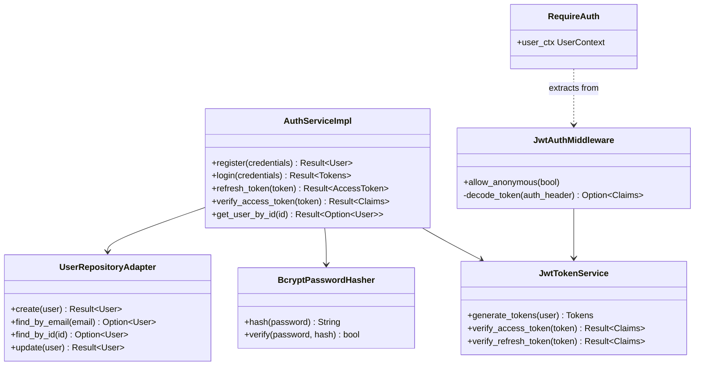
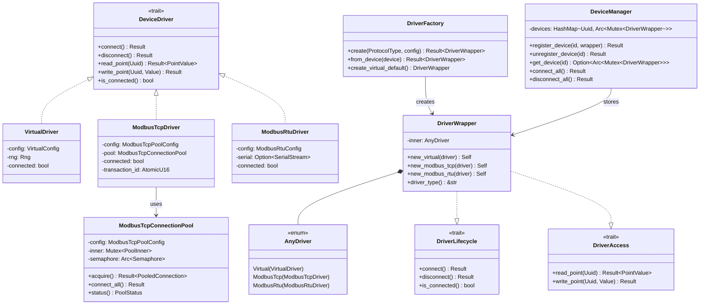
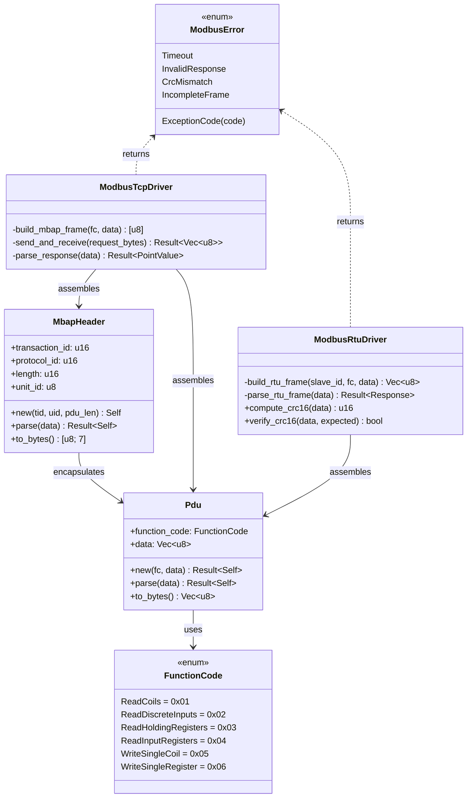
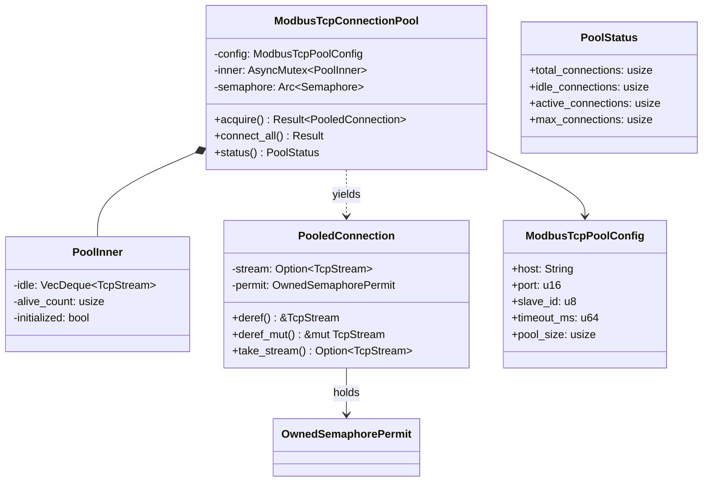
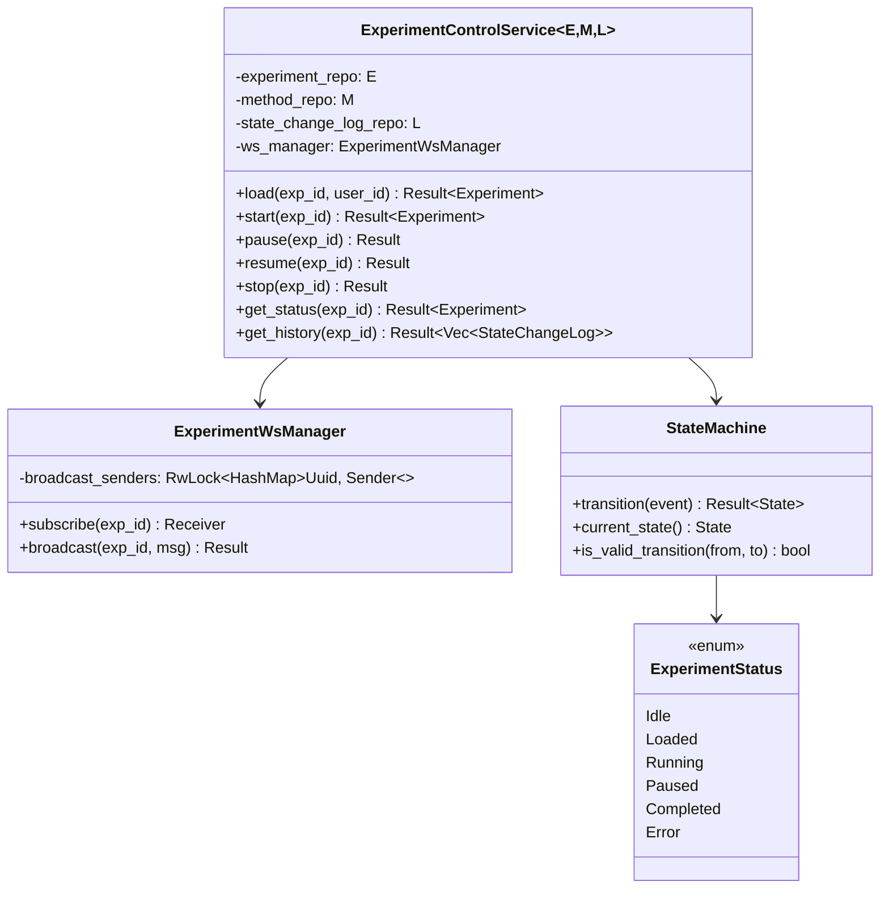
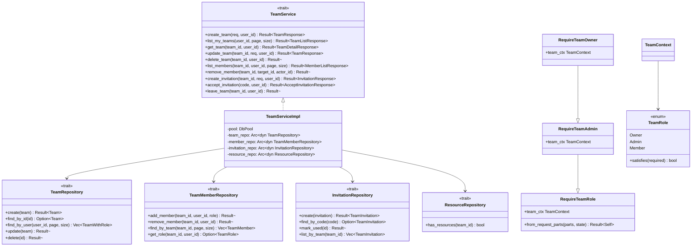
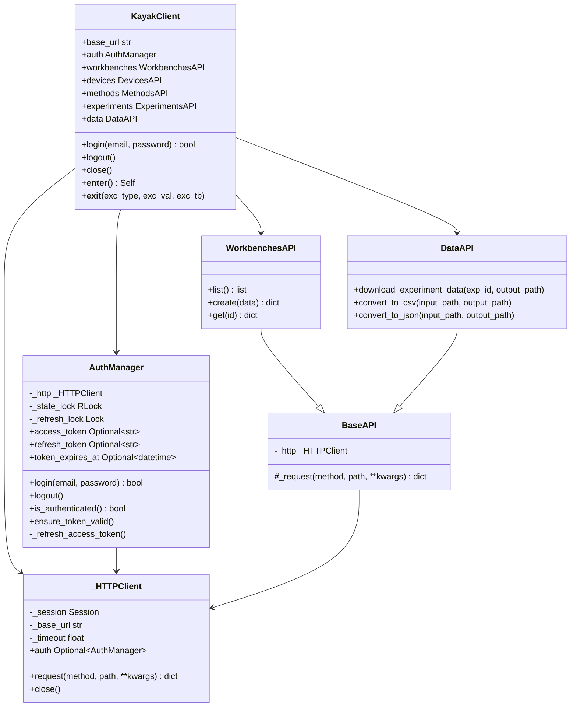
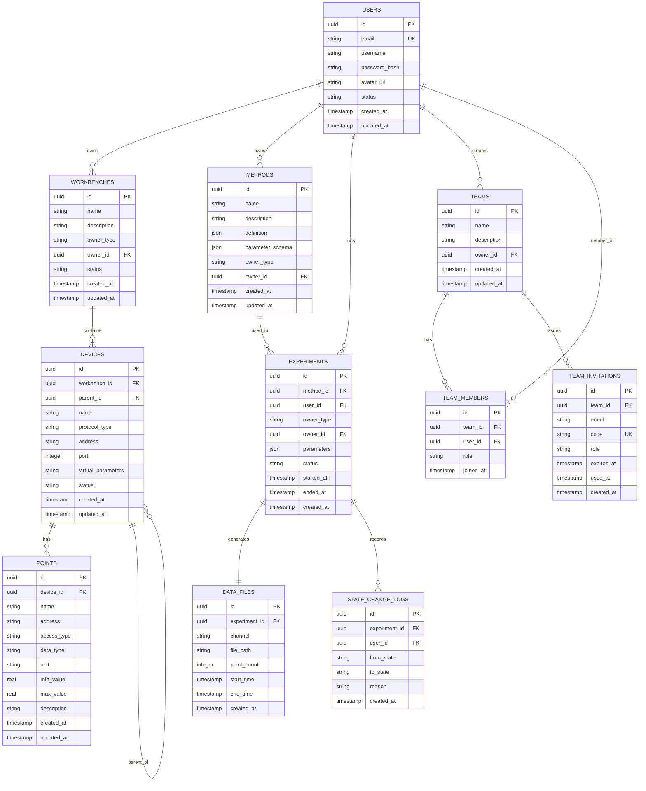

# Kayak 科学研究支持软件 - 架构设计文档

**版本**: 1.3  
**日期**: 2026-05-11  
**状态**: Active (Release 2 实时架构)

---

## 目录

1. [概述](#1-概述)
2. [架构原则](#2-架构原则)
3. [系统架构](#3-系统架构)
4. [模块设计](#4-模块设计)
5. [数据架构](#5-数据架构)
6. [API设计](#6-api设计)
7. [部署架构](#7-部署架构)
8. [技术栈](#8-技术栈)
9. [目录结构](#9-目录结构)
10. [关键设计决策](#10-关键设计决策)
11. [附录](#11-附录)

---

## 1. 概述

### 1.1 文档目的
本文档定义了Kayak科学研究支持软件的整体架构设计，为开发团队提供技术指导和约束。
当前版本反映 Release 1 已实现的实时架构。

### 1.2 适用范围
本文档适用于Release 0、Release 1及Release 2的已实现架构，并为后续Release提供演进基线。

### 1.3 术语定义
- **Workbench**: 工作台，仪器的逻辑分组
- **Device**: 设备，试验仪器的抽象表示
- **Point**: 测点，设备的具体读写单元
- **Method**: 试验方法，定义实验过程的脚本
- **Experiment**: 一次具体的试验执行实例
- **MBAP**: Modbus Application Protocol Header，Modbus TCP的7字节帧头
- **PDU**: Protocol Data Unit，Modbus协议数据单元
- **CRC16**: 16-bit Cyclic Redundancy Check，Modbus RTU帧校验算法

### 1.4 Release 1 已实现特性
- ✅ 用户认证与授权（JWT + bcrypt）
- ✅ 工作台/设备/测点管理（CRUD全API）
- ✅ Virtual 虚拟设备驱动（Random/Fixed/Sine/Ramp模式）
- ✅ Modbus TCP 协议驱动（FC01-FC06，连接池）
- ✅ Modbus RTU 协议驱动（串口，CRC16校验）
- ✅ Modbus TCP 模拟器（CLI工具，TOML配置）
- ✅ 试验方法编辑与执行引擎
- ✅ 数据采集与HDF5存储
- ✅ Material Design 3 全新UI（深色/浅色主题，#1976D2主色）
- ✅ Web模式部署（Flutter Web + 单端口服务）

### 1.5 Release 2 已实现特性
- ✅ 团队管理模块（Team CRUD、成员管理、角色权限）
- ✅ 团队邀请系统（32字符 Base64URL 安全邀请码，7天过期）
- ✅ 资源隔离（`scope`/`team_id` 查询参数，`owner_type`/`owner_id` 所有权列）
- ✅ `RequireTeamRole` Axum 提取器（DB角色验证，Owner/Admin/Member层级）
- ✅ 前端团队功能（团队列表/详情页、AppBar团队选择器、所有权选择器）
- ✅ Python SDK（`KayakClient` 上下文管理器、`AuthManager` 自动Token刷新、资源API）
- ✅ 试验数据查询与下载API（数据点历史、HDF5数据文件下载）
- ✅ 团队路由与面包屑导航支持

---

## 2. 架构原则

### 2.1 核心原则
1. **前后端分离**: 清晰的前后端职责边界，通过RESTful API和WebSocket通信
2. **插件化驱动**: 设备协议以驱动程序实现，通过 `AnyDriver` 枚举统一封装
3. **单端口部署**: 后端8080端口同时提供API和前端静态文件，降低部署复杂度
4. **Web优先**: 默认使用 Flutter Web 部署，支持桌面/移动扩展
5. **数据驱动**: HDF5作为科学数据核心存储，SQLite作为元数据索引
6. **类型安全**: 前后端均使用强类型语言（Dart/Rust）
7. **接口驱动**: 先定义trait/接口，后实现具体类型，遵循DIP

### 2.2 设计约束
- 支持离线运行（桌面部署模式）
- 最小化外部依赖（SQLite无需外部服务）
- 向后兼容的API版本控制
- 资源占用最小化（支持嵌入式场景）
- Web部署产物 < 20MB（gzip）

---

## 3. 系统架构

### 3.1 总体架构图（Release 2 实时）

```
┌─────────────────────────────────────────────────────────────────────────────┐
│                              Kayak Platform (R2)                             │
├─────────────────────────────────────────────────────────────────────────────┤
│                                                                             │
│  ┌─────────────────────────────────────────────────────────────────────┐   │
│  │                   Presentation Layer (Flutter Web/Dart)              │   │
│  │  ┌──────────────┐  ┌──────────────┐  ┌──────────────┐               │   │
│  │  │   Flutter    │  │   Flutter    │  │   Flutter    │               │   │
│  │  │   Web ★      │  │   Desktop    │  │   Mobile*    │               │   │
│  │  └──────┬───────┘  └──────┬───────┘  └──────┬───────┘               │   │
│  │         │                 │                 │                        │   │
│  │         └─────────────────┴─────────────────┘                        │   │
│  │                         │                                            │   │
│  │              HTTP (REST) / WebSocket / Static Files                 │   │
│  │                    All served on port 8080                            │   │
│  └─────────────────────────┬────────────────────────────────────────────┘   │
│                            │                                                │
│  ┌─────────────────────────▼────────────────────────────────────────────┐   │
│  │                    Single-Port Server (Axum + Tower)                  │   │
│  │  ┌──────────────┐  ┌──────────────┐  ┌──────────────┐               │   │
│  │  │   REST API   │  │  WebSocket   │  │  Static File │               │   │
│  │  │   (Axum)     │  │  (Real-time) │  │  (Flutter)   │               │   │
│  │  └──────────────┘  └──────────────┘  └──────────────┘               │   │
│  │  ┌──────────────┐  ┌────────────────────────────────┐              │   │
│  │  │  Auth (JWT)  │  │  Team Auth (RequireTeamRole)   │              │   │
│  │  │  RequireAuth │  │  Owner/Admin/Member DB verify  │              │   │
│  │  └──────────────┘  └────────────────────────────────┘              │   │
│  └─────────────────────────┬────────────────────────────────────────────┘   │
│                            │                                                │
│  ┌─────────────────────────▼────────────────────────────────────────────┐   │
│  │                      Service Layer                                    │   │
│  │  ┌────────────┐ ┌────────────┐ ┌────────────┐ ┌────────────┐        │   │
│  │  │ Instrument │ │  Method    │ │ Experiment │ │   Data     │        │   │
│  │  │  Service   │ │  Service   │ │  Service   │ │  Service   │        │   │
│  │  └────────────┘ └────────────┘ └────────────┘ └────────────┘        │   │
│  │  ┌────────────┐ ┌────────────┐ ┌────────────┐ ┌────────────┐        │   │
│  │  │    Auth    │ │   Point    │ │   Team     │ │ Experiment │        │   │
│  │  │  Service   │ │  Service   │ │  Service   │ │   Query    │        │   │
│  │  └────────────┘ └────────────┘ └────────────┘ └────────────┘        │   │
│  └─────────────────────────┬────────────────────────────────────────────┘   │
│                            │                                                │
│  ┌─────────────────────────▼────────────────────────────────────────────┐   │
│  │                    Device Driver Layer                                │   │
│  │                                                                       │   │
│  │  ┌─────────────────────────────────────────────────────────────┐     │   │
│  │  │                    DeviceManager                             │     │   │
│  │  │   HashMap<Uuid, Arc<Mutex<DriverWrapper>>>                   │     │   │
│  │  └──────────────────────────┬──────────────────────────────────┘     │   │
│  │                             │                                         │   │
│  │  ┌──────────────────────────▼──────────────────────────────────┐     │   │
│  │  │                    DriverWrapper                             │     │   │
│  │  │   impl DriverLifecycle + DriverAccess                       │     │   │
│  │  └──────────────────────────┬──────────────────────────────────┘     │   │
│  │                             │                                         │   │
│  │  ┌──────────────────────────▼──────────────────────────────────┐     │   │
│  │  │                    AnyDriver (enum)                          │     │   │
│  │  │  ┌────────────┐ ┌──────────────┐ ┌──────────────┐           │     │   │
│  │  │  │  Virtual   │ │  ModbusTcp   │ │  ModbusRtu   │           │     │   │
│  │  │  │   Driver   │ │   Driver     │ │   Driver     │           │     │   │
│  │  │  │            │ │  + Pool      │ │  + CRC16     │           │     │   │
│  │  │  └────────────┘ └──────────────┘ └──────────────┘           │     │   │
│  │  └─────────────────────────────────────────────────────────────┘     │   │
│  │                                                                       │   │
│  │  ┌─────────────────────────────────────────────────────────────┐     │   │
│  │  │               DriverFactory (from config)                    │     │   │
│  │  │   ProtocolType → DriverWrapper                              │     │   │
│  │  └─────────────────────────────────────────────────────────────┘     │   │
│  └───────────────────────────────────────────────────────────────────────┘   │
│                                                                             │
│  ┌─────────────────────────────────────────────────────────────────────┐   │
│  │                       External Tools                                 │   │
│  │  ┌──────────────────────┐  ┌──────────────────────┐                │   │
│  │  │  modbus-simulator    │  │  Python SDK Client   │                │   │
│  │  │  (bin/modbus-sim)    │  │  (kayak-python-cli)  │                │   │
│  │  └──────────────────────┘  └──────────────────────┘                │   │
│  └─────────────────────────────────────────────────────────────────────┘   │
│                                                                             │
│  ┌─────────────────────────────────────────────────────────────────────┐   │
│  │                       Data Layer                                     │   │
│  │  ┌──────────────┐  ┌──────────────┐  ┌──────────────┐               │   │
│  │  │   SQLite     │  │    HDF5      │  │   Config     │               │   │
│  │  │  (Metadata)  │  │   (Data)     │  │   (Files)    │               │   │
│  │  │  + Teams     │  │              │  │              │               │   │
│  │  └──────────────┘  └──────────────┘  └──────────────┘               │   │
│  └─────────────────────────────────────────────────────────────────────┘   │
│                                                                             │
└─────────────────────────────────────────────────────────────────────────────┘

★ = Release 2 默认部署目标（Web）
* = 已规划但Release 2未实现
```

### 3.2 分层架构说明

#### 3.2.1 表示层 (Presentation Layer)
- **Flutter Web** ★ (默认): 浏览器访问的Web应用，作为R1主要部署目标
- **Flutter Desktop**: Windows、macOS、Linux原生应用
- **UI规范**: Material Design 3，主色 #1976D2（科技蓝），深色/浅色双主题
- **状态管理**: Riverpod (`flutter_riverpod`)，全局共享ThemeMode等状态

#### 3.2.2 单端口服务层 (Single-Port Server)
- **REST API**: 基于Axum的HTTP API服务，所有路由以 `/api/v1/` 为前缀
- **WebSocket**: 实时数据推送（试验状态），路由为 `/ws/experiments/{id}`
- **静态文件**: tower-http ServeDir提供Flutter Web构建产物，SPA fallback至index.html
- **认证**: JWT Token通过 `RequireAuth` 提取器进行路由级保护，`JwtAuthMiddleware` 注入UserContext

#### 3.2.3 服务层 (Service Layer)
核心业务逻辑，按领域划分为独立服务（全部通过trait抽象）：
- **Device Service**: 设备的CRUD、连接/断开管理、连接测试
- **Workbench Service**: 工作台CRUD（支持 `owner_type`/`owner_id` 资源隔离）
- **Point Service**: 测点CRUD与值读写
- **Method Service**: 试验方法定义和存储（支持团队所有权）
- **Experiment Control Service**: 试验执行和状态机管理
- **Experiment Query Service**: 试验列表查询（支持 `scope`/`team_id` 过滤）
- **Experiment Data Service**: 试验数据查询与HDF5文件下载
- **Auth Service**: 用户注册、登录、Token刷新、用户查询
- **User Service**: 用户资料管理
- **Team Service**: 团队CRUD、成员管理、邀请管理、角色权限控制

#### 3.2.4 设备驱动层 (Device Driver Layer)
采用**枚举类型擦除**模式统一管理异构驱动：

```
DriverFactory (创建) → DriverWrapper (统一接口) → AnyDriver (枚举分发)
                                                       ├── VirtualDriver
                                                       ├── ModbusTcpDriver
                                                       └── ModbusRtuDriver

DeviceManager: HashMap<Uuid, Arc<Mutex<DriverWrapper>>>
              └── 存储所有设备驱动实例
```

关键组件：
- **AnyDriver**: Rust enum 枚举所有驱动类型（编译时分发，零运行时开销）
- **DriverWrapper**: 为 AnyDriver 提供统一的 `DriverLifecycle` + `DriverAccess` 接口
- **DriverLifecycle trait**: 连接/断开/状态查询等可变操作
- **DriverAccess trait**: 引擎使用的只读访问接口（read_point/write_point）
- **DriverFactory**: 根据 `ProtocolType` + JSON配置创建对应驱动
- **DeviceManager**: 全局单例（Arc），管理所有设备的注册/注销/连接生命周期

#### 3.2.5 数据层 (Data Layer)
- **SQLite**: 关系型元数据存储（sqlx ORM + 迁移）
- **HDF5**: 科学数据文件存储（hdf5-rust）
- **Config Files**: TOML/JSON/YAML配置文件

---

## 4. 模块设计

### 4.1 模块依赖关系（Release 2 实时）

```
kayak-backend/src/
├── main.rs                     # 应用入口：初始化DB/路由/中间件
├── lib.rs                      # 库导出
├── api/
│   ├── mod.rs
│   ├── routes.rs               # 路由定义 → create_router(pool)
│   ├── handlers/               # HTTP请求处理器
│   │   ├── mod.rs
│   │   ├── auth.rs
│   │   ├── device.rs           # 设备CRUD + connect/disconnect/status
│   │   ├── experiment.rs       # 试验查询（scope/team_id过滤）
│   │   ├── experiment_control.rs
│   │   ├── experiment_data.rs  # NEW R2: 试验数据查询与下载
│   │   ├── experiment_ws.rs    # WebSocket handler
│   │   ├── health.rs
│   │   ├── method.rs
│   │   ├── point.rs
│   │   ├── protocol.rs         # 协议列表 + 串口扫描
│   │   ├── teams.rs            # NEW R2: 团队管理API (10端点)
│   │   ├── user.rs
│   │   └── workbench.rs
│   └── middleware/
│       ├── mod.rs
│       ├── auth.rs
│       ├── error.rs
│       └── log.rs
├── auth/
│   ├── handlers.rs
│   ├── middleware.rs            # JwtAuthMiddleware + AuthLayer
│   │   └── require_team_role.rs # NEW R2: RequireTeamRole/Admin/Owner提取器
│   ├── services.rs              # AuthServiceImpl
│   ├── traits.rs
│   └── user_repo_adapter.rs
├── services/
│   ├── device/
│   │   ├── mod.rs               # DeviceService trait
│   │   ├── device_service.rs    # DeviceServiceImpl
│   │   └── point_service.rs
│   ├── experiment_control.rs
│   ├── experiment_data.rs       # NEW R2: ExperimentDataService
│   ├── experiment_query.rs      # NEW R2: ExperimentQueryService (scope过滤)
│   ├── method_service.rs
│   ├── team/                    # NEW R2: 团队管理模块
│   │   ├── mod.rs               # TeamService trait
│   │   ├── service.rs           # TeamServiceImpl
│   │   ├── repository.rs        # Team/Member/Invitation/Resource Repository traits
│   │   └── error.rs             # TeamServiceError
│   ├── user/
│   └── workbench/
├── drivers/
│   ├── mod.rs
│   ├── core.rs                  # DeviceDriver trait + PointValue等类型
│   ├── error.rs                 # DriverError, VirtualConfigError
│   ├── factory.rs               # DriverFactory
│   ├── lifecycle.rs             # DriverLifecycle trait
│   ├── manager.rs               # DeviceManager
│   ├── wrapper.rs               # AnyDriver enum + DriverWrapper
│   ├── virtual.rs               # VirtualDriver
│   └── modbus/
│       ├── mod.rs
│       ├── constants.rs         # Modbus协议常量
│       ├── error.rs             # ModbusError, ModbusException
│       ├── mbap.rs              # MBAP帧头 (7字节)
│       ├── pdu.rs               # PDU协议数据单元
│       ├── pool.rs              # ModbusTcpConnectionPool
│       ├── rtu.rs               # ModbusRtuDriver (CRC16)
│       ├── tcp.rs               # ModbusTcpDriver
│       └── types.rs             # 数据类型定义
├── models/
│   ├── entities/                # 数据库实体（sqlx::FromRow）
│   │   └── team.rs              # NEW R2: Team, TeamMember, TeamInvitation, TeamRole
│   ├── dto/                     # API数据传输对象
│   │   └── team_dto.rs          # NEW R2: Team request/response DTOs
│   └── domain/                  # 领域模型
├── db/
│   ├── connection.rs            # 表初始化（含teams/team_members/team_invitations）
│   ├── migrations/
│   └── repository/              # 数据访问层（Sqlx*Repository）
├── engine/                      # 试验执行引擎
├── core/
│   ├── config.rs                # AppConfig
│   ├── error.rs                 # ApiResponse, AppError
│   ├── log.rs
│   └── utils.rs
├── bin/
│   └── modbus-simulator/        # CLI工具
│       ├── main.rs
│       ├── server.rs            # TCP服务器实现 (FC01/FC03)
│       └── config.rs            # CLI参数 + TOML配置
└── state_machine.rs             # 试验状态机
```

### 4.2 核心模块详细设计

#### 4.2.1 认证模块 (Auth Service) — Release 1 实时



**认证流程**:
1. `JwtAuthMiddleware` 从请求头提取Bearer Token，解码JWT Claims，注入到 `request.extensions`
2. `RequireAuth` 提取器从extensions中获取 `UserContext`（含 user_id, email, username）
3. 受保护路由通过 `RequireAuth(_user_ctx): RequireAuth` 参数强制认证
4. 公开端点（login/register/health）通过 `allow_anonymous(true)` 豁免

#### 4.2.2 设备驱动架构 (Device Driver Layer) — Release 1 核心设计

这是 Release 1 最关键的架构变更，采用**枚举类型擦除**模式管理异构驱动。



**架构决策要点**:

1. **AnyDriver 枚举代替 trait object**: 使用Rust ADT（枚举）而非 `Box<dyn DeviceDriver>` 实现类型擦除，获得编译时分发和零运行时开销。

2. **DriverLifecycle 与 DriverAccess 分离**: 
   - `DriverLifecycle`: 需要 `&mut self` 的操作（connect/disconnect），由 `DeviceManager` 通过 `Mutex<DriverWrapper>` 控制并发
   - `DriverAccess`: 只需 `&self` 的读取操作，由试验引擎使用

3. **DriverWrapper 双重trait实现**:
   ```rust
   // 对外暴露统一接口
   impl DriverLifecycle for DriverWrapper { ... }  // match AnyDriver
   impl DriverAccess for DriverWrapper { ... }      // match AnyDriver
   ```

4. **DeviceManager 存储模式**: `HashMap<Uuid, Arc<Mutex<DriverWrapper>>>` — Mutex确保连接操作互斥，Arc支持多引用共享。

#### 4.2.3 Modbus 协议实现架构



**Modbus TCP 帧结构**:
```
┌──────────┬──────────┬──────────┬──────────┬──────────┬──────────┬──────────┬────────────┐
│ TID High │ TID Low  │ PID High │ PID Low  │ Len High │ Len Low  │ Unit ID  │   PDU...   │
│  byte 0  │  byte 1  │  byte 2  │  byte 3  │  byte 4  │  byte 5  │  byte 6  │ bytes 7..  │
└──────────┴──────────┴──────────┴──────────┴──────────┴──────────┴──────────┴────────────┘
◄────────────────────────── MBAP Header (7 bytes) ──────────────────────►◄── PDU ────►
```

**Modbus RTU 帧结构**:
```
┌──────────┬──────────┬──────────────┬──────────┬──────────┐
│ Slave ID │  Func.   │   Data...    │ CRC Low  │ CRC High │
│  1 byte  │  1 byte  │  N bytes     │  1 byte  │  1 byte  │
└──────────┴──────────┴──────────────┴──────────┴──────────┘
```

**CRC16-MODBUS算法**:
- 多项式: 0xA001（反射形式，对应0x8005）
- 初始值: 0xFFFF
- 低字节在前（little-endian输出）
- 通过3组标准测试向量验证

#### 4.2.4 Modbus TCP 连接池



**连接池设计**:
- **并发控制**: `tokio::sync::Semaphore`，容量 = `pool_size`（可配置，默认4）
- **空闲队列**: `VecDeque<TcpStream>` FIFO管理空闲连接
- **RAII归还**: `PooledConnection` Drop时自动归还连接到 VecDeque 并释放 Semaphore permit
- **断线丢弃**: TcpStream可读错误时自动丢弃连接，不影响池中其他连接
- **惰性初始化**: 首次 `acquire()` 时自动调用 `connect_all()` 预建连接

#### 4.2.5 试验执行模块 (Experiment Service)



#### 4.2.6 团队管理模块 (Team Service) — Release 2 新增

团队管理模块采用**接口驱动设计**，定义了4个仓储trait和1个服务trait，支持团队CRUD、成员管理、邀请系统和基于角色的资源隔离。



**团队角色层级**:
- **Owner**: 创建者，拥有所有权限（删除团队、移除任何成员）
- **Admin**: 管理员，可更新团队信息、创建邀请、移除Member
- **Member**: 普通成员，可查看团队、接受邀请、离开团队

**角色满足关系**: `Owner ≥ Admin ≥ Member`。提取器使用数据库查询验证成员身份，而非仅依赖JWT Claims。

**邀请码安全设计**:
- 32字符 Base64URL 编码随机字符串
- 7天过期时间（`expires_at`）
- 一次性使用（`used_at` 标记）
- 数据库唯一索引防止碰撞

**资源隔离检查**:
- 删除团队前检查是否存在关联资源（experiments, workbenches, methods）
- 通过 `ResourceRepository::has_resources()` 统一查询

---

### 4.3 Python SDK 架构 — Release 2 新增

Python SDK (`kayak-python-client/`) 提供对 Kayak REST API 的编程访问，支持自动认证、Token刷新和资源操作。



**SDK设计要点**:
1. **上下文管理器**: `with KayakClient(...) as client:` 自动处理登录/登出和资源释放
2. **自动Token刷新**: `AuthManager` 在Token过期前5分钟自动调用 `/auth/refresh` 端点
3. **线程安全**: 使用 `RLock` 保护认证状态，`Lock` 防止并发刷新请求
4. **懒加载Token验证**: 每次HTTP请求前检查Token有效性，仅在需要时刷新
5. **数据转换**: `DataAPI` 支持HDF5文件下载并转换为CSV/JSON格式
6. **测试覆盖**: 56个测试用例，89%代码覆盖率

---

## 5. 数据架构

### 5.1 数据库Schema

#### 5.1.1 ER图



#### 5.1.2 核心表结构

```sql
-- 用户表
CREATE TABLE users (
    id TEXT PRIMARY KEY,
    email TEXT NOT NULL UNIQUE,
    password_hash TEXT NOT NULL,
    username TEXT,
    avatar_url TEXT,
    status TEXT DEFAULT 'active' CHECK (status IN ('active', 'inactive', 'banned')),
    created_at TEXT NOT NULL,
    updated_at TEXT NOT NULL
);
CREATE INDEX idx_users_email ON users(email);

-- 团队表
CREATE TABLE teams (
    id TEXT PRIMARY KEY NOT NULL,
    name TEXT NOT NULL,
    description TEXT,
    owner_id TEXT NOT NULL,
    created_at TEXT NOT NULL,
    updated_at TEXT NOT NULL,
    FOREIGN KEY (owner_id) REFERENCES users(id) ON DELETE RESTRICT
);
CREATE INDEX idx_teams_owner ON teams(owner_id);
CREATE INDEX idx_teams_name ON teams(name);

-- 团队成员表
CREATE TABLE team_members (
    id TEXT PRIMARY KEY NOT NULL,
    team_id TEXT NOT NULL,
    user_id TEXT NOT NULL,
    role TEXT NOT NULL CHECK (role IN ('Owner', 'Admin', 'Member')),
    joined_at TEXT NOT NULL,
    FOREIGN KEY (team_id) REFERENCES teams(id) ON DELETE CASCADE,
    FOREIGN KEY (user_id) REFERENCES users(id) ON DELETE CASCADE,
    UNIQUE(team_id, user_id)
);
CREATE INDEX idx_team_members_team ON team_members(team_id);
CREATE INDEX idx_team_members_user ON team_members(user_id);
CREATE INDEX idx_team_members_role ON team_members(team_id, role);

-- 团队邀请表
CREATE TABLE team_invitations (
    id TEXT PRIMARY KEY NOT NULL,
    team_id TEXT NOT NULL,
    email TEXT NOT NULL,
    code TEXT NOT NULL UNIQUE,
    role TEXT NOT NULL CHECK (role IN ('Admin', 'Member')),
    expires_at TEXT NOT NULL,
    used_at TEXT,
    created_at TEXT NOT NULL,
    FOREIGN KEY (team_id) REFERENCES teams(id) ON DELETE CASCADE
);
CREATE INDEX idx_invitations_code ON team_invitations(code);
CREATE INDEX idx_invitations_team ON team_invitations(team_id);
CREATE INDEX idx_invitations_expires ON team_invitations(expires_at);

-- 工作台表
CREATE TABLE workbenches (
    id TEXT PRIMARY KEY,
    name TEXT NOT NULL,
    description TEXT,
    owner_id TEXT NOT NULL,
    owner_type TEXT DEFAULT 'personal' CHECK (owner_type IN ('personal', 'team')),
    status TEXT DEFAULT 'active' CHECK (status IN ('active', 'archived', 'deleted')),
    created_at TEXT NOT NULL,
    updated_at TEXT NOT NULL,
    FOREIGN KEY (owner_id) REFERENCES users(id) ON DELETE CASCADE
);
CREATE INDEX idx_workbenches_owner ON workbenches(owner_id, owner_type);
CREATE INDEX idx_workbenches_status ON workbenches(status);

-- 设备表（支持嵌套）
CREATE TABLE devices (
    id TEXT PRIMARY KEY,
    workbench_id TEXT NOT NULL,
    parent_id TEXT,
    name TEXT NOT NULL,
    protocol_type TEXT NOT NULL,
    address TEXT,
    port INTEGER,
    virtual_parameters TEXT,
    status TEXT DEFAULT 'offline',
    created_at TEXT NOT NULL,
    updated_at TEXT NOT NULL,
    FOREIGN KEY (workbench_id) REFERENCES workbenches(id) ON DELETE CASCADE,
    FOREIGN KEY (parent_id) REFERENCES devices(id) ON DELETE SET NULL
);

-- 测点表
CREATE TABLE points (
    id TEXT PRIMARY KEY,
    device_id TEXT NOT NULL,
    name TEXT NOT NULL,
    address TEXT NOT NULL,
    access_type TEXT NOT NULL CHECK (access_type IN ('RO', 'WO', 'RW')),
    data_type TEXT NOT NULL CHECK (data_type IN ('BOOLEAN', 'INTEGER', 'NUMBER', 'STRING')),
    unit TEXT,
    min_value REAL,
    max_value REAL,
    description TEXT,
    created_at TEXT NOT NULL,
    updated_at TEXT NOT NULL,
    FOREIGN KEY (device_id) REFERENCES devices(id) ON DELETE CASCADE
);

-- 试验方法表
CREATE TABLE methods (
    id TEXT PRIMARY KEY,
    name TEXT NOT NULL,
    description TEXT,
    definition TEXT NOT NULL,
    parameter_schema TEXT NOT NULL DEFAULT '{}',
    owner_type TEXT NOT NULL,
    owner_id TEXT NOT NULL,
    created_at TEXT NOT NULL,
    updated_at TEXT NOT NULL
);

-- 试验记录表
CREATE TABLE experiments (
    id TEXT PRIMARY KEY,
    method_id TEXT REFERENCES methods(id),
    user_id TEXT NOT NULL REFERENCES users(id),
    owner_type TEXT NOT NULL,
    owner_id TEXT NOT NULL,
    parameters TEXT NOT NULL DEFAULT '{}',
    status TEXT NOT NULL CHECK (status IN ('idle', 'loaded', 'running', 'paused', 'completed', 'error')),
    started_at TEXT,
    ended_at TEXT,
    error_message TEXT,
    created_at TEXT NOT NULL
);
CREATE INDEX idx_experiments_user ON experiments(user_id);
CREATE INDEX idx_experiments_status ON experiments(status);

-- 状态变更日志表
CREATE TABLE state_change_logs (
    id TEXT PRIMARY KEY,
    experiment_id TEXT NOT NULL REFERENCES experiments(id) ON DELETE CASCADE,
    user_id TEXT NOT NULL REFERENCES users(id),
    from_state TEXT NOT NULL,
    to_state TEXT NOT NULL,
    reason TEXT,
    created_at TEXT NOT NULL
);
CREATE INDEX idx_state_change_logs_experiment ON state_change_logs(experiment_id);

-- 数据文件元信息表
CREATE TABLE data_files (
    id TEXT PRIMARY KEY,
    experiment_id TEXT NOT NULL REFERENCES experiments(id) ON DELETE CASCADE,
    channel TEXT NOT NULL,
    file_path TEXT NOT NULL,
    point_count INTEGER NOT NULL,
    start_time TEXT,
    end_time TEXT,
    created_at TEXT NOT NULL
);
```

### 5.2 HDF5文件结构

```
experiment_{id}.h5
├── @metadata (属性组)
│   ├── experiment_id
│   ├── method_id
│   ├── user_id
│   ├── parameters (JSON)
│   ├── start_time
│   └── end_time
│
├── raw_data (组)
│   ├── {device_id} (组)
│   │   ├── {point_id} (数据集: Nx2, [timestamp, value])
│   │   └── {point_id}_meta (属性: unit, data_type)
│   │   └── ...
│   └── ...
│
├── parameters (组)
│   └── config (数据集: 参数表的快照)
│
├── logs (组)
│   ├── control_actions (数据集: 操作日志)
│   │   └── [timestamp, action, user_id, details]
│   └── errors (数据集: 错误日志)
│       └── [timestamp, level, message, context]
│
└── processed (组，预留)
    └── ...
```

---

## 6. API设计

### 6.1 RESTful API规范

#### 6.1.1 响应格式
```json
{
  "code": 200,
  "message": "success",
  "data": { ... },
  "timestamp": "2024-03-15T10:30:00Z"
}
```

#### 6.1.2 错误响应
```json
{
  "code": 400,
  "message": "Validation failed",
  "errors": [
    {"field": "email", "message": "Invalid email format"}
  ],
  "timestamp": "2024-03-15T10:30:00Z"
}
```

### 6.2 API端点概览（Release 2 实时）

#### 认证 API
```
POST   /api/v1/auth/register
POST   /api/v1/auth/login
POST   /api/v1/auth/refresh
GET    /api/v1/auth/me
```

#### 用户 API
```
GET    /api/v1/users/me
PUT    /api/v1/users/me
POST   /api/v1/users/me/password
```

#### 团队 API ← NEW R2
```
GET    /api/v1/teams                    ← 列出我参与的团队
POST   /api/v1/teams                    ← 创建团队（自动成为Owner）
GET    /api/v1/teams/:id                ← 获取团队详情（需成员）
PUT    /api/v1/teams/:id                ← 更新团队（需Admin+）
DELETE /api/v1/teams/:id                ← 删除团队（需Owner）
GET    /api/v1/teams/:id/members        ← 列出成员（需成员）
DELETE /api/v1/teams/:id/members/:user_id  ← 移除成员（需Admin+）
POST   /api/v1/teams/:id/invitations    ← 创建邀请（需Admin+）
POST   /api/v1/teams/:id/leave          ← 离开团队
POST   /api/v1/invitations/:code/accept ← 接受邀请
```

#### 工作台 API
```
GET    /api/v1/workbenches
POST   /api/v1/workbenches
GET    /api/v1/workbenches/{id}
PUT    /api/v1/workbenches/{id}
DELETE /api/v1/workbenches/{id}
```

#### 设备 API
```
GET    /api/v1/workbenches/{workbench_id}/devices
POST   /api/v1/workbenches/{workbench_id}/devices
GET    /api/v1/devices/{id}
PUT    /api/v1/devices/{id}
DELETE /api/v1/devices/{id}
POST   /api/v1/devices/{id}/test-connection    ← NEW R1
POST   /api/v1/devices/{id}/connect            ← NEW R1
POST   /api/v1/devices/{id}/disconnect         ← NEW R1
GET    /api/v1/devices/{id}/status             ← NEW R1
```

#### 测点 API
```
GET    /api/v1/devices/{device_id}/points
POST   /api/v1/devices/{device_id}/points
GET    /api/v1/points/{id}
PUT    /api/v1/points/{id}
DELETE /api/v1/points/{id}
GET    /api/v1/points/{id}/value
PUT    /api/v1/points/{id}/value
```

#### 试验方法 API
```
GET    /api/v1/methods
POST   /api/v1/methods
POST   /api/v1/methods/validate
GET    /api/v1/methods/{id}
PUT    /api/v1/methods/{id}
DELETE /api/v1/methods/{id}
```

#### 试验查询 API ← NEW/UPDATED R2
```
GET    /api/v1/experiments              ← 列表（支持 ?scope=personal|team|all & ?team_id=）
GET    /api/v1/experiments/:id          ← 详情（含所有权校验）
GET    /api/v1/experiments/:id/points/:channel/history  ← 测点历史数据
GET    /api/v1/experiments/:id/data-file                ← 下载HDF5数据文件
```

#### 试验控制 API
```
POST   /api/v1/experiments/:id/load
POST   /api/v1/experiments/:id/start
POST   /api/v1/experiments/:id/pause
POST   /api/v1/experiments/:id/resume
POST   /api/v1/experiments/:id/stop
GET    /api/v1/experiments/:id/status
GET    /api/v1/experiments/:id/history
```

#### 试验数据 API ← NEW R2
```
POST   /api/v1/experiments/:id/data/query  ← 查询试验数据（时间范围、聚合）
```

#### 数据文件 API
```
GET    /api/v1/data-files
GET    /api/v1/data-files/{id}
GET    /api/v1/data-files/{id}/download
DELETE /api/v1/data-files/{id}
```

#### 系统信息 API ← NEW R1
```
GET    /api/v1/protocols                   ← 支持的协议列表及config_schema
GET    /api/v1/system/serial-ports         ← 系统可用串口扫描
```

#### 健康检查
```
GET    /health                              ← 无认证
```

### 6.3 WebSocket API

#### 连接
```
WS /ws/experiments/{id}
```

#### 消息类型
```typescript
// 客户端 -> 服务端
interface SubscribeRequest {
  type: 'subscribe';
  channels: string[];  // ['experiment:status', 'point:values']
}

// 服务端 -> 客户端
interface StatusUpdate {
  type: 'status';
  experiment_id: string;
  state: 'idle' | 'running' | 'paused' | 'completed' | 'error';
  timestamp: string;
}

interface LogMessage {
  type: 'log';
  level: 'info' | 'warn' | 'error';
  message: string;
  timestamp: string;
}
```

---

## 7. 部署架构

### 7.1 单容器Web部署（Release 2 默认）

```
┌─────────────────────────────────────────────┐
│              Docker Container                │
│                                             │
│  ┌───────────────────────────────────────┐  │
│  │         Rust Backend (kayak-backend)  │  │
│  │         Listening on :8080            │  │
│  │                                       │  │
│  │  /api/v1/*    → REST API handlers     │  │
│  │  /ws/*        → WebSocket handlers    │  │
│  │  /health      → Health check endpoint │  │
│  │  /*           → Flutter Web static    │  │
│  │                 (SPA fallback)        │  │
│  └───────────────────────────────────────┘  │
│                  │                           │
│  ┌───────────────▼───────────────────────┐  │
│  │     Flutter Web Build (build/web/)    │  │
│  │     Served by tower-http ServeDir     │  │
│  └───────────────────────────────────────┘  │
│                  │                           │
│  ┌───────────────▼───────────────────────┐  │
│  │     SQLite: /app/data/kayak.db        │  │
│  │     HDF5: /app/data/*.h5               │  │
│  └───────────────────────────────────────┘  │
│                                             │
└─────────────────────────────────────────────┘
                    ▲
                    │ Port 8080
                    │
              ┌─────┴─────┐
              │  Browser  │
              └───────────┘
```

**路由优先级**: API路由 > WebSocket路由 > 静态文件（SPA fallback）

```rust
// routes.rs 核心逻辑
Router::new()
    .merge(api_router)       // /api/v1/*, /health, /ws/*
    .fallback_service(serve_dir)  // Flutter Web (SPA: 未匹配路由 → index.html)
```

**单端口优势**:
- 无需反向代理（nginx/Caddy），降低运维复杂度
- 无跨域问题（API与前端同源）
- 减少一个端口映射，简化防火墙配置

### 7.2 多阶段Docker构建

```dockerfile
# Dockerfile.single
FROM rust:1.75-slim as backend-builder       # 编译 Rust binary
FROM flutter:3.16-slim as frontend-builder    # 编译 Flutter Web
FROM debian:bookworm-slim                     # 运行时
COPY --from=backend-builder  kayak-backend /app/
COPY --from=frontend-builder build/web       /app/web/
CMD ["/app/kayak-backend"]
```

### 7.3 docker-compose.yml

```yaml
version: '3.8'
services:
  kayak:
    image: kayak:latest
    ports:
      - "8080:8080"
    volumes:
      - ./data:/app/data
    environment:
      - DATABASE_URL=sqlite:///app/data/kayak.db
      - KAYAK_SERVE_STATIC=/app/web
      - KAYAK_LOG_LEVEL=info
      - RUST_LOG=info
```

### 7.4 桌面完整部署

```yaml
# 架构: 单机嵌入式部署
Components:
  - Flutter Desktop App (UI)
  - Rust Backend (进程内或localhost HTTP服务)
  - SQLite (本地文件)
  - HDF5 (本地文件)

Communication:
  - 前端通过 localhost:8080 访问后端
  - 后端直接操作本地文件

Packaging:
  - Windows: .msi / .exe installer
  - macOS: .dmg / .app bundle
  - Linux: .deb / .rpm / AppImage
```

### 7.5 混合部署

```
┌─────────────────────┐         ┌─────────────────────────┐
│   Desktop Client    │         │     Server (Docker)     │
│                     │         │                         │
│  ┌───────────────┐  │         │  ┌───────────────────┐  │
│  │ Flutter App   │  │◀────────│  │   Rust Backend    │  │
│  └───────────────┘  │  HTTP   │  └───────────────────┘  │
│                     │         │           │             │
└─────────────────────┘         │     ┌─────┴─────┐       │
                                │     ▼           ▼       │
                                │ ┌───────┐   ┌────────┐  │
                                │ │SQLite │   │  HDF5  │  │
                                │ └───────┘   └────────┘  │
                                └─────────────────────────┘
```

---

## 8. 技术栈

### 8.1 后端技术栈

| 类别 | 技术 | 版本 | 用途 |
|------|------|------|------|
| 语言 | Rust | 1.75+ | 核心业务逻辑 |
| Web框架 | Axum | 0.7 | HTTP API |
| HTTP中间件 | Tower / tower-http | 0.4 / 0.5 | CORS, 压缩, 静态文件, 追踪 |
| 异步运行时 | Tokio | 1.35 | 异步IO |
| 数据库 | sqlx | 0.7 | ORM + 迁移 (SQLite) |
| 序列化 | serde + serde_json | 1.0 | JSON处理 |
| 时间 | chrono + time | 0.4 / 0.3 | 时间格式化与时区 |
| 密码 | bcrypt | 0.15 | 密码哈希 |
| JWT | jsonwebtoken | 9 | Token认证 |
| 配置 | config | 0.14 | 配置管理 |
| 日志 | tracing + tracing-subscriber | 0.1 / 0.3 | 结构化日志 |
| HDF5 | hdf5 | 0.8 | 科学数据存储 |
| 串口 | serialport + tokio-serial | 4.6 / 5.4 | Modbus RTU串口通信 |
| 随机数 | rand | 0.8 | Virtual驱动数据生成 |
| CLI | clap | 4 | modbus-simulator命令行参数 |
| TOML | toml | 0.8 | modbus-simulator配置文件 |
| 表达式 | evalexpr | 10 | 试验方法脚本表达式求值 |
| 错误处理 | thiserror | 1.0 | 派生错误类型 |
| UUID | uuid | 1.6 | 实体ID生成 |
| 环境变量 | dotenvy | 0.15 | .env文件加载 |
| 异步trait | async-trait | 0.1 | trait中async fn支持 |
| 并行 | futures / futures-util | 0.3 | 异步组合器 |
| 数值计算 | ndarray | 0.15 | 科学数据处理 |

### 8.2 前端技术栈

| 类别 | 技术 | 版本 | 用途 |
|------|------|------|------|
| 框架 | Flutter | 3.19+ | UI开发 |
| 语言 | Dart | 3.3+ | 编程语言 |
| 状态管理 | flutter_riverpod | 2.4 | 状态管理 (StateNotifierProvider) |
| 路由 | go_router | 13.2 | 声明式导航路由 |
| HTTP | dio | 5.4 | API请求 |
| WebSocket | web_socket_channel | 2.4 | 实时通信 |
| 本地存储 | shared_preferences | 2.2 | 配置存储（主题、语言） |
| 安全存储 | flutter_secure_storage | 9.0 | Token安全存储 |
| 国际化 | flutter_localizations + intl | - / 0.20 | 多语言支持 |
| 图表 | fl_chart | 0.66 | 数据可视化 |
| 图标 | material_design_icons_flutter | 7.0 | MD3图标扩展 |
| 响应式 | flutter_adaptive_scaffold | 0.1 | 自适应布局 |
| 函数式 | dartz | 0.10 | Either/Result类型 |
| 序列化 | json_annotation + freezed | 4.8 / 2.4 | JSON序列化 + 不可变数据类 |
| 桌面 | window_manager | 0.3 | 窗口管理（桌面平台） |
| 日志 | logger | 2.0 | 调试日志 |

### 8.3 开发工具

| 类别 | 工具 |
|------|------|
| 版本控制 | Git |
| CI/CD | GitHub Actions |
| 容器 | Docker + Docker Compose |
| 代码质量 | rustfmt, clippy, flutter_lints |
| 测试 | cargo test, flutter test, golden_toolkit |
| 文档 | rustdoc, dart doc |
| 模拟器 | modbus-simulator (CLI binary) |

---

## 9. 目录结构

### 9.1 项目根目录（Release 1 实时）

```
kayak/
├── README.md                       # 项目说明
├── LICENSE                         # 许可证
├── .gitignore                      # Git忽略规则
├── docker-compose.yml              # 容器编排
├── Dockerfile.single               # 单容器多阶段构建
├── arch.md                         # 本文档（架构设计）
├── task_plan.md                    # 总体任务规划
├── data/                           # 运行时数据目录
│   ├── kayak.db                    # SQLite数据库
│   └── *.h5                        # HDF5数据文件
│
├── kayak-backend/                  # Rust后端
│   ├── Cargo.toml
│   ├── Cargo.lock
│   ├── Dockerfile
│   ├── migrations/                 # 数据库迁移SQL
│   ├── src/
│   │   ├── main.rs                 # 应用入口
│   │   ├── lib.rs                  # 库导出
│   │   ├── api/                    # API层
│   │   │   ├── routes.rs           # 路由定义
│   │   │   ├── handlers/           # 请求处理器
│   │   │   └── middleware/         # 中间件
│   │   ├── auth/                   # 认证模块
│   │   ├── services/               # 业务服务层
│   │   ├── models/                 # 数据模型
│   │   │   ├── entities/           # 数据库实体
│   │   │   ├── dto/                # API DTO
│   │   │   └── domain/             # 领域模型
│   │   ├── drivers/                # 设备驱动层
│   │   │   ├── core.rs             # DeviceDriver trait
│   │   │   ├── error.rs            # DriverError
│   │   │   ├── factory.rs          # DriverFactory
│   │   │   ├── lifecycle.rs        # DriverLifecycle trait
│   │   │   ├── manager.rs          # DeviceManager
│   │   │   ├── wrapper.rs          # AnyDriver + DriverWrapper
│   │   │   ├── virtual.rs          # VirtualDriver
│   │   │   └── modbus/             # Modbus协议实现
│   │   │       ├── constants.rs    # 协议常量
│   │   │       ├── error.rs        # ModbusError
│   │   │       ├── mbap.rs         # MBAP帧头
│   │   │       ├── pdu.rs          # PDU协议数据单元
│   │   │       ├── pool.rs         # 连接池
│   │   │       ├── rtu.rs          # RTU驱动 (CRC16)
│   │   │       ├── tcp.rs          # TCP驱动
│   │   │       └── types.rs        # 类型定义
│   │   ├── db/
│   │   │   ├── connection.rs       # 数据库连接池
│   │   │   └── repository/         # 数据访问层
│   │   ├── engine/                 # 试验执行引擎
│   │   ├── core/                   # 核心工具
│   │   ├── bin/
│   │   │   └── modbus-simulator/   # Modbus模拟器CLI
│   │   │       ├── main.rs
│   │   │       ├── server.rs
│   │   │       └── config.rs
│   │   ├── state_machine.rs        # 试验状态机
│   │   └── test_utils/             # 测试工具
│   └── tests/                      # 集成测试
│
├── kayak-frontend/                 # Flutter前端
│   ├── pubspec.yaml
│   ├── pubspec.lock
│   ├── l10n.yaml                   # 国际化配置
│   ├── lib/
│   │   ├── main.dart               # 应用入口
│   │   ├── app.dart                # 应用配置(MaterialApp)
│   │   ├── core/                   # 核心模块
│   │   │   ├── auth/               # 认证核心
│   │   │   ├── common/             # 通用工具
│   │   │   ├── error/              # 错误处理
│   │   │   ├── navigation/         # 导航组件(AppShell)
│   │   │   ├── platform/           # 平台适配
│   │   │   ├── router/             # 路由配置(go_router)
│   │   │   └── theme/              # 主题定义
│   │   │       ├── app_theme.dart      # ThemeData
│   │   │       ├── app_typography.dart # 字体排版
│   │   │       └── color_schemes.dart  # 颜色方案(#1976D2)
│   │   ├── contracts/              # 接口契约
│   │   ├── features/               # 功能模块(按领域)
│   │   │   ├── auth/               # 认证页面
│   │   │   ├── dashboard/          # 仪表盘
│   │   │   ├── experiments/        # 试验页面
│   │   │   ├── methods/            # 方法页面
│   │   │   └── workbench/          # 工作台页面
│   │   ├── providers/              # Riverpod状态管理
│   │   │   └── core/
│   │   │       ├── theme_provider.dart
│   │   │       └── locale_provider.dart
│   │   ├── screens/                # 通用页面
│   │   ├── services/               # 业务服务
│   │   ├── validators/             # 输入验证
│   │   ├── widgets/                # 通用组件
│   │   ├── l10n/                   # 翻译文件
│   │   └── generated/              # 代码生成
│   ├── test/                       # 测试
│   ├── assets/                     # 静态资源
│   └── build/web/                  # Web构建产物
│
├── kayak-python-client/            # Python SDK（维护模式）
├── docs/                           # 设计文档
├── scripts/                        # 启动/停止脚本
├── logs/                           # 运行时日志
└── log/                            # 项目管理
    ├── release_0/
    └── release_1/
        ├── prd.md                  # 产品需求文档
        ├── tasks.md                # 任务分解
        ├── sprint_board.md         # Sprint看板
        ├── remain.md               # 后续任务
        ├── acceptance.md           # 验收报告
        ├── design/                 # 详细设计文档
        ├── test/                   # 测试用例和结果
        ├── review/                 # 代码审查记录
        └── ui/                     # UI设计产出
```

### 9.2 后端目录结构（Release 1 实时）

```
kayak-backend/src/
├── main.rs                         # 应用入口：初始化DB/路由/中间件/启动服务器
├── lib.rs                          # 库导出
├── api/
│   ├── mod.rs
│   ├── handlers/                   # 请求处理器
│   │   ├── mod.rs
│   │   ├── common.rs               # 通用响应工具
│   │   ├── device.rs               # 设备CRUD + connect/disconnect/status/test-connection
│   │   ├── experiment.rs           # 试验CRUD
│   │   ├── experiment_control.rs   # 试验控制 (load/start/pause/resume/stop)
│   │   ├── experiment_ws.rs        # WebSocket handler
│   │   ├── health.rs               # 健康检查
│   │   ├── method.rs               # 方法CRUD
│   │   ├── point.rs                # 测点CRUD + 值读写
│   │   ├── protocol.rs             # 协议列表 + 串口扫描
│   │   ├── user.rs                 # 用户管理
│   │   └── workbench.rs            # 工作台CRUD
│   ├── middleware/
│   │   ├── mod.rs
│   │   ├── auth.rs
│   │   ├── error.rs
│   │   └── log.rs
│   └── routes.rs                   # 路由定义 → create_router(pool)
├── auth/
│   ├── mod.rs
│   ├── handlers.rs                 # 认证HTTP handler
│   ├── middleware.rs                # JwtAuthMiddleware + AuthLayer + RequireAuth
│   ├── services.rs                 # AuthServiceImpl
│   ├── traits.rs                   # AuthService trait
│   └── user_repo_adapter.rs        # UserRepository适配器
├── services/
│   ├── mod.rs
│   ├── device/                     # 设备服务
│   │   ├── mod.rs                  # DeviceService trait
│   │   ├── device_service.rs      # DeviceServiceImpl
│   │   └── point_service.rs       # PointServiceImpl
│   ├── experiment_control.rs      # ExperimentControlService
│   ├── method_service.rs          # MethodService
│   ├── user/                       # 用户服务
│   ├── user_repo_adapter.rs
│   └── workbench/                  # 工作台服务
├── models/
│   ├── mod.rs
│   ├── entities/                   # sqlx::FromRow实体
│   │   ├── mod.rs
│   │   ├── user.rs
│   │   ├── workbench.rs
│   │   ├── device.rs               # Device + ProtocolType enum
│   │   └── experiment.rs
│   ├── dto/                        # API DTO
│   └── domain/                     # 领域模型
├── drivers/
│   ├── mod.rs
│   ├── core.rs                     # DeviceDriver trait + PointValue等类型
│   ├── error.rs                    # DriverError, VirtualConfigError
│   ├── factory.rs                  # DriverFactory (ProtocolType → DriverWrapper)
│   ├── lifecycle.rs                # DriverLifecycle trait
│   ├── manager.rs                  # DeviceManager (全局单例)
│   ├── wrapper.rs                  # AnyDriver enum + DriverWrapper
│   ├── virtual.rs                  # VirtualDriver
│   └── modbus/
│       ├── mod.rs
│       ├── constants.rs            # 协议常量
│       ├── error.rs                # ModbusError, ModbusException
│       ├── mbap.rs                 # MBAP帧头 (7字节)
│       ├── pdu.rs                  # PDU (功能码+数据)
│       ├── pool.rs                 # ModbusTcpConnectionPool (Semaphore+VecDeque)
│       ├── rtu.rs                  # ModbusRtuDriver (CRC16)
│       ├── tcp.rs                  # ModbusTcpDriver
│       └── types.rs                # 类型枚举与配置
├── engine/                         # 试验执行引擎
├── db/
│   ├── mod.rs
│   ├── connection.rs               # init_db(pool)
│   └── repository/                 # Sqlx*Repository系列
│       ├── mod.rs
│       ├── user_repo.rs
│       ├── device_repo.rs
│       ├── workbench_repo.rs
│       ├── point_repo.rs
│       ├── method_repo.rs
│       ├── experiment_repo.rs
│       └── state_change_log_repo.rs
├── core/
│   ├── mod.rs
│   ├── config.rs                   # AppConfig
│   ├── error.rs                    # ApiResponse, AppError
│   ├── log.rs                      # 日志初始化
│   └── utils.rs
├── bin/
│   └── modbus-simulator/           # CLI工具 (cargo run --bin modbus-simulator)
│       ├── main.rs                 # 入口：解析CLI参数，启动服务器
│       ├── server.rs               # TcpListener + FC01/FC03处理
│       └── config.rs               # clap参数 + TOML配置文件合并
├── state_machine.rs                # 试验状态机
└── test_utils/                     # 测试工具
```

### 9.3 前端目录结构（Release 1 实时）

```
kayak-frontend/lib/
├── main.dart                       # 应用入口 (ProviderScope + KayakApp)
├── app.dart                        # MaterialApp配置 (ThemeData, Router, Locale)
├── core/
│   ├── auth/
│   │   └── providers.dart          # AuthNotifier (authStateProvider)
│   ├── common/
│   ├── error/
│   ├── navigation/
│   │   └── app_shell.dart          # AppShell (NavigationRail + content)
│   ├── platform/
│   │   ├── desktop_init_real.dart  # 桌面窗口初始化
│   │   └── desktop_init_stub.dart  # Web平台存根 (conditional import)
│   ├── router/
│   │   └── app_router.dart         # go_router路由配置 + SplashScreen
│   └── theme/
│       ├── app_theme.dart          # lightTheme() / darkTheme()
│       ├── app_typography.dart     # 字体排版配置
│       └── color_schemes.dart      # 深色/浅色ColorScheme (#1976D2主色)
├── contracts/
│   └── locale_settings.dart        # 国际化契约接口
├── features/
│   ├── auth/
│   │   └── screens/
│   │       ├── login_screen.dart
│   │       └── register_screen.dart
│   ├── dashboard/
│   │   └── screens/
│   │       └── dashboard_screen.dart
│   ├── experiments/
│   │   └── screens/
│   │       ├── experiment_list_page.dart
│   │       └── experiment_console_page.dart
│   ├── methods/
│   │   └── screens/
│   │       ├── method_list_page.dart
│   │       └── method_edit_page.dart
│   └── workbench/
│       └── screens/
│           ├── workbench_list_page.dart
│           └── detail/
│               └── workbench_detail_page.dart
├── screens/
│   └── settings/
│       └── settings_page.dart
├── providers/
│   └── core/
│       ├── theme_provider.dart      # ThemeNotifier (StateNotifier + SharedPreferences)
│       └── locale_provider.dart     # LocaleNotifier
├── services/
│   └── translation_service.dart
├── validators/
├── widgets/
│   ├── language_selector.dart
│   └── localized_text.dart
├── l10n/
│   ├── app_en.arb
│   ├── app_zh.arb
│   └── app_fr.arb
└── generated/
    └── l10n.dart
```

---

## 10. 关键设计决策

### 10.1 为什么使用 SQLite + HDF5 双存储？
- **SQLite**: 适合关系型元数据，支持ACID事务，零配置
- **HDF5**: 科学数据行业标准，支持大规模时序数据，压缩高效
- **组合优势**: 元数据快速查询 + 大数据高效存储

### 10.2 为什么使用 Rust 开发后端？
- 内存安全，避免科学计算中的数据损坏
- 高性能，适合实时数据采集
- 优秀的并发模型，支持高吞吐数据写入
- 强类型系统，减少运行时错误

### 10.3 为什么使用 Flutter 开发前端？
- 一套代码支持桌面和Web
- Material Design 3原生支持
- 良好的性能和用户体验
- 支持热重载，开发效率高

### 10.4 为什么使用 WebSocket + REST 混合通信？
- **REST**: 适合请求-响应模式（CRUD操作）
- **WebSocket**: 适合实时推送（试验状态）
- **混合方案**: 兼顾简单性和实时性

### 10.5 为什么使用枚举类型擦除（AnyDriver）而非 trait object？

| 方案 | trait object (`Box<dyn Trait>`) | 枚举 (`AnyDriver enum`) |
|------|------|------|
| 分发方式 | 动态分发（vtable） | 静态分发（match编译优化） |
| 运行时开销 | 有一定开销 | 零开销 |
| 类型安全 | 需要downcast | 编译时保证 |
| 内存布局 | 堆分配 | 栈/内联分配 |
| 可扩展性 | 开放（外部实现trait） | 封闭（修改enum定义） |

**选择理由**: Release 1 只有3种驱动（Virtual/ModbusTcp/ModbusRtu），枚举的封闭性不是问题；而静态分发的零开销、编译时类型安全和内存效率更适合嵌入式/科学计算场景。新增驱动类型时在枚举中添加一个variant即可。

### 10.6 为什么使用单端口架构（8080）？

**传统分离架构**:
```
Browser → :80 (nginx/CDN) → :8080 (Rust API)
                          → :443 (static files)
```

**单端口架构**:
```
Browser → :8080 → Axum API Router
               → tower-http ServeDir (Flutter Web)
```

**选择理由**:
1. **降低运维复杂度**: 无需配置nginx反向代理，一个进程即可运行
2. **消除跨域问题**: API和前端同源（`http://localhost:8080`）
3. **简化部署**: 只需暴露一个端口，Docker／防火墙配置更简单
4. **开发友好**: 本地 `cargo run` 即可启动完整应用
5. **SPA支持**: tower-http的 `ServeDir::fallback` 完美支持Flutter Web的客户端路由

### 10.7 为什么 Modbus TCP 使用连接池？

- **并发读取**: 多测点同时读取时不需要串行等待连接
- **连接复用**: 避免频繁创建/销毁TCP连接的开销
- **信号量控制**: Semaphore 精确限制并发连接数，防止资源耗尽
- **RAII归还**: PooledConnection Drop时自动归还，保证连接不泄漏
- **惰性初始化**: 首次使用时才建立连接，避免无效连接占用

### 10.8 为什么分离 DriverLifecycle 和 DriverAccess？

将 `DeviceDriver` trait 中需要 `&mut self` 的方法（connect/disconnect）与只需 `&self` 的方法（read/write）分离：
- **DriverLifecycle**: `Arc<Mutex<DriverWrapper>>` 控制可变访问，确保连接管理的互斥
- **DriverAccess**: 多线程并发读取时无需锁竞争，提高吞吐量

---

## 11. 附录

### 11.1 参考资料
- [Rust API Guidelines](https://rust-lang.github.io/api-guidelines/)
- [Flutter Architecture Samples](https://github.com/brianegan/flutter_architecture_samples)
- [Material Design 3](https://m3.material.io/)
- [HDF5 Documentation](https://docs.hdfgroup.org/hdf5/v1_14/index.html)
- [Modbus Protocol Specification](https://modbus.org/docs/Modbus_Application_Protocol_V1_1b3.pdf)
- [Modbus TCP/IP Implementation Guide](https://modbus.org/docs/Modbus_Messaging_Implementation_Guide_V1_0b.pdf)
- [CRC16-MODBUS Reference](https://modbus.org/docs/Modbus_over_serial_line_V1_02.pdf)

### 11.2 修订历史
| 版本 | 日期 | 修改人 | 修改内容 |
|------|------|--------|----------|
| 1.0 | 2024-03-15 | Architecture Team | 初始版本（Release 0架构） |
| 1.1 | 2026-04-06 | Architecture Team | 更新认证模块，添加get_user_by_id和verify_access_token方法 |
| 1.2 | 2026-05-03 | Architecture Team | Release 1 实时架构：AnyDriver枚举驱动架构、Modbus协议实现、连接池、单端口部署、Material Design 3前端、modbus-simulator CLI、全栈API |

---

**文档结束**
