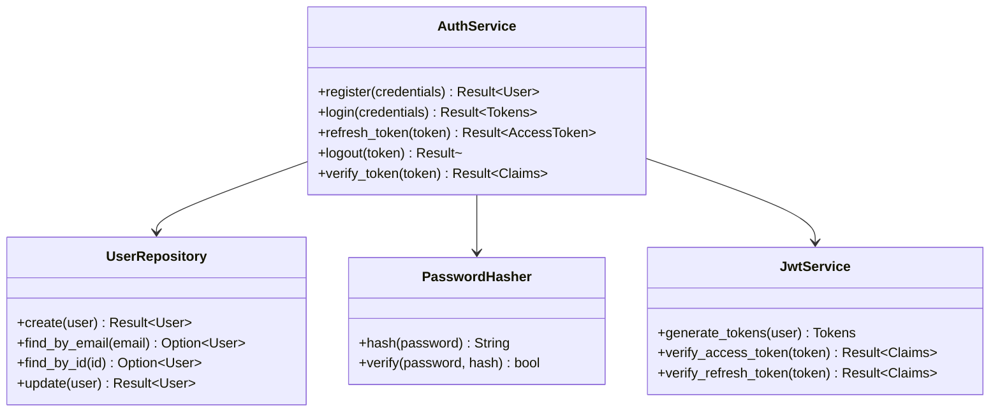
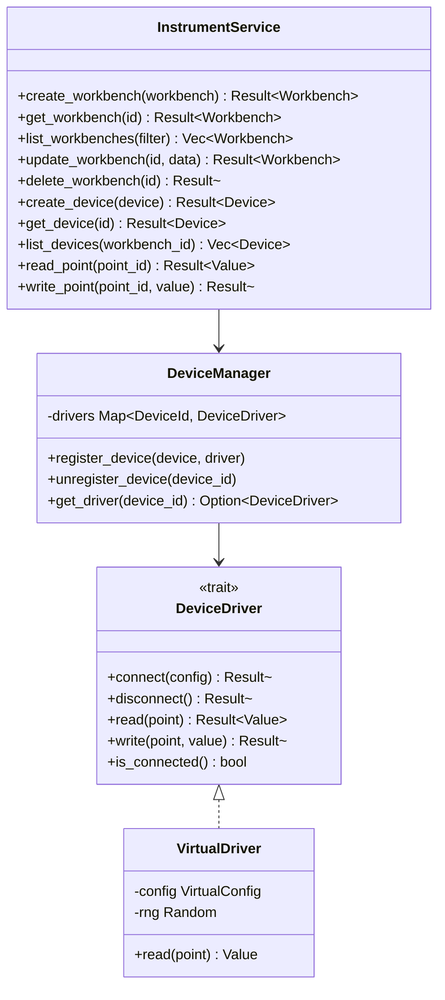
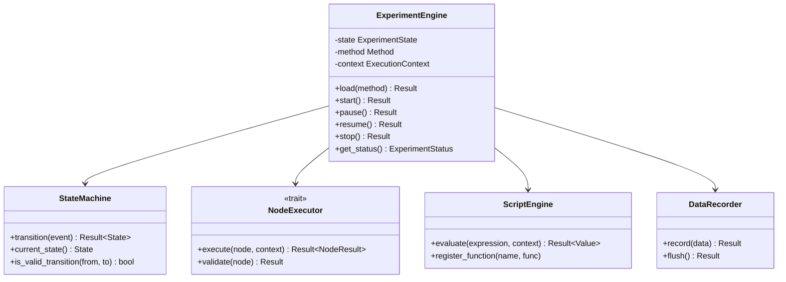
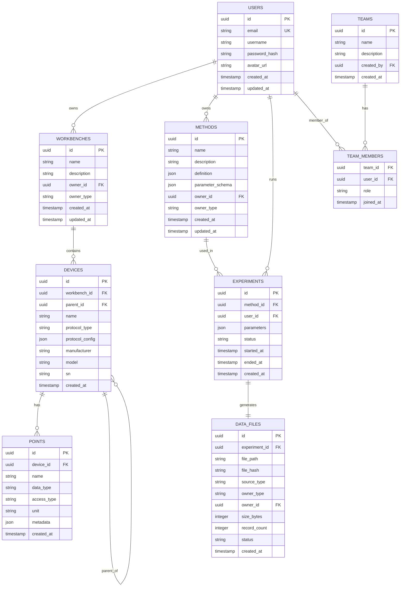

# Kayak 科学研究支持软件 - 架构设计文档

**版本**: 1.0  
**日期**: 2024-03-15  
**状态**: Draft

---

## 目录

1. [概述](#1-概述)
2. [架构原则](#2-架构原则)
3. [系统架构](#3-系统架构)
4. [模块设计](#4-模块设计)
5. [数据架构](#5-数据架构)
6. [API设计](#6-api设计)
7. [部署架构](#7-部署架构)
8. [技术栈](#8-技术栈)
9. [目录结构](#9-目录结构)

---

## 1. 概述

### 1.1 文档目的
本文档定义了Kayak科学研究支持软件的整体架构设计，为开发团队提供技术指导和约束。

### 1.2 适用范围
本文档适用于Release 0及后续版本的架构演进。

### 1.3 术语定义
- **Workbench**: 工作台，仪器的逻辑分组
- **Device**: 设备，试验仪器的抽象表示
- **Point**: 测点，设备的具体读写单元
- **Method**: 试验方法，定义实验过程的脚本
- **Experiment**: 一次具体的试验执行实例

---

## 2. 架构原则

### 2.1 核心原则
1. **前后端分离**: 清晰的前后端职责边界，通过RESTful API和WebSocket通信
2. **插件化设计**: 设备协议以插件形式实现，便于扩展
3. **多层部署**: 支持从桌面单应用到分布式部署的灵活架构
4. **数据驱动**: HDF5作为科学数据核心存储，SQLite作为元数据索引
5. **类型安全**: 前后端均使用强类型语言（Dart/Rust）

### 2.2 设计约束
- 支持离线运行（桌面部署模式）
- 最小化外部依赖（SQLite无需外部服务）
- 向后兼容的API版本控制
- 资源占用最小化（支持嵌入式场景）

---

## 3. 系统架构

### 3.1 总体架构图

```
┌─────────────────────────────────────────────────────────────────────────────┐
│                              Kayak Platform                                 │
├─────────────────────────────────────────────────────────────────────────────┤
│                                                                             │
│  ┌─────────────────────────────────────────────────────────────────────┐   │
│  │                        Presentation Layer                            │   │
│  │  ┌──────────────┐  ┌──────────────┐  ┌──────────────┐               │   │
│  │  │   Flutter    │  │   Flutter    │  │   Flutter    │               │   │
│  │  │   Desktop    │  │   Web        │  │   Mobile*    │               │   │
│  │  └──────┬───────┘  └──────┬───────┘  └──────┬───────┘               │   │
│  │         │                 │                 │                        │   │
│  │         └─────────────────┴─────────────────┘                        │   │
│  │                         │                                            │   │
│  │                    HTTP / WebSocket                                  │   │
│  └─────────────────────────┬────────────────────────────────────────────┘   │
│                            │                                                │
│  ┌─────────────────────────▼────────────────────────────────────────────┐   │
│  │                        API Gateway                                   │   │
│  │  ┌──────────────┐  ┌──────────────┐  ┌──────────────┐               │   │
│  │  │   REST API   │  │  WebSocket   │  │   Auth       │               │   │
│  │  │   (Axum)     │  │  (Real-time) │  │   (JWT)      │               │   │
│  │  └──────────────┘  └──────────────┘  └──────────────┘               │   │
│  └─────────────────────────┬────────────────────────────────────────────┘   │
│                            │                                                │
│  ┌─────────────────────────▼────────────────────────────────────────────┐   │
│  │                      Service Layer                                   │   │
│  │  ┌────────────┐ ┌────────────┐ ┌────────────┐ ┌────────────┐        │   │
│  │  │ Instrument │ │  Method    │ │ Experiment │ │   Data     │        │   │
│  │  │  Service   │ │  Service   │ │  Service   │ │  Service   │        │   │
│  │  └────────────┘ └────────────┘ └────────────┘ └────────────┘        │   │
│  │  ┌────────────┐ ┌────────────┐ ┌────────────┐                       │   │
│  │  │    Auth    │ │ Permission │ │   Script   │                       │   │
│  │  │  Service   │ │  Service   │ │   Engine   │                       │   │
│  │  └────────────┘ └────────────┘ └────────────┘                       │   │
│  └─────────────────────────┬────────────────────────────────────────────┘   │
│                            │                                                │
│  ┌─────────────────────────▼────────────────────────────────────────────┐   │
│  │                    Device Driver Layer                               │   │
│  │  ┌────────────┐ ┌────────────┐ ┌────────────┐ ┌────────────┐        │   │
│  │  │  Virtual   │ │  Modbus*   │ │   CAN*     │ │   VISA*    │        │   │
│  │  │   Driver   │ │   Driver   │ │  Driver    │ │  Driver    │        │   │
│  │  └────────────┘ └────────────┘ └────────────┘ └────────────┘        │   │
│  └──────────────────────────────────────────────────────────────────────┘   │
│                                                                             │
│  ┌─────────────────────────────────────────────────────────────────────┐   │
│  │                       Data Layer                                     │   │
│  │  ┌──────────────┐  ┌──────────────┐  ┌──────────────┐               │   │
│  │  │   SQLite     │  │    HDF5      │  │   Config     │               │   │
│  │  │  (Metadata)  │  │   (Data)     │  │   (Files)    │               │   │
│  │  └──────────────┘  └──────────────┘  └──────────────┘               │   │
│  └─────────────────────────────────────────────────────────────────────┘   │
│                                                                             │
└─────────────────────────────────────────────────────────────────────────────┘

* 表示Release 0不包含的功能
```

### 3.2 分层架构说明

#### 3.2.1 表示层 (Presentation Layer)
- **Flutter Desktop**: Windows、macOS、Linux原生应用
- **Flutter Web**: 浏览器访问的Web应用
- **共享代码**: UI组件、状态管理、业务逻辑复用

#### 3.2.2 API网关层 (API Gateway)
- **REST API**: 基于Axum的HTTP API服务
- **WebSocket**: 实时数据推送（试验状态、仪器数据）
- **认证**: JWT Token验证和刷新

#### 3.2.3 服务层 (Service Layer)
核心业务逻辑，按领域划分为独立服务：
- **Instrument Service**: 工作台、设备、测点管理
- **Method Service**: 试验方法定义和存储
- **Experiment Service**: 试验执行和状态管理
- **Data Service**: HDF5文件管理和数据查询
- **Auth Service**: 用户认证和授权
- **Permission Service**: 权限检查和团队管理
- **Script Engine**: 试验过程执行引擎

#### 3.2.4 设备驱动层 (Device Driver Layer)
协议抽象和具体实现：
- **Driver Trait**: 统一设备驱动接口
- **Protocol Plugins**: 具体协议实现

#### 3.2.5 数据层 (Data Layer)
- **SQLite**: 关系型元数据存储
- **HDF5**: 科学数据文件存储
- **Config Files**: YAML/JSON配置文件

---

## 4. 模块设计

### 4.1 模块依赖关系

```
kayak-backend
├── api
│   ├── handlers       # HTTP请求处理器
│   ├── middleware     # 中间件（认证、日志、错误处理）
│   └── routes         # 路由定义
├── services
│   ├── auth           # 认证服务
│   ├── instrument     # 仪器管理服务
│   ├── method         # 试验方法服务
│   ├── experiment     # 试验过程服务
│   ├── data           # 数据管理服务
│   └── permission     # 权限服务
├── drivers
│   ├── core           # 驱动接口定义
│   └── virtual        # 虚拟设备驱动
├── models
│   ├── entities       # 数据库实体
│   ├── dto            # API数据传输对象
│   └── domain         # 领域模型
├── core
│   ├── config         # 配置管理
│   ├── error          # 错误定义
│   └── utils          # 工具函数
├── db
│   ├── migrations     # 数据库迁移
│   └── repository     # 数据访问层
└── main.rs            # 应用入口
```

### 4.2 核心模块详细设计

#### 4.2.1 认证模块 (Auth Service)



#### 4.2.2 仪器管理模块 (Instrument Service)



#### 4.2.3 试验执行模块 (Experiment Service)



---

## 5. 数据架构

### 5.1 数据库Schema

#### 5.1.1 ER图



#### 5.1.2 核心表结构

```sql
-- 用户表
CREATE TABLE users (
    id UUID PRIMARY KEY DEFAULT gen_random_uuid(),
    email VARCHAR(255) UNIQUE NOT NULL,
    username VARCHAR(100) NOT NULL,
    password_hash VARCHAR(255) NOT NULL,
    avatar_url TEXT,
    is_active BOOLEAN DEFAULT true,
    created_at TIMESTAMP DEFAULT CURRENT_TIMESTAMP,
    updated_at TIMESTAMP DEFAULT CURRENT_TIMESTAMP
);

-- 工作台表
CREATE TABLE workbenches (
    id UUID PRIMARY KEY DEFAULT gen_random_uuid(),
    name VARCHAR(255) NOT NULL,
    description TEXT,
    owner_type VARCHAR(20) NOT NULL CHECK (owner_type IN ('user', 'team')),
    owner_id UUID NOT NULL,
    created_at TIMESTAMP DEFAULT CURRENT_TIMESTAMP,
    updated_at TIMESTAMP DEFAULT CURRENT_TIMESTAMP
);

-- 设备表（支持嵌套）
CREATE TABLE devices (
    id UUID PRIMARY KEY DEFAULT gen_random_uuid(),
    workbench_id UUID NOT NULL REFERENCES workbenches(id) ON DELETE CASCADE,
    parent_id UUID REFERENCES devices(id) ON DELETE CASCADE,
    name VARCHAR(255) NOT NULL,
    protocol_type VARCHAR(50) NOT NULL,
    protocol_config JSONB NOT NULL DEFAULT '{}',
    manufacturer VARCHAR(255),
    model VARCHAR(255),
    sn VARCHAR(255),
    created_at TIMESTAMP DEFAULT CURRENT_TIMESTAMP
);

-- 测点表
CREATE TABLE points (
    id UUID PRIMARY KEY DEFAULT gen_random_uuid(),
    device_id UUID NOT NULL REFERENCES devices(id) ON DELETE CASCADE,
    name VARCHAR(255) NOT NULL,
    data_type VARCHAR(50) NOT NULL CHECK (data_type IN ('integer', 'float', 'string', 'boolean')),
    access_type VARCHAR(20) NOT NULL CHECK (access_type IN ('ro', 'wo', 'rw')),
    unit VARCHAR(50),
    metadata JSONB DEFAULT '{}',
    created_at TIMESTAMP DEFAULT CURRENT_TIMESTAMP
);

-- 试验方法表
CREATE TABLE methods (
    id UUID PRIMARY KEY DEFAULT gen_random_uuid(),
    name VARCHAR(255) NOT NULL,
    description TEXT,
    definition JSONB NOT NULL,  -- 过程定义
    parameter_schema JSONB NOT NULL DEFAULT '{}',
    owner_type VARCHAR(20) NOT NULL,
    owner_id UUID NOT NULL,
    created_at TIMESTAMP DEFAULT CURRENT_TIMESTAMP,
    updated_at TIMESTAMP DEFAULT CURRENT_TIMESTAMP
);

-- 试验记录表
CREATE TABLE experiments (
    id UUID PRIMARY KEY DEFAULT gen_random_uuid(),
    method_id UUID REFERENCES methods(id),
    user_id UUID NOT NULL REFERENCES users(id),
    parameters JSONB NOT NULL DEFAULT '{}',
    status VARCHAR(20) NOT NULL CHECK (status IN ('idle', 'loaded', 'running', 'paused', 'completed', 'error')),
    started_at TIMESTAMP,
    ended_at TIMESTAMP,
    error_message TEXT,
    created_at TIMESTAMP DEFAULT CURRENT_TIMESTAMP
);

-- 数据文件元信息表
CREATE TABLE data_files (
    id UUID PRIMARY KEY DEFAULT gen_random_uuid(),
    experiment_id UUID REFERENCES experiments(id),
    file_path TEXT NOT NULL,
    file_hash VARCHAR(64) NOT NULL,
    source_type VARCHAR(20) NOT NULL CHECK (source_type IN ('experiment', 'analysis', 'import')),
    owner_type VARCHAR(20) NOT NULL,
    owner_id UUID NOT NULL,
    size_bytes BIGINT,
    record_count INTEGER,
    status VARCHAR(20) DEFAULT 'active' CHECK (status IN ('active', 'archived', 'deleted')),
    created_at TIMESTAMP DEFAULT CURRENT_TIMESTAMP
);

-- 索引
CREATE INDEX idx_workbenches_owner ON workbenches(owner_type, owner_id);
CREATE INDEX idx_devices_workbench ON devices(workbench_id);
CREATE INDEX idx_points_device ON points(device_id);
CREATE INDEX idx_experiments_user ON experiments(user_id);
CREATE INDEX idx_experiments_status ON experiments(status);
CREATE INDEX idx_data_files_experiment ON data_files(experiment_id);
```

### 5.2 HDF5文件结构

```
experiment_{id}.h5
├── @metadata (属性组)
│   ├── experiment_id
│   ├── method_id
│   ├── user_id
│   ├── parameters (JSON)
│   ├── start_time
│   └── end_time
│
├── raw_data (组)
│   ├── {device_id} (组)
│   │   ├── {point_id} (数据集: Nx2, [timestamp, value])
│   │   └── {point_id}_meta (属性: unit, data_type)
│   └── ...
│
├── parameters (组)
│   └── config (数据集: 参数表的快照)
│
├── logs (组)
│   ├── control_actions (数据集: 操作日志)
│   │   └── [timestamp, action, user_id, details]
│   └── errors (数据集: 错误日志)
│       └── [timestamp, level, message, context]
│
└── processed (组，预留)
    └── ...
```

---

## 6. API设计

### 6.1 RESTful API规范

#### 6.1.1 响应格式
```json
{
  "code": 200,
  "message": "success",
  "data": { ... },
  "timestamp": "2024-03-15T10:30:00Z"
}
```

#### 6.1.2 错误响应
```json
{
  "code": 400,
  "message": "Validation failed",
  "errors": [
    {"field": "email", "message": "Invalid email format"}
  ],
  "timestamp": "2024-03-15T10:30:00Z"
}
```

### 6.2 API端点概览

#### 认证 API
```
POST   /api/v1/auth/register
POST   /api/v1/auth/login
POST   /api/v1/auth/refresh
POST   /api/v1/auth/logout
GET    /api/v1/auth/me
```

#### 工作台 API
```
GET    /api/v1/workbenches
POST   /api/v1/workbenches
GET    /api/v1/workbenches/{id}
PUT    /api/v1/workbenches/{id}
DELETE /api/v1/workbenches/{id}
```

#### 设备 API
```
GET    /api/v1/workbenches/{id}/devices
POST   /api/v1/workbenches/{id}/devices
GET    /api/v1/devices/{id}
PUT    /api/v1/devices/{id}
DELETE /api/v1/devices/{id}
POST   /api/v1/devices/{id}/connect
POST   /api/v1/devices/{id}/disconnect
```

#### 测点 API
```
GET    /api/v1/devices/{id}/points
POST   /api/v1/devices/{id}/points
GET    /api/v1/points/{id}
PUT    /api/v1/points/{id}
DELETE /api/v1/points/{id}
GET    /api/v1/points/{id}/value
PUT    /api/v1/points/{id}/value
GET    /api/v1/points/{id}/history?start=&end=&limit=
```

#### 试验方法 API
```
GET    /api/v1/methods
POST   /api/v1/methods
GET    /api/v1/methods/{id}
PUT    /api/v1/methods/{id}
DELETE /api/v1/methods/{id}
POST   /api/v1/methods/{id}/validate
```

#### 试验控制 API
```
POST   /api/v1/experiments                    # 创建并载入
GET    /api/v1/experiments
GET    /api/v1/experiments/{id}
POST   /api/v1/experiments/{id}/load          # 载入方法
POST   /api/v1/experiments/{id}/start
POST   /api/v1/experiments/{id}/pause
POST   /api/v1/experiments/{id}/resume
POST   /api/v1/experiments/{id}/stop
GET    /api/v1/experiments/{id}/status
GET    /api/v1/experiments/{id}/logs
```

#### 数据文件 API
```
GET    /api/v1/data-files
GET    /api/v1/data-files/{id}
GET    /api/v1/data-files/{id}/download
DELETE /api/v1/data-files/{id}
```

### 6.3 WebSocket API

#### 连接
```
WS /ws
Authorization: Bearer {token}
```

#### 消息类型
```typescript
// 客户端 -> 服务端
interface SubscribeRequest {
  type: 'subscribe';
  channels: string[];  // ['experiment:status', 'point:values']
}

interface ControlRequest {
  type: 'control';
  experiment_id: string;
  action: 'start' | 'pause' | 'resume' | 'stop';
}

// 服务端 -> 客户端
interface StatusUpdate {
  type: 'status';
  experiment_id: string;
  state: 'idle' | 'running' | 'paused' | 'completed' | 'error';
  timestamp: string;
}

interface PointValueUpdate {
  type: 'point_value';
  point_id: string;
  value: number | string | boolean;
  timestamp: string;
}

interface LogMessage {
  type: 'log';
  level: 'info' | 'warn' | 'error';
  message: string;
  timestamp: string;
}
```

---

## 7. 部署架构

### 7.1 桌面完整部署

```yaml
# 架构: 单机嵌入式部署
Components:
  - Flutter Desktop App (UI)
  - Rust Backend (嵌入式HTTP服务)
  - SQLite (本地文件)
  - HDF5 (本地文件)

Communication:
  - 前端通过 localhost 访问后端
  - 后端直接操作本地文件

Packaging:
  - Windows: .msi / .exe installer
  - macOS: .dmg / .app bundle
  - Linux: .deb / .rpm / AppImage
```

### 7.2 单容器Web部署

```dockerfile
# 多阶段构建
FROM rust:1.75 as backend-builder
# ... build backend

FROM flutter:3.16 as frontend-builder
# ... build web

FROM nginx:alpine
# ... combine frontend + backend + reverse proxy
```

```yaml
# docker-compose.yml
version: '3.8'
services:
  kayak:
    image: kayak:single
    ports:
      - "8080:80"
    volumes:
      - ./data:/app/data
    environment:
      - KAYAK_DATA_DIR=/app/data
```

### 7.3 前后端分离部署

```yaml
# docker-compose.yml
version: '3.8'
services:
  frontend:
    image: kayak-frontend:latest
    ports:
      - "80:80"
    environment:
      - API_URL=http://backend:8080
    depends_on:
      - backend

  backend:
    image: kayak-backend:latest
    ports:
      - "8080:8080"
    volumes:
      - ./data:/app/data
    environment:
      - DATABASE_URL=sqlite:///app/data/kayak.db
      - DATA_DIR=/app/data
```

### 7.4 混合部署

```
┌─────────────────────┐         ┌─────────────────────────┐
│   Desktop Client    │         │     Server (Docker)     │
│                     │         │                         │
│  ┌───────────────┐  │         │  ┌───────────────────┐  │
│  │ Flutter App   │  │◀────────│  │   Rust Backend    │  │
│  └───────────────┘  │  HTTP   │  └───────────────────┘  │
│                     │         │           │             │
└─────────────────────┘         │     ┌─────┴─────┐       │
                                │     ▼           ▼       │
                                │ ┌───────┐   ┌────────┐  │
                                │ │SQLite │   │  HDF5  │  │
                                │ └───────┘   └────────┘  │
                                └─────────────────────────┘
```

---

## 8. 技术栈

### 8.1 后端技术栈

| 类别 | 技术 | 版本 | 用途 |
|------|------|------|------|
| 语言 | Rust | 1.75+ | 核心业务逻辑 |
| Web框架 | Axum | 0.7 | HTTP API |
| 异步运行时 | Tokio | 1.35 | 异步IO |
| 数据库 | sqlx | 0.7 | ORM + 迁移 |
| 序列化 | serde | 1.0 | JSON处理 |
| 验证 | validator | 0.16 | 输入验证 |
| 密码 | bcrypt | 0.15 | 密码哈希 |
| JWT | jsonwebtoken | 9.2 | Token认证 |
| 配置 | config | 0.14 | 配置管理 |
| 日志 | tracing | 0.1 | 结构化日志 |
| HDF5 | hdf5-rust | 0.8 | 科学数据存储 |
| 测试 | cargo test | - | 单元测试 |

### 8.2 前端技术栈

| 类别 | 技术 | 版本 | 用途 |
|------|------|------|------|
| 框架 | Flutter | 3.16+ | UI开发 |
| 语言 | Dart | 3.2+ | 编程语言 |
| 状态管理 | Riverpod | 2.4 | 状态管理 |
| 路由 | go_router | 12.0 | 导航路由 |
| HTTP | dio | 5.4 | API请求 |
| WebSocket | web_socket_channel | 2.4 | 实时通信 |
| 本地存储 | shared_preferences | 2.2 | 配置存储 |
| 国际化 | flutter_localizations | - | 多语言支持 |
| 图表 | fl_chart | 0.66 | 数据可视化 |
| JSON编辑 | json_editor_flutter | - | 方法编辑 |
| 代码高亮 | flutter_code_editor | - | 脚本编辑 |

### 8.3 开发工具

| 类别 | 工具 |
|------|------|
| 版本控制 | Git |
| CI/CD | GitHub Actions |
| 容器 | Docker + Docker Compose |
| 代码质量 | rustfmt, clippy, dart analyze |
| 测试 | cargo test, flutter test |
| 文档 | rustdoc, dart doc |

---

## 9. 目录结构

### 9.1 项目根目录

```
kayak/
├── README.md                   # 项目说明
├── LICENSE                     # 许可证
├── .gitignore                  # Git忽略规则
├── docker-compose.yml          # 容器编排
├── arch.md                     # 本文档
│
├── kayak-backend/              # Rust后端
│   ├── Cargo.toml
│   ├── Cargo.lock
│   ├── Dockerfile
│   ├── migrations/             # 数据库迁移
│   ├── src/
│   │   ├── main.rs
│   │   ├── lib.rs
│   │   ├── api/                # API层
│   │   ├── services/           # 服务层
│   │   ├── models/             # 数据模型
│   │   ├── drivers/            # 设备驱动
│   │   ├── db/                 # 数据库
│   │   └── core/               # 核心工具
│   └── tests/                  # 集成测试
│
├── kayak-frontend/             # Flutter前端
│   ├── pubspec.yaml
│   ├── pubspec.lock
│   ├── Dockerfile
│   ├── l10n.yaml               # 国际化配置
│   ├── lib/
│   │   ├── main.dart
│   │   ├── app.dart
│   │   ├── core/               # 核心工具
│   │   ├── models/             # 数据模型
│   │   ├── services/           # API服务
│   │   ├── providers/          # 状态管理
│   │   ├── screens/            # 页面
│   │   ├── widgets/            # 组件
│   │   └── l10n/               # 翻译文件
│   └── test/                   # 测试
│
├── kayak-python-client/        # Python客户端
│   ├── setup.py
│   ├── pyproject.toml
│   ├── kayak/
│   │   ├── __init__.py
│   │   ├── client.py
│   │   ├── models.py
│   │   └── exceptions.py
│   └── tests/
│
├── scripts/                    # 启动/停止脚本
│   ├── start-desktop.sh
│   ├── start-web.sh
│   ├── start-backend.sh
│   └── stop.sh
│
└── log/
    └── release_0/
        ├── prd.md              # 产品需求文档
        ├── tasks.md            # 任务分解
        ├── remain.md           # 后续任务
        ├── design/             # 详细设计文档
        ├── test/               # 测试用例和结果
        └── review/             # 代码审查记录
```

### 9.2 后端目录结构

```
kayak-backend/src/
├── main.rs                     # 应用入口
├── lib.rs                      # 库导出
│
├── api/
│   ├── mod.rs
│   ├── handlers/               # 请求处理器
│   │   ├── mod.rs
│   │   ├── auth.rs
│   │   ├── workbench.rs
│   │   ├── device.rs
│   │   ├── point.rs
│   │   ├── method.rs
│   │   ├── experiment.rs
│   │   └── data.rs
│   ├── middleware/             # 中间件
│   │   ├── mod.rs
│   │   ├── auth.rs
│   │   ├── error.rs
│   │   └── log.rs
│   └── routes.rs               # 路由配置
│
├── services/
│   ├── mod.rs
│   ├── auth_service.rs
│   ├── instrument_service.rs
│   ├── method_service.rs
│   ├── experiment_service.rs
│   ├── data_service.rs
│   └── permission_service.rs
│
├── models/
│   ├── mod.rs
│   ├── entities/               # 数据库实体
│   │   ├── mod.rs
│   │   ├── user.rs
│   │   ├── workbench.rs
│   │   ├── device.rs
│   │   └── experiment.rs
│   ├── dto/                    # API DTO
│   │   ├── mod.rs
│   │   ├── auth.rs
│   │   ├── workbench.rs
│   │   └── ...
│   └── domain/                 # 领域模型
│       ├── mod.rs
│       ├── experiment_state.rs
│       └── script.rs
│
├── drivers/
│   ├── mod.rs
│   ├── core.rs                 # 驱动接口
│   └── virtual.rs              # 虚拟驱动
│
├── db/
│   ├── mod.rs
│   ├── connection.rs
│   └── repositories/           # 数据访问
│       ├── mod.rs
│       ├── user_repo.rs
│       └── ...
│
└── core/
    ├── mod.rs
    ├── config.rs
    ├── error.rs
    ├── result.rs
    └── utils.rs
```

### 9.3 前端目录结构

```
kayak-frontend/lib/
├── main.dart                   # 应用入口
├── app.dart                    # 应用配置
│
├── core/
│   ├── constants.dart          # 常量定义
│   ├── theme.dart              # 主题配置
│   ├── router.dart             # 路由配置
│   ├── api_client.dart         # HTTP客户端
│   ├── websocket_client.dart   # WebSocket客户端
│   └── utils.dart              # 工具函数
│
├── models/
│   ├── user.dart
│   ├── workbench.dart
│   ├── device.dart
│   ├── point.dart
│   ├── method.dart
│   └── experiment.dart
│
├── services/
│   ├── auth_service.dart
│   ├── workbench_service.dart
│   ├── device_service.dart
│   ├── method_service.dart
│   └── experiment_service.dart
│
├── providers/
│   ├── auth_provider.dart
│   ├── theme_provider.dart
│   ├── locale_provider.dart
│   └── ...
│
├── screens/
│   ├── login_screen.dart
│   ├── home_screen.dart
│   ├── dashboard_screen.dart
│   ├── workbench/
│   │   ├── workbench_list_screen.dart
│   │   ├── workbench_detail_screen.dart
│   │   └── workbench_form_screen.dart
│   ├── device/
│   ├── method/
│   ├── experiment/
│   └── data/
│
├── widgets/
│   ├── common/                 # 通用组件
│   │   ├── app_bar.dart
│   │   ├── drawer.dart
│   │   ├── data_table.dart
│   │   └── loading.dart
│   └── instrument/             # 业务组件
│
└── l10n/
    ├── app_en.arb
    ├── app_zh.arb
    └── app_fr.arb
```

---

## 10. 关键设计决策

### 10.1 为什么使用SQLite + HDF5双存储？
- **SQLite**: 适合关系型元数据，支持ACID事务，零配置
- **HDF5**: 科学数据行业标准，支持大规模时序数据，压缩高效
- **组合优势**: 元数据快速查询 + 大数据高效存储

### 10.2 为什么使用Rust开发后端？
- 内存安全，避免科学计算中的数据损坏
- 高性能，适合实时数据采集
- 优秀的并发模型，支持高吞吐数据写入
- 强类型系统，减少运行时错误

### 10.3 为什么使用Flutter开发前端？
- 一套代码支持桌面和Web
- Material Design 3原生支持
- 良好的性能和用户体验
- 支持热重载，开发效率高

### 10.4 为什么使用WebSocket + REST混合通信？
- **REST**: 适合请求-响应模式（CRUD操作）
- **WebSocket**: 适合实时推送（试验状态、仪器数据）
- **混合方案**: 兼顾简单性和实时性

---

## 11. 附录

### 11.1 参考资料
- [Rust API Guidelines](https://rust-lang.github.io/api-guidelines/)
- [Flutter Architecture Samples](https://github.com/brianegan/flutter_architecture_samples)
- [Material Design 3](https://m3.material.io/)
- [HDF5 Documentation](https://docs.hdfgroup.org/hdf5/v1_14/index.html)

### 11.2 修订历史
| 版本 | 日期 | 修改人 | 修改内容 |
|------|------|--------|----------|
| 1.0 | 2024-03-15 | Architecture Team | 初始版本 |

---

**文档结束**
