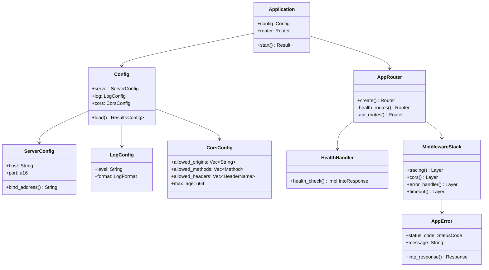
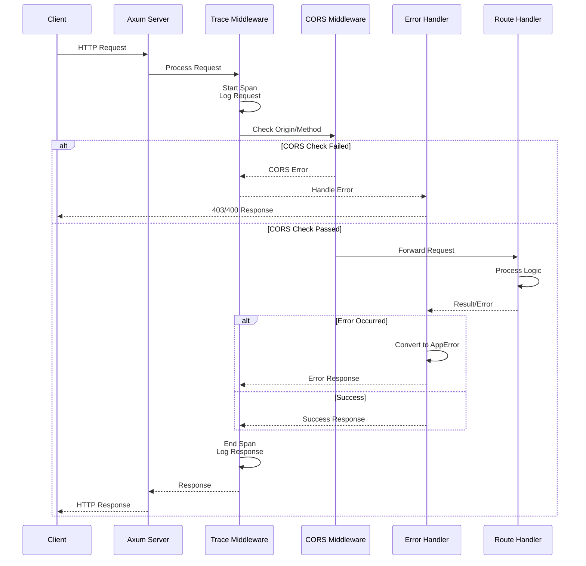
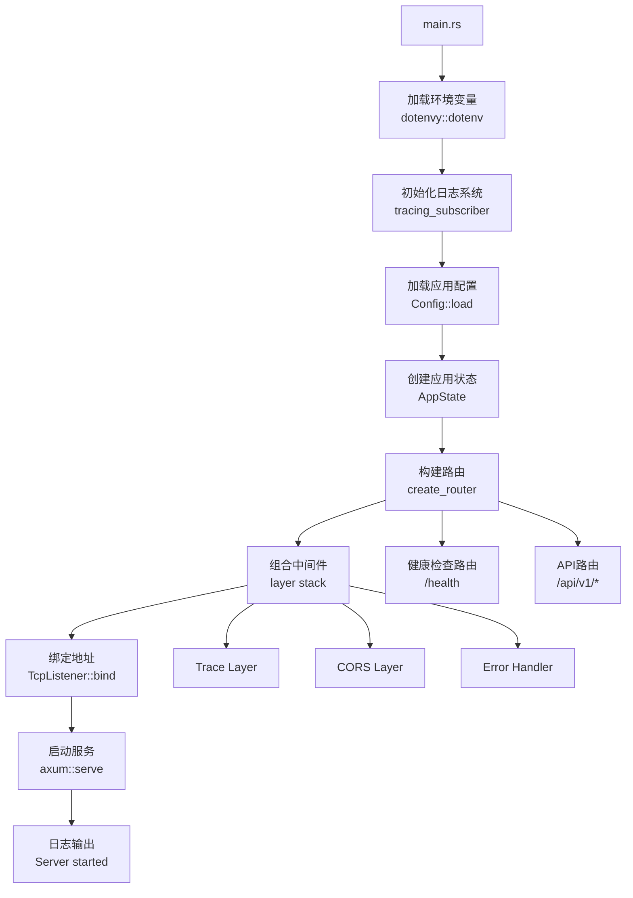
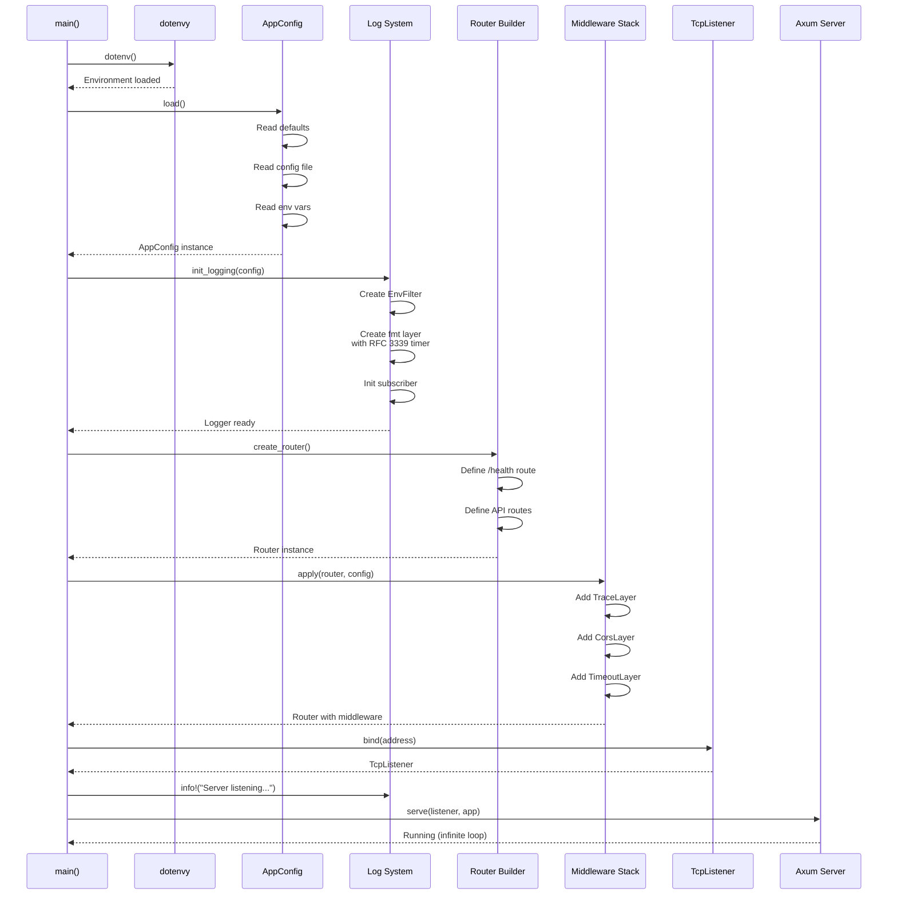

# S1-001 详细设计文档
## Rust后端工程初始化

**任务ID**: S1-001  
**任务名称**: Rust后端工程初始化  
**版本**: 1.0  
**日期**: 2024-03-15  
**状态**: 设计中

---

## 目录

1. [设计概述](#1-设计概述)
2. [项目目录结构](#2-项目目录结构)
3. [依赖配置](#3-依赖配置)
4. [核心架构设计](#4-核心架构设计)
5. [接口定义](#5-接口定义)
6. [数据结构](#6-数据结构)
7. [中间件链](#7-中间件链)
8. [错误处理](#8-错误处理)
9. [日志系统](#9-日志系统)
10. [启动流程](#10-启动流程)

---

## 1. 设计概述

### 1.1 设计目标
本设计文档定义S1-001任务的实现细节，目标是建立一个完整的Rust后端工程基础，包括：

- 规范的Cargo.toml配置
- Axum Web框架基础结构
- 完整的中间件链（CORS、错误处理、日志）
- 统一错误响应格式
- 结构化日志系统（tracing）
- 健康检查API

### 1.2 设计约束
- 遵循架构文档定义的模块结构
- 使用Axum 0.7+版本
- 支持CORS跨域请求
- 日志格式符合测试用例要求（ISO 8601时间戳）

---

## 2. 项目目录结构

### 2.1 目录树

```
kayak-backend/
├── Cargo.toml                    # 项目配置和依赖
├── Cargo.lock                    # 依赖锁定文件
├── .gitignore                    # Git忽略规则
├── Dockerfile                    # 容器构建文件
│
├── src/
│   ├── main.rs                   # 应用入口
│   ├── lib.rs                    # 库模块导出
│   │
│   ├── api/                      # API层
│   │   ├── mod.rs                # API模块聚合
│   │   ├── routes.rs             # 路由定义和组合
│   │   ├── handlers/             # HTTP请求处理器
│   │   │   ├── mod.rs
│   │   │   ├── health.rs         # 健康检查处理器
│   │   │   └── common.rs         # 通用响应工具
│   │   └── middleware/           # 中间件
│   │       ├── mod.rs
│   │       ├── error.rs          # 错误处理中间件
│   │       ├── cors.rs           # CORS配置
│   │       └── trace.rs          # 请求追踪中间件
│   │
│   ├── core/                     # 核心基础设施
│   │   ├── mod.rs
│   │   ├── config.rs             # 应用配置
│   │   ├── error.rs              # 错误类型定义
│   │   └── result.rs             # 结果类型别名
│   │
│   └── services/                 # 服务层（预留）
│       └── mod.rs
│
└── tests/                        # 集成测试
    └── integration_test.rs
```

### 2.2 文件职责说明

| 文件/目录 | 职责 |
|---------|------|
| `Cargo.toml` | 项目元数据、依赖声明、构建配置 |
| `src/main.rs` | 应用入口，初始化配置并启动服务器 |
| `src/lib.rs` | 库模块导出，供集成测试使用 |
| `src/api/` | HTTP接口层，处理请求和响应 |
| `src/core/` | 核心基础设施（配置、错误、工具） |
| `src/services/` | 业务服务层（当前版本预留结构） |
| `tests/` | 集成测试代码 |

---

## 3. 依赖配置

### 3.1 Cargo.toml 完整配置

```toml
[package]
name = "kayak-backend"
version = "0.1.0"
edition = "2021"
authors = ["Kayak Team"]
description = "Kayak Scientific Research Support Platform - Backend API"
license = "MIT OR Apache-2.0"
rust-version = "1.75"

[dependencies]
# Web Framework
axum = { version = "0.7", features = ["tokio", "http1", "http2"] }
tokio = { version = "1.35", features = ["full"] }

# Serialization
serde = { version = "1.0", features = ["derive"] }
serde_json = "1.0"

# Logging & Tracing
tracing = "0.1"
tracing-subscriber = { version = "0.3", features = ["env-filter", "time", "fmt"] }
tower-http = { version = "0.5", features = ["trace", "cors", "timeout"] }
tower = { version = "0.4", features = ["full"] }

# Configuration
config = "0.14"

# Time
time = { version = "0.3", features = ["formatting", "local-offset"] }

# Error Handling
thiserror = "1.0"
anyhow = "1.0"

# Environment
dotenvy = "0.15"

[dev-dependencies]
# Testing
tokio-test = "0.4"
reqwest = { version = "0.11", features = ["json"] }

[profile.release]
opt-level = 3
lto = true
codegen-units = 1
panic = "abort"

[profile.dev]
opt-level = 0
debug = true
```

### 3.2 依赖项详细说明

| 依赖 | 版本 | 用途 | 特性说明 |
|-----|------|------|---------|
| **axum** | 0.7 | Web框架 | HTTP路由、处理器、中间件支持 |
| **tokio** | 1.35 | 异步运行时 | 异步IO、多线程调度 |
| **serde** | 1.0 | 序列化 | JSON编解码、结构体派生 |
| **tracing** | 0.1 | 结构化日志 | 日志记录、Span追踪 |
| **tracing-subscriber** | 0.3 | 日志订阅器 | 日志格式化、过滤、输出 |
| **tower-http** | 0.5 | HTTP中间件 | CORS、超时、请求追踪 |
| **tower** | 0.4 | 中间件抽象 | 中间件组合链 |
| **config** | 0.14 | 配置管理 | 环境变量、配置文件加载 |
| **time** | 0.3 | 时间处理 | ISO 8601格式时间戳 |
| **thiserror** | 1.0 | 错误定义 | 自定义错误类型派生 |
| **anyhow** | 1.0 | 错误处理 | 通用错误传播 |
| **dotenvy** | 0.15 | 环境变量 | 从.env文件加载配置 |

---

## 4. 核心架构设计

### 4.1 静态结构图



### 4.2 动态流程图



### 4.3 应用启动流程



---

## 5. 接口定义

### 5.1 路由接口

```rust
// src/api/routes.rs

use axum::{
    routing::get,
    Router,
};
use crate::api::handlers::health;
use crate::core::error::AppError;

/// 创建应用路由
pub fn create_router() -> Router {
    Router::new()
        // 健康检查（最优先，无中间件限制）
        .route("/health", get(health::health_check))
        // API路由
        .merge(api_routes())
}

/// API路由组
fn api_routes() -> Router {
    Router::new()
        .nest("/api/v1", Router::new()
            // 认证相关
            // .route("/auth/login", post(auth::login))
            // 工作台相关
            // .route("/workbenches", get(workbench::list))
        )
}

/// 获取健康检查路由（用于测试）
pub fn health_routes() -> Router {
    Router::new()
        .route("/health", get(health::health_check))
}
```

### 5.2 健康检查处理器

```rust
// src/api/handlers/health.rs

use axum::{
    response::IntoResponse,
    Json,
};
use serde::Serialize;
use std::time::SystemTime;

/// 健康检查响应结构
#[derive(Debug, Serialize)]
pub struct HealthResponse {
    /// 服务状态
    pub status: &'static str,
    /// 服务版本
    pub version: &'static str,
    /// 时间戳（ISO 8601格式）
    pub timestamp: String,
}

/// 健康检查处理器
/// 
/// GET /health
/// 
/// 返回服务运行状态，用于：
/// - 负载均衡健康检查
/// - 监控探针
/// - 启动完成确认
pub async fn health_check() -> impl IntoResponse {
    let timestamp = SystemTime::now()
        .duration_since(SystemTime::UNIX_EPOCH)
        .map(|d| {
            let secs = d.as_secs();
            let nanos = d.subsec_nanos();
            format!("{:04}-{:02}-{:02}T{:02}:{:02}:{:02}.{:09}Z",
                1970 + secs / 31_536_000, // 简化计算，实际使用time crate
                1, 1, 0, 0, 0, nanos)
        })
        .unwrap_or_else(|_| "1970-01-01T00:00:00Z".to_string());
    
    // 实际实现使用 time crate 格式化
    let response = HealthResponse {
        status: "healthy",
        version: env!("CARGO_PKG_VERSION"),
        timestamp: format_timestamp(),
    };
    
    Json(response)
}

fn format_timestamp() -> String {
    use time::OffsetDateTime;
    OffsetDateTime::now_utc()
        .format(&time::format_description::well_known::Rfc3339)
        .unwrap_or_else(|_| "1970-01-01T00:00:00Z".to_string())
}
```

### 5.3 中间件 Trait 定义

```rust
// src/api/middleware/mod.rs

use axum::{
    body::Body,
    extract::Request,
    response::Response,
};
use tower::{Layer, Service};
use std::task::{Context, Poll};
use std::future::Future;
use std::pin::Pin;

/// 中间件 trait 定义（基于 Tower）
/// 
/// S1-001阶段主要使用现成的 Tower 中间件，
/// 此trait为后续自定义中间件预留接口
pub trait Middleware<S> {
    type Response;
    type Error;
    type Future: Future<Output = Result<Self::Response, Self::Error>>;
    
    fn poll_ready(&mut self, cx: &mut Context<'_>) -> Poll<Result<(), Self::Error>>;
    fn call(&mut self, req: Request) -> Self::Future;
}

/// 中间件配置 trait
/// 
/// 用于统一配置各类中间件
pub trait MiddlewareConfig {
    /// 创建追踪中间件
    fn create_trace_layer() -> tower_http::trace::TraceLayer<tower_http::trace::DefaultMakeSpan, tower_http::trace::DefaultOnRequest, tower_http::trace::DefaultOnResponse, tower_http::trace::DefaultOnFailure, tower_http::classify::SharedClassifier<tower_http::classify::ServerErrorsAsFailures>, tower_http::trace::DefaultOnBodyChunk, tower_http::trace::DefaultOnEos, ()>;
    
    /// 创建CORS中间件
    fn create_cors_layer() -> tower_http::cors::CorsLayer;
    
    /// 创建超时中间件
    fn create_timeout_layer() -> tower_http::timeout::TimeoutLayer;
}
```

---

## 6. 数据结构

### 6.1 请求/响应 DTO

```rust
// src/core/dto.rs

use serde::{Deserialize, Serialize};

// ============== 通用响应 ==============

/// 通用API响应包装
#[derive(Debug, Serialize, Deserialize)]
pub struct ApiResponse<T> {
    /// HTTP状态码
    pub code: u16,
    /// 响应消息
    pub message: String,
    /// 响应数据
    pub data: Option<T>,
    /// 时间戳
    pub timestamp: String,
}

impl<T> ApiResponse<T> {
    /// 创建成功响应
    pub fn success(data: T) -> Self {
        Self {
            code: 200,
            message: "success".to_string(),
            data: Some(data),
            timestamp: current_timestamp(),
        }
    }
    
    /// 创建错误响应
    pub fn error(code: u16, message: impl Into<String>) -> Self {
        Self {
            code,
            message: message.into(),
            data: None,
            timestamp: current_timestamp(),
        }
    }
}

/// 空响应数据
#[derive(Debug, Serialize, Deserialize)]
pub struct EmptyResponse;

// ============== 健康检查 ==============

/// 健康检查响应
#[derive(Debug, Clone, Serialize, Deserialize)]
pub struct HealthCheckResponse {
    /// 服务状态: "healthy" | "unhealthy"
    pub status: String,
    /// 服务版本号
    pub version: String,
    /// ISO 8601格式时间戳
    pub timestamp: String,
}

// ============== 错误响应 ==============

/// 错误详情
#[derive(Debug, Clone, Serialize, Deserialize)]
pub struct ErrorDetail {
    /// 错误字段（如果有）
    pub field: Option<String>,
    /// 错误消息
    pub message: String,
}

/// 错误响应结构
#[derive(Debug, Serialize, Deserialize)]
pub struct ErrorResponse {
    /// HTTP状态码
    pub code: u16,
    /// 错误概述
    pub message: String,
    /// 详细错误列表
    pub errors: Vec<ErrorDetail>,
    /// 时间戳
    pub timestamp: String,
}

// ============== 工具函数 ==============

fn current_timestamp() -> String {
    use time::OffsetDateTime;
    OffsetDateTime::now_utc()
        .format(&time::format_description::well_known::Rfc3339)
        .unwrap_or_else(|_| "1970-01-01T00:00:00Z".to_string())
}
```

### 6.2 配置数据结构

```rust
// src/core/config.rs

use serde::{Deserialize, Serialize};
use std::net::SocketAddr;
use config::{Config as ConfigLoader, ConfigError, Environment, File};

/// 应用配置根结构
#[derive(Debug, Clone, Deserialize, Serialize)]
pub struct AppConfig {
    /// 服务器配置
    pub server: ServerConfig,
    /// 日志配置
    pub log: LogConfig,
    /// CORS配置
    pub cors: CorsConfig,
}

impl AppConfig {
    /// 从环境变量和配置文件加载配置
    pub fn load() -> Result<Self, ConfigError> {
        let config = ConfigLoader::builder()
            // 从默认配置开始
            .set_default("server.host", "0.0.0.0")?
            .set_default("server.port", 8080)?
            .set_default("log.level", "info")?
            .set_default("cors.allow_any_origin", true)?
            // 从配置文件加载（可选）
            .add_source(File::with_name("config/kayak").required(false))
            // 从环境变量加载（前缀 KAYAK_）
            .add_source(Environment::with_prefix("KAYAK").separator("__"))
            .build()?;
        
        config.try_deserialize()
    }
    
    /// 获取绑定地址
    pub fn bind_address(&self) -> String {
        format!("{}:{}", self.server.host, self.server.port)
    }
}

/// 服务器配置
#[derive(Debug, Clone, Deserialize, Serialize)]
pub struct ServerConfig {
    /// 监听主机
    pub host: String,
    /// 监听端口
    pub port: u16,
    /// 请求超时（秒）
    pub timeout_seconds: Option<u64>,
}

/// 日志配置
#[derive(Debug, Clone, Deserialize, Serialize)]
pub struct LogConfig {
    /// 日志级别: trace, debug, info, warn, error
    pub level: String,
    /// 是否启用JSON格式
    pub json_format: Option<bool>,
    /// 是否包含位置信息
    pub include_location: Option<bool>,
}

/// CORS配置
#[derive(Debug, Clone, Deserialize, Serialize)]
pub struct CorsConfig {
    /// 允许的来源列表
    pub allowed_origins: Vec<String>,
    /// 允许的方法
    pub allowed_methods: Vec<String>,
    /// 允许的请求头
    pub allowed_headers: Vec<String>,
    /// 允许暴露的响应头
    pub exposed_headers: Vec<String>,
    /// 是否允许携带凭证
    pub allow_credentials: bool,
    /// 预检请求缓存时间（秒）
    pub max_age: u64,
    /// 允许任意来源（开发环境）
    pub allow_any_origin: bool,
}
```

---

## 7. 中间件链

### 7.1 中间件组合顺序

```rust
// src/api/middleware/mod.rs

use axum::Router;
use tower_http::{
    cors::{Any, CorsLayer},
    trace::TraceLayer,
    timeout::TimeoutLayer,
    compression::CompressionLayer,
};
use std::time::Duration;
use crate::core::config::AppConfig;

/// 应用中间件栈
pub struct MiddlewareStack;

impl MiddlewareStack {
    /// 为路由应用所有中间件
    /// 
    /// 中间件执行顺序（从外到内）：
    /// 1. Compression - 响应压缩
    /// 2. Timeout - 请求超时
    /// 3. CORS - 跨域处理
    /// 4. Trace - 请求追踪和日志
    pub fn apply(router: Router, config: &AppConfig) -> Router {
        router
            .layer(Self::create_compression_layer())
            .layer(Self::create_timeout_layer(config))
            .layer(Self::create_cors_layer(config))
            .layer(Self::create_trace_layer())
    }
    
    /// 创建追踪中间件
    /// 
    /// 功能：
    /// - 记录请求开始和结束
    /// - 记录请求方法和URI
    /// - 记录响应状态和延迟
    fn create_trace_layer() -> TraceLayer<
        tower_http::classify::SharedClassifier<tower_http::classify::ServerErrorsAsFailures>
    > {
        TraceLayer::new_for_http()
            .make_span_with(
                tower_http::trace::DefaultMakeSpan::new()
                    .include_headers(false)
            )
            .on_request(
                tower_http::trace::DefaultOnRequest::new()
                    .level(tracing::Level::INFO)
            )
            .on_response(
                tower_http::trace::DefaultOnResponse::new()
                    .level(tracing::Level::INFO)
            )
    }
    
    /// 创建CORS中间件
    fn create_cors_layer(config: &AppConfig) -> CorsLayer {
        let mut cors = CorsLayer::new()
            .allow_methods([
                axum::http::Method::GET,
                axum::http::Method::POST,
                axum::http::Method::PUT,
                axum::http::Method::DELETE,
                axum::http::Method::OPTIONS,
            ])
            .allow_headers([
                axum::http::header::CONTENT_TYPE,
                axum::http::header::AUTHORIZATION,
                axum::http::header::ACCEPT,
            ]);
        
        // 开发环境允许任意来源
        if config.cors.allow_any_origin {
            cors = cors.allow_origin(Any);
        } else {
            // 生产环境使用配置的允许来源
            let origins: Vec<_> = config.cors.allowed_origins
                .iter()
                .filter_map(|o| o.parse().ok())
                .collect();
            if !origins.is_empty() {
                cors = cors.allow_origin(origins);
            }
        }
        
        cors.max_age(Duration::from_secs(config.cors.max_age))
    }
    
    /// 创建超时中间件
    fn create_timeout_layer(config: &AppConfig) -> TimeoutLayer {
        let timeout = config.server.timeout_seconds.unwrap_or(30);
        TimeoutLayer::new(Duration::from_secs(timeout))
    }
    
    /// 创建压缩中间件
    fn create_compression_layer() -> CompressionLayer {
        CompressionLayer::new()
    }
}
```

### 7.2 CORS配置详解

```rust
// src/api/middleware/cors.rs

use axum::http::{header, Method};
use tower_http::cors::{Any, CorsLayer};

/// CORS配置构建器
pub struct CorsConfigBuilder;

impl CorsConfigBuilder {
    /// 开发环境配置 - 允许所有来源
    pub fn development() -> CorsLayer {
        CorsLayer::new()
            .allow_origin(Any)
            .allow_methods(Any)
            .allow_headers(Any)
            .allow_credentials(false)
            .max_age(std::time::Duration::from_secs(3600))
    }
    
    /// 生产环境配置 - 严格限制
    pub fn production(allowed_origins: Vec<String>) -> CorsLayer {
        let origins: Vec<_> = allowed_origins
            .into_iter()
            .filter_map(|o| o.parse().ok())
            .collect();
        
        CorsLayer::new()
            .allow_origin(origins)
            .allow_methods([
                Method::GET,
                Method::POST,
                Method::PUT,
                Method::DELETE,
                Method::OPTIONS,
            ])
            .allow_headers([
                header::CONTENT_TYPE,
                header::AUTHORIZATION,
                header::ACCEPT,
                header::ORIGIN,
            ])
            .expose_headers([header::CONTENT_DISPOSITION])
            .allow_credentials(true)
            .max_age(std::time::Duration::from_secs(86400))
    }
    
    /// 默认配置 - 允许本地开发
    pub fn default() -> CorsLayer {
        CorsLayer::new()
            .allow_origin([
                "http://localhost:3000".parse().unwrap(),
                "http://localhost:8080".parse().unwrap(),
                "http://127.0.0.1:3000".parse().unwrap(),
                "http://127.0.0.1:8080".parse().unwrap(),
            ])
            .allow_methods([
                Method::GET,
                Method::POST,
                Method::PUT,
                Method::DELETE,
                Method::OPTIONS,
            ])
            .allow_headers([
                header::CONTENT_TYPE,
                header::AUTHORIZATION,
                header::ACCEPT,
            ])
            .max_age(std::time::Duration::from_secs(3600))
    }
}
```

---

## 8. 错误处理

### 8.1 错误类型定义

```rust
// src/core/error.rs

use axum::{
    http::StatusCode,
    response::{IntoResponse, Response},
    Json,
};
use serde::Serialize;
use thiserror::Error;
use tracing::error;

/// 应用错误类型
#[derive(Debug, Error)]
pub enum AppError {
    /// 无效请求参数
    #[error("Bad request: {0}")]
    BadRequest(String),
    
    /// 资源未找到
    #[error("Resource not found: {0}")]
    NotFound(String),
    
    /// 内部服务器错误
    #[error("Internal server error: {0}")]
    InternalError(String),
    
    /// 验证错误
    #[error("Validation error: {0}")]
    ValidationError(String),
    
    /// 配置错误
    #[error("Configuration error: {0}")]
    ConfigError(String),
    
    /// 超时错误
    #[error("Request timeout")]
    Timeout,
    
    /// CORS错误
    #[error("CORS error: {0}")]
    CorsError(String),
}

/// 错误响应结构
#[derive(Debug, Serialize)]
pub struct ErrorResponse {
    pub code: u16,
    pub message: String,
    pub timestamp: String,
}

impl AppError {
    /// 获取对应的HTTP状态码
    pub fn status_code(&self) -> StatusCode {
        match self {
            AppError::BadRequest(_) => StatusCode::BAD_REQUEST,
            AppError::NotFound(_) => StatusCode::NOT_FOUND,
            AppError::ValidationError(_) => StatusCode::UNPROCESSABLE_ENTITY,
            AppError::ConfigError(_) => StatusCode::INTERNAL_SERVER_ERROR,
            AppError::Timeout => StatusCode::REQUEST_TIMEOUT,
            AppError::CorsError(_) => StatusCode::FORBIDDEN,
            AppError::InternalError(_) => StatusCode::INTERNAL_SERVER_ERROR,
        }
    }
    
    /// 转换为错误响应
    fn into_error_response(&self) -> ErrorResponse {
        ErrorResponse {
            code: self.status_code().as_u16(),
            message: self.to_string(),
            timestamp: current_timestamp(),
        }
    }
}

impl IntoResponse for AppError {
    fn into_response(self) -> Response {
        let status = self.status_code();
        let body = Json(self.into_error_response());
        
        // 记录错误日志
        if status.is_server_error() {
            error!(error = %self, "Server error occurred");
        } else {
            tracing::debug!(error = %self, "Client error occurred");
        }
        
        (status, body).into_response()
    }
}

/// 从其他错误类型转换
impl From<std::io::Error> for AppError {
    fn from(err: std::io::Error) -> Self {
        AppError::InternalError(err.to_string())
    }
}

impl From<config::ConfigError> for AppError {
    fn from(err: config::ConfigError) -> Self {
        AppError::ConfigError(err.to_string())
    }
}

impl From<serde_json::Error> for AppError {
    fn from(err: serde_json::Error) -> Self {
        AppError::BadRequest(format!("JSON parse error: {}", err))
    }
}

/// 统一错误处理函数（用于 Tower 的 HandleErrorLayer）
pub async fn handle_error(err: tower::BoxError) -> impl IntoResponse {
    if err.is::<tower::timeout::error::Elapsed>() {
        AppError::Timeout
    } else {
        AppError::InternalError(err.to_string())
    }
}

fn current_timestamp() -> String {
    use time::OffsetDateTime;
    OffsetDateTime::now_utc()
        .format(&time::format_description::well_known::Rfc3339)
        .unwrap_or_else(|_| "1970-01-01T00:00:00Z".to_string())
}
```

### 8.2 错误处理中间件

```rust
// src/api/middleware/error.rs

use axum::{
    body::Body,
    extract::Request,
    http::StatusCode,
    middleware::Next,
    response::{IntoResponse, Response},
};
use tracing::{error, warn};

/// 全局错误处理中间件
/// 
/// 捕获所有未处理的错误，转换为统一的错误响应格式
pub async fn error_handler(req: Request, next: Next) -> Response {
    let path = req.uri().path().to_string();
    let method = req.method().to_string();
    
    let response = next.run(req).await;
    
    let status = response.status();
    
    // 记录错误响应
    if status.is_server_error() {
        error!(
            method = %method,
            path = %path,
            status = %status,
            "Server error response"
        );
    } else if status.is_client_error() && status != StatusCode::NOT_FOUND {
        warn!(
            method = %method,
            path = %path,
            status = %status,
            "Client error response"
        );
    }
    
    response
}

/// 404 处理
/// 
/// 当没有路由匹配时返回的统一响应
pub async fn not_found_handler() -> impl IntoResponse {
    use crate::core::error::{AppError, ErrorResponse};
    use axum::Json;
    
    let error = AppError::NotFound("The requested resource was not found".to_string());
    let status = error.status_code();
    let body = Json(ErrorResponse {
        code: status.as_u16(),
        message: error.to_string(),
        timestamp: current_timestamp(),
    });
    
    (status, body)
}

fn current_timestamp() -> String {
    use time::OffsetDateTime;
    OffsetDateTime::now_utc()
        .format(&time::format_description::well_known::Rfc3339)
        .unwrap_or_else(|_| "1970-01-01T00:00:00Z".to_string())
}
```

---

## 9. 日志系统

### 9.1 日志配置

```rust
// src/core/log.rs

use tracing_subscriber::{
    fmt::{self, format::FmtSpan},
    layer::SubscriberExt,
    util::SubscriberInitExt,
    EnvFilter,
};
use crate::core::config::LogConfig;

/// 初始化日志系统
pub fn init_logging(config: &LogConfig) -> Result<(), Box<dyn std::error::Error>> {
    // 从配置或环境变量获取日志级别
    let filter = EnvFilter::try_from_default_env()
        .unwrap_or_else(|_| {
            EnvFilter::new(&config.level)
        });
    
    // 配置格式化层
    let fmt_layer = fmt::layer()
        .with_target(true)
        .with_level(true)
        .with_thread_ids(false)
        .with_thread_names(false)
        .with_file(false)
        .with_line_number(false)
        // ISO 8601 / RFC 3339 格式时间戳
        .with_timer(fmt::time::UtcTime::rfc_3339())
        // 美化输出（开发环境）
        .with_ansi(true)
        .compact();
    
    // JSON格式（可选，生产环境）
    let fmt_layer = if config.json_format.unwrap_or(false) {
        fmt::layer()
            .json()
            .with_timer(fmt::time::UtcTime::rfc_3339())
            .boxed()
    } else {
        fmt_layer.boxed()
    };
    
    // 初始化订阅者
    tracing_subscriber::registry()
        .with(filter)
        .with(fmt_layer)
        .init();
    
    Ok(())
}

/// 日志级别设置示例
/// 
/// 环境变量: RUST_LOG=kayak_backend=debug,tower_http=info,info
/// 
/// 配置文件中:
/// ```yaml
/// log:
///   level: "kayak_backend=debug,tower_http=info"
///   json_format: false
/// ```
```

### 9.2 日志格式示例

根据测试用例 TC-S1-001-03 要求，日志格式如下：

```
2024-03-15T10:30:00.123456Z  INFO kayak_backend: Server starting on 0.0.0.0:8080
2024-03-15T10:30:00.234567Z DEBUG kayak_backend::middleware: CORS middleware initialized
2024-03-15T10:30:02.345678Z  INFO tower_http::trace: request started method=GET uri=/health
2024-03-15T10:30:02.345789Z  INFO tower_http::trace: request finished latency=1ms status=200
```

### 9.3 请求追踪配置

```rust
// src/api/middleware/trace.rs

use axum::{
    body::Body,
    extract::{ConnectInfo, Request},
    http::StatusCode,
    middleware::Next,
    response::Response,
};
use std::net::SocketAddr;
use std::time::Instant;
use tracing::{info, info_span, Instrument};
use uuid::Uuid;

/// 请求追踪信息
#[derive(Debug)]
pub struct RequestInfo {
    pub request_id: String,
    pub method: String,
    pub uri: String,
    pub remote_addr: Option<SocketAddr>,
    pub start_time: Instant,
}

/// 请求追踪中间件
/// 
/// 为每个请求：
/// 1. 生成唯一请求ID
/// 2. 记录请求开始日志
/// 3. 记录请求完成日志（包含延迟）
/// 4. 添加追踪上下文
pub async fn trace_requests(req: Request, next: Next) -> Response {
    let start = Instant::now();
    let request_id = Uuid::new_v4().to_string();
    
    let method = req.method().to_string();
    let uri = req.uri().to_string();
    let remote_addr = req.extensions()
        .get::<ConnectInfo<SocketAddr>>()
        .map(|info| info.0);
    
    // 创建追踪span
    let span = info_span!(
        "http_request",
        request_id = %request_id,
        method = %method,
        uri = %uri,
        remote_addr = ?remote_addr,
    );
    
    async move {
        // 记录请求开始
        info!(
            request_id = %request_id,
            method = %method,
            uri = %uri,
            "Request started"
        );
        
        // 处理请求
        let response = next.run(req).await;
        
        // 计算延迟
        let latency = start.elapsed();
        let status = response.status();
        
        // 记录请求完成
        info!(
            request_id = %request_id,
            method = %method,
            uri = %uri,
            status = %status,
            latency_ms = %latency.as_millis(),
            "Request completed"
        );
        
        response
    }
    .instrument(span)
    .await
}
```

---

## 10. 启动流程

### 10.1 主入口实现

```rust
// src/main.rs

use kayak_backend::{
    api::routes::create_router,
    api::middleware::MiddlewareStack,
    core::config::AppConfig,
    core::error::AppError,
};
use std::net::SocketAddr;
use tokio::net::TcpListener;
use tracing::{info, error};

#[tokio::main]
async fn main() -> Result<(), Box<dyn std::error::Error>> {
    // 1. 加载环境变量
    dotenvy::dotenv().ok();
    
    // 2. 加载配置
    let config = AppConfig::load()?;
    
    // 3. 初始化日志系统
    kayak_backend::core::log::init_logging(&config.log)?;
    
    info!("Starting Kayak Backend v{}", env!("CARGO_PKG_VERSION"));
    
    // 4. 创建路由
    let app = create_router();
    
    // 5. 应用中间件
    let app = MiddlewareStack::apply(app, &config);
    
    // 6. 绑定地址
    let bind_addr = config.bind_address();
    info!("Binding to {}", bind_addr);
    
    let listener = TcpListener::bind(&bind_addr).await?;
    let actual_addr = listener.local_addr()?;
    
    info!("Server listening on http://{}", actual_addr);
    
    // 7. 启动服务
    axum::serve(
        listener,
        app.into_make_service_with_connect_info::<SocketAddr>(),
    )
    .await?;
    
    Ok(())
}
```

### 10.2 库模块导出

```rust
// src/lib.rs

//! Kayak Backend - 科学研究支持平台后端
//!
//! 提供试验设备管理、试验过程控制、数据采集和存储等功能。

pub mod api {
    pub mod handlers;
    pub mod middleware;
    pub mod routes;
}

pub mod core {
    pub mod config;
    pub mod error;
    pub mod log;
    pub mod result;
}

pub mod services;

// 重新导出常用类型
pub use core::error::AppError;
pub use core::config::AppConfig;
```

### 10.3 启动时序图



---

## 11. 测试支持

### 11.1 健康检查测试

```rust
// tests/integration_test.rs

use kayak_backend::{
    api::routes::health_routes,
    api::middleware::MiddlewareStack,
};

#[tokio::test]
async fn test_health_check() {
    // 创建应用
    let app = health_routes();
    
    // 创建测试服务器
    let listener = tokio::net::TcpListener::bind("127.0.0.1:0")
        .await
        .unwrap();
    let addr = listener.local_addr().unwrap();
    
    tokio::spawn(async move {
        axum::serve(listener, app).await.unwrap();
    });
    
    // 发送请求
    let client = reqwest::Client::new();
    let response = client
        .get(format!("http://{}/health", addr))
        .send()
        .await
        .unwrap();
    
    // 验证响应
    assert_eq!(response.status(), 200);
    
    let body: serde_json::Value = response.json().await.unwrap();
    assert_eq!(body["status"], "healthy");
    assert!(body.get("timestamp").is_some());
}
```

---

## 附录

### A. 文件清单

| 文件 | 用途 | 优先级 |
|-----|------|-------|
| `Cargo.toml` | 项目配置 | P0 |
| `src/main.rs` | 应用入口 | P0 |
| `src/lib.rs` | 库导出 | P0 |
| `src/core/config.rs` | 配置管理 | P0 |
| `src/core/error.rs` | 错误类型 | P0 |
| `src/core/log.rs` | 日志初始化 | P0 |
| `src/api/routes.rs` | 路由定义 | P0 |
| `src/api/handlers/health.rs` | 健康检查 | P0 |
| `src/api/middleware/mod.rs` | 中间件组合 | P0 |
| `src/api/middleware/cors.rs` | CORS配置 | P1 |
| `src/api/middleware/trace.rs` | 追踪配置 | P1 |
| `tests/integration_test.rs` | 集成测试 | P0 |

### B. 参考文档

- [Axum 官方文档](https://docs.rs/axum/)
- [Tower HTTP 中间件](https://docs.rs/tower-http/)
- [Tracing 日志系统](https://docs.rs/tracing/)
- [Rust Error Handling](https://doc.rust-lang.org/book/ch09-00-error-handling.html)

---

**文档结束**

| 版本 | 日期 | 修订人 | 修订内容 |
|-----|------|-------|---------|
| 1.0 | 2024-03-15 | sw-tom | 初始版本 |
