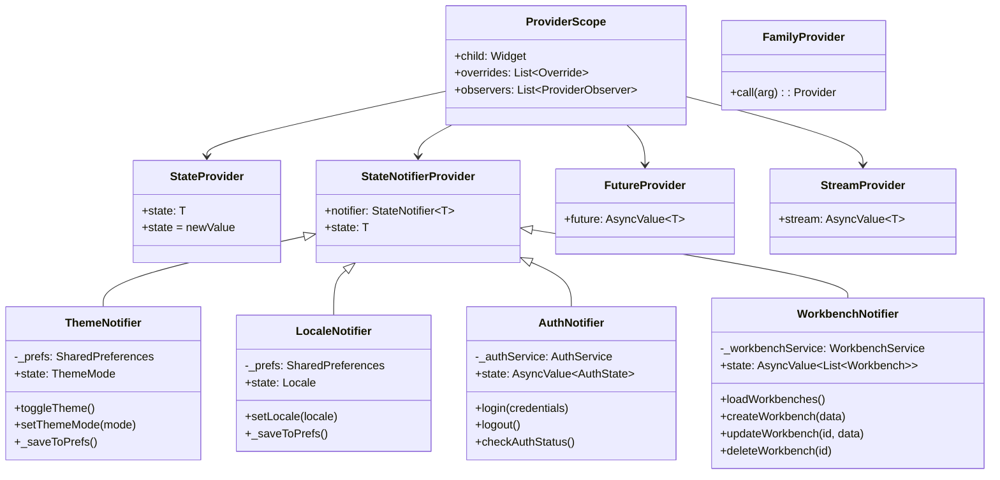
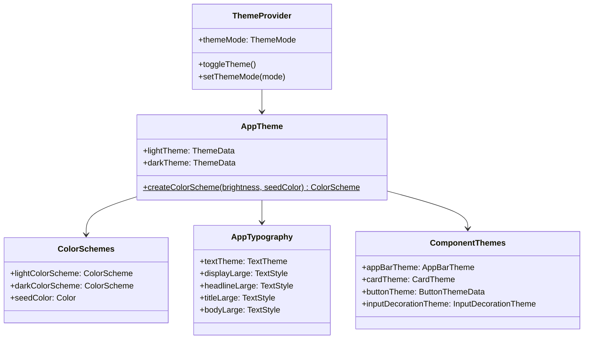

# S1-002 详细设计文档
## Flutter前端工程初始化

**任务ID**: S1-002  
**任务名称**: Flutter前端工程初始化  
**版本**: 1.0  
**日期**: 2024-03-15  
**状态**: 设计中

---

## 目录

1. [设计概述](#1-设计概述)
2. [项目目录结构](#2-项目目录结构)
3. [依赖配置](#3-依赖配置)
4. [状态管理方案](#4-状态管理方案)
5. [主题系统设计](#5-主题系统设计)
6. [国际化配置](#6-国际化配置)
7. [应用入口与初始化流程](#7-应用入口与初始化流程)
8. [多平台桌面支持](#8-多平台桌面支持)
9. [核心组件设计](#9-核心组件设计)

---

## 1. 设计概述

### 1.1 设计目标

本设计文档定义S1-002任务的实现细节，目标是建立一个完整的Flutter桌面前端工程基础，包括：

- 规范的Flutter项目结构（支持Windows/Mac/Linux桌面平台）
- Riverpod状态管理方案配置
- Material Design 3主题系统（浅色/深色模式）
- 国际化支持框架
- 桌面平台特定配置（窗口管理、菜单等）
- 代码组织和模块化架构

### 1.2 设计约束

- Flutter SDK >= 3.19.0
- Dart SDK >= 3.3.0
- 启用桌面支持：`flutter config --enable-windows-desktop --enable-macos-desktop --enable-linux-desktop`
- 使用Material Design 3设计规范
- 遵循Clean Architecture代码组织原则

---

## 2. 项目目录结构

### 2.1 目录树

```
kayak-frontend/
├── pubspec.yaml                    # 项目配置和依赖
├── pubspec.lock                    # 依赖锁定文件
├── .gitignore                      # Git忽略规则
├── l10n.yaml                       # 国际化配置
├── analysis_options.yaml           # Dart静态分析配置
│
├── android/                        # Android平台配置
├── ios/                            # iOS平台配置
├── web/                            # Web平台配置
├── windows/                        # Windows桌面平台配置
├── macos/                          # macOS桌面平台配置
├── linux/                          # Linux桌面平台配置
│
├── assets/                         # 静态资源
│   ├── images/                     # 图片资源
│   ├── icons/                      # 图标资源
│   └── fonts/                      # 字体资源
│
├── lib/                            # 主代码目录
│   ├── main.dart                   # 应用入口
│   ├── app.dart                    # 应用配置（主题、路由）
│   │
│   ├── core/                       # 核心基础设施
│   │   ├── constants/              # 常量定义
│   │   │   ├── app_constants.dart
│   │   │   └── api_constants.dart
│   │   ├── theme/                  # 主题配置
│   │   │   ├── app_theme.dart      # 主题定义
│   │   │   ├── color_schemes.dart  # 颜色方案
│   │   │   └── app_typography.dart # 字体排版
│   │   ├── router/                 # 路由配置
│   │   │   └── app_router.dart
│   │   ├── api/                    # API客户端
│   │   │   ├── api_client.dart
│   │   │   └── api_exception.dart
│   │   ├── websocket/              # WebSocket客户端
│   │   │   └── websocket_client.dart
│   │   └── utils/                  # 工具函数
│   │       └── extensions.dart
│   │
│   ├── models/                     # 数据模型
│   │   ├── user.dart
│   │   ├── workbench.dart
│   │   ├── device.dart
│   │   ├── point.dart
│   │   ├── method.dart
│   │   └── experiment.dart
│   │
│   ├── providers/                  # Riverpod状态管理
│   │   ├── core/                   # 核心Provider
│   │   │   ├── theme_provider.dart
│   │   │   ├── locale_provider.dart
│   │   │   └── connection_provider.dart
│   │   ├── auth/                   # 认证相关
│   │   │   └── auth_provider.dart
│   │   ├── workbench/              # 工作台相关
│   │   │   └── workbench_provider.dart
│   │   └── device/                 # 设备相关
│   │       └── device_provider.dart
│   │
│   ├── services/                   # 业务服务层
│   │   ├── auth_service.dart
│   │   ├── workbench_service.dart
│   │   ├── device_service.dart
│   │   ├── method_service.dart
│   │   └── experiment_service.dart
│   │
│   ├── screens/                    # 页面（Screens）
│   │   ├── splash_screen.dart      # 启动页
│   │   ├── login_screen.dart       # 登录页
│   │   ├── home_screen.dart        # 首页
│   │   ├── dashboard_screen.dart   # 仪表盘
│   │   ├── workbench/              # 工作台模块
│   │   │   ├── workbench_list_screen.dart
│   │   │   ├── workbench_detail_screen.dart
│   │   │   └── workbench_form_screen.dart
│   │   ├── device/                 # 设备模块
│   │   ├── method/                 # 试验方法模块
│   │   ├── experiment/             # 试验模块
│   │   ├── data/                   # 数据管理模块
│   │   └── settings/               # 设置模块
│   │       └── settings_screen.dart
│   │
│   ├── widgets/                    # 可复用组件
│   │   ├── common/                 # 通用组件
│   │   │   ├── app_bar.dart
│   │   │   ├── app_drawer.dart
│   │   │   ├── loading_indicator.dart
│   │   │   ├── error_widget.dart
│   │   │   └── responsive_layout.dart
│   │   ├── forms/                  # 表单组件
│   │   └── data/                   # 数据展示组件
│   │
│   └── l10n/                       # 国际化资源
│       ├── app_en.arb              # 英文翻译
│       ├── app_zh.arb              # 中文翻译
│       └── app_fr.arb              # 法文翻译
│
└── test/                           # 测试目录
    ├── widget/                     # Widget测试
    │   ├── app_test.dart
    │   ├── theme_test.dart
    │   └── material_design_3_test.dart
    ├── unit/                       # 单元测试
    └── integration/                # 集成测试
```

### 2.2 文件职责说明

| 文件/目录 | 职责 |
|---------|------|
| `pubspec.yaml` | 项目元数据、依赖声明、资源配置 |
| `l10n.yaml` | 国际化配置文件 |
| `lib/main.dart` | 应用入口，初始化ProviderScope和App |
| `lib/app.dart` | 应用配置，包含MaterialApp、主题、路由 |
| `lib/core/` | 核心基础设施（主题、路由、API、工具） |
| `lib/models/` | 数据模型（实体类、DTO） |
| `lib/providers/` | Riverpod状态管理（按业务模块组织） |
| `lib/services/` | 业务服务层（API调用封装） |
| `lib/screens/` | 页面组件（按业务模块组织） |
| `lib/widgets/` | 可复用UI组件 |
| `lib/l10n/` | 国际化翻译文件（ARB格式） |
| `test/` | 测试代码 |

---

## 3. 依赖配置

### 3.1 pubspec.yaml 完整配置

```yaml
name: kayak_frontend
description: Kayak Scientific Research Support Platform - Flutter Frontend

# 版本号遵循语义化版本规范
version: 0.1.0+1

environment:
  sdk: '>=3.3.0 <4.0.0'
  flutter: '>=3.19.0'

dependencies:
  flutter:
    sdk: flutter

  # ==================== UI & 主题 ====================
  # Material Design 3 图标
  material_design_icons_flutter: ^7.0.7296
  # 响应式布局支持
  flutter_adaptive_scaffold: ^0.1.10
  # 自适应布局
  adaptive_breakpoints: ^0.1.6

  # ==================== 状态管理 ====================
  # Riverpod - 状态管理方案
  flutter_riverpod: ^2.4.10
  # Riverpod代码生成（可选，用于复杂状态管理）
  riverpod_annotation: ^2.3.4

  # ==================== 路由 ====================
  # 声明式路由
  go_router: ^13.2.0

  # ==================== 网络通信 ====================
  # HTTP客户端
  dio: ^5.4.1
  # WebSocket客户端
  web_socket_channel: ^2.4.4

  # ==================== 本地存储 ====================
  # 轻量级键值存储（用于主题、语言等偏好设置）
  shared_preferences: ^2.2.2

  # ==================== 国际化 ====================
  flutter_localizations:
    sdk: flutter
  intl: ^0.18.1

  # ==================== 数据序列化 ====================
  # JSON序列化
  json_annotation: ^4.8.1
  freezed_annotation: ^2.4.1

  # ==================== 图表与数据可视化 ====================
  # 图表组件
  fl_chart: ^0.66.0

  # ==================== 桌面平台支持 ====================
  # 窗口管理（桌面平台）
  window_manager: ^0.3.7
  # 托盘图标支持
  system_tray: ^2.0.3

  # ==================== 工具库 ====================
  # 函数式编程工具
  dartz: ^0.10.1
  #  equatable替代，用于值比较
  freezed: ^2.4.7
  # 路径操作
  path: ^1.9.0
  # 日志
  logger: ^2.0.2
  # 结果类型
  multiple_result: ^5.1.0

dev_dependencies:
  flutter_test:
    sdk: flutter
  flutter_lints: ^3.0.1

  # 代码生成工具
  build_runner: ^2.4.8
  json_serializable: ^6.7.1
  freezed: ^2.4.7
  riverpod_generator: ^2.3.11
  go_router_builder: ^2.4.1

  # 测试工具
  mockito: ^5.4.4
  mocktail: ^1.0.3

flutter:
  # 启用Material Design
  uses-material-design: true

  # 静态资源配置
  assets:
    - assets/images/
    - assets/icons/

  # 字体配置（可选，使用系统默认字体也可）
  fonts:
    - family: NotoSansSC
      fonts:
        - asset: assets/fonts/NotoSansSC-Regular.otf
        - asset: assets/fonts/NotoSansSC-Bold.otf
          weight: 700
```

### 3.2 依赖项详细说明

| 依赖 | 版本 | 用途 | 特性说明 |
|-----|------|------|---------|
| **flutter_riverpod** | ^2.4.10 | 状态管理 | 响应式状态管理，支持依赖注入 |
| **go_router** | ^13.2.0 | 路由管理 | 声明式路由，支持深层链接 |
| **dio** | ^5.4.1 | HTTP客户端 | 支持拦截器、取消请求、文件上传下载 |
| **web_socket_channel** | ^2.4.4 | WebSocket | 实时通信，支持自动重连 |
| **shared_preferences** | ^2.2.2 | 本地存储 | 轻量级键值存储，用于用户偏好 |
| **window_manager** | ^0.3.7 | 窗口管理 | 桌面平台窗口控制（大小、位置、全屏等） |
| **fl_chart** | ^0.66.0 | 图表 | 数据可视化，支持折线图、柱状图等 |
| **freezed** | ^2.4.7 | 代码生成 | 不可变数据类、union类型、JSON序列化 |
| **logger** | ^2.0.2 | 日志 | 彩色日志输出，支持多级别 |
| **material_design_icons_flutter** | ^7.0.7296 | 图标 | 完整的Material Design图标库 |

---

## 4. 状态管理方案

### 4.1 Riverpod架构设计



### 4.2 Provider分类与定义

#### 4.2.1 核心Provider（core/）

```dart
// lib/providers/core/theme_provider.dart

import 'package:flutter/material.dart';
import 'package:flutter_riverpod/flutter_riverpod.dart';
import 'package:shared_preferences/shared_preferences.dart';

// 主题模式枚举扩展
enum AppThemeMode { light, dark, system }

// SharedPreferences Provider（延迟初始化）
final sharedPreferencesProvider = FutureProvider<SharedPreferences>((ref) async {
  return await SharedPreferences.getInstance();
});

// 主题状态Notifier
class ThemeNotifier extends StateNotifier<ThemeMode> {
  static const String _themeKey = 'app_theme_mode';
  SharedPreferences? _prefs;

  ThemeNotifier() : super(ThemeMode.light) {
    _loadTheme();
  }

  Future<void> _loadTheme() async {
    _prefs = await SharedPreferences.getInstance();
    final savedTheme = _prefs?.getString(_themeKey);
    if (savedTheme != null) {
      state = ThemeMode.values.firstWhere(
        (e) => e.name == savedTheme,
        orElse: () => ThemeMode.light,
      );
    }
  }

  void setThemeMode(ThemeMode mode) {
    state = mode;
    _prefs?.setString(_themeKey, mode.name);
  }

  void toggleTheme() {
    final newMode = state == ThemeMode.light ? ThemeMode.dark : ThemeMode.light;
    setThemeMode(newMode);
  }
}

// 主题Provider
final themeProvider = StateNotifierProvider<ThemeNotifier, ThemeMode>((ref) {
  return ThemeNotifier();
});

// 当前是否为深色模式（计算属性）
final isDarkModeProvider = Provider<bool>((ref) {
  final themeMode = ref.watch(themeProvider);
  if (themeMode == ThemeMode.system) {
    // 注意：实际应用中需要通过MediaQuery获取系统主题
    // 这里简化处理，默认为false
    return false;
  }
  return themeMode == ThemeMode.dark;
});
```

```dart
// lib/providers/core/locale_provider.dart

import 'package:flutter/material.dart';
import 'package:flutter_riverpod/flutter_riverpod.dart';
import 'package:shared_preferences/shared_preferences.dart';

// 支持的语言列表
final supportedLocalesProvider = Provider<List<Locale>>((ref) {
  return const [
    Locale('en'), // 英语
    Locale('zh'), // 中文
    Locale('fr'), // 法语
  ];
});

// 语言状态Notifier
class LocaleNotifier extends StateNotifier<Locale> {
  static const String _localeKey = 'app_locale';
  SharedPreferences? _prefs;

  LocaleNotifier() : super(const Locale('zh')) {
    _loadLocale();
  }

  Future<void> _loadLocale() async {
    _prefs = await SharedPreferences.getInstance();
    final savedLocale = _prefs?.getString(_localeKey);
    if (savedLocale != null) {
      state = Locale(savedLocale);
    }
  }

  void setLocale(Locale locale) {
    state = locale;
    _prefs?.setString(_localeKey, locale.languageCode);
  }
}

// 语言Provider
final localeProvider = StateNotifierProvider<LocaleNotifier, Locale>((ref) {
  return LocaleNotifier();
});
```

#### 4.2.2 Provider目录结构

```
lib/providers/
├── core/                           # 核心Provider
│   ├── theme_provider.dart         # 主题管理
│   ├── locale_provider.dart        # 语言管理
│   ├── connection_provider.dart    # 连接状态管理
│   └── router_provider.dart        # 路由状态
├── auth/                           # 认证模块
│   └── auth_provider.dart
├── workbench/                      # 工作台模块
│   └── workbench_provider.dart
├── device/                         # 设备模块
│   └── device_provider.dart
├── method/                         # 试验方法模块
│   └── method_provider.dart
└── experiment/                     # 试验模块
    └── experiment_provider.dart
```

### 4.3 Provider使用模式

```dart
// ConsumerWidget - 简单UI组件
class ThemeToggleButton extends ConsumerWidget {
  const ThemeToggleButton({super.key});

  @override
  Widget build(BuildContext context, WidgetRef ref) {
    final themeMode = ref.watch(themeProvider);
    final isDark = themeMode == ThemeMode.dark;

    return IconButton(
      icon: Icon(isDark ? Icons.light_mode : Icons.dark_mode),
      onPressed: () => ref.read(themeProvider.notifier).toggleTheme(),
    );
  }
}

// ConsumerStatefulWidget - 复杂状态组件
class WorkbenchListScreen extends ConsumerStatefulWidget {
  const WorkbenchListScreen({super.key});

  @override
  ConsumerState<WorkbenchListScreen> createState() => _WorkbenchListScreenState();
}

class _WorkbenchListScreenState extends ConsumerState<WorkbenchListScreen> {
  @override
  void initState() {
    super.initState();
    // 在initState中读取provider
    Future(() {
      ref.read(workbenchProvider.notifier).loadWorkbenches();
    });
  }

  @override
  Widget build(BuildContext context) {
    // 监听异步状态
    final workbenchesAsync = ref.watch(workbenchProvider);

    return workbenchesAsync.when(
      data: (workbenches) => WorkbenchListView(workbenches: workbenches),
      loading: () => const LoadingIndicator(),
      error: (error, stack) => ErrorWidget(message: error.toString()),
    );
  }
}
```

---

## 5. 主题系统设计

### 5.1 Material Design 3主题架构



### 5.2 主题配置实现

```dart
// lib/core/theme/color_schemes.dart

import 'package:flutter/material.dart';

/// Material Design 3 颜色方案定义
/// 
/// 使用种子颜色生成完整的ColorScheme
/// 浅色主题和深色主题分别定义

class AppColorSchemes {
  AppColorSchemes._();

  // 品牌种子颜色
  static const Color seedColor = Color(0xFF6750A4);

  /// 浅色主题颜色方案
  static ColorScheme get light {
    return ColorScheme.fromSeed(
      seedColor: seedColor,
      brightness: Brightness.light,
    );
  }

  /// 深色主题颜色方案
  static ColorScheme get dark {
    return ColorScheme.fromSeed(
      seedColor: seedColor,
      brightness: Brightness.dark,
    );
  }

  /// 自定义扩展颜色（可选）
  static const Color success = Color(0xFF4CAF50);
  static const Color warning = Color(0xFFFF9800);
  static const Color error = Color(0xFFE53935);
  static const Color info = Color(0xFF2196F3);
}
```

```dart
// lib/core/theme/app_typography.dart

import 'package:flutter/material.dart';

/// Material Design 3 字体排版定义
/// 
/// 定义应用中使用的所有文本样式
/// 遵循MD3 Typography规范

class AppTypography {
  AppTypography._();

  /// 创建文本主题
  static TextTheme get textTheme {
    return const TextTheme(
      // Display styles - 用于最大、最重要的标题
      displayLarge: TextStyle(
        fontSize: 57,
        fontWeight: FontWeight.w400,
        letterSpacing: -0.25,
        height: 1.12,
      ),
      displayMedium: TextStyle(
        fontSize: 45,
        fontWeight: FontWeight.w400,
        letterSpacing: 0,
        height: 1.16,
      ),
      displaySmall: TextStyle(
        fontSize: 36,
        fontWeight: FontWeight.w400,
        letterSpacing: 0,
        height: 1.22,
      ),

      // Headline styles - 用于页面标题
      headlineLarge: TextStyle(
        fontSize: 32,
        fontWeight: FontWeight.w400,
        letterSpacing: 0,
        height: 1.25,
      ),
      headlineMedium: TextStyle(
        fontSize: 28,
        fontWeight: FontWeight.w400,
        letterSpacing: 0,
        height: 1.29,
      ),
      headlineSmall: TextStyle(
        fontSize: 24,
        fontWeight: FontWeight.w400,
        letterSpacing: 0,
        height: 1.33,
      ),

      // Title styles - 用于卡片、对话框标题
      titleLarge: TextStyle(
        fontSize: 22,
        fontWeight: FontWeight.w400,
        letterSpacing: 0,
        height: 1.27,
      ),
      titleMedium: TextStyle(
        fontSize: 16,
        fontWeight: FontWeight.w500,
        letterSpacing: 0.15,
        height: 1.5,
      ),
      titleSmall: TextStyle(
        fontSize: 14,
        fontWeight: FontWeight.w500,
        letterSpacing: 0.1,
        height: 1.43,
      ),

      // Body styles - 用于正文文本
      bodyLarge: TextStyle(
        fontSize: 16,
        fontWeight: FontWeight.w400,
        letterSpacing: 0.5,
        height: 1.5,
      ),
      bodyMedium: TextStyle(
        fontSize: 14,
        fontWeight: FontWeight.w400,
        letterSpacing: 0.25,
        height: 1.43,
      ),
      bodySmall: TextStyle(
        fontSize: 12,
        fontWeight: FontWeight.w400,
        letterSpacing: 0.4,
        height: 1.33,
      ),

      // Label styles - 用于按钮、标签、说明文字
      labelLarge: TextStyle(
        fontSize: 14,
        fontWeight: FontWeight.w500,
        letterSpacing: 0.1,
        height: 1.43,
      ),
      labelMedium: TextStyle(
        fontSize: 12,
        fontWeight: FontWeight.w500,
        letterSpacing: 0.5,
        height: 1.33,
      ),
      labelSmall: TextStyle(
        fontSize: 11,
        fontWeight: FontWeight.w500,
        letterSpacing: 0.5,
        height: 1.45,
      ),
    );
  }
}
```

```dart
// lib/core/theme/app_theme.dart

import 'package:flutter/material.dart';
import 'package:flutter/services.dart';
import 'color_schemes.dart';
import 'app_typography.dart';

/// 应用主题配置
/// 
/// 定义浅色主题和深色主题的完整配置
/// 包括颜色方案、组件主题、字体排版等

class AppTheme {
  AppTheme._();

  /// 浅色主题
  static ThemeData get light {
    final colorScheme = AppColorSchemes.light;
    
    return ThemeData(
      useMaterial3: true,
      colorScheme: colorScheme,
      brightness: Brightness.light,
      textTheme: AppTypography.textTheme,
      
      // 应用栏主题
      appBarTheme: AppBarTheme(
        elevation: 0,
        scrolledUnderElevation: 1,
        centerTitle: false,
        backgroundColor: colorScheme.surface,
        foregroundColor: colorScheme.onSurface,
        systemOverlayStyle: SystemUiOverlayStyle.dark,
        titleTextStyle: AppTypography.textTheme.titleLarge?.copyWith(
          color: colorScheme.onSurface,
          fontWeight: FontWeight.w600,
        ),
      ),

      // 卡片主题
      cardTheme: CardTheme(
        elevation: 0,
        shape: RoundedRectangleBorder(
          borderRadius: BorderRadius.circular(12),
          side: BorderSide(
            color: colorScheme.outline.withOpacity(0.12),
            width: 1,
          ),
        ),
        color: colorScheme.surface,
      ),

      // 按钮主题
      elevatedButtonTheme: ElevatedButtonThemeData(
        style: ElevatedButton.styleFrom(
          elevation: 0,
          padding: const EdgeInsets.symmetric(horizontal: 24, vertical: 12),
          shape: RoundedRectangleBorder(
            borderRadius: BorderRadius.circular(8),
          ),
        ),
      ),

      filledButtonTheme: FilledButtonThemeData(
        style: FilledButton.styleFrom(
          padding: const EdgeInsets.symmetric(horizontal: 24, vertical: 12),
          shape: RoundedRectangleBorder(
            borderRadius: BorderRadius.circular(8),
          ),
        ),
      ),

      outlinedButtonTheme: OutlinedButtonThemeData(
        style: OutlinedButton.styleFrom(
          padding: const EdgeInsets.symmetric(horizontal: 24, vertical: 12),
          shape: RoundedRectangleBorder(
            borderRadius: BorderRadius.circular(8),
          ),
        ),
      ),

      textButtonTheme: TextButtonThemeData(
        style: TextButton.styleFrom(
          padding: const EdgeInsets.symmetric(horizontal: 16, vertical: 8),
        ),
      ),

      // 输入框主题
      inputDecorationTheme: InputDecorationTheme(
        filled: true,
        fillColor: colorScheme.surfaceContainerHighest.withOpacity(0.5),
        border: OutlineInputBorder(
          borderRadius: BorderRadius.circular(8),
          borderSide: BorderSide.none,
        ),
        enabledBorder: OutlineInputBorder(
          borderRadius: BorderRadius.circular(8),
          borderSide: BorderSide.none,
        ),
        focusedBorder: OutlineInputBorder(
          borderRadius: BorderRadius.circular(8),
          borderSide: BorderSide(
            color: colorScheme.primary,
            width: 2,
          ),
        ),
        errorBorder: OutlineInputBorder(
          borderRadius: BorderRadius.circular(8),
          borderSide: BorderSide(
            color: colorScheme.error,
            width: 1,
          ),
        ),
        contentPadding: const EdgeInsets.symmetric(horizontal: 16, vertical: 12),
      ),

      // 列表瓦片主题
      listTileTheme: ListTileThemeData(
        shape: RoundedRectangleBorder(
          borderRadius: BorderRadius.circular(8),
        ),
      ),

      // 分隔线主题
      dividerTheme: DividerThemeData(
        color: colorScheme.outlineVariant,
        thickness: 1,
        space: 1,
      ),

      // 底部导航栏主题
      bottomNavigationBarTheme: BottomNavigationBarThemeData(
        backgroundColor: colorScheme.surface,
        selectedItemColor: colorScheme.primary,
        unselectedItemColor: colorScheme.onSurfaceVariant,
        type: BottomNavigationBarType.fixed,
        elevation: 0,
      ),

      // 导航栏主题（MD3 NavigationBar）
      navigationBarTheme: NavigationBarThemeData(
        backgroundColor: colorScheme.surfaceContainer,
        indicatorColor: colorScheme.secondaryContainer,
        labelTextStyle: WidgetStateProperty.resolveWith((states) {
          if (states.contains(WidgetState.selected)) {
            return AppTypography.textTheme.labelMedium?.copyWith(
              color: colorScheme.onSurface,
              fontWeight: FontWeight.w600,
            );
          }
          return AppTypography.textTheme.labelMedium?.copyWith(
            color: colorScheme.onSurfaceVariant,
          );
        }),
      ),

      // 对话框主题
      dialogTheme: DialogTheme(
        shape: RoundedRectangleBorder(
          borderRadius: BorderRadius.circular(28),
        ),
        backgroundColor: colorScheme.surfaceContainerHigh,
      ),

      // 浮动操作按钮主题
      floatingActionButtonTheme: FloatingActionButtonThemeData(
        elevation: 3,
        shape: RoundedRectangleBorder(
          borderRadius: BorderRadius.circular(16),
        ),
      ),

      // Chip主题
      chipTheme: ChipThemeData(
        backgroundColor: colorScheme.surfaceContainerHighest,
        selectedColor: colorScheme.secondaryContainer,
        labelStyle: AppTypography.textTheme.labelLarge,
        shape: RoundedRectangleBorder(
          borderRadius: BorderRadius.circular(8),
        ),
      ),

      // Snackbar主题
      snackBarTheme: SnackBarThemeData(
        behavior: SnackBarBehavior.floating,
        shape: RoundedRectangleBorder(
          borderRadius: BorderRadius.circular(8),
        ),
        backgroundColor: colorScheme.inverseSurface,
        contentTextStyle: AppTypography.textTheme.bodyMedium?.copyWith(
          color: colorScheme.onInverseSurface,
        ),
      ),
    );
  }

  /// 深色主题
  static ThemeData get dark {
    final colorScheme = AppColorSchemes.dark;
    
    // 深色主题基于浅色主题，覆盖必要的属性
    return light.copyWith(
      brightness: Brightness.dark,
      colorScheme: colorScheme,
      
      appBarTheme: light.appBarTheme.copyWith(
        backgroundColor: colorScheme.surface,
        foregroundColor: colorScheme.onSurface,
        systemOverlayStyle: SystemUiOverlayStyle.light,
      ),

      scaffoldBackgroundColor: colorScheme.background,
      
      cardTheme: light.cardTheme.copyWith(
        color: colorScheme.surfaceContainerLow,
        shape: RoundedRectangleBorder(
          borderRadius: BorderRadius.circular(12),
          side: BorderSide(
            color: colorScheme.outline.withOpacity(0.24),
            width: 1,
          ),
        ),
      ),

      inputDecorationTheme: light.inputDecorationTheme.copyWith(
        fillColor: colorScheme.surfaceContainerHighest.withOpacity(0.4),
      ),

      bottomNavigationBarTheme: light.bottomNavigationBarTheme.copyWith(
        backgroundColor: colorScheme.surfaceContainer,
      ),
    );
  }
}
```

### 5.3 主题切换实现

```dart
// lib/widgets/common/theme_toggle.dart

import 'package:flutter/material.dart';
import 'package:flutter_riverpod/flutter_riverpod.dart';
import '../../providers/core/theme_provider.dart';

/// 主题切换按钮组件
/// 
/// 用于在AppBar或其他位置快速切换主题
class ThemeToggleButton extends ConsumerWidget {
  const ThemeToggleButton({super.key});

  @override
  Widget build(BuildContext context, WidgetRef ref) {
    final themeMode = ref.watch(themeProvider);
    
    IconData icon;
    String tooltip;
    
    switch (themeMode) {
      case ThemeMode.light:
        icon = Icons.dark_mode;
        tooltip = 'Switch to dark theme';
        break;
      case ThemeMode.dark:
        icon = Icons.light_mode;
        tooltip = 'Switch to light theme';
        break;
      case ThemeMode.system:
        // 检查当前系统主题
        final platformBrightness = MediaQuery.platformBrightnessOf(context);
        icon = platformBrightness == Brightness.light 
            ? Icons.dark_mode 
            : Icons.light_mode;
        tooltip = 'Theme follows system';
        break;
    }

    return IconButton(
      icon: Icon(icon),
      tooltip: tooltip,
      onPressed: () {
        final notifier = ref.read(themeProvider.notifier);
        if (themeMode == ThemeMode.light) {
          notifier.setThemeMode(ThemeMode.dark);
        } else {
          notifier.setThemeMode(ThemeMode.light);
        }
      },
    );
  }
}

/// 主题选择菜单
/// 
/// 提供更完整的主题模式选择（浅色/深色/跟随系统）
class ThemeSelector extends ConsumerWidget {
  const ThemeSelector({super.key});

  @override
  Widget build(BuildContext context, WidgetRef ref) {
    final themeMode = ref.watch(themeProvider);
    final colorScheme = Theme.of(context).colorScheme;

    return PopupMenuButton<ThemeMode>(
      tooltip: 'Select theme',
      icon: Icon(
        themeMode == ThemeMode.dark 
            ? Icons.dark_mode 
            : Icons.light_mode,
      ),
      onSelected: (mode) {
        ref.read(themeProvider.notifier).setThemeMode(mode);
      },
      itemBuilder: (context) => [
        PopupMenuItem(
          value: ThemeMode.light,
          child: Row(
            children: [
              Icon(
                Icons.light_mode,
                color: themeMode == ThemeMode.light 
                    ? colorScheme.primary 
                    : null,
              ),
              const SizedBox(width: 12),
              Text(
                'Light',
                style: TextStyle(
                  color: themeMode == ThemeMode.light 
                      ? colorScheme.primary 
                      : null,
                  fontWeight: themeMode == ThemeMode.light 
                      ? FontWeight.w600 
                      : null,
                ),
              ),
              if (themeMode == ThemeMode.light) ...[
                const SizedBox(width: 12),
                Icon(Icons.check, size: 18, color: colorScheme.primary),
              ],
            ],
          ),
        ),
        PopupMenuItem(
          value: ThemeMode.dark,
          child: Row(
            children: [
              Icon(
                Icons.dark_mode,
                color: themeMode == ThemeMode.dark 
                    ? colorScheme.primary 
                    : null,
              ),
              const SizedBox(width: 12),
              Text(
                'Dark',
                style: TextStyle(
                  color: themeMode == ThemeMode.dark 
                      ? colorScheme.primary 
                      : null,
                  fontWeight: themeMode == ThemeMode.dark 
                      ? FontWeight.w600 
                      : null,
                ),
              ),
              if (themeMode == ThemeMode.dark) ...[
                const SizedBox(width: 12),
                Icon(Icons.check, size: 18, color: colorScheme.primary),
              ],
            ],
          ),
        ),
        PopupMenuItem(
          value: ThemeMode.system,
          child: Row(
            children: [
              Icon(
                Icons.brightness_auto,
                color: themeMode == ThemeMode.system 
                    ? colorScheme.primary 
                    : null,
              ),
              const SizedBox(width: 12),
              Text(
                'System default',
                style: TextStyle(
                  color: themeMode == ThemeMode.system 
                      ? colorScheme.primary 
                      : null,
                  fontWeight: themeMode == ThemeMode.system 
                      ? FontWeight.w600 
                      : null,
                ),
              ),
              if (themeMode == ThemeMode.system) ...[
                const SizedBox(width: 12),
                Icon(Icons.check, size: 18, color: colorScheme.primary),
              ],
            ],
          ),
        ),
      ],
    );
  }
}
```

---

## 6. 国际化配置

### 6.1 l10n.yaml 配置

```yaml
# l10n.yaml
arb-dir: lib/l10n
template-arb-file: app_en.arb
output-localization-file: app_localizations.dart
output-dir: lib/generated
synthetic-package: false
output-class: AppLocalizations
preferred-supported-locales:
  - en
  - zh
  - fr
```

### 6.2 ARB翻译文件示例

```json
// lib/l10n/app_en.arb
{
  "@@locale": "en",
  "appTitle": "Kayak",
  "@appTitle": {
    "description": "The application title"
  },
  
  "welcomeMessage": "Welcome to Kayak",
  "@welcomeMessage": {
    "description": "Welcome message shown on home screen"
  },
  
  "themeLight": "Light",
  "themeDark": "Dark",
  "themeSystem": "System",
  
  "workbenchTitle": "Workbench",
  "workbenchCreate": "Create Workbench",
  "workbenchEdit": "Edit Workbench",
  "workbenchDelete": "Delete Workbench",
  
  "deviceTitle": "Device",
  "deviceConnect": "Connect",
  "deviceDisconnect": "Disconnect",
  
  "experimentTitle": "Experiment",
  "experimentStart": "Start",
  "experimentPause": "Pause",
  "experimentStop": "Stop",
  
  "cancel": "Cancel",
  "confirm": "Confirm",
  "save": "Save",
  "delete": "Delete",
  "edit": "Edit",
  "create": "Create",
  "loading": "Loading...",
  "error": "Error",
  "retry": "Retry"
}
```

```json
// lib/l10n/app_zh.arb
{
  "@@locale": "zh",
  "appTitle": "Kayak",
  "welcomeMessage": "欢迎使用 Kayak",
  "themeLight": "浅色",
  "themeDark": "深色",
  "themeSystem": "跟随系统",
  "workbenchTitle": "工作台",
  "workbenchCreate": "创建工作台",
  "workbenchEdit": "编辑工作台",
  "workbenchDelete": "删除工作台",
  "deviceTitle": "设备",
  "deviceConnect": "连接",
  "deviceDisconnect": "断开",
  "experimentTitle": "试验",
  "experimentStart": "开始",
  "experimentPause": "暂停",
  "experimentStop": "停止",
  "cancel": "取消",
  "confirm": "确认",
  "save": "保存",
  "delete": "删除",
  "edit": "编辑",
  "create": "创建",
  "loading": "加载中...",
  "error": "错误",
  "retry": "重试"
}
```

### 6.3 本地化Provider

```dart
// lib/providers/core/locale_provider.dart

import 'package:flutter/material.dart';
import 'package:flutter_riverpod/flutter_riverpod.dart';
import 'package:shared_preferences/shared_preferences.dart';
import '../../generated/app_localizations.dart';

/// 支持的语言列表
final supportedLocalesProvider = Provider<List<Locale>>((ref) {
  return AppLocalizations.supportedLocales;
});

/// 本地化委托列表
final localizationsDelegatesProvider = Provider<List<LocalizationsDelegate<dynamic>>>((ref) {
  return AppLocalizations.localizationsDelegates;
});

/// 语言状态Notifier
class LocaleNotifier extends StateNotifier<Locale> {
  static const String _localeKey = 'app_locale';
  SharedPreferences? _prefs;

  LocaleNotifier() : super(const Locale('zh')) {
    _loadLocale();
  }

  Future<void> _loadLocale() async {
    _prefs = await SharedPreferences.getInstance();
    final savedLocaleCode = _prefs?.getString(_localeKey);
    if (savedLocaleCode != null) {
      state = Locale(savedLocaleCode);
    }
  }

  void setLocale(Locale locale) {
    // 验证语言是否受支持
    if (!AppLocalizations.supportedLocales.contains(locale)) {
      return;
    }
    
    state = locale;
    _prefs?.setString(_localeKey, locale.languageCode);
  }

  /// 根据语言代码设置语言
  void setLocaleByCode(String languageCode) {
    setLocale(Locale(languageCode));
  }
}

/// 语言Provider
final localeProvider = StateNotifierProvider<LocaleNotifier, Locale>((ref) {
  return LocaleNotifier();
});

/// 当前本地化对象Provider
final appLocalizationsProvider = Provider<AppLocalizations>((ref) {
  throw UnimplementedError('Must be overridden in widget tree using ProviderScope');
});
```

---

## 7. 应用入口与初始化流程

### 7.1 应用启动时序图

```mermaid
sequenceDiagram
    participant main as main()
    participant WM as WindowManager
    participant Riverpod as ProviderScope
    participant App as KayakApp
    participant Material as MaterialApp
    participant Home as HomeScreen
    
    main->>WM: ensureInitialized()
    main->>WM: setMinimumSize()
    main->>WM: setTitle()
    main->>WM: waitUntilReadyToShow()
    main->>WM: show()
    
    main->>Riverpod: ProviderScope(child: KayakApp())
    Riverpod->>App: build()
    
    App->>Material: MaterialApp(
        theme: AppTheme.light,
        darkTheme: AppTheme.dark,
        themeMode: ref.watch(themeProvider),
        localizationsDelegates: ...,
        supportedLocales: ...,
        locale: ref.watch(localeProvider),
        routerConfig: ref.watch(routerProvider),
    )
    
    Material->>Home: 初始路由页面
```

### 7.2 应用入口实现

```dart
// lib/main.dart

import 'package:flutter/material.dart';
import 'package:flutter_riverpod/flutter_riverpod.dart';
import 'package:window_manager/window_manager.dart';
import 'app.dart';

void main() async {
  // 确保Flutter绑定初始化
  WidgetsFlutterBinding.ensureInitialized();

  // 初始化窗口管理器（桌面平台）
  await _initializeWindowManager();

  // 运行应用
  runApp(
    const ProviderScope(
      child: KayakApp(),
    ),
  );
}

/// 初始化窗口管理器
/// 
/// 配置桌面窗口的最小尺寸、标题等属性
Future<void> _initializeWindowManager() async {
  // 初始化窗口管理器
  await windowManager.ensureInitialized();

  // 窗口配置选项
  const windowOptions = WindowOptions(
    size: Size(1280, 800),           // 初始窗口大小
    minimumSize: Size(1024, 768),    // 最小窗口尺寸
    center: true,                     // 屏幕居中
    backgroundColor: Colors.transparent,
    skipTaskbar: false,
    titleBarStyle: TitleBarStyle.normal,
    title: 'Kayak - Scientific Research Platform',
  );

  // 应用窗口配置
  await windowManager.waitUntilReadyToShow(windowOptions, () async {
    await windowManager.show();
    await windowManager.focus();
  });
}
```

### 7.3 应用配置实现

```dart
// lib/app.dart

import 'package:flutter/material.dart';
import 'package:flutter_localizations/flutter_localizations.dart';
import 'package:flutter_riverpod/flutter_riverpod.dart';
import 'core/router/app_router.dart';
import 'core/theme/app_theme.dart';
import 'generated/app_localizations.dart';
import 'providers/core/locale_provider.dart';
import 'providers/core/theme_provider.dart';

/// Kayak应用根组件
/// 
/// 配置MaterialApp的所有全局属性，包括：
/// - 主题（浅色/深色/跟随系统）
/// - 路由
/// - 国际化
/// - 其他全局配置
class KayakApp extends ConsumerWidget {
  const KayakApp({super.key});

  @override
  Widget build(BuildContext context, WidgetRef ref) {
    // 监听主题和语言设置
    final themeMode = ref.watch(themeProvider);
    final locale = ref.watch(localeProvider);
    final router = ref.watch(appRouterProvider);

    return MaterialApp.router(
      // 应用标题
      title: 'Kayak',
      
      // 调试配置
      debugShowCheckedModeBanner: false,
      
      // 主题配置
      theme: AppTheme.light,
      darkTheme: AppTheme.dark,
      themeMode: themeMode,
      
      // 国际化配置
      localizationsDelegates: const [
        AppLocalizations.delegate,
        GlobalMaterialLocalizations.delegate,
        GlobalWidgetsLocalizations.delegate,
        GlobalCupertinoLocalizations.delegate,
      ],
      supportedLocales: AppLocalizations.supportedLocales,
      locale: locale,
      
      // 路由配置（使用go_router）
      routerConfig: router,
      
      // 滚动行为（桌面平台使用）
      scrollBehavior: const MaterialScrollBehavior().copyWith(
        dragDevices: {
          PointerDeviceKind.mouse,
          PointerDeviceKind.touch,
          PointerDeviceKind.stylus,
          PointerDeviceKind.trackpad,
        },
      ),
      
      // 构建器（可用于全局覆盖，如错误边界）
      builder: (context, child) {
        // 为整个应用提供本地化访问
        return ProviderScope(
          overrides: [
            appLocalizationsProvider.overrideWithValue(
              AppLocalizations.of(context)!,
            ),
          ],
          child: child!,
        );
      },
    );
  }
}
```

### 7.4 路由配置

```dart
// lib/core/router/app_router.dart

import 'package:flutter/material.dart';
import 'package:flutter_riverpod/flutter_riverpod.dart';
import 'package:go_router/go_router.dart';
import '../../screens/splash_screen.dart';
import '../../screens/login_screen.dart';
import '../../screens/home_screen.dart';
import '../../screens/workbench/workbench_list_screen.dart';
import '../../screens/settings/settings_screen.dart';

/// 应用路由路径常量
class AppRoutes {
  AppRoutes._();

  static const String splash = '/';
  static const String login = '/login';
  static const String home = '/home';
  static const String workbenches = '/workbenches';
  static const String settings = '/settings';
}

/// 路由Provider
final appRouterProvider = Provider<GoRouter>((ref) {
  return GoRouter(
    initialLocation: AppRoutes.splash,
    debugLogDiagnostics: true, // 开发环境启用路由日志
    routes: [
      // 启动页
      GoRoute(
        path: AppRoutes.splash,
        builder: (context, state) => const SplashScreen(),
      ),
      
      // 登录页
      GoRoute(
        path: AppRoutes.login,
        builder: (context, state) => const LoginScreen(),
      ),
      
      // 首页（带底部导航）
      GoRoute(
        path: AppRoutes.home,
        builder: (context, state) => const HomeScreen(),
      ),
      
      // 工作台列表
      GoRoute(
        path: AppRoutes.workbenches,
        builder: (context, state) => const WorkbenchListScreen(),
      ),
      
      // 设置页
      GoRoute(
        path: AppRoutes.settings,
        builder: (context, state) => const SettingsScreen(),
      ),
    ],
    
    // 错误页面
    errorBuilder: (context, state) => Scaffold(
      body: Center(
        child: Text('Page not found: ${state.uri.path}'),
      ),
    ),
    
    // 路由重定向（可用于认证检查）
    redirect: (context, state) {
      // TODO: 实现认证状态检查
      // 如果未登录，重定向到登录页
      return null;
    },
  );
});
```

---

## 8. 多平台桌面支持

### 8.1 平台特定配置

#### Windows配置 (windows/runner/main.cpp)

```cpp
#include <flutter/dart_project.h>
#include <flutter/flutter_view_controller.h>
#include <windows.h>
#include "flutter_window.h"
#include "utils.h"

int APIENTRY wWinMain(_In_ HINSTANCE instance,
                      _In_opt_ HINSTANCE prev,
                      _In_ wchar_t* command_line,
                      _In_ int show_command) {
  // 将输出附加到父控制台（用于调试）
  if (!::AttachConsole(ATTACH_PARENT_PROCESS) && ::IsDebuggerPresent()) {
    CreateAndAttachConsole();
  }

  // 初始化COM（某些插件需要）
  ::CoInitializeEx(nullptr, COINIT_APARTMENTTHREADED);

  flutter::DartProject project(L"data");

  std::vector<std::string> command_line_arguments =
      GetCommandLineArguments();

  project.set_dart_entrypoint_arguments(std::move(command_line_arguments));

  FlutterWindow window(project);
  Win32Window::Point origin(10, 10);
  // 初始窗口大小（会被window_manager覆盖）
  Win32Window::Size size(1280, 800);

  if (!window.Create(L"Kayak", origin, size)) {
    return EXIT_FAILURE;
  }

  window.SetQuitOnClose(true);

  ::MSG msg;
  while (::GetMessage(&msg, nullptr, 0, 0)) {
    ::TranslateMessage(&msg);
    ::DispatchMessage(&msg);
  }

  ::CoUninitialize();
  return EXIT_SUCCESS;
}
```

#### macOS配置 (macos/Runner/MainFlutterWindow.swift)

```swift
import Cocoa
import FlutterMacOS

class MainFlutterWindow: NSWindow {
  override func awakeFromNib() {
    let flutterViewController = FlutterViewController()
    let windowFrame = self.frame
    self.contentViewController = flutterViewController
    self.setFrame(windowFrame, display: true)

    // 配置窗口标题
    self.title = "Kayak"
    
    // 允许调整大小
    self.styleMask.insert(.resizable)
    
    // 最小尺寸（会被window_manager覆盖）
    self.minSize = NSSize(width: 1024, height: 768)

    RegisterGeneratedPlugins(registry: flutterViewController)

    super.awakeFromNib()
  }
}
```

#### Linux配置 (linux/my_application.cc)

```cpp
#include "my_application.h"

#include <flutter_linux/flutter_linux.h>

struct _MyApplication {
  GtkApplication parent_instance;
  char** dart_entrypoint_arguments;
};

G_DEFINE_TYPE(MyApplication, my_application, GTK_TYPE_APPLICATION)

static void my_application_activate(GApplication* application) {
  MyApplication* self = MY_APPLICATION(application);
  GtkWindow* window =
      GTK_WINDOW(gtk_application_window_new(GTK_APPLICATION(application)));

  // 窗口标题
  gtk_window_set_title(window, "Kayak");

  // 默认大小（会被window_manager覆盖）
  gtk_window_set_default_size(window, 1280, 800);

  g_autoptr(FlDartProject) project = fl_dart_project_new();
  fl_dart_project_set_dart_entrypoint_arguments(
      project, self->dart_entrypoint_arguments);

  FlView* view = fl_view_new(project);
  gtk_widget_show(GTK_WIDGET(view));
  gtk_container_add(GTK_CONTAINER(window), GTK_WIDGET(view));

  fl_register_plugins(FL_PLUGIN_REGISTRY(view));

  gtk_widget_show(GTK_WIDGET(window));
  gtk_widget_grab_focus(GTK_WIDGET(view));
}

static void my_application_class_init(MyApplicationClass* klass) {
  G_APPLICATION_CLASS(klass)->activate = my_application_activate;
}

static void my_application_init(MyApplication* self) {}

MyApplication* my_application_new() {
  return MY_APPLICATION(g_object_new(my_application_get_type(),
                                     "application-id", APPLICATION_ID,
                                     "flags", G_APPLICATION_NON_UNIQUE,
                                     nullptr));
}
```

### 8.2 桌面平台支持检查清单

| 平台 | 配置项 | 文件路径 | 说明 |
|-----|--------|---------|------|
| **Windows** | 应用ID | `windows/runner/Runner.rc` | 修改CompanyName和FileDescription |
| **Windows** | 应用图标 | `windows/runner/resources/app_icon.ico` | 替换为应用图标 |
| **macOS** | Bundle ID | `macos/Runner/Configs/AppInfo.xcconfig` | 设置PRODUCT_BUNDLE_IDENTIFIER |
| **macOS** | 应用图标 | `macos/Runner/Assets.xcassets/AppIcon.appiconset` | 替换图标集 |
| **macOS** | 应用名称 | `macos/Runner/Info.plist` | 设置CFBundleName |
| **Linux** | 应用ID | `linux/CMakeLists.txt` | 设置APPLICATION_ID |
| **Linux** | 应用名称 | `linux/my_application.cc` | 设置gtk_window_set_title |

---

## 9. 核心组件设计

### 9.1 通用组件库

```dart
// lib/widgets/common/app_bar.dart

import 'package:flutter/material.dart';
import 'theme_toggle.dart';

/// 统一的应用栏组件
/// 
/// 提供一致的AppBar外观和行为
class KayakAppBar extends StatelessWidget implements PreferredSizeWidget {
  final String title;
  final List<Widget>? actions;
  final bool showThemeToggle;
  final bool automaticallyImplyLeading;
  final Widget? leading;
  final PreferredSizeWidget? bottom;

  const KayakAppBar({
    super.key,
    required this.title,
    this.actions,
    this.showThemeToggle = true,
    this.automaticallyImplyLeading = true,
    this.leading,
    this.bottom,
  });

  @override
  Widget build(BuildContext context) {
    final List<Widget> effectiveActions = [
      if (showThemeToggle) const ThemeToggleButton(),
      if (actions != null) ...actions!,
      const SizedBox(width: 8),
    ];

    return AppBar(
      title: Text(title),
      leading: leading,
      automaticallyImplyLeading: automaticallyImplyLeading,
      actions: effectiveActions.isNotEmpty ? effectiveActions : null,
      bottom: bottom,
    );
  }

  @override
  Size get preferredSize => Size.fromHeight(
        kToolbarHeight + (bottom?.preferredSize.height ?? 0),
      );
}
```

```dart
// lib/widgets/common/loading_indicator.dart

import 'package:flutter/material.dart';

/// 统一加载指示器
/// 
/// 提供一致的加载状态UI
class LoadingIndicator extends StatelessWidget {
  final String? message;
  final double size;

  const LoadingIndicator({
    super.key,
    this.message,
    this.size = 48,
  });

  @override
  Widget build(BuildContext context) {
    final colorScheme = Theme.of(context).colorScheme;

    return Center(
      child: Column(
        mainAxisSize: MainAxisSize.min,
        children: [
          SizedBox(
            width: size,
            height: size,
            child: CircularProgressIndicator(
              strokeWidth: 3,
              color: colorScheme.primary,
            ),
          ),
          if (message != null) ...[
            const SizedBox(height: 16),
            Text(
              message!,
              style: TextStyle(
                color: colorScheme.onSurfaceVariant,
              ),
            ),
          ],
        ],
      ),
    );
  }
}

/// 骨架屏加载
class SkeletonLoading extends StatelessWidget {
  final int itemCount;

  const SkeletonLoading({
    super.key,
    this.itemCount = 5,
  });

  @override
  Widget build(BuildContext context) {
    final colorScheme = Theme.of(context).colorScheme;

    return ListView.builder(
      shrinkWrap: true,
      physics: const NeverScrollableScrollPhysics(),
      itemCount: itemCount,
      itemBuilder: (context, index) {
        return Container(
          margin: const EdgeInsets.symmetric(horizontal: 16, vertical: 8),
          height: 72,
          decoration: BoxDecoration(
            color: colorScheme.surfaceContainerHighest.withOpacity(0.5),
            borderRadius: BorderRadius.circular(12),
          ),
        );
      },
    );
  }
}
```

```dart
// lib/widgets/common/error_widget.dart

import 'package:flutter/material.dart';

/// 错误展示组件
/// 
/// 统一处理错误状态的UI展示
class ErrorDisplay extends StatelessWidget {
  final String message;
  final VoidCallback? onRetry;
  final IconData icon;

  const ErrorDisplay({
    super.key,
    required this.message,
    this.onRetry,
    this.icon = Icons.error_outline,
  });

  @override
  Widget build(BuildContext context) {
    final colorScheme = Theme.of(context).colorScheme;

    return Center(
      child: Padding(
        padding: const EdgeInsets.all(32),
        child: Column(
          mainAxisSize: MainAxisSize.min,
          children: [
            Icon(
              icon,
              size: 64,
              color: colorScheme.error,
            ),
            const SizedBox(height: 16),
            Text(
              'Error',
              style: Theme.of(context).textTheme.headlineSmall?.copyWith(
                    color: colorScheme.error,
                  ),
            ),
            const SizedBox(height: 8),
            Text(
              message,
              textAlign: TextAlign.center,
              style: TextStyle(
                color: colorScheme.onSurfaceVariant,
              ),
            ),
            if (onRetry != null) ...[
              const SizedBox(height: 24),
              FilledButton.icon(
                onPressed: onRetry,
                icon: const Icon(Icons.refresh),
                label: const Text('Retry'),
              ),
            ],
          ],
        ),
      ),
    );
  }
}
```

### 9.2 响应式布局组件

```dart
// lib/widgets/common/responsive_layout.dart

import 'package:flutter/material.dart';

/// 响应式断点定义
class Breakpoints {
  Breakpoints._();

  static const double mobile = 600;
  static const double tablet = 900;
  static const double desktop = 1200;
}

/// 响应式布局构建器
/// 
/// 根据屏幕宽度自动选择布局
class ResponsiveLayout extends StatelessWidget {
  final Widget mobile;
  final Widget? tablet;
  final Widget? desktop;

  const ResponsiveLayout({
    super.key,
    required this.mobile,
    this.tablet,
    this.desktop,
  });

  @override
  Widget build(BuildContext context) {
    return LayoutBuilder(
      builder: (context, constraints) {
        if (constraints.maxWidth >= Breakpoints.desktop && desktop != null) {
          return desktop!;
        }
        if (constraints.maxWidth >= Breakpoints.tablet && tablet != null) {
          return tablet!;
        }
        return mobile;
      },
    );
  }
}

/// 桌面侧边栏布局
/// 
/// 适用于桌面端的主从布局
class DesktopLayout extends StatelessWidget {
  final Widget navigationRail;
  final Widget content;
  final double navigationWidth;

  const DesktopLayout({
    super.key,
    required this.navigationRail,
    required this.content,
    this.navigationWidth = 280,
  });

  @override
  Widget build(BuildContext context) {
    return Row(
      children: [
        SizedBox(
          width: navigationWidth,
          child: navigationRail,
        ),
        const VerticalDivider(width: 1, thickness: 1),
        Expanded(child: content),
      ],
    );
  }
}
```

---

## 附录

### A. 文件清单

| 文件 | 用途 | 优先级 |
|-----|------|-------|
| `pubspec.yaml` | 项目配置和依赖 | P0 |
| `l10n.yaml` | 国际化配置 | P0 |
| `lib/main.dart` | 应用入口 | P0 |
| `lib/app.dart` | 应用配置 | P0 |
| `lib/core/theme/app_theme.dart` | 主题定义 | P0 |
| `lib/core/theme/color_schemes.dart` | 颜色方案 | P0 |
| `lib/core/theme/app_typography.dart` | 字体排版 | P0 |
| `lib/core/router/app_router.dart` | 路由配置 | P0 |
| `lib/providers/core/theme_provider.dart` | 主题状态管理 | P0 |
| `lib/providers/core/locale_provider.dart` | 语言状态管理 | P0 |
| `lib/widgets/common/theme_toggle.dart` | 主题切换组件 | P0 |
| `lib/l10n/app_en.arb` | 英文翻译 | P1 |
| `lib/l10n/app_zh.arb` | 中文翻译 | P1 |
| `test/widget/theme_test.dart` | 主题测试 | P0 |
| `test/widget/material_design_3_test.dart` | MD3测试 | P0 |

### B. 命令参考

```bash
# 创建Flutter项目
flutter create --platforms=windows,macos,linux kayak_frontend

# 获取依赖
flutter pub get

# 运行开发服务器（指定平台）
flutter run -d windows
flutter run -d macos
flutter run -d linux

# 构建发布版本
flutter build windows
flutter build macos
flutter build linux

# 运行测试
flutter test

# 生成国际化代码
flutter gen-l10n

# 代码生成（freezed, riverpod等）
flutter pub run build_runner build
```

### C. 参考文档

- [Flutter Desktop Documentation](https://docs.flutter.dev/desktop)
- [Material Design 3 Guidelines](https://m3.material.io/)
- [Riverpod Documentation](https://riverpod.dev/)
- [go_router Documentation](https://pub.dev/packages/go_router)
- [Flutter Internationalization](https://docs.flutter.dev/ui/accessibility-and-internationalization/internationalization)

---

**文档结束**

| 版本 | 日期 | 修订人 | 修订内容 |
|-----|------|-------|---------|
| 1.0 | 2024-03-15 | sw-tom | 初始版本 |
