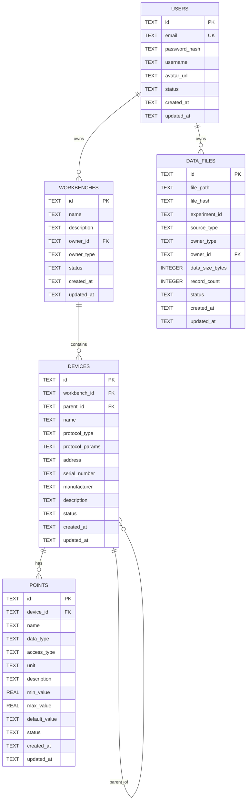
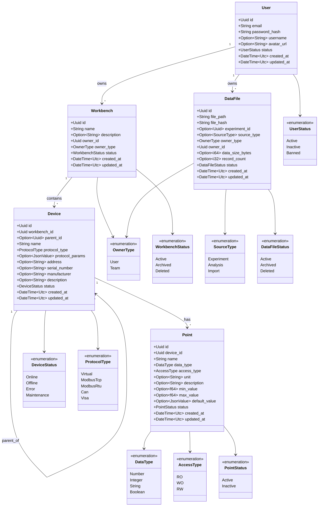

# S1-003: SQLite数据库Schema设计

**任务ID**: S1-003  
**任务名称**: SQLite数据库Schema设计  
**版本**: 1.0  
**创建日期**: 2026-03-15  
**状态**: Draft

---

## 1. 设计概述

### 1.1 设计目标
本设计文档定义了Kayak科学研究支持软件Release 0的数据库Schema，包括用户认证、工作台管理、设备管理、测点管理和数据文件元信息管理所需的所有表结构。

### 1.2 设计原则
1. **UUID主键**: 所有表使用TEXT类型的UUID作为主键，支持分布式部署
2. **时间戳追踪**: 每个表必须包含`created_at`和`updated_at`字段
3. **外键约束**: 建立表间关系，支持级联删除
4. **JSON支持**: 使用SQLite的JSON类型存储灵活配置数据
5. **索引优化**: 为常用查询字段创建索引

### 1.3 数据类型映射

| Rust类型 | SQLite类型 | 说明 |
|----------|------------|------|
| `String` | `TEXT` | 字符串，UUID存储为TEXT |
| `i64` | `INTEGER` | 整型，布尔值用0/1表示 |
| `f64` | `REAL` | 浮点型 |
| `bool` | `INTEGER` | 0=false, 1=true |
| `DateTime<Utc>` | `TEXT` | ISO 8601格式存储 |
| `Uuid` | `TEXT` | UUID字符串格式 |
| `Option<T>` | 可空字段 | SQLite支持NULL |

---

## 2. ER图设计

### 2.1 实体关系图



### 2.2 关系说明

| 关系 | 类型 | 描述 |
|------|------|------|
| `users` → `workbenches` | 1:N | 一个用户可以拥有多个工作台 |
| `workbenches` → `devices` | 1:N | 一个工作台可以包含多个设备 |
| `devices` → `devices` | 1:N | 设备自引用，支持嵌套结构（父设备→子设备） |
| `devices` → `points` | 1:N | 一个设备可以有多个测点 |
| `users` → `data_files` | 1:N | 一个用户可以拥有多个数据文件 |

### 2.3 级联删除策略

| 父表 | 子表 | 级联行为 | 说明 |
|------|------|----------|------|
| `users` | `workbenches` | CASCADE | 删除用户时级联删除其工作台 |
| `workbenches` | `devices` | CASCADE | 删除工作台时级联删除设备 |
| `devices` | `devices` (parent) | CASCADE | 删除父设备时级联删除子设备 |
| `devices` | `points` | CASCADE | 删除设备时级联删除测点 |
| `users` | `data_files` | RESTRICT | 有数据文件时不能删除用户 |

---

## 3. 表结构设计

### 3.1 用户表 (users)

存储用户认证和基本信息。

**表定义**:

```sql
CREATE TABLE users (
    id TEXT PRIMARY KEY,                                    -- UUID主键
    email TEXT NOT NULL UNIQUE,                             -- 邮箱，唯一标识
    password_hash TEXT NOT NULL,                            -- bcrypt密码哈希
    username TEXT,                                          -- 显示名称
    avatar_url TEXT,                                        -- 头像URL
    status TEXT DEFAULT 'active' CHECK (status IN ('active', 'inactive', 'banned')),  -- 账户状态
    created_at TEXT NOT NULL,                               -- 创建时间 (ISO 8601)
    updated_at TEXT NOT NULL                                -- 更新时间 (ISO 8601)
);
```

**字段说明**:

| 字段名 | 类型 | 约束 | 默认值 | 说明 |
|--------|------|------|--------|------|
| `id` | TEXT | PRIMARY KEY | - | UUIDv4格式 |
| `email` | TEXT | NOT NULL, UNIQUE | - | 用户登录邮箱 |
| `password_hash` | TEXT | NOT NULL | - | bcrypt哈希值 |
| `username` | TEXT | - | NULL | 显示名称，可选 |
| `avatar_url` | TEXT | - | NULL | 头像URL，可选 |
| `status` | TEXT | CHECK | 'active' | active/inactive/banned |
| `created_at` | TEXT | NOT NULL | - | 创建时间戳 |
| `updated_at` | TEXT | NOT NULL | - | 更新时间戳 |

**索引**:

```sql
CREATE INDEX idx_users_email ON users(email);
```

---

### 3.2 工作台表 (workbenches)

存储工作台配置信息，支持用户个人工作台。

**表定义**:

```sql
CREATE TABLE workbenches (
    id TEXT PRIMARY KEY,                                    -- UUID主键
    name TEXT NOT NULL,                                     -- 工作台名称
    description TEXT,                                       -- 描述
    owner_id TEXT NOT NULL,                                 -- 所有者ID
    owner_type TEXT DEFAULT 'user' CHECK (owner_type IN ('user', 'team')),  -- 所有者类型
    status TEXT DEFAULT 'active' CHECK (status IN ('active', 'archived', 'deleted')),  -- 状态
    created_at TEXT NOT NULL,                               -- 创建时间
    updated_at TEXT NOT NULL,                               -- 更新时间
    FOREIGN KEY (owner_id) REFERENCES users(id) ON DELETE CASCADE
);
```

**字段说明**:

| 字段名 | 类型 | 约束 | 默认值 | 说明 |
|--------|------|------|--------|------|
| `id` | TEXT | PRIMARY KEY | - | UUIDv4格式 |
| `name` | TEXT | NOT NULL | - | 工作台名称 |
| `description` | TEXT | - | NULL | 工作台描述 |
| `owner_id` | TEXT | NOT NULL, FK | - | 关联users.id |
| `owner_type` | TEXT | CHECK | 'user' | user/team |
| `status` | TEXT | CHECK | 'active' | active/archived/deleted |
| `created_at` | TEXT | NOT NULL | - | 创建时间戳 |
| `updated_at` | TEXT | NOT NULL | - | 更新时间戳 |

**索引**:

```sql
CREATE INDEX idx_workbenches_owner ON workbenches(owner_id, owner_type);
CREATE INDEX idx_workbenches_status ON workbenches(status);
```

---

### 3.3 设备表 (devices)

存储设备信息，支持嵌套结构（父设备/子设备）。

**表定义**:

```sql
CREATE TABLE devices (
    id TEXT PRIMARY KEY,                                    -- UUID主键
    workbench_id TEXT NOT NULL,                             -- 所属工作台ID
    parent_id TEXT,                                         -- 父设备ID（支持嵌套）
    name TEXT NOT NULL,                                     -- 设备名称
    protocol_type TEXT NOT NULL,                            -- 协议类型
    protocol_params TEXT,                                   -- 协议参数（JSON格式）
    address TEXT,                                           -- 设备地址/连接信息
    serial_number TEXT,                                     -- 序列号
    manufacturer TEXT,                                      -- 制造商
    description TEXT,                                       -- 设备描述
    status TEXT DEFAULT 'offline' CHECK (status IN ('online', 'offline', 'error', 'maintenance')),  -- 设备状态
    created_at TEXT NOT NULL,                               -- 创建时间
    updated_at TEXT NOT NULL,                               -- 更新时间
    FOREIGN KEY (workbench_id) REFERENCES workbenches(id) ON DELETE CASCADE,
    FOREIGN KEY (parent_id) REFERENCES devices(id) ON DELETE CASCADE
);
```

**字段说明**:

| 字段名 | 类型 | 约束 | 默认值 | 说明 |
|--------|------|------|--------|------|
| `id` | TEXT | PRIMARY KEY | - | UUIDv4格式 |
| `workbench_id` | TEXT | NOT NULL, FK | - | 关联workbenches.id |
| `parent_id` | TEXT | FK, NULL | NULL | 自引用，支持设备嵌套 |
| `name` | TEXT | NOT NULL | - | 设备名称 |
| `protocol_type` | TEXT | NOT NULL | - | Virtual/ModbusTCP/ModbusRTU等 |
| `protocol_params` | TEXT | - | NULL | JSON格式的协议配置 |
| `address` | TEXT | - | NULL | IP地址、串口等连接信息 |
| `serial_number` | TEXT | - | NULL | 设备序列号 |
| `manufacturer` | TEXT | - | NULL | 制造商名称 |
| `description` | TEXT | - | NULL | 设备描述 |
| `status` | TEXT | CHECK | 'offline' | online/offline/error/maintenance |
| `created_at` | TEXT | NOT NULL | - | 创建时间戳 |
| `updated_at` | TEXT | NOT NULL | - | 更新时间戳 |

**索引**:

```sql
CREATE INDEX idx_devices_workbench ON devices(workbench_id);
CREATE INDEX idx_devices_parent ON devices(parent_id);
CREATE INDEX idx_devices_protocol ON devices(protocol_type);
```

**支持的协议类型**:

| 协议类型 | 说明 | Release 0支持 |
|----------|------|---------------|
| `Virtual` | 虚拟设备（模拟） | ✅ |
| `ModbusTCP` | Modbus TCP协议 | 🔮 |
| `ModbusRTU` | Modbus RTU协议 | 🔮 |
| `CAN` | CAN总线 | 🔮 |
| `VISA` | VISA仪器控制 | 🔮 |

---

### 3.4 测点表 (points)

存储设备测点（数据点）定义。

**表定义**:

```sql
CREATE TABLE points (
    id TEXT PRIMARY KEY,                                    -- UUID主键
    device_id TEXT NOT NULL,                                -- 所属设备ID
    name TEXT NOT NULL,                                     -- 测点名称
    data_type TEXT NOT NULL CHECK (data_type IN ('Number', 'Integer', 'String', 'Boolean')),  -- 数据类型
    access_type TEXT NOT NULL CHECK (access_type IN ('RO', 'WO', 'RW')),  -- 访问类型
    unit TEXT,                                              -- 单位（如°C, V, A等）
    description TEXT,                                       -- 测点描述
    min_value REAL,                                         -- 最小值（用于验证）
    max_value REAL,                                         -- 最大值（用于验证）
    default_value TEXT,                                     -- 默认值（JSON格式存储）
    status TEXT DEFAULT 'active' CHECK (status IN ('active', 'inactive')),  -- 状态
    created_at TEXT NOT NULL,                               -- 创建时间
    updated_at TEXT NOT NULL,                               -- 更新时间
    FOREIGN KEY (device_id) REFERENCES devices(id) ON DELETE CASCADE
);
```

**字段说明**:

| 字段名 | 类型 | 约束 | 默认值 | 说明 |
|--------|------|------|--------|------|
| `id` | TEXT | PRIMARY KEY | - | UUIDv4格式 |
| `device_id` | TEXT | NOT NULL, FK | - | 关联devices.id |
| `name` | TEXT | NOT NULL | - | 测点名称（如Temperature） |
| `data_type` | TEXT | NOT NULL, CHECK | - | Number/Integer/String/Boolean |
| `access_type` | TEXT | NOT NULL, CHECK | - | RO（只读）/WO（只写）/RW（读写） |
| `unit` | TEXT | - | NULL | 单位符号 |
| `description` | TEXT | - | NULL | 测点描述 |
| `min_value` | REAL | - | NULL | 数值范围下限 |
| `max_value` | REAL | - | NULL | 数值范围上限 |
| `default_value` | TEXT | - | NULL | JSON格式的默认值 |
| `status` | TEXT | CHECK | 'active' | active/inactive |
| `created_at` | TEXT | NOT NULL | - | 创建时间戳 |
| `updated_at` | TEXT | NOT NULL | - | 更新时间戳 |

**索引**:

```sql
CREATE INDEX idx_points_device ON points(device_id);
CREATE INDEX idx_points_access ON points(access_type);
```

**数据类型映射**:

| data_type | Rust类型 | SQLite存储 | 说明 |
|-----------|----------|------------|------|
| `Number` | `f64` | REAL | 浮点数 |
| `Integer` | `i64` | INTEGER | 整数 |
| `String` | `String` | TEXT | 字符串 |
| `Boolean` | `bool` | INTEGER(0/1) | 布尔值 |

**访问类型说明**:

| access_type | 说明 | 用途 |
|-------------|------|------|
| `RO` | Read Only | 传感器读数 |
| `WO` | Write Only | 控制指令 |
| `RW` | Read/Write | 可读写设定值 |

---

### 3.5 数据文件元信息表 (data_files)

存储HDF5数据文件的元信息。

**表定义**:

```sql
CREATE TABLE data_files (
    id TEXT PRIMARY KEY,                                    -- UUID主键
    file_path TEXT NOT NULL,                                -- 文件存储路径
    file_hash TEXT NOT NULL,                                -- 文件哈希（SHA-256）
    experiment_id TEXT,                                     -- 关联试验ID（可选）
    source_type TEXT CHECK (source_type IN ('experiment', 'analysis', 'import')),  -- 来源类型
    owner_type TEXT DEFAULT 'user' CHECK (owner_type IN ('user', 'team')),  -- 所有者类型
    owner_id TEXT NOT NULL,                                 -- 所有者ID
    data_size_bytes INTEGER,                                -- 文件大小（字节）
    record_count INTEGER,                                   -- 记录数量
    status TEXT DEFAULT 'active' CHECK (status IN ('active', 'archived', 'deleted')),  -- 状态
    created_at TEXT NOT NULL,                               -- 创建时间
    updated_at TEXT NOT NULL,                               -- 更新时间
    FOREIGN KEY (owner_id) REFERENCES users(id)
);
```

**字段说明**:

| 字段名 | 类型 | 约束 | 默认值 | 说明 |
|--------|------|------|--------|------|
| `id` | TEXT | PRIMARY KEY | - | UUIDv4格式 |
| `file_path` | TEXT | NOT NULL | - | HDF5文件路径 |
| `file_hash` | TEXT | NOT NULL | - | SHA-256哈希值 |
| `experiment_id` | TEXT | - | NULL | 关联试验ID（预留） |
| `source_type` | TEXT | CHECK | NULL | 数据来源类型 |
| `owner_type` | TEXT | CHECK | 'user' | user/team |
| `owner_id` | TEXT | NOT NULL, FK | - | 关联users.id |
| `data_size_bytes` | INTEGER | - | NULL | 文件大小 |
| `record_count` | INTEGER | - | NULL | 数据记录数 |
| `status` | TEXT | CHECK | 'active' | active/archived/deleted |
| `created_at` | TEXT | NOT NULL | - | 创建时间戳 |
| `updated_at` | TEXT | NOT NULL | - | 更新时间戳 |

**索引**:

```sql
CREATE INDEX idx_data_files_owner ON data_files(owner_id, owner_type);
CREATE INDEX idx_data_files_experiment ON data_files(experiment_id);
CREATE INDEX idx_data_files_status ON data_files(status);
```

---

## 4. 触发器设计

### 4.1 自动更新时间戳触发器

为所有表创建`updated_at`自动更新触发器：

```sql
-- users表触发器
CREATE TRIGGER update_users_timestamp 
AFTER UPDATE ON users
BEGIN
    UPDATE users SET updated_at = datetime('now') WHERE id = NEW.id;
END;

-- workbenches表触发器
CREATE TRIGGER update_workbenches_timestamp 
AFTER UPDATE ON workbenches
BEGIN
    UPDATE workbenches SET updated_at = datetime('now') WHERE id = NEW.id;
END;

-- devices表触发器
CREATE TRIGGER update_devices_timestamp 
AFTER UPDATE ON devices
BEGIN
    UPDATE devices SET updated_at = datetime('now') WHERE id = NEW.id;
END;

-- points表触发器
CREATE TRIGGER update_points_timestamp 
AFTER UPDATE ON points
BEGIN
    UPDATE points SET updated_at = datetime('now') WHERE id = NEW.id;
END;

-- data_files表触发器
CREATE TRIGGER update_data_files_timestamp 
AFTER UPDATE ON data_files
BEGIN
    UPDATE data_files SET updated_at = datetime('now') WHERE id = NEW.id;
END;
```

### 4.2 触发器说明

| 触发器名称 | 关联表 | 触发时机 | 功能 |
|------------|--------|----------|------|
| `update_users_timestamp` | users | AFTER UPDATE | 自动更新updated_at为当前时间 |
| `update_workbenches_timestamp` | workbenches | AFTER UPDATE | 自动更新updated_at为当前时间 |
| `update_devices_timestamp` | devices | AFTER UPDATE | 自动更新updated_at为当前时间 |
| `update_points_timestamp` | points | AFTER UPDATE | 自动更新updated_at为当前时间 |
| `update_data_files_timestamp` | data_files | AFTER UPDATE | 自动更新updated_at为当前时间 |

---

## 5. sqlx迁移脚本

### 5.1 迁移文件结构

```
kayak-backend/migrations/
├── 20250315000001_create_users_table.sql
├── 20250315000002_create_workbenches_table.sql
├── 20250315000003_create_devices_table.sql
├── 20250315000004_create_points_table.sql
├── 20250315000005_create_data_files_table.sql
└── 20250315000006_create_update_triggers.sql
```

### 5.2 迁移脚本详情

#### Migration 001: 创建用户表

**文件名**: `20250315000001_create_users_table.sql`

```sql
-- 创建用户表
CREATE TABLE users (
    id TEXT PRIMARY KEY,
    email TEXT NOT NULL UNIQUE,
    password_hash TEXT NOT NULL,
    username TEXT,
    avatar_url TEXT,
    status TEXT DEFAULT 'active' CHECK (status IN ('active', 'inactive', 'banned')),
    created_at TEXT NOT NULL,
    updated_at TEXT NOT NULL
);

-- 创建邮箱索引
CREATE INDEX idx_users_email ON users(email);
```

#### Migration 002: 创建工作台表

**文件名**: `20250315000002_create_workbenches_table.sql`

```sql
-- 启用外键约束
PRAGMA foreign_keys = ON;

-- 创建工作台表
CREATE TABLE workbenches (
    id TEXT PRIMARY KEY,
    name TEXT NOT NULL,
    description TEXT,
    owner_id TEXT NOT NULL,
    owner_type TEXT DEFAULT 'user' CHECK (owner_type IN ('user', 'team')),
    status TEXT DEFAULT 'active' CHECK (status IN ('active', 'archived', 'deleted')),
    created_at TEXT NOT NULL,
    updated_at TEXT NOT NULL,
    FOREIGN KEY (owner_id) REFERENCES users(id) ON DELETE CASCADE
);

-- 创建索引
CREATE INDEX idx_workbenches_owner ON workbenches(owner_id, owner_type);
CREATE INDEX idx_workbenches_status ON workbenches(status);
```

#### Migration 003: 创建设备表

**文件名**: `20250315000003_create_devices_table.sql`

```sql
-- 启用外键约束
PRAGMA foreign_keys = ON;

-- 创建设备表
CREATE TABLE devices (
    id TEXT PRIMARY KEY,
    workbench_id TEXT NOT NULL,
    parent_id TEXT,
    name TEXT NOT NULL,
    protocol_type TEXT NOT NULL,
    protocol_params TEXT,
    address TEXT,
    serial_number TEXT,
    manufacturer TEXT,
    description TEXT,
    status TEXT DEFAULT 'offline' CHECK (status IN ('online', 'offline', 'error', 'maintenance')),
    created_at TEXT NOT NULL,
    updated_at TEXT NOT NULL,
    FOREIGN KEY (workbench_id) REFERENCES workbenches(id) ON DELETE CASCADE,
    FOREIGN KEY (parent_id) REFERENCES devices(id) ON DELETE CASCADE
);

-- 创建索引
CREATE INDEX idx_devices_workbench ON devices(workbench_id);
CREATE INDEX idx_devices_parent ON devices(parent_id);
CREATE INDEX idx_devices_protocol ON devices(protocol_type);
```

#### Migration 004: 创建测点表

**文件名**: `20250315000004_create_points_table.sql`

```sql
-- 启用外键约束
PRAGMA foreign_keys = ON;

-- 创建测点表
CREATE TABLE points (
    id TEXT PRIMARY KEY,
    device_id TEXT NOT NULL,
    name TEXT NOT NULL,
    data_type TEXT NOT NULL CHECK (data_type IN ('Number', 'Integer', 'String', 'Boolean')),
    access_type TEXT NOT NULL CHECK (access_type IN ('RO', 'WO', 'RW')),
    unit TEXT,
    description TEXT,
    min_value REAL,
    max_value REAL,
    default_value TEXT,
    status TEXT DEFAULT 'active' CHECK (status IN ('active', 'inactive')),
    created_at TEXT NOT NULL,
    updated_at TEXT NOT NULL,
    FOREIGN KEY (device_id) REFERENCES devices(id) ON DELETE CASCADE
);

-- 创建索引
CREATE INDEX idx_points_device ON points(device_id);
CREATE INDEX idx_points_access ON points(access_type);
```

#### Migration 005: 创建数据文件表

**文件名**: `20250315000005_create_data_files_table.sql`

```sql
-- 启用外键约束
PRAGMA foreign_keys = ON;

-- 创建数据文件表
CREATE TABLE data_files (
    id TEXT PRIMARY KEY,
    file_path TEXT NOT NULL,
    file_hash TEXT NOT NULL,
    experiment_id TEXT,
    source_type TEXT CHECK (source_type IN ('experiment', 'analysis', 'import')),
    owner_type TEXT DEFAULT 'user' CHECK (owner_type IN ('user', 'team')),
    owner_id TEXT NOT NULL,
    data_size_bytes INTEGER,
    record_count INTEGER,
    status TEXT DEFAULT 'active' CHECK (status IN ('active', 'archived', 'deleted')),
    created_at TEXT NOT NULL,
    updated_at TEXT NOT NULL,
    FOREIGN KEY (owner_id) REFERENCES users(id)
);

-- 创建索引
CREATE INDEX idx_data_files_owner ON data_files(owner_id, owner_type);
CREATE INDEX idx_data_files_experiment ON data_files(experiment_id);
CREATE INDEX idx_data_files_status ON data_files(status);
```

#### Migration 006: 创建更新触发器

**文件名**: `20250315000006_create_update_triggers.sql`

```sql
-- users表触发器
CREATE TRIGGER update_users_timestamp 
AFTER UPDATE ON users
BEGIN
    UPDATE users SET updated_at = datetime('now') WHERE id = NEW.id;
END;

-- workbenches表触发器
CREATE TRIGGER update_workbenches_timestamp 
AFTER UPDATE ON workbenches
BEGIN
    UPDATE workbenches SET updated_at = datetime('now') WHERE id = NEW.id;
END;

-- devices表触发器
CREATE TRIGGER update_devices_timestamp 
AFTER UPDATE ON devices
BEGIN
    UPDATE devices SET updated_at = datetime('now') WHERE id = NEW.id;
END;

-- points表触发器
CREATE TRIGGER update_points_timestamp 
AFTER UPDATE ON points
BEGIN
    UPDATE points SET updated_at = datetime('now') WHERE id = NEW.id;
END;

-- data_files表触发器
CREATE TRIGGER update_data_files_timestamp 
AFTER UPDATE ON data_files
BEGIN
    UPDATE data_files SET updated_at = datetime('now') WHERE id = NEW.id;
END;
```

### 5.3 执行迁移

```bash
# 设置数据库URL
export DATABASE_URL="sqlite:kayak.db"

# 运行所有迁移
sqlx migrate run

# 查看迁移状态
sqlx migrate info

# 回滚最近一次迁移
sqlx migrate revert
```

---

## 6. Rust实体结构定义

### 6.1 目录结构

```
kayak-backend/src/models/
├── mod.rs
└── entities/
    ├── mod.rs
    ├── user.rs
    ├── workbench.rs
    ├── device.rs
    ├── point.rs
    └── data_file.rs
```

### 6.2 用户实体 (user.rs)

```rust
//! User entity definition for sqlx

use chrono::{DateTime, Utc};
use serde::{Deserialize, Serialize};
use sqlx::FromRow;
use uuid::Uuid;

/// 用户账户状态
#[derive(Debug, Clone, Copy, PartialEq, Eq, Serialize, Deserialize, sqlx::Type)]
#[sqlx(rename_all = "lowercase")]
#[serde(rename_all = "lowercase")]
pub enum UserStatus {
    Active,
    Inactive,
    Banned,
}

impl Default for UserStatus {
    fn default() -> Self {
        UserStatus::Active
    }
}

/// 用户实体
#[derive(Debug, Clone, FromRow, Serialize, Deserialize)]
pub struct User {
    /// 用户ID (UUID)
    pub id: Uuid,
    /// 邮箱地址
    pub email: String,
    /// 密码哈希（bcrypt）
    pub password_hash: String,
    /// 用户名/显示名称
    pub username: Option<String>,
    /// 头像URL
    pub avatar_url: Option<String>,
    /// 账户状态
    pub status: UserStatus,
    /// 创建时间
    pub created_at: DateTime<Utc>,
    /// 更新时间
    pub updated_at: DateTime<Utc>,
}

/// 创建用户请求DTO
#[derive(Debug, Clone, Deserialize)]
pub struct CreateUserRequest {
    pub email: String,
    pub password_hash: String,
    pub username: Option<String>,
    pub avatar_url: Option<String>,
}

/// 更新用户请求DTO
#[derive(Debug, Clone, Deserialize)]
pub struct UpdateUserRequest {
    pub username: Option<String>,
    pub avatar_url: Option<String>,
    pub status: Option<UserStatus>,
}
```

### 6.3 工作台实体 (workbench.rs)

```rust
//! Workbench entity definition for sqlx

use chrono::{DateTime, Utc};
use serde::{Deserialize, Serialize};
use sqlx::FromRow;
use uuid::Uuid;

/// 所有者类型
#[derive(Debug, Clone, Copy, PartialEq, Eq, Serialize, Deserialize, sqlx::Type)]
#[sqlx(rename_all = "lowercase")]
#[serde(rename_all = "lowercase")]
pub enum OwnerType {
    User,
    Team,
}

impl Default for OwnerType {
    fn default() -> Self {
        OwnerType::User
    }
}

/// 工作台状态
#[derive(Debug, Clone, Copy, PartialEq, Eq, Serialize, Deserialize, sqlx::Type)]
#[sqlx(rename_all = "lowercase")]
#[serde(rename_all = "lowercase")]
pub enum WorkbenchStatus {
    Active,
    Archived,
    Deleted,
}

impl Default for WorkbenchStatus {
    fn default() -> Self {
        WorkbenchStatus::Active
    }
}

/// 工作台实体
#[derive(Debug, Clone, FromRow, Serialize, Deserialize)]
pub struct Workbench {
    /// 工作台ID (UUID)
    pub id: Uuid,
    /// 工作台名称
    pub name: String,
    /// 工作台描述
    pub description: Option<String>,
    /// 所有者ID
    pub owner_id: Uuid,
    /// 所有者类型
    pub owner_type: OwnerType,
    /// 工作台状态
    pub status: WorkbenchStatus,
    /// 创建时间
    pub created_at: DateTime<Utc>,
    /// 更新时间
    pub updated_at: DateTime<Utc>,
}

/// 创建工作台请求DTO
#[derive(Debug, Clone, Deserialize)]
pub struct CreateWorkbenchRequest {
    pub name: String,
    pub description: Option<String>,
    pub owner_id: Uuid,
    pub owner_type: Option<OwnerType>,
}

/// 更新工作台请求DTO
#[derive(Debug, Clone, Deserialize)]
pub struct UpdateWorkbenchRequest {
    pub name: Option<String>,
    pub description: Option<String>,
    pub status: Option<WorkbenchStatus>,
}
```

### 6.4 设备实体 (device.rs)

```rust
//! Device entity definition for sqlx

use chrono::{DateTime, Utc};
use serde::{Deserialize, Serialize};
use serde_json::Value as JsonValue;
use sqlx::FromRow;
use uuid::Uuid;

/// 设备协议类型
#[derive(Debug, Clone, Copy, PartialEq, Eq, Serialize, Deserialize, sqlx::Type)]
#[sqlx(rename_all = "PascalCase")]
#[serde(rename_all = "PascalCase")]
pub enum ProtocolType {
    Virtual,
    ModbusTcp,
    ModbusRtu,
    Can,
    Visa,
}

impl Default for ProtocolType {
    fn default() -> Self {
        ProtocolType::Virtual
    }
}

/// 设备状态
#[derive(Debug, Clone, Copy, PartialEq, Eq, Serialize, Deserialize, sqlx::Type)]
#[sqlx(rename_all = "lowercase")]
#[serde(rename_all = "lowercase")]
pub enum DeviceStatus {
    Online,
    Offline,
    Error,
    Maintenance,
}

impl Default for DeviceStatus {
    fn default() -> Self {
        DeviceStatus::Offline
    }
}

/// 设备实体
#[derive(Debug, Clone, FromRow, Serialize, Deserialize)]
pub struct Device {
    /// 设备ID (UUID)
    pub id: Uuid,
    /// 所属工作台ID
    pub workbench_id: Uuid,
    /// 父设备ID（支持嵌套）
    pub parent_id: Option<Uuid>,
    /// 设备名称
    pub name: String,
    /// 协议类型
    pub protocol_type: ProtocolType,
    /// 协议参数（JSON）
    pub protocol_params: Option<JsonValue>,
    /// 设备地址
    pub address: Option<String>,
    /// 序列号
    pub serial_number: Option<String>,
    /// 制造商
    pub manufacturer: Option<String>,
    /// 设备描述
    pub description: Option<String>,
    /// 设备状态
    pub status: DeviceStatus,
    /// 创建时间
    pub created_at: DateTime<Utc>,
    /// 更新时间
    pub updated_at: DateTime<Utc>,
}

/// 创建设备请求DTO
#[derive(Debug, Clone, Deserialize)]
pub struct CreateDeviceRequest {
    pub workbench_id: Uuid,
    pub parent_id: Option<Uuid>,
    pub name: String,
    pub protocol_type: ProtocolType,
    pub protocol_params: Option<JsonValue>,
    pub address: Option<String>,
    pub serial_number: Option<String>,
    pub manufacturer: Option<String>,
    pub description: Option<String>,
}

/// 更新设备请求DTO
#[derive(Debug, Clone, Deserialize)]
pub struct UpdateDeviceRequest {
    pub name: Option<String>,
    pub protocol_params: Option<JsonValue>,
    pub address: Option<String>,
    pub description: Option<String>,
    pub status: Option<DeviceStatus>,
}

/// 设备层级结构DTO
#[derive(Debug, Clone, Serialize)]
pub struct DeviceHierarchy {
    pub device: Device,
    pub children: Vec<DeviceHierarchy>,
    pub points: Vec<crate::models::entities::point::Point>,
}
```

### 6.5 测点实体 (point.rs)

```rust
//! Point entity definition for sqlx

use chrono::{DateTime, Utc};
use serde::{Deserialize, Serialize};
use serde_json::Value as JsonValue;
use sqlx::FromRow;
use uuid::Uuid;

/// 数据类型
#[derive(Debug, Clone, Copy, PartialEq, Eq, Serialize, Deserialize, sqlx::Type)]
#[sqlx(rename_all = "PascalCase")]
#[serde(rename_all = "PascalCase")]
pub enum DataType {
    Number,
    Integer,
    String,
    Boolean,
}

impl Default for DataType {
    fn default() -> Self {
        DataType::Number
    }
}

/// 访问类型
#[derive(Debug, Clone, Copy, PartialEq, Eq, Serialize, Deserialize, sqlx::Type)]
#[sqlx(rename_all = "UPPERCASE")]
#[serde(rename_all = "UPPERCASE")]
pub enum AccessType {
    Ro,  // Read Only
    Wo,  // Write Only
    Rw,  // Read/Write
}

impl Default for AccessType {
    fn default() -> Self {
        AccessType::Ro
    }
}

/// 测点状态
#[derive(Debug, Clone, Copy, PartialEq, Eq, Serialize, Deserialize, sqlx::Type)]
#[sqlx(rename_all = "lowercase")]
#[serde(rename_all = "lowercase")]
pub enum PointStatus {
    Active,
    Inactive,
}

impl Default for PointStatus {
    fn default() -> Self {
        PointStatus::Active
    }
}

/// 测点实体
#[derive(Debug, Clone, FromRow, Serialize, Deserialize)]
pub struct Point {
    /// 测点ID (UUID)
    pub id: Uuid,
    /// 所属设备ID
    pub device_id: Uuid,
    /// 测点名称
    pub name: String,
    /// 数据类型
    pub data_type: DataType,
    /// 访问类型
    pub access_type: AccessType,
    /// 单位
    pub unit: Option<String>,
    /// 测点描述
    pub description: Option<String>,
    /// 最小值
    pub min_value: Option<f64>,
    /// 最大值
    pub max_value: Option<f64>,
    /// 默认值（JSON格式）
    pub default_value: Option<JsonValue>,
    /// 测点状态
    pub status: PointStatus,
    /// 创建时间
    pub created_at: DateTime<Utc>,
    /// 更新时间
    pub updated_at: DateTime<Utc>,
}

/// 创建测点请求DTO
#[derive(Debug, Clone, Deserialize)]
pub struct CreatePointRequest {
    pub device_id: Uuid,
    pub name: String,
    pub data_type: DataType,
    pub access_type: AccessType,
    pub unit: Option<String>,
    pub description: Option<String>,
    pub min_value: Option<f64>,
    pub max_value: Option<f64>,
    pub default_value: Option<JsonValue>,
}

/// 更新测点请求DTO
#[derive(Debug, Clone, Deserialize)]
pub struct UpdatePointRequest {
    pub name: Option<String>,
    pub unit: Option<String>,
    pub description: Option<String>,
    pub min_value: Option<f64>,
    pub max_value: Option<f64>,
    pub default_value: Option<JsonValue>,
    pub status: Option<PointStatus>,
}

/// 测点值DTO（用于读写操作）
#[derive(Debug, Clone, Serialize, Deserialize)]
#[serde(untagged)]
pub enum PointValue {
    Number(f64),
    Integer(i64),
    String(String),
    Boolean(bool),
}
```

### 6.6 数据文件实体 (data_file.rs)

```rust
//! DataFile entity definition for sqlx

use chrono::{DateTime, Utc};
use serde::{Deserialize, Serialize};
use sqlx::FromRow;
use uuid::Uuid;
use crate::models::entities::workbench::OwnerType;

/// 数据来源类型
#[derive(Debug, Clone, Copy, PartialEq, Eq, Serialize, Deserialize, sqlx::Type)]
#[sqlx(rename_all = "lowercase")]
#[serde(rename_all = "lowercase")]
pub enum SourceType {
    Experiment,
    Analysis,
    Import,
}

impl Default for SourceType {
    fn default() -> Self {
        SourceType::Experiment
    }
}

/// 数据文件状态
#[derive(Debug, Clone, Copy, PartialEq, Eq, Serialize, Deserialize, sqlx::Type)]
#[sqlx(rename_all = "lowercase")]
#[serde(rename_all = "lowercase")]
pub enum DataFileStatus {
    Active,
    Archived,
    Deleted,
}

impl Default for DataFileStatus {
    fn default() -> Self {
        DataFileStatus::Active
    }
}

/// 数据文件元信息实体
#[derive(Debug, Clone, FromRow, Serialize, Deserialize)]
pub struct DataFile {
    /// 文件ID (UUID)
    pub id: Uuid,
    /// 文件路径
    pub file_path: String,
    /// 文件哈希（SHA-256）
    pub file_hash: String,
    /// 关联试验ID
    pub experiment_id: Option<Uuid>,
    /// 来源类型
    pub source_type: Option<SourceType>,
    /// 所有者类型
    pub owner_type: OwnerType,
    /// 所有者ID
    pub owner_id: Uuid,
    /// 文件大小（字节）
    pub data_size_bytes: Option<i64>,
    /// 记录数量
    pub record_count: Option<i32>,
    /// 文件状态
    pub status: DataFileStatus,
    /// 创建时间
    pub created_at: DateTime<Utc>,
    /// 更新时间
    pub updated_at: DateTime<Utc>,
}

/// 创建数据文件请求DTO
#[derive(Debug, Clone, Deserialize)]
pub struct CreateDataFileRequest {
    pub file_path: String,
    pub file_hash: String,
    pub experiment_id: Option<Uuid>,
    pub source_type: Option<SourceType>,
    pub owner_id: Uuid,
    pub owner_type: Option<OwnerType>,
    pub data_size_bytes: Option<i64>,
    pub record_count: Option<i32>,
}

/// 更新数据文件请求DTO
#[derive(Debug, Clone, Deserialize)]
pub struct UpdateDataFileRequest {
    pub file_path: Option<String>,
    pub file_hash: Option<String>,
    pub data_size_bytes: Option<i64>,
    pub record_count: Option<i32>,
    pub status: Option<DataFileStatus>,
}

/// 数据文件统计信息DTO
#[derive(Debug, Clone, Serialize)]
pub struct DataFileStats {
    pub total_files: i64,
    pub total_size_bytes: i64,
    pub total_records: i64,
}
```

### 6.7 实体模块聚合 (entities/mod.rs)

```rust
//! Database entities module

pub mod user;
pub mod workbench;
pub mod device;
pub mod point;
pub mod data_file;

// Re-export commonly used types
pub use user::{User, UserStatus, CreateUserRequest, UpdateUserRequest};
pub use workbench::{Workbench, WorkbenchStatus, OwnerType, CreateWorkbenchRequest, UpdateWorkbenchRequest};
pub use device::{Device, DeviceStatus, ProtocolType, CreateDeviceRequest, UpdateDeviceRequest, DeviceHierarchy};
pub use point::{Point, PointStatus, DataType, AccessType, CreatePointRequest, UpdatePointRequest, PointValue};
pub use data_file::{DataFile, DataFileStatus, SourceType, CreateDataFileRequest, UpdateDataFileRequest, DataFileStats};
```

---

## 7. 索引策略

### 7.1 索引清单

| 索引名称 | 表名 | 字段 | 类型 | 用途 |
|----------|------|------|------|------|
| `idx_users_email` | users | email | UNIQUE | 用户登录查询 |
| `idx_workbenches_owner` | workbenches | owner_id, owner_type | COMPOSITE | 用户工作台列表查询 |
| `idx_workbenches_status` | workbenches | status | SINGLE | 按状态筛选工作台 |
| `idx_devices_workbench` | devices | workbench_id | SINGLE | 工作台设备查询 |
| `idx_devices_parent` | devices | parent_id | SINGLE | 设备嵌套层级查询 |
| `idx_devices_protocol` | devices | protocol_type | SINGLE | 按协议类型筛选设备 |
| `idx_points_device` | points | device_id | SINGLE | 设备测点查询 |
| `idx_points_access` | points | access_type | SINGLE | 按访问类型筛选测点 |
| `idx_data_files_owner` | data_files | owner_id, owner_type | COMPOSITE | 用户文件列表查询 |
| `idx_data_files_experiment` | data_files | experiment_id | SINGLE | 试验关联文件查询 |
| `idx_data_files_status` | data_files | status | SINGLE | 按状态筛选文件 |

### 7.2 索引设计原则

1. **主键自动索引**: SQLite自动为主键创建索引
2. **唯一约束索引**: `users.email`使用唯一索引
3. **外键索引**: 所有外键字段创建索引以优化JOIN性能
4. **复合索引**: 常用组合查询字段创建复合索引（如`owner_id` + `owner_type`）
5. **选择性考虑**: 对status等枚举字段创建索引（值域较小但查询频繁）

---

## 8. 完整Schema SQL

```sql
-- =====================================================
-- Kayak Database Schema
-- Version: 1.0
-- Date: 2026-03-15
-- =====================================================

-- 启用外键约束
PRAGMA foreign_keys = ON;

-- =====================================================
-- 1. 用户表 (users)
-- =====================================================
CREATE TABLE users (
    id TEXT PRIMARY KEY,
    email TEXT NOT NULL UNIQUE,
    password_hash TEXT NOT NULL,
    username TEXT,
    avatar_url TEXT,
    status TEXT DEFAULT 'active' CHECK (status IN ('active', 'inactive', 'banned')),
    created_at TEXT NOT NULL,
    updated_at TEXT NOT NULL
);

CREATE INDEX idx_users_email ON users(email);

-- =====================================================
-- 2. 工作台表 (workbenches)
-- =====================================================
CREATE TABLE workbenches (
    id TEXT PRIMARY KEY,
    name TEXT NOT NULL,
    description TEXT,
    owner_id TEXT NOT NULL,
    owner_type TEXT DEFAULT 'user' CHECK (owner_type IN ('user', 'team')),
    status TEXT DEFAULT 'active' CHECK (status IN ('active', 'archived', 'deleted')),
    created_at TEXT NOT NULL,
    updated_at TEXT NOT NULL,
    FOREIGN KEY (owner_id) REFERENCES users(id) ON DELETE CASCADE
);

CREATE INDEX idx_workbenches_owner ON workbenches(owner_id, owner_type);
CREATE INDEX idx_workbenches_status ON workbenches(status);

-- =====================================================
-- 3. 设备表 (devices)
-- =====================================================
CREATE TABLE devices (
    id TEXT PRIMARY KEY,
    workbench_id TEXT NOT NULL,
    parent_id TEXT,
    name TEXT NOT NULL,
    protocol_type TEXT NOT NULL,
    protocol_params TEXT,
    address TEXT,
    serial_number TEXT,
    manufacturer TEXT,
    description TEXT,
    status TEXT DEFAULT 'offline' CHECK (status IN ('online', 'offline', 'error', 'maintenance')),
    created_at TEXT NOT NULL,
    updated_at TEXT NOT NULL,
    FOREIGN KEY (workbench_id) REFERENCES workbenches(id) ON DELETE CASCADE,
    FOREIGN KEY (parent_id) REFERENCES devices(id) ON DELETE CASCADE
);

CREATE INDEX idx_devices_workbench ON devices(workbench_id);
CREATE INDEX idx_devices_parent ON devices(parent_id);
CREATE INDEX idx_devices_protocol ON devices(protocol_type);

-- =====================================================
-- 4. 测点表 (points)
-- =====================================================
CREATE TABLE points (
    id TEXT PRIMARY KEY,
    device_id TEXT NOT NULL,
    name TEXT NOT NULL,
    data_type TEXT NOT NULL CHECK (data_type IN ('Number', 'Integer', 'String', 'Boolean')),
    access_type TEXT NOT NULL CHECK (access_type IN ('RO', 'WO', 'RW')),
    unit TEXT,
    description TEXT,
    min_value REAL,
    max_value REAL,
    default_value TEXT,
    status TEXT DEFAULT 'active' CHECK (status IN ('active', 'inactive')),
    created_at TEXT NOT NULL,
    updated_at TEXT NOT NULL,
    FOREIGN KEY (device_id) REFERENCES devices(id) ON DELETE CASCADE
);

CREATE INDEX idx_points_device ON points(device_id);
CREATE INDEX idx_points_access ON points(access_type);

-- =====================================================
-- 5. 数据文件元信息表 (data_files)
-- =====================================================
CREATE TABLE data_files (
    id TEXT PRIMARY KEY,
    file_path TEXT NOT NULL,
    file_hash TEXT NOT NULL,
    experiment_id TEXT,
    source_type TEXT CHECK (source_type IN ('experiment', 'analysis', 'import')),
    owner_type TEXT DEFAULT 'user' CHECK (owner_type IN ('user', 'team')),
    owner_id TEXT NOT NULL,
    data_size_bytes INTEGER,
    record_count INTEGER,
    status TEXT DEFAULT 'active' CHECK (status IN ('active', 'archived', 'deleted')),
    created_at TEXT NOT NULL,
    updated_at TEXT NOT NULL,
    FOREIGN KEY (owner_id) REFERENCES users(id)
);

CREATE INDEX idx_data_files_owner ON data_files(owner_id, owner_type);
CREATE INDEX idx_data_files_experiment ON data_files(experiment_id);
CREATE INDEX idx_data_files_status ON data_files(status);

-- =====================================================
-- 6. 自动更新时间戳触发器
-- =====================================================

-- users表触发器
CREATE TRIGGER update_users_timestamp 
AFTER UPDATE ON users
BEGIN
    UPDATE users SET updated_at = datetime('now') WHERE id = NEW.id;
END;

-- workbenches表触发器
CREATE TRIGGER update_workbenches_timestamp 
AFTER UPDATE ON workbenches
BEGIN
    UPDATE workbenches SET updated_at = datetime('now') WHERE id = NEW.id;
END;

-- devices表触发器
CREATE TRIGGER update_devices_timestamp 
AFTER UPDATE ON devices
BEGIN
    UPDATE devices SET updated_at = datetime('now') WHERE id = NEW.id;
END;

-- points表触发器
CREATE TRIGGER update_points_timestamp 
AFTER UPDATE ON points
BEGIN
    UPDATE points SET updated_at = datetime('now') WHERE id = NEW.id;
END;

-- data_files表触发器
CREATE TRIGGER update_data_files_timestamp 
AFTER UPDATE ON data_files
BEGIN
    UPDATE data_files SET updated_at = datetime('now') WHERE id = NEW.id;
END;
```

---

## 9. 类图设计

### 9.1 实体类图



---

## 10. 设计验证清单

### 10.1 Schema完整性检查

| 检查项 | 状态 | 说明 |
|--------|------|------|
| ✅ 所有表包含`created_at`字段 | PASS | 5个表都有 |
| ✅ 所有表包含`updated_at`字段 | PASS | 5个表都有 |
| ✅ 所有表使用UUID作为主键 | PASS | id字段均为TEXT类型 |
| ✅ 外键约束正确配置 | PASS | 级联删除策略明确 |
| ✅ 触发器自动更新时间戳 | PASS | 5个表都有update触发器 |
| ✅ 枚举值有CHECK约束 | PASS | 所有枚举字段 |
| ✅ 索引覆盖常用查询 | PASS | 11个索引 |
| ✅ 唯一约束配置 | PASS | users.email唯一 |

### 10.2 与测试用例对应

| 测试用例ID | 设计章节 | 验证内容 |
|------------|----------|----------|
| TC-S1-003-001 | 5.3 | sqlx迁移工具安装 |
| TC-S1-003-002 | 5.2 | 数据库迁移执行 |
| TC-S1-003-003 | 5.3 | 迁移回滚功能 |
| TC-S1-003-004 | 3.1, 6.2 | users表结构验证 |
| TC-S1-003-005 | 3.2, 6.3 | workbenches表结构验证 |
| TC-S1-003-006 | 3.3, 6.4 | devices表结构验证 |
| TC-S1-003-007 | 3.4, 6.5 | points表结构验证 |
| TC-S1-003-008 | 3.5, 6.6 | data_files表结构验证 |
| TC-S1-003-009 | 3.x | 所有表时间戳字段验证 |
| TC-S1-003-010 | 4 | 时间戳自动更新触发器验证 |
| TC-S1-003-011 | 2.1 | ER图文档完整性 |
| TC-S1-003-012 | 8 | 数据库约束完整性 |
| TC-S1-003-013 | 7 | 索引性能验证 |

---

## 11. 附录

### 11.1 SQLite数据类型参考

| SQLite类型 | Rust类型 | 说明 |
|------------|----------|------|
| `NULL` | `Option<T>` | NULL值 |
| `INTEGER` | `i64` | 整型，1-8字节 |
| `REAL` | `f64` | 浮点型，8字节IEEE |
| `TEXT` | `String` | UTF-8/UTF-16字符串 |
| `BLOB` | `Vec<u8>` | 二进制数据 |

### 11.2 sqlx特性配置

**Cargo.toml依赖**:

```toml
[dependencies]
sqlx = { version = "0.7", features = ["runtime-tokio-native-tls", "sqlite", "uuid", "chrono", "json"] }
uuid = { version = "1.6", features = ["v4", "serde"] }
chrono = { version = "0.4", features = ["serde"] }
serde = { version = "1.0", features = ["derive"] }
serde_json = "1.0"
```

### 11.3 常用SQLite命令

```bash
# 连接数据库
sqlite3 kayak.db

# 查看表结构
.schema

# 查看特定表结构
.schema users

# 查看表信息
PRAGMA table_info(users);

# 查看外键
PRAGMA foreign_key_list(workbenches);

# 查看索引
PRAGMA index_list(users);

# 导出数据
.mode csv
.output data.csv
SELECT * FROM users;

# 启用外键检查
PRAGMA foreign_keys = ON;
```

---

## 12. 文档历史

| 版本 | 日期 | 修改人 | 修改说明 |
|------|------|--------|----------|
| 1.0 | 2026-03-15 | SW-Dev | 初始版本创建 |

---

**文档结束**
