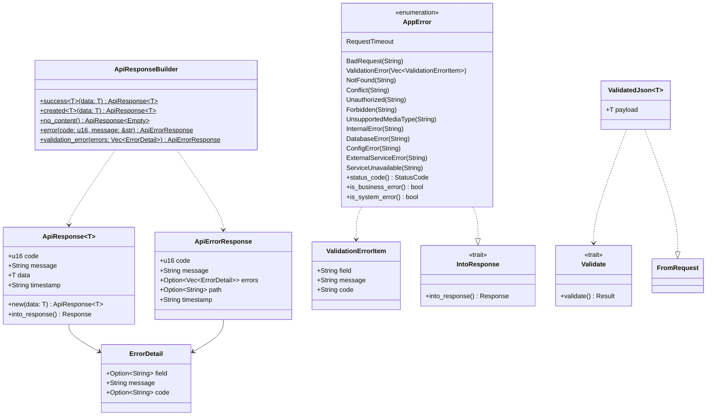
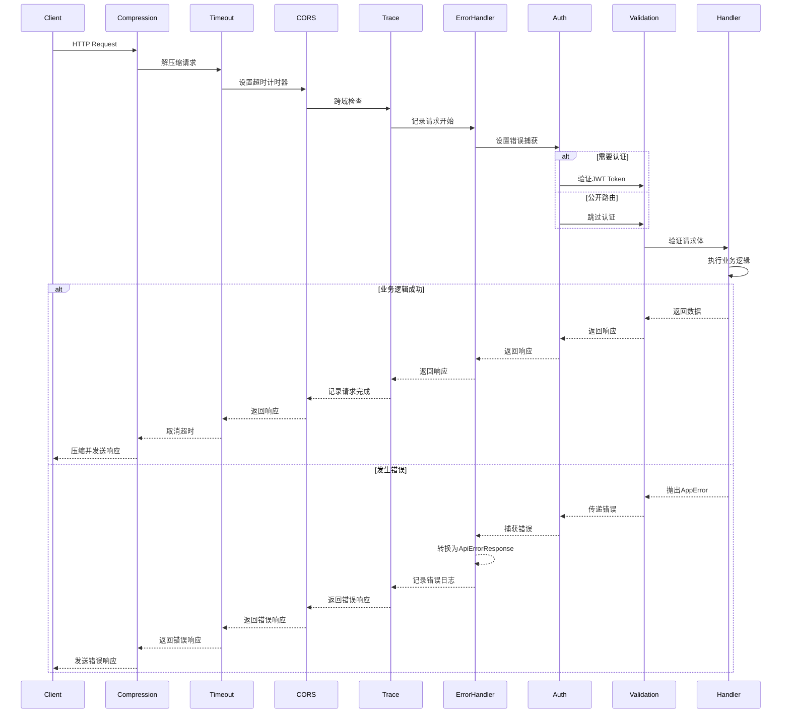
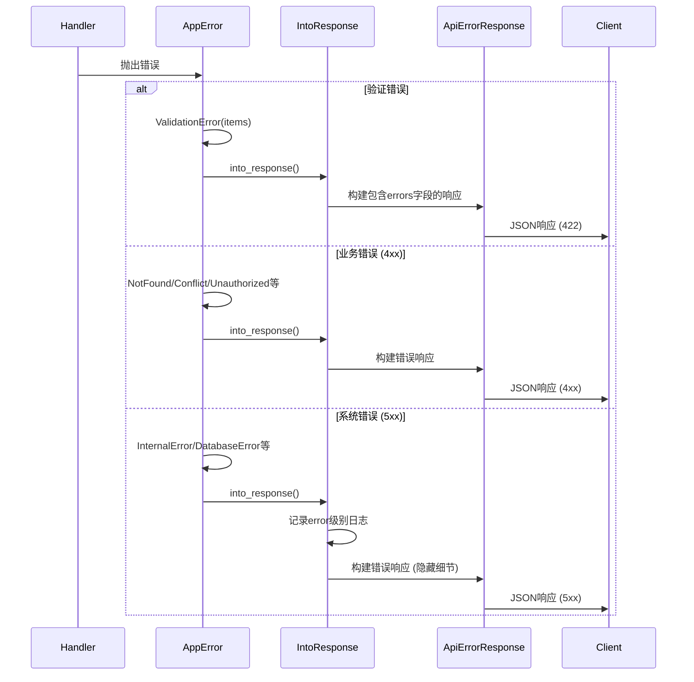

# S1-004: API路由与错误处理框架 - 详细设计文档

**任务编号**: S1-004  
**任务名称**: API路由与错误处理框架  
**版本**: 1.0  
**日期**: 2026-03-15  
**状态**: Draft  

---

## 目录

1. [概述](#1-概述)
2. [设计目标](#2-设计目标)
3. [统一API响应格式](#3-统一api响应格式)
4. [错误处理框架](#4-错误处理框架)
5. [路由分层结构](#5-路由分层结构)
6. [请求验证中间件](#6-请求验证中间件)
7. [全局错误处理中间件](#7-全局错误处理中间件)
8. [中间件执行链](#8-中间件执行链)
9. [UML设计图](#9-uml设计图)
10. [接口定义](#10-接口定义)
11. [文件结构](#11-文件结构)
12. [依赖关系](#12-依赖关系)

---

## 1. 概述

### 1.1 文档目的

本文档定义了Kayak后端API的统一响应格式、错误处理框架、路由分层结构以及中间件体系的设计方案。该设计基于S1-001已实现的基础框架进行扩展和规范化。

### 1.2 适用范围

- 所有RESTful API端点
- 错误处理和响应格式化
- 请求验证和数据校验
- 中间件链配置

### 1.3 参考文档

- [架构设计](/home/hzhou/workspace/kayak/arch.md) - 第6章 API设计
- [S1-001 基础API实现](../tasks.md)

---

## 2. 设计目标

### 2.1 功能性目标

1. **统一响应格式**: 所有API返回一致的JSON结构
2. **错误分类**: 区分业务错误(4xx)和系统错误(5xx)
3. **路由分层**: 版本化API路径(/api/v1/...)
4. **请求验证**: 统一的入参校验机制
5. **全局错误处理**: 捕获并标准化所有错误响应

### 2.2 非功能性目标

1. **可扩展性**: 易于添加新的错误类型和路由
2. **可维护性**: 清晰的错误分类和处理逻辑
3. **可测试性**: 便于单元测试和集成测试
4. **性能**: 最小化中间件开销

---

## 3. 统一API响应格式

### 3.1 成功响应结构

```rust
/// 统一API响应结构
#[derive(Debug, Serialize, Clone)]
pub struct ApiResponse<T> {
    /// HTTP状态码 (200, 201, etc.)
    pub code: u16,
    
    /// 响应消息
    pub message: String,
    
    /// 响应数据 (泛型)
    pub data: T,
    
    /// 响应时间戳 (ISO 8601格式)
    pub timestamp: String,
}
```

**JSON示例**:
```json
{
  "code": 200,
  "message": "success",
  "data": {
    "id": "550e8400-e29b-41d4-a716-446655440000",
    "name": "Test Workbench"
  },
  "timestamp": "2026-03-15T10:30:00Z"
}
```

### 3.2 错误响应结构

```rust
/// 错误详情项
#[derive(Debug, Serialize, Clone)]
pub struct ErrorDetail {
    /// 错误字段 (可选)
    pub field: Option<String>,
    
    /// 错误消息
    pub message: String,
    
    /// 错误码 (业务错误码)
    pub code: Option<String>,
}

/// API错误响应结构
#[derive(Debug, Serialize, Clone)]
pub struct ApiErrorResponse {
    /// HTTP状态码
    pub code: u16,
    
    /// 错误消息
    pub message: String,
    
    /// 详细错误信息列表
    #[serde(skip_serializing_if = "Option::is_none")]
    pub errors: Option<Vec<ErrorDetail>>,
    
    /// 请求路径 (用于调试)
    #[serde(skip_serializing_if = "Option::is_none")]
    pub path: Option<String>,
    
    /// 响应时间戳
    pub timestamp: String,
}
```

**JSON示例 - 单错误**:
```json
{
  "code": 404,
  "message": "Resource not found",
  "timestamp": "2026-03-15T10:30:00Z"
}
```

**JSON示例 - 验证错误**:
```json
{
  "code": 422,
  "message": "Validation failed",
  "errors": [
    { "field": "email", "message": "Invalid email format", "code": "INVALID_EMAIL" },
    { "field": "name", "message": "Name is required", "code": "REQUIRED" }
  ],
  "path": "/api/v1/users",
  "timestamp": "2026-03-15T10:30:00Z"
}
```

### 3.3 响应构建器

```rust
/// API响应构建器
pub struct ApiResponseBuilder;

impl ApiResponseBuilder {
    /// 创建成功响应
    pub fn success<T: Serialize>(data: T) -> ApiResponse<T>;
    
    /// 创建创建成功响应 (201)
    pub fn created<T: Serialize>(data: T) -> ApiResponse<T>;
    
    /// 创建无内容响应 (204)
    pub fn no_content() -> ApiResponse<Empty>;
    
    /// 创建错误响应
    pub fn error(code: u16, message: &str) -> ApiErrorResponse;
    
    /// 创建验证错误响应
    pub fn validation_error(errors: Vec<ErrorDetail>) -> ApiErrorResponse;
}
```

---

## 4. 错误处理框架

### 4.1 错误类型定义

```rust
/// 应用错误类型
#[derive(Debug, Error)]
pub enum AppError {
    // ==================== 业务错误 (4xx) ====================
    
    /// 无效请求参数 (400)
    #[error("Bad request: {0}")]
    BadRequest(String),
    
    /// 验证错误 (422)
    #[error("Validation failed")]
    ValidationError(Vec<ValidationErrorItem>),
    
    /// 资源未找到 (404)
    #[error("Resource not found: {0}")]
    NotFound(String),
    
    /// 资源冲突 (409)
    #[error("Resource conflict: {0}")]
    Conflict(String),
    
    /// 未授权 (401)
    #[error("Unauthorized: {0}")]
    Unauthorized(String),
    
    /// 禁止访问 (403)
    #[error("Forbidden: {0}")]
    Forbidden(String),
    
    /// 请求超时 (408)
    #[error("Request timeout")]
    RequestTimeout,
    
    /// 不支持的媒体类型 (415)
    #[error("Unsupported media type: {0}")]
    UnsupportedMediaType(String),
    
    // ==================== 系统错误 (5xx) ====================
    
    /// 内部服务器错误 (500)
    #[error("Internal server error: {0}")]
    InternalError(String),
    
    /// 数据库错误 (500)
    #[error("Database error: {0}")]
    DatabaseError(String),
    
    /// 配置错误 (500)
    #[error("Configuration error: {0}")]
    ConfigError(String),
    
    /// 外部服务错误 (502/503/504)
    #[error("External service error: {0}")]
    ExternalServiceError(String),
    
    /// 服务不可用 (503)
    #[error("Service unavailable: {0}")]
    ServiceUnavailable(String),
}
```

### 4.2 错误分类体系

```
┌─────────────────────────────────────────────────────────────┐
│                      AppError                               │
├────────────────────────┬────────────────────────────────────┤
│     业务错误 (4xx)      │        系统错误 (5xx)              │
├────────────────────────┼────────────────────────────────────┤
│ BadRequest (400)       │ InternalError (500)                │
│ ValidationError (422)  │ DatabaseError (500)                │
│ NotFound (404)         │ ConfigError (500)                  │
│ Conflict (409)         │ ExternalServiceError (502/503/504) │
│ Unauthorized (401)     │ ServiceUnavailable (503)           │
│ Forbidden (403)        │                                    │
│ RequestTimeout (408)   │                                    │
│ UnsupportedMedia (415) │                                    │
└────────────────────────┴────────────────────────────────────┘
```

### 4.3 HTTP状态码映射

```rust
impl AppError {
    /// 获取对应的HTTP状态码
    pub fn status_code(&self) -> StatusCode {
        match self {
            // 4xx - Client Errors
            AppError::BadRequest(_) => StatusCode::BAD_REQUEST,
            AppError::Unauthorized(_) => StatusCode::UNAUTHORIZED,
            AppError::Forbidden(_) => StatusCode::FORBIDDEN,
            AppError::NotFound(_) => StatusCode::NOT_FOUND,
            AppError::Conflict(_) => StatusCode::CONFLICT,
            AppError::RequestTimeout => StatusCode::REQUEST_TIMEOUT,
            AppError::UnsupportedMediaType(_) => StatusCode::UNSUPPORTED_MEDIA_TYPE,
            AppError::ValidationError(_) => StatusCode::UNPROCESSABLE_ENTITY,
            
            // 5xx - Server Errors
            AppError::InternalError(_) => StatusCode::INTERNAL_SERVER_ERROR,
            AppError::DatabaseError(_) => StatusCode::INTERNAL_SERVER_ERROR,
            AppError::ConfigError(_) => StatusCode::INTERNAL_SERVER_ERROR,
            AppError::ExternalServiceError(_) => StatusCode::BAD_GATEWAY,
            AppError::ServiceUnavailable(_) => StatusCode::SERVICE_UNAVAILABLE,
        }
    }
    
    /// 判断是否为业务错误
    pub fn is_business_error(&self) -> bool {
        self.status_code().is_client_error()
    }
    
    /// 判断是否为系统错误
    pub fn is_system_error(&self) -> bool {
        self.status_code().is_server_error()
    }
}
```

### 4.4 错误转换实现

```rust
// 标准库错误转换
impl From<std::io::Error> for AppError {
    fn from(err: std::io::Error) -> Self {
        AppError::InternalError(format!("IO error: {}", err))
    }
}

// 数据库错误转换
impl From<sqlx::Error> for AppError {
    fn from(err: sqlx::Error) -> Self {
        match err {
            sqlx::Error::RowNotFound => {
                AppError::NotFound("Resource not found in database".to_string())
            }
            sqlx::Error::Database(db_err) => {
                if db_err.is_unique_violation() {
                    AppError::Conflict("Resource already exists".to_string())
                } else {
                    AppError::DatabaseError(db_err.to_string())
                }
            }
            _ => AppError::DatabaseError(err.to_string()),
        }
    }
}

// JSON解析错误转换
impl From<serde_json::Error> for AppError {
    fn from(err: serde_json::Error) -> Self {
        AppError::BadRequest(format!("JSON parse error: {}", err))
    }
}

// 验证错误转换
impl From<validator::ValidationErrors> for AppError {
    fn from(errors: validator::ValidationErrors) -> Self {
        let items: Vec<ValidationErrorItem> = errors
            .field_errors()
            .iter()
            .flat_map(|(field, errs)| {
                errs.iter().map(move |err| ValidationErrorItem {
                    field: field.to_string(),
                    message: err.message.clone()
                        .map(|m| m.to_string())
                        .unwrap_or_else(|| "Invalid value".to_string()),
                    code: err.code.to_string(),
                })
            })
            .collect();
        AppError::ValidationError(items)
    }
}
```

---

## 5. 路由分层结构

### 5.1 路由架构

```
/
├── /health                    # 健康检查 (无版本)
├── /api/v1/                   # API v1 版本
│   ├── /auth                  # 认证模块
│   │   ├── POST /register
│   │   ├── POST /login
│   │   ├── POST /refresh
│   │   ├── POST /logout
│   │   └── GET  /me
│   │
│   ├── /users                 # 用户模块
│   │   ├── GET    /
│   │   ├── GET    /:id
│   │   ├── PUT    /:id
│   │   └── DELETE /:id
│   │
│   ├── /workbenches           # 工作台模块
│   │   ├── GET    /
│   │   ├── POST   /
│   │   ├── GET    /:id
│   │   ├── PUT    /:id
│   │   ├── DELETE /:id
│   │   └── GET    /:id/devices
│   │
│   ├── /devices               # 设备模块
│   │   ├── GET    /:id
│   │   ├── PUT    /:id
│   │   ├── DELETE /:id
│   │   ├── POST   /:id/connect
│   │   └── POST   /:id/disconnect
│   │
│   ├── /points                # 测点模块
│   │   ├── GET    /:id
│   │   ├── PUT    /:id
│   │   ├── GET    /:id/value
│   │   └── PUT    /:id/value
│   │
│   ├── /methods               # 试验方法模块
│   │   ├── GET    /
│   │   ├── POST   /
│   │   ├── GET    /:id
│   │   ├── PUT    /:id
│   │   ├── DELETE /:id
│   │   └── POST   /:id/validate
│   │
│   └── /experiments           # 试验模块
│       ├── GET    /
│       ├── POST   /
│       ├── GET    /:id
│       ├── POST   /:id/start
│       ├── POST   /:id/pause
│       ├── POST   /:id/resume
│       ├── POST   /:id/stop
│       └── GET    /:id/status
│
└── *                          # 404 Fallback
```

### 5.2 路由模块设计

```rust
// src/api/routes/mod.rs

/// 创建完整的路由器
pub fn create_router() -> Router {
    Router::new()
        // 健康检查 (最优先，无中间件限制)
        .route("/health", get(health::health_check))
        // API路由 (带版本)
        .merge(api_routes())
        // 404处理
        .fallback(not_found_handler)
}

/// API路由组 (版本化)
fn api_routes() -> Router {
    Router::new().nest("/api/v1", v1_routes())
}

/// v1 版本路由
fn v1_routes() -> Router {
    Router::new()
        .nest("/auth", auth_routes())
        .nest("/users", user_routes())
        .nest("/workbenches", workbench_routes())
        .nest("/devices", device_routes())
        .nest("/points", point_routes())
        .nest("/methods", method_routes())
        .nest("/experiments", experiment_routes())
}

// ==================== 各模块路由定义 ====================

/// 认证路由
fn auth_routes() -> Router {
    Router::new()
        .route("/register", post(auth::register))
        .route("/login", post(auth::login))
        .route("/refresh", post(auth::refresh))
        .route("/logout", post(auth::logout))
        .route("/me", get(auth::get_current_user))
}

/// 用户路由
fn user_routes() -> Router {
    Router::new()
        .route("/", get(user::list).post(user::create))
        .route("/:id", get(user::get).put(user::update).delete(user::delete))
}

/// 工作台路由
fn workbench_routes() -> Router {
    Router::new()
        .route("/", get(workbench::list).post(workbench::create))
        .route("/:id", get(workbench::get).put(workbench::update).delete(workbench::delete))
        .route("/:id/devices", get(workbench::list_devices))
}

/// 设备路由
fn device_routes() -> Router {
    Router::new()
        .route("/:id", get(device::get).put(device::update).delete(device::delete))
        .route("/:id/connect", post(device::connect))
        .route("/:id/disconnect", post(device::disconnect))
}

/// 测点路由
fn point_routes() -> Router {
    Router::new()
        .route("/:id", get(point::get).put(point::update))
        .route("/:id/value", get(point::get_value).put(point::set_value))
}

/// 试验方法路由
fn method_routes() -> Router {
    Router::new()
        .route("/", get(method::list).post(method::create))
        .route("/:id", get(method::get).put(method::update).delete(method::delete))
        .route("/:id/validate", post(method::validate))
}

/// 试验路由
fn experiment_routes() -> Router {
    Router::new()
        .route("/", get(experiment::list).post(experiment::create))
        .route("/:id", get(experiment::get))
        .route("/:id/start", post(experiment::start))
        .route("/:id/pause", post(experiment::pause))
        .route("/:id/resume", post(experiment::resume))
        .route("/:id/stop", post(experiment::stop))
        .route("/:id/status", get(experiment::get_status))
}
```

### 5.3 路由组织原则

1. **版本控制**: 所有API路由统一在 `/api/v1/` 下
2. **资源命名**: 使用复数名词 (`workbenches`, `devices`)
3. **RESTful设计**: 使用HTTP方法表达操作 (GET, POST, PUT, DELETE)
4. **嵌套资源**: 通过路径表达关系 (`/workbenches/:id/devices`)
5. **动作路由**: 非CRUD操作用动词 (`/connect`, `/start`, `/validate`)

---

## 6. 请求验证中间件

### 6.1 验证中间件设计

```rust
/// 请求验证中间件
/// 
/// 验证请求体的数据格式和约束
/// 使用 validator crate 进行验证
pub async fn validation_middleware<T>(
    State(state): State<AppState>,
    Json(payload): Json<T>,
) -> Result<Json<T>, AppError>
where
    T: Validate + DeserializeOwned,
{
    // 执行验证
    payload.validate()
        .map_err(|e| AppError::from(e))?;
    
    Ok(Json(payload))
}
```

### 6.2 DTO验证示例

```rust
/// 用户注册请求DTO
#[derive(Debug, Deserialize, Validate)]
pub struct RegisterRequest {
    #[validate(email(message = "Invalid email format"))]
    pub email: String,
    
    #[validate(length(min = 3, max = 50, message = "Username must be 3-50 characters"))]
    pub username: String,
    
    #[validate(length(min = 8, message = "Password must be at least 8 characters"))]
    pub password: String,
}

/// 创建工作台请求DTO
#[derive(Debug, Deserialize, Validate)]
pub struct CreateWorkbenchRequest {
    #[validate(length(min = 1, max = 255, message = "Name is required and must be <= 255 chars"))]
    pub name: String,
    
    #[validate(length(max = 1000, message = "Description must be <= 1000 chars"))]
    pub description: Option<String>,
}

/// 分页请求DTO
#[derive(Debug, Deserialize, Validate)]
pub struct PaginationParams {
    #[validate(range(min = 1, max = 100, message = "Page must be between 1 and 100"))]
    #[serde(default = "default_page")]
    pub page: i64,
    
    #[validate(range(min = 1, max = 1000, message = "Limit must be between 1 and 1000"))]
    #[serde(default = "default_limit")]
    pub limit: i64,
}

fn default_page() -> i64 { 1 }
fn default_limit() -> i64 { 20 }
```

### 6.3 验证错误转换

```rust
impl From<validator::ValidationErrors> for AppError {
    fn from(errors: validator::ValidationErrors) -> Self {
        let items: Vec<ValidationErrorItem> = errors
            .field_errors()
            .iter()
            .flat_map(|(field, errs)| {
                errs.iter().map(move |err| ValidationErrorItem {
                    field: field.to_string(),
                    message: err.message.clone()
                        .map(|m| m.to_string())
                        .unwrap_or_else(|| "Invalid value".to_string()),
                    code: err.code.to_string(),
                })
            })
            .collect();
        
        AppError::ValidationError(items)
    }
}
```

### 6.4 提取器模式

```rust
/// 带验证的JSON提取器
#[derive(Debug)]
pub struct ValidatedJson<T>(pub T);

#[async_trait]
impl<T, S> FromRequest<S> for ValidatedJson<T>
where
    T: DeserializeOwned + Validate,
    S: Send + Sync,
{
    type Rejection = AppError;

    async fn from_request(req: Request, state: &S) -> Result<Self, Self::Rejection> {
        let Json(payload) = Json::<T>::from_request(req, state)
            .await
            .map_err(|e| AppError::BadRequest(format!("Invalid JSON: {}", e)))?;
        
        payload.validate()
            .map_err(|e| AppError::from(e))?;
        
        Ok(ValidatedJson(payload))
    }
}
```

---

## 7. 全局错误处理中间件

### 7.1 错误处理中间件

```rust
/// 全局错误处理中间件
/// 
/// 捕获所有未处理的错误，转换为统一的API错误响应格式
/// 记录错误日志，根据错误类型区分日志级别
pub async fn error_handler_middleware(
    req: Request,
    next: Next,
) -> Response {
    let path = req.uri().path().to_string();
    let method = req.method().to_string();
    
    let response = next.run(req).await;
    let status = response.status();
    
    // 记录错误日志
    if status.is_server_error() {
        error!(
            method = %method,
            path = %path,
            status = %status,
            "Server error occurred"
        );
    } else if status.is_client_error() && status != StatusCode::NOT_FOUND {
        warn!(
            method = %method,
            path = %path,
            status = %status,
            "Client error occurred"
        );
    }
    
    response
}
```

### 7.2 IntoResponse实现

```rust
impl IntoResponse for AppError {
    fn into_response(self) -> Response {
        let status = self.status_code();
        
        // 构建错误响应
        let error_response = match &self {
            AppError::ValidationError(items) => {
                ApiErrorResponse {
                    code: status.as_u16(),
                    message: "Validation failed".to_string(),
                    errors: Some(items.iter().map(|item| ErrorDetail {
                        field: Some(item.field.clone()),
                        message: item.message.clone(),
                        code: Some(item.code.clone()),
                    }).collect()),
                    path: None,
                    timestamp: current_timestamp(),
                }
            }
            _ => {
                ApiErrorResponse {
                    code: status.as_u16(),
                    message: self.to_string(),
                    errors: None,
                    path: None,
                    timestamp: current_timestamp(),
                }
            }
        };
        
        // 记录服务器错误
        if status.is_server_error() {
            error!(error = %self, "Server error");
        }
        
        (status, Json(error_response)).into_response()
    }
}
```

### 7.3 404处理

```rust
/// 404 Not Found 处理器
/// 
/// 当没有路由匹配时返回统一格式的404响应
pub async fn not_found_handler(OriginalUri(uri): OriginalUri) -> impl IntoResponse {
    let response = ApiErrorResponse {
        code: StatusCode::NOT_FOUND.as_u16(),
        message: format!("The requested resource '{}' was not found", uri.path()),
        errors: None,
        path: Some(uri.path().to_string()),
        timestamp: current_timestamp(),
    };
    
    (StatusCode::NOT_FOUND, Json(response))
}
```

### 7.4 方法不允许处理

```rust
/// 405 Method Not Allowed 处理器
pub async fn method_not_allowed_handler(
    OriginalUri(uri): OriginalUri,
    method: Method,
) -> impl IntoResponse {
    let response = ApiErrorResponse {
        code: StatusCode::METHOD_NOT_ALLOWED.as_u16(),
        message: format!("Method {} is not allowed for {}", method, uri.path()),
        errors: None,
        path: Some(uri.path().to_string()),
        timestamp: current_timestamp(),
    };
    
    (StatusCode::METHOD_NOT_ALLOWED, Json(response))
}
```

---

## 8. 中间件执行链

### 8.1 中间件栈设计

```rust
/// 中间件执行顺序 (从外到内)
/// 
/// 请求流程:
/// 1. Compression (解压请求/压缩响应)
/// 2. Timeout (超时控制)
/// 3. CORS (跨域处理)
/// 4. Trace (请求追踪)
/// 5. Error Handler (错误处理)
/// 6. Request ID (请求标识)
/// 7. Rate Limit (限流)
/// 8. Auth (认证) - API路由专用
/// 9. Validation (验证)
/// 10. Handler (业务处理器)
///
/// 响应流程 (从内到外):
/// 10 -> 9 -> 8 -> 7 -> 6 -> 5 -> 4 -> 3 -> 2 -> 1

pub struct MiddlewareStack;

impl MiddlewareStack {
    /// 应用所有中间件到路由
    pub fn apply(router: Router, config: &AppConfig) -> Router {
        router
            .layer(Self::create_compression_layer())
            .layer(Self::create_timeout_layer(config))
            .layer(Self::create_cors_layer(config))
            .layer(Self::create_trace_layer())
            .layer(middleware::from_fn(error_handler_middleware))
            .layer(middleware::from_fn(request_id_middleware))
    }
    
    /// 为API路由应用认证中间件
    pub fn apply_auth(router: Router) -> Router {
        router.layer(middleware::from_fn(auth_middleware))
    }
}
```

### 8.2 中间件执行流程图

```
┌─────────────────────────────────────────────────────────────────────┐
│                         请求处理流程                                 │
├─────────────────────────────────────────────────────────────────────┤
│                                                                     │
│   请求进入                                                           │
│      │                                                              │
│      ▼                                                              │
│   ┌──────────────┐                                                  │
│   │ Compression  │  ← 解压缩请求体                                  │
│   └──────┬───────┘                                                  │
│          │                                                          │
│      ▼                                                              │
│   ┌──────────────┐                                                  │
│   │   Timeout    │  ← 设置请求超时                                  │
│   └──────┬───────┘                                                  │
│          │                                                          │
│      ▼                                                              │
│   ┌──────────────┐                                                  │
│   │     CORS     │  ← 跨域检查                                      │
│   └──────┬───────┘                                                  │
│          │                                                          │
│      ▼                                                              │
│   ┌──────────────┐                                                  │
│   │    Trace     │  ← 记录请求开始                                  │
│   └──────┬───────┘                                                  │
│          │                                                          │
│      ▼                                                              │
│   ┌──────────────┐                                                  │
│   │ Error Handler│  ← 捕获后续错误                                  │
│   └──────┬───────┘                                                  │
│          │                                                          │
│      ▼                                                              │
│   ┌──────────────┐                                                  │
│   │  Request ID  │  ← 生成请求ID                                    │
│   └──────┬───────┘                                                  │
│          │                                                          │
│      ▼                                                              │
│   ┌──────────────┐                                                  │
│   │     Auth     │  ← 验证JWT (API路由)                             │
│   └──────┬───────┘                                                  │
│          │                                                          │
│      ▼                                                              │
│   ┌──────────────┐                                                  │
│   │  Validation  │  ← 验证请求体                                    │
│   └──────┬───────┘                                                  │
│          │                                                          │
│      ▼                                                              │
│   ┌──────────────┐                                                  │
│   │    Handler   │  ← 执行业务逻辑                                  │
│   └──────┬───────┘                                                  │
│          │                                                          │
│          │ 响应返回 (逆向经过各层)                                   │
│          │                                                          │
│      ▼                                                              │
│   响应发送                                                           │
│                                                                     │
└─────────────────────────────────────────────────────────────────────┘
```

---

## 9. UML设计图

### 9.1 类图



### 9.2 时序图 - 请求处理流程



### 9.3 时序图 - 错误处理流程



### 9.4 路由结构图

```mermaid
graph TB
    Root["/"]
    Health["/health"]
    API["/api/v1"]
    
    Auth["/auth"]
    Users["/users"]
    Workbenches["/workbenches"]
    Devices["/devices"]
    Points["/points"]
    Methods["/methods"]
    Experiments["/experiments"]
    
    Root --> Health
    Root --> API
    
    API --> Auth
    API --> Users
    API --> Workbenches
    API --> Devices
    API --> Points
    API --> Methods
    API --> Experiments
    
    Auth --> Auth_Register["POST /register"]
    Auth --> Auth_Login["POST /login"]
    Auth --> Auth_Refresh["POST /refresh"]
    Auth --> Auth_Logout["POST /logout"]
    Auth --> Auth_Me["GET /me"]
    
    Users --> Users_List["GET /"]
    Users --> Users_Create["POST /"]
    Users --> Users_Get["GET /:id"]
    Users --> Users_Update["PUT /:id"]
    Users --> Users_Delete["DELETE /:id"]
    
    Workbenches --> WB_List["GET /"]
    Workbenches --> WB_Create["POST /"]
    Workbenches --> WB_Get["GET /:id"]
    Workbenches --> WB_Update["PUT /:id"]
    Workbenches --> WB_Delete["DELETE /:id"]
    Workbenches --> WB_Devices["GET /:id/devices"]
    
    Devices --> Dev_Get["GET /:id"]
    Devices --> Dev_Update["PUT /:id"]
    Devices --> Dev_Delete["DELETE /:id"]
    Devices --> Dev_Connect["POST /:id/connect"]
    Devices --> Dev_Disconnect["POST /:id/disconnect"]
    
    Points --> Point_Get["GET /:id"]
    Points --> Point_Update["PUT /:id"]
    Points --> Point_GetValue["GET /:id/value"]
    Points --> Point_SetValue["PUT /:id/value"]
    
    Methods --> Method_List["GET /"]
    Methods --> Method_Create["POST /"]
    Methods --> Method_Get["GET /:id"]
    Methods --> Method_Update["PUT /:id"]
    Methods --> Method_Delete["DELETE /:id"]
    Methods --> Method_Validate["POST /:id/validate"]
    
    Experiments --> Exp_List["GET /"]
    Experiments --> Exp_Create["POST /"]
    Experiments --> Exp_Get["GET /:id"]
    Experiments --> Exp_Start["POST /:id/start"]
    Experiments --> Exp_Pause["POST /:id/pause"]
    Experiments --> Exp_Resume["POST /:id/resume"]
    Experiments --> Exp_Stop["POST /:id/stop"]
    Experiments --> Exp_Status["GET /:id/status"]
```



---

## 10. 接口定义

### 10.1 核心类型接口

```rust
// src/core/response.rs

/// 统一API响应结构
#[derive(Debug, Serialize, Clone)]
pub struct ApiResponse<T> {
    pub code: u16,
    pub message: String,
    pub data: T,
    pub timestamp: String,
}

impl<T: Serialize> ApiResponse<T> {
    pub fn success(data: T) -> Self;
    pub fn created(data: T) -> Self;
    pub fn into_response(self) -> Response;
}

/// API错误响应结构
#[derive(Debug, Serialize, Clone)]
pub struct ApiErrorResponse {
    pub code: u16,
    pub message: String,
    pub errors: Option<Vec<ErrorDetail>>,
    pub path: Option<String>,
    pub timestamp: String,
}

/// 错误详情项
#[derive(Debug, Serialize, Clone)]
pub struct ErrorDetail {
    pub field: Option<String>,
    pub message: String,
    pub code: Option<String>,
}

/// 验证错误项
#[derive(Debug, Clone)]
pub struct ValidationErrorItem {
    pub field: String,
    pub message: String,
    pub code: String,
}
```

### 10.2 错误类型接口

```rust
// src/core/error.rs

/// 应用错误类型
#[derive(Debug, Error)]
pub enum AppError {
    // 业务错误
    #[error("Bad request: {0}")]
    BadRequest(String),
    #[error("Validation failed")]
    ValidationError(Vec<ValidationErrorItem>),
    #[error("Resource not found: {0}")]
    NotFound(String),
    #[error("Resource conflict: {0}")]
    Conflict(String),
    #[error("Unauthorized: {0}")]
    Unauthorized(String),
    #[error("Forbidden: {0}")]
    Forbidden(String),
    #[error("Request timeout")]
    RequestTimeout,
    #[error("Unsupported media type: {0}")]
    UnsupportedMediaType(String),
    
    // 系统错误
    #[error("Internal server error: {0}")]
    InternalError(String),
    #[error("Database error: {0}")]
    DatabaseError(String),
    #[error("Configuration error: {0}")]
    ConfigError(String),
    #[error("External service error: {0}")]
    ExternalServiceError(String),
    #[error("Service unavailable: {0}")]
    ServiceUnavailable(String),
}

impl AppError {
    pub fn status_code(&self) -> StatusCode;
    pub fn is_business_error(&self) -> bool;
    pub fn is_system_error(&self) -> bool;
}

impl IntoResponse for AppError {
    fn into_response(self) -> Response;
}
```

### 10.3 中间件接口

```rust
// src/api/middleware/mod.rs

/// 中间件栈
pub struct MiddlewareStack;

impl MiddlewareStack {
    pub fn apply(router: Router, config: &AppConfig) -> Router;
    pub fn apply_auth(router: Router) -> Router;
}

// src/api/middleware/error.rs
pub async fn error_handler_middleware(req: Request, next: Next) -> Response;
pub async fn not_found_handler(OriginalUri(uri): OriginalUri) -> impl IntoResponse;
pub async fn method_not_allowed_handler(
    OriginalUri(uri): OriginalUri,
    method: Method,
) -> impl IntoResponse;

// src/api/middleware/validation.rs
#[derive(Debug)]
pub struct ValidatedJson<T>(pub T);

#[async_trait]
impl<T, S> FromRequest<S> for ValidatedJson<T>
where
    T: DeserializeOwned + Validate,
    S: Send + Sync,
{
    type Rejection = AppError;
    async fn from_request(req: Request, state: &S) -> Result<Self, Self::Rejection>;
}
```

### 10.4 路由接口

```rust
// src/api/routes/mod.rs

pub fn create_router() -> Router;
fn api_routes() -> Router;
fn v1_routes() -> Router;

// 各模块路由
fn auth_routes() -> Router;
fn user_routes() -> Router;
fn workbench_routes() -> Router;
fn device_routes() -> Router;
fn point_routes() -> Router;
fn method_routes() -> Router;
fn experiment_routes() -> Router;
```

---

## 11. 文件结构

### 11.1 新增/修改文件清单

```
kayak-backend/src/
├── main.rs                              [修改] 更新中间件应用
├── lib.rs                               [修改] 导出新模块
│
├── core/
│   ├── mod.rs                           [修改] 添加response模块
│   ├── error.rs                         [修改] 扩展错误类型
│   ├── response.rs                      [新增] 统一响应格式
│   └── result.rs                        [现有] 保持
│
├── api/
│   ├── mod.rs                           [现有] 保持
│   │
│   ├── handlers/
│   │   ├── mod.rs                       [现有] 保持
│   │   ├── common.rs                    [修改] 使用ApiResponse
│   │   ├── health.rs                    [现有] 保持
│   │   └── ...                          [其他处理器]
│   │
│   ├── middleware/
│   │   ├── mod.rs                       [修改] 添加validation模块
│   │   ├── error.rs                     [修改] 增强错误处理
│   │   ├── validation.rs                [新增] 请求验证中间件
│   │   ├── trace.rs                     [现有] 保持
│   │   └── cors.rs                      [现有] 保持
│   │
│   └── routes/
│       ├── mod.rs                       [修改] 添加所有子路由
│       ├── health.rs                    [现有] 保持
│       ├── auth.rs                      [新增] 认证路由
│       ├── user.rs                      [新增] 用户路由
│       ├── workbench.rs                 [新增] 工作台路由
│       ├── device.rs                    [新增] 设备路由
│       ├── point.rs                     [新增] 测点路由
│       ├── method.rs                    [新增] 方法路由
│       └── experiment.rs                [新增] 试验路由
│
└── models/
    └── dto/
        ├── mod.rs                       [修改] 导出所有DTO
        ├── auth.rs                      [新增] 认证相关DTO
        ├── user.rs                      [新增] 用户相关DTO
        ├── workbench.rs                 [新增] 工作台DTO
        ├── device.rs                    [新增] 设备DTO
        ├── point.rs                     [新增] 测点DTO
        ├── method.rs                    [新增] 方法DTO
        ├── experiment.rs                [新增] 试验DTO
        └── common.rs                    [新增] 通用DTO (分页等)
```

### 11.2 Cargo.toml依赖

```toml
[dependencies]
# 已有依赖保持不变
# 添加或确认以下依赖:

# 验证
validator = { version = "0.16", features = ["derive"] }

# 异步trait (用于FromRequest实现)
async-trait = "0.1"
```

---

## 12. 依赖关系

### 12.1 模块依赖图

```mermaid
dependencyGraph
    core[core模块]
    error[error.rs]
    response[response.rs]
    result[result.rs]
    api[api模块]
    middleware[middleware模块]
    routes[routes模块]
    handlers[handlers模块]
    models[models模块]
    dto[dto模块]
    
    core --> error
    core --> response
    core --> result
    
    error --> response
    
    api --> middleware
    api --> routes
    api --> handlers
    
    middleware --> error
    middleware --> response
    
    routes --> handlers
    routes --> middleware
    
    handlers --> error
    handlers --> response
    handlers --> models
    
    models --> dto
    dto --> validator
```

### 12.2 关键依赖说明

| 模块 | 依赖项 | 说明 |
|------|--------|------|
| `core::response` | `serde` | JSON序列化 |
| `core::error` | `thiserror`, `axum` | 错误定义和响应转换 |
| `middleware::validation` | `validator`, `async-trait` | 请求验证 |
| `middleware::error` | `tracing` | 错误日志记录 |
| `models::dto` | `validator` | DTO验证注解 |
| `routes` | `axum` | 路由定义 |

---

## 附录A: 与现有代码的对比

### A.1 现有代码 (S1-001)

```rust
// core/error.rs - 现有实现
pub enum AppError {
    BadRequest(String),
    NotFound(String),
    InternalError(String),
    ValidationError(String),
    ConfigError(String),
    Timeout,
    CorsError(String),
}

// handlers/common.rs - 现有实现
pub struct SuccessResponse<T> {
    pub code: u16,
    pub message: String,
    pub data: T,
    pub timestamp: String,
}
```

### A.2 设计改进点

1. **错误类型扩展**: 新增 `Conflict`, `Unauthorized`, `Forbidden`, `DatabaseError`, `ExternalServiceError` 等
2. **验证错误细化**: `ValidationError` 从 `String` 改为 `Vec<ValidationErrorItem>`，支持字段级错误
3. **响应结构统一**: 合并 `SuccessResponse` 和 `ErrorResponse` 为统一的 `ApiResponse` 和 `ApiErrorResponse`
4. **错误分类**: 新增 `is_business_error()` 和 `is_system_error()` 方法
5. **验证中间件**: 新增 `ValidatedJson<T>` 提取器模式

---

## 附录B: 使用示例

### B.1 Handler中使用统一响应

```rust
use crate::core::response::ApiResponse;
use crate::core::error::AppError;

/// 获取工作台详情
pub async fn get_workbench(
    State(state): State<AppState>,
    Path(id): Path<Uuid>,
) -> Result<ApiResponse<WorkbenchDto>, AppError> {
    let workbench = state
        .workbench_service
        .get_workbench(id)
        .await
        .map_err(|e| AppError::from(e))?;
    
    Ok(ApiResponse::success(workbench.into()))
}

/// 创建工作台 (使用验证)
pub async fn create_workbench(
    State(state): State<AppState>,
    ValidatedJson(req): ValidatedJson<CreateWorkbenchRequest>,
) -> Result<ApiResponse<WorkbenchDto>, AppError> {
    let workbench = state
        .workbench_service
        .create_workbench(req.into())
        .await
        .map_err(|e| AppError::from(e))?;
    
    Ok(ApiResponse::created(workbench.into()))
}
```

### B.2 错误处理示例

```rust
// 业务错误
if !user.is_active {
    return Err(AppError::Forbidden("User account is disabled".to_string()));
}

// 资源未找到
let workbench = workbench_repo
    .find_by_id(id)
    .await?
    .ok_or_else(|| AppError::NotFound(format!("Workbench {} not found", id)))?;

// 验证错误
if password != confirm_password {
    return Err(AppError::ValidationError(vec![ValidationErrorItem {
        field: "confirm_password".to_string(),
        message: "Passwords do not match".to_string(),
        code: "PASSWORD_MISMATCH".to_string(),
    }]));
}
```

---

**文档结束**
