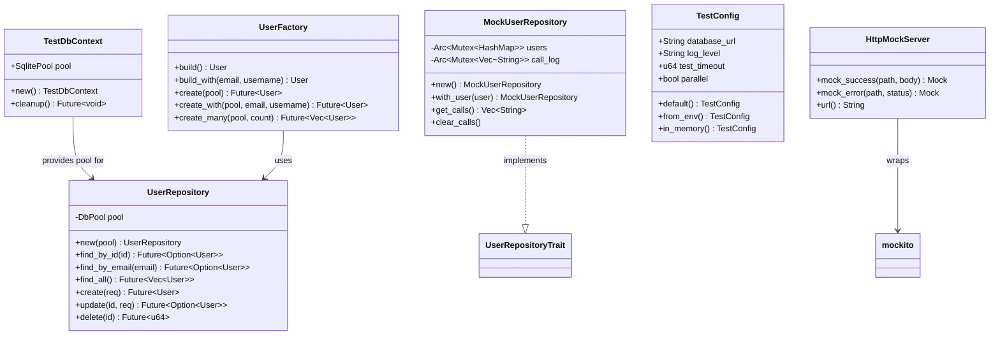
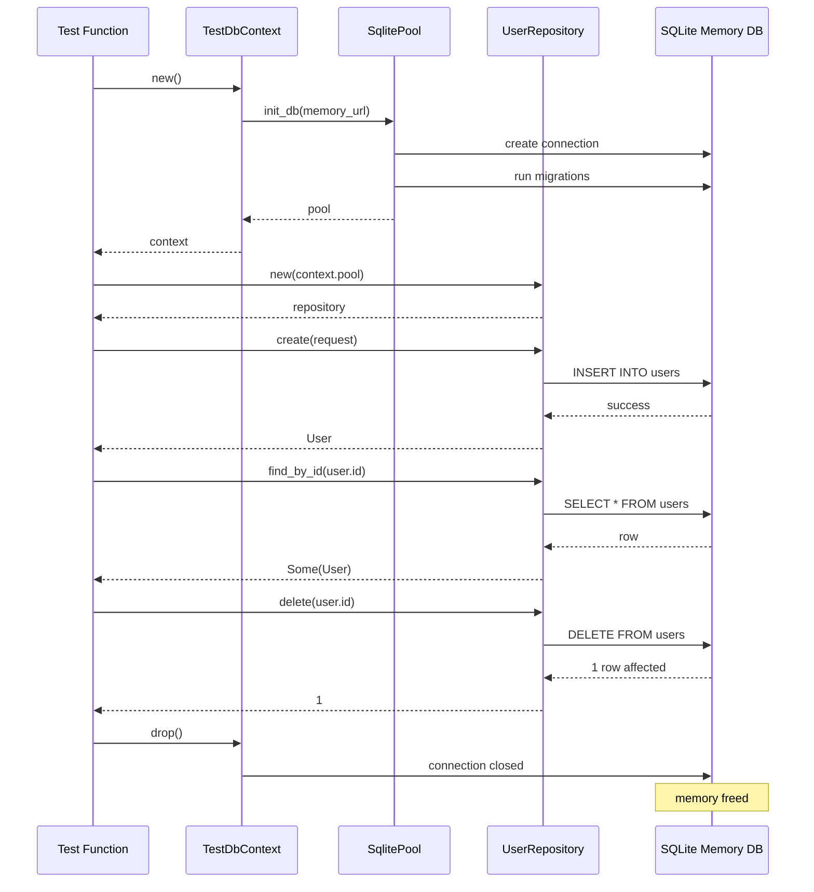
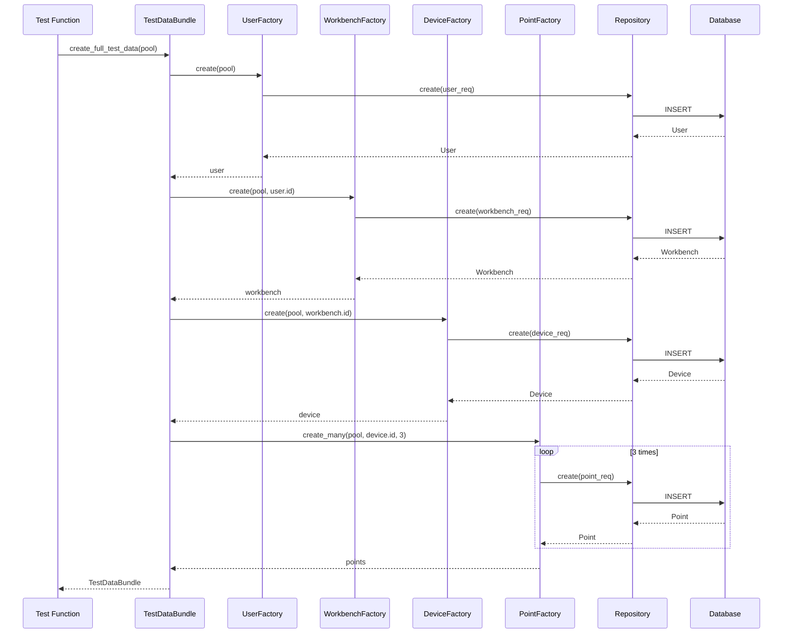

# S1-005: 后端单元测试框架搭建 - 详细设计文档

**文档版本**: 1.0  
**创建日期**: 2026-03-15  
**最后更新**: 2026-03-15  
**设计负责人**: sw-tom  
**关联任务**: S1-005 后端单元测试框架搭建  
**关联测试用例**: `/home/hzhou/workspace/kayak/log/release_0/test/S1-005_test_cases.md`

---

## 1. 设计概述

### 1.1 设计目标

本文档定义了Kayak后端单元测试框架的详细设计方案，确保测试基础设施的可维护性、可扩展性和高性能。

### 1.2 设计原则

| 原则 | 说明 |
|-----|------|
| **隔离性** | 每个测试使用独立的数据库实例，避免测试间相互影响 |
| **可重复性** | 测试在任何环境下都能产生一致的结果 |
| **快速执行** | 使用内存数据库和并行执行，确保测试快速完成 |
| **高覆盖率** | 目标代码覆盖率 ≥ 80%，核心业务模块 ≥ 90% |
| **可维护性** | 清晰的测试组织结构，易于添加和维护测试用例 |

### 1.3 设计范围

```
┌─────────────────────────────────────────────────────────────┐
│                    测试框架架构                              │
├─────────────────────────────────────────────────────────────┤
│  ┌─────────────┐  ┌─────────────┐  ┌─────────────────────┐  │
│  │ Test Runner │  │   Fixtures  │  │    Mock Tools       │  │
│  │  (cargo)    │  │   Factory   │  │  DB / HTTP / Time   │  │
│  └──────┬──────┘  └──────┬──────┘  └──────────┬──────────┘  │
│         │                │                    │             │
│         └────────────────┼────────────────────┘             │
│                          ▼                                  │
│              ┌─────────────────────┐                        │
│              │   Repository Tests  │                        │
│              │   (User/WB/Device)  │                        │
│              └─────────────────────┘                        │
│                          │                                  │
│         ┌────────────────┼────────────────┐                 │
│         ▼                ▼                ▼                 │
│  ┌─────────────┐  ┌─────────────┐  ┌─────────────┐          │
│  │  Coverage   │  │    Report   │  │   CI/CD     │          │
│  │ Collection  │  │  Generation │  │ Integration │          │
│  └─────────────┘  └─────────────┘  └─────────────┘          │
└─────────────────────────────────────────────────────────────┘
```

---

## 2. 测试模块结构设计

### 2.1 目录结构

```
kayak-backend/
├── src/
│   └── ...
├── tests/                          # 集成测试目录
│   ├── common/                     # 共享测试基础设施
│   │   ├── mod.rs                  # 公共模块导出
│   │   ├── fixtures/               # 测试数据工厂
│   │   │   ├── mod.rs
│   │   │   ├── users.rs            # 用户数据工厂
│   │   │   ├── workbenches.rs      # 工作台数据工厂
│   │   │   ├── devices.rs          # 设备数据工厂
│   │   │   └── points.rs           # 测点数据工厂
│   │   ├── mocks/                  # Mock实现
│   │   │   ├── mod.rs
│   │   │   └── db_mock.rs          # 数据库Mock
│   │   └── utils/                  # 测试工具函数
│   │       ├── mod.rs
│   │       └── db_helper.rs        # 数据库辅助函数
│   ├── integration/                # 集成测试
│   │   └── mod.rs
│   └── lib.rs                      # 测试库入口
├── src/db/repository/              # Repository层(内含单元测试)
│   ├── mod.rs
│   └── user_repo.rs                # 包含 #[cfg(test)] 模块
└── Cargo.toml
```

### 2.2 模块职责划分

| 模块 | 职责 | 说明 |
|-----|------|------|
| `tests/common/` | 测试基础设施 | 提供所有测试共享的工具和数据工厂 |
| `tests/common/fixtures/` | 测试数据工厂 | 生成标准化的测试数据 |
| `tests/common/mocks/` | Mock实现 | 模拟外部依赖（数据库、HTTP等） |
| `tests/common/utils/` | 辅助函数 | 数据库连接、清理等工具函数 |
| `tests/integration/` | 集成测试 | 端到端测试场景 |
| `src/**/tests` | 单元测试 | 内联在源代码中的单元测试 |

### 2.3 测试组织方式

```rust
// 方式1: 内联单元测试 (推荐用于Repository)
// src/db/repository/user_repo.rs
#[cfg(test)]
mod tests {
    use super::*;
    
    #[tokio::test]
    async fn test_create_user() {
        // 测试代码
    }
}

// 方式2: 集成测试
// tests/integration/user_flow_test.rs
use kayak_backend::...;

#[tokio::test]
async fn test_user_registration_flow() {
    // 集成测试代码
}
```

---

## 3. Mock工具架构设计

### 3.1 数据库Mock架构

#### 3.1.1 设计目标
- 每个测试使用独立的SQLite内存数据库
- 支持数据库迁移自动执行
- 测试间完全隔离

#### 3.1.2 架构图

```
┌─────────────────────────────────────────────────────────────┐
│                      测试执行上下文                          │
├─────────────────────────────────────────────────────────────┤
│  ┌─────────────┐  ┌─────────────┐  ┌─────────────┐          │
│  │   Test 1    │  │   Test 2    │  │   Test 3    │          │
│  │             │  │             │  │             │          │
│  │  Memory DB  │  │  Memory DB  │  │  Memory DB  │          │
│  │  (uuid-1)   │  │  (uuid-2)   │  │  (uuid-3)   │          │
│  │             │  │             │  │             │          │
│  │  ┌───────┐  │  │  ┌───────┐  │  │  ┌───────┐  │          │
│  │  │Migrations│ │  │  │Migrations│ │  │  │Migrations│ │          │
│  │  │  Run    │  │  │  │  Run    │  │  │  │  Run    │  │          │
│  │  └───────┘  │  │  └───────┘  │  │  └───────┘  │          │
│  └─────────────┘  └─────────────┘  └─────────────┘          │
│                                                             │
│  每个测试完全隔离，使用唯一命名的共享内存数据库               │
└─────────────────────────────────────────────────────────────┘
```

#### 3.1.3 Mock数据库工具实现

```rust
// tests/common/mocks/db_mock.rs
use kayak_backend::db::connection::init_db;
use sqlx::SqlitePool;
use uuid::Uuid;

/// 创建测试数据库连接池
/// 
/// 每个调用创建独立的内存数据库实例
pub async fn create_test_pool() -> SqlitePool {
    let db_id = Uuid::new_v4().to_string();
    let database_url = format!("sqlite:file:{}?mode=memory&cache=shared", db_id);
    
    init_db(&database_url)
        .await
        .expect("Failed to create test database pool")
}

/// 测试数据库上下文
/// 
/// 提供自动清理功能的RAII模式
pub struct TestDbContext {
    pub pool: SqlitePool,
}

impl TestDbContext {
    pub async fn new() -> Self {
        Self {
            pool: create_test_pool().await,
        }
    }
    
    /// 清理所有数据
    pub async fn cleanup(&self) {
        sqlx::query("DELETE FROM users").execute(&self.pool).await.ok();
        sqlx::query("DELETE FROM workbenches").execute(&self.pool).await.ok();
        sqlx::query("DELETE FROM devices").execute(&self.pool).await.ok();
        sqlx::query("DELETE FROM points").execute(&self.pool).await.ok();
        sqlx::query("DELETE FROM data_files").execute(&self.pool).await.ok();
    }
}

impl Drop for TestDbContext {
    fn drop(&mut self) {
        // 内存数据库在连接关闭后自动清理
    }
}
```

### 3.2 Repository Mock架构

#### 3.2.1 设计目标
- 支持服务层的单元测试（无需真实数据库）
- 可预设返回值和验证调用参数
- 线程安全，支持并发测试

#### 3.2.2 Mock Repository实现

```rust
// tests/common/mocks/repo_mock.rs
use std::collections::HashMap;
use std::sync::{Arc, Mutex};
use uuid::Uuid;

/// Mock UserRepository
pub struct MockUserRepository {
    users: Arc<Mutex<HashMap<Uuid, User>>>,
    call_log: Arc<Mutex<Vec<String>>>,
}

impl MockUserRepository {
    pub fn new() -> Self {
        Self {
            users: Arc::new(Mutex::new(HashMap::new())),
            call_log: Arc::new(Mutex::new(Vec::new())),
        }
    }
    
    /// 预设用户数据
    pub fn with_user(&self, user: User) -> &Self {
        self.users.lock().unwrap().insert(user.id, user);
        self
    }
    
    /// 获取调用记录
    pub fn get_calls(&self) -> Vec<String> {
        self.call_log.lock().unwrap().clone()
    }
    
    /// 清空调用记录
    pub fn clear_calls(&self) {
        self.call_log.lock().unwrap().clear();
    }
}

#[async_trait]
impl UserRepositoryTrait for MockUserRepository {
    async fn find_by_id(&self, id: Uuid) -> Result<Option<User>, Error> {
        self.call_log.lock().unwrap().push(format!("find_by_id({})", id));
        Ok(self.users.lock().unwrap().get(&id).cloned())
    }
    
    async fn create(&self, req: CreateUserRequest) -> Result<User, Error> {
        self.call_log.lock().unwrap().push(format!("create({})", req.email));
        let user = User::new(req.email, req.password_hash, req.username);
        self.users.lock().unwrap().insert(user.id, user.clone());
        Ok(user)
    }
    
    // ... 其他方法
}
```

### 3.3 HTTP Mock架构

#### 3.3.1 依赖配置

```toml
# Cargo.toml [dev-dependencies]
mockito = "1.2"
wiremock = "0.6"
```

#### 3.3.2 HTTP Mock工具

```rust
// tests/common/mocks/http_mock.rs
use mockito::{mock, server_url};
use reqwest;

/// HTTP Mock服务器封装
pub struct HttpMockServer;

impl HttpMockServer {
    /// 创建成功的响应Mock
    pub fn mock_success(path: &str, response_body: &str) -> mockito::Mock {
        mock("GET", path)
            .with_status(200)
            .with_header("content-type", "application/json")
            .with_body(response_body)
            .create()
    }
    
    /// 创建错误响应Mock
    pub fn mock_error(path: &str, status: usize) -> mockito::Mock {
        mock("GET", path)
            .with_status(status)
            .create()
    }
    
    /// 获取Mock服务器URL
    pub fn url() -> String {
        server_url()
    }
}

// 使用示例
#[tokio::test]
async fn test_external_api_call() {
    let _m = HttpMockServer::mock_success(
        "/api/data",
        r#"{"status": "ok", "data": [1, 2, 3]}"#
    );
    
    let response = reqwest::get(&format!("{}/api/data", HttpMockServer::url()))
        .await
        .unwrap();
    
    assert_eq!(response.status(), 200);
}
```

### 3.4 时间和UUID Mock

```rust
// tests/common/mocks/time_mock.rs
use chrono::{DateTime, TimeZone, Utc};
use std::cell::RefCell;

thread_local! {
    static MOCK_NOW: RefCell<Option<DateTime<Utc>>> = RefCell::new(None);
}

/// 设置固定的当前时间（仅用于测试）
pub fn set_mock_now(time: DateTime<Utc>) {
    MOCK_NOW.with(|t| *t.borrow_mut() = Some(time));
}

/// 清除时间Mock
pub fn clear_mock_now() {
    MOCK_NOW.with(|t| *t.borrow_mut() = None);
}

/// 获取当前时间（支持Mock）
pub fn now() -> DateTime<Utc> {
    MOCK_NOW.with(|t| t.borrow().unwrap_or_else(Utc::now))
}

/// 预定义的测试UUID
pub mod test_uuids {
    use uuid::Uuid;
    
    pub const USER_1: &str = "550e8400-e29b-41d4-a716-446655440001";
    pub const USER_2: &str = "550e8400-e29b-41d4-a716-446655440002";
    pub const WORKBENCH_1: &str = "550e8400-e29b-41d4-a716-446655440010";
    pub const DEVICE_1: &str = "550e8400-e29b-41d4-a716-446655440020";
    
    pub fn user_1() -> Uuid {
        Uuid::parse_str(USER_1).unwrap()
    }
    
    pub fn user_2() -> Uuid {
        Uuid::parse_str(USER_2).unwrap()
    }
}
```

---

## 4. Fixtures系统设计

### 4.1 设计目标
- 提供标准化的测试数据生成
- 支持数据关联和级联创建
- 易于维护和扩展

### 4.2 Fixtures架构图

```
┌─────────────────────────────────────────────────────────────┐
│                      Fixtures架构                            │
├─────────────────────────────────────────────────────────────┤
│                                                             │
│  ┌─────────────┐    ┌─────────────┐    ┌─────────────┐     │
│  │   Factory   │───▶│   Builder   │───▶│   Entity    │     │
│  │   Trait     │    │   Pattern   │    │   Instance  │     │
│  └─────────────┘    └─────────────┘    └─────────────┘     │
│         │                                                   │
│         ▼                                                   │
│  ┌─────────────────────────────────────────────────────┐   │
│  │              Concrete Factories                      │   │
│  ├─────────────┬─────────────┬─────────────┬────────────┤   │
│  │ UserFactory │ Workbench   │  Device     │  Point     │   │
│  │             │   Factory   │   Factory   │   Factory  │   │
│  └─────────────┴─────────────┴─────────────┴────────────┘   │
│                                                             │
│  ┌─────────────────────────────────────────────────────┐   │
│  │              TestData Bundle                         │   │
│  │  (关联数据组合，一键创建完整测试场景)                 │   │
│  └─────────────────────────────────────────────────────┘   │
│                                                             │
└─────────────────────────────────────────────────────────────┘
```

### 4.3 数据工厂实现

```rust
// tests/common/fixtures/mod.rs
pub mod users;
pub mod workbenches;
pub mod devices;
pub mod points;

use sqlx::SqlitePool;

/// 完整测试数据集
pub struct TestDataBundle {
    pub user: User,
    pub workbench: Workbench,
    pub device: Device,
    pub points: Vec<Point>,
}

/// 创建完整测试数据集
pub async fn create_full_test_data(pool: &SqlitePool) -> TestDataBundle {
    let user = users::create_test_user(pool).await;
    let workbench = workbenches::create_test_workbench(pool, user.id).await;
    let device = devices::create_test_device(pool, workbench.id).await;
    let points = points::create_test_points(pool, device.id, 3).await;
    
    TestDataBundle {
        user,
        workbench,
        device,
        points,
    }
}
```

### 4.4 User Factory

```rust
// tests/common/fixtures/users.rs
use kayak_backend::models::entities::user::{CreateUserRequest, User, UserStatus};
use kayak_backend::db::repository::user_repo::UserRepository;
use sqlx::SqlitePool;
use uuid::Uuid;

/// 默认测试用户数据
pub struct UserFactory;

impl UserFactory {
    /// 创建基础测试用户（不保存到数据库）
    pub fn build() -> User {
        User::new(
            format!("test-{}@example.com", Uuid::new_v4()),
            "test_password_hash".to_string(),
            Some("Test User".to_string()),
        )
    }
    
    /// 创建自定义用户（不保存到数据库）
    pub fn build_with(email: &str, username: &str) -> User {
        User::new(
            email.to_string(),
            "test_password_hash".to_string(),
            Some(username.to_string()),
        )
    }
    
    /// 创建并保存测试用户
    pub async fn create(pool: &SqlitePool) -> User {
        let repo = UserRepository::new(pool.clone());
        let req = CreateUserRequest {
            email: format!("test-{}@example.com", Uuid::new_v4()),
            password_hash: "test_password_hash".to_string(),
            username: Some("Test User".to_string()),
        };
        repo.create(req).await.expect("Failed to create test user")
    }
    
    /// 创建自定义测试用户并保存
    pub async fn create_with(pool: &SqlitePool, email: &str, username: &str) -> User {
        let repo = UserRepository::new(pool.clone());
        let req = CreateUserRequest {
            email: email.to_string(),
            password_hash: "test_password_hash".to_string(),
            username: Some(username.to_string()),
        };
        repo.create(req).await.expect("Failed to create test user")
    }
    
    /// 创建多个测试用户
    pub async fn create_many(pool: &SqlitePool, count: usize) -> Vec<User> {
        let mut users = Vec::with_capacity(count);
        for i in 0..count {
            let user = Self::create_with(
                pool,
                &format!("test{}@example.com", i),
                &format!("Test User {}", i)
            ).await;
            users.push(user);
        }
        users
    }
}

/// 便捷函数：创建默认测试用户
pub async fn create_test_user(pool: &SqlitePool) -> User {
    UserFactory::create(pool).await
}

/// 便捷函数：创建自定义测试用户
pub async fn create_test_user_with(pool: &SqlitePool, email: &str, username: &str) -> User {
    UserFactory::create_with(pool, email, username).await
}
```

### 4.5 Workbench Factory

```rust
// tests/common/fixtures/workbenches.rs
use kayak_backend::models::entities::workbench::{CreateWorkbenchRequest, Workbench};
use sqlx::SqlitePool;
use uuid::Uuid;

pub struct WorkbenchFactory;

impl WorkbenchFactory {
    /// 创建并保存测试工作台
    pub async fn create(pool: &SqlitePool, owner_id: Uuid) -> Workbench {
        // 实现创建逻辑
        todo!("实现工作台创建")
    }
    
    /// 创建多个测试工作台
    pub async fn create_many(pool: &SqlitePool, owner_id: Uuid, count: usize) -> Vec<Workbench> {
        let mut workbenches = Vec::with_capacity(count);
        for i in 0..count {
            let workbench = Self::create(pool, owner_id).await;
            workbenches.push(workbench);
        }
        workbenches
    }
}

pub async fn create_test_workbench(pool: &SqlitePool, owner_id: Uuid) -> Workbench {
    WorkbenchFactory::create(pool, owner_id).await
}
```

### 4.6 Fixtures使用示例

```rust
// 在测试中使用Fixtures
use crate::common::fixtures::{users, workbenches, create_full_test_data};
use crate::common::mocks::db_mock::TestDbContext;

#[tokio::test]
async fn test_with_fixtures() {
    // 创建测试上下文
    let ctx = TestDbContext::new().await;
    
    // 方式1: 使用便捷函数
    let user = users::create_test_user(&ctx.pool).await;
    let workbench = workbenches::create_test_workbench(&ctx.pool, user.id).await;
    
    // 方式2: 使用Factory模式
    let user2 = users::UserFactory::create_with(
        &ctx.pool,
        "custom@example.com",
        "Custom User"
    ).await;
    
    // 方式3: 创建完整数据集
    let bundle = create_full_test_data(&ctx.pool).await;
    assert!(!bundle.points.is_empty());
    
    // 测试完成后自动清理
}
```

---

## 5. 覆盖率收集方案

### 5.1 工具选型

| 工具 | 用途 | 版本 |
|-----|------|------|
| cargo-tarpaulin | 代码覆盖率收集 | ^0.27 |
| grcov | 替代方案（可选） | ^0.8 |
| lcov | 覆盖率报告格式转换 | latest |

### 5.2 tarpaulin配置

#### 5.2.1 安装

```bash
cargo install cargo-tarpaulin
```

#### 5.2.2 配置文件

```toml
# tarpaulin.toml
[engine]
engine = "Llvm"

[run]
# 忽略测试文件本身
ignore-tests = true

# 排除的文件和目录
exclude-files = [
    "*/tests/*",
    "*/test_utils/*",
    "*/migrations/*",
    "src/main.rs",
]

# 包含的包成员
workspace = false

[output]
# 输出格式
out = ["Html", "Xml", "Lcov"]

# 输出目录
output-dir = "coverage"

# 超时设置（秒）
timeout = 120

[report]
# 覆盖率阈值
fail-under = 80

# 行覆盖率阈值
line-fail-under = 80

# 分支覆盖率阈值
branch-fail-under = 70
```

### 5.3 覆盖率工作流程

```
┌─────────────────────────────────────────────────────────────┐
│                    覆盖率收集流程                            │
├─────────────────────────────────────────────────────────────┤
│                                                             │
│   ┌─────────────┐                                           │
│   │  运行测试   │                                           │
│   │ cargo test  │                                           │
│   └──────┬──────┘                                           │
│          │                                                  │
│          ▼                                                  │
│   ┌─────────────┐     ┌─────────────┐     ┌─────────────┐  │
│   │  tarpaulin  │────▶│  收集覆盖   │────▶│  生成报告   │  │
│   │   插桩      │     │    数据     │     │ (HTML/XML)  │  │
│   └─────────────┘     └─────────────┘     └──────┬──────┘  │
│                                                  │          │
│          ┌───────────────────────────────────────┘          │
│          │                                                  │
│          ▼                                                  │
│   ┌─────────────┐     ┌─────────────┐     ┌─────────────┐  │
│   │  本地查看   │     │  CI/CD上传  │     │  质量门禁   │  │
│   │ HTML报告   │     │  Codecov等  │     │  ≥80%通过   │  │
│   └─────────────┘     └─────────────┘     └─────────────┘  │
│                                                             │
└─────────────────────────────────────────────────────────────┘
```

### 5.4 覆盖率脚本

```bash
#!/bin/bash
# scripts/coverage.sh

set -e

echo "Generating test coverage report..."

# 创建输出目录
mkdir -p coverage

# 运行tarpaulin生成覆盖率报告
cargo tarpaulin \
    --config tarpaulin.toml \
    --out Html \
    --out Xml \
    --out Lcov \
    --output-dir coverage

echo "Coverage report generated in coverage/"
echo "Open coverage/tarpaulin-report.html to view"

# 检查覆盖率阈值（可选）
if command -v lcov &> /dev/null; then
    echo "Generating LCOV summary..."
    lcov --summary coverage/lcov.info
fi
```

### 5.5 CI/CD集成

```yaml
# .github/workflows/coverage.yml
name: Coverage

on:
  push:
    branches: [ main, develop ]
  pull_request:
    branches: [ main ]

jobs:
  coverage:
    runs-on: ubuntu-latest
    
    steps:
    - uses: actions/checkout@v4
    
    - name: Install Rust
      uses: dtolnay/rust-action@stable
    
    - name: Install tarpaulin
      run: cargo install cargo-tarpaulin
    
    - name: Generate coverage
      working-directory: ./kayak-backend
      run: |
        cargo tarpaulin \
          --ignore-tests \
          --out Xml \
          --output-dir coverage \
          --timeout 120
    
    - name: Upload to Codecov
      uses: codecov/codecov-action@v3
      with:
        files: ./kayak-backend/coverage/cobertura.xml
        fail_ci_if_error: true
        verbose: true
```

### 5.6 覆盖率目标

| 模块 | 最低覆盖率 | 目标覆盖率 |
|-----|----------|----------|
| db/repository | 80% | 90% |
| core/error | 85% | 95% |
| models/entities | 75% | 85% |
| services | 70% | 80% |
| api/handlers | 60% | 75% |
| **总体** | **80%** | **85%** |

---

## 6. 测试配置管理

### 6.1 配置文件结构

```rust
// tests/common/config.rs
use std::env;

/// 测试配置
pub struct TestConfig {
    /// 数据库URL
    pub database_url: String,
    /// 日志级别
    pub log_level: String,
    /// 测试超时（秒）
    pub test_timeout: u64,
    /// 是否启用并行测试
    pub parallel: bool,
}

impl Default for TestConfig {
    fn default() -> Self {
        Self {
            database_url: env::var("TEST_DATABASE_URL")
                .unwrap_or_else(|_| "sqlite::memory:".to_string()),
            log_level: env::var("TEST_LOG_LEVEL")
                .unwrap_or_else(|_| "debug".to_string()),
            test_timeout: env::var("TEST_TIMEOUT")
                .ok()
                .and_then(|s| s.parse().ok())
                .unwrap_or(30),
            parallel: env::var("TEST_PARALLEL")
                .map(|s| s != "false")
                .unwrap_or(true),
        }
    }
}

impl TestConfig {
    /// 从环境变量加载配置
    pub fn from_env() -> Self {
        Self::default()
    }
    
    /// 创建内存数据库配置（快速测试）
    pub fn in_memory() -> Self {
        Self {
            database_url: "sqlite::memory:".to_string(),
            log_level: "error".to_string(),
            test_timeout: 10,
            parallel: true,
        }
    }
}
```

### 6.2 环境变量配置

```bash
# .env.test
TEST_DATABASE_URL=sqlite::memory:
TEST_LOG_LEVEL=debug
TEST_TIMEOUT=30
TEST_PARALLEL=true
```

---

## 7. 详细代码示例

### 7.1 完整Repository单元测试示例

```rust
// src/db/repository/user_repo.rs 中的测试模块
#[cfg(test)]
mod tests {
    use super::*;
    use crate::db::connection::init_db;
    use uuid::Uuid;

    /// 创建测试用的Repository实例
    async fn setup_test_repo() -> UserRepository {
        let db_id = Uuid::new_v4().to_string();
        let pool = init_db(&format!("sqlite:file:{}?mode=memory&cache=shared", db_id))
            .await
            .expect("Failed to create test database");
        UserRepository::new(pool)
    }

    #[tokio::test]
    async fn test_create_user_success() {
        // Arrange
        let repo = setup_test_repo().await;
        let req = CreateUserRequest {
            email: "test@example.com".to_string(),
            password_hash: "hashed_password".to_string(),
            username: Some("Test User".to_string()),
        };

        // Act
        let result = repo.create(req).await;

        // Assert
        assert!(result.is_ok());
        let user = result.unwrap();
        assert_eq!(user.email, "test@example.com");
        assert_eq!(user.username, Some("Test User".to_string()));
        assert_eq!(user.status, UserStatus::Active.to_string());
        assert!(!user.id.is_nil());
    }

    #[tokio::test]
    async fn test_find_by_id_existing_user() {
        // Arrange
        let repo = setup_test_repo().await;
        let req = CreateUserRequest {
            email: "find@example.com".to_string(),
            password_hash: "hash".to_string(),
            username: None,
        };
        let created = repo.create(req).await.unwrap();

        // Act
        let found = repo.find_by_id(created.id).await.unwrap();

        // Assert
        assert!(found.is_some());
        let user = found.unwrap();
        assert_eq!(user.id, created.id);
        assert_eq!(user.email, "find@example.com");
    }

    #[tokio::test]
    async fn test_find_by_id_nonexistent_user() {
        // Arrange
        let repo = setup_test_repo().await;
        let nonexistent_id = Uuid::new_v4();

        // Act
        let result = repo.find_by_id(nonexistent_id).await;

        // Assert
        assert!(result.is_ok());
        assert!(result.unwrap().is_none());
    }

    #[tokio::test]
    async fn test_find_by_email() {
        // Arrange
        let repo = setup_test_repo().await;
        let req = CreateUserRequest {
            email: "email@example.com".to_string(),
            password_hash: "hash".to_string(),
            username: None,
        };
        repo.create(req).await.unwrap();

        // Act
        let found = repo.find_by_email("email@example.com").await.unwrap();
        let not_found = repo.find_by_email("nonexistent@example.com").await.unwrap();

        // Assert
        assert!(found.is_some());
        assert!(not_found.is_none());
    }

    #[tokio::test]
    async fn test_find_all_returns_ordered_list() {
        // Arrange
        let repo = setup_test_repo().await;
        
        // 创建3个用户
        for i in 0..3 {
            let req = CreateUserRequest {
                email: format!("user{}@example.com", i),
                password_hash: "hash".to_string(),
                username: None,
            };
            repo.create(req).await.unwrap();
            // 短暂延迟确保不同的创建时间
            tokio::time::sleep(tokio::time::Duration::from_millis(10)).await;
        }

        // Act
        let users = repo.find_all().await.unwrap();

        // Assert
        assert_eq!(users.len(), 3);
        // 验证按created_at降序排列
        for i in 1..users.len() {
            assert!(users[i-1].created_at >= users[i].created_at);
        }
    }

    #[tokio::test]
    async fn test_update_user_success() {
        // Arrange
        let repo = setup_test_repo().await;
        let req = CreateUserRequest {
            email: "update@example.com".to_string(),
            password_hash: "hash".to_string(),
            username: Some("Original".to_string()),
        };
        let created = repo.create(req).await.unwrap();

        let update_req = UpdateUserRequest {
            username: Some("Updated".to_string()),
            avatar_url: Some("http://example.com/avatar.png".to_string()),
            status: None, // 不更新status
        };

        // Act
        let result = repo.update(created.id, update_req).await;

        // Assert
        assert!(result.is_ok());
        let updated = result.unwrap().unwrap();
        assert_eq!(updated.username, Some("Updated".to_string()));
        assert_eq!(updated.avatar_url, Some("http://example.com/avatar.png".to_string()));
        assert_eq!(updated.status, UserStatus::Active.to_string()); // 未改变
    }

    #[tokio::test]
    async fn test_update_user_not_found() {
        // Arrange
        let repo = setup_test_repo().await;
        let nonexistent_id = Uuid::new_v4();
        let update_req = UpdateUserRequest {
            username: Some("Updated".to_string()),
            ..Default::default()
        };

        // Act
        let result = repo.update(nonexistent_id, update_req).await;

        // Assert
        assert!(result.is_ok());
        assert!(result.unwrap().is_none());
    }

    #[tokio::test]
    async fn test_delete_user_success() {
        // Arrange
        let repo = setup_test_repo().await;
        let req = CreateUserRequest {
            email: "delete@example.com".to_string(),
            password_hash: "hash".to_string(),
            username: None,
        };
        let created = repo.create(req).await.unwrap();

        // Act
        let deleted_rows = repo.delete(created.id).await.unwrap();
        let not_found = repo.find_by_id(created.id).await.unwrap();

        // Assert
        assert_eq!(deleted_rows, 1);
        assert!(not_found.is_none());
    }

    #[tokio::test]
    async fn test_delete_user_not_found() {
        // Arrange
        let repo = setup_test_repo().await;
        let nonexistent_id = Uuid::new_v4();

        // Act
        let deleted_rows = repo.delete(nonexistent_id).await.unwrap();

        // Assert
        assert_eq!(deleted_rows, 0);
    }
}
```

### 7.2 tests/lib.rs 入口文件

```rust
// tests/lib.rs
//! Kayak后端集成测试入口

pub mod common;

// 集成测试模块
pub mod integration;
```

### 7.3 tests/common/mod.rs 公共模块

```rust
// tests/common/mod.rs
//! 测试共享基础设施

pub mod config;
pub mod fixtures;
pub mod mocks;
pub mod utils;

// 重导出常用工具
pub use mocks::db_mock::{create_test_pool, TestDbContext};
pub use utils::db_helper::cleanup_all_tables;
```

---

## 8. 类图和时序图

### 8.1 测试框架类图



### 8.2 Repository测试时序图



### 8.3 Fixtures数据流图



---

## 9. 测试执行指南

### 9.1 常用命令

```bash
# 运行所有测试
cargo test

# 运行特定模块的测试
cargo test user_repo::tests
cargo test db::repository::tests

# 运行单个测试
cargo test test_create_user_success

# 显示测试输出
cargo test -- --nocapture

# 单线程运行（调试并发问题）
cargo test -- --test-threads=1

# 只编译不运行（快速检查编译错误）
cargo test --no-run

# 运行被忽略的测试
cargo test -- --ignored

# 生成覆盖率报告
cargo tarpaulin --out Html --output-dir coverage

# 检查覆盖率（带阈值）
cargo tarpaulin --fail-under 80
```

### 9.2 测试命名规范

| 测试类型 | 命名模式 | 示例 |
|---------|---------|------|
| 成功场景 | `test_{method}_success` | `test_create_user_success` |
| 失败场景 | `test_{method}_error` | `test_create_user_duplicate_email` |
| 边界条件 | `test_{method}_boundary` | `test_find_all_empty_result` |
| 空值处理 | `test_{method}_not_found` | `test_find_by_id_not_found` |

---

## 10. 性能优化

### 10.1 测试执行优化

| 优化策略 | 实现方式 | 效果 |
|---------|---------|------|
| 并行执行 | 默认多线程 | 提升50%+ |
| 内存数据库 | SQLite内存模式 | 比文件数据库快10x |
| 延迟初始化 | 按需创建资源 | 减少不必要的开销 |
| 连接池复用 | 共享连接池 | 减少连接创建开销 |

### 10.2 编译优化

```toml
# Cargo.toml [profile.dev]
[profile.dev]
opt-level = 0
debug = true

# 测试专用优化配置
[profile.test]
opt-level = 1        # 轻微优化，保持编译速度
debug = true
lto = false
```

---

## 11. 风险评估与缓解

| 风险 | 影响 | 可能性 | 缓解措施 |
|-----|------|-------|---------|
| 内存数据库与实际行为差异 | 高 | 中 | 定期运行集成测试验证 |
| 并行测试冲突 | 中 | 低 | 使用唯一数据库实例 |
| 覆盖率工具不兼容 | 中 | 低 | 准备替代方案(grcov) |
| 测试数据维护成本 | 低 | 中 | 使用Factory模式标准化 |
| 测试执行时间过长 | 中 | 中 | 优化数据库连接，使用并行执行 |

---

## 12. 附录

### 12.1 依赖清单

```toml
# Cargo.toml [dev-dependencies]
[dev-dependencies]
# 异步测试运行
tokio-test = "0.4"

# HTTP测试
reqwest = { version = "0.11", features = ["json"] }
mockito = "1.2"
wiremock = "0.6"

# 覆盖率
cargo-tarpaulin = "0.27"  # 通过 cargo install 安装
```

### 12.2 相关文档

- [Cargo Test文档](https://doc.rust-lang.org/cargo/commands/cargo-test.html)
- [Tarpaulin文档](https://github.com/xd009642/tarpaulin)
- [Tokio测试指南](https://tokio.rs/tokio/topics/testing)
- [SQLite内存数据库](https://www.sqlite.org/inmemorydb.html)

---

## 13. 变更历史

| 版本 | 日期 | 变更内容 | 作者 |
|-----|------|---------|-----|
| 1.0 | 2026-03-15 | 初始版本创建 | sw-tom |

---

**文档结束**
