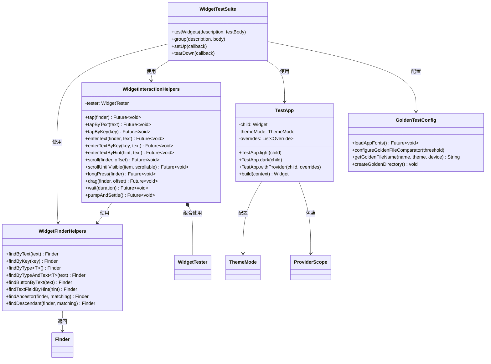
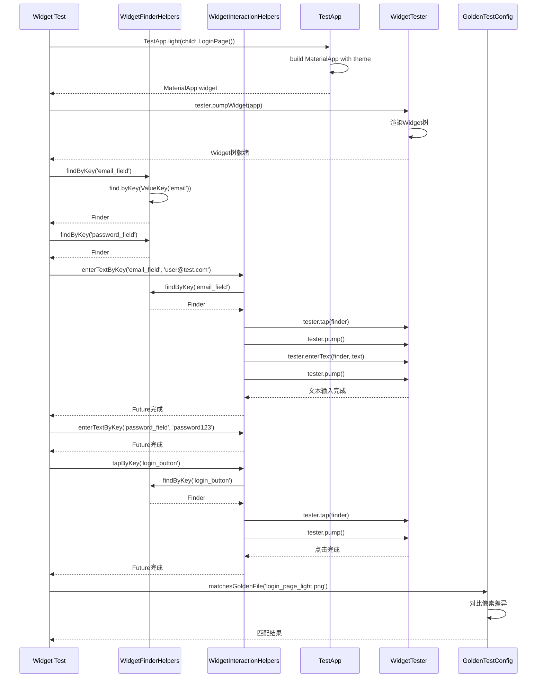
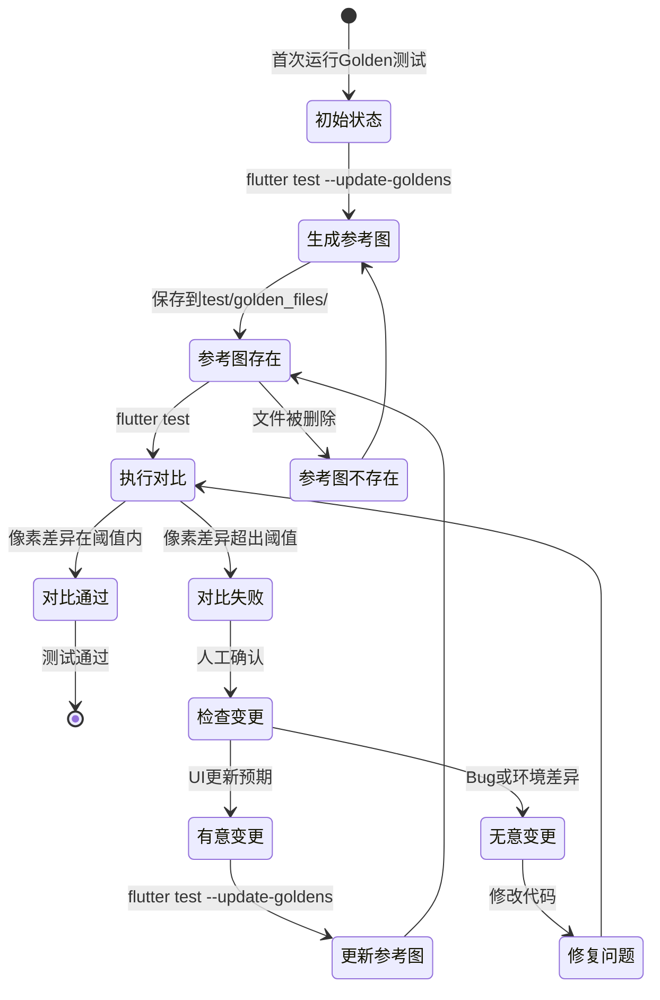
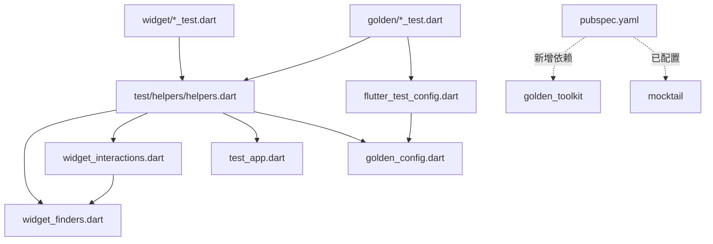

# S1-006 详细设计文档
## Flutter Widget测试框架搭建

**任务ID**: S1-006  
**任务名称**: Flutter Widget测试框架搭建  
**版本**: 1.0  
**日期**: 2024-03-17  
**状态**: 设计中

---

## 目录

1. [概述](#1-概述)
2. [UML图](#2-uml图)
3. [接口定义](#3-接口定义)
4. [UI设计](#4-ui设计)
5. [文件结构](#5-文件结构)
6. [实现说明](#6-实现说明)

---

## 1. 概述

### 1.1 设计目标

本设计文档定义S1-006任务的实现细节，目标是搭建完整的Flutter Widget测试框架，包括：

1. **Flutter测试环境配置** - 设置测试目录结构、依赖配置、运行环境
2. **Widget测试辅助类** - 创建组件查找、交互模拟的封装工具类
3. **Golden测试集成** - 配置UI回归测试，支持浅色/深色主题、多设备尺寸

### 1.2 设计原则

- **封装性**：将测试辅助功能封装为易于使用的API
- **可扩展性**：辅助类设计应支持未来扩展新的查找和交互方式
- **可维护性**：清晰的目录结构和命名规范
- **一致性**：遵循Flutter测试最佳实践和项目代码规范

### 1.3 验收标准

| 验收标准 | 验证方式 |
|---------|---------|
| `flutter test` 执行通过 | TC-WGT-001 ~ TC-WGT-003 |
| 包含至少一个Widget测试示例 | TC-WGT-004 ~ TC-WGT-008 |
| Golden测试配置完成 | TC-WGT-009 ~ TC-WGT-012 |

### 1.4 设计决策说明

#### 静态工具类 vs 实例化类

本设计采用**静态工具类**（`WidgetFinderHelpers` 和 `WidgetInteractionHelpers`）而非实例化类，原因如下：

1. **无状态性**: 测试辅助方法不维护内部状态，每次调用都是独立的操作
2. **简洁性**: 静态方法调用更简洁，无需创建和管理实例
3. **测试上下文**: `WidgetTester` 实例由测试框架通过 `testWidgets` 回调提供，辅助类只需接收并使用
4. **Flutter测试惯例**: 与 `flutter_test` 包的API风格保持一致（如 `find.text()`, `tester.tap()` 等）

**替代方案考虑**: 
- 使用实例化类可以提供更好的可扩展性（如支持自定义配置）
- 对于更复杂的场景，未来可考虑添加支持自定义配置的实例化版本

#### 主题模式类型选择

设计中使用 Flutter 内置的 `ThemeMode` 而非 `AppThemeMode`，原因：
- 测试辅助类应尽量使用标准 Flutter API 以减少转换开销
- `TestApp` 作为测试专用组件，直接使用 `ThemeMode` 更直接
- 生产代码仍使用 `AppThemeMode`，但在测试层进行转换是合理的

---

## 2. UML图

### 2.1 静态组合图：测试辅助类关系



### 2.2 动态序列图：Widget测试执行流程



### 2.3 状态图：Golden测试生命周期



---

## 3. 接口定义

### 3.1 WidgetFinderHelpers 类接口

```dart
/// Widget查找辅助类
/// 
/// 提供封装Flutter测试finder的便捷方法
/// 支持按文本、Key、类型等多种方式查找Widget
class WidgetFinderHelpers {
  WidgetFinderHelpers._();

  /// 按文本内容查找Widget
  /// 
  /// [text] - 要查找的精确文本
  /// [skipOffstage] - 是否跳过不在屏幕上的组件，默认true
  /// 
  /// 返回匹配文本的Finder
  static Finder findByText(String text, {bool skipOffstage = true});

  /// 按Key查找Widget
  /// 
  /// [key] - Key的字符串值，将包装为ValueKey
  /// [skipOffstage] - 是否跳过不在屏幕上的组件，默认true
  /// 
  /// 返回匹配Key的Finder
  static Finder findByKey(String key, {bool skipOffstage = true});

  /// 按类型查找Widget
  /// 
  /// [T] - 要查找的Widget类型
  /// [skipOffstage] - 是否跳过不在屏幕上的组件，默认true
  /// 
  /// 返回匹配类型的Finder
  static Finder findByType<T extends Widget>({bool skipOffstage = true});

  /// 按Widget类型和文本组合查找
  /// 
  /// 查找包含特定文本的特定类型Widget
  /// [T] - Widget类型
  /// [text] - 文本内容
  static Finder findByTypeAndText<T extends Widget>(String text);

  /// 查找包含特定文本的按钮
  /// 
  /// 便捷方法，等同于find.widgetWithText(ElevatedButton, text)
  static Finder findButtonByText(String text);

  /// 通过hintText查找TextField
  /// 
  /// [hint] - 输入框的提示文本
  static Finder findTextFieldByHint(String hint);

  /// 通过labelText查找TextField
  /// 
  /// [label] - 输入框的标签文本
  static Finder findTextFieldByLabel(String label);

  /// 查找祖先Widget
  /// 
  /// [finder] - 子Widget的finder
  /// [matching] - 祖先Widget的匹配条件
  static Finder findAncestor({
    required Finder finder,
    required Finder matching,
  });

  /// 查找后代Widget
  /// 
  /// [finder] - 父Widget的finder
  /// [matching] - 后代Widget的匹配条件
  static Finder findDescendant({
    required Finder finder,
    required Finder matching,
  });

  /// 查找具有特定图标和文本的Widget
  /// 
  /// [icon] - 图标数据
  /// [text] - 文本内容
  static Finder findWidgetWithIconAndText(IconData icon, String text);

  /// 查找特定精确数量的Widget
  /// 
  /// [finder] - 基础finder
  /// [count] - 期望的数量
  static Matcher findsExactly(int count);
}
```

### 3.2 WidgetInteractionHelpers 类接口

```dart
/// Widget交互辅助类
/// 
/// 封装Widget测试中的常见交互操作
/// 提供链式调用友好的API设计
class WidgetInteractionHelpers {
  WidgetInteractionHelpers._();

  /// 点击指定Finder的Widget
  /// 
  /// [tester] - WidgetTester实例
  /// [finder] - 要点击的Widget的Finder
  /// [warnIfMissed] - 如果未点击到是否警告，默认true
  static Future<void> tap(
    WidgetTester tester,
    Finder finder, {
    bool warnIfMissed = true,
  });

  /// 通过文本点击Widget
  /// 
  /// 自动查找包含指定文本的Widget并点击
  static Future<void> tapByText(WidgetTester tester, String text);

  /// 通过Key点击Widget
  /// 
  /// [key] - Widget的Key字符串
  static Future<void> tapByKey(WidgetTester tester, String key);

  /// 在TextField中输入文本
  /// 
  /// 自动先点击获取焦点，然后输入文本
  /// [finder] - TextField的Finder
  /// [text] - 要输入的文本
  static Future<void> enterText(
    WidgetTester tester,
    Finder finder,
    String text,
  );

  /// 通过Key在TextField中输入文本
  static Future<void> enterTextByKey(
    WidgetTester tester,
    String key,
    String text,
  );

  /// 通过hint文本在TextField中输入
  static Future<void> enterTextByHint(
    WidgetTester tester,
    String hint,
    String text,
  );

  /// 通过label文本在TextField中输入
  static Future<void> enterTextByLabel(
    WidgetTester tester,
    String label,
    String text,
  );

  /// 滚动列表
  /// 
  /// [finder] - 可滚动Widget的Finder
  /// [offset] - 滚动偏移量（正值向下，负值向上）
  static Future<void> scroll(
    WidgetTester tester,
    Finder finder,
    double offset,
  );

  /// 滚动直到指定Widget可见
  /// 
  /// [item] - 要滚动到的Widget的Finder
  /// [scrollable] - 可滚动容器的Finder
  /// [delta] - 每次滚动的距离
  static Future<void> scrollUntilVisible(
    WidgetTester tester,
    Finder item,
    Finder scrollable, {
    double delta = 100.0,
    int maxScrolls = 50,
  });

  /// 长按Widget
  static Future<void> longPress(WidgetTester tester, Finder finder);

  /// 拖拽Widget
  /// 
  /// [finder] - 要拖拽的Widget
  /// [offset] - 拖拽的偏移量
  static Future<void> drag(
    WidgetTester tester,
    Finder finder,
    Offset offset,
  );

  /// 拖拽列表项以重新排序
  static Future<void> dragAndDrop(
    WidgetTester tester,
    Finder source,
    Finder target,
  );

  /// 等待指定时长
  static Future<void> wait(WidgetTester tester, Duration duration);

  /// 等待所有动画完成
  static Future<void> pumpAndSettle(WidgetTester tester);

  /// 多次触发pump以推进动画
  /// 
  /// [duration] - 总时长
  /// [interval] - 每次pump的间隔
  static Future<void> pumpFor(
    WidgetTester tester,
    Duration duration, {
    Duration interval = const Duration(milliseconds: 16),
  });

  /// 清空TextField内容
  static Future<void> clearTextField(
    WidgetTester tester,
    Finder finder,
  );
}
```

### 3.3 TestApp Widget接口

```dart
/// 测试应用包装器
/// 
/// 为Widget测试提供一致的应用环境
/// 包括主题、本地化、Provider等配置
class TestApp extends StatelessWidget {
  /// 要测试的子Widget
  final Widget child;
  
  /// 主题模式（浅色/深色/跟随系统）
  final ThemeMode themeMode;
  
  /// Provider覆盖列表
  final List<Override> overrides;
  
  /// 本地化
  final Locale? locale;
  
  /// 是否显示Debug标记
  final bool showDebugBanner;

  const TestApp({
    super.key,
    required this.child,
    this.themeMode = ThemeMode.light,
    this.overrides = const [],
    this.locale,
    this.showDebugBanner = false,
  });

  /// 工厂构造函数：浅色主题
  factory TestApp.light({
    required Widget child,
    List<Override> overrides = const [],
    Locale? locale,
  });

  /// 工厂构造函数：深色主题
  factory TestApp.dark({
    required Widget child,
    List<Override> overrides = const [],
    Locale? locale,
  });

  /// 工厂构造函数：带Provider覆盖
  factory TestApp.withProvider({
    required Widget child,
    ThemeMode themeMode = ThemeMode.light,
    required List<Override> overrides,
    Locale? locale,
  });

  /// 工厂构造函数：指定尺寸（用于响应式测试）
  factory TestApp.sized({
    required Widget child,
    required Size size,
    ThemeMode themeMode = ThemeMode.light,
    List<Override> overrides = const [],
  });

  @override
  Widget build(BuildContext context);
}
```

### 3.4 Golden测试配置接口

```dart
/// Golden测试配置
/// 
/// 提供Golden测试的全局配置和工具方法
class GoldenTestConfig {
  GoldenTestConfig._();

  /// 默认像素差异阈值（0.0 - 1.0）
  static const double defaultThreshold = 0.01;

  /// Golden文件根目录
  static const String goldenFilesDir = 'test/golden_files';

  /// 配置Golden文件比较器
  /// 
  /// [threshold] - 允许的像素差异比例
  static void configureGoldenFileComparator({double threshold = defaultThreshold});

  /// 加载应用字体（确保文本渲染一致）
  static Future<void> loadAppFonts();

  /// 生成Golden文件名
  /// 
  /// [name] - 基础名称
  /// [theme] - 主题模式
  /// [device] - 设备类型
  /// [suffix] - 可选后缀
  static String generateGoldenFileName(
    String name, {
    ThemeMode? theme,
    String? device,
    String? suffix,
  });

  /// 确保Golden文件目录存在
  static void ensureGoldenDirectoryExists();

  /// Golden文件完整路径
  static String getGoldenFilePath(String fileName);

  /// 检查Golden文件是否存在
  static bool goldenFileExists(String fileName);
}

/// Golden测试执行配置（flutter_test_config.dart）
/// 
/// 此函数在测试框架启动时自动调用
Future<void> testExecutable(FutureOr<void> Function() testMain) async {
  // 配置Golden文件比较器
  GoldenTestConfig.configureGoldenFileComparator(threshold: 0.01);
  
  // 加载字体（如果使用golden_toolkit）
  await GoldenTestConfig.loadAppFonts();
  
  // 执行测试
  return testMain();
}
```

---

## 4. UI设计

### 4.1 测试运行器输出格式

#### 控制台输出格式

```
=== Flutter Widget Tests ===

✓ WidgetFinderHelpers.findByText - finds widget with exact text
✓ WidgetFinderHelpers.findByText - finds multiple widgets with same text
✓ WidgetFinderHelpers.findByKey - finds widget with ValueKey
✓ WidgetFinderHelpers.findByType - finds all ElevatedButtons
✓ WidgetInteractionHelpers.tap - taps button by text
✓ WidgetInteractionHelpers.tap - taps button by key
✓ WidgetInteractionHelpers.enterText - enters text into TextField
✓ WidgetInteractionHelpers.enterText - handles multiple fields

Golden Tests:
✓ Golden - Login Page Light Theme
✓ Golden - Login Page Dark Theme
✓ Golden - Dashboard Light Theme
✓ Golden - Dashboard Dark Theme

═══════════════════════════════════════════════════════════
Test Summary
═══════════════════════════════════════════════════════════
Total:     12 tests
Passed:    12 (100%)
Failed:    0
Skipped:   0
Duration:  4.2 seconds
═══════════════════════════════════════════════════════════
```

#### Golden测试失败输出格式

```
✗ Golden - Login Page Light Theme
  Expected: test/golden_files/login_page_light.png
  Actual:   /tmp/flutter_test_goldens/login_page_light.png
  
  Pixel difference: 2.34% (threshold: 1.00%)
  
  To update golden files, run:
    flutter test --update-goldens test/widget/golden/
  
  Difference image: /tmp/flutter_test_goldens/login_page_light_diff.png
```

### 4.2 Golden测试图片命名规范

#### 命名格式

```
{component_name}_{theme}_{device}[_{state}].png
```

#### 命名组成

| 组件 | 说明 | 示例 |
|-----|------|------|
| component_name | 组件或页面名称，使用snake_case | `login_page`, `dashboard_card` |
| theme | 主题模式 | `light`, `dark` |
| device | 设备类型/尺寸 | `desktop`, `tablet`, `mobile` |
| state | （可选）组件状态 | `empty`, `loading`, `error`, `success` |

#### 命名示例

```
golden_files/
├── light/
│   ├── login_page_light_desktop.png
│   ├── login_page_light_mobile.png
│   ├── dashboard_light_desktop.png
│   ├── dashboard_card_light_empty.png
│   └── dashboard_card_light_loading.png
├── dark/
│   ├── login_page_dark_desktop.png
│   ├── login_page_dark_mobile.png
│   └── dashboard_dark_desktop.png
└── components/
    ├── app_bar_light.png
    ├── app_bar_dark.png
    ├── workbench_list_item_light.png
    └── workbench_list_item_dark.png
```

### 4.3 目录结构图

```
test/
├── golden_files/                    # Golden参考图片
│   ├── light/                       # 浅色主题Golden图片
│   ├── dark/                        # 深色主题Golden图片
│   └── components/                  # 组件级Golden图片
│
├── helpers/                         # 测试辅助类
│   ├── widget_finders.dart          # 组件查找辅助类
│   ├── widget_interactions.dart     # 交互模拟辅助类
│   ├── test_app.dart                # 测试应用包装器
│   └── golden_config.dart           # Golden测试配置
│
├── widget/                          # Widget测试
│   ├── components/                  # 组件测试
│   │   ├── button_test.dart
│   │   ├── text_field_test.dart
│   │   └── card_test.dart
│   ├── pages/                       # 页面测试
│   │   ├── login_page_test.dart
│   │   ├── dashboard_page_test.dart
│   │   └── workbench_list_page_test.dart
│   └── golden/                      # Golden测试
│       ├── basic_golden_test.dart
│       ├── theme_golden_test.dart
│       └── responsive_golden_test.dart
│
├── unit/                            # 单元测试（预留）
│
└── flutter_test_config.dart         # 测试框架配置
```

---

## 5. 文件结构

### 5.1 创建文件清单

| 序号 | 文件路径 | 类型 | 说明 |
|-----|---------|------|------|
| 1 | `test/helpers/widget_finders.dart` | 新建 | 组件查找辅助类 |
| 2 | `test/helpers/widget_interactions.dart` | 新建 | 交互模拟辅助类 |
| 3 | `test/helpers/test_app.dart` | 新建 | 测试应用包装器 |
| 4 | `test/helpers/golden_config.dart` | 新建 | Golden测试配置工具 |
| 5 | `test/helpers/helpers.dart` | 新建 | 统一导出文件 |
| 6 | `test/flutter_test_config.dart` | 新建 | 测试框架入口配置 |
| 7 | `test/widget/components/` | 新建目录 | 组件测试目录 |
| 8 | `test/widget/pages/` | 新建目录 | 页面测试目录 |
| 9 | `test/widget/golden/` | 新建目录 | Golden测试目录 |
| 10 | `test/golden_files/` | 新建目录 | Golden参考图片目录 |
| 11 | `test/golden_files/light/` | 新建目录 | 浅色主题图片 |
| 12 | `test/golden_files/dark/` | 新建目录 | 深色主题图片 |
| 13 | `test/golden_files/components/` | 新建目录 | 组件图片 |
| 14 | `test/widget/golden/basic_golden_test.dart` | 新建 | 基础Golden测试 |
| 15 | `test/widget/golden/theme_golden_test.dart` | 新建 | 主题Golden测试 |
| 16 | `test/widget/helpers/widget_finders_test.dart` | 新建 | 查找辅助类测试 |
| 17 | `test/widget/helpers/widget_interactions_test.dart` | 新建 | 交互辅助类测试 |
| 18 | `pubspec.yaml` | 修改 | 添加golden_toolkit依赖 |

### 5.2 文件依赖关系



---

## 6. 实现说明

### 6.1 依赖配置

#### pubspec.yaml 修改

```yaml
dev_dependencies:
  flutter_test:
    sdk: flutter
  flutter_lints: ^3.0.1
  
  # Golden测试工具包 - 新增（S1-006）
  golden_toolkit: ^0.15.0
  
  # 代码生成（用于测试数据）
  build_runner: ^2.4.8
  
  # 注意：mocktail 已在 S1-002 中配置，无需重复添加
```

#### 依赖说明

| 依赖 | 版本 | 用途 | 备注 |
|-----|------|------|------|
| flutter_test | SDK内置 | Flutter测试框架核心 | SDK自带 |
| golden_toolkit | ^0.15.0 | 增强Golden测试功能 | **S1-006新增** |
| mocktail | ^1.0.3 | Mock对象创建 | S1-002已配置 |

**注意**：`golden_toolkit` 与 Flutter 3.19.0+ 兼容，与当前 `intl: ^0.20.2` 无冲突。

### 6.2 flutter_test_config.dart 配置

```dart
// test/flutter_test_config.dart
import 'dart:async';
import 'package:flutter/material.dart';
import 'package:flutter_test/flutter_test.dart';
import 'package:golden_toolkit/golden_toolkit.dart';

Future<void> testExecutable(FutureOr<void> Function() testMain) async {
  // 配置Golden文件比较器（允许1%像素差异）
  // 注意：LocalFileComparator接收参考文件的URI，不是目录
  goldenFileComparator = LocalFileComparator(
    Uri.parse('test/widget/golden/basic_golden_test.dart'),
  );
  
  // 加载字体确保文本渲染一致性
  // 注意：项目当前使用系统默认字体（pubspec.yaml中字体被注释）
  // 如果使用自定义字体，取消下面一行的注释
  // await loadAppFonts();
  
  // 执行测试主函数
  return testMain();
}
```

### 6.3 最佳实践

#### 6.3.1 Widget测试最佳实践

1. **使用TestApp包装被测组件**
   ```dart
   await tester.pumpWidget(
     TestApp.light(child: MyWidget()),
   );
   ```

2. **使用辅助类方法而非直接使用tester**
   ```dart
   // 推荐
   await WidgetInteractionHelpers.tapByText(tester, 'Submit');
   
   // 不推荐
   await tester.tap(find.text('Submit'));
   await tester.pump();
   ```

3. **使用语义化Key**
   ```dart
   // 推荐
   TextField(key: ValueKey('email_field'))
   
   // 不推荐
   TextField(key: ValueKey('tf1'))
   ```

4. **测试结束后清理状态**
   ```dart
   tearDown(() {
     // 清理Provider状态等
   });
   ```

#### 6.3.2 Golden测试最佳实践

1. **设置固定屏幕尺寸**
   ```dart
   tester.binding.window.physicalSizeTestValue = Size(1280, 800);
   tester.binding.window.devicePixelRatioTestValue = 1.0;
   addTearDown(tester.binding.window.clearPhysicalSizeTestValue);
   ```

2. **使用有意义的命名**
   ```dart
   matchesGoldenFile('login_page_light_desktop.png')
   ```

3. **为不同主题创建独立Golden文件**
   ```dart
   testWidgets('Golden - Light Theme', ...);
   testWidgets('Golden - Dark Theme', ...);
   ```

4. **首次生成Golden文件后提交到版本控制**
   ```bash
   flutter test --update-goldens
   git add test/golden_files/
   git commit -m "Add golden files for UI components"
   ```

#### 6.3.3 代码组织最佳实践

1. **测试文件命名规范**
   - 组件测试：`{component_name}_test.dart`
   - Golden测试：`{feature}_golden_test.dart`
   - 辅助类测试：`{helper_name}_test.dart`

2. **测试分组规范**
   ```dart
   group('WidgetFinderHelpers', () {
     group('findByText', () { ... });
     group('findByKey', () { ... });
   });
   ```

3. **测试描述规范**
   - 使用清晰的描述：`'taps button and triggers callback'`
   - 避免模糊描述：`'works correctly'`

### 6.4 环境配置检查清单

#### 开发环境要求

| 检查项 | 要求 | 验证命令 |
|-------|------|---------|
| Flutter SDK | >= 3.19.0 | `flutter --version` |
| Dart SDK | >= 3.3.0 | `dart --version` |
| 测试框架 | 可用 | `flutter test --version` |

#### 项目配置检查

- [ ] `test/` 目录存在
- [ ] `test/helpers/` 目录结构正确
- [ ] `test/golden_files/` 目录已创建
- [ ] `flutter_test_config.dart` 已配置
- [ ] `pubspec.yaml` 已添加golden_toolkit
- [ ] `.gitignore` 已配置（排除临时Golden文件）

#### .gitignore 配置

在 `kayak-frontend/.gitignore` 中添加以下内容：

```gitignore
# Flutter Widget测试临时文件
/test/golden_files/failures/
**/.test_runner.dart
/test/widget_tests.temp.dart

# Golden测试生成的临时差异图片
*.diff.png
*.masked.png
```

### 6.5 常见问题与解决方案

#### 问题1: Golden测试在不同平台结果不一致

**原因**: 字体渲染差异、像素密度差异

**解决方案**:
```dart
// 使用golden_toolkit加载字体
await loadAppFonts();

// 固定设备像素比
tester.binding.window.devicePixelRatioTestValue = 1.0;
```

#### 问题2: 动画导致Golden测试失败

**原因**: 动画帧不同步

**解决方案**:
```dart
// 等待所有动画完成
await tester.pumpAndSettle();

// 或使用固定时长
await tester.pump(Duration(seconds: 1));
```

#### 问题3: Provider状态在测试中未重置

**解决方案**:
```dart
setUp(() {
  // 在每个测试前重置状态
});

tearDown(() {
  // 在每个测试后清理
});
```

---

## 附录

### A. 参考文档

- [Flutter Testing Documentation](https://docs.flutter.dev/testing)
- [Widget Testing Guide](https://docs.flutter.dev/cookbook/testing/widget/introduction)
- [Golden Testing](https://api.flutter.dev/flutter/flutter_test/matchesGoldenFile.html)
- [Golden Toolkit Package](https://pub.dev/packages/golden_toolkit)

### B. 测试命令速查

| 命令 | 用途 |
|-----|------|
| `flutter test` | 运行所有测试 |
| `flutter test test/widget/` | 运行Widget测试 |
| `flutter test --update-goldens` | 更新Golden参考图片 |
| `flutter test test/widget/golden/` | 仅运行Golden测试 |
| `flutter test --name="Golden"` | 运行名称包含Golden的测试 |
| `flutter test --coverage` | 生成覆盖率报告 |
| `flutter test --reporter expanded` | 展开详细输出 |

### C. 修订历史

| 版本 | 日期 | 修订人 | 修订内容 |
|-----|------|-------|---------|
| 1.0 | 2024-03-17 | SW-Dev | 初始版本 |

---

**文档结束**
