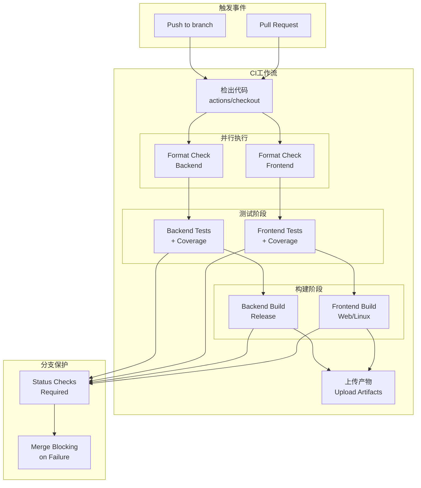
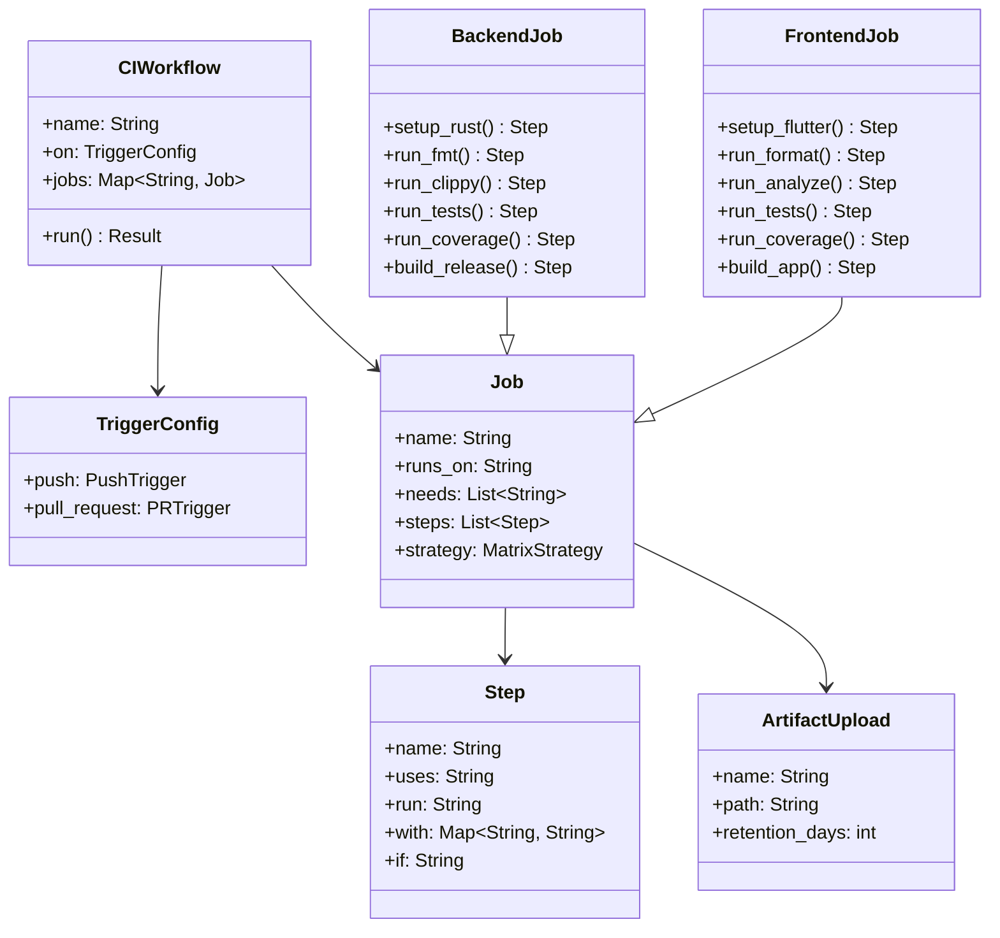
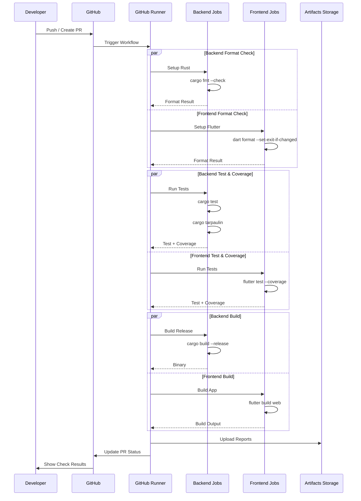
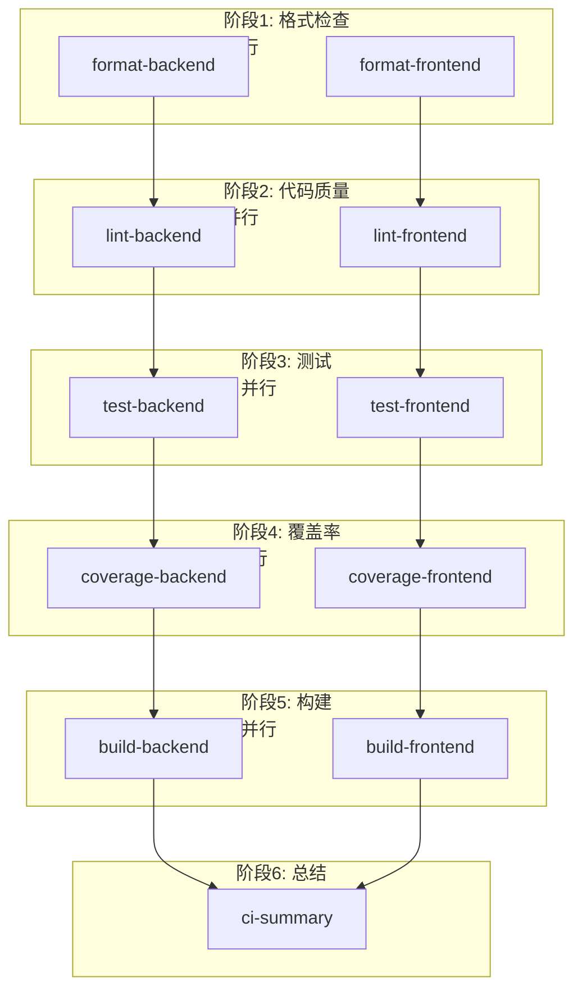
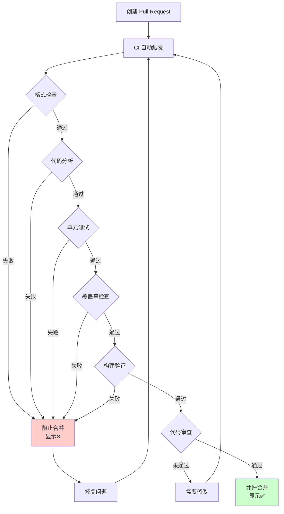

# S1-007 详细设计文档
## CI/CD Pipeline Configuration

**任务ID**: S1-007  
**任务名称**: CI/CD Pipeline Configuration  
**版本**: 1.0  
**日期**: 2024-03-18  
**状态**: 设计中

---

## 目录

1. [设计概述](#1-设计概述)
2. [CI/CD架构](#2-cicd架构)
3. [工作流配置](#3-工作流配置)
4. [Job定义](#4-job定义)
5. [脚本和工具](#5-脚本和工具)
6. [分支保护规则](#6-分支保护规则)
7. [覆盖率报告](#7-覆盖率报告)
8. [文件结构](#8-文件结构)
9. [验收标准映射](#9-验收标准映射)

---

## 1. 设计概述

### 1.1 设计目标

本设计文档定义S1-007任务的实现细节，目标是建立完整的GitHub Actions CI/CD流水线，包括：

- 自动触发工作流（push和PR事件）
- 代码格式化检查（rustfmt和dart format）
- 前后端单元测试自动执行
- 代码覆盖率报告生成
- 应用构建验证
- 分支保护和合并阻塞机制

### 1.2 设计约束

- 使用GitHub Actions作为CI/CD平台
- 支持Rust后端（cargo工具链）
- 支持Flutter前端（Flutter SDK）
- 工作流应在合理时间内完成（< 10分钟）
- 并行执行以提高效率
- 支持分支保护和合并阻塞

### 1.3 技术栈

| 技术 | 用途 | 版本 |
|-----|------|------|
| GitHub Actions | CI/CD平台 | latest |
| ubuntu-latest | 运行环境 | 22.04/24.04 |
| Rust Toolchain | 后端构建 | 1.75+ stable |
| Flutter SDK | 前端构建 | 3.19+ stable |
| cargo-tarpaulin | Rust覆盖率 | latest |
| lcov/genhtml | 覆盖率报告 | latest |

---

## 2. CI/CD架构

### 2.1 架构图



### 2.2 静态结构图



### 2.3 工作流执行时序图



---

## 3. 工作流配置

### 3.1 主工作流文件

**文件路径**: `.github/workflows/ci.yml`

```yaml
name: CI

on:
  push:
    branches: [main, develop, 'release/**', 'feature/**']
    paths:
      - 'kayak-backend/**'
      - 'kayak-frontend/**'
      - '.github/workflows/**'
      - 'Cargo.toml'
      - 'Cargo.lock'
      - 'pubspec.yaml'
      - 'pubspec.lock'
  pull_request:
    branches: [main, develop]
    paths:
      - 'kayak-backend/**'
      - 'kayak-frontend/**'
      - '.github/workflows/**'
      - 'Cargo.toml'
      - 'Cargo.lock'
      - 'pubspec.yaml'
      - 'pubspec.lock'

env:
  CARGO_TERM_COLOR: always
  RUST_BACKTRACE: 1
  RUSTFLAGS: "-D warnings"

jobs:
  # ============================================
  # 代码格式检查 - 并行执行
  # ============================================
  format-backend:
    name: Format Check (Backend)
    runs-on: ubuntu-latest
    steps:
      - name: Checkout code
        uses: actions/checkout@v4

      - name: Setup Rust
        uses: dtolnay/rust-toolchain@stable
        with:
          components: rustfmt

      - name: Check Rust formatting
        working-directory: ./kayak-backend
        run: cargo fmt -- --check

  format-frontend:
    name: Format Check (Frontend)
    runs-on: ubuntu-latest
    steps:
      - name: Checkout code
        uses: actions/checkout@v4

      - name: Setup Flutter
        uses: subosito/flutter-action@v2
        with:
          flutter-version: '3.19.0'
          channel: 'stable'
          cache: true

      - name: Check Dart formatting
        working-directory: ./kayak-frontend
        run: dart format --output=none --set-exit-if-changed .

  # ============================================
  # 代码质量检查 (Lint/Analyze)
  # ============================================
  lint-backend:
    name: Lint (Backend)
    runs-on: ubuntu-latest
    needs: format-backend
    steps:
      - name: Checkout code
        uses: actions/checkout@v4

      - name: Setup Rust
        uses: dtolnay/rust-toolchain@stable
        with:
          components: clippy

      - name: Cache cargo dependencies
        uses: Swatinem/rust-cache@v2
        with:
          workspaces: "./kayak-backend -> target"

      - name: Run Clippy
        working-directory: ./kayak-backend
        run: cargo clippy --all-targets --all-features -- -D warnings

  lint-frontend:
    name: Analyze (Frontend)
    runs-on: ubuntu-latest
    needs: format-frontend
    steps:
      - name: Checkout code
        uses: actions/checkout@v4

      - name: Setup Flutter
        uses: subosito/flutter-action@v2
        with:
          flutter-version: '3.19.0'
          channel: 'stable'
          cache: true

      - name: Get dependencies
        working-directory: ./kayak-frontend
        run: flutter pub get

      - name: Analyze Dart code
        working-directory: ./kayak-frontend
        run: flutter analyze --fatal-infos

  # ============================================
  # 单元测试 - 并行执行
  # ============================================
  test-backend:
    name: Unit Tests (Backend)
    runs-on: ubuntu-latest
    needs: lint-backend
    steps:
      - name: Checkout code
        uses: actions/checkout@v4

      - name: Setup Rust
        uses: dtolnay/rust-toolchain@stable

      - name: Cache cargo dependencies
        uses: Swatinem/rust-cache@v2
        with:
          workspaces: "./kayak-backend -> target"

      - name: Run tests
        working-directory: ./kayak-backend
        run: cargo test --all-features --verbose
        env:
          RUST_LOG: debug

      - name: Upload test results
        if: always()
        uses: actions/upload-artifact@v4
        with:
          name: backend-test-results
          path: ./kayak-backend/target/test-results/
          retention-days: 7

  test-frontend:
    name: Unit Tests (Frontend)
    runs-on: ubuntu-latest
    needs: lint-frontend
    steps:
      - name: Checkout code
        uses: actions/checkout@v4

      - name: Setup Flutter
        uses: subosito/flutter-action@v2
        with:
          flutter-version: '3.19.0'
          channel: 'stable'
          cache: true

      - name: Install dependencies
        working-directory: ./kayak-frontend
        run: |
          sudo apt-get update
          sudo apt-get install -y ninja-build libgtk-3-dev

      - name: Get Flutter dependencies
        working-directory: ./kayak-frontend
        run: flutter pub get

      - name: Run tests
        working-directory: ./kayak-frontend
        run: flutter test --coverage --verbose

      - name: Upload test results
        if: always()
        uses: actions/upload-artifact@v4
        with:
          name: frontend-test-results
          path: ./kayak-frontend/coverage/
          retention-days: 7

  # ============================================
  # 代码覆盖率 - 与测试并行
  # ============================================
  coverage-backend:
    name: Coverage (Backend)
    runs-on: ubuntu-latest
    needs: test-backend
    steps:
      - name: Checkout code
        uses: actions/checkout@v4

      - name: Setup Rust
        uses: dtolnay/rust-toolchain@stable

      - name: Cache cargo dependencies
        uses: Swatinem/rust-cache@v2
        with:
          workspaces: "./kayak-backend -> target"

      - name: Install tarpaulin
        run: cargo install cargo-tarpaulin --locked

      - name: Generate coverage report
        working-directory: ./kayak-backend
        run: cargo tarpaulin --all-features --workspace --timeout 120 --out Xml --out Html --output-dir ./coverage

      - name: Upload coverage report
        uses: actions/upload-artifact@v4
        with:
          name: backend-coverage-report
          path: ./kayak-backend/coverage/
          retention-days: 14

      - name: Upload to Codecov (optional)
        uses: codecov/codecov-action@v3
        if: github.event_name == 'pull_request'
        with:
          files: ./kayak-backend/coverage/cobertura.xml
          flags: backend
          name: backend-coverage

  coverage-frontend:
    name: Coverage (Frontend)
    runs-on: ubuntu-latest
    needs: test-frontend
    steps:
      - name: Checkout code
        uses: actions/checkout@v4

      - name: Setup Flutter
        uses: subosito/flutter-action@v2
        with:
          flutter-version: '3.19.0'
          channel: 'stable'
          cache: true

      - name: Install dependencies
        run: |
          sudo apt-get update
          sudo apt-get install -y lcov

      - name: Get Flutter dependencies
        working-directory: ./kayak-frontend
        run: flutter pub get

      - name: Generate coverage
        working-directory: ./kayak-frontend
        run: flutter test --coverage

      - name: Generate HTML report
        working-directory: ./kayak-frontend
        run: |
          genhtml coverage/lcov.info --output-directory coverage/html

      - name: Upload coverage report
        uses: actions/upload-artifact@v4
        with:
          name: frontend-coverage-report
          path: ./kayak-frontend/coverage/
          retention-days: 14

      - name: Upload to Codecov (optional)
        uses: codecov/codecov-action@v3
        if: github.event_name == 'pull_request'
        with:
          files: ./kayak-frontend/coverage/lcov.info
          flags: frontend
          name: frontend-coverage

  # ============================================
  # 构建验证 - 并行执行
  # ============================================
  build-backend:
    name: Build (Backend)
    runs-on: ubuntu-latest
    needs: [test-backend, coverage-backend]
    strategy:
      matrix:
        target: [x86_64-unknown-linux-gnu]
    steps:
      - name: Checkout code
        uses: actions/checkout@v4

      - name: Setup Rust
        uses: dtolnay/rust-toolchain@stable
        with:
          targets: ${{ matrix.target }}

      - name: Cache cargo dependencies
        uses: Swatinem/rust-cache@v2
        with:
          workspaces: "./kayak-backend -> target"

      - name: Build release
        working-directory: ./kayak-backend
        run: cargo build --release --target ${{ matrix.target }}

      - name: Upload binary
        uses: actions/upload-artifact@v4
        with:
          name: kayak-backend-${{ matrix.target }}
          path: ./kayak-backend/target/${{ matrix.target }}/release/kayak-backend
          retention-days: 7

  build-frontend:
    name: Build (Frontend)
    runs-on: ubuntu-latest
    needs: [test-frontend, coverage-frontend]
    strategy:
      matrix:
        target: [web, linux]
    steps:
      - name: Checkout code
        uses: actions/checkout@v4

      - name: Setup Flutter
        uses: subosito/flutter-action@v2
        with:
          flutter-version: '3.19.0'
          channel: 'stable'
          cache: true

      - name: Install Linux dependencies
        if: matrix.target == 'linux'
        run: |
          sudo apt-get update
          sudo apt-get install -y ninja-build libgtk-3-dev libblkid-dev

      - name: Get dependencies
        working-directory: ./kayak-frontend
        run: flutter pub get

      - name: Build Web
        if: matrix.target == 'web'
        working-directory: ./kayak-frontend
        run: flutter build web --release

      - name: Build Linux
        if: matrix.target == 'linux'
        working-directory: ./kayak-frontend
        run: flutter build linux --release

      - name: Upload build artifacts
        uses: actions/upload-artifact@v4
        with:
          name: kayak-frontend-${{ matrix.target }}
          path: |
            ./kayak-frontend/build/web/
            ./kayak-frontend/build/linux/
          retention-days: 7

  # ============================================
  # 总结报告
  # ============================================
  ci-summary:
    name: CI Summary
    runs-on: ubuntu-latest
    needs: [build-backend, build-frontend]
    if: always()
    steps:
      - name: Checkout code
        uses: actions/checkout@v4

      - name: Summary
        run: |
          echo "## CI Workflow Summary" >> $GITHUB_STEP_SUMMARY
          echo "" >> $GITHUB_STEP_SUMMARY
          echo "| Job | Status |" >> $GITHUB_STEP_SUMMARY
          echo "|-----|--------|" >> $GITHUB_STEP_SUMMARY
          echo "| Format Backend | ${{ needs.format-backend.result }} |" >> $GITHUB_STEP_SUMMARY
          echo "| Format Frontend | ${{ needs.format-frontend.result }} |" >> $GITHUB_STEP_SUMMARY
          echo "| Lint Backend | ${{ needs.lint-backend.result }} |" >> $GITHUB_STEP_SUMMARY
          echo "| Analyze Frontend | ${{ needs.lint-frontend.result }} |" >> $GITHUB_STEP_SUMMARY
          echo "| Test Backend | ${{ needs.test-backend.result }} |" >> $GITHUB_STEP_SUMMARY
          echo "| Test Frontend | ${{ needs.test-frontend.result }} |" >> $GITHUB_STEP_SUMMARY
          echo "| Coverage Backend | ${{ needs.coverage-backend.result }} |" >> $GITHUB_STEP_SUMMARY
          echo "| Coverage Frontend | ${{ needs.coverage-frontend.result }} |" >> $GITHUB_STEP_SUMMARY
          echo "| Build Backend | ${{ needs.build-backend.result }} |" >> $GITHUB_STEP_SUMMARY
          echo "| Build Frontend | ${{ needs.build-frontend.result }} |" >> $GITHUB_STEP_SUMMARY
```

### 3.2 依赖关系图



---

## 4. Job定义

### 4.1 Backend Job详细设计

#### 4.1.1 格式检查 Job

```yaml
format-backend:
  name: Format Check (Backend)
  runs-on: ubuntu-latest
  timeout-minutes: 5
  
  steps:
    - name: Checkout code
      uses: actions/checkout@v4
      with:
        fetch-depth: 1

    - name: Setup Rust
      uses: dtolnay/rust-toolchain@stable
      with:
        components: rustfmt
        toolchain: stable

    - name: Verify rustfmt version
      run: rustfmt --version

    - name: Check formatting
      working-directory: ./kayak-backend
      run: |
        echo "Checking Rust code formatting..."
        cargo fmt -- --check
      shell: bash

    - name: Report formatting issues
      if: failure()
      run: |
        echo "::error::Code formatting check failed. Run 'cargo fmt' locally to fix."
        echo "Formatting issues found in the following files:"
        cargo fmt -- --check --emit=stdout || true
      working-directory: ./kayak-backend
```

#### 4.1.2 Lint检查 Job

```yaml
lint-backend:
  name: Lint (Backend)
  runs-on: ubuntu-latest
  needs: format-backend
  timeout-minutes: 10
  
  steps:
    - name: Checkout code
      uses: actions/checkout@v4

    - name: Setup Rust
      uses: dtolnay/rust-toolchain@stable
      with:
        components: clippy

    - name: Cache dependencies
      uses: Swatinem/rust-cache@v2
      with:
        workspaces: "./kayak-backend -> target"
        shared-key: "backend-lint"

    - name: Run Clippy
      working-directory: ./kayak-backend
      run: |
        cargo clippy --all-targets --all-features -- \
          -D warnings \
          -D clippy::all \
          -D clippy::pedantic \
          -A clippy::module_name_repetitions
```

#### 4.1.3 测试 Job

```yaml
test-backend:
  name: Unit Tests (Backend)
  runs-on: ubuntu-latest
  needs: lint-backend
  timeout-minutes: 15
  
  services:
    # 如果需要数据库等依赖服务
    # postgres:
    #   image: postgres:15-alpine
    #   env:
    #     POSTGRES_PASSWORD: postgres
    #   options: >-
    #     --health-cmd pg_isready
    #     --health-interval 10s
    #     --health-timeout 5s
    #     --health-retries 5
    #   ports:
    #     - 5432:5432
  
  steps:
    - name: Checkout code
      uses: actions/checkout@v4

    - name: Setup Rust
      uses: dtolnay/rust-toolchain@stable

    - name: Cache dependencies
      uses: Swatinem/rust-cache@v2
      with:
        workspaces: "./kayak-backend -> target"
        shared-key: "backend-test"

    - name: Install dependencies
      run: |
        sudo apt-get update
        sudo apt-get install -y pkg-config libssl-dev

    - name: Run tests
      working-directory: ./kayak-backend
      run: |
        cargo test --all-features --workspace --verbose 2>&1 | tee test-output.txt
      env:
        RUST_LOG: debug
        RUST_BACKTRACE: 1

    - name: Parse test results
      if: always()
      working-directory: ./kayak-backend
      run: |
        echo "## Test Results" >> $GITHUB_STEP_SUMMARY
        grep -E "^test |^running |test result:" test-output.txt >> $GITHUB_STEP_SUMMARY || true

    - name: Upload test results
      if: always()
      uses: actions/upload-artifact@v4
      with:
        name: backend-test-results-${{ github.run_id }}
        path: |
          ./kayak-backend/test-output.txt
          ./kayak-backend/target/nextest/default/junit.xml
        retention-days: 7
```

#### 4.1.4 覆盖率 Job

```yaml
coverage-backend:
  name: Coverage (Backend)
  runs-on: ubuntu-latest
  needs: test-backend
  timeout-minutes: 20
  
  steps:
    - name: Checkout code
      uses: actions/checkout@v4

    - name: Setup Rust
      uses: dtolnay/rust-toolchain@stable

    - name: Cache dependencies
      uses: Swatinem/rust-cache@v2
      with:
        workspaces: "./kayak-backend -> target"

    - name: Install tarpaulin
      run: |
        if ! command -v cargo-tarpaulin &> /dev/null; then
          cargo install cargo-tarpaulin --locked
        fi

    - name: Generate coverage
      working-directory: ./kayak-backend
      run: |
        cargo tarpaulin \
          --all-features \
          --workspace \
          --timeout 120 \
          --out Xml \
          --out Html \
          --output-dir ./coverage \
          --verbose
      env:
        RUST_LOG: warn

    - name: Coverage summary
      working-directory: ./kayak-backend
      run: |
        echo "## Backend Coverage Summary" >> $GITHUB_STEP_SUMMARY
        if [ -f coverage/tarpaulin-report.html ]; then
          echo "Coverage report generated successfully" >> $GITHUB_STEP_SUMMARY
        fi

    - name: Upload coverage
      uses: actions/upload-artifact@v4
      with:
        name: backend-coverage-${{ github.run_id }}
        path: ./kayak-backend/coverage/
        retention-days: 14
```

#### 4.1.5 构建 Job

```yaml
build-backend:
  name: Build (Backend)
  runs-on: ubuntu-latest
  needs: [test-backend, coverage-backend]
  timeout-minutes: 15
  strategy:
    matrix:
      target: [x86_64-unknown-linux-gnu]
      include:
        - target: x86_64-unknown-linux-gnu
          os: ubuntu-latest
  
  steps:
    - name: Checkout code
      uses: actions/checkout@v4

    - name: Setup Rust
      uses: dtolnay/rust-toolchain@stable
      with:
        targets: ${{ matrix.target }}

    - name: Cache dependencies
      uses: Swatinem/rust-cache@v2
      with:
        workspaces: "./kayak-backend -> target"
        shared-key: "backend-build-${{ matrix.target }}"

    - name: Build release
      working-directory: ./kayak-backend
      run: |
        cargo build --release --target ${{ matrix.target }} --verbose
        ls -la target/${{ matrix.target }}/release/

    - name: Strip binary
      run: |
        strip kayak-backend/target/${{ matrix.target }}/release/kayak-backend || true

    - name: Upload artifact
      uses: actions/upload-artifact@v4
      with:
        name: kayak-backend-${{ matrix.target }}-${{ github.run_id }}
        path: ./kayak-backend/target/${{ matrix.target }}/release/kayak-backend
        retention-days: 7
        if-no-files-found: error
```

### 4.2 Frontend Job详细设计

#### 4.2.1 格式检查 Job

```yaml
format-frontend:
  name: Format Check (Frontend)
  runs-on: ubuntu-latest
  timeout-minutes: 5
  
  steps:
    - name: Checkout code
      uses: actions/checkout@v4

    - name: Setup Flutter
      uses: subosito/flutter-action@v2
      with:
        flutter-version: '3.19.0'
        channel: 'stable'
        cache: true
        cache-key: 'flutter-3.19.0'

    - name: Verify Flutter version
      run: |
        flutter --version
        dart --version

    - name: Check formatting
      working-directory: ./kayak-frontend
      run: |
        echo "Checking Dart code formatting..."
        dart format --output=none --set-exit-if-changed .
      shell: bash

    - name: Report formatting issues
      if: failure()
      run: |
        echo "::error::Code formatting check failed. Run 'dart format .' locally to fix."
      working-directory: ./kayak-frontend
```

#### 4.2.2 分析 Job

```yaml
lint-frontend:
  name: Analyze (Frontend)
  runs-on: ubuntu-latest
  needs: format-frontend
  timeout-minutes: 10
  
  steps:
    - name: Checkout code
      uses: actions/checkout@v4

    - name: Setup Flutter
      uses: subosito/flutter-action@v2
      with:
        flutter-version: '3.19.0'
        channel: 'stable'
        cache: true

    - name: Get dependencies
      working-directory: ./kayak-frontend
      run: flutter pub get

    - name: Analyze code
      working-directory: ./kayak-frontend
      run: |
        flutter analyze --fatal-infos --fatal-warnings
```

#### 4.2.3 测试 Job

```yaml
test-frontend:
  name: Unit Tests (Frontend)
  runs-on: ubuntu-latest
  needs: lint-frontend
  timeout-minutes: 15
  
  steps:
    - name: Checkout code
      uses: actions/checkout@v4

    - name: Setup Flutter
      uses: subosito/flutter-action@v2
      with:
        flutter-version: '3.19.0'
        channel: 'stable'
        cache: true

    - name: Install Linux dependencies
      run: |
        sudo apt-get update
        sudo apt-get install -y ninja-build libgtk-3-dev libblkid-dev

    - name: Get dependencies
      working-directory: ./kayak-frontend
      run: flutter pub get

    - name: Run tests
      working-directory: ./kayak-frontend
      run: |
        flutter test --coverage --verbose 2>&1 | tee test-output.txt

    - name: Parse test results
      if: always()
      working-directory: ./kayak-frontend
      run: |
        echo "## Frontend Test Results" >> $GITHUB_STEP_SUMMARY
        grep -E "^\d+:\s|^All tests passed!|^Some tests failed." test-output.txt >> $GITHUB_STEP_SUMMARY || true

    - name: Upload test results
      if: always()
      uses: actions/upload-artifact@v4
      with:
        name: frontend-test-results-${{ github.run_id }}
        path: |
          ./kayak-frontend/test-output.txt
          ./kayak-frontend/coverage/lcov.info
        retention-days: 7
```

#### 4.2.4 覆盖率 Job

```yaml
coverage-frontend:
  name: Coverage (Frontend)
  runs-on: ubuntu-latest
  needs: test-frontend
  timeout-minutes: 15
  
  steps:
    - name: Checkout code
      uses: actions/checkout@v4

    - name: Setup Flutter
      uses: subosito/flutter-action@v2
      with:
        flutter-version: '3.19.0'
        channel: 'stable'
        cache: true

    - name: Install dependencies
      run: |
        sudo apt-get update
        sudo apt-get install -y lcov

    - name: Get Flutter dependencies
      working-directory: ./kayak-frontend
      run: flutter pub get

    - name: Run tests with coverage
      working-directory: ./kayak-frontend
      run: flutter test --coverage

    - name: Generate HTML report
      working-directory: ./kayak-frontend
      run: |
        if [ -f coverage/lcov.info ]; then
          genhtml coverage/lcov.info --output-directory coverage/html --title "Frontend Coverage"
          echo "Coverage report generated"
        fi

    - name: Coverage summary
      working-directory: ./kayak-frontend
      run: |
        echo "## Frontend Coverage Summary" >> $GITHUB_STEP_SUMMARY
        if [ -f coverage/lcov.info ]; then
          lcov --summary coverage/lcov.info 2>&1 | head -20 >> $GITHUB_STEP_SUMMARY
        fi

    - name: Upload coverage
      uses: actions/upload-artifact@v4
      with:
        name: frontend-coverage-${{ github.run_id }}
        path: ./kayak-frontend/coverage/
        retention-days: 14
```

#### 4.2.5 构建 Job

```yaml
build-frontend:
  name: Build (Frontend)
  runs-on: ubuntu-latest
  needs: [test-frontend, coverage-frontend]
  timeout-minutes: 20
  strategy:
    matrix:
      target: [web, linux]
      include:
        - target: web
          build_cmd: flutter build web --release
          artifact_path: build/web
        - target: linux
          build_cmd: flutter build linux --release
          artifact_path: build/linux/x64/release/bundle
  
  steps:
    - name: Checkout code
      uses: actions/checkout@v4

    - name: Setup Flutter
      uses: subosito/flutter-action@v2
      with:
        flutter-version: '3.19.0'
        channel: 'stable'
        cache: true

    - name: Install Linux dependencies
      if: matrix.target == 'linux'
      run: |
        sudo apt-get update
        sudo apt-get install -y ninja-build libgtk-3-dev libblkid-dev

    - name: Get dependencies
      working-directory: ./kayak-frontend
      run: flutter pub get

    - name: Build ${{ matrix.target }}
      working-directory: ./kayak-frontend
      run: ${{ matrix.build_cmd }}

    - name: List build output
      working-directory: ./kayak-frontend
      run: |
        ls -la ${{ matrix.artifact_path }} || true

    - name: Upload artifact
      uses: actions/upload-artifact@v4
      with:
        name: kayak-frontend-${{ matrix.target }}-${{ github.run_id }}
        path: ./kayak-frontend/${{ matrix.artifact_path }}
        retention-days: 7
        if-no-files-found: error
```

---

## 5. 脚本和工具

### 5.1 本地验证脚本

**文件路径**: `scripts/ci-check.sh`

```bash
#!/bin/bash
# =============================================================================
# CI 本地验证脚本
# 在提交前本地运行此脚本验证CI检查
# =============================================================================

set -e

PROJECT_DIR="$(cd "$(dirname "${BASH_SOURCE[0]}")/.." && pwd)"
BACKEND_DIR="$PROJECT_DIR/kayak-backend"
FRONTEND_DIR="$PROJECT_DIR/kayak-frontend"

RED='\033[0;31m'
GREEN='\033[0;32m'
YELLOW='\033[1;33m'
NC='\033[0m' # No Color

echo "=========================================="
echo "CI 本地验证脚本"
echo "=========================================="
echo ""

# 检查命令是否存在
command_exists() {
    command -v "$1" >/dev/null 2>&1
}

# 运行步骤
run_step() {
    local name="$1"
    local cmd="$2"
    local dir="${3:-$PROJECT_DIR}"
    
    echo -e "${YELLOW}▶ $name${NC}"
    if (cd "$dir" && eval "$cmd"); then
        echo -e "${GREEN}✓ $name 通过${NC}"
        echo ""
        return 0
    else
        echo -e "${RED}✗ $name 失败${NC}"
        echo ""
        return 1
    fi
}

FAILED=0

# ============================================
# 后端检查
# ============================================
echo "=========================================="
echo "后端检查 (Rust)"
echo "=========================================="

if [ -d "$BACKEND_DIR" ]; then
    # Format check
    if command_exists cargo; then
        run_step "Rust 格式化检查" "cargo fmt -- --check" "$BACKEND_DIR" || FAILED=1
        
        # Clippy check
        run_step "Rust Clippy 检查" "cargo clippy --all-targets --all-features -- -D warnings" "$BACKEND_DIR" || FAILED=1
        
        # Test
        run_step "Rust 单元测试" "cargo test --all-features" "$BACKEND_DIR" || FAILED=1
        
        # Build
        run_step "Rust 构建" "cargo build --release" "$BACKEND_DIR" || FAILED=1
    else
        echo -e "${YELLOW}⚠ Cargo 未安装，跳过后端检查${NC}"
        echo ""
    fi
else
    echo -e "${YELLOW}⚠ 后端目录不存在，跳过${NC}"
    echo ""
fi

# ============================================
# 前端检查
# ============================================
echo "=========================================="
echo "前端检查 (Flutter)"
echo "=========================================="

if [ -d "$FRONTEND_DIR" ]; then
    if command_exists flutter; then
        # Format check
        run_step "Dart 格式化检查" "dart format --output=none --set-exit-if-changed ." "$FRONTEND_DIR" || FAILED=1
        
        # Analyze
        run_step "Dart 代码分析" "flutter analyze --fatal-infos" "$FRONTEND_DIR" || FAILED=1
        
        # Test
        run_step "Flutter 单元测试" "flutter test" "$FRONTEND_DIR" || FAILED=1
        
        # Build Web
        run_step "Flutter Web 构建" "flutter build web --release" "$FRONTEND_DIR" || FAILED=1
    else
        echo -e "${YELLOW}⚠ Flutter 未安装，跳过前端检查${NC}"
        echo ""
    fi
else
    echo -e "${YELLOW}⚠ 前端目录不存在，跳过${NC}"
    echo ""
fi

# ============================================
# 总结
# ============================================
echo "=========================================="
echo "验证总结"
echo "=========================================="

if [ $FAILED -eq 0 ]; then
    echo -e "${GREEN}✓ 所有检查通过！可以安全提交。${NC}"
    exit 0
else
    echo -e "${RED}✗ 部分检查失败，请修复后重试。${NC}"
    exit 1
fi
```

### 5.2 工作流验证脚本

**文件路径**: `scripts/validate-workflow.sh`

```bash
#!/bin/bash
# =============================================================================
# GitHub Actions 工作流验证脚本
# 验证工作流文件语法和结构
# =============================================================================

set -e

PROJECT_DIR="$(cd "$(dirname "${BASH_SOURCE[0]}")/.." && pwd)"
WORKFLOW_FILE="$PROJECT_DIR/.github/workflows/ci.yml"

RED='\033[0;31m'
GREEN='\033[0;32m'
YELLOW='\033[1;33m'
NC='\033[0m'

echo "=========================================="
echo "GitHub Actions 工作流验证"
echo "=========================================="
echo ""

# 检查工作流文件是否存在
if [ ! -f "$WORKFLOW_FILE" ]; then
    echo -e "${RED}✗ 工作流文件不存在: $WORKFLOW_FILE${NC}"
    exit 1
fi

echo -e "${GREEN}✓ 工作流文件存在${NC}"

# 检查 YAML 语法
if command -v yamllint >/dev/null 2>&1; then
    echo "检查 YAML 语法..."
    if yamllint "$WORKFLOW_FILE"; then
        echo -e "${GREEN}✓ YAML 语法正确${NC}"
    else
        echo -e "${YELLOW}⚠ YAML 有警告/错误${NC}"
    fi
else
    echo -e "${YELLOW}⚠ yamllint 未安装，跳过 YAML 语法检查${NC}"
fi

# 使用 actionlint 检查（如果已安装）
if command -v actionlint >/dev/null 2>&1; then
    echo ""
    echo "使用 actionlint 检查工作流..."
    if actionlint "$WORKFLOW_FILE"; then
        echo -e "${GREEN}✓ actionlint 检查通过${NC}"
    else
        echo -e "${RED}✗ actionlint 发现错误${NC}"
        exit 1
    fi
else
    echo -e "${YELLOW}⚠ actionlint 未安装${NC}"
    echo "安装: brew install actionlint 或下载: https://github.com/rhysd/actionlint"
fi

# 基本结构检查
echo ""
echo "检查工作流基本结构..."

if grep -q "^name:" "$WORKFLOW_FILE"; then
    echo -e "${GREEN}✓ 工作流有名称${NC}"
else
    echo -e "${RED}✗ 工作流缺少名称${NC}"
    exit 1
fi

if grep -q "^on:" "$WORKFLOW_FILE"; then
    echo -e "${GREEN}✓ 工作流有触发条件${NC}"
else
    echo -e "${RED}✗ 工作流缺少触发条件${NC}"
    exit 1
fi

if grep -q "^jobs:" "$WORKFLOW_FILE"; then
    echo -e "${GREEN}✓ 工作流有任务定义${NC}"
else
    echo -e "${RED}✗ 工作流缺少任务定义${NC}"
    exit 1
fi

echo ""
echo "=========================================="
echo -e "${GREEN}✓ 工作流验证完成${NC}"
echo "=========================================="
```

### 5.3 覆盖率生成脚本

**文件路径**: `scripts/generate-coverage.sh`

```bash
#!/bin/bash
# =============================================================================
# 覆盖率报告生成脚本
# 为前后端生成覆盖率报告
# =============================================================================

set -e

PROJECT_DIR="$(cd "$(dirname "${BASH_SOURCE[0]}")/.." && pwd)"
BACKEND_DIR="$PROJECT_DIR/kayak-backend"
FRONTEND_DIR="$PROJECT_DIR/kayak-frontend"

RED='\033[0;31m'
GREEN='\033[0;32m'
YELLOW='\033[1;33m'
NC='\033[0m'

MODE="${1:-all}"  # all, backend, frontend

echo "=========================================="
echo "覆盖率报告生成"
echo "模式: $MODE"
echo "=========================================="
echo ""

# ============================================
# 后端覆盖率
# ============================================
generate_backend_coverage() {
    echo "生成后端覆盖率报告..."
    
    if [ ! -d "$BACKEND_DIR" ]; then
        echo -e "${YELLOW}⚠ 后端目录不存在${NC}"
        return 1
    fi
    
    if ! command -v cargo >/dev/null 2>&1; then
        echo -e "${RED}✗ Cargo 未安装${NC}"
        return 1
    fi
    
    # 安装 tarpaulin（如果需要）
    if ! command -v cargo-tarpaulin >/dev/null 2>&1; then
        echo "安装 cargo-tarpaulin..."
        cargo install cargo-tarpaulin --locked
    fi
    
    cd "$BACKEND_DIR"
    
    # 生成覆盖率报告
    cargo tarpaulin \
        --all-features \
        --workspace \
        --timeout 120 \
        --out Xml \
        --out Html \
        --output-dir ./coverage
    
    echo -e "${GREEN}✓ 后端覆盖率报告已生成: $BACKEND_DIR/coverage/${NC}"
    
    # 显示摘要
    if [ -f "coverage/cobertura.xml" ]; then
        echo ""
        echo "覆盖率摘要:"
        grep -o 'line-rate="[0-9.]*"' coverage/cobertura.xml | head -1 | sed 's/line-rate="\([0-9.]*\)"/\1/' | awk '{print "行覆盖率: " $1 * 100 "%"}'
    fi
}

# ============================================
# 前端覆盖率
# ============================================
generate_frontend_coverage() {
    echo "生成前端覆盖率报告..."
    
    if [ ! -d "$FRONTEND_DIR" ]; then
        echo -e "${YELLOW}⚠ 前端目录不存在${NC}"
        return 1
    fi
    
    if ! command -v flutter >/dev/null 2>&1; then
        echo -e "${RED}✗ Flutter 未安装${NC}"
        return 1
    fi
    
    # 安装 lcov（如果需要）
    if ! command -v genhtml >/dev/null 2>&1; then
        echo -e "${YELLOW}⚠ lcov 未安装，尝试安装...${NC}"
        if command -v apt-get >/dev/null 2>&1; then
            sudo apt-get update && sudo apt-get install -y lcov
        elif command -v brew >/dev/null 2>&1; then
            brew install lcov
        else
            echo -e "${RED}✗ 无法自动安装 lcov${NC}"
            return 1
        fi
    fi
    
    cd "$FRONTEND_DIR"
    
    # 获取依赖
    flutter pub get
    
    # 运行测试并生成覆盖率
    flutter test --coverage
    
    # 生成 HTML 报告
    if [ -f "coverage/lcov.info" ]; then
        genhtml coverage/lcov.info --output-directory coverage/html --title "Kayak Frontend Coverage"
        
        # 显示摘要
        echo ""
        echo "覆盖率摘要:"
        lcov --summary coverage/lcov.info 2>&1 | grep -E "(lines|functions).*%;" || true
    fi
    
    echo -e "${GREEN}✓ 前端覆盖率报告已生成: $FRONTEND_DIR/coverage/html/${NC}"
}

# ============================================
# 主逻辑
# ============================================
case "$MODE" in
    backend)
        generate_backend_coverage
        ;;
    frontend)
        generate_frontend_coverage
        ;;
    all)
        generate_backend_coverage
        echo ""
        generate_frontend_coverage
        ;;
    *)
        echo "用法: $0 [backend|frontend|all]"
        echo "  backend  - 仅生成后端覆盖率报告"
        echo "  frontend - 仅生成前端覆盖率报告"
        echo "  all      - 生成前后端覆盖率报告（默认）"
        exit 1
        ;;
esac

echo ""
echo "=========================================="
echo -e "${GREEN}✓ 覆盖率报告生成完成${NC}"
echo "=========================================="
```

---

## 6. 分支保护规则

### 6.1 配置说明

分支保护规则需要在GitHub仓库设置中手动配置。以下是详细的配置步骤和要求。

### 6.2 分支保护规则配置

#### 目标分支: `main`

| 配置项 | 设置值 | 说明 |
|-------|--------|------|
| Require a pull request before merging | ✅ 启用 | 必须通过PR合并 |
| Require approvals | 1+ | 至少需要1个审批 |
| Dismiss stale PR approvals | ✅ 启用 | 新提交后需要重新审批 |
| Require review from Code Owners | 可选 | 如使用CODEOWNERS文件则启用 |
| Require status checks to pass | ✅ 启用 | 必须满足所有状态检查 |
| Status checks that are required | 见下方列表 | 必须的CI检查 |
| Require conversation resolution | ✅ 启用 | 所有对话必须解决 |
| Require signed commits | 可选 | 根据需要启用 |
| Require linear history | 可选 | 强制线性历史 |
| Include administrators | 建议启用 | 管理员也遵守规则 |
| Restrict pushes that create files | ❌ 禁用 | 允许正常推送 |
| Allow force pushes | ❌ 禁用 | 禁止强制推送 |
| Allow deletions | ❌ 禁用 | 禁止删除分支 |

### 6.3 必需的状态检查列表

以下CI任务必须配置为**必需**（Required）状态检查：

```yaml
必需检查:
  - Format Check (Backend)
  - Format Check (Frontend)
  - Lint (Backend)
  - Analyze (Frontend)
  - Unit Tests (Backend)
  - Unit Tests (Frontend)
  - Coverage (Backend)
  - Coverage (Frontend)
  - Build (Backend)
  - Build (Frontend)
```

### 6.4 配置命令（使用GitHub CLI）

```bash
# 设置 main 分支保护
gh api repos/{owner}/{repo}/branches/main/protection \
  --method PUT \
  --input - <<EOF
{
  "required_status_checks": {
    "strict": true,
    "contexts": [
      "Format Check (Backend)",
      "Format Check (Frontend)",
      "Lint (Backend)",
      "Analyze (Frontend)",
      "Unit Tests (Backend)",
      "Unit Tests (Frontend)",
      "Coverage (Backend)",
      "Coverage (Frontend)",
      "Build (Backend)",
      "Build (Frontend)"
    ]
  },
  "enforce_admins": true,
  "required_pull_request_reviews": {
    "dismiss_stale_reviews": true,
    "require_code_owner_reviews": false,
    "required_approving_review_count": 1
  },
  "restrictions": null,
  "allow_force_pushes": false,
  "allow_deletions": false,
  "required_conversation_resolution": true
}
EOF
```

### 6.5 合并阻塞流程图



---

## 7. 覆盖率报告

### 7.1 后端覆盖率（cargo-tarpaulin）

#### 7.1.1 配置

**文件路径**: `kayak-backend/.tarpaulin.toml`

```toml
[config]
# 输出格式
output = ["Html", "Xml"]

# 超时设置（秒）
timeout = "120"

# 包含所有特性
all-features = true

# 包含工作空间所有包
workspace = true

# 输出目录
output-dir = "./coverage"

# 忽略的目录
exclude-files = [
    "target/*",
    "tests/*",
    "**/*.gen.rs"
]

# 忽略的行模式
exclude-lines = [
    "#\\[derive",
    "#\\[error",
    "unimplemented!",
    "todo!"
]
```

#### 7.1.2 生成和查看

```bash
# 生成覆盖率报告
cd kayak-backend
cargo tarpaulin --config .tarpaulin.toml

# 查看 HTML 报告
open coverage/tarpaulin-report.html  # macOS
xdg-open coverage/tarpaulin-report.html  # Linux
```

### 7.2 前端覆盖率（Flutter + lcov）

#### 7.2.1 配置

**文件路径**: `kayak-frontend/.flutter_coverage.yml`

```yaml
# Flutter 覆盖率配置
exclude:
  - "**/*.g.dart"
  - "**/*.freezed.dart"
  - "**/generated_plugin_registrant.dart"
  - "lib/generated/**"
  - "test/**"
```

#### 7.2.2 生成和查看

```bash
# 生成覆盖率数据
cd kayak-frontend
flutter test --coverage

# 生成 HTML 报告
genhtml coverage/lcov.info --output-directory coverage/html --title "Kayak Frontend Coverage"

# 查看报告
open coverage/html/index.html  # macOS
xdg-open coverage/html/index.html  # Linux
```

### 7.3 覆盖率阈值配置

可以在CI中添加覆盖率阈值检查：

```yaml
- name: Check coverage threshold
  working-directory: ./kayak-backend
  run: |
    # 解析覆盖率百分比
    COVERAGE=$(grep -o 'line-rate="[0-9.]*"' coverage/cobertura.xml | head -1 | sed 's/line-rate="\([0-9.]*\)"/\1/')
    COVERAGE_PERCENT=$(echo "$COVERAGE * 100" | bc)
    
    echo "Current coverage: ${COVERAGE_PERCENT}%"
    
    # 检查是否低于阈值（例如 80%）
    THRESHOLD=80
    if (( $(echo "$COVERAGE_PERCENT < $THRESHOLD" | bc -l) )); then
      echo "::error::Coverage ${COVERAGE_PERCENT}% is below threshold ${THRESHOLD}%"
      exit 1
    fi
```

### 7.4 覆盖率徽章

在 `README.md` 中添加覆盖率徽章：

```markdown


```

---

## 8. 文件结构

### 8.1 CI/CD相关文件清单

```
kayak/
├── .github/
│   └── workflows/
│       ├── ci.yml                    # 主CI工作流
│       ├── release.yml               # 发布工作流（可选）
│       └── pr-check.yml              # PR专用检查（可选）
│
├── scripts/
│   ├── ci-check.sh                   # 本地CI检查脚本
│   ├── validate-workflow.sh          # 工作流验证脚本
│   └── generate-coverage.sh          # 覆盖率生成脚本
│
├── kayak-backend/
│   ├── .tarpaulin.toml              # tarpaulin配置
│   └── coverage/                     # 覆盖率输出目录（.gitignore）
│
├── kayak-frontend/
│   ├── .flutter_coverage.yml        # Flutter覆盖率配置
│   └── coverage/                     # 覆盖率输出目录（.gitignore）
│
└── README.md                         # 包含CI状态和徽章
```

### 8.2 文件职责说明

| 文件/目录 | 职责 | 必需 |
|-----------|------|------|
| `.github/workflows/ci.yml` | 主CI工作流定义 | 是 |
| `scripts/ci-check.sh` | 本地CI验证脚本 | 否（推荐） |
| `scripts/validate-workflow.sh` | 工作流语法验证 | 否（推荐） |
| `scripts/generate-coverage.sh` | 本地覆盖率生成 | 否（推荐） |
| `kayak-backend/.tarpaulin.toml` | Rust覆盖率工具配置 | 否 |
| `kayak-frontend/.flutter_coverage.yml` | Flutter覆盖率配置 | 否 |

### 8.3 .gitignore 更新

```gitignore
# CI/CD
.github/workflows/*.bak
scripts/*.log

# Coverage reports
**/coverage/
*.lcov
*.profraw
cobertura.xml
tarpaulin-report.html

# Build artifacts from CI
*.tar.gz
*.zip
```

---

## 9. 验收标准映射

### 9.1 验收标准与测试用例映射

| 验收标准 | 测试用例 | 实现方式 | 验证方法 |
|----------|----------|----------|----------|
| **AC1: PR提交自动触发CI检查** | TC-CI-001, TC-CI-002, TC-CI-003 | `on: pull_request` 配置 | 创建测试PR验证触发 |
| **AC2: CI失败阻止合并** | TC-MERGE-001, TC-MERGE-002, TC-MERGE-003 | 分支保护规则 + 必需状态检查 | 创建失败PR验证阻塞 |
| **AC3: 构建产物可下载** | TC-BUILD-003, TC-COVER-003 | `upload-artifact` 步骤 | 下载验证产物 |

### 9.2 测试用例覆盖矩阵

| 测试用例ID | 描述 | 工作流Job | 验证点 |
|------------|------|-----------|--------|
| TC-CI-001 | Push事件触发验证 | ci.yml triggers | push触发条件 |
| TC-CI-002 | PR事件触发验证 | ci.yml triggers | pull_request触发条件 |
| TC-CI-003 | 路径过滤验证 | paths filter | 仅相关文件变更触发 |
| TC-FMT-001 | Rust格式化检查 | format-backend | cargo fmt --check |
| TC-FMT-002 | Dart格式化检查 | format-frontend | dart format |
| TC-FMT-003 | 格式化配置验证 | 全局配置 | 步骤顺序和配置 |
| TC-TEST-001 | 后端单元测试 | test-backend | cargo test |
| TC-TEST-002 | 前端单元测试 | test-frontend | flutter test |
| TC-TEST-003 | 并行执行验证 | job dependencies | 并行job结构 |
| TC-COVER-001 | 后端覆盖率生成 | coverage-backend | cargo tarpaulin |
| TC-COVER-002 | 前端覆盖率生成 | coverage-frontend | flutter test --coverage |
| TC-COVER-003 | 覆盖率上传 | upload-artifact | artifact生成和上传 |
| TC-BUILD-001 | 后端构建 | build-backend | cargo build --release |
| TC-BUILD-002 | 前端构建 | build-frontend | flutter build |
| TC-BUILD-003 | 构建产物 | upload-artifact | artifact验证 |
| TC-MERGE-001 | 失败阻止合并 | branch protection | 必需状态检查 |
| TC-MERGE-002 | 成功允许合并 | branch protection | 所有检查通过 |
| TC-MERGE-003 | 必需检查配置 | branch protection | 配置验证 |
| TC-FULL-001 | 端到端工作流验证 | 完整工作流 | 全流程验证 |
| TC-FULL-002 | 性能验证 | workflow timing | 执行时间 < 10分钟 |

### 9.3 验证检查清单

#### 阶段1: 工作流文件验证
- [ ] `.github/workflows/ci.yml` 文件存在且语法正确
- [ ] 触发条件配置正确（push和pull_request）
- [ ] 路径过滤配置正确
- [ ] 所有job定义完整
- [ ] 依赖关系（needs）配置正确

#### 阶段2: 本地验证
- [ ] `scripts/ci-check.sh` 可以正常运行
- [ ] 本地格式化检查通过
- [ ] 本地测试通过
- [ ] 本地构建成功

#### 阶段3: GitHub Actions验证
- [ ] Push到feature分支触发CI
- [ ] 创建PR触发CI
- [ ] 所有job成功执行
- [ ] 产物成功上传
- [ ] 覆盖率报告生成

#### 阶段4: 分支保护验证
- [ ] main分支保护规则配置
- [ ] 所有CI job设置为必需检查
- [ ] CI失败时PR不能合并
- [ ] CI通过时PR可以合并

---

## 附录

### A. 参考文档

- [GitHub Actions Documentation](https://docs.github.com/en/actions)
- [Workflow Syntax for GitHub Actions](https://docs.github.com/en/actions/using-workflows/workflow-syntax-for-github-actions)
- [About Protected Branches](https://docs.github.com/en/repositories/configuring-branches-and-merges-in-your-repository/managing-protected-branches/about-protected-branches)
- [cargo-tarpaulin](https://github.com/xd009642/tarpaulin)
- [Flutter CI/CD](https://docs.flutter.dev/deployment/cd)

### B. 故障排除

#### 问题: CI 工作流未触发
- 检查 `.github/workflows/ci.yml` 是否存在
- 检查触发条件配置（on.push, on.pull_request）
- 检查路径过滤配置
- 在Actions tab检查工作流是否被禁用

#### 问题: Format check 失败
- 本地运行 `cargo fmt` 或 `dart format .` 修复
- 提交格式化后的代码

#### 问题: 测试超时
- 增加 `timeout-minutes` 配置
- 检查是否有阻塞的测试用例
- 考虑拆分测试到多个job

#### 问题: 缓存未生效
- 检查 `Swatinem/rust-cache` 或 `subosito/flutter-action` 配置
- 确认 `cache-key` 或 `shared-key` 设置

---

**文档结束**

| 版本 | 日期 | 修订人 | 修订内容 |
|-----|------|--------|----------|
| 1.0 | 2024-03-18 | sw-tom | 初始版本 |
