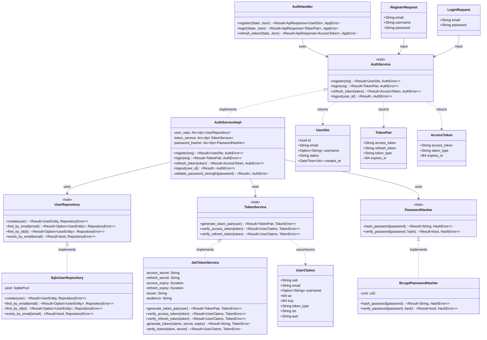
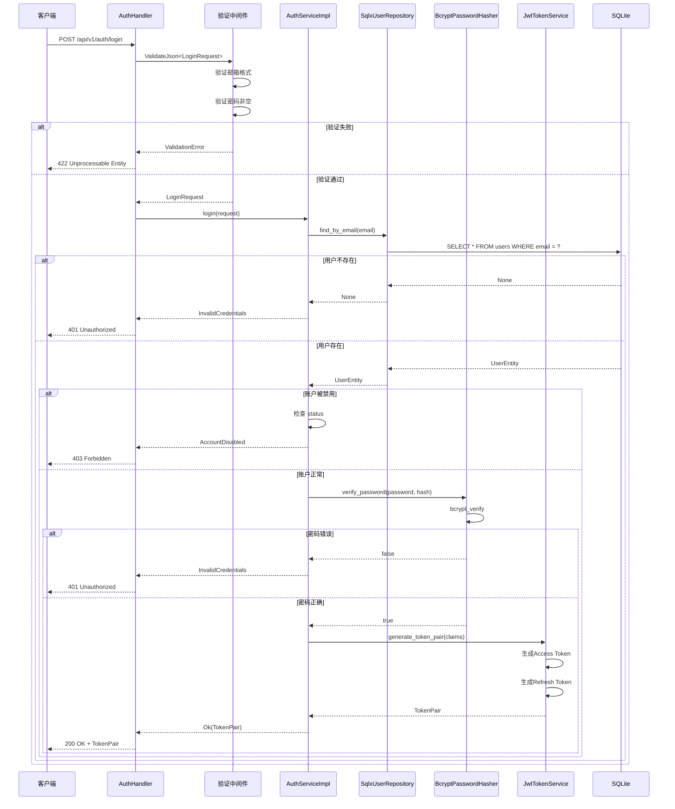
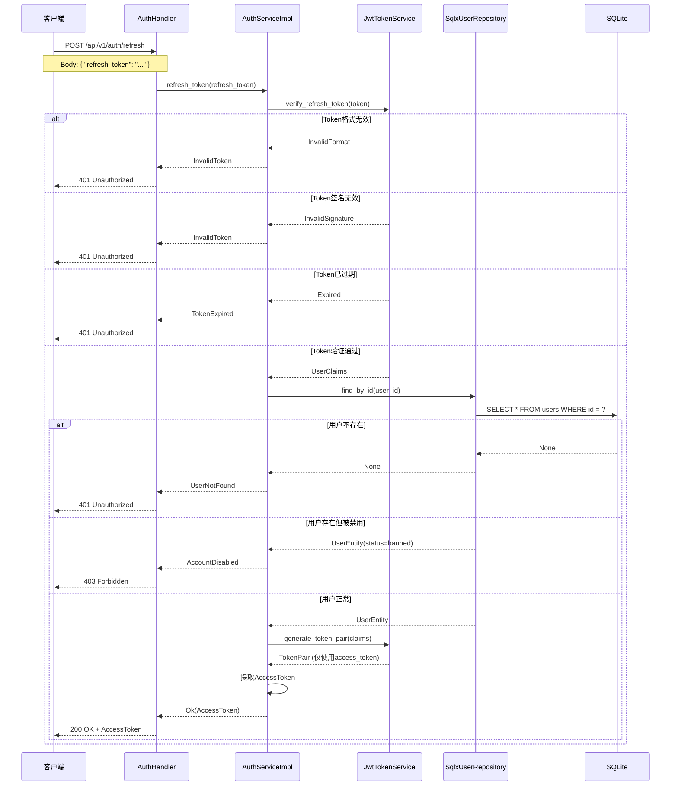

# S1-008: 用户注册与登录API - 详细设计文档

**任务编号**: S1-008  
**任务名称**: 用户注册与登录API  
**版本**: 1.0  
**日期**: 2026-03-18  
**状态**: Draft  
**依赖**: S1-003 (SQLite数据库Schema), S1-004 (API路由与错误处理框架)

---

## 目录

1. [概述](#1-概述)
2. [设计目标](#2-设计目标)
3. [接口定义（依赖倒置原则）](#3-接口定义依赖倒置原则)
4. [UML设计图](#4-uml设计图)
5. [API规范](#5-api规范)
6. [数据模型](#6-数据模型)
7. [安全设计](#7-安全设计)
8. [实现细节](#8-实现细节)
9. [文件结构](#9-文件结构)
10. [测试要点](#10-测试要点)

---

## 1. 概述

### 1.1 文档目的

本文档定义Kayak系统的用户认证模块详细设计，包括用户注册、登录、JWT Token生成与刷新等核心功能。设计遵循依赖倒置原则（DIP），先定义抽象接口，再实现具体功能。

### 1.2 功能范围

- **用户注册**: 邮箱 + 密码注册，bcrypt密码加密
- **用户登录**: 邮箱 + 密码验证，JWT双Token颁发
- **Token刷新**: 使用Refresh Token获取新的Access Token
- **Token验证**: JWT Token验证和claims提取

### 1.3 参考文档

- [架构设计](/home/hzhou/workspace/kayak/arch.md) - 第4.2.1节 认证模块
- [S1-003 SQLite数据库Schema](./S1-003_design.md) - users表定义
- [S1-004 API路由与错误处理框架](./S1-004_design.md) - API响应格式和错误处理

---

## 2. 设计目标

### 2.1 功能性目标

1. **安全注册**: 密码使用bcrypt加密存储，成本因子12
2. **JWT认证**: Access Token (15分钟) + Refresh Token (7天) 双Token策略
3. **标准响应**: 遵循S1-004的统一API响应格式
4. **完整验证**: 邮箱格式、密码强度、唯一性检查

### 2.2 非功能性目标

1. **安全性**: 密码永不明文存储，Token安全传输
2. **性能**: 登录响应 < 200ms（不含网络延迟）
3. **可扩展性**: 接口设计支持后续OAuth、LDAP等扩展
4. **可测试性**: 接口抽象便于Mock测试

---

## 3. 接口定义（依赖倒置原则）

根据依赖倒置原则，先定义抽象接口（traits），再实现具体类型。

### 3.1 核心接口概览

```rust
// src/services/auth/mod.rs

/// 认证服务接口
#[async_trait]
pub trait AuthService: Send + Sync {
    async fn register(&self, req: RegisterRequest) -> Result<UserDto, AuthError>;
    async fn login(&self, req: LoginRequest) -> Result<TokenPair, AuthError>;
    async fn refresh_token(&self, refresh_token: &str) -> Result<AccessToken, AuthError>;
    async fn logout(&self, user_id: Uuid) -> Result<(), AuthError>;
}

/// Token服务接口
#[async_trait]
pub trait TokenService: Send + Sync {
    fn generate_token_pair(&self, user: &UserClaims) -> Result<TokenPair, TokenError>;
    fn verify_access_token(&self, token: &str) -> Result<UserClaims, TokenError>;
    fn verify_refresh_token(&self, token: &str) -> Result<UserClaims, TokenError>;
}

/// 用户数据访问接口
#[async_trait]
pub trait UserRepository: Send + Sync {
    async fn create(&self, user: &CreateUserEntity) -> Result<UserEntity, RepositoryError>;
    async fn find_by_email(&self, email: &str) -> Result<Option<UserEntity>, RepositoryError>;
    async fn find_by_id(&self, id: Uuid) -> Result<Option<UserEntity>, RepositoryError>;
    async fn exists_by_email(&self, email: &str) -> Result<bool, RepositoryError>;
}

/// 密码哈希接口
pub trait PasswordHasher: Send + Sync {
    fn hash_password(&self, password: &str) -> Result<String, HashError>;
    fn verify_password(&self, password: &str, hash: &str) -> Result<bool, HashError>;
}
```

### 3.2 AuthService Trait

```rust
/// 认证服务接口
/// 
/// 负责用户注册、登录、Token刷新等认证相关操作
#[async_trait]
pub trait AuthService: Send + Sync {
    /// 用户注册
    /// 
    /// # Arguments
    /// * `req` - 注册请求，包含邮箱、用户名、密码
    /// 
    /// # Returns
    /// * `Ok(UserDto)` - 注册成功，返回用户信息（不含密码）
    /// * `Err(AuthError::EmailAlreadyExists)` - 邮箱已被注册
    /// * `Err(AuthError::WeakPassword)` - 密码强度不足
    /// * `Err(AuthError::InvalidEmail)` - 邮箱格式无效
    async fn register(&self, req: RegisterRequest) -> Result<UserDto, AuthError>;

    /// 用户登录
    /// 
    /// # Arguments
    /// * `req` - 登录请求，包含邮箱、密码
    /// 
    /// # Returns
    /// * `Ok(TokenPair)` - 登录成功，返回Access Token和Refresh Token
    /// * `Err(AuthError::InvalidCredentials)` - 邮箱或密码错误
    /// * `Err(AuthError::AccountDisabled)` - 账户被禁用
    async fn login(&self, req: LoginRequest) -> Result<TokenPair, AuthError>;

    /// 刷新Access Token
    /// 
    /// # Arguments
    /// * `refresh_token` - Refresh Token字符串
    /// 
    /// # Returns
    /// * `Ok(AccessToken)` - 刷新成功，返回新的Access Token
    /// * `Err(AuthError::InvalidToken)` - Token无效
    /// * `Err(AuthError::TokenExpired)` - Token已过期
    /// * `Err(AuthError::UserNotFound)` - 用户不存在
    async fn refresh_token(&self, refresh_token: &str) -> Result<AccessToken, AuthError>;

    /// 用户登出
    /// 
    /// # Arguments
    /// * `user_id` - 用户ID
    /// 
    /// # Returns
    /// * `Ok(())` - 登出成功
    async fn logout(&self, user_id: Uuid) -> Result<(), AuthError>;
}

/// 认证错误类型
#[derive(Debug, Error)]
pub enum AuthError {
    #[error("Email already exists")]
    EmailAlreadyExists,
    
    #[error("Invalid credentials")]
    InvalidCredentials,
    
    #[error("Account is disabled")]
    AccountDisabled,
    
    #[error("Invalid email format")]
    InvalidEmail,
    
    #[error("Password too weak: {0}")]
    WeakPassword(String),
    
    #[error("Invalid token")]
    InvalidToken,
    
    #[error("Token expired")]
    TokenExpired,
    
    #[error("User not found")]
    UserNotFound,
    
    #[error("Internal error: {0}")]
    Internal(String),
}

impl From<AuthError> for AppError {
    fn from(err: AuthError) -> Self {
        match err {
            AuthError::EmailAlreadyExists => AppError::Conflict(err.to_string()),
            AuthError::InvalidCredentials => AppError::Unauthorized(err.to_string()),
            AuthError::AccountDisabled => AppError::Forbidden(err.to_string()),
            AuthError::InvalidEmail => AppError::ValidationError(vec![ValidationErrorItem {
                field: "email".to_string(),
                message: err.to_string(),
                code: "INVALID_EMAIL".to_string(),
            }]),
            AuthError::WeakPassword(msg) => AppError::ValidationError(vec![ValidationErrorItem {
                field: "password".to_string(),
                message: msg,
                code: "WEAK_PASSWORD".to_string(),
            }]),
            AuthError::InvalidToken | AuthError::TokenExpired => {
                AppError::Unauthorized(err.to_string())
            }
            AuthError::UserNotFound => AppError::NotFound(err.to_string()),
            AuthError::Internal(msg) => AppError::InternalError(msg),
        }
    }
}
```

### 3.3 TokenService Trait

```rust
/// Token服务接口
/// 
/// 负责JWT Token的生成、验证和解析
#[async_trait]
pub trait TokenService: Send + Sync {
    /// 生成Token对（Access Token + Refresh Token）
    /// 
    /// # Arguments
    /// * `user` - 用户Claims信息
    /// 
    /// # Returns
    /// * `Ok(TokenPair)` - Token对
    fn generate_token_pair(&self, user: &UserClaims) -> Result<TokenPair, TokenError>;

    /// 验证Access Token
    /// 
    /// # Arguments
    /// * `token` - Access Token字符串
    /// 
    /// # Returns
    /// * `Ok(UserClaims)` - 验证成功，返回用户Claims
    fn verify_access_token(&self, token: &str) -> Result<UserClaims, TokenError>;

    /// 验证Refresh Token
    /// 
    /// # Arguments
    /// * `token` - Refresh Token字符串
    /// 
    /// # Returns
    /// * `Ok(UserClaims)` - 验证成功，返回用户Claims
    fn verify_refresh_token(&self, token: &str) -> Result<UserClaims, TokenError>;
}

/// Token错误类型
#[derive(Debug, Error)]
pub enum TokenError {
    #[error("Token expired")]
    Expired,
    
    #[error("Invalid token format")]
    InvalidFormat,
    
    #[error("Invalid signature")]
    InvalidSignature,
    
    #[error("Invalid issuer")]
    InvalidIssuer,
    
    #[error("Invalid audience")]
    InvalidAudience,
    
    #[error("Token generation failed: {0}")]
    GenerationFailed(String),
}

/// Token对（登录响应）
#[derive(Debug, Clone, Serialize)]
pub struct TokenPair {
    pub access_token: String,
    pub refresh_token: String,
    pub token_type: String,  // "Bearer"
    pub expires_in: i64,     // Access Token有效期（秒）
}

/// Access Token（刷新响应）
#[derive(Debug, Clone, Serialize)]
pub struct AccessToken {
    pub access_token: String,
    pub token_type: String,
    pub expires_in: i64,
}

/// JWT Claims
#[derive(Debug, Clone, Serialize, Deserialize)]
pub struct UserClaims {
    /// 用户ID
    pub sub: String,  // subject (user id)
    /// 邮箱
    pub email: String,
    /// 用户名
    pub username: Option<String>,
    /// Token颁发时间
    pub iat: i64,
    /// Token过期时间
    pub exp: i64,
    /// Token类型: "access" | "refresh"
    pub token_type: String,
    /// 颁发者
    pub iss: String,
    /// 受众
    pub aud: String,
}
```

### 3.4 UserRepository Trait

```rust
/// 用户数据访问接口
/// 
/// 负责用户数据的持久化操作
#[async_trait]
pub trait UserRepository: Send + Sync {
    /// 创建用户
    /// 
    /// # Arguments
    /// * `user` - 用户实体（已包含密码哈希）
    /// 
    /// # Returns
    /// * `Ok(UserEntity)` - 创建成功
    async fn create(&self, user: &CreateUserEntity) -> Result<UserEntity, RepositoryError>;

    /// 根据邮箱查找用户
    /// 
    /// # Arguments
    /// * `email` - 邮箱地址
    /// 
    /// # Returns
    /// * `Ok(Some(UserEntity))` - 找到用户
    /// * `Ok(None)` - 用户不存在
    async fn find_by_email(&self, email: &str) -> Result<Option<UserEntity>, RepositoryError>;

    /// 根据ID查找用户
    /// 
    /// # Arguments
    /// * `id` - 用户UUID
    async fn find_by_id(&self, id: Uuid) -> Result<Option<UserEntity>, RepositoryError>;

    /// 检查邮箱是否已存在
    /// 
    /// # Arguments
    /// * `email` - 邮箱地址
    async fn exists_by_email(&self, email: &str) -> Result<bool, RepositoryError>;
}

/// 仓库错误类型
#[derive(Debug, Error)]
pub enum RepositoryError {
    #[error("Database error: {0}")]
    Database(#[from] sqlx::Error),
    
    #[error("Unique constraint violation: {0}")]
    UniqueViolation(String),
}

/// 创建用户实体（Repository输入）
#[derive(Debug, Clone)]
pub struct CreateUserEntity {
    pub id: Uuid,
    pub email: String,
    pub username: Option<String>,
    pub password_hash: String,
    pub status: UserStatus,
}

/// 用户实体（Repository输出）
#[derive(Debug, Clone, FromRow)]
pub struct UserEntity {
    pub id: Uuid,
    pub email: String,
    pub username: Option<String>,
    pub password_hash: String,
    pub status: UserStatus,
    pub created_at: DateTime<Utc>,
    pub updated_at: DateTime<Utc>,
}
```

### 3.5 PasswordHasher Trait

```rust
/// 密码哈希接口
/// 
/// 负责密码的哈希和验证，便于更换算法或Mock测试
pub trait PasswordHasher: Send + Sync {
    /// 对密码进行哈希
    /// 
    /// # Arguments
    /// * `password` - 明文密码
    /// 
    /// # Returns
    /// * `Ok(String)` - 哈希后的密码
    /// * `Err(HashError)` - 哈希失败
    fn hash_password(&self, password: &str) -> Result<String, HashError>;

    /// 验证密码
    /// 
    /// # Arguments
    /// * `password` - 明文密码
    /// * `hash` - 存储的哈希值
    /// 
    /// # Returns
    /// * `Ok(true)` - 密码匹配
    /// * `Ok(false)` - 密码不匹配
    fn verify_password(&self, password: &str, hash: &str) -> Result<bool, HashError>;
}

/// 哈希错误类型
#[derive(Debug, Error)]
pub enum HashError {
    #[error("Password too short: minimum {0} characters")]
    TooShort(usize),
    
    #[error("Password too long: maximum {0} characters")]
    TooLong(usize),
    
    #[error("Hashing failed: {0}")]
    HashingFailed(String),
    
    #[error("Invalid hash format")]
    InvalidHashFormat,
}
```

---

## 4. UML设计图

### 4.1 类图（接口与实现关系）



### 4.2 时序图 - 用户注册流程

```mermaid
sequenceDiagram
    participant Client as 客户端
    participant Handler as AuthHandler
    participant Validator as 验证中间件
    participant Service as AuthServiceImpl
    parameter Repo as SqlxUserRepository
    participant Hasher as BcryptPasswordHasher
    participant DB as SQLite

    Client->>Handler: POST /api/v1/auth/register
    Handler->>Validator: ValidateJson<RegisterRequest>
    
    Validator->>Validator: 验证邮箱格式
    Validator->>Validator: 验证密码长度(≥8)
    Validator->>Validator: 验证用户名长度(3-50)
    
    alt 验证失败
        Validator-->>Handler: ValidationError
        Handler-->>Client: 422 Unprocessable Entity
    else 验证通过
        Validator-->>Handler: RegisterRequest
        Handler->>Service: register(request)
        
        Service->>Service: validate_password_strength()
        
        alt 密码强度不足
            Service-->>Handler: WeakPassword
            Handler-->>Client: 422 Validation Failed
        else 密码强度通过
            Service->>Repo: exists_by_email(email)
            Repo->>DB: SELECT EXISTS(...)
            DB-->>Repo: false
            Repo-->>Service: false
            
            alt 邮箱已存在
                Repo-->>Service: true
                Service-->>Handler: EmailAlreadyExists
                Handler-->>Client: 409 Conflict
            else 邮箱可用
                Service->>Hasher: hash_password(password)
                Hasher->>Hasher: bcrypt(password, cost=12)
                Hasher-->>Service: password_hash
                
                Service->>Repo: create(CreateUserEntity)
                Repo->>DB: INSERT INTO users ...
                DB-->>Repo: UserEntity
                Repo-->>Service: UserEntity
                
                Service->>Service: 转换为 UserDto
                Service-->>Handler: Ok(UserDto)
                Handler-->>Client: 201 Created + UserDto
            end
        end
    end
```

### 4.3 时序图 - 用户登录流程



### 4.4 时序图 - Token刷新流程



---

## 5. API规范

### 5.1 端点概览

| 方法 | 端点 | 描述 | 认证 |
|------|------|------|------|
| POST | /api/v1/auth/register | 用户注册 | 否 |
| POST | /api/v1/auth/login | 用户登录 | 否 |
| POST | /api/v1/auth/refresh | 刷新Access Token | 否 |

### 5.2 POST /api/v1/auth/register

用户注册接口，创建新用户账户。

#### 请求

**Content-Type**: `application/json`

```json
{
  "email": "user@example.com",
  "username": "john_doe",
  "password": "SecurePass123!"
}
```

**字段说明**:

| 字段 | 类型 | 必填 | 约束 | 说明 |
|------|------|------|------|------|
| email | string | 是 | 有效邮箱格式 | 用户邮箱，全局唯一 |
| username | string | 否 | 3-50字符 | 显示名称 |
| password | string | 是 | ≥8字符 | 登录密码 |

#### 成功响应 (201 Created)

```json
{
  "code": 201,
  "message": "User registered successfully",
  "data": {
    "id": "550e8400-e29b-41d4-a716-446655440000",
    "email": "user@example.com",
    "username": "john_doe",
    "status": "active",
    "created_at": "2026-03-18T10:30:00Z"
  },
  "timestamp": "2026-03-18T10:30:00Z"
}
```

#### 错误响应

**400 Bad Request** - 请求格式错误
```json
{
  "code": 400,
  "message": "Bad request: Invalid JSON",
  "timestamp": "2026-03-18T10:30:00Z"
}
```

**422 Unprocessable Entity** - 验证失败
```json
{
  "code": 422,
  "message": "Validation failed",
  "errors": [
    { "field": "email", "message": "Invalid email format", "code": "INVALID_EMAIL" },
    { "field": "password", "message": "Password must be at least 8 characters", "code": "LENGTH" }
  ],
  "timestamp": "2026-03-18T10:30:00Z"
}
```

**409 Conflict** - 邮箱已存在
```json
{
  "code": 409,
  "message": "Email already exists",
  "timestamp": "2026-03-18T10:30:00Z"
}
```

### 5.3 POST /api/v1/auth/login

用户登录接口，验证邮箱和密码后颁发Token对。

#### 请求

**Content-Type**: `application/json`

```json
{
  "email": "user@example.com",
  "password": "SecurePass123!"
}
```

**字段说明**:

| 字段 | 类型 | 必填 | 说明 |
|------|------|------|------|
| email | string | 是 | 注册邮箱 |
| password | string | 是 | 登录密码 |

#### 成功响应 (200 OK)

```json
{
  "code": 200,
  "message": "Login successful",
  "data": {
    "access_token": "eyJhbGciOiJIUzI1NiIs...",
    "refresh_token": "eyJhbGciOiJIUzI1NiIs...",
    "token_type": "Bearer",
    "expires_in": 900
  },
  "timestamp": "2026-03-18T10:30:00Z"
}
```

**字段说明**:

| 字段 | 类型 | 说明 |
|------|------|------|
| access_token | string | Access Token (JWT)，15分钟有效期 |
| refresh_token | string | Refresh Token (JWT)，7天有效期 |
| token_type | string | 固定值 "Bearer" |
| expires_in | integer | Access Token有效期（秒） |

#### 错误响应

**401 Unauthorized** - 凭据无效
```json
{
  "code": 401,
  "message": "Invalid credentials",
  "timestamp": "2026-03-18T10:30:00Z"
}
```

**403 Forbidden** - 账户被禁用
```json
{
  "code": 403,
  "message": "Account is disabled",
  "timestamp": "2026-03-18T10:30:00Z"
}
```

**422 Unprocessable Entity** - 验证失败
```json
{
  "code": 422,
  "message": "Validation failed",
  "errors": [
    { "field": "email", "message": "Email is required", "code": "REQUIRED" },
    { "field": "password", "message": "Password is required", "code": "REQUIRED" }
  ],
  "timestamp": "2026-03-18T10:30:00Z"
}
```

### 5.4 POST /api/v1/auth/refresh

使用Refresh Token获取新的Access Token。

#### 请求

**Content-Type**: `application/json`

```json
{
  "refresh_token": "eyJhbGciOiJIUzI1NiIs..."
}
```

**字段说明**:

| 字段 | 类型 | 必填 | 说明 |
|------|------|------|------|
| refresh_token | string | 是 | 登录时获取的Refresh Token |

#### 成功响应 (200 OK)

```json
{
  "code": 200,
  "message": "Token refreshed successfully",
  "data": {
    "access_token": "eyJhbGciOiJIUzI1NiIs...",
    "token_type": "Bearer",
    "expires_in": 900
  },
  "timestamp": "2026-03-18T10:30:00Z"
}
```

#### 错误响应

**401 Unauthorized** - Token无效或过期
```json
{
  "code": 401,
  "message": "Invalid token",
  "timestamp": "2026-03-18T10:30:00Z"
}
```

```json
{
  "code": 401,
  "message": "Token expired",
  "timestamp": "2026-03-18T10:30:00Z"
}
```

### 5.5 错误代码对照表

| HTTP状态码 | 错误场景 | 错误消息 | 错误码 |
|------------|----------|----------|--------|
| 400 | JSON解析失败 | Bad request: Invalid JSON | - |
| 422 | 邮箱格式无效 | Invalid email format | INVALID_EMAIL |
| 422 | 密码太短 | Password must be at least 8 characters | LENGTH |
| 422 | 用户名太长 | Username must be at most 50 characters | LENGTH |
| 409 | 邮箱已注册 | Email already exists | - |
| 401 | 邮箱或密码错误 | Invalid credentials | - |
| 401 | Token无效 | Invalid token | - |
| 401 | Token过期 | Token expired | - |
| 403 | 账户被禁用 | Account is disabled | - |
| 500 | 服务器内部错误 | Internal server error | - |

---

## 6. 数据模型

### 6.1 DTO定义

```rust
// src/models/dto/auth.rs

/// 注册请求DTO
#[derive(Debug, Deserialize, Validate)]
pub struct RegisterRequest {
    #[validate(email(message = "Invalid email format"))]
    pub email: String,
    
    #[validate(length(min = 3, max = 50, message = "Username must be 3-50 characters"))]
    pub username: Option<String>,
    
    #[validate(length(min = 8, message = "Password must be at least 8 characters"))]
    pub password: String,
}

/// 登录请求DTO
#[derive(Debug, Deserialize, Validate)]
pub struct LoginRequest {
    #[validate(email(message = "Invalid email format"))]
    pub email: String,
    
    #[validate(length(min = 1, message = "Password is required"))]
    pub password: String,
}

/// 刷新Token请求DTO
#[derive(Debug, Deserialize, Validate)]
pub struct RefreshTokenRequest {
    #[validate(length(min = 1, message = "Refresh token is required"))]
    pub refresh_token: String,
}

/// 用户响应DTO
#[derive(Debug, Serialize)]
pub struct UserDto {
    pub id: Uuid,
    pub email: String,
    pub username: Option<String>,
    pub status: String,
    pub created_at: DateTime<Utc>,
}

/// Token对响应DTO
#[derive(Debug, Serialize)]
pub struct TokenPairDto {
    pub access_token: String,
    pub refresh_token: String,
    pub token_type: String,
    pub expires_in: i64,
}

/// Access Token响应DTO
#[derive(Debug, Serialize)]
pub struct AccessTokenDto {
    pub access_token: String,
    pub token_type: String,
    pub expires_in: i64,
}
```

### 6.2 实体模型

使用S1-003中定义的User实体：

```rust
// src/models/entities/user.rs (引用S1-003)

/// 用户实体
#[derive(Debug, Clone, FromRow, Serialize, Deserialize)]
pub struct User {
    pub id: Uuid,
    pub email: String,
    pub password_hash: String,
    pub username: Option<String>,
    pub avatar_url: Option<String>,
    pub status: UserStatus,
    pub created_at: DateTime<Utc>,
    pub updated_at: DateTime<Utc>,
}

/// 用户账户状态
#[derive(Debug, Clone, Copy, PartialEq, Eq, Serialize, Deserialize, sqlx::Type)]
#[sqlx(rename_all = "lowercase")]
#[serde(rename_all = "lowercase")]
pub enum UserStatus {
    Active,
    Inactive,
    Banned,
}
```

---

## 7. 安全设计

### 7.1 密码安全

#### bcrypt配置

```rust
/// bcrypt成本因子
/// 
/// 成本因子12表示哈希耗时约250ms（现代CPU）
/// 这是安全性和性能的折中：
/// - 成本10：~100ms，约10次/秒
/// - 成本12：~250ms，约4次/秒  <- 推荐
/// - 成本14：~1000ms，约1次/秒
const BCRYPT_COST: u32 = 12;

/// 密码最小长度
const MIN_PASSWORD_LENGTH: usize = 8;

/// 密码最大长度（防止DoS攻击）
const MAX_PASSWORD_LENGTH: usize = 128;
```

#### 密码强度要求

| 要求 | 说明 | 验证方式 |
|------|------|----------|
| 最小长度 | 8个字符 | 验证器检查 |
| 最大长度 | 128个字符 | 验证器检查 |
| 复杂度（可选） | 包含大小写、数字、特殊字符 | 后续可加强 |

### 7.2 JWT Token安全

#### Token配置

```rust
pub struct JwtConfig {
    /// Access Token密钥（256位）
    pub access_secret: String,
    /// Refresh Token密钥（256位，与Access不同）
    pub refresh_secret: String,
    /// Access Token有效期：15分钟
    pub access_expiry: Duration,
    /// Refresh Token有效期：7天
    pub refresh_expiry: Duration,
    /// 颁发者
    pub issuer: String,
    /// 受众
    pub audience: String,
}

impl Default for JwtConfig {
    fn default() -> Self {
        Self {
            access_secret: std::env::var("JWT_ACCESS_SECRET")
                .expect("JWT_ACCESS_SECRET must be set"),
            refresh_secret: std::env::var("JWT_REFRESH_SECRET")
                .expect("JWT_REFRESH_SECRET must be set"),
            access_expiry: Duration::from_secs(15 * 60),      // 15分钟
            refresh_expiry: Duration::from_secs(7 * 24 * 60 * 60),  // 7天
            issuer: "kayak-api".to_string(),
            audience: "kayak-client".to_string(),
        }
    }
}
```

#### Token结构设计

**JWT Header**:
```json
{
  "alg": "HS256",
  "typ": "JWT"
}
```

**Access Token Payload**:
```json
{
  "sub": "550e8400-e29b-41d4-a716-446655440000",
  "email": "user@example.com",
  "username": "john_doe",
  "iat": 1710755400,
  "exp": 1710756300,
  "token_type": "access",
  "iss": "kayak-api",
  "aud": "kayak-client"
}
```

**Refresh Token Payload**:
```json
{
  "sub": "550e8400-e29b-41d4-a716-446655440000",
  "email": "user@example.com",
  "iat": 1710755400,
  "exp": 1711360200,
  "token_type": "refresh",
  "iss": "kayak-api",
  "aud": "kayak-client"
}
```

#### 安全策略

| 策略 | 实现 | 目的 |
|------|------|------|
| 双Token | Access + Refresh | Access短期有效，Refresh用于续期 |
| 密钥分离 | Access/Refresh不同密钥 | 降低密钥泄露风险 |
| Token类型标识 | payload.token_type | 防止Token滥用 |
| 过期时间 | exp claim | 限制Token有效窗口 |
| 颁发者验证 | iss claim | 防止跨服务Token |

### 7.3 传输安全

- **HTTPS**: 生产环境必须使用HTTPS
- **CORS**: 限制允许的源
- **Rate Limiting**: 登录接口限流（5次/分钟）防止暴力破解

---

## 8. 实现细节

### 8.1 AuthServiceImpl

```rust
/// 认证服务实现
pub struct AuthServiceImpl {
    user_repo: Arc<dyn UserRepository>,
    token_service: Arc<dyn TokenService>,
    password_hasher: Arc<dyn PasswordHasher>,
}

impl AuthServiceImpl {
    pub fn new(
        user_repo: Arc<dyn UserRepository>,
        token_service: Arc<dyn TokenService>,
        password_hasher: Arc<dyn PasswordHasher>,
    ) -> Self {
        Self {
            user_repo,
            token_service,
            password_hasher,
        }
    }

    /// 验证密码强度
    fn validate_password_strength(&self, password: &str) -> Result<(), AuthError> {
        if password.len() < MIN_PASSWORD_LENGTH {
            return Err(AuthError::WeakPassword(format!(
                "Password must be at least {} characters",
                MIN_PASSWORD_LENGTH
            )));
        }
        
        if password.len() > MAX_PASSWORD_LENGTH {
            return Err(AuthError::WeakPassword(format!(
                "Password must be at most {} characters",
                MAX_PASSWORD_LENGTH
            )));
        }
        
        // TODO: 可添加复杂度检查（大写、小写、数字、特殊字符）
        
        Ok(())
    }
}

#[async_trait]
impl AuthService for AuthServiceImpl {
    async fn register(&self, req: RegisterRequest) -> Result<UserDto, AuthError> {
        // 1. 验证密码强度
        self.validate_password_strength(&req.password)?;

        // 2. 检查邮箱是否已存在
        if self.user_repo.exists_by_email(&req.email).await? {
            return Err(AuthError::EmailAlreadyExists);
        }

        // 3. 哈希密码
        let password_hash = self
            .password_hasher
            .hash_password(&req.password)
            .map_err(|e| AuthError::Internal(e.to_string()))?;

        // 4. 创建用户实体
        let user_entity = CreateUserEntity {
            id: Uuid::new_v4(),
            email: req.email,
            username: req.username,
            password_hash,
            status: UserStatus::Active,
        };

        // 5. 保存到数据库
        let user = self.user_repo.create(&user_entity).await?;

        // 6. 转换为DTO返回
        Ok(UserDto {
            id: user.id,
            email: user.email,
            username: user.username,
            status: format!("{:?}", user.status).to_lowercase(),
            created_at: user.created_at,
        })
    }

    async fn login(&self, req: LoginRequest) -> Result<TokenPair, AuthError> {
        // 1. 查找用户
        let user = self
            .user_repo
            .find_by_email(&req.email)
            .await?
            .ok_or(AuthError::InvalidCredentials)?;

        // 2. 检查账户状态
        if user.status != UserStatus::Active {
            return Err(AuthError::AccountDisabled);
        }

        // 3. 验证密码
        let password_valid = self
            .password_hasher
            .verify_password(&req.password, &user.password_hash)
            .map_err(|e| AuthError::Internal(e.to_string()))?;

        if !password_valid {
            return Err(AuthError::InvalidCredentials);
        }

        // 4. 生成Token
        let claims = UserClaims {
            sub: user.id.to_string(),
            email: user.email,
            username: user.username,
            iat: 0, // 由TokenService设置
            exp: 0, // 由TokenService设置
            token_type: "access".to_string(),
            iss: String::new(), // 由TokenService设置
            aud: String::new(), // 由TokenService设置
        };

        self.token_service.generate_token_pair(&claims)
    }

    async fn refresh_token(&self, refresh_token: &str) -> Result<AccessToken, AuthError> {
        // 1. 验证Refresh Token
        let claims = self
            .token_service
            .verify_refresh_token(refresh_token)
            .map_err(|e| match e {
                TokenError::Expired => AuthError::TokenExpired,
                _ => AuthError::InvalidToken,
            })?;

        // 2. 查找用户
        let user_id = Uuid::parse_str(&claims.sub)
            .map_err(|_| AuthError::InvalidToken)?;
        
        let user = self
            .user_repo
            .find_by_id(user_id)
            .await?
            .ok_or(AuthError::UserNotFound)?;

        // 3. 检查账户状态
        if user.status != UserStatus::Active {
            return Err(AuthError::AccountDisabled);
        }

        // 4. 生成新的Token对，只返回Access Token
        let new_claims = UserClaims {
            sub: user.id.to_string(),
            email: user.email,
            username: user.username,
            iat: 0,
            exp: 0,
            token_type: "access".to_string(),
            iss: String::new(),
            aud: String::new(),
        };

        let token_pair = self.token_service.generate_token_pair(&new_claims)?;
        
        Ok(AccessToken {
            access_token: token_pair.access_token,
            token_type: token_pair.token_type,
            expires_in: token_pair.expires_in,
        })
    }

    async fn logout(&self, _user_id: Uuid) -> Result<(), AuthError> {
        // Release 0: 简单实现，客户端删除Token即可
        // Release 1+: 可将Token加入黑名单（需要Redis或数据库）
        Ok(())
    }
}
```

### 8.2 JwtTokenService

```rust
/// JWT Token服务实现
pub struct JwtTokenService {
    access_secret: String,
    refresh_secret: String,
    access_expiry: Duration,
    refresh_expiry: Duration,
    issuer: String,
    audience: String,
}

impl JwtTokenService {
    pub fn new(config: JwtConfig) -> Self {
        Self {
            access_secret: config.access_secret,
            refresh_secret: config.refresh_secret,
            access_expiry: config.access_expiry,
            refresh_expiry: config.refresh_expiry,
            issuer: config.issuer,
            audience: config.audience,
        }
    }

    fn generate_token(
        &self,
        claims: &UserClaims,
        secret: &str,
        expiry: Duration,
        token_type: &str,
    ) -> Result<String, TokenError> {
        let now = Utc::now();
        let expires_at = now + expiry;

        let claims = Claims {
            sub: claims.sub.clone(),
            email: claims.email.clone(),
            username: claims.username.clone(),
            iat: now.timestamp(),
            exp: expires_at.timestamp(),
            token_type: token_type.to_string(),
            iss: self.issuer.clone(),
            aud: self.audience.clone(),
        };

        encode(
            &Header::default(),
            &claims,
            &EncodingKey::from_secret(secret.as_bytes()),
        )
        .map_err(|e| TokenError::GenerationFailed(e.to_string()))
    }

    fn verify_token(&self, token: &str, secret: &str) -> Result<UserClaims, TokenError> {
        let validation = Validation::new(Algorithm::HS256);
        
        let token_data = decode::<UserClaims>(
            token,
            &DecodingKey::from_secret(secret.as_bytes()),
            &validation,
        )
        .map_err(|e| match e.kind() {
            ErrorKind::ExpiredSignature => TokenError::Expired,
            ErrorKind::InvalidSignature => TokenError::InvalidSignature,
            _ => TokenError::InvalidFormat,
        })?;

        // 验证颁发者和受众
        if token_data.claims.iss != self.issuer {
            return Err(TokenError::InvalidIssuer);
        }
        if token_data.claims.aud != self.audience {
            return Err(TokenError::InvalidAudience);
        }

        Ok(token_data.claims)
    }
}

impl TokenService for JwtTokenService {
    fn generate_token_pair(&self, user: &UserClaims) -> Result<TokenPair, TokenError> {
        let access_token = self.generate_token(
            user,
            &self.access_secret,
            self.access_expiry,
            "access",
        )?;

        let refresh_token = self.generate_token(
            user,
            &self.refresh_secret,
            self.refresh_expiry,
            "refresh",
        )?;

        Ok(TokenPair {
            access_token,
            refresh_token,
            token_type: "Bearer".to_string(),
            expires_in: self.access_expiry.as_secs() as i64,
        })
    }

    fn verify_access_token(&self, token: &str) -> Result<UserClaims, TokenError> {
        let claims = self.verify_token(token, &self.access_secret)?;
        if claims.token_type != "access" {
            return Err(TokenError::InvalidFormat);
        }
        Ok(claims)
    }

    fn verify_refresh_token(&self, token: &str) -> Result<UserClaims, TokenError> {
        let claims = self.verify_token(token, &self.refresh_secret)?;
        if claims.token_type != "refresh" {
            return Err(TokenError::InvalidFormat);
        }
        Ok(claims)
    }
}
```

### 8.3 BcryptPasswordHasher

```rust
/// bcrypt密码哈希实现
pub struct BcryptPasswordHasher {
    cost: u32,
}

impl BcryptPasswordHasher {
    pub fn new(cost: u32) -> Self {
        Self { cost }
    }

    pub fn default() -> Self {
        Self { cost: 12 }
    }
}

impl PasswordHasher for BcryptPasswordHasher {
    fn hash_password(&self, password: &str) -> Result<String, HashError> {
        if password.len() < MIN_PASSWORD_LENGTH {
            return Err(HashError::TooShort(MIN_PASSWORD_LENGTH));
        }
        if password.len() > MAX_PASSWORD_LENGTH {
            return Err(HashError::TooLong(MAX_PASSWORD_LENGTH));
        }

        bcrypt::hash(password, self.cost)
            .map_err(|e| HashError::HashingFailed(e.to_string()))
    }

    fn verify_password(&self, password: &str, hash: &str) -> Result<bool, HashError> {
        bcrypt::verify(password, hash)
            .map_err(|_| HashError::InvalidHashFormat)
    }
}
```

### 8.4 AuthHandler

```rust
/// 认证处理器
pub struct AuthHandler {
    auth_service: Arc<dyn AuthService>,
}

impl AuthHandler {
    pub fn new(auth_service: Arc<dyn AuthService>) -> Self {
        Self { auth_service }
    }

    /// POST /api/v1/auth/register
    pub async fn register(
        State(state): State<AppState>,
        ValidatedJson(req): ValidatedJson<RegisterRequest>,
    ) -> Result<ApiResponse<UserDto>, AppError> {
        let user = state.auth_service.register(req).await?;
        Ok(ApiResponse::created(user))
    }

    /// POST /api/v1/auth/login
    pub async fn login(
        State(state): State<AppState>,
        ValidatedJson(req): ValidatedJson<LoginRequest>,
    ) -> Result<ApiResponse<TokenPairDto>, AppError> {
        let tokens = state.auth_service.login(req).await?;
        
        Ok(ApiResponse::success(TokenPairDto {
            access_token: tokens.access_token,
            refresh_token: tokens.refresh_token,
            token_type: tokens.token_type,
            expires_in: tokens.expires_in,
        }))
    }

    /// POST /api/v1/auth/refresh
    pub async fn refresh_token(
        State(state): State<AppState>,
        ValidatedJson(req): ValidatedJson<RefreshTokenRequest>,
    ) -> Result<ApiResponse<AccessTokenDto>, AppError> {
        let token = state.auth_service.refresh_token(&req.refresh_token).await?;
        
        Ok(ApiResponse::success(AccessTokenDto {
            access_token: token.access_token,
            token_type: token.token_type,
            expires_in: token.expires_in,
        }))
    }
}
```

---

## 9. 文件结构

### 9.1 新增文件清单

```
kayak-backend/src/
├── services/
│   ├── mod.rs                           [修改] 导出auth模块
│   └── auth/
│       ├── mod.rs                       [新增] 模块导出
│       ├── service.rs                   [新增] AuthService trait + impl
│       ├── token_service.rs             [新增] TokenService trait + impl
│       ├── error.rs                     [新增] AuthError, TokenError
│       └── types.rs                     [新增] UserClaims, TokenPair等
│
├── repositories/
│   ├── mod.rs                           [新增/修改] 导出user_repo
│   └── user_repository.rs               [新增] UserRepository trait + impl
│
├── core/
│   ├── mod.rs                           [修改] 导出password模块
│   └── password.rs                      [新增] PasswordHasher trait + bcrypt实现
│
├── api/
│   └── handlers/
│       └── auth.rs                      [新增] 认证处理器
│
├── models/
│   └── dto/
│       └── auth.rs                      [新增] RegisterRequest, LoginRequest等DTO
│
└── config/
    └── jwt.rs                           [新增] JWT配置
```

### 9.2 Cargo.toml依赖

```toml
[dependencies]
# 已有依赖保持不变...

# JWT处理
jsonwebtoken = "9.2"

# 密码哈希
bcrypt = "0.15"

# 验证
validator = { version = "0.16", features = ["derive"] }

# 异步trait
async-trait = "0.1"
```

---

## 10. 测试要点

### 10.1 单元测试

| 测试场景 | 测试内容 | 期望结果 |
|----------|----------|----------|
| 注册成功 | 有效邮箱、密码 | 201，返回UserDto |
| 注册-邮箱已存在 | 重复注册同一邮箱 | 409 Conflict |
| 注册-密码太短 | 密码7字符 | 422 Validation Error |
| 登录成功 | 正确凭据 | 200，返回TokenPair |
| 登录-密码错误 | 错误密码 | 401 Unauthorized |
| 登录-用户不存在 | 未注册邮箱 | 401 Unauthorized |
| 登录-账户禁用 | status=banned | 403 Forbidden |
| Token刷新 | 有效Refresh Token | 200，返回新Access Token |
| Token刷新-过期 | 过期Refresh Token | 401 Token Expired |
| Token刷新-无效 | 伪造Token | 401 Invalid Token |

### 10.2 安全测试

| 测试场景 | 测试内容 | 期望结果 |
|----------|----------|----------|
| SQL注入 | 邮箱输入 `' OR '1'='1` | 验证失败或正常处理 |
| 密码哈希 | 检查数据库存储 | 不是明文，是bcrypt格式 |
| Token签名 | 修改Token Payload | 验证失败 |
| Token类型混淆 | Access当Refresh用 | 验证失败 |
| 超长密码 | 129字符密码 | 拒绝或截断 |

### 10.3 性能测试

| 指标 | 目标值 | 测试方法 |
|------|--------|----------|
| 注册响应时间 | < 300ms | bcrypt耗时约250ms |
| 登录响应时间 | < 300ms | bcrypt验证 + JWT生成 |
| Token验证 | < 10ms | 纯计算，无IO |
| 并发注册 | 100 req/s | 负载测试 |

---

## 11. 附录

### 11.1 环境变量配置

```bash
# JWT密钥（生产环境应使用随机生成的256位密钥）
export JWT_ACCESS_SECRET="your-256-bit-secret-key-for-access-tokens"
export JWT_REFRESH_SECRET="your-different-256-bit-secret-key-for-refresh-tokens"

# Token有效期（秒）
export JWT_ACCESS_EXPIRY=900          # 15分钟
export JWT_REFRESH_EXPIRY=604800      # 7天

# bcrypt成本因子
export BCRYPT_COST=12
```

### 11.2 与S1-003/S1-004的关系

| 依赖 | 使用内容 | 说明 |
|------|----------|------|
| S1-003 | users表 | 用户数据存储，password_hash字段 |
| S1-003 | User实体 | UserEntity, UserStatus枚举 |
| S1-004 | ApiResponse | 统一API响应格式 |
| S1-004 | AppError | 错误类型转换 |
| S1-004 | ValidatedJson | 请求验证中间件 |

### 11.3 文档历史

| 版本 | 日期 | 修改人 | 修改说明 |
|------|------|--------|----------|
| 1.0 | 2026-03-18 | SW-Tom | 初始版本创建 |

---

**文档结束**
