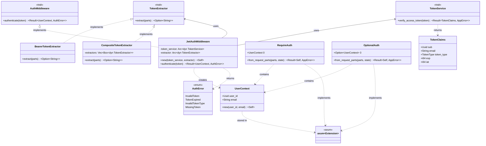
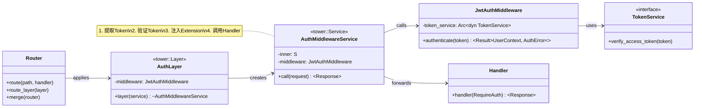
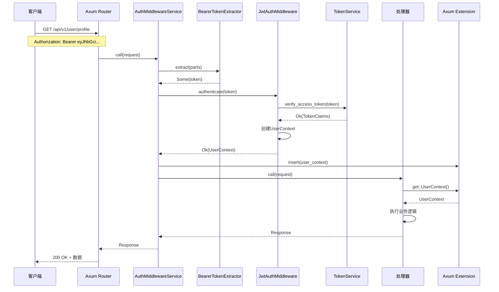
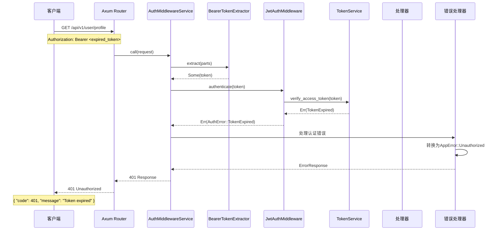
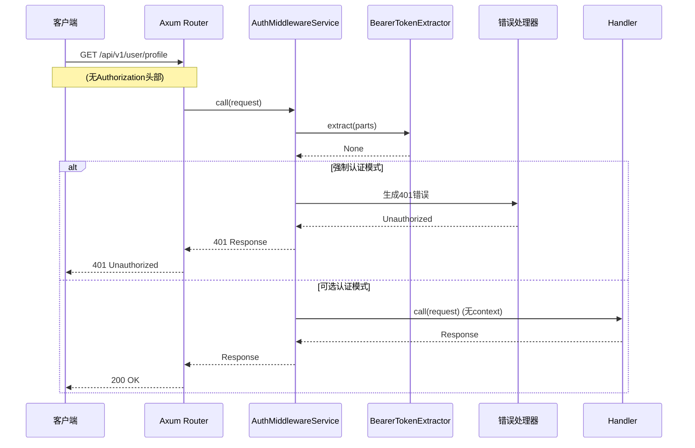

# S1-009: JWT认证中间件 - 详细设计文档

**任务编号**: S1-009  
**任务名称**: JWT认证中间件 (JWT Authentication Middleware)  
**版本**: 1.1  
**日期**: 2026-03-19  
**状态**: Draft - Revised  
**依赖**: S1-008 (用户注册与登录API)

---

## 目录

1. [概述](#1-概述)
2. [设计目标](#2-设计目标)
3. [接口定义（依赖倒置原则）](#3-接口定义依赖倒置原则)
4. [UML设计图](#4-uml设计图)
5. [模块结构](#5-模块结构)
6. [实现细节](#6-实现细节)
7. [集成指南](#7-集成指南)
8. [测试映射](#8-测试映射)
9. [附录](#9-附录)

---

## 1. 概述

### 1.1 文档目的

本文档定义Kayak系统的JWT认证中间件详细设计，实现从HTTP请求中提取、验证JWT Token，并将用户信息注入到请求上下文的功能。

### 1.2 功能范围

- **Token提取**: 从Authorization头部提取Bearer Token
- **Token验证**: 验证Token签名、过期时间、声明有效性
- **用户上下文注入**: 将验证通过的用户信息注入到Axum Extension
- **错误处理**: 统一返回401 Unauthorized错误

### 1.3 验收标准映射

| 验收标准 | 实现组件 | 测试覆盖 |
|---------|---------|---------|
| 受保护API需要有效Token | `AuthLayer` + `RequireAuth` | TC-S1-009-01, TC-S1-009-08~12 |
| Token过期返回401错误 | `verify_access_token()` | TC-S1-009-03, TC-S1-009-13 |
| 无效Token返回401错误 | `TokenExtractor` + `verify_access_token()` | TC-S1-009-02, TC-S1-009-04~07 |

### 1.4 参考文档

- [架构设计](/home/hzhou/workspace/kayak/arch.md) - 第4.2.2节 认证中间件
- [S1-008 用户注册与登录API设计](./S1-008_design.md) - Token服务定义
- [S1-009 测试用例](./S1-009_test_cases.md) - 18个测试用例详情

---

## 2. 设计目标

### 2.1 功能性目标

1. **透明认证**: 中间件对业务代码透明，通过Extension提取用户上下文
2. **灵活配置**: 支持可选认证和强制认证两种模式
3. **标准响应**: 401错误遵循统一的API响应格式
4. **完整验证**: 签名、过期、Token类型、声明完整性

### 2.2 非功能性目标

1. **性能**: Token验证 < 10ms（纯计算无IO）
2. **无状态**: 不依赖Session或外部存储
3. **安全**: 不泄露Token解析细节，防篡改检测
4. **可测试性**: 接口抽象便于Mock测试

---

## 3. 接口定义（依赖倒置原则）

根据依赖倒置原则，先定义抽象接口（traits），业务代码依赖接口而非具体实现。

### 3.1 接口概览

```rust
// src/auth/middleware/traits.rs

/// 认证中间件核心接口
/// 
/// 定义JWT认证中间件的抽象行为，便于测试和扩展
pub trait AuthMiddleware: Clone + Send + Sync + 'static {
    /// 验证Token并返回用户上下文
    /// 
    /// # Arguments
    /// * `token` - JWT Token字符串（不含Bearer前缀）
    /// 
    /// # Returns
    /// * `Ok(UserContext)` - 验证成功，返回用户上下文
    /// * `Err(AuthError)` - 验证失败
    async fn authenticate(&self, token: &str) -> Result<UserContext, AuthError>;
}

/// Token提取器接口
/// 
/// 从HTTP请求中提取Token，支持不同提取策略
/// 
/// # 实现要求
/// 
/// 需要实现Clone以便中间件可以安全地在多个请求间共享
pub trait TokenExtractor: Clone + Send + Sync + 'static {
    /// 从请求中提取Token
    /// 
    /// # Returns
    /// * `Some(String)` - 提取到Token
    /// * `None` - 未找到Token
    fn extract(&self, parts: &mut Parts) -> Option<String>;
}

/// 用户上下文 - 注入到请求Extension
/// 
/// 处理器通过Extension提取当前登录用户信息
#[derive(Debug, Clone)]
pub struct UserContext {
    /// 用户ID (UUID)
    pub user_id: Uuid,
    /// 用户邮箱
    pub email: String,
}

/// 认证配置接口
/// 
/// 定义认证中间件的行为配置
pub trait AuthConfig: Send + Sync {
    /// 是否允许匿名访问（可选认证）
    fn allow_anonymous(&self) -> bool;
    /// 获取WWW-Authenticate响应头值
    fn www_authenticate_header(&self) -> Option<String>;
}
```

### 3.2 AuthMiddleware Trait

```rust
/// JWT认证中间件接口
/// 
/// 核心接口，定义了认证的基本行为。
/// 实现该trait的类型可以作为中间件注入到Axum路由中。
/// 
/// # 实现要求
/// 
/// 1. Clone: 中间件可能在多个请求间共享
/// 2. Send + Sync: 异步运行时要求
/// 3. 'static: 可能在异步上下文中使用
pub trait AuthMiddleware: Clone + Send + Sync + 'static {
    /// 执行认证
    /// 
    /// 验证Token有效性，返回用户上下文。
    /// Token无效时返回对应的AuthError。
    ///
    /// # Examples
    ///
    /// ```rust
    /// let middleware = JwtAuthMiddleware::new(token_service);
    /// let result = middleware.authenticate("eyJhbGciOiJIUzI1NiIs...").await;
    /// ```
    async fn authenticate(&self, token: &str) -> Result<UserContext, AuthError>;
}
```

### 3.3 TokenExtractor Trait

```rust
use axum::http::request::Parts;

/// Bearer Token提取器
/// 
/// 从Authorization头部提取Bearer Token
pub struct BearerTokenExtractor;

impl TokenExtractor for BearerTokenExtractor {
    fn extract(&self, parts: &mut Parts) -> Option<String> {
        parts
            .headers
            .get(header::AUTHORIZATION)
            .and_then(|value| value.to_str().ok())
            .and_then(|value| value.strip_prefix("Bearer "))
            .map(|token| token.trim().to_string())
            .filter(|token| !token.is_empty())
    }
}

/// 组合Token提取器
/// 
/// 支持多种提取策略（Header、Query、Cookie等）
pub struct CompositeTokenExtractor {
    extractors: Vec<Box<dyn TokenExtractor>>,
}

impl TokenExtractor for CompositeTokenExtractor {
    fn extract(&self, parts: &mut Parts) -> Option<String> {
        for extractor in &self.extractors {
            if let Some(token) = extractor.extract(parts) {
                return Some(token);
            }
        }
        None
    }
}
```

### 3.4 UserContext 结构

```rust
use axum::extract::Extension;
use uuid::Uuid;

/// 用户上下文
/// 
/// 认证成功后注入到请求Extension中，
/// 处理器可以通过Extension提取器获取当前用户信息。
///
/// # Example
///
/// ```rust
/// async fn handler(
///     Extension(user_ctx): Extension<UserContext>,
/// ) -> Result<impl IntoResponse, AppError> {
///     println!("User: {}", user_ctx.email);
///     Ok(())
/// }
/// ```
#[derive(Debug, Clone)]
pub struct UserContext {
    /// 用户ID
    pub user_id: Uuid,
    /// 用户邮箱
    pub email: String,
}

impl UserContext {
    /// 创建新的用户上下文
    pub fn new(user_id: Uuid, email: impl Into<String>) -> Self {
        Self {
            user_id,
            email: email.into(),
        }
    }
}
```

### 3.5 RequireAuth Extractor

```rust
use axum::extract::{FromRequestParts, Request};
use axum::async_trait;

/// 强制认证提取器
/// 
/// 在处理器参数中使用，表示该端点需要认证。
/// 认证失败时自动返回401错误。
///
/// # Example
///
/// ```rust
/// async fn protected_handler(
///     RequireAuth(user_ctx): RequireAuth,
/// ) -> Result<Json<Value>, AppError> {
///     // 已认证用户才能访问
///     Ok(Json(json!({"user_id": user_ctx.user_id})))
/// }
/// ```
pub struct RequireAuth(pub UserContext);

#[async_trait]
impl<S> FromRequestParts<S> for RequireAuth
where
    S: Send + Sync,
{
    type Rejection = AppError;

    async fn from_request_parts(
        parts: &mut Parts,
        _state: &S,
    ) -> Result<Self, Self::Rejection> {
        parts
            .extensions
            .get::<UserContext>()
            .cloned()
            .map(RequireAuth)
            .ok_or_else(|| AppError::Unauthorized("Authentication required".to_string()))
    }
}

/// 可选认证提取器
/// 
/// 处理器可以处理已认证和未认证两种情况
///
/// # Example
///
/// ```rust
/// async fn optional_handler(
///     OptionalAuth(user_ctx): OptionalAuth,
/// ) -> Json<Value> {
///     if let Some(ctx) = user_ctx {
///         Json(json!({"user": ctx.email}))
///     } else {
///         Json(json!({"user": null}))
///     }
/// }
/// ```
pub struct OptionalAuth(pub Option<UserContext>);

#[async_trait]
impl<S> FromRequestParts<S> for OptionalAuth
where
    S: Send + Sync,
{
    type Rejection = AppError;

    async fn from_request_parts(
        parts: &mut Parts,
        _state: &S,
    ) -> Result<Self, Self::Rejection> {
        Ok(OptionalAuth(parts.extensions.get::<UserContext>().cloned()))
    }
}
```

---

## 4. UML设计图

### 4.1 静态类图



### 4.2 中间件结构图



### 4.3 时序图 - 认证成功流程



### 4.4 时序图 - 认证失败流程（Token过期）



### 4.5 时序图 - 缺少Token流程



---

## 5. 模块结构

### 5.1 文件组织

```
kayak-backend/src/
├── auth/
│   ├── mod.rs                    [修改] 导出middleware模块
│   ├── middleware/
│   │   ├── mod.rs               [新增] 模块导出
│   │   ├── traits.rs            [新增] AuthMiddleware trait定义
│   │   ├── extractor.rs         [新增] TokenExtractor实现
│   │   ├── context.rs           [新增] UserContext定义
│   │   ├── layer.rs             [新增] Tower Layer实现
│   │   ├── service.rs           [新增] Tower Service实现
│   │   └── require_auth.rs      [新增] RequireAuth/OptionalAuth提取器
│   ├── services.rs              [已有] TokenService实现
│   ├── traits.rs                [已有] TokenService trait
│   └── ...
├── api/
│   ├── middleware/
│   │   ├── mod.rs               [修改] 导出auth中间件
│   │   └── auth.rs              [新增] 应用层中间件封装
│   └── routes.rs                [修改] 添加认证中间件到路由
└── ...
```

### 5.2 模块层次结构

```
auth/
├── middleware/                   # JWT认证中间件模块
│   ├── mod.rs                    # 公共导出
│   ├── traits.rs                 # 抽象接口（DIP）
│   │   ├── AuthMiddleware
│   │   ├── TokenExtractor
│   │   └── AuthConfig
│   ├── context.rs                # 用户上下文
│   │   └── UserContext
│   ├── extractor.rs              # Token提取器实现
│   │   ├── BearerTokenExtractor
│   │   └── CompositeTokenExtractor
│   ├── layer.rs                  # Tower Layer
│   │   └── AuthLayer
│   ├── service.rs                # Tower Service
│   │   └── AuthMiddlewareService
│   └── require_auth.rs           # Axum提取器
│       ├── RequireAuth
│       └── OptionalAuth
```

### 5.3 公共接口导出

```rust
// src/auth/middleware/mod.rs

pub mod context;
pub mod extractor;
pub mod layer;
pub mod require_auth;
pub mod traits;

// 公共导出
pub use context::UserContext;
pub use extractor::{BearerTokenExtractor, CompositeTokenExtractor, TokenExtractor};
pub use layer::AuthLayer;
pub use require_auth::{OptionalAuth, RequireAuth};
pub use traits::{AuthConfig, AuthMiddleware};
```

---

## 6. 实现细节

### 6.1 JwtAuthMiddleware实现

```rust
// src/auth/middleware/layer.rs (部分)

use std::sync::Arc;
use std::task::{Context, Poll};

use axum::body::Body;
use axum::extract::Request;
use axum::http::StatusCode;
use axum::response::Response;
use tower::{Layer, Service};
use futures::future::BoxFuture;

use crate::auth::middleware::context::UserContext;
use crate::auth::middleware::extractor::TokenExtractor;
use crate::auth::middleware::traits::AuthMiddleware;
use crate::auth::traits::TokenService;
use crate::core::error::AppError;

/// JWT认证中间件实现
#[derive(Clone)]
pub struct JwtAuthMiddleware {
    token_service: Arc<dyn TokenService>,
    extractor: Arc<dyn TokenExtractor>,
    allow_anonymous: bool,
}

impl JwtAuthMiddleware {
    /// 创建新的认证中间件
    pub fn new(token_service: Arc<dyn TokenService>) -> Self {
        Self {
            token_service,
            extractor: Arc::new(BearerTokenExtractor),
            allow_anonymous: false,
        }
    }

    /// 设置Token提取器
    pub fn with_extractor(mut self, extractor: Arc<dyn TokenExtractor>) -> Self {
        self.extractor = extractor;
        self
    }

    /// 设置是否允许匿名访问
    pub fn allow_anonymous(mut self, allow: bool) -> Self {
        self.allow_anonymous = allow;
        self
    }

    /// 执行认证逻辑
    pub async fn authenticate(&self, token: &str) -> Result<UserContext, AppError> {
        let claims = self.token_service.verify_access_token(token)?;
        
        Ok(UserContext {
            user_id: claims.sub,
            email: claims.email,
        })
    }
}

impl AuthMiddleware for JwtAuthMiddleware {
    async fn authenticate(&self, token: &str) -> Result<UserContext, AppError> {
        // 使用TokenService验证Token
        let claims = self.token_service.verify_access_token(token)?;
        Ok(UserContext {
            user_id: claims.sub,
            email: claims.email,
        })
    }
}
```

### 6.2 Tower Layer和Service实现

```rust
// src/auth/middleware/layer.rs

use axum::http::request::Parts;
use std::convert::Infallible;

/// Tower Layer实现
/// 
/// 用于将认证中间件应用到Axum路由
#[derive(Clone)]
pub struct AuthLayer {
    middleware: JwtAuthMiddleware,
}

impl AuthLayer {
    pub fn new(middleware: JwtAuthMiddleware) -> Self {
        Self { middleware }
    }
}

impl<S> Layer<S> for AuthLayer {
    type Service = AuthMiddlewareService<S>;

    fn layer(&self, inner: S) -> Self::Service {
        AuthMiddlewareService {
            inner,
            middleware: self.middleware.clone(),
        }
    }
}

/// Tower Service实现
/// 
/// 包装内部服务，在调用前执行认证
#[derive(Clone)]
pub struct AuthMiddlewareService<S> {
    inner: S,
    middleware: JwtAuthMiddleware,
}

impl<S> Service<Request> for AuthMiddlewareService<S>
where
    S: Service<Request, Response = Response, Error = Infallible> + Clone + Send + 'static,
    S::Future: Send + 'static,
{
    type Response = Response;
    type Error = Infallible;
    type Future = BoxFuture<'static, Result<Self::Response, Self::Error>>;

    fn poll_ready(&mut self, cx: &mut Context<'_>) -> Poll<Result<(), Self::Error>> {
        self.inner.poll_ready(cx)
    }

    fn call(&mut self, mut request: Request) -> Self::Future {
        let inner = self.inner.clone();
        let middleware = self.middleware.clone();

        Box::pin(async move {
            // 提取Token
            let (mut parts, body) = request.into_parts();
            let token = middleware.extractor.extract(&mut parts);

            match token {
                Some(token) => {
                    // 验证Token
                    match middleware.authenticate(&token).await {
                        Ok(user_context) => {
                            // 注入用户上下文
                            parts.extensions.insert(user_context);
                            let request = Request::from_parts(parts, body);
                            inner.call(request).await
                        }
                        Err(err) => {
                            // 认证失败，返回401（带WWW-Authenticate头）
                            Ok(create_unauthorized_response(err))
                        }
                    }
                }
                None => {
                    if middleware.allow_anonymous {
                        // 允许匿名访问
                        let request = Request::from_parts(parts, body);
                        inner.call(request).await
                    } else {
                        // 需要认证，返回401（带WWW-Authenticate头）
                        Ok(create_unauthorized_response(
                            AppError::Unauthorized("Missing authentication token".to_string())
                        ))
                    }
                }
            }
        })
    }
}

/// 创建401 Unauthorized响应（符合RFC 6750）
/// 
/// 包含WWW-Authenticate头部和JSON错误体
fn create_unauthorized_response(err: AppError) -> Response {
    use axum::body::Body;
    use axum::response::IntoResponse;
    use serde_json::json;
    
    let body = Body::from(
        json!({
            "code": 401,
            "message": err.to_string()
        })
        .to_string()
    );
    
    Response::builder()
        .status(StatusCode::UNAUTHORIZED)
        .header("WWW-Authenticate", "Bearer")
        .header("Content-Type", "application/json")
        .body(body)
        .unwrap()
}
```

### 6.3 Token提取器实现

```rust
// src/auth/middleware/extractor.rs

use axum::http::header;
use axum::http::request::Parts;

use super::traits::TokenExtractor;

/// Bearer Token提取器
/// 
/// 从Authorization头部提取Bearer Token
/// 
/// # 格式
/// ```text
/// Authorization: Bearer <token>
/// ```
#[derive(Clone)]
pub struct BearerTokenExtractor;

impl TokenExtractor for BearerTokenExtractor {
    fn extract(&self, parts: &mut Parts) -> Option<String> {
        parts
            .headers
            .get(header::AUTHORIZATION)
            .and_then(|value| value.to_str().ok())
            .and_then(|value| {
                // 支持 "Bearer " 和 "bearer " 前缀
                value
                    .strip_prefix("Bearer ")
                    .or_else(|| value.strip_prefix("bearer "))
            })
            .map(|token| token.trim().to_string())
            .filter(|token| !token.is_empty())
    }
}

/// 组合Token提取器
/// 
/// 按优先级顺序尝试多种提取策略
#[derive(Default)]
pub struct CompositeTokenExtractor {
    extractors: Vec<Box<dyn TokenExtractor>>,
}

impl CompositeTokenExtractor {
    pub fn new() -> Self {
        Self {
            extractors: Vec::new(),
        }
    }

    pub fn add(mut self, extractor: Box<dyn TokenExtractor>) -> Self {
        self.extractors.push(extractor);
        self
    }
}

impl TokenExtractor for CompositeTokenExtractor {
    fn extract(&self, parts: &mut Parts) -> Option<String> {
        for extractor in &self.extractors {
            if let Some(token) = extractor.extract(parts) {
                return Some(token);
            }
        }
        None
    }
}

#[cfg(test)]
mod tests {
    use super::*;
    use axum::http::HeaderMap;

    #[test]
    fn test_bearer_token_extraction() {
        let extractor = BearerTokenExtractor;
        
        // 测试有效Bearer Token
        let mut headers = HeaderMap::new();
        headers.insert(
            header::AUTHORIZATION,
            "Bearer valid_token_123".parse().unwrap()
        );
        let mut parts = Parts::default();
        parts.headers = headers;
        assert_eq!(
            extractor.extract(&mut parts),
            Some("valid_token_123".to_string())
        );

        // 测试小写bearer
        let mut headers = HeaderMap::new();
        headers.insert(
            header::AUTHORIZATION,
            "bearer lowercase_token".parse().unwrap()
        );
        let mut parts = Parts::default();
        parts.headers = headers;
        assert_eq!(
            extractor.extract(&mut parts),
            Some("lowercase_token".to_string())
        );

        // 测试无Bearer前缀
        let mut headers = HeaderMap::new();
        headers.insert(
            header::AUTHORIZATION,
            "Basic dXNlcjpwYXNz".parse().unwrap()
        );
        let mut parts = Parts::default();
        parts.headers = headers;
        assert_eq!(extractor.extract(&mut parts), None);

        // 测试空Token
        let mut headers = HeaderMap::new();
        headers.insert(
            header::AUTHORIZATION,
            "Bearer ".parse().unwrap()
        );
        let mut parts = Parts::default();
        parts.headers = headers;
        assert_eq!(extractor.extract(&mut parts), None);
    }
}
```

### 6.4 RequireAuth提取器实现

```rust
// src/auth/middleware/require_auth.rs

use axum::extract::FromRequestParts;
use axum::async_trait;
use axum::http::request::Parts;

use super::context::UserContext;
use crate::core::error::AppError;

/// 强制认证提取器
/// 
/// 用于处理器参数，要求请求必须经过认证。
/// 如果未认证，自动返回401错误。
///
/// # Example
///
/// ```rust
/// async fn profile(
///     RequireAuth(user): RequireAuth,
/// ) -> Json<Value> {
///     Json(json!({"email": user.email}))
/// }
/// ```
pub struct RequireAuth(pub UserContext);

#[async_trait]
impl<S> FromRequestParts<S> for RequireAuth
where
    S: Send + Sync,
{
    type Rejection = AppError;

    async fn from_request_parts(
        parts: &mut Parts,
        _state: &S,
    ) -> Result<Self, Self::Rejection> {
        parts
            .extensions
            .get::<UserContext>()
            .cloned()
            .map(RequireAuth)
            .ok_or_else(|| {
                AppError::Unauthorized("Authentication required".to_string())
            })
    }
}

impl std::ops::Deref for RequireAuth {
    type Target = UserContext;

    fn deref(&self) -> &Self::Target {
        &self.0
    }
}

/// 可选认证提取器
/// 
/// 处理器可以处理已认证和未认证两种情况。
///
/// # Example
///
/// ```rust
/// async fn public_profile(
///     OptionalAuth(user): OptionalAuth,
/// ) -> Json<Value> {
///     match user {
///         Some(u) => Json(json!({"user": u.email})),
///         None => Json(json!({"user": null})),
///     }
/// }
/// ```
pub struct OptionalAuth(pub Option<UserContext>);

#[async_trait]
impl<S> FromRequestParts<S> for OptionalAuth
where
    S: Send + Sync,
{
    type Rejection = AppError;

    async fn from_request_parts(
        parts: &mut Parts,
        _state: &S,
    ) -> Result<Self, Self::Rejection> {
        Ok(OptionalAuth(parts.extensions.get::<UserContext>().cloned()))
    }
}

impl std::ops::Deref for OptionalAuth {
    type Target = Option<UserContext>;

    fn deref(&self) -> &Self::Target {
        &self.0
    }
}
```

### 6.5 用户上下文定义

```rust
// src/auth/middleware/context.rs

use serde::{Deserialize, Serialize};
use uuid::Uuid;

/// 用户上下文
/// 
/// 认证成功后注入到请求Extension中，
/// 包含当前登录用户的基本信息。
#[derive(Debug, Clone, Serialize, Deserialize)]
pub struct UserContext {
    /// 用户ID (UUID)
    pub user_id: Uuid,
    /// 用户邮箱地址
    pub email: String,
}

impl UserContext {
    /// 创建新的用户上下文
    pub fn new(user_id: Uuid, email: impl Into<String>) -> Self {
        Self {
            user_id,
            email: email.into(),
        }
    }
}

impl From<(Uuid, String)> for UserContext {
    fn from((user_id, email): (Uuid, String)) -> Self {
        Self::new(user_id, email)
    }
}

#[cfg(test)]
mod tests {
    use super::*;

    #[test]
    fn test_user_context_creation() {
        let user_id = Uuid::new_v4();
        let ctx = UserContext::new(user_id, "test@example.com");
        
        assert_eq!(ctx.user_id, user_id);
        assert_eq!(ctx.email, "test@example.com");
    }

    #[test]
    fn test_user_context_from_tuple() {
        let user_id = Uuid::new_v4();
        let ctx: UserContext = (user_id, "test@example.com".to_string()).into();
        
        assert_eq!(ctx.user_id, user_id);
        assert_eq!(ctx.email, "test@example.com");
    }
}
```

### 6.6 错误处理

认证错误统一映射到AppError::Unauthorized:

```rust
// src/auth/error.rs (扩展现有)

impl From<AuthError> for AppError {
    fn from(err: AuthError) -> Self {
        match err {
            AuthError::InvalidToken => {
                AppError::Unauthorized("Invalid authentication token".to_string())
            }
            AuthError::TokenExpired => {
                AppError::Unauthorized("Token has expired".to_string())
            }
            AuthError::InvalidTokenType => {
                AppError::Unauthorized("Invalid token type".to_string())
            }
            AuthError::MissingToken => {
                AppError::Unauthorized("Missing authentication token".to_string())
            }
            // 其他错误...
            _ => AppError::Unauthorized(err.to_string()),
        }
    }
}
```

---

## 7. 集成指南

### 7.1 基础集成

将认证中间件应用到整个API路由组：

```rust
// src/api/routes.rs

use axum::{Router, routing::{get, post}};
use std::sync::Arc;

use crate::auth::middleware::{AuthLayer, JwtAuthMiddleware};
use crate::auth::services::JwtTokenService;

pub fn create_router(pool: DbPool) -> Router {
    // 创建Token服务
    let token_service = Arc::new(JwtTokenService::new(
        std::env::var("JWT_ACCESS_SECRET").unwrap(),
        std::env::var("JWT_REFRESH_SECRET").unwrap(),
    ));

    // 创建认证中间件
    let auth_middleware = JwtAuthMiddleware::new(token_service);
    let auth_layer = AuthLayer::new(auth_middleware);

    Router::new()
        // 公开端点（在auth_layer之前）
        .route("/health", get(health_check))
        .route("/api/v1/auth/register", post(register))
        .route("/api/v1/auth/login", post(login))
        // 受保护端点（在auth_layer之后）
        .merge(protected_routes())
        .layer(auth_layer)
}

fn protected_routes() -> Router {
    Router::new()
        .route("/api/v1/user/profile", get(get_profile))
        .route("/api/v1/user/settings", put(update_settings))
}
```

### 7.2 部分路由保护

仅保护特定路由组：

```rust
// src/api/routes.rs

pub fn create_router(pool: DbPool) -> Router {
    let token_service = Arc::new(JwtTokenService::new(...));

    // 公开路由
    let public_routes = Router::new()
        .route("/health", get(health_check))
        .route("/api/v1/auth/register", post(register))
        .route("/api/v1/auth/login", post(login));

    // 受保护路由
    let protected_routes = Router::new()
        .route("/api/v1/user/profile", get(get_profile))
        .route("/api/v1/workbench", get(list_workbenches))
        .layer(AuthLayer::new(JwtAuthMiddleware::new(token_service)));

    Router::new()
        .merge(public_routes)
        .merge(protected_routes)
}
```

### 7.3 处理器中使用认证

使用RequireAuth提取器：

```rust
// src/api/handlers/user.rs

use crate::auth::middleware::RequireAuth;
use crate::core::error::{ApiResponse, AppError};

/// 获取当前用户信息
pub async fn get_profile(
    RequireAuth(user): RequireAuth,
) -> Result<Json<ApiResponse<UserProfile>>, AppError> {
    let profile = UserProfile {
        id: user.user_id,
        email: user.email,
    };
    
    Ok(Json(ApiResponse::success(profile)))
}

/// 更新用户设置（需要认证）
pub async fn update_settings(
    RequireAuth(user): RequireAuth,
    Json(settings): Json<SettingsRequest>,
) -> Result<Json<ApiResponse<Settings>>, AppError> {
    // user.user_id 可用于数据库查询
    let updated = update_user_settings(user.user_id, settings).await?;
    Ok(Json(ApiResponse::success(updated)))
}
```

### 7.4 可选认证

某些端点支持已认证和未认证两种访问方式：

```rust
use crate::auth::middleware::OptionalAuth;

/// 获取公开内容（可选认证）
pub async fn get_public_content(
    OptionalAuth(user): OptionalAuth,
) -> Json<Value> {
    match user {
        Some(ctx) => {
            // 为已认证用户提供个性化内容
            Json(json!({
                "content": "public data",
                "personalized": true,
                "user": ctx.email
            }))
        }
        None => {
            // 为未认证用户提供默认内容
            Json(json!({
                "content": "public data",
                "personalized": false
            }))
        }
    }
}
```

### 7.5 中间件组合

与其他中间件（如限流、日志）组合使用：

```rust
use tower::ServiceBuilder;
use tower_http::rate_limit::RateLimitLayer;

let protected_routes = Router::new()
    .route("/api/v1/user/profile", get(get_profile))
    .layer(
        ServiceBuilder::new()
            .layer(AuthLayer::new(auth_middleware))  // 认证
            .layer(RateLimitLayer::new(...))          // 限流
            .layer(TraceLayer::new_for_http())        // 日志
    );
```

---

## 8. 测试映射

### 8.1 测试用例覆盖矩阵

| 测试ID | 测试场景 | 测试目标 | 验证组件 |
|-------|---------|---------|---------|
| TC-S1-009-01 | 有效Token验证成功 | 正常认证流程 | JwtAuthMiddleware.authenticate() |
| TC-S1-009-02 | 缺少Authorization头部 | 无Token处理 | BearerTokenExtractor |
| TC-S1-009-03 | Token过期处理 | 过期检测 | TokenService.verify_access_token() |
| TC-S1-009-04 | 无效Token格式 | 格式验证 | BearerTokenExtractor + TokenService |
| TC-S1-009-05 | 无效Token签名 | 签名验证 | TokenService.verify_access_token() |
| TC-S1-009-06 | Token声明缺失 | 完整性验证 | TokenService.verify_access_token() |
| TC-S1-009-07 | Bearer前缀处理 | 格式解析 | BearerTokenExtractor |
| TC-S1-009-08 | 用户上下文注入 | Extension注入 | AuthMiddlewareService.call() |
| TC-S1-009-09 | 可选认证端点 | allow_anonymous | JwtAuthMiddleware |
| TC-S1-009-10 | 中间件路由集成 | Axum集成 | create_router() |
| TC-S1-009-11 | 多层中间件顺序 | 执行顺序 | ServiceBuilder.layer() |
| TC-S1-009-12 | Token篡改检测 | 完整性验证 | TokenService.verify_access_token() |
| TC-S1-009-13 | 边缘时间处理 | 过期边界 | TokenService.verify_access_token() |
| TC-S1-009-14 | 并发请求处理 | 线程安全 | JwtAuthMiddleware (Clone) |
| TC-S1-009-15 | 大负载Token处理 | 边界安全 | BearerTokenExtractor |
| TC-S1-009-16 | Token提取器单元测试 | 提取逻辑 | BearerTokenExtractor.extract() |
| TC-S1-009-17 | Token验证器单元测试 | 验证逻辑 | TokenService.verify_access_token() |
| TC-S1-009-18 | 用户上下文Extension测试 | Extension存取 | UserContext + RequireAuth |

### 8.2 单元测试示例

```rust
// src/auth/middleware/tests.rs

#[cfg(test)]
mod tests {
    use super::*;
    use axum::body::Body;
    use axum::http::{Request, StatusCode};
    use tower::ServiceExt;

    /// TC-S1-009-01: 有效Token验证成功
    #[tokio::test]
    async fn test_valid_token_authentication() {
        let token_service = create_test_token_service();
        let middleware = JwtAuthMiddleware::new(token_service);
        let layer = AuthLayer::new(middleware);

        let handler = || async { Ok::<_, AppError>("success") };
        let mut service = layer.layer(handler);

        let token = generate_test_access_token();
        let request = Request::builder()
            .uri("/test")
            .header("Authorization", format!("Bearer {}", token))
            .body(Body::empty())
            .unwrap();

        let response = service.ready().await.unwrap().call(request).await.unwrap();
        assert_eq!(response.status(), StatusCode::OK);
    }

    /// TC-S1-009-02: 缺少Authorization头部
    #[tokio::test]
    async fn test_missing_authorization_header() {
        let token_service = create_test_token_service();
        let middleware = JwtAuthMiddleware::new(token_service);
        let layer = AuthLayer::new(middleware);

        let handler = || async { Ok::<_, AppError>("success") };
        let mut service = layer.layer(handler);

        let request = Request::builder()
            .uri("/test")
            .body(Body::empty())
            .unwrap();

        let response = service.ready().await.unwrap().call(request).await.unwrap();
        assert_eq!(response.status(), StatusCode::UNAUTHORIZED);
    }

    /// TC-S1-009-03: Token过期处理
    #[tokio::test]
    async fn test_expired_token_rejected() {
        let token_service = create_test_token_service();
        let middleware = JwtAuthMiddleware::new(token_service);
        let layer = AuthLayer::new(middleware);

        let handler = || async { Ok::<_, AppError>("success") };
        let mut service = layer.layer(handler);

        let expired_token = generate_expired_access_token();
        let request = Request::builder()
            .uri("/test")
            .header("Authorization", format!("Bearer {}", expired_token))
            .body(Body::empty())
            .unwrap();

        let response = service.ready().await.unwrap().call(request).await.unwrap();
        assert_eq!(response.status(), StatusCode::UNAUTHORIZED);
    }
}
```

---

## 9. 附录

### 9.1 依赖项

```toml
[dependencies]
# 已有依赖
axum = "0.7"
tower = "0.4"
tower-http = "0.5"
jsonwebtoken = "9.2"
uuid = { version = "1.0", features = ["v4"] }
serde = { version = "1.0", features = ["derive"] }
async-trait = "0.1"

# 新增依赖（可能已存在）
futures = "0.3"
```

### 9.2 环境变量配置

```bash
# JWT密钥（必须与S1-008一致）
export JWT_ACCESS_SECRET="your-access-secret-key"
export JWT_REFRESH_SECRET="your-refresh-secret-key"
```

### 9.3 与S1-008的关系

| 依赖 | 使用内容 | 说明 |
|------|---------|------|
| S1-008 | TokenService trait | verify_access_token() 验证Token |
| S1-008 | TokenClaims | 提取用户ID和邮箱 |
| S1-008 | JwtTokenService | 使用相同密钥配置 |

### 9.4 设计决策记录

#### 决策1: 使用Tower中间件而非Axum函数中间件

**选择**: 实现 `tower::Layer` 和 `tower::Service`

**理由**:
- 更好的可组合性，可以与其他Tower中间件组合
- 符合Rust异步生态标准
- 支持中间件链的灵活配置

#### 决策2: 使用Extension注入用户上下文

**选择**: 通过 `parts.extensions.insert(user_context)` 注入

**理由**:
- 符合Axum的设计理念
- 处理器可以通过多种方式提取（RequireAuth, OptionalAuth, Extension）
- 类型安全，编译时检查

#### 决策3: Token提取器抽象为trait

**选择**: 定义 `TokenExtractor` trait

**理由**:
- 支持多种Token来源（Header、Query、Cookie）
- 便于测试（可以Mock）
- 符合开闭原则，易于扩展

#### 决策4: 提供RequireAuth和OptionalAuth两种提取器

**选择**: 分别实现 `FromRequestParts`

**理由**:
- 清晰的API语义：RequireAuth表示必须认证，OptionalAuth表示可选
- 编译时强制约束，避免运行时错误
- 符合Axum的提取器设计模式

### 9.5 性能考虑

| 操作 | 预期延迟 | 优化措施 |
|------|---------|---------|
| Token提取 | < 1μs | 仅内存操作，无分配 |
| Token验证 | < 10ms | 纯计算，无IO |
| 上下文注入 | < 1μs | Extension哈希表插入 |
| 总开销 | < 15ms | 可忽略的CPU开销 |

### 9.6 安全考虑

| 威胁 | 防护措施 |
|------|---------|
| Token篡改 | HMAC签名验证 |
| 重放攻击 | exp声明限制有效期 |
| 信息泄露 | 通用错误消息，不区分失败原因 |
| 时序攻击 | 恒定时间验证（依赖jsonwebtoken库） |
| 大Token DoS | 头部大小限制（由Tower/Axum处理） |

### 9.7 文档历史

| 版本 | 日期 | 修改人 | 修改说明 |
|-----|------|-------|---------|
| 1.0 | 2026-03-19 | SW-Tom | 初始版本创建 |

---

**文档结束**
