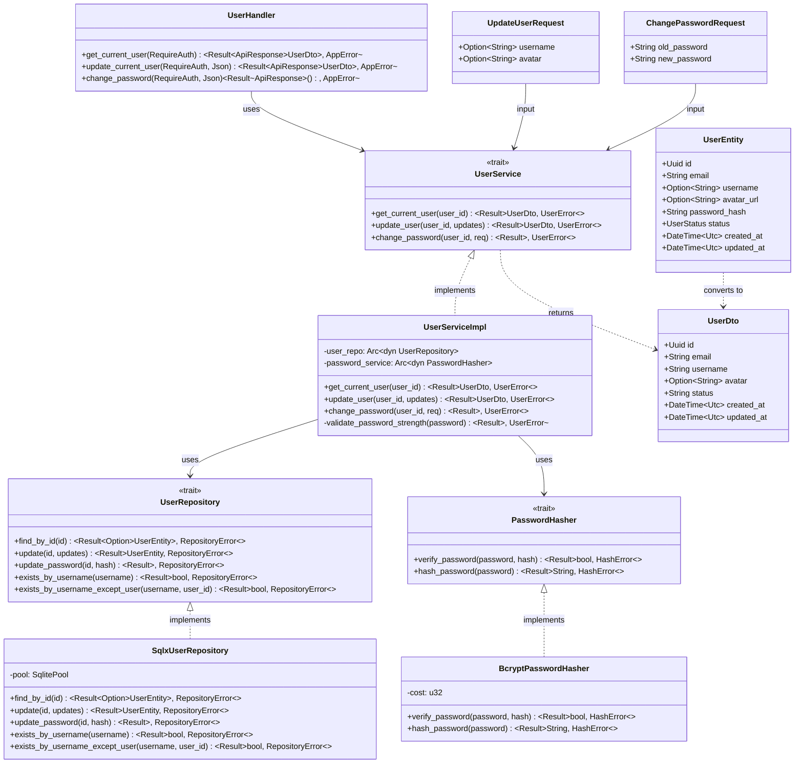
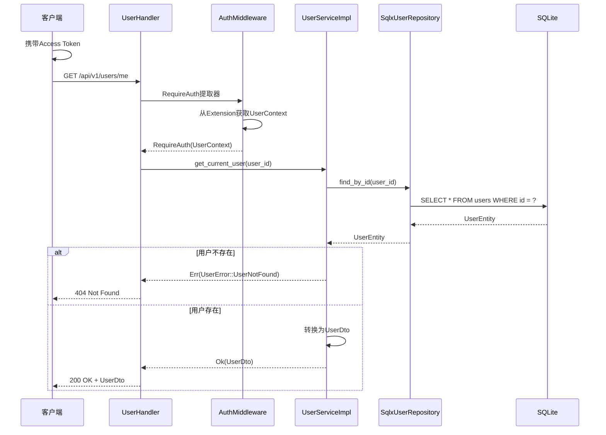
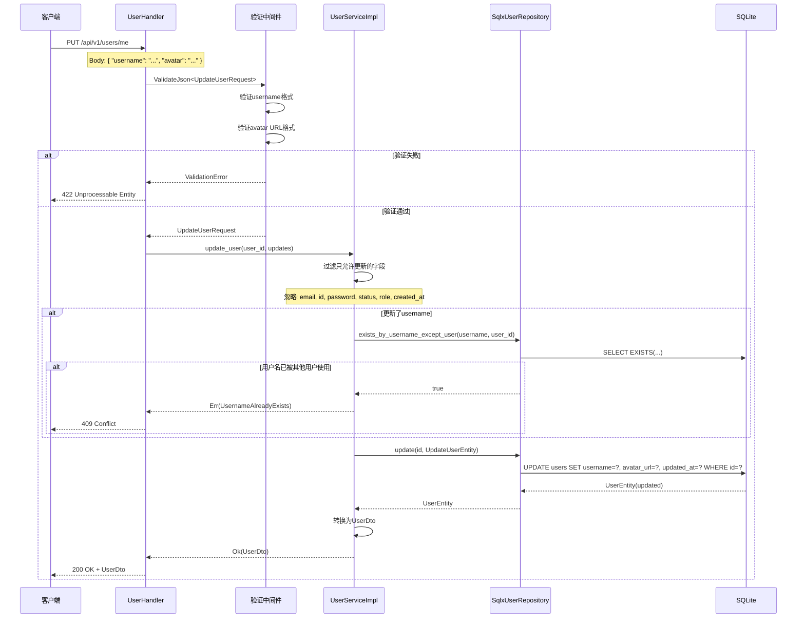
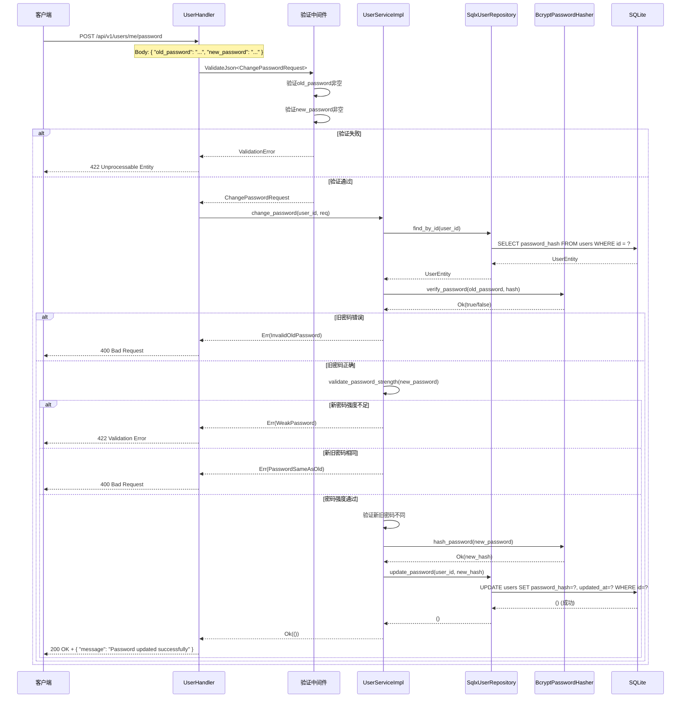

# S1-010: 用户个人信息管理API - 详细设计文档

**任务编号**: S1-010  
**任务名称**: 用户个人信息管理API (User Profile Management API)  
**版本**: 1.0  
**日期**: 2026-03-19  
**状态**: Draft  
**依赖**: S1-008 (用户注册与登录API), S1-009 (JWT认证中间件)

---

## 目录

1. [概述](#1-概述)
2. [设计目标](#2-设计目标)
3. [接口定义（依赖倒置原则）](#3-接口定义依赖倒置原则)
4. [UML设计图](#4-uml设计图)
5. [API规范](#5-api规范)
6. [数据模型](#6-数据模型)
7. [验证规则](#7-验证规则)
8. [错误处理](#8-错误处理)
9. [实现细节](#9-实现细节)
10. [文件结构](#10-文件结构)
11. [测试要点](#11-测试要点)

---

## 1. 概述

### 1.1 文档目的

本文档定义Kayak系统的用户个人信息管理API详细设计，包括获取当前用户信息、更新用户资料（用户名、头像等）、修改密码等核心功能。

### 1.2 功能范围

- **获取当前用户信息**: GET /api/v1/users/me - 返回当前登录用户的完整信息
- **更新用户信息**: PUT /api/v1/users/me - 更新用户名、头像等可编辑字段
- **修改密码**: POST /api/v1/users/me/password - 验证旧密码后修改新密码

### 1.3 验收标准映射

| 验收标准 | 实现组件 | 测试覆盖 |
|---------|---------|---------|
| GET /api/v1/users/me 返回当前用户信息 | `UserHandler::get_current_user()` | TC-S1-010-01 ~ TC-S1-010-06 |
| PUT /api/v1/users/me 更新用户信息 | `UserHandler::update_current_user()` | TC-S1-010-07 ~ TC-S1-010-14 |
| POST /api/v1/users/me/password 修改密码需要验证旧密码 | `UserHandler::change_password()` | TC-S1-010-15 ~ TC-S1-010-24 |

### 1.4 参考文档

- [架构设计](/home/hzhou/workspace/kayak/arch.md) - 第4.2.1节 认证模块
- [S1-008 用户注册与登录API设计](./S1-008_design.md) - 用户认证流程
- [S1-009 JWT认证中间件设计](./S1-009_design.md) - JWT认证和UserContext
- [S1-010 测试用例](./S1-010_test_cases.md) - 24个测试用例详情

---

## 2. 设计目标

### 2.1 功能性目标

1. **用户信息获取**: 返回当前登录用户的完整公开信息（不含敏感字段）
2. **用户信息更新**: 支持更新用户名、头像URL等可编辑字段
3. **密码修改**: 验证旧密码后允许修改新密码
4. **字段保护**: 禁止用户通过更新接口修改email、id、password、status等受保护字段

### 2.2 非功能性目标

1. **安全性**: 密码修改验证旧密码，敏感字段不返回
2. **性能**: 获取用户信息 < 50ms
3. **可测试性**: 接口抽象便于Mock测试
4. **一致性**: 遵循S1-004的统一API响应格式

---

## 3. 接口定义（依赖倒置原则）

根据依赖倒置原则，先定义抽象接口（traits），再实现具体类型。

### 3.1 核心接口概览

```rust
// src/services/user/mod.rs

/// 用户信息服务接口
#[async_trait]
pub trait UserService: Send + Sync {
    async fn get_current_user(&self, user_id: Uuid) -> Result<UserDto, UserError>;
    async fn update_user(&self, user_id: Uuid, updates: UpdateUserRequest) -> Result<UserDto, UserError>;
    async fn change_password(&self, user_id: Uuid, req: ChangePasswordRequest) -> Result<(), UserError>;
}

/// 用户数据访问接口
#[async_trait]
pub trait UserRepository: Send + Sync {
    async fn find_by_id(&self, id: Uuid) -> Result<Option<UserEntity>, RepositoryError>;
    async fn update(&self, id: Uuid, updates: &UpdateUserEntity) -> Result<UserEntity, RepositoryError>;
    async fn update_password(&self, id: Uuid, password_hash: &str) -> Result<(), RepositoryError>;
    async fn exists_by_username(&self, username: &str) -> Result<bool, RepositoryError>;
    async fn exists_by_username_except_user(&self, username: &str, user_id: Uuid) -> Result<bool, RepositoryError>;
}

/// 密码哈希接口
pub trait PasswordHasher: Send + Sync {
    fn verify_password(&self, password: &str, hash: &str) -> Result<bool, HashError>;
    fn hash_password(&self, password: &str) -> Result<String, HashError>;
}
```

### 3.2 UserService Trait

```rust
/// 用户信息服务接口
/// 
/// 负责用户信息的获取、更新和密码修改
#[async_trait]
pub trait UserService: Send + Sync {
    /// 获取当前用户信息
    /// 
    /// # Arguments
    /// * `user_id` - 用户ID
    /// 
    /// # Returns
    /// * `Ok(UserDto)` - 用户信息
    /// * `Err(UserError::UserNotFound)` - 用户不存在
    async fn get_current_user(&self, user_id: Uuid) -> Result<UserDto, UserError>;

    /// 更新用户信息
    /// 
    /// # Arguments
    /// * `user_id` - 用户ID
    /// * `updates` - 更新请求
    /// 
    /// # Returns
    /// * `Ok(UserDto)` - 更新后的用户信息
    /// * `Err(UserError::UsernameAlreadyExists)` - 用户名已被使用
    /// * `Err(UserError::ValidationError)` - 验证失败
    async fn update_user(&self, user_id: Uuid, updates: UpdateUserRequest) -> Result<UserDto, UserError>;

    /// 修改密码
    /// 
    /// # Arguments
    /// * `user_id` - 用户ID
    /// * `req` - 密码修改请求
    /// 
    /// # Returns
    /// * `Ok(())` - 修改成功
    /// * `Err(UserError::InvalidOldPassword)` - 旧密码错误
    /// * `Err(UserError::WeakPassword)` - 新密码强度不足
    async fn change_password(&self, user_id: Uuid, req: ChangePasswordRequest) -> Result<(), UserError>;
}

/// 用户错误类型
#[derive(Debug, Error)]
pub enum UserError {
    #[error("User not found")]
    UserNotFound,
    
    #[error("Username already exists")]
    UsernameAlreadyExists,
    
    #[error("Invalid old password")]
    InvalidOldPassword,
    
    #[error("Password too weak: {0}")]
    WeakPassword(String),
    
    #[error("New password cannot be the same as old password")]
    PasswordSameAsOld,
    
    #[error("Validation error: {0}")]
    ValidationError(String),
    
    #[error("Internal error: {0}")]
    Internal(String),
}

impl From<UserError> for AppError {
    fn from(err: UserError) -> Self {
        match err {
            UserError::UserNotFound => AppError::NotFound(err.to_string()),
            UserError::UsernameAlreadyExists => AppError::Conflict(err.to_string()),
            UserError::InvalidOldPassword => AppError::BadRequest(err.to_string()),
            UserError::WeakPassword(msg) => AppError::ValidationError(vec![ValidationErrorItem {
                field: "new_password".to_string(),
                message: msg,
                code: "WEAK_PASSWORD".to_string(),
            }]),
            UserError::PasswordSameAsOld => AppError::BadRequest(err.to_string()),
            UserError::ValidationError(msg) => AppError::BadRequest(msg),
            UserError::Internal(msg) => AppError::InternalError(msg),
        }
    }
}
```

### 3.3 UserRepository Trait

```rust
/// 用户数据访问接口
/// 
/// 负责用户数据的持久化操作
#[async_trait]
pub trait UserRepository: Send + Sync {
    /// 根据ID查找用户
    async fn find_by_id(&self, id: Uuid) -> Result<Option<UserEntity>, RepositoryError>;

    /// 更新用户信息
    async fn update(&self, id: Uuid, updates: &UpdateUserEntity) -> Result<UserEntity, RepositoryError>;

    /// 更新密码
    async fn update_password(&self, id: Uuid, password_hash: &str) -> Result<(), RepositoryError>;

    /// 检查用户名是否存在
    async fn exists_by_username(&self, username: &str) -> Result<bool, RepositoryError>;

    /// 检查用户名是否存在（排除指定用户）
    async fn exists_by_username_except_user(&self, username: &str, user_id: Uuid) -> Result<bool, RepositoryError>;
}

/// 用户更新实体
#[derive(Debug, Clone, Default)]
pub struct UpdateUserEntity {
    pub username: Option<String>,
    pub avatar_url: Option<String>,
}

/// 仓库错误类型
#[derive(Debug, Error)]
pub enum RepositoryError {
    #[error("Database error: {0}")]
    Database(#[from] sqlx::Error),
    
    #[error("Unique constraint violation: {0}")]
    UniqueViolation(String),
}
```

### 3.4 PasswordHasher Trait

```rust
/// 密码服务接口
/// 
/// 负责密码的哈希和验证
pub trait PasswordHasher: Send + Sync {
    /// 验证密码
    fn verify_password(&self, password: &str, hash: &str) -> Result<bool, HashError>;

    /// 哈希密码
    fn hash_password(&self, password: &str) -> Result<String, HashError>;
}

/// 哈希错误类型
#[derive(Debug, Error)]
pub enum HashError {
    #[error("Password too short: minimum {0} characters")]
    TooShort(usize),
    
    #[error("Password too long: maximum {0} characters")]
    TooLong(usize),
    
    #[error("Hashing failed: {0}")]
    HashingFailed(String),
    
    #[error("Invalid hash format")]
    InvalidHashFormat,
}
```

---

## 4. UML设计图

### 4.1 类图（接口与实现关系）



### 4.2 时序图 - 获取当前用户信息



### 4.3 时序图 - 更新用户信息



### 4.4 时序图 - 修改密码



---

## 5. API规范

### 5.1 端点概览

| 方法 | 端点 | 描述 | 认证 |
|------|------|------|------|
| GET | /api/v1/users/me | 获取当前用户信息 | 必需 |
| PUT | /api/v1/users/me | 更新当前用户信息 | 必需 |
| POST | /api/v1/users/me/password | 修改密码 | 必需 |

### 5.2 GET /api/v1/users/me

获取当前登录用户的完整信息。

#### 请求

**Headers**:
```
Authorization: Bearer <access_token>
```

#### 成功响应 (200 OK)

```json
{
  "code": 200,
  "message": "Success",
  "data": {
    "user": {
      "id": "550e8400-e29b-41d4-a716-446655440000",
      "email": "user@example.com",
      "username": "john_doe",
      "avatar": "https://example.com/avatar.jpg",
      "status": "active",
      "created_at": "2026-03-18T10:30:00Z",
      "updated_at": "2026-03-18T10:30:00Z"
    }
  },
  "timestamp": "2026-03-18T10:30:00Z"
}
```

**字段说明**:

| 字段 | 类型 | 说明 |
|------|------|------|
| id | UUID | 用户唯一标识 |
| email | string | 用户邮箱（注册时设置，不可修改） |
| username | string | 显示名称 |
| avatar | string/null | 头像URL |
| status | string | 用户状态（active/inactive/banned） |
| created_at | datetime | 账户创建时间 |
| updated_at | datetime | 信息最后更新时间 |

**敏感字段说明**（不会在响应中返回）:
- `password` - 永不存在于响应中
- `password_hash` - 永不存在于响应中

#### 错误响应

**401 Unauthorized** - 未认证或Token无效
```json
{
  "code": 401,
  "message": "Authentication required",
  "timestamp": "2026-03-18T10:30:00Z"
}
```

**404 Not Found** - 用户不存在
```json
{
  "code": 404,
  "message": "User not found",
  "timestamp": "2026-03-18T10:30:00Z"
}
```

---

### 5.3 PUT /api/v1/users/me

更新当前登录用户的信息。

#### 请求

**Headers**:
```
Authorization: Bearer <access_token>
Content-Type: application/json
```

**请求体**:
```json
{
  "username": "new_username",
  "avatar": "https://example.com/new_avatar.jpg"
}
```

**字段说明**:

| 字段 | 类型 | 必填 | 约束 | 说明 |
|------|------|------|------|------|
| username | string | 否 | 3-50字符，字母数字下划线 | 显示名称 |
| avatar | string | 否 | 有效URL，最大2048字符 | 头像URL |

**只允许更新的字段**: `username`, `avatar`

**受保护字段**（忽略请求中的这些字段）:
- `id` - 用户ID不可更改
- `email` - 邮箱不可更改
- `password` - 密码需通过专门接口
- `status` - 状态不可由用户更改
- `created_at` - 创建时间不可更改
- `role` - 角色不可更改

#### 成功响应 (200 OK)

```json
{
  "code": 200,
  "message": "User updated successfully",
  "data": {
    "user": {
      "id": "550e8400-e29b-41d4-a716-446655440000",
      "email": "user@example.com",
      "username": "new_username",
      "avatar": "https://example.com/new_avatar.jpg",
      "status": "active",
      "created_at": "2026-03-18T10:30:00Z",
      "updated_at": "2026-03-19T08:15:00Z"
    }
  },
  "timestamp": "2026-03-19T08:15:00Z"
}
```

#### 错误响应

**400 Bad Request** - 请求格式错误
```json
{
  "code": 400,
  "message": "Bad request: Invalid JSON",
  "timestamp": "2026-03-19T08:15:00Z"
}
```

**401 Unauthorized** - 未认证
```json
{
  "code": 401,
  "message": "Authentication required",
  "timestamp": "2026-03-19T08:15:00Z"
}
```

**409 Conflict** - 用户名已被使用
```json
{
  "code": 409,
  "message": "Username already exists",
  "timestamp": "2026-03-19T08:15:00Z"
}
```

**422 Unprocessable Entity** - 验证失败
```json
{
  "code": 422,
  "message": "Validation failed",
  "errors": [
    { "field": "username", "message": "Username must be 3-50 characters", "code": "LENGTH" },
    { "field": "avatar", "message": "Invalid URL format", "code": "INVALID_URL" }
  ],
  "timestamp": "2026-03-19T08:15:00Z"
}
```

---

### 5.4 POST /api/v1/users/me/password

修改当前用户的密码。

#### 请求

**Headers**:
```
Authorization: Bearer <access_token>
Content-Type: application/json
```

**请求体**:
```json
{
  "old_password": "OldPass123!",
  "new_password": "NewSecurePass456!"
}
```

**字段说明**:

| 字段 | 类型 | 必填 | 约束 | 说明 |
|------|------|------|------|------|
| old_password | string | 是 | 当前密码 | 旧密码用于验证 |
| new_password | string | 是 | ≥8字符，含大小写字母和数字 | 新密码 |

#### 成功响应 (200 OK)

```json
{
  "code": 200,
  "message": "Password updated successfully",
  "data": null,
  "timestamp": "2026-03-19T08:15:00Z"
}
```

#### 错误响应

**400 Bad Request** - 旧密码错误或新旧密码相同
```json
{
  "code": 400,
  "message": "Invalid old password",
  "timestamp": "2026-03-19T08:15:00Z"
}
```

```json
{
  "code": 400,
  "message": "New password cannot be the same as old password",
  "timestamp": "2026-03-19T08:15:00Z"
}
```

**401 Unauthorized** - 未认证
```json
{
  "code": 401,
  "message": "Authentication required",
  "timestamp": "2026-03-19T08:15:00Z"
}
```

**422 Unprocessable Entity** - 新密码强度不足
```json
{
  "code": 422,
  "message": "Validation failed",
  "errors": [
    { "field": "new_password", "message": "Password must be at least 8 characters", "code": "LENGTH" }
  ],
  "timestamp": "2026-03-19T08:15:00Z"
}
```

---

## 6. 数据模型

### 6.1 DTO定义

```rust
// src/models/dto/user.rs

/// 用户响应DTO
#[derive(Debug, Serialize)]
pub struct UserDto {
    pub id: Uuid,
    pub email: String,
    pub username: Option<String>,
    pub avatar: Option<String>,
    pub status: String,
    pub created_at: DateTime<Utc>,
    pub updated_at: DateTime<Utc>,
}

/// 用户名正则表达式
const USERNAME_REGEX: &str = r"^[a-zA-Z0-9_]+$";

/// 用户名格式验证函数
fn validate_username_format(username: &str) -> Result<(), String> {
    if USERNAME_REGEX.is_match(username) {
        Ok(())
    } else {
        Err("Username can only contain letters, numbers and underscores".to_string())
    }
}

/// 更新用户信息请求DTO
#[derive(Debug, Deserialize, Validate)]
pub struct UpdateUserRequest {
    #[validate(length(min = 3, max = 50, message = "Username must be 3-50 characters"))]
    #[validate(custom(function = "validate_username_format"))]
    pub username: Option<String>,
    
    #[validate(url(message = "Invalid avatar URL format"))]
    #[validate(length(max = 2048, message = "Avatar URL must be at most 2048 characters"))]
    pub avatar: Option<String>,
}

/// 修改密码请求DTO
#[derive(Debug, Deserialize, Validate)]
pub struct ChangePasswordRequest {
    #[validate(length(min = 1, message = "Old password is required"))]
    pub old_password: String,
    
    #[validate(length(min = 8, message = "New password must be at least 8 characters"))]
    pub new_password: String,
}
```

### 6.2 实体模型

用户实体沿用S1-003中定义的User实体，无需修改：

```rust
// src/models/entities/user.rs (引用S1-003)

/// 用户实体
#[derive(Debug, Clone, FromRow, Serialize, Deserialize)]
pub struct User {
    pub id: Uuid,
    pub email: String,
    pub password_hash: String,
    pub username: Option<String>,
    pub avatar_url: Option<String>,  // 头像URL字段
    pub status: UserStatus,
    pub created_at: DateTime<Utc>,
    pub updated_at: DateTime<Utc>,
}

/// 用户账户状态
#[derive(Debug, Clone, Copy, PartialEq, Eq, Serialize, Deserialize, sqlx::Type)]
#[sqlx(rename_all = "lowercase")]
#[serde(rename_all = "lowercase")]
pub enum UserStatus {
    Active,
    Inactive,
    Banned,
}
```

---

## 7. 验证规则

### 7.1 用户名验证

| 规则 | 要求 | 错误码 |
|------|------|--------|
| 最小长度 | 3个字符 | LENGTH |
| 最大长度 | 50个字符 | LENGTH |
| 字符集 | 字母、数字、下划线（a-zA-Z0-9_） | INVALID_FORMAT |
| 唯一性 | 不能与现有用户名重复 | DUPLICATE |
| 空值 | 允许为null（可选字段） | - |

**正则表达式**: `^[a-zA-Z0-9_]+$`

### 7.2 头像URL验证

| 规则 | 要求 | 错误码 |
|------|------|--------|
| 格式 | 有效的HTTP/HTTPS URL | INVALID_URL |
| 最大长度 | 2048字符 | LENGTH |
| 空值 | 允许为null（移除头像） | - |

### 7.3 密码验证

| 规则 | 要求 | 错误码 |
|------|------|--------|
| 最小长度 | 8个字符 | LENGTH |
| 最大长度 | 128个字符 | LENGTH |
| 新旧密码 | 必须不同 | SAME_AS_OLD |
| 旧密码验证 | 必须与存储的密码匹配 | INVALID_OLD_PASSWORD |

### 7.4 密码强度建议

| 建议 | 说明 |
|------|------|
| 最小长度 | 8个字符 |
| 大写字母 | 建议包含至少一个大写字母 |
| 小写字母 | 建议包含至少一个小写字母 |
| 数字 | 建议包含至少一个数字 |
| 特殊字符 | 建议包含至少一个特殊字符 |

**注意**: Release 0仅实施最小长度验证，复杂度验证为未来增强预留。

---

## 8. 错误处理

### 8.1 错误代码对照表

| HTTP状态码 | 错误场景 | 错误消息 | 错误码 |
|------------|----------|----------|--------|
| 400 | JSON解析失败 | Bad request: Invalid JSON | - |
| 400 | 旧密码错误 | Invalid old password | INVALID_OLD_PASSWORD |
| 400 | 新旧密码相同 | New password cannot be the same as old password | SAME_AS_OLD |
| 401 | 未认证 | Authentication required | - |
| 401 | Token无效 | Invalid token | - |
| 401 | Token过期 | Token has expired | - |
| 404 | 用户不存在 | User not found | - |
| 409 | 用户名已存在 | Username already exists | DUPLICATE |
| 422 | 用户名格式无效 | Invalid username format | INVALID_FORMAT |
| 422 | 用户名长度不符 | Username must be 3-50 characters | LENGTH |
| 422 | 头像URL格式无效 | Invalid avatar URL format | INVALID_URL |
| 422 | 密码太短 | Password must be at least 8 characters | LENGTH |
| 500 | 服务器内部错误 | Internal server error | - |

### 8.2 错误响应格式

所有错误响应遵循S1-004定义的统一格式：

```json
{
  "code": <HTTP状态码>,
  "message": "<错误描述>",
  "errors": [
    { "field": "<字段名>", "message": "<字段错误>", "code": "<错误码>" }
  ],
  "timestamp": "<ISO8601时间戳>"
}
```

**注意**: `errors`字段仅在验证错误时返回，单一错误可省略。

---

## 9. 实现细节

### 9.1 UserServiceImpl

```rust
/// 用户服务实现
pub struct UserServiceImpl {
    user_repo: Arc<dyn UserRepository>,
    password_service: Arc<dyn PasswordHasher>,
}

impl UserServiceImpl {
    pub fn new(
        user_repo: Arc<dyn UserRepository>,
        password_service: Arc<dyn PasswordHasher>,
    ) -> Self {
        Self {
            user_repo,
            password_service,
        }
    }

    /// 验证密码强度
    fn validate_password_strength(&self, password: &str) -> Result<(), UserError> {
        if password.len() < 8 {
            return Err(UserError::WeakPassword(
                "Password must be at least 8 characters".to_string(),
            ));
        }
        if password.len() > 128 {
            return Err(UserError::WeakPassword(
                "Password must be at most 128 characters".to_string(),
            ));
        }
        Ok(())
    }
}

#[async_trait]
impl UserService for UserServiceImpl {
    async fn get_current_user(&self, user_id: Uuid) -> Result<UserDto, UserError> {
        let user = self
            .user_repo
            .find_by_id(user_id)
            .await
            .map_err(|e| UserError::Internal(e.to_string()))?
            .ok_or(UserError::UserNotFound)?;

        Ok(UserDto {
            id: user.id,
            email: user.email,
            username: user.username,
            avatar: user.avatar_url,
            status: format!("{:?}", user.status).to_lowercase(),
            created_at: user.created_at,
            updated_at: user.updated_at,
        })
    }

    async fn update_user(
        &self,
        user_id: Uuid,
        updates: UpdateUserRequest,
    ) -> Result<UserDto, UserError> {
        // 构建更新实体（只包含允许更新的字段）
        let mut update_entity = UpdateUserEntity::default();

        if let Some(ref username) = updates.username {
            // 验证用户名唯一性
            let exists = self
                .user_repo
                .exists_by_username_except_user(username, user_id)
                .await
                .map_err(|e| UserError::Internal(e.to_string()))?;

            if exists {
                return Err(UserError::UsernameAlreadyExists);
            }
            update_entity.username = Some(username.clone());
        }

        if updates.avatar.is_some() {
            update_entity.avatar_url = updates.avatar.clone();
        }

        // 执行更新
        let user = self
            .user_repo
            .update(user_id, &update_entity)
            .await
            .map_err(|e| UserError::Internal(e.to_string()))?;

        Ok(UserDto {
            id: user.id,
            email: user.email,
            username: user.username,
            avatar: user.avatar_url,
            status: format!("{:?}", user.status).to_lowercase(),
            created_at: user.created_at,
            updated_at: user.updated_at,
        })
    }

    async fn change_password(
        &self,
        user_id: Uuid,
        req: ChangePasswordRequest,
    ) -> Result<(), UserError> {
        // 获取用户
        let user = self
            .user_repo
            .find_by_id(user_id)
            .await
            .map_err(|e| UserError::Internal(e.to_string()))?
            .ok_or(UserError::UserNotFound)?;

        // 验证旧密码
        let password_valid = self
            .password_service
            .verify_password(&req.old_password, &user.password_hash)
            .map_err(|e| UserError::Internal(e.to_string()))?;

        if !password_valid {
            return Err(UserError::InvalidOldPassword);
        }

        // 验证新旧密码不同
        if req.old_password == req.new_password {
            return Err(UserError::PasswordSameAsOld);
        }

        // 验证新密码强度
        self.validate_password_strength(&req.new_password)?;

        // 哈希新密码并存储
        let new_hash = self
            .password_service
            .hash_password(&req.new_password)
            .map_err(|e| UserError::Internal(e.to_string()))?;

        self.user_repo
            .update_password(user_id, &new_hash)
            .await
            .map_err(|e| UserError::Internal(e.to_string()))?;

        Ok(())
    }
}
```

### 9.2 UserHandler

```rust
/// 用户处理器
pub struct UserHandler {
    user_service: Arc<dyn UserService>,
}

impl UserHandler {
    pub fn new(user_service: Arc<dyn UserService>) -> Self {
        Self { user_service }
    }

    /// GET /api/v1/users/me - 获取当前用户信息
    pub async fn get_current_user(
        &self,
        RequireAuth(user_ctx): RequireAuth,
    ) -> Result<ApiResponse<UserDto>, AppError> {
        let user = self
            .user_service
            .get_current_user(user_ctx.user_id)
            .await?;
        Ok(ApiResponse::success(user))
    }

    /// PUT /api/v1/users/me - 更新当前用户信息
    pub async fn update_current_user(
        &self,
        RequireAuth(user_ctx): RequireAuth,
        ValidatedJson(payload): ValidatedJson<UpdateUserRequest>,
    ) -> Result<ApiResponse<UserDto>, AppError> {
        let user = self
            .user_service
            .update_user(user_ctx.user_id, payload)
            .await?;
        Ok(ApiResponse::success(user))
    }

    /// POST /api/v1/users/me/password - 修改密码
    pub async fn change_password(
        &self,
        RequireAuth(user_ctx): RequireAuth,
        ValidatedJson(payload): ValidatedJson<ChangePasswordRequest>,
    ) -> Result<ApiResponse<()>, AppError> {
        self.user_service
            .change_password(user_ctx.user_id, payload)
            .await?;
        Ok(ApiResponse::success_message("Password updated successfully"))
    }
}
```

### 9.3 SqlxUserRepository

```rust
/// SQLx用户仓库实现
pub struct SqlxUserRepository {
    pool: SqlitePool,
}

impl SqlxUserRepository {
    pub fn new(pool: SqlitePool) -> Self {
        Self { pool }
    }
}

#[async_trait]
impl UserRepository for SqlxUserRepository {
    async fn find_by_id(&self, id: Uuid) -> Result<Option<UserEntity>, RepositoryError> {
        let user = sqlx::query_as::<_, User>(
            r#"
            SELECT id, email, password_hash, username, avatar_url, status, created_at, updated_at
            FROM users
            WHERE id = ?
            "#,
        )
        .bind(id)
        .fetch_optional(&self.pool)
        .await?;

        Ok(user)
    }

    async fn update(
        &self,
        id: Uuid,
        updates: &UpdateUserEntity,
    ) -> Result<UserEntity, RepositoryError> {
        // 构建动态更新语句
        let mut query = String::from("UPDATE users SET updated_at = ?");
        let mut has_updates = false;

        if updates.username.is_some() {
            query.push_str(", username = ?");
            has_updates = true;
        }
        if updates.avatar_url.is_some() {
            query.push_str(", avatar_url = ?");
            has_updates = true;
        }

        if !has_updates {
            // 没有更新，直接返回当前用户
            return self.find_by_id(id).await?.ok_or(
                RepositoryError::Database(sqlx::Error::RowNotFound)
            );
        }

        query.push_str(" WHERE id = ? RETURNING *");

        // 构建查询
        let mut q = sqlx::query_as::<_, User>(&query);

        // 绑定updated_at
        let now = Utc::now();
        q = q.bind(now);

        // 绑定可选字段
        if let Some(ref username) = updates.username {
            q = q.bind(username);
        }
        if let Some(ref avatar_url) = updates.avatar_url {
            q = q.bind(avatar_url);
        }

        q = q.bind(id);

        let user = q.fetch_one(&self.pool).await?;
        Ok(user)
    }

    async fn update_password(&self, id: Uuid, password_hash: &str) -> Result<(), RepositoryError> {
        let now = Utc::now();
        sqlx::query(
            r#"
            UPDATE users
            SET password_hash = ?, updated_at = ?
            WHERE id = ?
            "#,
        )
        .bind(password_hash)
        .bind(now)
        .bind(id)
        .execute(&self.pool)
        .await?;

        Ok(())
    }

    async fn exists_by_username(&self, username: &str) -> Result<bool, RepositoryError> {
        let exists: bool = sqlx::query_scalar(
            "SELECT EXISTS(SELECT 1 FROM users WHERE username = ?)",
        )
        .bind(username)
        .fetch_one(&self.pool)
        .await?;

        Ok(exists)
    }

    async fn exists_by_username_except_user(
        &self,
        username: &str,
        user_id: Uuid,
    ) -> Result<bool, RepositoryError> {
        let exists: bool = sqlx::query_scalar(
            "SELECT EXISTS(SELECT 1 FROM users WHERE username = ? AND id != ?)",
        )
        .bind(username)
        .bind(user_id)
        .fetch_one(&self.pool)
        .await?;

        Ok(exists)
    }
}
```

---

## 10. 文件结构

### 10.1 新增文件清单

```
kayak-backend/src/
├── services/
│   ├── mod.rs                           [修改] 导出user模块
│   └── user/
│       ├── mod.rs                       [新增] 模块导出
│       ├── service.rs                   [新增] UserService trait + impl
│       ├── error.rs                     [新增] UserError
│       └── types.rs                     [新增] UpdateUserEntity等类型
│
├── repositories/
│   └── user_repository.rs               [修改] 添加update, update_password等方法
│
├── api/
│   └── handlers/
│       ├── mod.rs                       [修改] 导出user模块
│       └── user.rs                      [新增] UserHandler
│
└── models/
    └── dto/
        ├── mod.rs                       [修改] 导出user模块
        └── user.rs                      [新增] UserDto, UpdateUserRequest, ChangePasswordRequest
```

### 10.2 路由配置

```rust
// src/api/routes.rs

pub fn user_routes(handler: UserHandler) -> Router {
    Router::new()
        .route("/api/v1/users/me", get(get_current_user))
        .route("/api/v1/users/me", put(update_current_user))
        .route("/api/v1/users/me/password", post(change_password))
        .with_state(handler)
}

// 处理器函数
async fn get_current_user(
    handler: State<UserHandler>,
    auth: RequireAuth,
) -> Result<ApiResponse<UserDto>, AppError> {
    handler.get_current_user(auth).await
}

async fn update_current_user(
    handler: State<UserHandler>,
    auth: RequireAuth,
    payload: ValidatedJson<UpdateUserRequest>,
) -> Result<ApiResponse<UserDto>, AppError> {
    handler.update_current_user(auth, payload).await
}

async fn change_password(
    handler: State<UserHandler>,
    auth: RequireAuth,
    payload: ValidatedJson<ChangePasswordRequest>,
) -> Result<ApiResponse<()>, AppError> {
    handler.change_password(auth, payload).await
}
```

---

## 11. 测试要点

### 11.1 单元测试

| 测试场景 | 测试内容 | 期望结果 |
|----------|----------|----------|
| 获取用户信息成功 | 有效用户ID | 200，返回UserDto |
| 获取用户信息-用户不存在 | 用户被删除 | 404 Not Found |
| 更新用户名成功 | 有效用户名 | 200，返回更新后的UserDto |
| 更新头像成功 | 有效URL | 200，返回更新后的UserDto |
| 更新用户名-已存在 | 用户名被占用 | 409 Conflict |
| 更新用户名-格式无效 | 含特殊字符 | 422 Validation Error |
| 更新受保护字段 | 尝试修改email | 字段被忽略或400 |
| 修改密码成功 | 正确旧密码+新密码 | 200 |
| 修改密码-旧密码错误 | 错误旧密码 | 400 Bad Request |
| 修改密码-新旧相同 | 相同密码 | 400 Bad Request |
| 修改密码-密码太短 | 7字符密码 | 422 Validation Error |

### 11.2 安全测试

| 测试场景 | 测试内容 | 期望结果 |
|----------|----------|----------|
| 未认证获取信息 | 无Token请求 | 401 Unauthorized |
| 未认证更新信息 | 无Token请求 | 401 Unauthorized |
| 未认证修改密码 | 无Token请求 | 401 Unauthorized |
| 密码哈希验证 | 检查数据库存储 | bcrypt格式，非明文 |
| 敏感字段泄露 | 检查响应 | 不包含password_hash |
| 跨用户数据访问 | 尝试修改其他用户 | 用户只能修改自己的信息 |

### 11.3 性能测试

| 指标 | 目标值 | 测试方法 |
|------|--------|----------|
| 获取用户信息响应时间 | < 50ms | 单元测试计时 |
| 更新用户信息响应时间 | < 100ms | 包含数据库更新 |
| 修改密码响应时间 | < 200ms | bcrypt哈希耗时约150ms |
| 并发更新 | 100 req/s | 负载测试 |

---

## 附录

### A.1 依赖项

无需新增主要依赖，沿用S1-008和S1-009的依赖：
- `axum`: 0.7
- `sqlx`: 0.7 (含SQLite支持)
- `uuid`: 1.0
- `validator`: 0.16
- `async-trait`: 0.1
- `bcrypt`: 0.15
- `chrono`: 0.4

### A.2 与S1-008/S1-009的关系

| 依赖 | 使用内容 | 说明 |
|------|---------|------|
| S1-008 | UserRepository | find_by_id, create等方法 |
| S1-008 | PasswordHasher | bcrypt哈希验证 |
| S1-009 | RequireAuth | 认证用户上下文提取 |
| S1-009 | UserContext | 获取当前用户ID |
| S1-004 | ApiResponse | 统一响应格式 |
| S1-004 | AppError | 错误类型转换 |

### A.3 设计决策记录

#### 决策1: 使用UserContext而非重新查询数据库获取用户ID

**选择**: 直接使用JWT中间件注入的UserContext.user_id

**理由**:
- 避免重复的数据库查询
- Token已包含用户ID，无需额外验证
- 符合S1-009的设计理念

#### 决策2: 只允许更新username和avatar字段

**选择**: 明确定义可更新字段列表，忽略其他字段

**理由**:
- 安全性：防止用户通过操控请求修改受保护字段
- 明确性：API语义清晰，用户知道哪些字段可修改
- 可维护性：未来添加新字段时需要明确决策

#### 决策3: 密码修改验证旧密码

**选择**: 必须提供旧密码才能修改新密码

**理由**:
- 安全性：防止他人冒用已登录会话修改密码
- 符合常见安全实践（如OWASP建议）
- 提供密码找回之外的账户保护

### A.4 文档历史

| 版本 | 日期 | 修改人 | 修改说明 |
|------|------|--------|----------|
| 1.0 | 2026-03-19 | sw-jerry | 初始版本创建 |

---

**文档结束**
