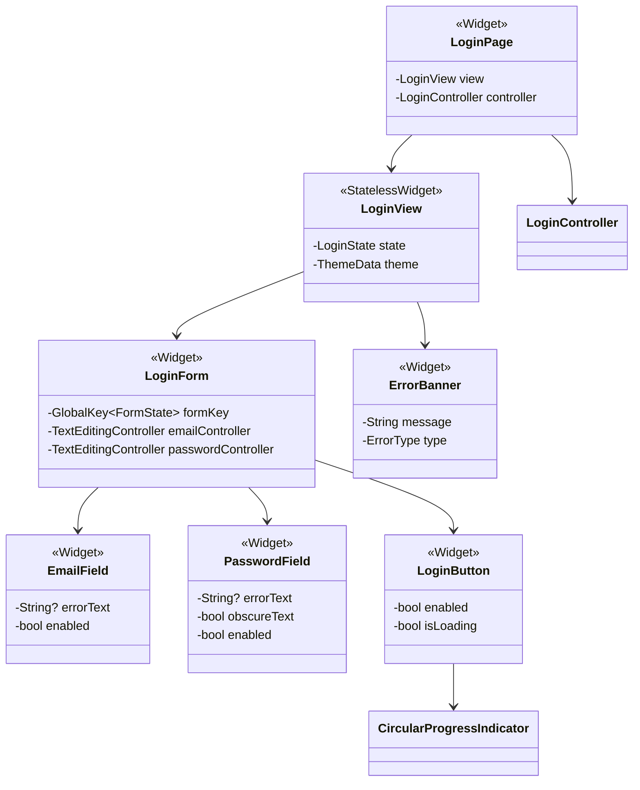
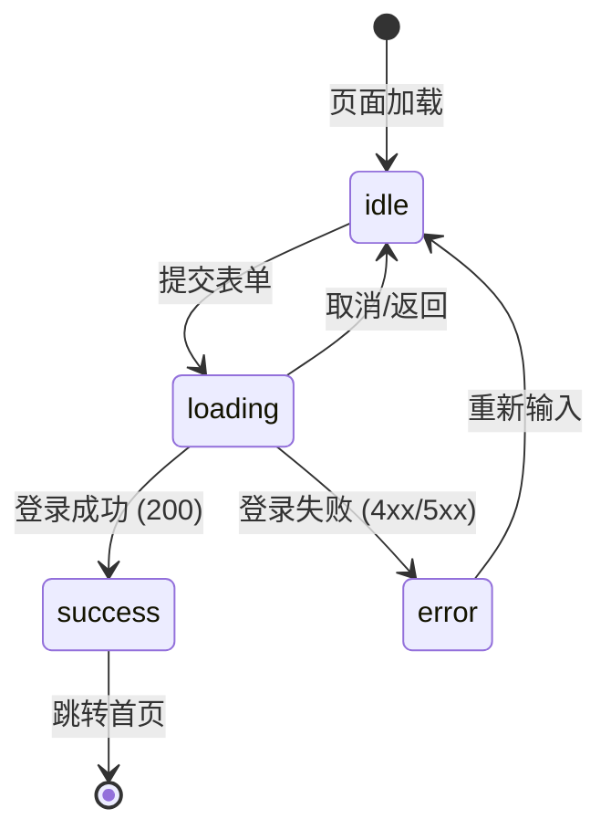
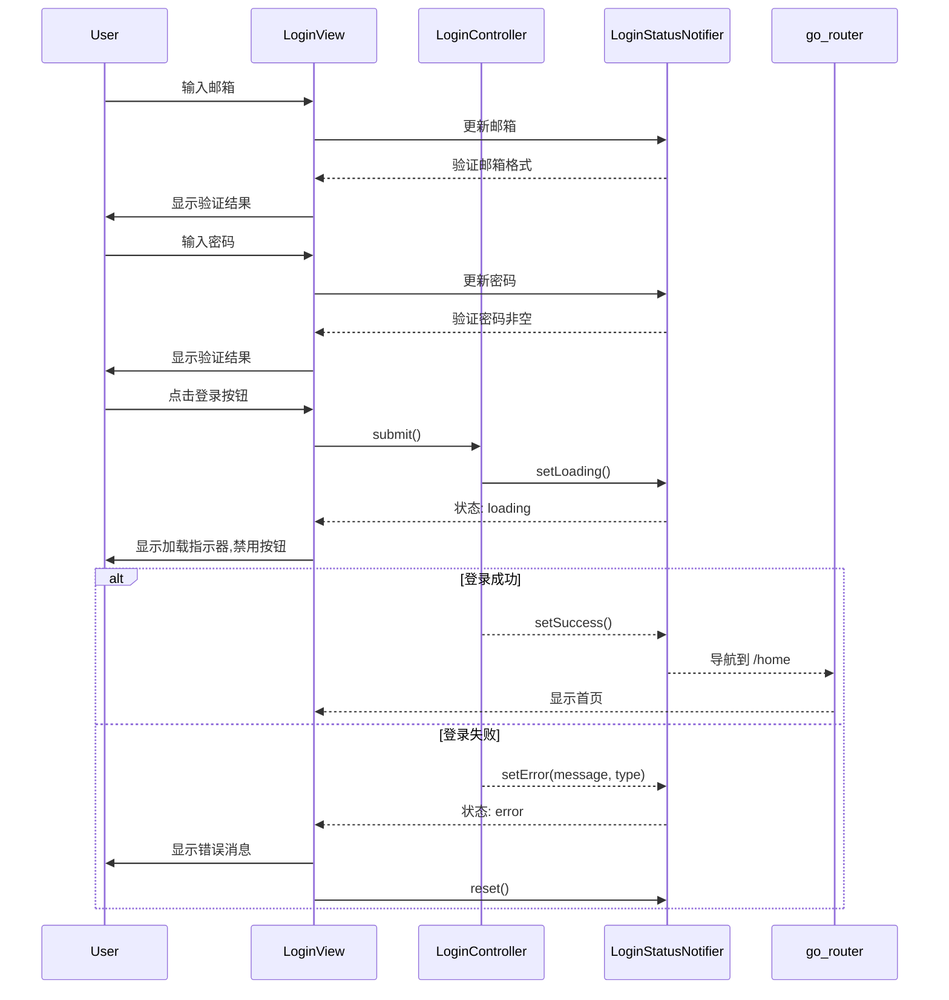
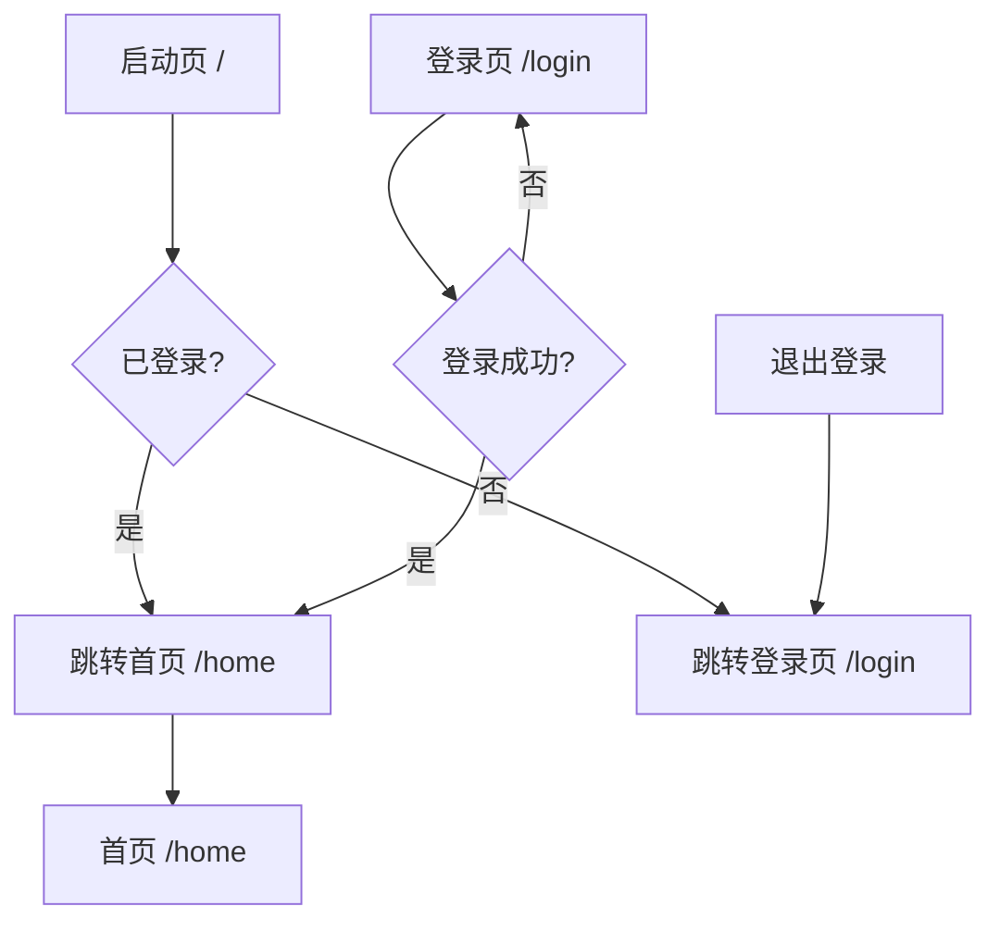

# S1-011 详细设计文档 - 登录页面UI实现

**版本**: 1.0  
**创建日期**: 2026-03-20  
**任务**: S1-011 登录页面UI实现  
**技术栈**: Flutter / Material Design 3 / Riverpod / go_router  
**预估工时**: 8h  
**依赖任务**: S1-002, S1-008  

---

## 1. 概述

### 1.1 任务目标

实现Material Design 3风格的登录页面，包含：
- 邮箱/密码输入
- 表单验证（即时反馈）
- 登录状态反馈（加载中、错误提示）
- 深色/浅色主题适配

### 1.2 验收标准

| 验收标准 | 说明 |
|----------|------|
| AC1 | 界面符合Material Design 3规范 |
| AC2 | 表单验证即时反馈 |
| AC3 | 登录成功跳转首页 |

---

## 2. UI设计

### 2.1 页面布局

```
┌─────────────────────────────────────────────┐
│                                             │
│              [App Logo/Icon]                │
│                                             │
│              "欢迎使用 Kayak"                │
│                                             │
│  ┌───────────────────────────────────────┐  │
│  │ 📧  Email                             │  │
│  └───────────────────────────────────────┘  │
│                                             │
│  ┌───────────────────────────────────────┐  │
│  │ 🔒  Password                    👁     │  │
│  └───────────────────────────────────────┘  │
│                                             │
│  [        登录 (Login)        ]             │
│                                             │
│         忘记密码？  注册账号                 │
│                                             │
└─────────────────────────────────────────────┘
```

### 2.2 组件规格

| 组件 | 类型 | 说明 |
|------|------|------|
| Logo | Icon | 尺寸: 80x80, 使用 `Icons.science` |
| 标题 | Text | 风格: headlineMedium, 居中 |
| Email输入框 | TextField | MD3 OutlinedTextField, email键盘 |
| Password输入框 | TextField | MD3 OutlinedTextField, 密码遮蔽 |
| 登录按钮 | FilledButton | MD3 FilledButton, 宽度: match_parent |
| 错误提示 | Text | 颜色: colorScheme.error |
| 加载指示器 | CircularProgressIndicator | 颜色: colorScheme.primary |

### 2.3 间距规范

| 元素 | 间距 |
|------|------|
| 页面边距 | 24dp (水平) |
| Logo与标题间距 | 16dp |
| 标题与输入框间距 | 32dp |
| 输入框之间间距 | 16dp |
| 按钮与输入框间距 | 24dp |
| 底部链接间距 | 16dp |

---

## 3. Widget结构

### 3.1 Widget组合图



### 3.2 文件结构

```
kayak-frontend/lib/
├── screens/
│   └── login/
│       ├── login_screen.dart          # 主页面
│       ├── login_view.dart             # 视图层
│       ├── login_controller.dart       # 控制器
│       └── widgets/
│           ├── login_form.dart         # 登录表单
│           ├── email_field.dart        # 邮箱输入框
│           ├── password_field.dart     # 密码输入框
│           ├── login_button.dart       # 登录按钮
│           └── error_banner.dart       # 错误横幅
├── providers/
│   └── auth/
│       └── login_provider.dart         # 登录状态管理
├── validators/
│   └── validators.dart                 # 表单验证器
└── core/
    ├── router/
    │   └── app_router.dart             # 路由配置 (需更新)
    └── theme/
        └── app_theme.dart              # 主题配置 (已存在)
```

---

## 4. 状态管理

### 4.1 登录状态定义

```dart
/// 登录状态枚举
enum LoginStatus {
  /// 空闲状态 - 初始状态
  idle,
  
  /// 加载状态 - 登录请求中
  loading,
  
  /// 成功状态 - 登录成功
  success,
  
  /// 错误状态 - 登录失败
  error,
}

/// 登录状态数据类
class LoginState {
  final LoginStatus status;
  final String? errorMessage;
  final ErrorType? errorType;
  
  const LoginState({
    this.status = LoginStatus.idle,
    this.errorMessage,
    this.errorType,
  });
  
  /// 错误类型枚举
  enum ErrorType {
    invalidCredentials,    // 无效凭证 (401)
    networkError,          // 网络错误
    serverError,           // 服务器错误 (500)
    sessionExpired,        // 会话过期
    unknown,               // 未知错误
  }
  
  // 状态工厂方法
  factory LoginState.idle() => const LoginState(status: LoginStatus.idle);
  factory LoginState.loading() => const LoginState(status: LoginStatus.loading);
  factory LoginState.success() => const LoginState(status: LoginStatus.success);
  factory LoginState.error(String message, ErrorType type) => LoginState(
        status: LoginStatus.error,
        errorMessage: message,
        errorType: type,
      );
}
```

### 4.2 状态机流程



### 4.3 Riverpod Providers

```dart
/// 登录状态Provider
final loginProvider = StateNotifierProvider<LoginNotifier, LoginState>((ref) {
  return LoginNotifier();
});

/// 登录状态Notifier
class LoginNotifier extends StateNotifier<LoginState> {
  LoginNotifier() : super(LoginState.idle());
  
  void setLoading() => state = LoginState.loading();
  
  void setSuccess() => state = LoginState.success();
  
  void setError(String message, LoginState.ErrorType type) {
    state = LoginState.error(message, type);
  }
  
  void reset() => state = LoginState.idle();
}

/// 邮箱验证状态Provider
final emailValidationProvider = StateProvider<String?>((ref) => null);

/// 密码验证状态Provider
final passwordValidationProvider = StateProvider<String?>((ref) => null);

/// 表单是否有效Provider
final isFormValidProvider = Provider<bool>((ref) {
  final emailError = ref.watch(emailValidationProvider);
  final passwordError = ref.watch(passwordValidationProvider);
  return emailError == null && passwordError == null;
});

/// 登录按钮是否启用Provider
final isLoginButtonEnabledProvider = Provider<bool>((ref) {
  final status = ref.watch(loginProvider);
  final isFormValid = ref.watch(isFormValidProvider);
  return status.status != LoginStatus.loading && isFormValid;
});

/// 主题状态Provider
final themeProvider = StateNotifierProvider<ThemeNotifier, ThemeMode>((ref) {
  return ThemeNotifier();
});

/// 主题状态Notifier
class ThemeNotifier extends StateNotifier<ThemeMode> {
  ThemeNotifier() : super(ThemeMode.system);
  
  /// 切换主题
  void toggleTheme() {
    state = state == ThemeMode.light ? ThemeMode.dark : ThemeMode.light;
  }
  
  /// 设置特定主题
  void setTheme(ThemeMode mode) {
    state = mode;
  }
}
```

### 4.4 登录流程时序图



---

## 5. 表单验证逻辑

### 5.1 验证规则

| 字段 | 规则 | 错误消息 |
|------|------|----------|
| Email | 必填 | "邮箱不能为空" |
| Email | 有效邮箱格式 (regex) | "邮箱格式无效" |
| Password | 必填 | "密码不能为空" |
| Password | 最少6个字符 | "密码至少6个字符" |

### 5.2 验证器实现

```dart
/// 表单验证器
class Validators {
  Validators._();
  
  /// 邮箱正则表达式
  static final emailRegex = RegExp(
    r'^[a-zA-Z0-9._%+-]+@[a-zA-Z0-9.-]+\.[a-zA-Z]{2,}$',
  );
  
  /// 验证邮箱
  /// [value] 邮箱字符串
  /// [required] 是否必填，默认true
  /// 返回错误消息或null
  static String? validateEmail(String? value, {bool required = true}) {
    if (value == null || value.isEmpty) {
      return required ? '邮箱不能为空' : null;
    }
    if (!emailRegex.hasMatch(value)) {
      return '邮箱格式无效';
    }
    return null;
  }
  
  /// 验证密码
  /// [value] 密码字符串
  /// [required] 是否必填，默认true
  /// 返回错误消息或null
  static String? validatePassword(String? value, {bool required = true}) {
    if (value == null || value.isEmpty) {
      return required ? '密码不能为空' : null;
    }
    if (value.length < 6) {
      return '密码至少6个字符';
    }
    return null;
  }
}
```

### 5.3 实时验证触发时机

| 事件 | 触发验证 | 说明 |
|------|----------|------|
| 输入时 | 否 | 避免频繁验证 |
| 失去焦点 (onFocusChange) | 是 | 用户完成输入后验证 |
| 提交表单 (onPressed) | 是 | 最终验证 |

---

## 6. 导航流程

### 6.1 导航流程图



### 6.2 路由配置更新

需要更新 `lib/core/router/app_router.dart` 添加登录路由：

```dart
/// 应用路由路径常量
class AppRoutes {
  AppRoutes._();

  /// 启动页
  static const String splash = '/';

  /// 登录页
  static const String login = '/login';

  /// 首页
  static const String home = '/home';
}

// 路由Provider中新增
GoRoute(
  path: AppRoutes.login,
  builder: (context, state) => const LoginScreen(),
),
```

### 6.3 登录成功导航

```dart
// 在LoginController中
void onLoginSuccess() {
  state = LoginState.success();
  // 使用go_router导航
  GoRouter.of(context).go(AppRoutes.home);
}
```

---

## 7. 主题支持

### 7.1 主题自适应

登录页面自动响应应用主题，使用 `Theme.of(context)` 获取当前主题配置：

```dart
class LoginView extends ConsumerWidget {
  @override
  Widget build(BuildContext context, WidgetRef ref) {
    final theme = Theme.of(context);
    final colorScheme = theme.colorScheme;
    
    return Scaffold(
      backgroundColor: colorScheme.surface,
      body: // ... 使用colorScheme中的颜色
    );
  }
}
```

### 7.2 主题相关Widget

| Widget | 浅色主题 | 深色主题 |
|--------|----------|----------|
| Scaffold | surface | surface |
| Text (标题) | onSurface | onSurface |
| TextField fill | surfaceContainerHighest @ 50% | surfaceContainerHighest @ 40% |
| FilledButton | primary | primary |
| 错误文字 | error | error |
| 加载指示器 | primary | primary |

---

## 8. 错误处理

### 8.1 错误类型与用户消息

| 错误类型 | HTTP状态码 | 用户消息 |
|----------|------------|----------|
| invalidCredentials | 401 | "邮箱或密码错误" |
| networkError | - | "网络错误，请检查网络连接" |
| serverError | 500 | "服务器错误，请稍后重试" |
| sessionExpired | 401 (token过期) | "会话已过期，请重新登录" |
| unknown | - | "发生未知错误，请稍后重试" |

### 8.2 错误显示组件

```dart
class ErrorBanner extends StatelessWidget {
  final String message;
  final VoidCallback? onDismiss;
  final VoidCallback? onRetry;
  
  @override
  Widget build(BuildContext context) {
    final colorScheme = Theme.of(context).colorScheme;
    
    return Container(
      padding: const EdgeInsets.all(16),
      decoration: BoxDecoration(
        color: colorScheme.errorContainer,
        borderRadius: BorderRadius.circular(8),
      ),
      child: Row(
        children: [
          Icon(Icons.error_outline, color: colorScheme.onErrorContainer),
          const SizedBox(width: 12),
          Expanded(
            child: Text(
              message,
              style: TextStyle(color: colorScheme.onErrorContainer),
            ),
          ),
          if (onRetry != null)
            TextButton(
              onPressed: onRetry,
              child: const Text('重试'),
            ),
        ],
      ),
    );
  }
}
```

---

## 9. 无障碍设计

### 9.1 键盘导航

- Tab焦点顺序: Email输入框 → Password输入框 → 登录按钮
- 使用 `FocusNode` 管理焦点
- Enter键提交表单

### 9.2 屏幕阅读器支持

- 所有输入框有正确的 `label` 属性
- 错误消息使用 `Semantics` 标记
- 按钮有 `tooltip`

### 9.3 触摸目标

- 登录按钮: 高度 >= 48dp
- 输入框: 高度 >= 56dp (MD3标准)
- 图标按钮: 48x48dp

---

## 10. 组件实现细节

### 10.1 LoginScreen (主入口)

```dart
class LoginScreen extends ConsumerWidget {
  const LoginScreen({super.key});

  @override
  Widget build(BuildContext context, WidgetRef ref) {
    return Scaffold(
      body: SafeArea(
        child: LoginView(),
      ),
    );
  }
}
```

### 10.2 LoginView (视图层)

```dart
class LoginView extends ConsumerWidget {
  const LoginView({super.key});

  @override
  Widget build(BuildContext context, WidgetRef ref) {
    final loginState = ref.watch(loginProvider);
    final colorScheme = Theme.of(context).colorScheme;

    return Center(
      child: SingleChildScrollView(
        padding: const EdgeInsets.symmetric(horizontal: 24),
        child: ConstrainedBox(
          constraints: const BoxConstraints(maxWidth: 400),
          child: Column(
            mainAxisAlignment: MainAxisAlignment.center,
            crossAxisAlignment: CrossAxisAlignment.stretch,
            children: [
              // Logo
              Icon(
                Icons.science,
                size: 80,
                color: colorScheme.primary,
              ),
              const SizedBox(height: 16),
              
              // 标题
              Text(
                '欢迎使用 Kayak',
                style: Theme.of(context).textTheme.headlineMedium,
                textAlign: TextAlign.center,
              ),
              const SizedBox(height: 32),
              
              // 登录表单
              LoginForm(),
              
              // 错误横幅 (当有错误时显示)
              if (loginState.status == LoginStatus.error)
                Padding(
                  padding: const EdgeInsets.only(top: 16),
                  child: ErrorBanner(
                    message: loginState.errorMessage ?? '发生错误',
                    onRetry: () {
                      ref.read(loginProvider.notifier).reset();
                    },
                  ),
                ),
            ],
          ),
        ),
      ),
    );
  }
}
```

### 10.3 LoginForm (表单)

```dart
class LoginForm extends ConsumerStatefulWidget {
  const LoginForm({super.key});

  @override
  ConsumerState<LoginForm> createState() => _LoginFormState();
}

class _LoginFormState extends ConsumerState<LoginForm> {
  final _formKey = GlobalKey<FormState>();
  final _emailController = TextEditingController();
  final _passwordController = TextEditingController();
  
  final _emailFocusNode = FocusNode();
  final _passwordFocusNode = FocusNode();

  @override
  void dispose() {
    _emailController.dispose();
    _passwordController.dispose();
    _emailFocusNode.dispose();
    _passwordFocusNode.dispose();
    super.dispose();
  }

  @override
  Widget build(BuildContext context) {
    final isLoading = ref.watch(loginProvider).status == LoginStatus.loading;

    return Form(
      key: _formKey,
      child: Column(
        crossAxisAlignment: CrossAxisAlignment.stretch,
        children: [
          EmailField(
            controller: _emailController,
            focusNode: _emailFocusNode,
            enabled: !isLoading,
          ),
          const SizedBox(height: 16),
          PasswordField(
            controller: _passwordController,
            focusNode: _passwordFocusNode,
            enabled: !isLoading,
            onSubmitted: (_) => _submitForm(),
          ),
          const SizedBox(height: 24),
          LoginButton(
            onPressed: isLoading ? null : _submitForm,
          ),
        ],
      ),
    );
  }

  void _submitForm() {
    // 验证表单
    final emailError = Validators.validateEmail(_emailController.text);
    final passwordError = Validators.validatePassword(_passwordController.text);

    if (emailError != null) {
      ref.read(emailValidationProvider.notifier).state = emailError;
      return;
    }
    if (passwordError != null) {
      ref.read(passwordValidationProvider.notifier).state = passwordError;
      return;
    }

    // 清除错误
    ref.read(emailValidationProvider.notifier).state = null;
    ref.read(passwordValidationProvider.notifier).state = null;

    // 提交登录
    ref.read(loginProvider.notifier).setLoading();
    // TODO: 调用后端API进行登录
  }
}
```

### 10.4 EmailField

```dart
class EmailField extends StatelessWidget {
  final TextEditingController controller;
  final FocusNode focusNode;
  final bool enabled;

  const EmailField({
    super.key,
    required this.controller,
    required this.focusNode,
    this.enabled = true,
  });

  @override
  Widget build(BuildContext context) {
    final errorText = context.watch(emailValidationProvider);

    return TextFormField(
      controller: controller,
      focusNode: focusNode,
      enabled: enabled,
      keyboardType: TextInputType.emailAddress,
      textInputAction: TextInputAction.next,
      decoration: InputDecoration(
        labelText: '邮箱',
        hintText: '请输入邮箱地址',
        prefixIcon: const Icon(Icons.email_outlined),
        errorText: errorText,
      ),
      onChanged: (_) {
        // 清除错误当用户开始输入
        if (errorText != null) {
          context.read(emailValidationProvider.notifier).state = null;
        }
      },
      onFocusChange: (hasFocus) {
        // 失去焦点时验证
        if (!hasFocus) {
          final error = Validators.validateEmail(controller.text);
          context.read(emailValidationProvider.notifier).state = error;
        }
      },
    );
  }
}
```

### 10.5 PasswordField

```dart
class PasswordField extends StatefulWidget {
  final TextEditingController controller;
  final FocusNode focusNode;
  final bool enabled;
  final ValueChanged<String>? onSubmitted;

  const PasswordField({
    super.key,
    required this.controller,
    required this.focusNode,
    this.enabled = true,
    this.onSubmitted,
  });

  @override
  State<PasswordField> createState() => _PasswordFieldState();
}

class _PasswordFieldState extends State<PasswordField> {
  bool _obscureText = true; // 密码遮蔽状态，默认开启

  @override
  Widget build(BuildContext context) {
    final errorText = context.watch(passwordValidationProvider);
    final theme = Theme.of(context);

    return TextFormField(
      controller: widget.controller,
      focusNode: widget.focusNode,
      enabled: widget.enabled,
      obscureText: _obscureText, // 使用状态变量控制密码可见性
      textInputAction: TextInputAction.done,
      decoration: InputDecoration(
        labelText: '密码',
        hintText: '请输入密码',
        prefixIcon: const Icon(Icons.lock_outlined),
        errorText: errorText,
        // 密码可见性切换按钮
        suffixIcon: IconButton(
          icon: Icon(
            _obscureText ? Icons.visibility_outlined : Icons.visibility_off_outlined,
            semanticLabel: _obscureText ? '显示密码' : '隐藏密码',
          ),
          onPressed: () {
            setState(() {
              _obscureText = !_obscureText;
            });
          },
        ),
      ),
      onChanged: (_) {
        if (errorText != null) {
          context.read(passwordValidationProvider.notifier).state = null;
        }
      },
      onFieldSubmitted: widget.onSubmitted,
      onFocusChange: (hasFocus) {
        if (!hasFocus) {
          final error = Validators.validatePassword(widget.controller.text);
          context.read(passwordValidationProvider.notifier).state = error;
        }
      },
    );
  }
}
```

### 10.6 LoginButton

```dart
class LoginButton extends ConsumerWidget {
  final VoidCallback? onPressed;

  const LoginButton({
    super.key,
    this.onPressed,
  });

  @override
  Widget build(BuildContext context, WidgetRef ref) {
    final isLoading = ref.watch(loginProvider).status == LoginStatus.loading;
    final isEnabled = ref.watch(isLoginButtonEnabledProvider);

    return SizedBox(
      height: 56, // MD3 按钮高度
      child: FilledButton(
        onPressed: isEnabled && !isLoading ? onPressed : null,
        child: isLoading
            ? SizedBox(
                height: 24,
                width: 24,
                child: CircularProgressIndicator(
                  strokeWidth: 2,
                  color: Theme.of(context).colorScheme.onPrimary,
                ),
              )
            : const Text('登录'),
      ),
    );
  }
}
```

---

## 11. 测试用例覆盖

| 测试用例ID | 测试内容 | 对应实现 |
|------------|----------|----------|
| TC-S1-011-01 | 邮箱输入框渲染 | EmailField |
| TC-S1-011-02 | 密码输入框渲染 | PasswordField (obscureText: true) |
| TC-S1-011-03 | 登录按钮渲染 | LoginButton (FilledButton) |
| TC-S1-011-04 | MD3样式合规 | 使用MD3组件 |
| TC-S1-011-05 | 空邮箱错误 | Validators.validateEmail |
| TC-S1-011-06 | 无效邮箱格式 | Validators.validateEmail |
| TC-S1-011-07 | 空密码错误 | Validators.validatePassword |
| TC-S1-011-08 | 实时验证 | onFocusChange验证 |
| TC-S1-011-09 | 错误时按钮禁用 | isLoginButtonEnabledProvider |
| TC-S1-011-12 | 空闲状态 | LoginState.idle |
| TC-S1-011-13 | 加载状态 | LoginState.loading + CircularProgressIndicator |
| TC-S1-011-14 | 成功跳转 | onLoginSuccess -> go_router |
| TC-S1-011-15 | 无效凭证错误 | ErrorType.invalidCredentials |
| TC-S1-011-16 | 网络错误 | ErrorType.networkError |
| TC-S1-011-17 | 加载时按钮禁用 | LoginButton.isEnabled检查 |
| TC-S1-011-18 | 状态转换 | LoginStatus状态机 |
| TC-S1-011-19/20 | 主题支持 | Theme.of(context) |
| TC-S1-011-21 | 主题切换 | themeProvider.toggleTheme |
| TC-S1-011-31~35 | 无障碍 | Semantic labels, focus order |

---

## 12. 依赖任务

| 任务ID | 任务名称 | 依赖说明 |
|--------|----------|----------|
| S1-002 | 项目基础架构搭建 | 提供路由框架 |
| S1-008 | 状态管理框架配置 | Riverpod配置 |

---

## 13. 风险与注意事项

1. **API集成**: 当前设计假设有后端API，实际实现时需要对接
2. **Token管理**: 登录成功后需要处理Token存储，依赖S1-010
3. **表单重复提交**: Loading状态时禁用按钮防止重复提交
4. **键盘遮挡**: 考虑长屏幕设备，表单在键盘弹出时可滚动

---

**文档结束**
