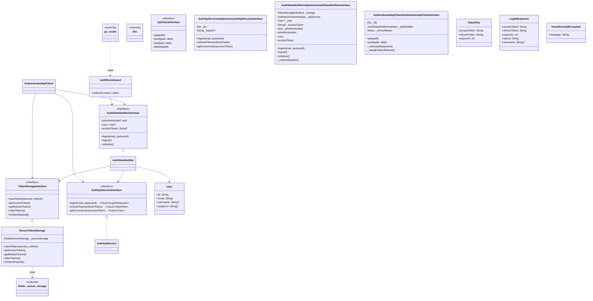
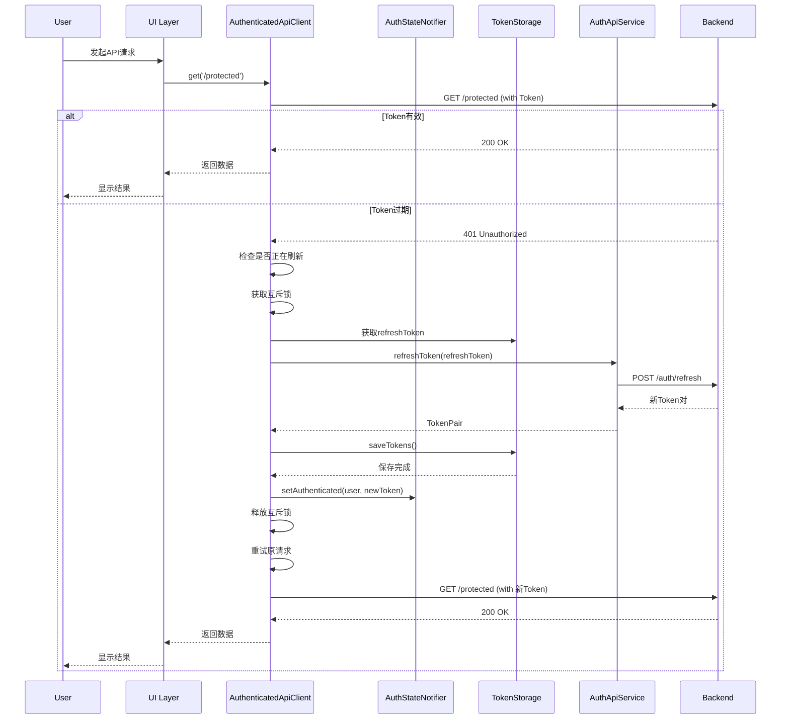
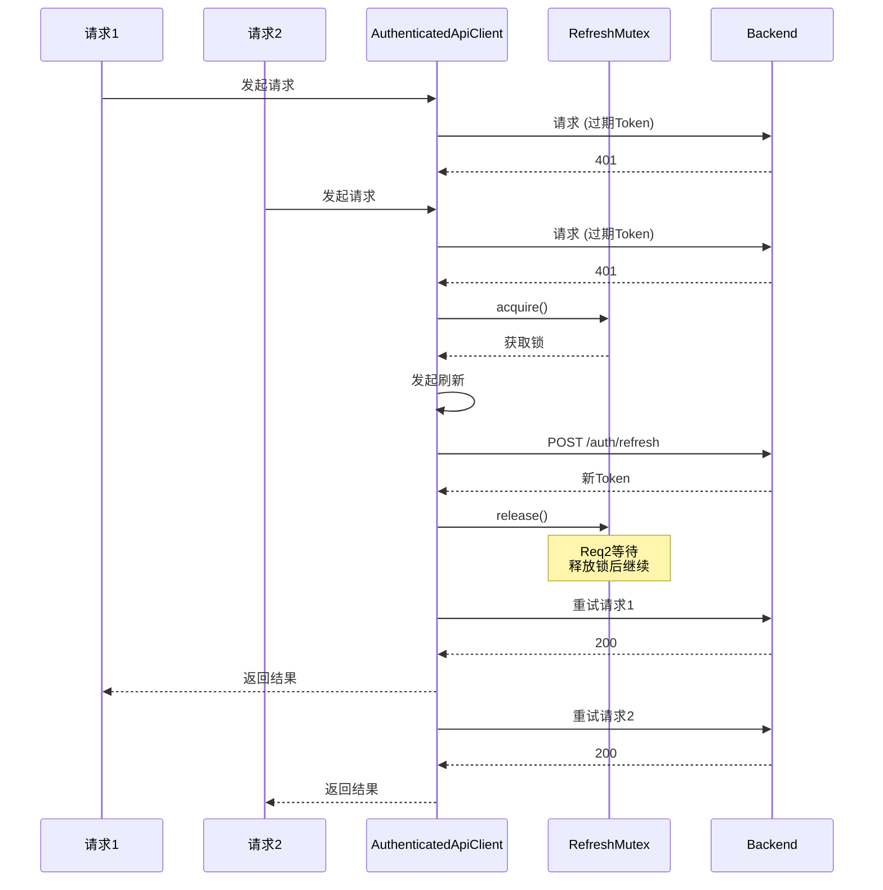
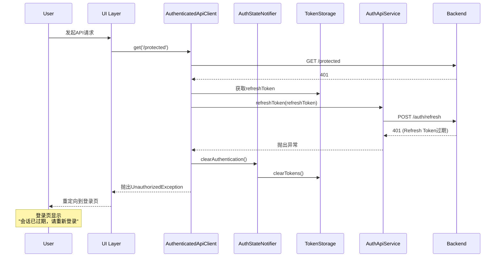

# S1-012 详细设计文档 - 认证状态管理与路由守卫

**版本**: 1.1  
**创建日期**: 2026-03-20  
**任务**: S1-012 认证状态管理与路由守卫  
**技术栈**: Flutter / Riverpod / go_router / Dio  
**预估工时**: 8h  
**依赖任务**: S1-011 (登录页面UI实现)

---

## 1. 概述

### 1.1 任务目标

实现全局认证状态管理，包括：
- 全局认证状态管理（登录状态、用户信息、Token存储）
- 路由守卫（未登录用户重定向到登录页）
- Token自动刷新机制

### 1.2 验收标准

| 验收标准 | 说明 |
|----------|------|
| AC1 | 刷新页面后保持登录状态 |
| AC2 | 未登录访问受保护页面自动跳转 |
| AC3 | Token过期前自动刷新 |

### 1.3 技术栈

| 组件 | 技术 | 说明 |
|------|------|------|
| 状态管理 | Riverpod | 全局状态管理 |
| 路由 | go_router | 声明式路由 + 路由守卫 |
| HTTP客户端 | Dio | HTTP请求 + 拦截器 |
| 本地存储 | flutter_secure_storage | 安全Token存储 |
| 依赖注入 | Riverpod Provider | 接口与实现分离 |

---

## 2. 系统架构

### 2.1 组件架构图



### 2.2 数据流图

```mermaid
flowchart TD
    subgraph 初始化阶段
        A1[App启动] --> A2[AuthStateNotifier.initialize]
        A2 --> A3{Token存在?}
        A3 -->|是| A4[恢复会话]
        A3 -->|否| A5[未登录状态]
        A4 --> A6[验证Token有效性]
        A6 --> A7{Token有效?}
        A7 -->|是| A8[设置已登录状态]
        A7 -->|否| A9[尝试刷新Token]
        A9 --> A10{刷新成功?}
        A10 -->|是| A11[保存新Token & 设置已登录]
        A10 -->|否| A12[清除Token & 未登录]
    end
    
    subgraph 登录流程
        L1[用户登录] --> L2[调用AuthStateNotifier.login]
        L2 --> L3[发送登录请求]
        L3 --> L4{登录成功?}
        L4 -->|是| L5[保存Token到存储]
        L5 --> L6[设置已登录状态]
        L6 --> L7[恢复用户信息]
        L4 -->|否| L8[显示错误]
    end
    
    subgraph API请求流程
        P1[发起API请求] --> P2[添加Access Token]
        P2 --> P3{Token过期?}
        P3 -->|否| P4[发送请求]
        P3 -->|是| P5[触发Token刷新]
        P5 --> P6[等待刷新完成]
        P6 --> P7[重试原请求]
    end
    
    subgraph 登出流程
        O1[用户登出] --> O2[清除本地Token]
        O2 --> O3[设置未登录状态]
        O3 --> O4[重定向到登录页]
    end
```



---

## 3. 接口定义

### 3.1 Token存储接口

```dart
/// Token存储接口
/// 
/// 遵循依赖倒置原则，抽象Token存储实现
abstract class TokenStorageInterface {
  /// 保存Token对
  Future<void> saveTokens({
    required String accessToken,
    required String refreshToken,
    required int expiresIn,
  });

  /// 获取Access Token
  Future<String?> getAccessToken();

  /// 获取Refresh Token
  Future<String?> getRefreshToken();

  /// 获取Token过期时间戳
  Future<DateTime?> getAccessTokenExpiry();

  /// 清除所有Token
  Future<void> clearTokens();

  /// 检查Access Token是否已过期
  Future<bool> isAccessTokenExpired();

  /// 检查是否需要刷新Token (过期前5分钟)
  Future<bool> shouldRefreshToken();
}
```

### 3.2 认证API服务接口

```dart
/// 认证API服务接口
/// 
/// 定义认证相关API的抽象，遵循依赖倒置原则
abstract class AuthApiServiceInterface {
  /// 登录
  Future<LoginResponse> login(String email, String password);

  /// 刷新Token
  Future<TokenPair> refreshToken(String refreshToken);

  /// 获取当前用户信息
  Future<User> getCurrentUser(String accessToken);
}
```

### 3.3 认证状态接口

```dart
/// 认证状态接口
/// 
/// 定义全局认证状态的抽象接口，遵循依赖倒置原则
/// 不继承任何具体实现类（如StateNotifier）
abstract class AuthStateNotifierInterface {
  /// 是否已认证
  bool get isAuthenticated;

  /// 当前用户信息
  User? get user;

  /// Access Token
  String? get accessToken;

  /// 是否正在初始化
  bool get isLoading;

  /// 错误信息
  String? get error;

  /// 初始化认证状态 (从存储恢复)
  Future<void> initialize();

  /// 登录
  Future<bool> login(String email, String password);

  /// 登出
  Future<void> logout();

  /// 设置认证状态 (内部使用)
  void setAuthenticated(User user, String accessToken);

  /// 清除认证状态 (内部使用)
  void clearAuthentication();
}
```

### 3.4 API客户端接口

```dart
/// API客户端接口
/// 
/// 定义HTTP请求的抽象，支持自动Token刷新
abstract class ApiClientInterface {
  /// GET请求
  Future<ApiResponse<T>> get<T>(
    String path, {
    Map<String, dynamic>? queryParameters,
    Options? options,
  });

  /// POST请求
  Future<ApiResponse<T>> post<T>(
    String path, {
    dynamic data,
    Map<String, dynamic>? queryParameters,
    Options? options,
  });

  /// PUT请求
  Future<ApiResponse<T>> put<T>(
    String path, {
    dynamic data,
    Map<String, dynamic>? queryParameters,
    Options? options,
  });

  /// DELETE请求
  Future<ApiResponse<T>> delete<T>(
    String path, {
    dynamic data,
    Map<String, dynamic>? queryParameters,
    Options? options,
  });

  /// 设置认证Token (用于直接API调用)
  void setAuthToken(String token);
}
```

---

## 4. 核心组件实现

### 4.1 数据模型

```dart
/// 用户模型
class User {
  final String id;
  final String email;
  final String? username;
  final String? avatarUrl;

  const User({
    required this.id,
    required this.email,
    this.username,
    this.avatarUrl,
  });

  factory User.fromJson(Map<String, dynamic> json) {
    return User(
      id: json['id'] as String,
      email: json['email'] as String,
      username: json['username'] as String?,
      avatarUrl: json['avatar_url'] as String?,
    );
  }

  Map<String, dynamic> toJson() => {
    'id': id,
    'email': email,
    'username': username,
    'avatar_url': avatarUrl,
  };
}

/// Token响应模型
class TokenPair {
  final String accessToken;
  final String refreshToken;
  final int expiresIn;

  const TokenPair({
    required this.accessToken,
    required this.refreshToken,
    required this.expiresIn,
  });

  factory TokenPair.fromJson(Map<String, dynamic> json) {
    return TokenPair(
      accessToken: json['access_token'] as String,
      refreshToken: json['refresh_token'] as String,
      expiresIn: json['expires_in'] as int,
    );
  }
}

/// 登录响应模型
class LoginResponse {
  final String accessToken;
  final String refreshToken;
  final int expiresIn;
  final String userId;
  final String? username;

  const LoginResponse({
    required this.accessToken,
    required this.refreshToken,
    required this.expiresIn,
    required this.userId,
    this.username,
  });

  factory LoginResponse.fromJson(Map<String, dynamic> json) {
    return LoginResponse(
      accessToken: json['access_token'] as String,
      refreshToken: json['refresh_token'] as String,
      expiresIn: json['expires_in'] as int,
      userId: json['user_id'] as String,
      username: json['username'] as String?,
    );
  }
}

/// 认证状态
class AuthState {
  final bool isAuthenticated;
  final bool isLoading;
  final User? user;
  final String? accessToken;
  final String? error;

  const AuthState({
    this.isAuthenticated = false,
    this.isLoading = false,
    this.user,
    this.accessToken,
    this.error,
  });

  AuthState copyWith({
    bool? isAuthenticated,
    bool? isLoading,
    User? user,
    String? accessToken,
    String? error,
  }) {
    return AuthState(
      isAuthenticated: isAuthenticated ?? this.isAuthenticated,
      isLoading: isLoading ?? this.isLoading,
      user: user ?? this.user,
      accessToken: accessToken ?? this.accessToken,
      error: error,
    );
  }

  factory AuthState.initial() => const AuthState();

  factory AuthState.loading() => const AuthState(isLoading: true);

  factory AuthState.authenticated(User user, String accessToken) => AuthState(
        isAuthenticated: true,
        user: user,
        accessToken: accessToken,
      );

  factory AuthState.error(String message) => AuthState(error: message);
}
```

### 4.2 API异常定义

```dart
/// 认证异常
/// 
/// 当认证失败时抛出
class UnauthorizedException implements Exception {
  final String message;

  const UnauthorizedException([this.message = 'Unauthorized']);

  @override
  String toString() => 'UnauthorizedException: $message';
}

/// API异常
class ApiException implements Exception {
  final String message;
  final int? statusCode;

  const ApiException({
    required this.message,
    this.statusCode,
  });

  @override
  String toString() => 'ApiException: $message (status: $statusCode)';
}
```

### 4.3 Token存储实现

```dart
/// 安全Token存储实现
/// 
/// 使用 flutter_secure_storage 存储Token
class SecureTokenStorage implements TokenStorageInterface {
  static const _accessTokenKey = 'access_token';
  static const _refreshTokenKey = 'refresh_token';
  static const _expiryKey = 'access_token_expiry';

  final FlutterSecureStorage _secureStorage;

  SecureTokenStorage({FlutterSecureStorage? secureStorage})
      : _secureStorage = secureStorage ?? const FlutterSecureStorage(
          aOptions: AndroidOptions(encryptedSharedPreferences: true),
          iOptions: IOSOptions(accessibility: KeychainAccessibility.first_unlock),
        );

  @override
  Future<void> saveTokens({
    required String accessToken,
    required String refreshToken,
    required int expiresIn,
  }) async {
    // 计算过期时间
    final expiryTime = DateTime.now().add(Duration(seconds: expiresIn));
    
    await Future.wait([
      _secureStorage.write(key: _accessTokenKey, value: accessToken),
      _secureStorage.write(key: _refreshTokenKey, value: refreshToken),
      _secureStorage.write(
        key: _expiryKey, 
        value: expiryTime.toIso8601String(),
      ),
    ]);
  }

  @override
  Future<String?> getAccessToken() async {
    return _secureStorage.read(key: _accessTokenKey);
  }

  @override
  Future<String?> getRefreshToken() async {
    return _secureStorage.read(key: _refreshTokenKey);
  }

  @override
  Future<DateTime?> getAccessTokenExpiry() async {
    final expiryStr = await _secureStorage.read(key: _expiryKey);
    if (expiryStr == null) return null;
    return DateTime.tryParse(expiryStr);
  }

  @override
  Future<void> clearTokens() async {
    await Future.wait([
      _secureStorage.delete(key: _accessTokenKey),
      _secureStorage.delete(key: _refreshTokenKey),
      _secureStorage.delete(key: _expiryKey),
    ]);
  }

  @override
  Future<bool> isAccessTokenExpired() async {
    final expiry = await getAccessTokenExpiry();
    if (expiry == null) return true;
    return DateTime.now().isAfter(expiry);
  }

  @override
  Future<bool> shouldRefreshToken() async {
    final expiry = await getAccessTokenExpiry();
    if (expiry == null) return true;
    
    // 提前5分钟刷新
    final refreshThreshold = DateTime.now().add(const Duration(minutes: 5));
    return refreshThreshold.isAfter(expiry);
  }
}
```

### 4.4 认证API服务实现

```dart
/// 认证API服务实现
/// 
/// 实现AuthApiServiceInterface接口
class AuthApiService implements AuthApiServiceInterface {
  final Dio _dio;
  final String _baseUrl;

  AuthApiService({
    required Dio dio,
    required String baseUrl,
  })  : _dio = dio,
        _baseUrl = baseUrl;

  @override
  Future<LoginResponse> login(String email, String password) async {
    final response = await _dio.post(
      '$_baseUrl/api/v1/auth/login',
      data: {'email': email, 'password': password},
    );
    
    return LoginResponse.fromJson(response.data['data']);
  }

  @override
  Future<TokenPair> refreshToken(String refreshToken) async {
    final response = await _dio.post(
      '$_baseUrl/api/v1/auth/refresh',
      data: {'refresh_token': refreshToken},
    );
    
    return TokenPair.fromJson(response.data['data']);
  }

  @override
  Future<User> getCurrentUser(String accessToken) async {
    final response = await _dio.get(
      '$_baseUrl/api/v1/auth/me',
      options: Options(headers: {'Authorization': 'Bearer $accessToken'}),
    );
    
    return User.fromJson(response.data['data']);
  }
}
```

### 4.5 认证状态管理实现

```dart
/// 认证状态管理器
/// 
/// 全局认证状态管理，使用Riverpod StateNotifier
/// 实现AuthStateNotifierInterface接口，依赖抽象而非具体实现
class AuthStateNotifier extends StateNotifier<AuthState> 
    implements AuthStateNotifierInterface {
  
  final TokenStorageInterface _tokenStorage;
  final AuthApiServiceInterface _authApiService;
  
  AuthStateNotifier({
    required TokenStorageInterface tokenStorage,
    required AuthApiServiceInterface authApiService,
  })  : _tokenStorage = tokenStorage,
        _authApiService = authApiService,
        super(AuthState.initial());

  @override
  bool get isAuthenticated => state.isAuthenticated;

  @override
  User? get user => state.user;

  @override
  String? get accessToken => state.accessToken;

  @override
  bool get isLoading => state.isLoading;

  @override
  String? get error => state.error;

  /// 初始化认证状态
  /// 
  /// 从安全存储恢复会话
  @override
  Future<void> initialize() async {
    if (state.isLoading) return;
    
    state = AuthState.loading();

    try {
      final accessToken = await _tokenStorage.getAccessToken();
      final refreshToken = await _tokenStorage.getRefreshToken();

      if (accessToken == null || refreshToken == null) {
        state = AuthState.initial();
        return;
      }

      // 检查Token是否需要刷新
      if (await _tokenStorage.shouldRefreshToken()) {
        final success = await _refreshTokens();
        if (!success) {
          await _tokenStorage.clearTokens();
          state = AuthState.initial();
          return;
        }
      }

      // 获取新的access token
      final currentAccessToken = await _tokenStorage.getAccessToken();
      if (currentAccessToken == null) {
        state = AuthState.initial();
        return;
      }

      // 获取用户信息
      final user = await _fetchCurrentUser(currentAccessToken);
      if (user != null) {
        state = AuthState.authenticated(user, currentAccessToken);
      } else {
        await _tokenStorage.clearTokens();
        state = AuthState.initial();
      }
    } catch (e) {
      await _tokenStorage.clearTokens();
      state = AuthState.initial();
    }
  }

  /// 登录
  @override
  Future<bool> login(String email, String password) async {
    state = AuthState.loading();

    try {
      final response = await _authApiService.login(email, password);
      
      await _tokenStorage.saveTokens(
        accessToken: response.accessToken,
        refreshToken: response.refreshToken,
        expiresIn: response.expiresIn,
      );

      final user = User(
        id: response.userId,
        email: email,
        username: response.username,
      );

      state = AuthState.authenticated(user, response.accessToken);
      return true;
    } catch (e) {
      state = AuthState.error(e.toString());
      return false;
    }
  }

  /// 登出
  @override
  Future<void> logout() async {
    await _tokenStorage.clearTokens();
    state = AuthState.initial();
  }

  /// 设置认证状态
  @override
  void setAuthenticated(User user, String accessToken) {
    state = AuthState.authenticated(user, accessToken);
  }

  /// 清除认证状态
  @override
  void clearAuthentication() {
    _tokenStorage.clearTokens();
    state = AuthState.initial();
  }

  /// 刷新Token
  Future<bool> _refreshTokens() async {
    try {
      final refreshToken = await _tokenStorage.getRefreshToken();
      if (refreshToken == null) return false;

      final response = await _authApiService.refreshToken(refreshToken);
      
      await _tokenStorage.saveTokens(
        accessToken: response.accessToken,
        refreshToken: response.refreshToken,
        expiresIn: response.expiresIn,
      );

      return true;
    } catch (e) {
      return false;
    }
  }

  /// 获取当前用户信息
  Future<User?> _fetchCurrentUser(String accessToken) async {
    try {
      return await _authApiService.getCurrentUser(accessToken);
    } catch (e) {
      return null;
    }
  }
}
```

### 4.6 Token刷新拦截器

```dart
/// Token刷新互斥锁
/// 
/// 确保并发请求时只刷新一次Token
class RefreshMutex {
  bool _isRefreshing = false;
  final List<Completer<void>> _waiters = [];

  Future<void> acquire() async {
    if (!_isRefreshing) {
      _isRefreshing = true;
      return;
    }

    final completer = Completer<void>();
    _waiters.add(completer);
    await completer.future;
  }

  void release() {
    if (_waiters.isNotEmpty) {
      final completer = _waiters.removeAt(0);
      completer.complete();
    } else {
      _isRefreshing = false;
    }
  }
}

/// 带Token自动刷新的API客户端
class AuthenticatedApiClient implements ApiClientInterface {
  final Dio _dio;
  final AuthStateNotifierInterface _authNotifier;
  final TokenStorageInterface _tokenStorage;
  final AuthApiServiceInterface _authApiService;
  final RefreshMutex _refreshMutex = RefreshMutex();

  static const _maxRetries = 1;

  AuthenticatedApiClient({
    required Dio dio,
    required AuthStateNotifierInterface authNotifier,
    required TokenStorageInterface tokenStorage,
    required AuthApiServiceInterface authApiService,
  })  : _dio = dio,
        _authNotifier = authNotifier,
        _tokenStorage = tokenStorage,
        _authApiService = authApiService;

  @override
  Future<ApiResponse<T>> get<T>(
    String path, {
    Map<String, dynamic>? queryParameters,
    Options? options,
  }) async {
    return _request<T>(() => _dio.get(
      path,
      queryParameters: queryParameters,
      options: _applyAuth(options),
    ));
  }

  @override
  Future<ApiResponse<T>> post<T>(
    String path, {
    dynamic data,
    Map<String, dynamic>? queryParameters,
    Options? options,
  }) async {
    return _request<T>(() => _dio.post(
      path,
      data: data,
      queryParameters: queryParameters,
      options: _applyAuth(options),
    ));
  }

  @override
  Future<ApiResponse<T>> put<T>(
    String path, {
    dynamic data,
    Map<String, dynamic>? queryParameters,
    Options? options,
  }) async {
    return _request<T>(() => _dio.put(
      path,
      data: data,
      queryParameters: queryParameters,
      options: _applyAuth(options),
    ));
  }

  @override
  Future<ApiResponse<T>> delete<T>(
    String path, {
    dynamic data,
    Map<String, dynamic>? queryParameters,
    Options? options,
  }) async {
    return _request<T>(() => _dio.delete(
      path,
      data: data,
      queryParameters: queryParameters,
      options: _applyAuth(options),
    ));
  }

  @override
  void setAuthToken(String token) {
    _dio.options.headers['Authorization'] = 'Bearer $token';
  }

  Options _applyAuth(Options? options) {
    final accessToken = _authNotifier.accessToken;
    if (accessToken == null) return options ?? Options();
    
    return (options ?? Options()).copyWith(
      headers: {
        ...?options?.headers,
        'Authorization': 'Bearer $accessToken',
      },
    );
  }

  Future<ApiResponse<T>> _request<T>(
    Future<Response> Function() requestFn,
  ) async {
    try {
      return await requestFn();
    } on DioException catch (e) {
      if (e.response?.statusCode == 401) {
        return _handleUnauthorized(requestFn);
      }
      rethrow;
    }
  }

  Future<ApiResponse<T>> _handleUnauthorized<T>(
    Future<Response> Function() requestFn,
  ) async {
    await _refreshMutex.acquire();
    
    try {
      // 再次检查是否已刷新
      final currentToken = await _tokenStorage.getAccessToken();
      if (currentToken != null && !await _tokenStorage.isAccessTokenExpired()) {
        _refreshMutex.release();
        return _retryRequest<T>(requestFn);
      }

      // 尝试刷新Token
      final refreshToken = await _tokenStorage.getRefreshToken();
      if (refreshToken == null) {
        _refreshMutex.release();
        _authNotifier.clearAuthentication();
        throw const UnauthorizedException('No refresh token available');
      }

      final response = await _authApiService.refreshToken(refreshToken);
      
      await _tokenStorage.saveTokens(
        accessToken: response.accessToken,
        refreshToken: response.refreshToken,
        expiresIn: response.expiresIn,
      );

      _refreshMutex.release();

      // 更新auth状态
      _authNotifier.setAuthenticated(
        _authNotifier.user!,
        response.accessToken,
      );

      // 重试原请求
      return _retryRequest<T>(requestFn);
    } catch (e) {
      _refreshMutex.release();
      _authNotifier.clearAuthentication();
      rethrow;
    }
  }

  Future<ApiResponse<T>> _retryRequest<T>(
    Future<Response> Function() requestFn,
  ) async {
    return await requestFn();
  }
}
```

---

## 5. 路由守卫

### 5.1 路由配置

```dart
/// 应用路由路径常量
class AppRoutes {
  AppRoutes._();

  /// 启动页
  static const String splash = '/';

  /// 登录页
  static const String login = '/login';

  /// 注册页
  static const String register = '/register';

  /// 首页
  static const String home = '/home';

  /// 工作台列表
  static const String workbenches = '/workbenches';

  /// 工作台详情
  static String workbenchDetail(String id) => '/workbenches/$id';

  /// 设置页
  static const String settings = '/settings';
}

/// 路由名称常量
class RouteNames {
  RouteNames._();

  static const String splash = 'splash';
  static const String login = 'login';
  static const String register = 'register';
  static const String home = 'home';
  static const String workbenches = 'workbenches';
  static const String workbenchDetail = 'workbench-detail';
  static const String settings = 'settings';
}

/// 公共路由 (无需认证)
final publicRoutes = [
  AppRoutes.login,
  AppRoutes.register,
];

/// 受保护路由 (需要认证)
final protectedRoutes = [
  AppRoutes.home,
  AppRoutes.workbenches,
  AppRoutes.settings,
];
```

### 5.2 路由守卫实现

```dart
/// 路由守卫
/// 
/// 检查用户认证状态，未登录用户重定向到登录页
class AuthRouteGuard {
  final AuthStateNotifierInterface _authNotifier;

  AuthRouteGuard({required AuthStateNotifierInterface authNotifier})
      : _authNotifier = authNotifier;

  /// 路由重定向处理
  /// 
  /// 返回 null 表示不重定向，返回路径表示需要重定向
  String? redirect(BuildContext context, GoRouterState state) {
    final isAuthenticated = _authNotifier.isAuthenticated;
    final isLoading = _authNotifier.isLoading;
    final currentPath = state.uri.path;

    // 初始化中，不重定向
    if (isLoading) {
      return null;
    }

    // 公共路由
    if (publicRoutes.contains(currentPath)) {
      // 已登录用户访问公共路由，重定向到首页
      if (isAuthenticated) {
        return AppRoutes.home;
      }
      return null;
    }

    // 受保护路由
    if (protectedRoutes.contains(currentPath) || 
        currentPath.startsWith('/workbenches/')) {
      // 未登录，重定向到登录页
      if (!isAuthenticated) {
        return '${AppRoutes.login}?redirect=${Uri.encodeComponent(currentPath)}';
      }
      return null;
    }

    return null;
  }
}

/// 路由配置Provider
final routerProvider = Provider<GoRouter>((ref) {
  final authNotifier = ref.watch(authStateProvider.notifier);
  final authRouteGuard = AuthRouteGuard(authNotifier: authNotifier);

  return GoRouter(
    initialLocation: AppRoutes.splash,
    debugLogDiagnostics: true,
    refreshListenable: GoRouterRefreshStream(
      ref.watch(authStateProvider.select((s) => s.isAuthenticated)),
    ),
    redirect: (context, state) {
      return authRouteGuard.redirect(context, state);
    },
    routes: [
      // 启动页
      GoRoute(
        path: AppRoutes.splash,
        name: RouteNames.splash,
        builder: (context, state) => const SplashScreen(),
      ),

      // 公共路由
      GoRoute(
        path: AppRoutes.login,
        name: RouteNames.login,
        builder: (context, state) {
          final redirect = state.uri.queryParameters['redirect'];
          return LoginScreen(redirectPath: redirect);
        },
      ),
      GoRoute(
        path: AppRoutes.register,
        name: RouteNames.register,
        builder: (context, state) => const RegisterScreen(),
      ),

      // 受保护路由
      GoRoute(
        path: AppRoutes.home,
        name: RouteNames.home,
        builder: (context, state) => const HomeScreen(),
      ),
      GoRoute(
        path: AppRoutes.workbenches,
        name: RouteNames.workbenches,
        builder: (context, state) => const WorkbenchListScreen(),
      ),
      GoRoute(
        path: '/workbenches/:id',
        name: RouteNames.workbenchDetail,
        builder: (context, state) {
          final id = state.pathParameters['id']!;
          return WorkbenchDetailScreen(workbenchId: id);
        },
      ),
      GoRoute(
        path: AppRoutes.settings,
        name: RouteNames.settings,
        builder: (context, state) => const SettingsScreen(),
      ),
    ],

    errorBuilder: (context, state) => ErrorScreen(
      error: 'Page not found: ${state.uri.path}',
    ),
  );
});

/// 将Stream转换为Listenable
/// 
/// 用于go_router的refreshListenable参数
class GoRouterRefreshStream extends ChangeNotifier {
  GoRouterRefreshStream(Stream<dynamic> stream) {
    // 不要在构造函数中调用notifyListeners()
    _subscription = stream.asBroadcastStream().listen((_) => notifyListeners());
  }

  late final StreamSubscription<dynamic> _subscription;

  @override
  void dispose() {
    _subscription.cancel();
    super.dispose();
  }
}
```

---

## 6. Provider配置

### 6.1 与现有LoginProvider的整合

**重要说明**: 本设计将替代现有的`LoginProvider`，实现统一的认证状态管理。

旧的`LoginNotifier`和`LoginProvider`将被废弃，取而代之的是统一的`AuthStateNotifier`和`authStateProvider`。

迁移步骤：
1. 现有的`LoginProvider`代码保持不变（向后兼容）
2. 新的登录流程使用`AuthStateNotifier.login()`
3. 后续迭代中逐步移除旧的`LoginProvider`

### 6.2 完整Provider树

```dart
/// Token存储Provider
final tokenStorageProvider = Provider<TokenStorageInterface>((ref) {
  return SecureTokenStorage();
});

/// Auth API服务Provider (接口)
final authApiServiceProvider = Provider<AuthApiServiceInterface>((ref) {
  final dio = ref.watch(dioProvider);
  const baseUrl = String.fromEnvironment('API_BASE_URL', defaultValue: 'http://localhost:8080');
  return AuthApiService(dio: dio, baseUrl: baseUrl);
});

/// Dio实例Provider
final dioProvider = Provider<Dio>((ref) {
  final dio = Dio(BaseOptions(
    connectTimeout: const Duration(seconds: 30),
    receiveTimeout: const Duration(seconds: 30),
    headers: {
      'Content-Type': 'application/json',
      'Accept': 'application/json',
    },
  ));

  // 添加日志拦截器 (开发环境)
  dio.interceptors.add(LogInterceptor(
    requestBody: true,
    responseBody: true,
  ));

  return dio;
});

/// 认证状态Provider
final authStateProvider = StateNotifierProvider<AuthStateNotifier, AuthState>((ref) {
  final tokenStorage = ref.watch(tokenStorageProvider);
  final authApiService = ref.watch(authApiServiceProvider);

  return AuthStateNotifier(
    tokenStorage: tokenStorage,
    authApiService: authApiService,
  );
});

/// API客户端Provider (返回接口类型)
final apiClientProvider = Provider<ApiClientInterface>((ref) {
  final dio = ref.watch(dioProvider);
  final authNotifier = ref.watch(authStateProvider.notifier);
  final tokenStorage = ref.watch(tokenStorageProvider);
  final authApiService = ref.watch(authApiServiceProvider);

  return AuthenticatedApiClient(
    dio: dio,
    authNotifier: authNotifier,
    tokenStorage: tokenStorage,
    authApiService: authApiService,
  );
});

/// 便捷的认证状态访问Provider
final isAuthenticatedProvider = Provider<bool>((ref) {
  return ref.watch(authStateProvider).isAuthenticated;
});

final currentUserProvider = Provider<User?>((ref) {
  return ref.watch(authStateProvider).user;
});
```

### 6.3 初始化流程

```dart
/// 应用初始化Widget
class AppInitializer extends ConsumerStatefulWidget {
  const AppInitializer({super.key});

  @override
  ConsumerState<AppInitializer> createState() => _AppInitializerState();
}

class _AppInitializerState extends ConsumerState<AppInitializer> {
  @override
  void initState() {
    super.initState();
    // 应用启动时初始化认证状态
    WidgetsBinding.instance.addPostFrameCallback((_) {
      ref.read(authStateProvider.notifier).initialize();
    });
  }

  @override
  Widget build(BuildContext context) {
    final authState = ref.watch(authStateProvider);

    if (authState.isLoading) {
      return const SplashScreen();
    }

    return widget.child;
  }
}
```

---

## 7. Token刷新机制序列图

### 7.1 正常Token刷新流程



### 7.2 并发请求Token刷新



### 7.3 Refresh Token也过期流程



---

## 8. UI设计

### 8.1 启动页/Splash Screen

```
┌─────────────────────────────────────────────┐
│                                             │
│                                             │
│                                             │
│              🧪 Kayak                      │
│                                             │
│                                             │
│                                             │
│           [  Loading...  ]                  │
│                                             │
└─────────────────────────────────────────────┘
```

### 8.2 登录页 (认证后重定向)

登录成功后自动跳转到原始请求页面：

```dart
class LoginScreen extends ConsumerWidget {
  /// 重定向路径 (登录成功后跳转)
  final String? redirectPath;

  const LoginScreen({super.key, this.redirectPath});

  @override
  Widget build(BuildContext context, WidgetRef ref) {
    // ... 登录表单

    void onLoginSuccess() {
      if (redirectPath != null) {
        context.go(redirectPath);
      } else {
        context.go(AppRoutes.home);
      }
    }
  }
}
```

---

## 9. 文件结构

```
kayak-frontend/lib/
├── core/
│   ├── router/
│   │   ├── app_router.dart              # 路由配置 + 守卫
│   │   └── route_guard.dart             # 路由守卫
│   ├── api/
│   │   ├── api_client.dart              # API客户端接口
│   │   ├── authenticated_client.dart    # 带Token刷新的客户端
│   │   └── api_exceptions.dart          # API异常定义 (新增)
│   └── storage/
│       └── token_storage.dart           # Token存储接口和实现
│
├── features/
│   └── auth/
│       ├── providers/
│       │   └── auth_provider.dart       # 认证状态Provider
│       ├── models/
│       │   ├── user.dart                # 用户模型
│       │   ├── auth_state.dart          # 认证状态模型
│       │   └── login_response.dart      # 登录响应模型 (新增)
│       ├── services/
│       │   └── auth_service.dart        # 认证API服务接口和实现
│       └── interfaces/
│           └── auth_interfaces.dart     # 认证相关接口定义 (新增)
│
├── screens/
│   ├── splash/
│   │   └── splash_screen.dart          # 启动页
│   ├── login/
│   │   └── login_screen.dart           # 登录页 (已有，需更新)
│   └── home/
│       └── home_screen.dart            # 首页
│
└── app.dart                            # 应用入口 (更新)
```

---

## 10. 测试要点

### 10.1 单元测试

| 测试项 | 说明 |
|--------|------|
| TokenStorage | 测试Token存储和读取 |
| AuthStateNotifier | 测试状态转换 |
| RefreshMutex | 测试并发控制 |

### 10.2 集成测试

| 测试项 | 说明 |
|--------|------|
| 页面刷新后会话恢复 | 模拟App重启，验证Token恢复 |
| 路由守卫重定向 | 验证未登录访问受保护页面 |
| Token自动刷新 | 模拟401，验证自动刷新和重试 |
| 登出流程 | 验证Token清除和状态更新 |

---

## 11. 风险与注意事项

1. **Token安全**: 使用flutter_secure_storage保证Token安全
2. **并发刷新**: 使用互斥锁防止重复刷新
3. **Refresh Token过期**: 需要引导用户重新登录
4. **路由循环**: 避免登录页重定向到登录页
5. **初始化时序**: 确保认证状态初始化完成后再渲染页面
6. **LoginProvider迁移**: 统一使用AuthStateNotifier，废弃旧的LoginNotifier

---

**文档结束**
