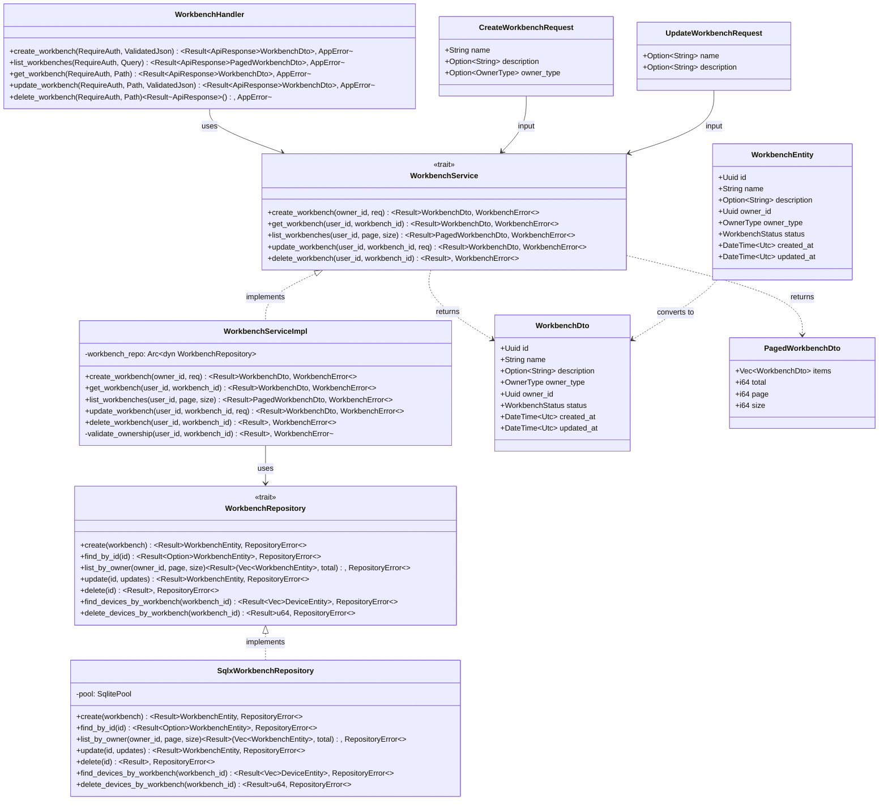
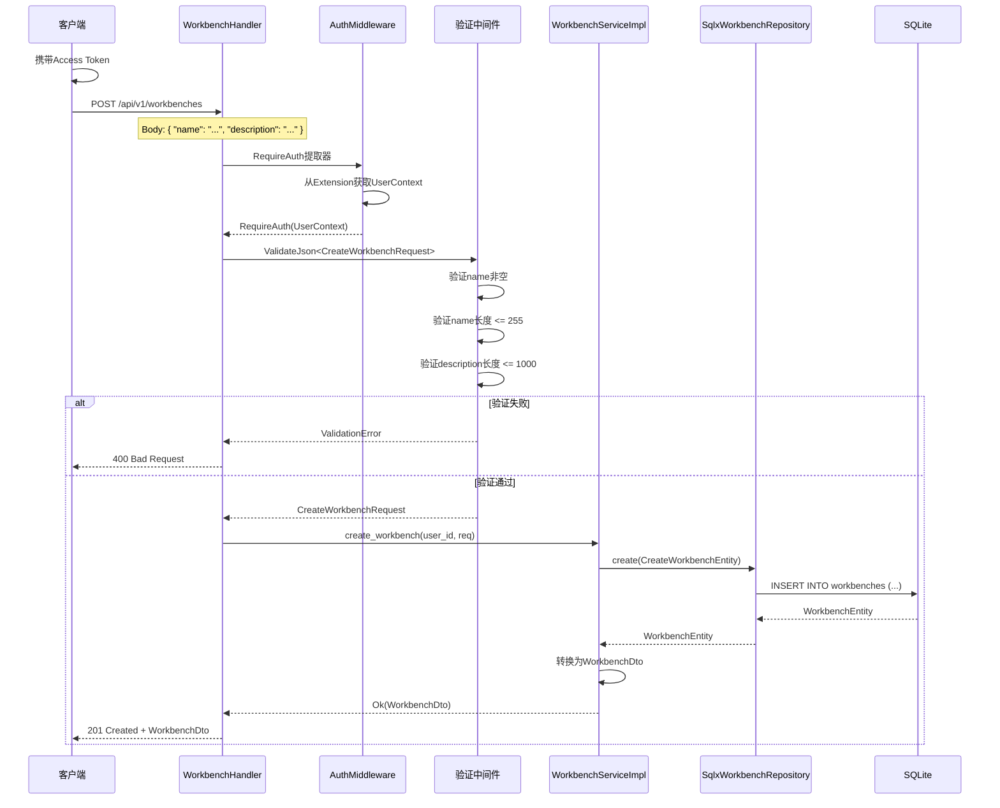
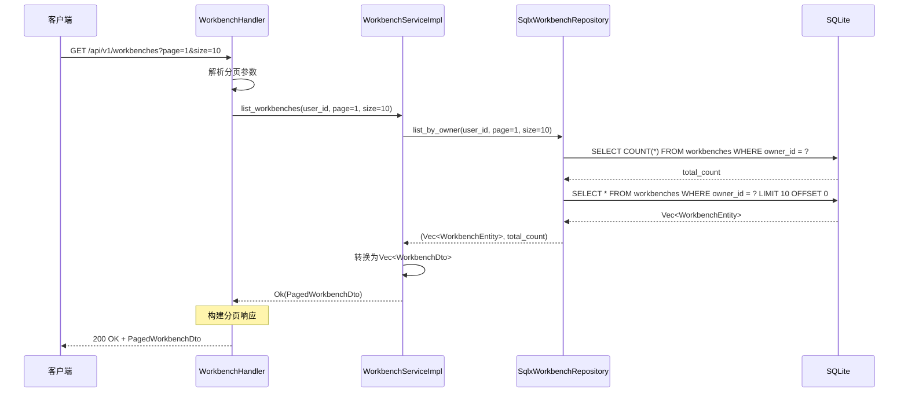
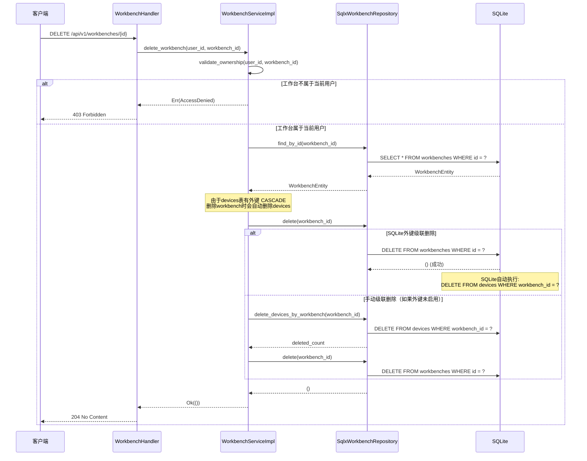
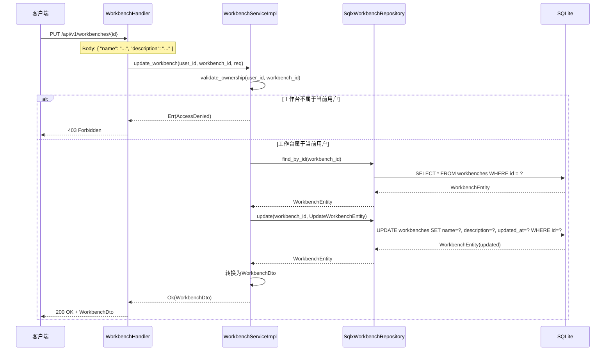

# S1-013: 工作台CRUD API - 详细设计文档

**任务编号**: S1-013  
**任务名称**: 工作台CRUD API (Workbench CRUD API)  
**版本**: 1.0  
**日期**: 2026-03-20  
**状态**: Draft  
**依赖**: S1-009 (JWT认证中间件), S1-003 (SQLite数据库Schema设计), S1-004 (API路由与错误处理框架)

---

## 目录

1. [概述](#1-概述)
2. [设计目标](#2-设计目标)
3. [接口定义（依赖倒置原则）](#3-接口定义依赖倒置原则)
4. [UML设计图](#4-uml设计图)
5. [API规范](#5-api规范)
6. [数据模型](#6-数据模型)
7. [验证规则](#7-验证规则)
8. [错误处理](#8-错误处理)
9. [级联删除设计](#9-级联删除设计)
10. [实现细节](#10-实现细节)
11. [文件结构](#11-文件结构)
12. [测试要点](#12-测试要点)

---

## 1. 概述

### 1.1 文档目的

本文档定义Kayak系统的工作台CRUD API详细设计，包括工作台的创建、查询、更新、删除等核心功能。

### 1.2 功能范围

- **工作台创建**: POST /api/v1/workbenches - 创建新的工作台
- **工作台列表查询**: GET /api/v1/workbenches - 分页查询用户的工作台列表
- **工作台详情查询**: GET /api/v1/workbenches/{id} - 获取单个工作台详情
- **工作台更新**: PUT /api/v1/workbenches/{id} - 更新工作台名称、描述等
- **工作台删除**: DELETE /api/v1/workbenches/{id} - 删除工作台（级联删除设备）

### 1.3 验收标准映射

| 验收标准 | 实现组件 | 测试覆盖 |
|---------|---------|---------|
| 工作台CRUD完整实现 | `WorkbenchHandler` | TC-S1-013-01 ~ TC-S1-013-19 |
| 删除工作台级联删除设备 | `WorkbenchService::delete_workbench()` | TC-S1-013-30, TC-S1-013-31 |
| 分页查询支持page/size参数 | `WorkbenchRepository::list_by_owner()` | TC-S1-013-08 ~ TC-S1-013-10 |
| 用户授权(只能访问自己的) | `WorkbenchService` 所有权检查 | TC-S1-013-14, TC-S1-013-18, TC-S1-013-23, TC-S1-013-24 |

### 1.4 参考文档

- [架构设计](/home/hzhou/workspace/kayak/arch.md) - 第4.2.2节 仪器管理模块
- [S1-003 数据库Schema设计](./S1-003_design.md) - Workbench表结构
- [S1-009 JWT认证中间件设计](./S1-009_design.md) - RequireAuth提取器
- [S1-004 API路由与错误处理框架](./S1-004_design.md) - 统一响应格式
- [S1-013 测试用例](./S1-013_test_cases.md) - 41个测试用例详情

---

## 2. 设计目标

### 2.1 功能性目标

1. **工作台创建**: 用户可以创建新工作台，设置名称和描述
2. **工作台查询**: 支持分页查询用户拥有的工作台列表
3. **工作台详情**: 获取单个工作台的完整信息
4. **工作台更新**: 更新工作台的名称、描述
5. **工作台删除**: 删除工作台并级联删除其所有设备
6. **所有权保护**: 用户只能访问自己的资源

### 2.2 非功能性目标

1. **安全性**: 所有端点需要JWT认证，用户隔离数据
2. **性能**: 列表查询 < 100ms，分页减少数据传输
3. **可测试性**: 接口抽象便于Mock测试
4. **一致性**: 遵循S1-004的统一API响应格式

---

## 3. 接口定义（依赖倒置原则）

根据依赖倒置原则，先定义抽象接口（traits），再实现具体类型。

### 3.1 核心接口概览

```rust
// src/services/workbench/mod.rs

/// 工作台服务接口
#[async_trait]
pub trait WorkbenchService: Send + Sync {
    async fn create_workbench(&self, owner_id: Uuid, req: CreateWorkbenchRequest) -> Result<WorkbenchDto, WorkbenchError>;
    async fn get_workbench(&self, user_id: Uuid, workbench_id: Uuid) -> Result<WorkbenchDto, WorkbenchError>;
    async fn list_workbenches(&self, user_id: Uuid, page: i64, size: i64) -> Result<PagedWorkbenchDto, WorkbenchError>;
    async fn update_workbench(&self, user_id: Uuid, workbench_id: Uuid, req: UpdateWorkbenchRequest) -> Result<WorkbenchDto, WorkbenchError>;
    async fn delete_workbench(&self, user_id: Uuid, workbench_id: Uuid) -> Result<(), WorkbenchError>;
}

/// 工作台数据访问接口
#[async_trait]
pub trait WorkbenchRepository: Send + Sync {
    async fn create(&self, workbench: &CreateWorkbenchEntity) -> Result<WorkbenchEntity, RepositoryError>;
    async fn find_by_id(&self, id: Uuid) -> Result<Option<WorkbenchEntity>, RepositoryError>;
    async fn list_by_owner(&self, owner_id: Uuid, page: i64, size: i64) -> Result<(Vec<WorkbenchEntity>, i64), RepositoryError>;
    async fn update(&self, id: Uuid, updates: &UpdateWorkbenchEntity) -> Result<WorkbenchEntity, RepositoryError>;
    async fn delete(&self, id: Uuid) -> Result<(), RepositoryError>;
    async fn find_devices_by_workbench(&self, workbench_id: Uuid) -> Result<Vec<DeviceEntity>, RepositoryError>;
    async fn delete_devices_by_workbench(&self, workbench_id: Uuid) -> Result<u64, RepositoryError>;
}
```

### 3.2 WorkbenchService Trait

```rust
/// 工作台服务接口
/// 
/// 负责工作台的业务逻辑处理
#[async_trait]
pub trait WorkbenchService: Send + Sync {
    /// 创建工作台
    async fn create_workbench(&self, owner_id: Uuid, req: CreateWorkbenchRequest) -> Result<WorkbenchDto, WorkbenchError>;

    /// 获取工作台详情
    async fn get_workbench(&self, user_id: Uuid, workbench_id: Uuid) -> Result<WorkbenchDto, WorkbenchError>;

    /// 分页查询工作台列表
    async fn list_workbenches(&self, user_id: Uuid, page: i64, size: i64) -> Result<PagedWorkbenchDto, WorkbenchError>;

    /// 更新工作台
    async fn update_workbench(&self, user_id: Uuid, workbench_id: Uuid, req: UpdateWorkbenchRequest) -> Result<WorkbenchDto, WorkbenchError>;

    /// 删除工作台（级联删除设备）
    async fn delete_workbench(&self, user_id: Uuid, workbench_id: Uuid) -> Result<(), WorkbenchError>;
}

/// 工作台错误类型
#[derive(Debug, Error)]
pub enum WorkbenchError {
    #[error("Workbench not found")]
    NotFound,
    
    #[error("Access denied: you do not own this workbench")]
    AccessDenied,
    
    #[error("Validation error: {0}")]
    ValidationError(String),
    
    #[error("Internal error: {0}")]
    Internal(String),
}

impl From<WorkbenchError> for AppError {
    fn from(err: WorkbenchError) -> Self {
        match err {
            WorkbenchError::NotFound => AppError::NotFound(err.to_string()),
            WorkbenchError::AccessDenied => AppError::Forbidden(err.to_string()),
            WorkbenchError::ValidationError(msg) => AppError::BadRequest(msg),
            WorkbenchError::Internal(msg) => AppError::InternalError(msg),
        }
    }
}
```

### 3.3 WorkbenchRepository Trait

```rust
/// 工作台数据访问接口
/// 
/// 负责工作台数据的持久化操作
#[async_trait]
pub trait WorkbenchRepository: Send + Sync {
    /// 创建工作台
    async fn create(&self, workbench: &CreateWorkbenchEntity) -> Result<WorkbenchEntity, RepositoryError>;

    /// 根据ID查找工作台
    async fn find_by_id(&self, id: Uuid) -> Result<Option<WorkbenchEntity>, RepositoryError>;

    /// 按所有者分页查询工作台
    async fn list_by_owner(&self, owner_id: Uuid, page: i64, size: i64) -> Result<(Vec<WorkbenchEntity>, i64), RepositoryError>;

    /// 更新工作台
    async fn update(&self, id: Uuid, updates: &UpdateWorkbenchEntity) -> Result<WorkbenchEntity, RepositoryError>;

    /// 删除工作台
    async fn delete(&self, id: Uuid) -> Result<(), RepositoryError>;

    /// 查询工作台下的所有设备
    async fn find_devices_by_workbench(&self, workbench_id: Uuid) -> Result<Vec<DeviceEntity>, RepositoryError>;

    /// 删除工作台下的所有设备
    async fn delete_devices_by_workbench(&self, workbench_id: Uuid) -> Result<u64, RepositoryError>;
}

/// 创建工作台实体
#[derive(Debug, Clone)]
pub struct CreateWorkbenchEntity {
    pub name: String,
    pub description: Option<String>,
    pub owner_id: Uuid,
    pub owner_type: OwnerType,
}

/// 更新工作台实体
#[derive(Debug, Clone, Default)]
pub struct UpdateWorkbenchEntity {
    pub name: Option<String>,
    pub description: Option<String>,
    pub status: Option<WorkbenchStatus>,
}

/// 仓库错误类型
#[derive(Debug, Error)]
pub enum RepositoryError {
    #[error("Database error: {0}")]
    Database(#[from] sqlx::Error),
    
    #[error("Record not found")]
    NotFound,
}
```

---

## 4. UML设计图

### 4.1 类图（接口与实现关系）



### 4.2 时序图 - 创建工作台



### 4.3 时序图 - 分页查询工作台列表



### 4.4 时序图 - 删除工作台（级联删除设备）



### 4.5 时序图 - 更新工作台



---

## 5. API规范

### 5.1 端点概览

| 方法 | 端点 | 描述 | 认证 |
|------|------|------|------|
| POST | /api/v1/workbenches | 创建工作台 | 必需 |
| GET | /api/v1/workbenches | 列表查询(分页) | 必需 |
| GET | /api/v1/workbenches/{id} | 详情查询 | 必需 |
| PUT | /api/v1/workbenches/{id} | 更新工作台 | 必需 |
| DELETE | /api/v1/workbenches/{id} | 删除工作台 | 必需 |

### 5.2 POST /api/v1/workbenches

创建新的工作台。

#### 请求

**Headers**:
```
Authorization: Bearer <access_token>
Content-Type: application/json
```

**请求体**:
```json
{
  "name": "My Workbench",
  "description": "A workbench for testing",
  "owner_type": "user"
}
```

**字段说明**:

| 字段 | 类型 | 必填 | 约束 | 说明 |
|------|------|------|------|------|
| name | string | 是 | 1-255字符 | 工作台名称 |
| description | string | 否 | 最大1000字符 | 工作台描述 |
| owner_type | string | 否 | "user"或"team" | 所有者类型，默认"user" |

#### 成功响应 (201 Created)

```json
{
  "code": 201,
  "message": "Workbench created successfully",
  "data": {
    "id": "550e8400-e29b-41d4-a716-446655440000",
    "name": "My Workbench",
    "description": "A workbench for testing",
    "owner_type": "user",
    "owner_id": "123e4567-e89b-12d3-a456-426614174000",
    "status": "active",
    "created_at": "2026-03-20T10:00:00Z",
    "updated_at": "2026-03-20T10:00:00Z"
  },
  "timestamp": "2026-03-20T10:00:00Z"
}
```

#### 错误响应

**400 Bad Request** - 验证失败
```json
{
  "code": 400,
  "message": "Validation error",
  "errors": [
    { "field": "name", "message": "Name is required", "code": "REQUIRED" }
  ],
  "timestamp": "2026-03-20T10:00:00Z"
}
```

**401 Unauthorized** - 未认证
```json
{
  "code": 401,
  "message": "Authentication required",
  "timestamp": "2026-03-20T10:00:00Z"
}
```

---

### 5.3 GET /api/v1/workbenches

分页查询当前用户的工作台列表。

#### 请求

**Headers**:
```
Authorization: Bearer <access_token>
```

**Query参数**:

| 参数 | 类型 | 必填 | 默认值 | 约束 | 说明 |
|------|------|------|--------|------|------|
| page | integer | 否 | 1 | >= 1 | 页码 |
| size | integer | 否 | 20 | 1-1000 | 每页数量 |

#### 成功响应 (200 OK)

```json
{
  "code": 200,
  "message": "Success",
  "data": {
    "items": [
      {
        "id": "550e8400-e29b-41d4-a716-446655440000",
        "name": "My Workbench",
        "description": "A workbench for testing",
        "owner_type": "user",
        "owner_id": "123e4567-e89b-12d3-a456-426614174000",
        "status": "active",
        "created_at": "2026-03-20T10:00:00Z",
        "updated_at": "2026-03-20T10:00:00Z"
      }
    ],
    "total": 1,
    "page": 1,
    "size": 20
  },
  "timestamp": "2026-03-20T10:00:00Z"
}
```

#### 错误响应

**400 Bad Request** - 分页参数无效
```json
{
  "code": 400,
  "message": "Validation error",
  "errors": [
    { "field": "page", "message": "Page must be >= 1", "code": "RANGE" }
  ],
  "timestamp": "2026-03-20T10:00:00Z"
}
```

---

### 5.4 GET /api/v1/workbenches/{id}

获取工作台详情。

#### 请求

**Headers**:
```
Authorization: Bearer <access_token>
```

**路径参数**:

| 参数 | 类型 | 说明 |
|------|------|------|
| id | UUID | 工作台ID |

#### 成功响应 (200 OK)

```json
{
  "code": 200,
  "message": "Success",
  "data": {
    "id": "550e8400-e29b-41d4-a716-446655440000",
    "name": "My Workbench",
    "description": "A workbench for testing",
    "owner_type": "user",
    "owner_id": "123e4567-e89b-12d3-a456-426614174000",
    "status": "active",
    "created_at": "2026-03-20T10:00:00Z",
    "updated_at": "2026-03-20T10:00:00Z"
  },
  "timestamp": "2026-03-20T10:00:00Z"
}
```

#### 错误响应

**403 Forbidden** - 无权访问
```json
{
  "code": 403,
  "message": "Access denied: you do not own this workbench",
  "timestamp": "2026-03-20T10:00:00Z"
}
```

**404 Not Found** - 工作台不存在
```json
{
  "code": 404,
  "message": "Workbench not found",
  "timestamp": "2026-03-20T10:00:00Z"
}
```

---

### 5.5 PUT /api/v1/workbenches/{id}

更新工作台信息。

#### 请求

**Headers**:
```
Authorization: Bearer <access_token>
Content-Type: application/json
```

**请求体**:
```json
{
  "name": "Updated Workbench Name",
  "description": "Updated description"
}
```

**字段说明**:

| 字段 | 类型 | 必填 | 约束 | 说明 |
|------|------|------|------|------|
| name | string | 否 | 1-255字符 | 工作台名称（留空则保持不变） |
| description | string | 否 | 最大1000字符 | 工作台描述（设为null可清空） |

#### 成功响应 (200 OK)

```json
{
  "code": 200,
  "message": "Workbench updated successfully",
  "data": {
    "id": "550e8400-e29b-41d4-a716-446655440000",
    "name": "Updated Workbench Name",
    "description": "Updated description",
    "owner_type": "user",
    "owner_id": "123e4567-e89b-12d3-a456-426614174000",
    "status": "active",
    "created_at": "2026-03-20T10:00:00Z",
    "updated_at": "2026-03-20T10:30:00Z"
  },
  "timestamp": "2026-03-20T10:30:00Z"
}
```

#### 错误响应

**400 Bad Request** - 验证失败
**403 Forbidden** - 无权修改
**404 Not Found** - 工作台不存在

---

### 5.6 DELETE /api/v1/workbenches/{id}

删除工作台及其所有设备。

#### 请求

**Headers**:
```
Authorization: Bearer <access_token>
```

#### 成功响应 (204 No Content)

无响应体。

#### 错误响应

**403 Forbidden** - 无权删除
```json
{
  "code": 403,
  "message": "Access denied: you do not own this workbench",
  "timestamp": "2026-03-20T10:00:00Z"
}
```

**404 Not Found** - 工作台不存在

#### 级联删除说明

删除工作台时，数据库外键约束会自动级联删除：
1. 删除所有关联的设备（`devices.workbench_id` → `CASCADE`）
2. 删除所有设备的测点（`points.device_id` → `CASCADE`）
3. 删除所有嵌套子设备（`devices.parent_id` → `CASCADE`）

---

## 6. 数据模型

### 6.1 DTO定义

```rust
// src/models/dto/workbench.rs

/// 工作台响应DTO
#[derive(Debug, Serialize)]
pub struct WorkbenchDto {
    pub id: Uuid,
    pub name: String,
    pub description: Option<String>,
    pub owner_type: OwnerType,
    pub owner_id: Uuid,
    pub status: WorkbenchStatus,
    pub created_at: DateTime<Utc>,
    pub updated_at: DateTime<Utc>,
}

/// 创建工作台请求DTO
#[derive(Debug, Deserialize, Validate)]
pub struct CreateWorkbenchRequest {
    #[validate(length(min = 1, max = 255, message = "Name must be 1-255 characters"))]
    pub name: String,
    
    #[validate(length(max = 1000, message = "Description must be at most 1000 characters"))]
    pub description: Option<String>,
    
    #[serde(default = "default_owner_type")]
    pub owner_type: Option<OwnerType>,
}

/// 更新工作台请求DTO
#[derive(Debug, Deserialize, Validate)]
pub struct UpdateWorkbenchRequest {
    #[validate(length(min = 1, max = 255, message = "Name must be 1-255 characters"))]
    pub name: Option<String>,
    
    #[validate(length(max = 1000, message = "Description must be at most 1000 characters"))]
    pub description: Option<String>,
}

/// 分页查询参数
#[derive(Debug, Deserialize, Validate)]
pub struct PaginationParams {
    #[validate(range(min = 1, message = "Page must be >= 1"))]
    #[serde(default = "default_page")]
    pub page: i64,
    
    #[validate(range(min = 1, max = 1000, message = "Size must be 1-1000"))]
    #[serde(default = "default_size")]
    pub size: i64,
}

/// 分页工作台列表DTO
#[derive(Debug, Serialize)]
pub struct PagedWorkbenchDto {
    pub items: Vec<WorkbenchDto>,
    pub total: i64,
    pub page: i64,
    pub size: i64,
}

fn default_page() -> i64 { 1 }
fn default_size() -> i64 { 20 }
fn default_owner_type() -> Option<OwnerType> { Some(OwnerType::User) }
```

### 6.2 实体模型

沿用S1-003中定义的Workbench和Device实体：

```rust
// src/models/entities/workbench.rs (引用S1-003)

/// 工作台实体
#[derive(Debug, Clone, FromRow, Serialize, Deserialize)]
pub struct Workbench {
    pub id: Uuid,
    pub name: String,
    pub description: Option<String>,
    pub owner_id: Uuid,
    pub owner_type: OwnerType,
    pub status: WorkbenchStatus,
    pub created_at: DateTime<Utc>,
    pub updated_at: DateTime<Utc>,
}

/// 所有者类型
#[derive(Debug, Clone, Copy, PartialEq, Eq, Serialize, Deserialize, sqlx::Type)]
#[sqlx(rename_all = "lowercase")]
#[serde(rename_all = "lowercase")]
pub enum OwnerType {
    User,
    Team,
}

/// 工作台状态
#[derive(Debug, Clone, Copy, PartialEq, Eq, Serialize, Deserialize, sqlx::Type)]
#[sqlx(rename_all = "lowercase")]
#[serde(rename_all = "lowercase")]
pub enum WorkbenchStatus {
    Active,
    Archived,
    Deleted,
}
```

---

## 7. 验证规则

### 7.1 工作台名称验证

| 规则 | 要求 | 错误码 |
|------|------|--------|
| 必填 | name字段必须存在且非空 | REQUIRED |
| 最小长度 | 1个字符 | LENGTH |
| 最大长度 | 255个字符 | LENGTH |
| 空白字符 | 不能为纯空白字符 | INVALID_FORMAT |

### 7.2 工作台描述验证

| 规则 | 要求 | 错误码 |
|------|------|--------|
| 可选 | description可以省略或为null | - |
| 最大长度 | 1000个字符 | LENGTH |

### 7.3 分页参数验证

| 参数 | 规则 | 要求 | 错误码 |
|------|------|------|--------|
| page | 必填 | 默认值1 | - |
| page | 范围 | >= 1 | RANGE |
| size | 必填 | 默认值20 | - |
| size | 范围 | 1-1000 | RANGE |

---

## 8. 错误处理

### 8.1 错误代码对照表

| HTTP状态码 | 错误场景 | 错误消息 | 错误码 |
|------------|----------|----------|--------|
| 400 | name为空 | Name is required | REQUIRED |
| 400 | name超长 | Name must be 1-255 characters | LENGTH |
| 400 | description超长 | Description must be at most 1000 characters | LENGTH |
| 400 | 分页参数无效 | Validation error | - |
| 401 | 未认证 | Authentication required | - |
| 403 | 无权访问工作台 | Access denied: you do not own this workbench | - |
| 404 | 工作台不存在 | Workbench not found | - |
| 500 | 服务器内部错误 | Internal server error | - |

### 8.2 错误响应格式

所有错误响应遵循S1-004定义的统一格式：

```json
{
  "code": <HTTP状态码>,
  "message": "<错误描述>",
  "errors": [
    { "field": "<字段名>", "message": "<字段错误>", "code": "<错误码>" }
  ],
  "timestamp": "<ISO8601时间戳>"
}
```

**注意**: `errors`字段仅在验证错误时返回，单一错误可省略。

---

## 9. 级联删除设计

### 9.1 数据库级联删除机制

根据S1-003的Schema设计，devices表有如下外键约束：

```sql
CREATE TABLE devices (
    id TEXT PRIMARY KEY,
    workbench_id TEXT NOT NULL,
    parent_id TEXT,
    ...
    FOREIGN KEY (workbench_id) REFERENCES workbenches(id) ON DELETE CASCADE,
    FOREIGN KEY (parent_id) REFERENCES devices(id) ON DELETE CASCADE
);
```

当删除workbench时：
1. SQLite自动删除所有`workbench_id`指向该工作台的设备
2. 由于设备间存在自引用`parent_id`，子设备也会被级联删除
3. 由于points表有`device_id`外键指向devices，测点也会被删除

### 9.2 级联删除流程

```mermaid
flowchart TD
    A[DELETE /api/v1/workbenches/{id}] --> B{验证所有权}
    B -->|拒绝| C[403 Forbidden]
    B -->|通过| D[开始数据库事务]
    D --> E[DELETE workbenches WHERE id = ?]
    E --> F[SQLite触发CASCADE删除]
    F --> G[自动DELETE devices WHERE workbench_id = ?]
    G --> H[自动DELETE devices WHERE parent_id IN<br/>SELECT id FROM 已删除设备]
    H --> I[自动DELETE points WHERE device_id IN<br/>SELECT id FROM 已删除设备]
    I --> J[提交事务]
    J --> K[204 No Content]
```

### 9.3 启用外键约束

确保SQLite启用了外键约束：

```rust
// src/db/connection.rs

pub async fn create_pool(database_url: &str) -> Result<SqlitePool, sqlx::Error> {
    let pool = SqlitePoolOptions::new()
        .max_connections(5)
        .connect(database_url)
        .await?;
    
    // 启用外键约束
    sqlx::query("PRAGMA foreign_keys = ON")
        .execute(&pool)
        .await?;
    
    Ok(pool)
}
```

---

## 10. 实现细节

### 10.1 WorkbenchServiceImpl

```rust
/// 工作台服务实现
pub struct WorkbenchServiceImpl {
    workbench_repo: Arc<dyn WorkbenchRepository>,
}

impl WorkbenchServiceImpl {
    pub fn new(workbench_repo: Arc<dyn WorkbenchRepository>) -> Self {
        Self { workbench_repo }
    }

    /// 验证用户拥有该工作台
    async fn validate_ownership(
        &self,
        user_id: Uuid,
        workbench_id: Uuid,
    ) -> Result<WorkbenchEntity, WorkbenchError> {
        let workbench = self
            .workbench_repo
            .find_by_id(workbench_id)
            .await
            .map_err(|e| WorkbenchError::Internal(e.to_string()))?
            .ok_or(WorkbenchError::NotFound)?;

        if workbench.owner_id != user_id {
            return Err(WorkbenchError::AccessDenied);
        }

        Ok(workbench)
    }
}

#[async_trait]
impl WorkbenchService for WorkbenchServiceImpl {
    async fn create_workbench(
        &self,
        owner_id: Uuid,
        req: CreateWorkbenchRequest,
    ) -> Result<WorkbenchDto, WorkbenchError> {
        let entity = CreateWorkbenchEntity {
            name: req.name.trim().to_string(),
            description: req.description.map(|d| d.trim().to_string()),
            owner_id,
            owner_type: req.owner_type.unwrap_or(OwnerType::User),
        };

        let workbench = self
            .workbench_repo
            .create(&entity)
            .await
            .map_err(|e| WorkbenchError::Internal(e.to_string()))?;

        Ok(WorkbenchDto {
            id: workbench.id,
            name: workbench.name,
            description: workbench.description,
            owner_type: workbench.owner_type,
            owner_id: workbench.owner_id,
            status: workbench.status,
            created_at: workbench.created_at,
            updated_at: workbench.updated_at,
        })
    }

    async fn get_workbench(
        &self,
        user_id: Uuid,
        workbench_id: Uuid,
    ) -> Result<WorkbenchDto, WorkbenchError> {
        let workbench = self.validate_ownership(user_id, workbench_id).await?;

        Ok(WorkbenchDto {
            id: workbench.id,
            name: workbench.name,
            description: workbench.description,
            owner_type: workbench.owner_type,
            owner_id: workbench.owner_id,
            status: workbench.status,
            created_at: workbench.created_at,
            updated_at: workbench.updated_at,
        })
    }

    async fn list_workbenches(
        &self,
        user_id: Uuid,
        page: i64,
        size: i64,
    ) -> Result<PagedWorkbenchDto, WorkbenchError> {
        let (workbenches, total) = self
            .workbench_repo
            .list_by_owner(user_id, page, size)
            .await
            .map_err(|e| WorkbenchError::Internal(e.to_string()))?;

        let items = workbenches
            .into_iter()
            .map(|w| WorkbenchDto {
                id: w.id,
                name: w.name,
                description: w.description,
                owner_type: w.owner_type,
                owner_id: w.owner_id,
                status: w.status,
                created_at: w.created_at,
                updated_at: w.updated_at,
            })
            .collect();

        Ok(PagedWorkbenchDto {
            items,
            total,
            page,
            size,
        })
    }

    async fn update_workbench(
        &self,
        user_id: Uuid,
        workbench_id: Uuid,
        req: UpdateWorkbenchRequest,
    ) -> Result<WorkbenchDto, WorkbenchError> {
        // 先验证所有权
        let _ = self.validate_ownership(user_id, workbench_id).await?;

        let mut updates = UpdateWorkbenchEntity::default();

        if let Some(name) = req.name {
            let trimmed = name.trim();
            if trimmed.is_empty() {
                return Err(WorkbenchError::ValidationError("Name cannot be empty".to_string()));
            }
            updates.name = Some(trimmed.to_string());
        }

        if req.description.is_some() {
            updates.description = req.description.map(|d| d.trim().to_string());
        }

        let workbench = self
            .workbench_repo
            .update(workbench_id, &updates)
            .await
            .map_err(|e| WorkbenchError::Internal(e.to_string()))?;

        Ok(WorkbenchDto {
            id: workbench.id,
            name: workbench.name,
            description: workbench.description,
            owner_type: workbench.owner_type,
            owner_id: workbench.owner_id,
            status: workbench.status,
            created_at: workbench.created_at,
            updated_at: workbench.updated_at,
        })
    }

    async fn delete_workbench(
        &self,
        user_id: Uuid,
        workbench_id: Uuid,
    ) -> Result<(), WorkbenchError> {
        // 先验证所有权
        let _ = self.validate_ownership(user_id, workbench_id).await?;

        self.workbench_repo
            .delete(workbench_id)
            .await
            .map_err(|e| WorkbenchError::Internal(e.to_string()))?;

        Ok(())
    }
}
```

### 10.2 SqlxWorkbenchRepository

```rust
/// SQLx工作台仓库实现
pub struct SqlxWorkbenchRepository {
    pool: SqlitePool,
}

impl SqlxWorkbenchRepository {
    pub fn new(pool: SqlitePool) -> Self {
        Self { pool }
    }
}

#[async_trait]
impl WorkbenchRepository for SqlxWorkbenchRepository {
    async fn create(&self, workbench: &CreateWorkbenchEntity) -> Result<WorkbenchEntity, RepositoryError> {
        let id = Uuid::new_v4();
        let now = Utc::now();

        sqlx::query_as::<_, Workbench>(
            r#"
            INSERT INTO workbenches (id, name, description, owner_id, owner_type, status, created_at, updated_at)
            VALUES (?, ?, ?, ?, ?, 'active', ?, ?)
            RETURNING *
            "#,
        )
        .bind(id)
        .bind(&workbench.name)
        .bind(&workbench.description)
        .bind(workbench.owner_id)
        .bind(workbench.owner_type)
        .bind(now)
        .bind(now)
        .fetch_one(&self.pool)
        .await
        .map_err(RepositoryError::from)
    }

    async fn find_by_id(&self, id: Uuid) -> Result<Option<WorkbenchEntity>, RepositoryError> {
        let workbench = sqlx::query_as::<_, Workbench>(
            "SELECT * FROM workbenches WHERE id = ?",
        )
        .bind(id)
        .fetch_optional(&self.pool)
        .await?;

        Ok(workbench)
    }

    async fn list_by_owner(
        &self,
        owner_id: Uuid,
        page: i64,
        size: i64,
    ) -> Result<(Vec<WorkbenchEntity>, i64), RepositoryError> {
        let offset = (page - 1) * size;

        // 获取总数
        let total: i64 = sqlx::query_scalar(
            "SELECT COUNT(*) FROM workbenches WHERE owner_id = ?",
        )
        .bind(owner_id)
        .fetch_one(&self.pool)
        .await?;

        // 获取分页数据
        let workbenches = sqlx::query_as::<_, Workbench>(
            r#"
            SELECT * FROM workbenches 
            WHERE owner_id = ?
            ORDER BY created_at DESC
            LIMIT ? OFFSET ?
            "#,
        )
        .bind(owner_id)
        .bind(size)
        .bind(offset)
        .fetch_all(&self.pool)
        .await?;

        Ok((workbenches, total))
    }

    async fn update(
        &self,
        id: Uuid,
        updates: &UpdateWorkbenchEntity,
    ) -> Result<WorkbenchEntity, RepositoryError> {
        let mut query = String::from("UPDATE workbenches SET updated_at = ?");
        let mut has_updates = false;

        if updates.name.is_some() {
            query.push_str(", name = ?");
            has_updates = true;
        }
        if updates.description.is_some() {
            query.push_str(", description = ?");
            has_updates = true;
        }

        if !has_updates {
            return self.find_by_id(id).await?.ok_or(
                RepositoryError::Database(sqlx::Error::RowNotFound)
            );
        }

        query.push_str(" WHERE id = ? RETURNING *");

        let now = Utc::now();
        let mut q = sqlx::query_as::<_, Workbench>(&query).bind(now);

        if let Some(ref name) = updates.name {
            q = q.bind(name);
        }
        if let Some(ref desc) = updates.description {
            q = q.bind(desc);
        }

        q.bind(id)
            .fetch_one(&self.pool)
            .await
            .map_err(RepositoryError::from)
    }

    async fn delete(&self, id: Uuid) -> Result<(), RepositoryError> {
        sqlx::query("DELETE FROM workbenches WHERE id = ?")
            .bind(id)
            .execute(&self.pool)
            .await?;

        Ok(())
    }

    async fn find_devices_by_workbench(
        &self,
        workbench_id: Uuid,
    ) -> Result<Vec<DeviceEntity>, RepositoryError> {
        let devices = sqlx::query_as::<_, Device>(
            "SELECT * FROM devices WHERE workbench_id = ?",
        )
        .bind(workbench_id)
        .fetch_all(&self.pool)
        .await?;

        Ok(devices)
    }

    async fn delete_devices_by_workbench(&self, workbench_id: Uuid) -> Result<u64, RepositoryError> {
        let result = sqlx::query("DELETE FROM devices WHERE workbench_id = ?")
            .bind(workbench_id)
            .execute(&self.pool)
            .await?;

        Ok(result.rows_affected())
    }
}
```

### 10.3 WorkbenchHandler

```rust
/// 工作台HTTP处理器
pub struct WorkbenchHandler {
    workbench_service: Arc<dyn WorkbenchService>,
}

impl WorkbenchHandler {
    pub fn new(workbench_service: Arc<dyn WorkbenchService>) -> Self {
        Self { workbench_service }
    }

    /// POST /api/v1/workbenches - 创建工作台
    pub async fn create_workbench(
        &self,
        RequireAuth(user_ctx): RequireAuth,
        ValidatedJson(payload): ValidatedJson<CreateWorkbenchRequest>,
    ) -> Result<ApiResponse<WorkbenchDto>, AppError> {
        let workbench = self
            .workbench_service
            .create_workbench(user_ctx.user_id, payload)
            .await?;

        Ok(ApiResponse::created(workbench))
    }

    /// GET /api/v1/workbenches - 列表查询
    pub async fn list_workbenches(
        &self,
        RequireAuth(user_ctx): RequireAuth,
        Query(params): Query<PaginationParams>,
    ) -> Result<ApiResponse<PagedWorkbenchDto>, AppError> {
        let page = params.page;
        let size = params.size;

        let result = self
            .workbench_service
            .list_workbenches(user_ctx.user_id, page, size)
            .await?;

        Ok(ApiResponse::success(result))
    }

    /// GET /api/v1/workbenches/{id} - 详情查询
    pub async fn get_workbench(
        &self,
        RequireAuth(user_ctx): RequireAuth,
        Path(id): Path<Uuid>,
    ) -> Result<ApiResponse<WorkbenchDto>, AppError> {
        let workbench = self
            .workbench_service
            .get_workbench(user_ctx.user_id, id)
            .await?;

        Ok(ApiResponse::success(workbench))
    }

    /// PUT /api/v1/workbenches/{id} - 更新工作台
    pub async fn update_workbench(
        &self,
        RequireAuth(user_ctx): RequireAuth,
        Path(id): Path<Uuid>,
        ValidatedJson(payload): ValidatedJson<UpdateWorkbenchRequest>,
    ) -> Result<ApiResponse<WorkbenchDto>, AppError> {
        let workbench = self
            .workbench_service
            .update_workbench(user_ctx.user_id, id, payload)
            .await?;

        Ok(ApiResponse::success(workbench))
    }

    /// DELETE /api/v1/workbenches/{id} - 删除工作台
    pub async fn delete_workbench(
        &self,
        RequireAuth(user_ctx): RequireAuth,
        Path(id): Path<Uuid>,
    ) -> Result<ApiResponse<()>, AppError> {
        self.workbench_service
            .delete_workbench(user_ctx.user_id, id)
            .await?;

        Ok(ApiResponse::no_content())
    }
}
```

---

## 11. 文件结构

### 11.1 新增文件清单

```
kayak-backend/src/
├── services/
│   ├── mod.rs                           [修改] 导出workbench模块
│   └── workbench/
│       ├── mod.rs                       [新增] 模块导出
│       ├── service.rs                   [新增] WorkbenchService trait + impl
│       ├── error.rs                     [新增] WorkbenchError
│       └── types.rs                     [新增] CreateWorkbenchEntity, UpdateWorkbenchEntity等类型
│
├── repositories/
│   └── workbench_repository.rs          [新增] WorkbenchRepository trait + SqlxWorkbenchRepository
│
├── api/
│   ├── handlers/
│   │   ├── mod.rs                       [修改] 导出workbench模块
│   │   └── workbench.rs                 [新增] WorkbenchHandler
    │   │
    │   └── routes.rs                        [修改] 添加workbench路由
│
└── models/
    ├── dto/
    │   ├── mod.rs                       [修改] 导出workbench模块
    │   └── workbench.rs                 [新增] WorkbenchDto, CreateWorkbenchRequest等
    │
    └── entities/
        └── workbench.rs                 [已有] Workbench实体 (S1-003)
```

### 11.2 路由配置

```rust
// src/api/routes.rs

pub fn workbench_routes(handler: WorkbenchHandler) -> Router {
    Router::new()
        .route("/", post(create_workbench))
        .route("/", get(list_workbenches))
        .route("/{id}", get(get_workbench))
        .route("/{id}", put(update_workbench))
        .route("/{id}", delete(delete_workbench))
        .with_state(handler)
}

// 处理器函数
async fn create_workbench(
    handler: State<WorkbenchHandler>,
    auth: RequireAuth,
    payload: ValidatedJson<CreateWorkbenchRequest>,
) -> Result<ApiResponse<WorkbenchDto>, AppError> {
    handler.create_workbench(auth, payload).await
}

async fn list_workbenches(
    handler: State<WorkbenchHandler>,
    auth: RequireAuth,
    query: Query<PaginationParams>,
) -> Result<ApiResponse<PagedWorkbenchDto>, AppError> {
    handler.list_workbenches(auth, query).await
}

async fn get_workbench(
    handler: State<WorkbenchHandler>,
    auth: RequireAuth,
    Path(id): Path<Uuid>,
) -> Result<ApiResponse<WorkbenchDto>, AppError> {
    handler.get_workbench(auth, id).await
}

async fn update_workbench(
    handler: State<WorkbenchHandler>,
    auth: RequireAuth,
    Path(id): Path<Uuid>,
    payload: ValidatedJson<UpdateWorkbenchRequest>,
) -> Result<ApiResponse<WorkbenchDto>, AppError> {
    handler.update_workbench(auth, id, payload).await
}

async fn delete_workbench(
    handler: State<WorkbenchHandler>,
    auth: RequireAuth,
    Path(id): Path<Uuid>,
) -> Result<ApiResponse<()>, AppError> {
    handler.delete_workbench(auth, id).await
}
```

---

## 12. 测试要点

### 12.1 单元测试

| 测试场景 | 测试内容 | 期望结果 |
|----------|----------|----------|
| 创建工作台成功 | 有效name和description | 201，返回WorkbenchDto |
| 创建工作台-仅必填字段 | name存在，description为空 | 201，description为null |
| 创建工作台-name为空 | name为空字符串 | 400 Bad Request |
| 创建工作台-name超长 | name超过255字符 | 400 Bad Request |
| 列表查询成功 | 分页参数有效 | 200，返回PagedWorkbenchDto |
| 列表查询-第一页 | page=1, size=2 | items包含2个工作台 |
| 列表查询-后续页 | page=2, size=2 | items包含后续工作台 |
| 列表查询-超出范围 | page=100, size=10 | items为空数组 |
| 详情查询成功 | 有效workbench_id | 200，返回WorkbenchDto |
| 详情查询-不存在 | 随机UUID | 404 Not Found |
| 详情查询-无权访问 | 其他用户的工作台 | 403 Forbidden |
| 更新工作台成功 | 有效更新数据 | 200，返回更新后的WorkbenchDto |
| 更新工作台-部分更新 | 仅更新name | description保持不变 |
| 更新工作台-不存在 | 随机UUID | 404 Not Found |
| 更新工作台-无权 | 其他用户的工作台 | 403 Forbidden |
| 删除工作台成功 | 有效workbench_id | 204 No Content |
| 删除工作台-不存在 | 随机UUID | 404 Not Found |
| 删除工作台-无权 | 其他用户的工作台 | 403 Forbidden |

### 12.2 级联删除测试

| 测试场景 | 测试内容 | 期望结果 |
|----------|----------|----------|
| 删除工作台级联删除设备 | 工作台有多个设备 | DELETE返回204，设备查询返回404 |
| 删除工作台级联删除嵌套设备 | 父设备下有子设备 | 父设备和子设备都被删除 |
| 删除工作台级联删除测点 | 设备下有测点 | 测点也被删除 |

### 12.3 分页参数验证测试

| 测试场景 | 测试内容 | 期望结果 |
|----------|----------|----------|
| page为负数 | page=-1 | 400 Bad Request |
| page为零 | page=0 | 400 Bad Request |
| size为负数 | size=-1 | 400 Bad Request |
| size为零 | size=0 | 400 Bad Request |
| size为极大值 | size=1000000 | 200 OK（按系统限制处理） |

### 12.4 认证与授权测试

| 测试场景 | 测试内容 | 期望结果 |
|----------|----------|----------|
| 无Token创建 | 无Authorization头 | 401 Unauthorized |
| 无效Token | 格式错误Token | 401 Unauthorized |
| 过期Token | 过期JWT | 401 Unauthorized |
| 用户隔离-列表 | 用户A和用户B | 各只能看到自己的工作台 |
| 用户隔离-详情 | 尝试访问其他用户工作台 | 403 Forbidden |
| 用户隔离-更新 | 尝试修改其他用户工作台 | 403 Forbidden |
| 用户隔离-删除 | 尝试删除其他用户工作台 | 403 Forbidden |

### 12.5 性能测试

| 指标 | 目标值 | 测试方法 |
|------|--------|----------|
| 创建工作台响应时间 | < 100ms | 单元测试计时 |
| 列表查询响应时间 | < 100ms | 包含数据库查询 |
| 详情查询响应时间 | < 50ms | 单元测试计时 |
| 删除工作台响应时间 | < 200ms | 包含级联删除 |
| 并发创建 | 50 req/s | 负载测试 |

---

## 附录

### A.1 依赖项

沿用现有依赖，无需新增：
- `axum`: 0.7
- `sqlx`: 0.7 (含SQLite支持)
- `uuid`: 1.0
- `validator`: 0.16
- `async-trait`: 0.1
- `chrono`: 0.4
- `serde`: 1.0

### A.2 与依赖任务的关系

| 依赖 | 使用内容 | 说明 |
|------|---------|------|
| S1-003 | Workbench/Device实体定义 | 数据库Schema |
| S1-003 | 外键CASCADE删除 | 自动级联删除设备 |
| S1-004 | ApiResponse | 统一响应格式 |
| S1-004 | AppError | 错误类型转换 |
| S1-004 | ValidatedJson | 请求验证 |
| S1-009 | RequireAuth | 认证用户上下文提取 |
| S1-009 | UserContext | 获取当前用户ID |

### A.3 设计决策记录

#### 决策1: 服务层负责所有权验证

**选择**: 在WorkbenchService层验证用户是否拥有工作台

**理由**:
- 集中化权限检查逻辑
- 避免Handler层重复代码
- 便于单元测试

#### 决策2: 使用数据库外键级联删除

**选择**: 依赖SQLite外键约束实现级联删除

**理由**:
- S1-003已设计CASCADE删除
- 数据库保证数据一致性
- 减少应用层代码复杂度

#### 决策3: 分页参数有默认值

**选择**: page默认为1，size默认为20

**理由**:
- 提高API易用性
- 符合常见分页API设计
- 避免客户端必须传递分页参数

### A.4 文档历史

| 版本 | 日期 | 修改人 | 修改说明 |
|------|------|--------|----------|
| 1.0 | 2026-03-20 | sw-jerry | 初始版本创建 |

---

**文档结束**
