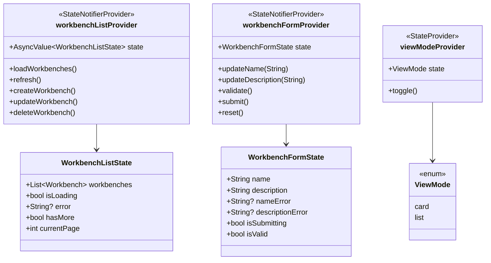
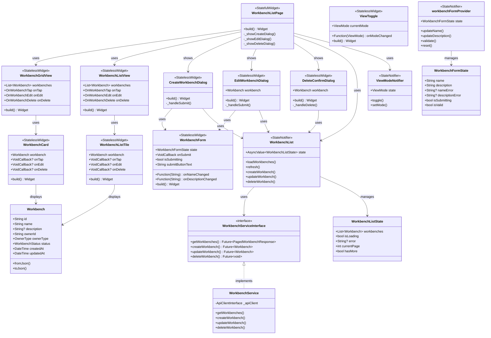
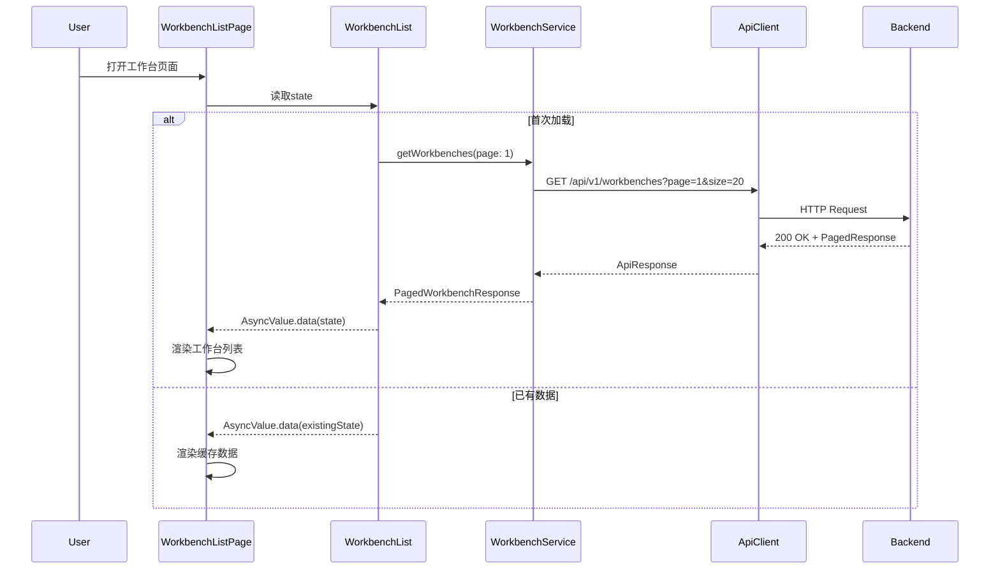
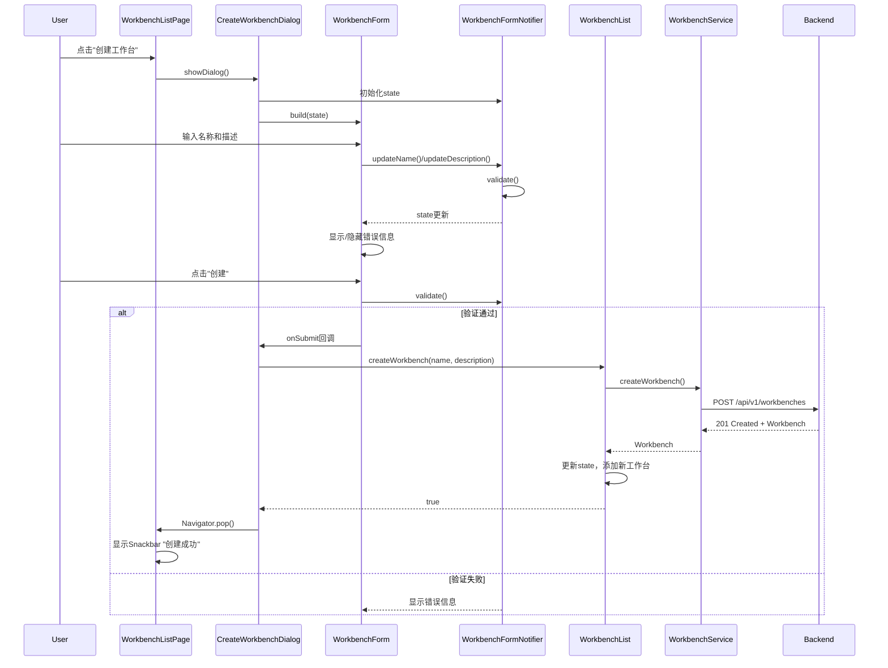
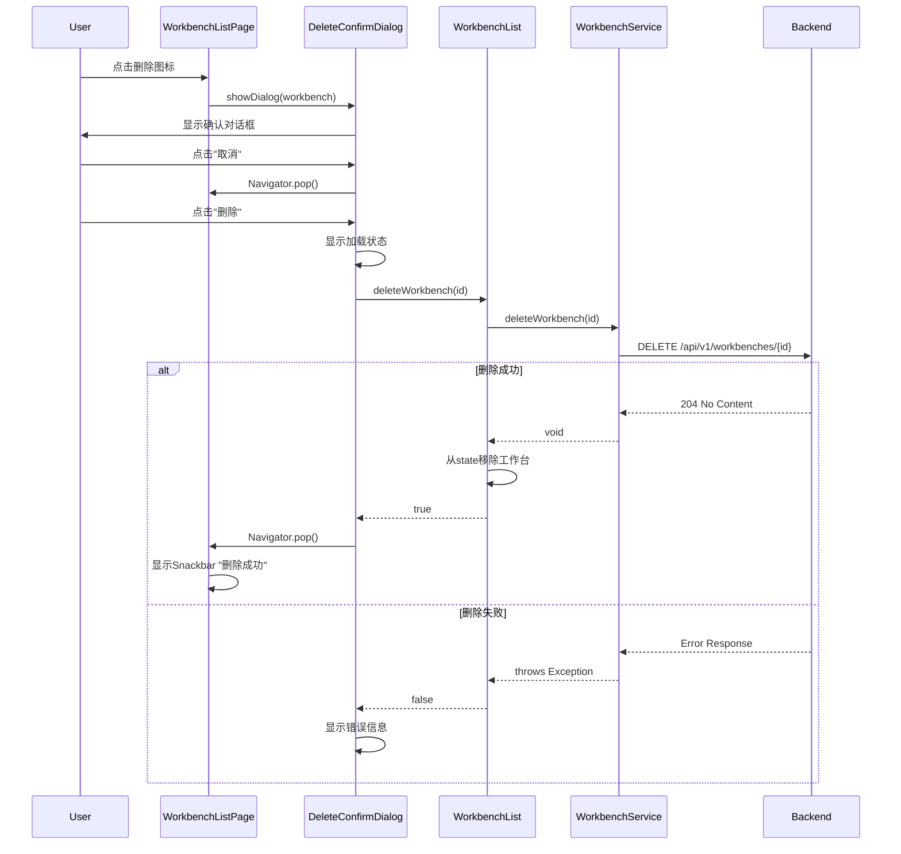
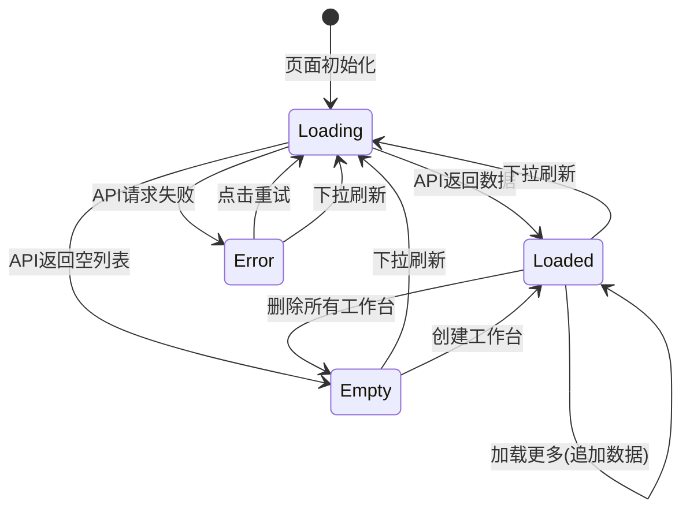

# S1-014: 工作台管理页面 - 详细设计文档

**任务编号**: S1-014  
**任务名称**: 工作台管理页面 (Workbench Management Page)  
**版本**: 1.0  
**日期**: 2026-03-22  
**状态**: Draft  
**依赖**: S1-012 (认证状态管理), S1-013 (工作台CRUD API)  

---

## 目录

1. [概述](#1-概述)
2. [架构与模块设计](#2-架构与模块设计)
3. [状态管理设计](#3-状态管理设计)
4. [UI设计](#4-ui设计)
5. [数据流设计](#5-数据流设计)
6. [接口定义](#6-接口定义)
7. [UML设计图](#7-uml设计图)
8. [错误处理策略](#8-错误处理策略)
9. [测试策略](#9-测试策略)
10. [设计决策记录](#10-设计决策记录)

---

## 1. 概述

### 1.1 文档目的

本文档定义Kayak系统工作台管理页面的详细设计，包括工作台列表展示、创建/编辑功能、删除确认等UI交互实现。

### 1.2 功能范围

- **工作台列表页面**: 展示用户所有工作台，支持卡片/列表视图切换
- **创建工作台**: 通过对话框表单创建新工作台
- **编辑工作台**: 通过对话框表单编辑现有工作台
- **删除工作台**: 二次确认对话框，防止误操作
- **响应式布局**: 适配不同桌面端窗口尺寸

### 1.3 验收标准映射

| 验收标准 | 实现组件 | 测试覆盖 |
|---------|---------|---------|
| 列表展示所有工作台 | `WorkbenchListPage` + `WorkbenchListProvider` | TC-S1-014-01 ~ TC-S1-014-08 |
| 创建/编辑表单验证完整 | `WorkbenchForm` + 验证逻辑 | TC-S1-014-20 ~ TC-S1-014-35 |
| 删除操作需要二次确认 | `DeleteConfirmDialog` | TC-S1-014-36 ~ TC-S1-014-40 |

### 1.4 参考文档

- [S1-012 认证状态管理设计](./S1-012_design.md) - Riverpod状态管理
- [S1-013 工作台CRUD API设计](./S1-013_design.md) - 后端API规范
- [S1-014 测试用例](../test/S1-014_test_cases.md) - 70个测试用例详情
- [S1-011 登录页面UI设计](./S1-011_design.md) - Material Design 3规范

---

## 2. 架构与模块设计

### 2.1 组件层次结构

```
WorkbenchListPage (页面)
├── AppBar (标题 + 操作按钮)
│   ├── Title ("工作台")
│   ├── ViewToggle (卡片/列表切换)
│   └── CreateButton ("创建工作台")
├── WorkbenchListView (内容区)
│   ├── LoadingState (加载中)
│   ├── EmptyState (空状态)
│   ├── ErrorState (错误状态)
│   └── WorkbenchGrid/List (工作台展示)
│       ├── WorkbenchCard (卡片视图)
│       └── WorkbenchListTile (列表视图)
└── Dialogs (对话框)
    ├── CreateWorkbenchDialog (创建)
    ├── EditWorkbenchDialog (编辑)
    └── DeleteConfirmDialog (删除确认)
```

### 2.2 模块职责划分

| 模块 | 职责 | 对应文件 |
|------|------|---------|
| **页面层** | 页面布局、对话框管理 | `workbench_list_page.dart` |
| **视图层** | 列表/卡片视图渲染 | `workbench_grid_view.dart`, `workbench_list_view.dart` |
| **组件层** | 卡片、列表项、表单组件 | `workbench_card.dart`, `workbench_list_tile.dart`, `workbench_form.dart` |
| **状态层** | Riverpod Provider管理 | `workbench_list_provider.dart`, `workbench_form_provider.dart` |
| **服务层** | API调用封装 | `workbench_service.dart` |
| **模型层** | 数据模型定义 | `workbench.dart`, `workbench_dto.dart` |

### 2.3 文件结构

```
kayak-frontend/lib/
├── features/
│   └── workbench/
│       ├── models/
│       │   ├── workbench.dart              # 工作台数据模型
│       │   ├── workbench_dto.dart          # API DTO
│       │   └── workbench_form_state.dart   # 表单状态
│       ├── providers/
│       │   ├── workbench_list_provider.dart    # 列表状态管理
│       │   ├── workbench_form_provider.dart    # 表单状态管理
│       │   └── view_mode_provider.dart         # 视图模式状态
│       ├── services/
│       │   └── workbench_service.dart      # API服务层
│       ├── widgets/
│       │   ├── workbench_card.dart         # 卡片组件
│       │   ├── workbench_list_tile.dart    # 列表项组件
│       │   ├── workbench_grid_view.dart    # 网格视图
│       │   ├── workbench_list_view.dart    # 列表视图
│       │   ├── workbench_form.dart         # 表单组件
│       │   ├── view_toggle.dart            # 视图切换按钮
│       │   └── empty_state.dart            # 空状态组件
│       └── dialogs/
│           ├── create_workbench_dialog.dart
│           ├── edit_workbench_dialog.dart
│           └── delete_confirm_dialog.dart
├── screens/
│   └── workbench/
│       └── workbench_list_page.dart        # 主页面
└── core/
    └── validators/
        └── workbench_validators.dart       # 表单验证器
```

---

## 3. 状态管理设计

### 3.1 Provider结构



### 3.2 状态定义

```dart
/// 工作台列表状态
@freezed
class WorkbenchListState with _$WorkbenchListState {
  const factory WorkbenchListState({
    @Default([]) List<Workbench> workbenches,
    @Default(false) bool isLoading,
    String? error,
    @Default(1) int currentPage,
    @Default(20) int pageSize,
    @Default(true) bool hasMore,
  }) = _WorkbenchListState;
}

/// 工作台表单状态
@freezed
class WorkbenchFormState with _$WorkbenchFormState {
  const factory WorkbenchFormState({
    @Default('') String name,
    @Default('') String description,
    String? nameError,
    String? descriptionError,
    @Default(false) bool isSubmitting,
  }) = _WorkbenchFormState;

  const WorkbenchFormState._();

  bool get isValid => nameError == null && descriptionError == null && name.isNotEmpty;
}

/// 视图模式枚举
enum ViewMode {
  card,
  list,
}
```

### 3.3 Provider实现

```dart
/// 工作台列表Provider
@riverpod
class WorkbenchList extends _$WorkbenchList {
  @override
  Future<WorkbenchListState> build() async {
    final service = ref.read(workbenchServiceProvider);
    return _loadWorkbenches(service: service);
  }

  Future<WorkbenchListState> _loadWorkbenches({WorkbenchService? service, int page = 1}) async {
    // Use provided service or get from provider
    final svc = service ?? ref.read(workbenchServiceProvider);
    
    try {
      final response = await svc.getWorkbenches(page: page);
      return WorkbenchListState(
        workbenches: response.items,
        currentPage: page,
        hasMore: (response.page * response.size) < response.total,
      );
    } catch (e) {
      return WorkbenchListState(error: e.toString());
    }
  }

  Future<void> refresh() async {
    state = const AsyncValue.loading();
    state = await AsyncValue.guard(() => _loadWorkbenches());
  }

  Future<void> loadMore() async {
    final current = state.valueOrNull;
    if (current == null || !current.hasMore || current.isLoading) return;

    state = AsyncValue.data(current.copyWith(isLoading: true));
    
    try {
      final nextPage = current.currentPage + 1;
      final service = ref.read(workbenchServiceProvider);
      final response = await service.getWorkbenches(page: nextPage);
      
      state = AsyncValue.data(current.copyWith(
        workbenches: [...current.workbenches, ...response.items],
        currentPage: nextPage,
        hasMore: (response.page * response.size) < response.total,
        isLoading: false,
      ));
    } catch (e) {
      state = AsyncValue.data(current.copyWith(
        error: e.toString(),
        isLoading: false,
      ));
    }
  }

  Future<bool> createWorkbench(String name, String? description) async {
    try {
      final service = ref.read(workbenchServiceProvider);
      final workbench = await service.createWorkbench(
        name: name,
        description: description,
      );
      
      final current = state.valueOrNull;
      if (current != null) {
        state = AsyncValue.data(current.copyWith(
          workbenches: [workbench, ...current.workbenches],
        ));
      }
      return true;
    } catch (e) {
      return false;
    }
  }

  Future<bool> updateWorkbench(String id, String name, String? description) async {
    try {
      final service = ref.read(workbenchServiceProvider);
      final updated = await service.updateWorkbench(
        id: id,
        name: name,
        description: description,
      );
      
      final current = state.valueOrNull;
      if (current != null) {
        final workbenches = current.workbenches.map((w) =>
          w.id == id ? updated : w
        ).toList();
        
        state = AsyncValue.data(current.copyWith(workbenches: workbenches));
      }
      return true;
    } catch (e) {
      return false;
    }
  }

  Future<bool> deleteWorkbench(String id) async {
    try {
      final service = ref.read(workbenchServiceProvider);
      await service.deleteWorkbench(id);
      
      final current = state.valueOrNull;
      if (current != null) {
        final workbenches = current.workbenches.where((w) => w.id != id).toList();
        state = AsyncValue.data(current.copyWith(workbenches: workbenches));
      }
      return true;
    } catch (e) {
      return false;
    }
  }
}

/// 视图模式Provider (使用shared_preferences持久化)
@riverpod
class ViewMode extends _$ViewMode {
  static const _key = 'workbench_view_mode';

  @override
  ViewMode build() {
    _loadSavedMode();
    return ViewMode.card;
  }

  Future<void> _loadSavedMode() async {
    final prefs = await SharedPreferences.getInstance();
    final saved = prefs.getString(_key);
    if (saved != null) {
      state = ViewMode.values.byName(saved);
    }
  }

  Future<void> toggle() async {
    state = state == ViewMode.card ? ViewMode.list : ViewMode.card;
    final prefs = await SharedPreferences.getInstance();
    await prefs.setString(_key, state.name);
  }

  Future<void> setMode(ViewMode mode) async {
    state = mode;
    final prefs = await SharedPreferences.getInstance();
    await prefs.setString(_key, mode.name);
  }
}
```

---

## 4. UI设计

### 4.1 页面布局线框图

#### 4.1.1 工作台列表页面 - 卡片视图

```
┌─────────────────────────────────────────────────────────────────────────────┐
│  🧪 Kayak                                                      👤 User ▼    │
├─────────────────────────────────────────────────────────────────────────────┤
│                                                                             │
│  ┌─────────────────────────────────────────────────────────────────────┐   │
│  │  工作台                              [⊞ Card] [☰ List]  [+ 创建]    │   │
│  └─────────────────────────────────────────────────────────────────────┘   │
│                                                                             │
│  ┌───────────────────┐  ┌───────────────────┐  ┌───────────────────┐       │
│  │  📦               │  │  📦               │  │  📦               │       │
│  │                   │  │                   │  │                   │       │
│  │  Workbench A      │  │  Workbench B      │  │  Workbench C      │       │
│  │  Description...   │  │  Description...   │  │  Description...   │       │
│  │                   │  │                   │  │                   │       │
│  │  [✏️] [🗑️]        │  │  [✏️] [🗑️]        │  │  [✏️] [🗑️]        │       │
│  └───────────────────┘  └───────────────────┘  └───────────────────┘       │
│                                                                             │
│  ┌───────────────────┐  ┌───────────────────┐  ┌───────────────────┐       │
│  │  📦               │  │  📦               │  │                   │       │
│  │                   │  │                   │  │                   │       │
│  │  Workbench D      │  │  Workbench E      │  │                   │       │
│  │  Description...   │  │  Description...   │  │                   │       │
│  │                   │  │                   │  │                   │       │
│  │  [✏️] [🗑️]        │  │  [✏️] [🗑️]        │  │                   │       │
│  └───────────────────┘  └───────────────────┘  └───────────────────┘       │
│                                                                             │
└─────────────────────────────────────────────────────────────────────────────┘
```

#### 4.1.2 工作台列表页面 - 列表视图

```
┌─────────────────────────────────────────────────────────────────────────────┐
│  🧪 Kayak                                                      👤 User ▼    │
├─────────────────────────────────────────────────────────────────────────────┤
│                                                                             │
│  ┌─────────────────────────────────────────────────────────────────────┐   │
│  │  工作台                              [⊞ Card] [☰ List]  [+ 创建]    │   │
│  └─────────────────────────────────────────────────────────────────────┘   │
│                                                                             │
│  ┌─────────────────────────────────────────────────────────────────────┐   │
│  │ 📦  Workbench A          Description line here...        [✏️] [🗑️]  │   │
│  ├─────────────────────────────────────────────────────────────────────┤   │
│  │ 📦  Workbench B          Another description...          [✏️] [🗑️]  │   │
│  ├─────────────────────────────────────────────────────────────────────┤   │
│  │ 📦  Workbench C          Short desc                      [✏️] [🗑️]  │   │
│  ├─────────────────────────────────────────────────────────────────────┤   │
│  │ 📦  Workbench D          Description text goes here...   [✏️] [🗑️]  │   │
│  ├─────────────────────────────────────────────────────────────────────┤   │
│  │ 📦  Workbench E          More description content        [✏️] [🗑️]  │   │
│  └─────────────────────────────────────────────────────────────────────┘   │
│                                                                             │
└─────────────────────────────────────────────────────────────────────────────┘
```

#### 4.1.3 空状态

```
┌─────────────────────────────────────────────────────────────────────────────┐
│                                                                             │
│                              ┌─────────────┐                               │
│                              │             │                               │
│                              │   📦        │                               │
│                              │             │                               │
│                              └─────────────┘                               │
│                                                                             │
│                            暂无工作台                                       │
│                      创建您第一个工作台开始管理设备                         │
│                                                                             │
│                           [+ 创建工作台]                                    │
│                                                                             │
└─────────────────────────────────────────────────────────────────────────────┘
```

#### 4.1.4 创建/编辑对话框

```
┌─────────────────────────────────────────────────────┐
│  创建工作台                                    [×]  │
├─────────────────────────────────────────────────────┤
│                                                     │
│  工作台名称 *                                       │
│  ┌─────────────────────────────────────────────┐   │
│  │                                             │   │
│  └─────────────────────────────────────────────┘   │
│  请输入工作台名称                                   │
│                                                     │
│  描述 (可选)                                        │
│  ┌─────────────────────────────────────────────┐   │
│  │                                             │   │
│  │                                             │   │
│  │                                             │   │
│  └─────────────────────────────────────────────┘   │
│  0/1000                                             │
│                                                     │
│                         [  取消  ]  [  创建  ]      │
│                                                     │
└─────────────────────────────────────────────────────┘
```

#### 4.1.5 删除确认对话框

```
┌─────────────────────────────────────────────────────┐
│                                                     │
│                      ⚠️                             │
│                                                     │
│              确定要删除此工作台吗？                  │
│                                                     │
│         此操作不可撤销，将永久删除该工作台          │
│         及其所有设备数据。                          │
│                                                     │
│         (此工作台包含 3 个设备，将一并删除)         │
│                                                     │
│              [  取消  ]      [  删除  ]             │
│                                                     │
└─────────────────────────────────────────────────────┘
```

### 4.2 组件规格

#### 4.2.1 Material Design 3组件映射

| 设计元素 | MD3组件 | 规格说明 |
|---------|--------|---------|
| 页面标题 | `AppBar` | 使用`large`样式，标题"工作台" |
| 视图切换 | `ToggleButtons` | 两个按钮：卡片图标、列表图标 |
| 创建按钮 | `FilledButton.icon` | 图标`Icons.add`，标签"创建工作台" |
| 卡片视图 | `Card` (Filled) | 圆角12dp，elevation 0 |
| 列表视图 | `ListTile` | 使用`ListView.separated`带分割线 |
| 输入框 | `TextField` (Outlined) | 使用`OutlineInputBorder` |
| 对话框 | `AlertDialog` | 圆角28dp，符合MD3规范 |
| 删除按钮 | `TextButton` | 颜色`colorScheme.error` |

#### 4.2.2 间距规范

| 元素 | 间距/尺寸 |
|------|----------|
| 页面内边距 | 24dp |
| 卡片网格间距 | 16dp |
| 卡片内边距 | 16dp |
| 卡片最小宽度 | 280dp |
| 列表项高度 | 72dp |
| 对话框宽度 | 560dp (最大) |
| 对话框内边距 | 24dp |
| 表单字段间距 | 16dp |

#### 4.2.3 响应式断点

| 断点 | 宽度范围 | 卡片列数 |
|------|---------|---------|
| Compact | < 600dp | 1列 (强制列表视图) |
| Medium | 600-1024dp | 2列 |
| Expanded | 1024-1440dp | 3列 |
| Large | > 1440dp | 4列 |

### 4.3 颜色系统 (UI Design Specification)

#### 4.3.1 Material Design 3 颜色角色

**亮色主题 (Light Theme)**

| 颜色角色 | Token | Hex值 | 用途 |
|----------|-------|-------|------|
| **Primary** | `colorScheme.primary` | `#6750A4` | 主要按钮、激活状态、FAB |
| **On Primary** | `colorScheme.onPrimary` | `#FFFFFF` | Primary上的文字/图标 |
| **Primary Container** | `colorScheme.primaryContainer` | `#EADDFF` | 选中状态背景、悬停背景 |
| **On Primary Container** | `colorScheme.onPrimaryContainer` | `#21005D` | Primary Container上的文字 |
| **Secondary** | `colorScheme.secondary` | `#625B71` | 次要按钮、次要操作 |
| **On Secondary** | `colorScheme.onSecondary` | `#FFFFFF` | Secondary上的文字 |
| **Secondary Container** | `colorScheme.secondaryContainer` | `#E8DEF8` | 次要选中背景 |
| **Surface** | `colorScheme.surface` | `#FFFBFE` | 卡片背景、对话框背景 |
| **Surface Variant** | `colorScheme.surfaceVariant` | `#E7E0EC` | 列表项悬停、输入框背景 |
| **Background** | `colorScheme.background` | `#FFFBFE` | 页面背景 |
| **On Surface** | `colorScheme.onSurface` | `#1C1B1F` | 主要文字颜色 |
| **On Surface Variant** | `colorScheme.onSurfaceVariant` | `#49454F` | 次要文字、描述文字 |
| **Outline** | `colorScheme.outline` | `#79747E` | 边框、分割线 |
| **Outline Variant** | `colorScheme.outlineVariant` | `#CAC4D0` | 弱分割线 |
| **Error** | `colorScheme.error` | `#B3261E` | 错误状态、删除操作 |
| **On Error** | `colorScheme.onError` | `#FFFFFF` | Error上的文字 |
| **Error Container** | `colorScheme.errorContainer` | `#F9DEDC` | 错误背景 |
| **On Error Container** | `colorScheme.onErrorContainer` | `#410E0B` | Error Container上的文字 |
| **Success** | Custom | `#2E7D32` | 成功提示 |
| **On Success** | Custom | `#FFFFFF` | 成功文字 |

**暗色主题 (Dark Theme)**

| 颜色角色 | Token | Hex值 | 用途 |
|----------|-------|-------|------|
| **Primary** | `colorScheme.primary` | `#D0BCFF` | 主要按钮、激活状态 |
| **On Primary** | `colorScheme.onPrimary` | `#381E72` | Primary上的文字 |
| **Primary Container** | `colorScheme.primaryContainer` | `#4F378B` | 选中状态背景 |
| **On Primary Container** | `colorScheme.onPrimaryContainer` | `#EADDFF` | Primary Container上的文字 |
| **Secondary** | `colorScheme.secondary` | `#CCC2DC` | 次要按钮 |
| **On Secondary** | `colorScheme.onSecondary` | `#332D41` | Secondary上的文字 |
| **Surface** | `colorScheme.surface` | `#1C1B1F` | 卡片背景、对话框背景 |
| **Surface Variant** | `colorScheme.surfaceVariant` | `#49454F` | 列表项悬停 |
| **Background** | `colorScheme.background` | `#1C1B1F` | 页面背景 |
| **On Surface** | `colorScheme.onSurface` | `#E6E1E5` | 主要文字颜色 |
| **On Surface Variant** | `colorScheme.onSurfaceVariant` | `#CAC4D0` | 次要文字 |
| **Outline** | `colorScheme.outline` | `#938F99` | 边框、分割线 |
| **Error** | `colorScheme.error` | `#F2B8B5` | 错误状态 |
| **On Error** | `colorScheme.onError` | `#601410` | Error上的文字 |
| **Error Container** | `colorScheme.errorContainer` | `#8C1D18` | 错误背景 |
| **On Error Container** | `colorScheme.onErrorContainer` | `#F9DEDC` | Error Container上的文字 |
| **Success** | Custom | `#81C784` | 成功提示 |
| **On Success** | Custom | `#1B5E20` | 成功文字 |

#### 4.3.2 状态颜色映射

| 状态 | 亮色主题 | 暗色主题 | 应用位置 |
|------|----------|----------|----------|
| **悬停 (Hover)** | `surfaceVariant` with opacity 0.08 | `surfaceVariant` with opacity 0.08 | 卡片背景、列表项 |
| **按下 (Pressed)** | `primaryContainer` | `primaryContainer` | 按钮、卡片 |
| **选中 (Selected)** | `primaryContainer` | `primaryContainer` | 视图切换按钮 |
| **禁用 (Disabled)** | `onSurface` with opacity 0.38 | `onSurface` with opacity 0.38 | 禁用按钮、输入框 |
| **错误 (Error)** | `errorContainer` | `errorContainer` | 错误输入框背景 |
| **加载 (Loading)** | `primary` with opacity 0.5 | `primary` with opacity 0.5 | 进度指示器 |

#### 4.3.3 透明度规范

| 使用场景 | 透明度 | 说明 |
|----------|--------|------|
| 禁用状态 | 38% | 禁用文字、图标 |
| 次要文字 | 60% | 描述、提示信息 |
| 分隔线 | 12% | 分割线、边框 |
| 悬停叠加 | 8% | 悬停状态背景叠加 |
| 按下叠加 | 12% | 按下状态背景叠加 |

### 4.4 字体排版 (Typography)

#### 4.4.1 字体家族

| 平台 | 字体 | 备用字体 |
|------|------|----------|
| Windows | Segoe UI | Arial, sans-serif |
| macOS | SF Pro | Helvetica Neue, sans-serif |
| Linux | Roboto | Noto Sans, sans-serif |

**Flutter 配置**:
```dart
fontFamily: 'Roboto', // Material Design 默认
```

#### 4.4.2 字体规模 (Type Scale)

| 样式 | Token | 大小 | 字重 | 行高 | 字间距 | 用途 |
|------|-------|------|------|------|--------|------|
| **Headline Small** | `textTheme.headlineSmall` | 24dp | 400 | 32dp | 0 | 页面标题 |
| **Title Large** | `textTheme.titleLarge` | 22dp | 400 | 28dp | 0 | 对话框标题 |
| **Title Medium** | `textTheme.titleMedium` | 16dp | 500 | 24dp | 0.15 | 卡片标题、列表项标题 |
| **Title Small** | `textTheme.titleSmall` | 14dp | 500 | 20dp | 0.1 | 次要标题 |
| **Body Large** | `textTheme.bodyLarge` | 16dp | 400 | 24dp | 0.5 | 正文、输入框文字 |
| **Body Medium** | `textTheme.bodyMedium` | 14dp | 400 | 20dp | 0.25 | 描述文字、次要内容 |
| **Body Small** | `textTheme.bodySmall` | 12dp | 400 | 16dp | 0.4 | 辅助信息、时间戳 |
| **Label Large** | `textTheme.labelLarge` | 14dp | 500 | 20dp | 0.1 | 按钮文字 |
| **Label Medium** | `textTheme.labelMedium` | 12dp | 500 | 16dp | 0.5 | 输入框标签、图标标签 |
| **Label Small** | `textTheme.labelSmall` | 11dp | 500 | 16dp | 0.5 | 小号标签、徽章 |

#### 4.4.3 页面字体应用

| 元素 | 字体样式 | 颜色 |
|------|----------|------|
| AppBar 标题 | `headlineSmall` | `onSurface` |
| 卡片标题 | `titleMedium` | `onSurface` |
| 卡片描述 | `bodyMedium` | `onSurfaceVariant` |
| 列表项标题 | `titleMedium` | `onSurface` |
| 列表项描述 | `bodyMedium` | `onSurfaceVariant` |
| 对话框标题 | `titleLarge` | `onSurface` |
| 输入框标签 | `labelMedium` | `onSurfaceVariant` |
| 输入框文字 | `bodyLarge` | `onSurface` |
| 按钮文字 | `labelLarge` | Varies |
| 错误文字 | `bodySmall` | `error` |
| 空状态标题 | `headlineSmall` | `onSurface` |
| 空状态描述 | `bodyMedium` | `onSurfaceVariant` |

### 4.5 组件详细规格

#### 4.5.1 工作台卡片 (Workbench Card)

**尺寸与间距**

| 属性 | 数值 | 说明 |
|------|------|------|
| **最小宽度** | 280dp | 卡片最小宽度 |
| **高度** | 160dp | 固定高度 |
| **圆角** | 12dp | `RoundedRectangleBorder` |
| **内边距** | 16dp | 四周内边距 |
| **图标区域** | 48x48dp | 左上角图标容器 |
| **图标大小** | 24dp | 实际图标尺寸 |
| **标题与图标间距** | 16dp | 垂直间距 |
| **描述与标题间距** | 8dp | 垂直间距 |
| **操作按钮区域高度** | 40dp | 底部操作区 |
| **卡片间距** | 16dp | 网格卡片间距 |

**视觉规范**

| 属性 | 值 | 说明 |
|------|-----|------|
| **背景色** | `surface` | 卡片背景 |
| **阴影 (Elevation)** | 0dp (默认), 1dp (悬停) | 默认无阴影 |
| **边框** | 1dp `outlineVariant` | 默认边框 |
| **悬停边框** | 1dp `outline` | 悬停时边框加深 |

**代码示例**

```dart
Card(
  elevation: isHovered ? 1 : 0,
  shape: RoundedRectangleBorder(
    borderRadius: BorderRadius.circular(12),
    side: BorderSide(
      color: isHovered 
        ? theme.colorScheme.outline 
        : theme.colorScheme.outlineVariant,
      width: 1,
    ),
  ),
  child: InkWell(
    onTap: onTap,
    onHover: (value) => setState(() => isHovered = value),
    borderRadius: BorderRadius.circular(12),
    child: Padding(
      padding: const EdgeInsets.all(16),
      child: Column(
        crossAxisAlignment: CrossAxisAlignment.start,
        children: [
          // Icon + Title row
          Row(
            children: [
              Container(
                width: 48,
                height: 48,
                decoration: BoxDecoration(
                  color: theme.colorScheme.primaryContainer,
                  borderRadius: BorderRadius.circular(8),
                ),
                child: Icon(
                  Icons.folder_outlined,
                  color: theme.colorScheme.onPrimaryContainer,
                  size: 24,
                ),
              ),
              const SizedBox(width: 16),
              Expanded(
                child: Text(
                  workbench.name,
                  style: theme.textTheme.titleMedium,
                  maxLines: 1,
                  overflow: TextOverflow.ellipsis,
                ),
              ),
            ],
          ),
          const SizedBox(height: 16),
          // Description
          Text(
            workbench.description ?? '无描述',
            style: theme.textTheme.bodyMedium?.copyWith(
              color: theme.colorScheme.onSurfaceVariant,
            ),
            maxLines: 2,
            overflow: TextOverflow.ellipsis,
          ),
          const Spacer(),
          const Divider(height: 1),
          // Actions
          SizedBox(
            height: 40,
            child: Row(
              mainAxisAlignment: MainAxisAlignment.end,
              children: [
                IconButton(
                  icon: const Icon(Icons.edit_outlined, size: 20),
                  onPressed: onEdit,
                  tooltip: '编辑',
                ),
                IconButton(
                  icon: const Icon(Icons.delete_outlined, size: 20),
                  onPressed: onDelete,
                  tooltip: '删除',
                ),
              ],
            ),
          ),
        ],
      ),
    ),
  ),
)
```

#### 4.5.2 工作台列表项 (Workbench List Tile)

**尺寸与间距**

| 属性 | 数值 | 说明 |
|------|------|------|
| **高度** | 72dp | 固定高度 |
| **内边距** | 16dp (水平), 12dp (垂直) | 列表项内边距 |
| **图标容器** | 40x40dp | 左侧图标容器 |
| **图标大小** | 20dp | 实际图标尺寸 |
| **图标与文字间距** | 16dp | 水平间距 |
| **标题与描述间距** | 4dp | 垂直间距 |
| **分割线高度** | 1dp | 列表项分割线 |
| **分割线缩进** | 72dp (左侧) | 与文字对齐 |

**视觉规范**

| 属性 | 值 | 说明 |
|------|-----|------|
| **背景色 (默认)** | `surface` | 透明/表面色 |
| **背景色 (悬停)** | `surfaceVariant` with 0.08 opacity | 悬停背景 |
| **背景色 (按下)** | `surfaceVariant` with 0.12 opacity | 按下背景 |
| **分割线颜色** | `outlineVariant` | 分割线颜色 |

#### 4.5.3 浮动操作按钮 (FAB)

**尺寸与位置**

| 属性 | 数值 | 说明 |
|------|------|------|
| **尺寸** | 56x56dp | 标准FAB尺寸 |
| **图标大小** | 24dp | 内部图标尺寸 |
| **位置 (右下角)** | 24dp from edges | 距离右下边缘 |
| **阴影 (Elevation)** | 3dp (默认), 6dp (按下) | 默认阴影 |

**视觉规范**

| 属性 | 值 | 说明 |
|------|-----|------|
| **背景色** | `primaryContainer` | 容器主色 |
| **图标色** | `onPrimaryContainer` | 容器上的内容色 |
| **形状** | Circle (圆形) | 标准圆形FAB |

#### 4.5.4 创建/编辑对话框

**尺寸与间距**

| 属性 | 数值 | 说明 |
|------|------|------|
| **最小宽度** | 480dp | 对话框最小宽度 |
| **最大宽度** | 560dp | 对话框最大宽度 |
| **内边距** | 24dp | 内容区内边距 |
| **标题与内容间距** | 16dp | 垂直间距 |
| **输入框间距** | 24dp | 输入框之间 |
| **内容与按钮间距** | 24dp | 按钮区域上方 |
| **按钮间距** | 8dp | 按钮之间 |
| **圆角** | 28dp | 对话框圆角 |

**视觉规范**

| 属性 | 值 | 说明 |
|------|-----|------|
| **背景色** | `surface` | 表面色 |
| **标题样式** | `titleLarge` | 标题字体 |
| **阴影 (Elevation)** | 3dp | 对话框阴影 |
| **输入框类型** | OutlinedTextField | MD3 描边输入框 |

#### 4.5.5 删除确认对话框

**尺寸与间距**

| 属性 | 数值 | 说明 |
|------|------|------|
| **最小宽度** | 400dp | 对话框最小宽度 |
| **内边距** | 24dp | 内容区内边距 |
| **图标容器** | 72x72dp | 警告图标容器 |
| **图标与标题间距** | 16dp | 垂直间距 |
| **标题与描述间距** | 12dp | 垂直间距 |
| **内容与按钮间距** | 24dp | 按钮区域上方 |
| **圆角** | 28dp | 对话框圆角 |

**视觉规范**

| 属性 | 值 | 说明 |
|------|-----|------|
| **图标背景** | `errorContainer` | 错误容器色 |
| **图标颜色** | `onErrorContainer` | 错误容器上的图标色 |
| **标题样式** | `headlineSmall` | 标题字体 |
| **警告文字颜色** | `error` | 红色警告 |

#### 4.5.6 空状态 (Empty State)

**尺寸与位置**

| 属性 | 数值 | 说明 |
|------|------|------|
| **位置** | Center | 页面中央 |
| **最大宽度** | 400dp | 内容最大宽度 |
| **插图大小** | 160x160dp | 插图尺寸 |
| **插图与标题间距** | 32dp | 垂直间距 |
| **标题与描述间距** | 16dp | 垂直间距 |
| **描述与按钮间距** | 32dp | 垂直间距 |

**视觉规范**

| 属性 | 值 | 说明 |
|------|-----|------|
| **插图颜色** | `outline` with 0.6 opacity | 灰色调 |
| **标题样式** | `headlineSmall` | 标题字体 |
| **描述样式** | `bodyLarge` | 描述字体 |
| **文字对齐** | Center | 居中对齐 |

#### 4.5.7 错误状态 (Error State)

**尺寸与位置**

| 属性 | 数值 | 说明 |
|------|------|------|
| **位置** | Center | 页面中央 |
| **图标大小** | 64dp | 错误图标 |
| **图标与标题间距** | 24dp | 垂直间距 |
| **标题与描述间距** | 8dp | 垂直间距 |
| **描述与按钮间距** | 24dp | 垂直间距 |

**视觉规范**

| 属性 | 值 | 说明 |
|------|-----|------|
| **图标颜色** | `error` | 错误色 |
| **标题样式** | `titleLarge` | 标题字体 |
| **描述样式** | `bodyMedium` | 描述字体 |

#### 4.5.8 加载状态 (Loading State)

**尺寸与位置**

| 属性 | 数值 | 说明 |
|------|------|------|
| **位置** | Center | 页面中央 |
| **指示器大小** | 48dp | CircularProgressIndicator |
| **指示器与文字间距** | 16dp | 垂直间距 |
| **文字样式** | `bodyMedium` | 加载提示文字 |

**视觉规范**

| 属性 | 值 | 说明 |
|------|-----|------|
| **指示器颜色** | `primary` | 主色 |
| **文字颜色** | `onSurfaceVariant` | 次要文字色 |

### 4.6 交互状态

#### 4.6.1 卡片悬停效果

| 状态 | 属性 | 值 |
|------|------|-----|
| **默认** | Elevation | 0dp |
| **默认** | Border | 1dp `outlineVariant` |
| **悬停** | Elevation | 1dp |
| **悬停** | Border | 1dp `outline` |
| **悬停** | Background | `surfaceVariant` with 0.04 opacity |
| **按下** | Background | `surfaceVariant` with 0.12 opacity |

#### 4.6.2 列表项悬停效果

| 状态 | 属性 | 值 |
|------|------|-----|
| **默认** | Background | Transparent |
| **悬停** | Background | `surfaceVariant` with 0.08 opacity |
| **按下** | Background | `surfaceVariant` with 0.12 opacity |

#### 4.6.3 按钮状态

| 组件 | 状态 | 效果 |
|------|------|------|
| **IconButton** | 悬停 | 圆形背景 `onSurface` with 0.08 opacity |
| **IconButton** | 按下 | 圆形背景 `onSurface` with 0.12 opacity |
| **FilledButton** | 悬停 | 透明度 -8% |
| **FilledButton** | 按下 | 透明度 -12% |
| **TextButton** | 悬停 | 文字背景 `primary` with 0.08 opacity |

#### 4.6.4 输入框状态

| 状态 | 边框颜色 | 标签颜色 |
|------|----------|----------|
| **默认** | `outline` | `onSurfaceVariant` |
| **聚焦** | `primary` | `primary` |
| **错误** | `error` | `error` |
| **禁用** | `onSurface` with 0.12 | `onSurface` with 0.38 |

#### 4.6.5 焦点状态 (Accessibility)

| 元素 | 焦点指示器 | 说明 |
|------|-----------|------|
| **Card** | 2dp `primary` outline | 键盘焦点时显示 |
| **ListTile** | 2dp `primary` outline | 键盘焦点时显示 |
| **Button** | 3dp `primary` overlay | Material 默认 |
| **TextField** | 2dp `primary` underline | 聚焦时显示 |

### 4.7 布局规范

#### 4.7.1 页面整体布局

```
┌────────────────────────────────────────────────────────────────────────┐
│ AppBar (64dp height)                                                   │
├────────────────────────────────────────────────────────────────────────┤
│                                                                        │
│  Padding (24dp horizontal, 16dp top)                                   │
│  ┌────────────────────────────────────────────────────────────────┐   │
│  │                                                                │   │
│  │                    Content Area                                │   │
│  │                                                                │   │
│  │                                                                │   │
│  │                                                                │   │
│  └────────────────────────────────────────────────────────────────┘   │
│                                                                        │
│  ┌─────────┐                                                           │
│  │   FAB   │  Positioned (bottom: 24dp, right: 24dp)                  │
│  └─────────┘                                                           │
│                                                                        │
└────────────────────────────────────────────────────────────────────────┘
```

#### 4.7.2 AppBar 规范

| 属性 | 数值 | 说明 |
|------|------|------|
| **高度** | 64dp | 桌面端AppBar高度 |
| **内边距** | 24dp (horizontal) | 水平内边距 |
| **标题样式** | `headlineSmall` | 标题字体 |
| **背景色** | `surface` | 表面色 |
| **阴影** | 0dp | 无阴影 |
| **底部边框** | 1dp `outlineVariant` | 分隔线 |

#### 4.7.3 卡片网格布局

**间距规范**

| 属性 | 数值 | 说明 |
|------|------|------|
| **页面内边距** | 24dp | 页面边缘内边距 |
| **网格间距** | 16dp | 卡片之间间距 |
| **最小卡片宽度** | 280dp | 单列卡片最小宽度 |

**网格列数规则**

| 视口宽度 | 列数 | 卡片宽度计算 |
|----------|------|--------------|
| < 600dp | 1 | 100% - 48dp (padding) |
| 600 - 1024dp | 2 | (width - 64dp) / 2 |
| 1024 - 1440dp | 3 | (width - 80dp) / 3 |
| > 1440dp | 4 | (width - 96dp) / 4 |

#### 4.7.4 列表布局

**间距规范**

| 属性 | 数值 | 说明 |
|------|------|------|
| **页面内边距** | 24dp (horizontal) | 水平内边距 |
| **列表项高度** | 72dp | 固定高度 |
| **分割线缩进** | 72dp | 与图标对齐 |

### 4.8 响应式断点

#### 4.8.1 断点定义

| 断点名称 | 宽度范围 | 描述 |
|----------|----------|------|
| **Compact** | < 600dp | 手机/小窗口 - 非主要目标 |
| **Medium** | 600dp - 1024dp | 小屏幕桌面/平板 |
| **Expanded** | 1024dp - 1440dp | 标准桌面 |
| **Large** | > 1440dp | 大屏幕桌面 |

#### 4.8.2 各断点布局规则

**Compact (< 600dp)**

| 属性 | 值 | 说明 |
|------|-----|------|
| 网格列数 | 1 | 单列卡片 |
| 卡片宽度 | 100% | 全宽 |
| 页面内边距 | 16dp | 减小内边距 |
| 对话框宽度 | 100% - 32dp | 接近全宽 |
| FAB位置 | bottom: 16dp, right: 16dp | 减小边距 |

**Medium (600dp - 1024dp)**

| 属性 | 值 | 说明 |
|------|-----|------|
| 网格列数 | 2 | 双列网格 |
| 页面内边距 | 24dp | 标准内边距 |
| 对话框宽度 | 480dp | 固定宽度 |
| FAB位置 | bottom: 24dp, right: 24dp | 标准边距 |

**Expanded (1024dp - 1440dp)**

| 属性 | 值 | 说明 |
|------|-----|------|
| 网格列数 | 3 | 三列网格 |
| 页面内边距 | 24dp | 标准内边距 |
| 对话框宽度 | 480-560dp | 标准宽度 |
| 最大内容宽度 | 1200dp | 可选最大宽度 |

**Large (> 1440dp)**

| 属性 | 值 | 说明 |
|------|-----|------|
| 网格列数 | 4 | 四列网格 |
| 页面内边距 | 24dp | 标准内边距 |
| 最大内容宽度 | 1400dp | 限制最大宽度 |
| 居中内容 | true | 内容居中显示 |

#### 4.8.3 响应式代码示例

```dart
LayoutBuilder(
  builder: (context, constraints) {
    final width = constraints.maxWidth;
    int crossAxisCount;
    if (width < 600) {
      crossAxisCount = 1;
    } else if (width < 1024) {
      crossAxisCount = 2;
    } else if (width < 1440) {
      crossAxisCount = 3;
    } else {
      crossAxisCount = 4;
    }
    
    return GridView.builder(
      padding: const EdgeInsets.all(24),
      gridDelegate: SliverGridDelegateWithFixedCrossAxisCount(
        crossAxisCount: crossAxisCount,
        crossAxisSpacing: 16,
        mainAxisSpacing: 16,
        childAspectRatio: 280 / 160,
      ),
      itemCount: workbenches.length,
      itemBuilder: (context, index) => WorkbenchCard(
        workbench: workbenches[index],
      ),
    );
  },
);
```

### 4.9 无障碍要求

| 要求 | 实现方式 |
|------|----------|
| 键盘导航 | 所有交互元素支持 Tab 导航 |
| 焦点指示 | 清晰的 2dp 焦点边框 |
| 屏幕阅读器 | 所有图标按钮设置 tooltip |
| 颜色对比 | 文字与背景对比度 >= 4.5:1 |
| 触摸目标 | 最小 48x48dp |
| 语义标签 | 使用 Semantics 包裹关键信息 |

---

## 5. 数据流设计

---

## 5. 数据流设计

### 5.1 页面加载数据流

```
User ──打开工作台页面──> WorkbenchListPage
                              │
                              ▼
                    ┌─────────────────────┐
                    │ workbenchListProvider│
                    │      .build()        │
                    └─────────────────────┘
                              │
                              ▼
                    ┌─────────────────────┐
                    │ WorkbenchService     │
                    │ .getWorkbenches()    │
                    └─────────────────────┘
                              │
                              ▼
                    ┌─────────────────────┐
                    │ ApiClient (Dio)      │
                    │ GET /api/v1/         │
                    │     workbenches      │
                    └─────────────────────┘
                              │
                              ▼
                         [Backend API]
                              │
                    ┌─────────┴──────────┐
                    ▼                    ▼
              [Success]             [Error]
                    │                    │
                    ▼                    ▼
              AsyncValue.data      AsyncValue.error
                    │                    │
                    ▼                    ▼
            渲染工作台列表          显示错误提示
```

### 5.2 创建工作台数据流

```
User ──点击"创建工作台"──> showDialog()
                              │
                              ▼
                    ┌─────────────────────┐
                    │ CreateWorkbenchDialog│
                    │ 显示表单              │
                    └─────────────────────┘
                              │
                              ▼
                    ┌─────────────────────┐
                    │ 用户填写表单          │
                    │ + 实时验证            │
                    └─────────────────────┘
                              │
                              ▼
                    ┌─────────────────────┐
                    │ 点击"创建"按钮        │
                    └─────────────────────┘
                              │
                              ▼
                    ┌─────────────────────┐
                    │ workbenchListProvider│
                    │ .createWorkbench()   │
                    └─────────────────────┘
                              │
                              ▼
                    ┌─────────────────────┐
                    │ WorkbenchService     │
                    │ .createWorkbench()   │
                    └─────────────────────┘
                              │
                              ▼
                    ┌─────────────────────┐
                    │ POST /api/v1/        │
                    │     workbenches      │
                    └─────────────────────┘
                              │
                    ┌─────────┴──────────┐
                    ▼                    ▼
              [201 Created]         [Error]
                    │                    │
                    ▼                    ▼
              关闭对话框            显示错误提示
           刷新列表显示新工作台     保持对话框打开
```

### 5.3 删除工作台数据流

```
User ──点击删除图标──> showDialog()
                           │
                           ▼
                 ┌─────────────────────┐
                 │ DeleteConfirmDialog  │
                 │ 显示警告信息          │
                 └─────────────────────┘
                           │
              ┌────────────┴────────────┐
              ▼                         ▼
        [点击"取消"]               [点击"删除"]
              │                         │
              ▼                         ▼
        关闭对话框              workbenchListProvider
                                   .deleteWorkbench()
                                        │
                                        ▼
                              ┌─────────────────────┐
                              │ DELETE /api/v1/      │
                              │ workbenches/{id}     │
                              └─────────────────────┘
                                        │
                             ┌──────────┴──────────┐
                             ▼                     ▼
                       [204 No Content]        [Error]
                             │                     │
                             ▼                     ▼
                       关闭对话框              显示错误提示
                    从列表移除工作台
                    显示Snackbar成功提示
```

---

## 6. 接口定义

### 6.1 数据模型

```dart
/// 工作台模型
@freezed
class Workbench with _$Workbench {
  const factory Workbench({
    required String id,
    required String name,
    String? description,
    required String ownerId,
    required OwnerType ownerType,
    required WorkbenchStatus status,
    required DateTime createdAt,
    required DateTime updatedAt,
  }) = _Workbench;

  factory Workbench.fromJson(Map<String, dynamic> json) =>
      _$WorkbenchFromJson(json);
}

/// 所有者类型枚举
enum OwnerType {
  user,
  team,
}

/// 工作台状态枚举
enum WorkbenchStatus {
  active,
  archived,
  deleted,
}

/// 分页响应模型
@freezed
class PagedWorkbenchResponse with _$PagedWorkbenchResponse {
  const factory PagedWorkbenchResponse({
    required List<Workbench> items,
    required int total,
    required int page,
    required int size,
  }) = _PagedWorkbenchResponse;

  factory PagedWorkbenchResponse.fromJson(Map<String, dynamic> json) =>
      _$PagedWorkbenchResponseFromJson(json);
}

/// 创建工作台请求
@freezed
class CreateWorkbenchRequest with _$CreateWorkbenchRequest {
  const factory CreateWorkbenchRequest({
    required String name,
    String? description,
    OwnerType? ownerType,
  }) = _CreateWorkbenchRequest;

  factory CreateWorkbenchRequest.fromJson(Map<String, dynamic> json) =>
      _$CreateWorkbenchRequestFromJson(json);
}

/// 更新工作台请求
@freezed
class UpdateWorkbenchRequest with _$UpdateWorkbenchRequest {
  const factory UpdateWorkbenchRequest({
    String? name,
    String? description,
  }) = _UpdateWorkbenchRequest;

  factory UpdateWorkbenchRequest.fromJson(Map<String, dynamic> json) =>
      _$UpdateWorkbenchRequestFromJson(json);
}
```

### 6.2 服务层接口

```dart
  /// 工作台服务接口
  abstract class WorkbenchServiceInterface {
    /// 获取工作台列表
    Future<PagedWorkbenchResponse> getWorkbenches({
      int page = 1,
      int size = 20,
    });

    /// 创建工作台
    Future<Workbench> createWorkbench({
      required String name,
      String? description,
    });

    /// 更新工作台
    Future<Workbench> updateWorkbench({
      required String id,
      String? name,
      String? description,
    });

    /// 删除工作台
    Future<void> deleteWorkbench(String id);
  }

  /// @deprecated 此方法已废弃，不再需要单个工作台详情的独立获取方法
  /// 工作台列表接口已包含完整的工作台信息，无需额外调用
  /// 如需获取单个工作台详情，应从列表缓存中查找
  // Future<Workbench> getWorkbench(String id);

/// 工作台服务实现
@riverpod
WorkbenchServiceInterface workbenchService(Ref ref) {
  final apiClient = ref.watch(apiClientProvider);
  return WorkbenchService(apiClient: apiClient);
}

class WorkbenchService implements WorkbenchServiceInterface {
  final ApiClientInterface _apiClient;

  WorkbenchService({required ApiClientInterface apiClient})
      : _apiClient = apiClient;

  @override
  Future<PagedWorkbenchResponse> getWorkbenches({
    int page = 1,
    int size = 20,
  }) async {
    final response = await _apiClient.get(
      '/api/v1/workbenches',
      queryParameters: {'page': page, 'size': size},
    );
    
    return PagedWorkbenchResponse.fromJson(response.data);
  }

  @override
  Future<Workbench> createWorkbench({
    required String name,
    String? description,
  }) async {
    final request = CreateWorkbenchRequest(
      name: name,
      description: description,
    );
    
    final response = await _apiClient.post(
      '/api/v1/workbenches',
      data: request.toJson(),
    );
    
    return Workbench.fromJson(response.data);
  }

  @override
  Future<Workbench> updateWorkbench({
    required String id,
    String? name,
    String? description,
  }) async {
    final request = UpdateWorkbenchRequest(
      name: name,
      description: description,
    );
    
    final response = await _apiClient.put(
      '/api/v1/workbenches/$id',
      data: request.toJson(),
    );
    
    return Workbench.fromJson(response.data);
  }

  @override
  Future<void> deleteWorkbench(String id) async {
    await _apiClient.delete('/api/v1/workbenches/$id');
  }
}
```

### 6.3 表单验证器

```dart
/// 工作台表单验证器
class WorkbenchValidators {
  /// 验证工作台名称
  static String? validateName(String? value) {
    if (value == null || value.trim().isEmpty) {
      return '工作台名称不能为空';
    }
    
    final trimmed = value.trim();
    if (trimmed.length > 255) {
      return '名称长度不能超过255个字符';
    }
    
    return null;
  }

  /// 验证工作台描述
  static String? validateDescription(String? value) {
    if (value == null || value.isEmpty) {
      return null; // 描述可选
    }
    
    if (value.length > 1000) {
      return '描述长度不能超过1000个字符';
    }
    
    return null;
  }
}
```

---

## 7. UML设计图

### 7.1 类图（静态结构）



### 7.2 时序图 - 加载工作台列表



### 7.3 时序图 - 创建工作台



### 7.4 时序图 - 删除工作台



### 7.5 状态图 - 工作台列表状态



---

## 8. 错误处理策略

### 8.1 错误类型与处理

| 错误类型 | 错误场景 | 处理方式 | UI反馈 |
|---------|---------|---------|--------|
| 网络错误 | 无网络连接 | 显示错误状态 + 重试按钮 | "网络连接失败，请检查网络后重试" |
| 服务器错误 | 500/502/503 | 显示错误状态 + 重试按钮 | "服务器错误，请稍后重试" |
| 认证错误 | 401/403 | 自动跳转登录页 | 由路由守卫处理 |
| 验证错误 | 表单数据无效 | 显示字段级错误 | 内联显示错误信息 |
| 超时错误 | 请求超时 | 显示错误 + 重试 | "请求超时，请重试" |
| 业务错误 | 工作台不存在 | Snackbar提示 | "工作台不存在或已被删除" |

### 8.2 错误处理实现

```dart
/// 统一错误处理
class WorkbenchErrorHandler {
  static String getErrorMessage(Object error) {
    if (error is DioException) {
      switch (error.type) {
        case DioExceptionType.connectionTimeout:
        case DioExceptionType.sendTimeout:
        case DioExceptionType.receiveTimeout:
          return '请求超时，请重试';
        case DioExceptionType.connectionError:
          return '网络连接失败，请检查网络后重试';
        case DioExceptionType.badResponse:
          return _handleHttpError(error.response?.statusCode);
        default:
          return '网络请求失败，请重试';
      }
    }
    return '操作失败，请重试';
  }

  static String _handleHttpError(int? statusCode) {
    switch (statusCode) {
      case 400:
        return '请求参数错误';
      case 401:
        return '登录已过期，请重新登录';
      case 403:
        return '没有权限执行此操作';
      case 404:
        return '工作台不存在或已被删除';
      case 500:
      case 502:
      case 503:
        return '服务器错误，请稍后重试';
      default:
        return '操作失败，请重试';
    }
  }

  /// 显示错误SnackBar
  static void showErrorSnackBar(BuildContext context, String message) {
    ScaffoldMessenger.of(context).showSnackBar(
      SnackBar(
        content: Text(message),
        backgroundColor: Theme.of(context).colorScheme.error,
        behavior: SnackBarBehavior.floating,
        action: SnackBarAction(
          label: '重试',
          textColor: Theme.of(context).colorScheme.onError,
          onPressed: () {
            // 触发重试逻辑
          },
        ),
      ),
    );
  }

  /// 显示成功SnackBar
  static void showSuccessSnackBar(BuildContext context, String message) {
    ScaffoldMessenger.of(context).showSnackBar(
      SnackBar(
        content: Text(message),
        backgroundColor: Theme.of(context).colorScheme.primary,
        behavior: SnackBarBehavior.floating,
        duration: const Duration(seconds: 2),
      ),
    );
  }
}
```

### 8.3 表单错误处理

```dart
/// 表单错误处理
class WorkbenchForm extends StatelessWidget {
  final WorkbenchFormState state;
  final Function(String) onNameChanged;
  final Function(String) onDescriptionChanged;
  final VoidCallback onSubmit;
  final bool isSubmitting;
  final String submitButtonText;

  @override
  Widget build(BuildContext context) {
    return Form(
      child: Column(
        crossAxisAlignment: CrossAxisAlignment.stretch,
        children: [
          // 名称输入框
          TextFormField(
            initialValue: state.name,
            decoration: InputDecoration(
              labelText: '工作台名称 *',
              hintText: '请输入工作台名称',
              errorText: state.nameError,
              prefixIcon: const Icon(Icons.work_outline),
            ),
            maxLength: 255,
            textInputAction: TextInputAction.next,
            onChanged: onNameChanged,
          ),
          
          const SizedBox(height: 16),
          
          // 描述输入框
          TextFormField(
            initialValue: state.description,
            decoration: InputDecoration(
              labelText: '描述 (可选)',
              hintText: '请输入工作台描述',
              errorText: state.descriptionError,
              prefixIcon: const Icon(Icons.description_outlined),
              counterText: '${state.description.length}/1000',
            ),
            maxLength: 1000,
            maxLines: 3,
            textInputAction: TextInputAction.done,
            onChanged: onDescriptionChanged,
          ),
          
          const SizedBox(height: 24),
          
          // 提交按钮
          FilledButton(
            onPressed: state.isValid && !isSubmitting ? onSubmit : null,
            child: isSubmitting
                ? const SizedBox(
                    height: 20,
                    width: 20,
                    child: CircularProgressIndicator(strokeWidth: 2),
                  )
                : Text(submitButtonText),
          ),
        ],
      ),
    );
  }
}
```

---

## 9. 测试策略

### 9.1 测试覆盖矩阵

| 测试类型 | 测试范围 | 测试工具 | 覆盖率目标 |
|---------|---------|---------|-----------|
| Widget测试 | 组件渲染、交互 | flutter_test | >80% |
| 集成测试 | 完整用户流程 | integration_test | 核心流程 |
| Golden测试 | UI回归测试 | golden_toolkit | 关键页面 |
| 可访问性测试 | a11y合规性 | accessibility_tools | WCAG 2.1 AA |

### 9.2 关键测试用例映射

| 测试ID | 测试名称 | 对应代码 | 测试类型 |
|-------|---------|---------|---------|
| TC-S1-014-01 | 工作台列表正常加载 | `workbench_list_page_test.dart` | Widget |
| TC-S1-014-02 | 空状态显示 | `workbench_list_page_test.dart` | Widget |
| TC-S1-014-09 | 卡片视图模式 | `workbench_list_page_test.dart` | Widget |
| TC-S1-014-10 | 列表视图模式 | `workbench_list_page_test.dart` | Widget |
| TC-S1-014-20 | 创建对话框打开 | `create_workbench_dialog_test.dart` | Widget |
| TC-S1-014-21 | 空名称验证 | `workbench_form_test.dart` | Widget |
| TC-S1-014-22 | 名称长度验证 | `workbench_form_test.dart` | Widget |
| TC-S1-014-40 | 删除确认对话框 | `delete_confirm_dialog_test.dart` | Widget |
| TC-S1-014-70 | 大屏布局 | `workbench_list_golden_test.dart` | Golden |

### 9.3 测试文件结构

```
test/
├── widget/
│   └── workbench/
│       ├── workbench_list_page_test.dart
│       ├── workbench_card_test.dart
│       ├── workbench_list_tile_test.dart
│       ├── workbench_form_test.dart
│       ├── create_workbench_dialog_test.dart
│       ├── edit_workbench_dialog_test.dart
│       └── delete_confirm_dialog_test.dart
├── integration/
│   └── workbench/
│       └── workbench_flow_test.dart
├── golden/
│   └── workbench/
│       └── workbench_list_golden_test.dart
└── unit/
    └── workbench/
        ├── workbench_validators_test.dart
        └── workbench_service_test.dart
```

### 9.4 示例测试代码

```dart
// test/widget/workbench/workbench_list_page_test.dart

void main() {
  group('WorkbenchListPage', () {
    late MockWorkbenchService mockService;

    setUp(() {
      mockService = MockWorkbenchService();
    });

    // TC-S1-014-01: 工作台列表正常加载测试
    testWidgets('displays workbench list correctly', (tester) async {
      final workbenches = [
        Workbench(id: '1', name: 'Workbench 1', description: 'Desc 1'),
        Workbench(id: '2', name: 'Workbench 2', description: 'Desc 2'),
      ];

      when(() => mockService.getWorkbenches(page: any(named: 'page')))
          .thenAnswer((_) async => PagedWorkbenchResponse(
                items: workbenches,
                total: 2,
                page: 1,
                size: 20,
              ));

      await tester.pumpWidget(
        ProviderScope(
          overrides: [
            workbenchServiceProvider.overrideWithValue(mockService),
          ],
          child: const MaterialApp(home: WorkbenchListPage()),
        ),
      );

      await tester.pumpAndSettle();

      expect(find.text('Workbench 1'), findsOneWidget);
      expect(find.text('Workbench 2'), findsOneWidget);
      expect(find.byIcon(Icons.edit), findsNWidgets(2));
      expect(find.byIcon(Icons.delete), findsNWidgets(2));
    });

    // TC-S1-014-02: 空状态测试
    testWidgets('displays empty state', (tester) async {
      when(() => mockService.getWorkbenches(page: any(named: 'page')))
          .thenAnswer((_) async => PagedWorkbenchResponse(
                items: [],
                total: 0,
                page: 1,
                size: 20,
              ));

      await tester.pumpWidget(
        ProviderScope(
          overrides: [
            workbenchServiceProvider.overrideWithValue(mockService),
          ],
          child: const MaterialApp(home: WorkbenchListPage()),
        ),
      );

      await tester.pumpAndSettle();

      expect(find.text('暂无工作台'), findsOneWidget);
      expect(find.text('创建您第一个工作台开始管理设备'), findsOneWidget);
    });

    // TC-S1-014-21: 空名称验证
    testWidgets('shows error for empty name', (tester) async {
      await tester.pumpWidget(
        const MaterialApp(
          home: Scaffold(
            body: WorkbenchForm(
              state: WorkbenchFormState(),
              onNameChanged: (_) {},
              onDescriptionChanged: (_) {},
              onSubmit: () {},
              isSubmitting: false,
              submitButtonText: '创建',
            ),
          ),
        ),
      );

      await tester.tap(find.byType(FilledButton));
      await tester.pump();

      expect(find.text('工作台名称不能为空'), findsOneWidget);
    });
  });
}
```

---

## 10. 设计决策记录

### 决策1: 视图模式状态管理

**问题**: 卡片/列表视图切换状态应该保存在本地状态还是持久化存储？

**决策**: 使用 `shared_preferences` 持久化视图模式偏好。

**理由**:
1. 用户期望视图偏好跨会话保持一致
2. 实现简单，只需存储一个枚举值
3. 提升用户体验，减少重复操作
4. 使用Riverpod管理，可响应式更新

**替代方案**: 仅保存在内存中，每次进入页面重置为默认视图 - 被拒绝，用户体验较差。

---

### 决策2: 表单状态管理方案

**问题**: 使用 Flutter 原生 Form + GlobalKey 还是使用 reactive 表单库（如 `reactive_forms`）？

**决策**: 使用原生 Form + Riverpod 状态管理。

**理由**:
1. 减少第三方依赖，降低项目复杂度
2. Riverpod 已提供足够的状态管理能力
3. 与现有架构保持一致（S1-012 使用 Riverpod）
4. 表单逻辑可单元测试，不依赖 UI
5. 实时验证可通过 onChanged + Provider 实现

**实现方式**:
- 使用独立的 `WorkbenchFormNotifier` 管理表单状态
- 每个字段变化触发验证逻辑
- 表单状态与 UI 通过 Provider 绑定

**替代方案**: 使用 `reactive_forms` 或 `flutter_form_builder` - 被拒绝，增加学习成本和依赖。

---

### 决策3: 对话框实现策略

**问题**: 使用 `showDialog` + `StatefulBuilder` 还是单独的 Dialog Widget？

**决策**: 使用单独的 Dialog Widget 类。

**理由**:
1. 更好的代码组织和可维护性
2. 可独立测试对话框逻辑
3. 支持对话框内部状态管理
4. 符合 Flutter 官方推荐实践
5. 便于复用和扩展

**实现方式**:
```dart
// 调用处
showDialog(
  context: context,
  builder: (_) => CreateWorkbenchDialog(),
);

// 独立Widget
class CreateWorkbenchDialog extends ConsumerWidget {
  @override
  Widget build(BuildContext context, WidgetRef ref) {
    // 独立的构建逻辑
  }
}
```

**替代方案**: 使用 `StatefulBuilder` 在页面内联实现 - 被拒绝，代码可读性差，难以测试。

---

### 决策4: 分页加载策略

**问题**: 使用无限滚动（Infinite Scroll）还是传统分页（页码）？

**决策**: 使用无限滚动（Load More）。

**理由**:
1. 现代桌面应用主流交互模式
2. 用户体验更流畅，无需点击页码
3. 实现简单，只需监听滚动位置
4. 适合工作台数量不确定的场景
5. Material Design 3 推荐实践

**实现细节**:
- 使用 `NotificationListener<ScrollNotification>` 监听滚动
- 距离底部 200px 时触发加载更多
- 显示加载指示器在列表底部

**替代方案**: 传统分页组件（页码按钮）- 被拒绝，不符合现代桌面应用设计趋势。

---

### 决策5: 错误显示方式

**问题**: 使用 SnackBar 还是页面内联错误显示？

**决策**: 根据错误类型分层处理：

| 错误类型 | 显示方式 |
|---------|---------|
| 列表加载错误 | 页面内联错误状态（带动画插图） |
| 表单验证错误 | 字段内联错误信息 |
| 操作成功/失败 | SnackBar 提示 |
| 网络错误 | SnackBar + 重试按钮 |

**理由**:
1. 不同错误需要不同的用户注意级别
2. 列表加载失败需要更明显的反馈
3. 表单错误需要与具体字段关联
4. 操作反馈需要不阻塞用户操作
5. 符合 Material Design 错误处理规范

---

### 决策6: 响应式布局实现

**问题**: 使用 `LayoutBuilder` 还是 `MediaQuery` 进行响应式布局？

**决策**: 使用 `LayoutBuilder` + 自定义断点。

**理由**:
1. `LayoutBuilder` 响应父容器尺寸，更精确
2. 侧边栏折叠/展开时自动适配
3. 易于测试（可控制约束）
4. 可封装为通用响应式组件

**实现方式**:
```dart
LayoutBuilder(
  builder: (context, constraints) {
    final columns = _calculateColumns(constraints.maxWidth);
    return GridView.count(
      crossAxisCount: columns,
      // ...
    );
  },
)
```

**替代方案**: 使用 `MediaQuery.of(context).size` - 被拒绝，无法响应侧边栏变化。

---

## 附录

### A.1 依赖项

```yaml
# pubspec.yaml dependencies

dependencies:
  flutter:
    sdk: flutter
  flutter_riverpod: ^2.4.0
  riverpod_annotation: ^2.2.0
  dio: ^5.3.0
  freezed_annotation: ^2.4.0
  json_annotation: ^4.8.0
  shared_preferences: ^2.2.0

dev_dependencies:
  build_runner: ^2.4.0
  freezed: ^2.4.0
  json_serializable: ^6.7.0
  riverpod_generator: ^2.3.0
  flutter_test:
    sdk: flutter
  golden_toolkit: ^0.15.0
  mocktail: ^1.0.0
```

### A.2 API端点映射

| 功能 | 前端方法 | HTTP方法 | 后端端点 |
|------|---------|---------|---------|
| 列表查询 | `getWorkbenches()` | GET | `/api/v1/workbenches` |
| 详情查询 | `getWorkbench(id)` | GET | `/api/v1/workbenches/{id}` |
| 创建 | `createWorkbench()` | POST | `/api/v1/workbenches` |
| 更新 | `updateWorkbench()` | PUT | `/api/v1/workbenches/{id}` |
| 删除 | `deleteWorkbench()` | DELETE | `/api/v1/workbenches/{id}` |

### A.3 文档历史

| 版本 | 日期 | 修改人 | 修改说明 |
|------|------|--------|----------|
| 1.0 | 2026-03-22 | sw-tom | 初始版本创建 |

---

**文档结束**
