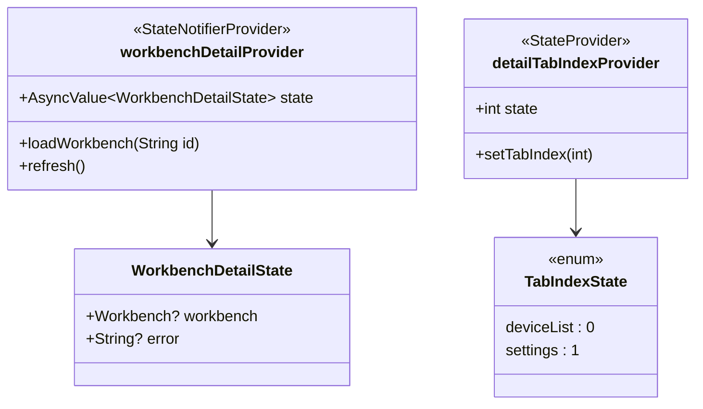
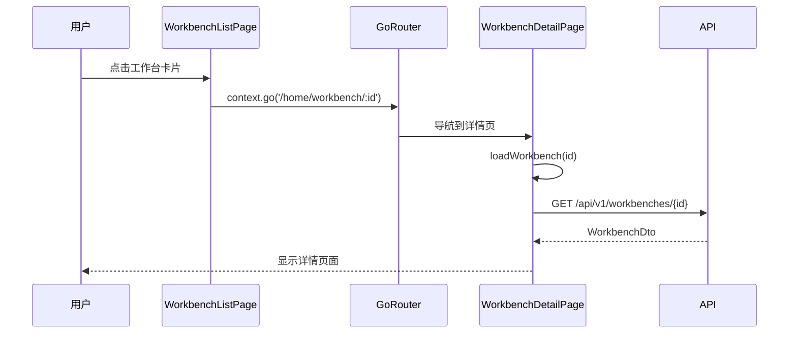
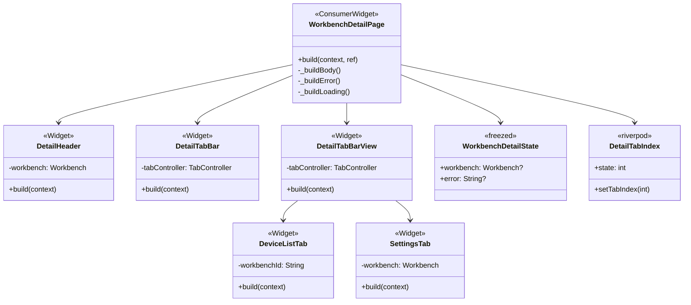
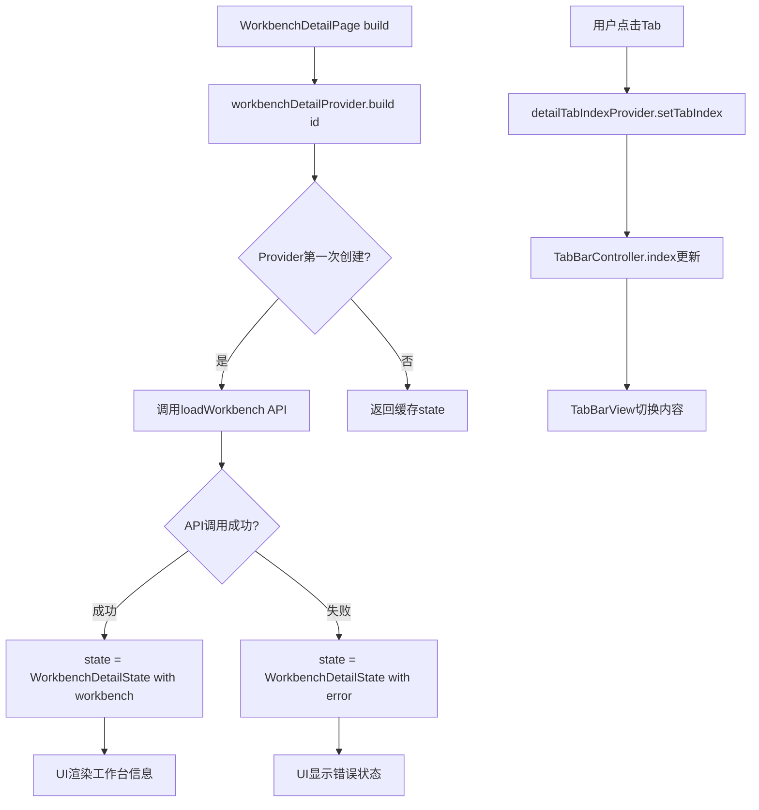
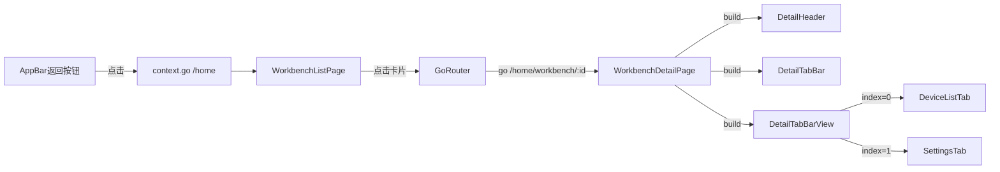

# S1-015: 工作台详情页面框架 - 详细设计文档

**任务编号**: S1-015  
**任务名称**: 工作台详情页面框架 (Workbench Detail Page Framework)  
**版本**: 1.0  
**日期**: 2026-03-22  
**状态**: Draft  
**依赖**: S1-014 (工作台管理页面)  
**后续任务**: S1-019 (设备管理功能)

---

## 目录

1. [概述](#1-概述)
2. [架构与模块设计](#2-架构与模块设计)
3. [状态管理设计](#3-状态管理设计)
4. [UI设计](#4-ui设计)
5. [路由设计](#5-路由设计)
6. [数据流设计](#6-数据流设计)
7. [UML设计图](#7-uml设计图)
8. [错误处理策略](#8-错误处理策略)
9. [验收标准映射](#9-验收标准映射)
10. [文件结构](#10-文件结构)
11. [设计决策记录](#11-设计决策记录)

---

## 1. 概述

### 1.1 文档目的

本文档定义Kayak系统工作台详情页框架的详细设计，包括工作台基本信息展示、Tab导航结构（设备列表、设置）。为后续S1-019设备管理功能预留扩展点。

### 1.2 功能范围

- **工作台详情页面**: 展示单个工作台的完整信息
- **Tab导航结构**: 支持"设备列表"和"设置"两个Tab
- **基本信息展示**: 工作台名称、描述、创建时间等
- **扩展点预留**: 为S1-019设备管理功能预留Tab内容扩展

### 1.3 验收标准映射

| 验收标准 | 实现组件 | 说明 |
|---------|---------|------|
| 点击工作台进入详情页 | `WorkbenchDetailPage` + 路由配置 | 从S1-014列表页点击导航到详情页 |
| Tab导航可用 | `DetailTabBar` + `DetailTabBarView` | 设备列表Tab、设置Tab切换 |
| 显示工作台基本信息 | `DetailHeader` | 显示名称、描述、创建日期 |

### 1.4 参考文档

- [S1-014 工作台管理页面设计](./S1-014_design.md) - 列表页实现参考
- [S1-013 工作台CRUD API设计](./S1-013_design.md) - API接口定义
- [S1-012 认证状态管理设计](./S1-012_design.md) - Riverpod状态管理

---

## 2. 架构与模块设计

### 2.1 组件层次结构

```
WorkbenchDetailPage (页面)
├── AppBar
│   ├── BackButton (返回)
│   ├── Title (工作台名称)
│   └── Actions (更多操作按钮)
├── DetailHeader (基本信息区)
│   ├── WorkbenchIcon (工作台图标)
│   ├── WorkbenchName (工作台名称)
│   ├── WorkbenchDescription (描述)
│   └── WorkbenchMeta (创建时间、状态等)
├── DetailTabBar (Tab导航)
│   ├── Tab 1: "设备列表" (图标: devices)
│   └── Tab 2: "设置" (图标: settings)
└── DetailTabBarView (Tab内容区)
    ├── DeviceListTab (设备列表 - S1-019实现)
    │   └── Placeholder content
    └── SettingsTab (设置Tab - 后续扩展)
        └── BasicInfoDisplay (基本信息显示占位)
```

### 2.2 模块职责划分

| 模块 | 职责 | 对应文件 |
|------|------|---------|
| **页面层** | 页面布局、Tab管理 | `workbench_detail_page.dart` |
| **Header组件** | 工作台基本信息展示 | `detail_header.dart` |
| **Tab组件** | Tab导航结构 | `detail_tab_bar.dart`, `detail_tab_bar_view.dart` |
| **Tab内容** | 各Tab页面内容 | `device_list_tab.dart`, `settings_tab.dart` |
| **状态层** | Riverpod Provider管理 | `workbench_detail_provider.dart`, `detail_tab_provider.dart` |
| **服务层** | API调用封装 | 复用 `workbench_service.dart` |

### 2.3 扩展点设计

为S1-019设备管理功能预留以下扩展点：

1. **DeviceListTab**: 当前为占位内容，S1-019将实现完整的设备树组件
2. **SettingsTab**: 当前为只读信息显示，S1-020+将实现编辑功能
3. **API扩展点**: `WorkbenchService`已支持`getWorkbench(id)`接口

---

## 3. 状态管理设计

### 3.1 Provider结构



### 3.2 状态定义

```dart
/// 工作台详情状态
/// 
/// 注意: 不包含 isLoading 标志 - AsyncValue 本身提供 .isLoading 状态
@freezed
class WorkbenchDetailState with _$WorkbenchDetailState {
  const factory WorkbenchDetailState({
    Workbench? workbench,
    String? error,
  }) = _WorkbenchDetailState;
}

/// Tab索引枚举
enum DetailTab {
  deviceList,  // 设备列表 (index: 0)
  settings,    // 设置 (index: 1)
}
```

### 3.3 Provider实现

```dart
/// 工作台详情Provider
@riverpod
class WorkbenchDetail extends _$WorkbenchDetail {
  late final WorkbenchService _service;

  @override
  Future<WorkbenchDetailState> build(String workbenchId) async {
    _service = ref.read(workbenchServiceProvider);
    return _loadWorkbench(workbenchId);
  }

  Future<WorkbenchDetailState> _loadWorkbench(String workbenchId) async {
    try {
      final workbench = await _service.getWorkbench(workbenchId);
      return WorkbenchDetailState(
        workbench: workbench,
      );
    } catch (e) {
      return WorkbenchDetailState(
        error: e.toString(),
      );
    }
  }

  Future<void> refresh() async {
    final currentState = state.valueOrNull;
    final workbenchId = currentState?.workbench?.id;
    if (workbenchId == null) return;
    
    state = const AsyncValue.loading();
    state = await AsyncValue.guard(() => _loadWorkbench(workbenchId));
  }
}
@riverpod
class DetailTabIndex extends _$DetailTabIndex {
  @override
  int build() => 0; // 默认选中"设备列表"Tab

  void setTabIndex(int index) {
    state = index;
  }
}
```

---

## 4. UI设计

### 4.1 页面布局线框图

#### 4.1.1 工作台详情页面

```
┌─────────────────────────────────────────────────────────────────────────────┐
│  ← 返回  工作台 A                                            ⋮ 更多        │
├─────────────────────────────────────────────────────────────────────────────┤
│                                                                             │
│  ┌──────┐                                                                   │
│  │      │  工作台 A                                                          │
│  │ 📦   │  这是工作台的描述信息，用来介绍这个工作台的主要用途。                │
│  │      │                                                                   │
│  └──────┘  创建于 2026-03-20 08:30  ·  状态: 活跃                          │
│                                                                             │
│  ┌───────────────────────────┬───────────────────────────┐                 │
│  │  📱 设备列表              │  ⚙️ 设置                   │                 │
│  └───────────────────────────┴───────────────────────────┘                 │
│                                                                             │
│  ┌─────────────────────────────────────────────────────────────────────┐   │
│  │                                                                     │   │
│  │                    📋 设备列表 (S1-019 实现)                        │   │
│  │                                                                     │   │
│  │                    暂无设备                                         │   │
│  │              点击下方按钮添加第一个设备                             │   │
│  │                                                                     │   │
│  │                      [+ 添加设备]                                   │   │
│  │                                                                     │   │
│  └─────────────────────────────────────────────────────────────────────┘   │
│                                                                             │
└─────────────────────────────────────────────────────────────────────────────┘
```

#### 4.1.2 设备列表Tab占位状态

```
┌─────────────────────────────────────────────────────────────────────────────┐
│                                                                             │
│                         ┌─────────────────┐                               │
│                         │                 │                               │
│                         │    📱           │                               │
│                         │                 │                               │
│                         └─────────────────┘                               │
│                                                                             │
│                           暂无设备                                         │
│                     点击下方按钮添加第一个设备                             │
│                                                                             │
│                        [+ 添加设备]                                        │
│                                                                             │
└─────────────────────────────────────────────────────────────────────────────┘
```

#### 4.1.3 设置Tab

```
┌─────────────────────────────────────────────────────────────────────────────┐
│                                                                             │
│  工作台信息                                                                 │
│  ─────────────────────────────                                            │
│                                                                             │
│  名称                     工作台 A                                         │
│                                                                             │
│  描述                     这是工作台的描述信息                             │
│                                                                             │
│  创建时间                 2026-03-20 08:30                                 │
│                                                                             │
│  最后更新                 2026-03-22 14:20                                 │
│                                                                             │
│  状态                     活跃                                             │
│                                                                             │
│                              [ 编辑工作台 ]                                 │
│                                                                             │
└─────────────────────────────────────────────────────────────────────────────┘
```

### 4.2 组件规格

#### 4.2.1 Material Design 3组件映射

| 设计元素 | MD3组件 | 规格说明 |
|---------|--------|---------|
| 页面标题 | `AppBar` | 使用`medium`样式，含返回按钮 |
| Header图标 | `Container` + `Icon` | 64x64dp容器，16dp圆角 |
| TabBar | `TabBar` | 两个Tab，图标+文字 |
| TabBarView | `TabBarView` | 与TabBar联动 |
| 卡片内容 | `Card` (outlined) | 圆角12dp，无阴影 |

#### 4.2.2 间距规范

| 元素 | 间距/尺寸 |
|------|----------|
| 页面内边距 | 24dp |
| Header区域内边距 | 24dp |
| Header图标大小 | 64x64dp |
| Header图标与文字间距 | 16dp |
| TabBar高度 | 48dp |
| Tab间距 | 0dp (等宽分割) |
| Tab内容区内边距 | 16dp |

#### 4.2.3 响应式断点

| 断点 | 宽度范围 | 布局变化 |
|------|---------|---------|
| Compact | < 600dp | 单列布局，Header垂直排列 |
| Medium | 600-1024dp | 标准布局 |
| Expanded | > 1024dp | 最大内容宽度1200dp，居中显示 |

### 4.3 主题支持

#### 亮色主题

| 颜色角色 | 用途 |
|---------|------|
| `surface` | 页面背景 |
| `surfaceContainerLow` | Header背景 |
| `primary` | Tab激活状态 |
| `onSurface` | 主要文字 |
| `onSurfaceVariant` | 次要文字 |

#### 暗色主题

| 颜色角色 | 用途 |
|---------|------|
| `surface` | 页面背景 |
| `surfaceContainerLow` | Header背景 |
| `primary` | Tab激活状态 |
| `onSurface` | 主要文字 |
| `onSurfaceVariant` | 次要文字 |

---

## 5. 路由设计

### 5.1 路由配置

```
/home/workbench/:id  → WorkbenchDetailPage
```

### 5.2 路由参数

| 参数 | 类型 | 来源 | 说明 |
|------|------|------|------|
| id | String (UUID) | URL路径 | 工作台ID，从列表页点击传递 |

### 5.3 导航流程



### 5.4 从S1-014列表页导航

```dart
// WorkbenchListPage._onWorkbenchTap()
void _onWorkbenchTap(Workbench workbench) {
  context.go('/home/workbench/${workbench.id}');
}
```

---

## 6. 数据流设计

### 6.1 页面加载数据流

```
User ──打开详情页──> WorkbenchDetailPage
                          │
                          ▼
                ┌─────────────────────┐
                │ workbenchDetailProv │
                │    .build(id)       │
                └─────────────────────┘
                          │
                          ▼
                ┌─────────────────────┐
                │ WorkbenchService    │
                │ .getWorkbench(id)   │
                └─────────────────────┘
                          │
                          ▼
                ┌─────────────────────┐
                │ GET /api/v1/        │
                │   workbenches/{id}  │
                └─────────────────────┘
                          │
                     ┌────┴────┐
                     ▼         ▼
              [Success]   [Error]
                   │         │
                   ▼         ▼
           state.workbench  state.error
                   │         │
                   ▼         ▼
           显示工作台信息   显示错误提示
```

### 6.2 Tab切换数据流

```
User ──点击Tab──> DetailTabBar
                      │
                      ▼
              ┌───────────────┐
              │ TabController  │
              │ .index = 0/1   │
              └───────────────┘
                      │
                      ▼
              ┌───────────────┐
              │ detailTabIndex│
              │   Provider    │
              └───────────────┘
                      │
                      ▼
              DetailTabBarView
              切换到对应Tab内容
```

---

## 7. UML设计图

### 7.1 组件层次图



### 7.2 状态管理流程图



### 7.3 导航流程图



---

## 8. 错误处理策略

### 8.1 加载状态

| 状态 | 显示内容 | 用户操作 |
|------|---------|---------|
| 初始加载中 | `Center(child: CircularProgressIndicator())` | 等待 |
| 刷新中 | `RefreshIndicator` + 原内容 | 下拉刷新 |
| 加载失败 | 错误信息 + 重试按钮 | 点击重试 |

### 8.2 错误类型处理

```dart
Widget _buildError(String? error) {
  return Center(
    child: Column(
      mainAxisSize: MainAxisSize.min,
      children: [
        Icon(
          Icons.error_outline,
          size: 64,
          color: theme.colorScheme.error,
        ),
        const SizedBox(height: 16),
        Text(
          '加载失败',
          style: theme.textTheme.titleLarge,
        ),
        const SizedBox(height: 8),
        Text(
          error ?? '未知错误',
          style: theme.textTheme.bodyMedium,
        ),
        const SizedBox(height: 16),
        FilledButton.icon(
          onPressed: () => ref.read(workbenchDetailProvider(id).notifier).refresh(),
          icon: const Icon(Icons.refresh),
          label: const Text('重试'),
        ),
      ],
    ),
  );
}
```

### 8.3 404 Not Found处理

当工作台不存在时（返回404）：

```dart
// 错误消息映射
String _mapErrorToMessage(String? error) {
  if (error?.contains('404') == true) {
    return '工作台不存在或已被删除';
  }
  if (error?.contains('403') == true) {
    return '无权访问此工作台';
  }
  return error ?? '加载失败';
}
```

### 8.4 空状态

| Tab | 空状态内容 |
|-----|-----------|
| 设备列表 | "暂无设备" + 添加设备按钮 |
| 设置 | 无空状态（显示基本信息） |

---

## 9. 验收标准映射

### 9.1 验收标准实现对照

| 验收标准 | 组件 | 实现方式 |
|---------|------|---------|
| 点击工作台进入详情页 | `WorkbenchListPage._onWorkbenchTap()` | `context.go('/home/workbench/${workbench.id}')` |
| Tab导航可用 | `DetailTabBar` + `DetailTabBarView` | MD3 `TabBar`组件 + `TabController` |
| 显示工作台基本信息 | `DetailHeader` | 名称、描述、创建时间、状态 |

### 9.2 测试覆盖

| 测试场景 | 测试内容 | 期望结果 |
|----------|----------|----------|
| 从列表页导航到详情页 | 点击卡片 | URL变为 `/home/workbench/:id` |
| 详情页加载成功 | 有效workbench_id | 显示完整工作台信息 |
| 详情页加载失败 | 无效workbench_id | 显示错误信息和重试按钮 |
| Tab切换-设备列表 | 点击"设备列表"Tab | 显示设备列表Tab内容 |
| Tab切换-设置 | 点击"设置"Tab | 显示设置Tab内容 |
| 返回列表页 | 点击AppBar返回 | 导航到 `/home` |
| 详情页刷新 | 下拉刷新 | 重新加载工作台数据 |

---

## 10. 文件结构

### 10.1 新增文件清单

```
kayak-frontend/lib/
├── features/
│   └── workbench/
│       ├── screens/
│       │   └── workbench_detail_page.dart      # [新增] 详情页主页面
│       ├── providers/
│       │   ├── workbench_detail_provider.dart   # [新增] 详情状态Provider
│       │   └── detail_tab_provider.dart         # [新增] Tab索引Provider
│       └── widgets/
│           ├── detail_header.dart              # [新增] 工作台基本信息Header
│           ├── detail_tab_bar.dart             # [新增] Tab导航栏
│           ├── device_list_tab.dart            # [新增] 设备列表Tab占位
│           └── settings_tab.dart               # [新增] 设置Tab
├── screens/
│   └── home/
│       └── home_screen.dart                    # [修改] 添加工作台路由
└── core/
    └── router/
        └── app_router.dart                     # [修改] 添加详情页路由
```

### 10.2 核心文件内容

#### 10.2.1 workbench_detail_page.dart

```dart
/// 工作台详情页面
library;

import 'package:flutter/material.dart';
import 'package:flutter_riverpod/flutter_riverpod.dart';
import '../models/workbench.dart';
import '../providers/workbench_detail_provider.dart';
import '../providers/detail_tab_provider.dart';
import '../widgets/detail_header.dart';
import '../widgets/detail_tab_bar.dart';
import '../widgets/device_list_tab.dart';
import '../widgets/settings_tab.dart';

/// 工作台详情页面
class WorkbenchDetailPage extends ConsumerStatefulWidget {
  final String workbenchId;

  const WorkbenchDetailPage({
    super.key,
    required this.workbenchId,
  });

  @override
  ConsumerState<WorkbenchDetailPage> createState() => _WorkbenchDetailPageState();
}

class _WorkbenchDetailPageState extends ConsumerState<WorkbenchDetailPage>
    with SingleTickerProviderStateMixin {
  late final TabController _tabController;

  @override
  void initState() {
    super.initState();
    _tabController = TabController(length: 2, vsync: this);
    _tabController.addListener(_onTabChanged);
  }

  @override
  void dispose() {
    _tabController.removeListener(_onTabChanged);
    _tabController.dispose();
    super.dispose();
  }

  void _onTabChanged() {
    if (!_tabController.indexIsChanging) {
      ref.read(detailTabIndexProvider.notifier).setTabIndex(_tabController.index);
    }
  }

  @override
  Widget build(BuildContext context) {
    final detailAsync = ref.watch(workbenchDetailProvider(widget.workbenchId));

    return Scaffold(
      appBar: AppBar(
        title: Text(detailAsync.valueOrNull?.workbench?.name ?? '工作台详情'),
        bottom: DetailTabBar(tabController: _tabController),
      ),
      body: detailAsync.when(
        loading: () => const Center(child: CircularProgressIndicator()),
        error: (error, stack) => _buildError(error.toString()),
        data: (detailState) => detailState.workbench != null
            ? _buildBody(detailState.workbench!)
            : const Center(child: CircularProgressIndicator()),
      ),
    );
  }

  Widget _buildBody(Workbench workbench) {
    return RefreshIndicator(
      onRefresh: () => ref.read(workbenchDetailProvider(widget.workbenchId).notifier).refresh(),
      child: SingleChildScrollView(
        physics: const AlwaysScrollableScrollPhysics(),
        child: Column(
          crossAxisAlignment: CrossAxisAlignment.start,
          children: [
            DetailHeader(workbench: workbench),
            SizedBox(
              height: 400, // Tab内容区最小高度
              child: DetailTabBarView(
                tabController: _tabController,
                workbench: workbench,
                workbenchId: widget.workbenchId,
              ),
            ),
          ],
        ),
      ),
    );
  }

  Widget _buildError(String? error) {
    return Center(
      child: Column(
        mainAxisSize: MainAxisSize.min,
        children: [
          Icon(
            Icons.error_outline,
            size: 64,
            color: Theme.of(context).colorScheme.error,
          ),
          const SizedBox(height: 16),
          Text(
            '加载失败',
            style: Theme.of(context).textTheme.titleLarge,
          ),
          const SizedBox(height: 8),
          Text(_mapErrorToMessage(error)),
          const SizedBox(height: 16),
          FilledButton.icon(
            onPressed: () => ref.read(workbenchDetailProvider(widget.workbenchId).notifier).refresh(),
            icon: const Icon(Icons.refresh),
            label: const Text('重试'),
          ),
        ],
      ),
    );
  }

  String _mapErrorToMessage(String? error) {
    if (error?.contains('404') == true) {
      return '工作台不存在或已被删除';
    }
    if (error?.contains('403') == true) {
      return '无权访问此工作台';
    }
    return error ?? '加载失败';
  }
}
```

#### 10.2.2 detail_header.dart

```dart
/// 工作台详情Header组件
library;

import 'package:flutter/material.dart';
import '../models/workbench.dart';

/// 工作台详情Header
class DetailHeader extends StatelessWidget {
  final Workbench workbench;

  const DetailHeader({
    super.key,
    required this.workbench,
  });

  @override
  Widget build(BuildContext context) {
    final theme = Theme.of(context);
    final colorScheme = theme.colorScheme;

    return Container(
      width: double.infinity,
      padding: const EdgeInsets.all(24),
      decoration: BoxDecoration(
        color: colorScheme.surfaceContainerLow,
        border: Border(
          bottom: BorderSide(
            color: colorScheme.outlineVariant,
            width: 1,
          ),
        ),
      ),
      child: Row(
        crossAxisAlignment: CrossAxisAlignment.start,
        children: [
          // 工作台图标
          Container(
            width: 64,
            height: 64,
            decoration: BoxDecoration(
              color: colorScheme.primaryContainer,
              borderRadius: BorderRadius.circular(16),
            ),
            child: Icon(
              Icons.folder_outlined,
              size: 32,
              color: colorScheme.onPrimaryContainer,
            ),
          ),
          const SizedBox(width: 16),
          // 工作台信息
          Expanded(
            child: Column(
              crossAxisAlignment: CrossAxisAlignment.start,
              children: [
                // 名称
                Text(
                  workbench.name,
                  style: theme.textTheme.headlineSmall?.copyWith(
                    fontWeight: FontWeight.w600,
                  ),
                ),
                const SizedBox(height: 4),
                // 描述
                if (workbench.description != null && workbench.description!.isNotEmpty)
                  Padding(
                    padding: const EdgeInsets.only(bottom: 8),
                    child: Text(
                      workbench.description!,
                      style: theme.textTheme.bodyMedium?.copyWith(
                        color: colorScheme.onSurfaceVariant,
                      ),
                      maxLines: 2,
                      overflow: TextOverflow.ellipsis,
                    ),
                  ),
                // 元信息
                Text(
                  '创建于 ${_formatDate(workbench.createdAt)}  ·  状态: ${_getStatusText(workbench.status)}',
                  style: theme.textTheme.bodySmall?.copyWith(
                    color: colorScheme.onSurfaceVariant,
                  ),
                ),
              ],
            ),
          ),
        ],
      ),
    );
  }

  String _formatDate(DateTime date) {
    return '${date.year}-${date.month.toString().padLeft(2, '0')}-${date.day.toString().padLeft(2, '0')} '
        '${date.hour.toString().padLeft(2, '0')}:${date.minute.toString().padLeft(2, '0')}';
  }

  String _getStatusText(String status) {
    switch (status) {
      case 'active':
        return '活跃';
      case 'archived':
        return '已归档';
      case 'deleted':
        return '已删除';
      default:
        return status;
    }
  }
}
```

#### 10.2.3 detail_tab_bar.dart

```dart
/// 工作台详情Tab导航栏
library;

import 'package:flutter/material.dart';

/// 工作台详情Tab导航栏
class DetailTabBar extends StatelessWidget implements PreferredSizeWidget {
  final TabController tabController;

  const DetailTabBar({
    super.key,
    required this.tabController,
  });

  @override
  Size get preferredSize => const Size.fromHeight(48);

  @override
  Widget build(BuildContext context) {
    return TabBar(
      controller: tabController,
      tabs: const [
        Tab(
          icon: Icon(Icons.devices_outlined),
          text: '设备列表',
        ),
        Tab(
          icon: Icon(Icons.settings_outlined),
          text: '设置',
        ),
      ],
    );
  }
}
```

#### 10.2.4 device_list_tab.dart

```dart
/// 设备列表Tab (S1-019实现)
/// 当前为占位内容
library;

import 'package:flutter/material.dart';

/// 设备列表Tab
class DeviceListTab extends StatelessWidget {
  final String workbenchId;

  const DeviceListTab({
    super.key,
    required this.workbenchId,
  });

  @override
  Widget build(BuildContext context) {
    final theme = Theme.of(context);
    final colorScheme = theme.colorScheme;

    return Center(
      child: Padding(
        padding: const EdgeInsets.all(24),
        child: Column(
          mainAxisSize: MainAxisSize.min,
          children: [
            Container(
              width: 120,
              height: 120,
              decoration: BoxDecoration(
                color: colorScheme.surfaceContainerHighest,
                borderRadius: BorderRadius.circular(16),
              ),
              child: Icon(
                Icons.devices_outlined,
                size: 64,
                color: colorScheme.onSurfaceVariant,
              ),
            ),
            const SizedBox(height: 24),
            Text(
              '暂无设备',
              style: theme.textTheme.titleLarge,
            ),
            const SizedBox(height: 8),
            Text(
              '点击下方按钮添加第一个设备',
              style: theme.textTheme.bodyMedium?.copyWith(
                color: colorScheme.onSurfaceVariant,
              ),
            ),
            const SizedBox(height: 24),
            FilledButton.icon(
              onPressed: () {
                // TODO: S1-019 实现添加设备功能
                ScaffoldMessenger.of(context).showSnackBar(
                  const SnackBar(content: Text('添加设备功能 S1-019 实现')),
                );
              },
              icon: const Icon(Icons.add),
              label: const Text('添加设备'),
            ),
          ],
        ),
      ),
    );
  }
}
```

#### 10.2.5 settings_tab.dart

```dart
/// 设置Tab
library;

import 'package:flutter/material.dart';
import '../models/workbench.dart';

/// 设置Tab
class SettingsTab extends StatelessWidget {
  final Workbench workbench;

  const SettingsTab({
    super.key,
    required this.workbench,
  });

  @override
  Widget build(BuildContext context) {
    final theme = Theme.of(context);
    final colorScheme = theme.colorScheme;

    return SingleChildScrollView(
      padding: const EdgeInsets.all(24),
      child: Column(
        crossAxisAlignment: CrossAxisAlignment.start,
        children: [
          Text(
            '工作台信息',
            style: theme.textTheme.titleMedium?.copyWith(
              fontWeight: FontWeight.w600,
            ),
          ),
          const SizedBox(height: 16),
          _buildInfoCard(context),
          const SizedBox(height: 24),
          Center(
            child: FilledButton.icon(
              onPressed: () {
                // TODO: S1-020 实现编辑功能
                ScaffoldMessenger.of(context).showSnackBar(
                  const SnackBar(content: Text('编辑工作台功能 S1-020 实现')),
                );
              },
              icon: const Icon(Icons.edit_outlined),
              label: const Text('编辑工作台'),
            ),
          ),
        ],
      ),
    );
  }

  Widget _buildInfoCard(BuildContext context) {
    final theme = Theme.of(context);
    final colorScheme = theme.colorScheme;

    return Card(
      elevation: 0,
      shape: RoundedRectangleBorder(
        borderRadius: BorderRadius.circular(12),
        side: BorderSide(color: colorScheme.outlineVariant),
      ),
      child: Padding(
        padding: const EdgeInsets.all(16),
        child: Column(
          children: [
            _buildInfoRow(context, '名称', workbench.name),
            const Divider(height: 24),
            _buildInfoRow(
              context,
              '描述',
              workbench.description ?? '无描述',
            ),
            const Divider(height: 24),
            _buildInfoRow(
              context,
              '创建时间',
              _formatDate(workbench.createdAt),
            ),
            const Divider(height: 24),
            _buildInfoRow(
              context,
              '最后更新',
              _formatDate(workbench.updatedAt),
            ),
            const Divider(height: 24),
            _buildInfoRow(
              context,
              '状态',
              _getStatusText(workbench.status),
            ),
          ],
        ),
      ),
    );
  }

  Widget _buildInfoRow(BuildContext context, String label, String value) {
    final theme = Theme.of(context);
    return Row(
      crossAxisAlignment: CrossAxisAlignment.start,
      children: [
        SizedBox(
          width: 80,
          child: Text(
            label,
            style: theme.textTheme.bodyMedium?.copyWith(
              color: theme.colorScheme.onSurfaceVariant,
            ),
          ),
        ),
        Expanded(
          child: Text(
            value,
            style: theme.textTheme.bodyMedium,
          ),
        ),
      ],
    );
  }

  String _formatDate(DateTime date) {
    return '${date.year}-${date.month.toString().padLeft(2, '0')}-${date.day.toString().padLeft(2, '0')} '
        '${date.hour.toString().padLeft(2, '0')}:${date.minute.toString().padLeft(2, '0')}';
  }

  String _getStatusText(String status) {
    switch (status) {
      case 'active':
        return '活跃';
      case 'archived':
        return '已归档';
      case 'deleted':
        return '已删除';
      default:
        return status;
    }
  }
}
```

#### 10.2.6 workbench_detail_provider.dart

```dart
/// 工作台详情状态Provider
library;

import 'package:freezed_annotation/freezed_annotation.dart';
import 'package:flutter_riverpod/flutter_riverpod.dart';
import '../models/workbench.dart';
import '../services/workbench_service.dart';

part 'workbench_detail_provider.g.dart';

/// 工作台详情状态
/// 
/// 注意: 不包含 isLoading 标志 - AsyncValue 本身提供 .isLoading 状态
@freezed
class WorkbenchDetailState with _$WorkbenchDetailState {
  const factory WorkbenchDetailState({
    Workbench? workbench,
    String? error,
  }) = _WorkbenchDetailState;
}

/// 工作台详情Provider
@riverpod
class WorkbenchDetail extends _$WorkbenchDetail {
  late final WorkbenchService _service;

  @override
  Future<WorkbenchDetailState> build(String workbenchId) async {
    _service = ref.read(workbenchServiceProvider);
    return _loadWorkbench(workbenchId);
  }

  Future<WorkbenchDetailState> _loadWorkbench(String workbenchId) async {
    try {
      final workbench = await _service.getWorkbench(workbenchId);
      return WorkbenchDetailState(workbench: workbench);
    } catch (e) {
      return WorkbenchDetailState(error: e.toString());
    }
  }

  Future<void> refresh() async {
    final currentState = state.valueOrNull;
    final workbenchId = currentState?.workbench?.id;
    if (workbenchId == null) return;

    state = const AsyncValue.loading();
    state = await AsyncValue.guard(() => _loadWorkbench(workbenchId));
  }
}
```

#### 10.2.7 detail_tab_provider.dart

```dart
/// Tab索引Provider
library;

import 'package:flutter_riverpod/flutter_riverpod.dart';

part 'detail_tab_provider.g.dart';

/// Tab索引Provider
@riverpod
class DetailTabIndex extends _$DetailTabIndex {
  @override
  int build() => 0; // 默认选中"设备列表"Tab (index: 0)

  void setTabIndex(int index) {
    state = index;
  }
}
```

---

## 11. 设计决策记录

### 决策1: 使用TabController管理Tab状态

**选择**: 使用`TabController`配合`detailTabIndexProvider`

**理由**:
- MD3的`TabBar`需要`TabController`来管理Tab切换
- 使用Provider保持Tab状态可观测，便于调试
- 与现有Riverpod架构一致

**替代方案考虑**:
- 仅使用Provider管理状态，不使用`TabController`
  - 缺点: 需要自己实现Tab切换动画，与MD3组件集成复杂

### 决策2: 详情页为Stateless设计

**选择**: `WorkbenchDetailPage`使用`ConsumerStatefulWidget`

**理由**:
- 需要`TabController`，必须在`StatefulWidget`中管理
- 页面状态（loading、error、data）由Provider管理，Widget本身无内部状态
- 便于单元测试Provider逻辑

### 决策3: Tab内容区使用固定最小高度

**选择**: `DetailTabBarView`包装在`SizedBox(height: 400)`

**理由**:
- 防止Tab内容过少时TabBar与内容之间出现空白
- 确保Tab切换时有足够的视觉空间
- 400dp可容纳常见的设备列表/设置内容

### 决策4: 设备列表Tab使用占位内容

**选择**: 当前实现Placeholder，后续由S1-019扩展

**理由**:
- 遵循S1-015"框架"定位，不实现具体业务逻辑
- 为S1-019提供清晰的扩展点
- 保持代码结构一致，便于后续集成

---

## 附录

### A.1 依赖项

| 依赖 | 版本 | 用途 |
|------|------|------|
| flutter_riverpod | ^2.4.9 | 状态管理 |
| go_router | ^13.0.0 | 路由管理 |
| freezed | ^2.4.6 | 数据模型 |
| json_annotation | ^4.8.1 | JSON序列化 |

### A.2 与现有代码集成

| 现有文件 | 集成点 |
|---------|--------|
| `workbench_list_page.dart` | `_onWorkbenchTap()` 添加导航逻辑 |
| `app_router.dart` | 添加详情页路由配置 |
| `workbench_service.dart` | 复用 `getWorkbench(id)` 接口 |
| `home_screen.dart` | 修改"进入工作台"按钮导航 |

### A.3 后续任务扩展点

| 任务 | 扩展内容 |
|------|---------|
| S1-019 | 实现完整的设备树组件替换 `DeviceListTab` |
| S1-020 | 实现工作台编辑功能替换 `SettingsTab` |
| S1-021 | 实现设备CRUD操作 |

### A.4 文档历史

| 版本 | 日期 | 修改人 | 修改说明 |
|------|------|--------|---------|
| 1.0 | 2026-03-22 | sw-tom | 初始版本创建 |

---

**文档结束**
