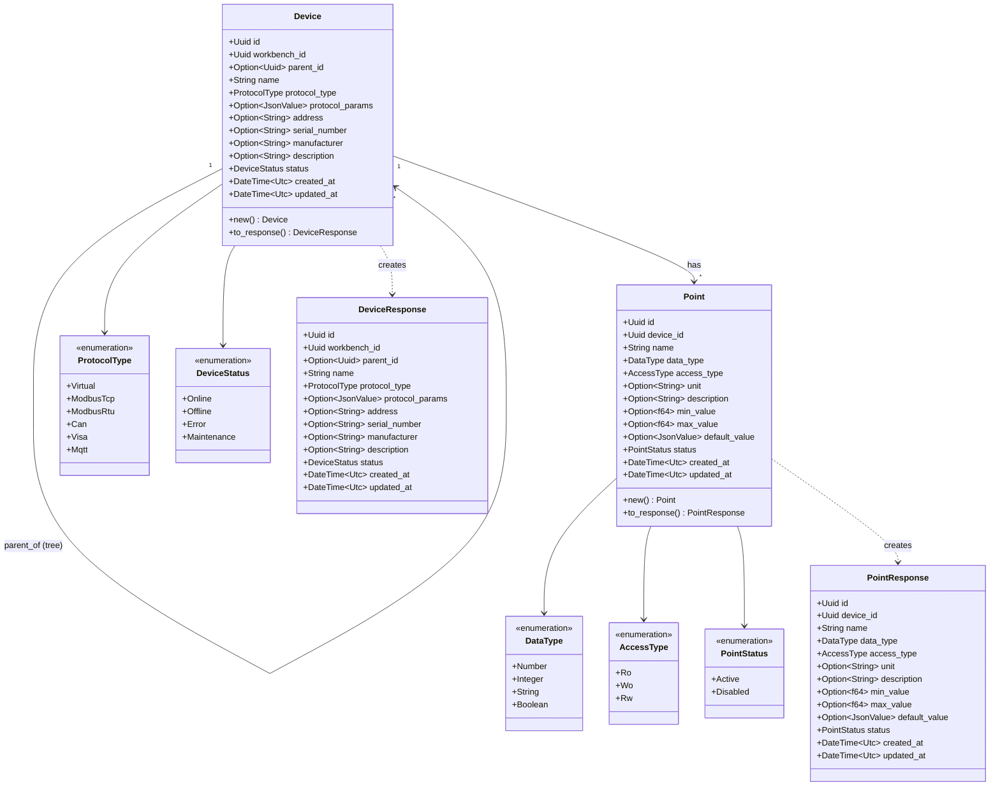
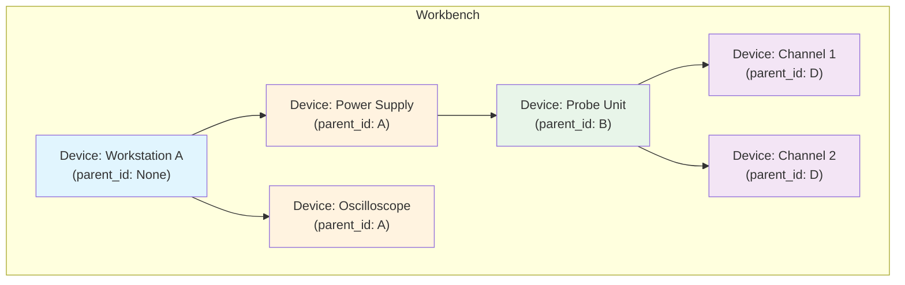
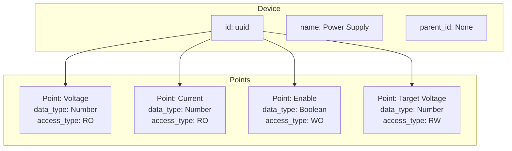
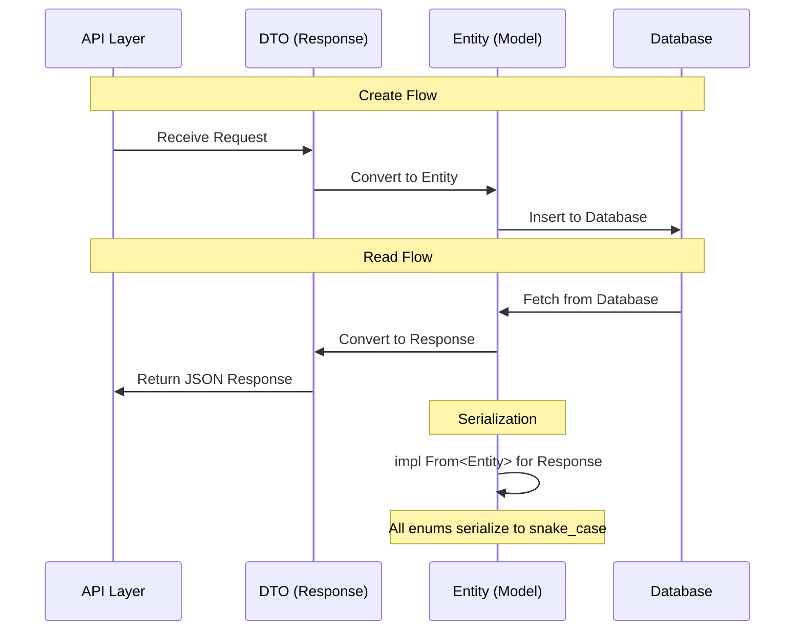
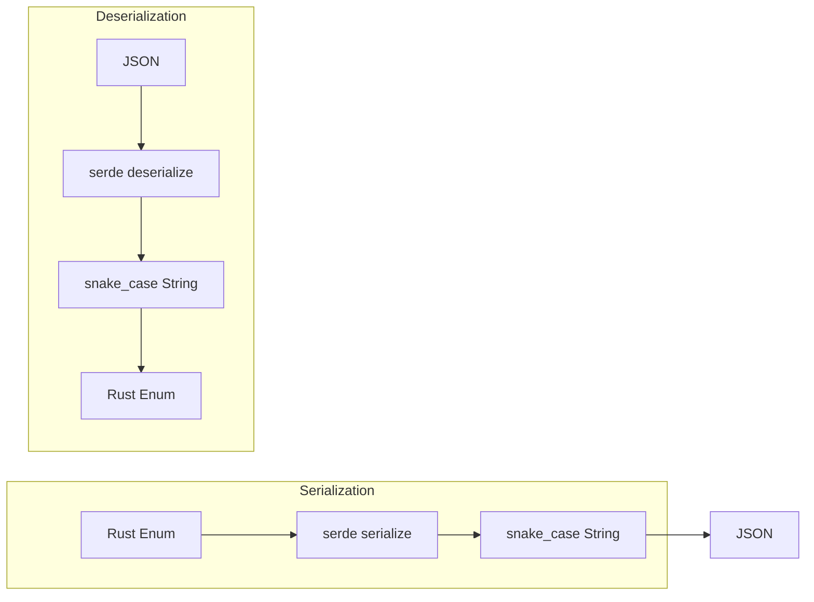

# S1-016: 设备与测点数据模型 - 详细设计文档

**任务ID**: S1-016  
**任务名称**: 设备与测点数据模型 (Device and Point Data Model)  
**版本**: 1.0  
**创建日期**: 2026-03-22  
**状态**: Draft  
**依赖任务**: S1-003 (SQLite数据库Schema设计)  
**后续任务**: S1-019 (设备管理功能) / S1-021 (设备CRUD操作)

---

## 目录

1. [设计概述](#1-设计概述)
2. [UML设计图](#2-uml设计图)
3. [数据模型定义](#3-数据模型定义)
4. [DTO定义](#4-dto定义)
5. [接口定义](#5-接口定义)
6. [转换实现](#6-转换实现)
7. [枚举序列化配置](#7-枚举序列化配置)
8. [文件结构](#8-文件结构)
9. [验收标准映射](#9-验收标准映射)
10. [设计决策记录](#10-设计决策记录)

---

## 1. 设计概述

### 1.1 设计目标

本设计文档定义Kayak系统设备和测点的Rust数据结构，包括：
- **Device (设备)**: 试验仪器的抽象，支持嵌套结构（树形）
- **Point (测点)**: 设备的具体读写单元

### 1.2 设计原则

1. **依赖倒置原则 (DIP)**: 定义接口抽象，具体实现依赖于接口
2. **snake_case序列化**: 所有枚举类型使用snake_case格式进行JSON序列化
3. **UUID主键**: 所有实体使用UUID作为主键
4. **时间戳追踪**: 每个实体包含`created_at`和`updated_at`字段

### 1.3 与S1-003数据库Schema对应关系

| 数据模型 | 数据库表 | 说明 |
|---------|---------|------|
| `Device` | `devices` | 设备表，支持parent_id自引用实现树形结构 |
| `Point` | `points` | 测点表，关联devices表 |

---

## 2. UML设计图

### 2.1 实体类图



### 2.2 设备树形结构图



### 2.3 测点与设备关系图



### 2.4 数据流图



### 2.5 枚举序列化流程图



---

## 3. 数据模型定义

### 3.1 Device实体

**文件**: `kayak-backend/src/models/entities/device.rs`

```rust
//! Device entity definition
//! 
//! Device represents a test instrument with support for hierarchical (tree) structure
//! through parent_id self-reference.

use chrono::{DateTime, Utc};
use serde::{Deserialize, Serialize};
use serde_json::Value as JsonValue;
use uuid::Uuid;

/// 设备协议类型
/// 
/// 使用snake_case序列化: "virtual", "modbus_tcp", "modbus_rtu", "can", "visa", "mqtt"
#[derive(Debug, Clone, Copy, PartialEq, Eq, Serialize, Deserialize)]
#[serde(rename_all = "snake_case")]
pub enum ProtocolType {
    Virtual,
    ModbusTcp,
    ModbusRtu,
    Can,
    Visa,
    Mqtt,
}

impl Default for ProtocolType {
    fn default() -> Self {
        ProtocolType::Virtual
    }
}

/// 设备状态
/// 
/// 使用snake_case序列化: "online", "offline", "error", "maintenance"
#[derive(Debug, Clone, Copy, PartialEq, Eq, Serialize, Deserialize)]
#[serde(rename_all = "snake_case")]
pub enum DeviceStatus {
    Online,
    Offline,
    Error,
    Maintenance,
}

impl Default for DeviceStatus {
    fn default() -> Self {
        DeviceStatus::Offline
    }
}

/// 设备实体
/// 
/// 代表试验仪器，支持嵌套结构（树形）通过parent_id实现
#[derive(Debug, Clone, Serialize, Deserialize)]
pub struct Device {
    /// 设备ID (UUID)
    pub id: Uuid,
    /// 所属工作台ID
    pub workbench_id: Uuid,
    /// 父设备ID（支持嵌套，None表示根设备）
    pub parent_id: Option<Uuid>,
    /// 设备名称
    pub name: String,
    /// 协议类型
    pub protocol_type: ProtocolType,
    /// 协议参数（JSON格式）
    pub protocol_params: Option<JsonValue>,
    /// 设备地址/连接信息
    pub address: Option<String>,
    /// 序列号
    pub serial_number: Option<String>,
    /// 制造商
    pub manufacturer: Option<String>,
    /// 设备描述
    pub description: Option<String>,
    /// 设备状态
    pub status: DeviceStatus,
    /// 创建时间
    pub created_at: DateTime<Utc>,
    /// 更新时间
    pub updated_at: DateTime<Utc>,
}

impl Device {
    /// 创建新设备
    /// 
    /// # Arguments
    /// * `workbench_id` - 所属工作台ID
    /// * `name` - 设备名称
    /// * `protocol_type` - 协议类型
    /// * `parent_id` - 父设备ID（None表示根设备）
    /// 
    /// # Example
    /// ```rust
    /// let device = Device::new(
    ///     workbench_id,
    ///     "Power Supply".to_string(),
    ///     ProtocolType::ModbusTcp,
    ///     Some(parent_device_id),
    /// );
    /// ```
    pub fn new(
        workbench_id: Uuid,
        name: String,
        protocol_type: ProtocolType,
        parent_id: Option<Uuid>,
    ) -> Self {
        let now = Utc::now();
        Self {
            id: Uuid::new_v4(),
            workbench_id,
            parent_id,
            name,
            protocol_type,
            protocol_params: None,
            address: None,
            serial_number: None,
            manufacturer: None,
            description: None,
            status: DeviceStatus::default(),
            created_at: now,
            updated_at: now,
        }
    }
}
```

### 3.2 Point实体

**文件**: `kayak-backend/src/models/entities/point.rs`

```rust
//! Point entity definition
//! 
//! Point represents a specific read/write unit of a device.

use chrono::{DateTime, Utc};
use serde::{Deserialize, Serialize};
use serde_json::Value as JsonValue;
use uuid::Uuid;

/// 数据类型
/// 
/// 使用snake_case序列化: "number", "integer", "string", "boolean"
#[derive(Debug, Clone, Copy, PartialEq, Eq, Serialize, Deserialize)]
#[serde(rename_all = "snake_case")]
pub enum DataType {
    Number,
    Integer,
    String,
    Boolean,
}

impl Default for DataType {
    fn default() -> Self {
        DataType::Number
    }
}

/// 访问类型
/// 
/// 使用snake_case序列化: "ro", "wo", "rw"
/// - RO (Read Only): 只读，适用于传感器读数
/// - WO (Write Only): 只写，适用于控制指令
/// - RW (Read/Write): 读写，适用于可读写设定值
#[derive(Debug, Clone, Copy, PartialEq, Eq, Serialize, Deserialize)]
#[serde(rename_all = "snake_case")]
pub enum AccessType {
    Ro,
    Wo,
    Rw,
}

impl Default for AccessType {
    fn default() -> Self {
        AccessType::Ro
    }
}

/// 测点状态
/// 
/// 使用snake_case序列化: "active", "disabled"
#[derive(Debug, Clone, Copy, PartialEq, Eq, Serialize, Deserialize)]
#[serde(rename_all = "snake_case")]
pub enum PointStatus {
    Active,
    Disabled,
}

impl Default for PointStatus {
    fn default() -> Self {
        PointStatus::Active
    }
}

/// 测点实体
/// 
/// 代表设备的测点（数据点），用于读写操作
#[derive(Debug, Clone, Serialize, Deserialize)]
pub struct Point {
    /// 测点ID (UUID)
    pub id: Uuid,
    /// 所属设备ID
    pub device_id: Uuid,
    /// 测点名称
    pub name: String,
    /// 数据类型
    pub data_type: DataType,
    /// 访问类型
    pub access_type: AccessType,
    /// 单位（如°C, V, A等）
    pub unit: Option<String>,
    /// 测点描述
    pub description: Option<String>,
    /// 最小值（用于验证）
    pub min_value: Option<f64>,
    /// 最大值（用于验证）
    pub max_value: Option<f64>,
    /// 默认值（JSON格式存储）
    pub default_value: Option<JsonValue>,
    /// 测点状态
    pub status: PointStatus,
    /// 创建时间
    pub created_at: DateTime<Utc>,
    /// 更新时间
    pub updated_at: DateTime<Utc>,
}

impl Point {
    /// 创建新测点
    /// 
    /// # Arguments
    /// * `device_id` - 所属设备ID
    /// * `name` - 测点名称
    /// * `data_type` - 数据类型
    /// * `access_type` - 访问类型
    /// 
    /// # Example
    /// ```rust
    /// let point = Point::new(
    ///     device_id,
    ///     "Temperature".to_string(),
    ///     DataType::Number,
    ///     AccessType::Ro,
    /// );
    /// ```
    pub fn new(
        device_id: Uuid,
        name: String,
        data_type: DataType,
        access_type: AccessType,
    ) -> Self {
        let now = Utc::now();
        Self {
            id: Uuid::new_v4(),
            device_id,
            name,
            data_type,
            access_type,
            unit: None,
            description: None,
            min_value: None,
            max_value: None,
            default_value: None,
            status: PointStatus::default(),
            created_at: now,
            updated_at: now,
        }
    }
}
```

---

## 4. DTO定义

### 4.1 DeviceResponse DTO

```rust
//! Device response DTO for API
//! 
//! Used for serialization of Device entity to JSON response.

use serde::Serialize;
use uuid::Uuid;
use chrono::{DateTime, Utc};
use serde_json::Value as JsonValue;
use crate::models::entities::device::{Device, DeviceStatus, ProtocolType};

/// 设备响应DTO
/// 
/// 用于API响应的设备数据结构
#[derive(Debug, Clone, Serialize)]
#[serde(rename_all = "snake_case")]
pub struct DeviceResponse {
    /// 设备ID
    pub id: Uuid,
    /// 所属工作台ID
    pub workbench_id: Uuid,
    /// 父设备ID
    pub parent_id: Option<Uuid>,
    /// 设备名称
    pub name: String,
    /// 协议类型
    pub protocol_type: ProtocolType,
    /// 协议参数
    pub protocol_params: Option<JsonValue>,
    /// 设备地址
    pub address: Option<String>,
    /// 序列号
    pub serial_number: Option<String>,
    /// 制造商
    pub manufacturer: Option<String>,
    /// 设备描述
    pub description: Option<String>,
    /// 设备状态
    pub status: DeviceStatus,
    /// 创建时间
    pub created_at: DateTime<Utc>,
    /// 更新时间
    pub updated_at: DateTime<Utc>,
}

impl From<Device> for DeviceResponse {
    fn from(device: Device) -> Self {
        Self {
            id: device.id,
            workbench_id: device.workbench_id,
            parent_id: device.parent_id,
            name: device.name,
            protocol_type: device.protocol_type,
            protocol_params: device.protocol_params,
            address: device.address,
            serial_number: device.serial_number,
            manufacturer: device.manufacturer,
            description: device.description,
            status: device.status,
            created_at: device.created_at,
            updated_at: device.updated_at,
        }
    }
}
```

### 4.2 PointResponse DTO

```rust
//! Point response DTO for API
//! 
//! Used for serialization of Point entity to JSON response.

use serde::Serialize;
use uuid::Uuid;
use chrono::{DateTime, Utc};
use serde_json::Value as JsonValue;
use crate::models::entities::point::{Point, PointStatus, DataType, AccessType};

/// 测点响应DTO
/// 
/// 用于API响应的测点数据结构
#[derive(Debug, Clone, Serialize)]
#[serde(rename_all = "snake_case")]
pub struct PointResponse {
    /// 测点ID
    pub id: Uuid,
    /// 所属设备ID
    pub device_id: Uuid,
    /// 测点名称
    pub name: String,
    /// 数据类型
    pub data_type: DataType,
    /// 访问类型
    pub access_type: AccessType,
    /// 单位
    pub unit: Option<String>,
    /// 测点描述
    pub description: Option<String>,
    /// 最小值
    pub min_value: Option<f64>,
    /// 最大值
    pub max_value: Option<f64>,
    /// 默认值
    pub default_value: Option<JsonValue>,
    /// 测点状态
    pub status: PointStatus,
    /// 创建时间
    pub created_at: DateTime<Utc>,
    /// 更新时间
    pub updated_at: DateTime<Utc>,
}

impl From<Point> for PointResponse {
    fn from(point: Point) -> Self {
        Self {
            id: point.id,
            device_id: point.device_id,
            name: point.name,
            data_type: point.data_type,
            access_type: point.access_type,
            unit: point.unit,
            description: point.description,
            min_value: point.min_value,
            max_value: point.max_value,
            default_value: point.default_value,
            status: point.status,
            created_at: point.created_at,
            updated_at: point.updated_at,
        }
    }
}
```

---

## 5. 接口定义

### 5.1 DeviceRepository Trait (依赖倒置原则)

```rust
//! Device repository trait for dependency inversion
//! 
//! This trait defines the contract for device data access.
//! Concrete implementations (e.g., using sqlx) depend on this abstraction.

use uuid::Uuid;
use crate::models::entities::device::Device;

/// Device repository trait
/// 
/// Defines the contract for device data access operations.
/// Implementations should handle persistence (e.g., sqlx, mock, etc.)
pub trait DeviceRepository: Send + Sync {
    /// 根据ID查找设备
    fn find_by_id(&self, id: Uuid) -> Result<Option<Device>, RepositoryError>;
    
    /// 根据工作台ID查找所有设备
    fn find_by_workbench_id(&self, workbench_id: Uuid) -> Result<Vec<Device>, RepositoryError>;
    
    /// 根据父设备ID查找子设备
    fn find_by_parent_id(&self, parent_id: Uuid) -> Result<Vec<Device>, RepositoryError>;
    
    /// 查找设备的所有子孙设备（递归）
    fn find_descendants(&self, id: Uuid) -> Result<Vec<Device>, RepositoryError>;
    
    /// 创建设备
    fn create(&self, device: &Device) -> Result<(), RepositoryError>;
    
    /// 更新设备
    fn update(&self, device: &Device) -> Result<(), RepositoryError>;
    
    /// 删除设备
    fn delete(&self, id: Uuid) -> Result<(), RepositoryError>;
}

/// Repository错误类型
#[derive(Debug, thiserror::Error)]
pub enum RepositoryError {
    #[error("Device not found: {0}")]
    NotFound(Uuid),
    
    #[error("Database error: {0}")]
    DatabaseError(String),
    
    #[error("Serialization error: {0}")]
    SerializationError(String),
}
```

### 5.2 PointRepository Trait

```rust
//! Point repository trait for dependency inversion
//! 
//! This trait defines the contract for point data access.

use uuid::Uuid;
use crate::models::entities::point::Point;

/// Point repository trait
/// 
/// Defines the contract for point data access operations.
pub trait PointRepository: Send + Sync {
    /// 根据ID查找测点
    fn find_by_id(&self, id: Uuid) -> Result<Option<Point>, RepositoryError>;
    
    /// 根据设备ID查找所有测点
    fn find_by_device_id(&self, device_id: Uuid) -> Result<Vec<Point>, RepositoryError>;
    
    /// 创建立点
    fn create(&self, point: &Point) -> Result<(), RepositoryError>;
    
    /// 更新测点
    fn update(&self, point: &Point) -> Result<(), RepositoryError>;
    
    /// 删除测点
    fn delete(&self, id: Uuid) -> Result<(), RepositoryError>;
}

/// Repository错误类型
#[derive(Debug, thiserror::Error)]
pub enum RepositoryError {
    #[error("Point not found: {0}")]
    NotFound(Uuid),
    
    #[error("Database error: {0}")]
    DatabaseError(String),
    
    #[error("Serialization error: {0}")]
    SerializationError(String),
}
```

### 5.3 实体转换为Response的Trait

```rust
//! Trait for converting entities to response DTOs
//! 
//! This provides a consistent interface for DTO conversion.

use crate::models::entities::{device::Device, point::Point};
use crate::models::dto::{DeviceResponse, PointResponse};

/// Device to Response conversion trait
pub trait IntoDeviceResponse {
    fn into_response(self) -> DeviceResponse;
}

/// Point to Response conversion trait
pub trait IntoPointResponse {
    fn into_response(self) -> PointResponse;
}

impl IntoDeviceResponse for Device {
    fn into_response(self) -> DeviceResponse {
        DeviceResponse::from(self)
    }
}

impl IntoPointResponse for Point {
    fn into_response(self) -> PointResponse {
        PointResponse::from(self)
    }
}
```

---

## 6. 转换实现

### 6.1 Device → DeviceResponse

```rust
// 已在DTO定义章节实现，见 PointResponse::from()

// 使用示例:
let device = Device::new(
    workbench_id,
    "Power Supply".to_string(),
    ProtocolType::ModbusTcp,
    None,
);
let response = DeviceResponse::from(device);
// 或者使用trait方法
let response: DeviceResponse = device.into_response();
```

### 6.2 Point → PointResponse

```rust
// 已在DTO定义章节实现，见 PointResponse::from()

// 使用示例:
let point = Point::new(
    device_id,
    "Voltage".to_string(),
    DataType::Number,
    AccessType::Ro,
);
let response = PointResponse::from(point);
// 或者使用trait方法
let response: PointResponse = point.into_response();
```

### 6.3 批量转换

```rust
/// 将设备列表转换为响应DTO列表
pub fn devices_to_responses(devices: Vec<Device>) -> Vec<DeviceResponse> {
    devices.into_iter().map(DeviceResponse::from).collect()
}

/// 将测点列表转换为响应DTO列表
pub fn points_to_responses(points: Vec<Point>) -> Vec<PointResponse> {
    points.into_iter().map(PointResponse::from).collect()
}
```

---

## 7. 枚举序列化配置

### 7.1 序列化格式验证

所有枚举类型必须支持snake_case格式的JSON序列化/反序列化：

```rust
#[cfg(test)]
mod tests {
    use super::*;
    use serde_json;
    
    // ProtocolType 序列化测试
    #[test]
    fn test_protocol_type_serialization() {
        assert_eq!(serde_json::to_string(&ProtocolType::Virtual).unwrap(), "\"virtual\"");
        assert_eq!(serde_json::to_string(&ProtocolType::ModbusTcp).unwrap(), "\"modbus_tcp\"");
        assert_eq!(serde_json::to_string(&ProtocolType::ModbusRtu).unwrap(), "\"modbus_rtu\"");
        assert_eq!(serde_json::to_string(&ProtocolType::Can).unwrap(), "\"can\"");
        assert_eq!(serde_json::to_string(&ProtocolType::Visa).unwrap(), "\"visa\"");
        assert_eq!(serde_json::to_string(&ProtocolType::Mqtt).unwrap(), "\"mqtt\"");
    }
    
    // ProtocolType 反序列化测试
    #[test]
    fn test_protocol_type_deserialization() {
        let p: ProtocolType = serde_json::from_str("\"virtual\"").unwrap();
        assert_eq!(p, ProtocolType::Virtual);
        
        let p: ProtocolType = serde_json::from_str("\"modbus_tcp\"").unwrap();
        assert_eq!(p, ProtocolType::ModbusTcp);
    }
    
    // DataType 序列化测试
    #[test]
    fn test_data_type_serialization() {
        assert_eq!(serde_json::to_string(&DataType::Number).unwrap(), "\"number\"");
        assert_eq!(serde_json::to_string(&DataType::Integer).unwrap(), "\"integer\"");
        assert_eq!(serde_json::to_string(&DataType::String).unwrap(), "\"string\"");
        assert_eq!(serde_json::to_string(&DataType::Boolean).unwrap(), "\"boolean\"");
    }
    
    // AccessType 序列化测试
    #[test]
    fn test_access_type_serialization() {
        assert_eq!(serde_json::to_string(&AccessType::Ro).unwrap(), "\"ro\"");
        assert_eq!(serde_json::to_string(&AccessType::Wo).unwrap(), "\"wo\"");
        assert_eq!(serde_json::to_string(&AccessType::Rw).unwrap(), "\"rw\"");
    }
    
    // DeviceStatus 序列化测试
    #[test]
    fn test_device_status_serialization() {
        assert_eq!(serde_json::to_string(&DeviceStatus::Online).unwrap(), "\"online\"");
        assert_eq!(serde_json::to_string(&DeviceStatus::Offline).unwrap(), "\"offline\"");
        assert_eq!(serde_json::to_string(&DeviceStatus::Error).unwrap(), "\"error\"");
        assert_eq!(serde_json::to_string(&DeviceStatus::Maintenance).unwrap(), "\"maintenance\"");
    }
    
    // PointStatus 序列化测试
    #[test]
    fn test_point_status_serialization() {
        assert_eq!(serde_json::to_string(&PointStatus::Active).unwrap(), "\"active\"");
        assert_eq!(serde_json::to_string(&PointStatus::Disabled).unwrap(), "\"disabled\"");
    }
}
```

### 7.2 JSON序列化示例

**Device JSON输出**:
```json
{
  "id": "550e8400-e29b-41d4-a716-446655440000",
  "workbench_id": "550e8400-e29b-41d4-a716-446655440001",
  "parent_id": null,
  "name": "Power Supply",
  "protocol_type": "modbus_tcp",
  "protocol_params": {"host": "192.168.1.100", "port": 502},
  "address": "192.168.1.100:502",
  "serial_number": "PS-2024-001",
  "manufacturer": "Acme Corp",
  "description": "Main power supply unit",
  "status": "online",
  "created_at": "2026-03-22T10:00:00Z",
  "updated_at": "2026-03-22T10:00:00Z"
}
```

**Point JSON输出**:
```json
{
  "id": "550e8400-e29b-41d4-a716-446655440002",
  "device_id": "550e8400-e29b-41d4-a716-446655440000",
  "name": "Voltage",
  "data_type": "number",
  "access_type": "ro",
  "unit": "V",
  "description": "Output voltage reading",
  "min_value": 0.0,
  "max_value": 30.0,
  "default_value": null,
  "status": "active",
  "created_at": "2026-03-22T10:00:00Z",
  "updated_at": "2026-03-22T10:00:00Z"
}
```

---

## 8. 文件结构

```
kayak-backend/src/models/
├── mod.rs                      # 模型模块入口
├── entities/
│   ├── mod.rs                  # 实体模块入口
│   ├── device.rs               # [新增] 设备实体定义
│   ├── point.rs                # [新增] 测点实体定义
│   └── tests/
│       ├── mod.rs
│       ├── device_test.rs      # [新增] 设备测试
│       └── point_test.rs       # [新增] 测点测试
├── dto/
│   ├── mod.rs                  # [新增] DTO模块入口
│   ├── device_response.rs      # [新增] 设备响应DTO
│   └── point_response.rs       # [新增] 测点响应DTO
├── repository/
│   ├── mod.rs                  # [新增] Repository模块入口
│   ├── device_repository.rs    # [新增] 设备Repository接口
│   └── point_repository.rs     # [新增] 测点Repository接口
└── converters.rs               # [新增] 实体-DTO转换工具
```

---

## 9. 验收标准映射

| 验收标准 | 实现内容 | 测试用例 |
|---------|---------|---------|
| 1. 支持设备父子关系 | `Device.parent_id: Option<Uuid>` 字段，支持树形嵌套 | TC-S1-016-01 ~ TC-S1-016-07 |
| 2. 测点支持RO/WO/RW访问类型 | `AccessType` 枚举: Ro, Wo, Rw | TC-S1-016-13 ~ TC-S1-016-15 |
| 3. 支持多种数据类型 | `DataType` 枚举: Number, Integer, String, Boolean | TC-S1-016-16 ~ TC-S1-016-19 |
| 4. DTO转换 | `DeviceResponse::from()` / `PointResponse::from()` | TC-S1-016-23, TC-S1-016-25 |
| 5. snake_case序列化 | `#[serde(rename_all = "snake_case")]` | TC-S1-016-27 ~ TC-S1-016-30 |

---

## 10. 设计决策记录

### 决策1: AccessType枚举命名 (Ro/Wo/Rw vs RO/WO/RW)

**选择**: 使用 `Ro`, `Wo`, `Rw`（首字母大写）

**理由**:
- Rust枚举命名惯例使用 `PascalCase`
- 序列化后为 `snake_case`: `"ro"`, `"wo"`, `"rw"`
- 与 `DataType` 和 `DeviceStatus` 保持一致的命名风格

**替代方案考虑**:
- 使用全大写 `RO`, `WO`, `RW`:
  - 缺点: 与Rust枚举命名惯例不符
  - 序列化后仍为 `"ro"`, `"wo"`, `"rw"`（因为serde rename）

### 决策2: PointStatus使用Disabled而非Inactive

**选择**: 使用 `Active`, `Disabled`

**理由**:
- 与测试用例 TC-S1-016-20 一致
- `Disabled` 更明确表示测点被禁用
- 避免与 `DeviceStatus` 的命名混淆

### 决策3: 使用 trait + impl 模式定义转换

**选择**: 使用 `impl From<T> for U` 和 trait method

**理由**:
- `From` trait 是Rust标准库的惯用模式
- 提供 `into_response()` 方法作为便捷接口
- 便于批量转换和测试

### 决策4: Repository trait 使用依赖倒置

**选择**: 定义 `DeviceRepository` 和 `PointRepository` trait

**理由**:
- 遵循依赖倒置原则 (DIP)
- 便于单元测试时使用 mock 实现
- 具体持久化实现（sqlx）依赖于抽象接口

---

## 附录

### A.1 依赖项

| 依赖 | 版本 | 用途 |
|------|------|------|
| chrono | 0.4 | DateTime处理 |
| serde | 1.0 | 序列化/反序列化 |
| serde_json | 1.0 | JSON处理 |
| uuid | 1.6 | UUID生成 |
| thiserror | 1.0 | 错误类型定义 |

### A.2 与S1-003 Schema对应

| 字段 | S1-003 Schema类型 | Rust类型 |
|------|-------------------|----------|
| id | TEXT (UUID) | Uuid |
| workbench_id | TEXT (UUID) | Uuid |
| parent_id | TEXT (UUID, nullable) | Option<Uuid> |
| name | TEXT | String |
| protocol_type | TEXT | ProtocolType |
| protocol_params | TEXT (JSON) | Option<JsonValue> |
| address | TEXT | Option<String> |
| serial_number | TEXT | Option<String> |
| manufacturer | TEXT | Option<String> |
| description | TEXT | Option<String> |
| status | TEXT | DeviceStatus/PointStatus |
| created_at | TEXT (ISO 8601) | DateTime<Utc> |
| updated_at | TEXT (ISO 8601) | DateTime<Utc> |

### A.3 文档历史

| 版本 | 日期 | 修改人 | 修改说明 |
|------|------|--------|---------|
| 1.0 | 2026-03-22 | sw-tom | 初始版本创建 |

---

**文档结束**
