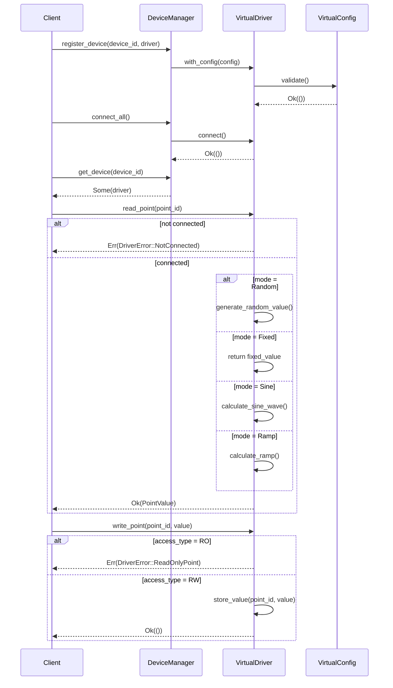

# S1-017: 虚拟设备协议插件框架 - 详细设计文档

**任务ID**: S1-017  
**任务名称**: 虚拟设备协议插件框架 (Virtual Device Protocol Plugin Framework)  
**文档版本**: 1.0  
**创建日期**: 2026-03-22  
**状态**: Draft

---

## 1. 概述

### 1.1 设计目标

本文档定义了虚拟设备协议插件框架的详细设计方案，旨在为设备驱动提供统一的抽象接口，并实现虚拟设备驱动以支持模拟数据生成。该设计遵循依赖倒置原则(DIP)，使上层业务逻辑与具体驱动实现解耦。

### 1.2 设计范围

- 定义 `DeviceDriver` trait 统一接口
- 实现 `VirtualDriver` 虚拟设备驱动
- 实现 `DeviceManager` 设备生命周期管理器
- 定义完善的数据类型和错误处理枚举

### 1.3 术语定义

| 术语 | 定义 |
|------|------|
| Point/测点 | 设备上的具体数据读写单元 |
| Driver/驱动 | 设备通信协议的实现抽象 |
| Virtual Mode | 虚拟设备数据生成模式 |

---

## 2. 架构设计

### 2.1 模块位置

```
kayak-backend/src/
├── drivers/
│   ├── mod.rs          # 模块导出
│   ├── core.rs         # DeviceDriver trait 定义
│   ├── virtual.rs      # VirtualDriver 实现
│   └── manager.rs      # DeviceManager 实现
```

### 2.2 静态组成图

```mermaid
classDiagram
    class DeviceDriver {
        <<trait>>
        +type Config
        +type Error
        +connect() -> Result~()~
        +disconnect() -> Result~()~
        +read_point(point_id: Uuid) -> Result~PointValue~
        +write_point(point_id: Uuid, value: PointValue) -> Result~()~
        +is_connected() -> bool
    }
    
    class VirtualDriver {
        -config: VirtualConfig
        -connected: bool
        -point_values: Arc~Mutex~HashMap~Uuid, PointValue~~
        +new() -> Self
        +default() -> Self
        +with_config(config: VirtualConfig) -> Self
        +get_config() -> &VirtualConfig
        +connect() -> Result~()~
        +disconnect() -> Result~()~
        +read_point(point_id: Uuid) -> Result~PointValue~
        +write_point(point_id: Uuid, value: PointValue) -> Result~()~
        +is_connected() -> bool
    }
    
    class VirtualConfig {
        +mode: VirtualMode
        +data_type: DataType
        +access_type: AccessType
        +min_value: f64
        +max_value: f64
        +fixed_value: PointValue
        +validate(config: &VirtualConfig) -> Result~(), VirtualConfigError~
        +validate_self(&self) -> Result~(), VirtualConfigError~
    }
    
    class VirtualConfigError {
        <<enumeration>>
        +InvalidRange{ min: f64, max: f64 }
    }
    
    class DeviceManager {
        -devices: HashMap~Uuid, Arc~RwLock~dyn DeviceDriver~~
        +new() -> Self
        +register_device(id: Uuid, driver: impl DeviceDriver) -> Result~()~
        +unregister_device(id: Uuid) -> Result~()~
        +get_device(id: Uuid) -> Option~Arc~RwLock~dyn DeviceDriver~~
        +connect_all() -> Vec~Result~Uuid, (Uuid, DriverError)~~
        +disconnect_all() -> Vec~Result~Uuid, (Uuid, DriverError)~~
    }
    
    class VirtualMode {
        <<enumeration>>
        +Random
        +Fixed
        +Sine
        +Ramp
    }
    
    class DataType {
        <<enumeration>>
        +Number
        +Integer
        +String
        +Boolean
    }
    
    class AccessType {
        <<enumeration>>
        +RO
        +WO
        +RW
    }
    
    class PointValue {
        <<enumeration>>
        +Number(f64)
        +Integer(i64)
        +String(String)
        +Boolean(bool)
    }
    
    class DriverError {
        <<enumeration>>
        +NotConnected
        +AlreadyConnected
        +Timeout{ duration: Duration }
        +InvalidValue{ message: String }
        +ReadOnlyPoint
        +ConfigError(String)
        +IoError(String)
    }
    
    DeviceDriver <|.. VirtualDriver : implements
    VirtualDriver o-- VirtualConfig : uses
    VirtualConfig ..> VirtualConfigError : validate
    DeviceManager o-- "Arc~RwLock~dyn DeviceDriver" DeviceDriver : manages
    VirtualMode .. PointValue : generates
    PointValue .. DriverError : returns
```

### 2.3 动态逻辑图 - 数据读取流程



---

## 3. 数据类型定义

### 3.1 PointValue 枚举

```rust
/// 表示测点的值，支持多种数据类型
#[derive(Debug, Clone, PartialEq, PartialOrd)]
pub enum PointValue {
    Number(f64),
    Integer(i64),
    String(String),
    Boolean(bool),
}

impl PointValue {
    /// 获取值的类型描述
    pub fn type_name(&self) -> &'static str {
        match self {
            PointValue::Number(_) => "Number",
            PointValue::Integer(_) => "Integer",
            PointValue::String(_) => "String",
            PointValue::Boolean(_) => "Boolean",
        }
    }
    
    /// 转换为 f64（如果可能）
    pub fn to_f64(&self) -> Option<f64> {
        match self {
            PointValue::Number(n) => Some(*n),
            PointValue::Integer(n) => Some(*n as f64),
            PointValue::Boolean(b) => Some(if *b { 1.0 } else { 0.0 }),
            PointValue::String(_) => None,
        }
    }
}
```

### 3.2 VirtualMode 枚举

```rust
/// 虚拟设备的数据生成模式
#[derive(Debug, Clone, Copy, PartialEq, Eq, Default)]
pub enum VirtualMode {
    /// 随机数据模式
    #[default]
    Random,
    /// 固定值模式
    Fixed,
    /// 正弦波模式
    Sine,
    /// 斜坡（线性递增）模式
    Ramp,
}
```

### 3.3 DataType 枚举

```rust
/// 支持的数据类型
#[derive(Debug, Clone, Copy, PartialEq, Eq, Default)]
pub enum DataType {
    /// 浮点数（默认）
    #[default]
    Number,
    /// 整数
    Integer,
    /// 字符串
    String,
    /// 布尔值
    Boolean,
}
```

### 3.4 AccessType 枚举

```rust
/// 测点访问类型
#[derive(Debug, Clone, Copy, PartialEq, Eq, Default)]
pub enum AccessType {
    /// 只读
    #[default]
    RO,
    /// 只写
    WO,
    /// 读写
    RW,
}
```

---

## 4. 错误处理定义

### 4.1 DriverError 枚举

```rust
use std::time::Duration;

/// 设备驱动错误类型
#[derive(Debug, Clone)]
pub enum DriverError {
    /// 设备未连接
    NotConnected,
    /// 设备已连接（重复连接）
    AlreadyConnected,
    /// 操作超时
    Timeout { duration: Duration },
    /// 无效的值
    InvalidValue { message: String },
    /// 尝试写入只读测点
    ReadOnlyPoint,
    /// 配置错误
    ConfigError(String),
    /// IO错误
    IoError(String),
}

impl std::fmt::Display for DriverError {
    fn fmt(&self, f: &mut std::fmt::Formatter<'_>) -> std::fmt::Result {
        match self {
            DriverError::NotConnected => write!(f, "Device not connected"),
            DriverError::AlreadyConnected => write!(f, "Device already connected"),
            DriverError::Timeout { duration } => write!(f, "Operation timeout after {:?}", duration),
            DriverError::InvalidValue { message } => write!(f, "Invalid value: {}", message),
            DriverError::ReadOnlyPoint => write!(f, "Cannot write to read-only point"),
            DriverError::ConfigError(msg) => write!(f, "Configuration error: {}", msg),
            DriverError::IoError(msg) => write!(f, "IO error: {}", msg),
        }
    }
}

impl std::error::Error for DriverError {}

/// VirtualConfig 验证错误
#[derive(Debug, Clone)]
pub enum VirtualConfigError {
    /// 无效的范围（min >= max）
    InvalidRange { min: f64, max: f64 },
}

impl std::fmt::Display for VirtualConfigError {
    fn fmt(&self, f: &mut std::fmt::Formatter<'_>) -> std::fmt::Result {
        match self {
            VirtualConfigError::InvalidRange { min, max } => {
                write!(f, "Invalid range: min ({}) >= max ({})", min, max)
            }
        }
    }
}

impl std::error::Error for VirtualConfigError {}
```

---

## 5. 接口设计

### 5.1 DeviceDriver Trait

```rust
use uuid::Uuid;
use async_trait::async_trait;

/// 设备驱动统一接口
/// 
/// 所有设备驱动必须实现此trait，提供标准化的连接、读写接口。
/// 使用依赖倒置原则，使业务逻辑与具体驱动实现解耦。
#[async_trait]
pub trait DeviceDriver: Send + Sync {
    /// 驱动配置类型
    type Config: Send + Sync;
    /// 驱动错误类型
    type Error: Send + Sync + std::fmt::Debug + std::fmt::Display + From<DriverError>;
    
    /// 连接到设备
    async fn connect(&mut self) -> Result<(), Self::Error>;
    
    /// 断开设备连接
    async fn disconnect(&mut self) -> Result<(), Self::Error>;
    
    /// 读取测点值
    /// 
    /// # Arguments
    /// * `point_id` - 测点UUID
    /// 
    /// # Returns
    /// * `Ok(PointValue)` - 读取成功
    /// * `Err(DriverError::NotConnected)` - 设备未连接
    async fn read_point(&self, point_id: Uuid) -> Result<PointValue, Self::Error>;
    
    /// 写入测点值
    /// 
    /// # Arguments
    /// * `point_id` - 测点UUID
    /// * `value` - 要写入的值
    async fn write_point(&self, point_id: Uuid, value: PointValue) -> Result<(), Self::Error>;
    
    /// 检查设备是否已连接
    fn is_connected(&self) -> bool;
}
```

### 5.2 Default 实现

```rust
impl DeviceDriver for VirtualDriver {
    // ... 实现细节
    
    /// is_connected 的默认实现返回 false
    fn is_connected(&self) -> bool {
        self.connected
    }
}
```

---

## 6. 配置设计

### 6.1 VirtualConfig 结构体

```rust
use serde::{Deserialize, Serialize};

/// 虚拟设备驱动配置
#[derive(Debug, Clone, Serialize, Deserialize)]
pub struct VirtualConfig {
    /// 数据生成模式
    pub mode: VirtualMode,
    
    /// 数据类型
    pub data_type: DataType,
    
    /// 访问类型
    pub access_type: AccessType,
    
    /// 随机值下界（包含）
    pub min_value: f64,
    
    /// 随机值上界（不包含）
    pub max_value: f64,
    
    /// 固定值（Fixed模式下使用）
    pub fixed_value: PointValue,
}

impl Default for VirtualConfig {
    fn default() -> Self {
        Self {
            mode: VirtualMode::Random,
            data_type: DataType::Number,
            access_type: AccessType::RO,
            min_value: 0.0,
            max_value: 100.0,
            fixed_value: PointValue::Number(0.0),
        }
    }
}

impl VirtualConfig {
    /// 验证配置有效性（静态方法）
    pub fn validate(config: &VirtualConfig) -> Result<(), VirtualConfigError> {
        if config.min_value >= config.max_value {
            return Err(VirtualConfigError::InvalidRange {
                min: config.min_value,
                max: config.max_value,
            });
        }
        Ok(())
    }
    
    /// 验证配置有效性（实例方法）
    pub fn validate_self(&self) -> Result<(), VirtualConfigError> {
        Self::validate(self)
    }
}
```

---

## 7. 实现设计

### 7.1 VirtualDriver 结构体

```rust
use std::collections::HashMap;
use std::sync::{Arc, RwLock};
use rand::Rng;

/// 虚拟设备驱动
/// 
/// 用于测试和模拟环境，支持多种数据生成模式。
pub struct VirtualDriver {
    config: VirtualConfig,
    connected: bool,
    /// 存储RW测点的用户写入值（使用Arc<Mutex<...>>提供Interior Mutability）
    point_values: Arc<Mutex<HashMap<Uuid, PointValue>>>,
    /// 用于生成随机数
    rng: Arc<RwLock<rand::rngs::StdRng>>,
    /// Sine/Ramp模式的起始时间
    start_time: Arc<RwLock<std::time::Instant>>,
}

// Standalone unsafe impl blocks for Send + Sync
// VirtualDriver contains Arc<RwLock<...>> which is Send + Sync when inner types are
unsafe impl Send for VirtualDriver {}
unsafe impl Sync for VirtualDriver {}

impl Default for VirtualDriver {
    fn default() -> Self {
        Self::new()
    }
}

impl VirtualDriver {
    /// 使用默认配置创建新驱动
    pub fn new() -> Self {
        Self {
            config: VirtualConfig::default(),
            connected: false,
            point_values: Arc::new(Mutex::new(HashMap::new())),
            rng: Arc::new(RwLock::new(rand::rngs::StdRng::from_entropy())),
            start_time: Arc::new(RwLock::new(std::time::Instant::now())),
        }
    }
    
    /// 使用指定配置创建驱动
    pub fn with_config(config: VirtualConfig) -> Result<Self, VirtualConfigError> {
        config.validate()?;
        Ok(Self {
            config,
            connected: false,
            point_values: Arc::new(Mutex::new(HashMap::new())),
            rng: Arc::new(RwLock::new(rand::rngs::StdRng::from_entropy())),
            start_time: Arc::new(RwLock::new(std::time::Instant::now())),
        })
    }
    
    /// 获取当前配置引用
    pub fn get_config(&self) -> &VirtualConfig {
        &self.config
    }
    
    /// 根据模式生成值
    fn generate_value(&self) -> PointValue {
        match self.config.mode {
            VirtualMode::Random => self.generate_random(),
            VirtualMode::Fixed => self.config.fixed_value.clone(),
            VirtualMode::Sine => self.generate_sine(),
            VirtualMode::Ramp => self.generate_ramp(),
        }
    }
    
    /// 生成随机值
    fn generate_random(&self) -> PointValue {
        let mut rng = self.rng.write().unwrap();
        match self.config.data_type {
            DataType::Number => {
                let r: f64 = rng.gen_range(self.config.min_value..self.config.max_value);
                PointValue::Number(r)
            }
            DataType::Integer => {
                let min_i = self.config.min_value as i64;
                let max_i = self.config.max_value as i64;
                let r: i64 = rng.gen_range(min_i..max_i);
                PointValue::Integer(r)
            }
            DataType::String => {
                // 生成随机字符串
                let len: usize = rng.gen_range(4..12);
                let chars: String = (0..len)
                    .map(|_| {
                        let idx = rng.gen_range(0..26);
                        (b'a' + idx) as char
                    })
                    .collect();
                PointValue::String(chars)
            }
            DataType::Boolean => {
                let r: bool = rng.gen();
                PointValue::Boolean(r)
            }
        }
    }
    
    /// 生成正弦波值
    fn generate_sine(&self) -> PointValue {
        let start = *self.start_time.read().unwrap();
        let elapsed = start.elapsed().as_secs_f64();
        let period = 2.0 * std::f64::consts::PI;
        let normalized = (elapsed * period / 10.0).sin(); // 10秒一个周期
        let value = normalized * (self.config.max_value - self.config.min_value) / 2.0
            + (self.config.max_value + self.config.min_value) / 2.0;
        PointValue::Number(value)
    }
    
    /// 生成斜坡值（线性递增，到达最大值后重置）
    fn generate_ramp(&self) -> PointValue {
        let start = *self.start_time.read().unwrap();
        let elapsed = start.elapsed().as_secs_f64();
        let range = self.config.max_value - self.config.min_value;
        let period = 10.0; // 10秒一个周期
        let value = (elapsed % period) / period * range + self.config.min_value;
        PointValue::Number(value)
    }
}
```

### 7.2 DeviceDriver Trait 实现

```rust
use async_trait::async_trait;

#[async_trait]
impl DeviceDriver for VirtualDriver {
    type Config = VirtualConfig;
    type Error = DriverError;

    async fn connect(&mut self) -> Result<(), Self::Error> {
        if self.connected {
            // 重复连接视为成功（幂等操作）
            return Ok(());
        }
        self.connected = true;
        *self.start_time.write().unwrap() = std::time::Instant::now();
        Ok(())
    }

    async fn disconnect(&mut self) -> Result<(), Self::Error> {
        self.connected = false;
        Ok(())
    }

    async fn read_point(&self, point_id: Uuid) -> Result<PointValue, Self::Error> {
        if !self.connected {
            return Err(DriverError::NotConnected);
        }
        
        // 如果是RW测点且有用户写入的值，返回写入的值
        let point_values = self.point_values.lock().unwrap();
        if let Some(value) = point_values.get(&point_id) {
            return Ok(value.clone());
        }
        
        Ok(self.generate_value())
    }

    async fn write_point(&self, point_id: Uuid, value: PointValue) -> Result<(), Self::Error> {
        if !self.connected {
            return Err(DriverError::NotConnected);
        }
        
        if self.config.access_type == AccessType::RO {
            return Err(DriverError::ReadOnlyPoint);
        }
        
        // 类型检查
        match (&self.config.data_type, &value) {
            (DataType::Number, PointValue::Number(_)) => {}
            (DataType::Number, PointValue::Integer(n)) => {
                let mut point_values = self.point_values.lock().unwrap();
                point_values.insert(point_id, PointValue::Number(*n as f64));
                return Ok(());
            }
            (DataType::Integer, PointValue::Integer(_)) => {}
            (DataType::String, PointValue::String(_)) => {}
            (DataType::Boolean, PointValue::Boolean(_)) => {}
            _ => {
                return Err(DriverError::InvalidValue {
                    message: format!("Type mismatch: expected {:?}, got {:?}", self.config.data_type, value)
                });
            }
        }
        
        let mut point_values = self.point_values.lock().unwrap();
        point_values.insert(point_id, value);
        Ok(())
    }

    fn is_connected(&self) -> bool {
        self.connected
    }
}
```

---

## 8. 设备管理器设计

### 8.1 DeviceManager 结构体

```rust
use std::collections::HashMap;
use std::sync::{Arc, RwLock};
use uuid::Uuid;
use futures::future::join_all;

/// 设备管理器
/// 
/// 负责管理所有设备的生命周期，支持批量操作。
/// 
/// # 存储设计说明
/// 
/// 设备存储使用 `Arc<RwLock<dyn DeviceDriver>>` 而不是简单的 `Arc<dyn DeviceDriver>`，
/// 这是因为 `DeviceDriver` trait 的 `connect()` 和 `disconnect()` 方法需要 `&mut self`。
/// 
/// 通过将每个驱动包装在 `RwLock` 中，我们可以：
/// 1. 通过 `Arc<RwLock<...>>` 提供安全的共享访问
/// 2. 使用 `.write().unwrap()` 获取 `&mut dyn DeviceDriver` 来调用需要可变引用的方法
/// 3. 保持线程安全性，同时支持可变操作
pub struct DeviceManager {
    devices: Arc<RwLock<HashMap<Uuid, Arc<RwLock<dyn DeviceDriver>>>>>,
}

impl DeviceManager {
    /// 创建新的设备管理器
    pub fn new() -> Self {
        Self {
            devices: Arc::new(RwLock::new(HashMap::new())),
        }
    }
    
    /// 注册设备
    /// 
    /// # Arguments
    /// * `id` - 设备唯一标识
    /// * `driver` - 设备驱动实例
    pub fn register_device<D: DeviceDriver + 'static>(
        &self, 
        id: Uuid, 
        driver: D
    ) -> Result<(), DriverError> {
        let mut devices = self.devices.write().unwrap();
        if devices.contains_key(&id) {
            return Err(DriverError::ConfigError(format!(
                "Device {} already registered", id
            )));
        }
        // 将驱动包装在 RwLock 中以支持可变访问
        devices.insert(id, Arc::new(RwLock::new(driver)));
        Ok(())
    }
    
    /// 注销设备
    pub fn unregister_device(&self, id: Uuid) -> Result<(), DriverError> {
        let mut devices = self.devices.write().unwrap();
        if devices.remove(&id).is_none() {
            return Err(DriverError::ConfigError(format!(
                "Device {} not found", id
            )));
        }
        Ok(())
    }
    
    /// 获取设备驱动引用
    /// 
    /// 返回 `Arc<RwLock<dyn DeviceDriver>>` 以允许调用者获取可变访问权限。
    /// 使用者需要通过锁来调用 `connect()` 或 `disconnect()` 等需要 `&mut self` 的方法。
    /// 
    /// # Example
    /// ```ignore
    /// if let Some(driver_lock) = manager.get_device(id) {
    ///     let mut driver = driver_lock.write().unwrap();
    ///     driver.connect().await?;
    /// }
    /// ```
    pub fn get_device(&self, id: Uuid) -> Option<Arc<RwLock<dyn DeviceDriver>>> {
        let devices = self.devices.read().unwrap();
        devices.get(&id).cloned()
    }
    
    /// 连接所有已注册设备
    /// 
    /// 遍历所有已注册的设备并尝试连接它们。
    /// 使用 `join_all` 并行执行所有连接操作。
    pub async fn connect_all(&self) -> Vec<Result<Uuid, (Uuid, DriverError)>> {
        let device_locks: Vec<_> = {
            let devices = self.devices.read().unwrap();
            devices.iter()
                .map(|(id, driver_lock)| (*id, Arc::clone(driver_lock)))
                .collect()
        };
        
        let futures = device_locks.into_iter().map(|(id, driver_lock)| async move {
            // 获取可变访问权限
            let mut driver = driver_lock.write().unwrap();
            match driver.connect().await {
                Ok(()) => Ok(id),
                Err(e) => Err((id, e)),
            }
        });
        
        join_all(futures).await
    }
    
    /// 断开所有设备连接
    /// 
    /// 遍历所有已注册的设备并断开连接。
    /// 使用 `join_all` 并行执行所有断开操作。
    pub async fn disconnect_all(&self) -> Vec<Result<Uuid, (Uuid, DriverError)>> {
        let device_locks: Vec<_> = {
            let devices = self.devices.read().unwrap();
            devices.iter()
                .map(|(id, driver_lock)| (*id, Arc::clone(driver_lock)))
                .collect()
        };
        
        let futures = device_locks.into_iter().map(|(id, driver_lock)| async move {
            // 获取可变访问权限
            let mut driver = driver_lock.write().unwrap();
            match driver.disconnect().await {
                Ok(()) => Ok(id),
                Err(e) => Err((id, e)),
            }
        });
        
        join_all(futures).await
    }
    
    /// 获取已注册设备数量
    pub fn device_count(&self) -> usize {
        self.devices.read().unwrap().len()
    }
}

impl Default for DeviceManager {
    fn default() -> Self {
        Self::new()
    }
}
```

---

## 9. 模块导出

### 9.1 mod.rs

```rust
//! 设备驱动模块
//! 
//! 提供统一的设备驱动接口和虚拟设备实现。

pub mod core;
pub mod virtual_driver;
pub mod manager;

pub use core::{DeviceDriver, PointValue, DriverError};
pub use virtual_driver::{VirtualDriver, VirtualConfig, VirtualMode, DataType, AccessType};
pub use manager::DeviceManager;
```

---

## 10. 错误处理策略

### 10.1 错误转换

```rust
// From std::io::Error for DriverError
impl From<std::io::Error> for DriverError {
    fn from(err: std::io::Error) -> Self {
        DriverError::IoError(err.to_string())
    }
}

// From VirtualConfigError for DriverError  
impl From<VirtualConfigError> for DriverError {
    fn from(err: VirtualConfigError) -> Self {
        DriverError::ConfigError(err.to_string())
    }
}
```

### 10.2 错误处理原则

1. **连接错误**: `NotConnected` - 在操作前检查连接状态
2. **读写错误**: `ReadOnlyPoint` - 写入前检查访问类型
3. **类型错误**: `InvalidValue` - 写入时验证类型匹配
4. **配置错误**: `ConfigError` - 创建驱动时验证配置

---

## 11. 测试策略

### 11.1 单元测试覆盖

| 测试类别 | 测试内容 | 对应测试用例 |
|---------|---------|-------------|
| Trait接口 | 方法签名、关联类型 | TC-S1-017-01~03 |
| 错误枚举 | 所有错误变体 | TC-S1-017-04 |
| 数据类型 | PointValue 所有变体 | TC-S1-017-05 |
| 随机数据 | 各种范围、数据类型 | TC-S1-017-12~16 |
| 固定值 | Number/Integer/Boolean/String | TC-S1-017-17~20 |
| 配置验证 | min/max验证、默认值 | TC-S1-017-21~32 |
| 连接生命周期 | connect/disconnect/is_connected | TC-S1-017-40~44 |
| 读写操作 | RO/WO/RW权限检查 | TC-S1-017-45~47, 55~56 |
| Sine/Ramp | 特殊模式生成 | TC-S1-017-52~53 |

### 11.2 集成测试

| 测试内容 | 对应测试用例 |
|---------|-------------|
| DeviceManager注册/注销 | TC-S1-017-48~49 |
| 批量连接 | TC-S1-017-50 |
| 线程安全 | TC-S1-017-06 |

---

## 12. 依赖说明

### 12.1 Cargo.toml 依赖

```toml
[dependencies]
# 异步运行时
tokio = { version = "1.35", features = ["full"] }
async-trait = "0.1"

# 随机数生成
rand = "0.8"

# UUID支持
uuid = { version = "1.6", features = ["v4", "serde"] }

# 时间处理
chrono = { version = "0.4", features = ["serde"] }

# 序列化
serde = { version = "1.0", features = ["derive"] }
serde_json = "1.0"

# 错误处理
thiserror = "1.0"
anyhow = "1.0"

# Futures
futures = "0.3"

[dev-dependencies]
tokio-test = "0.4"
```

---

## 13. 修订历史

| 版本 | 日期 | 修改人 | 修改内容 |
|------|------|--------|---------|
| 1.0 | 2026-03-22 | sw-tom | 初始版本 |
| 1.1 | 2026-03-22 | sw-tom | 修复 DeviceManager 存储设计缺陷：使用 `Arc<RwLock<dyn DeviceDriver>>` 替代 `Arc<dyn DeviceDriver>` 以支持 trait 方法的 `&mut self` 需求 |

---

## 14. 关键设计决策记录

### 14.1 设备驱动存储方式 (ADR-001)

**问题**: `DeviceDriver` trait 的 `connect()` 和 `disconnect()` 方法需要 `&mut self`，但原始设计使用 `Arc<dyn DeviceDriver>` 无法提供可变访问。

**解决方案**: 将每个设备驱动包装在 `RwLock` 中：
```rust
devices: Arc<RwLock<HashMap<Uuid, Arc<RwLock<dyn DeviceDriver>>>>>
```

**权衡**:
- 优点：支持安全的共享访问同时允许可变操作
- 缺点：调用者需要获取锁才能调用可变方法

**替代方案考虑**:
1. `Mutex<Box<dyn DeviceDriver>>` - 同样支持可变访问，但一次只能有一个访问者
2. `Box<dyn DeviceDriver + Send + Sync>` - 不可行，因为 trait 方法需要 `&mut self`

---

**文档结束**