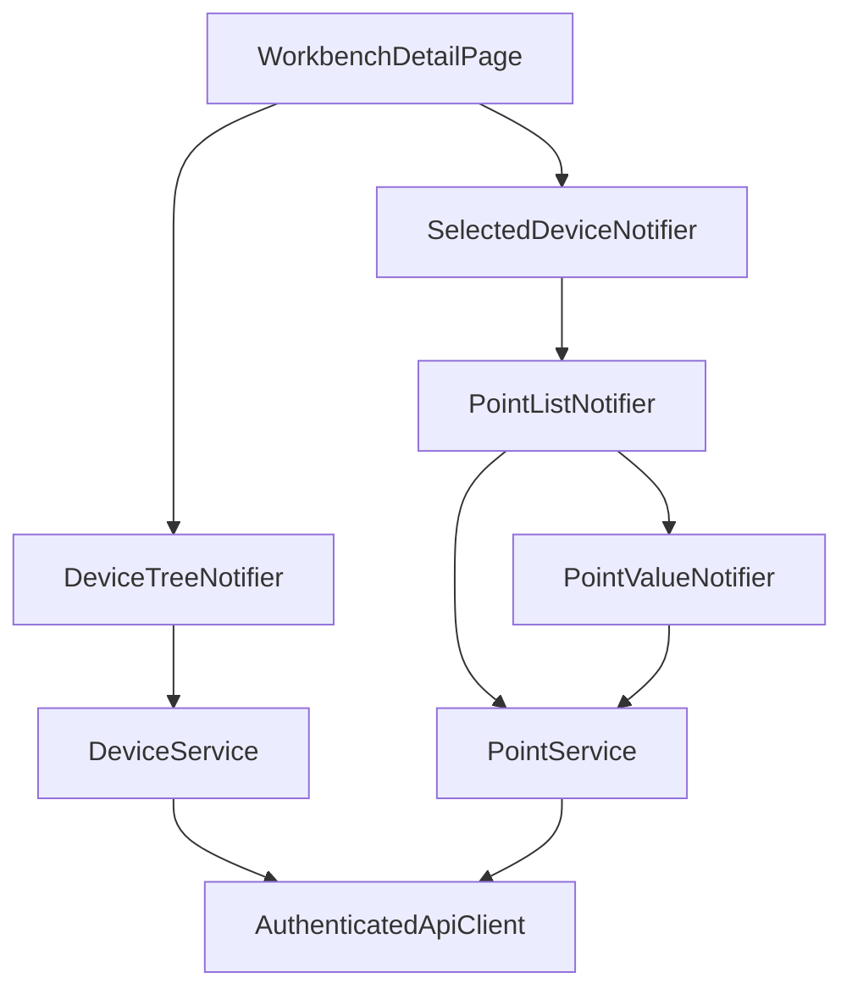
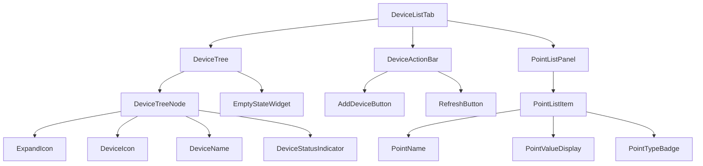

# S1-019: 设备与测点管理UI - 详细设计文档

**任务ID**: S1-019  
**任务名称**: 设备与测点管理UI (Device and Point Management UI)  
**文档版本**: 1.0  
**创建日期**: 2026-03-23  
**设计人**: sw-tom  

---

## 1. 设计概述

### 1.1 功能范围

本文档描述 S1-019 任务的详细设计，实现工作台详情页的设备Tab功能：
1. **设备树形展示** - 支持展开/折叠的树形结构
2. **设备CRUD操作** - 创建、编辑、删除设备
3. **测点列表展示** - 显示设备的所有测点
4. **测点值实时刷新** - 定时刷新测点值

### 1.2 技术栈

| 技术项 | 选择 |
|--------|------|
| **状态管理** | Riverpod (flutter_riverpod) |
| **数据模型** | Freezed (不可变数据类) |
| **HTTP客户端** | Dio + AuthenticatedApiClient |
| **UI框架** | Material Design 3 |
| **目标平台** | 桌面端 (Windows/Mac/Linux) |

---

## 2. 数据模型设计

### 2.1 Flutter数据模型

```dart
// lib/features/workbench/models/device.dart

/// 设备数据模型
@freezed
class Device with _$Device {
  const factory Device({
    required String id,
    required String workbenchId,
    String? parentId,
    required String name,
    required ProtocolType protocolType,
    ProtocolParams? protocolParams,
    String? manufacturer,
    String? model,
    String? sn,
    required DeviceStatus status,
    required DateTime createdAt,
    required DateTime updatedAt,
  }) = _Device;

  factory Device.fromJson(Map<String, dynamic> json) =>
      _$DeviceFromJson(json);
}

/// 协议类型枚举
enum ProtocolType {
  virtual,
  modbusTcp,
  modbusRtu,
  can,
  visa,
  mqtt,
}

/// 设备状态枚举
enum DeviceStatus {
  offline,
  online,
  error,
}

/// 协议参数（联合类型）
@freezed
class ProtocolParams with _$ProtocolParams {
  const factory ProtocolParams.virtual({
    required int sampleInterval,
    required double minValue,
    required double maxValue,
  }) = VirtualProtocolParams;
  
  const factory ProtocolParams.other({
    required String protocolType,
    Map<String, dynamic>? params,
  }) = OtherProtocolParams;
}
```

```dart
// lib/features/workbench/models/point.dart

/// 测点数据模型
@freezed
class Point with _$Point {
  const factory Point({
    required String id,
    required String deviceId,
    required String name,
    required DataType dataType,
    required AccessType accessType,
    String? unit,
    double? minValue,
    double? maxValue,
    String? defaultValue,
    required PointStatus status,
    DateTime? createdAt,
    DateTime? updatedAt,
  }) = _Point;

  factory Point.fromJson(Map<String, dynamic> json) =>
      _$PointFromJson(json);
}

/// 数据类型枚举
enum DataType {
  number,
  integer,
  string,
  boolean,
}

/// 访问类型枚举
enum AccessType {
  ro,  // 只读
  wo,  // 只写
  rw,  // 读写
}

/// 测点状态枚举
enum PointStatus {
  active,
  disabled,
}

/// 测点值模型
@freezed
class PointValue with _$PointValue {
  const factory PointValue({
    required String pointId,
    required dynamic value,
    required DateTime timestamp,
  }) = _PointValue;

  factory PointValue.fromJson(Map<String, dynamic> json) =>
      _$PointValueFromJson(json);
}
```

### 2.2 设备树节点模型

```dart
// lib/features/workbench/models/device_tree_node.dart

/// 设备树节点
@freezed
class DeviceTreeNode with _$DeviceTreeNode {
  const factory DeviceTreeNode({
    required Device device,
    required List<DeviceTreeNode> children,
    required bool isExpanded,
  }) = _DeviceTreeNode;

  factory DeviceTreeNode.fromDevice(Device device) => DeviceTreeNode(
    device: device,
    children: [],
    isExpanded: false,
  );
}
```

---

## 3. 状态管理设计

### 3.1 Riverpod Providers

```dart
// lib/features/workbench/providers/device_tree_provider.dart

/// 设备树状态
@riverpod
class DeviceTreeNotifier extends _$DeviceTreeNotifier {
  @override
  Future<List<DeviceTreeNode>> build(String workbenchId) async {
    return _loadDeviceTree(workbenchId);
  }

  Future<List<DeviceTreeNode>> _loadDeviceTree(String workbenchId) async {
    final deviceService = ref.read(deviceServiceProvider);
    final devices = await deviceService.listDevices(workbenchId);
    return _buildTree(devices);
  }

  List<DeviceTreeNode> _buildTree(List<Device> devices) {
    // 构建树形结构
    final Map<String?, List<Device>> grouped = {};
    for (final device in devices) {
      grouped.putIfAbsent(device.parentId, () => []).add(device);
    }
    
    List<DeviceTreeNode> buildNodes(String? parentId) {
      return grouped[parentId]?.map((device) {
        return DeviceTreeNode(
          device: device,
          children: buildNodes(device.id),
          isExpanded: false,
        );
      }).toList() ?? [];
    }
    
    return buildNodes(null);
  }

  /// 切换节点展开/折叠状态
  Future<void> toggleExpanded(String deviceId) async {
    state = state.whenData((nodes) {
      return _toggleNodeExpansion(nodes, deviceId);
    });
  }

  List<DeviceTreeNode> _toggleNodeExpansion(
    List<DeviceTreeNode> nodes,
    String deviceId,
  ) {
    return nodes.map((node) {
      if (node.device.id == deviceId) {
        return node.copyWith(isExpanded: !node.isExpanded);
      }
      if (node.children.isNotEmpty) {
        return node.copyWith(
          children: _toggleNodeExpansion(node.children, deviceId),
        );
      }
      return node;
    }).toList();
  }

  /// 添加设备后刷新树
  Future<void> refresh() async {
    state = const AsyncLoading();
    state = await AsyncValue.guard(() => _loadDeviceTree(workbenchId));
  }
}
```

```dart
// lib/features/workbench/providers/selected_device_provider.dart

/// 选中的设备
@riverpod
class SelectedDeviceNotifier extends _$SelectedDeviceNotifier {
  @override
  Device? build() => null;

  void select(Device device) {
    state = device;
  }

  void clear() {
    state = null;
  }
}
```

```dart
// lib/features/workbench/providers/point_list_provider.dart

/// 测点列表
@riverpod
class PointListNotifier extends _$PointListNotifier {
  @override
  Future<List<Point>> build(String deviceId) async {
    final pointService = ref.read(pointServiceProvider);
    return pointService.listPoints(deviceId);
  }

  Future<void> refresh() async {
    state = const AsyncLoading();
    state = await AsyncValue.guard(() => build(deviceId));
  }
}
```

```dart
// lib/features/workbench/providers/point_value_provider.dart

/// 测点值定时刷新
@riverpod
class PointValueNotifier extends _$PointValueNotifier {
  Timer? _refreshTimer;
  static const defaultInterval = Duration(seconds: 5);

  @override
  Future<PointValue> build(String pointId) async {
    ref.onDispose(() {
      _refreshTimer?.cancel();
    });
    _startAutoRefresh();
    return _fetchValue(pointId);
  }

  void _startAutoRefresh() {
    _refreshTimer?.cancel();
    _refreshTimer = Timer.periodic(defaultInterval, (_) {
      _refresh();
    });
  }

  Future<void> _refresh() async {
    final newValue = await _fetchValue(arg);
    state = AsyncData(newValue);
  }

  Future<PointValue> _fetchValue(String pointId) async {
    final pointService = ref.read(pointServiceProvider);
    return pointService.readPointValue(pointId);
  }

  /// 停止刷新
  void stopRefresh() {
    _refreshTimer?.cancel();
    _refreshTimer = null;
  }

  /// 手动刷新
  Future<void> refresh() async {
    state = const AsyncLoading();
    state = await AsyncValue.guard(() => _fetchValue(arg));
  }
}
```

### 3.2 Provider依赖关系图



---

## 4. API服务设计

### 4.1 设备服务

```dart
// lib/features/workbench/services/device_service.dart

/// 设备服务接口 (遵循依赖倒置原则)
abstract class DeviceServiceInterface {
  Future<List<Device>> listDevices(String workbenchId);
  Future<Device> createDevice({
    required String workbenchId,
    required String name,
    required ProtocolType protocolType,
    String? parentId,
    ProtocolParams? protocolParams,
    String? manufacturer,
    String? model,
    String? sn,
  });
  Future<Device> updateDevice({
    required String deviceId,
    String? name,
    ProtocolParams? protocolParams,
    String? manufacturer,
    String? model,
    String? sn,
    DeviceStatus? status,
  });
  Future<Device> getDevice(String deviceId);
  Future<void> deleteDevice(String deviceId);
}

/// 设备服务实现
class DeviceService implements DeviceServiceInterface {
  final AuthenticatedApiClient _apiClient;
  
  DeviceService(this._apiClient);
  
  /// 获取设备列表
  Future<List<Device>> listDevices(String workbenchId) async {
    final response = await _apiClient.get(
      '/api/v1/workbenches/$workbenchId/devices',
    );
    final data = response.data['data'];
    return (data['items'] as List)
        .map((json) => Device.fromJson(json))
        .toList();
  }
  
  /// 创建设备
  
  /// 获取设备列表
  Future<List<Device>> listDevices(String workbenchId) async {
    final response = await _apiClient.get(
      '/api/v1/workbenches/$workbenchId/devices',
    );
    final data = response.data['data'];
    return (data['items'] as List)
        .map((json) => Device.fromJson(json))
        .toList();
  }
  
  /// 创建设备
  Future<Device> createDevice({
    required String workbenchId,
    required String name,
    required ProtocolType protocolType,
    String? parentId,
    ProtocolParams? protocolParams,
    String? manufacturer,
    String? model,
    String? sn,
  }) async {
    final response = await _apiClient.post(
      '/api/v1/workbenches/$workbenchId/devices',
      data: {
        'name': name,
        'protocol_type': protocolType.name,
        if (parentId != null) 'parent_id': parentId,
        if (protocolParams != null) 'protocol_params': protocolParams.toJson(),
        if (manufacturer != null) 'manufacturer': manufacturer,
        if (model != null) 'model': model,
        if (sn != null) 'sn': sn,
      },
    );
    return Device.fromJson(response.data['data']);
  }
  
  /// 更新设备
  Future<Device> updateDevice({
    required String deviceId,
    String? name,
    ProtocolParams? protocolParams,
    String? manufacturer,
    String? model,
    String? sn,
    DeviceStatus? status,
  }) async {
    final response = await _apiClient.put(
      '/api/v1/devices/$deviceId',
      data: {
        if (name != null) 'name': name,
        if (protocolParams != null) 'protocol_params': protocolParams.toJson(),
        if (manufacturer != null) 'manufacturer': manufacturer,
        if (model != null) 'model': model,
        if (sn != null) 'sn': sn,
        if (status != null) 'status': status.name,
      },
    );
    return Device.fromJson(response.data['data']);
  }
  
  /// 删除设备
  Future<void> deleteDevice(String deviceId) async {
    await _apiClient.delete('/api/v1/devices/$deviceId');
  }
  
  /// 获取设备详情
  @override
  Future<Device> getDevice(String deviceId) async {
    final response = await _apiClient.get('/api/v1/devices/$deviceId');
    return Device.fromJson(response.data['data']);
  }
}

// lib/features/workbench/providers/device_service_provider.dart

/// 设备服务Provider
final deviceServiceProvider = Provider<DeviceServiceInterface>((ref) {
  final apiClient = ref.watch(authenticatedApiClientProvider);
  return DeviceService(apiClient);
});
```

### 4.2 测点服务

```dart
// lib/features/workbench/services/point_service.dart

/// 测点服务接口
abstract class PointServiceInterface {
  Future<List<Point>> listPoints(String deviceId);
  Future<Point> createPoint({
    required String deviceId,
    required String name,
    required DataType dataType,
    required AccessType accessType,
    String? unit,
    double? minValue,
    double? maxValue,
    String? defaultValue,
  });
  Future<Point> updatePoint({
    required String pointId,
    String? name,
    String? unit,
    double? minValue,
    double? maxValue,
    String? defaultValue,
    PointStatus? status,
  });
  Future<Point> getPoint(String pointId);
  Future<void> deletePoint(String pointId);
  Future<PointValue> readPointValue(String pointId);
  Future<void> writePointValue(String pointId, double value);
}

/// 测点服务实现
class PointService implements PointServiceInterface {
  final AuthenticatedApiClient _apiClient;
  
  PointService(this._apiClient);
  
  /// 获取测点列表
  @override
  Future<List<Point>> listPoints(String deviceId) async {
    final response = await _apiClient.get(
      '/api/v1/devices/$deviceId/points',
    );
    final data = response.data['data'];
    return (data['items'] as List)
        .map((json) => Point.fromJson(json))
        .toList();
  }
  
  /// 创建测点
  @override
  Future<Point> createPoint({
    required String deviceId,
    required String name,
    required DataType dataType,
    required AccessType accessType,
    String? unit,
    double? minValue,
    double? maxValue,
    String? defaultValue,
  }) async {
    final response = await _apiClient.post(
      '/api/v1/devices/$deviceId/points',
      data: {
        'name': name,
        'data_type': dataType.name,
        'access_type': accessType.name,
        if (unit != null) 'unit': unit,
        if (minValue != null) 'min_value': minValue,
        if (maxValue != null) 'max_value': maxValue,
        if (defaultValue != null) 'default_value': defaultValue,
      },
    );
    return Point.fromJson(response.data['data']);
  }
  
  /// 更新测点
  @override
  Future<Point> updatePoint({
    required String pointId,
    String? name,
    String? unit,
    double? minValue,
    double? maxValue,
    String? defaultValue,
    PointStatus? status,
  }) async {
    final response = await _apiClient.put(
      '/api/v1/points/$pointId',
      data: {
        if (name != null) 'name': name,
        if (unit != null) 'unit': unit,
        if (minValue != null) 'min_value': minValue,
        if (maxValue != null) 'max_value': maxValue,
        if (defaultValue != null) 'default_value': defaultValue,
        if (status != null) 'status': status.name,
      },
    );
    return Point.fromJson(response.data['data']);
  }
  
  /// 获取测点详情
  @override
  Future<Point> getPoint(String pointId) async {
    final response = await _apiClient.get('/api/v1/points/$pointId');
    return Point.fromJson(response.data['data']);
  }
  
  /// 删除测点
  @override
  Future<void> deletePoint(String pointId) async {
    await _apiClient.delete('/api/v1/points/$pointId');
  }
  
  /// 读取测点值
  @override
  Future<PointValue> readPointValue(String pointId) async {
    final response = await _apiClient.get(
      '/api/v1/points/$pointId/value',
    );
    return PointValue.fromJson(response.data['data']);
  }
  
  /// 写入测点值
  @override
  Future<void> writePointValue(String pointId, double value) async {
    await _apiClient.put(
      '/api/v1/points/$pointId/value',
      data: {'value': value},
    );
  }
}

// lib/features/workbench/providers/point_service_provider.dart

/// 测点服务Provider
final pointServiceProvider = Provider<PointServiceInterface>((ref) {
  final apiClient = ref.watch(authenticatedApiClientProvider);
  return PointService(apiClient);
});
```

### 4.3 API端点汇总

| 方法 | 端点 | 说明 |
|------|------|------|
| GET | `/api/v1/workbenches/{workbench_id}/devices` | 获取设备列表 |
| POST | `/api/v1/workbenches/{workbench_id}/devices` | 创建设备 |
| GET | `/api/v1/devices/{id}` | 获取设备详情 |
| PUT | `/api/v1/devices/{id}` | 更新设备 |
| DELETE | `/api/v1/devices/{id}` | 删除设备 |
| GET | `/api/v1/devices/{device_id}/points` | 获取测点列表 |
| GET | `/api/v1/points/{id}/value` | 读取测点值 |
| PUT | `/api/v1/points/{id}/value` | 写入测点值 |

---

## 5. UI组件设计

### 5.1 组件结构



### 5.2 DeviceTreeNode组件

```dart
// lib/features/workbench/widgets/device_tree/device_tree_node.dart

class DeviceTreeNodeWidget extends ConsumerWidget {
  final DeviceTreeNode node;
  final int depth;
  final VoidCallback? onTap;
  final VoidCallback? onExpand;
  final VoidCallback? onEdit;
  final VoidCallback? onDelete;

  const DeviceTreeNodeWidget({
    super.key,
    required this.node,
    this.depth = 0,
    this.onTap,
    this.onExpand,
    this.onEdit,
    this.onDelete,
  });

  @override
  Widget build(BuildContext context, WidgetRef ref) {
    final isExpanded = node.isExpanded;
    final hasChildren = node.children.isNotEmpty;
    final isSelected = ref.watch(selectedDeviceProvider)?.id == node.device.id;

    return Column(
      crossAxisAlignment: CrossAxisAlignment.start,
      children: [
        Material(
          color: isSelected 
              ? Theme.of(context).colorScheme.primaryContainer 
              : null,
          child: InkWell(
            onTap: onTap,
            onSecondaryTap: () => _showContextMenu(context),
            child: Padding(
              padding: EdgeInsets.only(left: depth * 24.0),
              child: Row(
                children: [
                  // 展开/折叠箭头
                  if (hasChildren)
                    IconButton(
                      key: Key('expand-icon-${node.device.id}'),
                      icon: Icon(
                        isExpanded ? Icons.expand_more : Icons.chevron_right,
                      ),
                      onPressed: onExpand,
                      iconSize: 20,
                    )
                  else
                    const SizedBox(width: 48),
                  
                  // 设备图标
                  Icon(
                    Icons.memory,
                    key: Key('device-icon-${node.device.id}'),
                    color: Theme.of(context).colorScheme.primary,
                  ),
                  const SizedBox(width: 8),
                  
                  // 设备名称
                  Expanded(
                    child: Text(
                      node.device.name,
                      key: Key('device-name-${node.device.id}'),
                      overflow: TextOverflow.ellipsis,
                    ),
                  ),
                  
                  // 状态指示器
                  _buildStatusIndicator(context, node.device.status),
                ],
              ),
            ),
          ),
        ),
        
        // 子节点
        if (hasChildren && isExpanded)
          ...node.children.map((child) => DeviceTreeNodeWidget(
            key: Key('device-node-${child.device.id}'),
            node: child,
            depth: depth + 1,
            onTap: () => ref.read(selectedDeviceProvider.notifier).select(child.device),
            onExpand: () => ref.read(deviceTreeProvider(node.device.workbenchId).notifier).toggleExpanded(child.device.id),
          )),
      ],
    );
  }

  Widget _buildStatusIndicator(BuildContext context, DeviceStatus status) {
    Color color;
    IconData icon;
    
    switch (status) {
      case DeviceStatus.online:
        color = Colors.green;
        icon = Icons.check_circle;
      case DeviceStatus.offline:
        color = Colors.grey;
        icon = Icons.circle_outlined;
      case DeviceStatus.error:
        color = Colors.red;
        icon = Icons.error;
    }
    
    return Icon(icon, color: color, size: 16);
  }

  void _showContextMenu(BuildContext context) {
    showMenu<String>(
      context: context,
      items: [
        const PopupMenuItem<String>(
          value: 'edit',
          child: Text('编辑'),
        ),
        const PopupMenuItem<String>(
          value: 'delete',
          child: Text('删除'),
        ),
      ],
    ).then((value) {
      if (value == 'edit') {
        onEdit?.call();
      } else if (value == 'delete') {
        onDelete?.call();
      }
    });
  }
}
```

### 5.3 DeviceFormDialog组件

```dart
// lib/features/workbench/widgets/device/device_form_dialog.dart

class DeviceFormDialog extends ConsumerStatefulWidget {
  final Device? device; // null for create, non-null for edit
  final String workbenchId; // required for create

  const DeviceFormDialog({
    super.key,
    this.device,
    required this.workbenchId,
  });

  @override
  ConsumerState<DeviceFormDialog> createState() => _DeviceFormDialogState();
}

class _DeviceFormDialogState extends ConsumerState<DeviceFormDialog> {
  final _formKey = GlobalKey<FormState>();
  late final TextEditingController _nameController;
  late final TextEditingController _manufacturerController;
  late final TextEditingController _modelController;
  late final TextEditingController _snController;
  ProtocolType _protocolType = ProtocolType.virtual;
  String? _parentId;
  
  // Virtual协议参数
  late final TextEditingController _sampleIntervalController;
  late final TextEditingController _minValueController;
  late final TextEditingController _maxValueController;

  @override
  void initState() {
    super.initState();
    _nameController = TextEditingController(text: widget.device?.name);
    _manufacturerController = TextEditingController(text: widget.device?.manufacturer);
    _modelController = TextEditingController(text: widget.device?.model);
    _snController = TextEditingController(text: widget.device?.sn);
    
    if (widget.device?.protocolType == ProtocolType.virtual) {
      final params = widget.device?.protocolParams;
      if (params is VirtualProtocolParams) {
        _sampleIntervalController = TextEditingController(
          text: params.sampleInterval.toString(),
        );
        _minValueController = TextEditingController(
          text: params.minValue.toString(),
        );
        _maxValueController = TextEditingController(
          text: params.maxValue.toString(),
        );
      }
    }
    _sampleIntervalController ??= TextEditingController(text: '1000');
    _minValueController ??= TextEditingController(text: '0');
    _maxValueController ??= TextEditingController(text: '100');
  }

  @override
  void dispose() {
    _nameController.dispose();
    _manufacturerController.dispose();
    _modelController.dispose();
    _snController.dispose();
    _sampleIntervalController.dispose();
    _minValueController.dispose();
    _maxValueController.dispose();
    super.dispose();
  }

  @override
  Widget build(BuildContext context) {
    final isEdit = widget.device != null;
    
    return AlertDialog(
      key: Key(isEdit ? 'edit-device-dialog' : 'create-device-dialog'),
      title: Text(isEdit ? '编辑设备' : '添加设备'),
      content: SizedBox(
        width: 400,
        child: Form(
          key: _formKey,
          child: SingleChildScrollView(
            child: Column(
              mainAxisSize: MainAxisSize.min,
              children: [
                // 设备名称
                TextFormField(
                  key: const Key('device-name-field'),
                  controller: _nameController,
                  decoration: const InputDecoration(
                    labelText: '设备名称 *',
                    border: OutlineInputBorder(),
                  ),
                  validator: (value) {
                    if (value == null || value.isEmpty) {
                      return '设备名称不能为空';
                    }
                    return null;
                  },
                ),
                const SizedBox(height: 16),
                
                // 协议类型 - 仅支持Virtual
                DropdownButtonFormField<ProtocolType>(
                  key: const Key('protocol-type-dropdown'),
                  value: _protocolType,
                  decoration: const InputDecoration(
                    labelText: '协议类型 *',
                    border: OutlineInputBorder(),
                  ),
                  items: [
                    DropdownMenuItem(
                      value: ProtocolType.virtual,
                      child: Row(
                        children: [
                          Text(ProtocolType.virtual.name.toUpperCase()),
                          if (_protocolType != ProtocolType.virtual)
                            Text(' (仅Virtual)', style: TextStyle(color: Colors.grey)),
                        ],
                      ),
                      enabled: _protocolType == ProtocolType.virtual,
                    ),
                    // 其他协议类型禁用
                    ...ProtocolType.values
                        .where((p) => p != ProtocolType.virtual)
                        .map((p) => DropdownMenuItem(
                              value: p,
                              child: Text(p.name.toUpperCase()),
                              enabled: false,
                            )),
                  ],
                  onChanged: _protocolType == ProtocolType.virtual
                      ? (value) => setState(() => _protocolType = value!)
                      : null,
                ),
                const SizedBox(height: 16),
                
                // Virtual协议参数
                if (_protocolType == ProtocolType.virtual) ...[
                  Text(
                    'Virtual协议参数',
                    key: const Key('virtual-params-section'),
                    style: Theme.of(context).textTheme.titleSmall,
                  ),
                  const SizedBox(height: 8),
                  TextFormField(
                    key: const Key('virtual-sample-interval'),
                    controller: _sampleIntervalController,
                    decoration: const InputDecoration(
                      labelText: '采样间隔 (ms)',
                      border: OutlineInputBorder(),
                    ),
                    keyboardType: TextInputType.number,
                    validator: (value) {
                      if (value == null || value.isEmpty) {
                        return '请输入采样间隔';
                      }
                      final interval = int.tryParse(value);
                      if (interval == null || interval <= 0) {
                        return '请输入正整数';
                      }
                      return null;
                    },
                  ),
                  const SizedBox(height: 8),
                  Row(
                    children: [
                      Expanded(
                        child: TextFormField(
                          controller: _minValueController,
                          decoration: const InputDecoration(
                            labelText: '最小值',
                            border: OutlineInputBorder(),
                          ),
                          keyboardType: TextInputType.number,
                        ),
                      ),
                      const SizedBox(width: 8),
                      Expanded(
                        child: TextFormField(
                          controller: _maxValueController,
                          decoration: const InputDecoration(
                            labelText: '最大值',
                            border: OutlineInputBorder(),
                          ),
                          keyboardType: TextInputType.number,
                        ),
                      ),
                    ],
                  ),
                ],
                const SizedBox(height: 16),
                
                // 可选字段
                TextFormField(
                  controller: _manufacturerController,
                  decoration: const InputDecoration(
                    labelText: '制造商',
                    border: OutlineInputBorder(),
                  ),
                ),
                const SizedBox(height: 8),
                TextFormField(
                  controller: _modelController,
                  decoration: const InputDecoration(
                    labelText: '型号',
                    border: OutlineInputBorder(),
                  ),
                ),
                const SizedBox(height: 8),
                TextFormField(
                  controller: _snController,
                  decoration: const InputDecoration(
                    labelText: '序列号',
                    border: OutlineInputBorder(),
                  ),
                ),
              ],
            ),
          ),
        ),
      ),
      actions: [
        TextButton(
          key: const Key('cancel-device-button'),
          onPressed: () => Navigator.of(context).pop(),
          child: const Text('取消'),
        ),
        FilledButton(
          key: const Key('submit-device-button'),
          onPressed: _submit,
          child: const Text('确定'),
        ),
      ],
    );
  }

  Future<void> _submit() async {
    if (!_formKey.currentState!.validate()) return;

    final deviceService = ref.read(deviceServiceProvider);
    
    try {
      if (widget.device != null) {
        // 编辑
        await deviceService.updateDevice(
          deviceId: widget.device!.id,
          name: _nameController.text,
          protocolParams: _protocolType == ProtocolType.virtual
              ? VirtualProtocolParams(
                  sampleInterval: int.parse(_sampleIntervalController.text),
                  minValue: double.parse(_minValueController.text),
                  maxValue: double.parse(_maxValueController.text),
                )
              : null,
          manufacturer: _manufacturerController.text.isEmpty 
              ? null 
              : _manufacturerController.text,
          model: _modelController.text.isEmpty 
              ? null 
              : _modelController.text,
          sn: _snController.text.isEmpty ? null : _snController.text,
        );
      } else {
        // 创建
        await deviceService.createDevice(
          workbenchId: widget.workbenchId,
          name: _nameController.text,
          protocolType: _protocolType,
          protocolParams: _protocolType == ProtocolType.virtual
              ? VirtualProtocolParams(
                  sampleInterval: int.parse(_sampleIntervalController.text),
                  minValue: double.parse(_minValueController.text),
                  maxValue: double.parse(_maxValueController.text),
                )
              : null,
          manufacturer: _manufacturerController.text.isEmpty 
              ? null 
              : _manufacturerController.text,
          model: _modelController.text.isEmpty 
              ? null 
              : _modelController.text,
          sn: _snController.text.isEmpty ? null : _snController.text,
        );
      }
      
      if (mounted) {
        Navigator.of(context).pop(true);
      }
    } catch (e) {
      if (mounted) {
        ScaffoldMessenger.of(context).showSnackBar(
          SnackBar(content: Text('操作失败: $e')),
        );
      }
    }
  }
}
```

### 5.4 PointListPanel组件

```dart
// lib/features/workbench/widgets/point/point_list_panel.dart

class PointListPanel extends ConsumerWidget {
  const PointListPanel({super.key});

  @override
  Widget build(BuildContext context, WidgetRef ref) {
    final selectedDevice = ref.watch(selectedDeviceProvider);
    
    if (selectedDevice == null) {
      return const Center(
        child: Text('请选择设备以查看测点'),
      );
    }
    
    final pointListAsync = ref.watch(pointListProvider(selectedDevice.id));
    
    return pointListAsync.when(
      loading: () => const Center(child: CircularProgressIndicator()),
      error: (error, stack) => Center(
        child: Column(
          mainAxisAlignment: MainAxisAlignment.center,
          children: [
            Text('加载失败: $error'),
            const SizedBox(height: 16),
            FilledButton(
              onPressed: () => ref.refresh(pointListProvider(selectedDevice.id)),
              child: const Text('重试'),
            ),
          ],
        ),
      ),
      data: (points) {
        if (points.isEmpty) {
          return const Center(
            child: Column(
              mainAxisAlignment: MainAxisAlignment.center,
              children: [
                Icon(Icons.sensors_off, size: 48, color: Colors.grey),
                SizedBox(height: 16),
                Text('暂无测点'),
              ],
            ),
          );
        }
        
        return ListView.builder(
          itemCount: points.length,
          itemBuilder: (context, index) {
            final point = points[index];
            return PointListItem(
              key: Key('point-item-${point.id}'),
              point: point,
            );
          },
        );
      },
    );
  }
}
```

### 5.5 PointListItem组件

```dart
// lib/features/workbench/widgets/point/point_list_item.dart

class PointListItem extends ConsumerWidget {
  final Point point;

  const PointListItem({super.key, required this.point});

  @override
  Widget build(BuildContext context, WidgetRef ref) {
    final pointValueAsync = ref.watch(pointValueProvider(point.id));
    
    return Card(
      margin: const EdgeInsets.symmetric(horizontal: 16, vertical: 4),
      child: Padding(
        padding: const EdgeInsets.all(12),
        child: Row(
          children: [
            // 测点名称
            Expanded(
              flex: 2,
              child: Column(
                crossAxisAlignment: CrossAxisAlignment.start,
                children: [
                  Text(
                    point.name,
                    style: Theme.of(context).textTheme.titleSmall,
                    key: Key('point-name-${point.id}'),
                  ),
                  const SizedBox(height: 4),
                  Row(
                    children: [
                      _buildTypeBadge(context, point.dataType),
                      const SizedBox(width: 4),
                      _buildAccessBadge(context, point.accessType),
                    ],
                  ),
                ],
              ),
            ),
            
            // 单位
            if (point.unit != null)
              Expanded(
                child: Text(
                  point.unit!,
                  style: Theme.of(context).textTheme.bodySmall,
                ),
              ),
            
            // 测点值
            Expanded(
              flex: 2,
              child: pointValueAsync.when(
                loading: () => const SizedBox(
                  width: 16,
                  height: 16,
                  child: CircularProgressIndicator(strokeWidth: 2),
                ),
                error: (_, __) => const Text(
                  '--',
                  style: TextStyle(color: Colors.red),
                ),
                data: (value) => PointValueDisplay(
                  key: Key('point-value-${point.id}'),
                  value: value,
                  dataType: point.dataType,
                ),
              ),
            ),
            
            // 刷新按钮
            IconButton(
              key: const Key('refresh-points-button'),
              icon: const Icon(Icons.refresh),
              onPressed: () => ref.refresh(pointValueProvider(point.id)),
              iconSize: 20,
            ),
          ],
        ),
      ),
    );
  }

  Widget _buildTypeBadge(BuildContext context, DataType type) {
    return Container(
      padding: const EdgeInsets.symmetric(horizontal: 6, vertical: 2),
      decoration: BoxDecoration(
        color: Theme.of(context).colorScheme.primaryContainer,
        borderRadius: BorderRadius.circular(4),
      ),
      child: Text(
        type.name,
        style: Theme.of(context).textTheme.labelSmall,
      ),
    );
  }

  Widget _buildAccessBadge(BuildContext context, AccessType access) {
    String label;
    switch (access) {
      case AccessType.ro:
        label = 'RO';
      case AccessType.wo:
        label = 'WO';
      case AccessType.rw:
        label = 'RW';
    }
    
    return Container(
      padding: const EdgeInsets.symmetric(horizontal: 6, vertical: 2),
      decoration: BoxDecoration(
        color: Theme.of(context).colorScheme.secondaryContainer,
        borderRadius: BorderRadius.circular(4),
      ),
      child: Text(
        label,
        style: Theme.of(context).textTheme.labelSmall,
      ),
    );
  }
}
```

### 5.6 PointValueDisplay组件

```dart
// lib/features/workbench/widgets/point/point_value_display.dart

class PointValueDisplay extends StatelessWidget {
  final PointValue value;
  final DataType dataType;

  const PointValueDisplay({
    super.key,
    required this.value,
    required this.dataType,
  });

  @override
  Widget build(BuildContext context) {
    final formattedValue = _formatValue(value.value);
    
    if (dataType == DataType.boolean) {
      final boolValue = value.value is bool 
          ? value.value 
          : (value.value is num && (value.value as num) != 0);
      return Row(
        mainAxisSize: MainAxisSize.min,
        children: [
          Icon(
            boolValue ? Icons.toggle_on : Icons.toggle_off,
            color: boolValue ? Colors.green : Colors.grey,
          ),
          const SizedBox(width: 8),
          Text(formattedValue),
        ],
      );
    }
    
    return Text(
      formattedValue,
      key: Key('point-value-display-${value.pointId}'),
      style: Theme.of(context).textTheme.titleMedium?.copyWith(
        fontFamily: 'monospace',
      ),
    );
  }

  String _formatValue(dynamic val) {
    if (val == null) return '--';
    
    switch (dataType) {
      case DataType.number:
        if (val is num) {
          return val.toStringAsFixed(2);
        }
        return val.toString();
      case DataType.integer:
        if (val is num) {
          return val.toInt().toString();
        }
        return val.toString();
      case DataType.string:
      case DataType.boolean:
        return val.toString();
    }
  }
}
```

---

## 6. DeviceListTab集成

### 6.1 组件整合

```dart
// lib/features/workbench/widgets/detail/device_list_tab.dart

class DeviceListTab extends ConsumerWidget {
  final String workbenchId;

  const DeviceListTab({
    super.key,
    required this.workbenchId,
  });

  @override
  Widget build(BuildContext context, WidgetRef ref) {
    final deviceTreeAsync = ref.watch(deviceTreeProvider(workbenchId));
    
    return Column(
      children: [
        // 操作栏
        Padding(
          padding: const EdgeInsets.all(8),
          child: Row(
            children: [
              FilledButton.icon(
                key: const Key('add-device-button'),
                onPressed: () => _showCreateDialog(context, ref),
                icon: const Icon(Icons.add),
                label: const Text('添加设备'),
              ),
              const SizedBox(width: 8),
              IconButton(
                icon: const Icon(Icons.refresh),
                onPressed: () => ref.refresh(deviceTreeProvider(workbenchId)),
                tooltip: '刷新',
              ),
            ],
          ),
        ),
        
        const Divider(height: 1),
        
        // 设备树
        Expanded(
          flex: 2,
          child: deviceTreeAsync.when(
            loading: () => const Center(child: CircularProgressIndicator()),
            error: (error, stack) => _buildErrorView(context, ref, error),
            data: (nodes) => nodes.isEmpty
                ? _buildEmptyView(context)
                : DeviceTree(
                    key: const Key('device-tree'),
                    nodes: nodes,
                    workbenchId: workbenchId,
                  ),
          ),
        ),
        
        const Divider(height: 1),
        
        // 测点列表
        const Expanded(
          flex: 1,
          child: PointListPanel(),
        ),
      ],
    );
  }

  Widget _buildEmptyView(BuildContext context) {
    return Center(
      child: Column(
        mainAxisAlignment: MainAxisAlignment.center,
        children: [
          Icon(
            Icons.devices_outlined,
            size: 64,
            color: Theme.of(context).colorScheme.outline,
          ),
          const SizedBox(height: 16),
          Text(
            '暂无设备',
            style: Theme.of(context).textTheme.titleLarge,
          ),
          const SizedBox(height: 8),
          Text(
            '点击"添加设备"创建第一个设备',
            style: Theme.of(context).textTheme.bodyMedium?.copyWith(
              color: Theme.of(context).colorScheme.onSurfaceVariant,
            ),
          ),
        ],
      ),
    );
  }

  Widget _buildErrorView(BuildContext context, WidgetRef ref, Object error) {
    return Center(
      child: Column(
        mainAxisAlignment: MainAxisAlignment.center,
        children: [
          Icon(
            Icons.error_outline,
            size: 64,
            color: Theme.of(context).colorScheme.error,
          ),
          const SizedBox(height: 16),
          Text(
            '加载失败',
            style: Theme.of(context).textTheme.titleLarge,
          ),
          const SizedBox(height: 8),
          Text(
            error.toString(),
            style: Theme.of(context).textTheme.bodyMedium,
          ),
          const SizedBox(height: 16),
          FilledButton(
            key: const Key('retry-button'),
            onPressed: () => ref.refresh(deviceTreeProvider(workbenchId)),
            child: const Text('重试'),
          ),
        ],
      ),
    );
  }

  Future<void> _showCreateDialog(BuildContext context, WidgetRef ref) async {
    final result = await showDialog<bool>(
      context: context,
      builder: (context) => DeviceFormDialog(
        key: const Key('create-device-dialog'),
      ),
    );
    
    if (result == true) {
      ref.read(deviceTreeProvider(workbenchId).notifier).refresh();
    }
  }
}
```

### 6.2 DeviceTree组件

```dart
// lib/features/workbench/widgets/device_tree/device_tree.dart

class DeviceTree extends ConsumerWidget {
  final List<DeviceTreeNode> nodes;
  final String workbenchId;

  const DeviceTree({
    super.key,
    required this.nodes,
    required this.workbenchId,
  });

  @override
  Widget build(BuildContext context, WidgetRef ref) {
    return ListView.builder(
      itemCount: nodes.length,
      itemBuilder: (context, index) {
        final node = nodes[index];
        return DeviceTreeNodeWidget(
          key: Key('device-node-${node.device.id}'),
          node: node,
          onTap: () => ref.read(selectedDeviceProvider.notifier).select(node.device),
          onExpand: () => ref.read(deviceTreeProvider(workbenchId).notifier)
              .toggleExpanded(node.device.id),
          onEdit: () => _showEditDialog(context, ref, node.device),
          onDelete: () => _showDeleteDialog(context, ref, node.device),
        );
      },
    );
  }

  Future<void> _showEditDialog(
    BuildContext context,
    WidgetRef ref,
    Device device,
  ) async {
    final result = await showDialog<bool>(
      context: context,
      builder: (context) => DeviceFormDialog(
        key: Key('edit-device-dialog-${device.id}'),
        device: device,
      ),
    );
    
    if (result == true) {
      ref.read(deviceTreeProvider(workbenchId).notifier).refresh();
    }
  }

  Future<void> _showDeleteDialog(
    BuildContext context,
    WidgetRef ref,
    Device device,
  ) async {
    final confirmed = await showDialog<bool>(
      context: context,
      builder: (context) => AlertDialog(
        key: const Key('delete-confirm-dialog'),
        title: const Text('确认删除'),
        content: Text('确定要删除设备 "${device.name}" 吗？'),
        actions: [
          TextButton(
            key: const Key('cancel-delete-button'),
            onPressed: () => Navigator.of(context).pop(false),
            child: const Text('取消'),
          ),
          FilledButton(
            key: const Key('confirm-delete-button'),
            onPressed: () => Navigator.of(context).pop(true),
            child: const Text('删除'),
          ),
        ],
      ),
    );
    
    if (confirmed == true) {
      final deviceService = ref.read(deviceServiceProvider);
      await deviceService.deleteDevice(device.id);
      ref.read(deviceTreeProvider(workbenchId).notifier).refresh();
    }
  }
}
```

---

## 7. 文件结构

```
kayak-frontend/lib/features/workbench/
├── models/
│   ├── device.dart
│   ├── device.freezed.dart
│   ├── device.g.dart
│   ├── device_tree_node.dart
│   ├── device_tree_node.freezed.dart
│   ├── point.dart
│   ├── point.freezed.dart
│   ├── point.g.dart
│   ├── point_value.dart
│   └── point_value.freezed.dart
├── providers/
│   ├── device_tree_provider.dart
│   ├── selected_device_provider.dart
│   ├── point_list_provider.dart
│   └── point_value_provider.dart
├── services/
│   ├── device_service.dart
│   └── point_service.dart
└── widgets/
    ├── detail/
    │   └── device_list_tab.dart (改造现有文件)
    ├── device_tree/
    │   ├── device_tree.dart
    │   └── device_tree_node.dart
    ├── device/
    │   ├── device_form_dialog.dart
    │   └── delete_confirm_dialog.dart
    └── point/
        ├── point_list_panel.dart
        ├── point_list_item.dart
        └── point_value_display.dart
```

---

## 8. 测试覆盖

### 8.1 组件测试

| 组件 | 测试用例数 |
|------|----------|
| DeviceTreeNodeWidget | 8 |
| DeviceFormDialog | 6 |
| PointListItem | 5 |
| PointValueDisplay | 4 |

### 8.2 Provider测试

| Provider | 测试用例数 |
|----------|----------|
| DeviceTreeNotifier | 4 |
| SelectedDeviceNotifier | 2 |
| PointListNotifier | 3 |
| PointValueNotifier | 4 |

### 8.3 集成测试

| 场景 | 测试用例数 |
|------|----------|
| 设备CRUD流程 | 6 |
| 测点列表+刷新 | 4 |
| 树形展开/折叠 | 3 |

---

## 9. 技术决策

### 9.1 状态管理策略
- 使用 `flutter_riverpod` 的 `AsyncNotifier` 处理异步状态
- 设备树状态由 `DeviceTreeNotifier` 统一管理
- 测点值使用独立的 `PointValueNotifier` 实现定时刷新

### 9.2 定时刷新机制
- 使用 `Timer.periodic` 实现5秒间隔的自动刷新
- 在 `PointValueNotifier.build()` 中启动定时器
- 在 `ref.onDispose()` 中取消定时器防止内存泄漏

### 9.3 树形状态管理
- 树的展开/折叠状态存储在 `DeviceTreeNode.isExpanded`
- 状态变更通过 `copyWith` 创建新对象触发重建
- 避免使用 `StatefulWidget` 管理树状态

### 9.4 Virtual协议限制
- 协议类型下拉框中，非Virtual选项设置为 `enabled: false`
- 编辑模式下协议类型不可修改
- 简化初期实现，聚焦核心功能

---

**文档版本**: 1.0  
**创建日期**: 2026-03-23  
**最后更新**: 2026-03-23