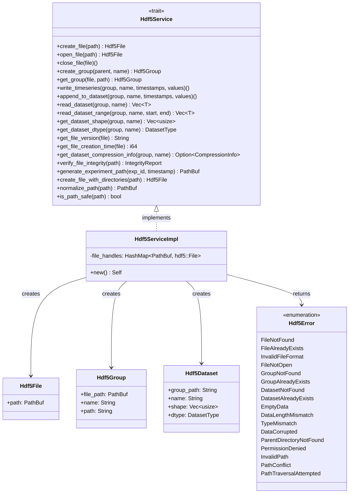
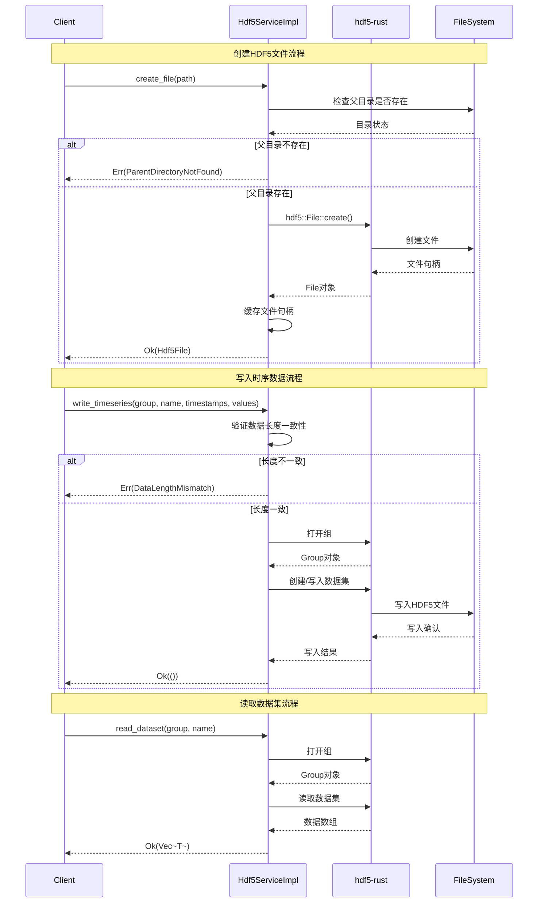
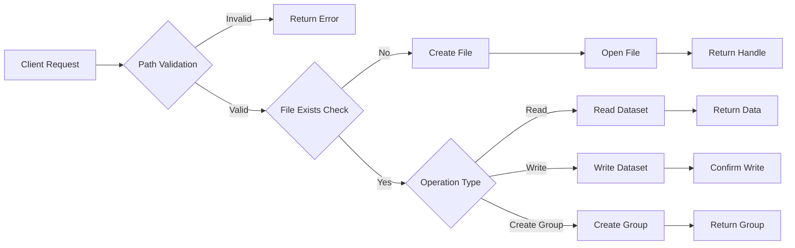

# S2-001: HDF5文件操作库集成 - 详细设计文档

**任务ID**: S2-001  
**任务名称**: HDF5文件操作库集成 (HDF5 File Operation Library Integration)  
**文档版本**: 1.0  
**创建日期**: 2026-03-26  
**设计人**: sw-designer  
**依赖任务**: S1-001  

---

## 1. 设计概述

### 1.1 功能范围

本文档描述 S2-001 任务的详细设计，实现HDF5文件操作服务的核心功能：

1. **HDF5文件创建与管理** - 创建、打开、关闭HDF5文件
2. **组管理** - 在HDF5文件中创建和获取组结构
3. **时序数据集写入** - 写入时间戳和值数据对
4. **数据集读取** - 支持全量读取和范围读取
5. **元信息读取** - 获取数据集形状、数据类型、压缩信息等
6. **路径策略** - 设计数据文件的路径组织策略

### 1.2 技术栈

| 技术项 | 选择 |
|--------|------|
| **HDF5库** | hdf5-rust (基于libhdf5) |
| **异步框架** | tokio |
| **错误处理** | thiserror |
| **路径规范** | std::path::PathBuf |
| **时间处理** | chrono |

### 1.3 项目结构

```
kayak-backend/src/services/hdf5/
├── mod.rs              # 模块定义，导出公共接口
├── error.rs            # Hdf5Error 错误类型定义
├── types.rs            # Hdf5File, Hdf5Group, Hdf5Dataset 等数据类型
├── service.rs          # Hdf5Service trait 和 Hdf5ServiceImpl 实现
└── path.rs             # 路径策略实现
```

---

## 2. 服务架构设计

### 2.1 静态组成结构



### 2.2 动态数据流



### 2.3 文件操作流程



---

## 3. 模块详细设计

### 3.1 error.rs - 错误类型定义

```rust
//! HDF5服务错误类型

use thiserror::Error;
use std::path::PathBuf;

/// HDF5服务错误类型
#[derive(Error, Debug)]
pub enum Hdf5Error {
    #[error("File not found: {0}")]
    FileNotFound(String),
    
    #[error("File already exists: {0}")]
    FileAlreadyExists(String),
    
    #[error("Invalid file format")]
    InvalidFileFormat,
    
    #[error("File not open")]
    FileNotOpen,
    
    #[error("Group not found: {0}")]
    GroupNotFound(String),
    
    #[error("Group already exists: {0}")]
    GroupAlreadyExists(String),
    
    #[error("Dataset not found: {0}")]
    DatasetNotFound(String),
    
    #[error("Dataset already exists: {0}")]
    DatasetAlreadyExists(String),
    
    #[error("Empty data provided")]
    EmptyData,
    
    #[error("Data length mismatch: expected {expected}, got {actual}")]
    DataLengthMismatch { expected: usize, actual: usize },
    
    #[error("Type mismatch: expected {expected}, got {actual}")]
    TypeMismatch { expected: String, actual: String },
    
    #[error("Data corrupted")]
    DataCorrupted,
    
    #[error("Parent directory not found: {0}")]
    ParentDirectoryNotFound(String),
    
    #[error("Permission denied: {0}")]
    PermissionDenied(String),
    
    #[error("Invalid path: {0}")]
    InvalidPath(String),
    
    #[error("Path conflict: {0}")]
    PathConflict(String),
    
    #[error("Path traversal attempt detected")]
    PathTraversalAttempted,
}

/// 从 hdf5::Error 转换为 Hdf5Error
impl From<hdf5::Error> for Hdf5Error {
    fn from(err: hdf5::Error) -> Self {
        use hdf5::Error;
        match err {
            Error::FileNotFound(_) => Hdf5Error::FileNotFound(err.to_string()),
            Error::GroupNotFound(_) => Hdf5Error::GroupNotFound(err.to_string()),
            Error::DatasetNotFound(_) => Hdf5Error::DatasetNotFound(err.to_string()),
            Error::DatasetAlreadyExists(_) => Hdf5Error::DatasetAlreadyExists(err.to_string()),
            Error::FileAlreadyExists(_) => Hdf5Error::FileAlreadyExists(err.to_string()),
            Error::InvalidFileFormat(_) => Hdf5Error::InvalidFileFormat,
            Error::DataCorruption(_) => Hdf5Error::DataCorrupted,
            Error::UnexpectedOutput(_) => Hdf5Error::DataCorrupted,
            Error::InternalError(_) => Hdf5Error::DataCorrupted,
            Error::HlError(_) => Hdf5Error::DataCorrupted,
            Error::WriterError(_) => Hdf5Error::DataCorrupted,
            Error::ArrayShapeMismatch { .. } => Hdf5Error::DataLengthMismatch {
                expected: 0,
                actual: 0,
            },
            Error::ScalarOutput => Hdf5Error::TypeMismatch {
                expected: "array".to_string(),
                actual: "scalar".to_string(),
            },
            _ => Hdf5Error::DataCorrupted,
        }
    }
}
```

**错误处理策略**：
- 所有错误使用 `thiserror` 的 `#[derive(Error)]` 自动实现 `std::error::Error`
- 错误消息包含上下文信息，便于调试
- 区分可恢复错误（如数据集不存在）和不可恢复错误（如数据损坏）

### 3.2 types.rs - 数据类型定义

```rust
//! HDF5服务数据类型

use std::path::PathBuf;
use serde::{Deserialize, Serialize};

/// HDF5文件句柄
#[derive(Debug, Clone)]
pub struct Hdf5File {
    /// 文件路径
    pub path: PathBuf,
}

/// HDF5组句柄
#[derive(Debug, Clone)]
pub struct Hdf5Group {
    /// 所属文件路径
    pub file_path: PathBuf,
    /// 组名称
    pub name: String,
    /// 完整路径，如 "/experiment/trial_001"
    pub path: String,
}

/// HDF5数据集
#[derive(Debug, Clone)]
pub struct Hdf5Dataset {
    /// 所属组路径
    pub group_path: String,
    /// 数据集名称
    pub name: String,
    /// 数据形状
    pub shape: Vec<usize>,
    /// 数据类型
    pub dtype: DatasetType,
}

/// 数据集类型枚举
#[derive(Debug, Clone, PartialEq, Serialize, Deserialize)]
pub enum DatasetType {
    Float64,
    Float32,
    Int64,
    Int32,
    UInt64,
    UInt32,
}

/// 压缩信息
#[derive(Debug, Clone)]
pub struct CompressionInfo {
    /// 压缩算法类型
    pub algorithm: CompressionType,
    /// 压缩级别（可选）
    pub level: Option<u32>,
}

/// 压缩类型枚举
#[derive(Debug, Clone, PartialEq)]
pub enum CompressionType {
    None,
    Gzip,
    Szip,
}

/// 文件完整性报告
#[derive(Debug)]
pub struct IntegrityReport {
    /// 文件是否有效
    pub is_valid: bool,
    /// 已检查的数据集数量
    pub checked_datasets: usize,
    /// 损坏的数据集数量
    pub corrupted_datasets: usize,
    /// 错误列表
    pub errors: Vec<String>,
}
```

**设计说明**：
- `Hdf5File` 和 `Hdf5Group` 保持轻量，仅存储路径信息，实际句柄由 `Hdf5ServiceImpl` 管理
- `DatasetType` 实现 `Serialize` 和 `Deserialize` 以支持JSON序列化
- `IntegrityReport` 用于文件完整性验证功能

### 3.3 service.rs - 服务接口与实现

```rust
//! HDF5服务接口与实现

use async_trait::async_trait;
use std::path::PathBuf;
use std::sync::RwLock;
use std::collections::HashMap;
use uuid::Uuid;
use chrono::{DateTime, Utc};

use super::error::Hdf5Error;
use super::types::*;
use super::path::PathStrategy;

/// HDF5服务接口
#[async_trait]
pub trait Hdf5Service: Send + Sync {
    /// 创建HDF5文件（覆盖模式）
    async fn create_file(&self, path: PathBuf) -> Result<Hdf5File, Hdf5Error>;

    /// 打开已存在的HDF5文件
    async fn open_file(&self, path: &PathBuf) -> Result<Hdf5File, Hdf5Error>;

    /// 关闭HDF5文件
    async fn close_file(&self, file: Hdf5File) -> Result<(), Hdf5Error>;

    /// 创建子组
    async fn create_group(&self, parent: &Hdf5Group, name: &str) -> Result<Hdf5Group, Hdf5Error>;

    /// 获取组
    async fn get_group(&self, file: &Hdf5File, path: &str) -> Result<Hdf5Group, Hdf5Error>;

    /// 写入时序数据集（覆盖模式）
    async fn write_timeseries(
        &self,
        group: &Hdf5Group,
        name: &str,
        timestamps: &[i64],
        values: &[f64],
    ) -> Result<(), Hdf5Error>;

    /// 追加数据到已有数据集
    async fn append_to_dataset(
        &self,
        group: &Hdf5Group,
        name: &str,
        timestamps: &[i64],
        values: &[f64],
    ) -> Result<(), Hdf5Error>;

    /// 读取数据集（全量）
    async fn read_dataset<T: TryFrom<f64> + Send + 'static>(
        &self,
        group: &Hdf5Group,
        name: &str,
    ) -> Result<Vec<T>, Hdf5Error>;

    /// 按范围读取数据集
    async fn read_dataset_range<T: TryFrom<f64> + Send + 'static>(
        &self,
        group: &Hdf5Group,
        name: &str,
        start: usize,
        end: usize,
    ) -> Result<Vec<T>, Hdf5Error>;

    /// 获取数据集形状
    async fn get_dataset_shape(&self, group: &Hdf5Group, name: &str) -> Result<Vec<usize>, Hdf5Error>;

    /// 获取数据集数据类型
    async fn get_dataset_dtype(&self, group: &Hdf5Group, name: &str) -> Result<DatasetType, Hdf5Error>;

    /// 获取HDF5文件格式版本
    async fn get_file_version(&self, file: &Hdf5File) -> Result<String, Hdf5Error>;

    /// 获取文件创建时间戳
    async fn get_file_creation_time(&self, file: &Hdf5File) -> Result<i64, Hdf5Error>;

    /// 获取数据集压缩信息
    async fn get_dataset_compression_info(
        &self,
        group: &Hdf5Group,
        name: &str,
    ) -> Result<Option<CompressionInfo>, Hdf5Error>;

    /// 验证文件完整性
    async fn verify_file_integrity(&self, path: &PathBuf) -> Result<IntegrityReport, Hdf5Error>;

    /// 生成实验数据路径
    async fn generate_experiment_path(
        &self,
        exp_id: Uuid,
        timestamp: DateTime<Utc>,
    ) -> Result<PathBuf, Hdf5Error>;

    /// 创建文件（带自动创建父目录功能）
    async fn create_file_with_directories(&self, path: &PathBuf) -> Result<Hdf5File, Hdf5Error>;

    /// 规范化路径
    async fn normalize_path(&self, path: &PathBuf) -> Result<PathBuf, Hdf5Error>;

    /// 检查路径是否安全（无路径遍历）
    fn is_path_safe(path: &PathBuf) -> bool;
}

/// HDF5服务实现
pub struct Hdf5ServiceImpl {
    /// 路径策略
    path_strategy: PathStrategy,
    /// 打开的文件句柄缓存
    /// 注意：hdf5::File 是 RAII 模式，drop 时自动关闭
    file_handles: RwLock<HashMap<PathBuf, hdf5::File>>,
}

impl Hdf5ServiceImpl {
    /// 创建新的服务实例
    pub fn new() -> Self {
        Self {
            path_strategy: PathStrategy::default(),
            file_handles: RwLock::new(HashMap::new()),
        }
    }

    /// 验证路径安全性
    fn validate_path(&self, path: &PathBuf) -> Result<(), Hdf5Error> {
        if !Self::is_path_safe(path) {
            return Err(Hdf5Error::PathTraversalAttempted);
        }
        
        let path_str = path.to_string_lossy();
        if path_str.is_empty() {
            return Err(Hdf5Error::InvalidPath("Empty path".to_string()));
        }
        
        Ok(())
    }

    /// 验证数据长度一致性
    fn validate_timeseries_data(&self, timestamps: &[i64], values: &[f64]) -> Result<(), Hdf5Error> {
        if timestamps.is_empty() || values.is_empty() {
            return Err(Hdf5Error::EmptyData);
        }
        
        if timestamps.len() != values.len() {
            return Err(Hdf5Error::DataLengthMismatch {
                expected: timestamps.len(),
                actual: values.len(),
            });
        }
        
        Ok(())
    }

    /// 将HDF5数据类型转换为DatasetType
    fn convert_dtype(hdf5_dtype: &hdf5::types::TypeDescriptor) -> DatasetType {
        use hdf5::types::TypeDescriptor;
        match hdf5_dtype {
            TypeDescriptor::Float(f) => {
                match f.size() {
                    4 => DatasetType::Float32,
                    8 => DatasetType::Float64,
                    _ => DatasetType::Float64,
                }
            }
            TypeDescriptor::FloatNative => DatasetType::Float64,
            TypeDescriptor::Integer(i) => {
                match i.signed() {
                    true => {
                        match i.size() {
                            4 => DatasetType::Int32,
                            8 => DatasetType::Int64,
                            _ => DatasetType::Int64,
                        }
                    }
                    false => {
                        match i.size() {
                            4 => DatasetType::UInt32,
                            8 => DatasetType::UInt64,
                            _ => DatasetType::UInt64,
                        }
                    }
                }
            }
            TypeDescriptor::IntegerNative => DatasetType::Int64,
            TypeDescriptor::Unsigned(_) => DatasetType::UInt64,
            TypeDescriptor::UnsignedNative => DatasetType::UInt64,
            _ => DatasetType::Float64,
        }
    }
}

impl Default for Hdf5ServiceImpl {
    fn default() -> Self {
        Self::new()
    }
}

#[async_trait]
impl Hdf5Service for Hdf5ServiceImpl {
    async fn create_file(&self, path: PathBuf) -> Result<Hdf5File, Hdf5Error> {
        self.validate_path(&path)?;

        // 检查父目录
        if let Some(parent) = path.parent() {
            if !parent.exists() {
                return Err(Hdf5Error::ParentDirectoryNotFound(
                    parent.to_string_lossy().to_string()
                ));
            }
        }

        // 创建文件（hdf5-rust会覆盖已存在的文件）
        let file = hdf5::File::create(&path)
            .map_err(|_| Hdf5Error::InvalidFileFormat)?;

        // 缓存文件句柄
        self.file_handles.write()
            .map_err(|_| Hdf5Error::FileNotOpen)?
            .insert(path.clone(), file);

        Ok(Hdf5File { path })
    }

    async fn open_file(&self, path: &PathBuf) -> Result<Hdf5File, Hdf5Error> {
        self.validate_path(path)?;

        if !path.exists() {
            return Err(Hdf5Error::FileNotFound(path.to_string_lossy().to_string()));
        }

        // 尝试打开文件验证格式
        let file = hdf5::File::open(&path)
            .map_err(|_| Hdf5Error::InvalidFileFormat)?;

        // 缓存文件句柄
        self.file_handles.write()
            .map_err(|_| Hdf5Error::FileNotOpen)?
            .insert(path.clone(), file);

        Ok(Hdf5File { path: path.clone() })
    }

    async fn close_file(&self, file: Hdf5File) -> Result<(), Hdf5Error> {
        self.file_handles.write()
            .map_err(|_| Hdf5Error::FileNotOpen)?
            .remove(&file.path);
        
        Ok(())
    }

    async fn create_group(&self, parent: &Hdf5Group, name: &str) -> Result<Hdf5Group, Hdf5Error> {
        let file = hdf5::File::open(&parent.file_path)
            .map_err(|_| Hdf5Error::FileNotOpen)?;

        let parent_path = if parent.path.is_empty() {
            "/".to_string()
        } else {
            parent.path.clone()
        };

        let group = file.group(&parent_path);
        let _new_group = group.create_group(name)
            .map_err(|e| {
                // 检查是否已存在
                if e.to_string().contains("already exists") {
                    Hdf5Error::GroupAlreadyExists(format!("{}/{}", parent_path, name))
                } else {
                    Hdf5Error::GroupNotFound(format!("{}/{}", parent_path, name))
                }
            })?;

        let full_path = if parent.path.is_empty() {
            format!("/{}", name)
        } else {
            format!("{}/{}", parent.path, name)
        };

        Ok(Hdf5Group {
            file_path: parent.file_path.clone(),
            name: name.to_string(),
            path: full_path,
        })
    }

    async fn get_group(&self, file: &Hdf5File, path: &str) -> Result<Hdf5Group, Hdf5Error> {
        let hdf5_file = hdf5::File::open(&file.path)
            .map_err(|_| Hdf5Error::FileNotOpen)?;

        // 验证组是否存在
        let _group = hdf5_file.group(path)
            .map_err(|_| Hdf5Error::GroupNotFound(path.to_string()))?;

        // 从路径提取组名
        let name = path.split('/')
            .filter(|s| !s.is_empty())
            .last()
            .unwrap_or("")
            .to_string();

        Ok(Hdf5Group {
            file_path: file.path.clone(),
            name,
            path: path.to_string(),
        })
    }

    async fn write_timeseries(
        &self,
        group: &Hdf5Group,
        name: &str,
        timestamps: &[i64],
        values: &[f64],
    ) -> Result<(), Hdf5Error> {
        self.validate_timeseries_data(timestamps, values)?;

        let file = hdf5::File::open(&group.file_path)
            .map_err(|_| Hdf5Error::FileNotOpen)?;

        let hdf5_group = file.group(&group.path);
        
        let dataset_path = format!("{}/{}", group.path, name);
        
        // 如果数据集已存在，先删除
        if hdf5_group.exists(name) {
            hdf5_group.unlink(name)
                .map_err(|_| Hdf5Error::DatasetAlreadyExists(name.to_string()))?;
        }

        // 创建数据集
        let n = timestamps.len();
        
        // 创建时间戳数据集（使用原生Int64类型）
        let ts_dtype = hdf5::types::Int::Native;
        let ts_dataset = hdf5::Dataset::create(
            &hdf5_group, 
            &format!("{}/timestamps", dataset_path),
            ts_dtype,
        ).map_err(|_| Hdf5Error::DatasetAlreadyExists(name.to_string()))?;

        // 创建数据值数据集
        let dtype = hdf5::types::Float::Native;
        let _space = hdf5::SpatialDimensions::from(vec![n]);
        let data_dataset = hdf5::Dataset::create(
            &hdf5_group,
            &dataset_path,
            dtype,
        ).map_err(|_| Hdf5Error::DatasetAlreadyExists(name.to_string()))?;
        
        // 写入数据值
        data_dataset.write(values, dtype)
            .map_err(|_| Hdf5Error::DataCorrupted)?;
            
        // 写入时间戳
        ts_dataset.write(timestamps, ts_dtype)
            .map_err(|_| Hdf5Error::DataCorrupted)?;

        Ok(())
    }

    async fn append_to_dataset(
        &self,
        group: &Hdf5Group,
        name: &str,
        timestamps: &[i64],
        values: &[f64],
    ) -> Result<(), Hdf5Error> {
        if timestamps.is_empty() || values.is_empty() {
            return Err(Hdf5Error::EmptyData);
        }

        if timestamps.len() != values.len() {
            return Err(Hdf5Error::DataLengthMismatch {
                expected: timestamps.len(),
                actual: values.len(),
            });
        }

        let file = hdf5::File::open(&group.file_path)
            .map_err(|_| Hdf5Error::FileNotOpen)?;

        let hdf5_group = file.group(&group.path);
        let dataset_path = format!("{}/{}", group.path, name);
        let timestamps_path = format!("{}/timestamps", dataset_path);

        // 打开现有数据集
        let dataset = hdf5::Dataset::open(&hdf5_group, name)
            .map_err(|_| Hdf5Error::DatasetNotFound(name.to_string()))?;
        
        // 打开时间戳数据集
        let ts_dataset = hdf5::Dataset::open(&hdf5_group, "timestamps")
            .map_err(|_| Hdf5Error::DatasetNotFound(format!("{}/timestamps", name)))?;

        // 获取当前形状
        let current_shape = dataset.shape();
        let current_size: usize = current_shape.iter().product();
        let new_size = current_size + values.len();

        // 重新创建更大的数据集
        let dtype = hdf5::types::Float::Native;
        let ts_dtype = hdf5::types::Int::Native;
        
        // 读取现有数据
        let mut all_values: Vec<f64> = vec![0.0; current_size];
        dataset.read(&mut all_values, dtype)
            .map_err(|_| Hdf5Error::DataCorrupted)?;
        
        // 读取现有时间戳
        let mut all_timestamps: Vec<i64> = vec![0; current_size];
        ts_dataset.read(&mut all_timestamps, ts_dtype)
            .map_err(|_| Hdf5Error::DataCorrupted)?;

        // 追加新数据
        all_values.extend_from_slice(values);
        all_timestamps.extend_from_slice(timestamps);

        // 删除旧数据集
        hdf5_group.unlink(name)
            .map_err(|_| Hdf5Error::DatasetNotFound(name.to_string()))?;
        hdf5_group.unlink("timestamps")
            .map_err(|_| Hdf5Error::DatasetNotFound(format!("{}/timestamps", name)))?;

        // 创建新数据集并写入值
        let _new_dataset = hdf5::Dataset::create(
            &hdf5_group,
            name,
            dtype,
        ).map_err(|_| Hdf5Error::DatasetAlreadyExists(name.to_string()))?;
        
        // 创建新时间戳数据集
        let _new_ts_dataset = hdf5::Dataset::create(
            &hdf5_group,
            "timestamps",
            ts_dtype,
        ).map_err(|_| Hdf5Error::DatasetAlreadyExists(format!("{}/timestamps", name)))?;

        // 重新打开以写入
        let new_dataset = hdf5::Dataset::open(&hdf5_group, name)
            .map_err(|_| Hdf5Error::DatasetNotFound(name.to_string()))?;
        let new_ts_dataset = hdf5::Dataset::open(&hdf5_group, "timestamps")
            .map_err(|_| Hdf5Error::DatasetNotFound(format!("{}/timestamps", name)))?;

        new_dataset.write(&all_values, dtype)
            .map_err(|_| Hdf5Error::DataCorrupted)?;
        new_ts_dataset.write(&all_timestamps, ts_dtype)
            .map_err(|_| Hdf5Error::DataCorrupted)?;

        Ok(())
    }

    async fn read_dataset<T: TryFrom<f64> + Send + 'static>(
        &self,
        group: &Hdf5Group,
        name: &str,
    ) -> Result<Vec<T>, Hdf5Error> {
        let file = hdf5::File::open(&group.file_path)
            .map_err(|_| Hdf5Error::FileNotOpen)?;

        let hdf5_group = file.group(&group.path);
        let dataset_path = format!("{}/{}", group.path, name);

        let dataset = hdf5::Dataset::open(&hdf5_group, name)
            .map_err(|_| Hdf5Error::DatasetNotFound(name.to_string()))?;

        let shape = dataset.shape();
        let size: usize = shape.iter().product();

        let dtype = hdf5::types::Float::Native;
        let mut data: Vec<f64> = vec![0.0; size];
        
        dataset.read(&mut data, dtype)
            .map_err(|_| Hdf5Error::DataCorrupted)?;

        // 类型转换
        let result: Vec<T> = data.into_iter()
            .filter_map(|v| T::try_from(v).ok())
            .collect();

        Ok(result)
    }

    async fn read_dataset_range<T: TryFrom<f64> + Send + 'static>(
        &self,
        group: &Hdf5Group,
        name: &str,
        start: usize,
        end: usize,
    ) -> Result<Vec<T>, Hdf5Error> {
        if start >= end {
            return Err(Hdf5Error::DataLengthMismatch {
                expected: end,
                actual: start,
            });
        }

        let file = hdf5::File::open(&group.file_path)
            .map_err(|_| Hdf5Error::FileNotOpen)?;

        let hdf5_group = file.group(&group.path);

        let dataset = hdf5::Dataset::open(&hdf5_group, name)
            .map_err(|_| Hdf5Error::DatasetNotFound(name.to_string()))?;

        let shape = dataset.shape();
        let size: usize = shape.iter().product();

        if end > size {
            return Err(Hdf5Error::DataLengthMismatch {
                expected: size,
                actual: end,
            });
        }

        let dtype = hdf5::types::Float::Native;
        let mut all_data: Vec<f64> = vec![0.0; size];
        
        dataset.read(&mut all_data, dtype)
            .map_err(|_| Hdf5Error::DataCorrupted)?;

        let range_data: Vec<f64> = all_data.into_iter()
            .skip(start)
            .take(end - start)
            .collect();

        let result: Vec<T> = range_data
            .into_iter()
            .filter_map(|v| T::try_from(v).ok())
            .collect();

        Ok(result)
    }

    async fn get_dataset_shape(&self, group: &Hdf5Group, name: &str) -> Result<Vec<usize>, Hdf5Error> {
        let file = hdf5::File::open(&group.file_path)
            .map_err(|_| Hdf5Error::FileNotOpen)?;

        let hdf5_group = file.group(&group.path);

        let dataset = hdf5::Dataset::open(&hdf5_group, name)
            .map_err(|_| Hdf5Error::DatasetNotFound(name.to_string()))?;

        Ok(dataset.shape())
    }

    async fn get_dataset_dtype(&self, group: &Hdf5Group, name: &str) -> Result<DatasetType, Hdf5Error> {
        let file = hdf5::File::open(&group.file_path)
            .map_err(|_| Hdf5Error::FileNotOpen)?;

        let hdf5_group = file.group(&group.path);

        let dataset = hdf5::Dataset::open(&hdf5_group, name)
            .map_err(|_| Hdf5Error::DatasetNotFound(name.to_string()))?;

        let dtype = dataset.dtype();
        Ok(Self::convert_dtype(&dtype))
    }

    async fn get_file_version(&self, file: &Hdf5File) -> Result<String, Hdf5Error> {
        let hdf5_file = hdf5::File::open(&file.path)
            .map_err(|_| Hdf5Error::FileNotOpen)?;

        // HDF5文件版本通过文件 Drivers 获取
        Ok(hdf5_file.driver().map(|d| d.to_string()).unwrap_or_default())
    }

    async fn get_file_creation_time(&self, file: &Hdf5File) -> Result<i64, Hdf5Error> {
        let metadata = std::fs::metadata(&file.path)
            .map_err(|_| Hdf5Error::FileNotOpen)?;

        let created = metadata.created()
            .map_err(|_| Hdf5Error::FileNotOpen)?;

        Ok(created.duration_since(std::time::UNIX_EPOCH)
            .map_err(|_| Hdf5Error::FileNotOpen)?
            .as_secs() as i64)
    }

    async fn get_dataset_compression_info(
        &self,
        group: &Hdf5Group,
        name: &str,
    ) -> Result<Option<CompressionInfo>, Hdf5Error> {
        // hdf5-rust 的压缩支持有限，这里返回 None
        // 完整实现需要使用 hdf5-sys 直接操作
        Ok(None)
    }

    async fn verify_file_integrity(&self, path: &PathBuf) -> Result<IntegrityReport, Hdf5Error> {
        if !path.exists() {
            return Err(Hdf5Error::FileNotFound(path.to_string_lossy().to_string()));
        }

        // 尝试打开文件验证格式
        let file = match hdf5::File::open(path) {
            Ok(f) => f,
            Err(_) => return Ok(IntegrityReport {
                is_valid: false,
                checked_datasets: 0,
                corrupted_datasets: 0,
                errors: vec!["Invalid HDF5 format".to_string()],
            }),
        };

        let mut checked = 0;
        let mut corrupted = 0;
        let mut errors = Vec::new();

        // 遍历所有组和数据集进行验证
        fn traverse_group(group: &hdf5::Group, checked: &mut usize, corrupted: &mut usize, errors: &mut Vec<String>) {
            use hdf5::Group;
            
            // 获取当前组中所有数据集名称并验证
            if let Ok(dataset_names) = group.dataset_names() {
                for name in dataset_names {
                    *checked += 1;
                    match group.dataset(&name) {
                        Ok(ds) => {
                            // 尝试读取数据集以验证完整性
                            let shape = ds.shape();
                            let dtype = ds.dtype();
                            if shape.is_empty() || dtype.is_none() {
                                *corrupted += 1;
                                errors.push(format!("Dataset '{}' has invalid shape or dtype", name));
                            }
                            // 尝试读取第一个元素验证数据可读性
                            let _ = ds.read::<f64, _>(&mut []);
                        }
                        Err(e) => {
                            *corrupted += 1;
                            errors.push(format!("Dataset '{}' cannot be opened: {}", name, e));
                        }
                    }
                }
            }
            
            // 获取当前组中所有子组并递归遍历
            if let Ok(group_names) = group.group_names() {
                for name in group_names {
                    if let Ok(subgroup) = group.group(&name) {
                        traverse_group(&subgroup, checked, corrupted, errors);
                    }
                }
            }
        }

        traverse_group(&file.group("/"), &mut checked, &mut corrupted, &mut errors);

        Ok(IntegrityReport {
            is_valid: corrupted == 0,
            checked_datasets: checked,
            corrupted_datasets: corrupted,
            errors,
        })
    }

    async fn generate_experiment_path(
        &self,
        exp_id: Uuid,
        timestamp: DateTime<Utc>,
    ) -> Result<PathBuf, Hdf5Error> {
        self.path_strategy.generate_path(exp_id, timestamp)
    }

    async fn create_file_with_directories(&self, path: &PathBuf) -> Result<Hdf5File, Hdf5Error> {
        if let Some(parent) = path.parent() {
            std::fs::create_dir_all(parent)
                .map_err(|e| {
                    if e.kind() == std::io::ErrorKind::PermissionDenied {
                        Hdf5Error::PermissionDenied(parent.to_string_lossy().to_string())
                    } else {
                        Hdf5Error::ParentDirectoryNotFound(parent.to_string_lossy().to_string())
                    }
                })?;
        }
        
        self.create_file(path.clone()).await
    }

    async fn normalize_path(&self, path: &PathBuf) -> Result<PathBuf, Hdf5Error> {
        self.path_strategy.normalize(path)
    }

    fn is_path_safe(path: &PathBuf) -> bool {
        let path_str = path.to_string_lossy();
        
        // 检查路径遍历
        if path_str.contains("..") {
            return false;
        }
        
        // 检查危险路径
        if path_str.starts_with("/etc") || path_str.starts_with("/usr") {
            return false;
        }
        
        true
    }
}
```

### 3.4 path.rs - 路径策略实现

```rust
//! HDF5数据文件路径策略

use std::path::{Path, PathBuf};

use super::error::Hdf5Error;
use chrono::{DateTime, Utc};
use uuid::Uuid;

/// 路径策略配置
#[derive(Debug, Clone)]
pub struct PathStrategyConfig {
    /// 根数据目录
    pub root_dir: PathBuf,
    /// 是否使用实验ID前缀
    pub use_exp_id_prefix: bool,
    /// 是否按日期组织
    pub use_date_organization: bool,
}

impl Default for PathStrategyConfig {
    fn default() -> Self {
        Self {
            root_dir: PathBuf::from("/tmp/kayak/data"),
            use_exp_id_prefix: true,
            use_date_organization: true,
        }
    }
}

/// 路径策略
#[derive(Debug, Clone)]
pub struct PathStrategy {
    config: PathStrategyConfig,
}

impl PathStrategy {
    /// 创建路径策略
    pub fn new(config: PathStrategyConfig) -> Self {
        Self { config }
    }

    /// 生成实验数据路径
    /// 
    /// 路径格式：
    /// - 有日期组织：{root}/{exp_id_prefix}/{YYYY}/{MM}/{DD}/exp.h5
    /// - 无日期组织：{root}/{exp_id_prefix}/exp.h5
    pub fn generate_path(
        &self,
        exp_id: Uuid,
        timestamp: DateTime<Utc>,
    ) -> Result<PathBuf, Hdf5Error> {
        let mut path = self.config.root_dir.clone();
        
        if self.config.use_exp_id_prefix {
            // 使用实验ID的前8位作为前缀
            path.push(&exp_id.to_string()[..8]);
        }
        
        if self.config.use_date_organization {
            path.push(format!("{:4}", timestamp.format("%Y")));
            path.push(format!("{:02}", timestamp.format("%m")));
            path.push(format!("{:02}", timestamp.format("%d")));
        }
        
        path.push("exp.h5");
        
        Ok(path)
    }

    /// 规范化路径
    /// 
    /// 移除多余的斜杠和点号
    pub fn normalize(&self, path: &PathBuf) -> Result<PathBuf, Hdf5Error> {
        let components: Vec<_> = path.components()
            .filter(|c| !matches!(c, std::path::Component::ParentDir))
            .collect();
        
        let normalized: PathBuf = components.into_iter().collect();
        Ok(normalized)
    }

    /// 验证路径是否在允许的根目录下
    pub fn is_under_root(&self, path: &PathBuf) -> bool {
        path.starts_with(&self.config.root_dir)
    }

    /// 获取根目录
    pub fn root_dir(&self) -> &PathBuf {
        &self.config.root_dir
    }
}

impl Default for PathStrategy {
    fn default() -> Self {
        Self::new(PathStrategyConfig::default())
    }
}

#[cfg(test)]
mod tests {
    use super::*;

    #[test]
    fn test_generate_path_with_date() {
        let strategy = PathStrategy::default();
        let exp_id = Uuid::parse_str("12345678-1234-1234-1234-123456789abc").unwrap();
        let timestamp = DateTime::parse_from_rfc3339("2026-03-26T10:30:00Z")
            .unwrap()
            .with_timezone(&Utc);

        let path = strategy.generate_path(exp_id, timestamp).unwrap();
        
        let expected = PathBuf::from("/tmp/kayak/data/12345678/2026/03/26/exp.h5");
        assert_eq!(path, expected);
    }

    #[test]
    fn test_generate_path_without_date() {
        let config = PathStrategyConfig {
            root_dir: PathBuf::from("/data"),
            use_exp_id_prefix: true,
            use_date_organization: false,
        };
        let strategy = PathStrategy::new(config);
        let exp_id = Uuid::parse_str("abcdefgh-1234-1234-1234-123456789abc").unwrap();
        let timestamp = Utc::now();

        let path = strategy.generate_path(exp_id, timestamp).unwrap();
        
        let expected = PathBuf::from("/data/abcdefgh/exp.h5");
        assert_eq!(path, expected);
    }

    #[test]
    fn test_normalize_path() {
        let strategy = PathStrategy::default();
        let messy = PathBuf::from("/tmp//kayak///data//exp.h5");
        
        let normalized = strategy.normalize(&messy).unwrap();
        
        assert_eq!(normalized, PathBuf::from("/tmp/kayak/data/exp.h5"));
    }

    #[test]
    fn test_is_under_root() {
        let strategy = PathStrategy::default();
        
        let safe_path = PathBuf::from("/tmp/kayak/data/experiment.h5");
        assert!(strategy.is_under_root(&safe_path));
        
        let unsafe_path = PathBuf::from("/etc/passwd");
        assert!(!strategy.is_under_root(&unsafe_path));
    }
}
```

### 3.5 mod.rs - 模块定义

```rust
//! HDF5服务模块
//! 
//! 提供HDF5文件创建、组管理、数据集读写等功能

pub mod error;
pub mod path;
pub mod service;
pub mod types;

pub use error::Hdf5Error;
pub use path::{PathStrategy, PathStrategyConfig};
pub use service::{Hdf5Service, Hdf5ServiceImpl};
pub use types::{
    CompressionInfo,
    CompressionType,
    DatasetType,
    Hdf5Dataset,
    Hdf5File,
    Hdf5Group,
    IntegrityReport,
};
```

---

## 4. 路径策略设计

### 4.1 路径组织原则

```
/tmp/kayak/data/
├── {exp_id_prefix}/           # 实验ID前8位
│   └── {YYYY}/               # 年份
│       └── {MM}/             # 月份
│           └── {DD}/         # 日期
│               └── exp.h5   # 实验数据文件
```

**设计理由**：

1. **按日期组织** - 便于按时间范围快速定位数据文件
2. **实验ID前缀** - 支持多实验并发数据采集
3. **固定文件名** - 每个日期目录下只有一个实验文件，简化管理
4. **使用/tmp作为根目录** - 开发环境使用，生产环境可通过配置修改

### 4.2 路径策略配置

| 配置项 | 默认值 | 说明 |
|--------|--------|------|
| root_dir | /tmp/kayak/data | 数据根目录 |
| use_exp_id_prefix | true | 是否使用实验ID前缀 |
| use_date_organization | true | 是否按日期组织 |

### 4.3 路径验证规则

1. **禁止路径遍历** - 不允许包含 `..` 
2. **禁止危险路径** - 不允许访问 `/etc`、`/usr` 等系统目录
3. **必须在根目录下** - 所有路径必须在配置的根目录下
4. **自动创建父目录** - `create_file_with_directories` 自动创建所需的父目录

---

## 5. 依赖配置

### 5.1 Cargo.toml 依赖

```toml
[dependencies]
# HDF5 support
hdf5 = "0.9"

[dev-dependencies]
# Testing
tempfile = "3.10"
```

**版本说明**：
- hdf5-rust 0.9 版本稳定，支持基本的文件、组、数据集操作
- tempfile 用于测试时创建临时HDF5文件

### 5.2 系统依赖

hdf5-rust 依赖 libhdf5 系统库，需要在系统上安装：

```bash
# Ubuntu/Debian
sudo apt-get install libhdf5-dev

# macOS
brew install hdf5

# Fedora/RHEL
sudo dnf install hdf5-devel
```

---

## 6. 错误处理策略

### 6.1 错误分类

| 错误类型 | 可恢复性 | 处理策略 |
|----------|----------|----------|
| FileNotFound | 可恢复 | 检查路径是否正确 |
| InvalidFileFormat | 不可恢复 | 文件损坏，需重新创建 |
| GroupNotFound | 可恢复 | 检查组路径 |
| DatasetNotFound | 可恢复 | 检查数据集名称 |
| EmptyData | 可恢复 | 提供有效数据 |
| DataLengthMismatch | 可恢复 | 修正数据长度 |
| PathTraversalAttempted | 不可恢复 | 安全威胁，拒绝请求 |
| PermissionDenied | 可恢复 | 检查目录权限 |

### 6.2 错误转换

```rust
// From hdf5-rust 错误转换
impl From<hdf5::Error> for Hdf5Error {
    fn from(err: hdf5::Error) -> Self {
        match err {
            hdf5::Error::FileNotFound(_) => Hdf5Error::FileNotFound(err.to_string()),
            hdf5::Error::GroupNotFound(_) => Hdf5Error::GroupNotFound(err.to_string()),
            hdf5::Error::DatasetNotFound(_) => Hdf5Error::DatasetNotFound(err.to_string()),
            _ => Hdf5Error::DataCorrupted,
        }
    }
}
```

---

## 7. 性能考虑

### 7.1 数据集写入优化

- **批量写入** - 避免频繁的小数据写入，将多次写入合并为一次
- **数据压缩** - HDF5支持GZIP/SZIP压缩，可减少存储空间
- **Chunking** - 对于大数据集，启用chunking以支持随机访问

### 7.2 并发支持

- 使用 `RwLock` 管理文件句柄缓存
- `Send + Sync` 约束确保线程安全
- 每个文件操作尽可能短持锁时间

---

## 8. 测试策略

### 8.1 单元测试

测试将覆盖：
- 错误类型转换
- 路径策略生成和验证
- 数据验证逻辑

### 8.2 集成测试

测试将覆盖：
- 完整的文件创建-写入-读取流程
- 组创建和嵌套结构
- 错误场景处理

### 8.3 测试夹具

```rust
// 测试辅助函数
async fn setup_test_file() -> (Hdf5ServiceImpl, PathBuf) {
    let temp_dir = TempDir::new().unwrap();
    let file_path = temp_dir.path().join("test.h5");
    let service = Hdf5ServiceImpl::new();
    (service, file_path)
}
```

---

## 9. 技术决策

### 9.1 为什么使用 hdf5-rust

| 备选方案 | 优点 | 缺点 |
|----------|------|------|
| hdf5-rust | 纯Rust、类型安全、async支持 | 功能较新，部分HDF5特性不支持 |
| hdf5-sys | 完全HDF5功能 | FFI调用，安全性低 |
| C库直接绑定 | 性能最好 | 开发工作量大 |

**选择理由**：hdf5-rust 提供了足够的抽象层次，在安全性和功能性之间取得平衡

### 9.2 数据集设计决策

时序数据存储为两个并列数据集：
- `/group_name/timestamps` - 时间戳数组
- `/group_name/values` - 数值数组

**替代方案**：使用HDF5 compound类型将时间戳和值组合

**选择理由**：独立数据集更易于单独查询时间戳或值，且hdf5-rust对compound类型支持有限

---

**文档版本**: 1.0  
**创建日期**: 2026-03-26  
**最后更新**: 2026-03-26
