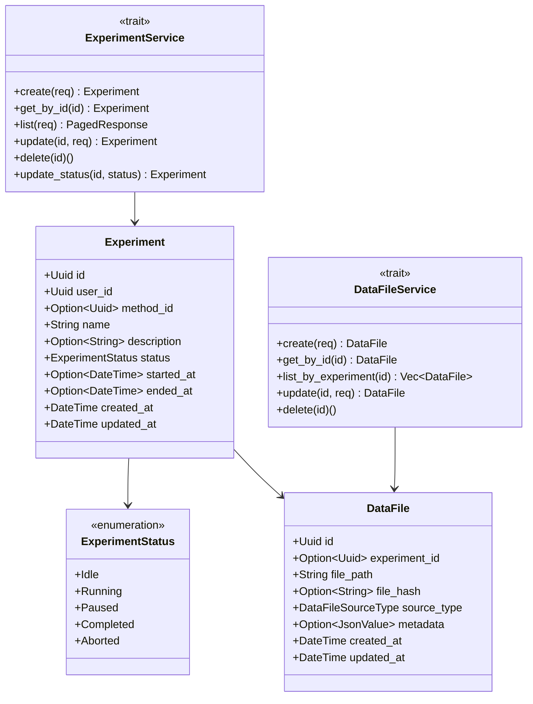
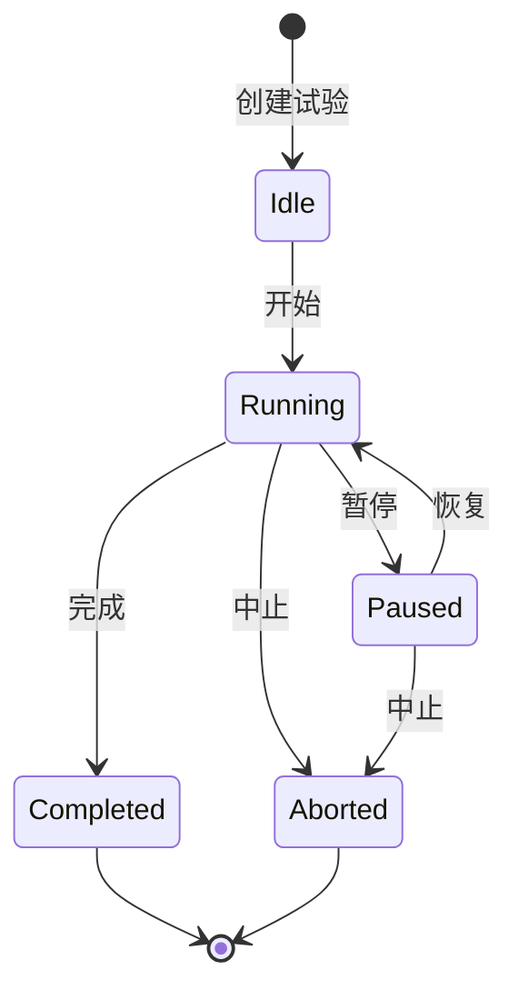

# S2-002: 试验数据模型与元信息管理 - 详细设计文档

**任务ID**: S2-002  
**任务名称**: 试验数据模型与元信息管理 (Experiment Data Model and Metadata Management)  
**文档版本**: 1.0  
**创建日期**: 2026-03-26  
**设计人**: sw-designer  
**依赖任务**: S1-003  

---

## 1. 设计概述

### 1.1 功能范围

本文档描述 S2-002 任务的详细设计，实现试验数据模型和元信息管理的核心功能：

1. **试验记录管理** - CRUD操作
2. **试验状态机** - 状态转换控制
3. **数据文件元信息** - HDF5文件路径记录

### 1.2 技术栈

| 技术项 | 选择 |
|--------|------|
| **数据库** | SQLite (sqlx) |
| **异步框架** | tokio |
| **错误处理** | thiserror |
| **序列化** | serde |

### 1.3 项目结构

```
kayak-backend/src/
├── models/
│   ├── entities/
│   │   ├── mod.rs
│   │   └── experiment.rs      # Experiment 实体
│   └── dto/
│       ├── mod.rs
│       └── experiment.rs       # 请求/响应DTO
├── db/
│   ├── repository/
│   │   ├── mod.rs
│   │   └── experiment_repo.rs # ExperimentRepository trait + SqlxExperimentRepository
│   └── mod.rs
├── services/
│   ├── experiment/
│   │   ├── mod.rs
│   │   ├── error.rs          # ExperimentError 错误类型
│   │   ├── types.rs          # 服务类型定义
│   │   └── service.rs        # ExperimentService trait + ExperimentServiceImpl
│   └── data_file/
│       ├── mod.rs
│       ├── error.rs
│       ├── types.rs
│       └── service.rs
```

---

## 2. 数据模型设计

### 2.1 Experiment 实体

```rust
#[derive(Debug, Clone, Serialize, Deserialize)]
pub struct Experiment {
    /// 试验ID
    pub id: Uuid,
    /// 创建用户ID
    pub user_id: Uuid,
    /// 关联方法ID (可选)
    pub method_id: Option<Uuid>,
    /// 试验名称
    pub name: String,
    /// 试验描述
    pub description: Option<String>,
    /// 试验状态
    pub status: ExperimentStatus,
    /// 开始时间
    pub started_at: Option<DateTime<Utc>>,
    /// 结束时间
    pub ended_at: Option<DateTime<Utc>>,
    /// 创建时间
    pub created_at: DateTime<Utc>,
    /// 更新时间
    pub updated_at: DateTime<Utc>,
}
```

### 2.2 ExperimentStatus 枚举

```rust
#[derive(Debug, Clone, Copy, PartialEq, Eq, Serialize, Deserialize)]
#[serde(rename_all = "UPPERCASE")]
pub enum ExperimentStatus {
    /// 初始状态，试验未开始
    Idle,
    /// 试验正在运行
    Running,
    /// 试验暂停
    Paused,
    /// 试验正常结束
    Completed,
    /// 试验被中止
    Aborted,
}
```

### 2.3 状态转换规则

| 当前状态 | 允许目标状态 | 转换条件 |
|---------|-------------|----------|
| Idle | Running | 试验开始执行 |
| Running | Paused | 用户暂停 |
| Running | Completed | 试验正常结束 |
| Running | Aborted | 用户中止或出错 |
| Paused | Running | 用户恢复 |
| Paused | Aborted | 用户中止 |
| Completed | (无) | 终态 |
| Aborted | (无) | 终态 |

### 2.4 DataFile 实体

```rust
#[derive(Debug, Clone, Serialize, Deserialize)]
pub struct DataFile {
    pub id: Uuid,
    pub experiment_id: Option<Uuid>,
    pub file_path: String,
    pub file_hash: Option<String>,
    pub source_type: DataFileSourceType,
    pub metadata: Option<JsonValue>,
    pub created_at: DateTime<Utc>,
    pub updated_at: DateTime<Utc>,
}

#[derive(Debug, Clone, Copy, PartialEq, Eq, Serialize, Deserialize)]
pub enum DataFileSourceType {
    HDF5,
    CSV,
    JSON,
    OTHER,
}
```

---

## 3. 服务接口设计

### 3.1 ExperimentService trait

```rust
#[async_trait]
pub trait ExperimentService: Send + Sync {
    /// 创建试验
    async fn create(&self, req: CreateExperimentRequest) -> Result<Experiment, ExperimentError>;
    
    /// 获取试验
    async fn get_by_id(&self, id: Uuid) -> Result<Experiment, ExperimentError>;
    
    /// 列出试验
    async fn list(&self, req: ListExperimentsRequest) -> Result<PagedResponse<Experiment>, ExperimentError>;
    
    /// 更新试验
    async fn update(&self, id: Uuid, req: UpdateExperimentRequest) -> Result<Experiment, ExperimentError>;
    
    /// 删除试验
    async fn delete(&self, id: Uuid) -> Result<(), ExperimentError>;
    
    /// 更新试验状态
    async fn update_status(&self, id: Uuid, status: ExperimentStatus) -> Result<Experiment, ExperimentError>;
}
```

### 3.2 DataFileService trait

```rust
#[async_trait]
pub trait DataFileService: Send + Sync {
    /// 创建数据文件记录
    async fn create(&self, req: CreateDataFileRequest) -> Result<DataFile, DataFileError>;
    
    /// 获取数据文件
    async fn get_by_id(&self, id: Uuid) -> Result<DataFile, DataFileError>;
    
    /// 列出试验的数据文件
    async fn list_by_experiment(&self, experiment_id: Uuid) -> Result<Vec<DataFile>, DataFileError>;
    
    /// 更新数据文件
    async fn update(&self, id: Uuid, req: UpdateDataFileRequest) -> Result<DataFile, DataFileError>;
    
    /// 删除数据文件
    async fn delete(&self, id: Uuid) -> Result<(), DataFileError>;
}
```

---

## 4. 数据库Schema

### 4.1 experiments 表

```sql
CREATE TABLE experiments (
    id TEXT PRIMARY KEY NOT NULL,
    user_id TEXT NOT NULL,
    method_id TEXT,
    name TEXT NOT NULL,
    description TEXT,
    status TEXT NOT NULL DEFAULT 'IDLE',
    started_at TEXT,
    ended_at TEXT,
    created_at TEXT NOT NULL,
    updated_at TEXT NOT NULL,
    FOREIGN KEY (user_id) REFERENCES users(id),
    FOREIGN KEY (method_id) REFERENCES methods(id)
);

CREATE INDEX idx_experiments_user_id ON experiments(user_id);
CREATE INDEX idx_experiments_status ON experiments(status);
CREATE INDEX idx_experiments_started_at ON experiments(started_at);
```

### 4.2 data_files 表

```sql
CREATE TABLE data_files (
    id TEXT PRIMARY KEY NOT NULL,
    experiment_id TEXT,
    file_path TEXT NOT NULL,
    file_hash TEXT,
    source_type TEXT NOT NULL,
    metadata TEXT,
    created_at TEXT NOT NULL,
    updated_at TEXT NOT NULL,
    FOREIGN KEY (experiment_id) REFERENCES experiments(id)
);

CREATE INDEX idx_data_files_experiment_id ON data_files(experiment_id);
CREATE INDEX idx_data_files_source_type ON data_files(source_type);
```

---

## 5. 错误类型设计

### 5.1 ExperimentError

```rust
#[derive(Error, Debug)]
pub enum ExperimentError {
    #[error("试验不存在: {0}")]
    NotFound(Uuid),
    
    #[error("无效的状态转换: {from:?} -> {to:?}")]
    InvalidStatusTransition { from: ExperimentStatus, to: ExperimentStatus },
    
    #[error("无效的请求: {0}")]
    InvalidRequest(String),
    
    #[error("数据库错误: {0}")]
    DatabaseError(#[from] sqlx::Error),
}
```

### 5.2 DataFileError

```rust
#[derive(Error, Debug)]
pub enum DataFileError {
    #[error("数据文件不存在: {0}")]
    NotFound(Uuid),
    
    #[error("无效的请求: {0}")]
    InvalidRequest(String),
    
    #[error("数据库错误: {0}")]
    DatabaseError(#[from] sqlx::Error),
}
```

---

## 6. UML图

### 6.1 静态结构图



### 6.2 状态转换图



---

**文档结束**