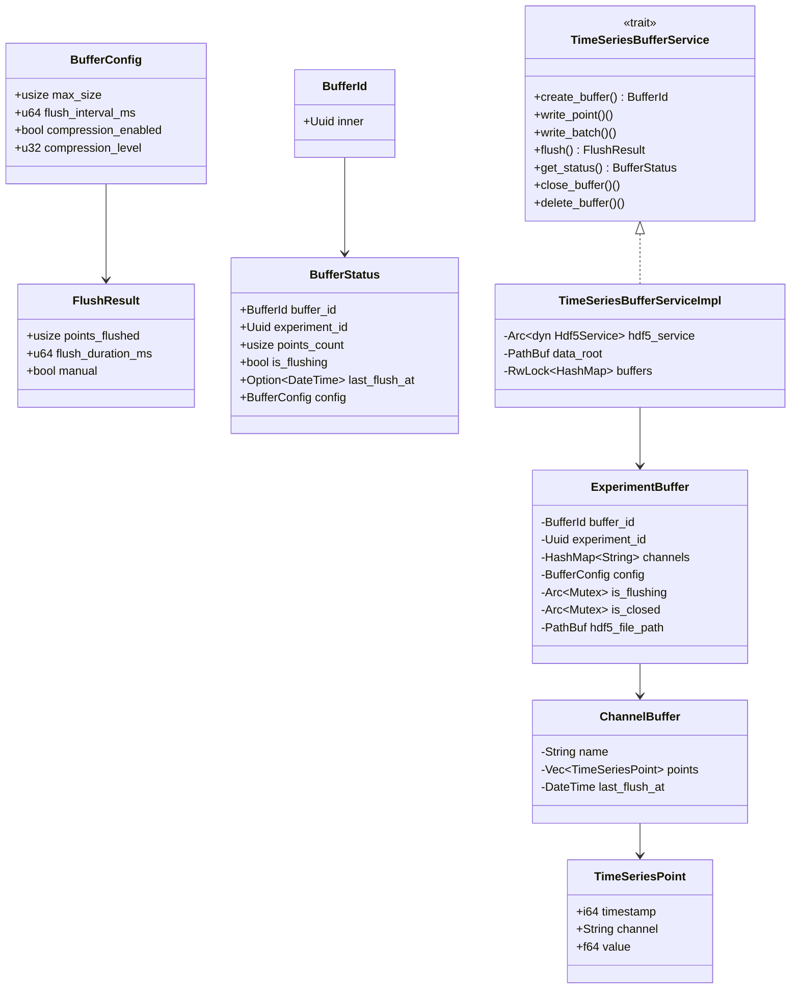
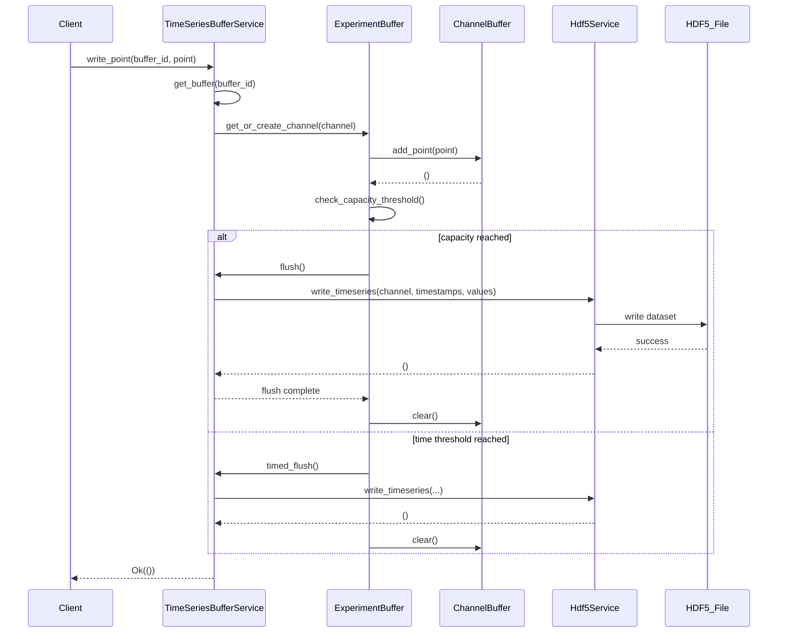
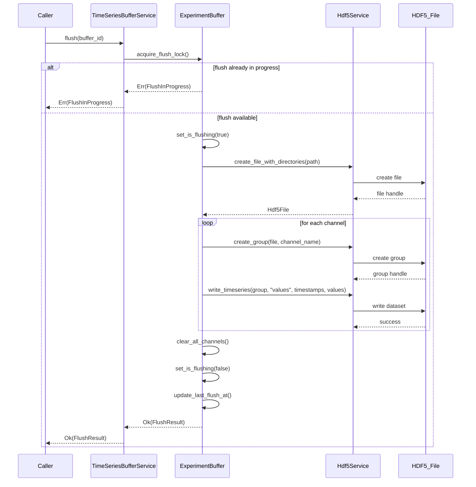

# S2-003: 时序数据写入服务 - 详细设计文档

**任务ID**: S2-003  
**任务名称**: 时序数据写入服务 (Time-series Data Writing Service)  
**文档版本**: 1.0  
**创建日期**: 2026-03-27  
**设计人**: sw-designer  
**依赖任务**: S2-001 (HDF5), S2-002 (Experiment Model)

---

## 1. 设计概述

### 1.1 功能范围

本文档描述 S2-003 任务的详细设计，实现时序数据批量写入服务的核心功能：

1. **缓冲区管理** - 内存缓冲区 per experiment/channel，支持容量和时间触发刷新
2. **批量写入** - 高吞吐量批量写入 HDF5 文件
3. **数据安全** - 服务异常不丢失数据，close_buffer/delete_buffer 前自动刷新
4. **多通道支持** - 支持单个试验的多个测点通道

### 1.2 技术栈

| 技术项 | 选择 |
|--------|------|
| **异步框架** | tokio |
| **错误处理** | thiserror |
| **序列化** | serde |
| **HDF5绑定** | hdf5-rust |
| **并发控制** | tokio::sync::RwLock, tokio::sync::Mutex |
| **时钟管理** | tokio::time |

### 1.3 数据安全保证

> **⚠️ 数据安全级别说明**
>
> 本服务提供 **尽力而为 (Best-Effort)** 的数据持久化保证：
>
> | 场景 | 数据安全保证 | 说明 |
> |------|-------------|------|
> | 正常 flush | ✅ 数据写入 HDF5 | flush 成功后数据持久化 |
> | close_buffer / delete_buffer | ✅ 数据写入 HDF5 | 关闭前强制刷新 |
> | 服务异常崩溃 | ⚠️ 可能丢失 | 内存缓冲区数据未刷新会丢失 |
> | 进程正常退出 | ✅ 数据写入 HDF5 | drop 时自动 flush（若实现） |
>
> **如需更高安全级别（硬保证），需实现 WAL (Write-Ahead Log)**：
> - 每次写入前先写入日志文件
> - 崩溃后可通过日志恢复
> - 性能开销约 2-5x
>
> 当前设计**不包含 WAL**，接受内存数据可能丢失的事实。

### 1.4 重要说明

> **⚠️ 关于压缩功能的说明**
>
> 当前的 `Hdf5Service.write_timeseries()` 接口**不支持压缩参数**：
> ```rust
> async fn write_timeseries(
>     &self,
>     group: &Hdf5Group,
>     name: &str,
>     timestamps: &[i64],
>     values: &[f64],
> ) -> Result<(), Hdf5Error>;
> ```
>
> `CompressionInfo` 类型存在于 `types.rs` 但**未被任何方法使用**。
>
> **验收标准 #2 (支持gzip压缩) 需要先扩展 Hdf5Service 接口**。
> 本设计记录此限制，压缩功能作为未来扩展预留。

---

## 2. 项目结构

```
kayak-backend/src/
├── services/
│   ├── mod.rs
│   └── timeseries_buffer/
│       ├── mod.rs          # 模块导出、核心类型定义、trait定义
│       ├── error.rs        # TimeSeriesBufferError 错误类型
│       ├── buffer.rs       # ChannelBuffer 通道缓冲区实现
│       ├── service.rs      # TimeSeriesBufferServiceImpl 服务实现
│       └── tests.rs        # 单元测试
```

---

## 3. 核心类型定义

### 3.1 TimeSeriesPoint

```rust
/// 时序数据点
#[derive(Debug, Clone, Serialize, Deserialize)]
pub struct TimeSeriesPoint {
    /// 时间戳（纳秒 Unix 时间戳）
    pub timestamp: i64,
    /// 通道名称（对应 HDF5 中的 group 名称）
    pub channel: String,
    /// 数据值
    pub value: f64,
}
```

### 3.2 BufferConfig

```rust
/// 缓冲区配置
///
/// 注意: compression_enabled 和 compression_level 字段当前未使用
/// 压缩功能需待 Hdf5Service 扩展后生效
#[derive(Debug, Clone)]
pub struct BufferConfig {
    /// 最大缓冲区大小（数据点数）
    pub max_size: usize,
    /// 刷新时间间隔（毫秒）
    pub flush_interval_ms: u64,
    /// 是否启用压缩（当前未实现，需Hdf5Service扩展）
    pub compression_enabled: bool,
    /// 压缩级别（当前未实现，需Hdf5Service扩展）
    pub compression_level: u32,
}

impl Default for BufferConfig {
    fn default() -> Self {
        Self {
            max_size: 10000,
            flush_interval_ms: 1000,
            compression_enabled: false,
            compression_level: 4,
        }
    }
}
```

### 3.3 BufferId

```rust
/// 缓冲区ID
#[derive(Debug, Clone, PartialEq, Eq, Hash)]
pub struct BufferId(pub Uuid);
```

### 3.4 FlushResult

```rust
/// 刷新结果
#[derive(Debug)]
pub struct FlushResult {
    /// 成功刷新的数据点数
    pub points_flushed: usize,
    /// 刷新耗时（毫秒）
    pub flush_duration_ms: u64,
    /// 是否为手动触发
    pub manual: bool,
}
```

### 3.5 BufferStatus

```rust
/// 缓冲区状态
#[derive(Debug, Clone)]
pub struct BufferStatus {
    pub buffer_id: BufferId,
    pub experiment_id: Uuid,
    pub points_count: usize,
    pub is_flushing: bool,
    pub last_flush_at: Option<DateTime<Utc>>,
    pub config: BufferConfig,
}
```

---

## 4. 服务接口设计

### 4.1 TimeSeriesBufferService Trait

```rust
/// 时序数据写入服务接口
#[async_trait]
pub trait TimeSeriesBufferService: Send + Sync {
    /// 创建缓冲区
    async fn create_buffer(
        &self,
        experiment_id: Uuid,
        config: BufferConfig,
    ) -> Result<BufferId, TimeSeriesBufferError>;

    /// 写入单个数据点
    async fn write_point(
        &self,
        buffer_id: &BufferId,
        point: TimeSeriesPoint,
    ) -> Result<(), TimeSeriesBufferError>;

    /// 批量写入数据点
    async fn write_batch(
        &self,
        buffer_id: &BufferId,
        points: Vec<TimeSeriesPoint>,
    ) -> Result<(), TimeSeriesBufferError>;

    /// 强制刷新缓冲区
    async fn flush(
        &self,
        buffer_id: &BufferId,
    ) -> Result<FlushResult, TimeSeriesBufferError>;

    /// 获取缓冲区状态
    async fn get_status(
        &self,
        buffer_id: &BufferId,
    ) -> Result<BufferStatus, TimeSeriesBufferError>;

    /// 关闭缓冲区（会刷新所有待写入数据）
    ///
    /// 行为：
    /// 1. 执行强制刷新（确保所有内存数据写入 HDF5）
    /// 2. 标记 buffer 为已关闭状态
    /// 3. 阻止后续写入操作
    /// 4. buffer 对象保留在内存中（可查询状态）
    async fn close_buffer(
        &self,
        buffer_id: &BufferId,
    ) -> Result<(), TimeSeriesBufferError>;

    /// 删除缓冲区（会刷新所有待写入数据）
    ///
    /// 行为：
    /// 1. 执行强制刷新（确保所有内存数据写入 HDF5）
    /// 2. 从 service 中移除 buffer 对象
    /// 3. 释放相关资源
    ///
    /// **与 close_buffer 的区别**：
    /// - `close_buffer`: 关闭但不删除，可查询状态
    /// - `delete_buffer`: 删除并释放资源
    async fn delete_buffer(
        &self,
        buffer_id: &BufferId,
    ) -> Result<(), TimeSeriesBufferError>;
}
```

---

## 5. 错误类型设计

### 5.1 TimeSeriesBufferError

```rust
#[derive(Error, Debug)]
pub enum TimeSeriesBufferError {
    #[error("Buffer not found: {0}")]
    BufferNotFound(String),

    #[error("Buffer already exists: {0}")]
    BufferAlreadyExists(String),

    #[error("Buffer full, pending flush")]
    BufferFull,

    #[error("Flush in progress")]
    FlushInProgress,

    #[error("HDF5 write error: {0}")]
    Hdf5WriteError(String),

    #[error("Data loss detected: {0} points lost")]
    DataLoss { points: usize },

    #[error("Invalid point: {0}")]
    InvalidPoint(String),

    #[error("Channel not configured: {0}")]
    ChannelNotConfigured(String),

    #[error("Write timeout after {0}ms")]
    WriteTimeout { timeout_ms: u64 },

    #[error("Buffer closed")]
    BufferClosed,

    #[error("Overflow: buffer capacity exceeded")]
    Overflow,
}
```

---

## 6. 缓冲区数据结构设计

### 6.1 ChannelBuffer

每个通道（channel）维护独立的缓冲区，**所有数据点操作通过 Mutex 保护**：

```rust
/// 通道缓冲区
///
/// **线程安全**: 使用 tokio::sync::Mutex 保护 points 字段，
/// 确保同一 channel 的并发写入串行化。
struct ChannelBuffer {
    /// 通道名称
    name: String,
    /// 数据点列表（按时间戳排序）
    /// 
    /// **注意**: 此字段通过外层 Mutex 保护，不直接暴露给外部。
    /// 访问时需持有锁。
    points: Vec<TimeSeriesPoint>,
    /// 最后刷新时间
    last_flush_at: DateTime<Utc>,
}

impl ChannelBuffer {
    fn new(name: String) -> Self {
        Self {
            name,
            points: Vec::new(),
            last_flush_at: Utc::now(),
        }
    }

    /// 添加数据点（需持有锁）
    fn add_point_unsafe(&mut self, point: TimeSeriesPoint) {
        self.points.push(point);
    }

    /// 清空缓冲区（需持有锁）
    fn clear_unsafe(&mut self) {
        self.points.clear();
        self.last_flush_at = Utc::now();
    }

    /// 获取数据点数量（需持有锁）
    fn len_unsafe(&self) -> usize {
        self.points.len()
    }

    fn is_empty(&self) -> bool {
        self.points.is_empty()
    }
}
```

> **关于锁的说明**:
> - `ChannelBuffer.points` 的访问通过 `ExperimentBuffer` 层的锁保护
> - 写入时获取 `ExperimentBuffer` 的锁后，再操作 `ChannelBuffer`
> - 刷新时获取 `ExperimentBuffer.flush_lock` 后，批量读取所有 channel 的数据

### 6.2 ExperimentBuffer

每个试验（experiment）维护所有通道的缓冲区：

```rust
/// 试验缓冲区
///
/// **线程安全**: 此结构通过 Arc<Mutex<>> 共享，所有方法均需获取锁后调用。
struct ExperimentBuffer {
    /// 缓冲区ID
    buffer_id: BufferId,
    /// 试验ID
    experiment_id: Uuid,
    /// 通道缓冲区映射: channel_name -> ChannelBuffer
    /// 
    /// **注意**: 访问此 HashMap 需要获取 channels_lock
    channels: HashMap<String, ChannelBuffer>,
    /// channels 的锁
    channels_lock: tokio::sync::Mutex<()>,
    /// 配置
    config: BufferConfig,
    /// 是否正在刷新（刷新互斥）
    is_flushing: Arc<Mutex<bool>>,
    /// 是否已关闭
    is_closed: Arc<Mutex<bool>>,
    /// 最后刷新时间
    last_flush_at: Arc<Mutex<Option<DateTime<Utc>>>>,
    /// HDF5文件路径
    hdf5_file_path: PathBuf,
}
```

> **锁层次结构**:
> ```
> buffers RwLock (service层)
>   └── ExperimentBuffer Mutex
>         ├── channels_lock Mutex
>         │     └── ChannelBuffer (per channel, 无需独立锁)
>         ├── is_flushing Mutex
>         └── is_closed Mutex
> ```

### 6.3 TimeSeriesBufferServiceImpl

```rust
pub struct TimeSeriesBufferServiceImpl {
    /// HDF5服务引用
    hdf5_service: Arc<dyn Hdf5Service>,
    /// 数据根目录
    data_root: PathBuf,
    /// 缓冲区映射: experiment_id -> ExperimentBuffer
    buffers: RwLock<HashMap<Uuid, Arc<Mutex<ExperimentBuffer>>>>,
}
```

> **刷新机制说明**:
> 
> 本服务**不包含后台刷新任务**。刷新触发方式：
> 
> 1. **容量触发**: `write_point`/`write_batch` 写入后检查，缓冲区超限立即刷新
> 2. **时间触发**: `write_point`/`write_batch` 写入后检查，距上次刷新超时间隔则刷新
> 3. **手动触发**: 调用方主动调用 `flush()` 接口
> 
> 这种设计简化了实现，避免了后台任务的生命周期管理问题。
> 如需后台定时刷新，可在调用层（业务层）定期调用 `flush()`。

---

## 7. 刷新触发逻辑

### 7.1 容量触发

- 当 `write_point` 或 `write_batch` 写入数据后：
  - 检查**所有通道**的缓冲区大小
  - 如果**任一通道**的 `points.len() >= max_size`，立即触发刷新
  - 刷新完成后清空所有通道缓冲区
- `max_size` 语义：**per-channel**（每个通道独立计算）

### 7.2 时间触发

- 当 `write_point` 或 `write_batch` 写入数据后：
  - 检查距上次刷新时间是否已超过 `flush_interval_ms`
  - 如果超过且有未刷新数据（任意 channel 非空），触发刷新
- **注意**：没有后台定时任务，时间检查在每次写入时被动进行

### 7.3 刷新优先级

1. **容量触发** > 时间触发（容量超限更紧急）
2. **手动刷新** > 自动刷新（容量/时间触发）
3. **刷新互斥**：同一缓冲区同时只能有一个刷新操作进行

### 7.4 刷新触发检查流程

```
write_point / write_batch:
  1. 添加数据点到 channel buffer
  2. 获取 ExperimentBuffer flush lock
  3. 检查容量触发（遍历所有 channel，检查 len >= max_size）
     - 是 -> 执行 flush，跳转第 7 步
  4. 检查时间触发（now - last_flush_at >= flush_interval_ms && 有未刷新数据）
     - 是 -> 执行 flush
  5. 释放 flush lock
  6. 返回成功
  7. (flush 路径) 执行 flush，清空 buffer，更新 last_flush_at，释放锁，返回结果
```

---

## 8. 写入流程

### 8.1 write_point 流程

```
1. 验证 buffer_id 存在且未关闭
2. 获取/创建 channel buffer
3. 验证数据点有效性 (timestamp >= 0, channel 非空)
4. 添加点到 channel buffer
5. 检查容量触发条件
   - 是 -> 触发 flush
6. 检查时间触发条件
   - 是 -> 触发 flush
7. 返回成功
```

### 8.2 write_batch 流程

```
1. 验证 buffer_id 存在且未关闭
2. 批量验证所有数据点
3. 按 channel 分组数据点
4. 添加各 channel 数据点到对应 buffer
5. 检查容量触发条件
   - 是 -> 触发 flush
6. 检查时间触发条件
   - 是 -> 触发 flush
7. 返回成功
```

### 8.3 flush 流程

```
1. 获取 flush lock (防止并发刷新)
2. 标记 is_flushing = true
3. 按 channel 分组收集所有未刷新数据
4. 为每个 channel 创建 HDF5 group (如果不存在)
5. 调用 Hdf5Service.write_timeseries 写入数据
6. 清空所有 channel buffer
7. 更新 last_flush_at
8. 标记 is_flushing = false
9. 返回 FlushResult
```

---

## 9. HDF5 数据组织

### 9.1 文件结构

```
{data_root}/
└── experiments/
    └── {experiment_id}.h5
        ├── {channel_name}/
        │   ├── timestamps (dataset, i64)
        │   └── values (dataset, f64)
        └── {another_channel}/
            ├── timestamps (dataset, i64)
            └── values (dataset, f64)
```

### 9.2 写入模式

每次 flush 操作：
1. 打开 HDF5 文件
2. 按 channel 分批写入
3. 关闭文件

> **注意**: 每次 flush 会覆盖同名 dataset，而非追加。这是当前 Hdf5Service 的限制。
> 追加写入需要扩展 Hdf5Service 接口。

---

## 10. 错误处理策略

### 10.1 写入失败

- HDF5 写入失败时，保留缓冲区数据不丢失
- 返回错误给调用方，但 buffer 状态不变
- 下次写入时重试

### 10.2 容量溢出

- 当缓冲区已满且无法立即刷新时：
  - 如果使用 `write_batch`，返回 `Overflow` 错误
  - 调用方应处理并重试

### 10.3 并发刷新

- 使用 `Mutex<bool>` 保护刷新状态
- 并发 flush 调用时，第二个调用返回 `FlushInProgress` 错误

### 10.4 服务关闭

- `close_buffer` 会执行强制刷新，确保所有数据写入 HDF5
- `delete_buffer` 同样执行强制刷新后再删除

---

## 11. 线程安全设计

### 11.1 锁策略

| 数据结构 | 锁类型 | 保护内容 |
|---------|--------|---------|
| `buffers: RwLock<HashMap<...>>` | RwLock | buffer map 访问 |
| `ExperimentBuffer.channels_lock` | Mutex | channels HashMap 访问 |
| `ExperimentBuffer.is_flushing` | Mutex | 刷新状态（互斥刷新） |
| `ExperimentBuffer.is_closed` | Mutex | 关闭状态 |
| `ExperimentBuffer.last_flush_at` | Mutex | 最后刷新时间 |
| `ChannelBuffer.points` | 无独立锁 | 通过 ExperimentBuffer 锁层次保护 |

### 11.2 锁层次详解

```
写入流程锁获取顺序：
1. buffers RwLock.read() - 获取 buffer 引用
2. ExperimentBuffer Mutex.lock() - 获取 buffer 内部状态锁
3. ExperimentBuffer.channels_lock.lock() - 获取 channels 访问锁

刷新流程锁获取顺序：
1. buffers RwLock.read() - 获取 buffer 引用
2. ExperimentBuffer Mutex.lock() - 获取 buffer 状态锁
3. ExperimentBuffer.is_flushing.lock() - 获取刷新互斥锁

注意：同一 channel 的并发写入会因 ExperimentBuffer 锁而串行化。
      不同 channel 的写入会因 channels_lock 而互斥访问 HashMap。
```

### 11.3 并发写入

- 多个 writer 可并发写入同一 buffer 的不同 channel
- 同一 channel 的并发写入通过 `ExperimentBuffer` 的锁串行化
- 不同 channel 可并行写入 HDF5（因 flush 时按 channel 分批）

---

## 12. UML 图

### 12.1 静态结构图



### 12.2 写入流程时序图



### 12.3 刷新流程时序图



---

## 13. 项目文件清单

### 13.1 新建文件

| 文件路径 | 说明 |
|---------|------|
| `kayak-backend/src/services/timeseries_buffer/mod.rs` | 模块入口、类型定义、trait |
| `kayak-backend/src/services/timeseries_buffer/error.rs` | 错误类型定义 |
| `kayak-backend/src/services/timeseries_buffer/buffer.rs` | ChannelBuffer、ExperimentBuffer 实现 |
| `kayak-backend/src/services/timeseries_buffer/service.rs` | TimeSeriesBufferServiceImpl 实现 |
| `kayak-backend/src/services/timeseries_buffer/tests.rs` | 单元测试 |

### 13.2 修改文件

| 文件路径 | 修改内容 |
|---------|---------|
| `kayak-backend/src/services/mod.rs` | 添加 timeseries_buffer 模块导出 |

---

## 14. 验收标准映射

| 验收标准 | 实现方式 | 测试用例 |
|---------|---------|---------|
| 1. 数据批量写入性能>10k samples/sec | 内存缓冲 + 批量 HDF5 写入 | TC-TSB-500 ~ TC-TSB-503 |
| 2. ~~支持gzip压缩~~ | **暂不支持** - 需 Hdf5Service 扩展 | N/A |
| 3. 服务异常不丢失数据 | close_buffer/delete_buffer 强制刷新；写入失败保留 buffer | TC-TSB-300 ~ TC-TSB-315 |

---

## 15. 已知限制与未来扩展

### 15.1 压缩功能

当前 `Hdf5Service.write_timeseries()` 不支持压缩参数。要支持压缩需要：

1. 扩展 `Hdf5Service` trait，添加压缩参数
2. 实现 HDF5 gzip/szip 压缩
3. 更新 `BufferConfig.compression_enabled` 和 `compression_level` 生效

### 15.2 追加写入

当前实现每次 flush 覆盖同名 dataset。要支持追加需要：

1. 扩展 `Hdf5Service` 支持 append 模式
2. 或实现 WAL (Write-Ahead Log) 机制

### 15.3 数据安全增强

当前设计提供 **尽力而为** 的数据持久化：
- flush 成功后数据安全
- 服务异常崩溃时，内存未刷新数据会丢失

如需更高安全级别：

**方案A: Write-Ahead Log (WAL)**
```
每次写入:
1. 写入 WAL 文件（append only）
2. 写入内存 buffer
3. flush 时删除 WAL 条目

崩溃恢复:
1. 读取 WAL 文件
2. 重放未 flush 的数据
3. 清理 WAL
```
性能开销约 2-5x，实现复杂度高。

**方案B: 同步 flush**
- 每次写入后立即 flush 到 HDF5
- 性能严重下降（约 10x），不推荐

**方案C: 定期快照**
- 每隔 N 秒将 buffer 快照写入磁盘
- 崩溃后从快照恢复
- 实现复杂度中等

当前设计选择方案A作为未来扩展项。

---

**文档结束**
