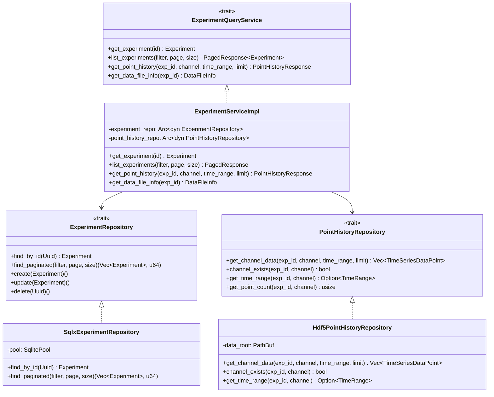
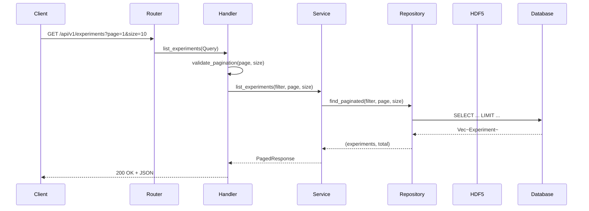
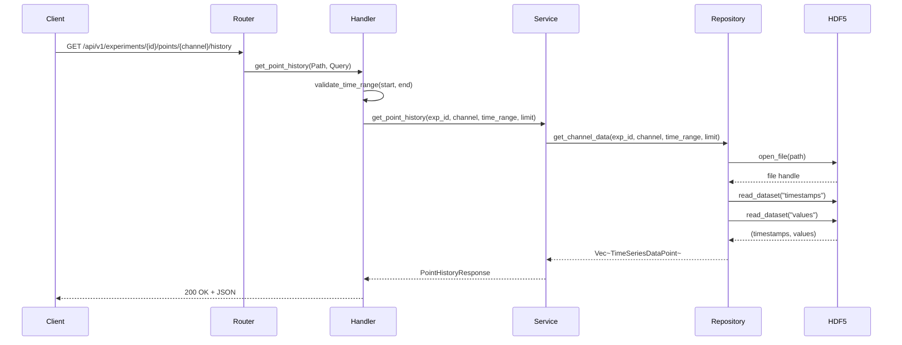
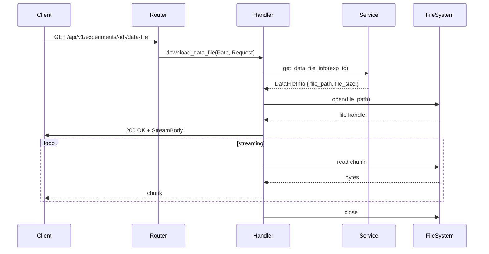

# S2-004: 试验数据查询API - 详细设计文档

**任务ID**: S2-004  
**任务名称**: 试验数据查询API (Experiment Data Query API)  
**文档版本**: 1.0  
**创建日期**: 2026-03-28  
**设计人**: sw-tom  
**依赖任务**: S2-002 (Experiment Model), S2-003 (Time-series Buffer)

---

## 1. 设计概述

### 1.1 功能范围

本文档描述 S2-004 任务的详细设计，实现试验数据查询API的核心功能：

1. **试验列表API** - 分页查询、筛选（状态、时间范围）
2. **试验详情API** - 获取单个试验完整信息
3. **测点历史数据API** - 从HDF5读取时序数据，支持时间范围过滤
4. **数据文件下载API** - HDF5文件流式下载

### 1.2 技术栈

| 技术项 | 选择 |
|--------|------|
| **Web框架** | Axum 0.7 |
| **数据库** | SQLite (sqlx) |
| **HDF5绑定** | hdf5-rust |
| **异步运行时** | tokio |
| **错误处理** | thiserror |
| **序列化** | serde |
| **参数验证** | axum | extract::Query |

### 1.3 项目结构

```
kayak-backend/src/
├── api/
│   ├── handlers/
│   │   ├── mod.rs
│   │   └── experiment.rs      # 试验相关API handler
│   └── routes.rs               # 路由定义
├── db/
│   └── repository/
│       ├── mod.rs
│       └── experiment_repo.rs  # ExperimentRepository trait + SqlxExperimentRepository
├── services/
│   ├── mod.rs
│   ├── experiment/
│   │   ├── mod.rs
│   │   ├── error.rs           # ExperimentQueryError
│   │   ├── types.rs           # 查询相关类型定义
│   │   └── service.rs         # ExperimentService (from S2-002, extended)
│   └── point_history/
│       ├── mod.rs
│       ├── error.rs           # PointHistoryError
│       └── repository.rs      # PointHistoryRepository trait + Hdf5PointHistoryRepository
└── models/
    ├── entities/
    │   └── experiment.rs      # 已存在 (S2-002)
    └── dto/
        ├── mod.rs
        └── experiment.rs       # API请求/响应DTO
```

---

## 2. API 端点定义

### 2.1 试验列表API

**端点**: `GET /api/v1/experiments`

**描述**: 分页获取试验列表，支持状态和时间范围筛选

**查询参数**:
| 参数 | 类型 | 必填 | 默认值 | 说明 |
|------|------|------|--------|------|
| page | u32 | 否 | 1 | 页码（从1开始） |
| size | u32 | 否 | 10 | 每页数量（最大100） |
| status | ExperimentStatus | 否 | - | 按状态筛选 |
| created_after | DateTime<Utc> | 否 | - | 创建时间下限 |
| created_before | DateTime<Utc> | 否 | - | 创建时间上限 |

**响应** (200 OK):
```json
{
  "items": [
    {
      "id": "uuid",
      "user_id": "uuid",
      "method_id": "uuid|null",
      "name": "string",
      "description": "string|null",
      "status": "IDLE|RUNNING|PAUSED|COMPLETED|ABORTED",
      "started_at": "datetime|null",
      "ended_at": "datetime|null",
      "created_at": "datetime",
      "updated_at": "datetime"
    }
  ],
  "page": 1,
  "size": 10,
  "total": 100,
  "has_next": true,
  "has_prev": false
}
```

**错误响应**:
- 400 Bad Request: 无效的分页参数或筛选条件

### 2.2 试验详情API

**端点**: `GET /api/v1/experiments/{id}`

**描述**: 获取单个试验的完整信息

**路径参数**:
| 参数 | 类型 | 必填 | 说明 |
|------|------|------|------|
| id | Uuid | 是 | 试验ID |

**响应** (200 OK):
```json
{
  "id": "uuid",
  "user_id": "uuid",
  "method_id": "uuid|null",
  "name": "string",
  "description": "string|null",
  "status": "IDLE|RUNNING|PAUSED|COMPLETED|ABORTED",
  "started_at": "datetime|null",
  "ended_at": "datetime|null",
  "created_at": "datetime",
  "updated_at": "datetime"
}
```

**错误响应**:
- 400 Bad Request: 无效的UUID格式
- 404 Not Found: 试验不存在

### 2.3 测点历史数据API

**端点**: `GET /api/v1/experiments/{exp_id}/points/{channel}/history`

**描述**: 从HDF5文件读取指定通道的时序数据

**路径参数**:
| 参数 | 类型 | 必填 | 说明 |
|------|------|------|------|
| exp_id | Uuid | 是 | 试验ID |
| channel | String | 是 | 通道名称（对应HDF5 group） |

**查询参数**:
| 参数 | 类型 | 必填 | 默认值 | 说明 |
|------|------|------|--------|------|
| start_time | DateTime<Utc> | 否 | 数据起始时间 | 过滤起始时间（包含） |
| end_time | DateTime<Utc> | 否 | 数据结束时间 | 过滤结束时间（包含） |
| limit | usize | 否 | 10000 | 最大返回点数（防止内存溢出） |

**响应** (200 OK):
```json
{
  "experiment_id": "uuid",
  "channel": "string",
  "data": [
    {
      "timestamp": 1704067200000000000,
      "value": 1.234
    }
  ],
  "start_time": "2024-01-01T00:00:00Z",
  "end_time": "2024-01-01T01:00:00Z",
  "total_points": 3600
}
```

**错误响应**:
- 400 Bad Request: 无效的时间格式或时间范围倒置
- 404 Not Found: 试验或通道不存在

### 2.4 数据文件下载API

**端点**: `GET /api/v1/experiments/{id}/data-file`

**描述**: 流式下载试验关联的HDF5数据文件

**路径参数**:
| 参数 | 类型 | 必填 | 说明 |
|------|------|------|------|
| id | Uuid | 是 | 试验ID |

**响应** (200 OK):
- Content-Type: `application/x-hdf5`
- Content-Disposition: `attachment; filename="{experiment_id}.h5"`
- Content-Length: {文件大小}
- Body: HDF5文件二进制流

**响应** (206 Partial Content):
- 支持 Range 请求，用于大文件分段下载

**错误响应**:
- 400 Bad Request: 无效的UUID格式
- 404 Not Found: 试验不存在或无关联数据文件

---

## 3. 数据传输对象 (DTO)

### 3.1 请求DTO

```rust
/// 试验列表查询请求
#[derive(Debug, Deserialize, Default)]
#[serde(default)]
pub struct ListExperimentsRequest {
    #[serde(deserialize_with = "deserialize_pagination")]
    pub page: Option<u32>,
    #[serde(deserialize_with = "deserialize_pagination")]
    pub size: Option<u32>,
    pub status: Option<ExperimentStatus>,
    pub created_after: Option<DateTime<Utc>>,
    pub created_before: Option<DateTime<Utc>>,
}

/// 分页参数反序列化辅助
fn deserialize_pagination<'de, D>(deserializer: D) -> Result<Option<u32>, D::Error>
where
    D: Deserializer<'de>,
{
    let opt = Option::<String>::deserialize(deserializer)?;
    match opt {
        Some(s) if s.is_empty() => Ok(None),
        Some(s) => Ok(Some(s.parse().map_err(|_| de::Error::custom("invalid number"))?)),
        None => Ok(None),
    }
}
```

```rust
/// 测点历史查询请求
#[derive(Debug, Deserialize)]
pub struct PointHistoryRequest {
    pub start_time: Option<DateTime<Utc>>,
    pub end_time: Option<DateTime<Utc>>,
    #[serde(default = "default_limit")]
    pub limit: usize,
}

fn default_limit() -> usize {
    10000
}
```

### 3.2 响应DTO

```rust
/// 试验响应（与现有ExperimentResponse兼容）
pub type ExperimentResponse = Experiment;

/// 测点历史数据响应
#[derive(Debug, Serialize)]
pub struct PointHistoryResponse {
    pub experiment_id: Uuid,
    pub channel: String,
    pub data: Vec<TimeSeriesDataPoint>,
    pub start_time: DateTime<Utc>,
    pub end_time: DateTime<Utc>,
    pub total_points: usize,
}

/// 时序数据点
#[derive(Debug, Clone, Serialize, Deserialize)]
pub struct TimeSeriesDataPoint {
    pub timestamp: i64,  // 纳秒Unix时间戳
    pub value: f64,
}
```

```rust
/// 分页响应
#[derive(Debug, Serialize)]
pub struct PagedResponse<T> {
    pub items: Vec<T>,
    pub page: u32,
    pub size: u32,
    pub total: u64,
    pub has_next: bool,
    pub has_prev: bool,
}
```

---

## 4. 错误类型设计

### 4.1 ExperimentQueryError

```rust
#[derive(Error, Debug)]
pub enum ExperimentQueryError {
    #[error("试验不存在: {0}")]
    NotFound(Uuid),

    #[error("无权限访问该试验: {0}")]
    AccessDenied(Uuid),

    #[error("无效的分页参数: {0}")]
    InvalidPagination(String),

    #[error("无效的查询条件: {0}")]
    InvalidQuery(String),

    #[error("数据库错误: {0}")]
    DatabaseError(#[from] sqlx::Error),

    #[error("内部错误: {0}")]
    Internal(String),
}
```

### 4.2 PointHistoryError

```rust
#[derive(Error, Debug)]
pub enum PointHistoryError {
    #[error("试验不存在: {0}")]
    ExperimentNotFound(Uuid),

    #[error("通道不存在: {0}")]
    ChannelNotFound(String),

    #[error("HDF5文件不存在: {0}")]
    Hdf5FileNotFound(String),

    #[error("HDF5读取错误: {0}")]
    Hdf5ReadError(String),

    #[error("无效的时间范围: {0}")]
    InvalidTimeRange(String),

    #[error("时间范围倒置: start_time > end_time")]
    TimeRangeReversed,

    #[error("数据量过大: {0} points (max: {1})")]
    DataTooLarge { actual: usize, max: usize },
}
```

### 4.3 DataFileError

```rust
#[derive(Error, Debug)]
pub enum DataFileError {
    #[error("试验不存在: {0}")]
    ExperimentNotFound(Uuid),

    #[error("数据文件不存在")]
    DataFileNotFound,

    #[error("文件读取失败: {0}")]
    FileReadError(String),

    #[error("文件过大，无法流式传输: {0} bytes")]
    FileTooLarge(i64),
}
```

---

## 5. 服务接口设计

### 5.1 ExperimentRepository Trait

```rust
/// 试验仓储接口
#[async_trait]
pub trait ExperimentRepository: Send + Sync {
    /// 根据ID查找
    async fn find_by_id(&self, id: Uuid) -> Result<Option<Experiment>, sqlx::Error>;

    /// 分页查询
    async fn find_paginated(
        &self,
        filter: &ExperimentFilter,
        page: u32,
        size: u32,
    ) -> Result<(Vec<Experiment>, u64), sqlx::Error>;

    /// 创建试验
    async fn create(&self, experiment: &Experiment) -> Result<(), sqlx::Error>;

    /// 更新试验
    async fn update(&self, experiment: &Experiment) -> Result<(), sqlx::Error>;

    /// 删除试验
    async fn delete(&self, id: Uuid) -> Result<(), sqlx::Error>;
}

/// 试验查询过滤器
#[derive(Debug, Clone, Default)]
pub struct ExperimentFilter {
    pub user_id: Option<Uuid>,
    pub status: Option<ExperimentStatus>,
    pub method_id: Option<Uuid>,
    pub created_after: Option<DateTime<Utc>>,
    pub created_before: Option<DateTime<Utc>>,
}
```

### 5.2 PointHistoryRepository Trait

```rust
/// 测点历史数据仓储接口
#[async_trait]
pub trait PointHistoryRepository: Send + Sync {
    /// 获取指定通道的时序数据
    async fn get_channel_data(
        &self,
        experiment_id: Uuid,
        channel: &str,
        time_range: Option<TimeRange>,
        limit: usize,
    ) -> Result<Vec<TimeSeriesDataPoint>, PointHistoryError>;

    /// 检查通道是否存在
    async fn channel_exists(
        &self,
        experiment_id: Uuid,
        channel: &str,
    ) -> Result<bool, PointHistoryError>;

    /// 获取通道数据的时间范围
    async fn get_time_range(
        &self,
        experiment_id: Uuid,
        channel: &str,
    ) -> Result<Option<TimeRange>, PointHistoryError>;

    /// 获取数据点数量
    async fn get_point_count(
        &self,
        experiment_id: Uuid,
        channel: &str,
    ) -> Result<usize, PointHistoryError>;
}

/// 时间范围
#[derive(Debug, Clone)]
pub struct TimeRange {
    pub start: DateTime<Utc>,
    pub end: DateTime<Utc>,
}
```

### 5.3 ExperimentService 接口（扩展）

```rust
/// 试验查询服务接口
#[async_trait]
pub trait ExperimentQueryService: Send + Sync {
    /// 获取试验详情
    async fn get_experiment(
        &self,
        id: Uuid,
        user_id: Uuid,
    ) -> Result<Experiment, ExperimentQueryError>;

    /// 列出试验（分页）
    async fn list_experiments(
        &self,
        filter: ExperimentFilter,
        page: u32,
        size: u32,
    ) -> Result<PagedResponse<Experiment>, ExperimentQueryError>;

    /// 获取测点历史数据
    async fn get_point_history(
        &self,
        experiment_id: Uuid,
        channel: String,
        time_range: Option<TimeRange>,
        limit: usize,
        user_id: Uuid,
    ) -> Result<PointHistoryResponse, PointHistoryError>;

    /// 获取数据文件信息
    async fn get_data_file_info(
        &self,
        experiment_id: Uuid,
        user_id: Uuid,
    ) -> Result<DataFileInfo, DataFileError>;
}

/// 数据文件信息
#[derive(Debug)]
pub struct DataFileInfo {
    pub experiment_id: Uuid,
    pub file_path: PathBuf,
    pub file_size: i64,
}
```

---

## 6. HDF5 数据读取逻辑

### 6.1 数据结构

HDF5文件结构（S2-003定义）：
```
{data_root}/experiments/{experiment_id}.h5
    └── {channel_name}/
        ├── timestamps (dataset, i64)
        └── values (dataset, f64)
```

### 6.2 读取流程

```rust
impl PointHistoryRepository for Hdf5PointHistoryRepository {
    async fn get_channel_data(
        &self,
        experiment_id: Uuid,
        channel: &str,
        time_range: Option<TimeRange>,
        limit: usize,
    ) -> Result<Vec<TimeSeriesDataPoint>, PointHistoryError> {
        // 1. 构建HDF5文件路径
        let file_path = self.get_experiment_hdf5_path(experiment_id)?;

        // 2. 打开HDF5文件
        let file = hdf5::File::open(&file_path)
            .map_err(|e| PointHistoryError::Hdf5ReadError(e.to_string()))?;

        // 3. 打开通道group
        let group_path = format!("/{}", channel);
        let group = file.group(&group_path)
            .map_err(|e| PointHistoryError::ChannelNotFound(channel.to_string()))?;

        // 4. 读取timestamps和values数据集
        let timestamps_ds = group.dataset("timestamps")
            .map_err(|e| PointHistoryError::Hdf5ReadError(e.to_string()))?;
        let values_ds = group.dataset("values")
            .map_err(|e| PointHistoryError::Hdf5ReadError(e.to_string()))?;

        let timestamps: Vec<i64> = timestamps_ds.read_raw()
            .map_err(|e| PointHistoryError::Hdf5ReadError(e.to_string()))?;
        let values: Vec<f64> = values_ds.read_raw()
            .map_err(|e| PointHistoryError::Hdf5ReadError(e.to_string()))?;

        // 5. 按时间范围过滤
        let mut points: Vec<TimeSeriesDataPoint> = timestamps
            .into_iter()
            .zip(values.into_iter())
            .filter(|(ts, _)| {
                let nanos = *ts;
                let dt = DateTime::from_timestamp(nanos / 1_000_000_000, (nanos % 1_000_000_000) as u32).unwrap();
                match &time_range {
                    Some(range) => {
                        dt >= range.start && dt <= range.end
                    }
                    None => true,
                }
            })
            .take(limit)
            .map(|(ts, val)| TimeSeriesDataPoint {
                timestamp: ts,
                value: val,
            })
            .collect();

        // 6. 按时间戳排序
        points.sort_by_key(|p| p.timestamp);

        Ok(points)
    }
}
```

### 6.3 时间过滤说明

- HDF5中存储的timestamp为**纳秒级Unix时间戳**（i64）
- API接收的start_time/end_time为**DateTime<Utc>**
- 过滤逻辑：将DateTime转换为纳秒时间戳后进行数值比较

```rust
fn datetime_to_nanos(dt: DateTime<Utc>) -> i64 {
    dt.timestamp() * 1_000_000_000 + dt.timestamp_subsec_nanos() as i64
}
```

---

## 7. 流式文件下载

### 7.1 实现方案

使用Axum的`StreamingBody`实现大文件流式传输：

```rust
/// 数据文件下载处理器
pub async fn download_data_file(
    Path(experiment_id): Path<Uuid>,
    State(state): State<AppState>,
) -> Result<Response, AppError> {
    // 1. 获取文件信息
    let file_info = state.experiment_service
        .get_data_file_info(experiment_id)
        .await
        .map_err(AppError::from)?;

    // 2. 检查文件是否存在
    if !file_info.file_path.exists() {
        return Err(AppError::NotFound(format!("Data file not found")));
    }

    // 3. 创建流式响应
    let file = tokio::fs::File::open(&file_info.file_path)
        .await
        .map_err(|e| AppError::Internal(e.to_string()))?;

    let file_size = file_info.file_size;
    let filename = format!("{}.h5", experiment_id);

    let body = StreamBody::new(tokio::io::BufReader::new(file));

    Ok(Response::builder()
        .status(StatusCode::OK)
        .header("Content-Type", "application/x-hdf5")
        .header("Content-Disposition", format!("attachment; filename=\"{}\"", filename))
        .header("Content-Length", file_size.to_string())
        .body(body.into())
        .unwrap())
}
```

### 7.2 Range 请求支持

对于大文件，支持HTTP Range请求实现分段下载：

```rust
/// 处理Range请求
async fn handle_range_request(
    file_path: &Path,
    range: &RangeHeaderValue,
) -> Result<Response, AppError> {
    let file_size = std::fs::metadata(file_path)?.len();
    let (start, end) = parse_range(range, file_size)?;

    let file = tokio::fs::File::open(file_path).await?;
    let stream = tokio::io::BufReader::new(file);

    let body = StreamBody::new(ByteStream::new(stream.take(end - start + 1)));

    Ok(Response::builder()
        .status(StatusCode::PARTIAL_CONTENT)
        .header("Content-Type", "application/x-hdf5")
        .header("Content-Range", format!("bytes {}-{}/{}", start, end, file_size))
        .header("Content-Length", (end - start + 1).to_string())
        .body(body.into())
        .unwrap())
}
```

---

## 8. API 处理器实现

### 8.1 试验列表处理器

```rust
/// GET /api/v1/experiments
pub async fn list_experiments(
    Query(params): Query<ListExperimentsRequest>,
    State(state): State<AppState>,
    Auth(user_id): Auth<UserId>,
) -> Result<Json<PagedResponse<Experiment>>, AppError> {
    // 参数验证
    let page = params.page.unwrap_or(1).max(1);
    let size = params.size.unwrap_or(10).clamp(1, 100);

    let filter = ExperimentFilter {
        user_id: Some(user_id),  // 强制过滤：只返回当前用户的试验
        status: params.status,
        created_after: params.created_after,
        created_before: params.created_before,
        ..Default::default()
    };

    let result = state.experiment_service
        .list_experiments(filter, page, size)
        .await
        .map_err(AppError::from)?;

    Ok(Json(result))
}
```

### 8.2 试验详情处理器

```rust
/// GET /api/v1/experiments/{id}
pub async fn get_experiment(
    Path(id): Path<Uuid>,
    State(state): State<AppState>,
    Auth(user_id): Auth<UserId>,
) -> Result<Json<Experiment>, AppError> {
    let experiment = state.experiment_service
        .get_experiment(id, user_id)
        .await
        .map_err(AppError::from)?;

    Ok(Json(experiment))
}
```

### 8.3 测点历史处理器

```rust
/// GET /api/v1/experiments/{exp_id}/points/{channel}/history
pub async fn get_point_history(
    Path((exp_id, channel)): Path<(Uuid, String)>,
    Query(params): Query<PointHistoryRequest>,
    State(state): State<AppState>,
    Auth(user_id): Auth<UserId>,
) -> Result<Json<PointHistoryResponse>, AppError> {
    // 验证时间范围
    let time_range = match (params.start_time, params.end_time) {
        (Some(start), Some(end)) if start > end => {
            return Err(AppError::BadRequest("start_time must be before end_time".to_string()));
        }
        (start, end) => {
            start.zip(end).map(|(s, e)| TimeRange { start: s, end: e })
        }
    };

    // 限制检查
    let limit = params.limit.min(100000);

    let result = state.experiment_service
        .get_point_history(exp_id, channel, time_range, limit, user_id)
        .await
        .map_err(AppError::from)?;

    Ok(Json(result))
}
```

### 8.4 数据文件下载处理器

```rust
/// GET /api/v1/experiments/{id}/data-file
pub async fn download_data_file(
    Path(id): Path<Uuid>,
    State(state): State<AppState>,
    req: Request,
) -> Result<Response, AppError> {
    let file_info = state.experiment_service
        .get_data_file_info(id)
        .await
        .map_err(AppError::from)?;

    if !file_info.file_path.exists() {
        return Err(AppError::NotFound("Data file not found".to_string()));
    }

    // 检查Range请求
    if let Some(range_header) = req.headers().get("range") {
        let range_value = range_header.to_str().unwrap();
        let parsed: RangeHeaderValue = range_header.to_str().unwrap().parse()?;
        return handle_range_request(&file_info.file_path, &parsed).await;
    }

    // 普通下载
    let file = tokio::fs::File::open(&file_info.file_path).await?;
    let stream = ByteStream::new(file);
    let body = StreamBody::new(stream);

    Ok(Response::builder()
        .status(StatusCode::OK)
        .header("Content-Type", "application/x-hdf5")
        .header("Content-Disposition", format!("attachment; filename=\"{}.h5\"", id))
        .header("Content-Length", file_info.file_size.to_string())
        .body(body.into())
        .unwrap())
}
```

---

## 9. 路由注册

### 9.1 路由定义

```rust
/// 创建试验相关路由
pub fn experiment_routes(state: AppState) -> Router {
    Router::new()
        .nest(
            "/api/v1/experiments",
            Router::new()
                .route("/", get(list_experiments))
                .route("/{id}", get(get_experiment))
                .route("/{id}/data-file", get(download_data_file))
                .route("/{exp_id}/points/{channel}/history", get(get_point_history)),
        )
        .with_state(state)
}
```

### 9.2 集成到主路由

```rust
// 在 create_router() 中添加
.merge(experiment_routes(state.clone()))
```

---

## 10. 单元测试设计

### 10.1 Repository 层测试

```rust
#[cfg(test)]
mod tests {
    use super::*;
    use sqlx::SqlitePool;

    async fn setup_test_pool() -> SqlitePool {
        SqlitePool::connect("sqlite::memory:").await.unwrap()
    }

    #[tokio::test]
    async fn test_experiment_repository_find_by_id() {
        let pool = setup_test_pool().await;
        let repo = SqlxExperimentRepository::new(pool);

        // 创建测试数据
        let experiment = Experiment::new(Uuid::new_v4(), "Test".to_string());
        repo.create(&experiment).await.unwrap();

        // 查询验证
        let found = repo.find_by_id(experiment.id).await.unwrap();
        assert!(found.is_some());
        assert_eq!(found.unwrap().name, "Test");
    }

    #[tokio::test]
    async fn test_experiment_repository_pagination() {
        let pool = setup_test_pool().await;
        let repo = SqlxExperimentRepository::new(pool);

        // 创建25个试验
        for i in 0..25 {
            let exp = Experiment::new(Uuid::new_v4(), format!("Test{}", i));
            repo.create(&exp).await.unwrap();
        }

        // 分页查询
        let (items, total) = repo.find_paginated(&ExperimentFilter::default(), 1, 10)
            .await
            .unwrap();

        assert_eq!(items.len(), 10);
        assert_eq!(total, 25);
    }
}
```

### 10.2 PointHistoryRepository 层测试

```rust
#[cfg(test)]
mod tests {
    use super::*;
    use tempfile::TempDir;

    #[tokio::test]
    async fn test_hdf5_point_history_read() {
        // 创建临时HDF5文件
        let temp_dir = TempDir::new().unwrap();
        let hdf5_path = temp_dir.path().join("test.h5");

        // 创建测试HDF5文件并写入数据
        create_test_hdf5_file(&hdf5_path, "temperature", &[1, 2, 3], &[1.0, 2.0, 3.0]);

        let repo = Hdf5PointHistoryRepository::new(temp_dir.path().to_path_buf());

        // 读取数据
        let points = repo.get_channel_data(
            Uuid::nil(),
            "temperature",
            None,
            100,
        ).await.unwrap();

        assert_eq!(points.len(), 3);
        assert_eq!(points[0].value, 1.0);
    }
}
```

### 10.3 API 层测试

```rust
#[cfg(test)]
mod tests {
    use super::*;
    use axum::{body::Body, Router};
    use tower::ServiceExt;

    #[tokio::test]
    async fn test_list_experiments_api() {
        let app = create_test_app().await;

        let response = app
            .oneshot(Request::builder().uri("/api/v1/experiments").body(Body::empty()).unwrap())
            .await
            .unwrap();

        assert_eq!(response.status(), StatusCode::OK);
    }
}
```

---

## 11. UML 图

### 11.1 静态结构图



### 11.2 API 调用时序图





### 11.3 数据文件下载时序图



---

## 12. 错误代码映射

| HTTP状态码 | 错误类型 | 说明 |
|------------|----------|------|
| 400 | Bad Request | 无效参数、UUID格式错误、时间范围倒置 |
| 401 | Unauthorized | 未认证或Token过期 |
| 403 | Forbidden | 无权限访问该试验 |
| 404 | Not Found | 试验/通道/文件不存在 |
| 500 | Internal Server Error | 服务器内部错误 |
| 503 | Service Unavailable | HDF5文件读取失败等临时错误 |

---

## 13. 性能考虑

### 13.1 分页限制

- 默认每页10条，最大100条
- 超过限制返回400错误

### 13.2 测点历史数据限制

- 默认限制10000点，最大100000点
- 超过限制返回400错误

### 13.3 大文件下载

- 使用流式传输避免内存溢出
- 支持Range请求实现分段下载
- 文件大小无限制

---

## 14. 安全考虑

### 14.1 权限验证

- 试验数据访问需要用户认证
- 用户只能访问自己的试验数据

### 14.2 路径安全

- HDF5路径使用固定前缀防止路径穿越
- 验证experiment_id格式防止恶意输入

---

**文档结束**
