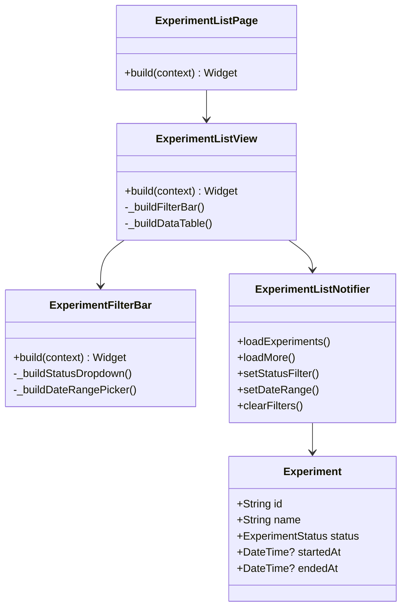

# S2-005: 数据管理页面 - 试验列表 - 详细设计文档

**任务ID**: S2-005  
**任务名称**: 数据管理页面 - 试验列表 (Data Management Page - Experiment List)  
**文档版本**: 1.0  
**创建日期**: 2026-04-01  
**设计人**: sw-tom  
**依赖任务**: S1-012, S2-004  

---

## 1. 设计概述

### 1.1 功能范围

本任务实现试验记录列表页面，提供以下功能：
- 试验列表展示（分页）
- 试验状态筛选
- 时间范围筛选
- 点击进入试验详情页

### 1.2 技术栈

| 技术项 | 选择 |
|--------|------|
| **前端框架** | Flutter 3.16+ |
| **状态管理** | Riverpod + Freezed |
| **HTTP客户端** | Dio |
| **UI组件** | Material Design 3 |
| **数据表格** | KayakDataTable (existing) |

---

## 2. 页面结构

### 2.1 路由

```
/experiments -> ExperimentListPage
```

### 2.2 页面布局

```
┌─────────────────────────────────────────────────────────────┐
│  页面标题: 试验记录                                          │
├─────────────────────────────────────────────────────────────┤
│  ┌─────────────────────────────────────────────────────────┐│
│  │ 筛选工具栏                                               ││
│  │ [状态筛选 ▼] [开始时间] - [结束时间] [重置] [刷新]         ││
│  └─────────────────────────────────────────────────────────┘│
├─────────────────────────────────────────────────────────────┤
│  ┌─────────────────────────────────────────────────────────┐│
│  │ 数据表格                                                 ││
│  │ 列: 名称 | 状态 | 开始时间 | 结束时间 | 操作              ││
│  │ ─────────────────────────────────────────────────────── ││
│  │ 实验1  | RUNNING | 10:00 | -      | [查看]              ││
│  │ 实验2  | COMPLETED| 09:00 | 10:30  | [查看]              ││
│  │ ...                                                     ││
│  └─────────────────────────────────────────────────────────┘│
├─────────────────────────────────────────────────────────────┤
│  ┌─────────────────────────────────────────────────────────┐│
│  │ 分页工具栏                                               ││
│  │ [每页 10 条] < 1 2 3 ... 10 > [共 98 条]                ││
│  └─────────────────────────────────────────────────────────┘│
└─────────────────────────────────────────────────────────────┘
```

---

## 3. 组件设计

### 3.1 主要组件

| 组件 | 路径 | 说明 |
|------|------|------|
| ExperimentListPage | `experiments/screens/experiment_list_page.dart` | 页面主入口 |
| ExperimentListView | `experiments/screens/experiment_list_view.dart` | 视图层 |
| ExperimentFilterBar | `experiments/widgets/experiment_filter_bar.dart` | 筛选工具栏 |
| ExperimentDataTable | `experiments/widgets/experiment_data_table.dart` | 数据表格 |

### 3.2 组件层次

```
ExperimentListPage
└── ExperimentListView (ConsumerWidget)
    ├── ExperimentFilterBar
    │   ├── StatusFilterDropdown
    │   ├── DateRangePicker
    │   └── ActionButtons (Reset, Refresh)
    └── ExperimentDataTable
        └── KayakDataTable (复用现有组件)
```

---

## 4. 状态管理

### 4.1 State 类

```dart
@freezed
class ExperimentListState with _$ExperimentListState {
  const factory ExperimentListState({
    @Default([]) List<Experiment> experiments,
    @Default(1) int page,
    @Default(10) int size,
    @Default(0) int total,
    @Default(false) bool isLoading,
    @Default(false) bool hasNext,
    @Default(false) bool hasPrev,
    ExperimentStatus? statusFilter,
    DateTime? startDateFilter,
    DateTime? endDateFilter,
    String? error,
  }) = _ExperimentListState;
}
```

### 4.2 Notifier 类

```dart
class ExperimentListNotifier extends StateNotifier<ExperimentListState> {
  ExperimentListNotifier(this._apiClient) : super(const ExperimentListState());

  final AuthenticatedApiClient _apiClient;

  Future<void> loadExperiments({bool reset = false}) async { ... }
  Future<void> loadMore() async { ... }
  void setStatusFilter(ExperimentStatus? status) { ... }
  void setDateRange(DateTime? start, DateTime? end) { ... }
  void clearFilters() { ... }
  void resetPagination() { ... }
}
```

### 4.3 Providers

```dart
final experimentListProvider =
    StateNotifierProvider<ExperimentListNotifier, ExperimentListState>((ref) {
  final apiClient = ref.watch(apiClientProvider);
  return ExperimentListNotifier(apiClient);
});
```

---

## 5. API 集成

### 5.1 API 端点

```
GET /api/v1/experiments
```

**查询参数**:
| 参数 | 类型 | 说明 |
|------|------|------|
| page | int | 页码 (默认: 1) |
| size | int | 每页条数 (默认: 10) |
| status | string | 状态筛选 (IDLE/RUNNING/PAUSED/COMPLETED/ABORTED) |
| started_after | datetime | 开始时间下限 (ISO 8601) |
| started_before | datetime | 开始时间上限 (ISO 8601) |

### 5.2 响应格式

```json
{
  "code": 0,
  "message": "success",
  "data": {
    "items": [
      {
        "id": "uuid",
        "user_id": "uuid",
        "method_id": "uuid|null",
        "name": "试验名称",
        "description": "描述",
        "status": "RUNNING",
        "started_at": "2026-04-01T10:00:00Z",
        "ended_at": null,
        "created_at": "2026-04-01T09:00:00Z",
        "updated_at": "2026-04-01T10:00:00Z"
      }
    ],
    "page": 1,
    "size": 10,
    "total": 98,
    "has_next": true,
    "has_prev": false
  }
}
```

### 5.3 API Client 方法

```dart
class ExperimentApiService {
  Future<PagedResponse<Experiment>> listExperiments({
    int page = 1,
    int size = 10,
    ExperimentStatus? status,
    DateTime? startedAfter,
    DateTime? startedBefore,
  }) async { ... }
}
```

---

## 6. 筛选逻辑

### 6.1 状态筛选

- 支持多选或单选状态
- 状态选项: IDLE, RUNNING, PAUSED, COMPLETED, ABORTED
- 筛选条件通过 URL 参数传递

### 6.2 时间范围筛选

- 使用 DateRangePicker 组件
- 选择开始时间的下限和上限
- 支持清空时间筛选

### 6.3 筛选重置

- 重置按钮清除所有筛选条件
- 重置后重新加载第一页数据

---

## 7. 响应式设计

### 7.1 桌面端 (>= 1200px)

- 完整表格显示所有列
- 侧边栏展开

### 7.2 平板端 (>= 768px)

- 隐藏部分列
- 侧边栏可折叠

### 7.3 移动端 (< 768px)

- 列表视图代替表格
- 底部导航栏

---

## 8. 主题支持

### 8.1 浅色主题

- 背景色: surface
- 表格行交替色: surfaceVariant
- 状态标签使用语义颜色

### 8.2 深色主题

- 背景色: surface
- 表格行交替色: surfaceContainerHighest
- 状态标签使用语义颜色

---

## 9. 验收标准

| ID | 标准 | 测试用例 |
|----|------|----------|
| AC1 | 列表展示所有试验记录 | TC-UI-001, TC-FILTER-006 |
| AC2 | 状态筛选功能可用 | TC-FILTER-001, TC-FILTER-002 |
| AC3 | 时间范围筛选功能可用 | TC-FILTER-003, TC-FILTER-004 |
| AC4 | 分页功能正常工作 | TC-FILTER-007, TC-FILTER-008, TC-FILTER-009 |
| AC5 | 点击进入试验详情页 | TC-NAV-001, TC-NAV-002 |
| AC6 | 筛选条件重置功能正常 | TC-INT-002 |
| AC7 | 加载状态显示正确 | TC-STATE-004, TC-STATE-005 |
| AC8 | 空状态提示友好 | TC-UI-004 |
| AC9 | 错误状态处理正确 | TC-STATE-007 |

---

## 10. UML图

### 10.1 静态结构图



---

**文档结束**
