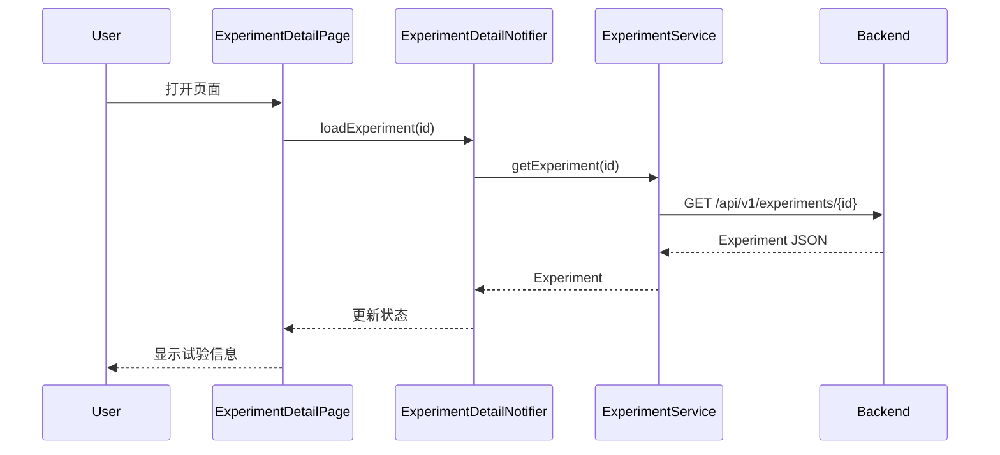
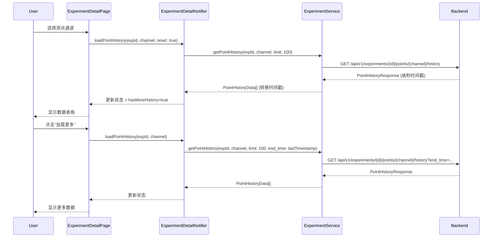
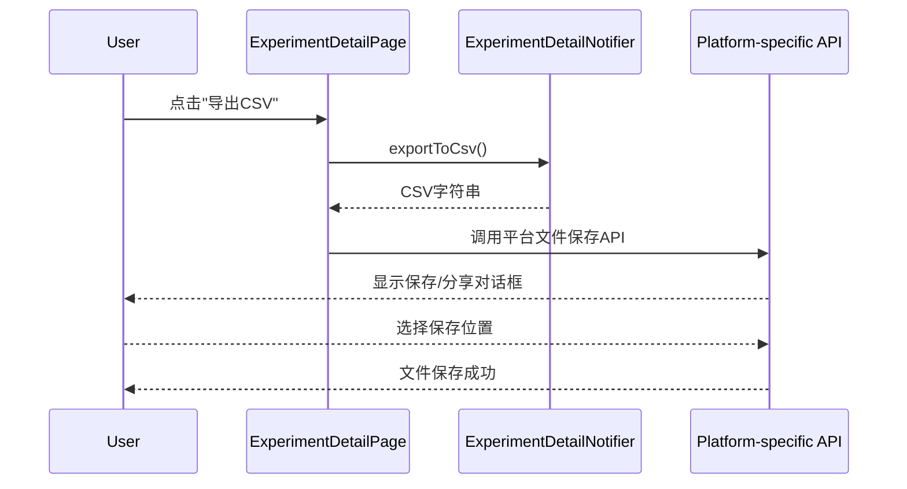
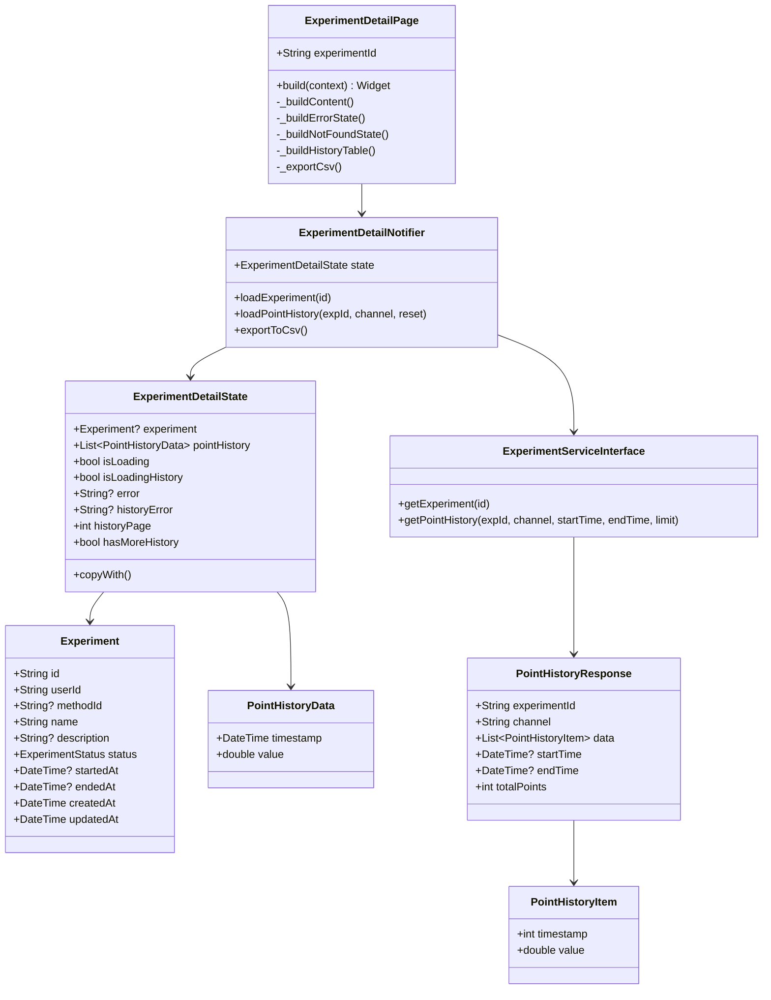
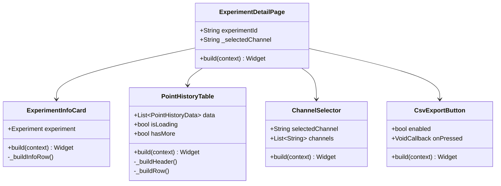

# S2-006: 数据管理页面 - 试验详情与数据查看 - 详细设计文档

**任务ID**: S2-006  
**任务名称**: 数据管理页面 - 试验详情与数据查看 (Data Management Page - Experiment Detail and Data View)  
**文档版本**: 1.1  
**创建日期**: 2026-04-01  
**更新日期**: 2026-04-01  
**设计人**: sw-tom  
**依赖任务**: S1-012, S2-004, S2-005  

---

## 1. 设计概述

### 1.1 功能范围

本任务实现试验详情页面，提供以下功能：
- 试验完整元信息展示（名称、状态、时间、描述等）
- 测点历史数据表格展示（时间戳+数值）
- 数据导出为CSV格式
- 测点通道选择

### 1.2 技术栈

| 技术项 | 选择 |
|--------|------|
| **前端框架** | Flutter 3.16+ |
| **状态管理** | Riverpod + StateNotifier |
| **HTTP客户端** | Dio |
| **UI组件** | Material Design 3 |
| **CSV导出** | 平台特定实现 (见 6.4 节) |

---

## 2. 页面结构

### 2.1 路由

```
/experiments/:id -> ExperimentDetailPage
```

### 2.2 页面布局

```
┌─────────────────────────────────────────────────────────────────┐
│  ← 返回  试验名称                                    [状态标签]  │
├─────────────────────────────────────────────────────────────────┤
│  ┌───────────────────────────────────────────────────────────┐  │
│  │ 试验信息卡片                                               │  │
│  │ ─────────────────────────────────────────────────────────│  │
│  │ ID: uuid                                                  │  │
│  │ 描述: 描述内容                                             │  │
│  │ 开始时间: 2026-04-01 10:00                                │  │
│  │ 结束时间: -                                                │  │
│  │ 创建时间: 2026-04-01 09:00                                │  │
│  └───────────────────────────────────────────────────────────┘  │
├─────────────────────────────────────────────────────────────────┤
│  测点数据                    [通道选择 ▼]  [导出CSV] [刷新]      │
├─────────────────────────────────────────────────────────────────┤
│  ┌───────────────────────────────────────────────────────────┐  │
│  │ 时间戳                              │ 数值                 │  │
│  ├───────────────────────────────────────────────────────────┤  │
│  │ 2026-04-01T10:00:00.000            │ 25.5000              │  │
│  │ 2026-04-01T10:00:01.000            │ 25.6000              │  │
│  │ 2026-04-01T10:00:02.000            │ 25.8000              │  │
│  │ ...                                                       │  │
│  └───────────────────────────────────────────────────────────┘  │
│                        [加载更多]                               │
└─────────────────────────────────────────────────────────────────┘
```

---

## 3. 组件设计

### 3.1 主要组件

| 组件 | 路径 | 说明 |
|------|------|------|
| ExperimentDetailPage | `experiments/screens/detail/experiment_detail_page.dart` | 页面主入口 |
| ExperimentInfoCard | `experiments/widgets/experiment_info_card.dart` | 试验信息卡片 |
| PointHistoryTable | `experiments/widgets/point_history_table.dart` | 时序数据表格 |
| ChannelSelector | `experiments/widgets/channel_selector.dart` | 测点通道选择器 |
| CsvExportButton | `experiments/widgets/csv_export_button.dart` | CSV导出按钮 |

### 3.2 组件层次

```
ExperimentDetailPage
├── ExperimentInfoCard
│   ├── StatusChip
│   └── InfoRow
├── PointHistoryTable
│   ├── TableHeader
│   ├── TableBody (ListView.builder)
│   │   └── DataRow
│   └── LoadMoreButton
├── ChannelSelector (DropdownButton)
└── ActionButtons
    ├── CsvExportButton
    └── RefreshButton
```

### 3.3 组件详细设计

#### 3.3.1 ExperimentInfoCard

```dart
class ExperimentInfoCard extends StatelessWidget {
  final Experiment experiment;

  const ExperimentInfoCard({
    super.key,
    required this.experiment,
  });

  @override
  Widget build(BuildContext context) {
    return Card(
      child: Padding(
        padding: const EdgeInsets.all(16),
        child: Column(
          crossAxisAlignment: CrossAxisAlignment.start,
          children: [
            Text('试验信息', style: Theme.of(context).textTheme.titleMedium),
            const SizedBox(height: 16),
            _buildInfoRow('ID', experiment.id),
            if (experiment.description != null)
              _buildInfoRow('描述', experiment.description!),
            _buildInfoRow('开始时间', _formatDateTime(experiment.startedAt)),
            _buildInfoRow('结束时间', _formatDateTime(experiment.endedAt)),
            _buildInfoRow('创建时间', _formatDateTime(experiment.createdAt)),
          ],
        ),
      ),
    );
  }
}
```

#### 3.3.2 PointHistoryTable

```dart
class PointHistoryTable extends StatelessWidget {
  final List<PointHistoryData> data;
  final bool isLoading;
  final bool hasMore;
  final VoidCallback? onLoadMore;
  final VoidCallback? onRetry;

  const PointHistoryTable({
    super.key,
    required this.data,
    this.isLoading = false,
    this.hasMore = false,
    this.onLoadMore,
    this.onRetry,
  });

  @override
  Widget build(BuildContext context) {
    // 表头
    // 表体 (ListView.builder)
    // 加载更多按钮
  }
}
```

#### 3.3.3 ChannelSelector

```dart
class ChannelSelector extends StatelessWidget {
  final String selectedChannel;
  final List<String> channels;
  final ValueChanged<String> onChanged;

  const ChannelSelector({
    super.key,
    required this.selectedChannel,
    required this.channels,
    required this.onChanged,
  });
}
```

#### 3.3.4 CsvExportButton

```dart
class CsvExportButton extends StatelessWidget {
  final bool enabled;
  final VoidCallback onPressed;

  const CsvExportButton({
    super.key,
    required this.enabled,
    required this.onPressed,
  });

  @override
  Widget build(BuildContext context) {
    return FilledButton.icon(
      onPressed: enabled ? onPressed : null,
      icon: const Icon(Icons.download),
      label: const Text('导出CSV'),
    );
  }
}
```

---

## 4. 状态管理

### 4.1 State 类 (ExperimentDetailState)

> **参考**: `experiments/models/experiment_detail_state.dart`

```dart
class ExperimentDetailState {
  final Experiment? experiment;
  final List<PointHistoryData> pointHistory;
  final bool isLoading;
  final bool isLoadingHistory;
  final String? error;
  final String? historyError;
  final int historyPage;
  final bool hasMoreHistory;

  const ExperimentDetailState({
    this.experiment,
    this.pointHistory = const [],
    this.isLoading = false,
    this.isLoadingHistory = false,
    this.error,
    this.historyError,
    this.historyPage = 1,
    this.hasMoreHistory = false,
  });

  ExperimentDetailState copyWith({
    Experiment? experiment,
    List<PointHistoryData>? pointHistory,
    bool? isLoading,
    bool? isLoadingHistory,
    String? error,
    String? historyError,
    int? historyPage,
    bool? hasMoreHistory,
    bool clearError = false,
    bool clearHistoryError = false,
  });
}
```

### 4.2 数据模型

#### PointHistoryData

> **参考**: `experiments/models/experiment_detail_state.dart`

```dart
/// 时序数据点
class PointHistoryData {
  final DateTime timestamp;
  final double value;

  const PointHistoryData({
    required this.timestamp,
    required this.value,
  });
}
```

#### PointHistoryItem

> **参考**: `experiments/providers/experiment_detail_provider.dart`

```dart
/// API响应中的测点历史项
class PointHistoryItem {
  final int timestamp; // 纳秒级Unix时间戳
  final double value;

  const PointHistoryItem({
    required this.timestamp,
    required this.value,
  });

  factory PointHistoryItem.fromJson(Map<String, dynamic> json) {
    return PointHistoryItem(
      timestamp: json['timestamp'] as int,
      value: (json['value'] as num).toDouble(),
    );
  }
}
```

#### PointHistoryResponse

> **参考**: `experiments/providers/experiment_detail_provider.dart`

```dart
/// 测点历史响应
class PointHistoryResponse {
  final String experimentId;
  final String channel;
  final List<PointHistoryItem> data;
  final DateTime? startTime;
  final DateTime? endTime;
  final int totalPoints;

  const PointHistoryResponse({
    required this.experimentId,
    required this.channel,
    required this.data,
    this.startTime,
    this.endTime,
    required this.totalPoints,
  });

  factory PointHistoryResponse.fromJson(Map<String, dynamic> json) {
    return PointHistoryResponse(
      experimentId: json['experiment_id'] as String,
      channel: json['channel'] as String,
      data: (json['data'] as List)
          .map((e) => PointHistoryItem.fromJson(e as Map<String, dynamic>))
          .toList(),
      startTime: json['start_time'] != null
          ? DateTime.parse(json['start_time'] as String)
          : null,
      endTime: json['end_time'] != null
          ? DateTime.parse(json['end_time'] as String)
          : null,
      totalPoints: json['total_points'] as int,
    );
  }
}
```

### 4.3 Notifier 类 (ExperimentDetailNotifier)

> **参考**: `experiments/providers/experiment_detail_provider.dart`

```dart
class ExperimentDetailNotifier extends StateNotifier<ExperimentDetailState> {
  final ExperimentServiceInterface _service;

  ExperimentDetailNotifier(this._service)
      : super(const ExperimentDetailState());

  /// 加载试验详情
  Future<void> loadExperiment(String id) async {
    if (state.isLoading) return;

    state = state.copyWith(isLoading: true, clearError: true);

    try {
      final experiment = await _service.getExperiment(id);
      state = state.copyWith(
        experiment: experiment,
        isLoading: false,
      );
    } catch (e) {
      state = state.copyWith(
        isLoading: false,
        error: e.toString(),
      );
    }
  }

  /// 加载测点历史数据
  ///
  /// 使用时间范围分页 (time-based pagination)：
  /// - 第一页请求不指定时间范围，获取最新数据
  /// - 后续请求使用上一页最后一条数据的时间戳作为 `end_time`
  Future<void> loadPointHistory(
    String experimentId,
    String channel, {
    bool reset = false,
  }) async {
    if (state.isLoadingHistory && !reset) return;

    final targetPage = reset ? 1 : state.historyPage;

    state = state.copyWith(
      isLoadingHistory: true,
      historyPage: reset ? 1 : null,
      clearHistoryError: true,
    );

    try {
      // 构建查询参数
      final queryParams = <String, dynamic>{
        'limit': 100, // 每页100条
      };

      // 分页：使用 end_time 进行时间范围分页
      if (targetPage > 1) {
        if (state.pointHistory.isNotEmpty) {
          final lastPoint = state.pointHistory.last;
          queryParams['end_time'] = lastPoint.timestamp.toIso8601String();
        }
      }

      final response = await _service.getPointHistory(
        experimentId,
        channel,
        limit: 100,
        endTime: targetPage > 1 && state.pointHistory.isNotEmpty
            ? state.pointHistory.last.timestamp
            : null,
      );

      final newData = response.data.map((point) {
        return PointHistoryData(
          timestamp: DateTime.fromMillisecondsSinceEpoch(point.timestamp ~/ 1000000),
          value: point.value,
        );
      }).toList();

      state = state.copyWith(
        pointHistory: reset ? newData : [...state.pointHistory, ...newData],
        historyPage: targetPage + 1,
        hasMoreHistory: newData.length >= 100,
        isLoadingHistory: false,
      );
    } catch (e) {
      state = state.copyWith(
        isLoadingHistory: false,
        historyError: e.toString(),
      );
    }
  }

  /// 导出CSV
  Future<String> exportToCsv() async {
    if (state.experiment == null) return '';

    final buffer = StringBuffer();
    buffer.writeln('Timestamp,Value');

    for (final point in state.pointHistory) {
      buffer.writeln('${point.timestamp.toIso8601String()},${point.value}');
    }

    return buffer.toString();
  }
}
```

### 4.4 Provider 定义

```dart
final experimentDetailProvider =
    StateNotifierProvider<ExperimentDetailNotifier, ExperimentDetailState>(
        (ref) {
  final service = ref.watch(experimentServiceProvider);
  return ExperimentDetailNotifier(service);
});
```

---

## 5. API 集成

### 5.1 API 端点

#### 获取试验详情

```
GET /api/v1/experiments/{id}
```

**响应格式**:
```json
{
  "code": 0,
  "message": "success",
  "data": {
    "id": "uuid",
    "user_id": "uuid",
    "method_id": "uuid|null",
    "name": "试验名称",
    "description": "描述",
    "status": "RUNNING",
    "started_at": "2026-04-01T10:00:00Z",
    "ended_at": null,
    "created_at": "2026-04-01T09:00:00Z",
    "updated_at": "2026-04-01T10:00:00Z"
  }
}
```

#### 获取测点历史数据

```
GET /api/v1/experiments/{experimentId}/points/{channel}/history
```

**查询参数**:

| 参数 | 类型 | 必填 | 说明 |
|------|------|------|------|
| `limit` | int | 否 | 每页条数，默认: 1000 |
| `start_time` | datetime | 否 | 开始时间 (ISO 8601)，用于筛选时间范围内的数据 |
| `end_time` | datetime | 否 | 结束时间 (ISO 8601)，用于时间范围分页 |

**响应格式**:
```json
{
  "code": 0,
  "message": "success",
  "data": {
    "experiment_id": "uuid",
    "channel": "temp_sensor_1",
    "data": [
      {
        "timestamp": 1741000800000000000,
        "value": 25.5
      }
    ],
    "start_time": "2026-04-01T10:00:00Z",
    "end_time": "2026-04-01T10:30:00Z",
    "total_points": 150
  }
}
```

### 5.2 通道来源

测点通道 (`channel`) 来源于试验元数据：

- **来源**: 试验接口返回的数据中包含通道信息
- **fallback**: 如果试验元数据中无通道信息，使用默认通道 `"default"`
- **获取时机**: 在加载试验详情后，从 `Experiment.channels` 或 API 响应中获取通道列表

> **注意**: 通道列表的具体获取方式依赖于后端 API 设计，当前实现使用预设的默认通道。

### 5.3 时间戳处理

API返回的时间戳是**纳秒级Unix时间戳** (nanoseconds since epoch):
- 转换公式: `DateTime.fromMillisecondsSinceEpoch(timestamp ~/ 1000000)`
- 注意: 1毫秒 = 1,000,000 纳秒

### 5.4 分页策略

- 采用**时间范围分页** (time-based pagination)
- 第一页请求: 不指定 `end_time`，获取最新数据
- 后续请求: 使用上一页最后一条数据的时间戳作为 `end_time` 参数
- 每页数据量: 100条
- `hasMoreHistory = newData.length >= 100`

---

## 6. CSV 导出功能

### 6.1 导出格式

```csv
Timestamp,Value
2026-04-01T10:00:00.000,25.5000
2026-04-01T10:00:01.000,25.6000
2026-04-01T10:00:02.000,25.8000
```

### 6.2 导出流程

```
1. 用户点击"导出CSV"按钮
2. 调用 notifier.exportToCsv() 生成CSV字符串
3. 根据平台调用对应的文件保存API
4. 显示成功/失败提示
```

### 6.3 文件命名

```
{experiment_name}_{timestamp}.csv
```

示例: `温度测试_1741000800000.csv`

### 6.4 平台特定实现

| 平台 | 实现方案 | 依赖包 |
|------|----------|--------|
| **Web** | 通过 JavaScript Blob 触发浏览器下载 | `file_saver` 或原生 JS 互操作 |
| **Android** | 使用系统分享对话框分享CSV文件 | `share_plus` |
| **iOS** | 使用系统分享对话框分享CSV文件 | `share_plus` |
| **Windows/macOS/Linux** | 使用文件保存对话框选择保存位置 | `file_picker` |

**代码示例**:

```dart
// 平台特定导出
Future<void> saveCsvFile(String csvContent, String fileName) async {
  if (kIsWeb) {
    // Web: 使用 file_saver 触发下载
    await FileSaver.instance.saveFile(
      name: fileName,
      bytes: utf8.encode(csvContent),
    );
  } else if (Platform.isAndroid || Platform.isIOS) {
    // 移动端: 使用 share_plus 分享
    final tempDir = await getTemporaryDirectory();
    final tempFile = File('${tempDir.path}/$fileName');
    await tempFile.writeAsString(csvContent);
    await Share.shareXFiles([XFile(tempFile.path)]);
  } else {
    // 桌面端: 使用 file_picker 选择保存位置
    final result = await FilePicker.platform.saveFile(
      dialogTitle: '保存CSV文件',
      fileName: fileName,
      type: FileType.custom,
      allowedExtensions: ['csv'],
    );
    if (result != null) {
      final file = File(result);
      await file.writeAsString(csvContent);
    }
  }
}
```

---

## 7. 错误处理

### 7.1 错误状态

| 错误类型 | 错误字段 | 显示内容 |
|----------|----------|----------|
| 试验加载失败 | `error` | 重试按钮 + 错误信息 |
| 历史数据加载失败 | `historyError` | 重试按钮 + 错误信息 |
| CSV导出失败 | - | SnackBar错误提示 |

### 7.2 空状态

| 场景 | 显示内容 |
|------|----------|
| 无测点数据 | "暂无测点数据" + 图标 |
| 测点通道为空 | 下拉框仅显示"default" |

---

## 8. 响应式设计

### 8.1 桌面端 (>= 1200px)

- 页面最大宽度 1200px，居中显示
- 信息卡片和表格并排布局

### 8.2 平板端 (>= 768px)

- 全宽布局
- 信息卡片和表格垂直堆叠

### 8.3 移动端 (< 768px)

- 全宽布局
- 简化表格列显示
- 底部操作按钮

---

## 9. 主题支持

### 9.1 状态颜色

| 状态 | 背景色 | 文字色 |
|------|--------|--------|
| idle (空闲) | grey.shade200 | grey.shade700 |
| running (运行中) | green.shade100 | green.shade700 |
| paused (已暂停) | orange.shade100 | orange.shade700 |
| completed (已完成) | blue.shade100 | blue.shade700 |
| aborted (已中止) | red.shade100 | red.shade700 |

---

## 10. 验收标准

| ID | 标准 | 测试用例 |
|----|------|----------|
| AC1 | 展示试验完整元信息 | TC-STATE-001~003, TC-UI-001~005 |
| AC2 | 测点数据表格展示 | TC-STATE-004~006, TC-UI-006~010 |
| AC3 | 导出CSV功能可用 | TC-CSV-001~006, TC-NOTIFIER-003 |

---

## 11. 数据流图

### 11.1 加载试验详情流程



### 11.2 加载测点历史数据流程 (时间分页)



### 11.3 CSV导出流程



---

## 12. UML 图

### 12.1 静态结构图



### 12.2 组件结构图



---

**文档结束**

(End of file - total 713 lines)
