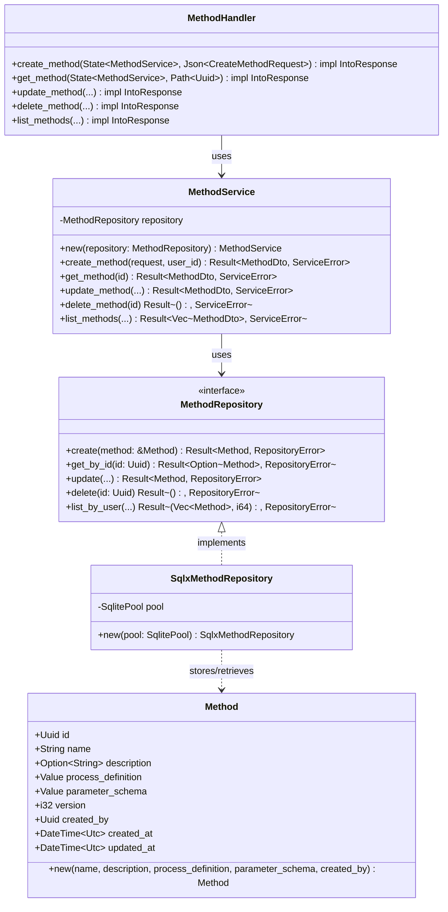

# S2-007 设计文档：试验方法数据模型与存储

**任务ID**: S2-007  
**任务名称**: 试验方法数据模型与存储 (Experiment Method Data Model and Storage)  
**文档版本**: 1.0  
**创建日期**: 2026-04-01  
**技术栈**: Rust / sqlx / Axum / SQLite

---

## 1. 设计概述

### 1.1 功能范围

设计并实现试验方法(Method)的数据模型和存储系统，支持：
1. 方法的CRUD操作
2. JSON格式的方法定义存储
3. 配置参数表Schema支持
4. 方法版本管理扩展点

### 1.2 技术栈

- **后端**: Rust + Axum
- **数据库**: SQLite with sqlx
- **ORM**: sqlx (compile-time checked queries)
- **序列化**: serde + serde_json
- **API**: RESTful JSON API

---

## 2. 数据模型设计

### 2.1 Method实体

```rust
/// 试验方法实体
#[derive(Debug, Clone, Serialize, Deserialize)]
pub struct Method {
    /// 方法ID (UUID)
    pub id: Uuid,
    /// 方法名称
    pub name: String,
    /// 方法描述
    pub description: Option<String>,
    /// 过程定义 (JSON格式)
    pub process_definition: serde_json::Value,
    /// 参数表Schema (JSON格式)
    pub parameter_schema: serde_json::Value,
    /// 版本号 (预留扩展点)
    pub version: i32,
    /// 创建者用户ID
    pub created_by: Uuid,
    /// 创建时间
    pub created_at: DateTime<Utc>,
    /// 更新时间
    pub updated_at: DateTime<Utc>,
}

impl Method {
    /// 创建新方法
    pub fn new(
        name: String,
        description: Option<String>,
        process_definition: serde_json::Value,
        parameter_schema: serde_json::Value,
        created_by: Uuid,
    ) -> Self {
        let now = Utc::now();
        Self {
            id: Uuid::new_v4(),
            name,
            description,
            process_definition,
            parameter_schema,
            version: 1, // 初始版本
            created_by,
            created_at: now,
            updated_at: now,
        }
    }
}
```

### 2.2 数据表Schema

```sql
-- 方法表
CREATE TABLE methods (
    id TEXT PRIMARY KEY,  -- UUID
    name TEXT NOT NULL,
    description TEXT,
    process_definition TEXT NOT NULL,  -- JSON字符串
    parameter_schema TEXT NOT NULL,    -- JSON字符串
    version INTEGER DEFAULT 1,
    created_by TEXT NOT NULL,  -- 用户ID (UUID)
    created_at TIMESTAMP DEFAULT CURRENT_TIMESTAMP,
    updated_at TIMESTAMP DEFAULT CURRENT_TIMESTAMP,
    FOREIGN KEY (created_by) REFERENCES users(id)
);

-- 索引
CREATE INDEX idx_methods_created_by ON methods(created_by);
CREATE INDEX idx_methods_created_at ON methods(created_at);
```

### 2.3 DTO结构

```rust
/// 创建方法请求DTO
#[derive(Debug, Clone, Deserialize)]
pub struct CreateMethodRequest {
    pub name: String,
    pub description: Option<String>,
    pub process_definition: serde_json::Value,
    pub parameter_schema: serde_json::Value,
}

/// 更新方法请求DTO
#[derive(Debug, Clone, Deserialize)]
pub struct UpdateMethodRequest {
    pub name: Option<String>,
    pub description: Option<String>,
    pub process_definition: Option<serde_json::Value>,
    pub parameter_schema: Option<serde_json::Value>,
}

/// 方法响应DTO
#[derive(Debug, Clone, Serialize)]
pub struct MethodDto {
    pub id: String,
    pub name: String,
    pub description: Option<String>,
    pub process_definition: serde_json::Value,
    pub parameter_schema: serde_json::Value,
    pub version: i32,
    pub created_by: String,
    pub created_at: String,
    pub updated_at: String,
}

impl From<Method> for MethodDto {
    fn from(method: Method) -> Self {
        Self {
            id: method.id.to_string(),
            name: method.name,
            description: method.description,
            process_definition: method.process_definition,
            parameter_schema: method.parameter_schema,
            version: method.version,
            created_by: method.created_by.to_string(),
            created_at: method.created_at.to_rfc3339(),
            updated_at: method.updated_at.to_rfc3339(),
        }
    }
}
```

---

## 3. Repository层设计

### 3.1 Repository接口

```rust
#[async_trait]
pub trait MethodRepository: Send + Sync {
    /// 创建方法
    async fn create(&self, method: &Method) -> Result<Method, RepositoryError>;
    
    /// 根据ID获取方法
    async fn get_by_id(&self, id: Uuid) -> Result<Option<Method>, RepositoryError>;
    
    /// 更新方法
    async fn update(
        &self,
        id: Uuid,
        name: Option<String>,
        description: Option<String>,
        process_definition: Option<serde_json::Value>,
        parameter_schema: Option<serde_json::Value>,
    ) -> Result<Method, RepositoryError>;
    
    /// 删除方法
    async fn delete(&self, id: Uuid) -> Result<(), RepositoryError>;
    
    /// 列出用户的方法（分页）
    async fn list_by_user(
        &self,
        user_id: Uuid,
        page: i64,
        size: i64,
    ) -> Result<(Vec<Method>, i64), RepositoryError>;
}
```

### 3.2 SqlxMethodRepository实现

```rust
pub struct SqlxMethodRepository {
    pool: SqlitePool,
}

impl SqlxMethodRepository {
    pub fn new(pool: SqlitePool) -> Self {
        Self { pool }
    }
}

#[async_trait]
impl MethodRepository for SqlxMethodRepository {
    async fn create(&self, method: &Method) -> Result<Method, RepositoryError> {
        sqlx::query(
            r#"
            INSERT INTO methods (id, name, description, process_definition, parameter_schema, version, created_by, created_at, updated_at)
            VALUES (?1, ?2, ?3, ?4, ?5, ?6, ?7, ?8, ?9)
            "#
        )
        .bind(method.id.to_string())
        .bind(&method.name)
        .bind(&method.description)
        .bind(method.process_definition.to_string())
        .bind(method.parameter_schema.to_string())
        .bind(method.version)
        .bind(method.created_by.to_string())
        .bind(method.created_at)
        .bind(method.updated_at)
        .execute(&self.pool)
        .await?;
        
        Ok(method.clone())
    }
    
    // ... 其他方法实现
}
```

---

## 4. Service层设计

### 4.1 MethodService

```rust
pub struct MethodService<R: MethodRepository> {
    repository: R,
}

impl<R: MethodRepository> MethodService<R> {
    pub fn new(repository: R) -> Self {
        Self { repository }
    }
    
    /// 创建方法
    pub async fn create_method(
        &self,
        request: CreateMethodRequest,
        user_id: Uuid,
    ) -> Result<MethodDto, ServiceError> {
        // 验证请求
        self.validate_create_request(&request)?;
        
        // 创建实体
        let method = Method::new(
            request.name,
            request.description,
            request.process_definition,
            request.parameter_schema,
            user_id,
        );
        
        // 保存到数据库
        let created = self.repository.create(&method).await?;
        
        Ok(created.into())
    }
    
    /// 验证创建请求
    fn validate_create_request(&self, request: &CreateMethodRequest) -> Result<(), ServiceError> {
        // 名称长度验证
        if request.name.is_empty() || request.name.len() > 255 {
            return Err(ServiceError::Validation("名称长度必须在1-255之间".to_string()));
        }
        
        // JSON格式验证
        if !request.process_definition.is_object() {
            return Err(ServiceError::Validation("过程定义必须是JSON对象".to_string()));
        }
        
        if !request.parameter_schema.is_object() {
            return Err(ServiceError::Validation("参数Schema必须是JSON对象".to_string()));
        }
        
        Ok(())
    }
    
    // ... 其他方法
}
```

---

## 5. API端点设计

### 5.1 端点列表

| 方法 | 路径 | 描述 | 认证 |
|------|------|------|------|
| POST | /api/v1/methods | 创建方法 | 需要 |
| GET | /api/v1/methods | 列出方法 | 需要 |
| GET | /api/v1/methods/{id} | 获取方法详情 | 需要 |
| PUT | /api/v1/methods/{id} | 更新方法 | 需要 |
| DELETE | /api/v1/methods/{id} | 删除方法 | 需要 |

### 5.2 请求/响应示例

**创建方法 (POST /api/v1/methods)**
```json
// Request
{
  "name": "温度循环试验",
  "description": "测试温度循环过程",
  "process_definition": {
    "steps": [
      {"type": "Start", "name": "开始"},
      {"type": "TemperatureControl", "target": 80, "duration": 3600},
      {"type": "End", "name": "结束"}
    ]
  },
  "parameter_schema": {
    "type": "object",
    "properties": {
      "target_temperature": {"type": "number", "default": 25},
      "duration_seconds": {"type": "integer", "minimum": 1}
    },
    "required": ["target_temperature", "duration_seconds"]
  }
}

// Response (201 Created)
{
  "code": 200,
  "message": "success",
  "data": {
    "id": "550e8400-e29b-41d4-a716-446655440000",
    "name": "温度循环试验",
    "description": "测试温度循环过程",
    "process_definition": {...},
    "parameter_schema": {...},
    "version": 1,
    "created_by": "user-uuid",
    "created_at": "2024-03-15T10:00:00Z",
    "updated_at": "2024-03-15T10:00:00Z"
  },
  "timestamp": "2024-03-15T10:00:00Z"
}
```

---

## 6. UML类图



---

## 7. 版本管理扩展点

当前设计为版本管理预留了以下扩展点：

1. **version字段**: 方法表中的`version`字段可用于版本控制
2. **clone方法**: 可以通过复制方法实体并增加版本号来创建新版本
3. **历史记录表**: 未来可添加`method_versions`表存储完整历史

```rust
// 未来版本管理实现示例
impl Method {
    /// 创建新版本（预留扩展点）
    pub fn create_new_version(&self) -> Self {
        Self {
            id: Uuid::new_v4(),
            name: self.name.clone(),
            description: self.description.clone(),
            process_definition: self.process_definition.clone(),
            parameter_schema: self.parameter_schema.clone(),
            version: self.version + 1,
            created_by: self.created_by,
            created_at: Utc::now(),
            updated_at: Utc::now(),
        }
    }
}
```

---

## 8. 验收标准映射

| 验收标准 | 设计实现 |
|---------|---------|
| 方法定义存储为JSON | `process_definition`字段使用`serde_json::Value`，数据库存储为TEXT |
| 支持配置参数表 | `parameter_schema`字段支持JSON Schema格式 |
| 方法版本管理预留扩展点 | `version`字段 + 预留的`create_new_version`方法 |

---

## 9. 错误处理

```rust
/// Repository错误
#[derive(Debug, Error)]
pub enum RepositoryError {
    #[error("Database error: {0}")]
    Database(#[from] sqlx::Error),
    #[error("Not found")]
    NotFound,
}

/// Service错误
#[derive(Debug, Error)]
pub enum ServiceError {
    #[error("Validation error: {0}")]
    Validation(String),
    #[error("Not found")]
    NotFound,
    #[error("Repository error: {0}")]
    Repository(#[from] RepositoryError),
}

impl IntoResponse for ServiceError {
    fn into_response(self) -> Response {
        let (status, message) = match &self {
            ServiceError::Validation(msg) => (StatusCode::BAD_REQUEST, msg.clone()),
            ServiceError::NotFound => (StatusCode::NOT_FOUND, "Method not found".to_string()),
            ServiceError::Repository(_) => (StatusCode::INTERNAL_SERVER_ERROR, "Internal error".to_string()),
        };
        
        (status, Json(json!({"error": message}))).into_response()
    }
}
```

---

**设计人**: sw-jerry  
**日期**: 2026-04-01  
**状态**: ✅ APPROVED