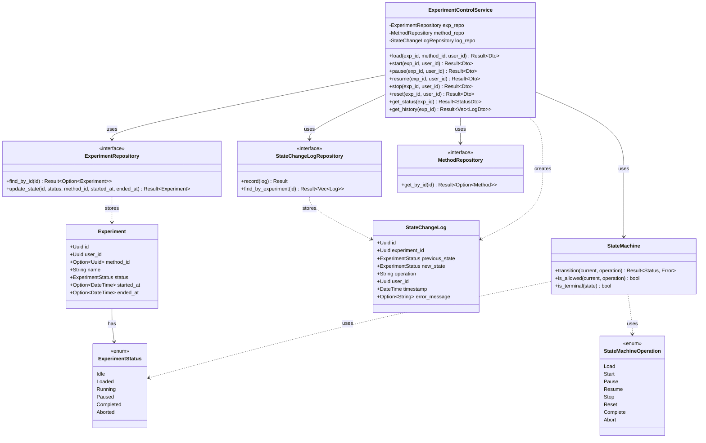
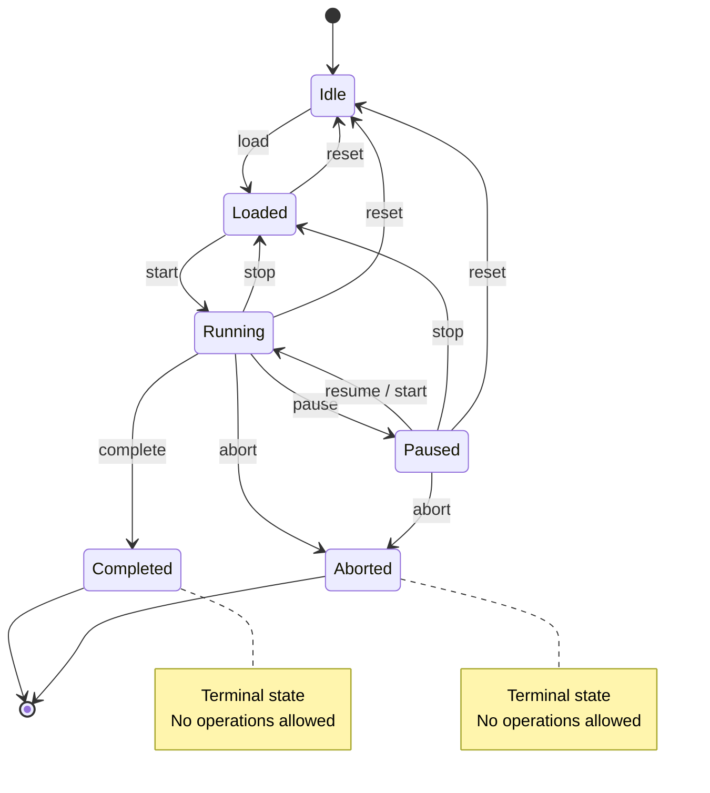
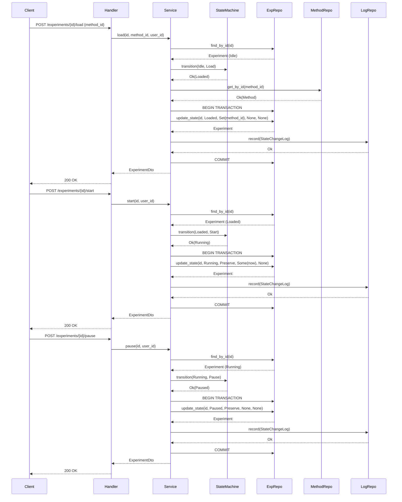

# S2-008 详细设计文档：试验过程状态机实现

**Task ID**: S2-008  
**Task Name**: Experiment Process State Machine Implementation  
**Document Version**: 1.0  
**Date**: 2026-04-02  
**Technical Stack**: Rust / sqlx / Axum / SQLite

---

## 1. Architecture Overview

The experiment process state machine is the core control component for experiment execution. It sits between the API layer (S2-011) and the data layer, enforcing valid state transitions and persisting state changes.

```
┌─────────────────────────────────────────────────────┐
│                   API Layer (S2-011)                 │
│  ExperimentControlHandler (load, start, pause, ...)  │
└──────────────────────┬──────────────────────────────┘
                       │
                       ▼
┌─────────────────────────────────────────────────────┐
│              Service Layer (this task)               │
│  ExperimentControlService                           │
│  ├── StateMachine (pure state transition logic)     │
│  ├── ExperimentRepository (state persistence)       │
│  └── StateChangeLogRepository (audit logging)       │
└──────────────────────┬──────────────────────────────┘
                       │
                       ▼
┌─────────────────────────────────────────────────────┐
│              Data Layer                              │
│  ├── experiments table (state column)               │
│  └── state_change_logs table (new)                  │
└─────────────────────────────────────────────────────┘
```

### Design Principles
- **Separation of concerns**: Pure state machine logic is separate from persistence
- **Dependency Inversion**: Service depends on repository traits, not concrete implementations
- **Atomicity**: State transitions and log writes happen in a single transaction
- **Thread safety**: Repository-level optimistic locking prevents concurrent transition conflicts

---

## 2. State Machine Design

### 2.1 Updated ExperimentStatus Enum

The existing `ExperimentStatus` enum needs the `Loaded` state added:

```rust
#[derive(Debug, Clone, Copy, PartialEq, Eq, Serialize, Deserialize, Default)]
#[serde(rename_all = "UPPERCASE")]
pub enum ExperimentStatus {
    #[default]
    Idle,
    Loaded,     // NEW: Method loaded, ready to start
    Running,
    Paused,
    Completed,  // Terminal: Normal completion
    Aborted,    // Terminal: Error or forced stop
}
```

### 2.2 State Transition Table

Complete transition matrix (rows = current state, columns = operation):

| Current \ Operation | Load  | Start | Pause | Resume | Stop  | Reset | Complete | Abort |
|---------------------|-------|-------|-------|--------|-------|-------|----------|-------|
| **Idle**            | Loaded| ❌    | ❌    | ❌     | ❌    | Idle  | ❌       | ❌    |
| **Loaded**          | ❌    | Run   | ❌    | ❌     | ❌    | Idle  | ❌       | ❌    |
| **Running**         | ❌    | ❌    | Pause | ❌     | Loaded| Idle  | Complete | Abort |
| **Paused**          | ❌    | Run   | ❌    | Run    | Loaded| Idle  | ❌       | Abort |
| **Completed**       | ❌    | ❌    | ❌    | ❌     | ❌    | ❌    | ❌       | ❌    |
| **Aborted**         | ❌    | ❌    | ❌    | ❌     | ❌    | ❌    | ❌       | ❌    |

**Notes**:
- Reset from Idle returns Idle (no-op, but allowed per PRD "任意状态")
- Stop from Running/Paused returns to Loaded (method stays loaded for re-run)
- Reset from any non-terminal state returns to Idle (clears method_id)
- Completed and Aborted are truly terminal — no operations allowed

### 2.3 StateMachine (Pure Functions)

A pure state machine module with no side effects:

```rust
/// State machine operation types
#[derive(Debug, Clone, Copy, PartialEq, Eq)]
pub enum StateMachineOperation {
    Load,
    Start,
    Pause,
    Resume,
    Stop,
    Reset,
    Complete,
    Abort,
}

/// State machine error
#[derive(Debug, Clone, PartialEq, Eq)]
pub enum StateMachineError {
    /// The transition from `from` to the operation's target state is not valid.
    /// Used for non-terminal states where the operation simply doesn't apply.
    InvalidTransition {
        from: ExperimentStatus,
        operation: StateMachineOperation,
    },
    /// The operation is not allowed because the current state is terminal.
    /// Used specifically for Completed and Aborted states.
    OperationNotAllowed {
        operation: StateMachineOperation,
        current_state: ExperimentStatus,
    },
}

/// Pure state machine — no I/O, no side effects
pub struct StateMachine;

impl StateMachine {
    /// Validate and compute the next state for a given operation.
    /// Returns the target state or an error if the transition is invalid.
    pub fn transition(
        current: ExperimentStatus,
        operation: StateMachineOperation,
    ) -> Result<ExperimentStatus, StateMachineError> {
        match (current, operation) {
            // Load: Idle -> Loaded
            (ExperimentStatus::Idle, StateMachineOperation::Load) => {
                Ok(ExperimentStatus::Loaded)
            }
            // Start: Loaded -> Running, Paused -> Running
            (ExperimentStatus::Loaded, StateMachineOperation::Start)
            | (ExperimentStatus::Paused, StateMachineOperation::Start)
            | (ExperimentStatus::Paused, StateMachineOperation::Resume) => {
                Ok(ExperimentStatus::Running)
            }
            // Pause: Running -> Paused
            (ExperimentStatus::Running, StateMachineOperation::Pause) => {
                Ok(ExperimentStatus::Paused)
            }
            // Stop: Running -> Loaded, Paused -> Loaded
            (ExperimentStatus::Running, StateMachineOperation::Stop)
            | (ExperimentStatus::Paused, StateMachineOperation::Stop) => {
                Ok(ExperimentStatus::Loaded)
            }
            // Reset: any non-terminal -> Idle (including Idle itself as no-op)
            (ExperimentStatus::Idle, StateMachineOperation::Reset)
            | (ExperimentStatus::Loaded, StateMachineOperation::Reset)
            | (ExperimentStatus::Running, StateMachineOperation::Reset)
            | (ExperimentStatus::Paused, StateMachineOperation::Reset) => {
                Ok(ExperimentStatus::Idle)
            }
            // Complete: Running -> Completed
            (ExperimentStatus::Running, StateMachineOperation::Complete) => {
                Ok(ExperimentStatus::Completed)
            }
            // Abort: Running -> Aborted, Paused -> Aborted
            (ExperimentStatus::Running, StateMachineOperation::Abort)
            | (ExperimentStatus::Paused, StateMachineOperation::Abort) => {
                Ok(ExperimentStatus::Aborted)
            }
            // All other combinations are invalid
            (_, _) => {
                // Check if we're in a terminal state
                match current {
                    ExperimentStatus::Completed | ExperimentStatus::Aborted => {
                        Err(StateMachineError::OperationNotAllowed {
                            operation,
                            current_state: current,
                        })
                    }
                    _ => {
                        Err(StateMachineError::InvalidTransition {
                            from: current,
                            operation,
                        })
                    }
                }
            }
        }
    }

    /// Check if an operation is allowed in the current state
    pub fn is_allowed(current: ExperimentStatus, operation: StateMachineOperation) -> bool {
        Self::transition(current, operation).is_ok()
    }

    /// Check if a state is terminal
    pub fn is_terminal(state: ExperimentStatus) -> bool {
        matches!(state, ExperimentStatus::Completed | ExperimentStatus::Aborted)
    }

    /// Infer the target state from an operation (for error messages)
    fn infer_target(operation: StateMachineOperation) -> ExperimentStatus {
        match operation {
            StateMachineOperation::Load => ExperimentStatus::Loaded,
            StateMachineOperation::Start | StateMachineOperation::Resume => ExperimentStatus::Running,
            StateMachineOperation::Pause => ExperimentStatus::Paused,
            StateMachineOperation::Stop => ExperimentStatus::Loaded,
            StateMachineOperation::Reset => ExperimentStatus::Idle,
            StateMachineOperation::Complete => ExperimentStatus::Completed,
            StateMachineOperation::Abort => ExperimentStatus::Aborted,
        }
    }
}
```

---

## 3. Data Model Updates

### 3.1 StateChangeLog Entity

New entity for audit logging of state changes:

```rust
/// State change log entry
#[derive(Debug, Clone, Serialize, Deserialize)]
pub struct StateChangeLog {
    pub id: Uuid,
    pub experiment_id: Uuid,
    pub previous_state: ExperimentStatus,
    pub new_state: ExperimentStatus,
    pub operation: String,       // "load", "start", "pause", etc.
    pub user_id: Uuid,           // Who triggered the change
    pub timestamp: DateTime<Utc>,
    pub error_message: Option<String>,
}

impl StateMachineOperation {
    /// Returns the lowercase string representation of the operation.
    pub fn as_str(&self) -> &'static str {
        match self {
            StateMachineOperation::Load => "load",
            StateMachineOperation::Start => "start",
            StateMachineOperation::Pause => "pause",
            StateMachineOperation::Resume => "resume",
            StateMachineOperation::Stop => "stop",
            StateMachineOperation::Reset => "reset",
            StateMachineOperation::Complete => "complete",
            StateMachineOperation::Abort => "abort",
        }
    }
}

impl StateChangeLog {
    pub fn new(
        experiment_id: Uuid,
        previous_state: ExperimentStatus,
        new_state: ExperimentStatus,
        operation: StateMachineOperation,
        user_id: Uuid,
    ) -> Self {
        Self {
            id: Uuid::new_v4(),
            experiment_id,
            previous_state,
            new_state,
            operation: operation.as_str().to_string(),
            user_id,
            timestamp: Utc::now(),
            error_message: None,
        }
    }

    pub fn with_error(mut self, msg: String) -> Self {
        self.error_message = Some(msg);
        self
    }
}
```

### 3.2 Database Schema — New Table

```sql
-- State change log table
CREATE TABLE state_change_logs (
    id TEXT PRIMARY KEY,
    experiment_id TEXT NOT NULL,
    previous_state TEXT NOT NULL,
    new_state TEXT NOT NULL,
    operation TEXT NOT NULL,
    user_id TEXT NOT NULL,
    timestamp TIMESTAMP NOT NULL DEFAULT CURRENT_TIMESTAMP,
    error_message TEXT,
    FOREIGN KEY (experiment_id) REFERENCES experiments(id),
    FOREIGN KEY (user_id) REFERENCES users(id)
);

-- Index for querying logs by experiment
CREATE INDEX idx_state_change_logs_experiment_id ON state_change_logs(experiment_id);

-- Index for querying recent logs
CREATE INDEX idx_state_change_logs_timestamp ON state_change_logs(timestamp DESC);
```

### 3.3 Database Migration

The migration SQL will be added to the existing sqlx migrations directory:

```sql
-- migration/V5__add_state_change_logs.sql

-- Add LOADED status support (no schema change needed — status is TEXT)
-- The application layer handles the new enum variant

CREATE TABLE IF NOT EXISTS state_change_logs (
    id TEXT PRIMARY KEY,
    experiment_id TEXT NOT NULL,
    previous_state TEXT NOT NULL,
    new_state TEXT NOT NULL,
    operation TEXT NOT NULL,
    user_id TEXT NOT NULL,
    timestamp TIMESTAMP NOT NULL DEFAULT CURRENT_TIMESTAMP,
    error_message TEXT,
    FOREIGN KEY (experiment_id) REFERENCES experiments(id),
    FOREIGN KEY (user_id) REFERENCES users(id)
);

CREATE INDEX IF NOT EXISTS idx_state_change_logs_experiment_id 
    ON state_change_logs(experiment_id);

CREATE INDEX IF NOT EXISTS idx_state_change_logs_timestamp 
    ON state_change_logs(timestamp DESC);
```

### 3.4 Existing Code Updates Required

The following existing code must be updated as part of this task:

1. **`ExperimentRow::to_experiment()` in `experiment_repo.rs`**: Add `"LOADED" => ExperimentStatus::Loaded` to the status match statement. Currently missing, which would silently default "LOADED" to "Idle".

2. **`Experiment::can_transition_to()` in `experiment.rs`**: This existing method encodes the old (pre-Loaded) state machine. It should be **deprecated** and all transition checks should go through `StateMachine::is_allowed()` instead. The method body should be updated to delegate to `StateMachine` or removed entirely to avoid having two sources of truth.

3. **`ExperimentRepository::update_status()`**: This existing method should be **deprecated** in favor of the new `update_state()` method which provides explicit control over method_id and timestamps.

---

## 4. Repository Layer

### 4.1 StateChangeLogRepository (New)

```rust
#[async_trait]
pub trait StateChangeLogRepository: Send + Sync {
    /// Record a state change
    async fn record(&self, log: &StateChangeLog) -> Result<(), StateChangeLogRepositoryError>;
    
    /// Get all state changes for an experiment (ordered by timestamp)
    async fn find_by_experiment(
        &self,
        experiment_id: Uuid,
    ) -> Result<Vec<StateChangeLog>, StateChangeLogRepositoryError>;
    
    /// Get the latest state change for an experiment
    async fn find_latest(
        &self,
        experiment_id: Uuid,
    ) -> Result<Option<StateChangeLog>, StateChangeLogRepositoryError>;
}

#[derive(Debug, thiserror::Error)]
pub enum StateChangeLogRepositoryError {
    #[error("Database error: {0}")]
    DatabaseError(#[from] sqlx::Error),
}
```

### 4.2 ExperimentRepository Updates

The existing `update_status` method needs to be enhanced to support transactional state changes with method_id updates:

```rust
/// Controls how method_id should be updated during a state transition.
pub enum MethodIdUpdate {
    /// Set method_id to a specific value (used by Load operation)
    Set(Uuid),
    /// Clear method_id (used by Reset operation)
    Clear,
    /// Do not change method_id (used by Start, Pause, Resume, Stop, etc.)
    Preserve,
}

#[async_trait]
pub trait ExperimentRepository: Send + Sync {
    // ... existing methods ...

    /// Update experiment state with explicit control over method_id and timestamps.
    /// This is the primary method used by the state machine service.
    ///
    /// - `method_id`: Controls how method_id is updated (Set/Clear/Preserve)
    /// - `started_at`: If Some, sets the started_at timestamp
    /// - `ended_at`: If Some, sets the ended_at timestamp
    async fn update_state(
        &self,
        id: Uuid,
        status: ExperimentStatus,
        method_id: MethodIdUpdate,
        started_at: Option<DateTime<Utc>>,
        ended_at: Option<DateTime<Utc>>,
    ) -> Result<Experiment, ExperimentRepositoryError>;
}
```

**Usage by operation**:
| Operation | method_id | started_at | ended_at |
|-----------|-----------|------------|----------|
| Load | `Set(method_id)` | None | None |
| Start | `Preserve` | `Some(now)` if first start | None |
| Pause | `Preserve` | None | None |
| Resume | `Preserve` | None | None |
| Stop | `Preserve` | None | None |
| Reset | `Clear` | None | None |
| Complete | `Preserve` | None | `Some(now)` |
| Abort | `Preserve` | None | `Some(now)` |

---

## 5. Service Layer

### 5.1 ExperimentControlService

```rust
pub struct ExperimentControlService<ER, MR, LR>
where
    ER: ExperimentRepository,
    MR: MethodRepository,
    LR: StateChangeLogRepository,
{
    experiment_repo: ER,
    method_repo: MR,
    log_repo: LR,
}

impl<ER, MR, LR> ExperimentControlService<ER, MR, LR>
where
    ER: ExperimentRepository,
    MR: MethodRepository,
    LR: StateChangeLogRepository,
{
    pub fn new(experiment_repo: ER, method_repo: MR, log_repo: LR) -> Self {
        Self {
            experiment_repo,
            method_repo,
            log_repo,
        }
    }

    /// Load a method into the experiment (Idle -> Loaded)
    pub async fn load(
        &self,
        experiment_id: Uuid,
        method_id: Uuid,
        user_id: Uuid,
    ) -> Result<ExperimentDto, ExperimentControlError>;

    /// Start the experiment (Loaded -> Running, Paused -> Running)
    pub async fn start(
        &self,
        experiment_id: Uuid,
        user_id: Uuid,
    ) -> Result<ExperimentDto, ExperimentControlError>;

    /// Pause the experiment (Running -> Paused)
    pub async fn pause(
        &self,
        experiment_id: Uuid,
        user_id: Uuid,
    ) -> Result<ExperimentDto, ExperimentControlError>;

    /// Resume the experiment (Paused -> Running)
    pub async fn resume(
        &self,
        experiment_id: Uuid,
        user_id: Uuid,
    ) -> Result<ExperimentDto, ExperimentControlError>;

    /// Stop the experiment (Running/Loaded -> Loaded)
    pub async fn stop(
        &self,
        experiment_id: Uuid,
        user_id: Uuid,
    ) -> Result<ExperimentDto, ExperimentControlError>;

    /// Reset the experiment (Loaded/Running/Paused -> Idle)
    pub async fn reset(
        &self,
        experiment_id: Uuid,
        user_id: Uuid,
    ) -> Result<ExperimentDto, ExperimentControlError>;

    /// Get current experiment status
    pub async fn get_status(
        &self,
        experiment_id: Uuid,
    ) -> Result<ExperimentStatusDto, ExperimentControlError>;

    /// Get state change history
    pub async fn get_history(
        &self,
        experiment_id: Uuid,
    ) -> Result<Vec<StateChangeLogDto>, ExperimentControlError>;
}
```

### 5.2 Error Types

```rust
#[derive(Debug, thiserror::Error)]
pub enum ExperimentControlError {
    #[error("Experiment not found: {0}")]
    NotFound(Uuid),

    #[error("Method not found: {0}")]
    MethodNotFound(Uuid),

    #[error("Invalid state transition: {0}")]
    InvalidTransition(String),

    #[error("Operation not allowed: {0}")]
    OperationNotAllowed(String),

    #[error("Repository error: {0}")]
    Repository(String),

    #[error("Concurrent modification conflict")]
    ConcurrentConflict,
}
```

### 5.3 DTOs

```rust
/// Experiment status response
#[derive(Debug, Serialize)]
pub struct ExperimentStatusDto {
    pub id: String,
    pub name: String,
    pub status: String,
    pub method_id: Option<String>,
    pub started_at: Option<String>,
    pub ended_at: Option<String>,
    pub updated_at: String,
}

/// State change log DTO
#[derive(Debug, Serialize)]
pub struct StateChangeLogDto {
    pub id: String,
    pub experiment_id: String,
    pub previous_state: String,
    pub new_state: String,
    pub operation: String,
    pub user_id: String,
    pub timestamp: String,
    pub error_message: Option<String>,
}

/// Experiment DTO for control responses
#[derive(Debug, Serialize)]
pub struct ExperimentDto {
    pub id: String,
    pub name: String,
    pub status: String,
    pub method_id: Option<String>,
    pub description: Option<String>,
    pub started_at: Option<String>,
    pub ended_at: Option<String>,
    pub created_at: String,
    pub updated_at: String,
}
```

---

## 6. API Layer Interface (for S2-011)

The following handler functions will be implemented in S2-011. This section defines the interfaces:

```rust
// POST /api/v1/experiments/{id}/load
async fn load_method(
    State(service): State<ExperimentControlService<...>>,
    Path(id): Path<Uuid>,
    Json(req): Json<LoadMethodRequest>,
    user: AuthUser,
) -> impl IntoResponse;

// POST /api/v1/experiments/{id}/start
async fn start_experiment(
    State(service): State<ExperimentControlService<...>>,
    Path(id): Path<Uuid>,
    user: AuthUser,
) -> impl IntoResponse;

// POST /api/v1/experiments/{id}/pause
async fn pause_experiment(...) -> impl IntoResponse;

// POST /api/v1/experiments/{id}/resume
async fn resume_experiment(...) -> impl IntoResponse;

// POST /api/v1/experiments/{id}/stop
async fn stop_experiment(...) -> impl IntoResponse;

// POST /api/v1/experiments/{id}/reset
async fn reset_experiment(...) -> impl IntoResponse;

// GET /api/v1/experiments/{id}/status
async fn get_status(...) -> impl IntoResponse;

// GET /api/v1/experiments/{id}/history
async fn get_history(...) -> impl IntoResponse;
```

---

## 7. UML Diagrams

### 7.1 Class Diagram



### 7.2 State Diagram



### 7.3 Sequence Diagram: Typical Control Flow



**Transaction Note**: The `BEGIN TRANSACTION` / `COMMIT` boundary wraps both `update_state` and `record` to ensure atomicity. If the log write fails, the state change is rolled back. In practice, this is achieved by passing a shared `SqliteTransaction` to both repository methods.

---

## 8. Design Decisions

| Decision | Choice | Rationale |
|----------|--------|-----------|
| State machine as pure function | Yes | Testable, no side effects, easy to reason about |
| Reset target state | IDLE (not LOADED) | "Reset" semantically means "start over" — clears everything |
| Reset from Idle | Allowed (no-op, returns Idle) | PRD says "任意状态" (any state); harmless idempotent operation |
| Reset from terminal states | Not allowed | Terminal states are final; create a new experiment instead |
| Stop target state | LOADED (not IDLE) | Allows re-running the same method without reloading |
| State change log table | Separate table | Keeps experiments table clean; enables full audit trail |
| Concurrent safety | Optimistic locking via repository | SQLite's write locking provides natural serialization |
| Method ID cleared on Reset | Yes | Reset means "back to square one" |
| Method ID preserved on Stop | Yes | Stop is a pause-for-later, not a full reset |
| `can_transition_to` deprecated | Yes | Single source of truth: `StateMachine::transition()` |
| `update_status` deprecated | Yes | Replaced by `update_state()` with explicit `MethodIdUpdate` |

---

## 9. Acceptance Criteria Mapping

| Acceptance Criteria | Implementation |
|---------------------|----------------|
| State transitions match PRD 2.3.1 | `StateMachine::transition()` implements the exact state diagram |
| Invalid state transitions rejected | Returns `StateMachineError::InvalidTransition` or `OperationNotAllowed` |
| State change records logged | `StateChangeLogRepository::record()` called on every transition |
| State persisted to database | `ExperimentRepository::update_state()` persists status, timestamps, method_id |

---

**Author**: sw-tom  
**Reviewer**: sw-jerry  
**Status**: ✅ APPROVED (v1.1 - all review issues fixed)
