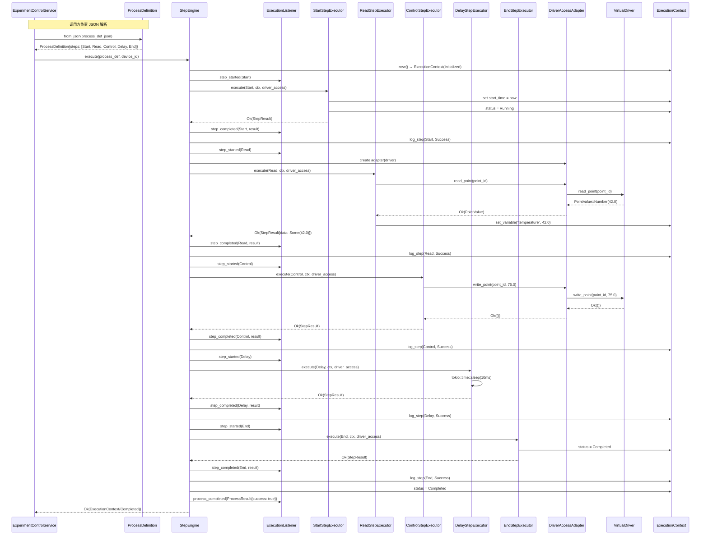
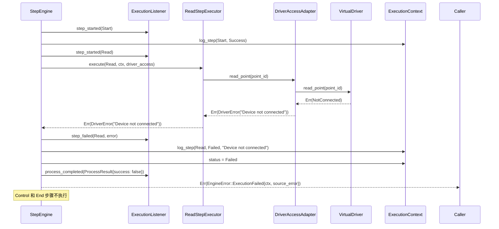

# S2-009 详细设计文档：基础环节执行引擎

**Task ID**: S2-009  
**Task Name**: 基础环节执行引擎  
**Design Version**: 1.1  
**Date**: 2026-04-02  
**Author**: sw-tom  
**Status**: 待复审

---

## 修订历史

| 版本 | 日期 | 作者 | 修订说明 |
|------|------|------|----------|
| 1.0 | 2026-04-02 | sw-tom | 初始版本 |
| 1.1 | 2026-04-02 | sw-tom | 根据 sw-jerry 复审意见修订：<br>1. StepExecutor trait 改为使用 `DriverAccess` trait 抽象，消除 DIP 违规（#1）<br>2. 统一错误处理策略：`execute()` 返回 `Result<ExecutionContext, EngineError>`（#2）<br>3. 修正序列图，显示已解析的 `ProcessDefinition` 作为输入（#3）<br>4. 补充 `step_type()` 方法的用途说明（#4）<br>5. 增加过程定义结构验证规则（#5）<br>6. 补充空过程定义的执行行为说明（#6）<br>7. 补充驱动锁持有时间说明（#7）<br>8. 移除不必要的 `total_steps_clone`（#8）<br>9. 统一 `ExecutionListener` trait 定义（#9）<br>10. 标注 `arch.md` 目录结构更新需求（#10） |

---

## 1. 架构概述

### 1.1 模块定位

基础环节执行引擎（Step Execution Engine）是 Kayak 试验控制系统的核心组件，负责解析 Method 的过程定义（`process_definition`），并按线性顺序执行其中的环节步骤。

引擎位于驱动层（drivers）和试验控制服务层（experiment_control）之间：

```
┌─────────────────────────────────────────────────┐
│              ExperimentControlService            │  ← S2-011 集成
│         (试验生命周期控制: start/stop/pause)      │
├─────────────────────────────────────────────────┤
│              StepEngine (本模块)                  │  ← S2-009
│         (环节解析 → 线性执行 → 日志记录)          │
├──────────────────────┬──────────────────────────┤
│   DeviceManager      │   StateMachine           │
│   (设备管理)          │   (状态机纯函数)          │
├──────────────────────┴──────────────────────────┤
│              VirtualDriver / DeviceDriver        │
│              (设备驱动抽象层)                     │
└─────────────────────────────────────────────────┘
```

### 1.2 设计原则

1. **依赖倒置（DIP）**: 引擎不依赖具体驱动实现，通过 `DriverAccess` trait 抽象设备访问，通过 `DeviceDriver` trait 抽象驱动生命周期
2. **策略模式**: 每种环节类型实现 `StepExecutor` trait，引擎通过 trait 对象统一调度
3. **观察者模式**: 通过 `ExecutionListener` trait 向外部通知执行事件，为 S2-011 的 StateMachine 集成预留接口
4. **失败快速（Fail-Fast）**: 任一环节执行失败，立即终止后续环节
5. **不可变过程定义**: 过程定义在解析后不可变，执行状态全部保存在 `ExecutionContext` 中

### 1.3 与现有模块的依赖关系

| 依赖模块 | 依赖方式 | 用途 |
|----------|----------|------|
| `engine::DriverAccess` | 新增 trait | Read/Control 环节通过此 trait 读写测点，解耦具体驱动类型 |
| `drivers::core::DeviceDriver` | trait 依赖 | `DriverAccess` 的默认实现基于此 trait |
| `drivers::r#virtual::VirtualDriver` | 测试依赖 | 单元测试和集成测试使用虚拟设备 |
| `drivers::manager::DeviceManager` | 运行时依赖 | 引擎通过 DeviceManager 获取驱动实例 |
| `models::entities::Method` | 数据源 | 从 `process_definition` 字段获取 JSON 过程定义 |
| `state_machine::StateMachine` | 无直接依赖 | S2-009 不直接调用 StateMachine，通过 ExecutionListener 回调通知（S2-011 实现桥接） |

---

## 2. 接口定义（依赖倒置原则）

### 2.1 ExecutionListener trait

执行监听器 trait，用于向外部通知执行事件。S2-011 将实现此 trait 以桥接 StateMachine。

```rust
/// 执行监听器 trait
///
/// 实现此 trait 的监听器会在引擎执行过程中收到回调通知。
/// 所有回调方法提供默认空实现，允许监听器只关注感兴趣的事件。
///
/// # 注意
/// 此 trait 定义需与测试用例文档保持一致。所有方法均有默认空实现，
/// 测试中的 MockExecutionListener 可选择性地覆盖需要验证的回调。
pub trait ExecutionListener: Send + Sync {
    /// 环节开始执行时调用
    fn step_started(&self, _step: &StepDefinition) {
        // 默认空实现
    }

    /// 环节成功完成时调用
    fn step_completed(&self, _step: &StepDefinition, _result: &StepResult) {
        // 默认空实现
    }

    /// 环节执行失败时调用
    fn step_failed(&self, _step: &StepDefinition, _error: &ExecutionError) {
        // 默认空实现
    }

    /// 整个过程执行完成时调用（无论成功或失败）
    fn process_completed(&self, _result: &ProcessResult) {
        // 默认空实现
    }
}
```

**设计说明**:
- 所有方法提供默认空实现，允许监听器只实现关心的回调
- 参数使用引用类型，避免不必要的克隆
- `Send + Sync` 约束确保可在异步环境中安全使用
- **与测试文档一致性**: 测试用例文档中的 trait 定义与此处完全一致，均包含默认空实现

### 2.2 DriverAccess trait（新增）

设备访问抽象 trait，用于解耦 `StepExecutor` 与具体驱动类型。

```rust
/// 设备访问抽象 trait
///
/// 为环节执行器提供统一的设备测点读写接口，屏蔽具体驱动实现的差异。
/// 引擎通过此 trait 向 StepExecutor 提供设备访问能力，遵循依赖倒置原则。
///
/// # 实现方式
/// - 对于 S2-009 阶段，可为 `VirtualDriver` 提供 blanket impl
/// - 未来可为其他驱动类型（Modbus、CAN 等）分别实现此 trait
pub trait DriverAccess: Send + Sync {
    /// 读取指定测点的值
    ///
    /// # 注意
    /// 此方法为同步调用，实现应保证快速返回，避免长时间阻塞。
    fn read_point(&self, point_id: Uuid) -> Result<PointValue, ExecutionError>;

    /// 向指定测点写入值
    ///
    /// # 注意
    /// 此方法为同步调用，实现应保证快速返回，避免长时间阻塞。
    fn write_point(&self, point_id: Uuid, value: PointValue) -> Result<(), ExecutionError>;
}
```

**设计说明**:
- 此 trait 是引擎与驱动层之间的抽象边界，`StepExecutor` 仅依赖此 trait 而非具体驱动
- 方法为同步的（非 async），因为 `read_point`/`write_point` 本质上是快速 I/O 操作
- 返回值统一映射为 `ExecutionError`，简化错误处理

### 2.3 StepExecutor trait

环节执行器 trait，每种环节类型实现此 trait。

```rust
/// 环节执行器 trait
///
/// 每种环节类型（Start、Read、Control、Delay、End）实现此 trait，
/// 提供统一的执行接口。
///
/// # 依赖倒置
/// 此 trait 通过 `DriverAccess` trait 抽象设备访问，不依赖任何具体驱动类型。
/// 这使得 StepExecutor 可与任何实现了 DriverAccess 的驱动配合使用。
#[async_trait]
pub trait StepExecutor: Send + Sync {
    /// 返回此执行器处理的环节类型名称
    ///
    /// # 用途
    /// 此方法主要用于日志记录和调试目的。引擎在分发环节执行时，
    /// 可通过此方法获取环节类型的字符串表示，用于日志输出和错误信息。
    /// 例如：`"Executing step [{}] type: {}"`, step.id(), executor.step_type()
    fn step_type(&self) -> &str;

    /// 执行环节
    ///
    /// # Arguments
    /// * `step` - 环节定义
    /// * `context` - 执行上下文（可变引用，用于存储变量和日志）
    /// * `driver` - 设备访问抽象（Read/Control 环节使用）
    ///
    /// # Returns
    /// * `Ok(StepResult)` - 执行成功
    /// * `Err(ExecutionError)` - 执行失败
    async fn execute(
        &self,
        step: &StepDefinition,
        context: &mut ExecutionContext,
        driver: &dyn DriverAccess,
    ) -> Result<StepResult, ExecutionError>;
}
```

**设计说明**:
- 使用 `#[async_trait]` 支持异步执行（Delay 环节需要 `tokio::time::sleep`）
- `driver` 参数使用 `&dyn DriverAccess` trait 对象，遵循依赖倒置原则，不绑定任何具体驱动类型
- `context` 为可变引用，允许环节修改执行上下文（存储变量、追加日志）
- `step_type()` 方法保留用于日志记录和调试，引擎可在日志中输出环节类型字符串

---

## 3. 数据结构

### 3.1 环节类型枚举

```rust
/// 环节类型
#[derive(Debug, Clone, Copy, PartialEq, Eq, Serialize, Deserialize)]
#[serde(rename_all = "UPPERCASE")]
pub enum StepType {
    /// 开始环节：标记试验开始，初始化执行上下文
    Start,
    /// 读取环节：从设备测点读取值，存入执行上下文
    Read,
    /// 控制环节：向设备测点写入控制值
    Control,
    /// 延迟环节：暂停执行指定时长
    Delay,
    /// 结束环节：标记试验结束
    End,
}

impl std::fmt::Display for StepType {
    fn fmt(&self, f: &mut std::fmt::Formatter<'_>) -> std::fmt::Result {
        match self {
            StepType::Start => write!(f, "Start"),
            StepType::Read => write!(f, "Read"),
            StepType::Control => write!(f, "Control"),
            StepType::Delay => write!(f, "Delay"),
            StepType::End => write!(f, "End"),
        }
    }
}
```

### 3.2 StepDefinition — 环节定义

```rust
/// 环节定义
///
/// 从 JSON 过程定义解析得到的单个环节。
/// 使用 serde 的 tagged enum 反序列化，根据 type 字段自动映射到对应变体。
#[derive(Debug, Clone, Serialize, Deserialize)]
#[serde(tag = "type", rename_all = "UPPERCASE")]
pub enum StepDefinition {
    /// 开始环节
    Start {
        id: String,
        name: String,
    },
    /// 读取环节
    Read {
        id: String,
        name: String,
        /// 测点 UUID（字符串格式，执行时解析为 Uuid）
        point_id: String,
        /// 目标变量名（读取的值存入执行上下文的此变量）
        target_var: String,
    },
    /// 控制环节
    Control {
        id: String,
        name: String,
        /// 测点 UUID（字符串格式）
        point_id: String,
        /// 要写入的值
        value: PointValue,
    },
    /// 延迟环节
    Delay {
        id: String,
        name: String,
        /// 延迟时长（毫秒），必须 >= 0
        duration_ms: u64,
    },
    /// 结束环节
    End {
        id: String,
        name: String,
    },
}

impl StepDefinition {
    /// 获取环节 ID
    pub fn id(&self) -> &str {
        match self {
            StepDefinition::Start { id, .. } => id,
            StepDefinition::Read { id, .. } => id,
            StepDefinition::Control { id, .. } => id,
            StepDefinition::Delay { id, .. } => id,
            StepDefinition::End { id, .. } => id,
        }
    }

    /// 获取环节名称
    pub fn name(&self) -> &str {
        match self {
            StepDefinition::Start { name, .. } => name,
            StepDefinition::Read { name, .. } => name,
            StepDefinition::Control { name, .. } => name,
            StepDefinition::Delay { name, .. } => name,
            StepDefinition::End { name, .. } => name,
        }
    }

    /// 获取环节类型
    pub fn step_type(&self) -> StepType {
        match self {
            StepDefinition::Start { .. } => StepType::Start,
            StepDefinition::Read { .. } => StepType::Read,
            StepDefinition::Control { .. } => StepType::Control,
            StepDefinition::Delay { .. } => StepType::Delay,
            StepDefinition::End { .. } => StepType::End,
        }
    }
}
```

**设计说明**:
- 使用 serde 的 `#[serde(tag = "type")]` 实现内部标记的 enum 反序列化，JSON 中的 `"type"` 字段自动映射到对应变体
- `point_id` 使用 `String` 而非 `Uuid`，因为 JSON 中 UUID 以字符串形式存储，执行时再解析为 `Uuid`（便于在解析阶段给出更友好的错误信息）
- `duration_ms` 使用 `u64` 而非 `i64`，从类型层面排除负数可能（TC-023 的负数延迟在解析阶段即被 serde 拒绝）

### 3.3 ProcessDefinition — 过程定义

```rust
/// 过程定义
///
/// 从 Method.process_definition 解析得到的完整过程定义。
#[derive(Debug, Clone, Serialize, Deserialize)]
pub struct ProcessDefinition {
    /// 过程定义版本
    pub version: String,
    /// 环节列表（按执行顺序排列）
    pub steps: Vec<StepDefinition>,
}

impl ProcessDefinition {
    /// 从 JSON Value 解析过程定义
    ///
    /// # Errors
    /// 返回 `ParseError` 如果：
    /// - JSON 格式无效
    /// - 缺少必填字段
    /// - 环节类型未知
    /// - 存在重复的步骤 ID
    /// - 结构验证失败（第一个步骤不是 Start、最后一个步骤不是 End）
    pub fn from_json(value: serde_json::Value) -> Result<Self, ParseError> {
        let def: ProcessDefinition = serde_json::from_value(value)
            .map_err(|e| ParseError::InvalidJson(e.to_string()))?;

        // 验证步骤 ID 不重复
        let mut seen_ids = std::collections::HashSet::new();
        for step in &def.steps {
            let id = step.id();
            if !seen_ids.insert(id.to_string()) {
                return Err(ParseError::DuplicateStepId(id.to_string()));
            }
        }

        // 结构验证：第一个步骤必须是 Start
        if let Some(first) = def.steps.first() {
            if !matches!(first, StepDefinition::Start { .. }) {
                return Err(ParseError::InvalidStructure(
                    "First step must be Start".to_string(),
                ));
            }
        }

        // 结构验证：最后一个步骤必须是 End
        if let Some(last) = def.steps.last() {
            if !matches!(last, StepDefinition::End { .. }) {
                return Err(ParseError::InvalidStructure(
                    "Last step must be End".to_string(),
                ));
            }
        }

        Ok(def)
    }

    /// 从 JSON 字符串解析过程定义
    pub fn from_json_str(json: &str) -> Result<Self, ParseError> {
        let value: serde_json::Value =
            serde_json::from_str(json).map_err(|e| ParseError::InvalidJson(e.to_string()))?;
        Self::from_json(value)
    }
}
```

**设计说明（新增结构验证）**:
- **重复 ID 检查**: 确保所有步骤 ID 唯一
- **首步验证**: 第一个步骤必须是 `Start`，确保过程有明确的开始标记
- **尾步验证**: 最后一个步骤必须是 `End`，确保过程有明确的结束标记
- **空步骤列表**: 允许空步骤列表（`steps.is_empty()` 返回 `true`），此时 `from_json` 不报错，由引擎处理为空过程的情况

### 3.4 ExecutionContext — 执行上下文

```rust
/// 执行状态
#[derive(Debug, Clone, Copy, PartialEq, Eq)]
pub enum ExecutionStatus {
    /// 初始状态
    Initialized,
    /// 已开始（Start 环节已执行）
    Running,
    /// 已完成（End 环节已执行或所有步骤执行完毕）
    Completed,
    /// 执行失败
    Failed,
}

/// 环节执行日志条目
#[derive(Debug, Clone, Serialize)]
pub struct StepLogEntry {
    /// 步骤 ID
    pub step_id: String,
    /// 步骤类型
    pub step_type: StepType,
    /// 步骤名称
    pub step_name: String,
    /// 开始时间
    pub start_time: DateTime<Utc>,
    /// 结束时间
    pub end_time: DateTime<Utc>,
    /// 执行状态
    pub status: StepStatus,
    /// 执行耗时（毫秒）
    pub duration_ms: u64,
    /// 错误信息（仅失败时有值）
    pub error_message: Option<String>,
}

/// 步骤执行状态
#[derive(Debug, Clone, Copy, PartialEq, Eq, Serialize)]
pub enum StepStatus {
    /// 执行成功
    Success,
    /// 执行失败
    Failed,
}

/// 执行上下文
///
/// 引擎在执行过程中维护的状态容器，包含变量存储、执行状态和日志。
/// 每次执行都创建新的 ExecutionContext 实例，确保执行间隔离（TC-035）。
pub struct ExecutionContext {
    /// 变量存储：Read 环节的输出存入此映射
    pub variables: HashMap<String, PointValue>,
    /// 过程开始时间（由 Start 环节设置）
    pub start_time: Option<DateTime<Utc>>,
    /// 执行状态
    pub status: ExecutionStatus,
    /// 环节执行日志
    pub logs: Vec<StepLogEntry>,
}

impl ExecutionContext {
    /// 创建新的执行上下文（初始状态）
    pub fn new() -> Self {
        Self {
            variables: HashMap::new(),
            start_time: None,
            status: ExecutionStatus::Initialized,
            logs: Vec::new(),
        }
    }

    /// 记录环节执行日志
    pub fn log_step(
        &mut self,
        step_id: String,
        step_type: StepType,
        step_name: String,
        start_time: DateTime<Utc>,
        end_time: DateTime<Utc>,
        status: StepStatus,
        error_message: Option<String>,
    ) {
        let duration_ms = (end_time - start_time).num_milliseconds().max(0) as u64;
        self.logs.push(StepLogEntry {
            step_id,
            step_type,
            step_name,
            start_time,
            end_time,
            status,
            duration_ms,
            error_message,
        });
    }

    /// 获取变量值
    pub fn get_variable(&self, name: &str) -> Option<&PointValue> {
        self.variables.get(name)
    }

    /// 设置变量值（后写入覆盖先写入，TC-034）
    pub fn set_variable(&mut self, name: String, value: PointValue) {
        self.variables.insert(name, value);
    }
}

impl Default for ExecutionContext {
    fn default() -> Self {
        Self::new()
    }
}
```

### 3.5 StepResult — 环节执行结果

```rust
/// 环节执行结果
#[derive(Debug, Clone)]
pub struct StepResult {
    /// 执行耗时（毫秒）
    pub duration_ms: u64,
    /// 附加数据（可选，用于环节间传递信息）
    pub data: Option<PointValue>,
}
```

### 3.6 ExecutionError — 执行错误

```rust
/// 执行错误类型
#[derive(Debug)]
pub enum ExecutionError {
    /// 设备驱动错误
    DriverError(String),
    /// 环节配置错误（如缺少必填字段）
    ConfigError(String),
    /// 解析错误
    ParseError(String),
    /// 内部错误
    InternalError(String),
}

impl std::fmt::Display for ExecutionError {
    fn fmt(&self, f: &mut std::fmt::Formatter<'_>) -> std::fmt::Result {
        match self {
            ExecutionError::DriverError(msg) => write!(f, "Driver error: {}", msg),
            ExecutionError::ConfigError(msg) => write!(f, "Config error: {}", msg),
            ExecutionError::ParseError(msg) => write!(f, "Parse error: {}", msg),
            ExecutionError::InternalError(msg) => write!(f, "Internal error: {}", msg),
        }
    }
}

impl std::error::Error for ExecutionError {}

impl From<DriverError> for ExecutionError {
    fn from(err: DriverError) -> Self {
        ExecutionError::DriverError(err.to_string())
    }
}
```

### 3.7 ParseError — 解析错误

```rust
/// 解析错误类型
#[derive(Debug, Clone)]
pub enum ParseError {
    /// JSON 格式无效
    InvalidJson(String),
    /// 未知的环节类型
    UnknownStepType(String),
    /// 缺少必填字段
    MissingField { field: String, step_type: String },
    /// 重复的步骤 ID
    DuplicateStepId(String),
    /// 结构验证失败（如第一个步骤不是 Start、最后一个步骤不是 End）
    InvalidStructure(String),
}

impl std::fmt::Display for ParseError {
    fn fmt(&self, f: &mut std::fmt::Formatter<'_>) -> std::fmt::Result {
        match self {
            ParseError::InvalidJson(msg) => write!(f, "Invalid JSON: {}", msg),
            ParseError::UnknownStepType(t) => write!(f, "Unknown step type: {}", t),
            ParseError::MissingField { field, step_type } => {
                write!(f, "Missing required field '{}' in step type '{}'", field, step_type)
            }
            ParseError::DuplicateStepId(id) => {
                write!(f, "Duplicate step ID: {}", id)
            }
            ParseError::InvalidStructure(msg) => {
                write!(f, "Invalid process structure: {}", msg)
            }
        }
    }
}

impl std::error::Error for ParseError {}
```

### 3.8 ProcessResult — 过程执行结果

```rust
/// 过程执行结果
///
/// 可从 ExecutionContext 派生，用于向外部报告执行摘要。
#[derive(Debug, Clone)]
pub struct ProcessResult {
    /// 执行是否成功
    pub success: bool,
    /// 总步骤数
    pub total_steps: usize,
    /// 已完成的步骤数
    pub completed_steps: usize,
    /// 最终执行状态
    pub status: ExecutionStatus,
    /// 错误信息（仅失败时有值）
    pub error: Option<ExecutionError>,
}

impl ProcessResult {
    /// 从 ExecutionContext 和总步骤数构建 ProcessResult
    pub fn from_context(context: &ExecutionContext, total_steps: usize) -> Self {
        let completed_steps = context.logs.iter()
            .filter(|log| log.status == StepStatus::Success)
            .count();

        Self {
            success: context.status == ExecutionStatus::Completed,
            total_steps,
            completed_steps,
            status: context.status,
            error: context.logs.iter()
                .find(|log| log.status == StepStatus::Failed)
                .and_then(|log| log.error_message.as_ref())
                .map(|msg| ExecutionError::InternalError(msg.clone())),
        }
    }
}
```

### 3.9 EngineError — 引擎错误（新增）

```rust
/// 引擎执行错误
///
/// 封装引擎执行过程中的错误，包含执行上下文以便调用方获取失败时的完整状态。
#[derive(Debug)]
pub enum EngineError {
    /// 执行失败：包含失败时的执行上下文和原始错误
    ///
    /// 调用方可通过此变体获取失败时的 ExecutionContext，
    /// 包括已执行步骤的日志、变量状态等。
    ExecutionFailed {
        /// 失败时的执行上下文
        context: ExecutionContext,
        /// 导致失败的原始错误
        source_error: ExecutionError,
    },
    /// 设备未找到
    DeviceNotFound(Uuid),
    /// 获取驱动锁失败
    LockError(String),
}

impl std::fmt::Display for EngineError {
    fn fmt(&self, f: &mut std::fmt::Formatter<'_>) -> std::fmt::Result {
        match self {
            EngineError::ExecutionFailed { source_error, .. } => {
                write!(f, "Execution failed: {}", source_error)
            }
            EngineError::DeviceNotFound(id) => {
                write!(f, "Device not found: {}", id)
            }
            EngineError::LockError(msg) => {
                write!(f, "Lock error: {}", msg)
            }
        }
    }
}

impl std::error::Error for EngineError {}
```

---

## 4. 引擎设计

### 4.1 StepEngine 结构体

```rust
/// 环节执行引擎
///
/// 负责解析过程定义并按线性顺序执行环节。
///
/// # 线程安全
/// `StepEngine` 本身不要求 `Sync`，但可以在多个线程间共享（通过 `Arc`），
/// 因为 `execute` 方法每次调用都创建独立的 `ExecutionContext`。
pub struct StepEngine {
    /// 设备管理器，用于获取驱动实例
    device_manager: Arc<DeviceManager>,
    /// 可选的执行监听器
    listener: Option<Arc<dyn ExecutionListener>>,
}
```

### 4.2 执行流程

```
StepEngine::execute(process_definition, device_id)
    │
    ├── 1. 创建 ExecutionContext（初始状态）
    │
    ├── 2. 处理空过程定义
    │   ├── 如果 steps 为空：
    │   │   ├── 设置 context.status = Completed
    │   │   └── 返回 Ok(context)（立即完成，TC-031）
    │   └── 否则继续
    │
    ├── 3. 获取设备驱动（通过 DeviceManager）
    │
    ├── 4. 遍历 steps 数组（线性执行）
    │   │
    │   ├── 对每个 step：
    │   │   ├── 4a. 通知 listener.step_started(step)
    │   │   ├── 4b. 记录开始时间
    │   │   ├── 4c. 根据 step 类型查找对应的 StepExecutor
    │   │   ├── 4d. 调用 executor.execute(step, context, driver_access)
    │   │   ├── 4e. 记录结束时间
    │   │   ├── 4f. 如果成功：
    │   │   │   ├── 通知 listener.step_completed(step, result)
    │   │   │   └── 记录成功日志到 context
    │   │   └── 4g. 如果失败：
    │   │       ├── 通知 listener.step_failed(step, error)
    │   │       ├── 记录失败日志到 context
    │   │       ├── 设置 context.status = Failed
    │   │       ├── 通知 listener.process_completed(result)
    │   │       └── 返回 Err(EngineError::ExecutionFailed { context, source_error })
    │   │
    │   └── 所有步骤执行完毕
    │
    ├── 5. 设置 context.status = Completed
    │
    ├── 6. 通知 listener.process_completed(result)
    │
    └── 7. 返回 Ok(context)
```

### 4.3 错误处理策略

**统一错误处理方案**:

- `execute()` 返回 `Result<ExecutionContext, EngineError>`
- **成功时**: 返回 `Ok(context)`，其中 `context.status == Completed`
- **失败时**: 返回 `Err(EngineError::ExecutionFailed { context, source_error })`，其中 `context.status == Failed`
  - 调用方可通过模式匹配从错误变体中提取 `context`，获取失败时的完整状态（已执行步骤的日志、变量值等）
- **空过程**: 当 `steps` 为空时，直接返回 `Ok(context)`，`context.status == Completed`（TC-031）

**错误处理原则**:
- **失败快速（Fail-Fast）**: 任一环节执行失败，立即终止执行，不执行后续环节
- **错误传播**: 引擎返回的 `Err` 包含第一个失败的环节的错误信息，以及失败时的完整执行上下文
- **日志完整性**: 即使执行失败，已执行环节的日志仍保留在 `ExecutionContext` 中
- **状态一致性**: 失败时 `context.status` 设置为 `Failed`，成功时设置为 `Completed`

### 4.4 设备驱动访问

引擎通过 `DeviceManager` 获取驱动实例，并通过 `DriverAccess` trait 向 `StepExecutor` 提供设备访问能力。

**驱动锁持有时间说明**:
- `read_point` 和 `write_point` 是同步方法，实现应保证快速返回
- 引擎在执行每个步骤前获取驱动的可变引用（写锁），步骤执行完毕后锁自动释放
- 对于 Delay 步骤，虽然锁被获取但 `DelayStepExecutor` 不使用 driver 参数，实际锁持有时间极短
- 对于 Read/Control 步骤，锁在 `read_point`/`write_point` 调用期间持有，这些操作应为快速 I/O
- **注意**: 驱动锁不应在 sleep 或其他长时间操作期间持有

```rust
impl StepEngine {
    /// 创建新的执行引擎
    pub fn new(
        device_manager: Arc<DeviceManager>,
        listener: Option<Arc<dyn ExecutionListener>>,
    ) -> Self {
        Self {
            device_manager,
            listener,
        }
    }

    /// 执行过程定义
    ///
    /// # Arguments
    /// * `process_def` - 已解析的过程定义（调用方负责在调用前完成 JSON 解析）
    /// * `device_id` - 要使用的设备 ID（S2-009 阶段使用单一设备）
    ///
    /// # Returns
    /// * `Ok(ExecutionContext)` - 执行成功，context.status == Completed
    /// * `Err(EngineError::ExecutionFailed { context, source_error })` - 执行失败，
    ///   context.status == Failed，调用方可从错误变体中获取上下文
    /// * `Err(EngineError::DeviceNotFound)` - 指定设备不存在
    /// * `Err(EngineError::LockError)` - 获取驱动锁失败
    pub async fn execute(
        &self,
        process_def: &ProcessDefinition,
        device_id: Uuid,
    ) -> Result<ExecutionContext, EngineError> {
        let mut context = ExecutionContext::new();
        let total_steps = process_def.steps.len();

        // 空过程：立即完成
        if total_steps == 0 {
            context.status = ExecutionStatus::Completed;
            return Ok(context);
        }

        // 获取设备驱动
        let driver_lock = self
            .device_manager
            .get_device(device_id)
            .ok_or(EngineError::DeviceNotFound(device_id))?;

        for (index, step) in process_def.steps.iter().enumerate() {
            // 通知监听器
            if let Some(ref listener) = self.listener {
                listener.step_started(step);
            }

            let start_time = Utc::now();

            // 获取驱动的可变引用（写锁）
            // 注意：锁在此作用域内持有，步骤执行完毕后自动释放
            let mut driver = driver_lock.write().map_err(|_| {
                EngineError::LockError("Failed to acquire driver lock".to_string())
            })?;

            // 构建 DriverAccess 适配器
            let driver_access = DriverAccessAdapter::new(driver.as_ref());

            // 执行环节
            let result = self.execute_step(step, &mut context, &driver_access).await;

            let end_time = Utc::now();

            match result {
                Ok(step_result) => {
                    // 成功
                    if let Some(ref listener) = self.listener {
                        listener.step_completed(step, &step_result);
                    }
                    context.log_step(
                        step.id().to_string(),
                        step.step_type(),
                        step.name().to_string(),
                        start_time,
                        end_time,
                        StepStatus::Success,
                        None,
                    );
                }
                Err(e) => {
                    // 失败：记录日志，停止执行
                    if let Some(ref listener) = self.listener {
                        listener.step_failed(step, &e);
                    }
                    context.log_step(
                        step.id().to_string(),
                        step.step_type(),
                        step.name().to_string(),
                        start_time,
                        end_time,
                        StepStatus::Failed,
                        Some(e.to_string()),
                    );
                    context.status = ExecutionStatus::Failed;

                    let process_result = ProcessResult::from_context(&context, total_steps);

                    if let Some(ref listener) = self.listener {
                        listener.process_completed(&process_result);
                    }

                    return Err(EngineError::ExecutionFailed {
                        context,
                        source_error: e,
                    });
                }
            }
        }

        // 所有步骤执行完毕
        context.status = ExecutionStatus::Completed;

        let process_result = ProcessResult::from_context(&context, total_steps);

        if let Some(ref listener) = self.listener {
            listener.process_completed(&process_result);
        }

        Ok(context)
    }
}
```

### 4.5 DriverAccessAdapter（新增）

```rust
/// DriverAccess 适配器
///
/// 将具体驱动实例适配为 DriverAccess trait 对象，供 StepExecutor 使用。
/// 此适配器在引擎内部创建，对外屏蔽具体驱动类型。
struct DriverAccessAdapter<'a> {
    driver: &'a dyn DeviceDriver,
}

impl<'a> DriverAccessAdapter<'a> {
    fn new(driver: &'a dyn DeviceDriver) -> Self {
        Self { driver }
    }
}

impl<'a> DriverAccess for DriverAccessAdapter<'a> {
    fn read_point(&self, point_id: Uuid) -> Result<PointValue, ExecutionError> {
        self.driver.read_point(point_id).map_err(|e| {
            ExecutionError::DriverError(e.to_string())
        })
    }

    fn write_point(&self, point_id: Uuid, value: PointValue) -> Result<(), ExecutionError> {
        self.driver.write_point(point_id, value).map_err(|e| {
            ExecutionError::DriverError(e.to_string())
        })
    }
}
```

### 4.6 execute_step 分发逻辑

```rust
impl StepEngine {
    /// 执行单个环节
    async fn execute_step(
        &self,
        step: &StepDefinition,
        context: &mut ExecutionContext,
        driver: &dyn DriverAccess,
    ) -> Result<StepResult, ExecutionError> {
        match step {
            StepDefinition::Start { .. } => {
                StartStepExecutor.execute(step, context, driver).await
            }
            StepDefinition::Read { .. } => {
                ReadStepExecutor.execute(step, context, driver).await
            }
            StepDefinition::Control { .. } => {
                ControlStepExecutor.execute(step, context, driver).await
            }
            StepDefinition::Delay { .. } => {
                DelayStepExecutor.execute(step, context, driver).await
            }
            StepDefinition::End { .. } => {
                EndStepExecutor.execute(step, context, driver).await
            }
        }
    }
}
```

---

## 5. 环节实现

### 5.1 StartStepExecutor

**输入参数**: 无额外参数（仅需 id 和 name）

**执行逻辑**:
1. 检查 `context.start_time` 是否已设置
2. 如果未设置，记录当前时间为 `context.start_time`
3. 设置 `context.status = ExecutionStatus::Running`
4. 返回 `StepResult`

**输出/副作用**:
- `context.start_time` 被设置（幂等：如果已设置则不修改，TC-014）
- `context.status` 变为 `Running`

**设计说明**:
- Start 环节是幂等的（TC-014），重复执行不产生额外副作用
- 不产生额外的日志记录（引擎层统一记录日志，Start 环节本身不重复记录）

```rust
pub struct StartStepExecutor;

#[async_trait]
impl StepExecutor for StartStepExecutor {
    fn step_type(&self) -> &str {
        "Start"
    }

    async fn execute(
        &self,
        _step: &StepDefinition,
        context: &mut ExecutionContext,
        _driver: &dyn DriverAccess,
    ) -> Result<StepResult, ExecutionError> {
        let start = std::time::Instant::now();

        // 幂等：仅在未设置时记录开始时间
        if context.start_time.is_none() {
            context.start_time = Some(Utc::now());
        }
        context.status = ExecutionStatus::Running;

        Ok(StepResult {
            duration_ms: start.elapsed().as_millis() as u64,
            data: None,
        })
    }
}
```

### 5.2 ReadStepExecutor

**输入参数**:
- `point_id`: 测点 UUID（字符串）
- `target_var`: 目标变量名

**执行逻辑**:
1. 解析 `point_id` 为 `Uuid`
2. 调用 `driver.read_point(point_id)` 读取测点值
3. 将读取的值存入 `context.variables[target_var]`
4. 返回 `StepResult`（data 字段包含读取的值）

**输出/副作用**:
- `context.variables[target_var]` 被设置
- 如果设备未连接或读取失败，返回 `Err`

```rust
pub struct ReadStepExecutor;

#[async_trait]
impl StepExecutor for ReadStepExecutor {
    fn step_type(&self) -> &str {
        "Read"
    }

    async fn execute(
        &self,
        step: &StepDefinition,
        context: &mut ExecutionContext,
        driver: &dyn DriverAccess,
    ) -> Result<StepResult, ExecutionError> {
        let start = std::time::Instant::now();

        if let StepDefinition::Read {
            point_id,
            target_var,
            ..
        } = step
        {
            let point_uuid = Uuid::parse_str(point_id).map_err(|e| {
                ExecutionError::ConfigError(format!("Invalid point_id '{}': {}", point_id, e))
            })?;

            let value = driver.read_point(point_uuid)?;
            context.set_variable(target_var.clone(), value.clone());

            Ok(StepResult {
                duration_ms: start.elapsed().as_millis() as u64,
                data: Some(value),
            })
        } else {
            Err(ExecutionError::InternalError(
                "Expected Read step definition".to_string(),
            ))
        }
    }
}
```

### 5.3 ControlStepExecutor

**输入参数**:
- `point_id`: 测点 UUID（字符串）
- `value`: 要写入的 `PointValue`

**执行逻辑**:
1. 解析 `point_id` 为 `Uuid`
2. 调用 `driver.write_point(point_id, value)` 写入测点
3. 返回 `StepResult`

**输出/副作用**:
- 设备测点值被更新
- 如果设备为 RO 或写入失败，返回 `Err`

```rust
pub struct ControlStepExecutor;

#[async_trait]
impl StepExecutor for ControlStepExecutor {
    fn step_type(&self) -> &str {
        "Control"
    }

    async fn execute(
        &self,
        step: &StepDefinition,
        _context: &mut ExecutionContext,
        driver: &dyn DriverAccess,
    ) -> Result<StepResult, ExecutionError> {
        let start = std::time::Instant::now();

        if let StepDefinition::Control {
            point_id, value, ..
        } = step
        {
            let point_uuid = Uuid::parse_str(point_id).map_err(|e| {
                ExecutionError::ConfigError(format!("Invalid point_id '{}': {}", point_id, e))
            })?;

            driver.write_point(point_uuid, value.clone())?;

            Ok(StepResult {
                duration_ms: start.elapsed().as_millis() as u64,
                data: None,
            })
        } else {
            Err(ExecutionError::InternalError(
                "Expected Control step definition".to_string(),
            ))
        }
    }
}
```

### 5.4 DelayStepExecutor

**输入参数**:
- `duration_ms`: 延迟时长（毫秒）

**执行逻辑**:
1. 调用 `tokio::time::sleep(Duration::from_millis(duration_ms)).await`
2. 返回 `StepResult`

**输出/副作用**:
- 无（仅暂停执行）

```rust
pub struct DelayStepExecutor;

#[async_trait]
impl StepExecutor for DelayStepExecutor {
    fn step_type(&self) -> &str {
        "Delay"
    }

    async fn execute(
        &self,
        step: &StepDefinition,
        _context: &mut ExecutionContext,
        _driver: &dyn DriverAccess,
    ) -> Result<StepResult, ExecutionError> {
        let start = std::time::Instant::now();

        if let StepDefinition::Delay { duration_ms, .. } = step {
            tokio::time::sleep(std::time::Duration::from_millis(*duration_ms)).await;

            Ok(StepResult {
                duration_ms: start.elapsed().as_millis() as u64,
                data: None,
            })
        } else {
            Err(ExecutionError::InternalError(
                "Expected Delay step definition".to_string(),
            ))
        }
    }
}
```

### 5.5 EndStepExecutor

**输入参数**: 无额外参数（仅需 id 和 name）

**执行逻辑**:
1. 设置 `context.status = ExecutionStatus::Completed`
2. 返回 `StepResult`

**输出/副作用**:
- `context.status` 变为 `Completed`
- 引擎在 End 环节执行完毕后终止执行循环

```rust
pub struct EndStepExecutor;

#[async_trait]
impl StepExecutor for EndStepExecutor {
    fn step_type(&self) -> &str {
        "End"
    }

    async fn execute(
        &self,
        _step: &StepDefinition,
        context: &mut ExecutionContext,
        _driver: &dyn DriverAccess,
    ) -> Result<StepResult, ExecutionError> {
        let start = std::time::Instant::now();

        context.status = ExecutionStatus::Completed;

        Ok(StepResult {
            duration_ms: start.elapsed().as_millis() as u64,
            data: None,
        })
    }
}
```

---

## 6. UML 图

### 6.1 类图（Class Diagram）

```mermaid
classDiagram
    %% === Traits ===
    class ExecutionListener {
        <<trait>>
        +step_started(step: &StepDefinition)
        +step_completed(step: &StepDefinition, result: &StepResult)
        +step_failed(step: &StepDefinition, error: &ExecutionError)
        +process_completed(result: &ProcessResult)
    }

    class DriverAccess {
        <<trait>>
        +read_point(point_id)~ Result~PointValue, ExecutionError~
        +write_point(point_id, value)~ Result~(), ExecutionError~
    }

    class StepExecutor {
        <<trait>>
        +step_type()~ &str
        +execute(step, context, driver)~ Result~StepResult, ExecutionError~
    }

    class DeviceDriver {
        <<trait>>
        +connect()~ Result
        +disconnect()~ Result
        +read_point(point_id)~ Result~PointValue~
        +write_point(point_id, value)~ Result
        +is_connected()~ bool
    }

    %% === Engine ===
    class StepEngine {
        -device_manager: Arc~DeviceManager~
        -listener: Option~Arc~dyn ExecutionListener~~
        +new(device_manager, listener)~ StepEngine
        +execute(process_def, device_id)~ Result~ExecutionContext, EngineError~
        -execute_step(step, context, driver)~ Result~StepResult, ExecutionError~
    }

    class DriverAccessAdapter {
        -driver: &dyn DeviceDriver
        +new(driver)~ DriverAccessAdapter
    }

    %% === Data Types ===
    class StepDefinition {
        <<enum>>
        +Start {id, name}
        +Read {id, name, point_id, target_var}
        +Control {id, name, point_id, value}
        +Delay {id, name, duration_ms}
        +End {id, name}
        +id()~ &str
        +name()~ &str
        +step_type()~ StepType
    }

    class ProcessDefinition {
        +version: String
        +steps: Vec~StepDefinition~
        +from_json(value)~ Result~Self, ParseError~
        +from_json_str(json)~ Result~Self, ParseError~
    }

    class ExecutionContext {
        +variables: HashMap~String, PointValue~
        +start_time: Option~DateTime~Utc~~
        +status: ExecutionStatus
        +logs: Vec~StepLogEntry~
        +new()~ ExecutionContext
        +log_step(...)
        +get_variable(name)~ Option~&PointValue~
        +set_variable(name, value)
    }

    class ExecutionStatus {
        <<enum>>
        Initialized
        Running
        Completed
        Failed
    }

    class StepResult {
        +duration_ms: u64
        +data: Option~PointValue~
    }

    class StepLogEntry {
        +step_id: String
        +step_type: StepType
        +step_name: String
        +start_time: DateTime~Utc~
        +end_time: DateTime~Utc~
        +status: StepStatus
        +duration_ms: u64
        +error_message: Option~String~
    }

    class StepStatus {
        <<enum>>
        Success
        Failed
    }

    class ProcessResult {
        +success: bool
        +total_steps: usize
        +completed_steps: usize
        +status: ExecutionStatus
        +error: Option~ExecutionError~
        +from_context(ctx, total)~ ProcessResult
    }

    class ExecutionError {
        <<enum>>
        DriverError(String)
        ConfigError(String)
        ParseError(String)
        InternalError(String)
    }

    class EngineError {
        <<enum>>
        ExecutionFailed{context, source_error}
        DeviceNotFound(Uuid)
        LockError(String)
    }

    class ParseError {
        <<enum>>
        InvalidJson(String)
        UnknownStepType(String)
        MissingField{field, step_type}
        DuplicateStepId(String)
        InvalidStructure(String)
    }

    %% === Step Executors ===
    class StartStepExecutor
    class ReadStepExecutor
    class ControlStepExecutor
    class DelayStepExecutor
    class EndStepExecutor

    %% === Existing Types ===
    class VirtualDriver
    class DeviceManager
    class PointValue {
        <<enum>>
        Number(f64)
        Integer(i64)
        String(String)
        Boolean(bool)
    }
    class Method {
        +id: Uuid
        +name: String
        +process_definition: Value
    }

    %% === Relationships ===
    StepEngine o-- ProcessDefinition : executes
    StepEngine o-- ExecutionContext : creates
    StepEngine --> DeviceManager : uses
    StepEngine ..> ExecutionListener : notifies (optional)
    StepEngine ..> StepExecutor : dispatches to
    StepEngine ..> DriverAccess : uses for device I/O
    StepEngine o-- DriverAccessAdapter : creates per step

    DriverAccessAdapter ..> DeviceDriver : adapts
    DriverAccessAdapter ..|> DriverAccess : implements

    StepExecutor <|.. StartStepExecutor
    StepExecutor <|.. ReadStepExecutor
    StepExecutor <|.. ControlStepExecutor
    StepExecutor <|.. DelayStepExecutor
    StepExecutor <|.. EndStepExecutor

    StepExecutor ..> DriverAccess : depends on (DIP)

    ProcessDefinition "1" *-- "*" StepDefinition : contains
    ExecutionContext "1" *-- "*" StepLogEntry : records
    ExecutionContext "1" *-- "*" PointValue : stores (variables)
    ExecutionContext --> ExecutionStatus : has
    ExecutionContext --> StepStatus : uses in logs

    ExecutionError --> DriverError : converts from
    EngineError --> ExecutionError : contains
    EngineError --> ExecutionContext : contains
    ProcessResult --> ExecutionError : may contain
    ProcessResult --> ExecutionStatus : has
    ProcessResult ..> ExecutionContext : derived from

    ParseError --> InvalidStructure : new variant

    VirtualDriver ..|> DeviceDriver : implements
    DeviceManager o-- "*" DeviceDriver : manages
    Method --> ProcessDefinition : provides JSON

    ReadStepExecutor ..> DriverAccess : reads from
    ControlStepExecutor ..> DriverAccess : writes to
```

### 6.2 序列图（Sequence Diagram）— 完整执行流程



### 6.3 序列图 — 错误场景（Read 失败）



---

## 7. 模块结构

### 7.1 文件布局

```
kayak-backend/src/
├── engine/                          # 新增：环节执行引擎模块
│   ├── mod.rs                       # 模块入口，公开导出
│   ├── types.rs                     # 所有数据类型定义
│   │   │                            # - StepType, StepDefinition, ProcessDefinition
│   │   │                            # - ExecutionContext, ExecutionStatus
│   │   │                            # - StepResult, StepLogEntry, StepStatus
│   │   │                            # - ExecutionError, ParseError, ProcessResult
│   │   │                            # - EngineError (新增)
│   ├── listener.rs                  # ExecutionListener trait
│   ├── executor.rs                  # StepExecutor trait + DriverAccess trait (新增)
│   ├── adapter.rs                   # DriverAccessAdapter (新增)
│   ├── steps/                       # 环节执行器实现
│   │   ├── mod.rs                   # 子模块入口
│   │   ├── start.rs                 # StartStepExecutor
│   │   ├── read.rs                  # ReadStepExecutor
│   │   ├── control.rs               # ControlStepExecutor
│   │   ├── delay.rs                 # DelayStepExecutor
│   │   └── end.rs                   # EndStepExecutor
│   └── step_engine.rs               # StepEngine 主引擎
├── lib.rs                           # 添加 pub mod engine;
├── drivers/                         # 现有模块（不修改）
│   ├── core.rs                      # DeviceDriver trait
│   ├── virtual.rs                   # VirtualDriver
│   ├── manager.rs                   # DeviceManager
│   └── error.rs                     # DriverError
├── state_machine.rs                 # 现有模块（不修改）
├── models/
│   └── entities/
│       ├── method.rs                # Method 实体
│       └── experiment.rs            # Experiment 实体
└── services/
    └── experiment_control/          # 现有模块（S2-011 修改）
        └── mod.rs                   # ExperimentControlService
```

### 7.2 mod.rs 内容

```rust
//! 环节执行引擎模块
//!
//! 提供试验过程的环节解析和执行功能。
//! 支持 Start、Read、Control、Delay、End 五种环节类型的线性执行。

pub mod adapter;
pub mod executor;
pub mod listener;
pub mod step_engine;
pub mod steps;
pub mod types;

// 公开导出核心类型
pub use executor::{DriverAccess, StepExecutor};
pub use listener::ExecutionListener;
pub use step_engine::StepEngine;
pub use types::{
    EngineError, ExecutionError, ExecutionContext, ExecutionStatus, ParseError,
    ProcessDefinition, ProcessResult, StepDefinition, StepLogEntry, StepResult,
    StepStatus, StepType,
};
```

### 7.3 steps/mod.rs 内容

```rust
//! 环节执行器实现模块

pub mod control;
pub mod delay;
pub mod end;
pub mod read;
pub mod start;

pub use control::ControlStepExecutor;
pub use delay::DelayStepExecutor;
pub use end::EndStepExecutor;
pub use read::ReadStepExecutor;
pub use start::StartStepExecutor;
```

### 7.4 Cargo.toml 依赖

无需新增依赖。现有依赖已满足需求：
- `async-trait` — StepExecutor trait
- `serde` / `serde_json` — JSON 解析
- `tokio` — 异步运行时（Delay 环节的 sleep）
- `uuid` — UUID 解析
- `chrono` — 时间戳

---

## 8. 集成点

### 8.1 从 Method 获取过程定义

```rust
// 从 Method 实体获取过程定义 JSON，调用方负责解析
let method: Method = method_repo.get_by_id(method_id).await?;
let process_def = ProcessDefinition::from_json(method.process_definition)?;

// 将已解析的 ProcessDefinition 传给引擎
let context = engine.execute(&process_def, device_id).await?;
```

### 8.2 通过 DeviceManager 获取驱动

```rust
// 引擎内部通过 DeviceManager 获取驱动实例
// 并通过 DriverAccessAdapter 适配为 DriverAccess trait 对象
let driver_lock = device_manager.get_device(device_id)
    .ok_or(EngineError::DeviceNotFound(device_id))?;
let mut driver = driver_lock.write().map_err(|_| EngineError::LockError(...))?;
let driver_access = DriverAccessAdapter::new(driver.as_ref());
// driver_access.read_point(...) / driver_access.write_point(...)
```

### 8.3 ExecutionListener 与 StateMachine 的桥接（S2-011）

S2-009 阶段，`ExecutionListener` 是可选的。S2-011 将实现此 trait 以桥接 StateMachine：

```rust
// S2-011 将实现的监听器（此处仅为设计示意）
pub struct StateMachineExecutionListener {
    experiment_id: Uuid,
    user_id: Uuid,
    control_service: Arc<ExperimentControlService<...>>,
}

impl ExecutionListener for StateMachineExecutionListener {
    fn step_started(&self, step: &StepDefinition) {
        // 可选：记录步骤开始事件
    }

    fn step_completed(&self, step: &StepDefinition, result: &StepResult) {
        // 可选：记录步骤完成事件
    }

    fn step_failed(&self, step: &StepDefinition, error: &ExecutionError) {
        // 触发 Abort：Running -> Aborted
        // self.control_service.abort(self.experiment_id, self.user_id).await
    }

    fn process_completed(&self, result: &ProcessResult) {
        if result.success {
            // 触发 Complete：Running -> Completed
            // self.control_service.complete(self.experiment_id, self.user_id).await
        } else {
            // 触发 Abort：Running -> Aborted
            // self.control_service.abort(self.experiment_id, self.user_id).await
        }
    }
}
```

### 8.4 与 ExperimentControlService 的集成流程（S2-011）

```
ExperimentControlService::start()
    │
    ├── 1. StateMachine: Loaded -> Running
    ├── 2. 更新数据库状态
    ├── 3. 创建 StepEngine（传入 StateMachineExecutionListener）
    ├── 4. 从 Method 解析 ProcessDefinition
    ├── 5. 调用 StepEngine::execute(process_def, device_id)
    │   │
    │   ├── 引擎执行各环节
    │   ├── 环节失败 → listener.step_failed → Abort
    │   └── 过程完成 → listener.process_completed → Complete/Abort
    │
    └── 6. 返回执行结果
```

---

## 9. 测试策略

### 9.1 测试分层

| 层级 | 测试内容 | 对应测试用例 |
|------|----------|-------------|
| 解析测试 | JSON → ProcessDefinition 转换 | TC-001 ~ TC-012 |
| 单元执行器测试 | 各 StepExecutor 独立执行 | TC-013 ~ TC-025 |
| 线性过程测试 | 多环节顺序执行 | TC-026 ~ TC-032 |
| 上下文测试 | ExecutionContext 变量管理 | TC-033 ~ TC-036 |
| 日志测试 | StepLogEntry 记录完整性 | TC-037 ~ TC-041 |
| 错误处理测试 | 失败快速、错误传播 | TC-042 ~ TC-047 |
| Listener 测试 | ExecutionListener 回调 | TC-048 ~ TC-053 |
| 集成测试 | 与 VirtualDriver/Method 集成 | TC-054 ~ TC-055 |

### 9.2 Mock 实现

```rust
/// 测试用 Mock ExecutionListener
#[cfg(test)]
pub struct MockExecutionListener {
    pub step_started_calls: Mutex<Vec<StepDefinition>>,
    pub step_completed_calls: Mutex<Vec<(StepDefinition, StepResult)>>,
    pub step_failed_calls: Mutex<Vec<(StepDefinition, ExecutionError)>>,
    pub process_completed_calls: Mutex<Vec<ProcessResult>>,
}

#[cfg(test)]
impl ExecutionListener for MockExecutionListener {
    fn step_started(&self, step: &StepDefinition) {
        self.step_started_calls.lock().unwrap().push(step.clone());
    }

    fn step_completed(&self, step: &StepDefinition, result: &StepResult) {
        self.step_completed_calls.lock().unwrap().push((step.clone(), result.clone()));
    }

    fn step_failed(&self, step: &StepDefinition, error: &ExecutionError) {
        self.step_failed_calls.lock().unwrap().push((step.clone(), error.clone()));
    }

    fn process_completed(&self, result: &ProcessResult) {
        self.process_completed_calls.lock().unwrap().push(result.clone());
    }
}

/// 测试用 Mock DriverAccess
#[cfg(test)]
pub struct MockDriverAccess {
    pub read_results: Mutex<HashMap<Uuid, Result<PointValue, ExecutionError>>>,
    pub write_results: Mutex<HashMap<Uuid, Result<(), ExecutionError>>>,
    pub write_calls: Mutex<Vec<(Uuid, PointValue)>>,
}

#[cfg(test)]
impl DriverAccess for MockDriverAccess {
    fn read_point(&self, point_id: Uuid) -> Result<PointValue, ExecutionError> {
        self.read_results.lock().unwrap()
            .get(&point_id)
            .cloned()
            .unwrap_or(Err(ExecutionError::DriverError("Point not configured".to_string())))
    }

    fn write_point(&self, point_id: Uuid, value: PointValue) -> Result<(), ExecutionError> {
        self.write_calls.lock().unwrap().push((point_id, value.clone()));
        self.write_results.lock().unwrap()
            .get(&point_id)
            .cloned()
            .unwrap_or(Ok(()))
    }
}
```

---

## 10. 性能考虑

1. **锁粒度**: `DeviceManager` 使用 `RwLock` 保护驱动实例。引擎在执行每个环节时获取写锁，环节执行完毕后锁自动释放。由于环节是线性执行的，不存在并发竞争。

2. **驱动锁持有时间**: 
   - `read_point` 和 `write_point` 是同步方法，实现应保证快速返回
   - 驱动锁仅在 Read/Control 步骤的 `read_point`/`write_point` 调用期间持有
   - Delay 步骤不持有驱动锁（`DelayStepExecutor` 不使用 driver 参数）
   - Start/End 步骤不持有驱动锁（`StartStepExecutor`/`EndStepExecutor` 不使用 driver 参数）
   - **重要**: 驱动锁不应在 sleep 或其他长时间操作期间持有

3. **内存使用**: `ExecutionContext` 中的 `logs` 向量随步骤数量线性增长。对于长过程（数百步骤），日志内存占用可控（每条日志约 200 字节）。

4. **异步执行**: Delay 环节使用 `tokio::time::sleep`，不阻塞线程。其他环节为同步操作，在异步上下文中直接执行。

5. **JSON 解析**: `ProcessDefinition::from_json` 使用 `serde_json` 的零拷贝反序列化（当输入为 `&str` 时），解析性能良好。

---

## 11. 安全性考虑

1. **输入验证**: 所有 JSON 输入通过 serde 严格验证类型和必填字段
2. **结构验证**: 过程定义解析时验证首步为 Start、尾步为 End、无重复 ID
3. **UUID 解析**: `point_id` 在执行时解析为 `Uuid`，无效 UUID 返回明确的错误信息
4. **设备访问控制**: 通过 `DeviceDriver` trait 的访问类型（RO/RW/WO）控制读写权限
5. **无外部依赖**: 引擎不执行网络请求或文件系统操作，攻击面小

---

## 12. 未来扩展点

1. **分支和嵌套过程**: 当前仅支持线性执行。未来可通过在 `StepDefinition` 中添加 `ConditionStep` 和 `LoopStep` 支持分支和嵌套（PRD 2.3.2）
2. **多设备支持**: 当前假设单一设备。未来可在 `StepDefinition` 中添加 `device_id` 字段支持多设备
3. **持久化日志**: 当前日志仅保存在内存中。未来可将 `StepLogEntry` 持久化到数据库
4. **暂停/恢复**: 当前不支持执行中暂停。未来可通过 `ExecutionContext` 的序列化/反序列化实现断点续执行
5. **DriverAccess 泛型化**: 当前 `DriverAccess` trait 使用统一的 `ExecutionError`。未来可考虑引入泛型错误类型以保留更精确的驱动错误信息

---

## 13. 待办事项

- [ ] **arch.md 更新**: 将 `engine/` 模块目录结构添加到 `arch.md` 第 9.2 节的目录结构中，确保架构文档与实际代码布局一致

---

**Author**: sw-tom  
**Reviewer**: sw-jerry  
**Status**: 待复审
