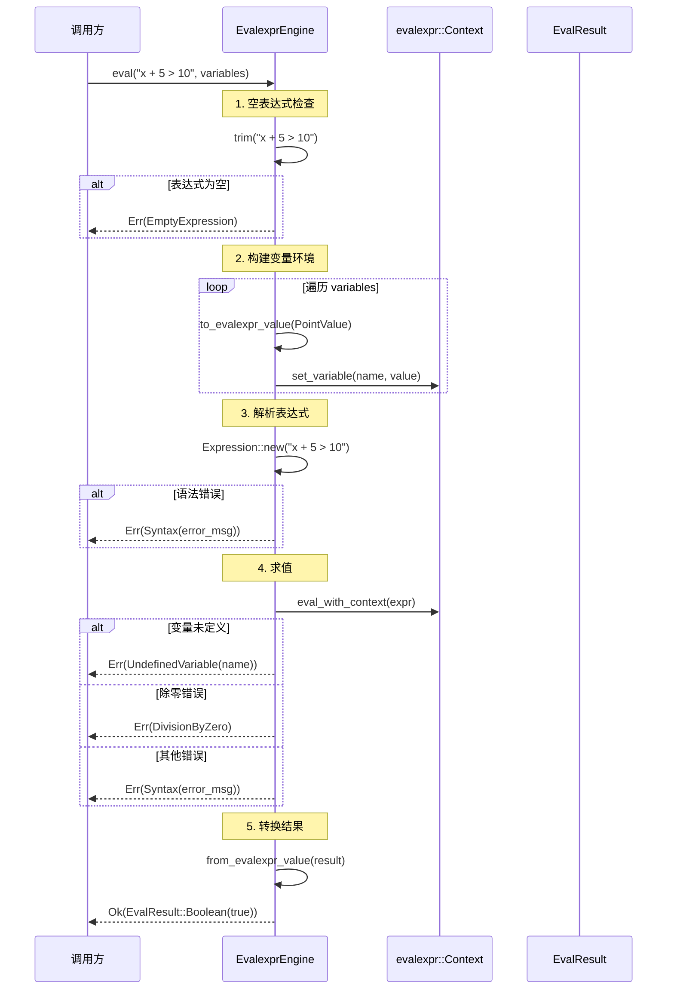
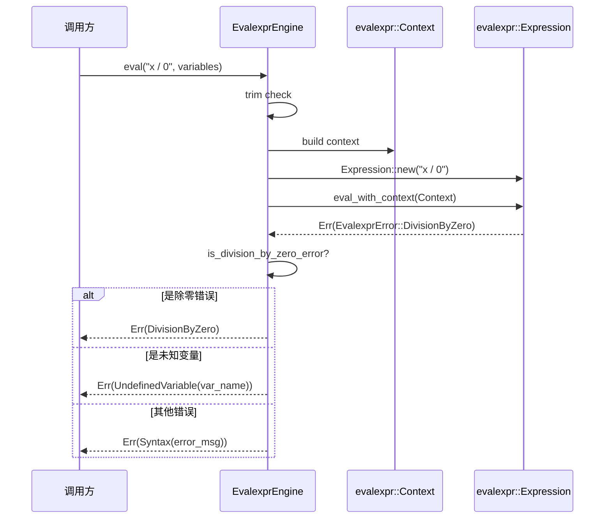

# S2-010 详细设计文档：表达式引擎基础

**Task ID**: S2-010
**Task Name**: 表达式引擎基础
**Design Version**: 1.0
**Date**: 2026-04-02
**Author**: sw-tom
**Status**: 已修复（根据 sw-jerry 审查反馈修订）
**Revision Note**: 
- v1.1: 修复审查反馈问题：命名修正、目录说明、测试代码Bug、依赖说明

---

## 修订历史

| 版本 | 日期 | 作者 | 修订说明 |
|------|------|------|----------|
| 1.1 | 2026-04-02 | sw-tom | 修复审查反馈：命名修正、目录说明、测试Bug、依赖说明 |
| 1.0 | 2026-04-02 | sw-tom | 初始版本 |

---

## 1. 架构概述

### 1.1 模块定位

表达式引擎（Expression Engine）是 Kayak 试验控制系统的基础组件，负责对表达式进行求值。表达式用于试验过程中的条件判断、阈值比较等场景，是 S2-009 基础环节执行引擎的扩展能力。

表达式引擎位于环节执行引擎（S2-009）和试验控制服务（S2-011）之间：

```
┌─────────────────────────────────────────────────┐
│            ExperimentControlService (S2-011)       │
│         (试验生命周期控制: start/stop/pause)       │
├─────────────────────────────────────────────────┤
│            ExpressionEngine (S2-010)             │
│      (表达式求值: 条件判断、阈值比较、变量运算)    │
├─────────────────────────────────────────────────┤
│            StepEngine (S2-009)                    │
│      (环节解析 → 线性执行 → 日志记录)             │
├──────────────────────┬──────────────────────────┤
│   ExecutionContext   │   DeviceManager          │
│   (变量存储)          │   (设备管理)              │
└──────────────────────┴──────────────────────────┘
```

### 1.2 设计原则

1. **不可变求值**: 表达式求值过程不修改原始变量上下文
2. **类型安全**: 严格类型转换规则，避免隐式类型转换带来的 bugs
3. **失败透明**: 所有错误明确分类，便于调用方诊断问题
4. **可测试性**: 纯函数设计，无副作用，便于单元测试

### 1.3 与现有模块的依赖关系

| 依赖模块 | 依赖方式 | 用途 |
|----------|----------|------|
| `drivers::core::PointValue` | 类型依赖 | 表达式变量的数据类型 |
| `engine::types::ExecutionContext` | 数据源 | 读取 variables HashMap 获取变量值 |
| `evalexpr` crate | 表达式解析 | 底层表达式解析和求值 |

### 1.4 evalexpr crate 选择理由

| 方案 | 优点 | 缺点 |
|------|------|------|
| `evalexpr` | 功能完整，支持算术/比较/逻辑运算，社区活跃 | 需处理与 PointValue 的类型映射 |
| 自研实现 | 完全可控 | 开发和测试工作量大 |
| 其他库 (meval, rscraper) | 轻量 | 功能有限或不维护 |

**决策**: 使用 `evalexpr` crate (版本 10.x)，原因：
1. 功能完整，覆盖 Release 0 需求
2. 支持自定义变量绑定，易于集成 PointValue
3. 活跃维护，社区支持好
4. 支持运算符优先级和括号

---

## 2. 接口定义

### 2.1 EvalResult — 表达式求值结果

```rust
/// 表达式求值结果
///
/// 表达式求值可能返回数值结果、布尔结果或错误。
/// 注意：字符串结果在 Release 0 中仅用于字符串相等比较，
/// 不支持字符串连接等复杂操作。
#[derive(Debug, Clone, PartialEq)]
pub enum EvalResult {
    /// 数值结果
    Number(f64),
    /// 布尔结果
    Boolean(bool),
    /// 字符串结果（Release 0 仅用于比较）
    String(String),
}
```

**设计说明**:
- 使用 `PartialEq` 支持测试断言
- `Clone` 支持结果复制
- 区分 `Number` 和 `String` 便于类型检查

### 2.2 ExpressionError — 表达式错误类型

```rust
/// 表达式求值错误
///
/// 所有表达式相关的错误都通过此枚举表示。
#[derive(Debug, Clone, PartialEq)]
pub enum ExpressionError {
    /// 语法错误：表达式格式不正确
    Syntax(String),
    /// 变量未定义：引用的变量在上下文中不存在
    UndefinedVariable(String),
    /// 类型不匹配：操作数类型不支持该运算
    TypeMismatch {
        /// 期望的类型描述
        expected: String,
        /// 实际得到的类型描述
        got: String,
        /// 额外的上下文信息（可选）
        context: Option<String>,
    },
    /// 除零错误
    DivisionByZero,
    /// 空表达式
    EmptyExpression,
    /// 不支持的运算符
    UnsupportedOperator(String),
    /// 内部错误
    Internal(String),
}

impl std::fmt::Display for ExpressionError {
    fn fmt(&self, f: &mut std::fmt::Formatter<'_>) -> std::fmt::Result {
        match self {
            ExpressionError::Syntax(msg) => write!(f, "Syntax error: {}", msg),
            ExpressionError::UndefinedVariable(name) => {
                write!(f, "Undefined variable: '{}'", name)
            }
            ExpressionError::TypeMismatch { expected, got, context } => {
                if let Some(ctx) = context {
                    write!(f, "Type mismatch: expected {}, got {} ({})", expected, got, ctx)
                } else {
                    write!(f, "Type mismatch: expected {}, got {}", expected, got)
                }
            }
            ExpressionError::DivisionByZero => write!(f, "Division by zero"),
            ExpressionError::EmptyExpression => write!(f, "Empty expression"),
            ExpressionError::UnsupportedOperator(op) => {
                write!(f, "Unsupported operator: {}", op)
            }
            ExpressionError::Internal(msg) => write!(f, "Internal error: {}", msg),
        }
    }
}

impl std::error::Error for ExpressionError {}
```

**设计说明**:
- 所有变体包含有意义的上下文信息
- `Display` trait 实现便于日志输出
- `PartialEq` 支持测试断言

### 2.3 ExpressionEngine trait — 表达式引擎接口

```rust
/// 表达式引擎 trait
///
/// 定义表达式求值的基本接口。
/// 实现者负责将表达式字符串解析并求值，
/// 使用提供的变量上下文中的值。
///
/// # 类型约束
/// - `Self: Send + Sync`: 表达式引擎可在多线程间共享
pub trait ExpressionEngine: Send + Sync {
    /// 求值表达式
    ///
    /// # Arguments
    /// * `expression` - 表达式字符串，如 `"x + 5"` 或 `"temperature > 100"`
    /// * `context` - 变量上下文，变量名到 PointValue 的映射
    ///
    /// # Returns
    /// * `Ok(EvalResult)` - 求值成功
    /// * `Err(ExpressionError)` - 求值失败
    ///
    /// # Example
    /// ```ignore
    /// let engine = EvalexprEngine::new();
    /// let context = HashMap::from([
    ///     ("x".to_string(), PointValue::Integer(10)),
    ///     ("y".to_string(), PointValue::Number(3.14)),
    /// ]);
    /// let result = engine.eval("x * 2 + y", &context)?;
    /// assert_eq!(result, EvalResult::Number(23.14));
    /// ```
    fn eval(
        &self,
        expression: &str,
        context: &HashMap<String, PointValue>,
    ) -> Result<EvalResult, ExpressionError>;
}
```

**设计说明**:
- `Send + Sync` 约束确保线程安全
- 接受 `&HashMap<String, PointValue>` 与 `ExecutionContext.variables` 兼容
- 纯函数接口，无副作用

### 2.4 EvalexprEngine — evalexpr 实现

```rust
/// 基于 evalexpr crate 的表达式引擎实现
///
/// 使用 evalexpr 进行表达式解析和求值，
/// 通过自定义函数和变量映射集成 PointValue 类型。
pub struct EvalexprEngine {
    /// 内部配置（可选）
    config: EngineConfig,
}

/// 引擎配置
#[derive(Debug, Clone)]
pub struct EngineConfig {
    /// 是否启用严格模式（禁止隐式类型转换）
    strict_mode: bool,
    /// 浮点比较的 epsilon 值
    float_epsilon: f64,
}

impl Default for EngineConfig {
    fn default() -> Self {
        Self {
            strict_mode: true,
            float_epsilon: 1e-10,
        }
    }
}

impl EvalexprEngine {
    /// 创建新的表达式引擎实例
    pub fn new() -> Self {
        Self {
            config: EngineConfig::default(),
        }
    }

    /// 创建带有自定义配置的表达式引擎
    pub fn with_config(config: EngineConfig) -> Self {
        Self { config }
    }

    /// 将 PointValue 转换为 evalexpr 的 TupleIndexableValue
    ///
    /// 这是类型映射的核心方法。
    /// - Number(f64) → f64
    /// - Integer(i64) → f64 (提升为浮点数)
    /// - Boolean(bool) → bool
    /// - String(String) → String
    fn to_evalexpr_value(pv: &PointValue) -> evalexpr::Value {
        match pv {
            PointValue::Number(n) => evalexpr::Value::Float(*n),
            PointValue::Integer(n) => evalexpr::Value::Float(*n as f64),
            PointValue::Boolean(b) => evalexpr::Value::Boolean(*b),
            PointValue::String(s) => evalexpr::Value::String(s.clone()),
        }
    }

    /// 从 evalexpr 的 Value 转换回 EvalResult
    ///
    /// 注意：此方法处理 evalexpr 内部表示到我们的结果类型的映射
    fn from_evalexpr_value(val: evalexpr::Value) -> Result<EvalResult, ExpressionError> {
        match val {
            evalexpr::Value::Float(n) => Ok(EvalResult::Number(n)),
            evalexpr::Value::Boolean(b) => Ok(EvalResult::Boolean(b)),
            evalexpr::Value::String(s) => Ok(EvalResult::String(s)),
            evalexpr::Value::Tuple(_) => Err(ExpressionError::Internal(
                "Tuple value not expected in expression result".to_string(),
            )),
            evalexpr::Value::Empty => Err(ExpressionError::Internal(
                "Empty value not expected in expression result".to_string(),
            )),
        }
    }

    /// 检查是否是 evalexpr 的除零错误
    fn is_division_by_zero_error(err: &str) -> bool {
        err.contains("division") && err.contains("zero")
    }
}
```

---

## 3. 类型转换策略

### 3.1 转换规则表

| 源类型 | 目标类型 | 规则 | 示例 | 结果 |
|--------|----------|------|------|------|
| Integer | Number | 始终提升 | `Integer(42)` 在算术运算中 | `Number(42.0)` |
| Boolean | Number | 允许（IEEE 754 语义） | `true + 1` | `Number(2.0)` |
| Number | Boolean | **禁止**（需显式比较） | `!5.0` | `TypeError` |
| Integer/Number | Boolean | 需比较 | `x > 0` 或 `x == 0` | `Boolean` |

### 3.2 规则设计理由

1. **Integer → Number 始终提升**: 简化实现，统一使用 f64 进行算术运算。`PointValue::Integer` 仅用于存储，表达式求值时统一转换为 f64。

2. **Boolean → Number 允许**: 符合 IEEE 754 传统，C/Go/JavaScript 等语言均支持。`true → 1.0`，`false → 0.0`。`PointValue::Boolean` 具有 `to_f64()` 方法，返回 `1.0` 或 `0.0`。

3. **Number → Boolean 禁止**: 理由如下：
   - 语义模糊：`!5.0` 是 "5.0 是 false 吗？" 还是 "5.0 是 truthy 吗？"
   - 需要显式比较：`x > 0` 比 `!x` 更清晰
   - 避免隐式类型转换带来的 bugs

### 3.3 evalexpr 类型映射实现

```rust
impl ExpressionEngine for EvalexprEngine {
    fn eval(
        &self,
        expression: &str,
        context: &HashMap<String, PointValue>,
    ) -> Result<EvalResult, ExpressionError> {
        // 1. 空表达式检查
        let trimmed = expression.trim();
        if trimmed.is_empty() {
            return Err(ExpressionError::EmptyExpression);
        }

        // 2. 构建变量环境
        // evalexpr 使用 HashMap<String, Value> 作为变量环境
        let mut variables = evalexpr::Context::new();

        for (name, value) in context.iter() {
            let eval_value = Self::to_evalexpr_value(value);
            variables.set_variable(name.clone(), eval_value)
                .map_err(|e| ExpressionError::Internal(format!(
                    "Failed to set variable '{}': {}", name, e
                )))?;
        }

        // 3. 求值表达式
        let expr = evalexpr::Expression::new(trimmed)
            .map_err(|e| ExpressionError::Syntax(e.to_string()))?;

        let result = expr.eval_with_context(&variables)
            .map_err(|e| {
                let err_str = e.to_string();
                // 检测除零错误
                if Self::is_division_by_zero_error(&err_str) {
                    ExpressionError::DivisionByZero
                } else if err_str.contains("Unknown identifier") {
                    // 提取变量名
                    let var_name = err_str
                        .split("Unknown identifier '")
                        .nth(1)
                        .and_then(|s| s.split('\'').next())
                        .unwrap_or("unknown");
                    ExpressionError::UndefinedVariable(var_name.to_string())
                } else {
                    ExpressionError::Syntax(err_str)
                }
            })?;

        // 4. 转换结果
        Self::from_evalexpr_value(result)
    }
}
```

---

## 4. 支持的运算符

### 4.1 运算符列表

| 类别 | 运算符 | 说明 | 示例 | evalexpr 支持 |
|------|--------|------|------|---------------|
| 算术 | `+` | 加法 | `2 + 3` | ✅ |
| 算术 | `-` | 减法 | `10 - 4` | ✅ |
| 算术 | `*` | 乘法 | `3 * 5` | ✅ |
| 算术 | `/` | 除法 | `10 / 2` | ✅ |
| 算术 | `%` | 取模 | `10 % 3` | ✅ |
| 比较 | `>` | 大于 | `x > 10` | ✅ |
| 比较 | `<` | 小于 | `x < 10` | ✅ |
| 比较 | `>=` | 大于等于 | `x >= 10` | ✅ |
| 比较 | `<=` | 小于等于 | `x <= 10` | ✅ |
| 比较 | `==` | 等于 | `x == 10` | ✅ |
| 比较 | `!=` | 不等于 | `x != 10` | ✅ |
| 逻辑 | `&&` | 逻辑与 | `a > 0 && b < 100` | ✅ |
| 逻辑 | `\|\|` | 逻辑或 | `a > 0 \|\| b < 100` | ✅ |
| 逻辑 | `!` | 逻辑非 | `!is_error` | ✅ |
| 分组 | `()` | 括号分组 | `(2 + 3) * 4` | ✅ |

### 4.2 运算符优先级

evalexpr 使用标准运算符优先级：

| 优先级 | 运算符 |
|--------|--------|
| 最高 | `!` (逻辑非) |
| 高 | `*`, `/`, `%` |
| 中 | `+`, `-` |
| 低 | `>`, `<`, `>=`, `<=` |
| 低 | `==`, `!=` |
| 中低 | `&&` |
| 最低 | `\|\|` |

**示例**:
- `2 + 3 * 4` = 14（先乘后加）
- `true || false && false` = true（先与后或）
- `!(1 > 2)` = true

### 4.3 浮点溢出与特殊值

遵循 IEEE 754 标准：

| 操作 | 结果 |
|------|------|
| `1e308 * 10` | `Infinity` |
| `1.0 / 0.0` | `Infinity` |
| `0.0 / 0.0` | `NaN` |
| `NaN + 5.0` | `NaN`（传播） |

---

## 5. 模块结构

### 5.1 文件布局

**注意**：当前 `arch.md` 中尚未包含 `engine/` 目录结构。实现时需更新 `arch.md` 添加 `engine/` 目录。

```
kayak-backend/src/
├── engine/
│   ├── expression/                  # 新增：表达式引擎子模块
│   │   ├── mod.rs                  # 模块入口，公开导出
│   │   ├── engine.rs               # ExpressionEngine trait + EvalexprEngine
│   │   ├── result.rs               # EvalResult, ExpressionError 定义
│   │   └── tests/
│   │       ├── mod.rs
│   │       ├── arithmetic_tests.rs # 算术运算测试
│   │       ├── comparison_tests.rs # 比较运算测试
│   │       ├── logical_tests.rs    # 逻辑运算测试
│   │       ├── variable_tests.rs   # 变量替换测试
│   │       └── type_tests.rs       # 类型转换测试
│   └── ...                        # S2-009 已有的 engine 模块内容
```

### 5.2 mod.rs 导出

```rust
//! 表达式引擎模块
//!
//! 提供表达式求值能力，支持算术、比较、逻辑运算和变量引用。

mod engine;
mod result;

// 公开导出
pub use engine::{EvalexprEngine, ExpressionEngine};
pub use result::{EvalResult, ExpressionError};
```

### 5.3 Cargo.toml 依赖

**新增依赖** - 以下内容需添加到 `kayak-backend/Cargo.toml` 的 `[dependencies]` 部分：

```toml
[dependencies]
# Expression evaluation
evalexpr = "10"
```

---

## 6. 错误处理策略

### 6.1 错误分类

| 错误类型 | 触发场景 | 返回内容 |
|----------|----------|----------|
| `Syntax` | 表达式格式错误 | 解析器错误信息 |
| `UndefinedVariable` | 变量未定义 | 变量名 |
| `TypeMismatch` | 类型不支持操作 | 期望类型、实际类型 |
| `DivisionByZero` | 除零 | 无额外信息 |
| `EmptyExpression` | 空字符串 | 无额外信息 |
| `UnsupportedOperator` | 不支持的运算符 | 运算符 |
| `Internal` | 内部错误 | 错误描述 |

### 6.2 evalexpr 错误映射

```rust
fn map_evalexpr_error(err: evalexpr::EvalexprError) -> ExpressionError {
    match err {
        evalexpr::EvalexprError::EmptyExpression => ExpressionError::EmptyExpression,
        evalexpr::EvalexprError::NumberParseError(s) => {
            ExpressionError::Syntax(format!("Invalid number: {}", s))
        }
        evalexpr::EvalexprError::NoOperator(_, _) => {
            ExpressionError::Syntax("Missing operator".to_string())
        }
        evalexpr::EvalexprError::NoValue(s) => {
            ExpressionError::Syntax(format!("Missing value: {}", s))
        }
        evalexpr::EvalexprError::UnknownIdentifier(id) => {
            ExpressionError::UndefinedVariable(id)
        }
        evalexpr::EvalexprError::UnaryOperatorMismatch { .. } => {
            ExpressionError::TypeMismatch {
                expected: "Number or Boolean".to_string(),
                got: "String".to_string(),
                context: None,
            }
        }
        evalexpr::EvalexprError::BinaryOperatorMismatch { .. } => {
            ExpressionError::TypeMismatch {
                expected: "matching types".to_string(),
                got: "mismatched types".to_string(),
                context: None,
            }
        }
        evalexpr::EvalexprError::DivisionByZero => ExpressionError::DivisionByZero,
        _ => ExpressionError::Internal(err.to_string()),
    }
}
```

---

## 7. 与 ExecutionContext 的集成

### 7.1 变量来源

表达式引擎从 ExecutionContext.variables 获取变量值：

```rust
// 示例：从 ExecutionContext 提取变量用于表达式求值
let context = ExecutionContext::new();
context.set_variable("temperature".to_string(), PointValue::Number(85.5));
context.set_variable("threshold".to_string(), PointValue::Number(100.0));

let engine = EvalexprEngine::new();
let result = engine.eval(
    "temperature > threshold",
    &context.variables,  // 直接传入 HashMap
)?;
```

### 7.2 S2-009 环节扩展点

未来可通过扩展 StepDefinition 支持条件环节：

```rust
// 未来版本（不在 Release 0 范围内）
#[derive(Debug, Clone, Serialize, Deserialize)]
#[serde(tag = "type", rename_all = "UPPERCASE")]
pub enum StepDefinition {
    // ... 现有变体 ...
    
    /// 条件环节：根据表达式结果决定是否执行
    Conditional {
        id: String,
        name: String,
        /// 条件表达式
        condition: String,
        /// 条件为真时执行的环节
        then_steps: Vec<StepDefinition>,
        /// 条件为假时执行的环节（可选）
        else_steps: Option<Vec<StepDefinition>>,
    },
}
```

---

## 8. 单元测试设计

### 8.1 测试覆盖目标

| 测试类别 | 覆盖用例 |
|----------|----------|
| 算术运算 | TC-S2-010-001 ~ TC-S2-010-016 |
| 比较运算 | TC-S2-010-017 ~ TC-S2-010-023 |
| 逻辑运算 | TC-S2-010-024 ~ TC-S2-010-031 |
| 变量替换 | TC-S2-010-032 ~ TC-S2-010-043 |
| 类型转换 | TC-S2-010-044 ~ TC-S2-010-053 |
| 错误处理 | TC-S2-010-054 ~ TC-S2-010-062 |
| 浮点特殊值 | TC-S2-010-063 ~ TC-S2-010-067 |

### 8.2 测试辅助函数

```rust
#[cfg(test)]
mod tests {
    use super::*;
    use std::collections::HashMap;

    /// 创建带变量的上下文
    fn ctx(vars: &[(&str, PointValue)]) -> HashMap<String, PointValue> {
        vars.iter()
            .map(|(k, v)| (k.to_string(), v.clone()))
            .collect()
    }

    /// 辅助函数：求值并断言结果
    fn assert_eval(expr: &str, context: &HashMap<String, PointValue>, expected: EvalResult) {
        let engine = EvalexprEngine::new();
        let result = engine.eval(expr, context).unwrap();
        assert_eq!(result, expected, "Expression: {}", expr);
    }

    /// 辅助函数：求值并断言错误类型
    fn assert_eval_error(expr: &str, context: &HashMap<String, PointValue>, expected_error: ExpressionError) {
        let engine = EvalexprEngine::new();
        let result = engine.eval(expr, context);
        assert!(result.is_err(), "Expected error for expression: {}", expr);
        assert_eq!(result.unwrap_err(), expected_error);
    }

    // ==================== 算术运算测试 ====================
    
    #[test]
    fn test_basic_addition() {
        assert_eval("2 + 3", &ctx(&[]), EvalResult::Number(5.0));
    }

    #[test]
    fn test_basic_subtraction() {
        assert_eval("10 - 4", &ctx(&[]), EvalResult::Number(6.0));
    }

    #[test]
    fn test_basic_multiplication() {
        assert_eval("3 * 5", &ctx(&[]), EvalResult::Number(15.0));
    }

    #[test]
    fn test_basic_division() {
        assert_eval("10 / 2", &ctx(&[]), EvalResult::Number(5.0));
    }

    #[test]
    fn test_modulo() {
        assert_eval("10 % 3", &ctx(&[]), EvalResult::Number(1.0));
    }

    #[test]
    fn test_division_by_zero() {
        assert_eval_error("10 / 0", &ctx(&[]), ExpressionError::DivisionByZero);
    }

    #[test]
    fn test_operator_precedence() {
        // 乘法优先于加法
        assert_eval("2 + 3 * 4", &ctx(&[]), EvalResult::Number(14.0));
        // 括号改变优先级
        assert_eval("(2 + 3) * 4", &ctx(&[]), EvalResult::Number(20.0));
    }

    // ==================== 变量替换测试 ====================
    
    #[test]
    fn test_simple_variable() {
        let context = ctx(&[("x", PointValue::Integer(42))]);
        assert_eval("x", &context, EvalResult::Number(42.0));
    }

    #[test]
    fn test_variable_arithmetic() {
        let context = ctx(&[
            ("a", PointValue::Integer(10)),
            ("b", PointValue::Integer(20)),
        ]);
        assert_eval("a + b", &context, EvalResult::Number(30.0));
    }

    #[test]
    fn test_undefined_variable() {
        let engine = EvalexprEngine::new();
        let result = engine.eval("undefined_var + 1", &ctx(&[]));
        assert!(result.is_err());
        assert_eq!(
            result.unwrap_err(),
            ExpressionError::UndefinedVariable("undefined_var".to_string())
        );
    }

    // ==================== 类型转换测试 ====================
    
    #[test]
    fn test_integer_to_number() {
        let context = ctx(&[("x", PointValue::Integer(3))]);
        assert_eval("x + 2.5", &context, EvalResult::Number(5.5));
    }

    #[test]
    fn test_boolean_to_number() {
        let context = ctx(&[("flag", PointValue::Boolean(true))]);
        assert_eval("flag + 1", &context, EvalResult::Number(2.0));
    }

    #[test]
    fn test_number_to_boolean_requires_comparison() {
        // Number 不能直接用于逻辑非
        let context = ctx(&[("x", PointValue::Number(5.0))]);
        let result = EvalexprEngine::new().eval("!x", &context);
        assert!(result.is_err());
    }

    // ==================== 比较运算测试 ====================
    
    #[test]
    fn test_comparison() {
        assert_eval("10 > 5", &ctx(&[]), EvalResult::Boolean(true));
        assert_eval("5 > 10", &ctx(&[]), EvalResult::Boolean(false));
    }

    // ==================== 逻辑运算测试 ====================
    
    #[test]
    fn test_logical_and() {
        assert_eval("true && true", &ctx(&[]), EvalResult::Boolean(true));
        assert_eval("true && false", &ctx(&[]), EvalResult::Boolean(false));
    }

    #[test]
    fn test_logical_or() {
        assert_eval("false || false", &ctx(&[]), EvalResult::Boolean(false));
        assert_eval("false || true", &ctx(&[]), EvalResult::Boolean(true));
    }

    #[test]
    fn test_logical_not() {
        assert_eval("!true", &ctx(&[]), EvalResult::Boolean(false));
        assert_eval("!false", &ctx(&[]), EvalResult::Boolean(true));
    }

    // ==================== 浮点特殊值测试 ====================
    
    #[test]
    fn test_overflow() {
        let result = engine.eval("1e308 * 10", &ctx(&[])).unwrap();
        assert_eq!(result, EvalResult::Number(f64::INFINITY));
    }

    #[test]
    fn test_nan() {
        let result = engine.eval("0.0 / 0.0", &ctx(&[])).unwrap();
        assert!(matches!(result, EvalResult::Number(n) if n.is_nan()));
    }
}
```

---

## 9. UML 图

### 9.1 类图

```mermaid
classDiagram
    class EvalResult {
        <<enum>>
        Number(f64)
        Boolean(bool)
        String(String)
    }

    class ExpressionError {
        <<enum>>
        Syntax(String)
        UndefinedVariable(String)
        TypeMismatch{expected, got, context}
        DivisionByZero
        EmptyExpression
        UnsupportedOperator(String)
        Internal(String)
    }

    class ExpressionEngine {
        <<trait>>
        +eval(expression, context)~ Result~EvalResult, ExpressionError~
    }

    class EvalexprEngine {
        -config: EngineConfig
        +new()~ Self
        +with_config(config)~ Self
        +eval(expression, context)~ Result~EvalResult, ExpressionError~
        -to_evalexpr_value(pv)~ evalexpr::Value
        -from_evalexpr_value(val)~ Result~EvalResult, ExpressionError~
        -is_division_by_zero_error(err)~ bool
    }

    class EngineConfig {
        -strict_mode: bool
        -float_epsilon: f64
    }

    class PointValue {
        <<enum>>
        Number(f64)
        Integer(i64)
        Boolean(bool)
        String(String)
    }

    class ExecutionContext {
        +variables: HashMap~String, PointValue~
        +new()~ Self
        +get_variable(name)~ Option~&PointValue~
        +set_variable(name, value)
    }

    %% Relationships
    ExpressionEngine <|.. EvalexprEngine : implements
    EvalexprEngine --> EngineConfig : has
    EvalexprEngine --> EvalResult : returns
    EvalexprEngine --> ExpressionError : returns
    EvalexprEngine --> PointValue : converts
    EvalexprEngine --> evalexpr::Value : uses internally
    ExecutionContext --> PointValue : stores
    evalexpr::Value --> PointValue : converted from
```

### 9.2 序列图：表达式求值流程



### 9.3 序列图：错误处理流程



---

## 10. 验收标准映射

| 验收标准 | 实现方式 | 测试用例 |
|----------|----------|----------|
| 1. 支持算术运算表达式 | `EvalexprEngine` + `evalexpr` | TC-001~016, TC-030, TC-032~033, TC-036, TC-038~039, TC-044, TC-046, TC-052~053, TC-067, TC-076 |
| 2. 支持条件表达式 | 比较运算符 + 逻辑运算符 | TC-017~031, TC-035~036, TC-042~043, TC-047~048 |
| 3. 变量替换正确执行 | `to_evalexpr_value` 类型映射 | TC-032~043, TC-044~053, TC-058, TC-070~075 |

---

## 11. 风险与缓解

| 风险 | 影响 | 缓解措施 |
|------|------|----------|
| evalexpr 库行为不符合预期 | 中 | 编写详尽的单元测试，覆盖所有运算符和边界情况 |
| 类型转换规则复杂 | 中 | 明确文档化转换规则，测试用例覆盖所有规则 |
| 浮点精度问题 | 低 | 使用 epsilon 比较进行测试验证 |
| 错误信息不够友好 | 低 | 封装 evalexpr 错误，提供更明确的错误信息 |

---

## 12. 后续扩展点

### 12.1 Release 1 可能的扩展

1. **数学函数支持**: 如 `sin()`, `cos()`, `sqrt()` 等
2. **字符串操作**: 字符串连接、子串提取等
3. **条件环节**: 根据表达式结果选择执行分支
4. **表达式缓存**: 重复求值相同表达式时缓存结果
5. **性能优化**: 预编译表达式 AST，避免重复解析

### 12.2 预留接口

```rust
/// 表达式预编译器（未来扩展）
pub trait ExpressionPrecompiler {
    /// 预编译表达式
    fn compile(&self, expression: &str) -> Result<CompiledExpression, ExpressionError>;
}

/// 编译后的表达式（未来扩展）
pub struct CompiledExpression {
    // 内部表示
}

impl CompiledExpression {
    /// 使用预编译的表达式求值（未来扩展）
    pub fn eval(&self, context: &HashMap<String, PointValue>) -> Result<EvalResult, ExpressionError>;
}
```

---

**文档结束**
