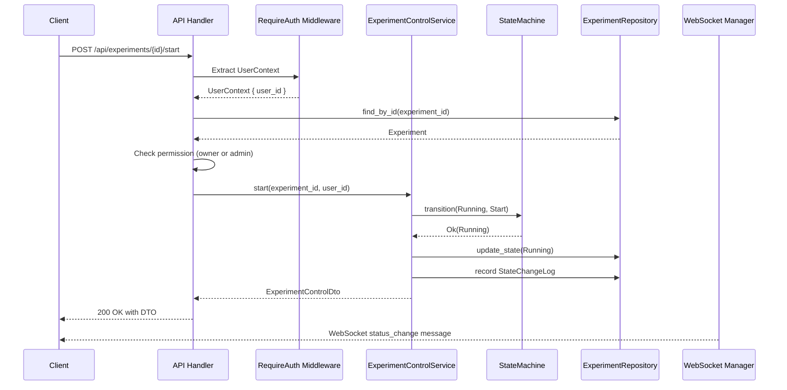

# S2-011: 试验控制 API 设计文档

## 1. 概述

### 1.1 任务目标

实现试验（Experiment）的 REST 控制接口，提供 Load、Start、Pause、Resume、Stop、GetStatus 六个核心操作，同时支持 WebSocket 实时状态推送和权限验证。

### 1.2 技术栈

- **Web 框架**: Axum 0.7+
- **认证中间件**: RequireAuth (JWT)
- **状态机**: StateMachine (src/state_machine.rs)
- **执行引擎**: StepEngine (src/engine/step_engine.rs)
- **数据库**: SQLx (PostgreSQL)

### 1.3 试验状态机

```
          +---------+
          |  IDLE   |
          +----+----+
               | load
               v
          +---------+
    +---->| LOADED  |<----+
    |     +----+----+     |
    |          | start    |
    |          v          |
 pause      +---------+   |
+---------->| RUNNING |---+----> error
|           +----+----+   |
|                | pause  |
|                v        |
|           +---------+   |
+-----------| PAUSED  |---+
            +---------+
```

**状态转换规则**:
- `Idle → Load → Loaded`
- `Loaded → Start → Running`
- `Running → Pause → Paused`
- `Paused → Resume → Running`
- `Running/Paused → Stop → Loaded`
- `Running → Complete → Completed` (终态)
- `Running/Paused → Abort → Aborted` (终态)
- 任意非终态 → Reset → Idle

---

## 2. API 接口设计

### 2.1 REST 端点

| 方法 | 路径 | 描述 | 请求体 |
|------|------|------|--------|
| POST | `/api/v1/experiments/{id}/load` | 加载方法到试验 | `LoadRequest` |
| POST | `/api/v1/experiments/{id}/start` | 启动试验 | - |
| POST | `/api/v1/experiments/{id}/pause` | 暂停试验 | - |
| POST | `/api/v1/experiments/{id}/resume` | 恢复试验 | - |
| POST | `/api/v1/experiments/{id}/stop` | 停止试验 | - |
| GET | `/api/v1/experiments/{id}/status` | 获取试验状态 | - |

### 2.2 WebSocket 端点

| 路径 | 描述 |
|------|------|
| `WS /ws/experiments/{id}` | 订阅试验状态变更实时推送 |

---

## 3. 数据传输对象 (DTO)

### 3.1 请求 DTO

#### LoadRequest
```json
{
  "method_id": "uuid-string"
}
```

### 3.2 响应 DTO

#### ExperimentControlDto
```json
{
  "id": "uuid-string",
  "name": "试验名称",
  "status": "RUNNING",
  "method_id": "uuid-string | null",
  "description": "试验描述 | null",
  "started_at": "2024-01-01T00:00:00Z | null",
  "ended_at": "2024-01-01T00:00:00Z | null",
  "created_at": "2024-01-01T00:00:00Z",
  "updated_at": "2024-01-01T00:00:00Z"
}
```

#### ExperimentStatusDto
```json
{
  "id": "uuid-string",
  "name": "试验名称",
  "status": "RUNNING",
  "method_id": "uuid-string | null",
  "started_at": "2024-01-01T00:00:00Z | null",
  "ended_at": "2024-01-01T00:00:00Z | null",
  "updated_at": "2024-01-01T00:00:00Z"
}
```

#### StateChangeLogDto
```json
{
  "id": "uuid-string",
  "experiment_id": "uuid-string",
  "previous_state": "IDLE",
  "new_state": "LOADED",
  "operation": "load",
  "user_id": "uuid-string",
  "timestamp": "2024-01-01T00:00:00Z",
  "error_message": null
}
```

### 3.3 WebSocket 消息格式

#### 状态变更消息 (Server → Client)
```json
{
  "type": "status_change",
  "experiment_id": "uuid-string",
  "old_status": "RUNNING",
  "new_status": "PAUSED",
  "operation": "pause",
  "user_id": "uuid-string",
  "timestamp": "2024-01-01T00:00:00Z"
}
```

#### 错误消息 (Server → Client)
```json
{
  "type": "error",
  "experiment_id": "uuid-string",
  "error": "Invalid transition: cannot perform Pause from Idle",
  "code": 400
}
```

---

## 4. 权限设计

### 4.1 权限规则

| 操作 | 所有者 (owner) | 管理员 (admin) | 其他用户 |
|------|--------------|---------------|---------|
| Load | ✓ | ✓ | ✗ |
| Start | ✓ | ✓ | ✗ |
| Pause | ✓ | ✓ | ✗ |
| Resume | ✓ | ✓ | ✗ |
| Stop | ✓ | ✓ | ✗ |
| GetStatus | ✓ | ✓ | ✗ |

**说明**: 只有试验的所有者或管理员可以执行控制操作。

### 4.2 权限检查流程

1. 从 `RequireAuth` 中间件提取 `UserContext` (包含 `user_id`)
2. 根据试验 ID 查询试验实体，获取 `user_id`
3. 查询当前用户角色（需要用户服务支持）
4. 如果 `user_id` 匹配或用户角色为 `admin`，允许操作
5. 否则返回 `403 Forbidden`

### 4.3 权限错误响应

```json
{
  "code": 403,
  "message": "Forbidden: Only owner or admin can perform this operation",
  "timestamp": "2024-01-01T00:00:00Z"
}
```

---

## 5. 与 StateMachine 和 StepEngine 的集成

### 5.1 StateMachine 集成

`ExperimentControlService` 使用 `StateMachine` 进行状态转换验证：

```rust
// 状态转换验证示例
let new_status = StateMachine::transition(exp.status, StateMachineOperation::Start)?;
```

**错误处理**:
- `StateMachineError::InvalidTransition` → `400 Bad Request`
- `StateMachineError::OperationNotAllowed` → `400 Bad Request`

### 5.2 StepEngine 集成

StepEngine 用于执行试验过程定义：

```
Load 操作:
  1. 验证方法存在
  2. 验证 Idle → Loaded 转换
  3. 更新试验 method_id
  4. 记录状态变更日志

Start 操作:
  1. 验证 Loaded/Paused → Running 转换
  2. 启动 StepEngine 执行过程
  3. 更新 started_at 时间戳
  4. 记录状态变更日志
  5. 通过 WebSocket 推送状态变更

Pause 操作:
  1. 验证 Running → Paused 转换
  2. 暂停 StepEngine 执行 (需要 StepEngine 支持)
  3. 记录状态变更日志
  4. 通过 WebSocket 推送状态变更

Resume 操作:
  1. 验证 Paused → Running 转换
  2. 恢复 StepEngine 执行
  3. 记录状态变更日志
  4. 通过 WebSocket 推送状态变更

Stop 操作:
  1. 验证 Running/Paused → Loaded 转换
  2. 停止 StepEngine 执行
  3. 记录状态变更日志
  4. 通过 WebSocket 推送状态变更
```

### 5.3 状态变更日志

所有状态变更都会记录到 `StateChangeLog` 表：

| 字段 | 类型 | 说明 |
|------|------|------|
| id | UUID | 日志 ID |
| experiment_id | UUID | 试验 ID |
| previous_state | ExperimentStatus | 之前状态 |
| new_state | ExperimentStatus | 新状态 |
| operation | String | 操作名称 |
| user_id | UUID | 执行操作的用户 |
| timestamp | DateTime | 操作时间 |
| error_message | String? | 错误信息（如有） |

---

## 6. WebSocket 设计

### 6.1 连接建立

```
Client → Server:
  GET /ws/experiments/{id}
  Header: Authorization: Bearer <jwt_token>

Server → Client:
  101 Switching Protocols (成功)
  或 401 Unauthorized (认证失败)
```

### 6.2 心跳机制

- 客户端每 30 秒发送 ping 消息
- 服务器回复 pong 消息
- 60 秒无心跳视为断开

### 6.3 消息订阅

客户端订阅后自动接收该试验的所有状态变更消息。

### 6.4 广播机制

当试验状态变更时，向所有订阅该试验的 WebSocket 连接推送消息。

---

## 7. 错误处理

### 7.1 错误类型映射

| 错误类型 | HTTP 状态码 | 错误消息 |
|---------|------------|---------|
| ExperimentControlError::NotFound | 404 | "试验不存在" |
| ExperimentControlError::MethodNotFound | 400 | "方法不存在" |
| ExperimentControlError::InvalidTransition | 400 | "无效的状态转换" |
| ExperimentControlError::OperationNotAllowed | 400 | "当前状态不允许此操作" |
| ExperimentControlError::ConcurrentConflict | 409 | "并发冲突，请重试" |
| 权限不足 | 403 | "只有所有者或管理员可以执行此操作" |

### 7.2 统一错误响应格式

```json
{
  "code": 400,
  "message": "Invalid transition: cannot perform Start from Idle",
  "details": null,
  "timestamp": "2024-01-01T00:00:00Z"
}
```

---

## 8. API 处理流程图



---

## 9. 目录结构

```
kayak-backend/src/
├── api/
│   ├── handlers/
│   │   └── experiment_control.rs    # 控制接口处理器
│   └── routes.rs                    # 路由注册
├── services/
│   └── experiment_control/
│       ├── mod.rs                   # 服务定义
│       ├── dto.rs                   # DTO 定义
│       └── error.rs                 # 错误类型
├── auth/
│   └── middleware/
│       └── require_auth.rs          # 认证中间件
├── state_machine.rs                 # 状态机
└── engine/
    └── step_engine.rs               # 步骤引擎

kayak-frontend/src/
├── services/
│   └── experimentApi.ts            # API 调用封装
├── hooks/
│   └── useExperimentStatus.ts       # WebSocket 订阅 Hook
└── components/
    └── ExperimentControl/           # 控制组件
```

---

## 10. 实现要点

### 10.1 事务处理

状态更新和日志记录应在同一事务中完成，确保数据一致性。

### 10.2 并发控制

使用乐观锁机制处理并发修改，通过 `updated_at` 字段检测冲突。

### 10.3 WebSocket 广播

使用 `Arc<RwLock<HashMap<Uuid, Vec<Sender>>>` 管理订阅者，当状态变更时广播到所有订阅者。

### 10.4 StepEngine 异步执行

Start 操作应启动异步任务执行试验，不阻塞 HTTP 响应。状态变更通过 WebSocket 实时推送。

---

## 11. 测试用例

### 11.1 单元测试

1. `StateMachine::transition` - 所有有效和无效转换
2. `ExperimentControlService` - 各操作的业务逻辑
3. 权限检查逻辑

### 11.2 集成测试

1. 完整的试验生命周期: Idle → Load → Start → Pause → Resume → Stop → Reset
2. WebSocket 连接和消息接收
3. 并发状态更新冲突处理

### 11.3 权限测试

1. 所有者可以执行所有操作
2. 管理员可以执行所有操作
3. 其他用户返回 403
