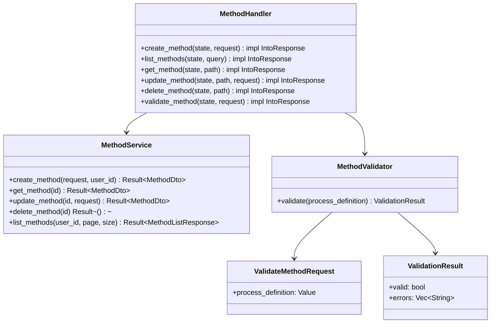
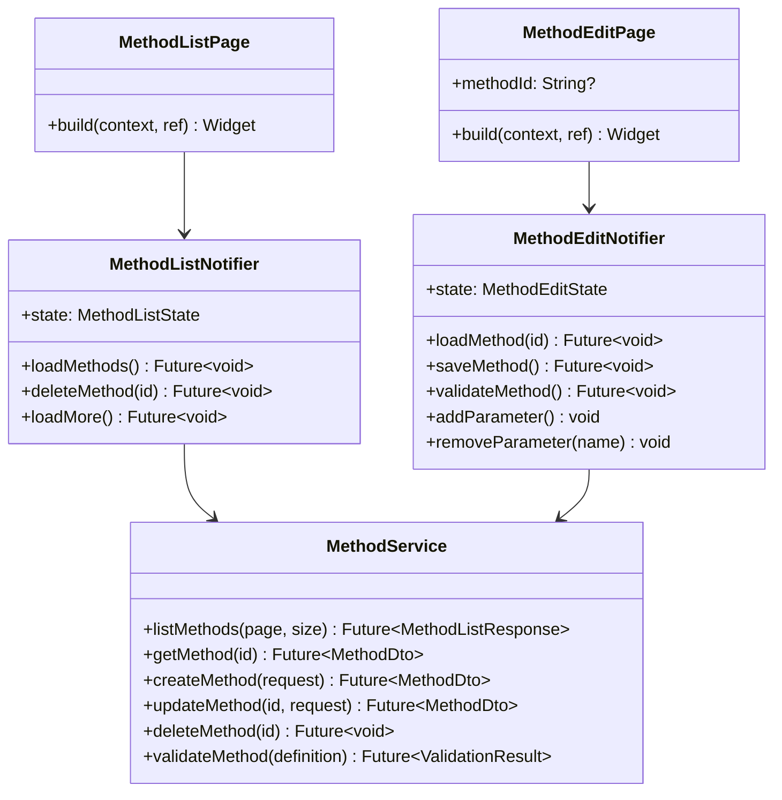

# S2-012: 试验方法管理页面 - 详细设计文档

## 1. 概述

### 1.1 任务目标
实现试验方法管理的前后端功能，包括：
- 后端：方法CRUD API + 方法验证API
- 前端：方法列表页面 + 方法编辑页面（JSON编辑器 + 参数表配置）

### 1.2 技术栈
- **后端**: Rust + Axum
- **前端**: Flutter + Riverpod
- **JSON编辑**: 原生TextField + JSON验证
- **状态管理**: Riverpod (AsyncNotifier)

---

## 2. 后端API接口设计

### 2.1 REST端点

| 方法 | 路径 | 描述 | 认证 |
|------|------|------|------|
| GET | `/api/v1/methods` | 获取方法列表 | JWT |
| POST | `/api/v1/methods` | 创建方法 | JWT |
| GET | `/api/v1/methods/{id}` | 获取方法详情 | JWT |
| PUT | `/api/v1/methods/{id}` | 更新方法 | JWT |
| DELETE | `/api/v1/methods/{id}` | 删除方法 | JWT |
| POST | `/api/v1/methods/validate` | 验证方法定义 | JWT |

### 2.2 请求/响应DTO

#### CreateMethodRequest
```json
{
  "name": "string (1-255)",
  "description": "string | null",
  "process_definition": {"nodes": [...]},
  "parameter_schema": {"param_name": {"type": "...", "default": "..."}}
}
```

#### UpdateMethodRequest
```json
{
  "name": "string | null",
  "description": "string | null",
  "process_definition": "object | null",
  "parameter_schema": "object | null"
}
```

#### ValidateMethodRequest
```json
{
  "process_definition": {"nodes": [...]}
}
```

#### ValidateMethodResponse
```json
{
  "valid": true,
  "errors": []
}
```

### 2.3 验证规则

方法验证API检查：
1. 过程定义必须包含至少一个Start节点
2. 过程定义必须包含至少一个End节点
3. 所有节点类型必须是有效类型（Start, Read, Control, Delay, Decision, Branch, Wait, Record, Config, Subprocess, End）
4. 节点ID必须唯一

---

## 3. 前端UI设计

### 3.1 方法列表页面

```
┌─────────────────────────────────────────────────┐
│  ←  方法管理                        [+ 创建方法] │
├─────────────────────────────────────────────────┤
│                                                 │
│  ┌───────────────────────────────────────────┐  │
│  │ 📄 温度测试方法                            │  │
│  │ 测试温度变化过程                           │  │
│  │ 2024-03-15 10:30     [编辑] [删除]        │  │
│  └───────────────────────────────────────────┘  │
│                                                 │
│  ┌───────────────────────────────────────────┐  │
│  │ 📄 压力测试方法                            │  │
│  │ 压力循环测试                               │  │
│  │ 2024-03-14 14:20     [编辑] [删除]        │  │
│  └───────────────────────────────────────────┘  │
│                                                 │
│  ┌───────────────────────────────────────────┐  │
│  │ 📄 振动测试方法                            │  │
│  │ 频率扫描测试                               │  │
│  │ 2024-03-13 09:15     [编辑] [删除]        │  │
│  └───────────────────────────────────────────┘  │
│                                                 │
│                    [加载更多]                    │
└─────────────────────────────────────────────────┘
```

### 3.2 方法编辑页面

```
┌─────────────────────────────────────────────────┐
│  ←  新建方法                          [保存]    │
├─────────────────────────────────────────────────┤
│                                                 │
│  名称: [_____________________________]          │
│  描述: [_____________________________]          │
│                                                 │
│  ┌─ 过程定义 (JSON) ────────────────────────┐  │
│  │ {                                        │  │
│  │   "nodes": [                             │  │
│  │     {"id": "start", "type": "Start"},    │  │
│  │     {"id": "end", "type": "End"}         │  │
│  │   ]                                      │  │
│  │ }                                        │  │
│  └──────────────────────────────────────────┘  │
│                              [验证]            │
│                                                 │
│  ┌─ 参数表 ─────────────────────────────────┐  │
│  │ [+ 添加参数]                              │  │
│  │                                           │  │
│  │ ┌─────────────────────────────────────┐  │  │
│  │ │ temperature_setpoint          [删除]│  │  │
│  │ │ 类型: number  默认: 25.0  单位: °C │  │  │
│  │ └─────────────────────────────────────┘  │  │
│  └──────────────────────────────────────────┘  │
│                                                 │
└─────────────────────────────────────────────────┘
```

---

## 4. 类图

### 4.1 后端



### 4.2 前端



---

## 5. 前端状态模型

### 5.1 MethodListState
```dart
class MethodListState {
  final List<Method> methods;
  final bool isLoading;
  final bool isLoadingMore;
  final String? error;
  final int currentPage;
  final int totalItems;
  final bool hasMore;
}
```

### 5.2 MethodEditState
```dart
class MethodEditState {
  final String? id;
  final String name;
  final String? description;
  final String processDefinitionJson;
  final Map<String, ParameterConfig> parameters;
  final bool isSaving;
  final bool isValidating;
  final String? error;
  final ValidationResult? validationResult;
  final bool isDirty;
}
```

### 5.3 ParameterConfig
```dart
class ParameterConfig {
  final String name;
  final String type; // 'number', 'integer', 'string', 'boolean'
  final dynamic defaultValue;
  final String? unit;
  final String? description;
}
```

---

## 6. 实现计划

### 6.1 后端实现
1. 创建 `method.rs` handler文件
2. 实现CRUD handler函数
3. 实现 `validate_method` handler
4. 创建 `MethodValidator` 服务
5. 在 `routes.rs` 注册路由
6. 添加JWT认证中间件

### 6.2 前端实现
1. 创建 `Method` 模型类
2. 创建 `MethodService` API服务
3. 创建 `MethodListNotifier` 和 `MethodEditNotifier`
4. 实现 `MethodListPage` 完整功能
5. 实现 `MethodEditPage` 完整功能
6. 在路由中注册方法管理页面

---

## 7. 路由配置

### 7.1 前端路由
```
/methods              -> MethodListPage
/methods/create       -> MethodEditPage (新建模式)
/methods/:id/edit     -> MethodEditPage (编辑模式)
```

---

**文档结束**
