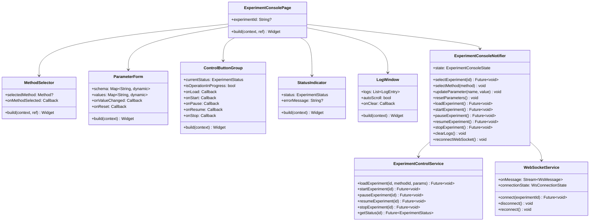
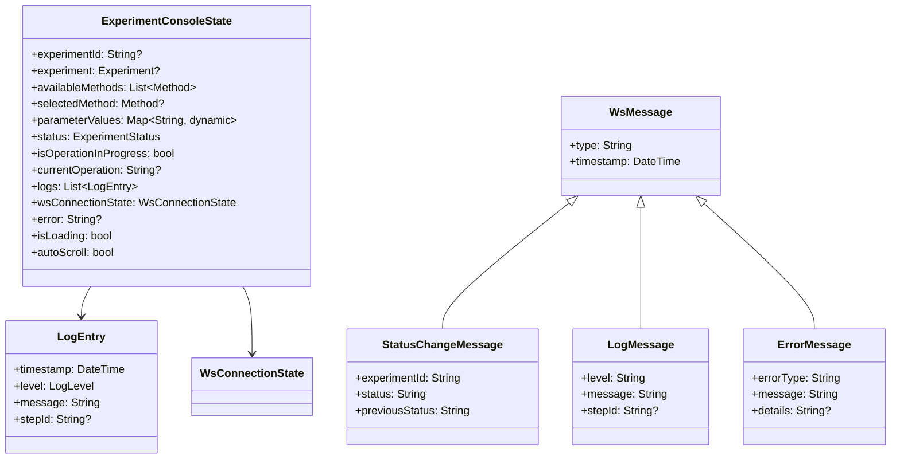
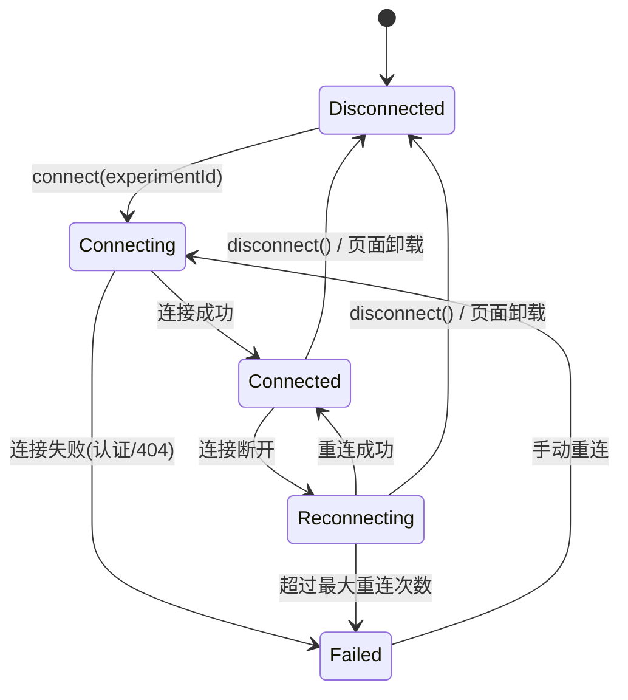
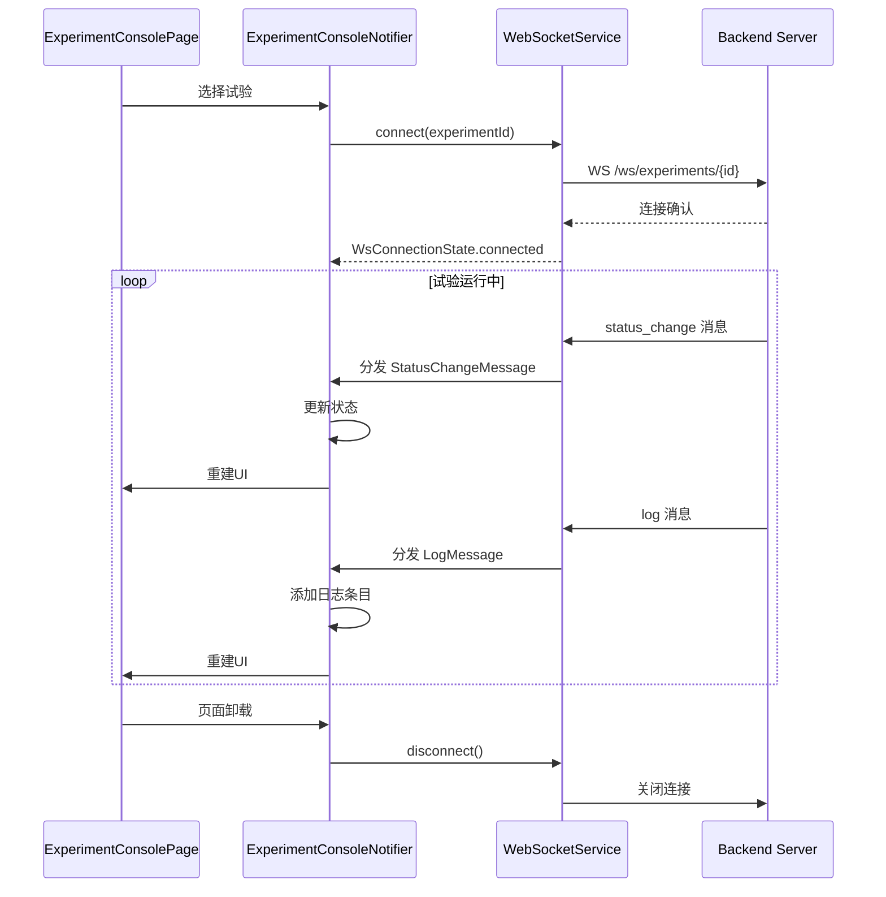
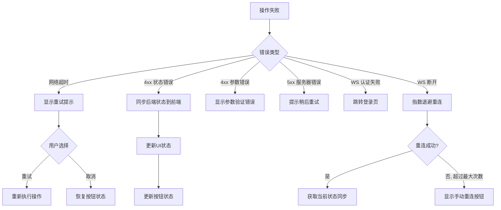

# S2-013: 试验执行控制台页面 - 详细设计文档

## 1. 概述

### 1.1 任务目标
实现试验执行控制台的前端页面，包括：
- 方法选择器下拉框
- 参数配置表单（根据方法的 parameter_schema 动态渲染）
- 控制按钮组（Load / Start / Pause / Resume / Stop）
- 试验状态指示器
- 实时日志输出窗口
- WebSocket 连接管理（接收实时更新）

### 1.2 技术栈
- **前端**: Flutter + Riverpod
- **状态管理**: Riverpod (AsyncNotifier + StateNotifier)
- **WebSocket**: `web_socket_channel` 库
- **UI框架**: Material Design 3

### 1.3 依赖任务
- S2-011: 试验过程控制API（后端已完成）
- S2-012: 试验方法管理页面（前端已完成）

---

## 2. 后端API接口（复用 S2-011）

### 2.1 REST端点

| 方法 | 路径 | 描述 | 认证 |
|------|------|------|------|
| POST | `/api/v1/experiments/{id}/load` | 加载试验方法 | JWT |
| POST | `/api/v1/experiments/{id}/start` | 开始试验 | JWT |
| POST | `/api/v1/experiments/{id}/pause` | 暂停试验 | JWT |
| POST | `/api/v1/experiments/{id}/resume` | 继续试验 | JWT |
| POST | `/api/v1/experiments/{id}/stop` | 停止试验 | JWT |
| GET | `/api/v1/experiments/{id}/status` | 获取试验状态 | JWT |

### 2.2 WebSocket端点

| 协议 | 路径 | 描述 |
|------|------|------|
| WS | `/ws/experiments/{id}` | 试验实时推送 |

### 2.3 WebSocket消息格式

```json
// 状态变更消息
{
  "type": "status_change",
  "experiment_id": "exp_001",
  "status": "RUNNING",
  "previous_status": "LOADED",
  "timestamp": "2026-04-03T10:00:00Z"
}

// 日志消息
{
  "type": "log",
  "level": "INFO",
  "message": "执行环节: Read - 读取测点数据",
  "step_id": "read_temp",
  "timestamp": "2026-04-03T10:00:01Z"
}

// 错误消息
{
  "type": "error",
  "error_type": "DeviceTimeout",
  "message": "设备连接超时",
  "details": "无法连接到设备 device_001",
  "timestamp": "2026-04-03T10:00:02Z"
}

// 环节完成消息
{
  "type": "step_complete",
  "step_id": "read_temp",
  "step_type": "Read",
  "result": {"value": 25.3},
  "duration_ms": 150,
  "timestamp": "2026-04-03T10:00:01Z"
}

// 试验完成消息
{
  "type": "experiment_complete",
  "experiment_id": "exp_001",
  "status": "COMPLETED",
  "duration_ms": 60000,
  "timestamp": "2026-04-03T10:01:00Z"
}
```

---

## 3. 前端UI设计

### 3.1 控制台页面整体布局

```
┌─────────────────────────────────────────────────────────────────┐
│  ←  试验执行控制台                                              │
├─────────────────────────────────────────────────────────────────┤
│                                                                 │
│  ┌─ 试验选择 ──────────────────────────────────────────────┐   │
│  │  试验: [选择试验 ▼]  状态: [● 空闲]  方法: [未选择]     │   │
│  └─────────────────────────────────────────────────────────┘   │
│                                                                 │
│  ┌─ 方法选择 ──────────────────────────────────────────────┐   │
│  │  方法: [选择试验方法 ▼]                                  │   │
│  └─────────────────────────────────────────────────────────┘   │
│                                                                 │
│  ┌─ 参数配置 ──────────────────────────────────────────────┐   │
│  │  目标温度 (°C):     [25.0________]                       │   │
│  │  采样率 (Hz):       [1000________]                       │   │
│  │  启用详细日志:      [●────────]                          │   │
│  │                                              [重置默认值] │   │
│  └─────────────────────────────────────────────────────────┘   │
│                                                                 │
│  ┌─ 控制操作 ──────────────────────────────────────────────┐   │
│  │  [Load]  [Start]  [Pause]  [Resume]  [Stop]              │   │
│  └─────────────────────────────────────────────────────────┘   │
│                                                                 │
│  ┌─ 实时日志 ───────────────────────────────────── [清空] [▼] │   │
│  │  ┌─────────────────────────────────────────────────────┐  │   │
│  │  │ 10:00:00 [INFO]  试验开始执行                        │  │   │
│  │  │ 10:00:01 [INFO]  执行环节: Read - 读取测点数据       │  │   │
│  │  │ 10:00:02 [WARN]  温度偏差较大                        │  │   │
│  │  │ 10:00:03 [INFO]  执行环节: Delay - 等待5000ms        │  │   │
│  │  │ 10:00:08 [ERROR] 设备连接超时                        │  │   │
│  │  │                                                     │  │   │
│  │  │                                                     │  │   │
│  │  └─────────────────────────────────────────────────────┘  │   │
│  └─────────────────────────────────────────────────────────┘   │
│                                                                 │
└─────────────────────────────────────────────────────────────────┘
```

### 3.2 状态指示器视觉表现

| 状态 | 颜色 | 图标 | 文本 | 动画 |
|------|------|------|------|------|
| IDLE | 灰色 | ○ | 空闲 | 无 |
| LOADED | 蓝色 | ● | 已加载 | 无 |
| RUNNING | 绿色 | ● | 运行中 | 脉冲动画 |
| PAUSED | 橙色 | ⏸ | 已暂停 | 无 |
| COMPLETED | 绿色 | ✓ | 已完成 | 无 |
| ERROR | 红色 | ✗ | 错误 | 无 |

### 3.3 参数表单渲染规则

| Schema类型 | Flutter Widget | 验证规则 |
|------------|---------------|----------|
| `number` | `TextField` (keyboardType: number) | 必须为有效数字 |
| `integer` | `TextField` (keyboardType: number) | 必须为整数，不含小数点 |
| `string` | `TextField` | 非空验证（如required） |
| `boolean` | `Switch` | 无 |

---

## 4. 类图

### 4.1 前端组件架构



### 4.2 状态模型



---

## 5. 前端状态模型

### 5.1 ExperimentConsoleState

```dart
class ExperimentConsoleState {
  final String? experimentId;
  final Experiment? experiment;
  final List<Method> availableMethods;
  final Method? selectedMethod;
  final Map<String, dynamic> parameterValues;
  final ExperimentStatus status;
  final bool isOperationInProgress;
  final String? currentOperation;
  final List<LogEntry> logs;
  final WsConnectionState wsConnectionState;
  final String? error;
  final bool isLoading;
  final bool autoScroll;

  const ExperimentConsoleState({
    this.experimentId,
    this.experiment,
    this.availableMethods = const [],
    this.selectedMethod,
    this.parameterValues = const {},
    this.status = ExperimentStatus.idle,
    this.isOperationInProgress = false,
    this.currentOperation,
    this.logs = const [],
    this.wsConnectionState = WsConnectionState.disconnected,
    this.error,
    this.isLoading = false,
    this.autoScroll = true,
  });

  ExperimentConsoleState copyWith({
    String? experimentId,
    Experiment? experiment,
    List<Method>? availableMethods,
    Method? selectedMethod,
    Map<String, dynamic>? parameterValues,
    ExperimentStatus? status,
    bool? isOperationInProgress,
    String? currentOperation,
    List<LogEntry>? logs,
    WsConnectionState? wsConnectionState,
    String? error,
    bool? isLoading,
    bool? autoScroll,
    bool clearError = false,
  }) {
    return ExperimentConsoleState(
      experimentId: experimentId ?? this.experimentId,
      experiment: experiment ?? this.experiment,
      availableMethods: availableMethods ?? this.availableMethods,
      selectedMethod: selectedMethod ?? this.selectedMethod,
      parameterValues: parameterValues ?? this.parameterValues,
      status: status ?? this.status,
      isOperationInProgress:
          isOperationInProgress ?? this.isOperationInProgress,
      currentOperation: currentOperation ?? this.currentOperation,
      logs: logs ?? this.logs,
      wsConnectionState: wsConnectionState ?? this.wsConnectionState,
      error: clearError ? null : (error ?? this.error),
      isLoading: isLoading ?? this.isLoading,
      autoScroll: autoScroll ?? this.autoScroll,
    );
  }
}
```

### 5.2 LogEntry

```dart
enum LogLevel {
  debug('DEBUG', Colors.grey),
  info('INFO', null), // null = default text color
  warn('WARN', Colors.orange),
  error('ERROR', Colors.red);

  final String value;
  final Color? color;
  const LogLevel(this.value, this.color);

  static LogLevel fromString(String value) {
    return LogLevel.values.firstWhere(
      (e) => e.value == value.toUpperCase(),
      orElse: () => LogLevel.info,
    );
  }
}

class LogEntry {
  final DateTime timestamp;
  final LogLevel level;
  final String message;
  final String? stepId;

  const LogEntry({
    required this.timestamp,
    required this.level,
    required this.message,
    this.stepId,
  });

  factory LogEntry.fromWsMessage(Map<String, dynamic> json) {
    return LogEntry(
      timestamp: DateTime.parse(json['timestamp'] as String),
      level: LogLevel.fromString(json['level'] as String? ?? 'INFO'),
      message: json['message'] as String,
      stepId: json['step_id'] as String?,
    );
  }
}
```

### 5.3 WsConnectionState

```dart
enum WsConnectionState {
  disconnected,
  connecting,
  connected,
  reconnecting,
  failed,
}
```

---

## 6. 控制按钮状态逻辑表

### 6.1 按钮启用/禁用矩阵

| 当前状态 | Load | Start | Pause | Resume | Stop |
|----------|------|-------|-------|--------|------|
| **IDLE** | ✅ (需已选方法) | ❌ | ❌ | ❌ | ❌ |
| **LOADED** | ❌ | ✅ | ❌ | ❌ | ❌ |
| **RUNNING** | ❌ | ❌ | ✅ | ❌ | ✅ |
| **PAUSED** | ❌ | ❌ | ❌ | ✅ | ✅ |
| **COMPLETED** | ✅ | ❌ | ❌ | ❌ | ❌ |
| **ERROR** | ✅ | ❌ | ❌ | ❌ | ❌ |

### 6.2 操作进行中状态

当 `isOperationInProgress == true` 时，**所有控制按钮全部禁用**，并在按钮上显示 `CircularProgressIndicator`。

### 6.3 按钮状态决策逻辑

```
function getButtonState(status, isOperationInProgress, hasSelectedMethod):
    if isOperationInProgress:
        return ALL_DISABLED

    switch status:
        case IDLE:
            Load: enabled if hasSelectedMethod
            Start, Pause, Resume, Stop: disabled

        case LOADED:
            Load: disabled
            Start: enabled
            Pause, Resume, Stop: disabled

        case RUNNING:
            Load, Start, Resume: disabled
            Pause: enabled
            Stop: enabled

        case PAUSED:
            Load, Start, Pause: disabled
            Resume: enabled
            Stop: enabled

        case COMPLETED:
            Load: enabled
            Start, Pause, Resume, Stop: disabled

        case ERROR:
            Load: enabled
            Start, Pause, Resume, Stop: disabled
```

---

## 7. WebSocket集成设计

### 7.1 连接生命周期



### 7.2 重连策略

采用指数退避策略：

| 重试次数 | 等待时间 |
|----------|----------|
| 1 | 1秒 |
| 2 | 2秒 |
| 3 | 4秒 |
| 4 | 8秒 |
| 5 | 16秒 |
| 6+ | 30秒（上限） |

最大重试次数：10次。超过后进入 `failed` 状态，需用户手动触发重连。

### 7.3 WebSocketService 设计

```dart
class WebSocketService {
  final String baseUrl;
  final String Function() getToken; // 获取JWT Token
  WebSocketChannel? _channel;
  StreamController<WsMessage>? _messageController;
  WsConnectionState _connectionState = WsConnectionState.disconnected;
  int _reconnectAttempts = 0;
  Timer? _heartbeatTimer;
  String? _currentExperimentId;

  // 公共接口
  Future<void> connect(String experimentId);
  void disconnect();
  void reconnect();
  Stream<WsMessage> get messageStream;
  WsConnectionState get connectionState;
}
```

### 7.4 消息处理流程



### 7.5 心跳保活

- 每 30 秒发送一次 ping 消息
- 如果 60 秒内未收到 pong，判定连接断开
- 心跳消息格式：`{"type": "ping"}`

---

## 8. API服务层设计

### 8.1 ExperimentControlService

```dart
abstract class ExperimentControlServiceInterface {
  Future<void> loadExperiment(
    String experimentId,
    String methodId,
    Map<String, dynamic> parameters,
  );
  Future<void> startExperiment(String experimentId);
  Future<void> pauseExperiment(String experimentId);
  Future<void> resumeExperiment(String experimentId);
  Future<void> stopExperiment(String experimentId);
  Future<ExperimentStatus> getStatus(String experimentId);
}

class ExperimentControlService implements ExperimentControlServiceInterface {
  final ApiClientInterface _apiClient;

  ExperimentControlService(this._apiClient);

  @override
  Future<void> loadExperiment(
    String experimentId,
    String methodId,
    Map<String, dynamic> parameters,
  ) async {
    final body = {
      'method_id': methodId,
      'parameters': parameters,
    };
    await _apiClient.post(
      '/api/v1/experiments/$experimentId/load',
      data: body,
    );
  }

  @override
  Future<void> startExperiment(String experimentId) async {
    await _apiClient.post('/api/v1/experiments/$experimentId/start');
  }

  @override
  Future<void> pauseExperiment(String experimentId) async {
    await _apiClient.post('/api/v1/experiments/$experimentId/pause');
  }

  @override
  Future<void> resumeExperiment(String experimentId) async {
    await _apiClient.post('/api/v1/experiments/$experimentId/resume');
  }

  @override
  Future<void> stopExperiment(String experimentId) async {
    await _apiClient.post('/api/v1/experiments/$experimentId/stop');
  }

  @override
  Future<ExperimentStatus> getStatus(String experimentId) async {
    final response = await _apiClient.get(
      '/api/v1/experiments/$experimentId/status',
    );
    final data = response as Map<String, dynamic>;
    return ExperimentStatus.fromString(data['status'] as String);
  }
}

final experimentControlServiceProvider =
    Provider<ExperimentControlServiceInterface>((ref) {
  final apiClient = ref.watch(apiClientProvider);
  return ExperimentControlService(apiClient);
});
```

---

## 9. Riverpod Provider 设计

### 9.1 ExperimentConsoleNotifier

```dart
class ExperimentConsoleNotifier
    extends StateNotifier<ExperimentConsoleState> {
  final ExperimentControlServiceInterface _controlService;
  final MethodServiceInterface _methodService;
  final ExperimentServiceInterface _experimentService;
  final WebSocketService _wsService;
  StreamSubscription? _wsSubscription;

  ExperimentConsoleNotifier(
    this._controlService,
    this._methodService,
    this._experimentService,
    this._wsService,
  ) : super(const ExperimentConsoleState());

  /// 初始化：加载可用方法列表
  Future<void> initialize() async {
    state = state.copyWith(isLoading: true, clearError: true);
    try {
      final response = await _methodService.getMethods(page: 1, size: 100);
      state = state.copyWith(
        availableMethods: response.items,
        isLoading: false,
      );
    } catch (e) {
      state = state.copyWith(
        isLoading: false,
        error: '加载方法列表失败: ${e.toString()}',
      );
    }
  }

  /// 选择试验（通过试验ID或从列表选择）
  Future<void> selectExperiment(String experimentId) async {
    state = state.copyWith(
      experimentId: experimentId,
      isLoading: true,
      clearError: true,
    );

    try {
      final experiment = await _experimentService.getExperiment(experimentId);
      state = state.copyWith(
        experiment: experiment,
        status: experiment.status,
        isLoading: false,
      );

      // 如果试验已加载方法，自动选中对应方法
      if (experiment.methodId != null) {
        final method = state.availableMethods.firstWhere(
          (m) => m.id == experiment.methodId,
          orElse: () => state.selectedMethod!,
        );
        if (method != null) {
          _selectMethodInternal(method);
        }
      }

      // 建立WebSocket连接
      _connectWebSocket(experimentId);
    } catch (e) {
      state = state.copyWith(
        isLoading: false,
        error: '加载试验失败: ${e.toString()}',
      );
    }
  }

  /// 选择方法
  void selectMethod(Method method) {
    // 如果试验处于非IDLE/COMPLETED/ERROR状态，提示需要先停止
    if (state.status != ExperimentStatus.idle &&
        state.status != ExperimentStatus.completed &&
        state.status != ExperimentStatus.aborted) {
      state = state.copyWith(
        error: '请先停止当前试验再切换方法',
      );
      return;
    }

    _selectMethodInternal(method);
  }

  void _selectMethodInternal(Method method) {
    // 根据 parameter_schema 初始化参数值
    final initialValues = <String, dynamic>{};
    for (final entry in method.parameterSchema.entries) {
      final schema = entry.value as Map<String, dynamic>;
      initialValues[entry.key] = schema['default'];
    }

    state = state.copyWith(
      selectedMethod: method,
      parameterValues: initialValues,
      clearError: true,
    );
  }

  /// 更新参数值
  void updateParameter(String name, dynamic value) {
    final newValues = Map<String, dynamic>.from(state.parameterValues);
    newValues[name] = value;
    state = state.copyWith(parameterValues: newValues);
  }

  /// 重置参数为默认值
  void resetParameters() {
    final method = state.selectedMethod;
    if (method == null) return;

    final initialValues = <String, dynamic>{};
    for (final entry in method.parameterSchema.entries) {
      final schema = entry.value as Map<String, dynamic>;
      initialValues[entry.key] = schema['default'];
    }

    state = state.copyWith(parameterValues: initialValues);
  }

  /// Load 操作
  Future<void> loadExperiment() async {
    final method = state.selectedMethod;
    final experimentId = state.experimentId;
    if (method == null || experimentId == null) return;

    state = state.copyWith(
      isOperationInProgress: true,
      currentOperation: 'load',
      clearError: true,
    );

    try {
      await _controlService.loadExperiment(
        experimentId,
        method.id,
        state.parameterValues,
      );
      // 状态将通过WebSocket更新
      _addLogEntry(
        LogLevel.info,
        '方法加载成功: ${method.name}',
      );
    } catch (e) {
      state = state.copyWith(
        error: '加载失败: ${e.toString()}',
      );
      _addLogEntry(LogLevel.error, '加载失败: ${e.toString()}');
    } finally {
      state = state.copyWith(
        isOperationInProgress: false,
        currentOperation: null,
      );
    }
  }

  /// Start 操作
  Future<void> startExperiment() async {
    final experimentId = state.experimentId;
    if (experimentId == null) return;

    state = state.copyWith(
      isOperationInProgress: true,
      currentOperation: 'start',
      clearError: true,
    );

    try {
      await _controlService.startExperiment(experimentId);
      _addLogEntry(LogLevel.info, '试验开始执行');
    } catch (e) {
      state = state.copyWith(
        error: '启动失败: ${e.toString()}',
      );
      _addLogEntry(LogLevel.error, '启动失败: ${e.toString()}');
    } finally {
      state = state.copyWith(
        isOperationInProgress: false,
        currentOperation: null,
      );
    }
  }

  /// Pause 操作
  Future<void> pauseExperiment() async {
    final experimentId = state.experimentId;
    if (experimentId == null) return;

    state = state.copyWith(
      isOperationInProgress: true,
      currentOperation: 'pause',
      clearError: true,
    );

    try {
      await _controlService.pauseExperiment(experimentId);
      _addLogEntry(LogLevel.info, '试验已暂停');
    } catch (e) {
      state = state.copyWith(
        error: '暂停失败: ${e.toString()}',
      );
      _addLogEntry(LogLevel.error, '暂停失败: ${e.toString()}');
    } finally {
      state = state.copyWith(
        isOperationInProgress: false,
        currentOperation: null,
      );
    }
  }

  /// Resume 操作
  Future<void> resumeExperiment() async {
    final experimentId = state.experimentId;
    if (experimentId == null) return;

    state = state.copyWith(
      isOperationInProgress: true,
      currentOperation: 'resume',
      clearError: true,
    );

    try {
      await _controlService.resumeExperiment(experimentId);
      _addLogEntry(LogLevel.info, '试验继续执行');
    } catch (e) {
      state = state.copyWith(
        error: '继续失败: ${e.toString()}',
      );
      _addLogEntry(LogLevel.error, '继续失败: ${e.toString()}');
    } finally {
      state = state.copyWith(
        isOperationInProgress: false,
        currentOperation: null,
      );
    }
  }

  /// Stop 操作
  Future<void> stopExperiment() async {
    final experimentId = state.experimentId;
    if (experimentId == null) return;

    state = state.copyWith(
      isOperationInProgress: true,
      currentOperation: 'stop',
      clearError: true,
    );

    try {
      await _controlService.stopExperiment(experimentId);
      _addLogEntry(LogLevel.info, '试验已停止');
    } catch (e) {
      state = state.copyWith(
        error: '停止失败: ${e.toString()}',
      );
      _addLogEntry(LogLevel.error, '停止失败: ${e.toString()}');
    } finally {
      state = state.copyWith(
        isOperationInProgress: false,
        currentOperation: null,
      );
    }
  }

  /// 清空日志
  void clearLogs() {
    state = state.copyWith(logs: []);
  }

  /// 切换自动滚动
  void toggleAutoScroll() {
    state = state.copyWith(autoScroll: !state.autoScroll);
  }

  /// 连接WebSocket
  void _connectWebSocket(String experimentId) {
    _wsSubscription?.cancel();
    _wsService.connect(experimentId);

    _wsSubscription = _wsService.messageStream.listen((message) {
      _handleWsMessage(message);
    });
  }

  /// 处理WebSocket消息
  void _handleWsMessage(WsMessage message) {
    switch (message.type) {
      case 'status_change':
        _handleStatusChange(message);
        break;
      case 'log':
        _handleLogMessage(message);
        break;
      case 'error':
        _handleErrorMessage(message);
        break;
      case 'step_complete':
        _handleStepComplete(message);
        break;
      case 'experiment_complete':
        _handleExperimentComplete(message);
        break;
      default:
        // 忽略未知消息类型
        break;
    }
  }

  void _handleStatusChange(WsMessage message) {
    final data = message.rawData;
    final newStatus = ExperimentStatus.fromString(data['status'] as String);
    state = state.copyWith(status: newStatus);
    _addLogEntry(
      LogLevel.info,
      '状态变更: ${_getStatusText(newStatus)}',
    );
  }

  void _handleLogMessage(WsMessage message) {
    final entry = LogEntry.fromWsMessage(message.rawData);
    _addLogEntry(entry.level, entry.message);
  }

  void _handleErrorMessage(WsMessage message) {
    final data = message.rawData;
    final errorMsg = data['message'] as String;
    state = state.copyWith(
      status: ExperimentStatus.aborted,
      error: errorMsg,
    );
    _addLogEntry(LogLevel.error, '错误: $errorMsg');
  }

  void _handleStepComplete(WsMessage message) {
    final data = message.rawData;
    final stepType = data['step_type'] as String? ?? 'Unknown';
    final duration = data['duration_ms'] as int?;
    _addLogEntry(
      LogLevel.info,
      '环节完成: $stepType${duration != null ? ' (耗时: ${duration}ms)' : ''}',
    );
  }

  void _handleExperimentComplete(WsMessage message) {
    final data = message.rawData;
    final duration = data['duration_ms'] as int?;
    state = state.copyWith(
      status: ExperimentStatus.completed,
    );
    _addLogEntry(
      LogLevel.info,
      '试验完成${duration != null ? ' (总耗时: ${duration}ms)' : ''}',
    );
  }

  void _addLogEntry(LogLevel level, String message) {
    final entry = LogEntry(
      timestamp: DateTime.now(),
      level: level,
      message: message,
    );
    final newLogs = [...state.logs, entry];
    // 限制日志数量，保留最近5000条
    if (newLogs.length > 5000) {
      newLogs.removeRange(0, newLogs.length - 5000);
    }
    state = state.copyWith(logs: newLogs);
  }

  String _getStatusText(ExperimentStatus status) {
    switch (status) {
      case ExperimentStatus.idle:
        return '空闲';
      case ExperimentStatus.running:
        return '运行中';
      case ExperimentStatus.paused:
        return '已暂停';
      case ExperimentStatus.completed:
        return '已完成';
      case ExperimentStatus.aborted:
        return '已中止';
    }
  }

  @override
  void dispose() {
    _wsSubscription?.cancel();
    _wsService.disconnect();
    super.dispose();
  }
}

/// Provider
final experimentConsoleProvider =
    StateNotifierProvider<ExperimentConsoleNotifier, ExperimentConsoleState>(
  (ref) {
    final controlService = ref.watch(experimentControlServiceProvider);
    final methodService = ref.watch(methodServiceProvider);
    final experimentService = ref.watch(experimentServiceProvider);
    final wsService = ref.watch(webSocketServiceProvider);
    return ExperimentConsoleNotifier(
      controlService,
      methodService,
      experimentService,
      wsService,
    );
  },
);
```

### 9.2 WebSocket Provider

```dart
final webSocketServiceProvider = Provider<WebSocketService>((ref) {
  final config = ref.watch(apiConfigProvider); // 获取API基础URL
  final authState = ref.watch(authStateProvider);
  return WebSocketService(
    baseUrl: config.wsBaseUrl,
    getToken: () => authState?.accessToken ?? '',
  );
});
```

---

## 10. 错误处理策略

### 10.1 错误分类

| 错误类型 | 处理方式 | 用户反馈 |
|----------|----------|----------|
| **网络错误** (超时、断开) | 自动重试（控制操作）/ 自动重连（WS） | Toast提示 + 日志记录 |
| **API 4xx 错误** (参数错误、状态不允许) | 显示错误信息，不重试 | Snackbar提示 + 日志记录 |
| **API 5xx 错误** (服务器错误) | 提示用户稍后重试 | Snackbar提示 + 日志记录 |
| **WebSocket 认证失败** | 停止重连，提示重新登录 | Dialog提示 |
| **WebSocket 连接断开** | 指数退避自动重连 | 状态栏提示 |
| **参数验证错误** | 禁用Load按钮，显示字段级错误 | 输入框下方红色文字 |
| **未知错误** | 记录日志，显示通用错误提示 | Snackbar提示 |

### 10.2 错误恢复流程



### 10.3 状态冲突处理

当API返回状态不允许的错误（如从IDLE状态调用Start）时：

1. 调用 `GET /api/v1/experiments/{id}/status` 获取最新状态
2. 更新前端状态为后端返回的真实状态
3. 根据新状态更新按钮启用/禁用状态
4. 向用户提示"状态已同步"

---

## 11. 实现计划

### 11.1 文件结构

```
kayak-frontend/lib/features/experiments/
├── screens/
│   └── experiment_console_page.dart      # 控制台主页面
├── widgets/
│   ├── method_selector.dart              # 方法选择器组件
│   ├── parameter_form.dart               # 参数配置表单
│   ├── control_button_group.dart         # 控制按钮组
│   ├── status_indicator.dart             # 状态指示器
│   └── log_window.dart                   # 实时日志窗口
├── services/
│   ├── experiment_control_service.dart   # 控制操作API服务
│   └── websocket_service.dart            # WebSocket服务
├── providers/
│   └── experiment_console_provider.dart  # 控制台状态管理
└── models/
    ├── log_entry.dart                    # 日志条目模型
    └── ws_message.dart                   # WebSocket消息模型
```

### 11.2 实现步骤

1. **数据模型层**
   - 创建 `LogEntry` 模型（含 LogLevel 枚举）
   - 创建 `WsMessage` 及子类型模型
   - 创建 `WsConnectionState` 枚举

2. **服务层**
   - 实现 `ExperimentControlService`（Load/Start/Pause/Resume/Stop/GetStatus）
   - 实现 `WebSocketService`（连接管理、消息分发、心跳、重连）

3. **状态管理层**
   - 实现 `ExperimentConsoleState`
   - 实现 `ExperimentConsoleNotifier`
   - 配置 Riverpod Provider

4. **UI组件层**
   - 实现 `StatusIndicator` 组件
   - 实现 `MethodSelector` 组件
   - 实现 `ParameterForm` 组件
   - 实现 `ControlButtonGroup` 组件
   - 实现 `LogWindow` 组件（含自动滚动、清空、手动滚动检测）

5. **页面集成**
   - 实现 `ExperimentConsolePage` 主页面
   - 组装所有子组件
   - 连接状态管理和事件处理

6. **路由配置**
   - 在路由中注册控制台页面
   - 支持通过试验ID导航

---

## 12. 路由配置

### 12.1 前端路由

```
/experiments/:id/console    -> ExperimentConsolePage (指定试验ID)
/experiments/console        -> ExperimentConsolePage (需先选择试验)
```

### 12.2 导航方式

- 从试验列表页点击"执行"按钮 → 导航到 `/experiments/:id/console`
- 从侧边栏导航 → 导航到 `/experiments/console`（显示试验选择器）

---

## 13. 性能优化策略

### 13.1 日志窗口

- **日志截断**: 保留最近 5000 条日志，超出时移除最旧日志
- **虚拟滚动**: 当日志超过 200 条时，使用 `ListView.builder` 实现按需渲染
- **批量更新**: 短时间内多条日志到达时，使用 `Future.microtask` 批量更新状态

### 13.2 WebSocket

- **消息节流**: 高频日志消息（>10条/秒）时，合并为批量更新
- **连接复用**: 同一试验ID不重复建立连接

### 13.3 状态管理

- **选择性重建**: 使用 `ref.watch` 精确监听需要的状态字段
- **组件拆分**: 将大组件拆分为独立小组件，减少不必要的重建

---

## 14. 测试用例对照

| 测试类别 | 对应设计内容 |
|----------|-------------|
| TC-S2-013-FE-001 ~ FE-003 | 页面布局与初始化 (§3.1, §5.1) |
| TC-S2-013-FE-004 ~ FE-008 | 方法选择器 (§3.1, §9.1 initialize/selectMethod) |
| TC-S2-013-FE-009 ~ FE-015 | 参数配置表单 (§3.3, §9.1 updateParameter/resetParameters) |
| TC-S2-013-FE-016 ~ FE-026 | 控制按钮组 (§6, §9.1 各操作方法) |
| TC-S2-013-FE-027 ~ FE-029 | 状态指示器 (§3.2, §9.1 _handleStatusChange) |
| TC-S2-013-FE-030 ~ FE-036 | 实时日志窗口 (§5.2, §9.1 _addLogEntry) |
| TC-S2-013-FE-037 ~ FE-042 | WebSocket连接管理 (§7, §9.1 _connectWebSocket) |
| TC-S2-013-BE-001 ~ BE-016 | API集成 (§8, §10) |
| TC-S2-013-WS-001 ~ WS-013 | WebSocket实时推送 (§7, §9.1 _handleWsMessage) |
| TC-S2-013-EDGE-001 ~ EDGE-016 | 边缘情况与异常 (§10, §13) |
| TC-S2-013-INT-001 ~ INT-004 | 集成测试 (端到端流程) |

---

**文档版本**: 1.0  
**创建日期**: 2026-04-03  
**作者**: sw-jerry
