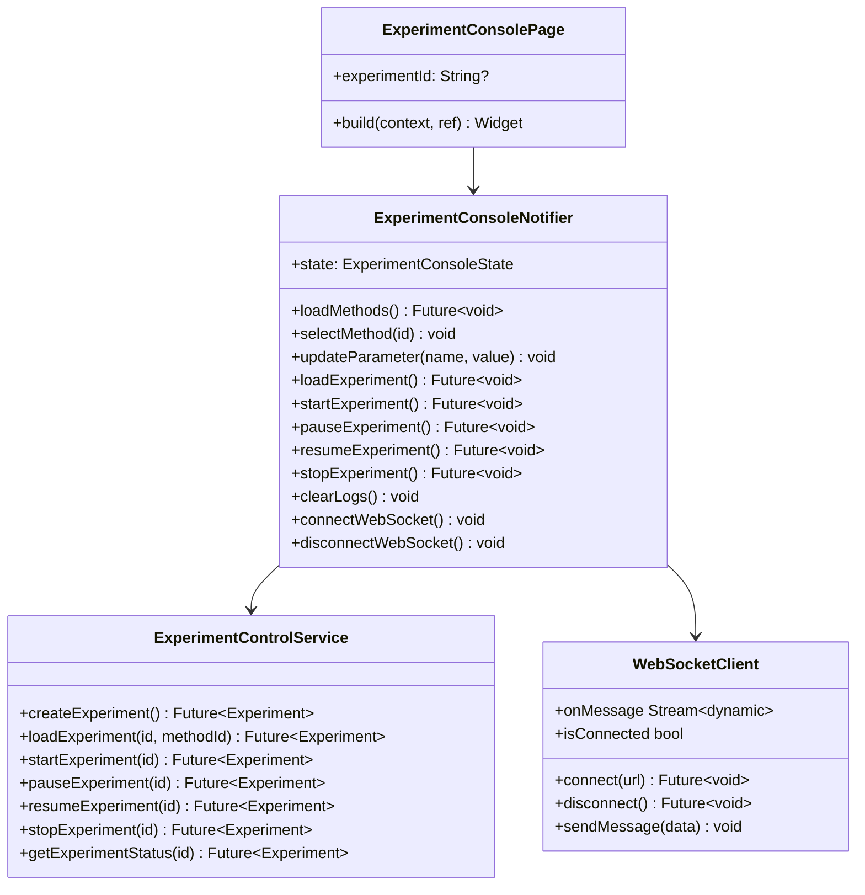

# S2-013: 试验执行控制台页面 - 详细设计文档

## 1. 概述

### 1.1 任务目标
实现试验执行控制台页面，提供：
- 方法选择器
- 参数配置表单
- 控制按钮组(开始/暂停/停止)
- 状态显示
- 实时日志输出窗口
- WebSocket实时状态更新

### 1.2 技术栈
- **前端**: Flutter + Riverpod
- **WebSocket**: web_socket_channel
- **状态管理**: Riverpod (StateNotifier)

---

## 2. UI设计

### 2.1 试验执行控制台页面

```
┌─────────────────────────────────────────────────┐
│  ←  试验执行控制台                              │
├─────────────────────────────────────────────────┤
│                                                 │
│  ┌─ 试验信息 ────────────────────────────────┐  │
│  │ 状态: [● 空闲]                            │  │
│  │ 方法: [选择方法 ▼]                        │  │
│  └───────────────────────────────────────────┘  │
│                                                 │
│  ┌─ 控制按钮 ────────────────────────────────┐  │
│  │ [载入]  [开始]  [暂停]  [继续]  [停止]    │  │
│  └───────────────────────────────────────────┘  │
│                                                 │
│  ┌─ 参数配置 ────────────────────────────────┐  │
│  │ temperature_setpoint: [25.0] °C           │  │
│  │ sample_rate:          [1000]  Hz          │  │
│  └───────────────────────────────────────────┘  │
│                                                 │
│  ┌─ 执行日志 ────────────────────────────────┐  │
│  │ [2024-03-15 10:30:01] INFO: 试验已载入     │  │
│  │ [2024-03-15 10:30:02] INFO: 试验开始       │  │
│  │ [2024-03-15 10:30:03] INFO: 执行Read环节   │  │
│  │ [2024-03-15 10:30:04] INFO: 读取温度: 25.3 │  │
│  │ [2024-03-15 10:30:05] INFO: 执行Delay环节  │  │
│  │                                            │  │
│  │                                            │  │
│  └───────────────────────────────────────────┘  │
│                                    [清空日志]   │
└─────────────────────────────────────────────────┘
```

---

## 3. 状态模型

### 3.1 ExperimentConsoleState
```dart
class ExperimentConsoleState {
  final Experiment? experiment;
  final List<Method> availableMethods;
  final String? selectedMethodId;
  final Map<String, dynamic> parameterValues;
  final List<LogEntry> logs;
  final bool isLoading;
  final bool isControlling;
  final String? error;
  final bool isConnected; // WebSocket连接状态
}
```

### 3.2 LogEntry
```dart
class LogEntry {
  final DateTime timestamp;
  final LogLevel level; // info, warn, error
  final String message;
}
```

---

## 4. 控制按钮状态逻辑

| 当前状态 | 载入 | 开始 | 暂停 | 继续 | 停止 |
|----------|------|------|------|------|------|
| Idle | ✓ | ✗ | ✗ | ✗ | ✗ |
| Loaded | ✗ | ✓ | ✗ | ✗ | ✗ |
| Running | ✗ | ✗ | ✓ | ✗ | ✓ |
| Paused | ✗ | ✓ | ✗ | ✓ | ✓ |
| Completed | ✗ | ✗ | ✗ | ✗ | ✗ |
| Aborted | ✗ | ✗ | ✗ | ✗ | ✗ |

---

## 5. WebSocket消息处理

### 5.1 消息类型
```dart
enum WsMessageType {
  statusChange,  // 状态变更
  log,           // 日志消息
  error,         // 错误消息
}
```

### 5.2 消息格式
```json
// 状态变更
{"type": "status_change", "new_status": "RUNNING", "timestamp": "..."}

// 日志
{"type": "log", "level": "info", "message": "试验开始", "timestamp": "..."}

// 错误
{"type": "error", "message": "执行失败: ...", "timestamp": "..."}
```

---

## 6. 类图



---

## 7. 实现计划

### 7.1 前端实现
1. 创建 ExperimentControlService (扩展experiment_service)
2. 创建 WebSocketClient 封装
3. 创建 ExperimentConsoleNotifier 状态管理
4. 实现 ExperimentConsolePage UI
5. 在路由中注册试验执行页面

### 7.2 后端 (已有)
- 试验控制API已在S2-011中实现
- WebSocket推送已在S2-011中实现
- 本次只需前端对接

---

## 8. 路由配置

```
/experiments/console              -> ExperimentConsolePage (新建试验)
/experiments/:id/console          -> ExperimentConsolePage (已有试验)
```

---

**文档结束**
