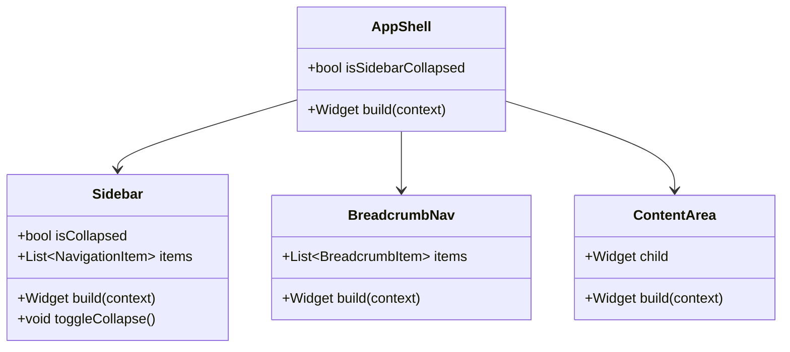

# S2-014: 应用导航框架与路由 - 详细设计文档

**任务ID**: S2-014  
**任务名称**: 应用导航框架与路由 (Application Navigation Framework and Routing)  
**文档版本**: 1.0  
**创建日期**: 2026-03-26  
**设计人**: sw-anna  
**依赖任务**: S1-012  

---

## 1. 设计概述

### 1.1 功能范围

本文档描述 S2-014 任务的详细设计，实现主应用布局和导航框架：

1. **侧边栏导航** - 可折叠的侧边栏菜单
2. **内容区** - 主内容显示区域
3. **面包屑导航** - 路径导航组件
4. **响应式布局** - 适配桌面端窗口变化

### 1.2 技术栈

| 技术项 | 选择 |
|--------|------|
| **路由框架** | go_router |
| **状态管理** | Riverpod |
| **UI框架** | Flutter (Material Design 3) |
| **窗口管理** | window_manager |

### 1.3 路由结构

```
/                           → SplashScreen (重定向到 /dashboard 或 /login)
/login                      → LoginScreen
/register                   → RegisterScreen
/dashboard                  → DashboardScreen (主页面)
/workbenches               → WorkbenchListPage
/workbenches/:id            → WorkbenchDetailPage
/experiments               → ExperimentListPage
/experiments/:id            → ExperimentDetailPage
/methods                   → MethodListPage
/methods/:id/edit          → MethodEditPage
/settings                  → SettingsPage
```

---

## 2. 布局架构

### 2.1 AppShell 组件结构



### 2.2 响应式断点

| 断点 | 宽度 | 侧边栏状态 |
|------|------|------------|
| 小 | < 900px | 折叠 |
| 中 | 900px - 1200px | 折叠 |
| 大 | > 1200px | 展开 |

### 2.3 侧边栏宽度

| 状态 | 宽度 |
|------|------|
| 展开 | 240px |
| 折叠 | 72px (仅图标) |

---

## 3. 导航组件设计

### 3.1 侧边栏项目

```dart
class NavigationItem {
  final String label;
  final IconData icon;
  final String route;
  final List<NavigationItem>? children;
}
```

### 3.2 导航结构

| 层级 | 标签 | 图标 | 路由 |
|------|------|------|------|
| 1 | 首页 | home | /dashboard |
| 1 | 工作台 | dashboard | /workbenches |
| 1 | 试验 | science | /experiments |
| 1 | 方法 | description | /methods |
| 1 | 设置 | settings | /settings |

---

## 4. 面包屑导航

### 4.1 面包屑项目

```dart
class BreadcrumbItem {
  final String label;
  final String? route;
  final bool isCurrent;
}
```

### 4.2 面包屑规则

- 自动根据当前路由生成
- 可点击的项目跳转到对应路由
- 当前页不可点击

---

## 5. 路由守卫

### 5.1 认证守卫

```dart
// 受保护的路由需要登录
const protectedRoutes = [
  '/dashboard',
  '/workbenches',
  '/experiments',
  '/methods',
  '/settings',
];

// 公共路由
const publicRoutes = [
  '/login',
  '/register',
];
```

### 5.2 路由重定向规则

| 场景 | 行为 |
|------|------|
| 未登录访问受保护路由 | 重定向到 /login?redirect={原路由} |
| 已登录访问 /login | 重定向到 /dashboard |
| 已登录访问 / | 重定向到 /dashboard |

---

## 6. 实现要点

### 6.1 窗口大小监听

使用 `LayoutBuilder` 监听窗口宽度，动态调整侧边栏状态：

```dart
LayoutBuilder(
  builder: (context, constraints) {
    final isWide = constraints.maxWidth > 900;
    return Sidebar(
      isCollapsed: !isWide,
      ...
    );
  },
)
```

### 6.2 侧边栏折叠动画

- 动画时长: 200ms
- 动画曲线: Curves.easeInOut

---

**文档结束**