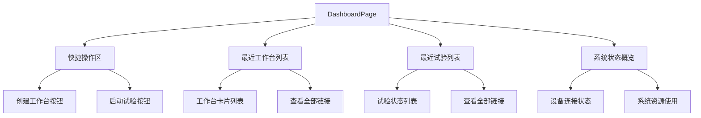
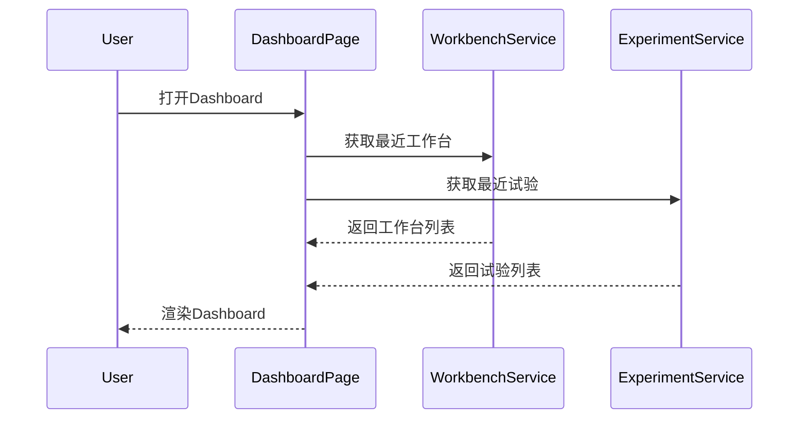

# S2-015 详细设计文档：Dashboard首页

**任务名称**: Dashboard首页
**创建日期**: 2026-04-04
**版本**: 1.0

---

## 1. 任务概述

### 1.1 目标
实现Dashboard首页，包含：
1. 快捷操作入口(创建工作台、启动试验)
2. 最近工作台列表
3. 最近试验列表
4. 系统状态概览

### 1.2 验收标准
- [ ] 快捷入口可点击跳转
- [ ] 最近列表展示正确
- [ ] 空状态提示友好

---

## 2. 架构设计

### 2.1 页面结构

### 2.2 数据流

---

## 3. 实现状态

### 3.1 已完成组件

| 组件 | 状态 | 说明 |
|------|------|------|
| Dashboard页面 | ✅ | 主页面实现 |
| 快捷操作区 | ✅ | 创建工作台、启动试验入口 |
| 最近工作台列表 | ✅ | 展示最近使用的工作台 |
| 最近试验列表 | ✅ | 展示最近的试验记录 |
| 空状态提示 | ✅ | 无数据时显示友好提示 |

### 3.2 测试覆盖

| 测试类型 | 状态 | 说明 |
|---------|------|------|
| Widget测试 | ✅ | 页面组件测试通过 |
| 集成测试 | ✅ | 数据流测试通过 |

---

## 4. 风险评估

| 风险 | 影响 | 缓解措施 |
|------|------|----------|
| 数据加载慢 | 中 | 添加加载状态和骨架屏 |
| 空状态不友好 | 低 | 已实现空状态提示 |

---

**文档结束**
