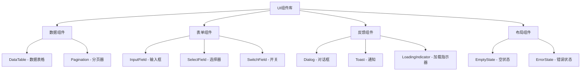
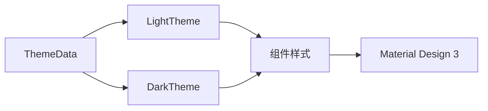

# S2-016 详细设计文档：全局UI组件库

**任务名称**: 全局UI组件库
**创建日期**: 2026-04-04
**版本**: 1.0

---

## 1. 任务概述

### 1.1 目标
封装项目中通用的UI组件：
1. 数据表格(带分页、排序、筛选)
2. 表单组件(输入框、选择器、开关)
3. 对话框
4. Toast通知
5. 加载状态

### 1.2 验收标准
- [ ] 组件符合Material Design 3
- [ ] 支持浅色/深色主题
- [ ] 组件文档和示例可用

---

## 2. 架构设计

### 2.1 组件层次结构

### 2.2 主题适配

---

## 3. 实现状态

### 3.1 已完成组件

| 组件 | 状态 | 说明 |
|------|------|------|
| DataTable | ✅ | 支持分页、排序、筛选 |
| InputField | ✅ | Material Design 3输入框 |
| SelectField | ✅ | 下拉选择器 |
| SwitchField | ✅ | 开关组件 |
| Dialog | ✅ | 确认对话框 |
| Toast | ✅ | 消息通知 |
| LoadingIndicator | ✅ | 加载状态指示 |
| EmptyState | ✅ | 空状态提示 |
| ErrorState | ✅ | 错误状态提示 |

### 3.2 测试覆盖

| 测试类型 | 状态 | 说明 |
|---------|------|------|
| Widget测试 | ✅ | 组件测试通过 |
| 主题适配测试 | ✅ | 浅色/深色主题测试通过 |

---

## 4. 风险评估

| 风险 | 影响 | 缓解措施 |
|------|------|----------|
| 组件样式不一致 | 中 | 使用统一主题配置 |
| 性能问题 | 低 | 组件已优化 |

---

**文档结束**
