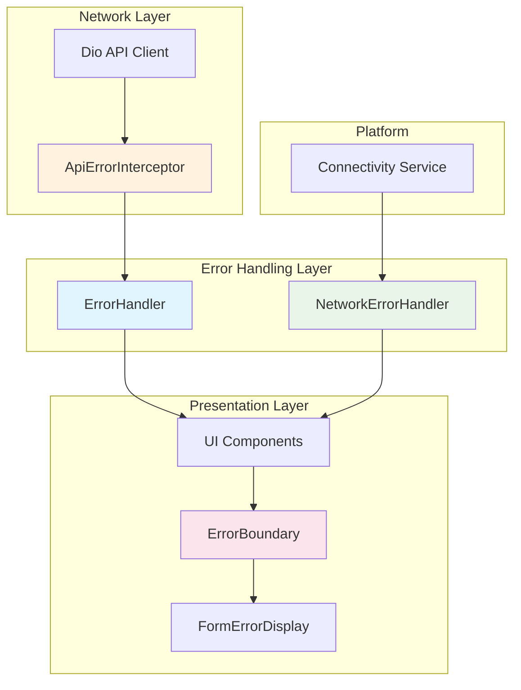
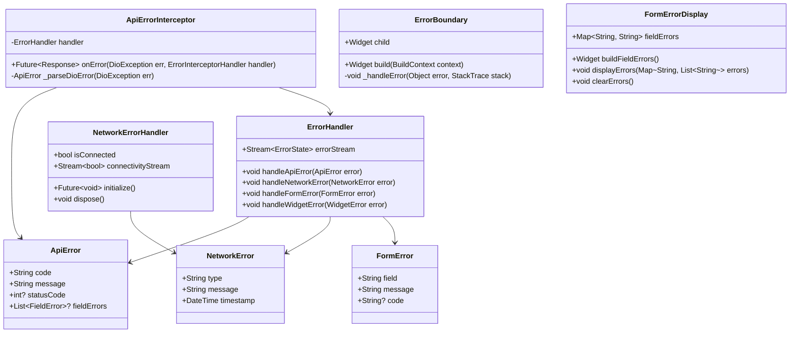
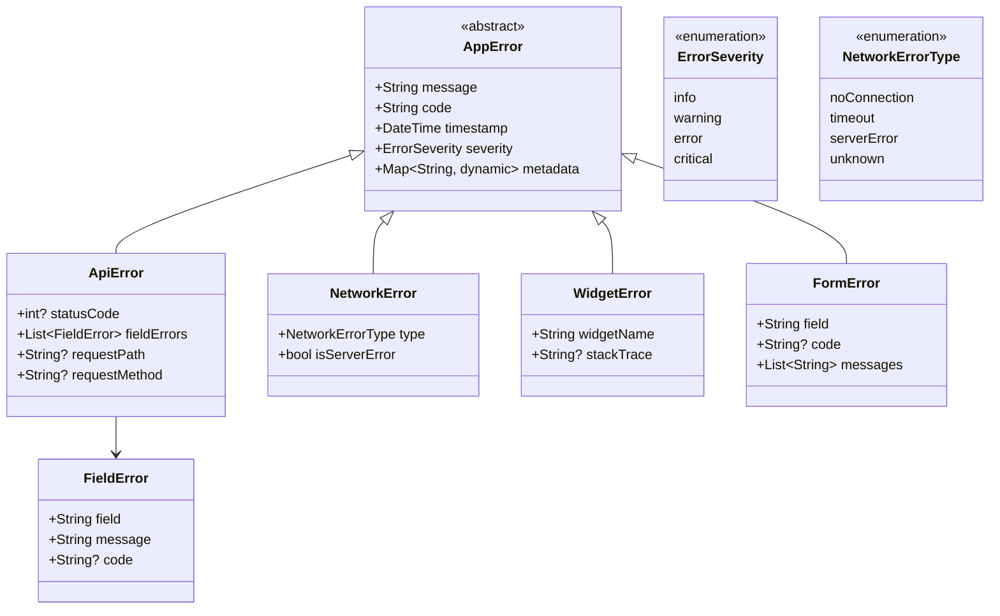
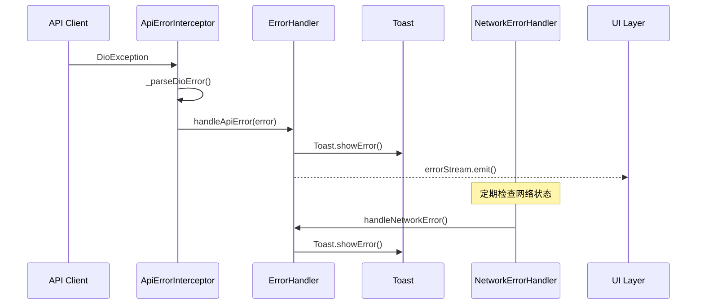
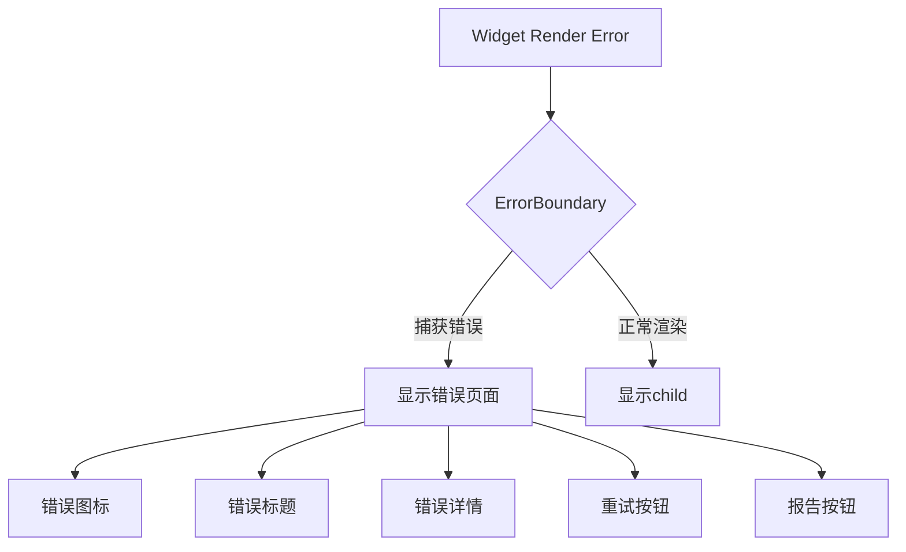

# S2-017: 错误处理与反馈 - 详细设计文档

**任务ID**: S2-017  
**任务名称**: 错误处理与反馈 (Error Handling and Feedback)  
**文档版本**: 1.0  
**创建日期**: 2026-03-26  
**设计人**: sw-anna  
**依赖任务**: S2-016 (全局UI组件库)  

---

## 1. 设计概述

### 1.1 功能范围

本文档描述 S2-017 任务的详细设计，实现全局错误处理机制：

1. **API错误统一捕获和提示** - Dio拦截器捕获所有API错误，通过Toast展示
2. **网络错误处理** - 监听网络连接状态，断开时显示友好提示
3. **表单验证错误提示** - 实时表单验证错误展示
4. **全局错误边界组件** - 捕获Widget渲染错误，显示友好错误页面

### 1.2 技术栈

| 技术项 | 选择 |
|--------|------|
| **HTTP客户端** | Dio + Interceptors |
| **网络状态监听** | connectivity_plus |
| **状态管理** | Riverpod |
| **UI框架** | Flutter (Material Design 3) |

### 1.3 目录结构

```
kayak-frontend/lib/
├── core/
│   ├── error/
│   │   ├── error_handler.dart          # 中央错误处理服务
│   │   ├── api_error_interceptor.dart  # API错误拦截器
│   │   ├── network_error_handler.dart  # 网络错误处理
│   │   ├── form_error_display.dart    # 表单错误显示
│   │   ├── error_boundary.dart         # 全局错误边界
│   │   ├── error_models.dart           # 错误模型定义
│   │   └── error_messages.dart         # 错误消息模板
│   └── common/
│       └── widgets/
│           └── feedback/
│               └── toast.dart          # (已存在)
```

---

## 2. 架构设计

### 2.1 错误处理架构图



### 2.2 组件关系图



---

## 3. 错误模型定义

### 3.1 错误模型类图



### 3.2 错误模型定义

```dart
/// 错误严重程度枚举
enum ErrorSeverity {
  info,     // 信息提示
  warning,  // 警告
  error,    // 错误
  critical, // 严重错误
}

/// 网络错误类型枚举
enum NetworkErrorType {
  noConnection,  // 无网络连接
  timeout,      // 连接超时
  serverError,  // 服务器错误
  unknown,      // 未知错误
}

/// 应用错误基类
abstract class AppError {
  final String code;
  final String message;
  final DateTime timestamp;
  final ErrorSeverity severity;
  final Map<String, dynamic> metadata;

  const AppError({
    required this.code,
    required this.message,
    required this.timestamp,
    required this.severity,
    this.metadata = const {},
  });
}

/// API错误
class ApiError extends AppError {
  final int? statusCode;
  final List<FieldError> fieldErrors;
  final String? requestPath;
  final String? requestMethod;

  const ApiError({
    required super.code,
    required super.message,
    required super.timestamp,
    required super.severity,
    super.metadata,
    this.statusCode,
    this.fieldErrors = const [],
    this.requestPath,
    this.requestMethod,
  });

  /// 是否为认证错误
  bool get isAuthError => statusCode == 401 || statusCode == 403;

  /// 是否为验证错误
  bool get isValidationError => statusCode == 400;

  /// 是否为服务器错误
  bool get isServerError => statusCode != null && statusCode! >= 500;
}

/// 字段错误
class FieldError {
  final String field;
  final String message;
  final String? code;

  const FieldError({
    required this.field,
    required this.message,
    this.code,
  });

  factory FieldError.fromJson(Map<String, dynamic> json) {
    return FieldError(
      field: json['field'] as String,
      message: json['message'] as String,
      code: json['code'] as String?,
    );
  }
}

/// 网络错误
class NetworkError extends AppError {
  final NetworkErrorType type;
  final bool isServerError;

  const NetworkError({
    required super.message,
    required super.timestamp,
    required super.severity,
    super.metadata,
    required this.type,
    this.isServerError = false,
  });

  /// 创建无连接错误
  factory NetworkError.noConnection() {
    return NetworkError(
      message: '网络连接已断开，请检查您的网络设置',
      timestamp: DateTime.now(),
      severity: ErrorSeverity.error,
      type: NetworkErrorType.noConnection,
    );
  }

  /// 创建超时错误
  factory NetworkError.timeout() {
    return NetworkError(
      message: '请求超时，请稍后重试',
      timestamp: DateTime.now(),
      severity: ErrorSeverity.warning,
      type: NetworkErrorType.timeout,
    );
  }

  /// 创建服务器错误
  factory NetworkError.serverError() {
    return NetworkError(
      message: '服务器错误，请稍后重试',
      timestamp: DateTime.now(),
      severity: ErrorSeverity.error,
      type: NetworkErrorType.serverError,
      isServerError: true,
    );
  }
}

/// Widget渲染错误
class WidgetError extends AppError {
  final String widgetName;
  final String? stackTrace;

  const WidgetError({
    required super.message,
    required super.timestamp,
    required super.severity,
    required this.widgetName,
    this.stackTrace,
    super.metadata,
  });
}

/// 表单错误
class FormError extends AppError {
  final String field;
  final String? code;
  final List<String> messages;

  const FormError({
    required super.message,
    required super.timestamp,
    required super.severity,
    required this.field,
    this.code,
    this.messages = const [],
    super.metadata,
  });
}
```

---

## 4. 组件设计

### 4.1 ErrorHandler (中央错误处理服务)



#### 接口定义

```dart
/// 错误状态
class ErrorState {
  final AppError? currentError;
  final bool isNetworkConnected;
  final List<AppError> errorHistory;

  const ErrorState({
    this.currentError,
    this.isNetworkConnected = true,
    this.errorHistory = const [],
  });

  ErrorState copyWith({
    AppError? currentError,
    bool? isNetworkConnected,
    List<AppError>? errorHistory,
  });
}

/// 中央错误处理服务接口
abstract class ErrorHandlerInterface {
  /// 错误状态流
  Stream<ErrorState> get errorStateStream;

  /// 当前错误状态
  ErrorState get currentState;

  /// 处理API错误
  void handleApiError(ApiError error);

  /// 处理网络错误
  void handleNetworkError(NetworkError error);

  /// 处理表单错误
  void handleFormError(FormError error);

  /// 处理Widget错误
  void handleWidgetError(WidgetError error);

  /// 清除当前错误
  void clearError();

  /// 清除所有错误历史
  void clearErrorHistory();
}

/// 中央错误处理服务实现
class ErrorHandler implements ErrorHandlerInterface {
  ErrorState _state = const ErrorState();
  final _errorController = StreamController<ErrorState>.broadcast();

  @override
  Stream<ErrorState> get errorStateStream => _errorController.stream;

  @override
  ErrorState get currentState => _state;

  @override
  void handleApiError(ApiError error) {
    _emitError(error);

    // 根据错误类型显示不同的Toast
    if (error.isAuthError) {
      // 认证错误不显示Toast，由路由守卫处理重定向
      return;
    }

    if (error.isValidationError && error.fieldErrors.isNotEmpty) {
      // 验证错误不显示Toast，由FormErrorDisplay处理
      return;
    }

    Toast.showError(
      navigatorKey.currentContext!,
      title: _getErrorTitle(error),
      message: error.message,
    );
  }

  @override
  void handleNetworkError(NetworkError error) {
    _emitError(error);

    if (!error.isServerError) {
      Toast.showError(
        navigatorKey.currentContext!,
        title: '网络错误',
        message: error.message,
      );
    }
  }

  @override
  void handleFormError(FormError error) {
    _emitError(error);
  }

  @override
  void handleWidgetError(WidgetError error) {
    _emitError(error);

    // Widget错误默认不显示Toast，只记录
    // ErrorBoundary会显示友好的错误页面
  }

  @override
  void clearError() {
    _emitState(_state.copyWith(currentError: null));
  }

  @override
  void clearErrorHistory() {
    _emitState(_state.copyWith(errorHistory: []));
  }

  void _emitError(AppError error) {
    final newHistory = [..._state.errorHistory, error];
    // 只保留最近10条错误记录
    final trimmedHistory = newHistory.length > 10
        ? newHistory.sublist(newHistory.length - 10)
        : newHistory;

    _emitState(_state.copyWith(
      currentError: error,
      errorHistory: trimmedHistory,
    ));
  }

  void _emitState(ErrorState state) {
    _state = state;
    _errorController.add(state);
  }

  String _getErrorTitle(ApiError error) {
    if (error.isValidationError) return '验证失败';
    if (error.isServerError) return '服务器错误';
    if (error.isAuthError) return '认证失败';
    return '请求失败';
  }
}
```

### 4.2 ApiErrorInterceptor (Dio错误拦截器)

#### 接口定义

```dart
/// Dio错误拦截器
///
/// 捕获所有API错误并转换为统一的ApiError格式
class ApiErrorInterceptor extends Interceptor {
  final ErrorHandlerInterface errorHandler;

  ApiErrorInterceptor({required this.errorHandler});

  @override
  void onError(DioException err, ErrorInterceptorHandler handler) {
    final apiError = _parseDioError(err);
    errorHandler.handleApiError(apiError);
    handler.next(err);
  }

  /// 将DioException解析为ApiError
  ApiError _parseDioError(DioException err) {
    final timestamp = DateTime.now();
    ErrorSeverity severity;

    switch (err.type) {
      case DioExceptionType.connectionTimeout:
      case DioExceptionType.sendTimeout:
      case DioExceptionType.receiveTimeout:
        severity = ErrorSeverity.warning;
        break;
      case DioExceptionType.connectionError:
        severity = ErrorSeverity.error;
        break;
      default:
        severity = ErrorSeverity.error;
    }

    // 解析响应体
    int? statusCode = err.response?.statusCode;
    String message = _getDefaultMessage(err);
    List<FieldError> fieldErrors = [];

    if (err.response?.data != null) {
      try {
        final data = err.response!.data;
        if (data is Map<String, dynamic>) {
          message = data['message'] as String? ?? message;
          fieldErrors = _parseFieldErrors(data['errors']);
        }
      } catch (_) {
        // 解析失败，使用默认消息
      }
    }

    return ApiError(
      code: _getErrorCode(err),
      message: message,
      timestamp: timestamp,
      severity: severity,
      statusCode: statusCode,
      fieldErrors: fieldErrors,
      requestPath: err.requestOptions.path,
      requestMethod: err.requestOptions.method,
      metadata: {
        'uri': err.requestOptions.uri.toString(),
      },
    );
  }

  List<FieldError> _parseFieldErrors(dynamic errors) {
    if (errors == null) return [];
    if (errors is! List) return [];

    return errors.map((e) {
      if (e is Map<String, dynamic>) {
        return FieldError.fromJson(e);
      }
      return FieldError(field: 'unknown', message: e.toString());
    }).toList();
  }

  String _getErrorCode(DioException err) {
    switch (err.type) {
      case DioExceptionType.connectionTimeout:
        return 'CONNECTION_TIMEOUT';
      case DioExceptionType.sendTimeout:
        return 'SEND_TIMEOUT';
      case DioExceptionType.receiveTimeout:
        return 'RECEIVE_TIMEOUT';
      case DioExceptionType.connectionError:
        return 'CONNECTION_ERROR';
      case DioExceptionType.badResponse:
        return 'BAD_RESPONSE';
      case DioExceptionType.cancel:
        return 'REQUEST_CANCELLED';
      default:
        return 'UNKNOWN_ERROR';
    }
  }

  String _getDefaultMessage(DioException err) {
    switch (err.type) {
      case DioExceptionType.connectionTimeout:
        return '连接超时，请稍后重试';
      case DioExceptionType.sendTimeout:
        return '发送请求超时';
      case DioExceptionType.receiveTimeout:
        return '服务器响应超时';
      case DioExceptionType.connectionError:
        return '无法连接到服务器，请检查网络设置';
      case DioExceptionType.badResponse:
        return '服务器返回错误响应';
      case DioExceptionType.cancel:
        return '请求已被取消';
      default:
        return '发生未知错误';
    }
  }
}
```

### 4.3 NetworkErrorHandler (网络错误处理)

#### 接口定义

```dart
/// 网络错误处理服务
///
/// 监听网络连接状态变化
class NetworkErrorHandler {
  final Connectivity _connectivity = Connectivity();
  final ErrorHandlerInterface _errorHandler;

  StreamSubscription<List<ConnectivityResult>>? _subscription;
  bool _isConnected = true;

  NetworkErrorHandler({required ErrorHandlerInterface errorHandler})
      : _errorHandler = errorHandler;

  /// 当前网络连接状态
  bool get isConnected => _isConnected;

  /// 网络状态变化流
  Stream<bool> get connectivityStream => _connectivityStream;
  final _connectivityStreamController = StreamController<bool>.broadcast();

  /// 初始化网络监听
  Future<void> initialize() async {
    // 检查初始状态
    final result = await _connectivity.checkConnectivity();
    _updateConnectivity(result);

    // 开始监听状态变化
    _subscription = _connectivity.onConnectivityChanged.listen(
      _updateConnectivity,
    );
  }

  /// 更新连接状态
  void _updateConnectivity(List<ConnectivityResult> results) {
    final wasConnected = _isConnected;
    _isConnected = results.isNotEmpty &&
        !results.contains(ConnectivityResult.none);

    // 状态变化时通知
    if (wasConnected && !_isConnected) {
      // 断开连接
      _errorHandler.handleNetworkError(NetworkError.noConnection());
    } else if (!wasConnected && _isConnected) {
      // 恢复连接
      Toast.showSuccess(
        navigatorKey.currentContext!,
        title: '网络已恢复',
        message: '网络连接已恢复，请继续操作',
      );
    }

    _connectivityStreamController.add(_isConnected);
  }

  /// 释放资源
  void dispose() {
    _subscription?.cancel();
    _connectivityStreamController.close();
  }
}

/// 网络状态Banner组件
///
/// 当网络断开时显示在页面顶部
class NetworkBanner extends ConsumerWidget {
  const NetworkBanner({super.key});

  @override
  Widget build(BuildContext context, WidgetRef ref) {
    final networkHandler = ref.watch(networkErrorHandlerProvider);
    final isConnected = ref.watch(networkConnectedProvider);

    if (isConnected) {
      return const SizedBox.shrink();
    }

    return Container(
      width: double.infinity,
      padding: const EdgeInsets.symmetric(vertical: 8, horizontal: 16),
      color: Theme.of(context).colorScheme.errorContainer,
      child: SafeArea(
        bottom: false,
        child: Row(
          children: [
            Icon(
              Icons.wifi_off,
              color: Theme.of(context).colorScheme.onErrorContainer,
              size: 20,
            ),
            const SizedBox(width: 12),
            Expanded(
              child: Text(
                '网络连接已断开，部分功能可能不可用',
                style: TextStyle(
                  color: Theme.of(context).colorScheme.onErrorContainer,
                  fontSize: 14,
                ),
              ),
            ),
          ],
        ),
      ),
    );
  }
}
```

### 4.4 FormErrorDisplay (表单错误显示)

#### 接口定义

```dart
/// 表单错误显示组件
///
/// 用于显示表单验证错误
class FormErrorDisplay extends StatelessWidget {
  /// 字段错误映射
  final Map<String, List<String>> fieldErrors;

  /// 是否显示图标
  final bool showIcon;

  /// 错误样式
  final TextStyle? errorStyle;

  const FormErrorDisplay({
    super.key,
    required this.fieldErrors,
    this.showIcon = true,
    this.errorStyle,
  });

  @override
  Widget build(BuildContext context) {
    if (fieldErrors.isEmpty) {
      return const SizedBox.shrink();
    }

    return Column(
      crossAxisAlignment: CrossAxisAlignment.start,
      children: fieldErrors.entries.map((entry) {
        return Padding(
          padding: const EdgeInsets.only(bottom: 4),
          child: _FieldErrorItem(
            field: entry.key,
            errors: entry.value,
            showIcon: showIcon,
            errorStyle: errorStyle,
          ),
        );
      }).toList(),
    );
  }
}

class _FieldErrorItem extends StatelessWidget {
  final String field;
  final List<String> errors;
  final bool showIcon;
  final TextStyle? errorStyle;

  const _FieldErrorItem({
    required this.field,
    required this.errors,
    required this.showIcon,
    this.errorStyle,
  });

  @override
  Widget build(BuildContext context) {
    final colorScheme = Theme.of(context).colorScheme;
    final defaultStyle = errorStyle ??
        TextStyle(
          color: colorScheme.error,
          fontSize: 12,
        );

    return Row(
      crossAxisAlignment: CrossAxisAlignment.start,
      children: [
        if (showIcon) ...[
          Icon(
            Icons.error_outline,
            color: colorScheme.error,
            size: 16,
          ),
          const SizedBox(width: 4),
        ],
        Expanded(
          child: Column(
            crossAxisAlignment: CrossAxisAlignment.start,
            children: [
              if (field.isNotEmpty)
                Text(
                  field,
                  style: defaultStyle.copyWith(fontWeight: FontWeight.w500),
                ),
              ...errors.map((error) => Text(
                    error,
                    style: defaultStyle,
                  )),
            ],
          ),
        ),
      ],
    );
  }
}

/// 表单错误显示的InheritedWidget
///
/// 在表单上下文中提供错误状态
class FormErrorScope extends InheritedWidget {
  final Map<String, List<String>> fieldErrors;
  final void Function(String field)? onFieldClear;

  const FormErrorScope({
    super.key,
    required this.fieldErrors,
    this.onFieldClear,
    required super.child,
  });

  static FormErrorScope? of(BuildContext context) {
    return context.dependOnInheritedWidgetOfExactType<FormErrorScope>();
  }

  @override
  bool updateShouldNotify(FormErrorScope oldWidget) {
    if (fieldErrors.length != oldWidget.fieldErrors.length) return true;
    for (final key in fieldErrors.keys) {
      if (fieldErrors[key] != oldWidget.fieldErrors[key]) return true;
    }
    return false;
  }
}

/// 表单错误容器Mixin
///
/// 为Form组件提供错误状态管理
mixin FormErrorContainer<T extends StatefulWidget> on State<T> {
  Map<String, List<String>> _fieldErrors = {};

  Map<String, List<String>> get fieldErrors => _fieldErrors;

  /// 设置字段错误
  void setFieldErrors(Map<String, List<String>> errors) {
    setState(() {
      _fieldErrors = errors;
    });
  }

  /// 清除单个字段错误
  void clearFieldError(String field) {
    if (_fieldErrors.containsKey(field)) {
      setState(() {
        _fieldErrors = Map.from(_fieldErrors)..remove(field);
      });
    }
  }

  /// 清除所有字段错误
  void clearAllFieldErrors() {
    setState(() {
      _fieldErrors = {};
    });
  }

  /// 添加单个字段错误
  void addFieldError(String field, String error) {
    setState(() {
      final errors = _fieldErrors[field] ?? [];
      _fieldErrors = Map.from(_fieldErrors)
        ..[field] = [...errors, error];
    });
  }
}
```

### 4.5 ErrorBoundary (全局错误边界)



#### 接口定义

```dart
/// 全局错误边界组件
///
/// 捕获子Widget树中的渲染错误，显示友好错误页面
class ErrorBoundary extends StatelessWidget {
  /// 子组件
  final Widget child;

  /// 自定义错误页面 builder
  final Widget Function(
    BuildContext context,
    WidgetError error,
    StackTrace? stackTrace,
  )? errorBuilder;

  /// 是否显示错误详情
  final bool showDetails;

  /// 是否显示重试按钮
  final bool showRetry;

  const ErrorBoundary({
    super.key,
    required this.child,
    this.errorBuilder,
    this.showDetails = false,
    this.showRetry = true,
  });

  @override
  Widget build(BuildContext context) {
    return ErrorBoundaryWidget(
      errorBuilder: errorBuilder,
      showDetails: showDetails,
      showRetry: showRetry,
      child: child,
    );
  }
}

class ErrorBoundaryWidget extends StatefulWidget {
  final Widget child;
  final Widget Function(
    BuildContext context,
    WidgetError error,
    StackTrace? stackTrace,
  )? errorBuilder;
  final bool showDetails;
  final bool showRetry;

  const ErrorBoundaryWidget({
    super.key,
    required this.child,
    this.errorBuilder,
    required this.showDetails,
    required this.showRetry,
  });

  @override
  State<ErrorBoundaryWidget> createState() => _ErrorBoundaryWidgetState();
}

class _ErrorBoundaryWidgetState extends State<ErrorBoundaryWidget> {
  late final ErrorHandlerInterface _errorHandler;
  WidgetError? _currentError;
  StackTrace? _currentStackTrace;

  @override
  void initState() {
    super.initState();
    _errorHandler = context.read<ErrorHandlerInterface>();
  }

  @override
  void didChangeDependencies() {
    super.didChangeDependencies();
  }

  /// 错误处理方法
  void _handleError(Object error, StackTrace stackTrace) {
    // 记录错误
    _errorHandler.handleWidgetError(WidgetError(
      message: error.toString(),
      timestamp: DateTime.now(),
      severity: ErrorSeverity.critical,
      widgetName: 'Unknown',
      stackTrace: stackTrace.toString(),
    ));

    setState(() {
      _currentError = WidgetError(
        message: error.toString(),
        timestamp: DateTime.now(),
        severity: ErrorSeverity.critical,
        widgetName: _getWidgetName(),
        stackTrace: stackTrace.toString(),
      );
      _currentStackTrace = stackTrace;
    });
  }

  String _getWidgetName() {
    // 尝试获取当前Widget名称
    return 'Unknown Widget';
  }

  /// 重置错误状态
  void _resetError() {
    setState(() {
      _currentError = null;
      _currentStackTrace = null;
    });
  }

  @override
  Widget build(BuildContext context) {
    if (_currentError != null) {
      if (widget.errorBuilder != null) {
        return widget.errorBuilder!(
          context,
          _currentError!,
          _currentStackTrace,
        );
      }
      return _DefaultErrorPage(
        error: _currentError!,
        stackTrace: _currentStackTrace,
        showDetails: widget.showDetails,
        showRetry: widget.showRetry,
        onRetry: _resetError,
      );
    }

    return _ErrorCatch(
      onError: _handleError,
      child: widget.child,
    );
  }
}

/// 错误捕获Widget
class _ErrorCatch extends StatefulWidget {
  final Widget child;
  final void Function(Object error, StackTrace stackTrace) onError;

  const _ErrorCatch({
    required this.child,
    required this.onError,
  });

  @override
  State<_ErrorCatch> createState() => _ErrorCatchState();
}

class _ErrorCatchState extends State<_ErrorCatch> {
  FlutterError? _caughtError;

  @override
  void initState() {
    super.initState();
    _setupErrorHandling();
  }

  void _setupErrorHandling() {
    FlutterError.onError = (FlutterErrorDetails details) {
      _caughtError = details.exceptionAsString() as FlutterError?;
      widget.onError(details.exception, details.stack ?? StackTrace.current);
    };
  }

  @override
  void dispose() {
    FlutterError.onError = null;
    super.dispose();
  }

  @override
  Widget build(BuildContext context) {
    return widget.child;
  }
}

/// 默认错误页面
class _DefaultErrorPage extends StatelessWidget {
  final WidgetError error;
  final StackTrace? stackTrace;
  final bool showDetails;
  final bool showRetry;
  final VoidCallback onRetry;

  const _DefaultErrorPage({
    required this.error,
    this.stackTrace,
    required this.showDetails,
    required this.showRetry,
    required this.onRetry,
  });

  @override
  Widget build(BuildContext context) {
    final colorScheme = Theme.of(context).colorScheme;

    return Center(
      child: SingleChildScrollView(
        padding: const EdgeInsets.all(24),
        child: Column(
          mainAxisAlignment: MainAxisAlignment.center,
          children: [
            // 错误图标
            Icon(
              Icons.error_outline,
              size: 80,
              color: colorScheme.error,
            ),
            const SizedBox(height: 24),

            // 错误标题
            Text(
              '页面加载失败',
              style: Theme.of(context).textTheme.headlineSmall?.copyWith(
                    color: colorScheme.onSurface,
                  ),
            ),
            const SizedBox(height: 8),

            // 错误消息
            Text(
              '抱歉，页面发生了错误',
              style: Theme.of(context).textTheme.bodyLarge?.copyWith(
                    color: colorScheme.onSurfaceVariant,
                  ),
              textAlign: TextAlign.center,
            ),
            const SizedBox(height: 8),

            // 错误详情（可选）
            if (showDetails && stackTrace != null) ...[
              Container(
                margin: const EdgeInsets.only(top: 16),
                padding: const EdgeInsets.all(12),
                decoration: BoxDecoration(
                  color: colorScheme.surfaceContainerHighest,
                  borderRadius: BorderRadius.circular(8),
                ),
                constraints: const BoxConstraints(maxWidth: 600),
                child: Text(
                  stackTrace.toString(),
                  style: TextStyle(
                    fontFamily: 'monospace',
                    fontSize: 12,
                    color: colorScheme.onSurfaceVariant,
                  ),
                ),
              ),
            ],
            const SizedBox(height: 32),

            // 操作按钮
            Row(
              mainAxisAlignment: MainAxisAlignment.center,
              children: [
                if (showRetry)
                  FilledButton.icon(
                    onPressed: onRetry,
                    icon: const Icon(Icons.refresh),
                    label: const Text('重试'),
                  ),
                const SizedBox(width: 12),
                OutlinedButton.icon(
                  onPressed: () => _reportError(context),
                  icon: const Icon(Icons.bug_report_outlined),
                  label: const Text('报告问题'),
                ),
              ],
            ),
          ],
        ),
      ),
    );
  }

  void _reportError(BuildContext context) {
    // TODO: 实现错误报告功能
    Toast.showInfo(
      context: context,
      title: '错误报告',
      message: '感谢您的反馈，我们会尽快处理',
    );
  }
}
```

---

## 5. 错误消息模板

### 5.1 错误消息定义

```dart
/// 错误消息模板
///
/// 所有用户可见的错误消息定义
class ErrorMessages {
  ErrorMessages._();

  // ==================== API错误消息 ====================

  /// 通用错误消息
  static const String generalError = '操作失败，请稍后重试';

  /// 网络错误消息
  static const String networkError = '网络连接已断开，请检查您的网络设置';

  /// 超时错误消息
  static const String timeoutError = '请求超时，请稍后重试';

  /// 服务器错误消息
  static const String serverError = '服务器错误，请稍后重试';

  /// 认证错误消息
  static const String authError = '登录已过期，请重新登录';

  /// 无权限错误消息
  static const String forbiddenError = '您没有权限执行此操作';

  /// 资源不存在错误消息
  static const String notFoundError = '请求的资源不存在';

  /// 验证错误消息
  static const String validationError = '请检查输入是否正确';

  /// 请求取消错误消息
  static const String cancelledError = '请求已被取消';

  // ==================== 表单验证错误消息 ====================

  /// 必填字段错误消息
  static String requiredField(String fieldName) => '$fieldName不能为空';

  /// 邮箱格式错误消息
  static const String invalidEmail = '请输入有效的邮箱地址';

  /// 密码格式错误消息
  static const String invalidPassword = '密码至少8位，包含字母和数字';

  /// 密码不匹配错误消息
  static const String passwordMismatch = '两次输入的密码不一致';

  /// 手机号格式错误消息
  static const String invalidPhone = '请输入有效的手机号码';

  /// 最小长度错误消息
  static String minLength(String fieldName, int min) =>
      '$fieldName至少$min个字符';

  /// 最大长度错误消息
  static String maxLength(String fieldName, int max) =>
      '$fieldName最多$max个字符';

  /// 数字范围错误消息
  static String outOfRange(String fieldName, num min, num max) =>
      '$fieldName必须在$min到$max之间';

  // ==================== 业务错误消息 ====================

  /// 工作台相关错误
  static const String workbenchNotFound = '工作台不存在';
  static const String workbenchCreateFailed = '创建工作台失败';
  static const String workbenchUpdateFailed = '更新工作台失败';
  static const String workbenchDeleteFailed = '删除工作台失败';

  /// 设备相关错误
  static const String deviceNotFound = '设备不存在';
  static const String deviceConnectFailed = '设备连接失败';
  static const String deviceDisconnectFailed = '设备断开连接失败';

  /// 试验相关错误
  static const String experimentNotFound = '试验不存在';
  static const String experimentStartFailed = '启动试验失败';
  static const String experimentPauseFailed = '暂停试验失败';
  static const String experimentStopFailed = '停止试验失败';

  /// 方法相关错误
  static const String methodNotFound = '方法不存在';
  static const String methodInvalid = '方法定义无效';
  static const String methodSaveFailed = '保存方法失败';
}
```

### 5.2 API错误码定义

```dart
/// API错误码枚举
enum ApiErrorCode {
  // 通用错误 (1000-1999)
  generalError(1000, '通用错误'),
  networkError(1001, '网络错误'),
  timeoutError(1002, '超时错误'),
  serverError(1003, '服务器错误'),

  // 认证错误 (2000-2999)
  unauthorized(2001, '未授权'),
  tokenExpired(2002, 'Token已过期'),
  tokenInvalid(2003, 'Token无效'),
  refreshTokenExpired(2004, '刷新Token已过期'),

  // 权限错误 (3000-3999)
  forbidden(3001, '禁止访问'),
  permissionDenied(3002, '权限不足'),

  // 资源错误 (4000-4999)
  notFound(4001, '资源不存在'),
  resourceAlreadyExists(4002, '资源已存在'),

  // 验证错误 (5000-5999)
  validationFailed(5001, '验证失败'),
  invalidInput(5002, '输入无效'),

  // 业务错误 (6000-6999)
  workbenchNotFound(6001, '工作台不存在'),
  deviceNotFound(6002, '设备不存在'),
  experimentNotFound(6003, '试验不存在'),
  methodNotFound(6004, '方法不存在'),
  ;

  const ApiErrorCode(this.code, this.description);

  final int code;
  final String description;

  /// 根据HTTP状态码获取错误码
  static ApiErrorCode fromStatusCode(int statusCode) {
    switch (statusCode) {
      case 400:
        return validationFailed;
      case 401:
        return unauthorized;
      case 403:
        return forbidden;
      case 404:
        return notFound;
      case 500:
      case 502:
      case 503:
        return serverError;
      default:
        return generalError;
    }
  }
}
```

---

## 6. UI设计

### 6.1 Toast错误提示（Light Theme）

```
┌─────────────────────────────────────────────────────────────┐
│                                                             │
│  ┌─────────────────────────────────────────────────────┐   │
│  │  ❌  请求失败                                        │   │
│  │      网络连接已断开，请检查您的网络设置              │   │
│  └─────────────────────────────────────────────────────┘   │
│                                                             │
│                    [其他内容]                               │
│                                                             │
└─────────────────────────────────────────────────────────────┘
```

### 6.2 Toast错误提示（Dark Theme）

```
┌─────────────────────────────────────────────────────────────┐
│                                                             │
│  ┌─────────────────────────────────────────────────────┐   │
│  │  ❌  请求失败                                        │   │
│  │      网络连接已断开，请检查您的网络设置              │   │
│  └─────────────────────────────────────────────────────┘   │
│                                                             │
│                    [其他内容]                               │
│                                                             │
└─────────────────────────────────────────────────────────────┘
```

### 6.3 网络断开Banner

**Light Theme:**
```
┌─────────────────────────────────────────────────────────────┐
│ ⚠️ 网络连接已断开，部分功能可能不可用                        │
└─────────────────────────────────────────────────────────────┘
```

**Dark Theme:**
```
┌─────────────────────────────────────────────────────────────┐
│ ⚠️ 网络连接已断开，部分功能可能不可用                        │
└─────────────────────────────────────────────────────────────┘
```

### 6.4 表单错误显示

**Light Theme:**
```
┌─────────────────────────────────────────────────────────────┐
│  📧 邮箱                                                   │
│  ┌─────────────────────────────────────────────────────┐   │
│  │ 请输入有效的邮箱地址                                 │   │
│  └─────────────────────────────────────────────────────┘   │
│                                                             │
│  🔒 密码                                                   │
│  ┌─────────────────────────────────────────────────────┐   │
│  │ 密码至少8位，包含字母和数字                           │   │
│  └─────────────────────────────────────────────────────┘   │
└─────────────────────────────────────────────────────────────┘
```

**Dark Theme:**
```
┌─────────────────────────────────────────────────────────────┐
│  📧 邮箱                                                   │
│  ┌─────────────────────────────────────────────────────┐   │
│  │ 请输入有效的邮箱地址                                 │   │
│  └─────────────────────────────────────────────────────┘   │
│                                                             │
│  🔒 密码                                                   │
│  ┌─────────────────────────────────────────────────────┐   │
│  │ 密码至少8位，包含字母和数字                           │   │
│  └─────────────────────────────────────────────────────┘   │
└─────────────────────────────────────────────────────────────┘
```

### 6.5 错误边界页面

**Light Theme:**
```
┌─────────────────────────────────────────────────────────────┐
│                                                             │
│                                                             │
│                        ❌                                   │
│                                                             │
│                     页面加载失败                             │
│                                                             │
│              抱歉，页面发生了错误                            │
│                                                             │
│                                                             │
│           [ 🔄 重试 ]    [ 🐛 报告问题 ]                   │
│                                                             │
│                                                             │
└─────────────────────────────────────────────────────────────┘
```

**Dark Theme:**
```
┌─────────────────────────────────────────────────────────────┐
│                                                             │
│                                                             │
│                        ❌                                   │
│                                                             │
│                     页面加载失败                             │
│                                                             │
│              抱歉，页面发生了错误                            │
│                                                             │
│                                                             │
│           [ 🔄 重试 ]    [ 🐛 报告问题 ]                   │
│                                                             │
│                                                             │
└─────────────────────────────────────────────────────────────┘
```

---

## 7. 状态管理

### 7.1 错误状态Provider

```dart
/// 错误状态Provider
///
/// 使用Riverpod管理全局错误状态
final errorStateProvider =
    StateNotifierProvider<ErrorStateNotifier, ErrorState>((ref) {
  return ErrorStateNotifier();
});

/// 错误状态通知器
class ErrorStateNotifier extends StateNotifier<ErrorState> {
  ErrorStateNotifier() : super(const ErrorState());

  /// 处理错误
  void handleError(AppError error) {
    state = state.copyWith(
      currentError: error,
      errorHistory: [...state.errorHistory, error],
    );
  }

  /// 清除当前错误
  void clearCurrentError() {
    state = state.copyWith(currentError: null);
  }

  /// 清除错误历史
  void clearHistory() {
    state = state.copyWith(errorHistory: []);
  }

  /// 更新网络状态
  void updateNetworkStatus(bool isConnected) {
    state = state.copyWith(isNetworkConnected: isConnected);
  }
}

/// 错误历史Provider
final errorHistoryProvider = Provider<List<AppError>>((ref) {
  return ref.watch(errorStateProvider).errorHistory;
});

/// 当前错误Provider
final currentErrorProvider = Provider<AppError?>((ref) {
  return ref.watch(errorStateProvider).currentError;
});

/// 网络连接状态Provider
final networkConnectedProvider = Provider<bool>((ref) {
  return ref.watch(errorStateProvider).isNetworkConnected;
});
```

### 7.2 错误处理初始化

```dart
/// 全局错误处理初始化
///
/// 在应用启动时配置
class ErrorHandlingInitializer {
  static Future<void> initialize({
    required Dio dio,
    required ErrorStateNotifier errorStateNotifier,
  }) async {
    // 1. 创建ErrorHandler
    final errorHandler = ErrorHandler();

    // 2. 创建网络错误处理器
    final networkErrorHandler = NetworkErrorHandler(
      errorHandler: errorHandler,
    );

    // 3. 创建API错误拦截器
    final apiErrorInterceptor = ApiErrorInterceptor(
      errorHandler: errorHandler,
    );

    // 4. 将拦截器添加到Dio
    dio.interceptors.add(apiErrorInterceptor);

    // 5. 初始化网络监听
    await networkErrorHandler.initialize();

    // 6. 监听错误状态并同步到Provider
    errorHandler.errorStateStream.listen((errorState) {
      errorStateNotifier.handleError(errorState.currentError!);
      errorStateNotifier.updateNetworkStatus(errorState.isNetworkConnected);
    });
  }
}
```

---

## 8. 集成策略

### 8.1 在App中集成ErrorBoundary

```dart
class KayakApp extends StatelessWidget {
  const KayakApp({super.key});

  @override
  Widget build(BuildContext context) {
    return ErrorBoundary(
      child: MaterialApp.router(
        title: 'Kayak',
        theme: AppTheme.lightTheme,
        darkTheme: AppTheme.darkTheme,
        themeMode: ThemeMode.system,
        routerConfig: appRouter,
      ),
    );
  }
}
```

### 8.2 在页面中集成NetworkBanner

```dart
class MainLayout extends StatelessWidget {
  const MainLayout({super.key});

  @override
  Widget build(BuildContext context) {
    return Scaffold(
      body: Column(
        children: [
          const NetworkBanner(),
          Expanded(child: AppShell()),
        ],
      ),
    );
  }
}
```

### 8.3 在表单中使用FormErrorDisplay

```dart
class LoginForm extends StatefulWidget {
  const LoginForm({super.key});

  @override
  State<LoginForm> createState() => _LoginFormState();
}

class _LoginFormState extends State<LoginForm> with FormErrorContainer {
  // ... 表单逻辑

  void _showValidationErrors(Map<String, List<String>> errors) {
    setFieldErrors(errors);
  }

  @override
  Widget build(BuildContext context) {
    return Form(
      child: Column(
        children: [
          if (fieldErrors.isNotEmpty)
            FormErrorDisplay(fieldErrors: fieldErrors),
          // ... 其他表单项
        ],
      ),
    );
  }
}
```

---

## 9. 依赖关系

### 9.1 新增依赖

需要在 `pubspec.yaml` 中添加：

```yaml
dependencies:
  # 网络状态监听
  connectivity_plus: ^6.0.0
```

### 9.2 现有依赖

- `dio: ^5.4.1` - 已有
- `flutter_riverpod: ^2.4.10` - 已有
- `connectivity_plus` - 新增

---

## 10. 测试策略

### 10.1 单元测试

1. **ApiErrorInterceptor 测试**
   - 测试不同DioException类型转换
   - 测试字段错误解析
   - 测试错误码映射

2. **ErrorHandler 测试**
   - 测试错误状态更新
   - 测试错误历史管理
   - 测试错误流

3. **NetworkErrorHandler 测试**
   - 测试连接状态变化
   - 测试状态流

### 10.2 Widget测试

1. **ErrorBoundary 测试**
   - 测试错误捕获
   - 测试错误页面显示
   - 测试重试功能

2. **FormErrorDisplay 测试**
   - 测试错误渲染
   - 测试多字段错误

### 10.3 集成测试

1. **API错误流程测试**
   - 模拟网络错误
   - 验证Toast显示

2. **网络状态变化测试**
   - 模拟断开连接
   - 验证Banner显示

---

## 11. 验收标准

| 编号 | 标准 | 验证方法 |
|------|------|----------|
| 1 | API错误显示Toast提示 | 触发API错误，检查Toast显示 |
| 2 | 网络断开有友好提示 | 断开网络，检查Banner显示 |
| 3 | 错误边界捕获渲染错误 | 在Widget中抛出异常，检查错误页面 |
| 4 | 表单验证错误显示 | 提交无效表单，检查错误显示 |
| 5 | 支持浅色/深色主题 | 切换主题，检查样式正确 |

---

**文档结束**
