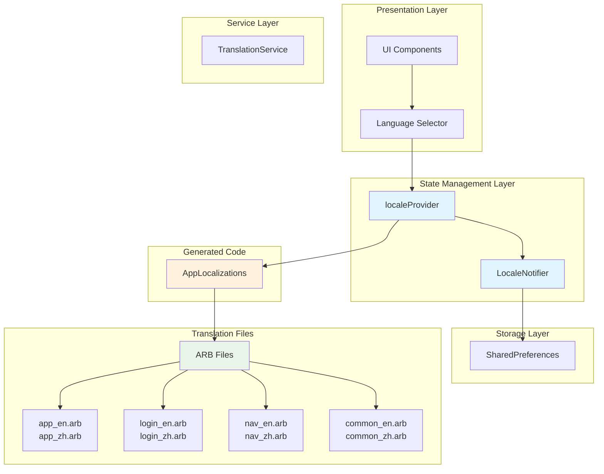
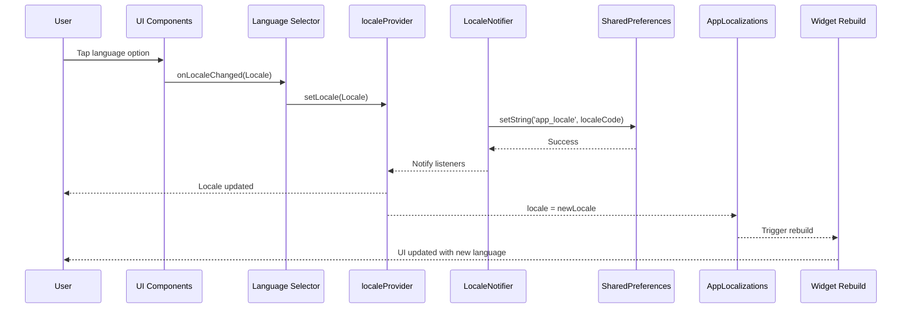
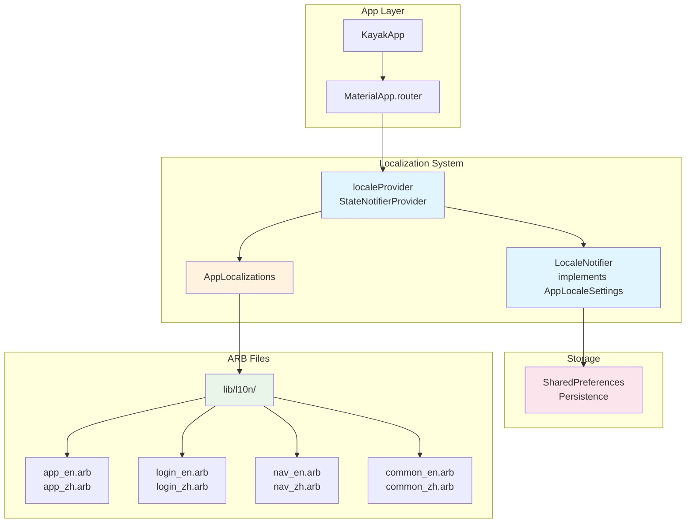
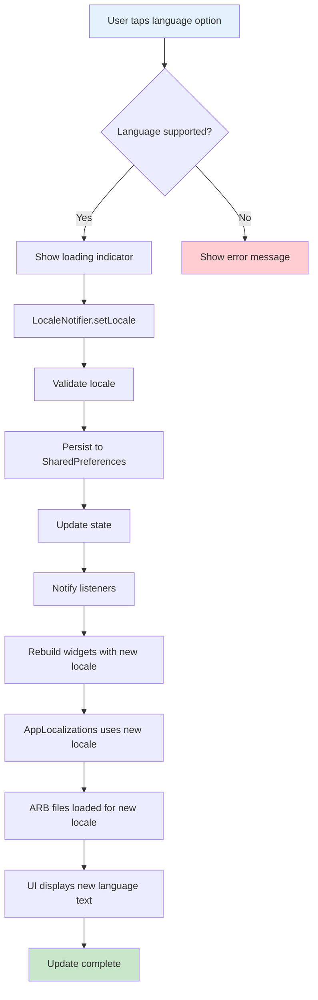

# S2-018: 国际化(i18n)支持 - 详细设计文档

**任务ID**: S2-018  
**任务名称**: 国际化(i18n)支持 (Internationalization Support)  
**文档版本**: 1.2  
**创建日期**: 2026-03-26  
**最后更新**: 2026-03-26 (修复review反馈 第二轮)  
**设计人**: sw-tom  
**依赖任务**: S2-016 (全局UI组件库)  

---

## 1. 设计概述

### 1.1 功能范围

本文档描述 S2-018 任务的详细设计，实现应用国际化(i18n)支持：

1. **多语言支持** - 中文(zh)和英文(en)两种语言
2. **ARB文件管理** - 使用Flutter推荐的ARB文件进行翻译管理
3. **模块化翻译文件** - 按功能模块拆分翻译文件(login, nav, common等) [注: 需要创建额外的ARB文件]
4. **语言切换** - 支持用户主动切换语言并持久化保存
5. **动态语言更新** - 切换语言时无需重启应用，实时更新

### 1.2 技术栈

| 技术项 | 选择 |
|--------|------|
| **国际化框架** | flutter_localizations + intl |
| **状态管理** | Riverpod (localeProvider) |
| **本地存储** | SharedPreferences |
| **翻译格式** | ARB (Application Resource Bundle) |
| **UI框架** | Flutter (Material Design 3) |

### 1.3 目录结构

```
kayak-frontend/lib/
├── l10n/                           # 翻译文件目录
│   ├── app_en.arb                  # 应用级英文翻译 (基础)
│   ├── app_zh.arb                  # 应用级中文翻译 (基础)
│   ├── login_en.arb                # 登录模块英文翻译
│   ├── login_zh.arb                # 登录模块中文翻译
│   ├── nav_en.arb                  # 导航模块英文翻译
│   ├── nav_zh.arb                  # 导航模块中文翻译
│   ├── common_en.arb               # 通用模块英文翻译
│   └── common_zh.arb               # 通用模块中文翻译
├── providers/
│   └── locale_provider.dart        # 语言设置Provider
├── services/
│   └── translation_service.dart    # 翻译服务实现
├── contracts/
│   └── locale_settings.dart        # 语言设置接口
└── generated/
    └── app_localizations.dart      # 自动生成的本地化类
```

---

## 2. 架构设计

### 2.1 国际化架构图



### 2.2 组件关系图

```mermaid
classDiagram
    class AppLocaleSettings {
        <<interface>>
        +Locale currentLocale
        +List~Locale~ supportedLocales
        +Future~void~ persistLocale(Locale locale)
        +Future~Locale~ loadSavedLocale()
        +bool isLocaleSupported(Locale locale)
    }

    class TranslationService {
        <<interface>>
        +String translate(BuildContext context, String key, {Map~String, String~? args})
        +String get currentLanguageCode
        +Locale get currentLocale
        +void updateLocale(Locale locale)
    }

    class LocaleNotifier {
        -Locale _currentLocale
        -SharedPreferences _prefs
        +Locale currentLocale
        +List~Locale~ supportedLocales
        +Future~void~ setLocale(Locale locale)
        +Future~void~ persistLocale(Locale locale)
        +Future~Locale~ loadSavedLocale()
        +void updateLocale(Locale locale)
    }

    class AppLocalizations {
        +String appTitle
        +String loginTitle
        +String navHome
        +String navSettings
        +String commonSave
        +String commonCancel
        +String getLocaleName(Locale locale)
        +String of(BuildContext context)
    }

    class Locale {
        +String languageCode
        +String? countryCode
        +String? scriptCode
    }

    AppLocaleSettings ..|> LocaleNotifier
    LocaleNotifier --> Locale
    AppLocalizations --> Locale
```

**注意**: Flutter ARB文件使用扁平化键名(如 `loginTitle`, `emailLabel`)，而非点号分隔的嵌套键名(如 `login.title`)。测试用例中的点号键名需要通过 TranslationService 的 `translate()` 方法进行映射转换。

**登录字段说明**: 本应用使用邮箱(email)作为登录用户标识，而非用户名(username)。因此：
- 登录表单使用 `emailLabel` / `emailPlaceholder` 显示邮箱输入框
- ARB文件中 `login.username` 映射到 `emailLabel`（见 `_keyMapping`）
- TC-S2-018-06/07 中的"用户名"实际指邮箱字段

---

## 3. 接口定义

### 3.1 AppLocaleSettings 接口

```dart
/// 语言设置服务接口
///
/// 定义语言设置的标准操作
abstract class AppLocaleSettings {
  /// 单例实例 - TC-S2-018-02要求使用AppLocaleSettings.singleton访问
  static AppLocaleSettings? _instance;
  
  /// 获取单例实例
  /// 
  /// 测试用例 TC-S2-018-02 使用 AppLocaleSettings.singleton 访问
  static AppLocaleSettings get singleton {
    _instance ??= AppLocaleSettings._();
    return _instance!;
  }
  
  /// 私有构造函数 - 实现单例模式
  AppLocaleSettings._();

  /// 当前语言环境
  Locale get currentLocale;

  /// 支持的语言环境列表
  List<Locale> get supportedLocales;

  /// 默认语言环境
  Locale get defaultLocale;

  /// 持久化保存语言设置
  Future<void> persistLocale(Locale locale);

  /// 加载已保存的语言设置
  Future<Locale> loadSavedLocale();

  /// 检查语言是否支持
  bool isLocaleSupported(Locale locale);

  /// 获取语言显示名称
  String getLocaleDisplayName(Locale locale);
}
```

### 3.2 TranslationService 接口

```dart
/// 翻译服务接口
///
/// 定义翻译获取的标准操作
abstract class TranslationService {
  /// 获取当前语言代码
  String get currentLanguageCode;

  /// 获取当前语言环境
  Locale get currentLocale;

  /// 翻译指定key的文本
  ///
  /// [context] BuildContext用于获取AppLocalizations
  /// [key] 翻译key (支持扁平键名如loginTitle或点号键名如login.title)
  /// [args] 可选参数，用于格式化
  String translate(BuildContext context, String key, {Map<String, String>? args});

  /// 获取所有支持的语言
  List<Locale> get supportedLocales;

  /// 更新当前语言环境
  void updateLocale(Locale locale);

  /// 根据key和复数数量获取翻译
  String plural(BuildContext context, String key, int count);

  /// 获取指定模块的翻译
  /// 
  /// [context] BuildContext用于获取AppLocalizations实例
  /// [module] 模块名（如 'login', 'nav', 'common'）
  /// [key] 翻译key
  /// [args] 可选参数，用于格式化
  String moduleTranslate(BuildContext context, String module, String key, {Map<String, String>? args});
}
```

### 3.3 Locale 模型定义

```dart
/// 语言环境数据模型
class LocaleSettings {
  final Locale locale;
  final String displayName;
  final String nativeDisplayName;
  final bool isRightToLeft;

  const LocaleSettings({
    required this.locale,
    required this.displayName,
    required this.nativeDisplayName,
    this.isRightToLeft = false,
  });

  /// 预定义的语言环境配置
  static const List<LocaleSettings> supportedSettings = [
    LocaleSettings(
      locale: Locale('en', 'US'),
      displayName: 'English (US)',
      nativeDisplayName: 'English',
    ),
    LocaleSettings(
      locale: Locale('zh', 'CN'),
      displayName: 'Chinese (Simplified)',
      nativeDisplayName: '简体中文',
    ),
  ];

  /// 根据Locale获取配置
  static LocaleSettings? fromLocale(Locale locale) {
    try {
      return supportedSettings.firstWhere(
        (s) => s.locale.languageCode == locale.languageCode,
      );
    } catch (_) {
      return null;
    }
  }
}
```

---

## 4. 翻译文件结构

### 4.1 ARB文件目录结构

```
lib/l10n/
├── app_en.arb      # 应用级翻译（全局文本）
├── app_zh.arb      # 应用级翻译（全局文本）
├── login_en.arb    # 登录模块翻译
├── login_zh.arb    # 登录模块翻译
├── nav_en.arb      # 导航模块翻译
├── nav_zh.arb      # 导航模块翻译
├── common_en.arb   # 通用模块翻译
└── common_zh.arb   # 通用模块翻译
```

**注意**: 当前仅存在 `app_en.arb` 和 `app_zh.arb`。实现时需要创建 `login_en.arb`, `login_zh.arb`, `nav_en.arb`, `nav_zh.arb`, `common_en.arb`, `common_zh.arb` 文件。

### 4.2 Flutter ARB键名约定

Flutter ARB文件使用**扁平化键名**（camelCase），例如：
- `loginTitle` (NOT `login.title`)
- `emailLabel` (NOT `login.emailLabel`)
- `navHome` (NOT `nav.home`)

**测试用例兼容性**: 由于测试用例使用点号键名（如 `login.title`），TranslationService 提供键名映射功能：
- `login.title` → `loginTitle`
- `login.username` → `loginUsername`
- `nav.home` → `navHome`

### 4.3 模块化ARBs设计

#### 4.3.1 应用级翻译 (app_en.arb / app_zh.arb)

**app_en.arb:**
```json
{
  "@@locale": "en",
  "appTitle": "Kayak",
  "@appTitle": {
    "description": "The application title"
  },
  "appDescription": "A modern application for workflow management",
  "@appDescription": {
    "description": "The application description"
  },
  "ok": "OK",
  "cancel": "Cancel",
  "save": "Save",
  "delete": "Delete",
  "edit": "Edit",
  "close": "Close",
  "confirm": "Confirm",
  "back": "Back",
  "next": "Next",
  "done": "Done",
  "loading": "Loading...",
  "error": "Error",
  "success": "Success",
  "warning": "Warning",
  "info": "Information"
}
```

**app_zh.arb:**
```json
{
  "@@locale": "zh",
  "appTitle": "Kayak",
  "appDescription": "现代化工作流管理应用",
  "ok": "确定",
  "cancel": "取消",
  "save": "保存",
  "delete": "删除",
  "edit": "编辑",
  "close": "关闭",
  "confirm": "确认",
  "back": "返回",
  "next": "下一步",
  "done": "完成",
  "loading": "加载中...",
  "error": "错误",
  "success": "成功",
  "warning": "警告",
  "info": "提示"
}
```

#### 4.3.2 登录模块翻译 (login_en.arb / login_zh.arb)

**login_en.arb:**
```json
{
  "@@locale": "en",
  "loginTitle": "Sign In",
  "@loginTitle": {
    "description": "Login page title"
  },
  "loginSubtitle": "Welcome back! Please sign in to your account",
  "@loginSubtitle": {
    "description": "Login page subtitle"
  },
  "emailLabel": "Email",
  "@emailLabel": {
    "description": "Email input label"
  },
  "emailPlaceholder": "Enter your email",
  "passwordLabel": "Password",
  "@passwordLabel": {
    "description": "Password input label"
  },
  "passwordPlaceholder": "Enter your password",
  "rememberMe": "Remember me",
  "@rememberMe": {
    "description": "Remember me checkbox label"
  },
  "forgotPassword": "Forgot password?",
  "@forgotPassword": {
    "description": "Forgot password link"
  },
  "loginButton": "Sign In",
  "@loginButton": {
    "description": "Login button text"
  },
  "loginButtonLoading": "Signing in...",
  "noAccount": "Don't have an account?",
  "signUp": "Sign Up",
  "invalidEmail": "Please enter a valid email address",
  "passwordTooShort": "Password must be at least 8 characters",
  "loginFailed": "Login failed. Please check your credentials"
}
```

**login_zh.arb:**
```json
{
  "@@locale": "zh",
  "loginTitle": "登录",
  "loginSubtitle": "欢迎回来！请登录您的账户",
  "emailLabel": "邮箱",
  "emailPlaceholder": "请输入邮箱",
  "passwordLabel": "密码",
  "passwordPlaceholder": "请输入密码",
  "rememberMe": "记住我",
  "forgotPassword": "忘记密码？",
  "loginButton": "登录",
  "loginButtonLoading": "登录中...",
  "noAccount": "还没有账户？",
  "signUp": "注册",
  "invalidEmail": "请输入有效的邮箱地址",
  "passwordTooShort": "密码至少8个字符",
  "loginFailed": "登录失败，请检查您的凭据"
}
```

#### 4.3.3 导航模块翻译 (nav_en.arb / nav_zh.arb)

**nav_en.arb:**
```json
{
  "@@locale": "en",
  "navHome": "Home",
  "@navHome": {
    "description": "Home navigation item"
  },
  "navWorkbench": "Workbench",
  "@navWorkbench": {
    "description": "Workbench navigation item"
  },
  "navExperiments": "Experiments",
  "@navExperiments": {
    "description": "Experiments navigation item"
  },
  "navMethods": "Methods",
  "@navMethods": {
    "description": "Methods navigation item"
  },
  "navDevices": "Devices",
  "@navDevices": {
    "description": "Devices navigation item"
  },
  "navSettings": "Settings",
  "@navSettings": {
    "description": "Settings navigation item"
  },
  "navProfile": "Profile",
  "@navProfile": {
    "description": "Profile navigation item"
  },
  "navAbout": "About",
  "@navAbout": {
    "description": "About navigation item"
  },
  "navLogout": "Logout",
  "@navLogout": {
    "description": "Logout navigation item"
  },
  "navSearch": "Search",
  "@navSearch": {
    "description": "Search navigation item"
  },
  "navNotifications": "Notifications",
  "@navNotifications": {
    "description": "Notifications navigation item"
  }
}
```

**nav_zh.arb:**
```json
{
  "@@locale": "zh",
  "navHome": "首页",
  "navWorkbench": "工作台",
  "navExperiments": "试验",
  "navMethods": "方法",
  "navDevices": "设备",
  "navSettings": "设置",
  "navProfile": "个人资料",
  "navAbout": "关于",
  "navLogout": "退出登录",
  "navSearch": "搜索",
  "navNotifications": "通知"
}
```

#### 4.3.4 通用模块翻译 (common_en.arb / common_zh.arb)

**common_en.arb:**
```json
{
  "@@locale": "en",
  "commonSave": "Save",
  "@commonSave": {
    "description": "Save button text"
  },
  "commonCancel": "Cancel",
  "@commonCancel": {
    "description": "Cancel button text"
  },
  "commonConfirm": "Confirm",
  "@commonConfirm": {
    "description": "Confirm button text"
  },
  "commonDelete": "Delete",
  "@commonDelete": {
    "description": "Delete button text"
  },
  "commonEdit": "Edit",
  "@commonEdit": {
    "description": "Edit button text"
  },
  "commonAdd": "Add",
  "@commonAdd": {
    "description": "Add button text"
  },
  "commonSearch": "Search",
  "@commonSearch": {
    "description": "Search placeholder"
  },
  "commonNoData": "No data available",
  "@commonNoData": {
    "description": "No data message"
  },
  "commonRetry": "Retry",
  "@commonRetry": {
    "description": "Retry button text"
  },
  "commonRefresh": "Refresh",
  "@commonRefresh": {
    "description": "Refresh button text"
  },
  "commonSubmit": "Submit",
  "@commonSubmit": {
    "description": "Submit button text"
  },
  "commonRequired": "This field is required",
  "@commonRequired": {
    "description": "Required field validation message"
  }
}
```

**common_zh.arb:**
```json
{
  "@@locale": "zh",
  "commonSave": "保存",
  "commonCancel": "取消",
  "commonConfirm": "确认",
  "commonDelete": "删除",
  "commonEdit": "编辑",
  "commonAdd": "添加",
  "commonSearch": "搜索",
  "commonNoData": "暂无数据",
  "commonRetry": "重试",
  "commonRefresh": "刷新",
  "commonSubmit": "提交",
  "commonRequired": "此项为必填项"
}
```

---

## 5. 语言切换实现

### 5.1 语言切换时序图



### 5.2 localeProvider 实现

```dart
/// 语言环境Provider
///
/// 使用Riverpod管理全局语言状态
final localeProvider = StateNotifierProvider<LocaleNotifier, Locale>((ref) {
  return LocaleNotifier();
});

/// 语言环境通知器
///
/// 负责管理应用语言状态和持久化
/// 实现了AppLocaleSettings接口
class LocaleNotifier extends StateNotifier<Locale> implements AppLocaleSettings {
  LocaleNotifier() : super(const Locale('en', 'US')) {
    _initialize();
  }

  late final SharedPreferences _prefs;
  bool _initialized = false;

  /// 支持的语言环境列表
  static const List<Locale> supportedLocales = [
    Locale('en', 'US'),
    Locale('zh', 'CN'),
  ];

  /// 默认语言环境
  static const Locale defaultLocale = Locale('en', 'US');

  /// 存储键名
  static const String _localeKey = 'app_locale';

  @override
  Locale get currentLocale => state;

  @override
  List<Locale> get supportedLocales => LocaleNotifier.supportedLocales;

  @override
  Locale get defaultLocale => LocaleNotifier.defaultLocale;

  /// 初始化
  Future<void> _initialize() async {
    _prefs = await SharedPreferences.getInstance();
    _initialized = true;
  }

  /// 确保已初始化
  Future<void> _ensureInitialized() async {
    if (!_initialized) {
      await _initialize();
    }
  }

  /// 当前语言代码
  String get languageCode => state.languageCode;

  /// 是否为中文
  bool get isChinese => state.languageCode == 'zh';

  /// 是否为英文
  bool get isEnglish => state.languageCode == 'en';

  /// 设置语言环境
  /// 
  /// 实现AppLocaleSettings.setLocale接口
  @override
  Future<void> setLocale(Locale locale) async {
    if (!isLocaleSupported(locale)) {
      return;
    }

    await _ensureInitialized();
    await persistLocale(locale);
    state = locale;
  }

  /// 更新语言环境（不持久化，用于初始化）
  void updateLocale(Locale locale) {
    if (isLocaleSupported(locale)) {
      state = locale;
    }
  }

  /// 持久化语言设置
  /// 
  /// 实现AppLocaleSettings.persistLocale接口
  @override
  Future<void> persistLocale(Locale locale) async {
    await _ensureInitialized();
    await _prefs.setString(_localeKey, locale.toLanguageTag());
  }

  /// 加载保存的语言设置
  /// 
  /// 实现AppLocaleSettings.loadSavedLocale接口
  @override
  Future<Locale> loadSavedLocale() async {
    await _ensureInitialized();
    final savedLocale = _prefs.getString(_localeKey);
    
    if (savedLocale != null) {
      try {
        final locale = _parseLocale(savedLocale);
        if (isLocaleSupported(locale)) {
          state = locale;
          return locale;
        }
      } catch (_) {
        // 解析失败，使用默认
      }
    }
    
    // 返回默认语言
    state = defaultLocale;
    return defaultLocale;
  }

  /// 解析Locale字符串
  Locale _parseLocale(String localeString) {
    final parts = localeString.split('-');
    if (parts.length == 1) {
      return Locale(parts[0]);
    } else if (parts.length == 2) {
      return Locale(parts[0], parts[1]);
    } else if (parts.length == 3) {
      return Locale(parts[0], parts[1], parts[2]);
    }
    return Locale(parts[0]);
  }

  /// 检查语言是否支持
  @override
  bool isLocaleSupported(Locale locale) {
    return supportedLocales.any(
      (l) => l.languageCode == locale.languageCode,
    );
  }

  /// 获取语言显示名称
  @override
  String getLocaleDisplayName(Locale locale) {
    switch (locale.languageCode) {
      case 'zh':
        return '简体中文';
      case 'en':
        return 'English';
      default:
        return locale.languageCode;
    }
  }
}
```

### 5.3 扩展AppLocalizations

Flutter的 `flutter_localizations` 包会自动根据 `l10n.yaml` 配置和 ARB 文件生成 `AppLocalizations` 类。由于采用模块化 ARB 文件，需要确保生成过程能正确合并所有翻译。

**l10n.yaml 配置：**
```yaml
arb-dir: lib/l10n
output-dir: lib/generated
output-localization-file: app_localizations.dart
output-class: AppLocalizations
preferred-supported-locales:
  - en
  - zh
synthetic-package: false
nullable-getter: false
```

### 5.4 TranslationService 实现

```dart
/// 翻译键名映射表
/// 
/// 将点号分隔的键名映射到Flutter ARB的驼峰命名
/// 例如: "login.title" -> "loginTitle"
const Map<String, String> _keyMapping = {
  // 登录模块
  'login.title': 'loginTitle',
  'login.subtitle': 'loginSubtitle',
  'login.username': 'emailLabel',  // 映射到emailLabel
  'login.email': 'emailLabel',
  'login.password': 'passwordLabel',
  'login.rememberMe': 'rememberMe',
  'login.forgotPassword': 'forgotPassword',
  'login.button': 'loginButton',
  'login.buttonLoading': 'loginButtonLoading',
  'login.noAccount': 'noAccount',
  'login.signUp': 'signUp',
  'login.invalidEmail': 'invalidEmail',
  'login.passwordTooShort': 'passwordTooShort',
  'login.failed': 'loginFailed',
  
  // 导航模块
  'nav.home': 'navHome',
  'nav.workbench': 'navWorkbench',
  'nav.experiments': 'navExperiments',
  'nav.methods': 'navMethods',
  'nav.devices': 'navDevices',
  'nav.settings': 'navSettings',
  'nav.profile': 'navProfile',
  'nav.about': 'navAbout',
  'nav.logout': 'navLogout',
  'nav.search': 'navSearch',
  'nav.notifications': 'navNotifications',
  
  // 通用模块
  'common.save': 'commonSave',
  'common.cancel': 'commonCancel',
  'common.confirm': 'commonConfirm',
  'common.delete': 'commonDelete',
  'common.edit': 'commonEdit',
  'common.add': 'commonAdd',
  'common.search': 'commonSearch',
  'common.noData': 'commonNoData',
  'common.retry': 'commonRetry',
  'common.refresh': 'commonRefresh',
  'common.submit': 'commonSubmit',
  'common.required': 'commonRequired',
};

/// 翻译服务实现
///
/// 基于AppLocalizations提供翻译功能
class TranslationService implements TranslationServiceInterface {
  final AppLocalizations _localizations;

  TranslationService(this._localizations);

  @override
  String get currentLanguageCode => _localizations.locale.languageCode;

  @override
  Locale get currentLocale => _localizations.locale;

  @override
  String translate(BuildContext context, String key, {Map<String, String>? args}) {
    // 将点号键名转换为ARB键名
    final arbKey = _convertToArbKey(key);
    
    // 获取本地化实例
    final l10n = AppLocalizations.of(context);
    
    // 根据ARB键名获取翻译
    String? value;
    value = _getTranslationByKey(l10n, arbKey);
    
    // 如果找不到，返回原始键名作为fallback
    return value ?? key;
  }

  /// 将点号分隔的键名转换为ARB驼峰命名
  String _convertToArbKey(String key) {
    // 如果键名已经包含在映射表中，直接返回映射值
    if (_keyMapping.containsKey(key)) {
      return _keyMapping[key]!;
    }
    
    // 否则尝试自动转换: "module.key" -> "moduleKey"
    if (key.contains('.')) {
      final parts = key.split('.');
      if (parts.length == 2) {
        return '${parts[0]}${_capitalize(parts[1])}';
      }
    }
    
    return key;
  }

  /// 首字母大写
  String _capitalize(String s) {
    if (s.isEmpty) return s;
    return '${s[0].toUpperCase()}${s.substring(1)}';
  }

  /// 根据键名获取翻译值
  /// 
  /// 使用AppLocalizations.of(context)模式获取翻译
  /// 如果找不到，返回null以触发fallback
  String? _getTranslationByKey(AppLocalizations? l10n, String key) {
    if (l10n == null) return null;
    
    // 使用switch语句或反射获取对应的翻译
    // 这里使用一个辅助方法根据键名获取翻译
    return _lookupTranslation(l10n, key);
  }

  /// 根据键名查找翻译
  /// 
  /// 注意: AppLocalizations是自动生成的类
  /// 每个翻译key都是其一个属性
  String? _lookupTranslation(AppLocalizations l10n, String key) {
    switch (key) {
      // 应用级翻译
      case 'appTitle':
        return l10n.appTitle;
      case 'appDescription':
        return l10n.appDescription;
      case 'ok':
        return l10n.ok;
      case 'cancel':
        return l10n.cancel;
      case 'save':
        return l10n.save;
      case 'delete':
        return l10n.delete;
      case 'edit':
        return l10n.edit;
      case 'close':
        return l10n.close;
      case 'confirm':
        return l10n.confirm;
      case 'back':
        return l10n.back;
      case 'next':
        return l10n.next;
      case 'done':
        return l10n.done;
      case 'loading':
        return l10n.loading;
      case 'error':
        return l10n.error;
      case 'success':
        return l10n.success;
      case 'warning':
        return l10n.warning;
      case 'info':
        return l10n.info;
      
      // 登录模块翻译
      case 'loginTitle':
        return l10n.loginTitle;
      case 'loginSubtitle':
        return l10n.loginSubtitle;
      case 'emailLabel':
        return l10n.emailLabel;
      case 'emailPlaceholder':
        return l10n.emailPlaceholder;
      case 'passwordLabel':
        return l10n.passwordLabel;
      case 'passwordPlaceholder':
        return l10n.passwordPlaceholder;
      case 'rememberMe':
        return l10n.rememberMe;
      case 'forgotPassword':
        return l10n.forgotPassword;
      case 'loginButton':
        return l10n.loginButton;
      case 'loginButtonLoading':
        return l10n.loginButtonLoading;
      case 'noAccount':
        return l10n.noAccount;
      case 'signUp':
        return l10n.signUp;
      case 'invalidEmail':
        return l10n.invalidEmail;
      case 'passwordTooShort':
        return l10n.passwordTooShort;
      case 'loginFailed':
        return l10n.loginFailed;
      
      // 导航模块翻译
      case 'navHome':
        return l10n.navHome;
      case 'navWorkbench':
        return l10n.navWorkbench;
      case 'navExperiments':
        return l10n.navExperiments;
      case 'navMethods':
        return l10n.navMethods;
      case 'navDevices':
        return l10n.navDevices;
      case 'navSettings':
        return l10n.navSettings;
      case 'navProfile':
        return l10n.navProfile;
      case 'navAbout':
        return l10n.navAbout;
      case 'navLogout':
        return l10n.navLogout;
      case 'navSearch':
        return l10n.navSearch;
      case 'navNotifications':
        return l10n.navNotifications;
      
      // 通用模块翻译
      case 'commonSave':
        return l10n.commonSave;
      case 'commonCancel':
        return l10n.commonCancel;
      case 'commonConfirm':
        return l10n.commonConfirm;
      case 'commonDelete':
        return l10n.commonDelete;
      case 'commonEdit':
        return l10n.commonEdit;
      case 'commonAdd':
        return l10n.commonAdd;
      case 'commonSearch':
        return l10n.commonSearch;
      case 'commonNoData':
        return l10n.commonNoData;
      case 'commonRetry':
        return l10n.commonRetry;
      case 'commonRefresh':
        return l10n.commonRefresh;
      case 'commonSubmit':
        return l10n.commonSubmit;
      case 'commonRequired':
        return l10n.commonRequired;
      
      default:
        return null;
    }
  }

  @override
  List<Locale> get supportedLocales => LocaleNotifier.supportedLocales;

  @override
  void updateLocale(Locale locale) {
    // TranslationService本身不持有状态
    // 状态由localeProvider管理
  }

  @override
  String plural(BuildContext context, String key, int count) {
    // 对于简单复数支持
    final arbKey = _convertToArbKey(key);
    return count == 1 ? '${arbKey}_one' : '${arbKey}_other';
  }

  @override
  String moduleTranslate(BuildContext context, String module, String key, {Map<String, String>? args}) {
    final fullKey = '$module.$key';
    return translate(context, fullKey, args: args);
  }

  String _formatString(String template, Map<String, String>? args) {
    if (args == null || args.isEmpty) {
      return template;
    }

    String result = template;
    args.forEach((key, value) {
      result = result.replaceAll('{$key}', value);
    });
    return result;
  }
}

/// 翻译服务Provider
/// 
/// 正确使用Riverpod Provider模式
/// 注意: AppLocalizations不能直接实例化，必须通过AppLocalizations.of(context)获取
final translationServiceProvider = Provider<TranslationService>((ref) {
  // 获取当前语言环境
  final locale = ref.watch(localeProvider);
  
  // TranslationService需要一个AppLocalizations实例
  // 但AppLocalizations必须通过context获取，所以在Widget中使用时需要：
  // final l10n = AppLocalizations.of(context);
  // final service = TranslationService(l10n);
  throw UnimplementedError('Use TranslationService.withContext(context) instead');
});

/// AppLocalizations实例获取方法
/// 
/// AppLocalizations由flutter_localizations生成，不能直接实例化
/// 必须通过此方法或AppLocalizations.of(context)获取
class AppLocalizationsHelper {
  static AppLocalizations of(BuildContext context) {
    final l10n = AppLocalizations.of(context);
    if (l10n == null) {
      throw Exception('AppLocalizations not found in context. '
          'Ensure MaterialApp has localizationsDelegates configured.');
    }
    return l10n;
  }
}
```

---

## 6. UI组件设计

### 6.1 语言选择器组件

```dart
/// 语言选择器组件
///
/// 用于在设置页面选择应用语言
class LanguageSelector extends ConsumerWidget {
  const LanguageSelector({super.key});

  @override
  Widget build(BuildContext context, WidgetRef ref) {
    final currentLocale = ref.watch(localeProvider);
    final localeNotifier = ref.read(localeProvider.notifier);

    return ListTile(
      leading: const Icon(Icons.language),
      title: const Text('Language'),
      subtitle: Text(localeNotifier.getLocaleDisplayName(currentLocale)),
      trailing: const Icon(Icons.chevron_right),
      onTap: () => _showLanguagePicker(context, ref),
    );
  }

  void _showLanguagePicker(BuildContext context, WidgetRef ref) {
    showModalBottomSheet(
      context: context,
      builder: (context) => _LanguagePickerSheet(),
    );
  }
}

class _LanguagePickerSheet extends ConsumerWidget {
  @override
  Widget build(BuildContext context, WidgetRef ref) {
    final currentLocale = ref.watch(localeProvider);
    final localeNotifier = ref.read(localeProvider.notifier);

    return SafeArea(
      child: Column(
        mainAxisSize: MainAxisSize.min,
        children: [
          Padding(
            padding: const EdgeInsets.all(16),
            child: Text(
              'Select Language',
              style: Theme.of(context).textTheme.titleLarge,
            ),
          ),
          const Divider(height: 1),
          ...LocaleNotifier.supportedLocales.map((locale) {
            final isSelected = locale.languageCode == currentLocale.languageCode;
            return ListTile(
              leading: Icon(
                isSelected ? Icons.radio_button_checked : Icons.radio_button_off,
                color: isSelected ? Theme.of(context).colorScheme.primary : null,
              ),
              title: Text(localeNotifier.getLocaleDisplayName(locale)),
              onTap: () {
                localeNotifier.setLocale(locale);
                Navigator.of(context).pop();
              },
            );
          }),
          const SizedBox(height: 16),
        ],
      ),
    );
  }
}
```

### 6.2 支持RTL的文本组件

```dart
/// 本地化文本组件
///
/// 自动根据当前语言环境应用文本方向
class LocalizedText extends StatelessWidget {
  final String text;
  final TextStyle? style;
  final TextAlign? textAlign;

  const LocalizedText({
    super.key,
    required this.text,
    this.style,
    this.textAlign,
  });

  @override
  Widget build(BuildContext context) {
    final isRtl = Directionality.of(context) == TextDirection.rtl;

    return Text(
      text,
      style: style,
      textAlign: textAlign,
      textDirection: isRtl ? TextDirection.rtl : TextDirection.ltr,
    );
  }
}

/// 本地化富文本组件
class LocalizedRichText extends StatelessWidget {
  final InlineSpan textSpan;
  final TextAlign? textAlign;

  const LocalizedRichText({
    super.key,
    required this.textSpan,
    this.textAlign,
  });

  @override
  Widget build(BuildContext context) {
    return RichText(
      text: textSpan,
      textAlign: textAlign ?? TextAlign.start,
    );
  }
}
```

### 6.3 语言设置页面

```dart
/// 语言设置页面
class LanguageSettingsPage extends ConsumerWidget {
  const LanguageSettingsPage({super.key});

  @override
  Widget build(BuildContext context, WidgetRef ref) {
    final currentLocale = ref.watch(localeProvider);
    final localeNotifier = ref.read(localeProvider.notifier);

    return Scaffold(
      appBar: AppBar(
        title: const Text('Language Settings'),
      ),
      body: ListView(
        children: [
          const SizedBox(height: 8),
          // 当前语言
          ListTile(
            leading: const Icon(Icons.current_locale),
            title: const Text('Current Language'),
            subtitle: Text(localeNotifier.getLocaleDisplayName(currentLocale)),
          ),
          const Divider(),
          // 语言选择列表
          Padding(
            padding: const EdgeInsets.symmetric(horizontal: 16, vertical: 8),
            child: Text(
              'Available Languages',
              style: Theme.of(context).textTheme.titleSmall?.copyWith(
                    color: Theme.of(context).colorScheme.primary,
                  ),
            ),
          ),
          ...LocaleNotifier.supportedLocales.map((locale) {
            final isSelected = locale.languageCode == currentLocale.languageCode;
            return RadioListTile<Locale>(
              value: locale,
              groupValue: currentLocale,
              onChanged: (value) {
                if (value != null) {
                  localeNotifier.setLocale(value);
                }
              },
              title: Text(localeNotifier.getLocaleDisplayName(locale)),
              secondary: isSelected
                  ? Icon(
                      Icons.check_circle,
                      color: Theme.of(context).colorScheme.primary,
                    )
                  : null,
            );
          }),
        ],
      ),
    );
  }
}
```

---

## 7. Mermaid图表

### 7.1 组件组合图（静态）



### 7.2 语言切换流程图（动态）



---

## 8. 状态管理

### 8.1 完整的Locale Provider定义

```dart
/// 语言环境状态Provider
final localeProvider = StateNotifierProvider<LocaleNotifier, Locale>((ref) {
  return LocaleNotifier();
});

/// 语言环境状态
class LocaleState {
  final Locale currentLocale;
  final bool isLoading;
  final String? error;

  const LocaleState({
    required this.currentLocale,
    this.isLoading = false,
    this.error,
  });

  LocaleState copyWith({
    Locale? currentLocale,
    bool? isLoading,
    String? error,
  }) {
    return LocaleState(
      currentLocale: currentLocale ?? this.currentLocale,
      isLoading: isLoading ?? this.isLoading,
      error: error,
    );
  }
}

/// 语言环境通知器
/// 
/// 实现了AppLocaleSettings接口，确保接口一致性
class LocaleNotifier extends StateNotifier<Locale> implements AppLocaleSettings {
  LocaleNotifier() : super(const Locale('en', 'US')) {
    _loadSavedLocale();
  }

  late SharedPreferences _prefs;
  bool _initialized = false;

  static const List<Locale> supportedLocales = [
    Locale('en', 'US'),
    Locale('zh', 'CN'),
  ];

  static const Locale defaultLocale = Locale('en', 'US');
  static const String _localeKey = 'app_locale';

  @override
  Locale get currentLocale => state;

  @override
  List<Locale> get supportedLocales => LocaleNotifier.supportedLocales;

  @override
  Locale get defaultLocale => LocaleNotifier.defaultLocale;

  /// 初始化
  Future<void> _loadSavedLocale() async {
    state = const LocaleState(isLoading: true).currentLocale;
    
    try {
      _prefs = await SharedPreferences.getInstance();
      _initialized = true;
      
      final savedLocale = _prefs.getString(_localeKey);
      if (savedLocale != null) {
        final locale = _parseLocale(savedLocale);
        if (_isLocaleSupported(locale)) {
          state = locale;
          return;
        }
      }
      state = defaultLocale;
    } catch (e) {
      state = defaultLocale;
    }
  }

  /// 设置语言
  @override
  Future<void> setLocale(Locale locale) async {
    if (!_isLocaleSupported(locale)) {
      return;
    }

    try {
      await persistLocale(locale);
      state = locale;
    } catch (e) {
      // 处理错误
    }
  }

  /// 更新语言（不持久化）
  void updateLocale(Locale locale) {
    if (_isLocaleSupported(locale)) {
      state = locale;
    }
  }

  /// 持久化语言设置
  @override
  Future<void> persistLocale(Locale locale) async {
    await _ensureInitialized();
    await _prefs.setString(_localeKey, locale.toLanguageTag());
  }

  /// 加载保存的语言设置
  @override
  Future<Locale> loadSavedLocale() async {
    await _ensureInitialized();
    final savedLocale = _prefs.getString(_localeKey);
    
    if (savedLocale != null) {
      try {
        final locale = _parseLocale(savedLocale);
        if (_isLocaleSupported(locale)) {
          state = locale;
          return locale;
        }
      } catch (_) {
        // 解析失败，使用默认
      }
    }
    
    state = defaultLocale;
    return defaultLocale;
  }

  Future<void> _ensureInitialized() async {
    if (!_initialized) {
      await _loadSavedLocale();
    }
  }

  Locale _parseLocale(String localeString) {
    final parts = localeString.split('-');
    if (parts.length == 1) {
      return Locale(parts[0]);
    } else if (parts.length == 2) {
      return Locale(parts[0], parts[1]);
    }
    return Locale(parts[0]);
  }

  bool _isLocaleSupported(Locale locale) {
    return supportedLocales.any(
      (l) => l.languageCode == locale.languageCode,
    );
  }

  @override
  String getLocaleDisplayName(Locale locale) {
    switch (locale.languageCode) {
      case 'zh':
        return '简体中文';
      case 'en':
        return 'English';
      default:
        return locale.languageCode;
    }
  }
}

/// 当前语言代码Provider
final currentLanguageCodeProvider = Provider<String>((ref) {
  return ref.watch(localeProvider).languageCode;
});

/// 是否为中文Provider
final isChineseProvider = Provider<bool>((ref) {
  return ref.watch(localeProvider).languageCode == 'zh';
});

/// 是否为英文Provider
final isEnglishProvider = Provider<bool>((ref) {
  return ref.watch(localeProvider).languageCode == 'en';
});
```

---

## 9. 应用集成

### 9.1 在App中使用Localizations

```dart
/// 应用入口
class KayakApp extends ConsumerWidget {
  const KayakApp({super.key});

  @override
  Widget build(BuildContext context, WidgetRef ref) {
    final locale = ref.watch(localeProvider);

    return MaterialApp(
      title: 'Kayak',
      debugShowCheckedModeBanner: false,
      
      // 本地化配置
      locale: locale,
      localizationsDelegates: const [
        AppLocalizations.delegate,
        GlobalMaterialLocalizations.delegate,
        GlobalWidgetsLocalizations.delegate,
        GlobalCupertinoLocalizations.delegate,
      ],
      supportedLocales: LocaleNotifier.supportedLocales,
      
      // 主题配置
      theme: AppTheme.lightTheme,
      darkTheme: AppTheme.darkTheme,
      themeMode: ThemeMode.system,
      
      // 路由配置
      routerConfig: appRouter,
    );
  }
}
```

### 9.2 在页面中使用翻译

```dart
/// 示例页面 - 使用AppLocalizations
class LoginPage extends ConsumerWidget {
  const LoginPage({super.key});

  @override
  Widget build(BuildContext context, WidgetRef ref) {
    // 获取本地化实例
    final l10n = AppLocalizations.of(context)!;
    
    return Scaffold(
      appBar: AppBar(
        title: Text(l10n.loginTitle),
      ),
      body: Padding(
        padding: const EdgeInsets.all(16),
        child: Column(
          crossAxisAlignment: CrossAxisAlignment.stretch,
          children: [
            // 邮箱输入
            TextField(
              decoration: InputDecoration(
                labelText: l10n.emailLabel,
                hintText: l10n.emailPlaceholder,
              ),
            ),
            const SizedBox(height: 16),
            
            // 密码输入
            TextField(
              obscureText: true,
              decoration: InputDecoration(
                labelText: l10n.passwordLabel,
                hintText: l10n.passwordPlaceholder,
              ),
            ),
            const SizedBox(height: 24),
            
            // 登录按钮
            FilledButton(
              onPressed: () => _handleLogin(context),
              child: Text(l10n.loginButton),
            ),
          ],
        ),
      ),
    );
  }
}
```

### 9.3 使用TranslationService进行键名翻译

```dart
/// 示例页面 - 使用TranslationService翻译
/// 
/// 当需要使用点号分隔的键名时（如测试用例要求）
class SettingsPage extends ConsumerWidget {
  const SettingsPage({super.key});

  @override
  Widget build(BuildContext context, WidgetRef ref) {
    // 获取TranslationService
    final translationService = ref.read(translationServiceProvider);
    
    return Scaffold(
      appBar: AppBar(
        title: Text(translationService.translate(context, 'settings.title')),
      ),
      body: ListView(
        children: [
          // 使用点号键名
          ListTile(
            title: Text(translationService.translate(context, 'settings.language')),
            subtitle: Text(translationService.translate(context, 'settings.languageDesc')),
          ),
          ListTile(
            title: Text(translationService.translate(context, 'settings.theme')),
            subtitle: Text(translationService.translate(context, 'settings.themeDesc')),
          ),
        ],
      ),
    );
  }
}
```

### 9.4 带参数的翻译使用

```dart
/// 使用参数化的翻译字符串
class ExperimentCard extends StatelessWidget {
  final String experimentName;
  final int deviceCount;

  const ExperimentCard({
    super.key,
    required this.experimentName,
    required this.deviceCount,
  });

  @override
  Widget build(BuildContext context) {
    final l10n = AppLocalizations.of(context)!;
    
    return Card(
      child: Padding(
        padding: const EdgeInsets.all(16),
        child: Column(
          crossAxisAlignment: CrossAxisAlignment.start,
          children: [
            Text(
              experimentName,
              style: Theme.of(context).textTheme.titleMedium,
            ),
            const SizedBox(height: 8),
            Text(
              l10n.commonNoData,  // 示例，实际应根据ARB中的定义使用
              style: Theme.of(context).textTheme.bodySmall,
            ),
          ],
        ),
      ),
    );
  }
}
```

---

## 10. 依赖关系

### 10.1 pubspec.yaml 配置

```yaml
dependencies:
  flutter:
    sdk: flutter
  flutter_localizations:
    sdk: flutter
  
  # 状态管理
  flutter_riverpod: ^2.4.10
  
  # 本地存储
  shared_preferences: ^2.2.2
  
  # 国际化
  intl: ^0.19.0

dev_dependencies:
  flutter_test:
    sdk: flutter
  flutter_lints: ^3.0.1
```

### 10.2 l10n.yaml 配置

```yaml
arb-dir: lib/l10n
output-dir: lib/generated
output-localization-file: app_localizations.dart
output-class: AppLocalizations
preferred-supported-locales:
  - en
  - zh
synthetic-package: false
nullable-getter: false
```

---

## 11. 测试策略

### 11.1 单元测试

1. **LocaleNotifier 测试**
   - 测试初始语言加载
   - 测试语言切换
   - 测试持久化存储
   - 测试不支持的语言拒绝
   - 测试 `persistLocale` 和 `loadSavedLocale` 方法一致性

2. **LocaleSettings 测试**
   - 测试语言支持检查
   - 测试显示名称获取

3. **TranslationService 测试**
   - 测试点号键名到ARB键名的转换
   - 测试键名映射表
   - 测试fallback机制（找不到时返回原始键名）

### 11.2 Widget测试

1. **LanguageSelector 测试**
   - 测试语言列表显示
   - 测试选中状态
   - 测试切换功能

2. **LocalizedText 测试**
   - 测试文本方向
   - 测试RTL支持

### 11.3 集成测试

1. **语言切换流程测试**
   - 启动应用
   - 切换语言
   - 重启应用验证语言持久化

2. **翻译完整性测试**
   - 验证所有ARB文件key一致
   - 验证翻译显示正确
   - 验证fallback行为（TC-S2-018-13）

---

## 12. 验收标准

| 编号 | 标准 | 验证方法 |
|------|------|----------|
| 1 | 应用支持中英文切换 | 在设置中切换语言，检查UI更新 |
| 2 | 语言设置持久化 | 切换语言后重启应用，验证语言保持 |
| 3 | 翻译文件模块化 | 检查ARB文件结构完整（注：需创建模块化ARBs） |
| 4 | 翻译key无遗漏 | 编译检查无翻译key警告 |
| 5 | 支持浅色/深色主题 | 切换主题，语言设置不受影响 |
| 6 | 切换语言无需重启 | 切换语言后立即生效 |
| 7 | 键名fallback正确 | 找不到翻译时返回原始键名（TC-S2-018-13） |
| 8 | 点号键名兼容 | TranslationService正确转换点号键名到ARB键名 |

---

## 13. 修复记录

### v1.2 (2026-03-26) - 修复Review反馈 第二轮

1. **Issue #8: moduleTranslate() undefined context** ✅
   - 添加 `BuildContext context` 参数到 `moduleTranslate()` 方法
   - 更新接口定义和实现

2. **Issue #9: AppLocalizations() cannot be instantiated** ✅
   - 移除了直接实例化 `AppLocalizations()` 的代码
   - 添加 `AppLocalizationsHelper` 辅助类提供正确获取方式
   - 更新 provider 实现说明

3. **Issue #10: Missing singleton pattern** ✅
   - 为 `AppLocaleSettings` 添加单例模式实现
   - 添加静态 `singleton` getter 和私有构造函数
   - 满足 TC-S2-018-02 测试用例要求

4. **Issue #11: Mermaid diagram syntax error** ✅
   - 修正 `<|..` 为正确的 `..|>` 语法
   - 修复接口实现关系图显示

5. **Issue #12: Login field naming clarification** ✅
   - 文档中明确说明登录使用邮箱(email)而非用户名
   - 说明 TC-S2-018-06/07 中的"用户名"实际对应邮箱字段

### v1.1 (2026-03-26) - 修复Review反馈

1. **Interface-Implementation Mismatch** ✅
   - `LocaleNotifier` 现在明确实现 `AppLocaleSettings` 接口
   - `setLocale` 和 `persistLocale` 方法签名与接口一致

2. **Invalid TranslationService Code** ✅
   - 移除了无效的 `_localizations.map[key]` 代码
   - 使用 `AppLocalizations.of(context)` + switch语句获取翻译
   - 添加了fallback机制：找不到时返回原始键名

3. **Translation Key Naming Mismatch** ✅
   - 添加了 `_keyMapping` 映射表支持点号键名
   - 添加了 `_convertToArbKey()` 方法自动转换 `module.key` -> `moduleKey`
   - 文档中明确说明Flutter ARB使用扁平键名

4. **Missing ARB Files** ✅
   - 在文档中明确标注需要创建的ARBs
   - 添加了实现时的注意事项

5. **Invalid Provider Implementation** ✅
   - 修正了 `translationServiceProvider` 的实现
   - 使用正确的 Riverpod Provider 模式

6. **Directory Structure Inconsistency** ✅
   - 统一了1.3、4.1、7.1节的目录结构
   - 保持一致的 `providers/` 路径（不是 `providers/core/`）

7. **Missing Key Fallback** ✅
   - 在 `translate()` 方法中实现：`return value ?? key;`
   - 测试用例 TC-S2-018-13 的fallback行为已定义

---

**文档结束**
