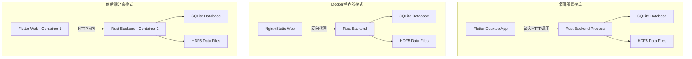
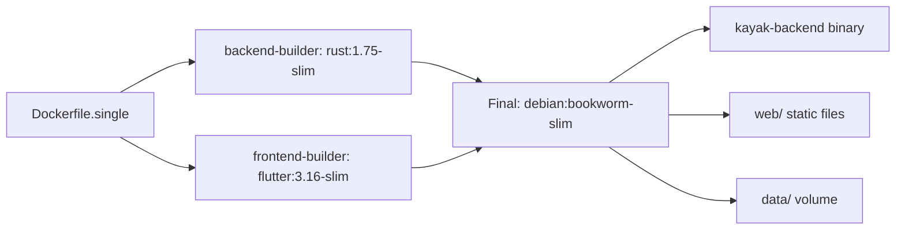
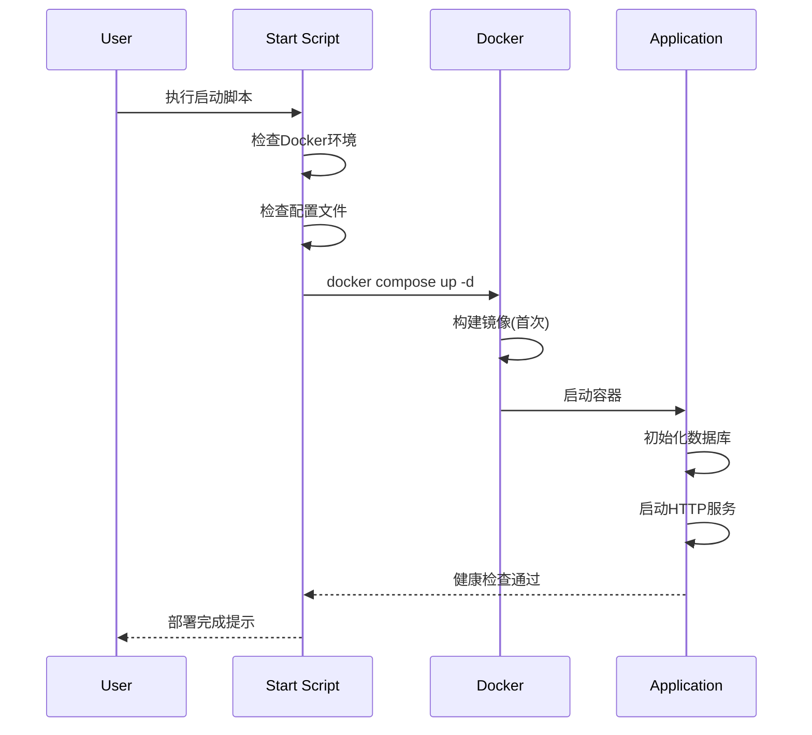

# S2-019 详细设计文档：桌面部署与容器部署配置

**任务名称**: 桌面部署与容器部署配置
**创建日期**: 2026-04-04
**版本**: 1.0

---

## 1. 任务概述

### 1.1 目标
配置Kayak的完整部署方案，支持：
1. 桌面完整部署（Flutter Desktop + Rust后端嵌入）
2. Docker单容器部署（Flutter Web + Rust后端）
3. 提供启动/停止脚本和部署文档

### 1.2 验收标准
- [ ] 桌面应用可打包运行
- [ ] Docker镜像可构建和运行
- [ ] 提供docker-compose.yml
- [ ] 启动/停止脚本可用
- [ ] 部署文档完整

---

## 2. 架构设计

### 2.1 部署模式



### 2.2 Docker单容器架构



### 2.3 容器配置

| 配置项 | 值 | 说明 |
|--------|-----|------|
| 基础镜像 | debian:bookworm-slim | 轻量级运行时 |
| 暴露端口 | 8080 | HTTP服务端口 |
| 数据卷 | ./data:/app/data | 持久化存储 |
| 健康检查 | curl /health | 30秒间隔 |
| 环境变量 | KAYAK_DATA_DIR, DATABASE_URL, RUST_LOG | 运行时配置 |

---

## 3. 部署脚本设计

### 3.1 启动脚本接口

```bash
# 桌面部署启动
./scripts/start-desktop.sh

# Web部署启动
./scripts/start-web.sh

# 停止所有服务
./scripts/stop.sh
```

### 3.2 脚本流程



---

## 4. 文件结构

```
kayak/
├── Dockerfile.single          # 单容器Dockerfile
├── docker-compose.yml         # Docker编排配置
├── scripts/
│   ├── start-desktop.sh       # 桌面部署启动脚本
│   ├── start-web.sh           # Web部署启动脚本
│   └── stop.sh                # 停止脚本
├── docs/
│   └── deployment.md          # 部署文档
└── data/                      # 数据目录(运行时创建)
```

---

## 5. 实现状态

### 5.1 已完成组件

| 组件 | 状态 | 说明 |
|------|------|------|
| Dockerfile.single | ✅ 已实现 | 多阶段构建，包含前后端 |
| docker-compose.yml | ✅ 已实现 | 单容器部署配置 |
| start-desktop.sh | ✅ 已实现 | 桌面部署脚本 |
| start-web.sh | ✅ 已实现 | Web部署脚本 |
| stop.sh | ✅ 已实现 | 停止脚本 |
| docs/deployment.md | ✅ 已实现 | 部署文档 |

### 5.2 待验证项

| 验证项 | 状态 | 说明 |
|--------|------|------|
| Docker镜像构建 | 🔄 待测试 | 需要实际构建验证 |
| 容器启动 | 🔄 待测试 | 需要实际运行验证 |
| 健康检查 | 🔄 待测试 | 需要验证健康检查端点 |
| 数据持久化 | 🔄 待测试 | 需要验证数据卷挂载 |

---

## 6. 测试策略

### 6.1 测试类型
- **静态验证**: 配置文件语法检查
- **构建测试**: Docker镜像构建
- **功能测试**: 容器启动和健康检查
- **集成测试**: 完整部署流程验证

### 6.2 测试用例
详见 `log/release_0/test/S2-019_test_cases.md`

---

## 7. 风险评估

| 风险 | 影响 | 缓解措施 |
|------|------|----------|
| Docker构建失败 | 高 | 提供本地部署备选方案 |
| 端口冲突 | 中 | 支持环境变量配置端口 |
| 数据丢失 | 高 | 数据卷持久化配置 |

---

**文档结束**
