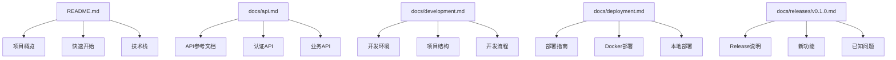
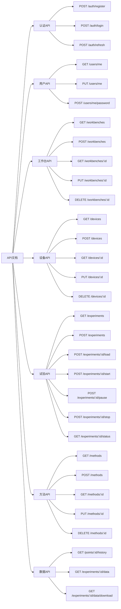

# S2-020 详细设计文档：项目文档与Release 0交付

**任务名称**: 项目文档与Release 0交付
**创建日期**: 2026-04-04
**版本**: 1.0

---

## 1. 任务概述

### 1.1 目标
编写完整的项目文档，包括：
1. API文档（OpenAPI规范）
2. 用户手册（安装、基础功能使用）
3. 开发文档（项目结构、开发指南）
4. Release 0发布说明

### 1.2 验收标准
- [ ] API文档完整准确
- [ ] 用户手册包含截图
- [ ] 项目可编译无错误
- [ ] 所有测试通过

---

## 2. 文档架构



---

## 3. 文档清单

### 3.1 核心文档

| 文档 | 路径 | 状态 | 说明 |
|------|------|------|------|
| README.md | /README.md | ✅ 已存在 | 项目主文档 |
| API文档 | /docs/api.md | ✅ 已存在 | OpenAPI格式API参考 |
| 开发指南 | /docs/development.md | ✅ 已存在 | 开发者指南 |
| 部署文档 | /docs/deployment.md | ✅ 已存在 | 部署配置说明 |
| Release说明 | /docs/releases/v0.1.0.md | ✅ 已存在 | Release 0发布说明 |

### 3.2 架构文档

| 文档 | 路径 | 状态 | 说明 |
|------|------|------|------|
| 架构设计 | /arch.md | ✅ 已存在 | 系统架构设计 |
| 产品需求 | /log/release_0/prd.md | ✅ 已存在 | 产品需求文档 |
| 任务分解 | /log/release_0/tasks.md | ✅ 已存在 | 任务分解文档 |
| 范围外任务 | /log/release_0/remain.md | ✅ 已存在 | 后续Release任务 |

---

## 4. API文档结构

### 4.1 API分类



### 4.2 响应格式

所有API遵循统一响应格式：

```json
{
  "code": 200,
  "message": "success",
  "data": { ... }
}
```

错误响应：

```json
{
  "code": 400,
  "message": "错误描述",
  "data": null
}
```

---

## 5. 实现状态

### 5.1 已完成文档

| 文档 | 行数 | 状态 | 说明 |
|------|------|------|------|
| docs/api.md | 612 | ✅ | OpenAPI格式，覆盖所有API |
| docs/development.md | 303 | ✅ | 开发环境、流程、规范 |
| docs/releases/v0.1.0.md | 163 | ✅ | Release 0发布说明 |
| docs/deployment.md | 250 | ✅ | 部署配置和指南 |
| README.md | - | ✅ | 项目主文档 |
| arch.md | - | ✅ | 架构设计文档 |

### 5.2 待验证项

| 验证项 | 状态 | 说明 |
|--------|------|------|
| 后端编译 | 🔄 待测试 | 需要执行cargo build |
| 后端测试 | 🔄 待测试 | 需要执行cargo test |
| 前端分析 | 🔄 待测试 | 需要执行flutter analyze |
| 前端测试 | 🔄 待测试 | 需要执行flutter test |
| 文档一致性 | 🔄 待测试 | 需要验证文档与代码一致 |

---

## 6. 测试策略

### 6.1 测试类型
- **文档测试**: 验证文档存在性和完整性
- **构建测试**: 验证前后端编译
- **测试执行**: 验证所有测试通过
- **一致性验证**: 验证文档与代码一致

### 6.2 测试用例
详见 `log/release_0/test/S2-020_test_cases.md`

---

## 7. 风险评估

| 风险 | 影响 | 缓解措施 |
|------|------|----------|
| 文档与代码不一致 | 中 | 定期同步更新 |
| 编译失败 | 高 | 修复编译错误 |
| 测试失败 | 高 | 修复测试问题 |

---

**文档结束**
