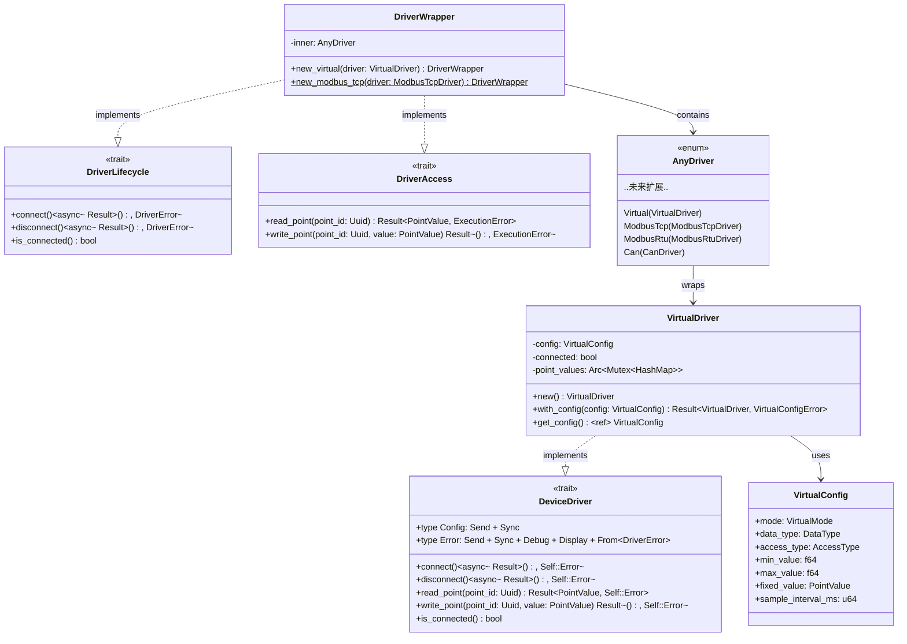
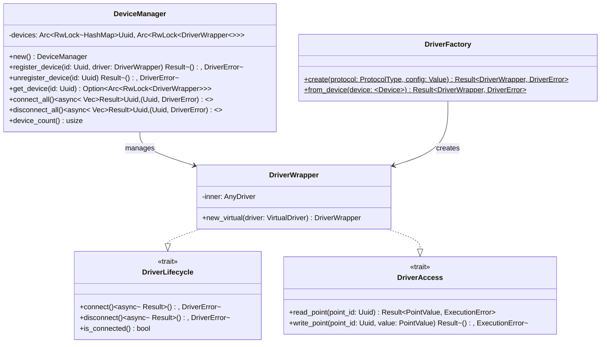
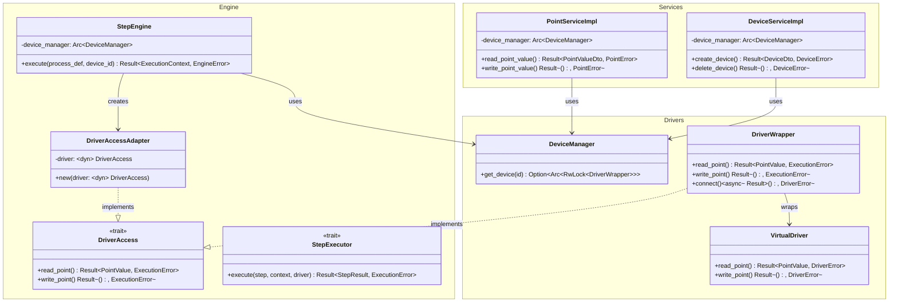
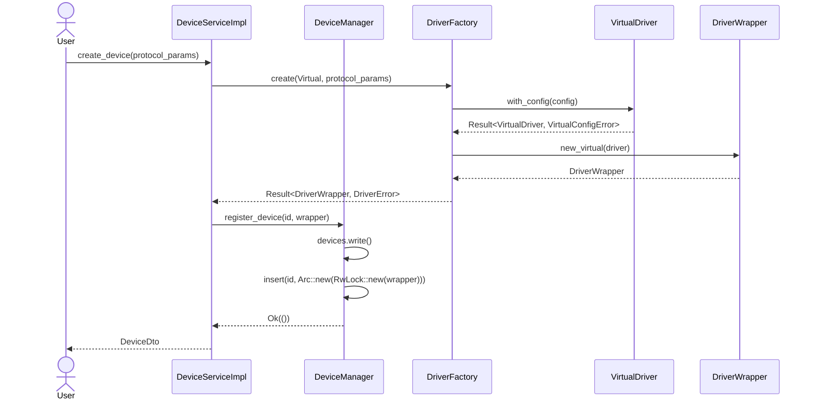
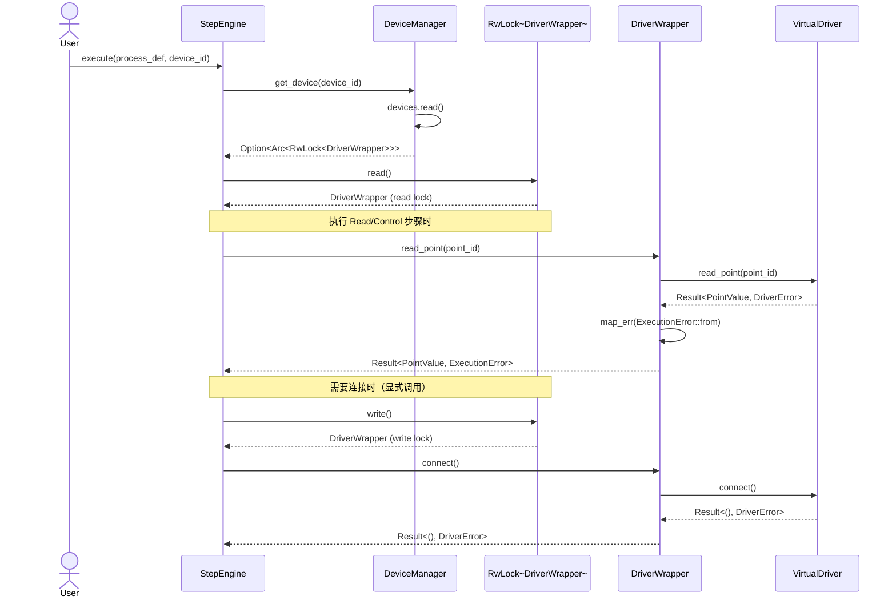
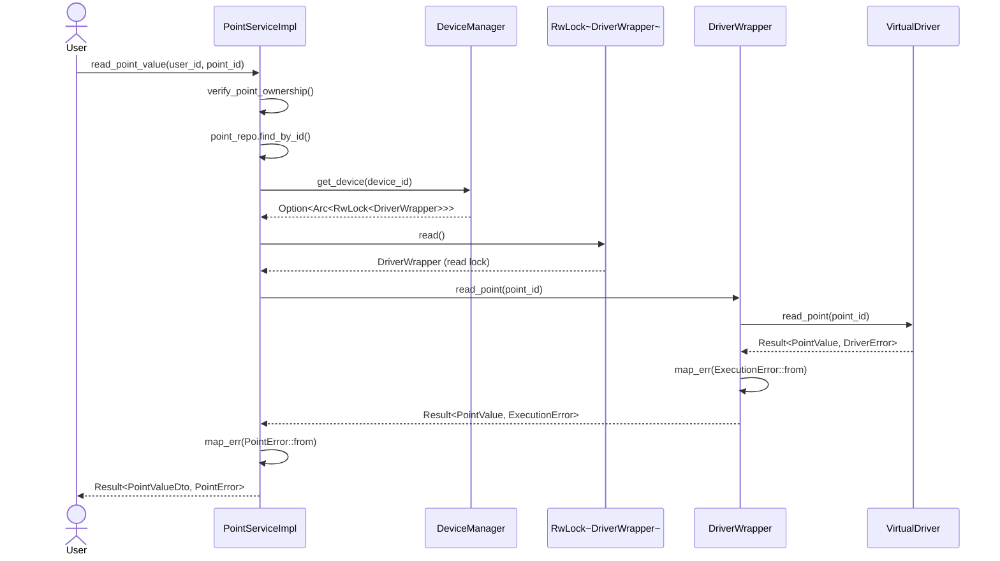
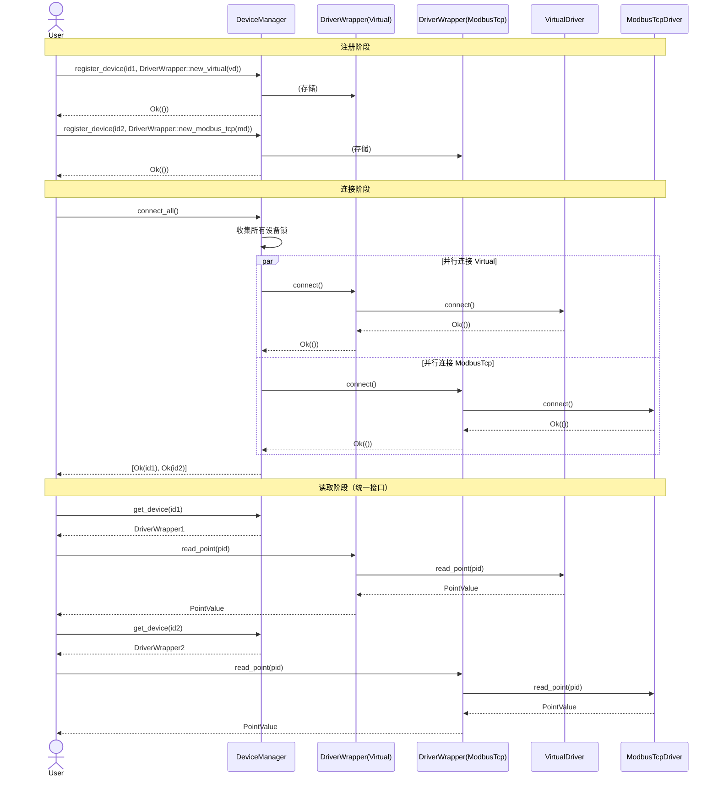

# DeviceManager 泛型消除重构 - 详细设计文档

## 文档信息

| 项目 | 内容 |
|------|------|
| 任务编号 | R1-S1-001 |
| 作者 | sw-jerry (Software Architect) |
| 日期 | 2026-05-02 |
| 状态 | 设计完成 |
| 版本 | 1.0 |
| 依赖文档 | [架构设计](R1-S1-001_architecture.md), [测试用例](R1-S1-001_test_cases.md) |

---

## 目录

1. [概述](#1-概述)
2. [接口定义](#2-接口定义)
3. [UML 类图](#3-uml-类图)
4. [序列图](#4-序列图)
5. [文件结构](#5-文件结构)
6. [关键算法/逻辑](#6-关键算法逻辑)
7. [与现有代码的集成点](#7-与现有代码的集成点)
8. [迁移步骤](#8-迁移步骤)
9. [测试覆盖分析](#9-测试覆盖分析)
10. [风险与缓解](#10-风险与缓解)

---

## 1. 概述

### 1.1 设计目标

本文档基于 [R1-S1-001 架构设计](R1-S1-001_architecture.md) 和 [26个测试用例](R1-S1-001_test_cases.md)，提供 DeviceManager 泛型消除重构的详细设计。核心目标：

1. **消除 DeviceManager 的硬编码泛型参数**：当前 `DeviceManager` 绑定到 `dyn DeviceDriver<Config = VirtualConfig, Error = DriverError>`，无法支持异构驱动
2. **保持类型安全**：使用 Rust enum 实现零成本类型擦除，避免 `Box<dyn Any>` 的运行时 downcast
3. **向后兼容**：`VirtualDriver` 继续正常工作，`DeviceDriver` trait 保持不变
4. **最小化改动范围**：仅修改 `drivers/` 和 `engine/adapter.rs`，不触碰引擎核心逻辑

### 1.2 当前代码问题分析

**当前 DeviceManager（问题代码）**：
```rust
pub struct DeviceManager {
    devices: Arc<RwLock<HashMap<
        Uuid,
        Arc<RwLock<dyn DeviceDriver<Config = VirtualConfig, Error = DriverError>>>
    >>>,
}
```

**问题**：
- 存储类型硬编码 `VirtualConfig` 和 `DriverError`
- 无法存储 `ModbusTcpDriver`（其 `Config = ModbusTcpConfig`, `Error = ModbusError`）
- `register_device` 的泛型约束 `<D: DeviceDriver<Config = VirtualConfig, Error = DriverError>>` 拒绝非 VirtualDriver 类型

**当前 DriverAccessAdapter（问题代码）**：
```rust
pub struct DriverAccessAdapter<'a> {
    driver: &'a dyn DeviceDriver<Config = VirtualConfig, Error = DriverError>,
}
```

**问题**：
- 同样硬编码到 VirtualConfig/DriverError
- StepEngine 通过此适配器访问设备，导致整个引擎绑定到 VirtualDriver

### 1.3 设计约束

| 约束 | 说明 | 来源 |
|------|------|------|
| `DeviceDriver` trait 不变 | 保持关联类型设计，不破坏现有驱动实现 | 向后兼容要求 |
| `DriverAccess` trait 不变 | 引擎依赖此 trait，不修改签名 | 引擎稳定性 |
| `VirtualDriver` 零改动 | 现有虚拟驱动代码不修改 | TC-020 |
| `PointService` 最小改动 | 仅适配 DeviceManager API 变化 | TC-021 |
| `StepEngine` 最小改动 | 仅适配 DeviceManager API 变化 | TC-022 |
| 编译无警告 | 所有 clippy 警告必须消除 | 代码质量标准 |

---

## 2. 接口定义

### 2.1 DriverLifecycle trait（新增）

**文件**：`src/drivers/lifecycle.rs`

```rust
//! 设备驱动生命周期管理 trait
//!
//! 定义连接、断开等需要可变访问的操作。
//! 从 DeviceDriver trait 中分离出来，使 DeviceManager 可以统一存储和管理
//! 异构驱动类型的生命周期。

use async_trait::async_trait;
use super::error::DriverError;

/// 设备驱动生命周期管理 trait
///
/// 所有设备驱动（通过 DriverWrapper）必须实现此 trait，提供标准化的连接管理接口。
/// 与 `DeviceDriver` trait 的区别：
/// - `DeviceDriver`：由具体驱动实现（VirtualDriver, ModbusTcpDriver 等）
/// - `DriverLifecycle`：由 `DriverWrapper` 实现，对外提供统一接口
#[async_trait]
pub trait DriverLifecycle: Send + Sync {
    /// 连接到设备
    ///
    /// # Returns
    /// * `Ok(())` - 连接成功
    /// * `Err(DriverError::AlreadyConnected)` - 设备已连接（可选）
    async fn connect(&mut self) -> Result<(), DriverError>;

    /// 断开设备连接
    ///
    /// # Returns
    /// * `Ok(())` - 断开成功
    /// * `Err(DriverError::NotConnected)` - 设备未连接（可选）
    async fn disconnect(&mut self) -> Result<(), DriverError>;

    /// 检查设备是否已连接
    fn is_connected(&self) -> bool;
}
```

**设计决策**：
- 使用 `async_trait` 保持与 `DeviceDriver` 一致的风格
- 错误类型统一为 `DriverError`，消除关联类型差异
- `Send + Sync` 保证线程安全

---

### 2.2 DriverAccess trait（引擎已有，保持不变）

**文件**：`src/engine/executor.rs`（已有，无需修改）

```rust
/// 设备访问抽象 trait
pub trait DriverAccess: Send + Sync {
    fn read_point(&self, point_id: Uuid) -> Result<PointValue, ExecutionError>;
    fn write_point(&self, point_id: Uuid, value: PointValue) -> Result<(), ExecutionError>;
}
```

**说明**：此 trait 已在引擎中定义，本次重构不修改其签名。`DriverWrapper` 将实现此 trait。

---

### 2.3 AnyDriver enum（新增）

**文件**：`src/drivers/wrapper.rs`

```rust
/// 统一驱动类型枚举
///
/// 所有设备驱动的类型擦除包装。使用 enum 而非 trait object 的原因：
/// 1. 编译时分发，零运行时开销
/// 2. 类型安全，无需 downcast
/// 3. Rust 惯用的 ADT 实现方式
///
/// # 扩展新驱动类型
/// 当添加新驱动（如 ModbusTcpDriver）时：
/// 1. 在此 enum 添加新变体
/// 2. 在 DriverWrapper 的 match 分支中添加对应处理
/// 3. 添加 DriverWrapper::new_xxx 构造函数
pub enum AnyDriver {
    Virtual(VirtualDriver),
    // 未来扩展：
    // ModbusTcp(ModbusTcpDriver),
    // ModbusRtu(ModbusRtuDriver),
    // Can(CanDriver),
    // Visa(VisaDriver),
    // Mqtt(MqttDriver),
}
```

**内存布局**：
```
AnyDriver 大小 = max(变体大小) + tag(1字节)
              = size_of::<VirtualDriver>() + 1  // 目前只有 VirtualDriver
```

**设计决策**：
- 目前仅 `Virtual` 变体，未来驱动添加时扩展
- enum 由最大变体决定大小，若某驱动很大，考虑 `Box<LargeDriver>`

---

### 2.4 DriverWrapper 结构体和方法（新增）

**文件**：`src/drivers/wrapper.rs`

```rust
use async_trait::async_trait;
use uuid::Uuid;

use super::core::PointValue;
use super::error::DriverError;
use super::lifecycle::DriverLifecycle;
use super::r#virtual::VirtualDriver;
use crate::engine::executor::DriverAccess;
use crate::engine::types::ExecutionError;

/// 驱动包装器
///
/// 为 AnyDriver 提供统一接口，实现 DriverAccess 和 DriverLifecycle。
/// 这是 DeviceManager 实际存储的类型。
///
/// # 线程安全
/// DriverWrapper 本身不是 Send/Sync（包含非 Send/Sync 的驱动类型），
/// 但 DeviceManager 使用 `Arc<RwLock<DriverWrapper>>` 保证线程安全。
pub struct DriverWrapper {
    inner: AnyDriver,
}

impl DriverWrapper {
    /// 使用 VirtualDriver 创建 DriverWrapper
    pub fn new_virtual(driver: VirtualDriver) -> Self {
        Self {
            inner: AnyDriver::Virtual(driver),
        }
    }

    // 未来扩展：
    // pub fn new_modbus_tcp(driver: ModbusTcpDriver) -> Self { ... }
    // pub fn new_modbus_rtu(driver: ModbusRtuDriver) -> Self { ... }
    // pub fn new_can(driver: CanDriver) -> Self { ... }
}

#[async_trait]
impl DriverLifecycle for DriverWrapper {
    async fn connect(&mut self) -> Result<(), DriverError> {
        match &mut self.inner {
            AnyDriver::Virtual(d) => {
                <VirtualDriver as DeviceDriver>::connect(d).await
                    .map_err(|e: DriverError| e)
            }
        }
    }

    async fn disconnect(&mut self) -> Result<(), DriverError> {
        match &mut self.inner {
            AnyDriver::Virtual(d) => {
                <VirtualDriver as DeviceDriver>::disconnect(d).await
                    .map_err(|e: DriverError| e)
            }
        }
    }

    fn is_connected(&self) -> bool {
        match &self.inner {
            AnyDriver::Virtual(d) => d.is_connected(),
        }
    }
}

impl DriverAccess for DriverWrapper {
    fn read_point(&self, point_id: Uuid) -> Result<PointValue, ExecutionError> {
        match &self.inner {
            AnyDriver::Virtual(d) => {
                d.read_point(point_id)
                    .map_err(|e: DriverError| ExecutionError::from(e))
            }
        }
    }

    fn write_point(&self, point_id: Uuid, value: PointValue) -> Result<(), ExecutionError> {
        match &self.inner {
            AnyDriver::Virtual(d) => {
                d.write_point(point_id, value)
                    .map_err(|e: DriverError| ExecutionError::from(e))
            }
        }
    }
}
```

**关键设计点**：
- `DriverWrapper` 不实现 `DeviceDriver` trait（避免关联类型问题）
- 而是分别实现 `DriverLifecycle` 和 `DriverAccess` 两个对象安全的 trait
- `match` 分发是编译时确定的，零运行时开销
- 错误转换：VirtualDriver 的 `DriverError` → `DriverError`（identity）或 `ExecutionError`

---

### 2.5 DeviceManager 重构后的方法签名

**文件**：`src/drivers/manager.rs`

```rust
//! 设备管理器实现

use futures::future::join_all;
use std::collections::HashMap;
use std::sync::{Arc, RwLock};
use uuid::Uuid;

use super::error::DriverError;
use super::lifecycle::DriverLifecycle;
use super::wrapper::DriverWrapper;

/// 设备管理器
///
/// 负责管理所有设备的生命周期，支持异构驱动类型的统一存储和管理。
///
/// # 存储设计说明
///
/// 设备存储使用 `Arc<RwLock<DriverWrapper>>`：
/// - `DriverWrapper` 内部使用 `AnyDriver` enum 存储具体驱动
/// - `RwLock` 提供可变访问（connect/disconnect 需要 &mut self）
/// - `Arc` 支持多线程共享
///
/// # 异构支持
///
/// 同一 DeviceManager 可同时管理 VirtualDriver、ModbusTcpDriver 等多种驱动类型，
/// 所有驱动通过统一的 `DriverWrapper` 接口访问。
pub struct DeviceManager {
    devices: Arc<RwLock<HashMap<Uuid, Arc<RwLock<DriverWrapper>>>>>,
}

#[allow(clippy::await_holding_lock)]
impl DeviceManager {
    /// 创建新的设备管理器
    pub fn new() -> Self {
        Self {
            devices: Arc::new(RwLock::new(HashMap::new())),
        }
    }

    /// 注册设备
    ///
    /// # Arguments
    /// * `id` - 设备唯一标识
    /// * `driver` - DriverWrapper 实例（包装了具体驱动）
    ///
    /// # Returns
    /// * `Ok(())` - 注册成功
    /// * `Err(DriverError::ConfigError)` - 设备 ID 已存在
    pub fn register_device(
        &self,
        id: Uuid,
        driver: DriverWrapper,
    ) -> Result<(), DriverError> {
        let mut devices = self.devices.write().unwrap();
        if devices.contains_key(&id) {
            return Err(DriverError::ConfigError(format!(
                "Device {} already registered",
                id
            )));
        }
        devices.insert(id, Arc::new(RwLock::new(driver)));
        Ok(())
    }

    /// 注销设备
    ///
    /// # Returns
    /// * `Ok(())` - 注销成功
    /// * `Err(DriverError::ConfigError)` - 设备不存在
    pub fn unregister_device(&self, id: Uuid) -> Result<(), DriverError> {
        let mut devices = self.devices.write().unwrap();
        if devices.remove(&id).is_none() {
            return Err(DriverError::ConfigError(format!(
                "Device {} not found",
                id
            )));
        }
        Ok(())
    }

    /// 获取设备驱动
    ///
    /// 返回 `Arc<RwLock<DriverWrapper>>`，调用者可通过锁获取可变访问权限。
    /// DriverWrapper 实现了 DriverAccess 和 DriverLifecycle，可直接使用。
    ///
    /// # Example
    /// ```ignore
    /// if let Some(driver_lock) = manager.get_device(id) {
    ///     let mut driver = driver_lock.write().unwrap();
    ///     driver.connect().await?;
    /// }
    /// ```
    pub fn get_device(&self, id: Uuid) -> Option<Arc<RwLock<DriverWrapper>>> {
        let devices = self.devices.read().unwrap();
        devices.get(&id).cloned()
    }

    /// 连接所有已注册设备
    ///
    /// 并行执行所有设备的连接操作。
    pub async fn connect_all(&self) -> Vec<Result<Uuid, (Uuid, DriverError)>> {
        let device_locks: Vec<_> = {
            let devices = self.devices.read().unwrap();
            devices
                .iter()
                .map(|(id, driver_lock)| (*id, Arc::clone(driver_lock)))
                .collect()
        };

        let futures = device_locks.into_iter().map(|(id, driver_lock)| async move {
            let mut driver = driver_lock.write().unwrap();
            match driver.connect().await {
                Ok(()) => Ok(id),
                Err(e) => Err((id, e)),
            }
        });

        join_all(futures).await
    }

    /// 断开所有设备连接
    ///
    /// 并行执行所有设备的断开操作。
    pub async fn disconnect_all(&self) -> Vec<Result<Uuid, (Uuid, DriverError)>> {
        let device_locks: Vec<_> = {
            let devices = self.devices.read().unwrap();
            devices
                .iter()
                .map(|(id, driver_lock)| (*id, Arc::clone(driver_lock)))
                .collect()
        };

        let futures = device_locks.into_iter().map(|(id, driver_lock)| async move {
            let mut driver = driver_lock.write().unwrap();
            match driver.disconnect().await {
                Ok(()) => Ok(id),
                Err(e) => Err((id, e)),
            }
        });

        join_all(futures).await
    }

    /// 获取已注册设备数量
    pub fn device_count(&self) -> usize {
        self.devices.read().unwrap().len()
    }
}

impl Default for DeviceManager {
    fn default() -> Self {
        Self::new()
    }
}
```

**关键变化**：
- 存储类型从 `Arc<RwLock<dyn DeviceDriver<Config = VirtualConfig, Error = DriverError>>>` 改为 `Arc<RwLock<DriverWrapper>>`
- `register_device` 参数从泛型 `D: DeviceDriver<...>` 改为具体类型 `DriverWrapper`
- `get_device` 返回类型从 `Option<Arc<RwLock<dyn DeviceDriver<...>>>>` 改为 `Option<Arc<RwLock<DriverWrapper>>>`
- 消除了 `#[allow(clippy::type_complexity)]`

---

### 2.6 DriverAccessAdapter 简化后的定义

**文件**：`src/engine/adapter.rs`

```rust
//! DriverAccess 适配器
//!
//! 将 DriverAccess trait 对象适配为 DriverAccess trait 对象。
//! 由于 DriverWrapper 已经实现了 DriverAccess，此适配器现在只是一层薄包装，
//! 保留用于未来扩展（如添加日志、metrics 等横切关注点）。

use uuid::Uuid;

use super::executor::DriverAccess;
use super::types::ExecutionError;
use crate::drivers::core::PointValue;

/// DriverAccess 适配器
///
/// 将 `&dyn DriverAccess` 适配为 `DriverAccess`。
/// 当前为透传实现，保留此结构是为了：
/// 1. 保持与现有 StepEngine 代码的兼容性
/// 2. 允许未来添加横切关注点（日志、metrics、权限检查等）
pub struct DriverAccessAdapter<'a> {
    driver: &'a dyn DriverAccess,
}

impl<'a> DriverAccessAdapter<'a> {
    pub fn new(driver: &'a dyn DriverAccess) -> Self {
        Self { driver }
    }
}

impl<'a> DriverAccess for DriverAccessAdapter<'a> {
    fn read_point(&self, point_id: Uuid) -> Result<PointValue, ExecutionError> {
        self.driver.read_point(point_id)
    }

    fn write_point(&self, point_id: Uuid, value: PointValue) -> Result<(), ExecutionError> {
        self.driver.write_point(point_id, value)
    }
}
```

**关键变化**：
- 移除了对 `DeviceDriver` 和 `VirtualConfig` 的硬编码依赖
- `driver` 字段类型从 `&'a dyn DeviceDriver<Config = VirtualConfig, Error = DriverError>` 简化为 `&'a dyn DriverAccess`
- 完全解耦于具体驱动类型

---

### 2.7 DriverFactory（新增）

**文件**：`src/drivers/factory.rs`

```rust
//! 驱动工厂
//!
//! 根据 ProtocolType 和配置创建对应的 DriverWrapper。
//! 集中管理驱动实例化逻辑，是创建驱动的唯一推荐入口。

use crate::models::entities::device::{Device, ProtocolType};

use super::error::DriverError;
use super::r#virtual::{VirtualConfig, VirtualDriver};
use super::wrapper::DriverWrapper;

/// 驱动工厂
pub struct DriverFactory;

impl DriverFactory {
    /// 根据协议类型和配置创建驱动
    ///
    /// # Arguments
    /// * `protocol` - 协议类型
    /// * `config` - 驱动配置（具体类型由协议决定）
    ///
    /// # Returns
    /// * `Ok(DriverWrapper)` - 创建成功
    /// * `Err(DriverError::ConfigError)` - 配置不匹配或创建失败
    pub fn create(
        protocol: ProtocolType,
        config: serde_json::Value,
    ) -> Result<DriverWrapper, DriverError> {
        match protocol {
            ProtocolType::Virtual => {
                let config: VirtualConfig = serde_json::from_value(config)
                    .map_err(|e| DriverError::ConfigError(e.to_string()))?;
                let driver = VirtualDriver::with_config(config)
                    .map_err(|e| DriverError::ConfigError(e.to_string()))?;
                Ok(DriverWrapper::new_virtual(driver))
            }
            // 未来扩展：
            // ProtocolType::ModbusTcp => { ... }
            // ProtocolType::ModbusRtu => { ... }
            // ProtocolType::Can => { ... }
            // ProtocolType::Visa => { ... }
            // ProtocolType::Mqtt => { ... }
        }
    }

    /// 从 Device 实体创建驱动
    ///
    /// 自动解析 device.protocol_params 为对应配置类型。
    pub fn from_device(device: &Device) -> Result<DriverWrapper, DriverError> {
        let config = device.protocol_params.clone().unwrap_or(serde_json::Value::Null);
        Self::create(device.protocol_type, config)
    }
}
```

---

## 3. UML 类图

### 3.1 DriverWrapper 类图



### 3.2 DeviceManager 类图



### 3.3 与现有组件的集成关系图



---

## 4. 序列图

### 4.1 设备注册流程



### 4.2 设备连接流程



### 4.3 测点读取流程（PointService）



### 4.4 异构驱动管理流程



---

## 5. 文件结构

### 5.1 目标文件结构

```
kayak-backend/src/drivers/
├── mod.rs              # 更新导出
├── core.rs             # 保持不变（DeviceDriver trait, PointValue 等）
├── error.rs            # 保持不变（DriverError, VirtualConfigError）
├── lifecycle.rs        # 新增: DriverLifecycle trait
├── wrapper.rs          # 新增: AnyDriver enum + DriverWrapper
├── factory.rs          # 新增: DriverFactory
├── manager.rs          # 重构: DeviceManager 消除泛型
└── virtual.rs          # 保持不变（VirtualDriver, VirtualConfig）

kayak-backend/src/engine/
├── mod.rs              # 保持不变
├── adapter.rs          # 重构: DriverAccessAdapter 简化
├── executor.rs         # 保持不变（DriverAccess, StepExecutor traits）
├── step_engine.rs      # 最小改动: 适配 DeviceManager API
├── types.rs            # 保持不变
├── listener.rs         # 保持不变
├── steps/              # 保持不变
└── expression/         # 保持不变

kayak-backend/src/services/
├── point/service.rs    # 最小改动: 适配 DeviceManager API
└── device/service.rs   # 最小改动: 使用 DriverFactory
```

### 5.2 各文件变更详情

| 文件 | 变更类型 | 变更内容 |
|------|----------|----------|
| `drivers/mod.rs` | 修改 | 导出 `lifecycle`, `wrapper`, `factory` 模块 |
| `drivers/core.rs` | 不变 | 无变更 |
| `drivers/error.rs` | 不变 | 无变更 |
| `drivers/lifecycle.rs` | 新增 | `DriverLifecycle` trait |
| `drivers/wrapper.rs` | 新增 | `AnyDriver` enum, `DriverWrapper` struct |
| `drivers/factory.rs` | 新增 | `DriverFactory` |
| `drivers/manager.rs` | 重构 | 消除泛型参数，使用 `DriverWrapper` |
| `drivers/virtual.rs` | 不变 | 无变更 |
| `engine/adapter.rs` | 重构 | 简化为 `&dyn DriverAccess` |
| `engine/step_engine.rs` | 修改 | 适配 `get_device` 返回类型变化 |
| `services/point/service.rs` | 修改 | 适配 `get_device` 返回类型变化 |
| `services/device/service.rs` | 修改 | 使用 `DriverFactory` 创建设备 |

---

## 6. 关键算法/逻辑

### 6.1 DriverWrapper 的 match 分发逻辑

**核心原理**：编译时分发，零运行时开销

```rust
impl DriverAccess for DriverWrapper {
    fn read_point(&self, point_id: Uuid) -> Result<PointValue, ExecutionError> {
        match &self.inner {
            AnyDriver::Virtual(d) => {
                d.read_point(point_id)
                    .map_err(|e: DriverError| ExecutionError::from(e))
            }
            // 未来扩展：
            // AnyDriver::ModbusTcp(d) => { ... }
        }
    }
}
```

**编译后伪代码**：
```rust
// Rust 编译器将 enum match 优化为跳转表
fn read_point(&self, point_id: Uuid) -> Result<PointValue, ExecutionError> {
    // 根据 enum tag（1字节）直接跳转
    match self.inner.tag {
        0 => virtual_driver_read_point(&self.inner.data.virtual, point_id),
        // 1 => modbus_tcp_driver_read_point(...),
        _ => unreachable!(),
    }
}
```

**性能特征**：
- 时间复杂度：O(1)（跳转表）
- 空间开销：enum tag（1字节）+ 最大变体大小
- 无堆分配，无虚函数调用开销

### 6.2 DeviceManager 的异构存储逻辑

**核心原理**：使用具体类型 `DriverWrapper` 替代 trait object

**变更对比**：

| 方面 | 重构前 | 重构后 |
|------|--------|--------|
| 存储类型 | `Arc<RwLock<dyn DeviceDriver<Config = VirtualConfig, Error = DriverError>>>` | `Arc<RwLock<DriverWrapper>>` |
| 类型擦除方式 | trait object（动态分发） | enum（静态分发） |
| 运行时开销 | vtable 间接调用 | 直接调用 |
| 类型安全 | 运行时检查 | 编译时检查 |
| 内存布局 | 胖指针（2 word） | 内联存储 |

**并发访问模型**：
```
Thread A (连接设备)          Thread B (读取测点)
       |                             |
       v                             v
write_lock()                   read_lock()
       |                             |
       v                             v
connect()                      read_point()
       |                             |
       v                             v
unlock()                       unlock()
```

**注意**：`connect_all` 和 `disconnect_all` 使用 `#[allow(clippy::await_holding_lock)]`，
因为锁被故意持有跨越 await 点以保持一致性。

### 6.3 错误转换逻辑

**三层错误转换链**：

```
VirtualDriver::Error (DriverError)
    |
    v
DriverWrapper::connect() -> Result<(), DriverError>
    |                          (identity map)
    v
DriverWrapper::read_point() -> Result<PointValue, ExecutionError>
    |                             (DriverError -> ExecutionError)
    v
DriverAccessAdapter::read_point() -> Result<PointValue, ExecutionError>
    |                                   (透传)
    v
StepEngine::execute_step() -> Result<StepResult, ExecutionError>
```

**错误转换实现**：

```rust
// DriverError -> ExecutionError（已有实现，在 engine/types.rs）
impl From<DriverError> for ExecutionError {
    fn from(err: DriverError) -> Self {
        ExecutionError::DriverError(err.to_string())
    }
}

// DriverError -> PointError（已有实现，在 services/point/service.rs）
impl From<DriverError> for PointError {
    fn from(err: DriverError) -> Self {
        match err {
            DriverError::NotConnected => PointError::DeviceNotConnected,
            DriverError::ReadOnlyPoint => PointError::ReadOnlyPoint,
            DriverError::InvalidValue { message } => PointError::ValidationError(message),
            _ => PointError::DatabaseError(err.to_string()),
        }
    }
}
```

**设计原则**：
- 驱动层使用 `DriverError`（统一）
- 引擎层使用 `ExecutionError`（包含更多上下文）
- 服务层使用 `PointError` / `DeviceError`（业务语义）
- 各层错误通过 `From` trait 自动转换

---

## 7. 与现有代码的集成点

### 7.1 与 VirtualDriver 集成

**集成方式**：VirtualDriver 作为 `AnyDriver::Virtual` 变体被包装

**代码示例**：
```rust
// 创建 VirtualDriver（不变）
let driver = VirtualDriver::new();

// 包装为 DriverWrapper（新增）
let wrapper = DriverWrapper::new_virtual(driver);

// 注册到 DeviceManager（参数类型变化）
manager.register_device(id, wrapper)?;
```

**向后兼容性保证**：
- `VirtualDriver` 代码完全不变
- `VirtualDriver` 继续实现 `DeviceDriver` trait
- 现有测试（TC-020）验证 `VirtualDriver` 独立工作正常

### 7.2 与 PointService 集成

**变更点**：`get_device` 返回类型变化

**重构前**：
```rust
let driver_arc = self.device_manager.get_device(point.device_id)
    .ok_or(PointError::DeviceNotConnected)?;

let value = {
    let driver = driver_arc.read().unwrap();
    driver.read_point(point_id)?  // 返回 DriverError
};
```

**重构后**：
```rust
let driver_arc = self.device_manager.get_device(point.device_id)
    .ok_or(PointError::DeviceNotConnected)?;

let value = {
    let driver = driver_arc.read().unwrap();
    driver.read_point(point_id)?  // 返回 ExecutionError
};
```

**注意**：`PointServiceImpl` 中已有 `From<DriverError> for PointError`，
但 `DriverWrapper::read_point` 返回 `ExecutionError`，需要新增转换：

```rust
impl From<ExecutionError> for PointError {
    fn from(err: ExecutionError) -> Self {
        match err {
            ExecutionError::DriverError(msg) => {
                // 尝试解析为 DriverError 变体
                if msg.contains("not connected") {
                    PointError::DeviceNotConnected
                } else if msg.contains("read-only") {
                    PointError::ReadOnlyPoint
                } else {
                    PointError::DatabaseError(msg)
                }
            }
            _ => PointError::DatabaseError(err.to_string()),
        }
    }
}
```

**替代方案**（推荐）：在 `DriverWrapper` 上添加返回 `DriverError` 的方法：

```rust
impl DriverWrapper {
    /// 读取测点（返回 DriverError，供服务层使用）
    pub fn read_point_raw(&self, point_id: Uuid) -> Result<PointValue, DriverError> {
        match &self.inner {
            AnyDriver::Virtual(d) => d.read_point(point_id),
        }
    }
}
```

### 7.3 与 StepEngine 集成

**变更点**：`DriverAccessAdapter::new` 参数类型变化

**重构前**（step_engine.rs:94）：
```rust
let driver_access = DriverAccessAdapter::new(&*driver);
```

**重构后**：
```rust
let driver_access = DriverAccessAdapter::new(&*driver);
```

**惊喜**：代码完全不变！因为：
- `driver` 的类型从 `dyn DeviceDriver<Config = VirtualConfig, Error = DriverError>` 变为 `DriverWrapper`
- `DriverWrapper` 实现了 `DriverAccess` trait
- `DriverAccessAdapter::new` 现在接受 `&dyn DriverAccess`
- 所以 `&*driver` 自动协变为 `&dyn DriverAccess`

**StepEngine 测试适配**（create_test_engine）：
```rust
// 重构前
manager.register_device(device_id, driver)?;

// 重构后
manager.register_device(device_id, DriverWrapper::new_virtual(driver))?;
```

### 7.4 与 DeviceService 集成

**变更点**：使用 `DriverFactory` 替代直接创建 VirtualDriver

**重构前**（device/service.rs:224-234）：
```rust
if device.protocol_type == ProtocolType::Virtual {
    let config: VirtualConfig = entity.protocol_params
        .and_then(|p| serde_json::from_value(p).ok())
        .unwrap_or_default();
    let driver = VirtualDriver::with_config(config)
        .map_err(|e| DeviceError::ValidationError(e.to_string()))?;
    let _ = self.device_manager.register_device(device.id, driver);
}
```

**重构后**：
```rust
if device.protocol_type == ProtocolType::Virtual {
    let wrapper = DriverFactory::create(
        device.protocol_type,
        entity.protocol_params.unwrap_or(serde_json::Value::Null)
    ).map_err(|e| DeviceError::ValidationError(e.to_string()))?;
    let _ = self.device_manager.register_device(device.id, wrapper);
}
```

**或者更简洁**：
```rust
let wrapper = DriverFactory::from_device(&device)
    .map_err(|e| DeviceError::ValidationError(e.to_string()))?;
let _ = self.device_manager.register_device(device.id, wrapper);
```

---

## 8. 迁移步骤

### 8.1 详细迁移计划

#### Step 1: 创建新文件（约 2 小时）

**1.1 创建 `src/drivers/lifecycle.rs`**
```rust
use async_trait::async_trait;
use super::error::DriverError;

#[async_trait]
pub trait DriverLifecycle: Send + Sync {
    async fn connect(&mut self) -> Result<(), DriverError>;
    async fn disconnect(&mut self) -> Result<(), DriverError>;
    fn is_connected(&self) -> bool;
}
```

**1.2 创建 `src/drivers/wrapper.rs`**
- 定义 `AnyDriver` enum
- 定义 `DriverWrapper` struct
- 实现 `DriverLifecycle for DriverWrapper`
- 实现 `DriverAccess for DriverWrapper`

**1.3 创建 `src/drivers/factory.rs`**
- 定义 `DriverFactory` struct
- 实现 `create` 方法
- 实现 `from_device` 方法

**验证**：`cargo check` 应通过（新文件未被引用，不影响现有代码）

#### Step 2: 修改 `drivers/manager.rs`（约 1 小时）

**2.1 修改导入**
```rust
// 移除
// pub use super::core::{DeviceDriver, DriverError};
// pub use super::r#virtual::VirtualConfig;

// 添加
use super::error::DriverError;
use super::lifecycle::DriverLifecycle;
use super::wrapper::DriverWrapper;
```

**2.2 修改存储类型**
```rust
pub struct DeviceManager {
    devices: Arc<RwLock<HashMap<Uuid, Arc<RwLock<DriverWrapper>>>>>,
}
```

**2.3 修改方法签名**
- `register_device`: 参数从泛型 `D` 改为 `DriverWrapper`
- `get_device`: 返回类型改为 `Option<Arc<RwLock<DriverWrapper>>>`
- `connect_all` / `disconnect_all`: 内部类型注解简化

**验证**：`cargo check` 会有编译错误（引用旧 API 的代码），这是预期的

#### Step 3: 修改 `engine/adapter.rs`（约 30 分钟）

**3.1 简化导入**
```rust
// 移除
// use crate::drivers::core::{DeviceDriver, PointValue};
// use crate::drivers::r#virtual::VirtualConfig;
// use crate::drivers::DriverError;

// 保留
use uuid::Uuid;
use super::executor::DriverAccess;
use super::types::ExecutionError;
use crate::drivers::core::PointValue;
```

**3.2 修改结构体**
```rust
pub struct DriverAccessAdapter<'a> {
    driver: &'a dyn DriverAccess,
}

impl<'a> DriverAccessAdapter<'a> {
    pub fn new(driver: &'a dyn DriverAccess) -> Self {
        Self { driver }
    }
}
```

**验证**：`cargo check` - 此文件应编译通过

#### Step 4: 修改 `engine/step_engine.rs`（约 30 分钟）

**4.1 修改测试辅助函数 `create_test_engine`**
```rust
fn create_test_engine() -> (StepEngine, uuid::Uuid) {
    let manager = Arc::new(DeviceManager::new());
    let device_id = uuid::Uuid::new_v4();
    let driver = VirtualDriver::new();
    
    // 修改：包装为 DriverWrapper
    manager
        .register_device(device_id, DriverWrapper::new_virtual(driver))
        .expect("Failed to register device");

    let engine = StepEngine::new(manager, None);
    (engine, device_id)
}
```

**4.2 修改其他测试中的 `register_device` 调用**
搜索所有 `register_device(device_id, driver)` 并添加 `DriverWrapper::new_virtual(...)` 包装

**验证**：`cargo test --lib engine::step_engine::tests` 应通过

#### Step 5: 修改 `services/point/service.rs`（约 30 分钟）

**5.1 添加错误转换**
```rust
impl From<ExecutionError> for PointError {
    fn from(err: ExecutionError) -> Self {
        match err {
            ExecutionError::DriverError(msg) => {
                if msg.contains("not connected") {
                    PointError::DeviceNotConnected
                } else if msg.contains("read-only") {
                    PointError::ReadOnlyPoint
                } else {
                    PointError::DatabaseError(msg)
                }
            }
            _ => PointError::DatabaseError(err.to_string()),
        }
    }
}
```

**5.2 修改 `read_point_value` 和 `write_point_value`**
```rust
// 现有代码基本不变，因为 DriverWrapper 也实现了 read_point/write_point
// 只是返回的错误类型从 DriverError 变为 ExecutionError
// 但 ? 操作符会自动调用 From 转换
```

**验证**：`cargo check` 检查编译

#### Step 6: 修改 `services/device/service.rs`（约 30 分钟）

**6.1 修改导入**
```rust
// 移除直接导入 VirtualDriver
// use crate::drivers::{DeviceManager, VirtualConfig, VirtualDriver};

// 添加 DriverFactory
use crate::drivers::{DeviceManager, DriverFactory};
```

**6.2 修改 `create_device` 中的驱动创建逻辑**
```rust
// 重构前
let config: VirtualConfig = entity.protocol_params
    .and_then(|p| serde_json::from_value(p).ok())
    .unwrap_or_default();
let driver = VirtualDriver::with_config(config)
    .map_err(|e| DeviceError::ValidationError(e.to_string()))?;
let _ = self.device_manager.register_device(device.id, driver);

// 重构后
let wrapper = DriverFactory::create(
    device.protocol_type,
    entity.protocol_params.unwrap_or(serde_json::Value::Null)
).map_err(|e| DeviceError::ValidationError(e.to_string()))?;
let _ = self.device_manager.register_device(device.id, wrapper);
```

**验证**：`cargo check` 检查编译

#### Step 7: 更新 `drivers/mod.rs`（约 15 分钟）

```rust
pub mod core;
pub mod error;
pub mod factory;
pub mod lifecycle;
pub mod manager;
pub mod r#virtual;
pub mod wrapper;

pub use core::*;
pub use error::*;
pub use factory::*;
pub use lifecycle::*;
pub use manager::*;
pub use r#virtual::{VirtualConfig, VirtualDriver};
pub use wrapper::*;
```

#### Step 8: 运行测试（约 1 小时）

```bash
# 1. 编译检查
cargo check

# 2. 运行所有单元测试
cargo test

# 3. 运行特定模块测试
cargo test drivers::
cargo test engine::
cargo test services::

# 4. 检查 clippy
cargo clippy -- -D warnings

# 5. 检查格式化
cargo fmt --check
```

### 8.2 迁移检查清单

| 步骤 | 任务 | 验证方式 | 状态 |
|------|------|----------|------|
| 1 | 创建 `lifecycle.rs` | `cargo check` | ⬜ |
| 2 | 创建 `wrapper.rs` | `cargo check` | ⬜ |
| 3 | 创建 `factory.rs` | `cargo check` | ⬜ |
| 4 | 重构 `manager.rs` | `cargo check` | ⬜ |
| 5 | 重构 `engine/adapter.rs` | `cargo check` | ⬜ |
| 6 | 修改 `engine/step_engine.rs` | `cargo test engine::` | ⬜ |
| 7 | 修改 `services/point/service.rs` | `cargo check` | ⬜ |
| 8 | 修改 `services/device/service.rs` | `cargo check` | ⬜ |
| 9 | 更新 `drivers/mod.rs` | `cargo check` | ⬜ |
| 10 | 运行全部测试 | `cargo test` | ⬜ |
| 11 | clippy 检查 | `cargo clippy -- -D warnings` | ⬜ |
| 12 | 格式化检查 | `cargo fmt --check` | ⬜ |

### 8.3 回滚策略

如果在迁移过程中遇到无法解决的问题，可以按以下顺序回滚：

1. **恢复 `manager.rs`**：从 git 恢复原始版本
2. **恢复 `adapter.rs`**：从 git 恢复原始版本
3. **恢复 `step_engine.rs`**：从 git 恢复原始版本
4. **恢复 `services/*.rs`**：从 git 恢复原始版本
5. **删除新增文件**：`lifecycle.rs`, `wrapper.rs`, `factory.rs`
6. **恢复 `mod.rs`**：移除新增模块的导出

**回滚命令**：
```bash
git checkout -- src/drivers/manager.rs src/engine/adapter.rs \
    src/engine/step_engine.rs src/services/point/service.rs \
    src/services/device/service.rs src/drivers/mod.rs
rm src/drivers/lifecycle.rs src/drivers/wrapper.rs src/drivers/factory.rs
```

---

## 9. 测试覆盖分析

### 9.1 测试用例与代码映射

| 测试ID | 测试名称 | 测试目标组件 | 验证的设计点 |
|--------|---------|-------------|-------------|
| TC-001 | DriverWrapper 使用 VirtualDriver 创建 | `wrapper.rs` | `new_virtual` 构造函数 |
| TC-002 | DriverWrapper 实现 DriverAccess | `wrapper.rs` | `DriverAccess for DriverWrapper` |
| TC-003 | DriverWrapper 实现 DriverLifecycle | `wrapper.rs` | `DriverLifecycle for DriverWrapper` |
| TC-004 | DriverWrapper 读取测点值 | `wrapper.rs` | `read_point` match 分发 |
| TC-005 | DriverWrapper 写入测点值 | `wrapper.rs` | `write_point` match 分发 |
| TC-006 | DriverWrapper 连接/断开生命周期 | `wrapper.rs` | `connect/disconnect` 幂等性 |
| TC-007 | DriverWrapper 错误转换 | `wrapper.rs` | `DriverError -> ExecutionError` |
| TC-008 | DeviceManager 注册 DriverWrapper | `manager.rs` | `register_device` 新签名 |
| TC-009 | DeviceManager 注销 DriverWrapper | `manager.rs` | `unregister_device` |
| TC-010 | DeviceManager 获取已注册设备 | `manager.rs` | `get_device` 返回类型 |
| TC-011 | DeviceManager 连接所有设备 | `manager.rs` | `connect_all` 并行执行 |
| TC-012 | DeviceManager 断开所有设备 | `manager.rs` | `disconnect_all` 并行执行 |
| TC-013 | DeviceManager 设备计数 | `manager.rs` | `device_count` |
| TC-014 | DeviceManager 重复注册处理 | `manager.rs` | 错误处理 |
| TC-015 | DeviceManager 注销不存在设备 | `manager.rs` | 错误处理 |
| TC-016 | 同时注册 Virtual 和 Modbus TCP | `manager.rs` + `wrapper.rs` | 异构存储 |
| TC-017 | 异构驱动的 connect_all | `manager.rs` | 异构并行连接 |
| TC-018 | 异构驱动的 disconnect_all | `manager.rs` | 异构并行断开 |
| TC-019 | 获取不同类型驱动并调用 DriverAccess | `manager.rs` + `wrapper.rs` | 统一接口访问 |
| TC-020 | VirtualDriver 向后兼容 | `virtual.rs` | `DeviceDriver` trait 不变 |
| TC-021 | PointService 读写测点 | `point/service.rs` | 服务层集成 |
| TC-022 | StepEngine 执行试验 | `step_engine.rs` | 引擎集成 |
| TC-023 | DriverAccessAdapter 适配 | `adapter.rs` | 适配器简化 |
| TC-024 | 多线程注册设备 | `manager.rs` | 线程安全 |
| TC-025 | 多线程读取测点 | `manager.rs` + `wrapper.rs` | 并发安全 |
| TC-026 | connect_all 并发执行 | `manager.rs` | 并发连接 |

### 9.2 新增测试建议

除了现有 26 个测试用例，建议新增以下测试：

| 测试名称 | 测试内容 | 优先级 |
|----------|----------|--------|
| `test_driver_factory_create_virtual` | DriverFactory 创建 VirtualDriver | P0 |
| `test_driver_factory_from_device` | DriverFactory 从 Device 实体创建 | P0 |
| `test_driver_factory_invalid_config` | DriverFactory 错误配置处理 | P1 |
| `test_driver_wrapper_size` | 验证 DriverWrapper 内存大小 | P2 |
| `test_device_manager_default` | DeviceManager::default() | P1 |

---

## 10. 风险与缓解

### 10.1 风险矩阵

| 风险 | 可能性 | 影响 | 缓解措施 |
|------|--------|------|----------|
| `DriverWrapper` match 分支遗漏 | 低 | 高 | 编译器强制 exhaustive match，遗漏会变编译错误 |
| `ExecutionError` 转换丢失信息 | 中 | 中 | 保留原始错误字符串，通过 `to_string()` 传递 |
| enum 大小随驱动增加而膨胀 | 中 | 低 | 目前仅 VirtualDriver；未来大驱动使用 `Box<Driver>` |
| 并发死锁 | 低 | 高 | 保持现有锁策略不变；connect_all 已标记 `await_holding_lock` |
| StepEngine 测试需要大量修改 | 中 | 低 | 仅 `create_test_engine` 和 `register_device` 调用处修改 |

### 10.2 设计决策记录

#### ADR-001: 使用 enum 而非 trait object 进行类型擦除

**状态**: 已决策（继承自架构设计）

**决策**: 使用 `AnyDriver` enum 进行类型擦除。

**原因**:
1. 编译时分发，零运行时开销
2. 类型安全，无需 downcast
3. 与 `DriverWrapper` 结合，提供统一接口

#### ADR-002: DriverWrapper 不实现 DeviceDriver trait

**状态**: 已决策

**决策**: `DriverWrapper` 分别实现 `DriverLifecycle` 和 `DriverAccess`，不实现 `DeviceDriver`。

**原因**:
1. `DeviceDriver` 有关联类型，实现它会重新引入泛型问题
2. `DriverLifecycle + DriverAccess` 的组合已满足所有使用场景
3. 保持 `DeviceDriver` 仅由具体驱动（VirtualDriver 等）实现

#### ADR-003: 保留 DriverAccessAdapter

**状态**: 已决策

**决策**: 即使 `DriverWrapper` 直接实现 `DriverAccess`，仍保留 `DriverAccessAdapter`。

**原因**:
1. 保持与现有 StepEngine 代码的兼容性
2. 为未来横切关注点（日志、metrics）预留扩展点
3. 当前实现为透传，无性能开销

---

## 11. 附录

### 11.1 术语表

| 术语 | 定义 |
|------|------|
| 类型擦除（Type Erasure） | 将具体类型隐藏为统一接口的技术 |
| 关联类型（Associated Type） | Rust trait 中定义的占位符类型，由实现者指定 |
| 对象安全（Object Safe） | trait 可以作为 `dyn Trait` 使用的特性 |
| ADT（Algebraic Data Type） | 代数数据类型，Rust enum 是其具体实现 |
| 胖指针（Fat Pointer） | trait object 的指针，包含数据指针和 vtable 指针 |

### 11.2 参考文档

- [Rust Book - Enums](https://doc.rust-lang.org/book/ch06-00-enums.html)
- [Rust Reference - Trait Objects](https://doc.rust-lang.org/reference/types/trait-object.html)
- [Rust API Guidelines - Type Safety](https://rust-lang.github.io/api-guidelines/type-safety.html)
- [架构设计文档](R1-S1-001_architecture.md)
- [测试用例文档](R1-S1-001_test_cases.md)

---

## 12. 版本历史

| 版本 | 日期 | 作者 | 变更说明 |
|------|------|------|----------|
| 1.0 | 2026-05-02 | sw-jerry | 初始版本，包含完整接口定义、UML图、序列图、迁移步骤 |

---

*本文档由 Kayak 项目架构团队维护。如有问题，请联系项目架构师。*
