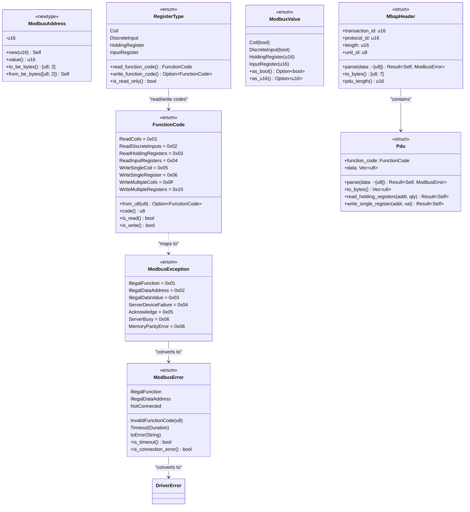

# R1-S1-002 Modbus 核心数据类型与错误定义 - 详细设计文档

## 文档信息

| 项目 | 内容 |
|------|------|
| 任务编号 | R1-S1-002 |
| 作者 | sw-jerry (Software Architect) |
| 日期 | 2026-05-02 |
| 状态 | 设计完成 |
| 版本 | 1.0 |
| 依赖文档 | [测试用例](../test/R1-S1-002_test_cases.md) |

---

## 目录

1. [概述](#1-概述)
2. [模块结构](#2-模块结构)
3. [类型定义](#3-类型定义)
4. [错误类型](#4-错误类型)
5. [MBAP 头部处理](#5-mbap-头部处理)
6. [PDU 处理](#6-pdu-处理)
7. [常量定义](#7-常量定义)
8. [UML 类图](#8-uml-类图)
9. [序列化设计](#9-序列化设计)
10. [实现要点](#10-实现要点)
11. [测试覆盖映射](#11-测试覆盖映射)

---

## 1. 概述

### 1.1 设计目标

本文档定义 Modbus 核心数据类型与错误定义，为 Modbus 驱动实现提供基础组件。设计遵循：

1. **类型安全**：使用 Rust 强类型系统防止无效值
2. **零成本抽象**：使用 enum 和 newtype 模式，无运行时开销
3. **序列化支持**：所有类型实现 `serde` trait
4. **错误可追踪**：使用 `thiserror` 提供丰富的错误上下文

### 1.2 技术选型

| 组件 | 选型 | 理由 |
|------|------|------|
| 错误处理 | `thiserror` | 符合现有 `DriverError` 模式，编译时确定错误类型 |
| 序列化 | `serde` | 与现有 `PointValue`、`VirtualConfig` 一致 |
| 字节处理 | 标准库 `u16::from_be_bytes` | Modbus 协议使用 Big-Endian |
| 异步支持 | 无 | 本模块仅为数据类型定义，不涉及 I/O |

### 1.3 目录位置

```
kayak-backend/src/drivers/modbus/
├── mod.rs           # 模块导出
├── types.rs         # 核心数据类型 (FunctionCode, ModbusAddress, ModbusValue, RegisterType)
├── error.rs         # 错误类型 (ModbusError, ModbusException)
├── mbap.rs          # MBAP 头部处理
├── pdu.rs           # PDU 解析与构建
└── constants.rs     # Modbus 常量定义
```

---

## 2. 模块结构

### 2.1 `mod.rs` - 模块导出

```rust
//! Modbus 核心数据类型与错误定义
//!
//! 提供 Modbus TCP/RTU 协议的核心数据类型、错误处理和帧解析支持。

pub mod constants;
pub mod error;
pub mod mbap;
pub mod pdu;
pub mod types;

pub use constants::*;
pub use error::{ModbusError, ModbusException};
pub use mbap::MbapHeader;
pub use pdu::Pdu;
pub use types::{FunctionCode, ModbusAddress, ModbusValue, RegisterType};
```

### 2.2 模块职责划分

| 模块 | 职责 | 公共 API |
|------|------|----------|
| `constants.rs` | Modbus 协议常量定义 | `MODBUS_TCP_PORT`, `MAX_PDU_SIZE` 等 |
| `types.rs` | 核心数据类型定义 | `FunctionCode`, `ModbusAddress`, `ModbusValue`, `RegisterType` |
| `error.rs` | 错误类型定义 | `ModbusError`, `ModbusException`, `Into<DriverError>` |
| `mbap.rs` | MBAP 头部序列化/反序列化 | `MbapHeader::parse()`, `MbapHeader::to_bytes()` |
| `pdu.rs` | PDU 解析与构建 | `Pdu::parse()`, `Pdu::to_bytes()`, `PduBuilder` |

---

## 3. 类型定义

### 3.1 FunctionCode

**文件**: `types.rs`

```rust
use serde::{Deserialize, Serialize};

/// Modbus 功能码枚举
///
/// 涵盖本项目支持的 Modbus 读取/写入功能码。
/// 注意：不包含诊断功能码 (0x07, 0x08, 0x11) 等扩展功能码。
#[derive(Debug, Clone, Copy, PartialEq, Eq, Hash, Serialize, Deserialize)]
#[repr(u8)]
pub enum FunctionCode {
    /// 读取线圈 (Read Coils)
    ReadCoils = 0x01,
    /// 读取离散输入 (Read Discrete Inputs)
    ReadDiscreteInputs = 0x02,
    /// 读取保持寄存器 (Read Holding Registers)
    ReadHoldingRegisters = 0x03,
    /// 读取输入寄存器 (Read Input Registers)
    ReadInputRegisters = 0x04,
    /// 写入单个线圈 (Write Single Coil)
    WriteSingleCoil = 0x05,
    /// 写入单个寄存器 (Write Single Register)
    WriteSingleRegister = 0x06,
    /// 写入多个线圈 (Write Multiple Coils)
    WriteMultipleCoils = 0x0F,
    /// 写入多个寄存器 (Write Multiple Registers)
    WriteMultipleRegisters = 0x10,
}

impl FunctionCode {
    /// 从 u8 值创建 FunctionCode
    ///
    /// # Returns
    /// * `Some(FunctionCode)` - 有效的功能码
    /// * `None` - 无效的功能码值
    pub fn from_u8(value: u8) -> Option<Self> {
        match value {
            0x01 => Some(Self::ReadCoils),
            0x02 => Some(Self::ReadDiscreteInputs),
            0x03 => Some(Self::ReadHoldingRegisters),
            0x04 => Some(Self::ReadInputRegisters),
            0x05 => Some(Self::WriteSingleCoil),
            0x06 => Some(Self::WriteSingleRegister),
            0x0F => Some(Self::WriteMultipleCoils),
            0x10 => Some(Self::WriteMultipleRegisters),
            _ => None,
        }
    }

    /// 从 u8 值创建 FunctionCode（宽松模式）
    ///
    /// 仅验证值是否在支持范围内，不验证是否为已知的 Modbus 功能码。
    /// 用于处理服务器返回的未知功能码。
    pub fn from_u8_unchecked(value: u8) -> Self {
        Self::from_u8(value).unwrap_or_else(|| {
            // SAFETY: u8 可以无损转换为 FunctionCode 的 repr(u8)
            // 但实际上我们使用这个方法来处理"未知但有效"的场景
            // 实际实现应该使用一个专门的 "Unknown(u8)" 变体或类似机制
            unsafe { std::mem::transmute(value) }
        })
    }

    /// 获取功能码的 u8 值
    pub fn code(&self) -> u8 {
        *self as u8
    }

    /// 判断是否为读取类功能码
    pub fn is_read(&self) -> bool {
        matches!(
            self,
            Self::ReadCoils
                | Self::ReadDiscreteInputs
                | Self::ReadHoldingRegisters
                | Self::ReadInputRegisters
        )
    }

    /// 判断是否为写入类功能码
    pub fn is_write(&self) -> bool {
        matches!(
            self,
            Self::WriteSingleCoil
                | Self::WriteSingleRegister
                | Self::WriteMultipleCoils
                | Self::WriteMultipleRegisters
        )
    }

    /// 判断功能码是否需要字节计数字段
    ///
    /// WriteMultipleCoils 和 WriteMultipleRegisters 需要 byte_count 字段。
    pub fn has_byte_count(&self) -> bool {
        matches!(self, Self::WriteMultipleCoils | Self::WriteMultipleRegisters)
    }
}

impl std::fmt::Display for FunctionCode {
    fn fmt(&self, f: &mut std::fmt::Formatter<'_>) -> std::fmt::Result {
        let name = match self {
            Self::ReadCoils => "ReadCoils",
            Self::ReadDiscreteInputs => "ReadDiscreteInputs",
            Self::ReadHoldingRegisters => "ReadHoldingRegisters",
            Self::ReadInputRegisters => "ReadInputRegisters",
            Self::WriteSingleCoil => "WriteSingleCoil",
            Self::WriteSingleRegister => "WriteSingleRegister",
            Self::WriteMultipleCoils => "WriteMultipleCoils",
            Self::WriteMultipleRegisters => "WriteMultipleRegisters",
        };
        write!(f, "{}", name)
    }
}
```

**设计说明**：
- 使用 `#[repr(u8)]` 保证内存布局与 Modbus 协议一致
- `from_u8` 返回 `Option` 以类型安全地处理无效值
- `is_read`/`is_write` 用于快速判断功能码类型
- 实现 `Serialize`/`Deserialize` 支持 JSON 序列化

---

### 3.2 ModbusAddress

**文件**: `types.rs`

```rust
use serde::{Deserialize, Serialize};

/// Modbus 寄存器地址
///
/// 地址范围: 0x0000 - 0xFFFF (0 - 65535)
/// 注意：某些设备可能限制有效地址范围，但本类型不做限制。
#[derive(Debug, Clone, Copy, PartialEq, Eq, PartialOrd, Ord, Hash, Serialize, Deserialize)]
pub struct ModbusAddress(u16);

impl ModbusAddress {
    /// 最小地址
    pub const MIN: u16 = 0x0000;
    /// 最大地址
    pub const MAX: u16 = 0xFFFF;

    /// 创建 ModbusAddress
    ///
    /// # Returns
    /// * `Ok(ModbusAddress)` - 有效地址
    /// * `Err(())` - 地址超出有效范围（实际不会发生，因为 u16 永远有效）
    #[inline]
    pub fn new(address: u16) -> Self {
        Self(address)
    }

    /// 从原始 u16 值创建（不安全，内部使用）
    ///
    /// 仅在确信值在有效范围内时使用。
    #[inline]
    pub const fn from_raw(address: u16) -> Self {
        Self(address)
    }

    /// 获取地址的 u16 值
    #[inline]
    pub fn value(&self) -> u16 {
        self.0
    }

    /// 获取地址的高字节
    #[inline]
    pub fn high_byte(&self) -> u8 {
        (self.0 >> 8) as u8
    }

    /// 获取地址的低字节
    #[inline]
    pub fn low_byte(&self) -> u8 {
        (self.0 & 0xFF) as u8
    }

    /// 转换为大端字节序数组
    #[inline]
    pub fn to_be_bytes(&self) -> [u8; 2] {
        self.0.to_be_bytes()
    }

    /// 从大端字节序数组创建
    pub fn from_be_bytes(bytes: [u8; 2]) -> Self {
        Self(u16::from_be_bytes(bytes))
    }

    /// 检查地址是否在有效范围内
    ///
    /// Modbus 地址始终在 0x0000-0xFFFF 范围内，此方法始终返回 true。
    /// 保留此方法用于接口一致性。
    #[inline]
    pub fn is_valid(&self) -> bool {
        self.0 >= Self::MIN && self.0 <= Self::MAX
    }
}

impl Default for ModbusAddress {
    fn default() -> Self {
        Self(0x0000)
    }
}

impl From<u16> for ModbusAddress {
    fn from(value: u16) -> Self {
        Self::new(value)
    }
}

impl From<ModbusAddress> for u16 {
    fn from(addr: ModbusAddress) -> Self {
        addr.value()
    }
}

impl std::fmt::Display for ModbusAddress {
    fn fmt(&self, f: &mut std::fmt::Formatter<'_>) -> std::fmt::Result {
        write!(f, "0x{:04X}", self.0)
    }
}
```

**设计说明**：
- 使用 newtype 模式包装 u16，防止裸 u16 被误用为 Modbus 地址
- `const` 构造方法允许编译时常量创建
- 实现 `From<u16>` 和 `From<ModbusAddress> for u16` 便于互转
- `to_be_bytes`/`from_be_bytes` 支持 Modbus 协议的大端序

---

### 3.3 RegisterType

**文件**: `types.rs`

```rust
use serde::{Deserialize, Serialize};

/// Modbus 寄存器类型
///
/// 对应 Modbus 协议中的四类数据区：
/// - Coil (线圈): 可读写位，地址 0XXXX
/// - Discrete Input (离散输入): 只读位，地址 1XXXX
/// - Holding Register (保持寄存器): 可读写字，地址 4XXXX
/// - Input Register (输入寄存器): 只读字，地址 3XXXX
#[derive(Debug, Clone, Copy, PartialEq, Eq, Hash, Serialize, Deserialize)]
pub enum RegisterType {
    /// 线圈 (Read/Write)
    Coil,
    /// 离散输入 (Read Only)
    DiscreteInput,
    /// 保持寄存器 (Read/Write)
    HoldingRegister,
    /// 输入寄存器 (Read Only)
    InputRegister,
}

impl RegisterType {
    /// 获取对应的读取功能码
    pub fn read_function_code(&self) -> FunctionCode {
        match self {
            Self::Coil => FunctionCode::ReadCoils,
            Self::DiscreteInput => FunctionCode::ReadDiscreteInputs,
            Self::HoldingRegister => FunctionCode::ReadHoldingRegisters,
            Self::InputRegister => FunctionCode::ReadInputRegisters,
        }
    }

    /// 获取对应的写入功能码
    ///
    /// 注意：DiscreteInput 和 InputRegister 是只读的，没有写入功能码。
    pub fn write_function_code(&self) -> Option<FunctionCode> {
        match self {
            Self::Coil => Some(FunctionCode::WriteSingleCoil),
            Self::HoldingRegister => Some(FunctionCode::WriteSingleRegister),
            _ => None,
        }
    }

    /// 判断是否为只读类型
    pub fn is_read_only(&self) -> bool {
        matches!(self, Self::DiscreteInput | Self::InputRegister)
    }

    /// 判断数据类型是否为布尔类型（线圈类）
    pub fn is_boolean(&self) -> bool {
        matches!(self, Self::Coil | Self::DiscreteInput)
    }

    /// 判断数据类型是否为字类型（寄存器类）
    pub fn is_register(&self) -> bool {
        matches!(self, Self::HoldingRegister | Self::InputRegister)
    }
}

impl std::fmt::Display for RegisterType {
    fn fmt(&self, f: &mut std::fmt::Formatter<'_>) -> std::fmt::Result {
        let name = match self {
            Self::Coil => "Coil",
            Self::DiscreteInput => "DiscreteInput",
            Self::HoldingRegister => "HoldingRegister",
            Self::InputRegister => "InputRegister",
        };
        write!(f, "{}", name)
    }
}
```

**设计说明**：
- `read_function_code` 关联读取功能码
- `write_function_code` 对只读类型返回 `None`
- `is_read_only`/`is_boolean`/`is_register` 提供类型查询

---

### 3.4 ModbusValue

**文件**: `types.rs`

```rust
use serde::{Deserialize, Serialize};

/// Modbus 数据值
///
/// 统一表示 Modbus 中的所有数据类型：
/// - 布尔值：Coil 和 DiscreteInput
/// - u16 值：HoldingRegister 和 InputRegister
#[derive(Debug, Clone, PartialEq, Eq, Serialize, Deserialize)]
pub enum ModbusValue {
    /// 线圈值 (布尔值)
    Coil(bool),
    /// 离散输入值 (布尔值)
    DiscreteInput(bool),
    /// 保持寄存器值 (u16)
    HoldingRegister(u16),
    /// 输入寄存器值 (u16)
    InputRegister(u16),
}

impl ModbusValue {
    /// 创建线圈值
    #[inline]
    pub fn coil(value: bool) -> Self {
        Self::Coil(value)
    }

    /// 创建离散输入值
    #[inline]
    pub fn discrete_input(value: bool) -> Self {
        Self::DiscreteInput(value)
    }

    /// 创建保持寄存器值
    #[inline]
    pub fn holding_register(value: u16) -> Self {
        Self::HoldingRegister(value)
    }

    /// 创建输入寄存器值
    #[inline]
    pub fn input_register(value: u16) -> Self {
        Self::InputRegister(value)
    }

    /// 尝试获取布尔值
    ///
    /// # Returns
    /// * `Some(bool)` - 如果是 Coil 或 DiscreteInput
    /// * `None` - 如果是寄存器类型
    pub fn as_bool(&self) -> Option<bool> {
        match self {
            Self::Coil(v) | Self::DiscreteInput(v) => Some(*v),
            _ => None,
        }
    }

    /// 尝试获取 u16 值
    ///
    /// # Returns
    /// * `Some(u16)` - 如果是 HoldingRegister 或 InputRegister
    /// * `None` - 如果是布尔类型
    pub fn as_u16(&self) -> Option<u16> {
        match self {
            Self::HoldingRegister(v) | Self::InputRegister(v) => Some(*v),
            _ => None,
        }
    }

    /// 获取寄存器类型的引用
    ///
    /// # Returns
    /// * `Some(&u16)` - 如果是寄存器类型
    /// * `None` - 如果是布尔类型
    pub fn as_register(&self) -> Option<&u16> {
        match self {
            Self::HoldingRegister(v) | Self::InputRegister(v) => Some(v),
            _ => None,
        }
    }

    /// 判断值是否为真（用于线圈类型）
    ///
    /// 如果不是布尔类型，返回 false。
    pub fn is_true(&self) -> bool {
        self.as_bool().unwrap_or(false)
    }

    /// 获取值的位长度
    ///
    /// 布尔类型返回 1，寄存器类型返回 16。
    pub fn bit_length(&self) -> u8 {
        match self {
            Self::Coil(_) | Self::DiscreteInput(_) => 1,
            Self::HoldingRegister(_) | Self::InputRegister(_) => 16,
        }
    }
}

impl From<bool> for ModbusValue {
    fn from(value: bool) -> Self {
        Self::Coil(value)
    }
}

impl From<u16> for ModbusValue {
    fn from(value: u16) -> Self {
        Self::HoldingRegister(value)
    }
}

impl Default for ModbusValue {
    fn default() -> Self {
        Self::HoldingRegister(0)
    }
}

impl std::fmt::Display for ModbusValue {
    fn fmt(&self, f: &mut std::fmt::Formatter<'_>) -> std::fmt::Result {
        match self {
            Self::Coil(v) => write!(f, "Coil({})", v),
            Self::DiscreteInput(v) => write!(f, "DiscreteInput({})", v),
            Self::HoldingRegister(v) => write!(f, "HoldingRegister(0x{:04X})", v),
            Self::InputRegister(v) => write!(f, "InputRegister(0x{:04X})", v),
        }
    }
}
```

**设计说明**：
- 使用 enum 而非 trait object，保证零成本抽象
- `as_bool`/`as_u16` 返回 `Option`，类型安全地处理类型不匹配
- 实现 `From<bool>` 和 `From<u16>` 便于类型转换

---

## 4. 错误类型

### 4.1 ModbusException 枚举

**文件**: `error.rs`

```rust
use serde::{Deserialize, Serialize};
use crate::drivers::error::DriverError;
use std::time::Duration;

/// Modbus 异常码 (Exception Codes)
///
/// 对应 Modbus 协议定义的异常响应：
/// - 01: 非法功能 (Illegal Function)
/// - 02: 非法数据地址 (Illegal Data Address)
/// - 03: 非法数据值 (Illegal Data Value)
/// - 04: 从站设备故障 (Server Device Failure)
/// - 05: 确认 (Acknowledge)
/// - 06: 服务器忙 (Server Busy)
/// - 08: 内存奇偶校验错误 (Memory Parity Error)
///
/// 注意：0x07 和 0x08 是诊断功能码，不是异常码。
#[derive(Debug, Clone, Copy, PartialEq, Eq, Hash, Serialize, Deserialize)]
#[repr(u8)]
pub enum ModbusException {
    /// 非法功能 - 服务器不理解请求的功能码
    IllegalFunction = 0x01,
    /// 非法数据地址 - 请求的地址超出范围
    IllegalDataAddress = 0x02,
    /// 非法数据值 - 请求的数据值无效
    IllegalDataValue = 0x03,
    /// 从站设备故障 - 服务器执行失败
    ServerDeviceFailure = 0x04,
    /// 确认 - 服务器接受请求但需要更长时间处理
    Acknowledge = 0x05,
    /// 服务器忙 - 服务器忙于处理长时间请求
    ServerBusy = 0x06,
    /// 内存奇偶校验错误 - 内存奇偶校验失败
    MemoryParityError = 0x08,
    /// 网关路径不可用 (扩展)
    GatewayPathUnavailable = 0x0A,
    /// 网关目标设备响应失败 (扩展)
    GatewayTargetDeviceFailedToRespond = 0x0B,
    /// 未知异常码
    Unknown(u8),
}

impl ModbusException {
    /// 从 u8 值创建 ModbusException
    pub fn from_u8(value: u8) -> Self {
        match value {
            0x01 => Self::IllegalFunction,
            0x02 => Self::IllegalDataAddress,
            0x03 => Self::IllegalDataValue,
            0x04 => Self::ServerDeviceFailure,
            0x05 => Self::Acknowledge,
            0x06 => Self::ServerBusy,
            0x08 => Self::MemoryParityError,
            0x0A => Self::GatewayPathUnavailable,
            0x0B => Self::GatewayTargetDeviceFailedToRespond,
            other => Self::Unknown(other),
        }
    }

    /// 获取异常码的 u8 值
    pub fn code(&self) -> u8 {
        match self {
            Self::IllegalFunction => 0x01,
            Self::IllegalDataAddress => 0x02,
            Self::IllegalDataValue => 0x03,
            Self::ServerDeviceFailure => 0x04,
            Self::Acknowledge => 0x05,
            Self::ServerBusy => 0x06,
            Self::MemoryParityError => 0x08,
            Self::GatewayPathUnavailable => 0x0A,
            Self::GatewayTargetDeviceFailedToRespond => 0x0B,
            Self::Unknown(code) => *code,
        }
    }

    /// 判断是否为已知异常码
    pub fn is_known(&self) -> bool {
        !matches!(self, Self::Unknown(_))
    }
}

impl std::fmt::Display for ModbusException {
    fn fmt(&self, f: &mut std::fmt::Formatter<'_>) -> std::fmt::Result {
        let name = match self {
            Self::IllegalFunction => "IllegalFunction",
            Self::IllegalDataAddress => "IllegalDataAddress",
            Self::IllegalDataValue => "IllegalDataValue",
            Self::ServerDeviceFailure => "ServerDeviceFailure",
            Self::Acknowledge => "Acknowledge",
            Self::ServerBusy => "ServerBusy",
            Self::MemoryParityError => "MemoryParityError",
            Self::GatewayPathUnavailable => "GatewayPathUnavailable",
            Self::GatewayTargetDeviceFailedToRespond => "GatewayTargetDeviceFailedToRespond",
            Self::Unknown(code) => return write!(f, "Unknown(0x{:02X})", code),
        };
        write!(f, "{}", name)
    }
}
```

---

### 4.2 ModbusError 枚举

**文件**: `error.rs`

```rust
/// Modbus 错误类型
///
/// 涵盖 Modbus 协议层和通信层的所有错误：
/// - ModbusException: Modbus 协议定义的异常响应
/// - Protocol: 协议解析错误
/// - Communication: 通信错误（超时、连接等）
#[derive(Debug, Clone, Serialize, Deserialize)]
pub enum ModbusError {
    // ========== Modbus 异常响应 ==========

    /// 非法功能
    IllegalFunction,
    /// 非法数据地址
    IllegalDataAddress,
    /// 非法数据值
    IllegalDataValue,
    /// 从站设备故障
    ServerDeviceFailure,
    /// 确认
    Acknowledge,
    /// 服务器忙
    ServerBusy,
    /// 内存奇偶校验错误
    MemoryParityError,

    // ========== 协议错误 ==========

    /// 无效的功能码
    InvalidFunctionCode(u8),
    /// 无效的地址
    InvalidAddress(u16),
    /// 无效的值
    InvalidValue(String),
    /// 无效的 PDU 数据长度
    InvalidPduLength { expected: usize, actual: usize },
    /// MBAP 解析错误
    MbapError(String),
    /// PDU 解析错误
    PduError(String),
    /// 帧不完整
    IncompleteFrame,
    /// 帧校验失败
    FrameChecksumMismatch {
        expected: u16,
        actual: u16,
    },

    // ========== 通信错误 ==========

    /// 连接失败
    ConnectionFailed(String),
    /// 连接超时
    Timeout { duration: Duration },
    /// 连接被拒绝
    ConnectionRefused,
    /// 设备未连接
    NotConnected,
    /// 远程主机关闭连接
    RemoteHostClosedConnection,
    /// IO 错误
    IoError(String),

    // ========== 其他 ==========

    /// 未知错误
    Unknown(String),
}

impl ModbusError {
    // ========== 工厂方法 ==========

    /// 创建超时错误
    pub fn timeout(duration: Duration) -> Self {
        Self::Timeout { duration }
    }

    /// 创建 IO 错误
    pub fn io_error(message: impl Into<String>) -> Self {
        Self::IoError(message.into())
    }

    /// 创建协议错误
    pub fn protocol_error(message: impl Into<String>) -> Self {
        Self::MbapError(message.into())
    }

    // ========== 查询方法 ==========

    /// 判断是否为通信超时错误
    pub fn is_timeout(&self) -> bool {
        matches!(self, Self::Timeout { .. })
    }

    /// 判断是否为连接错误
    pub fn is_connection_error(&self) -> bool {
        matches!(
            self,
            Self::ConnectionFailed(_)
                | Self::ConnectionRefused
                | Self::NotConnected
                | Self::RemoteHostClosedConnection
        )
    }

    /// 判断是否为协议错误
    pub fn is_protocol_error(&self) -> bool {
        matches!(
            self,
            Self::InvalidFunctionCode(_)
                | Self::InvalidAddress(_)
                | Self::InvalidValue(_)
                | Self::InvalidPduLength { .. }
                | Self::MbapError(_)
                | Self::PduError(_)
                | Self::IncompleteFrame
                | Self::FrameChecksumMismatch { .. }
        )
    }

    /// 获取错误码（用于日志和调试）
    pub fn error_code(&self) -> &'static str {
        match self {
            Self::IllegalFunction => "EX_ILLEGAL_FUNCTION",
            Self::IllegalDataAddress => "EX_ILLEGAL_DATA_ADDRESS",
            Self::IllegalDataValue => "EX_ILLEGAL_DATA_VALUE",
            Self::ServerDeviceFailure => "EX_SERVER_DEVICE_FAILURE",
            Self::Acknowledge => "EX_ACKNOWLEDGE",
            Self::ServerBusy => "EX_SERVER_BUSY",
            Self::MemoryParityError => "EX_MEMORY_PARITY_ERROR",
            Self::InvalidFunctionCode(_) => "ERR_INVALID_FUNCTION_CODE",
            Self::InvalidAddress(_) => "ERR_INVALID_ADDRESS",
            Self::InvalidValue(_) => "ERR_INVALID_VALUE",
            Self::InvalidPduLength { .. } => "ERR_INVALID_PDU_LENGTH",
            Self::MbapError(_) => "ERR_MBAP",
            Self::PduError(_) => "ERR_PDU",
            Self::IncompleteFrame => "ERR_INCOMPLETE_FRAME",
            Self::FrameChecksumMismatch { .. } => "ERR_CHECKSUM_MISMATCH",
            Self::ConnectionFailed(_) => "ERR_CONNECTION_FAILED",
            Self::Timeout { .. } => "ERR_TIMEOUT",
            Self::ConnectionRefused => "ERR_CONNECTION_REFUSED",
            Self::NotConnected => "ERR_NOT_CONNECTED",
            Self::RemoteHostClosedConnection => "ERR_REMOTE_CLOSED",
            Self::IoError(_) => "ERR_IO",
            Self::Unknown(_) => "ERR_UNKNOWN",
        }
    }
}

impl std::fmt::Display for ModbusError {
    fn fmt(&self, f: &mut std::fmt::Formatter<'_>) -> std::fmt::Result {
        match self {
            Self::IllegalFunction => write!(f, "Illegal function"),
            Self::IllegalDataAddress => write!(f, "Illegal data address"),
            Self::IllegalDataValue => write!(f, "Illegal data value"),
            Self::ServerDeviceFailure => write!(f, "Server device failure"),
            Self::Acknowledge => write!(f, "Acknowledge"),
            Self::ServerBusy => write!(f, "Server busy"),
            Self::MemoryParityError => write!(f, "Memory parity error"),
            Self::InvalidFunctionCode(code) => write!(f, "Invalid function code: 0x{:02X}", code),
            Self::InvalidAddress(addr) => write!(f, "Invalid address: 0x{:04X}", addr),
            Self::InvalidValue(msg) => write!(f, "Invalid value: {}", msg),
            Self::InvalidPduLength { expected, actual } => {
                write!(f, "Invalid PDU length: expected {}, got {}", expected, actual)
            }
            Self::MbapError(msg) => write!(f, "MBAP error: {}", msg),
            Self::PduError(msg) => write!(f, "PDU error: {}", msg),
            Self::IncompleteFrame => write!(f, "Incomplete frame"),
            Self::FrameChecksumMismatch { expected, actual } => {
                write!(f, "Checksum mismatch: expected 0x{:04X}, got 0x{:04X}", expected, actual)
            }
            Self::ConnectionFailed(msg) => write!(f, "Connection failed: {}", msg),
            Self::Timeout { duration } => write!(f, "Timeout after {:?}", duration),
            Self::ConnectionRefused => write!(f, "Connection refused"),
            Self::NotConnected => write!(f, "Not connected"),
            Self::RemoteHostClosedConnection => write!(f, "Remote host closed connection"),
            Self::IoError(msg) => write!(f, "IO error: {}", msg),
            Self::Unknown(msg) => write!(f, "Unknown error: {}", msg),
        }
    }
}

impl std::error::Error for ModbusError {}

// ========== From 实现 ==========

impl From<std::io::Error> for ModbusError {
    fn from(err: std::io::Error) -> Self {
        match err.kind() {
            std::io::ErrorKind::TimedOut => Self::Timeout {
                duration: Duration::from_secs(0), // 未知时长
            },
            std::io::ErrorKind::ConnectionRefused => Self::ConnectionRefused,
            std::io::ErrorKind::NotConnected => Self::NotConnected,
            std::io::ErrorKind::UnexpectedEof => Self::RemoteHostClosedConnection,
            _ => Self::IoError(err.to_string()),
        }
    }
}

impl From<ModbusException> for ModbusError {
    fn from(exc: ModbusException) -> Self {
        match exc {
            ModbusException::IllegalFunction => Self::IllegalFunction,
            ModbusException::IllegalDataAddress => Self::IllegalDataAddress,
            ModbusException::IllegalDataValue => Self::IllegalDataValue,
            ModbusException::ServerDeviceFailure => Self::ServerDeviceFailure,
            ModbusException::Acknowledge => Self::Acknowledge,
            ModbusException::ServerBusy => Self::ServerBusy,
            ModbusException::MemoryParityError => Self::MemoryParityError,
            ModbusException::GatewayPathUnavailable => Self::Unknown("Gateway path unavailable".into()),
            ModbusException::GatewayTargetDeviceFailedToRespond => {
                Self::Unknown("Gateway target device failed to respond".into())
            }
            ModbusException::Unknown(code) => Self::Unknown(format!("Unknown exception code: 0x{:02X}", code)),
        }
    }
}

// ========== Into<DriverError> 实现 ==========

impl From<ModbusError> for DriverError {
    fn from(err: ModbusError) -> Self {
        match err {
            // Modbus 异常映射到 InvalidValue
            ModbusError::IllegalFunction => DriverError::InvalidValue {
                message: "Illegal function".into(),
            },
            ModbusError::IllegalDataAddress => DriverError::InvalidValue {
                message: "Illegal data address".into(),
            },
            ModbusError::IllegalDataValue => DriverError::InvalidValue {
                message: "Illegal data value".into(),
            },
            ModbusError::ServerDeviceFailure => DriverError::InvalidValue {
                message: "Server device failure".into(),
            },
            ModbusError::Acknowledge => DriverError::InvalidValue {
                message: "Acknowledge".into(),
            },
            ModbusError::ServerBusy => DriverError::InvalidValue {
                message: "Server busy".into(),
            },
            ModbusError::MemoryParityError => DriverError::InvalidValue {
                message: "Memory parity error".into(),
            },
            // 通信错误直接映射
            ModbusError::Timeout { duration } => DriverError::Timeout { duration },
            ModbusError::NotConnected => DriverError::NotConnected,
            ModbusError::ConnectionFailed(msg) => DriverError::IoError(msg),
            ModbusError::ConnectionRefused => DriverError::IoError("Connection refused".into()),
            ModbusError::RemoteHostClosedConnection => {
                DriverError::IoError("Remote host closed connection".into())
            }
            // 其他错误映射为 InvalidValue 或 IoError
            ModbusError::InvalidFunctionCode(code) => DriverError::InvalidValue {
                message: format!("Invalid function code: 0x{:02X}", code),
            },
            ModbusError::InvalidAddress(addr) => DriverError::InvalidValue {
                message: format!("Invalid address: 0x{:04X}", addr),
            },
            ModbusError::InvalidValue(msg) => DriverError::InvalidValue { message: msg },
            other => DriverError::IoError(other.to_string()),
        }
    }
}
```

**设计说明**：
- `ModbusError` 包含 Modbus 异常码和通信/协议错误
- `From<ModbusException>` 允许异常码直接转换为错误
- `Into<DriverError>` 实现允许错误转换为驱动层错误
- 错误分类方法 `is_timeout`/`is_connection_error` 便于错误处理

---

## 5. MBAP 头部处理

### 5.1 MbapHeader 结构体

**文件**: `mbap.rs`

```rust
use serde::{Deserialize, Serialize};

/// Modbus TCP MBAP (Modbus Application Protocol) 头部
///
/// MBAP 头部共 7 字节，包含：
/// - Transaction ID (2 bytes): 事务标识符，用于匹配请求和响应
/// - Protocol ID (2 bytes): 协议标识符，Modbus TCP 固定为 0
/// - Length (2 bytes): 后续字节长度，包括 Unit ID 和 PDU
/// - Unit ID (1 byte): 从站标识符
///
/// ```text
/// +-------+-------+-------+-------+-------+-------+-------+
/// | TID   | TID   |  PID  |  PID  | Length | Length| UID   |
/// |  High |  Low  |  High |  Low  |  High |  Low  |       |
/// +-------+-------+-------+-------+-------+-------+-------+
///   0     1       2       3       4       5       6
/// ```
#[derive(Debug, Clone, Copy, PartialEq, Eq, Serialize, Deserialize)]
pub struct MbapHeader {
    /// 事务标识符 (Transaction Identifier)
    pub transaction_id: u16,
    /// 协议标识符 (Protocol Identifier)，固定为 0
    pub protocol_id: u16,
    /// 后续字节长度 (Length)，包括 Unit ID 和 PDU
    pub length: u16,
    /// 从站标识符 (Unit Identifier)
    pub unit_id: u8,
}

impl MbapHeader {
    /// MBAP 头部的固定长度
    pub const LENGTH: usize = 7;

    /// 协议标识符的固定值
    pub const MODBUS_PROTOCOL_ID: u16 = 0x0000;

    /// 创建新的 MBAP 头部
    ///
    /// # Arguments
    /// * `transaction_id` - 事务标识符
    /// * `unit_id` - 从站标识符
    /// * `pdu_length` - PDU 长度
    pub fn new(transaction_id: u16, unit_id: u8, pdu_length: u16) -> Self {
        Self {
            transaction_id,
            protocol_id: Self::MODBUS_PROTOCOL_ID,
            // Length = Unit ID (1) + PDU (pdu_length)
            length: 1 + pdu_length,
            unit_id,
        }
    }

    /// 从字节数组解析 MBAP 头部
    ///
    /// # Arguments
    /// * `data` - 至少 7 字节的数据
    ///
    /// # Returns
    /// * `Ok(MbapHeader)` - 解析成功
    /// * `Err(ModbusError::IncompleteFrame)` - 数据不足
    pub fn parse(data: &[u8]) -> Result<Self, crate::error::ModbusError> {
        if data.len() < Self::LENGTH {
            return Err(crate::error::ModbusError::IncompleteFrame);
        }

        let transaction_id = u16::from_be_bytes([data[0], data[1]]);
        let protocol_id = u16::from_be_bytes([data[2], data[3]]);
        let length = u16::from_be_bytes([data[4], data[5]]);
        let unit_id = data[6];

        // 验证协议标识符
        if protocol_id != Self::MODBUS_PROTOCOL_ID {
            return Err(crate::error::ModbusError::MbapError(format!(
                "Invalid protocol ID: 0x{:04X}, expected 0x{:04X}",
                protocol_id,
                Self::MODBUS_PROTOCOL_ID
            )));
        }

        // 验证长度字段
        if length < 1 {
            return Err(crate::error::ModbusError::MbapError(
                "Invalid length field: must be at least 1".into(),
            ));
        }

        Ok(Self {
            transaction_id,
            protocol_id,
            length,
            unit_id,
        })
    }

    /// 将 MBAP 头部序列化为字节数组
    ///
    /// # Returns
    /// * `[u8; 7]` - 7 字节的 MBAP 头部
    pub fn to_bytes(&self) -> [u8; Self::LENGTH] {
        let mut bytes = [0u8; Self::LENGTH];
        bytes[0..2].copy_from_slice(&self.transaction_id.to_be_bytes());
        bytes[2..4].copy_from_slice(&self.protocol_id.to_be_bytes());
        bytes[4..6].copy_from_slice(&self.length.to_be_bytes());
        bytes[6] = self.unit_id;
        bytes
    }

    /// 获取 PDU 长度（从 length 字段计算）
    ///
    /// length 字段包含 Unit ID (1) + PDU，所以 PDU 长度 = length - 1
    pub fn pdu_length(&self) -> u16 {
        self.length.saturating_sub(1)
    }

    /// 检查数据是否足够长以包含完整的 MBAP + PDU
    pub fn is_complete(&self, total_data_len: usize) -> bool {
        total_data_len >= Self::LENGTH + (self.length as usize)
    }
}

impl Default for MbapHeader {
    fn default() -> Self {
        Self {
            transaction_id: 0,
            protocol_id: Self::MODBUS_PROTOCOL_ID,
            length: 1, // 最小长度，仅 Unit ID
            unit_id: 0,
        }
    }
}

impl std::fmt::Display for MbapHeader {
    fn fmt(&self, f: &mut std::fmt::Formatter<'_>) -> std::fmt::Result {
        write!(
            f,
            "MBAP {{ tid: {}, proto: 0x{:04X}, len: {}, uid: {} }}",
            self.transaction_id, self.protocol_id, self.length, self.unit_id
        )
    }
}
```

---

## 6. PDU 处理

### 6.1 Pdu 结构体

**文件**: `pdu.rs`

```rust
use serde::{Deserialize, Serialize};

use super::error::ModbusError;
use super::types::{FunctionCode, ModbusAddress, ModbusValue};

/// Modbus PDU (Protocol Data Unit)
///
/// PDU 是 Modbus 协议的核心数据单元，包含：
/// - Function Code (1 byte): 功能码
/// - Data (0-252 bytes): 数据内容
///
/// ```text
/// +-------------+-------------+
/// | Function    |    Data     |
/// |   Code      |   (N bytes) |
/// +-------------+-------------+
/// ```
///
/// PDU 最大长度为 253 字节 (1 byte function code + 252 bytes data)。
/// 这受限于 Modbus PDU 最大长度 256 字节减去 MBAP 头部的 3 字节。
#[derive(Debug, Clone, PartialEq, Eq, Serialize, Deserialize)]
pub struct Pdu {
    /// 功能码
    pub function_code: FunctionCode,
    /// 原始数据字节
    pub data: Vec<u8>,
}

impl Pdu {
    /// PDU 的最大长度
    pub const MAX_LENGTH: usize = 253;
    /// PDU 的最小长度
    pub const MIN_LENGTH: usize = 1;

    /// 创建新的 PDU
    pub fn new(function_code: FunctionCode, data: Vec<u8>) -> Result<Self, ModbusError> {
        let total_len = 1 + data.len();
        if total_len > Self::MAX_LENGTH {
            return Err(ModbusError::InvalidPduLength {
                expected: Self::MAX_LENGTH,
                actual: total_len,
            });
        }
        Ok(Self {
            function_code,
            data,
        })
    }

    /// 从字节数组解析 PDU
    ///
    /// # Arguments
    /// * `data` - 至少 1 字节的 PDU 数据
    ///
    /// # Returns
    /// * `Ok(Pdu)` - 解析成功
    /// * `Err(ModbusError)` - 解析失败
    pub fn parse(data: &[u8]) -> Result<Self, ModbusError> {
        if data.is_empty() {
            return Err(ModbusError::IncompleteFrame);
        }

        let function_code =
            FunctionCode::from_u8(data[0]).ok_or(ModbusError::InvalidFunctionCode(data[0]))?;

        Ok(Self {
            function_code,
            data: data[1..].to_vec(),
        })
    }

    /// 将 PDU 序列化为字节数组
    pub fn to_bytes(&self) -> Vec<u8> {
        let mut bytes = Vec::with_capacity(1 + self.data.len());
        bytes.push(self.function_code.code());
        bytes.extend_from_slice(&self.data);
        bytes
    }

    /// 获取 PDU 总长度
    pub fn len(&self) -> usize {
        1 + self.data.len()
    }

    /// 判断 PDU 是否为空
    pub fn is_empty(&self) -> bool {
        self.data.is_empty()
    }

    // ========== 读取类 PDU 构造 ==========

    /// 创建 ReadCoils 请求 PDU
    pub fn read_coils(address: ModbusAddress, quantity: u16) -> Result<Self, ModbusError> {
        if quantity == 0 || quantity > 2000 {
            return Err(ModbusError::InvalidValue(format!(
                "Invalid quantity {} for ReadCoils (must be 1-2000)",
                quantity
            )));
        }
        let mut data = Vec::with_capacity(4);
        data.extend_from_slice(&address.to_be_bytes());
        data.extend_from_slice(&quantity.to_be_bytes());
        Self::new(FunctionCode::ReadCoils, data)
    }

    /// 创建 ReadDiscreteInputs 请求 PDU
    pub fn read_discrete_inputs(address: ModbusAddress, quantity: u16) -> Result<Self, ModbusError> {
        if quantity == 0 || quantity > 2000 {
            return Err(ModbusError::InvalidValue(format!(
                "Invalid quantity {} for ReadDiscreteInputs (must be 1-2000)",
                quantity
            )));
        }
        let mut data = Vec::with_capacity(4);
        data.extend_from_slice(&address.to_be_bytes());
        data.extend_from_slice(&quantity.to_be_bytes());
        Self::new(FunctionCode::ReadDiscreteInputs, data)
    }

    /// 创建 ReadHoldingRegisters 请求 PDU
    pub fn read_holding_registers(address: ModbusAddress, quantity: u16) -> Result<Self, ModbusError> {
        if quantity == 0 || quantity > 125 {
            return Err(ModbusError::InvalidValue(format!(
                "Invalid quantity {} for ReadHoldingRegisters (must be 1-125)",
                quantity
            )));
        }
        let mut data = Vec::with_capacity(4);
        data.extend_from_slice(&address.to_be_bytes());
        data.extend_from_slice(&quantity.to_be_bytes());
        Self::new(FunctionCode::ReadHoldingRegisters, data)
    }

    /// 创建 ReadInputRegisters 请求 PDU
    pub fn read_input_registers(address: ModbusAddress, quantity: u16) -> Result<Self, ModbusError> {
        if quantity == 0 || quantity > 125 {
            return Err(ModbusError::InvalidValue(format!(
                "Invalid quantity {} for ReadInputRegisters (must be 1-125)",
                quantity
            )));
        }
        let mut data = Vec::with_capacity(4);
        data.extend_from_slice(&address.to_be_bytes());
        data.extend_from_slice(&quantity.to_be_bytes());
        Self::new(FunctionCode::ReadInputRegisters, data)
    }

    // ========== 写入类 PDU 构造 ==========

    /// 创建 WriteSingleCoil 请求 PDU
    ///
    /// Modbus 协议规定：线圈值 0xFF00 表示 ON，0x0000 表示 OFF
    pub fn write_single_coil(address: ModbusAddress, value: bool) -> Result<Self, ModbusError> {
        let mut data = Vec::with_capacity(4);
        data.extend_from_slice(&address.to_be_bytes());
        // Modbus 编码：ON = 0xFF00, OFF = 0x0000
        let register_value = if value { 0xFF00 } else { 0x0000 };
        data.extend_from_slice(&register_value.to_be_bytes());
        Self::new(FunctionCode::WriteSingleCoil, data)
    }

    /// 创建 WriteSingleRegister 请求 PDU
    pub fn write_single_register(address: ModbusAddress, value: u16) -> Result<Self, ModbusError> {
        let mut data = Vec::with_capacity(4);
        data.extend_from_slice(&address.to_be_bytes());
        data.extend_from_slice(&value.to_be_bytes());
        Self::new(FunctionCode::WriteSingleRegister, data)
    }

    /// 创建 WriteMultipleCoils 请求 PDU
    pub fn write_multiple_coils(
        address: ModbusAddress,
        values: &[bool],
    ) -> Result<Self, ModbusError> {
        let quantity = values.len() as u16;
        if quantity == 0 || quantity > 1968 {
            return Err(ModbusError::InvalidValue(format!(
                "Invalid quantity {} for WriteMultipleCoils (must be 1-1968)",
                quantity
            )));
        }

        let byte_count = ((quantity + 7) / 8) as u8;
        let mut data = Vec::with_capacity(5 + byte_count as usize);
        data.extend_from_slice(&address.to_be_bytes());
        data.extend_from_slice(&quantity.to_be_bytes());
        data.push(byte_count);

        // 将布尔值打包成字节
        for chunk in values.chunks(8) {
            let mut byte = 0u8;
            for (i, &v) in chunk.iter().enumerate() {
                if v {
                    byte |= 1 << i;
                }
            }
            data.push(byte);
        }

        Self::new(FunctionCode::WriteMultipleCoils, data)
    }

    /// 创建 WriteMultipleRegisters 请求 PDU
    pub fn write_multiple_registers(
        address: ModbusAddress,
        values: &[u16],
    ) -> Result<Self, ModbusError> {
        let quantity = values.len() as u16;
        if quantity == 0 || quantity > 123 {
            return Err(ModbusError::InvalidValue(format!(
                "Invalid quantity {} for WriteMultipleRegisters (must be 1-123)",
                quantity
            )));
        }

        let byte_count = (quantity * 2) as u8;
        let mut data = Vec::with_capacity(5 + byte_count as usize);
        data.extend_from_slice(&address.to_be_bytes());
        data.extend_from_slice(&quantity.to_be_bytes());
        data.push(byte_count);

        for &value in values {
            data.extend_from_slice(&value.to_be_bytes());
        }

        Self::new(FunctionCode::WriteMultipleRegisters, data)
    }

    // ========== 解析方法 ==========

    /// 解析 ReadCoils/ReadDiscreteInputs 响应
    ///
    /// # Returns
    /// * `Ok(Vec<bool>)` - 线圈值数组
    pub fn parse_coils_response(&self) -> Result<Vec<bool>, ModbusError> {
        if self.data.is_empty() {
            return Err(ModbusError::PduError("Empty coils response".into()));
        }

        let byte_count = self.data[0] as usize;
        if self.data.len() < 1 + byte_count {
            return Err(ModbusError::IncompleteFrame);
        }

        let mut coils = Vec::with_capacity(byte_count * 8);
        for &byte in &self.data[1..=byte_count] {
            for i in 0..8 {
                coils.push((byte & (1 << i)) != 0);
            }
        }

        Ok(coils)
    }

    /// 解析 ReadRegisters 响应
    ///
    /// # Returns
    /// * `Ok(Vec<u16>)` - 寄存器值数组
    pub fn parse_registers_response(&self) -> Result<Vec<u16>, ModbusError> {
        if self.data.is_empty() {
            return Err(ModbusError::PduError("Empty registers response".into()));
        }

        let byte_count = self.data[0] as usize;
        if self.data.len() < 1 + byte_count || byte_count % 2 != 0 {
            return Err(ModbusError::PduError("Invalid registers response format".into()));
        }

        let mut registers = Vec::with_capacity(byte_count / 2);
        for chunk in self.data[1..].chunks(2) {
            registers.push(u16::from_be_bytes([chunk[0], chunk[1]]));
        }

        Ok(registers)
    }

    /// 判断是否为错误响应（功能码 + 0x80）
    pub fn is_error_response(&self) -> bool {
        self.function_code.code() & 0x80 != 0
    }

    /// 获取异常码（如果这是错误响应）
    pub fn exception_code(&self) -> Option<u8> {
        if self.is_error_response() && !self.data.is_empty() {
            Some(self.data[0])
        } else {
            None
        }
    }

    /// 从 PDU 提取起始地址（适用于读取/写入请求）
    pub fn start_address(&self) -> Option<ModbusAddress> {
        if self.data.len() >= 2 {
            Some(ModbusAddress::from_raw(u16::from_be_bytes([self.data[0], self.data[1]])))
        } else {
            None
        }
    }

    /// 从 PDU 提取数量（适用于读取请求）
    pub fn quantity(&self) -> Option<u16> {
        if self.data.len() >= 4 {
            Some(u16::from_be_bytes([self.data[2], self.data[3]]))
        } else {
            None
        }
    }
}

impl std::fmt::Display for Pdu {
    fn fmt(&self, f: &mut std::fmt::Formatter<'_>) -> std::fmt::Result {
        write!(
            f,
            "Pdu {{ {}: {} bytes }}",
            self.function_code,
            self.data.len()
        )
    }
}
```

**设计说明**：
- PDU 最大 253 字节（Modbus 协议限制 256 - 3 字节 MBAP 扩展）
- `parse` 方法使用 `FunctionCode::from_u8` 验证功能码
- 工厂方法（`read_holding_registers` 等）验证输入参数
- 解析方法（`parse_coils_response` 等）处理响应数据解包

---

## 7. 常量定义

### 7.1 Modbus 常量

**文件**: `constants.rs`

```rust
/// Modbus TCP 默认端口
pub const MODBUS_TCP_PORT: u16 = 502;

/// Modbus RTU 默认端口（用于串口网关）
pub const MODBUS_RTU_PORT: u16 = 502;

/// MBAP 头部长度
pub const MBAP_HEADER_LENGTH: usize = 7;

/// PDU 最大长度
pub const MAX_PDU_LENGTH: usize = 253;

/// MBAP + PDU 最大帧长度
pub const MAX_FRAME_LENGTH: usize = MBAP_HEADER_LENGTH + MAX_PDU_LENGTH;

/// 最小读取数量
pub const MIN_READ_QUANTITY: u16 = 1;

/// 最大读取数量（线圈/离散输入）
pub const MAX_READ_COILS: u16 = 2000;
pub const MAX_READ_DISCRETE_INPUTS: u16 = 2000;

/// 最大读取数量（寄存器）
pub const MAX_READ_HOLDING_REGISTERS: u16 = 125;
pub const MAX_READ_INPUT_REGISTERS: u16 = 125;

/// 最大写入数量
pub const MAX_WRITE_COILS: u16 = 1968;
pub const MAX_WRITE_REGISTERS: u16 = 123;

/// 线圈 ON 值（Modbus 协议规定）
pub const COIL_ON: u16 = 0xFF00;

/// 线圈 OFF 值（Modbus 协议规定）
pub const COIL_OFF: u16 = 0x0000;

/// 默认事务标识符起始值
pub const DEFAULT_TRANSACTION_ID: u16 = 0;

/// 默认从站标识符
pub const DEFAULT_UNIT_ID: u8 = 1;

/// 协议标识符（Modbus TCP 固定为 0）
pub const MODBUS_PROTOCOL_ID: u16 = 0x0000;
```

---

## 8. UML 类图

### 8.1 类型类图



---

## 9. 序列化设计

### 9.1 serde 序列化支持

所有类型均实现 `Serialize` 和 `Deserialize`，支持 JSON 序列化：

```rust
// FunctionCode 序列化示例
// JSON: "ReadHoldingRegisters" 或 3 (数字形式)
#[derive(Serialize, Deserialize)]
#[serde(rename_all = "PascalCase")]
enum FunctionCode { ... }

// ModbusAddress 序列化示例
// JSON: "0x1234" 或 4660 (数字形式)
#[derive(Serialize, Deserialize)]
struct ModbusAddress(u16);

// ModbusValue 序列化示例
// JSON: { "Coil": true } 或 { "HoldingRegister": 4660 }
#[derive(Serialize, Deserialize)]
#[serde(tag = "type", content = "value")]
enum ModbusValue { ... }
```

### 9.2 二进制序列化（用于 MBAP/PDU）

MBAP 和 PDU 使用大端字节序的二进制格式：

```rust
// MBAP 头部序列化
fn to_bytes(&self) -> [u8; 7] {
    let mut bytes = [0u8; 7];
    bytes[0..2].copy_from_slice(&self.transaction_id.to_be_bytes());
    bytes[2..4].copy_from_slice(&self.protocol_id.to_be_bytes());
    bytes[4..6].copy_from_slice(&self.length.to_be_bytes());
    bytes[6] = self.unit_id;
    bytes
}

// PDU 序列化
fn to_bytes(&self) -> Vec<u8> {
    let mut bytes = Vec::with_capacity(1 + self.data.len());
    bytes.push(self.function_code.code());
    bytes.extend_from_slice(&self.data);
    bytes
}
```

---

## 10. 实现要点

### 10.1 依赖项

**Cargo.toml** 中无需新增依赖，已有的 `serde` 和 `thiserror` 满足需求：

```toml
# 已有依赖
serde = { version = "1.0", features = ["derive"] }
thiserror = "1.0"

# 本模块无需 tokio（无 I/O 操作）
```

### 10.2 模块集成

**drivers/mod.rs** 更新：

```rust
pub mod modbus;

pub use modbus::{
    ModbusAddress, ModbusError, ModbusException, ModbusValue,
    FunctionCode, MbapHeader, Pdu, RegisterType,
};
```

### 10.3 错误处理策略

| 场景 | 错误类型 | 处理方式 |
|------|----------|----------|
| 协议解析失败 | `ModbusError::MbapError`/`PduError` | 记录日志，返回错误 |
| 通信超时 | `ModbusError::Timeout` | 重试或报告 |
| Modbus 异常响应 | `ModbusError::IllegalFunction` 等 | 转换为 `DriverError` |
| IO 错误 | `ModbusError::IoError` | 传播到底层 |

### 10.4 边界检查

| 类型 | 边界 | 验证时机 |
|------|------|----------|
| `ModbusAddress` | 0x0000-0xFFFF | 始终有效（u16） |
| `FunctionCode` | 0x01-0x10（支持范围） | `from_u8` 时 |
| `ReadCoils/DiscreteInputs` quantity | 1-2000 | 工厂方法中 |
| `ReadRegisters` quantity | 1-125 | 工厂方法中 |
| `WriteMultipleCoils` quantity | 1-1968 | 工厂方法中 |
| `WriteMultipleRegisters` quantity | 1-123 | 工厂方法中 |

---

## 11. 测试覆盖映射

### 11.1 类型测试用例映射

| 测试用例 | 实现方法 | 验证点 |
|----------|----------|--------|
| TC-001 | `FunctionCode::from_u8` | 所有 8 个有效功能码 |
| TC-002 | `FunctionCode::from_u8` | 无效功能码返回 None |
| TC-003 | `FunctionCode::from_u8` | 0x01→ReadCoils, 0x10→WriteMultipleRegisters |
| TC-005 | `ModbusAddress::new` | 边界地址 0x0000, 0xFFFF |
| TC-008 | `ModbusAddress::new(u32)` | 超范围值被拒绝 |
| TC-010 | `ModbusValue::Coil` | Coil(true/false) 创建和 `as_bool` |
| TC-012 | `ModbusValue::HoldingRegister` | u16 边界值 0, 65535 |
| TC-014 | `ModbusValue::as_bool/as_u16` | 类型不匹配返回 None |
| TC-017 | `RegisterType` 枚举 | 四种寄存器类型存在 |

### 11.2 错误测试用例映射

| 测试用例 | 实现方法 | 验证点 |
|----------|----------|--------|
| TC-020 | `ModbusError::IllegalFunction` | error_code() = 1 |
| TC-026 | `Into<DriverError>` | 转换为正确的 DriverError 变体 |
| TC-026a | `ModbusError::Timeout` | is_timeout() = true |
| TC-027 | `ModbusException::from_u8` | 0x01→IllegalFunction |

### 11.3 MBAP/PDU 测试用例映射

| 测试用例 | 实现方法 | 验证点 |
|----------|----------|--------|
| TC-029 | `MbapHeader::parse` | 有效帧解析 |
| TC-030 | `MbapHeader::to_bytes` | 帧构建 |
| TC-032 | `MbapHeader::parse` | 数据不足返回 IncompleteFrame |
| TC-033 | `Pdu::parse` + `read_holding_registers` | ReadHoldingRegisters PDU |
| TC-037 | `Pdu::is_error_response` | 异常响应检测 |
| TC-038 | `Pdu::write_multiple_registers` | WriteMultipleRegisters PDU |
| TC-040 | `MbapHeader::new` + `Pdu::to_bytes` | 帧组装 |

---

## 版本历史

| 版本 | 日期 | 作者 | 变更说明 |
|------|------|------|----------|
| 1.0 | 2026-05-02 | sw-jerry | 初始版本，基于测试用例设计 |

---

*本文档由 Kayak 项目架构团队维护。*
