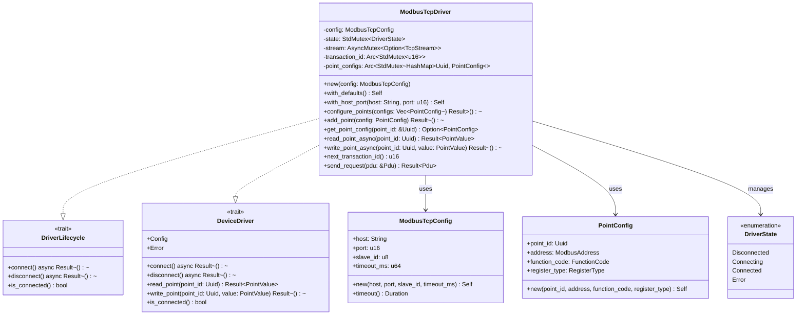
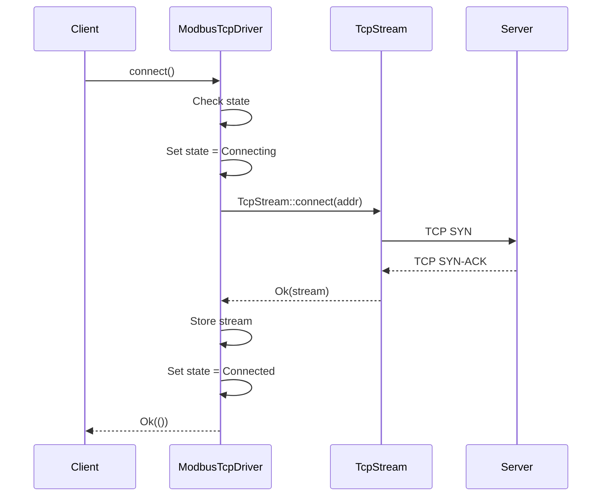
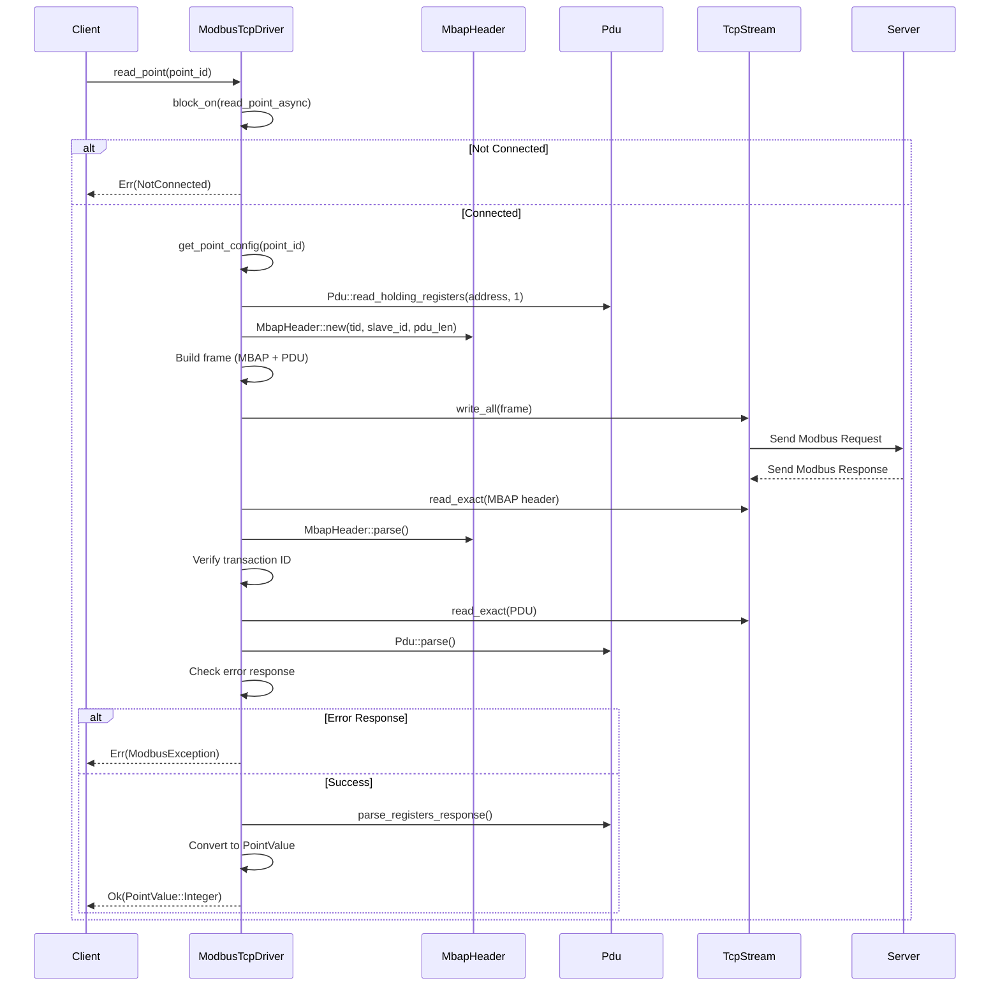
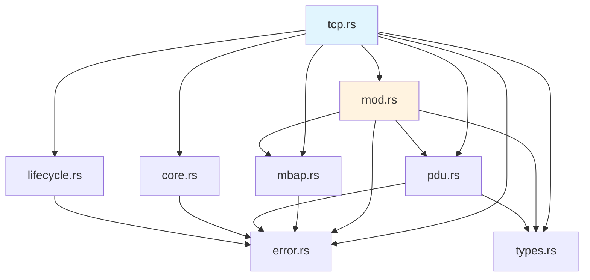

# R1-S1-003 详细设计文档: Modbus TCP 驱动实现

## 文档信息

| 项目 | 内容 |
|------|------|
| 任务编号 | R1-S1-003 |
| 任务名称 | Modbus TCP 驱动实现 |
| 文档类型 | 详细设计 |
| 作者 | sw-jerry (Software Architect) |
| 日期 | 2026-05-02 |
| 版本 | 1.0 |
| 状态 | 已完成 |

---

## 1. 模块结构

```
kayak-backend/src/drivers/
├── modbus/
│   ├── mod.rs           # 模块导出
│   ├── tcp.rs           # ModbusTcpDriver, ModbusTcpConfig, PointConfig, DriverState
│   ├── rtu.rs           # Modbus RTU 驱动 (独立实现)
│   ├── types.rs         # FunctionCode, ModbusAddress, RegisterType, ModbusValue
│   ├── pdu.rs           # PDU 构造与解析
│   ├── mbap.rs          # MBAP 头部构造与解析
│   ├── error.rs         # ModbusError, ModbusException
│   └── constants.rs     # 常量定义
├── core.rs              # DeviceDriver trait, PointValue
├── lifecycle.rs          # DriverLifecycle trait
├── error.rs             # DriverError
└── ...
```

### 1.1 文件说明

| 文件 | 描述 |
|------|------|
| `tcp.rs` | Modbus TCP 驱动核心实现，包含 `ModbusTcpDriver` 主类 |
| `mod.rs` | 统一导出 Modbus 相关类型 |
| `types.rs` | 定义 `FunctionCode`, `ModbusAddress`, `RegisterType`, `ModbusValue` |
| `pdu.rs` | PDU (Protocol Data Unit) 的构造与解析 |
| `mbap.rs` | MBAP (Modbus Application Protocol) 头部的构造与解析 |
| `error.rs` | Modbus 特有错误类型 (`ModbusError`, `ModbusException`) |

---

## 2. 类型定义

### 2.1 ModbusTcpConfig

Modbus TCP 驱动的配置结构体。

```rust
#[derive(Debug, Clone, Serialize, Deserialize)]
pub struct ModbusTcpConfig {
    /// 服务器主机地址
    pub host: String,
    /// TCP 端口
    pub port: u16,
    /// 从站 ID (Unit Identifier)
    pub slave_id: u8,
    /// 操作超时时间 (毫秒)
    pub timeout_ms: u64,
}
```

**字段说明**：

| 字段 | 类型 | 说明 |
|------|------|------|
| `host` | `String` | Modbus TCP 服务器主机地址，支持 IP 地址或主机名 |
| `port` | `u16` | TCP 端口号，默认 502 |
| `slave_id` | `u8` | 从站标识符，用于 Modbus 协议层面区分目标设备 |
| `timeout_ms` | `u64` | 操作超时时间（毫秒），用于连接、读取、写入操作 |

**构造方法**：

```rust
impl ModbusTcpConfig {
    /// 使用完整参数创建配置
    pub fn new(host: impl Into<String>, port: u16, slave_id: u8, timeout_ms: u64) -> Self

    /// 获取超时时长
    pub fn timeout(&self) -> Duration
}
```

**默认配置**：

```rust
impl Default for ModbusTcpConfig {
    fn default() -> Self {
        Self {
            host: "127.0.0.1".to_string(),
            port: 502,
            slave_id: 1,
            timeout_ms: 3000,
        }
    }
}
```

### 2.2 DriverState

驱动连接状态枚举。

```rust
#[derive(Debug, Clone, Copy, PartialEq, Eq, Default)]
pub enum DriverState {
    /// 断开状态
    #[default]
    Disconnected,
    /// 连接中
    Connecting,
    /// 已连接
    Connected,
    /// 连接失败
    Error,
}
```

**状态转换图**：

```
                    ┌─────────────────┐
                    │  Disconnected   │
                    └────────┬────────┘
                             │ connect()
                             ▼
                    ┌─────────────────┐
         ┌─────────│   Connecting    │─────────┐
         │         └────────┬────────┘         │
         │                  │                   │
   connect() 失败     connect() 成功      超时/错误
         │                  │                   │
         ▼                  ▼                   │
┌─────────────────┐  ┌─────────────────┐       │
│     Error       │  │    Connected    │       │
└─────────────────┘  └────────┬────────┘       │
                              │                │
                        disconnect()           │
                              │                │
                              ▼                │
                    ┌─────────────────┐        │
                    │  Disconnected   │◄───────┘
                    └─────────────────┘    (错误后)
```

### 2.3 PointConfig

测点配置结构体，将 UUID 映射到具体的 Modbus 地址和功能码。

```rust
#[derive(Debug, Clone)]
pub struct PointConfig {
    /// 测点 ID
    pub point_id: Uuid,
    /// Modbus 寄存器地址
    pub address: ModbusAddress,
    /// 功能码
    pub function_code: FunctionCode,
    /// 寄存器类型
    pub register_type: RegisterType,
}
```

**字段说明**：

| 字段 | 类型 | 说明 |
|------|------|------|
| `point_id` | `Uuid` | 测点的唯一标识符 |
| `address` | `ModbusAddress` | Modbus 寄存器地址 (0x0000-0xFFFF) |
| `function_code` | `FunctionCode` | 操作该测点使用的功能码 |
| `register_type` | `RegisterType` | 寄存器类型，决定读写属性 |

### 2.4 ModbusTcpDriver

主驱动结构体。

```rust
pub struct ModbusTcpDriver {
    /// 配置
    config: ModbusTcpConfig,
    /// 当前状态 (使用标准 Mutex 支持内部可变性)
    state: StdMutex<DriverState>,
    /// TCP 流 (使用异步 Mutex 支持 &self 访问)
    stream: AsyncMutex<Option<TcpStream>>,
    /// 事务 ID (原子递增)
    transaction_id: Arc<StdMutex<u16>>,
    /// 测点配置映射表 (point_id -> PointConfig)
    point_configs: Arc<StdMutex<HashMap<Uuid, PointConfig>>>,
}
```

**线程安全**：

```rust
unsafe impl Send for ModbusTcpDriver {}
unsafe impl Sync for ModbusTcpDriver {}
```

**内部组件说明**：

| 组件 | 类型 | 线程安全 | 用途 |
|------|------|----------|------|
| `config` | `ModbusTcpConfig` | - | 驱动配置（只读） |
| `state` | `StdMutex<DriverState>` | `StdMutex` | 连接状态管理 |
| `stream` | `AsyncMutex<Option<TcpStream>>` | `AsyncMutex` | TCP 流访问 |
| `transaction_id` | `Arc<StdMutex<u16>>` | `StdMutex` | 事务 ID 生成 |
| `point_configs` | `Arc<StdMutex<HashMap<Uuid, PointConfig>>>` | `StdMutex` | 测点配置映射 |

**构造方法**：

```rust
impl ModbusTcpDriver {
    /// 使用完整配置创建驱动
    pub fn new(config: ModbusTcpConfig) -> Self

    /// 使用默认配置创建驱动
    pub fn with_defaults() -> Self

    /// 使用主机和端口创建驱动
    pub fn with_host_port(host: impl Into<String>, port: u16) -> Self

    /// 配置测点映射
    pub fn configure_points(&self, configs: Vec<PointConfig>) -> Result<(), DriverError>

    /// 添加单个测点配置
    pub fn add_point(&self, config: PointConfig) -> Result<(), DriverError>

    /// 获取测点配置
    pub fn get_point_config(&self, point_id: &Uuid) -> Option<PointConfig>
}
```

---

## 3. Trait 实现

### 3.1 DriverLifecycle Trait

连接生命周期管理接口。

```rust
#[async_trait]
impl DriverLifecycle for ModbusTcpDriver {
    /// 连接到 Modbus TCP 服务器
    async fn connect(&mut self) -> Result<(), DriverError>

    /// 断开与 Modbus TCP 服务器的连接
    async fn disconnect(&mut self) -> Result<(), DriverError>

    /// 检查是否已连接
    fn is_connected(&self) -> bool
}
```

**`connect()` 实现**：

```rust
async fn connect(&mut self) -> Result<(), DriverError> {
    // 1. 检查是否已连接
    if *self.state.lock().unwrap() == DriverState::Connected {
        return Err(DriverError::AlreadyConnected);
    }

    // 2. 设置状态为 Connecting
    *self.state.lock().unwrap() = DriverState::Connecting;

    // 3. 构建地址字符串
    let addr = format!("{}:{}", self.config.host, self.config.port);
    let duration = self.config.timeout();

    // 4. 使用 tokio::time::timeout 建立 TCP 连接
    let result = timeout(duration, TcpStream::connect(&addr)).await;

    // 5. 处理连接结果
    match result {
        Err(_) => {
            // 超时
            *self.state.lock().unwrap() = DriverState::Error;
            Err(DriverError::Timeout { duration })
        }
        Ok(Err(e)) => {
            // 连接失败
            *self.state.lock().unwrap() = DriverState::Error;
            Err(DriverError::IoError(format!("Connection failed: {}", e)))
        }
        Ok(Ok(stream)) => {
            // 连接成功
            *self.stream.lock().await = Some(stream);
            *self.state.lock().unwrap() = DriverState::Connected;
            Ok(())
        }
    }
}
```

**`disconnect()` 实现**：

```rust
async fn disconnect(&mut self) -> Result<(), DriverError> {
    *self.stream.lock().await = None;
    *self.state.lock().unwrap() = DriverState::Disconnected;
    Ok(())
}
```

**`is_connected()` 实现**：

```rust
fn is_connected(&self) -> bool {
    *self.state.lock().unwrap() == DriverState::Connected
}
```

### 3.2 DeviceDriver Trait

设备驱动统一接口。

```rust
#[async_trait]
impl DeviceDriver for ModbusTcpDriver {
    type Config = ModbusTcpConfig;
    type Error = DriverError;

    async fn connect(&mut self) -> Result<(), Self::Error>
    async fn disconnect(&mut self) -> Result<(), Self::Error>

    fn read_point(&self, point_id: Uuid) -> Result<PointValue, Self::Error>
    fn write_point(&self, point_id: Uuid, value: PointValue) -> Result<(), Self::Error>

    fn is_connected(&self) -> bool
}
```

**同步方法实现（使用 block_on）**：

```rust
fn read_point(&self, point_id: Uuid) -> Result<PointValue, Self::Error> {
    // 使用 Handle::current().block_on 在同步上下文中调用异步方法
    tokio::runtime::Handle::current()
        .block_on(self.read_point_async(point_id))
}

fn write_point(&self, point_id: Uuid, value: PointValue) -> Result<(), Self::Error> {
    // 使用 Handle::current().block_on 在同步上下文中调用异步方法
    tokio::runtime::Handle::current()
        .block_on(self.write_point_async(point_id, value))
}
```

### 3.3 异步读写扩展

```rust
impl ModbusTcpDriver {
    /// 异步读取测点值
    pub async fn read_point_async(&self, point_id: Uuid) -> Result<PointValue, DriverError>

    /// 异步写入测点值
    pub async fn write_point_async(&self, point_id: Uuid, value: PointValue) -> Result<(), DriverError>
}
```

**`read_point_async()` 实现流程**：

```
1. 检查连接状态
         │
         ▼
2. 根据 point_id 查找 PointConfig
         │
         ▼
3. 根据 register_type 调用对应的读取方法：
   ├── Coil → read_single_coil()
   ├── DiscreteInput → read_single_discrete_input()
   ├── HoldingRegister → read_single_holding_register()
   └── InputRegister → read_single_input_register()
         │
         ▼
4. 将 ModbusValue 转换为 PointValue 并返回
```

**`write_point_async()` 实现流程**：

```
1. 检查连接状态
         │
         ▼
2. 根据 point_id 查找 PointConfig
         │
         ▼
3. 检查是否为只读类型 (DiscreteInput, InputRegister)
         │
         ▼
4. 根据 register_type 调用对应的写入方法：
   ├── Coil → write_single_coil()
   └── HoldingRegister → write_single_register()
         │
         ▼
5. 返回 Ok(())
```

---

## 4. MBAP/PDU 处理

### 4.1 MBAP 头部结构

```
┌─────────────┬─────────────┬─────────────┬─────────────┬─────────────┬─────────────┬─────────────┐
│   TID_H    │   TID_L    │   PID_H    │   PID_L    │   LEN_H    │   LEN_L    │     UID     │
│  (Byte 0)  │  (Byte 1)  │  (Byte 2)  │  (Byte 3)  │  (Byte 4)  │  (Byte 5)  │  (Byte 6)  │
└─────────────┴─────────────┴─────────────┴─────────────┴─────────────┴─────────────┴─────────────┘
```

| 字段 | 长度 | 说明 |
|------|------|------|
| TID (Transaction ID) | 2 字节 | 事务标识符，用于匹配请求和响应 |
| PID (Protocol ID) | 2 字节 | 协议标识符，Modbus TCP 固定为 0 |
| LEN (Length) | 2 字节 | 后续字节长度 = Unit ID (1) + PDU |
| UID (Unit ID) | 1 字节 | 从站标识符 |

**Rust 实现** (`mbap.rs`)：

```rust
pub struct MbapHeader {
    pub transaction_id: u16,
    pub protocol_id: u16,  // 固定为 0
    pub length: u16,        // 1 (UID) + PDU 长度
    pub unit_id: u8,
}

impl MbapHeader {
    pub const LENGTH: usize = 7;
    pub const MODBUS_PROTOCOL_ID: u16 = 0x0000;

    pub fn new(transaction_id: u16, unit_id: u8, pdu_length: u16) -> Self {
        Self {
            transaction_id,
            protocol_id: Self::MODBUS_PROTOCOL_ID,
            length: 1 + pdu_length,
            unit_id,
        }
    }

    pub fn to_bytes(&self) -> [u8; 7] { /* ... */ }
    pub fn parse(data: &[u8]) -> Result<Self, ModbusError> { /* ... */ }
    pub fn pdu_length(&self) -> u16 { self.length.saturating_sub(1) }
}
```

### 4.2 PDU 结构

```
┌───────────────────┬─────────────────────────────┐
│  Function Code    │          Data               │
│    (1 byte)       │       (N bytes)            │
└───────────────────┴─────────────────────────────┘
```

**读取功能码 PDU**：

| 功能码 | 名称 | PDU 结构 |
|--------|------|----------|
| 0x01 | ReadCoils | `[0x01, ADDR_H, ADDR_L, QTY_H, QTY_L]` |
| 0x02 | ReadDiscreteInputs | `[0x02, ADDR_H, ADDR_L, QTY_H, QTY_L]` |
| 0x03 | ReadHoldingRegisters | `[0x03, ADDR_H, ADDR_L, QTY_H, QTY_L]` |
| 0x04 | ReadInputRegisters | `[0x04, ADDR_H, ADDR_L, QTY_H, QTY_L]` |

**写入功能码 PDU**：

| 功能码 | 名称 | PDU 结构 |
|--------|------|----------|
| 0x05 | WriteSingleCoil | `[0x05, ADDR_H, ADDR_L, VALUE_H, VALUE_L]` (ON=0xFF00, OFF=0x0000) |
| 0x06 | WriteSingleRegister | `[0x06, ADDR_H, ADDR_L, VALUE_H, VALUE_L]` |

**Rust 实现** (`pdu.rs`)：

```rust
pub struct Pdu {
    pub function_code: FunctionCode,
    pub data: Vec<u8>,
}

impl Pdu {
    // 读取 PDU 构造
    pub fn read_coils(address: ModbusAddress, quantity: u16) -> Result<Self, ModbusError>
    pub fn read_discrete_inputs(address: ModbusAddress, quantity: u16) -> Result<Self, ModbusError>
    pub fn read_holding_registers(address: ModbusAddress, quantity: u16) -> Result<Self, ModbusError>
    pub fn read_input_registers(address: ModbusAddress, quantity: u16) -> Result<Self, ModbusError>

    // 写入 PDU 构造
    pub fn write_single_coil(address: ModbusAddress, value: bool) -> Result<Self, ModbusError>
    pub fn write_single_register(address: ModbusAddress, value: u16) -> Result<Self, ModbusError>

    // 响应解析
    pub fn parse_coils_response(&self) -> Result<Vec<bool>, ModbusError>
    pub fn parse_registers_response(&self) -> Result<Vec<u16>, ModbusError>
    pub fn is_error_response(&self) -> bool
    pub fn exception_code(&self) -> Option<u8>
}
```

### 4.3 完整帧组装

**请求帧格式**：

```
┌─────────────┐   ┌─────────────────────────┐
│ MBAP Header │ + │      PDU               │
│  (7 bytes)  │   │  (1 + N bytes)        │
└─────────────┘   └─────────────────────────┘
```

**`send_request()` 实现**：

```rust
async fn send_request(&self, pdu: &Pdu) -> Result<Pdu, ModbusError> {
    // 1. 获取事务 ID
    let tid = self.next_transaction_id();
    let slave_id = self.config.slave_id;

    // 2. 获取 TCP 流
    let mut stream = self.stream.lock().await;
    let stream = stream.as_mut().ok_or(ModbusError::NotConnected)?;

    // 3. 构建 MBAP 头部
    let mbap = MbapHeader::new(tid, slave_id, pdu.len() as u16);

    // 4. 组装完整帧
    let mut frame = Vec::with_capacity(MbapHeader::LENGTH + pdu.len());
    frame.extend_from_slice(&mbap.to_bytes());
    frame.extend_from_slice(&pdu.to_bytes());

    // 5. 发送请求
    stream.write_all(&frame).await.map_err(|e| {
        *self.state.lock().unwrap() = DriverState::Error;
        ModbusError::IoError(format!("Failed to send request: {}", e))
    })?;

    // 6. 接收 MBAP 头部
    let mut mbap_buf = [0u8; MbapHeader::LENGTH];
    let duration = self.config.timeout();

    timeout(duration, stream.read_exact(&mut mbap_buf)).await
        .map_err(|_| { *self.state.lock().unwrap() = DriverState::Error; ModbusError::Timeout { duration } })?;

    // 7. 解析并验证 MBAP
    let response_mbap = MbapHeader::parse(&mbap_buf)?;
    if response_mbap.transaction_id != tid {
        return Err(ModbusError::MbapError(format!(
            "Transaction ID mismatch: expected {}, got {}",
            tid, response_mbap.transaction_id
        )));
    }

    // 8. 接收 PDU 数据
    let pdu_len = response_mbap.pdu_length() as usize;
    let mut pdu_buf = vec![0u8; pdu_len];

    timeout(duration, stream.read_exact(&mut pdu_buf)).await
        .map_err(|_| { *self.state.lock().unwrap() = DriverState::Error; ModbusError::Timeout { duration } })?;

    // 9. 解析 PDU
    let response_pdu = Pdu::parse(&pdu_buf)?;

    // 10. 检查异常响应
    if response_pdu.is_error_response() {
        if let Some(exception_code) = response_pdu.exception_code() {
            let exception = ModbusException::from_u8(exception_code);
            return Err(ModbusError::from(exception));
        }
    }

    Ok(response_pdu)
}
```

### 4.4 事务 ID 管理

```rust
fn next_transaction_id(&self) -> u16 {
    let mut tid = self.transaction_id.lock().unwrap();
    *tid = tid.wrapping_add(1);
    *tid
}
```

- 使用 `wrapping_add` 防止溢出
- 事务 ID 从 1 开始（初始值 0，第一次调用返回 1）
- 在 0xFFFF 后回绕到 0

---

## 5. 测点映射

### 5.1 映射表结构

```
HashMap<Uuid, PointConfig>
```

**映射关系**：

```
point_id (Uuid)          PointConfig
     │                        │
     │                        ├── point_id: Uuid (相同)
     │                        ├── address: ModbusAddress
     │                        ├── function_code: FunctionCode
     │                        └── register_type: RegisterType
     │
     └────────────────────────► 通过 get_point_config(point_id) 查询
```

### 5.2 测点配置流程

```rust
// 1. 创建驱动
let driver = ModbusTcpDriver::with_host_port("127.0.0.1", 1502);

// 2. 创建测点配置
let point_config = PointConfig::new(
    uuid!("550e8400-e29b-41d4-a716-446655440000"),
    ModbusAddress::new(0),
    FunctionCode::ReadHoldingRegisters,
    RegisterType::HoldingRegister,
);

// 3. 添加测点配置
driver.add_point(point_config)?;

// 4. 读取时自动映射
let value = driver.read_point(uuid!("550e8400-e29b-41d4-a716-446655440000"))?;
```

### 5.3 功能码映射

| RegisterType | 读取功能码 | 写入功能码 | 数据类型 |
|--------------|-----------|-----------|---------|
| `Coil` | 0x01 (ReadCoils) | 0x05 (WriteSingleCoil) | Boolean |
| `DiscreteInput` | 0x02 (ReadDiscreteInputs) | 只读 | Boolean |
| `HoldingRegister` | 0x03 (ReadHoldingRegisters) | 0x06 (WriteSingleRegister) | Integer |
| `InputRegister` | 0x04 (ReadInputRegisters) | 只读 | Integer |

---

## 6. 错误处理

### 6.1 ModbusException 异常码

| 异常码 | 名称 | 说明 |
|--------|------|------|
| 0x01 | IllegalFunction | 非法功能码 |
| 0x02 | IllegalDataAddress | 非法数据地址 |
| 0x03 | IllegalDataValue | 非法数据值 |
| 0x04 | ServerDeviceFailure | 服务器设备故障 |
| 0x05 | Acknowledge | 确认（服务器忙但已接受） |
| 0x06 | ServerBusy | 服务器忙 |
| 0x08 | MemoryParityError | 内存奇偶校验错误 |

### 6.2 异常响应处理

```rust
if response_pdu.is_error_response() {
    if let Some(exception_code) = response_pdu.exception_code() {
        let exception = ModbusException::from_u8(exception_code);
        return Err(ModbusError::from(exception));
    }
}
```

### 6.3 错误转换 (ModbusError → DriverError)

```rust
impl From<ModbusError> for DriverError {
    fn from(err: ModbusError) -> Self {
        match err {
            // Modbus 异常映射到 InvalidValue
            ModbusError::IllegalFunction => DriverError::InvalidValue {
                message: "Illegal function".into(),
            },
            ModbusError::IllegalDataAddress => DriverError::InvalidValue {
                message: "Illegal data address".into(),
            },
            ModbusError::IllegalDataValue => DriverError::InvalidValue {
                message: "Illegal data value".into(),
            },
            // ... 其他映射
        }
    }
}
```

---

## 7. 实现要点

### 7.1 并发控制

**状态管理**：

```rust
state: StdMutex<DriverState>
```

使用 `StdMutex`（标准库互斥锁）管理状态，因为状态访问是同步的。

**TCP 流管理**：

```rust
stream: AsyncMutex<Option<TcpStream>>
```

使用 `AsyncMutex`（Tokio 异步互斥锁）管理 TCP 流，因为在 async 上下文中需要非阻塞的锁访问。

### 7.2 超时处理

使用 `tokio::time::timeout` 实现超时控制：

```rust
use tokio::time::timeout;
use std::time::Duration;

let duration = Duration::from_millis(self.config.timeout_ms);
let result = timeout(duration, some_async_operation()).await;

match result {
    Err(_) => Err(ModbusError::Timeout { duration }),
    Ok(Err(e)) => Err(ModbusError::IoError(e.to_string())),
    Ok(Ok(value)) => Ok(value),
}
```

### 7.3 同步/异步边界

`DeviceDriver` trait 定义了同步方法 `read_point` 和 `write_point`，但实际实现需要调用异步代码。使用 `tokio::runtime::Handle::current().block_on()` 桥接：

```rust
fn read_point(&self, point_id: Uuid) -> Result<PointValue, Self::Error> {
    tokio::runtime::Handle::current()
        .block_on(self.read_point_async(point_id))
}
```

**注意**：这要求调用者处于 Tokio 运行时上下文中。

### 7.4 数量限制

| 操作类型 | 最小值 | 最大值 |
|---------|--------|--------|
| ReadCoils | 1 | 2000 |
| ReadDiscreteInputs | 1 | 2000 |
| ReadHoldingRegisters | 1 | 125 |
| ReadInputRegisters | 1 | 125 |
| WriteSingleCoil | 1 | 1 |
| WriteSingleRegister | 1 | 1 |

当前实现固定使用数量 1（单寄存器/单线圈读取）。

---

## 8. 类图



---

## 9. 序列图

### 9.1 连接流程



### 9.2 读取流程



---

## 10. 文件清单

| 文件路径 | 描述 | 行数 |
|---------|------|------|
| `kayak-backend/src/drivers/modbus/tcp.rs` | Modbus TCP 驱动主实现 | 770 |
| `kayak-backend/src/drivers/modbus/mod.rs` | 模块导出 | 19 |
| `kayak-backend/src/drivers/modbus/types.rs` | 类型定义 | 707 |
| `kayak-backend/src/drivers/modbus/pdu.rs` | PDU 构造解析 | 677 |
| `kayak-backend/src/drivers/modbus/mbap.rs` | MBAP 构造解析 | 259 |
| `kayak-backend/src/drivers/modbus/error.rs` | 错误类型 | 694 |
| `kayak-backend/src/drivers/core.rs` | DeviceDriver trait | 120 |
| `kayak-backend/src/drivers/lifecycle.rs` | DriverLifecycle trait | 35 |
| `kayak-backend/src/drivers/error.rs` | DriverError | 71 |

---

## 11. 依赖关系



---

## 版本历史

| 版本 | 日期 | 作者 | 变更说明 |
|------|------|------|----------|
| 1.0 | 2026-05-02 | sw-jerry | 初始版本，基于实现代码生成 |

---

*本文档由 Kayak 项目架构团队维护。*
