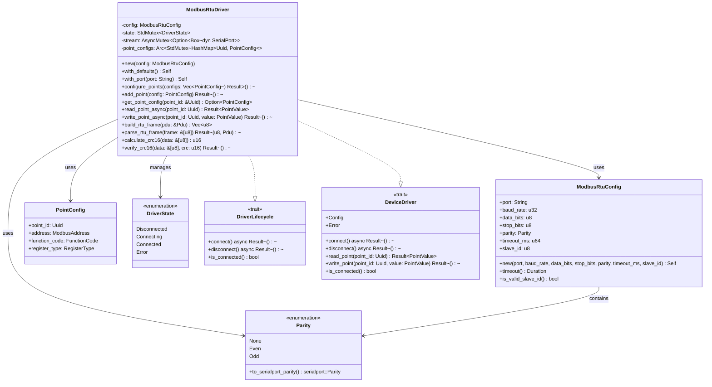
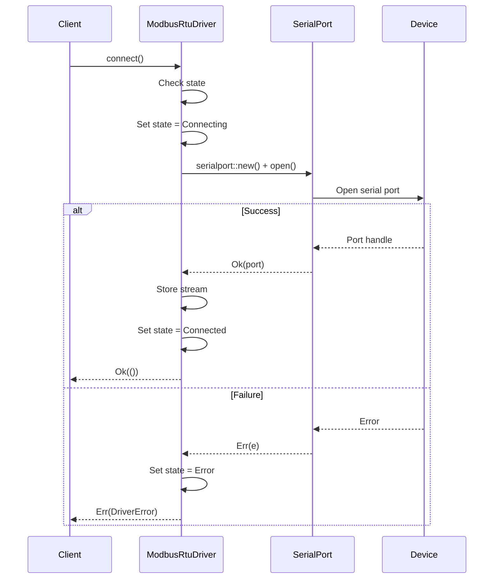
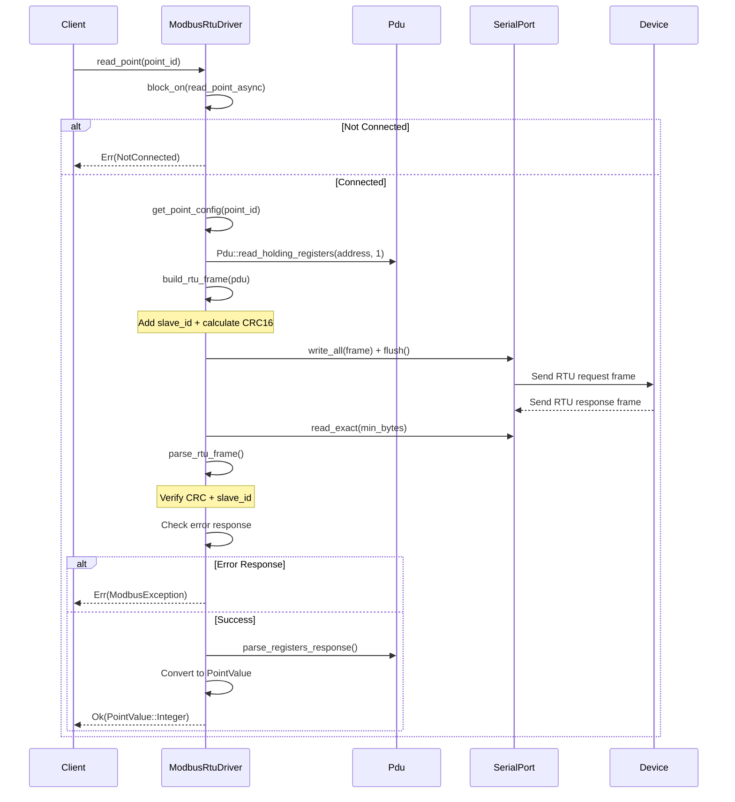
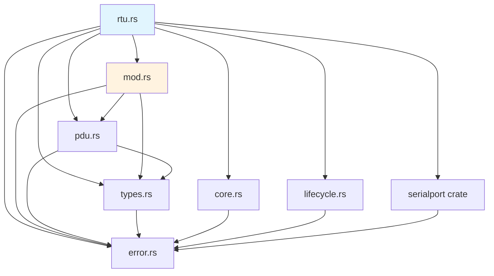

# R1-S1-004 详细设计文档: Modbus RTU 驱动实现

## 文档信息

| 项目 | 内容 |
|------|------|
| 任务编号 | R1-S1-004 |
| 任务名称 | Modbus RTU 驱动实现 |
| 文档类型 | 详细设计 |
| 作者 | sw-jerry (Software Architect) |
| 日期 | 2026-05-02 |
| 版本 | 1.0 |
| 状态 | 已完成 |

---

## 1. 模块结构

```
kayak-backend/src/drivers/
├── modbus/
│   ├── mod.rs           # 模块导出
│   ├── tcp.rs           # Modbus TCP 驱动 (R1-S1-003)
│   ├── rtu.rs           # ModbusRtuDriver, ModbusRtuConfig, Parity, PointConfig, DriverState
│   ├── types.rs         # FunctionCode, ModbusAddress, RegisterType, ModbusValue
│   ├── pdu.rs           # PDU 构造与解析
│   ├── mbap.rs          # MBAP 头部构造与解析 (TCP 专用)
│   ├── error.rs         # ModbusError, ModbusException
│   └── constants.rs     # 常量定义
├── core.rs              # DeviceDriver trait, PointValue
├── lifecycle.rs         # DriverLifecycle trait
├── error.rs             # DriverError
└── ...
```

### 1.1 文件说明

| 文件 | 描述 |
|------|------|
| `rtu.rs` | Modbus RTU 驱动核心实现，包含 `ModbusRtuDriver` 主类 |
| `mod.rs` | 统一导出 Modbus 相关类型 |
| `types.rs` | 定义 `FunctionCode`, `ModbusAddress`, `RegisterType`, `ModbusValue` |
| `pdu.rs` | PDU (Protocol Data Unit) 的构造与解析 |
| `error.rs` | Modbus 特有错误类型 (`ModbusError`, `ModbusException`) |

### 1.2 RTU 与 TCP 关键差异

| 特性 | Modbus TCP | Modbus RTU |
|------|------------|------------|
| 传输层 | TCP/IP | 串口 (RS-485/RS-232) |
| 帧头 | MBAP (7字节) | 无 (仅 slave_id) |
| 帧尾 | 无 | CRC16 (2字节) |
| 事务ID | 有 (2字节) | 无 (单主模式) |
| 从站地址 | Unit ID (MBAP中) | Slave ID (首字节) |
| 连接方式 | Socket连接 | 串口打开/关闭 |
| 数据校验 | TCP 底层校验 | CRC16-MODBUS |

---

## 2. 类型定义

### 2.1 Parity

串口校验位配置枚举。

```rust
#[derive(Debug, Clone, Copy, PartialEq, Eq, Serialize, Deserialize)]
pub enum Parity {
    /// 无校验
    None,
    /// 偶校验
    Even,
    /// 奇校验
    Odd,
}
```

**方法**：

```rust
impl Parity {
    /// 转换为 serialport crate 的校验位配置
    pub fn to_serialport_parity(&self) -> serialport::Parity
}
```

**默认值**：`Parity::None`

### 2.2 ModbusRtuConfig

Modbus RTU 驱动的配置结构体。

```rust
#[derive(Debug, Clone, Serialize, Deserialize)]
pub struct ModbusRtuConfig {
    /// 串口路径 (如 "/dev/ttyUSB0" 或 "COM3")
    pub port: String,
    /// 波特率 (如 9600, 19200, 115200)
    pub baud_rate: u32,
    /// 数据位 (7 或 8)
    pub data_bits: u8,
    /// 停止位 (1 或 2)
    pub stop_bits: u8,
    /// 校验位
    pub parity: Parity,
    /// 操作超时时间 (毫秒)
    pub timeout_ms: u64,
    /// 从站 ID (1-247)
    pub slave_id: u8,
}
```

**字段说明**：

| 字段 | 类型 | 说明 |
|------|------|------|
| `port` | `String` | 串口设备路径，Linux 通常为 `/dev/ttyUSB0`，Windows 为 `COM3` |
| `baud_rate` | `u32` | 波特率，支持标准值：1200, 2400, 4800, 9600, 19200, 38400, 57600, 115200 |
| `data_bits` | `u8` | 数据位，通常为 7 或 8，标准 Modbus 使用 8 |
| `stop_bits` | `u8` | 停止位，1 或 2 |
| `parity` | `Parity` | 校验位：无(None)、偶(Even)、奇(Odd) |
| `timeout_ms` | `u64` | 操作超时时间（毫秒） |
| `slave_id` | `u8` | 从站地址，范围 1-247 |

**构造方法**：

```rust
impl ModbusRtuConfig {
    /// 使用完整参数创建配置
    pub fn new(
        port: impl Into<String>,
        baud_rate: u32,
        data_bits: u8,
        stop_bits: u8,
        parity: Parity,
        timeout_ms: u64,
        slave_id: u8,
    ) -> Self

    /// 获取超时时长
    pub fn timeout(&self) -> Duration

    /// 验证从站 ID 是否有效 (1-247)
    pub fn is_valid_slave_id(&self) -> bool
}
```

**默认配置**：

```rust
impl Default for ModbusRtuConfig {
    fn default() -> Self {
        Self {
            port: "/dev/ttyUSB0".to_string(),
            baud_rate: 9600,
            data_bits: 8,
            stop_bits: 1,
            parity: Parity::None,
            timeout_ms: 3000,
            slave_id: 1,
        }
    }
}
```

### 2.3 DriverState

驱动连接状态枚举。

```rust
#[derive(Debug, Clone, Copy, PartialEq, Eq, Default)]
pub enum DriverState {
    /// 断开状态
    #[default]
    Disconnected,
    /// 连接中
    Connecting,
    /// 已连接
    Connected,
    /// 连接失败
    Error,
}
```

**状态转换图**：

```
                    ┌─────────────────┐
                    │  Disconnected   │
                    └────────┬────────┘
                             │ connect()
                             ▼
                    ┌─────────────────┐
         ┌─────────│   Connecting    │─────────┐
         │         └────────┬────────┘         │
         │                  │                   │
   connect() 失败     connect() 成功      超时/错误
         │                  │                   │
         ▼                  ▼                   │
┌─────────────────┐  ┌─────────────────┐       │
│     Error       │  │    Connected    │       │
└─────────────────┘  └────────┬────────┘       │
                             │                │
                       disconnect()           │
                             │                │
                             ▼                │
                   ┌─────────────────┐        │
                   │  Disconnected   │◄───────┘
                   └─────────────────┘    (错误后)
```

### 2.4 PointConfig

测点配置结构体，将 UUID 映射到具体的 Modbus 地址和功能码。

```rust
#[derive(Debug, Clone)]
pub struct PointConfig {
    /// 测点 ID
    pub point_id: Uuid,
    /// Modbus 寄存器地址
    pub address: ModbusAddress,
    /// 功能码
    pub function_code: FunctionCode,
    /// 寄存器类型
    pub register_type: RegisterType,
}
```

**字段说明**：

| 字段 | 类型 | 说明 |
|------|------|------|
| `point_id` | `Uuid` | 测点的唯一标识符 |
| `address` | `ModbusAddress` | Modbus 寄存器地址 (0x0000-0xFFFF) |
| `function_code` | `FunctionCode` | 操作该测点使用的功能码 |
| `register_type` | `RegisterType` | 寄存器类型，决定读写属性 |

### 2.5 ModbusRtuDriver

主驱动结构体。

```rust
pub struct ModbusRtuDriver {
    /// 配置
    config: ModbusRtuConfig,
    /// 当前状态 (使用标准 Mutex 支持内部可变性)
    state: StdMutex<DriverState>,
    /// 串口 (使用 Mutex 支持内部可变性)
    stream: AsyncMutex<Option<Box<dyn serialport::SerialPort>>>,
    /// 测点配置映射表 (point_id -> PointConfig)
    point_configs: Arc<StdMutex<HashMap<Uuid, PointConfig>>>,
}
```

**线程安全**：

```rust
unsafe impl Send for ModbusRtuDriver {}
unsafe impl Sync for ModbusRtuDriver {}
```

**内部组件说明**：

| 组件 | 类型 | 线程安全 | 用途 |
|------|------|----------|------|
| `config` | `ModbusRtuConfig` | - | 驱动配置（只读） |
| `state` | `StdMutex<DriverState>` | `StdMutex` | 连接状态管理 |
| `stream` | `AsyncMutex<Option<Box<dyn SerialPort>>>` | `AsyncMutex` | 串口访问 |
| `point_configs` | `Arc<StdMutex<HashMap<Uuid, PointConfig>>>` | `StdMutex` | 测点配置映射 |

**构造方法**：

```rust
impl ModbusRtuDriver {
    /// 使用完整配置创建驱动
    pub fn new(config: ModbusRtuConfig) -> Self

    /// 使用默认配置创建驱动
    pub fn with_defaults() -> Self

    /// 使用指定串口创建驱动
    pub fn with_port(port: impl Into<String>) -> Self

    /// 获取当前配置引用
    pub fn config(&self) -> &ModbusRtuConfig

    /// 获取当前状态
    pub fn state(&self) -> DriverState

    /// 配置测点映射
    pub fn configure_points(&self, configs: Vec<PointConfig>) -> Result<(), DriverError>

    /// 添加单个测点配置
    pub fn add_point(&self, config: PointConfig) -> Result<(), DriverError>

    /// 获取测点配置
    pub fn get_point_config(&self, point_id: &Uuid) -> Option<PointConfig>
}
```

---

## 3. RTU 帧格式

### 3.1 RTU 帧结构

```
┌───────────┬───────────────┬─────────────┬───────────┬───────────┐
│  Slave ID │ Function Code │    Data     │   CRC_L   │   CRC_H   │
│  (1 byte) │   (1 byte)   │  (N bytes)  │ (1 byte)  │ (1 byte)  │
└───────────┴───────────────┴─────────────┴───────────┴───────────┘
```

| 字段 | 长度 | 说明 |
|------|------|------|
| Slave ID | 1 byte | 从站地址 (1-247) |
| Function Code | 1 byte | 功能码 (0x01-0x10) |
| Data | N bytes | 数据部分 |
| CRC | 2 bytes | CRC16 校验码，**低字节在前** |

### 3.2 帧示例

**ReadHoldingRegisters 请求** (读取保持寄存器，地址 0x0000，数量 1)：

```
帧: [0x01] [0x03] [0x00] [0x00] [0x00] [0x01] [0x0A] [0x84]
     |------- slave_id -------|------- PDU --------|--- CRC --|
```

- Slave ID: 0x01
- Function Code: 0x03 (ReadHoldingRegisters)
- PDU: [0x03, 0x00, 0x00, 0x00, 0x01] - [功能码, 地址高, 地址低, 数量高, 数量低]
- CRC: 0x840A (低字节 0x0A 在前，高字节 0x84 在后)

**响应示例** (值 0x1234)：

```
帧: [0x01] [0x03] [0x02] [0x12] [0x34] [0xXX] [0xXX]
     |------- slave_id -------|------- PDU --------|--- CRC --|
```

- PDU: [0x03, 0x02, 0x12, 0x34] - [功能码, 字节数, 值高, 值低]

---

## 4. CRC16 实现

### 4.1 CRC16-MODBUS 算法

Modbus RTU 使用标准 CRC16-MODBUS 算法：

- **多项式**: 0x8005 (二进制: 1000000000000101)
- **初始值**: 0xFFFF
- **位序**: 低字节在前 (little-endian)
- **反射算法**: 是（每位都进行反射）

### 4.2 算法伪代码

```
FUNCTION CRC16(data[]):
    crc ← 0xFFFF

    FOR EACH byte IN data:
        crc ← crc XOR byte

        FOR i ← 0 TO 7:
            IF (crc AND 0x0001) ≠ 0:
                crc ← (crc >> 1) XOR 0xA001
            ELSE:
                crc ← crc >> 1
            END IF
        END FOR
    END FOR

    RETURN crc
END FUNCTION
```

### 4.3 Rust 实现

```rust
/// 计算 CRC16-MODBUS
///
/// 使用标准 Modbus CRC16 算法：
/// - 多项式: 0x8005
/// - 初始值: 0xFFFF
/// - 低字节在前
pub fn calculate_crc16(data: &[u8]) -> u16 {
    let mut crc: u16 = 0xFFFF;

    for &byte in data {
        crc ^= byte as u16;

        for _ in 0..8 {
            if crc & 0x0001 != 0 {
                crc = (crc >> 1) ^ 0xA001;
            } else {
                crc >>= 1;
            }
        }
    }

    crc
}
```

### 4.4 验证测试数据

| 输入数据 | 预期 CRC16 | 说明 |
|----------|------------|------|
| `[0x01, 0x03, 0x00, 0x00, 0x00, 0x01]` | 0x840A | ReadHoldingRegisters, addr=0, qty=1 |
| `[0x01, 0x03, 0x00, 0x00, 0x00, 0x0A]` | 0xC5CD | ReadHoldingRegisters, addr=0, qty=10 |
| `[0x01, 0x05, 0x00, 0x00, 0xFF, 0x00]` | 0x8C3A | WriteSingleCoil, addr=0, value=ON |

### 4.5 CRC 验证方法

```rust
/// 验证 CRC16
///
/// # Arguments
/// * `data` - 要验证的数据 (不包含 CRC)
/// * `crc` - 接收到的 CRC (低字节在前)
///
/// # Returns
/// * `Ok(())` - CRC 验证通过
/// * `Err(ModbusError)` - CRC 验证失败
pub fn verify_crc16(data: &[u8], crc: u16) -> Result<(), ModbusError> {
    let calculated = Self::calculate_crc16(data);
    if calculated == crc {
        Ok(())
    } else {
        Err(ModbusError::FrameChecksumMismatch {
            expected: calculated,
            actual: crc,
        })
    }
}

/// 从字节数组解析 CRC (低字节在前)
pub fn parse_crc(bytes: &[u8]) -> Option<u16> {
    if bytes.len() < 2 {
        return None;
    }
    Some(u16::from(bytes[0]) | (u16::from(bytes[1]) << 8))
}
```

---

## 5. Trait 实现

### 5.1 DriverLifecycle Trait

连接生命周期管理接口。

```rust
#[async_trait]
impl DriverLifecycle for ModbusRtuDriver {
    /// 连接到 Modbus RTU 从站
    async fn connect(&mut self) -> Result<(), DriverError>

    /// 断开与 Modbus RTU 从站的连接
    async fn disconnect(&mut self) -> Result<(), DriverError>

    /// 检查是否已连接
    fn is_connected(&self) -> bool
}
```

**`connect()` 实现流程**：

```
1. 检查当前状态
         │
         ▼
2. 如果已连接，返回 AlreadyConnected 错误
         │
         ▼
3. 设置状态为 Connecting
         │
         ▼
4. 使用 serialport::new() 配置串口参数：
   ├── port: 串口路径
   ├── baud_rate: 波特率
   ├── data_bits: 数据位 (7 或 8)
   ├── stop_bits: 停止位 (1 或 2)
   ├── parity: 校验位 (None/Even/Odd)
   └── timeout: 超时时长
         │
         ▼
5. 调用 open() 打开串口
         │
         ▼
6. 成功：存储串口，设置状态为 Connected
         │
         ▼
7. 失败：设置状态为 Error，返回错误
```

**`connect()` 实现代码**：

```rust
async fn connect(&mut self) -> Result<(), DriverError> {
    if *self.state.lock().unwrap() == DriverState::Connected {
        return Err(DriverError::AlreadyConnected);
    }

    *self.state.lock().unwrap() = DriverState::Connecting;

    // 打开串口
    let port = serialport::new(&self.config.port, self.config.baud_rate)
        .data_bits(match self.config.data_bits {
            7 => serialport::DataBits::Seven,
            8 => serialport::DataBits::Eight,
            _ => serialport::DataBits::Eight,
        })
        .stop_bits(match self.config.stop_bits {
            1 => serialport::StopBits::One,
            2 => serialport::StopBits::Two,
            _ => serialport::StopBits::One,
        })
        .parity(self.config.parity.to_serialport_parity())
        .timeout(self.config.timeout())
        .open()
        .map_err(|e| {
            *self.state.lock().unwrap() = DriverState::Error;
            DriverError::IoError(format!("Failed to open serial port: {}", e))
        })?;

    *self.stream.lock().await = Some(port);
    *self.state.lock().unwrap() = DriverState::Connected;
    Ok(())
}
```

**`disconnect()` 实现**：

```rust
async fn disconnect(&mut self) -> Result<(), DriverError> {
    *self.stream.lock().await = None;
    *self.state.lock().unwrap() = DriverState::Disconnected;
    Ok(())
}
```

**`is_connected()` 实现**：

```rust
fn is_connected(&self) -> bool {
    *self.state.lock().unwrap() == DriverState::Connected
}
```

### 5.2 DeviceDriver Trait

设备驱动统一接口。

```rust
#[async_trait]
impl DeviceDriver for ModbusRtuDriver {
    type Config = ModbusRtuConfig;
    type Error = DriverError;

    async fn connect(&mut self) -> Result<(), Self::Error>
    async fn disconnect(&mut self) -> Result<(), Self::Error>

    fn read_point(&self, point_id: Uuid) -> Result<PointValue, Self::Error>
    fn write_point(&self, point_id: Uuid, value: PointValue) -> Result<(), Self::Error>

    fn is_connected(&self) -> bool
}
```

**同步方法实现（使用 block_on）**：

```rust
fn read_point(&self, point_id: Uuid) -> Result<PointValue, Self::Error> {
    tokio::runtime::Handle::current()
        .block_on(self.read_point_async(point_id))
}

fn write_point(&self, point_id: Uuid, value: PointValue) -> Result<(), Self::Error> {
    tokio::runtime::Handle::current()
        .block_on(self.write_point_async(point_id, value))
}
```

### 5.3 异步读写扩展

```rust
impl ModbusRtuDriver {
    /// 异步读取测点值
    pub async fn read_point_async(&self, point_id: Uuid) -> Result<PointValue, DriverError>

    /// 异步写入测点值
    pub async fn write_point_async(&self, point_id: Uuid, value: PointValue) -> Result<(), DriverError>
}
```

---

## 6. RTU 帧处理

### 6.1 帧组装

```rust
/// 组装 RTU 请求帧
///
/// 帧格式: [slave_id, function_code, data..., crc_low, crc_high]
fn build_rtu_frame(&self, pdu: &Pdu) -> Vec<u8> {
    let mut frame = Vec::with_capacity(1 + pdu.len() + 2);
    frame.push(self.config.slave_id);
    frame.extend_from_slice(&pdu.to_bytes());

    // 计算 CRC (包含 slave_id + pdu)
    let crc = Self::calculate_crc16(&frame);
    frame.push((crc & 0xFF) as u8);       // 低字节
    frame.push(((crc >> 8) & 0xFF) as u8); // 高字节

    frame
}
```

### 6.2 帧解析

```rust
/// 解析 RTU 响应帧
///
/// 帧格式: [slave_id, function_code, data..., crc_low, crc_high]
fn parse_rtu_frame(&self, frame: &[u8]) -> Result<(u8, Pdu), ModbusError> {
    // 最小帧长: slave_id(1) + function_code(1) + crc(2) = 4 bytes
    if frame.len() < 4 {
        return Err(ModbusError::IncompleteFrame);
    }

    let slave_id = frame[0];

    // 验证从站 ID 匹配
    if slave_id != self.config.slave_id {
        return Err(ModbusError::InvalidValue(
            format!(
                "Slave ID mismatch: expected {}, got {}",
                self.config.slave_id, slave_id
            )
        ));
    }

    // 提取 PDU 部分 (不含 slave_id 和 CRC)
    let pdu_data = &frame[1..frame.len() - 2];
    let pdu = Pdu::parse(pdu_data)?;

    // 验证 CRC
    let received_crc = Self::parse_crc(&frame[frame.len() - 2..])
        .ok_or(ModbusError::IncompleteFrame)?;
    let data_for_crc = &frame[..frame.len() - 2]; // 不含 CRC 部分
    Self::verify_crc16(data_for_crc, received_crc)?;

    Ok((slave_id, pdu))
}
```

### 6.3 请求/响应流程

**`send_request()` 实现流程**：

```
1. 获取串口流引用
         │
         ▼
2. 组装 RTU 帧 (build_rtu_frame)
         │
         ▼
3. 发送请求 (write_all + flush)
         │
         ▼
4. 读取响应头 (最小 5 字节: slave_id + func_code + byte_count + crc)
         │
         ▼
5. 解析 RTU 帧 (parse_rtu_frame)
         │
         ▼
6. 检查异常响应
         │
         ▼
7. 根据功能码确定是否需要读取更多字节
         │
         ▼
8. 重新解析完整帧并返回 PDU
```

---

## 7. 测点映射

### 7.1 映射表结构

```
HashMap<Uuid, PointConfig>
```

### 7.2 功能码映射

| RegisterType | 读取功能码 | 写入功能码 | 数据类型 |
|--------------|-----------|-----------|---------|
| `Coil` | 0x01 (ReadCoils) | 0x05 (WriteSingleCoil) | Boolean |
| `DiscreteInput` | 0x02 (ReadDiscreteInputs) | 只读 | Boolean |
| `HoldingRegister` | 0x03 (ReadHoldingRegisters) | 0x06 (WriteSingleRegister) | Integer |
| `InputRegister` | 0x04 (ReadInputRegisters) | 只读 | Integer |

### 7.3 测点配置流程

```rust
// 1. 创建驱动
let driver = ModbusRtuDriver::with_port("/dev/ttyUSB0");

// 2. 创建测点配置
let point_config = PointConfig::new(
    uuid!("550e8400-e29b-41d4-a716-446655440000"),
    ModbusAddress::new(0),
    FunctionCode::ReadHoldingRegisters,
    RegisterType::HoldingRegister,
);

// 3. 添加测点配置
driver.add_point(point_config)?;

// 4. 读取时自动映射
let value = driver.read_point(uuid!("550e8400-e29b-41d4-a716-446655440000"))?;
```

---

## 8. 错误处理

### 8.1 ModbusException 异常码

| 异常码 | 名称 | 说明 |
|--------|------|------|
| 0x01 | IllegalFunction | 非法功能码 |
| 0x02 | IllegalDataAddress | 非法数据地址 |
| 0x03 | IllegalDataValue | 非法数据值 |
| 0x04 | ServerDeviceFailure | 服务器设备故障 |
| 0x05 | Acknowledge | 确认（服务器忙但已接受） |
| 0x06 | ServerBusy | 服务器忙 |
| 0x08 | MemoryParityError | 内存奇偶校验错误 |

### 8.2 RTU 特有错误

| 错误类型 | 说明 |
|----------|------|
| `FrameChecksumMismatch` | CRC16 校验失败 |
| `IncompleteFrame` | 帧数据不完整（缺少字节） |
| `InvalidValue` | 从站 ID 不匹配等 |

---

## 9. 类图



---

## 10. 序列图

### 10.1 连接流程



### 10.2 读取流程



---

## 11. 文件清单

| 文件路径 | 描述 | 行数 |
|---------|------|------|
| `kayak-backend/src/drivers/modbus/rtu.rs` | Modbus RTU 驱动主实现 | 1095 |
| `kayak-backend/src/drivers/modbus/mod.rs` | 模块导出 | ~20 |
| `kayak-backend/src/drivers/modbus/types.rs` | 类型定义 | 707 |
| `kayak-backend/src/drivers/modbus/pdu.rs` | PDU 构造解析 | 677 |
| `kayak-backend/src/drivers/modbus/error.rs` | 错误类型 | 694 |
| `kayak-backend/src/drivers/core.rs` | DeviceDriver trait | 120 |
| `kayak-backend/src/drivers/lifecycle.rs` | DriverLifecycle trait | 35 |
| `kayak-backend/src/drivers/error.rs` | DriverError | 71 |

---

## 12. 依赖关系



---

## 13. 依赖项

### 13.1 外部依赖

| 依赖 | 版本 | 用途 |
|------|------|------|
| `tokio` | ^1.0 | 异步运行时 |
| `async-trait` | ^0.1 | async trait 支持 |
| `serialport` | ^4.0 | 串口通信 |
| `uuid` | ^1.0 | 测点 UUID |
| `serde` | ^1.0 | 序列化/反序列化 |

### 13.2 内部依赖

| 模块 | 依赖路径 | 用途 |
|------|----------|------|
| `DeviceDriver` | `drivers/core.rs` | 驱动统一接口 |
| `DriverLifecycle` | `drivers/lifecycle.rs` | 连接生命周期 |
| `DriverError` | `drivers/error.rs` | 驱动错误类型 |
| `ModbusError` | `drivers/modbus/error.rs` | Modbus 特有错误 |
| `Pdu` | `drivers/modbus/pdu.rs` | PDU 构造与解析 |
| `FunctionCode` | `drivers/modbus/types.rs` | 功能码枚举 |
| `ModbusAddress` | `drivers/modbus/types.rs` | 寄存器地址 |
| `RegisterType` | `drivers/modbus/types.rs` | 寄存器类型 |

---

## 版本历史

| 版本 | 日期 | 作者 | 变更说明 |
|------|------|------|----------|
| 1.0 | 2026-05-02 | sw-jerry | 初始版本，基于实现代码生成 |

---

*本文档由 Kayak 项目架构团队维护。*
