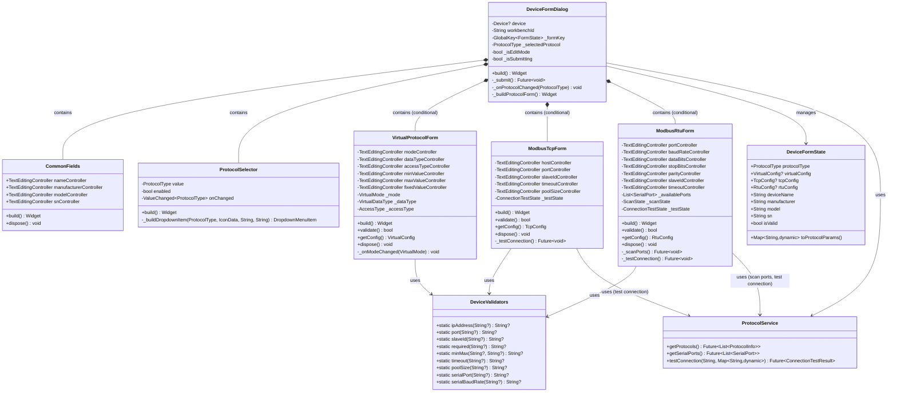
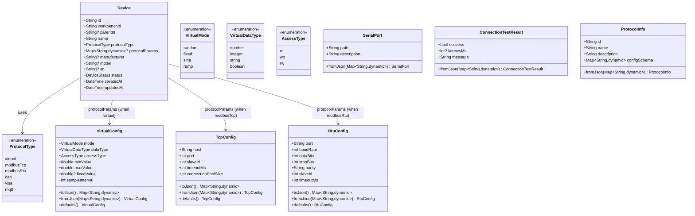
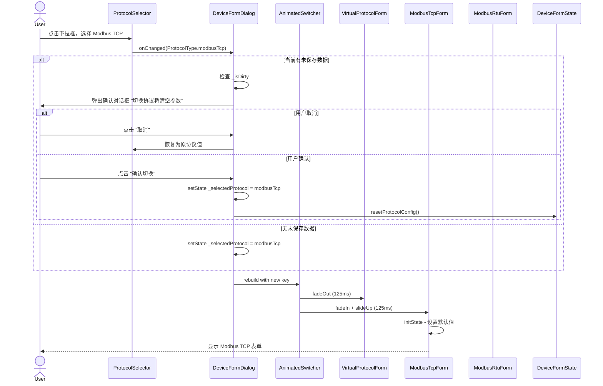
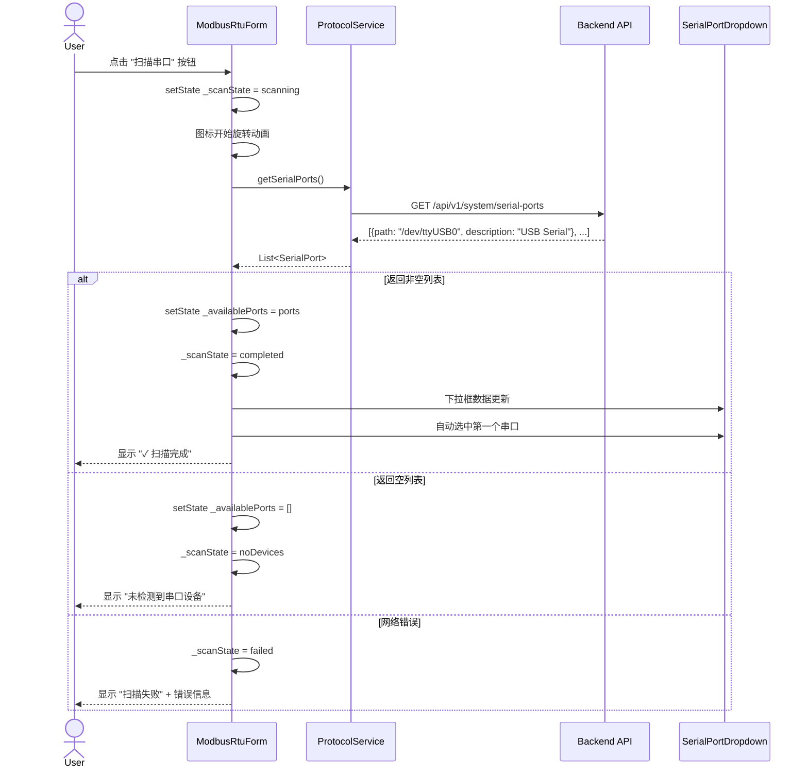
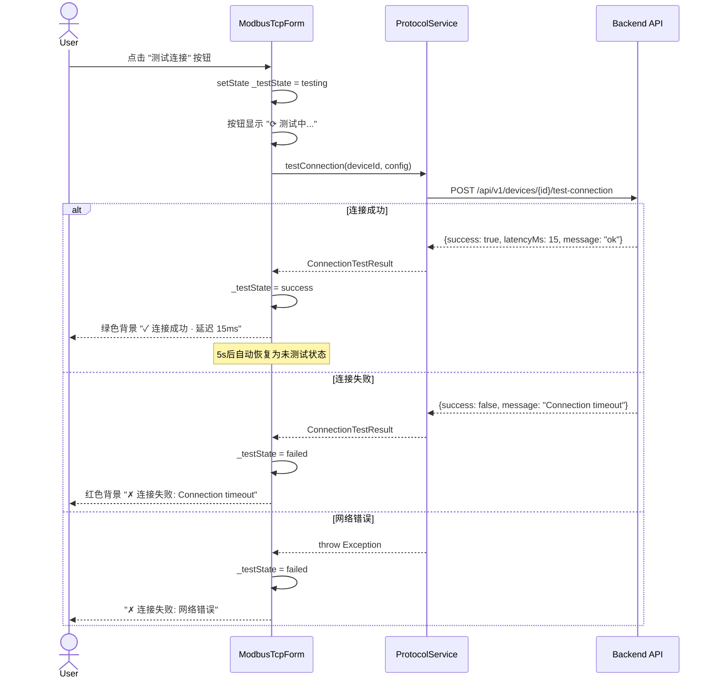
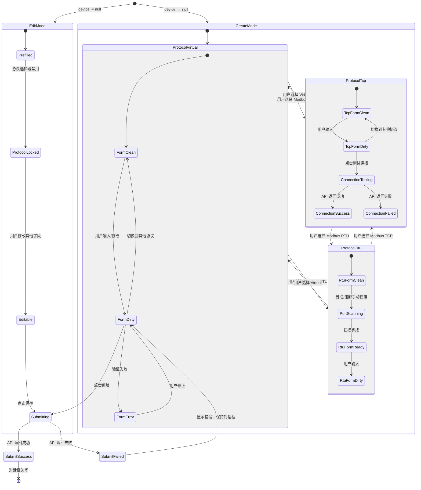

# R1-S1-006 多协议设备配置UI - 详细设计文档

## 文档信息

| 项目 | 内容 |
|------|------|
| 任务编号 | R1-S1-006 |
| 作者 | sw-jerry (Software Architect) |
| 日期 | 2026-05-03 |
| 状态 | 设计完成 |
| 版本 | 1.0 |
| 依赖文档 | [PRD](../prd.md#25-多协议设备配置ui-r1-proto-ui-001), [测试用例](../test/R1-S1-006_test_cases.md), [UI设计规范](../ui/design_spec_v2.md), [UI规格说明](../ui/ui_specifications_v2.md), [Figma原型](../ui/figma/device_config_page.md) |

---

## 目录

1. [概述](#1-概述)
2. [模块结构 (组件树)](#2-模块结构-组件树)
3. [类图与组件层次 (UML)](#3-类图与组件层次-uml)
4. [核心组件接口定义](#4-核心组件接口定义)
5. [状态管理方案](#5-状态管理方案)
6. [数据流图](#6-数据流图)
7. [表单验证架构](#7-表单验证架构)
8. [与后端API的集成接口](#8-与后端api的集成接口)
9. [路由和导航设计](#9-路由和导航设计)
10. [错误处理方案](#10-错误处理方案)
11. [详细实现规范](#11-详细实现规范)

---

## 1. 概述

### 1.1 设计目标

对现有 `DeviceFormDialog` 进行扩展重构，支持三种协议 (Virtual, Modbus TCP, Modbus RTU) 的动态表单。核心目标：

1. **协议动态切换**: 选择不同协议时，表单区域动态替换对应的参数字段，不使用 `Visibility` 控制而是条件渲染
2. **表单验证隔离**: 每种协议有独立的验证器，协议切换时验证状态不交叉污染
3. **编辑模式锁定**: 编辑已有设备时协议选择器禁用，防止意外更改
4. **通用字段保留**: 设备名称/制造商/型号/序列号在协议切换时保持不变
5. **后端集成**: 支持串口扫描、连接测试等异步 API 调用

### 1.2 技术选型

| 组件 | 选型 | 理由 |
|------|------|------|
| UI 框架 | Flutter 3.19+ Material Design 3 | 项目既定技术栈 |
| 状态管理 | flutter_riverpod (ConsumerStatefulWidget) | 与现有代码一致 |
| 表单组件 | Flutter Form + TextFormField/DropdownButtonFormField | Material Design 标准表单 |
| 动效系统 | AnimatedSwitcher + AnimatedSize | 250ms ease-in-out 协议切换动画 |
| HTTP 客户端 | dio (现有 `ApiClientInterface`) | 与现有认证体系集成 |
| 模型生成 | freezed + json_serializable | 与现有 Device 模型一致 |

### 1.3 目录结构

```
kayak-frontend/lib/features/workbench/
├── models/
│   ├── device.dart                    # 现有 Device 模型 (不变)
│   └── protocol_config.dart           # [新增] 协议配置数据模型
├── services/
│   ├── device_service.dart            # 现有 DeviceService (扩展 updateDevice)
│   ├── protocol_service.dart          # [新增] 协议列表/串口扫描/连接测试 API
│   └── serial_port_service.dart       # [新增] 串口扫描专用服务
├── validators/
│   └── device_validators.dart         # [新增] 表单验证器集合
├── widgets/
│   └── device/
│       ├── device_form_dialog.dart    # [重构] 主对话框 - 协议路由
│       ├── protocol_selector.dart     # [新增] 协议选择器组件
│       ├── virtual_form.dart          # [新增] Virtual 协议表单
│       ├── modbus_tcp_form.dart       # [新增] Modbus TCP 协议表单
│       ├── modbus_rtu_form.dart       # [新增] Modbus RTU 协议表单
│       └── common_fields.dart         # [新增] 通用字段组件 (名称/制造商/型号/SN)
├── providers/
│   └── device_form_provider.dart      # [新增] 表单状态管理 provider
```

### 1.4 设计原则

- **SRP**: 每个表单组件只负责一种协议的参数字段
- **OCP**: 新增协议只需新增表单组件 + 注册到协议路由表，无需修改主对话框
- **DIP**: 表单组件通过回调 (`onChanged`) 向父级报告状态，不直接依赖父级实现
- **ISP**: 验证器按协议分隔，每种协议有独立的 `Validator` 接口
- **LSP**: 所有协议表单实现相同的 `ProtocolForm` 抽象接口

---

## 2. 模块结构 (组件树)

### 2.1 组件树 (完整层次)

```
DeviceFormDialog (ConsumerStatefulWidget)
├── AlertDialog (Large Dialog, maxWidth: 800px)
│   ├── Dialog Header
│   │   ├── Title: "创建设备" / "编辑设备 - {name}"
│   │   └── CloseButton (IconButton, close)
│   │
│   ├── Scrollable Content
│   │   ├── Section: 基本信息
│   │   │   ├── SectionTitle ("基本信息")
│   │   │   └── CommonFields
│   │   │       ├── DeviceNameField (TextFormField, 必填 *)
│   │   │       ├── ManufacturerField (TextFormField, 可选)
│   │   │       ├── ModelField (TextFormField, 可选)
│   │   │       └── SerialNumberField (TextFormField, 可选)
│   │   │
│   │   ├── Section: 协议配置
│   │   │   ├── SectionTitle ("协议配置")
│   │   │   ├── ProtocolSelector (DropdownButtonFormField)
│   │   │   │   ├── Option: Virtual (developer_board icon)
│   │   │   │   ├── Option: Modbus TCP (lan icon)
│   │   │   │   └── Option: Modbus RTU (usb icon)
│   │   │   │
│   │   │   └── AnimatedSwitcher (250ms ease-in-out)
│   │   │       ├── [key: ProtocolType.virtual]
│   │   │       │   └── VirtualProtocolForm
│   │   │       ├── [key: ProtocolType.modbusTcp]
│   │   │       │   └── ModbusTcpForm
│   │   │       └── [key: ProtocolType.modbusRtu]
│   │   │           └── ModbusRtuForm
│   │   │
│   │   └── Section: 测点配置 (可选，可折叠)
│   │       ├── SectionTitle ("测点配置")
│   │       └── PointConfigTable (后续实现)
│   │
│   └── Sticky Footer
│       ├── Left: ConnectionTestButton (仅 Modbus TCP/RTU)
│       ├── Right: CancelButton (TextButton, "取消")
│       └── Right: SubmitButton (PrimaryButton, "创建"/"保存")
```

### 2.2 组件文件清单

| 文件 | 组件 | 职责 | 新增/修改 |
|------|------|------|----------|
| `device_form_dialog.dart` | `DeviceFormDialog` | 主对话框容器，协议路由，提交逻辑 | **重构** |
| `protocol_selector.dart` | `ProtocolSelector` | 协议下拉选择，编辑模式锁定 | **新增** |
| `virtual_form.dart` | `VirtualProtocolForm` | Virtual 协议参数字段集 | **新增** |
| `modbus_tcp_form.dart` | `ModbusTcpForm` | Modbus TCP 参数字段集 | **新增** |
| `modbus_rtu_form.dart` | `ModbusRtuForm` | Modbus RTU 参数字段集 + 串口扫描 | **新增** |
| `common_fields.dart` | `CommonFields` | 设备名称/制造商/型号/SN 字段 | **新增** |
| `protocol_config.dart` | 数据模型 | VirtualConfig/TcpConfig/RtuConfig | **新增** |
| `device_validators.dart` | 验证函数 | IP/端口/从站ID/串口验证 | **新增** |
| `device_form_provider.dart` | 状态管理 | 表单状态 + 协议切换逻辑 | **新增** |
| `protocol_service.dart` | API 服务 | 协议列表/串口扫描/连接测试 HTTP | **新增** |
| `serial_port_service.dart` | API 服务 | 串口扫描专用 | **新增** |

---

## 3. 类图与组件层次 (UML)

### 3.1 组件类图



### 3.2 数据模型类图



### 3.3 协议切换动态序列图



### 3.4 串口扫描序列图



### 3.5 连接测试序列图



---

## 4. 核心组件接口定义

### 4.1 主对话框: `DeviceFormDialog`

```dart
/// 设备表单对话框 - 支持创建和编辑设备
///
/// 协议路由中心：根据 [_selectedProtocol] 动态渲染对应的协议表单。
/// 编辑模式下协议选择器锁定。
class DeviceFormDialog extends ConsumerStatefulWidget {
  final Device? device;       // null = 创建模式, non-null = 编辑模式
  final String workbenchId;  // 创建模式必填的工作台ID

  const DeviceFormDialog({
    super.key,
    this.device,
    required this.workbenchId,
  });

  @override
  ConsumerState<DeviceFormDialog> createState() => _DeviceFormDialogState();
}

class _DeviceFormDialogState extends ConsumerState<DeviceFormDialog> {
  // === 状态 ===
  final _formKey = GlobalKey<FormState>();
  ProtocolType _selectedProtocol = ProtocolType.virtual;
  bool _isSubmitting = false;
  bool _isDirty = false;           // 追踪表单是否被修改
  bool get _isEditMode => widget.device != null;

  // === 通用字段控制器 (生命周期由 State 管理) ===
  late final TextEditingController _nameController;
  late final TextEditingController _manufacturerController;
  late final TextEditingController _modelController;
  late final TextEditingController _snController;

  // === 协议表单 GlobalKey (用于调用子表单 validate/getConfig) ===
  final _virtualFormKey = GlobalKey<VirtualProtocolFormState>();
  final _tcpFormKey = GlobalKey<ModbusTcpFormState>();
  final _rtuFormKey = GlobalKey<ModbusRtuFormState>();

  // === 生命周期 ===
  @override
  void initState() { /* 初始化控制器，预填充编辑数据 */ }
  @override
  void dispose() { /* 释放所有控制器 */ }

  // === 构建 ===
  @override
  Widget build(BuildContext context) {
    return AlertDialog(
      // 使用 Large Dialog 规格: maxWidth 800px, maxHeight 90vh, borderRadius 28px
      content: Form(
        key: _formKey,
        child: Column(
          children: [
            // Section 1: 基本信息
            _buildBasicInfoSection(),
            // Section 2: 协议配置
            _buildProtocolSection(),
            // Section 3: 测点配置 (可选)
            _buildPointConfigSection(),
          ],
        ),
      ),
      actions: _buildActions(),
    );
  }

  // === 协议表单路由 ===
  Widget _buildProtocolForm() {
    return AnimatedSwitcher(
      duration: const Duration(milliseconds: 250),
      switchInCurve: Curves.easeInOut,
      switchOutCurve: Curves.easeInOut,
      transitionBuilder: (child, animation) {
        return FadeTransition(
          opacity: animation,
          child: SizeTransition(
            sizeFactor: animation,
            axis: Axis.vertical,
            child: child,
          ),
        );
      },
      child: switch (_selectedProtocol) {
        ProtocolType.virtual   => VirtualProtocolForm(key: _virtualFormKey, ...),
        ProtocolType.modbusTcp => ModbusTcpForm(key: _tcpFormKey, ...),
        ProtocolType.modbusRtu => ModbusRtuForm(key: _rtuFormKey, ...),
        _                      => const SizedBox.shrink(),
      },
    );
  }

  // === 协议切换处理 ===
  void _onProtocolChanged(ProtocolType newProtocol) {
    if (_isDirty && _selectedProtocol != newProtocol) {
      _showProtocolSwitchConfirmDialog(newProtocol);
    } else {
      setState(() => _selectedProtocol = newProtocol);
    }
  }

  // === 提交 ===
  Future<void> _submit() async {
    // 1. 验证通用字段 (FormState.validate)
    // 2. 验证当前协议表单字段 (调用子表单 validate)
    // 3. 构建 protocolParams
    // 4. 调用 DeviceService.createDevice 或 updateDevice
  }

  // === 错误处理 ===
  void _handleSubmitError(Object error) { /* SnackBar 显示错误 */ }
}
```

### 4.2 协议选择器: `ProtocolSelector`

```dart
/// 协议选择器组件
///
/// 下拉选择框，选项包含 Virtual / Modbus TCP / Modbus RTU。
/// 编辑模式下禁用，选项高度 72px，含图标和描述。
class ProtocolSelector extends StatelessWidget {
  final ProtocolType value;
  final bool enabled;
  final ValueChanged<ProtocolType> onChanged;

  const ProtocolSelector({
    super.key,
    required this.value,
    required this.enabled,
    required this.onChanged,
  });

  /// 可选的三个协议项
  static const List<({ProtocolType type, IconData icon, String label, String description})> _options = [
    (
      type: ProtocolType.virtual,
      icon: Icons.developer_board,
      label: 'Virtual',
      description: '虚拟设备（用于测试和模拟）',
    ),
    (
      type: ProtocolType.modbusTcp,
      icon: Icons.lan,
      label: 'Modbus TCP',
      description: 'TCP/IP 网络通信协议',
    ),
    (
      type: ProtocolType.modbusRtu,
      icon: Icons.usb,
      label: 'Modbus RTU',
      description: '串口通信协议 (RS485/RS232)',
    ),
  ];

  @override
  Widget build(BuildContext context) {
    return DropdownButtonFormField<ProtocolType>(
      key: const Key('protocol-type-dropdown'),
      value: value,
      decoration: const InputDecoration(
        labelText: '协议类型 *',
        filled: true,
        // 使用 Filled Dropdown 样式 (Surface Container Highest, 50% opacity)
      ),
      items: _options.map((opt) => DropdownMenuItem(
        value: opt.type,
        child: Row(
          children: [
            Icon(opt.icon, size: 24, color: Theme.of(context).colorScheme.primary),
            const SizedBox(width: 12),
            Expanded(
              child: Column(
                crossAxisAlignment: CrossAxisAlignment.start,
                mainAxisSize: MainAxisSize.min,
                children: [
                  Text(opt.label, style: Theme.of(context).textTheme.titleMedium),
                  Text(opt.description, style: Theme.of(context).textTheme.bodySmall),
                ],
              ),
            ),
          ],
        ),
      )).toList(),
      onChanged: enabled ? onChanged : null,
      // 编辑模式: onChanged = null → 自动禁用
    );
  }
}
```

### 4.3 Virtual 协议表单: `VirtualProtocolForm`

```dart
/// Virtual 协议参数表单
///
/// 包含模式选择、数据类型、访问类型、最小值/最大值、固定值（条件显示）。
/// 状态内部管理，通过 [validate] 和 [getConfig] 向父级暴露。
class VirtualProtocolForm extends StatefulWidget {
  final VirtualConfig? initialConfig;  // 编辑模式预填充
  final bool isEditMode;

  const VirtualProtocolForm({
    super.key,
    this.initialConfig,
    this.isEditMode = false,
  });

  @override
  VirtualProtocolFormState createState() => VirtualProtocolFormState();
}

class VirtualProtocolFormState extends State<VirtualProtocolForm> {
  // === 控制器 ===
  late final TextEditingController _minValueController;
  late final TextEditingController _maxValueController;
  late final TextEditingController _fixedValueController;
  late final TextEditingController _sampleIntervalController;

  // === 选择器状态 ===
  VirtualMode _mode = VirtualMode.random;
  VirtualDataType _dataType = VirtualDataType.number;
  AccessType _accessType = AccessType.rw;

  // === 生命周期 ===
  @override
  void initState() {
    super.initState();
    if (widget.initialConfig != null) {
      // 预填充
      _mode = widget.initialConfig!.mode;
      _dataType = widget.initialConfig!.dataType;
      _accessType = widget.initialConfig!.accessType;
      _minValueController = TextEditingController(
        text: widget.initialConfig!.minValue.toString());
      _maxValueController = TextEditingController(
        text: widget.initialConfig!.maxValue.toString());
      _sampleIntervalController = TextEditingController(
        text: widget.initialConfig!.sampleInterval.toString());
      if (widget.initialConfig!.fixedValue != null) {
        _fixedValueController = TextEditingController(
          text: widget.initialConfig!.fixedValue.toString());
      }
    } else {
      _minValueController = TextEditingController(text: '0');
      _maxValueController = TextEditingController(text: '100');
      _sampleIntervalController = TextEditingController(text: '1000');
      _fixedValueController = TextEditingController();
    }
  }

  @override
  void dispose() {
    _minValueController.dispose();
    _maxValueController.dispose();
    _fixedValueController.dispose();
    _sampleIntervalController.dispose();
    super.dispose();
  }

  // === 构建 ===
  @override
  Widget build(BuildContext context) {
    return Container(
      key: const Key('virtual-params-section'),
      padding: const EdgeInsets.all(24),
      decoration: BoxDecoration(
        color: Theme.of(context).colorScheme.surfaceContainerLowest,
        borderRadius: BorderRadius.circular(16),
        border: Border.all(color: Theme.of(context).colorScheme.outlineVariant),
      ),
      child: Column(
        crossAxisAlignment: CrossAxisAlignment.start,
        children: [
          // 标题行
          _buildTitleRow(),
          const SizedBox(height: 16),
          // 数据模式 *
          _buildModeDropdown(),
          const SizedBox(height: 16),
          // 数据类型 * | 访问类型 *
          _buildTypeRow(),
          const SizedBox(height: 16),
          // 最小值 * | 最大值 *
          _buildMinMaxRow(),
          // 固定值 (仅 Fixed 模式)
          if (_mode == VirtualMode.fixed) ...[
            const SizedBox(height: 16),
            _buildFixedValueField(),
          ],
        ],
      ),
    );
  }

  // === 公共方法 ===
  bool validate() {
    // 验证最小值 ≤ 最大值
    final min = double.tryParse(_minValueController.text);
    final max = double.tryParse(_maxValueController.text);
    if (min != null && max != null && min > max) {
      return false;
    }
    if (_mode == VirtualMode.fixed &&
        _fixedValueController.text.isEmpty) {
      return false;
    }
    return true;
  }

  VirtualConfig getConfig() {
    return VirtualConfig(
      mode: _mode,
      dataType: _dataType,
      accessType: _accessType,
      minValue: double.parse(_minValueController.text),
      maxValue: double.parse(_maxValueController.text),
      fixedValue: _mode == VirtualMode.fixed
          ? double.tryParse(_fixedValueController.text)
          : null,
      sampleInterval: int.parse(_sampleIntervalController.text),
    );
  }
}
```

### 4.4 Modbus TCP 协议表单: `ModbusTcpForm`

```dart
/// Modbus TCP 协议参数表单
class ModbusTcpForm extends StatefulWidget {
  final TcpConfig? initialConfig;
  final bool isEditMode;
  final String? deviceId; // 编辑模式传，用于测试连接

  const ModbusTcpForm({
    super.key,
    this.initialConfig,
    this.isEditMode = false,
    this.deviceId,
  });

  @override
  ModbusTcpFormState createState() => ModbusTcpFormState();
}

enum ConnectionTestState { idle, testing, success, failed }

class ModbusTcpFormState extends State<ModbusTcpForm> {
  late final TextEditingController _hostController;
  late final TextEditingController _portController;
  late final TextEditingController _slaveIdController;
  late final TextEditingController _timeoutController;
  late final TextEditingController _poolSizeController;

  ConnectionTestState _testState = ConnectionTestState.idle;
  String? _testMessage;

  @override
  void initState() {
    super.initState();
    final c = widget.initialConfig ?? TcpConfig.defaults();
    _hostController = TextEditingController(text: c.host);
    _portController = TextEditingController(text: c.port.toString());
    _slaveIdController = TextEditingController(text: c.slaveId.toString());
    _timeoutController = TextEditingController(text: c.timeoutMs.toString());
    _poolSizeController = TextEditingController(text: c.connectionPoolSize.toString());
  }

  @override
  Widget build(BuildContext context) {
    return Container(
      key: const Key('modbus-tcp-params-section'),
      // 同 VirtualForm 的容器样式
      padding: const EdgeInsets.all(24),
      decoration: BoxDecoration(
        color: Theme.of(context).colorScheme.surfaceContainerLowest,
        borderRadius: BorderRadius.circular(16),
        border: Border.all(color: Theme.of(context).colorScheme.outlineVariant),
      ),
      child: Column(
        crossAxisAlignment: CrossAxisAlignment.start,
        children: [
          _buildTitleRow(),
          const SizedBox(height: 16),
          // 主机地址 * (60%) | 端口 * (40%)
          Row(
            children: [
              Expanded(flex: 3, child: _buildHostField()),
              const SizedBox(width: 12),
              Expanded(flex: 2, child: _buildPortField()),
            ],
          ),
          const SizedBox(height: 16),
          // 从站ID * (33%) | 超时 (33%) | 连接池 (33%)
          Row(
            children: [
              Expanded(child: _buildSlaveIdField()),
              const SizedBox(width: 12),
              Expanded(child: _buildTimeoutField()),
              const SizedBox(width: 12),
              Expanded(child: _buildPoolSizeField()),
            ],
          ),
          const SizedBox(height: 16),
          _buildConnectionTestButton(),
        ],
      ),
    );
  }

  // === 公共方法 ===
  bool validate() {
    final host = _hostController.text;
    if (host.isEmpty || DeviceValidators.ipAddress(host) != null) return false;
    final port = int.tryParse(_portController.text);
    if (port == null || port < 1 || port > 65535) return false;
    final slaveId = int.tryParse(_slaveIdController.text);
    if (slaveId == null || slaveId < 1 || slaveId > 247) return false;
    // ... 超时、连接池验证
    return true;
  }

  TcpConfig getConfig() {
    return TcpConfig(
      host: _hostController.text,
      port: int.parse(_portController.text),
      slaveId: int.parse(_slaveIdController.text),
      timeoutMs: int.parse(_timeoutController.text),
      connectionPoolSize: int.parse(_poolSizeController.text),
    );
  }

  Future<void> _testConnection() async {
    setState(() {
      _testState = ConnectionTestState.testing;
      _testMessage = null;
    });
    try {
      final service = context.read(protocolServiceProvider);
      final result = await service.testConnection(
        widget.deviceId ?? 'new',
        getConfig().toJson(),
      );
      setState(() {
        _testState = result.success
            ? ConnectionTestState.success
            : ConnectionTestState.failed;
        _testMessage = result.message;
      });
      // 5s 后自动重置
      if (result.success) {
        Future.delayed(const Duration(seconds: 5), () {
          if (mounted) setState(() => _testState = ConnectionTestState.idle);
        });
      }
    } catch (e) {
      setState(() {
        _testState = ConnectionTestState.failed;
        _testMessage = e.toString();
      });
    }
  }
}
```

### 4.5 Modbus RTU 协议表单: `ModbusRtuForm`

```dart
/// Modbus RTU 协议参数表单
///
/// 包含串口选择（支持扫描）、波特率、数据位、停止位、校验、从站ID、超时。
class ModbusRtuForm extends StatefulWidget {
  final RtuConfig? initialConfig;
  final bool isEditMode;
  final String? deviceId;

  const ModbusRtuForm({
    super.key,
    this.initialConfig,
    this.isEditMode = false,
    this.deviceId,
  });

  @override
  ModbusRtuFormState createState() => ModbusRtuFormState();
}

enum ScanState { idle, scanning, completed, noDevices, failed }

class ModbusRtuFormState extends State<ModbusRtuForm> {
  // === 控制器 ===
  late final TextEditingController _slaveIdController;
  late final TextEditingController _timeoutController;

  // === 选择器状态 ===
  String? _selectedPort;
  int _baudRate = 9600;
  int _dataBits = 8;
  int _stopBits = 1;
  String _parity = 'None';

  // === 异步状态 ===
  List<SerialPort> _availablePorts = [];
  ScanState _scanState = ScanState.idle;
  ConnectionTestState _testState = ConnectionTestState.idle;
  String? _testMessage;

  @override
  void initState() {
    super.initState();
    if (widget.initialConfig != null) {
      _selectedPort = widget.initialConfig!.port;
      _baudRate = widget.initialConfig!.baudRate;
      _dataBits = widget.initialConfig!.dataBits;
      _stopBits = widget.initialConfig!.stopBits;
      _parity = widget.initialConfig!.parity;
      _slaveIdController = TextEditingController(
        text: widget.initialConfig!.slaveId.toString());
      _timeoutController = TextEditingController(
        text: widget.initialConfig!.timeoutMs.toString());
    } else {
      _slaveIdController = TextEditingController(text: '1');
      _timeoutController = TextEditingController(text: '1000');
    }
    // 创建设备时自动触发串口扫描
    if (!widget.isEditMode) {
      WidgetsBinding.instance.addPostFrameCallback((_) => _scanPorts());
    }
  }

  @override
  Widget build(BuildContext context) {
    return Container(
      key: const Key('modbus-rtu-params-section'),
      padding: const EdgeInsets.all(24),
      decoration: BoxDecoration(
        color: Theme.of(context).colorScheme.surfaceContainerLowest,
        borderRadius: BorderRadius.circular(16),
        border: Border.all(color: Theme.of(context).colorScheme.outlineVariant),
      ),
      child: Column(
        crossAxisAlignment: CrossAxisAlignment.start,
        children: [
          _buildTitleRow(),
          const SizedBox(height: 16),
          // 串口 * | [扫描串口]
          _buildSerialPortRow(),
          const SizedBox(height: 16),
          // 波特率 | 数据位 | 停止位 | 校验
          _buildSerialParamRow(),
          const SizedBox(height: 16),
          // 从站ID | 超时
          Row(
            children: [
              Expanded(child: _buildSlaveIdField()),
              const SizedBox(width: 12),
              Expanded(child: _buildTimeoutField()),
            ],
          ),
          const SizedBox(height: 16),
          _buildConnectionTestButton(),
        ],
      ),
    );
  }

  // === 公共方法 ===
  bool validate() {
    if (_selectedPort == null || _selectedPort!.isEmpty) return false;
    final slaveId = int.tryParse(_slaveIdController.text);
    if (slaveId == null || slaveId < 1 || slaveId > 247) return false;
    // 串口参数组合验证 (Modbus RTU 不支持 7N1)
    if (_dataBits == 7 && _parity == 'None') return false;
    return true;
  }

  RtuConfig getConfig() {
    return RtuConfig(
      port: _selectedPort!,
      baudRate: _baudRate,
      dataBits: _dataBits,
      stopBits: _stopBits,
      parity: _parity,
      slaveId: int.parse(_slaveIdController.text),
      timeoutMs: int.parse(_timeoutController.text),
    );
  }

  Future<void> _scanPorts() async {
    setState(() => _scanState = ScanState.scanning);
    try {
      final service = context.read(protocolServiceProvider);
      final ports = await service.getSerialPorts();
      setState(() {
        _availablePorts = ports;
        _scanState = ports.isEmpty ? ScanState.noDevices : ScanState.completed;
        // 自动选中第一个可用串口
        if (ports.isNotEmpty && _selectedPort == null) {
          _selectedPort = ports.first.path;
        }
      });
    } catch (e) {
      setState(() => _scanState = ScanState.failed);
    }
  }
}
```

### 4.6 通用字段: `CommonFields`

```dart
/// 设备通用字段组件
///
/// 设备名称、制造商、型号、序列号。协议切换时字段值保持不变。
class CommonFields extends StatelessWidget {
  final TextEditingController nameController;
  final TextEditingController manufacturerController;
  final TextEditingController modelController;
  final TextEditingController snController;

  const CommonFields({
    super.key,
    required this.nameController,
    required this.manufacturerController,
    required this.modelController,
    required this.snController,
  });

  @override
  Widget build(BuildContext context) {
    return Column(
      children: [
        TextFormField(
          key: const Key('device-name-field'),
          controller: nameController,
          decoration: const InputDecoration(
            labelText: '设备名称 *',
            hintText: '输入设备名称',
            filled: true,
          ),
          validator: DeviceValidators.requiredField('设备名称不能为空'),
        ),
        const SizedBox(height: 16),
        TextFormField(
          controller: manufacturerController,
          decoration: const InputDecoration(
            labelText: '制造商',
            hintText: '输入制造商（可选）',
            filled: true,
          ),
        ),
        const SizedBox(height: 16),
        TextFormField(
          controller: modelController,
          decoration: const InputDecoration(
            labelText: '型号',
            hintText: '输入型号（可选）',
            filled: true,
          ),
        ),
        const SizedBox(height: 16),
        TextFormField(
          controller: snController,
          decoration: const InputDecoration(
            labelText: '序列号',
            hintText: '输入序列号（可选）',
            filled: true,
          ),
        ),
      ],
    );
  }
}
```

### 4.7 数据模型: `protocol_config.dart`

```dart
/// 协议配置数据模型
///
/// 定义三种协议的配置结构，支持 JSON 序列化。

enum VirtualMode {
  random,   // 随机生成
  fixed,    // 固定值
  sine,     // 正弦波
  ramp;     // 线性递增
}

enum VirtualDataType {
  number,   // 浮点数
  integer,  // 整数
  string,   // 字符串
  boolean;  // 布尔值
}

enum AccessType {
  ro,  // 只读
  wo,  // 只写
  rw;  // 读写
}

/// Virtual 协议配置
class VirtualConfig {
  final VirtualMode mode;
  final VirtualDataType dataType;
  final AccessType accessType;
  final double minValue;
  final double maxValue;
  final double? fixedValue;
  final int sampleInterval;

  const VirtualConfig({
    required this.mode,
    required this.dataType,
    required this.accessType,
    required this.minValue,
    required this.maxValue,
    this.fixedValue,
    this.sampleInterval = 1000,
  });

  factory VirtualConfig.defaults() => const VirtualConfig(
    mode: VirtualMode.random,
    dataType: VirtualDataType.number,
    accessType: AccessType.rw,
    minValue: 0,
    maxValue: 100,
    sampleInterval: 1000,
  );

  factory VirtualConfig.fromJson(Map<String, dynamic> json) { /* ... */ }
  Map<String, dynamic> toJson() => {
    'mode': mode.name,
    'dataType': dataType.name,
    'accessType': accessType.name,
    'minValue': minValue,
    'maxValue': maxValue,
    if (fixedValue != null) 'fixedValue': fixedValue,
    'sampleInterval': sampleInterval,
  };
}

/// Modbus TCP 协议配置
class TcpConfig {
  final String host;
  final int port;
  final int slaveId;
  final int timeoutMs;
  final int connectionPoolSize;

  const TcpConfig({
    required this.host,
    this.port = 502,
    this.slaveId = 1,
    this.timeoutMs = 5000,
    this.connectionPoolSize = 4,
  });

  factory TcpConfig.defaults() => const TcpConfig(host: '');
  factory TcpConfig.fromJson(Map<String, dynamic> json) { /* ... */ }
  Map<String, dynamic> toJson() => {
    'host': host,
    'port': port,
    'slave_id': slaveId,
    'timeout_ms': timeoutMs,
    'connection_pool_size': connectionPoolSize,
  };
}

/// Modbus RTU 协议配置
class RtuConfig {
  final String port;
  final int baudRate;
  final int dataBits;
  final int stopBits;
  final String parity;
  final int slaveId;
  final int timeoutMs;

  const RtuConfig({
    required this.port,
    this.baudRate = 9600,
    this.dataBits = 8,
    this.stopBits = 1,
    this.parity = 'None',
    this.slaveId = 1,
    this.timeoutMs = 1000,
  });

  factory RtuConfig.defaults() => const RtuConfig(port: '');
  factory RtuConfig.fromJson(Map<String, dynamic> json) { /* ... */ }
  Map<String, dynamic> toJson() => {
    'port': port,
    'baud_rate': baudRate,
    'data_bits': dataBits,
    'stop_bits': stopBits,
    'parity': parity,
    'slave_id': slaveId,
    'timeout_ms': timeoutMs,
  };
}

/// 串口信息
class SerialPort {
  final String path;
  final String description;

  const SerialPort({required this.path, required this.description});

  factory SerialPort.fromJson(Map<String, dynamic> json) => SerialPort(
    path: json['path'] as String,
    description: json['description'] as String? ?? '',
  );
}

/// 连接测试结果
class ConnectionTestResult {
  final bool success;
  final int? latencyMs;
  final String message;

  const ConnectionTestResult({
    required this.success,
    this.latencyMs,
    required this.message,
  });

  factory ConnectionTestResult.fromJson(Map<String, dynamic> json) =>
      ConnectionTestResult(
        success: json['success'] as bool,
        latencyMs: json['latency_ms'] as int?,
        message: json['message'] as String? ?? '',
      );
}
```

---

## 5. 状态管理方案

### 5.1 方案选型

采用 **分层状态管理**：

| 层级 | 技术 | 管理内容 |
|------|------|---------|
| 组件本地状态 | `StatefulWidget.setState` | 协议选择、表单字段值、加载/测试状态 |
| 跨组件共享 | `Riverpod Provider` | DeviceService、ProtocolService 注入 |
| 表单验证 | `GlobalKey<FormState>` | Flutter Form 内置验证状态 |

**理由**:
- 表单状态完全隔离在对话框生命周期内，不需要全局共享
- 对话框关闭即销毁所有状态，无泄漏风险
- 协议切换通过 `setState` + `AnimatedSwitcher` 的 key 变化触发子组件重建，天然实现条件渲染
- 避免引入不必要的全局状态（如 Bloc/Cubit）增加复杂度

### 5.2 状态流转图



### 5.3 Provider 注册

```dart
/// protocol_service.dart
final protocolServiceProvider = Provider<ProtocolService>((ref) {
  final apiClient = ref.watch(apiClientProvider);
  return ProtocolService(apiClient);
});

/// 在顶层 ProviderScope 中自动注入
/// 子组件通过 ref.read(protocolServiceProvider) 获取
```

### 5.4 关键状态变量

```dart
class _DeviceFormDialogState extends ConsumerState<DeviceFormDialog> {
  // === 模式判断 ===
  bool get _isEditMode => widget.device != null;

  // === 协议选择器 ===
  ProtocolType _selectedProtocol = ProtocolType.virtual;

  // === 表单修改追踪 ===
  bool _isDirty = false;

  // === 提交状态 ===
  bool _isSubmitting = false;

  // === 错误状态 ===
  String? _submitError;  // 提交失败的错误消息

  // === 子表单引用 (用于跨组件验证) ===
  final _virtualFormKey = GlobalKey<VirtualProtocolFormState>();
  final _tcpFormKey = GlobalKey<ModbusTcpFormState>();
  final _rtuFormKey = GlobalKey<ModbusRtuFormState>();
}
```

---

## 6. 数据流图

### 6.1 创建模式数据流

```mermaid
flowchart TD
    A[用户打开对话框] --> B{检查 device 参数}
    B -->|null| C[创建模式]
    C --> D[初始化所有字段为默认值]
    D --> E[默认协议 = Virtual]
    E --> F[渲染 Virtual 表单]

    F --> G[用户输入设备名称等通用字段]
    G --> H[用户选择协议类型]
    H --> I{选择哪个协议?}

    I -->|Virtual| J[渲染 VirtualProtocolForm]
    I -->|Modbus TCP| K[渲染 ModbusTcpForm]
    I -->|Modbus RTU| L[渲染 ModbusRtuForm]

    J --> M[用户填写 Virtual 参数]
    K --> N[用户填写 TCP 参数]
    L --> O[触发串口扫描]
    O --> P[用户填写 RTU 参数]

    M --> Q[用户点击 "创建"]
    N --> Q
    P --> Q

    Q --> R{通用字段验证}
    R -->|失败| S[高亮错误字段]
    R -->|通过| T{协议字段验证}
    T -->|失败| S
    T -->|通过| U[构建 protocolParams JSON]

    U --> V[调用 DeviceService.createDevice]
    V --> W{API 响应}
    W -->|成功| X[对话框关闭, 返回 true]
    W -->|失败| Y[SnackBar 显示错误]
    Y --> Z[保持对话框打开]
```

### 6.2 编辑模式数据流

```mermaid
flowchart TD
    A[用户打开编辑对话框] --> B[传入 device 参数]
    B --> C[从 device.protocolParams 反序列化配置]
    C --> D{分析协议类型}

    D -->|virtual| E[预填充 VirtualConfig 到表单字段]
    D -->|modbusTcp| F[预填充 TcpConfig 到表单字段]
    D -->|modbusRtu| G[预填充 RtuConfig 到表单字段]

    E --> H[渲染 Virtual 表单 + 预填充值]
    F --> I[渲染 TCP 表单 + 预填充值]
    G --> J[渲染 RTU 表单 + 预填充值]

    H --> K[协议选择器禁用, 显示当前协议]
    I --> K
    J --> K

    K --> L[用户修改可编辑字段]
    L --> M[用户点击 "保存"]

    M --> N{通用字段验证}
    N -->|失败| O[高亮错误字段]
    N -->|通过| P{协议字段验证}
    P -->|失败| O
    P -->|通过| Q[构建 protocolParams JSON]

    Q --> R[调用 DeviceService.updateDevice]
    R --> S{API 响应}
    S -->|成功| T[对话框关闭, 返回 true]
    S -->|失败| U[SnackBar 显示错误]
```

### 6.3 表单值更新数据流 (组件间通信)

```mermaid
flowchart LR
    subgraph 通用字段
        CF[CommonFields]
    end

    subgraph 协议选择器
        PS[ProtocolSelector]
    end

    subgraph 协议表单(条件渲染)
        VF[VirtualProtocolForm]
        TF[ModbusTcpForm]
        RF[ModbusRtuForm]
    end

    subgraph 主对话框
        DFD[DeviceFormDialog]
    end

    CF -->|通用字段值变化| DFD
    PS -->|onChanged: ProtocolType| DFD
    DFD -->|setState + _isDirty| DFD
    DFD -->|rebuild: protocolForm| AnimatedSwitcher
    VF -->|validate() / getConfig()| DFD
    TF -->|validate() / getConfig()| DFD
    RF -->|validate() / getConfig()| DFD
    DFD -->|调用 API| DeviceService
```

---

## 7. 表单验证架构

### 7.1 验证器设计

采用 **函数式验证器 + 集中注册** 模式：

```dart
/// 设备表单验证器集合
///
/// 所有验证器返回 null 表示通过，返回 String 表示错误消息。
class DeviceValidators {
  DeviceValidators._(); // 工具类，禁止实例化

  // === 通用验证 ===

  /// 必填字段验证
  static FormFieldValidator<String> required([String message = '此字段不能为空']) {
    return (value) => (value == null || value.trim().isEmpty) ? message : null;
  }

  /// 必填字段验证 (工厂函数，无参数时返回 null)
  static String? requiredField(String message) {
    return (String? value) => (value == null || value.trim().isEmpty) ? message : null;
  }

  // === IP 地址验证 ===

  /// IPv4 地址格式验证
  static final RegExp _ipv4Pattern = RegExp(
    r'^((25[0-5]|2[0-4][0-9]|[01]?[0-9][0-9]?)\.){3}(25[0-5]|2[0-4][0-9]|[01]?[0-9][0-9]?)$'
  );

  static String? ipAddress(String? value) {
    if (value == null || value.trim().isEmpty) return '请输入主机地址';
    // 允许 localhost
    if (value == 'localhost') return null;
    if (!_ipv4Pattern.hasMatch(value.trim())) return 'IP地址格式无效';
    return null;
  }

  // === 端口验证 ===

  static String? port(String? value, {int min = 1, int max = 65535}) {
    if (value == null || value.trim().isEmpty) return '请输入端口号';
    final port = int.tryParse(value);
    if (port == null) return '请输入有效端口号';
    if (port < min || port > max) return '端口范围 $min-$max';
    return null;
  }

  // === 从站ID验证 ===

  static String? slaveId(String? value, {int min = 1, int max = 247}) {
    if (value == null || value.trim().isEmpty) return '请输入从站ID';
    final id = int.tryParse(value);
    if (id == null) return '请输入有效数字';
    if (id < min || id > max) return '从站ID范围 $min-$max';
    return null;
  }

  // === 超时验证 ===

  static String? timeout(String? value, {int min = 100, int max = 60000}) {
    if (value == null || value.trim().isEmpty) return '请输入超时时间';
    final timeout = int.tryParse(value);
    if (timeout == null) return '请输入有效数字';
    if (timeout < min || timeout > max) return '超时范围 ${min}-${max}ms';
    return null;
  }

  // === 连接池验证 ===

  static String? poolSize(String? value, {int min = 1, int max = 32}) {
    if (value == null || value.trim().isEmpty) return '请输入连接池大小';
    final size = int.tryParse(value);
    if (size == null) return '请输入有效数字';
    if (size < min || size > max) return '连接池大小 $min-$max';
    return null;
  }

  // === Virtual 协议验证 ===

  /// 最小值 ≤ 最大值验证
  static String? minMax(String? minValue, String? maxValue) {
    final min = double.tryParse(minValue ?? '');
    final max = double.tryParse(maxValue ?? '');
    if (min != null && max != null && min > max) {
      return '最小值不能大于最大值';
    }
    return null;
  }

  /// 固定值必填 (Fixed 模式)
  static String? fixedValue(String? value) {
    if (value == null || value.trim().isEmpty) return '请输入固定值';
    return null;
  }

  // === 串口验证 ===

  static String? serialPort(String? value) {
    if (value == null || value.trim().isEmpty) return '请选择串口';
    return null;
  }

  /// 串口参数组合验证 (Modbus RTU 不支持 7N1)
  static String? serialParams(int dataBits, String parity) {
    if (dataBits == 7 && parity == 'None') {
      return '数据位7时校验位不能为None（请选择Even或Odd）';
    }
    return null;
  }
}
```

### 7.2 验证触发时机

| 触发方式 | 实现 | 适用字段 |
|---------|------|---------|
| **失焦验证** | `TextFormField.validator` (默认行为) | 所有必填字段 |
| **实时验证 (debounce 300ms)** | `onChanged` + `Timer` + `_formKey.currentState!.validate()` | IP 地址、端口号 |
| **提交验证** | 点击创建/保存按钮时调用全部 validate | 所有字段 |
| **跨字段验证** | 在 `_submit()` 中手动校验 | 最小值≤最大值、串口参数组合 |

### 7.3 验证状态视觉反馈

| 状态 | 视觉表现 | 实现方式 |
|------|---------|---------|
| 未验证 | 标准输入框样式 | Filled TextField 默认态 |
| 聚焦中 | 底部 2px Primary 边框 | `InputDecoration.focusedBorder` |
| 验证通过 | 右侧 check_circle (Success 颜色, 20px) | `InputDecoration.suffixIcon` |
| 验证失败 | 底部 1px Error 边框 + 下方 Error 提示文字 | `InputDecoration.errorBorder` + `errorText` |
| 提交中 | 按钮显示 CircularProgressIndicator | `FilledButton` loading 态 |

### 7.4 表单级验证联动

```dart
Future<void> _submit() async {
  // Step 1: 验证通用字段
  if (!_formKey.currentState!.validate()) {
    return;
  }

  // Step 2: 验证协议字段
  bool protocolValid = switch (_selectedProtocol) {
    ProtocolType.virtual   => _virtualFormKey.currentState?.validate() ?? false,
    ProtocolType.modbusTcp => _tcpFormKey.currentState?.validate() ?? false,
    ProtocolType.modbusRtu => _rtuFormKey.currentState?.validate() ?? false,
    _                     => false,
  };

  if (!protocolValid) {
    _showValidationError();
    return;
  }

  // Step 3: 构建数据并提交
  setState(() => _isSubmitting = true);
  try {
    final protocolParams = _buildProtocolParams();
    // ... API 调用
  } catch (e) {
    _handleSubmitError(e);
  } finally {
    if (mounted) setState(() => _isSubmitting = false);
  }
}
```

---

## 8. 与后端API的集成接口

### 8.1 API 接口清单

| 方法 | 端点 | 用途 | 调用时机 |
|------|------|------|---------|
| `GET` | `/api/v1/protocols` | 获取支持的协议列表 | 对话框初始化（可选） |
| `GET` | `/api/v1/system/serial-ports` | 获取可用串口列表 | RTU 表单打开 / 点击扫描 |
| `POST` | `/api/v1/devices/{id}/test-connection` | 测试设备连接 | 点击测试连接按钮 |
| `PUT` | `/api/v1/devices/{id}` | 更新设备配置 | 编辑模式提交 |
| (现有) | `/api/v1/workbenches/{id}/devices` | 创建设备 | 创建模式提交 |

### 8.2 API 服务实现

```dart
/// 协议相关 API 服务
class ProtocolService {
  final ApiClientInterface _apiClient;

  ProtocolService(this._apiClient);

  /// 获取支持的协议列表
  Future<List<ProtocolInfo>> getProtocols() async {
    final response = await _apiClient.get('/api/v1/protocols');
    final data = (response as Map)['data'] as List;
    return data
        .map((e) => ProtocolInfo.fromJson(e as Map<String, dynamic>))
        .toList();
  }

  /// 获取可用串口列表
  Future<List<SerialPort>> getSerialPorts() async {
    final response = await _apiClient.get('/api/v1/system/serial-ports');
    final data = (response as Map)['data'] as List;
    return data
        .map((e) => SerialPort.fromJson(e as Map<String, dynamic>))
        .toList();
  }

  /// 测试设备连接
  Future<ConnectionTestResult> testConnection(
    String deviceId,
    Map<String, dynamic> config,
  ) async {
    final response = await _apiClient.post(
      '/api/v1/devices/$deviceId/test-connection',
      data: config,
    );
    final data = (response as Map)['data'] as Map<String, dynamic>;
    return ConnectionTestResult.fromJson(data);
  }
}
```

### 8.3 创建设备请求体映射

```dart
/// 构建 protocolParams - 映射到后端 POST body
Map<String, dynamic> _buildProtocolParams() {
  return switch (_selectedProtocol) {
    ProtocolType.virtual   => _virtualFormKey.currentState!.getConfig().toJson(),
    ProtocolType.modbusTcp => _tcpFormKey.currentState!.getConfig().toJson(),
    ProtocolType.modbusRtu => _rtuFormKey.currentState!.getConfig().toJson(),
    _                     => <String, dynamic>{},
  };
}

/// 调用示例
await deviceService.createDevice(
  workbenchId: widget.workbenchId,
  name: _nameController.text,
  protocolType: _selectedProtocol,
  protocolParams: _buildProtocolParams(),
  manufacturer: _manufacturerController.text.isEmpty
      ? null : _manufacturerController.text,
  model: _modelController.text.isEmpty ? null : _modelController.text,
  sn: _snController.text.isEmpty ? null : _snController.text,
);
```

### 8.4 编辑设备请求体映射

```dart
/// 编辑设备时，protocolParams 包含完整配置
await deviceService.updateDevice(
  deviceId: widget.device!.id,
  name: _nameController.text,
  protocolParams: _buildProtocolParams(),
  manufacturer: _manufacturerController.text.isEmpty
      ? null : _manufacturerController.text,
  model: _modelController.text.isEmpty ? null : _modelController.text,
  sn: _snController.text.isEmpty ? null : _snController.text,
);
```

---

## 9. 路由和导航设计

### 9.1 对话框打开方式

设备配置对话框通过两种方式打开：

```dart
// === 创建模式: 从工作台详情页的 "添加设备" 按钮触发 ===
void _onAddDevice(BuildContext context, String workbenchId) {
  showDialog<bool>(
    context: context,
    builder: (context) => DeviceFormDialog(workbenchId: workbenchId),
  ).then((result) {
    if (result == true) {
      // 设备创建成功，刷新设备列表
      ref.invalidate(deviceTreeProvider(workbenchId));
    }
  });
}

// === 编辑模式: 从设备列表 / 设备树的 "编辑" 按钮触发 ===
void _onEditDevice(BuildContext context, Device device) {
  showDialog<bool>(
    context: context,
    builder: (context) => DeviceFormDialog(
      device: device,
      workbenchId: device.workbenchId,
    ),
  ).then((result) {
    if (result == true) {
      // 设备更新成功，刷新列表
      ref.invalidate(deviceTreeProvider(device.workbenchId));
    }
  });
}
```

### 9.2 对话框关闭逻辑

```dart
// 取消 - 关闭对话框，返回 null/false
void _onCancel() {
  if (_isDirty) {
    _showDiscardConfirmDialog();
  } else {
    Navigator.of(context).pop(); // 返回 null
  }
}

// 成功提交 - 关闭对话框，返回 true
void _onSubmitSuccess() {
  Navigator.of(context).pop(true);
}

// Switch Protocol Confirmation
Future<void> _showProtocolSwitchConfirmDialog(ProtocolType newProtocol) async {
  final confirmed = await showDialog<bool>(
    context: context,
    builder: (context) => AlertDialog(
      icon: const Icon(Icons.warning, color: Colors.orange, size: 48),
      title: const Text('切换协议？'),
      content: const Text('切换协议类型将清空当前已填写的协议参数。是否继续？'),
      actions: [
        TextButton(
          onPressed: () => Navigator.pop(context, false),
          child: const Text('取消'),
        ),
        FilledButton(
          onPressed: () => Navigator.pop(context, true),
          child: const Text('确认切换'),
        ),
      ],
    ),
  );
  if (confirmed == true && mounted) {
    setState(() {
      _selectedProtocol = newProtocol;
      _isDirty = false; // 重置修改状态
    });
  }
}

// 放弃修改确认
Future<void> _showDiscardConfirmDialog() async {
  final confirmed = await showDialog<bool>(
    context: context,
    builder: (context) => AlertDialog(
      title: const Text('放弃修改？'),
      content: const Text('您有未保存的修改，确定要放弃吗？'),
      actions: [
        TextButton(
          onPressed: () => Navigator.pop(context, false),
          child: const Text('继续编辑'),
        ),
        TextButton(
          onPressed: () => Navigator.pop(context, true),
          child: const Text('放弃'),
        ),
      ],
    ),
  );
  if (confirmed == true && mounted) {
    Navigator.of(context).pop(); // 返回 null, 关闭主对话框
  }
}
```

### 9.3 对话框模式视觉差异

| 特性 | 创建模式 | 编辑模式 |
|------|---------|---------|
| 对话框标题 | "创建设备" | "编辑设备 - {设备名称}" |
| 协议选择器 | 可切换 | 禁用 (locked) |
| 提交按钮文字 | "创建" | "保存" (带 check icon) |
| 初始数据 | 全部默认值 | 加载 device 数据预填充 |
| 取消行为 | 放弃所有输入 | 放弃修改内容 |
| Keyboard 快捷键 | Escape = 取消, Enter = 提交 | Escape = 取消, Enter = 保存 |

---

## 10. 错误处理方案

### 10.1 错误分类

| 类别 | 来源 | 处理方式 | 用户反馈 |
|------|------|---------|---------|
| **字段验证错误** | 前端 validator | 阻止提交 | 错误字段高亮 + errorText |
| **网络错误** | HTTP 请求失败 | 保持对话框打开 | SnackBar "网络连接失败，请检查网络" |
| **API 业务错误** | 后端返回 4xx/5xx | 保持对话框打开 | SnackBar 显示后端错误消息 |
| **串口扫描失败** | GET /serial-ports 异常 | 串口下拉保持空态 | 扫描按钮显示 "扫描失败" |
| **连接测试失败** | POST /test-connection 失败 | 无阻塞 | 测试按钮显示失败状态 |
| **提交超时** | API 响应 > 30s | 超时处理 | SnackBar "操作超时，请重试" |

### 10.2 错误处理实现

```dart
/// 统一错误处理
void _handleSubmitError(Object error) {
  String message;
  if (error is DioException) {
    switch (error.type) {
      case DioExceptionType.connectionTimeout:
      case DioExceptionType.receiveTimeout:
        message = '操作超时，请检查网络连接';
      case DioExceptionType.connectionError:
        message = '网络连接失败，请检查网络';
      case DioExceptionType.badResponse:
        final statusCode = error.response?.statusCode ?? 0;
        final body = error.response?.data;
        message = _extractApiErrorMessage(statusCode, body);
      default:
        message = '网络错误: ${error.message}';
    }
  } else {
    message = '操作失败: $error';
  }

  if (mounted) {
    ScaffoldMessenger.of(context).showSnackBar(
      SnackBar(
        content: Row(
          children: [
            const Icon(Icons.error, color: Colors.white, size: 20),
            const SizedBox(width: 8),
            Expanded(child: Text(message)),
          ],
        ),
        behavior: SnackBarBehavior.floating,
        backgroundColor: Theme.of(context).colorScheme.error,
        duration: const Duration(seconds: 4),
        action: SnackBarAction(
          label: '重试',
          textColor: Colors.white,
          onPressed: _submit,
        ),
      ),
    );
  }
}

String _extractApiErrorMessage(int statusCode, dynamic body) {
  if (body is Map && body.containsKey('message')) {
    return body['message'] as String;
  }
  return switch (statusCode) {
    400 => '请求参数错误',
    401 => '认证已过期，请重新登录',
    403 => '没有权限执行此操作',
    404 => '设备不存在',
    409 => '设备名称已存在',
    422 => '参数验证失败',
    500 => '服务器内部错误',
    _   => '请求失败 ($statusCode)',
  };
}
```

### 10.3 异步操作错误边界

```dart
// 串口扫描错误处理 - 非关键路径，不阻塞表单
Future<void> _scanPorts() async {
  setState(() => _scanState = ScanState.scanning);
  try {
    final ports = await service.getSerialPorts();
    if (!mounted) return;
    setState(() {
      _availablePorts = ports;
      _scanState = ports.isEmpty ? ScanState.noDevices : ScanState.completed;
    });
  } on DioException catch (e) {
    if (!mounted) return;
    setState(() => _scanState = ScanState.failed);
    // 扫描失败不弹 SnackBar，仅在按钮上显示失败状态
  } catch (e) {
    if (!mounted) return;
    setState(() => _scanState = ScanState.failed);
  }
}

// 连接测试错误处理 - 非关键路径，不阻塞表单
Future<void> _testConnection() async {
  setState(() {
    _testState = ConnectionTestState.testing;
    _testMessage = null;
  });
  try {
    final result = await service.testConnection(deviceId, config.toJson());
    if (!mounted) return;
    setState(() {
      _testState = result.success
          ? ConnectionTestState.success
          : ConnectionTestState.failed;
      _testMessage = result.message;
    });
  } on DioException {
    if (!mounted) return;
    setState(() {
      _testState = ConnectionTestState.failed;
      _testMessage = '网络连接失败';
    });
  } catch (e) {
    if (!mounted) return;
    setState(() {
      _testState = ConnectionTestState.failed;
      _testMessage = e.toString();
    });
  }
}
```

### 10.4 组件卸载安全

所有异步操作必须检查 `mounted` 后再调用 `setState`：

```dart
// 模式: 防止组件卸载后 setState
Future<void> _someAsyncOperation() async {
  final result = await someAsyncCall();
  if (!mounted) return;  // 关键安全守卫
  setState(() { /* ... */ });
}
```

---

## 11. 详细实现规范

### 11.1 AnimatedSwitcher 过渡规范

```dart
/// 协议表单切换动画
AnimatedSwitcher(
  duration: const Duration(milliseconds: 250),
  switchInCurve: Curves.easeInOut,
  switchOutCurve: Curves.easeInOut,
  transitionBuilder: (Widget child, Animation<double> animation) {
    return FadeTransition(
      opacity: animation,
      child: SizeTransition(
        sizeFactor: animation,
        axis: Axis.vertical,
        child: child,
      ),
    );
  },
  child: Container(
    // 关键: key 决定 widget 身份，不同协议的 key 不同
    // ProtocolType 作为 key，确保切换时完全重建子组件
    key: ValueKey(_selectedProtocol),
    child: _buildProtocolFormContent(),
  ),
);
```

### 11.2 对话框规格 (Material Design 3 Large Dialog)

```dart
AlertDialog(
  // 使用 Large Dialog 规范
  shape: RoundedRectangleBorder(
    borderRadius: BorderRadius.circular(28),
  ),
  backgroundColor: Theme.of(context).colorScheme.surfaceContainerHigh,
  // 宽度通过 ConstrainedBox 限制
  content: ConstrainedBox(
    constraints: const BoxConstraints(
      maxWidth: 800,
      minWidth: 480,
      maxHeight: double.infinity, // 通过 constraints 限制
    ),
    child: _buildContent(),
  ),
  // 内容可滚动
  contentPadding: const EdgeInsets.all(24),
  actionsPadding: const EdgeInsets.fromLTRB(24, 0, 24, 24),
);
```

### 11.3 编辑模式数据预填充

```dart
void initState() {
  super.initState();
  final device = widget.device;
  final isEdit = device != null;

  // 通用字段
  _nameController = TextEditingController(text: device?.name ?? '');
  _manufacturerController = TextEditingController(text: device?.manufacturer ?? '');
  _modelController = TextEditingController(text: device?.model ?? '');
  _snController = TextEditingController(text: device?.sn ?? '');

  // 协议类型
  if (isEdit) {
    _selectedProtocol = device!.protocolType;
    _isDirty = false; // 编辑模式下初始状态为"未修改"
  } else {
    _selectedProtocol = ProtocolType.virtual;
  }
}

// 将 protocolParams JSON 转换为配置对象，传递给子表单
Map<String, dynamic>? _getInitialProtocolConfig() {
  final params = widget.device?.protocolParams;
  if (params == null) return null;
  return params;
}
```

### 11.4 登录/离线状态处理

```dart
// 在调用 API 前检查认证状态
Future<void> _submit() async {
  // ... 验证逻辑 ...

  // 检查认证
  final authState = ref.read(authNotifierProvider);
  if (!authState.isAuthenticated) {
    if (mounted) {
      ScaffoldMessenger.of(context).showSnackBar(
        const SnackBar(content: Text('登录已过期，请重新登录')),
      );
    }
    return;
  }

  // ... 提交逻辑 ...
}
```

### 11.5 测试 Hook (Widget Key 映射)

为支持 Widget 测试，所有关键组件使用语义化 Key：

| Widget/组件 | Key |
|------------|-----|
| 创建对话框 | `create-device-dialog` |
| 编辑对话框 | `edit-device-dialog-{deviceId}` |
| 协议下拉框 | `protocol-type-dropdown` |
| Virtual 参数区 | `virtual-params-section` |
| TCP 参数区 | `modbus-tcp-params-section` |
| RTU 参数区 | `modbus-rtu-params-section` |
| 设备名称输入 | `device-name-field` |
| 主机地址输入 | `tcp-host-field` |
| 端口输入 | `tcp-port-field` |
| 从站ID输入 | `tcp-slave-id-field` |
| 串口下拉 | `rtu-port-dropdown` |
| 扫描按钮 | `rtu-scan-button` |
| 连接测试按钮 | `connection-test-button` |
| 取消按钮 | `cancel-device-button` |
| 提交按钮 | `submit-device-button` |

### 11.6 条件渲染实现 (非 Visibility toggle)

```dart
// ✅ 正确: 使用 AnimatedSwitcher + key 实现条件渲染
// 切换协议时，旧表单 widget 完全从 widget tree 移除
AnimatedSwitcher(
  child: switch (_selectedProtocol) {
    ProtocolType.virtual   => VirtualProtocolForm(key: _virtualFormKey, ...),
    ProtocolType.modbusTcp => ModbusTcpForm(key: _tcpFormKey, ...),
    ProtocolType.modbusRtu => ModbusRtuForm(key: _rtuFormKey, ...),
    _                      => const SizedBox.shrink(),
  },
);

// ❌ 错误: 使用 Visibility 或 Offstage 控制
// 这会导致所有表单始终存在于 widget tree 中
Column(
  children: [
    Visibility(visible: _selectedProtocol == ProtocolType.virtual, child: VirtualProtocolForm(...)),
    Visibility(visible: _selectedProtocol == ProtocolType.modbusTcp, child: ModbusTcpForm(...)),
  ],
);
```

### 11.7 测试覆盖映射

| 测试用例组 (Section) | 测试数量 | 覆盖的组件 |
|---------------------|---------|-----------|
| Section 2: 协议选择器 | 12 | `ProtocolSelector`, `DeviceFormDialog` 协议切换 |
| Section 3: Virtual 表单 | 12 | `VirtualProtocolForm` |
| Section 4: TCP 表单 | 11 | `ModbusTcpForm` |
| Section 5: RTU 表单 | 12 | `ModbusRtuForm` |
| Section 6: 表单验证 | 16 | `DeviceValidators`, 各表单 validate() |
| Section 7: 用户流程 | 7 | `DeviceFormDialog` 端到端 |
| **总计** | **70** | 全部组件 |

---

## 附录 A: 与现有代码的变更影响

| 文件 | 变更类型 | 说明 |
|------|---------|------|
| `device_form_dialog.dart` | **重构** | 从 ~300 行单文件拆分为多组件架构 |
| `device_service.dart` | 不变 | 现有接口已支持 `protocolParams: Map<String, dynamic>?` |
| `device.dart` | 不变 | `ProtocolType` 枚举已含 `modbusTcp`/`modbusRtu` |

**向后兼容**: 重构后的 `DeviceFormDialog` 保持相同的构造函数签名 (`device`, `workbenchId`), 调用方无需修改。

---

## 附录 B: 文件创建清单

| # | 文件路径 | 行数估计 |
|---|---------|---------|
| 1 | `kayak-frontend/lib/features/workbench/models/protocol_config.dart` | ~200 |
| 2 | `kayak-frontend/lib/features/workbench/validators/device_validators.dart` | ~150 |
| 3 | `kayak-frontend/lib/features/workbench/services/protocol_service.dart` | ~80 |
| 4 | `kayak-frontend/lib/features/workbench/widgets/device/common_fields.dart` | ~80 |
| 5 | `kayak-frontend/lib/features/workbench/widgets/device/protocol_selector.dart` | ~100 |
| 6 | `kayak-frontend/lib/features/workbench/widgets/device/virtual_form.dart` | ~250 |
| 7 | `kayak-frontend/lib/features/workbench/widgets/device/modbus_tcp_form.dart` | ~280 |
| 8 | `kayak-frontend/lib/features/workbench/widgets/device/modbus_rtu_form.dart` | ~320 |
| 9 | `kayak-frontend/lib/features/workbench/widgets/device/device_form_dialog.dart` | ~350 (重构) |
| 10 | `kayak-frontend/lib/features/workbench/providers/device_form_provider.dart` | ~50 |
| **总计** | | **~1860 行 (含重构)** |

---

**文档结束**
