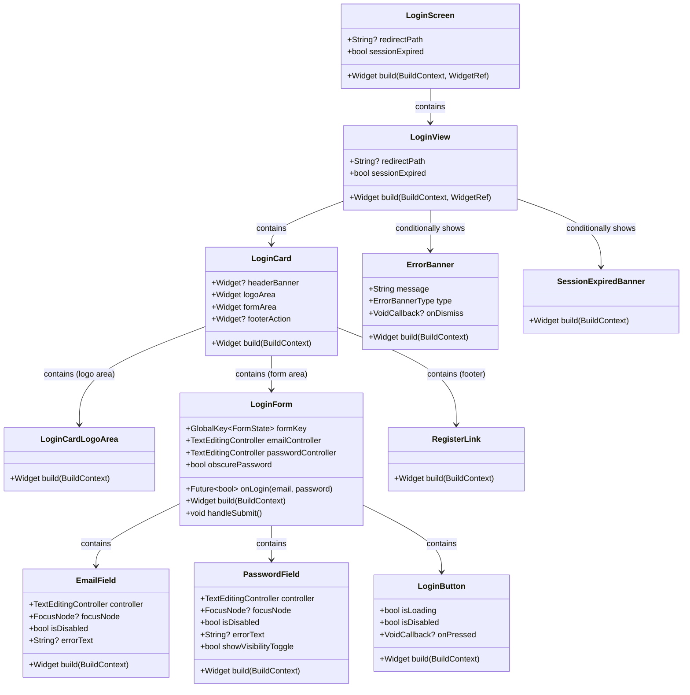
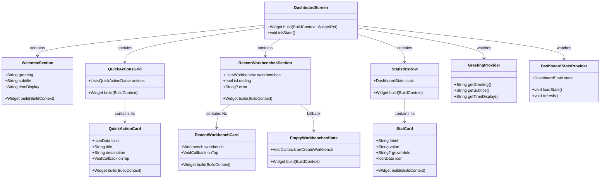
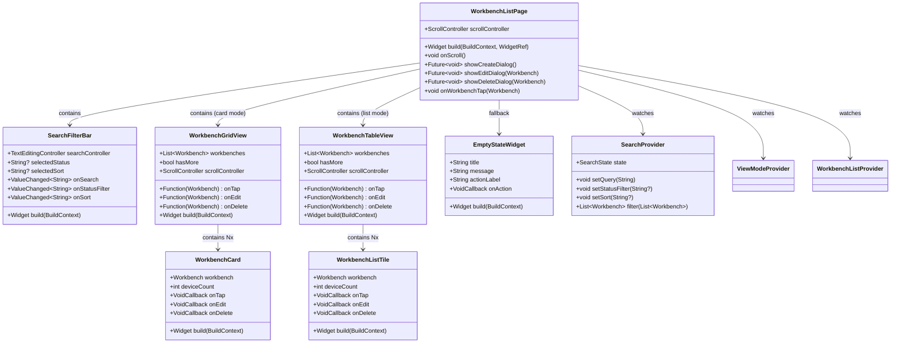
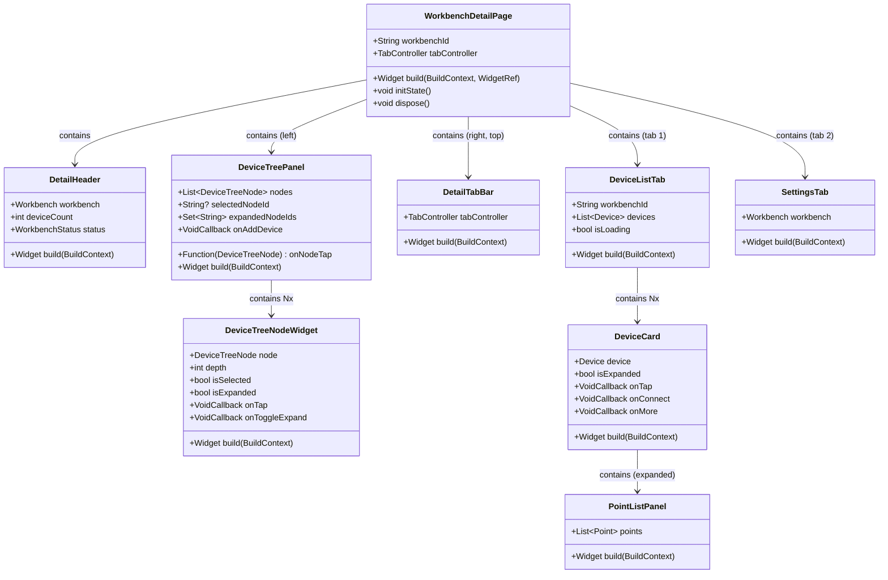
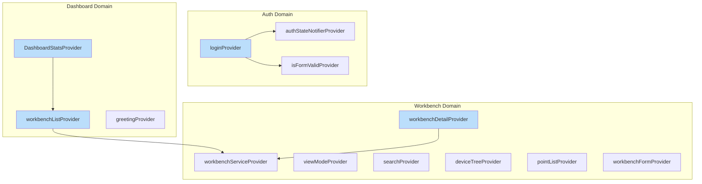
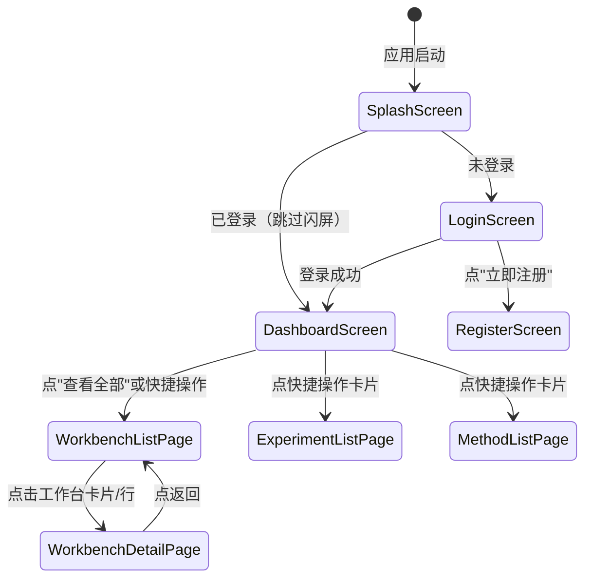
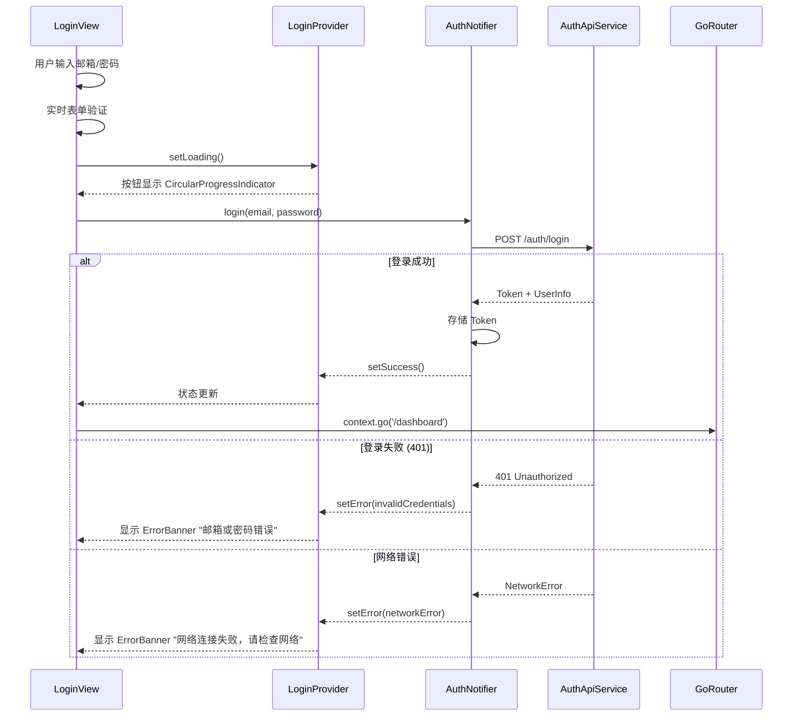
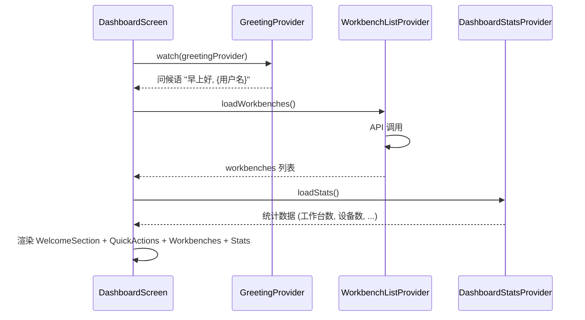
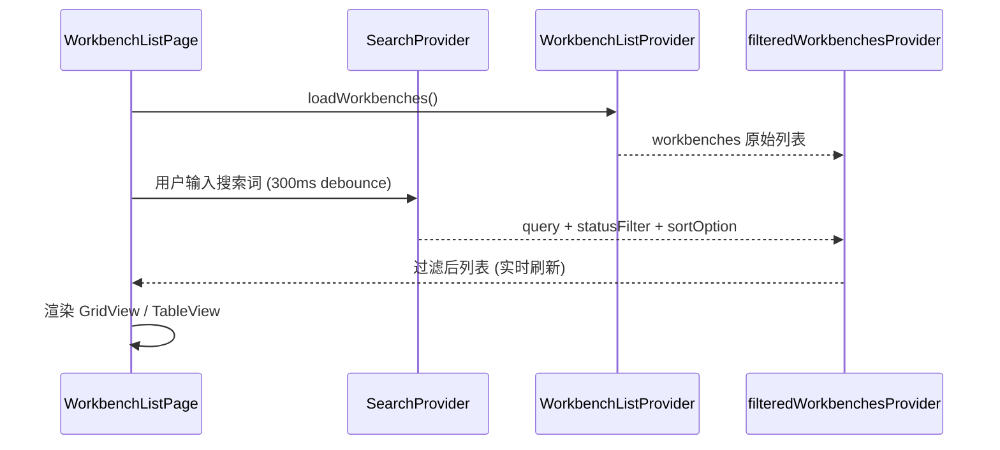
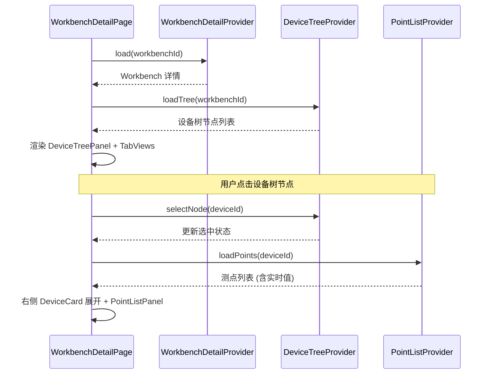

# R1-S1-UI-003-B 核心页面前端重构 详细设计

**版本**: 1.0  
**日期**: 2026-05-03  
**设计师**: sw-jerry  
**项目**: Kayak 科学研究支持平台 - Release 1  
**任务编号**: R1-S1-UI-003-B  
**状态**: 设计完成

---

## 目录

1. [模块结构](#1-模块结构)
2. [登录页详细设计](#2-登录页详细设计-login-page)
3. [Dashboard 详细设计](#3-dashboard-详细设计-dashboard-page)
4. [工作台列表页详细设计](#4-工作台列表页详细设计-workbench-list-page)
5. [工作台详情页详细设计](#5-工作台详情页详细设计-workbench-detail-page)
6. [状态管理方案](#6-状态管理方案)
7. [路由和导航设计](#7-路由和导航设计)
8. [与现有代码的兼容性分析](#8-与现有代码的兼容性分析)
9. [数据流图](#9-数据流图)
10. [布局方案](#10-布局方案)

---

## 1. 模块结构

### 1.1 整体组件树

```
lib/
├── features/
│   ├── auth/
│   │   ├── screens/
│   │   │   ├── login_screen.dart          # [重构] 登录页面入口
│   │   │   └── login_view.dart            # [重构] 登录视图主体
│   │   ├── widgets/
│   │   │   ├── login_form.dart            # [已有] 登录表单
│   │   │   ├── email_field.dart           # [已有] 邮箱输入组件
│   │   │   ├── password_field.dart        # [已有] 密码输入组件
│   │   │   ├── login_button.dart          # [已有] 登录按钮
│   │   │   ├── error_banner.dart          # [已有] 错误横幅
│   │   │   └── login_card.dart            # [新增] 登录卡片容器
│   │   ├── providers/
│   │   │   └── login_provider.dart        # [已有] 登录状态管理
│   │   └── models/
│   │       └── login_form_state.dart      # [新增] 表单状态
│   │
│   ├── dashboard/
│   │   ├── screens/
│   │   │   └── dashboard_screen.dart      # [重构] Dashboard 主页面
│   │   ├── widgets/
│   │   │   ├── welcome_section.dart       # [新增] 欢迎区域
│   │   │   ├── quick_action_card.dart     # [新增] 快捷操作卡片
│   │   │   ├── recent_workbench_card.dart # [新增] 最近工作台卡片
│   │   │   ├── stat_card.dart             # [新增] 统计卡片
│   │   │   └── empty_workbenches.dart     # [新增] 空状态组件
│   │   └── providers/
│   │       ├── dashboard_stats_provider.dart # [新增] 统计状态
│   │       └── greeting_provider.dart      # [新增] 问候语状态
│   │
│   └── workbench/
│       ├── screens/
│       │   ├── workbench_list_page.dart    # [重构] 工作台列表页
│       │   └── detail/
│       │       └── workbench_detail_page.dart # [重构] 工作台详情页
│       ├── widgets/
│       │   ├── workbench_card.dart         # [重构] 网格视图卡片
│       │   ├── workbench_list_tile.dart    # [重构] 列表视图行
│       │   ├── workbench_grid_view.dart    # [新增] 网格视图容器
│       │   ├── workbench_table_view.dart   # [新增] 列表表格视图
│       │   ├── search_filter_bar.dart      # [新增] 搜索筛选栏
│       │   ├── empty_state_widget.dart     # [已有] 空状态组件
│       │   ├── create_workbench_dialog.dart # [已有] 创建对话框
│       │   ├── delete_confirmation_dialog.dart # [已有] 删除对话框
│       │   ├── device_tree/
│       │   │   ├── device_tree.dart        # [已有] 设备树组件
│       │   │   └── device_tree_node.dart   # [已有] 设备树节点
│       │   ├── detail/
│       │   │   ├── detail_header.dart      # [重构] 详情页头部
│       │   │   ├── detail_tab_bar.dart     # [已有] Tab 导航栏
│       │   │   ├── device_list_tab.dart    # [重构] 设备列表 Tab
│       │   │   └── settings_tab.dart       # [已有] 设置 Tab
│       │   └── point/
│       │       ├── point_list_panel.dart   # [已有] 测点列表面板
│       │       └── point_value_display.dart # [已有] 测点值显示
│       ├── providers/
│       │   ├── workbench_list_provider.dart # [已有] 列表状态
│       │   ├── workbench_detail_provider.dart # [已有] 详情状态
│       │   ├── view_mode_provider.dart      # [已有] 视图模式
│       │   ├── device_tree_provider.dart    # [已有] 设备树状态
│       │   ├── point_list_provider.dart     # [已有] 测点列表状态
│       │   ├── workbench_form_provider.dart # [已有] 表单状态
│       │   └── search_provider.dart         # [新增] 搜索状态
│       └── models/
│           ├── workbench.dart              # [已有] 工作台模型
│           ├── workbench_list_state.dart   # [已有] 列表状态模型
│           └── workbench_detail_state.dart # [已有] 详情状态模型
│
├── screens/
│   └── dashboard/
│       └── dashboard_screen.dart          # [废弃] 迁移到 features/
│
├── core/
│   ├── theme/
│   │   ├── app_theme.dart                 # [已有] 主主题配置 v2
│   │   ├── color_schemes.dart             # [已有] 颜色方案 v2
│   │   └── app_typography.dart            # [已有] 字体排版 v2
│   ├── navigation/
│   │   ├── app_shell.dart                 # [已有] 应用外壳
│   │   ├── sidebar.dart                   # [已有] 侧边栏
│   │   ├── navigation_item.dart           # [已有] 导航项
│   │   └── breadcrumb_nav.dart            # [已有] 面包屑
│   └── router/
│       └── app_router.dart                # [重构] 路由配置
```

### 1.2 新增/修改文件清单

| 文件 | 操作 | 说明 |
|------|------|------|
| `lib/features/auth/screens/login_screen.dart` | **重构** | 移除 CustomTitleBar + Scaffold，使用全屏品牌布局 |
| `lib/features/auth/screens/login_view.dart` | **重构** | 使用 LoginCard 容器，适配 Figma 设计 |
| `lib/features/auth/widgets/login_card.dart` | **新增** | 登录卡片容器（圆角28px，阴影，品牌感） |
| `lib/features/dashboard/screens/dashboard_screen.dart` | **新增** | 迁移自 screens/dashboard/，重构为 Figma 设计 |
| `lib/features/dashboard/widgets/welcome_section.dart` | **新增** | 欢迎区域（动态问候语+时间显示） |
| `lib/features/dashboard/widgets/quick_action_card.dart` | **新增** | 快捷操作卡片（固定 200px 宽） |
| `lib/features/dashboard/widgets/recent_workbench_card.dart` | **新增** | 最近工作台卡片（140px 高） |
| `lib/features/dashboard/widgets/stat_card.dart` | **新增** | 统计卡片（88px 高） |
| `lib/features/dashboard/widgets/empty_workbenches.dart` | **新增** | 空状态组件 |
| `lib/features/dashboard/providers/dashboard_stats_provider.dart` | **新增** | Dashboard 统计状态 |
| `lib/features/dashboard/providers/greeting_provider.dart` | **新增** | 问候语状态（按时间动态切换） |
| `lib/features/workbench/screens/workbench_list_page.dart` | **重构** | 添加搜索筛选栏、优化视图切换 |
| `lib/features/workbench/widgets/workbench_card.dart` | **重构** | 适配 Figma 网格卡片规格 |
| `lib/features/workbench/widgets/workbench_list_tile.dart` | **重构** | 适配 Figma 列表行规格 |
| `lib/features/workbench/widgets/workbench_grid_view.dart` | **新增** | 网格视图响应式布局容器 |
| `lib/features/workbench/widgets/workbench_table_view.dart` | **新增** | 列表表格视图（含表头） |
| `lib/features/workbench/widgets/search_filter_bar.dart` | **新增** | 搜索+筛选+排序栏 |
| `lib/features/workbench/providers/search_provider.dart` | **新增** | 搜索状态管理 |
| `lib/features/workbench/screens/detail/workbench_detail_page.dart` | **重构** | 添加设备树面板、信息区域 |
| `lib/features/workbench/widgets/detail/detail_header.dart` | **重构** | 适配 Figma 信息区设计 |
| `lib/features/workbench/widgets/detail/device_list_tab.dart` | **重构** | 适配 Figma 设备卡片设计 |
| `lib/core/router/app_router.dart` | **重构** | 添加工作台详情路由 |
| `lib/screens/dashboard/dashboard_screen.dart` | **废弃** | 标记 deprecated，重定向到 features/ |

---

## 2. 登录页详细设计 (Login Page)

### 2.1 类图 (Mermaid UML)



### 2.2 组件层次 (静态结构)

```
LoginScreen (ConsumerWidget, 全屏布局)
├── Scaffold (backgroundColor: Surface)
│   └── SafeArea
│       └── Center
│           └── SingleChildScrollView
│               └── Column (mainAxisAlignment: center)
│                   ├── [sessionExpired →] WarningBanner
│                   ├── LoginCard (Container, 440px maxWidth, 28px radius)
│                   │   ├── Padding (40px h, 32px v)
│                   │   │   ├── LoginCardLogoArea
│                   │   │   │   ├── Container (72×72, 16px radius, PrimaryContainer)
│                   │   │   │   │   └── Icon (science, 48px, OnPrimaryContainer)
│                   │   │   │   ├── SizedBox(24px)
│                   │   │   │   ├── Text "KAYAK" (24pt, letterSpacing: 4px)
│                   │   │   │   └── Text "科学研究支持平台" (14pt, OnSurfaceVariant)
│                   │   │   ├── SizedBox(32px)
│                   │   │   ├── LoginForm
│                   │   │   │   ├── EmailField (Filled, 56px, email icon)
│                   │   │   │   ├── SizedBox(16px)
│                   │   │   │   ├── PasswordField (Filled, 56px, lock icon + toggle)
│                   │   │   │   ├── SizedBox(24px)
│                   │   │   │   └── LoginButton (Primary, full width, 48px)
│                   │   │   │       ├── Default: Text "登录"
│                   │   │   │       └── Loading: CircularProgressIndicator(20px)
│                   │   │   └── SizedBox(20px)
│                   │   └── RegisterLink "还没有账号？立即注册"
│                   └── [authState.error →] ErrorBanner
```

### 2.3 核心组件接口定义

#### LoginCard

```dart
/// 登录卡片容器组件
///
/// 统一的登录卡片样式：SurfaceContainerLow 背景，28px 圆角，带阴影
/// 响应式宽度：Desktop 440px, Tablet 400px, Mobile full-width
class LoginCard extends StatelessWidget {
  const LoginCard({
    super.key,
    required this.child,
  });

  /// 卡片内容（Logo区域 + 表单区域 + 注册链接）
  final Widget child;

  @override
  Widget build(BuildContext context) { ... }
}
```

#### LoginCardLogoArea

```dart
/// 登录卡片 Logo 区域
///
/// 包含图标容器 + 品牌名称 + 副标题
class LoginCardLogoArea extends StatelessWidget {
  const LoginCardLogoArea({super.key});

  @override
  Widget build(BuildContext context) { ... }
}
```

#### LoginButton (重构现有)

```dart
/// 登录按钮组件
///
/// 状态变体：
/// - Default: Primary 色填充，文字 "登录"
/// - Loading: 文字隐藏，显示 CircularProgressIndicator(20px)
/// - Disabled: 38% 透明度，不可点击
class LoginButton extends StatelessWidget {
  const LoginButton({
    super.key,
    required this.isLoading,
    required this.isDisabled,
    required this.onPressed,
  });

  final bool isLoading;
  final bool isDisabled;
  final VoidCallback? onPressed;

  @override
  Widget build(BuildContext context) { ... }
}
```

#### ErrorBanner (重构现有)

```dart
/// 登录页错误横幅组件
///
/// 类型：
/// - error: ErrorContainer 背景，显示登录失败信息
/// - warning: WarningContainer 背景，显示会话过期信息
enum BannerType { error, warning }

class ErrorBanner extends StatelessWidget {
  const ErrorBanner({
    super.key,
    required this.message,
    required this.type,
    this.onDismiss,
  });

  final String message;
  final BannerType type;
  final VoidCallback? onDismiss;

  @override
  Widget build(BuildContext context) { ... }
}
```

### 2.4 布局方案（适配 Figma 设计）

| Figma 属性 | Flutter 实现 |
|------------|-------------|
| Card width: 440px | `ConstrainedBox(maxWidth: 440)` |
| Card radius: 28px | `BorderRadius.circular(28)` |
| Card bg: SurfaceContainerLow | `Theme.of(context).colorScheme.surfaceContainerLow` |
| Card shadow: Elevation 2 | `BoxShadow(...)` 或 `Card(elevation: 2)` |
| Logo container: 72×72, 16px radius | `Container(width: 72, height: 72, decoration: BoxDecoration(...))` |
| Icon: science, 48px | `Icon(Icons.science, size: 48)` |
| Title "KAYAK": 24pt, letterSpacing 4 | `textTheme.headlineSmall?.copyWith(letterSpacing: 4)` |
| Input: Filled, 56px height | `InputDecorationTheme` (已在 Theme 中配置) |
| Button: 48px height, full width | `SizedBox(height: 48, width: double.infinity)` |
| Desktop ≥1280px | Card width 440px, padding 40/32 |
| Tablet ≥768px | Card width 400px, padding 32/24 |
| Mobile <768px | Card full width - 32px margin, padding 24/16 |

### 2.5 与现有代码的兼容性

| 现有代码 | 重构策略 |
|---------|---------|
| `login_screen.dart` | **重构**: 移除 `CustomTitleBar()` 和 `Scaffold` 包装。登录页为独立全屏页面，不包含侧边栏 |
| `login_view.dart` | **重构**: 替换 `Center` 内直接布局为 `LoginCard` 容器包裹。使用 Figma 品牌 Logo 区域替换简单 Icon+Text |
| `login_form.dart` | **部分修改**: 输入框样式已通过全局 Theme 配置适配 Filled 风格，无需大改。添加加载状态按钮逻辑 |
| `email_field.dart` | **无需修改**: 全局 Theme 已覆盖 InputDecoration |
| `password_field.dart` | **无需修改**: 同上 |
| `login_button.dart` | **重构**: 替换为支持 Loading/Disabled 状态的灵动按钮 |
| `error_banner.dart` | **重构**: 支持 error/warning 两种类型，居中定位在卡片上方 |
| `login_provider.dart` | **保持**: 状态管理逻辑正确，无需修改 |
| `app_router.dart` | **修改**: 确保 `/login` 路由不经过 ShellRoute |

---

## 3. Dashboard 详细设计 (Dashboard Page)

### 3.1 类图 (Mermaid UML)



### 3.2 组件层次

```
DashboardScreen (ConsumerStatefulWidget)
└── Scaffold (backgroundColor: surfaceContainerLowest)
    └── RefreshIndicator
        └── SingleChildScrollView
            └── Padding (24px all)
                └── Column (crossAxisAlignment: start, spacing: 24px)
                    ├── WelcomeSection
                    │   └── Container (SurfaceContainerLowest, 16px radius, 24px padding)
                    │       └── Row
                    │           ├── Column (left)
                    │           │   ├── Text "早上好/下午好/晚上好，{用户名}" (TitleLarge)
                    │           │   └── Text "这里是您今天的研究概览" (BodyLarge, OnSurfaceVariant)
                    │           └── Column (right, time display)
                    │               ├── Text "HH:MM:SS" (BodyMedium, monospace)
                    │               └── Text "2024-01-15 星期一" (BodySmall, OnSurfaceVariant)
                    │
                    ├── QuickActionsGrid (spacing: 16px)
                    │   └── Wrap (spacing: 16, runSpacing: 16)
                    │       ├── QuickActionCard: 工作台 (workspace_premium)
                    │       ├── QuickActionCard: 试验 (science)
                    │       ├── QuickActionCard: 方法 (description)
                    │       └── QuickActionCard: 数据文件 (folder)
                    │
                    ├── RecentWorkbenchesSection
                    │   ├── SectionHeader: "最近工作台" + "查看全部 →"
                    │   └── [workbenches.isEmpty →] EmptyWorkbenchesState
                    │   └── [isLoading →] Skeleton Cards (×4)
                    │   └── [error →] Error + Retry
                    │   └── [hasData →] Wrap/GridView
                    │       └── RecentWorkbenchCard × N
                    │           ├── Icon Container (40×40, 10px radius)
                    │           ├── Title (TitleMedium)
                    │           ├── Device Count (BodySmall)
                    │           └── Status Chip (左下角)
                    │
                    └── StatisticsRow (spacing: 16px)
                        └── Row
                            ├── StatCard: 工作台总数
                            ├── StatCard: 设备总数
                            ├── StatCard: 试验总数
                            └── StatCard: 数据文件
```

### 3.3 核心组件接口定义

#### WelcomeSection

```dart
/// Dashboard 欢迎区域组件
///
/// 根据系统时间动态显示问候语：
/// - 5:00-12:00: "早上好"
/// - 12:00-18:00: "下午好"
/// - 18:00-5:00: "晚上好"
class WelcomeSection extends ConsumerWidget {
  const WelcomeSection({super.key});

  @override
  Widget build(BuildContext context, WidgetRef ref) { ... }
}
```

#### QuickActionCard

```dart
/// 快捷操作卡片
///
/// 规格：200×120px, 16px 圆角, Surface 背景, 1px OutlineVariant 边框
/// 悬停效果：边框变 Primary, 阴影提升, 上移 -2px
class QuickActionCard extends StatelessWidget {
  const QuickActionCard({
    super.key,
    required this.icon,
    required this.title,
    required this.description,
    required this.onTap,
  });

  final IconData icon;
  final String title;
  final String description;
  final VoidCallback onTap;

  @override
  Widget build(BuildContext context) { ... }
}
```

#### RecentWorkbenchCard

```dart
/// 最近工作台卡片
///
/// 规格：自适应宽(≥260px)×140px, 12px 圆角, Surface 背景
class RecentWorkbenchCard extends StatelessWidget {
  const RecentWorkbenchCard({
    super.key,
    required this.workbench,
    this.deviceCount = 0,
    required this.onTap,
  });

  final Workbench workbench;
  final int deviceCount;
  final VoidCallback onTap;

  @override
  Widget build(BuildContext context) { ... }
}
```

#### StatCard

```dart
/// 统计概览卡片
///
/// 规格：自适应宽×88px, 12px 圆角, SurfaceContainerLow 背景
/// 数字加载时使用 500ms ease-out 递增动画
class StatCard extends StatelessWidget {
  const StatCard({
    super.key,
    required this.label,
    required this.value,
    this.growthInfo,
    required this.icon,
  });

  final String label;
  final String value;
  final String? growthInfo;
  final IconData icon;

  @override
  Widget build(BuildContext context) { ... }
}
```

#### EmptyWorkbenchesState

```dart
/// Dashboard 空状态组件
///
/// 当用户没有任何工作台时显示
class EmptyWorkbenchesState extends StatelessWidget {
  const EmptyWorkbenchesState({
    super.key,
    required this.onCreateWorkbench,
  });

  final VoidCallback onCreateWorkbench;

  @override
  Widget build(BuildContext context) { ... }
}
```

### 3.4 状态管理扩展

#### GreetingProvider

```dart
/// 问候语状态 Provider
///
/// 根据系统时间返回对应的问候语、副标题和时间显示
final greetingProvider = Provider<GreetingState>((ref) {
  final now = DateTime.now();
  final hour = now.hour;

  String greeting;
  if (hour >= 5 && hour < 12) {
    greeting = '早上好';
  } else if (hour >= 12 && hour < 18) {
    greeting = '下午好';
  } else {
    greeting = '晚上好';
  }

  final weekdays = ['日', '一', '二', '三', '四', '五', '六'];

  return GreetingState(
    displayName: greeting,
    subtitle: '这里是您今天的研究概览',
    dateDisplay: '${now.year}-${now.month.toString().padLeft(2, '0')}-${now.day.toString().padLeft(2, '0')} 星期${weekdays[now.weekday % 7]}',
  );
});

class GreetingState {
  final String displayName;
  final String subtitle;
  final String dateDisplay;

  const GreetingState({
    required this.displayName,
    required this.subtitle,
    required this.dateDisplay,
  });
}
```

### 3.5 与现有代码的兼容性

| 现有代码 | 重构策略 |
|---------|---------|
| `screens/dashboard/dashboard_screen.dart` | **整体重写**: 迁移到 `features/dashboard/screens/`，按 Figma 重构。废弃旧文件 |
| `_QuickActionCard` (私有) | **提取为公共组件**: 提取到独立文件 `quick_action_card.dart` |
| `_RecentWorkbenchesList` (私有) | **提取为公共组件**: 提取到独立文件，添加空状态/骨架屏 |
| `_StatCard` (私有) | **提取为公共组件**: 提取到独立文件 `stat_card.dart` |
| `_StatusChip` (私有) | **保留内联但标准化**: 使用 `color_schemes.dart` 中的语义色 |
| `workbenchListProvider` | **复用**: Dashboard 已使用，无需修改 |

---

## 4. 工作台列表页详细设计 (Workbench List Page)

### 4.1 类图 (Mermaid UML)



### 4.2 组件层次

```
WorkbenchListPage (ConsumerStatefulWidget)
└── Scaffold
    ├── AppBar (高度 64px)
    │   ├── [leading] BackButton (arrow_back)
    │   ├── [title] "工作台" (TitleLarge)
    │   ├── [actions]
    │   │   ├── ViewToggle: Grid/List SegmentedButton
    │   │   └── AddButton (+) (Primary, Filled)
    │
    ├── Body: Column
    │   ├── SearchFilterBar (高度 56px, 下边距 20px)
    │   │   └── Row
    │   │       ├── SearchField (Filled, 60% flex)
    │   │       │   ├── PrefixIcon: search, 20px
    │   │       │   └── Placeholder: "搜索工作台..."
    │   │       ├── FilterDropdown "筛选 ▼" (Outlined, 36px)
    │   │       └── SortDropdown "排序 ▼" (Outlined, 36px)
    │   │
    │   ├── Expanded
    │   │   └── [viewMode == card]
    │   │       └── WorkbenchGridView
    │   │           └── GridView.builder (crossAxisCount: 4→3→2→1)
    │   │               └── WorkbenchCard × N
    │   │                   ├── Icon Container (56×56, 16px radius)
    │   │                   ├── Title (TitleMedium)
    │   │                   ├── Description (BodySmall, 2-line clamp)
    │   │                   ├── Device Count + Status Chip (底部行)
    │   │                   └── Edit/Delete IconButtons (32px)
    │   │
    │   │   └── [viewMode == list]
    │   │       └── WorkbenchTableView
    │   │           └── Column
    │   │               ├── TableHeader (48px, SurfaceContainerLow)
    │   │               │   └── Row: 图标|名称|描述|设备数|状态|创建时间|操作
    │   │               └── ListView.builder
    │   │                   └── WorkbenchListTile × N (56px, 交替背景)
    │   │
    │   ├── [listState.workbenches.isEmpty →] EmptyStateWidget
    │   │   ├── Icon: workspace_premium, 64px
    │   │   ├── Title: "暂无工作台"
    │   │   └── Button: Primary "创建工作台"
    │   │
    │   └── [searchNoResults →] NoResultsWidget
    │       ├── Icon: search_off, 64px
    │       ├── Title: "未找到匹配的工作台"
    │       └── TextButton: "清除搜索"
    │
    └── BottomAction (粘性底部)
        └── PrimaryButton "+ 创建工作台" (full width)
```

### 4.3 核心组件接口定义

#### SearchFilterBar

```dart
/// 搜索筛选栏组件
///
/// 包含搜索输入框、状态筛选下拉和排序下拉
/// 搜索输入使用 300ms debounce
class SearchFilterBar extends ConsumerStatefulWidget {
  const SearchFilterBar({super.key});

  @override
  ConsumerState<SearchFilterBar> createState() => _SearchFilterBarState();
}

class _SearchFilterBarState extends ConsumerState<SearchFilterBar> {
  final _searchController = TextEditingController();
  Timer? _debounce;

  // 筛选选项
  static const statusOptions = ['全部', '在线', '离线'];
  static const sortOptions = ['默认排序', '名称 A-Z', '创建时间 最新', '设备数 最多'];

  @override
  Widget build(BuildContext context) { ... }
}
```

#### WorkbenchCard (重构)

```dart
/// 工作台网格视图卡片（适配 Figma 设计）
///
/// 规格：280×200px, 16px 圆角, Surface 背景, 1px OutlineVariant 边框
/// 悬停：边框变 Primary, 阴影 Elevation 2, translateY -2px
class WorkbenchCard extends StatelessWidget {
  const WorkbenchCard({
    super.key,
    required this.workbench,
    this.deviceCount = 0,
    required this.onTap,
    required this.onEdit,
    required this.onDelete,
  });

  final Workbench workbench;
  final int deviceCount;
  final VoidCallback onTap;
  final VoidCallback onEdit;
  final VoidCallback onDelete;

  @override
  Widget build(BuildContext context) { ... }
}
```

#### WorkbenchListTile (重构)

```dart
/// 工作台列表视图行（适配 Figma 设计）
///
/// 规格：56px 高度, 交替背景, 1px OutlineVariant 底边框
/// 列：图标(48) | 名称(200) | 描述(240) | 设备数(80) | 状态(100) | 时间(100) | 操作(80)
class WorkbenchListTile extends StatelessWidget {
  const WorkbenchListTile({
    super.key,
    required this.workbench,
    this.deviceCount = 0,
    required this.onTap,
    required this.onEdit,
    required this.onDelete,
  });

  final Workbench workbench;
  final int deviceCount;
  final VoidCallback onTap;
  final VoidCallback onEdit;
  final VoidCallback onDelete;

  @override
  Widget build(BuildContext context) { ... }
}
```

#### SearchProvider

```dart
/// 搜索/筛选/排序状态管理
class SearchState {
  final String query;
  final String? statusFilter;
  final SortOption sortOption;

  const SearchState({...});
}

enum SortOption { default_, nameAsc, timeDesc, deviceCountDesc }

class SearchNotifier extends StateNotifier<SearchState> {
  SearchNotifier() : super(const SearchState());

  void setQuery(String query) { ... }
  void setStatusFilter(String? status) { ... }
  void setSort(SortOption sort) { ... }
  void clear() { ... }

  /// 过滤并排序工作台列表
  List<Workbench> apply(List<Workbench> workbenches) { ... }
}

final searchProvider = StateNotifierProvider<SearchNotifier, SearchState>((ref) {
  return SearchNotifier();
});

/// 过滤后的工作台列表 Provider
final filteredWorkbenchesProvider = Provider<List<Workbench>>((ref) {
  final workbenches = ref.watch(workbenchListProvider).workbenches;
  final searchState = ref.watch(searchProvider);
  final notifier = ref.read(searchProvider.notifier);
  return notifier.applyFilter(workbenches);
});
```

### 4.4 与现有代码的兼容性

| 现有代码 | 重构策略 |
|---------|---------|
| `workbench_list_page.dart` | **重构**: 添加 SearchFilterBar, 提取 GridView/TableView 为独立组件 |
| `workbench_card.dart` | **重构**: 适配 Figma 规格 (280×200px, 16px 圆角, Logo 容器, 状态 Chip) |
| `workbench_list_tile.dart` | **重构**: 添加表头行, 配置列宽对齐, 交替背景色 |
| `view_mode_provider.dart` | **保持**: 现有抽象良好, 添加 TableView 列宽常量 |
| `workbench_list_provider.dart` | **保持**: 逻辑不变, SearchProvider 在消费端组合 |
| `empty_state_widget.dart` | **保持**: 已有组件, 添加 NoResultsWidget 变体 |
| `create_workbench_dialog.dart` | **保持**: 已符合 Figma 对话框规范 |
| `delete_confirmation_dialog.dart` | **保持**: 已符合 Figma 确认对话框规范 |

---

## 5. 工作台详情页详细设计 (Workbench Detail Page)

### 5.1 类图 (Mermaid UML)



### 5.2 组件层次

```
WorkbenchDetailPage (ConsumerStatefulWidget)
└── Scaffold
    ├── AppBar (64px)
    │   ├── [leading] BackButton (arrow_back)
    │   ├── [title] workbench.name (TitleLarge)
    │   ├── [actions]
    │   │   ├── EditButton (Outlined, 36px)
    │   │   ├── DeleteButton (Outlined, Error, 36px)
    │   │   └── MoreMenuButton (more_vert)
    │
    └── Body: Column
        ├── DetailHeader
        │   └── Container (SurfaceContainerLow, 12px radius, 20/24 padding)
        │       └── Row
        │           ├── IconContainer (48×48, 12px radius, PrimaryContainer)
        │           │   └── Icon (workspace_premium, OnPrimaryContainer)
        │           ├── Column (名称 + 描述)
        │           │   ├── Title (TitleLarge)
        │           │   └── Description (BodyMedium, OnSurfaceVariant)
        │           └── Status Chip (右对齐)
        │       └── Metadata "创建于... · 最后修改..." (BodySmall)
        │
        └── Expanded → Row (主内容区)
            ├── DeviceTreePanel (280px fixed)
            │   └── Column
            │       ├── TreeHeader
            │       │   └── TextButton "+ 添加设备" (add icon)
            │       └── Expanded → ListView
            │           └── DeviceTreeNodeWidget × N
            │               ├── [Device] Icon memory + Name + StatusDot + ExpandIcon
            │               │   selected → PrimaryContainer fill
            │               │   hover → OnSurfaceVariant 4% fill
            │               ├── [Point] (indent +20px) Circle(6px) + Name
            │               └── [Point] ...
            │
            └── Expanded → Column (右侧内容区)
                ├── DetailTabBar (48px, SurfaceContainerLowest)
                │   ├── Tab: "设备列表" (active: bottom 2px Primary)
                │   └── Tab: "设置"
                │
                └── Expanded → TabBarView
                    ├── Tab 0: DeviceListTab
                    │   └── ListView
                    │       └── DeviceCard × N
                    │           ├── Header Row
                    │           │   ├── DeviceIcon (40×40, 10px radius)
                    │           │   ├── DeviceName (TitleMedium)
                    │           │   ├── ProtocolChip
                    │           │   ├── ConnectionButton (Outlined, 32px)
                    │           │   └── MoreButton (more_vert)
                    │           └── [expanded] PointListPanel
                    │               └── DataTable
                    │                   ├── Header: 名称(150)|类型(100)|值(100)|单位(80)|状态(80)
                    │                   └── Rows × N (44px, 交替背景)
                    │                       ├── Name (BodyMedium)
                    │                       ├── Type (BodySmall)
                    │                       ├── Value (等宽字体)
                    │                       ├── Unit (BodySmall)
                    │                       └── StatusDot (8px, Success/Warning/Error)
                    │
                    └── Tab 1: SettingsTab
```

### 5.3 核心组件接口定义

#### DetailHeader (重构)

```dart
/// 工作台详情页头部信息区域
///
/// 规格：100%宽, SurfaceContainerLow 背景, 12px 圆角
/// 显示工作台 Icon + 名称 + 描述 + 状态 Chip + 元数据
class DetailHeader extends StatelessWidget {
  const DetailHeader({
    super.key,
    required this.workbench,
    this.deviceCount = 0,
    this.status = WorkbenchStatus.active,
  });

  final Workbench workbench;
  final int deviceCount;
  final WorkbenchStatus status;

  @override
  Widget build(BuildContext context) { ... }
}
```

#### DeviceTreePanel

```dart
/// 设备树面板组件
///
/// 规格：280px 固定宽, Surface 背景, 右侧 1px OutlineVariant 边框
/// 功能：展开/折叠、选中高亮、添加设备入口
class DeviceTreePanel extends ConsumerWidget {
  const DeviceTreePanel({
    super.key,
    required this.workbenchId,
  });

  final String workbenchId;

  @override
  Widget build(BuildContext context, WidgetRef ref) { ... }
}
```

#### DeviceTreeNodeWidget

```dart
/// 设备树节点组件
///
/// 设备节点：
///   - 图标: memory, 20px, Primary
///   - 高度: 40px
///   - 选中: PrimaryContainer 背景
///   - 展开/折叠: expand_more/expand_less
///
/// 测点节点：
///   - 图标: circle (6px dot), OnSurfaceVariant
///   - 高度: 36px
///   - 缩进: +20px 相对于父节点
class DeviceTreeNodeWidget extends StatelessWidget {
  const DeviceTreeNodeWidget({
    super.key,
    required this.node,
    required this.depth,
    required this.isSelected,
    required this.isExpanded,
    this.hasChildren = false,
    required this.onTap,
    this.onToggleExpand,
  });

  final DeviceTreeNode node;
  final int depth;
  final bool isSelected;
  final bool isExpanded;
  final bool hasChildren;
  final VoidCallback onTap;
  final VoidCallback? onToggleExpand;

  @override
  Widget build(BuildContext context) { ... }
}
```

#### DeviceCard

```dart
/// 设备列表卡片
///
/// 规格：100%宽, Surface 背景, 12px 圆角, 1px OutlineVariant 边框
/// 可展开显示测点列表
class DeviceCard extends StatelessWidget {
  const DeviceCard({
    super.key,
    required this.device,
    required this.isExpanded,
    required this.onTap,
    this.onConnect,
    this.onMore,
  });

  final Device device;
  final bool isExpanded;
  final VoidCallback onTap;
  final VoidCallback? onConnect;
  final VoidCallback? onMore;

  @override
  Widget build(BuildContext context) { ... }
}
```

#### PointListPanel

```dart
/// 测点列表面板 (数据表格形式)
///
/// 列：名称(150)|类型(100)|值(100)|单位(80)|状态(80)
/// 表头高度：40px, 行高度：44px
/// 值更新时：500ms PrimaryContainer 背景闪烁
class PointListPanel extends ConsumerWidget {
  const PointListPanel({
    super.key,
    required this.deviceId,
  });

  final String deviceId;

  @override
  Widget build(BuildContext context, WidgetRef ref) { ... }
}
```

### 5.4 与现有代码的兼容性

| 现有代码 | 重构策略 |
|---------|---------|
| `workbench_detail_page.dart` | **重构**: 移除简单 Scaffold 结构，添加左右分栏布局 (DeviceTreePanel + Content) |
| `detail_header.dart` | **重构**: 适配 Figma 规格 (48px 图标, 状态 Chip, 元数据行) |
| `detail_tab_bar.dart` | **保持**: 已有 TabBar 实现符合需求 |
| `device_list_tab.dart` | **重构**: 替换简单列表为 DeviceCard + PointListPanel |
| `settings_tab.dart` | **保持**: Release 1 非重点，保持现有实现 |
| `device_tree.dart` + `device_tree_node.dart` | **保持**: 已有组件符合设计，仅需样式微调 |
| `point_list_panel.dart` | **保持**: 已有组件符合 DataTable 规范 |
| `workbench_detail_provider.dart` | **保持**: 状态管理逻辑不变 |
| `device_tree_provider.dart` | **保持**: 树状态管理不变 |

---

## 6. 状态管理方案

### 6.1 整体架构

```
┌─────────────────────────────────────────────────────────┐
│                     UI Layer (Widgets)                   │
│  ┌───────────┐ ┌───────────┐ ┌───────────┐             │
│  │  LoginPage │ │ Dashboard │ │ Workbench │             │
│  │   Widgets  │ │  Widgets  │ │  Widgets  │             │
│  └─────┬─────┘ └─────┬─────┘ └─────┬─────┘             │
│        │ watch        │ watch       │ watch              │
├────────┼──────────────┼─────────────┼────────────────────┤
│        ▼              ▼             ▼                    │
│  ┌─────────────────────────────────────────────────┐    │
│  │              Provider Layer (Riverpod)            │    │
│  │                                                  │    │
│  │  ┌──────────────┐  ┌─────────────────────────┐   │    │
│  │  │ LoginNotifier│  │ WorkbenchListNotifier    │   │    │
│  │  │ (StateNotifier│  │ (StateNotifier)          │   │    │
│  │  │ <LoginState>)│  │ <WorkbenchListState>     │   │    │
│  │  └──────────────┘  └─────────────────────────┘   │    │
│  │                                                  │    │
│  │  ┌──────────────────────┐  ┌─────────────────┐   │    │
│  │  │ DashboardStatsNotifier│  │ ViewModeNotifier │   │    │
│  │  │ (StateNotifier)       │  │ (StateNotifier)  │   │    │
│  │  └──────────────────────┘  └─────────────────┘   │    │
│  │                                                  │    │
│  │  ┌──────────────────────┐  ┌─────────────────┐   │    │
│  │  │ SearchNotifier        │  │ DeviceTreeNotifier│ │    │
│  │  │ (StateNotifier)       │  │ (StateNotifier)  │   │    │
│  │  └──────────────────────┘  └─────────────────┘   │    │
│  │                                                  │    │
│  │  ┌──────────────────────┐  ┌─────────────────┐   │    │
│  │  │ WorkbenchDetailNotifier│ │ PointListNotifier│  │    │
│  │  │ (Family StateNotifier) │ │ (StateNotifier)  │   │    │
│  │  └──────────────────────┘  └─────────────────┘   │    │
│  └─────────────────────────────────────────────────┘    │
│        │                                                │
├────────┼────────────────────────────────────────────────┤
│        ▼                                                │
│  ┌─────────────────────────────────────────────────┐    │
│  │              Service Layer                       │    │
│  │  ┌─────────────┐ ┌───────────────┐               │    │
│  │  │ AuthService │ │ WorkbenchService│             │    │
│  │  └─────────────┘ └───────────────┘               │    │
│  │  ┌─────────────┐ ┌───────────────┐               │    │
│  │  │ DeviceService│ │ PointService  │               │    │
│  │  └─────────────┘ └───────────────┘               │    │
│  └─────────────────────────────────────────────────┘    │
└─────────────────────────────────────────────────────────┘
```

### 6.2 Provider 依赖图



### 6.3 Riverpod 提供器清单

| Provider | 类型 | 位置 | 用途 |
|----------|------|------|------|
| `loginProvider` | `StateNotifierProvider` | `auth/providers/` | 登录状态 (idle/loading/success/error) |
| `greetingProvider` | `Provider` | `dashboard/providers/` | 动态问候语生成 |
| `dashboardStatsProvider` | `StateNotifierProvider` | `dashboard/providers/` | Dashboard 统计数据 |
| `workbenchListProvider` | `StateNotifierProvider` | `workbench/providers/` | 工作台列表状态 |
| `workbenchDetailProvider` | `StateNotifierProvider.family` | `workbench/providers/` | 工作台详情（按 ID） |
| `viewModeProvider` | `StateNotifierProvider` | `workbench/providers/` | 视图模式切换 (card/list) |
| `searchProvider` | `StateNotifierProvider` | `workbench/providers/` | 搜索/筛选/排序状态 |
| `filteredWorkbenchesProvider` | `Provider` | `workbench/providers/` | 过滤后的工作台列表 |
| `deviceTreeProvider` | `StateNotifierProvider` | `workbench/providers/` | 设备树状态 |
| `pointListProvider` | `StateNotifierProvider` | `workbench/providers/` | 测点列表状态 |
| `workbenchFormProvider` | `StateNotifierProvider` | `workbench/providers/` | 创建/编辑表单状态 |

---

## 7. 路由和导航设计

### 7.1 路由表

| 路径 | 页面 | Shell | 认证 | 说明 |
|------|------|-------|------|------|
| `/` | SplashScreen | 否 | 否 | 启动初始化页 |
| `/login` | LoginScreen | 否 | 公开 | 登录页（独立全屏，无侧边栏） |
| `/register` | RegisterScreen | 否 | 公开 | 注册页 |
| `/dashboard` | DashboardScreen | 是 | 需要 | Dashboard 首页 |
| `/workbenches` | WorkbenchListPage | 是 | 需要 | 工作台列表页 |
| `/workbenches/:id` | WorkbenchDetailPage | 是 | 需要 | 工作台详情页（新增） |
| `/experiments` | ExperimentListPage | 是 | 需要 | 试验列表页 |
| `/experiments/console` | ExperimentConsolePage | 是 | 需要 | 试验控制台 |
| `/experiments/:id/console` | ExperimentConsolePage | 是 | 需要 | 指定试验控制台 |
| `/methods` | MethodListPage | 是 | 需要 | 方法列表页 |
| `/methods/create` | MethodEditPage | 是 | 需要 | 创建方法 |
| `/methods/:id/edit` | MethodEditPage | 是 | 需要 | 编辑方法 |
| `/settings` | SettingsPage | 是 | 需要 | 设置页 |

### 7.2 导航流



### 7.3 AppRouter 修改

```dart
// 新增 ShellRoute 下的工作台详情路由
GoRoute(
  path: '/workbenches/:id',
  builder: (context, state) {
    final id = state.pathParameters['id']!;
    return WorkbenchDetailPage(workbenchId: id);
  },
),
```

### 7.4 Dashboard 导航更新

```dart
// QuickActionCard 点击导航
onTap: () => context.go('/workbenches'),    // 工作台
onTap: () => context.go('/experiments'),    // 试验
onTap: () => context.go('/methods'),        // 方法
onTap: () => context.go('/settings'),       // 数据文件 (暂用设置)

// RecentWorkbenchCard 点击导航
onTap: () => context.go('/workbenches/${workbench.id}'),

// "查看全部" 链接
onTap: () => context.go('/workbenches'),
```

### 7.5 工作台列表导航更新

```dart
// 卡片/行点击
void _onWorkbenchTap(Workbench workbench) {
  context.go('/workbenches/${workbench.id}');  // 替换 SnackBar 占位
}

// AppBar 返回
onPressed: () => context.go('/dashboard'),

// 创建按钮
onPressed: () => _showCreateDialog(),
```

---

## 8. 与现有代码的兼容性分析

### 8.1 兼容性矩阵

| 组件 | 兼容性 | 风险 | 措施 |
|------|--------|------|------|
| **主题系统** | ✅ 完全兼容 | 无 | v2 主题（tech-blue #1976D2）已更新，所有页面直接使用 |
| **字体系统** | ✅ 完全兼容 | 无 | AppTypography 已包含所有 MD3 字体层级 |
| **色彩系统** | ✅ 完全兼容 | 无 | ColorSchemes v2 已包含所有语义色和 Surface Container 层级 |
| **路由系统** | ✅ 兼容 | 低 | 仅需新增 `/workbenches/:id` 路由，不影响现有路由 |
| **状态管理** | ✅ 完全兼容 | 无 | Riverpod 架构保持不变，新增 Provider 为增量添加 |
| **AppShell** | ✅ 兼容 | 低 | 登录页不在 ShellRoute 内，Dashboard/工作台页已在 ShellRoute 内 |
| **Sidebar** | ✅ 兼容 | 无 | 侧边栏样式不变，WorkbenchListPage 在 `/workbenches` 下正常工作 |
| **Breadcrumb** | ✅ 需更新 | 低 | 新增 `/workbenches/:id` 的面包屑映射 |
| **Workbench Model** | ⚠️ 需扩展 | 中 | Workbench 模型缺少 `deviceCount` 字段，需扩展或在 Provider 层计算 |
| **LoginScreen** | ✅ 重构 | 低 | 移除 CustomTitleBar + Scaffold 包装，不影响路由 |
| **DashboardScreen** | ✅ 重构 | 低 | 旧文件标记废弃，新文件路径不同 |
| **WorkbenchCard** | ✅ 重构 | 低 | 接口变更（增加 deviceCount），需更新所有调用处 |
| **WorkbenchListTile** | ✅ 重构 | 低 | 同上 |

### 8.2 数据模型影响

#### Workbench 模型扩展（可选）

为了支持 Dashboard 和工作台列表显示设备计数，建议通过以下方式之一获取：

**方案 A（推荐）**: 通过 `DeviceService.getDeviceCount(workbenchId)` 在 Provider 层查询
```dart
// 在 workbench_list_provider.dart 中
Future<int> getDeviceCount(String workbenchId) async {
  final devices = await _deviceService.getDevices(workbenchId);
  return devices.length;
}
```

**方案 B**: 扩展 Workbench 模型添加 `deviceCount` 字段（需后端配合）
```dart
@freezed
class Workbench with _$Workbench {
  const factory Workbench({
    required String id,
    required String name,
    String? description,
    required String ownerId,
    required String ownerType,
    required String status,
    int? deviceCount,  // 新增
    required DateTime createdAt,
    required DateTime updatedAt,
  }) = _Workbench;
}
```

**推荐方案 A**，避免不必要的后端变更。

### 8.3 文件迁移策略

| 旧路径 | 新路径 | 策略 |
|--------|--------|------|
| `lib/screens/dashboard/dashboard_screen.dart` | `lib/features/dashboard/screens/dashboard_screen.dart` | 迁移 + 重构，旧文件删除 |
| `lib/features/auth/screens/login_screen.dart` | 同路径 | 原地重构 |
| `lib/features/auth/screens/login_view.dart` | 同路径 | 原地重构 |
| `lib/features/workbench/screens/workbench_list_page.dart` | 同路径 | 原地重构 |
| `lib/features/workbench/screens/detail/workbench_detail_page.dart` | 同路径 | 原地重构 |
| `lib/features/workbench/widgets/workbench_card.dart` | 同路径 | 原地重构 |
| `lib/features/workbench/widgets/workbench_list_tile.dart` | 同路径 | 原地重构 |
| `lib/core/router/app_router.dart` | 同路径 | 增量修改 |

---

## 9. 数据流图

### 9.1 登录页数据流



### 9.2 Dashboard 数据流



### 9.3 工作台列表数据流 (搜索/筛选)



### 9.4 工作台详情数据流



---

## 10. 布局方案

### 10.1 响应式断点策略

```
                      <768px         768-1279px        ≥1280px
                    ┌─────────┬────────────────┬──────────────────┐
 登录页 Card         │ full -32 │   max 400px    │   max 440px      │
 登录页 Padding      │ 24/16    │   32/24        │   40/32          │
 Dashboard 快捷操作   │  1 列    │   2 列         │   4 列 (200px)   │
 Dashboard 最近工作台 │  1 列    │   2 列         │   4 列           │
 Dashboard 统计卡片   │  1 列    │   2 列         │   4 列           │
 工作台列表网格       │  1 列    │   2-3 列       │   4 列           │
 工作台列表表格       │  全宽    │   全宽          │   全宽           │
 工作台详情设备树     │  隐藏    │   240px        │   280px          │
 工作台详情分栏       │  单栏    │   双栏          │   双栏           │
 侧边栏               │  隐藏    │   72px (折叠)   │  240px (展开)    │
                    └─────────┴────────────────┴──────────────────┘
```

### 10.2 登录页布局方案

```dart
// 响应式 LoginCard 宽度
double cardWidth;
double hPadding;
double vPadding;

if (constraints.maxWidth >= 1280) {
  cardWidth = 440;
  hPadding = 40;
  vPadding = 32;
} else if (constraints.maxWidth >= 768) {
  cardWidth = 400;
  hPadding = 32;
  vPadding = 24;
} else {
  cardWidth = constraints.maxWidth - 32;
  hPadding = 24;
  vPadding = 16;
}

// 实现：
return LayoutBuilder(
  builder: (context, constraints) {
    return Center(
      child: SingleChildScrollView(
        child: ConstrainedBox(
          constraints: BoxConstraints(maxWidth: cardWidth),
          child: LoginCard(
            child: Padding(
              padding: EdgeInsets.symmetric(
                horizontal: hPadding,
                vertical: vPadding,
              ),
              child: Column(...),
            ),
          ),
        ),
      ),
    );
  },
);
```

### 10.3 Dashboard 响应式网格

```dart
// 快捷操作卡片 - 固定宽度 Wrap
Wrap(
  spacing: 16,
  runSpacing: 16,
  children: quickActions.map((action) => SizedBox(
    width: 200,
    child: QuickActionCard(...),
  )).toList(),
)

// 最近工作台 - Flex 网格
LayoutBuilder(
  builder: (context, constraints) {
    final crossAxisCount = constraints.maxWidth >= 1280 ? 4
        : constraints.maxWidth >= 960 ? 3
        : constraints.maxWidth >= 600 ? 2
        : 1;

    return GridView.builder(
      shrinkWrap: true,
      physics: NeverScrollableScrollPhysics(),
      gridDelegate: SliverGridDelegateWithFixedCrossAxisCount(
        crossAxisCount: crossAxisCount,
        mainAxisExtent: 140,
        crossAxisSpacing: 16,
        mainAxisSpacing: 16,
      ),
      itemCount: workbenches.take(4).length,
      itemBuilder: (context, index) => RecentWorkbenchCard(
        workbench: workbenches[index],
        deviceCount: deviceCounts[index],
        onTap: () => context.go('/workbenches/${workbenches[index].id}'),
      ),
    );
  },
)
```

### 10.4 工作台详情双栏布局

```dart
Row(
  children: [
    // 左侧设备树 (桌面端固定宽，平板/移动端可折叠)
    if (isWideScreen)
      SizedBox(
        width: 280,
        child: DeviceTreePanel(workbenchId: workbenchId),
      ),
    if (isWideScreen)
      VerticalDivider(width: 1, thickness: 1),

    // 右侧内容 (自适应)
    Expanded(
      child: Column(
        children: [
          DetailTabBar(tabController: _tabController),
          Expanded(
            child: TabBarView(
              controller: _tabController,
              children: [
                DeviceListTab(workbenchId: workbenchId),
                SettingsTab(workbench: workbench),
              ],
            ),
          ),
        ],
      ),
    ),
  ],
)
```

### 10.5 深色/浅色主题适配

所有页面均已通过 `Theme.of(context).colorScheme` 访问颜色，无需额外处理。关键映射：

| 元素 | 浅色 | 深色 |
|------|------|------|
| 页面背景 | `surface` (#FFFFFF) | `surface` (#121212) |
| 卡片背景 | `surface` (#FFFFFF) | `surfaceContainerLow` (#1E1E1E) |
| 登录卡片 | `surfaceContainerLow` (#F5F5F5) | `surfaceContainerLow` (#1E1E1E) |
| 欢迎区域 | `surfaceContainerLowest` (#FAFAFA) | `surfaceContainerLowest` (#0A0A0A) |
| 输入框填充 | `surfaceContainerHighest` 50% | `surfaceContainerHighest` 40% |
| AppBar | `primary` (#1976D2) | `surfaceContainerHigh` (#3D3D3D) |
| 主按钮 | `primary` (#1976D2) | `primary` (#90CAF9) |
| 设备树边框 | `outlineVariant` (#EEEEEE) | `outlineVariant` (#333333) |
| 选中状态 | `primaryContainer` (#BBDEFB) | `primaryContainer` (#1565C0) |

---

## 附录 A: 设计 Token 映射

| Figma Token | Flutter Token | 值 (浅色) |
|------------|---------------|----------|
| Surface | `colorScheme.surface` | #FFFFFF |
| Surface Container Low | `colorScheme.surfaceContainerLow` | #F5F5F5 |
| Surface Container Lowest | `surfaceContainerLowest` (扩展) | #FAFAFA |
| Surface Container Highest | `colorScheme.surfaceContainerHighest` | #BDBDBD |
| Primary | `colorScheme.primary` | #1976D2 |
| On Primary | `colorScheme.onPrimary` | #FFFFFF |
| Primary Container | `colorScheme.primaryContainer` | #BBDEFB |
| On Primary Container | `colorScheme.onPrimaryContainer` | #1565C0 |
| On Surface | `colorScheme.onSurface` | #212121 |
| On Surface Variant | `colorScheme.onSurfaceVariant` | #757575 |
| Outline | `colorScheme.outline` | #E0E0E0 |
| Outline Variant | `colorScheme.outlineVariant` | #EEEEEE |
| Error | `colorScheme.error` | #C62828 |
| Error Container | `colorScheme.errorContainer` | #FFEBEE |
| Warning (扩展) | `colorScheme.warning` | #F57C00 |
| Warning Container (扩展) | `colorScheme.warningContainer` | #FFF3E0 |
| Headline Small (24pt) | `textTheme.headlineSmall` | fontSize: 24 |
| Title Large (22pt) | `textTheme.titleLarge` | fontSize: 22, w500 |
| Title Medium (16pt) | `textTheme.titleMedium` | fontSize: 16, w500 |
| Title Small (14pt) | `textTheme.titleSmall` | fontSize: 14, w500 |
| Body Large (16pt) | `textTheme.bodyLarge` | fontSize: 16, w400 |
| Body Medium (14pt) | `textTheme.bodyMedium` | fontSize: 14, w400 |
| Body Small (12pt) | `textTheme.bodySmall` | fontSize: 12, w400 |
| Label Large (14pt) | `textTheme.labelLarge` | fontSize: 14, w500 |
| Label Medium (12pt) | `textTheme.labelMedium` | fontSize: 12, w500 |
| Label Small (11pt) | `textTheme.labelSmall` | fontSize: 11, w500 |
| Corner Radius 28px | `BorderRadius.circular(28)` | - |
| Corner Radius 16px | `BorderRadius.circular(16)` | - |
| Corner Radius 12px | `BorderRadius.circular(12)` | - |
| Corner Radius 8px | `BorderRadius.circular(8)` | - |

## 附录 B: 图标映射

| Figma 图标 | Material Icon | 用途 |
|-----------|---------------|------|
| science | `Icons.science` | 登录页 Logo, 快捷操作 |
| workspace_premium | `Icons.workspace_premium` | 工作台图标 |
| email | `Icons.email` | 邮箱输入框 |
| lock | `Icons.lock` | 密码输入框 |
| visibility | `Icons.visibility` | 密码可见 |
| visibility_off | `Icons.visibility_off` | 密码不可见 |
| search | `Icons.search` | 搜索输入框 |
| search_off | `Icons.search_off` | 搜索无结果 |
| filter_list | `Icons.filter_list` | 筛选按钮 |
| sort | `Icons.sort` | 排序按钮 |
| add | `Icons.add` | 创建按钮 |
| edit | `Icons.edit` | 编辑按钮 |
| delete | `Icons.delete` | 删除按钮 |
| arrow_back | `Icons.arrow_back` | 返回按钮 |
| expand_more | `Icons.expand_more` | 展开节点 |
| expand_less | `Icons.expand_less` | 折叠节点 |
| memory | `Icons.memory` | 设备图标 |
| more_vert | `Icons.more_vert` | 更多菜单 |
| close | `Icons.close` | 关闭按钮 |
| error | `Icons.error` | 错误图标 |
| warning | `Icons.warning` | 警告图标 |
| check_circle | `Icons.check_circle` | 成功图标 |
| dashboard | `Icons.dashboard` | 侧边栏导航 |
| description | `Icons.description` | 方法图标 |
| folder | `Icons.folder` | 数据文件图标 |
| notification | `Icons.notifications` | 通知图标 |
| person | `Icons.person` | 用户头像 |
| grid_view | `Icons.grid_view` | 网格视图切换 |
| list | `Icons.list` | 列表视图切换 |

---

**文档结束**
