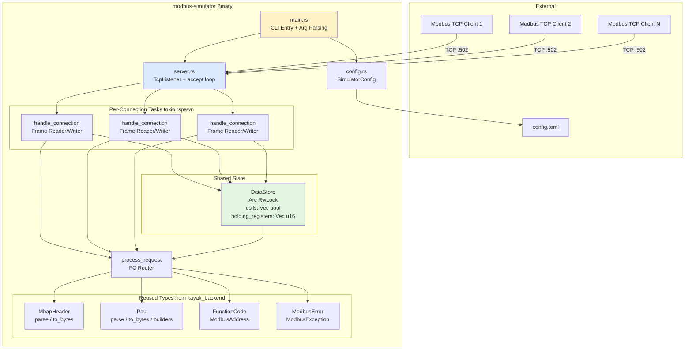
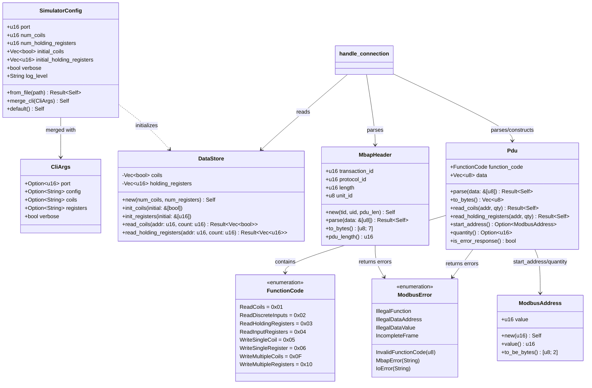
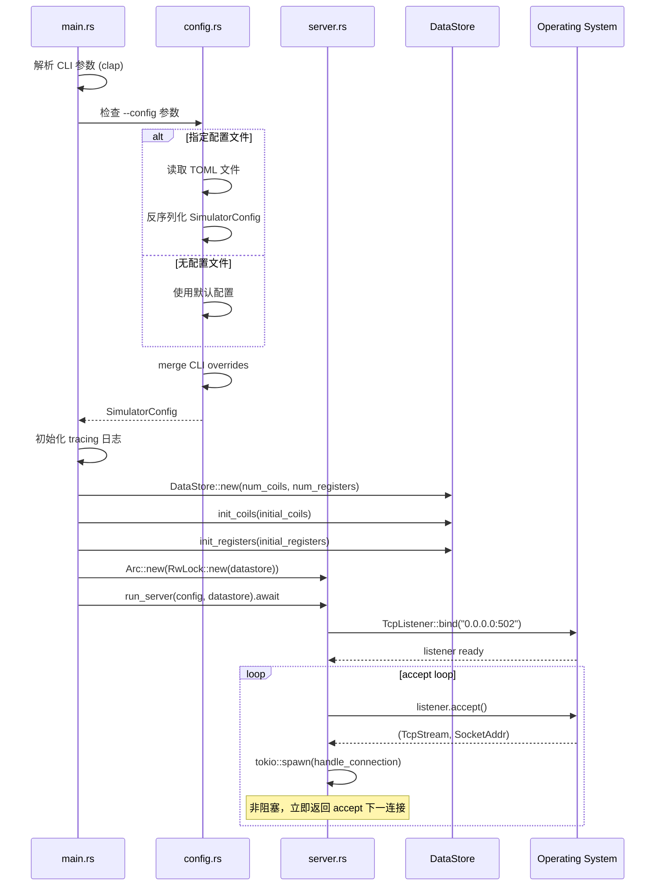
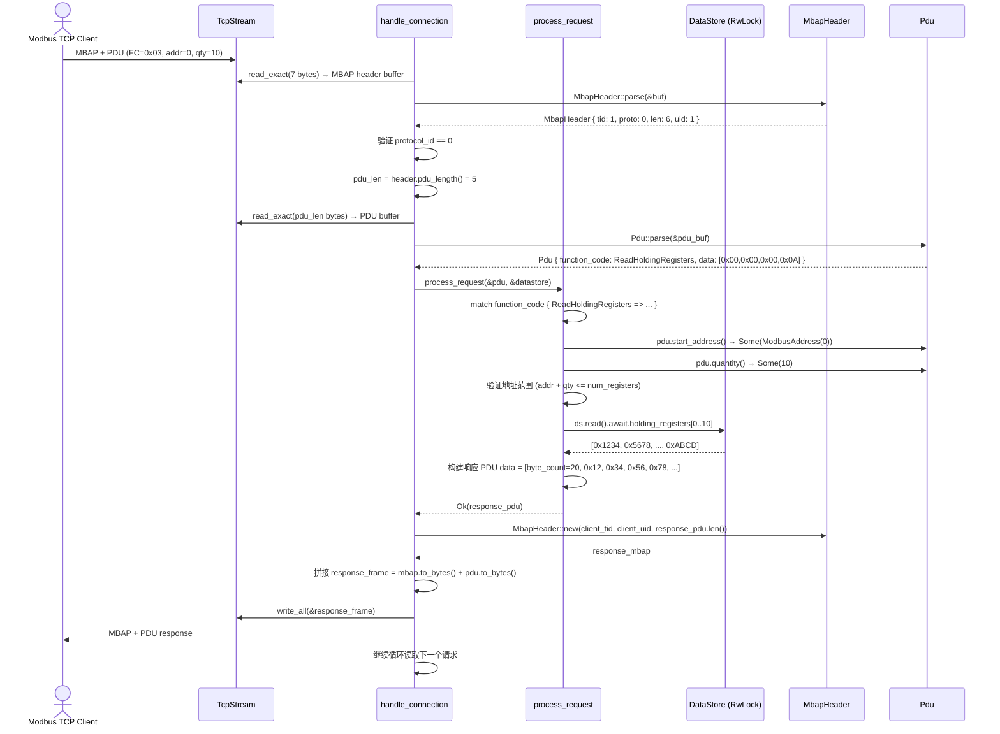

# R1-S2-006-B Modbus TCP 模拟设备 CLI 工具 - 详细设计文档

## 文档信息

| 项目 | 内容 |
|------|------|
| 任务编号 | R1-S2-006-B |
| 作者 | sw-jerry (Software Architect) |
| 日期 | 2026-05-03 |
| 状态 | 设计完成 |
| 版本 | 1.0 |
| 依赖文档 | [PRD](../prd.md), [架构文档](R1-S1-001_architecture.md) |
| 目标二进制 | `modbus-simulator` (已在 `Cargo.toml` 声明) |

---

## 目录

1. [概述](#1-概述)
2. [模块结构](#2-模块结构)
3. [架构图 (UML)](#3-架构图-uml)
4. [命令行参数设计](#4-命令行参数设计)
5. [配置文件格式设计](#5-配置文件格式设计)
6. [数据存储 (DataStore) 设计](#6-数据存储-datastore-设计)
7. [MBAP 帧解析方案](#7-mbap-帧解析方案)
8. [PDU 处理与响应构建](#8-pdu-处理与响应构建)
9. [并发连接处理方案](#9-并发连接处理方案)
10. [完整处理时序](#10-完整处理时序)
11. [错误处理策略](#11-错误处理策略)
12. [文件结构清单](#12-文件结构清单)

---

## 1. 概述

### 1.1 设计目标

构建一个独立的 Rust CLI 二进制工具 `modbus-simulator`，作为 Modbus TCP **从站 (Slave/Server)**，监听 TCP 端口，响应来自 Modbus TCP 主站 (Master/Client) 的请求。核心目标：

1. **TCP 从站模式**: 在指定端口启动 TCP 监听器，接受多个 Modbus TCP 客户端连接
2. **支持读功能码**: Read Coils (FC01)、Read Holding Registers (FC03)
3. **可配置初始值**: 通过配置文件或 CLI 参数指定线圈和寄存器的初始值
4. **多客户端并发**: 使用 tokio 异步运行时，支持多客户端同时连接和查询
5. **可观测性**: 日志输出请求/响应，便于调试和验证

### 1.2 技术选型

| 组件 | 选型 | 理由 |
|------|------|------|
| 运行时 | tokio (已在 Cargo.toml) | 项目统一异步运行时，高性能 TCP 处理 |
| 配置解析 | clap + serde (已有依赖) | 标准 CLI 框架 + TOML/JSON 反序列化 |
| 配置文件 | TOML (toml crate) | 人类可读，Rust 生态标准 |
| 共享状态 | `Arc<tokio::sync::RwLock<DataStore>>` | 多任务安全共享，读多写少场景优化 |
| MBAP/PDU 类型 | 复用 `kayak_backend::drivers::modbus::{MbapHeader, Pdu, FunctionCode, ModbusAddress}` | DRY 原则，避免重复实现 |
| 日志 | tracing-subscriber (已有依赖) | 结构化日志，支持级别过滤 |

### 1.3 设计原则

- **SRP**: 每个模块单一职责——server 管连接、handler 管帧、processor 管 PDU、datastore 管状态
- **OCP**: 函数码处理器通过 `match` 路由，新增功能码只需新增一个分支
- **DIP**: 复用 `kayak_backend::drivers::modbus` 的类型定义（接口抽象），不重新定义 Modbus 协议层
- **ISP**: 数据存储接口按数据类型分离——`read_coils()` / `read_registers()`，互不干扰
- **LSP**: 所有功能码处理器返回统一的 `Result<Pdu, ModbusError>`

---

## 2. 模块结构

### 2.1 二进制入口结构

```
kayak-backend/
├── Cargo.toml                          # 修改：bin path 改为目录形式
├── src/
│   ├── bin/
│   │   └── modbus-simulator/           # [新增] 二进制目录
│   │       ├── main.rs                 # CLI 入口，参数解析，启动服务器
│   │       ├── config.rs               # 配置结构体 + TOML 解析 + CLI 合并
│   │       └── server.rs               # TCP 监听器 + 连接处理循环
│   ├── drivers/
│   │   └── modbus/                     # [复用] 现有 MBAP/PDU/类型/错误定义
│   │       ├── mbap.rs                 # MbapHeader 结构体
│   │       ├── pdu.rs                  # Pdu 结构体
│   │       ├── types.rs                # FunctionCode, ModbusAddress, RegisterType
│   │       ├── error.rs                # ModbusError, ModbusException
│   │       ├── constants.rs            # 协议常量
│   │       └── mod.rs
│   └── lib.rs                          # crate root (crate 名为 kayak_backend)
```

> **注意**: 当前 `Cargo.toml` 的 `[[bin]]` 段声明 `path = "src/bin/modbus-simulator.rs"`。为支持多文件模块结构，需要修改为 `path = "src/bin/modbus-simulator/main.rs"`。两个方案均可行，本设计采用目录方案以支持代码组织。

### 2.2 模块职责划分

| 模块 | 文件 | 职责 | 依赖 |
|------|------|------|------|
| **CLI Entry** | `main.rs` | 解析命令行参数，加载配置，初始化日志，启动 server | `config`, `server` |
| **Config** | `config.rs` | 定义 `SimulatorConfig` 结构体，TOML 反序列化，CLI 参数覆盖 | `serde`, `clap`, `toml` |
| **Server** | `server.rs` | `TcpListener` 循环 accept，为每个连接 `tokio::spawn` 处理任务 | `datastore`, `process_request` |
| **DataStore** | `server.rs` 内嵌 (或独立 `datastore.rs`) | 线程安全存储线圈和寄存器值 | `tokio::sync::RwLock` |
| **Frame Handler** | `server.rs` 内的 `handle_connection()` | 读取 MBAP 头 → 读取 PDU → 调用处理器 → 构造响应 MBAP+PDU → 写回 | `MbapHeader`, `Pdu` |
| **PDU Processor** | `server.rs` 内的 `process_request()` | 根据 FC 分发到对应处理器，构建 PDU 响应 | `DataStore` |
| **MBAP/Pdu 类型** | `../../drivers/modbus/` | MbapHeader 解析/序列化，Pdu 构造/解析 | (已存在) |

### 2.3 模块依赖关系

```
main.rs
  ├─> config.rs (Config loading)
  └─> server.rs
        ├─> process_request() [FC routing]
        │     ├─> handle_read_coils()
        │     └─> handle_read_holding_registers()
        ├─> DataStore (Arc<RwLock<>>)
        └─> kayak_backend::drivers::modbus
              ├─> mbap.rs (MbapHeader)
              ├─> pdu.rs (Pdu)
              ├─> types.rs (FunctionCode, ModbusAddress)
              ├─> error.rs (ModbusError)
              └─> constants.rs (MODBUS_PROTOCOL_ID, limits)
```

---

## 3. 架构图 (UML)

### 3.1 组件结构图



### 3.2 类图 (Rust 结构体关系)



### 3.3 服务器启动序列图



### 3.4 请求处理序列图 (Read Holding Registers 示例)



---

## 4. 命令行参数设计

### 4.1 参数定义 (clap derive)

```rust
use clap::Parser;

/// Modbus TCP 从站模拟器
///
/// 启动一个 Modbus TCP 从站 (Slave/Server)，监听 TCP 端口，
/// 响应来自 Modbus TCP 主站 (Master/Client) 的请求。
///
/// 支持的功能码:
///   - FC 0x01: Read Coils (读取线圈)
///   - FC 0x03: Read Holding Registers (读取保持寄存器)
#[derive(Parser, Debug)]
#[command(name = "modbus-simulator")]
#[command(version = "0.1.0")]
#[command(about = "Modbus TCP Slave Simulator", long_about = None)]
pub struct CliArgs {
    /// 配置文件路径 (TOML 格式)
    #[arg(short = 'c', long = "config", value_name = "FILE")]
    pub config: Option<String>,

    /// TCP 监听端口 [默认: 502]
    #[arg(short = 'p', long = "port", value_name = "PORT")]
    pub port: Option<u16>,

    /// 线圈初始值，以逗号分隔的 0/1 序列
    /// 示例: --coils "1,0,1,0,1,0,1,0"
    /// 未指定的线圈默认为 0
    #[arg(long = "coils", value_name = "VALUES", value_delimiter = ',')]
    pub coils: Option<Vec<u8>>,

    /// 保持寄存器初始值，以逗号分隔的十进制数值
    /// 示例: --registers "0,100,200,300"
    /// 未指定的寄存器默认为 0
    #[arg(long = "registers", value_name = "VALUES", value_delimiter = ',')]
    pub registers: Option<Vec<u16>>,

    /// 详细日志输出 (等效于 --log-level debug)
    #[arg(short = 'v', long = "verbose")]
    pub verbose: bool,

    /// 日志级别 [可选: trace, debug, info, warn, error] [默认: info]
    #[arg(long = "log-level", value_name = "LEVEL", default_value = "info")]
    pub log_level: String,
}
```

### 4.2 使用示例

```bash
# 使用默认配置启动 (监听 0.0.0.0:502)
modbus-simulator

# 指定端口
modbus-simulator --port 1502

# 指定线圈初始值
modbus-simulator --coils 1,0,1,0,1,0,1,0

# 指定寄存器初始值
modbus-simulator --registers 0,100,200,300

# 详细日志
modbus-simulator -v

# 使用配置文件
modbus-simulator --config simulator.toml

# 组合使用 (CLI 覆盖配置文件)
modbus-simulator --config simulator.toml --port 1502 -v
```

### 4.3 CLI 与配置文件合并策略

```
优先级 (从低到高):
  1. 默认值 (硬编码)
  2. 配置文件 (--config)
  3. CLI 参数

合并规则:
  - 标量参数 (port, log_level): CLI 覆盖配置文件覆盖默认值
  - 列表参数 (coils, registers): CLI 覆盖配置文件覆盖默认值
  - verbose: CLI flag 覆盖配置文件中的 verbose 字段
```

---

## 5. 配置文件格式设计

### 5.1 TOML 格式定义

```toml
# Modbus TCP Simulator 配置文件
# 所有字段均为可选，未指定则使用默认值

# TCP 监听端口 (默认: 502)
port = 502

# ========== 数据区配置 ==========

# 线圈数量 (默认: 64)
num_coils = 64

# 保持寄存器数量 (默认: 64)
num_holding_registers = 64

# 线圈初始值 (索引从 0 开始)
# 格式: 数组，每个元素为 0 或 1
# 未指定的线圈默认为 0
# 示例: 前 4 个线圈 = [1, 0, 1, 0]
initial_coils = [
    { index = 0, value = true },
    { index = 2, value = true },
    { index = 4, value = true },
    { index = 6, value = true },
]

# 保持寄存器初始值 (索引从 0 开始)
# 格式: 数组，每个元素为 u16 值 (0-65535)
# 未指定的寄存器默认为 0
# 示例: 寄存器 0 = 100, 寄存器 1 = 200...
initial_holding_registers = [
    { index = 0, value = 100 },
    { index = 1, value = 200 },
    { index = 2, value = 300 },
    { index = 3, value = 400 },
]

# ========== 日志配置 ==========

# 日志级别: "trace", "debug", "info", "warn", "error" (默认: "info")
log_level = "info"

# 是否输出详细的请求/响应帧内容 (默认: false)
verbose = false
```

### 5.2 替代简化格式 (用于 CLI --coils/--registers)

针对命令行快速测试场景，提供逗号分隔的简化格式：

```
CLI --coils "1,0,1,0,1,0,1,0"
  解释: coil[0]=1, coil[1]=0, coil[2]=1, coil[3]=0, ...

CLI --registers "100,200,300,400"
  解释: register[0]=100, register[1]=200, register[2]=300, register[3]=400
```

对应的 Rust 解析逻辑：

```rust
impl SimulatorConfig {
    /// 从 CSV 字符串解析线圈值
    fn parse_coils_csv(csv: &str) -> Result<Vec<bool>, String> {
        csv.split(',')
            .map(|s| s.trim())
            .filter(|s| !s.is_empty())
            .map(|s| match s {
                "1" | "true"  => Ok(true),
                "0" | "false" => Ok(false),
                _ => Err(format!("无效线圈值: '{}'，期望 0/1 或 true/false", s)),
            })
            .collect()
    }

    /// 从 CSV 字符串解析寄存器值
    fn parse_registers_csv(csv: &str) -> Result<Vec<u16>, String> {
        csv.split(',')
            .map(|s| s.trim())
            .filter(|s| !s.is_empty())
            .map(|s| s.parse::<u16>()
                .map_err(|_| format!("无效寄存器值: '{}'，期望 0-65535", s)))
            .collect()
    }
}
```

---

## 6. 数据存储 (DataStore) 设计

### 6.1 结构体定义

```rust
use std::sync::Arc;
use tokio::sync::RwLock;

/// Modbus 从站数据存储
///
/// 线程安全地存储线圈和保持寄存器的当前值。
/// 使用 `Arc<RwLock<DataStore>>` 在多连接任务间共享。
#[derive(Debug, Clone)]
pub struct DataStore {
    /// 线圈值 (位数组)，按地址索引
    coils: Vec<bool>,
    /// 保持寄存器值 (16位数组)，按地址索引
    holding_registers: Vec<u16>,
}
```

### 6.2 公共 API

```rust
impl DataStore {
    /// 创建新的数据存储
    ///
    /// # Arguments
    /// * `num_coils` - 线圈数量 (默认 64)
    /// * `num_registers` - 保持寄存器数量 (默认 64)
    pub fn new(num_coils: u16, num_registers: u16) -> Self {
        Self {
            coils: vec![false; num_coils as usize],
            holding_registers: vec![0u16; num_registers as usize],
        }
    }

    /// 初始化线圈值（从配置）
    ///
    /// 覆盖配置中指定的索引，其余保持默认值。
    pub fn init_coils<I: IntoIterator<Item = (u16, bool)>>(&mut self, initial: I) {
        for (index, value) in initial {
            if (index as usize) < self.coils.len() {
                self.coils[index as usize] = value;
            }
        }
    }

    /// 初始化寄存器值（从配置）
    pub fn init_registers<I: IntoIterator<Item = (u16, u16)>>(&mut self, initial: I) {
        for (index, value) in initial {
            if (index as usize) < self.holding_registers.len() {
                self.holding_registers[index as usize] = value;
            }
        }
    }

    /// 读取线圈值
    ///
    /// # Arguments
    /// * `start_address` - 起始地址 (0-based)
    /// * `quantity` - 读取数量
    ///
    /// # Returns
    /// * `Ok(Vec<bool>)` - 线圈值
    /// * `Err(ModbusError::IllegalDataAddress)` - 地址越界
    pub fn read_coils(&self, start_address: u16, quantity: u16) -> Result<Vec<bool>, ModbusError> {
        let end = start_address as usize + quantity as usize;
        if end > self.coils.len() {
            return Err(ModbusError::IllegalDataAddress);
        }
        Ok(self.coils[start_address as usize..end].to_vec())
    }

    /// 读取保持寄存器值
    ///
    /// # Arguments
    /// * `start_address` - 起始地址 (0-based)
    /// * `quantity` - 读取数量
    ///
    /// # Returns
    /// * `Ok(Vec<u16>)` - 寄存器值
    /// * `Err(ModbusError::IllegalDataAddress)` - 地址越界
    pub fn read_holding_registers(&self, start_address: u16, quantity: u16) -> Result<Vec<u16>, ModbusError> {
        let end = start_address as usize + quantity as usize;
        if end > self.holding_registers.len() {
            return Err(ModbusError::IllegalDataAddress);
        }
        Ok(self.holding_registers[start_address as usize..end].to_vec())
    }

    /// 获取线圈总数
    pub fn coil_count(&self) -> u16 {
        self.coils.len() as u16
    }

    /// 获取寄存器总数
    pub fn register_count(&self) -> u16 {
        self.holding_registers.len() as u16
    }
}
```

### 6.3 共享状态类型别名

```rust
/// 线程安全的数据存储引用类型
pub type SharedDataStore = Arc<RwLock<DataStore>>;
```

### 6.4 并发安全性分析

| 操作 | 锁类型 | 并发场景 | 安全性 |
|------|--------|---------|--------|
| `read_coils()` | 读锁 (共享) | 多客户端同时读取 | 安全，无阻塞 |
| `read_holding_registers()` | 读锁 (共享) | 多客户端同时读取 | 安全，无阻塞 |
| 写入操作 (未来) | 写锁 (排他) | 单客户端写入 vs 多客户端读取 | 写锁等待所有读锁释放 |

当前阶段仅实现读取操作，因此使用 `tokio::sync::RwLock` 的读锁足以保证性能。未来扩展写入功能时，`RwLock` 天然支持读-写互斥。

---

## 7. MBAP 帧解析方案

### 7.1 复用策略

**直接复用** `kayak_backend::drivers::modbus::mbap::MbapHeader`，不做任何修改。

原因：
- 该结构体已完整实现 MBAP 头部解析 (`parse`) 和序列化 (`to_bytes`)
- 包含事务 ID 验证、协议 ID 验证、长度字段验证
- 已通过充分的单元测试 (TC-029 ~ TC-032)

### 7.2 帧接收流程 (两阶段读取)

TCP 流上的 Modbus TCP 帧没有帧界定符，帧边界通过 MBAP 头部中的 `length` 字段隐式定义。因此采用**两阶段读取**策略：

```
阶段 1: 读取固定 7 字节 MBAP 头部
   ↓
阶段 2: 解析 length 字段 → 计算 PDU 长度 → 读取 PDU 数据

帧结构:
┌──────────────────────────────────────────────────┬──────────────────────┐
│               MBAP Header (7 bytes)              │    PDU (N bytes)     │
├──────────┬──────────┬──────────┬──────────┬──────┼──────────────────────┤
│ TID High │ TID Low  │ PID High │ PID Low  │ Len  │ Len  │ Unit │ Func │ Data... │
│          │          │          │          │ High │ Low  │  ID  │ Code │         │
│  byte 0  │  byte 1  │  byte 2  │  byte 3  │   4  │   5  │   6  │   7  │  8...   │
└──────────┴──────────┴──────────┴──────────┴──────┴──────┴──────┴──────┴─────────┘
```

### 7.3 关键代码路径

```rust
/// 每连接请求处理循环
async fn handle_connection(
    mut stream: TcpStream,
    datastore: SharedDataStore,
    peer_addr: SocketAddr,
) {
    let mut mbap_buf = [0u8; 7]; // MbapHeader::LENGTH

    loop {
        // ===== 阶段 1: 读取 MBAP 头部 =====
        match stream.read_exact(&mut mbap_buf).await {
            Ok(()) => {} // 继续处理
            Err(e) if e.kind() == io::ErrorKind::UnexpectedEof => {
                tracing::info!("Client {} disconnected", peer_addr);
                break;
            }
            Err(e) => {
                tracing::error!("Read error from {}: {}", peer_addr, e);
                break;
            }
        }

        // 解析 MBAP 头部
        let request_mbap = match MbapHeader::parse(&mbap_buf) {
            Ok(header) => header,
            Err(e) => {
                tracing::warn!("Invalid MBAP from {}: {}", peer_addr, e);
                break;
            }
        };

        // ===== 阶段 2: 读取 PDU 数据 =====
        let pdu_len = request_mbap.pdu_length() as usize;
        if pdu_len == 0 {
            tracing::warn!("Zero-length PDU from {}", peer_addr);
            continue;
        }

        let mut pdu_buf = vec![0u8; pdu_len];
        if let Err(e) = stream.read_exact(&mut pdu_buf).await {
            tracing::error!("Failed to read PDU from {}: {}", peer_addr);
            break;
        }

        // 解析 PDU
        let request_pdu = match Pdu::parse(&pdu_buf) {
            Ok(pdu) => pdu,
            Err(e) => {
                tracing::warn!("Invalid PDU from {}: {:?}", peer_addr, e);
                // 构建异常响应
                let exception = build_exception_response(&request_mbap, e);
                let _ = stream.write_all(&exception).await;
                continue;
            }
        };

        // 处理请求
        let response_pdu = process_request(&request_pdu, &datastore).await;

        // 构建响应帧
        let response_mbap = MbapHeader::new(
            request_mbap.transaction_id,  // 回显事务 ID
            request_mbap.unit_id,         // 回显从站 ID
            response_pdu.len() as u16,
        );

        let mut response_frame = Vec::with_capacity(7 + response_pdu.len());
        response_frame.extend_from_slice(&response_mbap.to_bytes());
        response_frame.extend_from_slice(&response_pdu.to_bytes());

        // 发送响应
        if let Err(e) = stream.write_all(&response_frame).await {
            tracing::error!("Failed to send response to {}: {}", peer_addr, e);
            break;
        }
    }
}
```

### 7.4 异常帧处理

当收到的 PDU 无法解析时 (无效功能码、数据不完整)，构建 Modbus 异常响应帧：

```rust
/// 构建 Modbus 异常响应帧
fn build_exception_response(mbap: &MbapHeader, error: ModbusError) -> Vec<u8> {
    let exception_code = match &error {
        ModbusError::InvalidFunctionCode(_) => 0x01, // Illegal Function
        ModbusError::IllegalDataAddress => 0x02,      // Illegal Data Address
        _ => 0x04,                                     // Server Device Failure
    };

    // PDU: 原功能码 | 0x80 + 异常码
    let error_pdu = vec![0x80, exception_code]; // 简化：假设原 FC=0x00

    // 构建完整错误响应帧
    // 实际实现中应保留原请求的功能码
    let response_mbap = MbapHeader::new(mbap.transaction_id, mbap.unit_id, error_pdu.len() as u16);
    let mut frame = Vec::with_capacity(7 + error_pdu.len());
    frame.extend_from_slice(&response_mbap.to_bytes());
    frame.extend_from_slice(&error_pdu);
    frame
}
```

---

## 8. PDU 处理与响应构建

### 8.1 功能码路由

```rust
/// 处理 Modbus PDU 请求，返回 PDU 响应
///
/// 根据功能码分发到对应的处理函数。
/// 对不支持的功能码返回异常响应。
async fn process_request(
    pdu: &Pdu,
    datastore: &SharedDataStore,
) -> Pdu {
    let ds = datastore.read().await;

    match pdu.function_code {
        FunctionCode::ReadCoils => {
            handle_read_coils(pdu, &ds)
        }
        FunctionCode::ReadHoldingRegisters => {
            handle_read_holding_registers(pdu, &ds)
        }
        // 不支持的功能码 → 返回异常
        _ => {
            Pdu::new(
                // 异常功能码 = 原功能码 | 0x80
                // 注意：这里直接从 pdu 获取 function_code 构建异常
                FunctionCode::from_u8(pdu.function_code.code() | 0x80)
                    .unwrap_or(FunctionCode::ReadCoils), // fallback
                vec![0x01], // exception code: Illegal Function
            ).unwrap_or_else(|_| Pdu::new(
                FunctionCode::ReadCoils, // 不可能触发
                vec![0x04], // Server Device Failure
            ).unwrap())
        }
    }
}
```

### 8.2 Read Coils (FC 0x01) 处理

```rust
/// 处理 Read Coils (FC 0x01) 请求
///
/// 请求 PDU: [0x01, addr_hi, addr_lo, qty_hi, qty_lo]
/// 响应 PDU: [0x01, byte_count, coil_data...]
fn handle_read_coils(pdu: &Pdu, ds: &DataStore) -> Pdu {
    // 从 PDU 提取地址和数量
    let start_addr = pdu.start_address()
        .map(|a| a.value())
        .unwrap_or(0);
    let quantity = pdu.quantity().unwrap_or(0);

    // 验证参数
    if quantity == 0 || quantity > 2000 {
        return build_exception_pdu(pdu.function_code, 0x03); // Illegal Data Value
    }

    // 读取数据
    match ds.read_coils(start_addr, quantity) {
        Ok(coils) => {
            // 打包线圈值到字节数组 (每个字节 8 个线圈，LSB 在前)
            let byte_count = quantity.div_ceil(8) as usize;
            let mut coil_bytes = vec![0u8; byte_count];
            for (i, &coil) in coils.iter().enumerate() {
                if coil {
                    coil_bytes[i / 8] |= 1 << (i % 8);
                }
            }

            // 构建响应 PDU
            let mut data = Vec::with_capacity(1 + byte_count);
            data.push(byte_count as u8);
            data.extend_from_slice(&coil_bytes);

            Pdu::new(FunctionCode::ReadCoils, data)
                .unwrap_or_else(|_| build_exception_pdu(pdu.function_code, 0x04))
        }
        Err(_) => {
            build_exception_pdu(pdu.function_code, 0x02) // Illegal Data Address
        }
    }
}
```

### 8.3 Read Holding Registers (FC 0x03) 处理

```rust
/// 处理 Read Holding Registers (FC 0x03) 请求
///
/// 请求 PDU: [0x03, addr_hi, addr_lo, qty_hi, qty_lo]
/// 响应 PDU: [0x03, byte_count, register_data...]
fn handle_read_holding_registers(pdu: &Pdu, ds: &DataStore) -> Pdu {
    let start_addr = pdu.start_address()
        .map(|a| a.value())
        .unwrap_or(0);
    let quantity = pdu.quantity().unwrap_or(0);

    // 验证参数
    if quantity == 0 || quantity > 125 {
        return build_exception_pdu(pdu.function_code, 0x03); // Illegal Data Value
    }

    // 读取数据
    match ds.read_holding_registers(start_addr, quantity) {
        Ok(registers) => {
            let byte_count = (quantity * 2) as usize;
            let mut data = Vec::with_capacity(1 + byte_count);
            data.push(byte_count as u8);

            // 每个寄存器以大端序写入 2 字节
            for &reg in &registers {
                data.extend_from_slice(&reg.to_be_bytes());
            }

            Pdu::new(FunctionCode::ReadHoldingRegisters, data)
                .unwrap_or_else(|_| build_exception_pdu(pdu.function_code, 0x04))
        }
        Err(_) => {
            build_exception_pdu(pdu.function_code, 0x02) // Illegal Data Address
        }
    }
}
```

### 8.4 异常 PDU 构建辅助函数

```rust
/// 构建 Modbus 异常响应 PDU
///
/// # Arguments
/// * `request_fc` - 请求的功能码
/// * `exception_code` - Modbus 异常码 (1-8)
///
/// # Returns
/// * PDU: [request_fc | 0x80, exception_code]
fn build_exception_pdu(request_fc: FunctionCode, exception_code: u8) -> Pdu {
    let error_fc_code = request_fc.code() | 0x80;
    Pdu::new(
        // SAFETY: error_fc_code 是有效的 u8 值
        FunctionCode::from_u8(error_fc_code)
            .unwrap_or(FunctionCode::ReadCoils),
        vec![exception_code],
    )
    .unwrap_or_else(|_| Pdu::new(
        FunctionCode::ReadCoils,
        vec![0x04], // Server Device Failure
    ).unwrap())
}
```

### 8.5 支持的异常码映射

| 异常码 | 名称 | 触发条件 |
|--------|------|---------|
| 0x01 | Illegal Function | 不支持的功能码 |
| 0x02 | Illegal Data Address | 起始地址 + 数量超出数据区范围 |
| 0x03 | Illegal Data Value | 数量超出协议限制 (coils>2000, registers>125) |
| 0x04 | Server Device Failure | 内部错误 (PDU 构造失败) |

---

## 9. 并发连接处理方案

### 9.1 架构模式：每连接一任务 (Per-Connection Task)

```
                 ┌─────────────────────┐
                 │   TcpListener       │
                 │   bind(0.0.0.0:502) │
                 └────────┬────────────┘
                          │
                    ┌─────▼──────┐
                    │ accept()   │  ← 主循环
                    │   loop     │
                    └─────┬──────┘
                          │
              ┌───────────┼───────────┐
              │           │           │
         ┌────▼────┐ ┌───▼────┐ ┌───▼────┐
         │spawn()  │ │spawn() │ │spawn() │
         │Task 1   │ │Task 2  │ │Task N  │
         └────┬────┘ └───┬────┘ └───┬────┘
              │           │           │
         ┌────▼────┐ ┌───▼────┐ ┌───▼────┐
         │read/    │ │read/   │ │read/   │
         │process/ │ │process/│ │process/│
         │write    │ │write   │ │write   │
         │  loop   │ │ loop   │ │ loop   │
         └─────────┘ └────────┘ └────────┘
              │           │           │
              └───────────┼───────────┘
                          │
              ┌───────────▼───────────┐
              │   Arc<RwLock<         │  ← 共享数据存储
              │     DataStore>>       │
              └───────────────────────┘
```

### 9.2 核心实现

```rust
use tokio::net::TcpListener;
use tokio::sync::RwLock;
use std::sync::Arc;

/// 启动 Modbus TCP 从站服务器
pub async fn run_server(config: SimulatorConfig, datastore: SharedDataStore) -> Result<(), Box<dyn std::error::Error>> {
    let bind_addr = format!("0.0.0.0:{}", config.port);
    let listener = TcpListener::bind(&bind_addr).await?;

    tracing::info!("Modbus TCP Simulator listening on {}", bind_addr);
    tracing::info!("  Coils available: {}", datastore.read().await.coil_count());
    tracing::info!("  Registers available: {}", datastore.read().await.register_count());

    loop {
        match listener.accept().await {
            Ok((stream, peer_addr)) => {
                tracing::info!("New connection from {}", peer_addr);

                let ds_clone = Arc::clone(&datastore);

                tokio::spawn(async move {
                    handle_connection(stream, ds_clone, peer_addr).await;
                    tracing::info!("Connection closed: {}", peer_addr);
                });
            }
            Err(e) => {
                tracing::error!("Accept error: {}", e);
                // 短暂延迟后继续 accept
                tokio::time::sleep(std::time::Duration::from_millis(100)).await;
            }
        }
    }
}
```

### 9.3 并发连接特性

| 特性 | 实现方式 | 说明 |
|------|---------|------|
| 非阻塞 accept | `tokio::spawn` | 每个连接独立任务，互不阻塞 |
| 共享状态 | `Arc<RwLock<DataStore>>` | 所有任务共享同一份数据存储 |
| 读取并行 | `RwLock::read()` | 多任务可同时获取读锁 |
| 连接隔离 | 独立 `TcpStream` | 一个连接的 I/O 错误不影响其他连接 |
| 内存安全 | Rust 所有权系统 | 编译期保证无数据竞争 |
| 优雅退出 | Ctrl+C 信号处理 | `tokio::select!` + `tokio::signal::ctrl_c()` |

### 9.4 优雅关闭

```rust
use tokio::signal;

// 在 main.rs 中
#[tokio::main]
async fn main() -> Result<(), Box<dyn std::error::Error>> {
    // ... 配置加载 ...

    let server_task = tokio::spawn(run_server(config, datastore));

    // 等待 Ctrl+C 信号
    tokio::select! {
        result = server_task => {
            if let Err(e) = result {
                tracing::error!("Server error: {}", e);
            }
        }
        _ = signal::ctrl_c() => {
            tracing::info!("Shutting down...");
        }
    }

    tracing::info!("Modbus simulator stopped");
    Ok(())
}
```

---

## 10. 完整处理时序

### 10.1 一个 Read Holding Registers 请求的完整生命周期

```mermaid
sequenceDiagram
    autonumber

    participant Client as Modbus Client
    participant OS as TCP Stack
    participant Accept as accept loop
    participant Task as tokio Task
    participant Stream as TcpStream
    participant Parse as Frame Parser
    participant Route as FC Router
    participant DS as DataStore(RwLock)

    Client->>OS: TCP SYN → 0.0.0.0:502
    OS->>Accept: accept() returns (stream, addr)
    Accept->>Task: tokio::spawn(handle_connection)
    Note over Task: 新任务开始运行

    Client->>Stream: 发送: MBAP(7B) + PDU(5B)
    Note over Stream: [00 01 | 00 00 | 00 06 | 01 | 03 | 00 00 | 00 0A]

    Task->>Stream: read_exact(&mut [0u8; 7])
    Stream-->>Task: [00,01,00,00,00,06,01]

    Task->>Parse: MbapHeader::parse(&buf)
    Parse-->>Task: MbapHeader{tid:1, pid:0, len:6, uid:1}

    Task->>Stream: read_exact(&mut pdu_buf[0..5])
    Stream-->>Task: [03,00,00,00,0A]

    Task->>Parse: Pdu::parse(&pdu_buf)
    Parse-->>Task: Pdu{fc: ReadHoldingRegisters, data}

    Task->>Route: process_request(&pdu, &datastore)
    Route->>Route: match fc → ReadHoldingRegisters
    Route->>DS: ds.read().await
    Route->>DS: read_holding_registers(0, 10)
    DS-->>Route: [v0, v1, v2, v3, v4, v5, v6, v7, v8, v9]

    Route->>Route: 构建响应 PDU
    Route-->>Task: Ok(Pdu{fc: ReadHoldingRegisters, data})

    Task->>Parse: MbapHeader::new(1, 1, response_pdu.len())
    Parse-->>Task: MbapHeader{...}

    Task->>Stream: write_all(&response_frame)
    Note over Stream: [00 01 | 00 00 | 00 15 | 01 | 03 | 14 | ...20 bytes register data...]

    Stream-->>Client: 响应帧送达

    Note over Task: 循环回到步骤 5，等待下一个请求
```

---

## 11. 错误处理策略

### 11.1 错误分类

| 错误类别 | 处理方式 | 日志级别 | 连接影响 |
|---------|---------|---------|---------|
| MBAP 解析失败 | 返回异常响应 + 断开连接 | WARN | 断开 |
| PDU 解析失败 | 返回异常响应 + 继续等待 | WARN | 保持 |
| 无效功能码 | 返回 Illegal Function (0x01) | DEBUG | 保持 |
| 地址越界 | 返回 Illegal Data Address (0x02) | DEBUG | 保持 |
| 数量超限 | 返回 Illegal Data Value (0x03) | DEBUG | 保持 |
| TCP 读取 EOF | 正常关闭连接 | INFO | 断开 |
| TCP 读取错误 | 断开连接 | ERROR | 断开 |
| TCP 写入错误 | 断开连接 | ERROR | 断开 |
| Accept 错误 | 短暂延迟后重试 | ERROR | 保持服务器 |

### 11.2 日志输出示例

```
# 启动日志
2026-05-03T10:00:00.123Z  INFO modbus_simulator: Modbus TCP Simulator listening on 0.0.0.0:502
2026-05-03T10:00:00.124Z  INFO modbus_simulator:   Coils available: 64
2026-05-03T10:00:00.124Z  INFO modbus_simulator:   Registers available: 64

# 连接日志
2026-05-03T10:00:05.001Z  INFO modbus_simulator: New connection from 192.168.1.100:54321

# 请求日志 (verbose 模式)
2026-05-03T10:00:05.002Z DEBUG modbus_simulator: [192.168.1.100:54321] REQ tid=1 FC=ReadHoldingRegisters addr=0 qty=10
2026-05-03T10:00:05.003Z DEBUG modbus_simulator: [192.168.1.100:54321] RES tid=1 FC=ReadHoldingRegisters bytes=20

# 错误日志
2026-05-03T10:00:10.000Z  WARN modbus_simulator: [192.168.1.100:54321] Invalid PDU: Invalid function code: 0xFF
2026-05-03T10:00:15.000Z ERROR modbus_simulator: [192.168.1.100:54322] Read error: Connection reset by peer

# 断开日志
2026-05-03T10:05:00.000Z  INFO modbus_simulator: Connection closed: 192.168.1.100:54321

# 关闭日志
2026-05-03T10:10:00.000Z  INFO modbus_simulator: Shutting down...
2026-05-03T10:10:00.001Z  INFO modbus_simulator: Modbus simulator stopped
```

---

## 12. 文件结构清单

### 12.1 需要创建的文件

| 文件路径 | 内容 | 行数估计 |
|---------|------|---------|
| `kayak-backend/src/bin/modbus-simulator/main.rs` | CLI 入口，参数解析，日志初始化，启动服务器 | ~60 |
| `kayak-backend/src/bin/modbus-simulator/config.rs` | `SimulatorConfig` 结构体，TOML 解析，CLI 合并 | ~120 |
| `kayak-backend/src/bin/modbus-simulator/server.rs` | `DataStore`, `run_server`, `handle_connection`, `process_request`, FC handlers | ~300 |

### 12.2 需要修改的文件

| 文件路径 | 修改内容 | 说明 |
|---------|---------|------|
| `kayak-backend/Cargo.toml` | 修改 `[[bin]]` 的 `path` 为 `"src/bin/modbus-simulator/main.rs"` | 将单文件二进制改为目录形式 |
| `kayak-backend/Cargo.toml` | 添加依赖 `toml = "0.8"` 和 `clap = { version = "4", features = ["derive"] }` | CLI 解析和配置反序列化 |

### 12.3 复用依赖 (不需要新增)

| 依赖 | 版本 | 用途 |
|------|------|------|
| `tokio` | 1.35 | 异步运行时、TCP 监听、任务生成 |
| `serde` | 1.0 | 配置反序列化 |
| `tracing` | 0.1 | 结构化日志 |
| `tracing-subscriber` | 0.3 | 日志输出配置 |
| `kayak_backend::drivers::modbus::*` | (本地) | MbapHeader, Pdu, FunctionCode, ModbusAddress, ModbusError |

### 12.4 需要新增到 Cargo.toml 的依赖

```toml
# CLI 参数解析
clap = { version = "4", features = ["derive"] }

# TOML 配置文件解析
toml = "0.8"
```

---

## 附录 A: 默认配置常量

```rust
/// 默认配置常量
pub const DEFAULT_PORT: u16 = 502;
pub const DEFAULT_NUM_COILS: u16 = 64;
pub const DEFAULT_NUM_HOLDING_REGISTERS: u16 = 64;
pub const DEFAULT_LOG_LEVEL: &str = "info";
```

## 附录 B: Modbus 功能码支持状态

| 功能码 | 名称 | 支持状态 | 备注 |
|--------|------|---------|------|
| 0x01 | Read Coils | ✓ 已实现 | 读取线圈 (位) |
| 0x02 | Read Discrete Inputs | ✗ 未实现 | 留待后续扩展 |
| 0x03 | Read Holding Registers | ✓ 已实现 | 读取保持寄存器 (字) |
| 0x04 | Read Input Registers | ✗ 未实现 | 留待后续扩展 |
| 0x05 | Write Single Coil | ✗ 未实现 | 留待后续扩展 |
| 0x06 | Write Single Register | ✗ 未实现 | 留待后续扩展 |
| 0x0F | Write Multiple Coils | ✗ 未实现 | 留待后续扩展 |
| 0x10 | Write Multiple Registers | ✗ 未实现 | 留待后续扩展 |

## 附录 C: 测试策略

| 测试类型 | 测试目标 | 工具 |
|---------|---------|------|
| 单元测试 | DataStore 读写、config 解析、FC 路由 | `#[cfg(test)]` + `cargo test` |
| 集成测试 | 启动模拟器 → 使用 Modbus 客户端验证 FC01/FC03 | `modbus-cli` 或 Python `pymodbus` |
| 并发测试 | 多个客户端同时连接读取，验证无数据竞争 | `cargo test --test concurrent` |
| 手动测试 | `telnet localhost 502` 发送原始帧 | 手动验证 |
