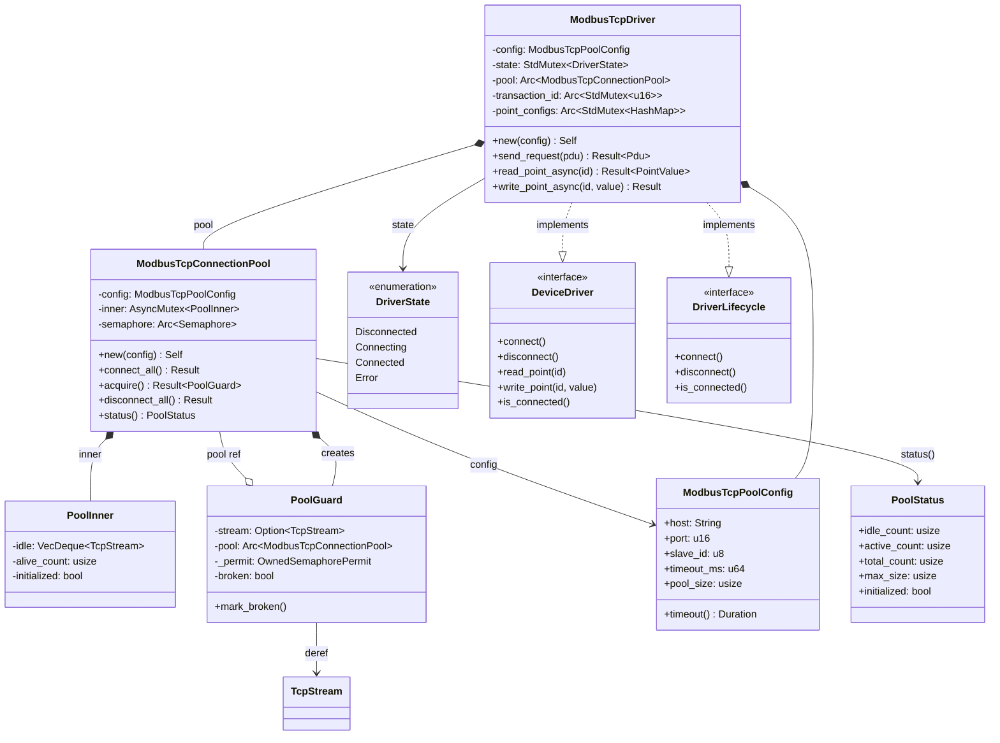
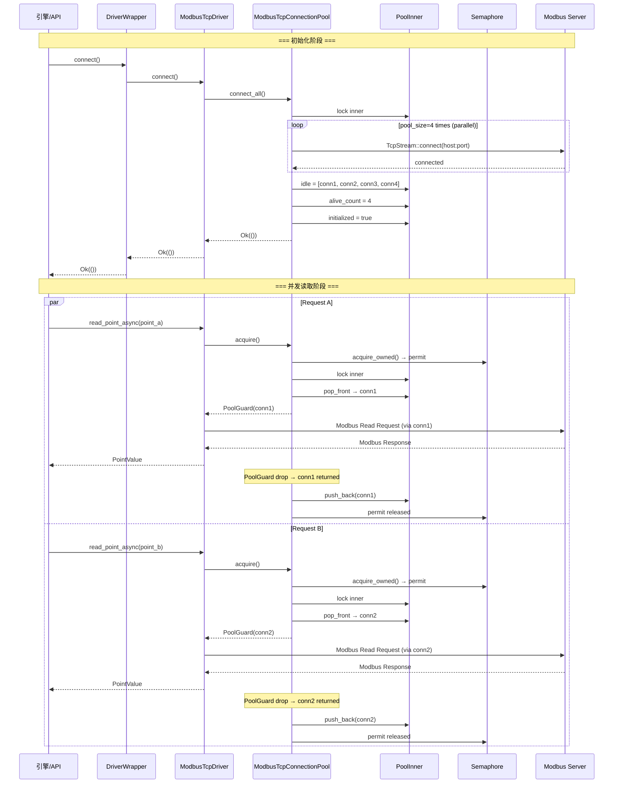
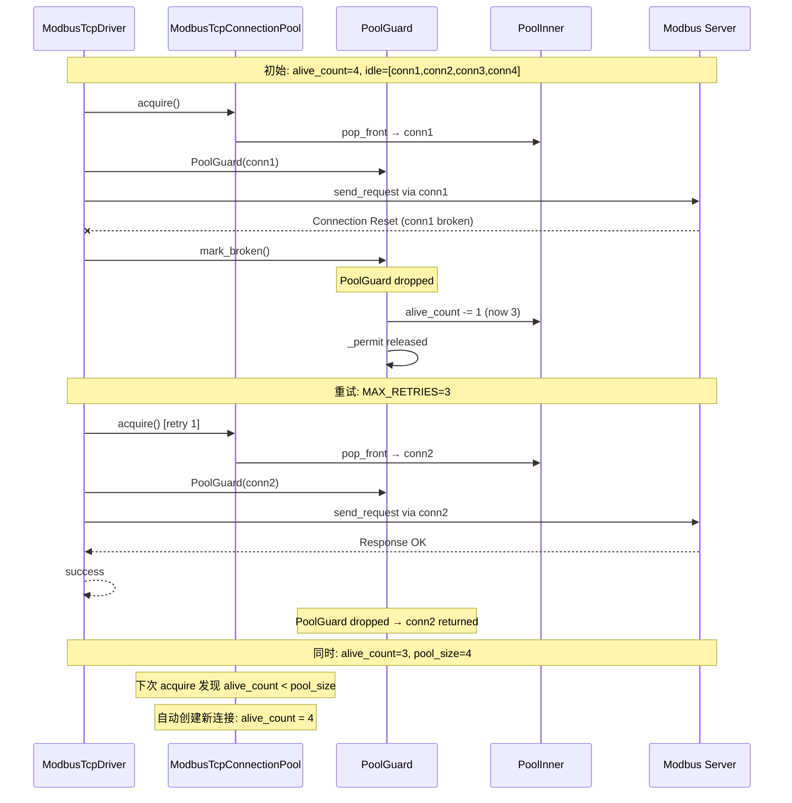

# R1-S2-012-B Modbus TCP 连接池 - 详细设计文档

## 文档信息

| 项目 | 内容 |
|------|------|
| 任务编号 | R1-S2-012-B |
| 作者 | sw-jerry (Software Architect) |
| 日期 | 2026-05-03 |
| 状态 | 设计完成 |
| 版本 | 1.0 |
| 依赖文档 | [PRD](../prd.md), [架构文档](R1-S1-001_architecture.md), [现有代码 `tcp.rs`](../../kayak-backend/src/drivers/modbus/tcp.rs) |

---

## 目录

1. [概述](#1-概述)
2. [模块结构](#2-模块结构)
3. [数据结构设计](#3-数据结构设计)
4. [连接池算法设计](#4-连接池算法设计)
5. [断线自动重建策略](#5-断线自动重建策略)
6. [与 ModbusTcpDriver 的集成](#6-与-modbustcpdriver-的集成)
7. [架构图 (UML)](#7-架构图-uml)
8. [执行时序](#8-执行时序)
9. [错误处理策略](#9-错误处理策略)
10. [线程安全分析](#10-线程安全分析)
11. [配置与生命周期](#11-配置与生命周期)
12. [测试策略](#12-测试策略)
13. [文件变更清单](#13-文件变更清单)

---

## 1. 概述

### 1.1 背景

当前 `ModbusTcpDriver` 使用单连接模式：`stream: AsyncMutex<Option<TcpStream>>`，所有请求串行通过一个 TCP 连接。PRD 要求支持 `connection_pool_size` 配置（默认 4），前端已在 API schema 中暴露该字段，但后端驱动尚未实现。

### 1.2 设计目标

| 目标 | 描述 |
|------|------|
| **预建连接** | 驱动 `connect()` 时一次性预建 `pool_size` 条 TCP 连接 |
| **并发获取** | 多个调用方可通过 `acquire()` 并发获取独立连接，受 semaphore 约束 |
| **自动归还** | RAII 模式：`PoolGuard` 在 `Drop` 时自动归还连接 |
| **断线重建** | 连接在 IO 错误后自动丢弃并重建新连接，对上层透明 |
| **零破坏性** | 不改变现有 `DeviceDriver`/`DriverLifecycle` trait 签名 |
| **线程安全** | 内部使用 `tokio::sync::Mutex` + `Arc<Semaphore>`，满足 `Send + Sync` |

### 1.3 非目标

- 不支持连接池动态扩缩容（pool_size 在初始化后固定）
- 不实现连接健康主动探活（ping 心跳），仅被动检测
- 不实现连接亲和性（affinity）/ sticky 连接

---

## 2. 模块结构

### 2.1 新增文件

```
kayak-backend/src/drivers/modbus/
├── pool.rs          ← [新增] 连接池核心实现
├── tcp.rs           ← [修改] 集成连接池
├── types.rs         ← [修改] 新增 ModbusTcpPoolConfig
├── constants.rs     ← [修改] 新增池相关常量
├── mod.rs           ← [修改] 导出新模块
├── error.rs         (不变)
├── mbap.rs          (不变)
├── pdu.rs           (不变)
├── rtu.rs           (不变)
```

### 2.2 模块职责

| 文件 | 职责 | 必须存在理由 |
|------|------|------------|
| `pool.rs` | 连接池的数据结构、acquire/release 算法、断线重建逻辑 | SRP：单一职责，池逻辑与 Modbus 协议逻辑解耦 |
| `tcp.rs` | `ModbusTcpDriver`，持有 `ModbusTcpConnectionPool`，委托读写操作 | 集成连接池到现有驱动，减少 `tcp.rs` 改动 |
| `types.rs` | `ModbusTcpPoolConfig` 类型定义 | 配置与类型集中管理 |
| `constants.rs` | `DEFAULT_POOL_SIZE`, `MAX_POOL_SIZE` 等常量 | 编译期已知常量集中定义 |

---

## 3. 数据结构设计

### 3.1 ModbusTcpPoolConfig

在 `types.rs` 中新增，扩展现有的单连接配置：

```rust
/// Modbus TCP 连接池配置
///
/// 在 ModbusTcpConfig 基础上增加连接池大小参数。
#[derive(Debug, Clone, Serialize, Deserialize)]
pub struct ModbusTcpPoolConfig {
    /// 服务器主机地址
    pub host: String,
    /// TCP 端口
    pub port: u16,
    /// 从站 ID
    pub slave_id: u8,
    /// 操作超时时间 (毫秒)
    pub timeout_ms: u64,
    /// 连接池大小 (预建连接数)
    pub pool_size: usize,
}
```

**设计决策：平铺字段 vs 嵌套原有配置**

选择平铺字段而非嵌套 `ModbusTcpConfig` + `pool_size`：

| 方案 | 优点 | 缺点 |
|------|------|------|
| **平铺** ✅ | 单一 JSON 对象，前后端一致；serde 无需自定义；DriverWrapper 直接持有 | 字段重复 |
| 嵌套 | DRY 原则 | serde 需要 `#[serde(flatten)]` 或自定义序列化；API schema 需嵌套结构 |

平铺方案使 `protocol_config` JSON 保持扁平，与现有 API schema 一致：

```json
{
  "host": "192.168.1.100",
  "port": 502,
  "slave_id": 1,
  "timeout_ms": 5000,
  "connection_pool_size": 4
}
```

`pool_size` 约束：
- 最小值: 1
- 默认值: 4
- 最大值: 32（防止资源耗尽）

### 3.2 ModbusTcpConnectionPool (pool.rs)

核心连接池结构：

```rust
use std::collections::VecDeque;
use std::sync::Arc;
use tokio::net::TcpStream;
use tokio::sync::{Mutex as AsyncMutex, Semaphore, OwnedSemaphorePermit};

/// Modbus TCP 连接池
///
/// 管理到同一 Modbus TCP 服务器的多条连接。
/// 内部使用 VecDeque 存储空闲连接，Semaphore 控制并发获取数量。
///
/// # 线程安全
/// - `inner`: AsyncMutex 保护空闲连接队列和计数器
/// - `semaphore`: Arc<Semaphore> 限制同时获取的连接数 = pool_size
/// - 整体满足 Send + Sync
pub struct ModbusTcpConnectionPool {
    /// 连接池配置 (不可变)
    config: ModbusTcpPoolConfig,
    /// 内部可变状态 (tokio Mutex)
    inner: AsyncMutex<PoolInner>,
    /// 并发控制信号量 (容量 = pool_size)
    semaphore: Arc<Semaphore>,
}

/// 连接池内部可变状态
struct PoolInner {
    /// 空闲连接队列 (FIFO)
    idle: VecDeque<TcpStream>,
    /// 当前存活连接总数 (idle.len() + in_use_count)
    alive_count: usize,
    /// 标记池是否已初始化 (已调用 connect_all)
    initialized: bool,
}
```

**为什么选择 `VecDeque<TcpStream>` 而非其他容器？**

| 容器 | 获取复杂度 | 归还复杂度 | 是否适用 |
|------|-----------|-----------|---------|
| `VecDeque` ✅ | O(1) pop_front | O(1) push_back | FIFO 公平性，简单直接 |
| `Vec` | O(1) pop | O(1) push | 可用但无 FIFO 语义 |
| `LinkedList` | O(1) | O(1) | 内存开销大，Rust 不推荐 |
| `BinaryHeap` | O(log n) | O(log n) | 需要优先级时使用（暂不需要） |

**为什么用 `tokio::sync::Mutex` 而非 `std::sync::Mutex`？**

- 池内部操作（连接创建、队列操作）涉及异步 IO（`TcpStream::connect`）
- `std::sync::Mutex` 在异步上下文中持有会导致阻塞 tokio 工作线程
- `tokio::sync::Mutex` 允许在 `.await` 点之间安全持有锁

**为什么用 `Arc<Semaphore>`？**

- Semaphore 是 tokio 提供的异步并发控制原语
- `acquire()` 返回 `OwnedSemaphorePermit`，可移入 `PoolGuard` 而无需生命周期标注
- `OwnedSemaphorePermit` 的 `Drop` 自动释放信号量许可

### 3.3 PoolGuard (pool.rs)

RAII 守卫，在作用域结束时自动归还连接：

```rust
/// 连接池守卫
///
/// 通过 `Deref`/`DerefMut` 提供对底层 TcpStream 的透明访问。
/// Drop 时自动将连接归还池中；若连接已损坏，则丢弃并触发重建。
///
/// # 生命周期
/// - 持有 `OwnedSemaphorePermit`：保证 release 前不会超发连接
/// - `pool` 引用必须 outlive guard（实际由 Arc 保证）
pub struct PoolGuard {
    /// 持有的连接 (None 表示已损坏，不应归还)
    stream: Option<TcpStream>,
    /// 连接池引用
    pool: Arc<ModbusTcpConnectionPool>,
    /// 信号量许可 (Drop 时自动释放)
    _permit: OwnedSemaphorePermit,
    /// 连接是否已损坏
    broken: bool,
}
```

**`Deref` 和 `DerefMut` 实现**：将 `PoolGuard` 透明代理为 `TcpStream`：

```rust
impl Deref for PoolGuard {
    type Target = TcpStream;
    fn deref(&self) -> &TcpStream {
        self.stream.as_ref().expect("PoolGuard stream already taken")
    }
}

impl DerefMut for PoolGuard {
    fn deref_mut(&mut self) -> &mut TcpStream {
        self.stream.as_mut().expect("PoolGuard stream already taken")
    }
}
```

**`PoolGuard::mark_broken()` 方法**：当请求失败时显式标记连接损坏：

```rust
impl PoolGuard {
    /// 标记连接已损坏，Drop 时不会归还池中
    pub fn mark_broken(&mut self) {
        self.broken = true;
    }
}
```

### 3.4 PoolStatus (pool.rs)

可观测性结构，用于调试和监控：

```rust
/// 连接池状态快照
#[derive(Debug, Clone)]
pub struct PoolStatus {
    /// 空闲连接数
    pub idle_count: usize,
    /// 活跃连接数 (正在使用中的)
    pub active_count: usize,
    /// 总连接数
    pub total_count: usize,
    /// 配置的最大连接数
    pub max_size: usize,
    /// 池是否已初始化
    pub initialized: bool,
}
```

---

## 4. 连接池算法设计

### 4.1 核心方法签名

```rust
impl ModbusTcpConnectionPool {
    /// 创建新的连接池实例
    /// 注意：此时尚未建立任何连接
    pub fn new(config: ModbusTcpPoolConfig) -> Self;

    /// 预建所有连接
    /// 并行创建 pool_size 条 TCP 连接，失败则回滚已创建的连接
    pub async fn connect_all(&self) -> Result<(), ModbusError>;

    /// 从池中获取一条连接
    /// 等待 Semaphore 许可，然后从空闲队列取出或按需创建
    pub async fn acquire(self: &Arc<Self>) -> Result<PoolGuard, ModbusError>;

    /// 断开所有连接
    pub async fn disconnect_all(&self) -> Result<(), ModbusError>;

    /// 获取池状态快照
    pub async fn status(&self) -> PoolStatus;
}
```

### 4.2 connect_all() 算法

```
输入: self (连接池)
输出: Result<(), ModbusError>

算法:
1. 检查 inner.initialized，若已初始化则返回 Ok
2. 并行尝试建立 pool_size 条连接:
   a. 使用 tokio::spawn 为每条连接创建任务
   b. 每条连接: TcpStream::connect(config.addr).await
   c. 收集所有结果
3. 检查结果:
   a. 全部成功: idle.push_back(所有 stream), alive_count = pool_size, initialized = true
   b. 部分失败:
      - 将所有成功建立的连接关闭
      - 返回连接失败的错误
4. 返回 Ok(())
```

**设计决策：连接失败回滚 vs 部分成功**

选择回滚策略（全部成功或全部失败）：

| 策略 | 优点 | 缺点 |
|------|------|------|
| **全部回滚** ✅ | 状态简单，连接数始终 == pool_size 或 0 | 初始化苛刻 |
| 部分成功 | 能工作 | 连接数与 pool_size 不一致，调试困难 |

Modbus TCP 服务器稳定性较高，初始化时全成功是常态；失败则用户应检查服务器可达性。

**并行连接优化**：使用 `tokio::join!` 或 `FuturesUnordered` 并行建立连接，而非串行等待。

### 4.3 acquire() 算法

```
输入: self: Arc<Self>
输出: Result<PoolGuard, ModbusError>

算法:
1. 获取 Semaphore 许可: let permit = self.semaphore.clone().acquire_owned().await
   (若所有许可被占用，在此阻塞等待)
2. 获取 inner 锁: let mut inner = self.inner.lock().await
3. 尝试从空闲队列获取连接:
   a. 若 idle 非空: let stream = idle.pop_front()
      - 快速健康检查: stream.try_read(&mut [0u8;1])
        * 若返回 Ok(0) 或 Err(WouldBlock): 连接正常
        * 若返回其他错误: 连接已断，goto 步骤4
      - 若连接正常: alive_count -= 0 (不变), 返回 PoolGuard
   b. 若 idle 为空 且 alive_count < pool_size:
      - goto 步骤4 (按需创建)
   c. 若 idle 为空 且 alive_count == pool_size:
      - 实际上不会到达这里，因为 Semaphore 的许可数 == pool_size
      - 保守处理: 返回 NotConnected 错误
4. 按需创建新连接:
   let stream = TcpStream::connect(addr).timeout(duration).await?;
   alive_count += 1
   返回 PoolGuard { stream: Some(stream), pool, _permit: permit, broken: false }
5. 释放 inner 锁
```

**关键洞察：Semaphore 保证 alive_count ≤ pool_size**

因为：
- 初始时，`alive_count` = `pool_size`，`idle.len()` = `pool_size`
- 每次成功 `acquire()`，Semaphore 许可减少 1
- 每次连接损坏后，`alive_count` 减 1，但 Semaphore 许可**不增加**（许可数保持不变为 pool_size）
- 下一次 `acquire()` 获取许可后，发现 `alive_count` < `pool_size`，补建连接

**健康检查优化**：

`try_read` 检查在 Linux/macOS 上，如果对端已关闭连接，会立即返回错误（`ECONNRESET` 等）。如果连接正常但无数据，返回 `WouldBlock`。

为避免误判，健康检查设为**尽力而为**（best-effort）：
- 如果 `try_read` 返回明确的连接错误：丢弃连接
- 如果返回 `WouldBlock` 或 `Ok(0)`：保留连接

### 4.4 PoolGuard::drop() 算法

```
输入: self (PoolGuard, 被 drop)
输出: (副作用) 将连接归还池中或丢弃

算法:
1. (Semaphore 许可在 _permit.drop() 时自动释放)
2. 若 self.broken == true 或 self.stream.is_none():
   - 连接已损坏，关闭 stream（如果存在），不归还
   - 获取 pool.inner 锁: alive_count -= 1
   - 日志: "Pool connection dropped due to failure, alive_count now {}"
3. 若连接正常:
   - 再次快速健康检查
   a. 若连接正常: 获取 pool.inner 锁, idle.push_back(stream), 释放锁
   b. 若连接已断: 获取 pool.inner 锁, alive_count -= 1, 释放锁
```

**为什么不在 Drop 中做异步操作？**

Rust 的 `Drop` trait 不能是 `async`。但 `PoolGuard` 的 `_permit: OwnedSemaphorePermit` 在 Drop 时自动释放许可（同步操作）。

对于归还连接到池中的异步操作（需要 `.lock().await`），使用 `tokio::spawn` 在 Drop 中触发：

```rust
impl Drop for PoolGuard {
    fn drop(&mut self) {
        if self.broken || self.stream.is_none() {
            // 关闭连接（同步操作，无需 spawn）
            drop(self.stream.take());
            // 异步减少 alive_count
            let pool = self.pool.clone();
            tokio::spawn(async move {
                let mut inner = pool.inner.lock().await;
                inner.alive_count = inner.alive_count.saturating_sub(1);
            });
        } else {
            // 归还连接
            let stream = self.stream.take().unwrap();
            let pool = self.pool.clone();
            tokio::spawn(async move {
                // 快速健康检查
                let healthy = check_health(&stream).await;
                let mut inner = pool.inner.lock().await;
                if healthy {
                    inner.idle.push_back(stream);
                } else {
                    inner.alive_count = inner.alive_count.saturating_sub(1);
                }
            });
        }
        // _permit 在此自动 drop，释放 Semaphore 许可
    }
}
```

**注意**：此 `Drop` 实现使用 `tokio::spawn`，要求 `PoolGuard` 在 tokio 运行时上下文中被 drop。这在 `ModbusTcpDriver` 的使用场景中总是满足（所有请求都在 tokio 异步上下文中处理）。

### 4.5 disconnect_all() 算法

```
输入: self
输出: Result<(), ModbusError>

算法:
1. 停止接受新的 acquire() 请求 (设置 inner.initialized = false)
2. 等待所有活跃的 PoolGuard 被 drop (通过 Semaphore 的 acquire_many 实现)
   - 实际实现: 获取所有 pool_size 个 Semaphore 许可，确保没有连接在使用中
3. 获取 inner 锁
4. 对 idle 中的所有连接调用 shutdown() 然后 drop
5. 设置 alive_count = 0
6. 释放所有 Semaphore 许可
7. 返回 Ok(())
```

**简化方案**：由于 disconnect 场景通常是设备下线，不需要优雅等待。采用简单方案：
```rust
pub async fn disconnect_all(&self) -> Result<(), ModbusError> {
    let mut inner = self.inner.lock().await;
    // 关闭所有空闲连接
    for stream in inner.idle.drain(..) {
        drop(stream); // TcpStream 的 Drop 会关闭连接
    }
    inner.alive_count = 0;
    inner.initialized = false;
    Ok(())
}
```

---

## 5. 断线自动重建策略

### 5.1 检测机制

连接损坏的检测时机：

| 时机 | 检测方式 | 处理 |
|------|---------|------|
| **使用中** | Modbus 请求返回 IO 错误 | `send_request` 调用 `guard.mark_broken()`，驱动层重试 |
| **归还时** | `PoolGuard::drop()` 中的 `try_read` 健康检查 | 自动丢弃损坏连接，`alive_count -= 1` |
| **获取时** | `acquire()` 中的 `try_read` 健康检查 | 丢弃，尝试其他空闲连接或创建新连接 |

### 5.2 重建触发

采用**惰性重建（Lazy Rebuild）**策略：

```
当 acquire() 发现 alive_count < pool_size 时:
  1. 直接创建新连接 (TcpStream::connect)
  2. alive_count += 1
  3. 返回新连接
```

**为什么不使用后台任务主动重建？**

| 策略 | 优点 | 缺点 |
|------|------|------|
| **惰性重建** ✅ | 简单；无后台任务开销；只在需要时创建 | 首次获取可能有延迟 |
| 后台主动重建 | 始终有可用连接 | 后台任务管理复杂；可能浪费已损坏服务器的连接尝试 |

### 5.3 驱动层重试

`ModbusTcpDriver::send_request` 中集成重试逻辑：

```
send_request(pdu):
  for retry in 0..MAX_RETRIES (3次):
    1. guard = pool.acquire().await?
    2. result = 发送 Modbus 帧、接收响应
    3. 若成功: return Ok(response)
    4. 若失败 (IO错误/超时):
       - guard.mark_broken()
       - drop(guard)  // 触发自动重建
       - if retry < MAX_RETRIES - 1: continue
       - else: return Err(error)
```

**重试原则**：
- 仅对 IO 错误和超时重试
- 不对 Modbus 协议异常（IllegalFunction 等）重试（协议层错误不会因换连接而消失）
- 最多重试 3 次（等于 pool_size 或可配置）

---

## 6. 与 ModbusTcpDriver 的集成

### 6.1 驱动结构变更

**变更前 (tcp.rs)**：
```rust
pub struct ModbusTcpDriver {
    config: ModbusTcpConfig,
    state: StdMutex<DriverState>,
    stream: AsyncMutex<Option<TcpStream>>,     // ← 单连接
    transaction_id: Arc<StdMutex<u16>>,
    point_configs: Arc<StdMutex<HashMap<Uuid, PointConfig>>>,
}
```

**变更后 (tcp.rs)**：
```rust
pub struct ModbusTcpDriver {
    config: ModbusTcpPoolConfig,               // ← 变更为池配置
    state: StdMutex<DriverState>,
    pool: Arc<ModbusTcpConnectionPool>,         // ← 替换 stream
    transaction_id: Arc<StdMutex<u16>>,
    point_configs: Arc<StdMutex<HashMap<Uuid, PointConfig>>>,
}
```

### 6.2 send_request 变更

**变更前**（必须获取 stream 锁）：
```rust
async fn send_request(&self, pdu: &Pdu) -> Result<Pdu, ModbusError> {
    let tid = self.next_transaction_id();
    let slave_id = self.config.slave_id;

    let mut stream = self.stream.lock().await;
    let stream = stream.as_mut().ok_or(ModbusError::NotConnected)?;
    // ... 发送请求, 接收响应 ...
}
```

**变更后**（使用连接池 + 重试）：
```rust
async fn send_request(&self, pdu: &Pdu) -> Result<Pdu, ModbusError> {
    let tid = self.next_transaction_id();
    let slave_id = self.config.slave_id;
    let max_retries = self.config.pool_size.min(3);

    let mut last_error = ModbusError::NotConnected;

    for retry in 0..max_retries {
        let mut guard = self.pool.acquire().await?;

        let mbap = MbapHeader::new(tid, slave_id, pdu.len() as u16);
        let mut frame = Vec::with_capacity(MbapHeader::LENGTH + pdu.len());
        frame.extend_from_slice(&mbap.to_bytes());
        frame.extend_from_slice(&pdu.to_bytes());

        let result = self.send_receive_with(&mut guard, &frame, tid).await;

        match result {
            Ok(response_pdu) => return Ok(response_pdu),
            Err(e) if e.is_connection_error() || e.is_timeout() => {
                guard.mark_broken();
                drop(guard);
                last_error = e;
                continue; // 重试下一个连接
            }
            Err(e) => return Err(e), // 协议错误，不重试
        }
    }

    Err(last_error)
}
```

### 6.3 DriverLifecycle 集成

```rust
impl DriverLifecycle for ModbusTcpDriver {
    async fn connect(&mut self) -> Result<(), DriverError> {
        if *self.state.lock().unwrap() == DriverState::Connected {
            return Err(DriverError::AlreadyConnected);
        }

        *self.state.lock().unwrap() = DriverState::Connecting;

        self.pool.connect_all().await.map_err(|e| {
            *self.state.lock().unwrap() = DriverState::Error;
            DriverError::IoError(format!("Pool connect failed: {}", e))
        })?;

        *self.state.lock().unwrap() = DriverState::Connected;
        Ok(())
    }

    async fn disconnect(&mut self) -> Result<(), DriverError> {
        self.pool.disconnect_all().await.map_err(|e| {
            DriverError::IoError(format!("Pool disconnect failed: {}", e))
        })?;
        *self.state.lock().unwrap() = DriverState::Disconnected;
        Ok(())
    }

    fn is_connected(&self) -> bool {
        *self.state.lock().unwrap() == DriverState::Connected
    }
}
```

### 6.4 构造函数变更

```rust
impl ModbusTcpDriver {
    pub fn new(config: ModbusTcpPoolConfig) -> Self {
        let pool = ModbusTcpConnectionPool::new(config.clone());
        Self {
            config,
            state: StdMutex::new(DriverState::Disconnected),
            pool: Arc::new(pool),
            transaction_id: Arc::new(StdMutex::new(0)),
            point_configs: Arc::new(StdMutex::new(HashMap::new())),
        }
    }
}
```

### 6.5 DriverWrapper 兼容性

`DriverWrapper` 中 `AnyDriver::ModbusTcp(d)` 模式不变。但由于 `ModbusTcpDriver` 内部字段类型变更（`ModbusTcpConfig` → `ModbusTcpPoolConfig`），调用 `ModbusTcpDriver::new()` 的构造点需更新配置类型。

**frontend API handler** (`protocol.rs`) 需要调整的地方：`connection_pool_size` 已经在 schema 中声明，但创建驱动时需传入新配置类型。

### 6.6 事务 ID 的并发安全性

当前设计 `transaction_id: Arc<StdMutex<u16>>` 使用 `std::sync::Mutex`。连接池模式下，多个请求可能在**不同的 TCP 连接**上并发执行。需要确认事务 ID 的原子性：

- `std::sync::Mutex<u16>` 在异步上下文中短时间持有（仅 `wrapping_add(1)` 操作），不会阻塞 tokio 工作线程
- 事务 ID 在**整个驱动实例**内唯一即可，无需全局唯一
- **不变更**：当前设计在连接池场景下仍然安全，因为 Mutex 保证原子递增

---

## 7. 架构图 (UML)

### 7.1 类图 (Mermaid)



### 7.2 组件层次图

```
┌────────────────────────────────────────────────────────────┐
│                      DriverWrapper                         │
│  ┌──────────────────────────────────────────────────────┐ │
│  │                  AnyDriver::ModbusTcp                 │ │
│  │  ┌────────────────────────────────────────────────┐  │ │
│  │  │              ModbusTcpDriver                    │  │ │
│  │  │  ┌──────────────────────────────────────────┐  │  │ │
│  │  │  │        ModbusTcpConnectionPool            │  │  │ │
│  │  │  │  ┌─────────────────┐  ┌───────────────┐  │  │  │ │
│  │  │  │  │  PoolInner      │  │  Semaphore    │  │  │  │ │
│  │  │  │  │  ┌───────────┐  │  │  (permits=4)  │  │  │  │ │
│  │  │  │  │  │ TcpStream │  │  │               │  │  │  │ │
│  │  │  │  │  │ TcpStream │  │  │               │  │  │  │ │
│  │  │  │  │  │ TcpStream │  │  │               │  │  │  │ │
│  │  │  │  │  │ TcpStream │  │  │               │  │  │  │ │
│  │  │  │  │  └───────────┘  │  │               │  │  │  │ │
│  │  │  │  └─────────────────┘  └───────────────┘  │  │  │ │
│  │  │  └──────────────────────────────────────────┘  │  │ │
│  │  └────────────────────────────────────────────────┘  │ │
│  └──────────────────────────────────────────────────────┘ │
└────────────────────────────────────────────────────────────┘
                              │
                              │ TCP connections (up to pool_size)
                              ▼
              ┌───────────────────────────────┐
              │   Modbus TCP Server           │
              │   (Hardware or Simulator)      │
              └───────────────────────────────┘
```

---

## 8. 执行时序

### 8.1 连接池初始化 + 并发读取



### 8.2 断线重建时序



---

## 9. 错误处理策略

### 9.1 错误分类与处理

| 错误场景 | 错误类型 | 连接处理 | 重试 | 最终返回 |
|---------|---------|---------|------|---------|
| 获取连接时池未初始化 | `ModbusError::NotConnected` | — | 否 | 立即返回 |
| 获取连接时 TCP connect 失败 | `ModbusError::ConnectionFailed` | 丢弃尝试 | 否 | 立即返回 |
| 请求时 TCP write 失败 | `ModbusError::IoError` | `mark_broken()` | 是 (≤3) | 最后一次错误 |
| 请求时 TCP read 超时 | `ModbusError::Timeout` | `mark_broken()` | 是 (≤3) | 最后一次错误 |
| 请求时获取 Modbus 异常 | `ModbusError::IllegalFunction` 等 | 保留连接 | 否 | 立即返回 |
| 归还时 health check 失败 | — | 丢弃连接 | — | — |

### 9.2 错误传播链

```
Modbus TCP Server 故障
    → TcpStream 返回 IO Error
        → send_receive_with 返回 ModbusError::IoError
            → send_request 检测 is_connection_error() → true
                → guard.mark_broken()
                → PoolGuard::drop() → alive_count -= 1
                → 重试 acquire() → 发现 alive_count < pool_size → 创建新连接
                    → 若服务器已恢复: 成功
                    → 若服务器仍故障: 继续返回错误
```

---

## 10. 线程安全分析

### 10.1 并发安全性矩阵

| 操作 | 锁/同步原语 | 其他操作的互斥性 |
|------|-----------|----------------|
| `connect_all()` | `inner.lock()` 全程 | 与 `acquire()`, `disconnect_all()` 互斥 |
| `acquire()` | Semaphore + `inner.lock()` 短暂 | Semaphore 允许 pool_size 次并发；inner.lock 仅保护队列操作 |
| `PoolGuard::drop()` | `tokio::spawn` 内 `inner.lock()` 短暂 | 与队列操作互斥 |
| `disconnect_all()` | `inner.lock()` 全程 | 与 `acquire()` 互斥 |
| `status()` | `inner.lock()` 短暂 | 与队列操作互斥 |

### 10.2 死锁预防

| 潜在死锁场景 | 预防措施 |
|------------|---------|
| `acquire()` 等待 Semaphore + 持有 inner 锁 | Semaphore 的 acquire 在获取 inner 锁**之前**执行 |
| `PoolGuard::drop()` 内 spawn 需要 inner 锁 | 使用独立的 tokio 任务，不阻塞 drop |
| `drop` 中 `tokio::spawn` 失败（无运行时） | `PoolGuard` 文档说明必须在 tokio 上下文中 drop |

### 10.3 Send + Sync 安全性

```rust
// ModbusTcpConnectionPool 的 Send + Sync 证明:
// - Arc<T> 是 Send + Sync 当 T: Send + Sync
// - AsyncMutex<T> 是 Send + Sync 当 T: Send
// - VecDeque<TcpStream> 是 Send（TcpStream 是 Send）
// - Semaphore 是 Send + Sync
// → ModbusTcpConnectionPool 是 Send + Sync（无需 unsafe impl）
```

`ModbusTcpDriver` 的 `unsafe impl Send/Sync` 保持，因为内部字段替换后 `Arc<ModbusTcpConnectionPool>` 自动满足。

---

## 11. 配置与生命周期

### 11.1 常量定义 (constants.rs 新增)

```rust
/// 默认连接池大小
pub const DEFAULT_POOL_SIZE: usize = 4;

/// 最大连接池大小
pub const MAX_POOL_SIZE: usize = 32;

/// 连接池重试最大次数
pub const MAX_POOL_RETRIES: usize = 3;
```

### 11.2 ModbusTcpPoolConfig 创建

```rust
impl ModbusTcpPoolConfig {
    pub fn new(
        host: impl Into<String>,
        port: u16,
        slave_id: u8,
        timeout_ms: u64,
        pool_size: usize,
    ) -> Self {
        Self {
            host: host.into(),
            port,
            slave_id,
            timeout_ms,
            pool_size: pool_size.clamp(1, MAX_POOL_SIZE),
        }
    }

    pub fn addr(&self) -> String {
        format!("{}:{}", self.host, self.port)
    }

    pub fn timeout(&self) -> Duration {
        Duration::from_millis(self.timeout_ms)
    }
}

impl Default for ModbusTcpPoolConfig {
    fn default() -> Self {
        Self {
            host: "127.0.0.1".to_string(),
            port: 502,
            slave_id: 1,
            timeout_ms: 3000,
            pool_size: DEFAULT_POOL_SIZE,
        }
    }
}
```

### 11.3 配置兼容性

旧配置（无 `connection_pool_size` 字段）需要兼容处理。在 API handler 中反序列化时，缺失字段默认 `DEFAULT_POOL_SIZE`：

```rust
#[derive(Deserialize)]
struct ModbusTcpConfigInput {
    host: String,
    port: u16,
    slave_id: u8,
    timeout_ms: u64,
    #[serde(default = "default_pool_size")]
    connection_pool_size: usize,
}

fn default_pool_size() -> usize { DEFAULT_POOL_SIZE }
```

### 11.4 模块导出 (mod.rs 新增)

```rust
pub mod pool;  // 新增

pub use pool::{ModbusTcpConnectionPool, PoolGuard, PoolStatus};
pub use tcp::ModbusTcpPoolConfig;  // 或将 ModbusTcpPoolConfig 从 types 导出
```

---

## 12. 测试策略

### 12.1 单元测试

| 测试场景 | 测试方法 | 覆盖目标 |
|---------|---------|---------|
| 池初始化 | 创建 4 连接，验证 alive_count=4, idle=4 | `connect_all` |
| 获取-归还 | acquire → 使用 → drop → 验证连接回到 idle | `acquire`, `PoolGuard::drop` |
| 并发获取 | spawn 5 个任务 acquire (pool_size=4)，第 5 个阻塞 | semaphore 正确性 |
| 连接耗尽 | 全部 4 个连接被获取后，第 5 个 acquire 阻塞 | 信号量正确阻塞 |
| 断线检测 | 模拟 TCP RST，验证 mark_broken 后 alive_count 减少 | 损坏检测 |
| 断线重建 | 损坏后 acquire，验证新连接被创建 | 惰性重建 |
| 健康检查 | try_read 返回 WouldBlock → 连接保留 | 健康检查逻辑 |
| 全断恢复 | 所有连接损坏后逐个 acquire | 恢复能力 |
| 重试逻辑 | 模拟第一次失败第二次成功 | send_request 重试 |
| 协议错误不重试 | 模拟 IllegalFunction，验证不重试 | 错误分类 |

### 12.2 集成测试（使用 modbus-simulator）

| 测试场景 | 描述 |
|---------|------|
| 池模式并发读取 | 启动 simulator，pool_size=4，4 个并发 read_point 请求 |
| 池模式并发写入 | 并发 write_point 到不同寄存器 |
| 模拟器重启恢复 | 停止 simulator → 请求失败 → 重启 → 请求自动恢复 |
| 连接数验证 | 检查 simulator 日志中接受的连接数 == pool_size |

### 12.3 Mock 策略

由于 `TcpStream` 难以 mock，优先使用集成测试（modbus-simulator）。

对于单元测试中的断线模拟，使用 tokio 的 `TcpListener` + `TcpStream` 本地回环：
```rust
#[tokio::test]
async fn test_pool_acquire_release() {
    // 启动本地 TCP echo 服务器
    let listener = TcpListener::bind("127.0.0.1:0").await.unwrap();
    let addr = listener.local_addr().unwrap();

    // 创建连接池连接到本地服务器
    let config = ModbusTcpPoolConfig::new("127.0.0.1", addr.port(), 1, 1000, 4);
    let pool = Arc::new(ModbusTcpConnectionPool::new(config));
    pool.connect_all().await.unwrap();

    // 验证状态
    let status = pool.status().await;
    assert_eq!(status.idle_count, 4);
    assert_eq!(status.total_count, 4);
}
```

---

## 13. 文件变更清单

| 文件 | 操作 | 变更内容 |
|------|------|---------|
| `drivers/modbus/pool.rs` | **新增** | `ModbusTcpConnectionPool`, `PoolInner`, `PoolGuard`, `PoolStatus`, 核心算法 |
| `drivers/modbus/types.rs` | 修改 | 新增 `ModbusTcpPoolConfig` 结构体及实现 |
| `drivers/modbus/constants.rs` | 修改 | 新增 `DEFAULT_POOL_SIZE`, `MAX_POOL_SIZE`, `MAX_POOL_RETRIES` |
| `drivers/modbus/mod.rs` | 修改 | 新增 `pub mod pool;` 和相关 `pub use` |
| `drivers/modbus/tcp.rs` | 修改 | `ModbusTcpConfig` → `ModbusTcpPoolConfig`；`stream: AsyncMutex<Option<TcpStream>>` → `pool: Arc<ModbusTcpConnectionPool>`；`send_request` 增加重试逻辑；`DriverLifecycle` 委托给 pool |
| `api/handlers/protocol.rs` | 可能修改 | 驱动构造时使用 `ModbusTcpPoolConfig` 替代 `ModbusTcpConfig` |

### 向后兼容性

- `ModbusTcpConfig` 保留（deprecated），提供 `From<ModbusTcpConfig> for ModbusTcpPoolConfig` 转换（pool_size 默认 1）
- `ModbusTcpDriver::send_request` 签名不变
- `DeviceDriver` trait 实现不变
- `DriverLifecycle` trait 实现不变

---

## 附录 A：关键设计决策记录 (ADR)

### ADR-001: Semaphore vs mpsc Channel

**决策**: 使用 `tokio::sync::Semaphore` + `VecDeque`

**替代方案**: `tokio::sync::mpsc::channel(pool_size)`

**理由**:
- Semaphore + OwnedPermit 可以移入 PoolGuard，生命周期管理更自然
- mpsc channel 需要维护 sender/receiver 的配对，断开后难以重建
- Semaphore 支持 `acquire_many()` 用于 `disconnect_all()` 的优雅等待

### ADR-002: 惰性重建 vs 后台健康检查

**决策**: 惰性重建

**理由**:
- 简化实现，无后台任务管理
- Modbus 请求频率下，首次 acquire 延迟可接受
- 避免对已故障服务器的持续重连尝试

### ADR-003: PoolGuard::drop() 中使用 tokio::spawn

**决策**: 在 Drop 中 spawn 异步归还任务

**理由**:
- Rust `Drop` 不能是 async
- `tokio::spawn` 在 Drop 中触发归还操作，不阻塞调用方
- 风险: 若 PoolGuard 在非 tokio 上下文中 drop，spawn 失败 → 连接泄露
- 缓解: 文档明确说明 + 所有调用路径均在 tokio 上下文中

---

## 附录 B：变体讨论（备选方案）

### 方案 1: 复用现有单连接架构 + mpsc channel

不新增 pool.rs，仅在 ModbusTcpDriver 内使用 `mpsc::channel<TcpStream>`。

**优点**: 变更最小
**缺点**: 违反 SRP；难以测试；重连逻辑混杂在驱动代码中

### 方案 2: 使用 bb8 连接池 crate

**优点**: 久经考验的连接池实现
**缺点**: 引入新依赖；bb8 主要面向数据库连接池；对 TCP stream 支持需要自定义 Manager

**结论**: 方案 1（本设计）在简洁性和功能完整性之间取得最佳平衡。

