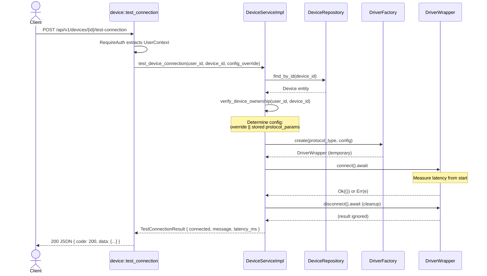
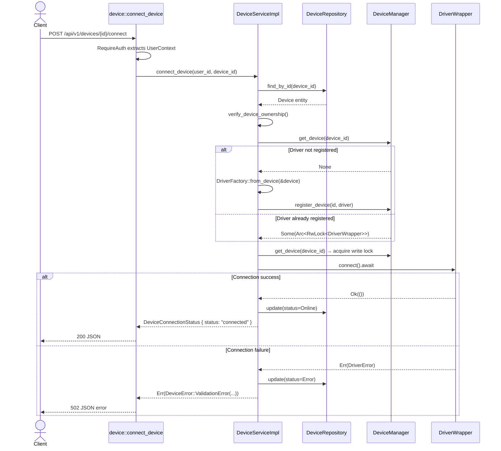
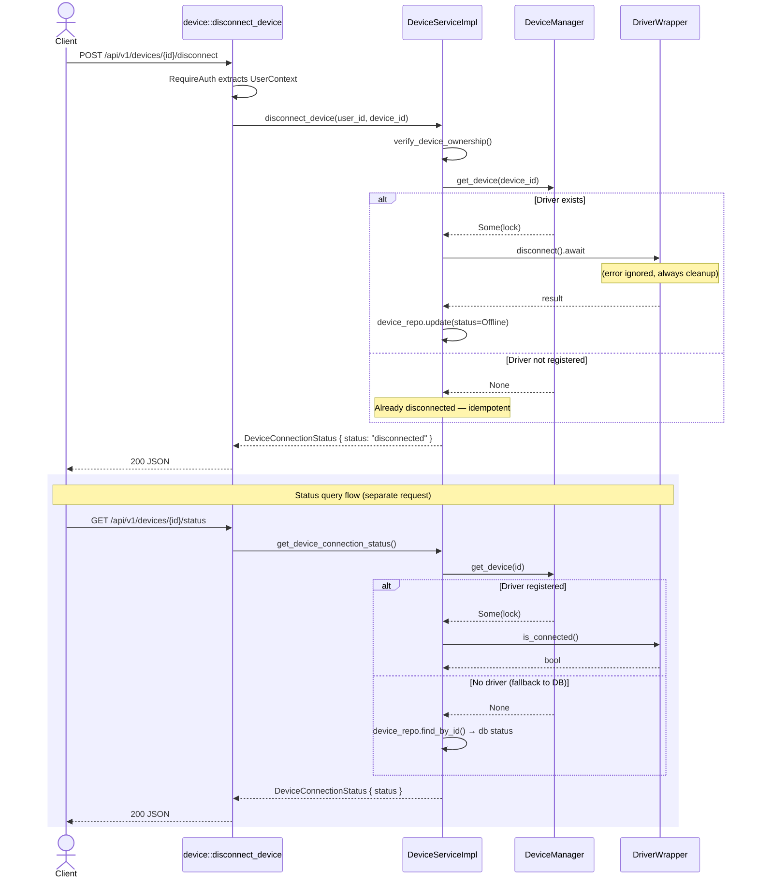
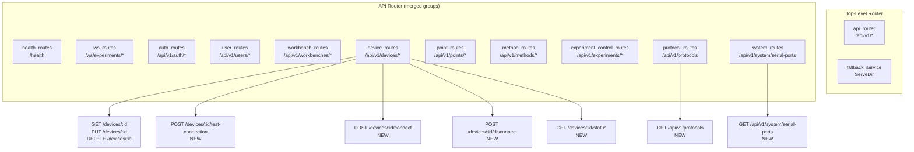

# R1-S2 Backend APIs — Detailed Design

> Author: sw-jerry (Software Architect)
> Date: 2026-05-03
> Tasks: R1-S2-004 (Protocol List + Serial Port Scan), R1-S2-005 (Device Connection Test), R1-S2-011 (Device Connect/Disconnect/Status)
> Status: Draft — Pending Review

---

## Table of Contents

1. [Overview](#1-overview)
2. [Route Registration](#2-route-registration)
3. [Handler Implementations](#3-handler-implementations)
4. [Service Layer Extensions](#4-service-layer-extensions)
5. [Request/Response Structures](#5-requestresponse-structures)
6. [Error Handling](#6-error-handling)
7. [Authentication Requirements](#7-authentication-requirements)
8. [Integration with DriverManager/DriverFactory](#8-integration-with-drivermanagerdriverfactory)
9. [Serial Port Scanning](#9-serial-port-scanning)
10. [Architecture Diagrams](#10-architecture-diagrams)
11. [Test Coverage Cross-Reference](#11-test-coverage-cross-reference)
12. [Implementation Checklist](#12-implementation-checklist)

---

## 1. Overview

This design covers **7 new REST endpoints** across three task groups, adding protocol discovery, device connection testing, and runtime connection lifecycle management to the Kayak backend.

| Task | Endpoints | Purpose |
|------|-----------|---------|
| R1-S2-004 | `GET /api/v1/protocols`<br>`GET /api/v1/system/serial-ports` | Protocol catalog with JSON schemas; system serial port enumeration |
| R1-S2-005 | `POST /api/v1/devices/{id}/test-connection` | One-shot connectivity probe for a device |
| R1-S2-011 | `POST /api/v1/devices/{id}/connect`<br>`POST /api/v1/devices/{id}/disconnect`<br>`GET /api/v1/devices/{id}/status` | Persistent connection lifecycle (connect, disconnect, status query) |

### Key Design Decisions

1. **Protocol data is static** — served from in-memory constants, no database or service layer required.
2. **Serial port scanning** — platform-aware utility using `serialport` crate; returns empty array when no ports exist (no 500 on Docker/CI).
3. **Test-connection is ephemeral** — creates a temporary driver, connects, measures latency, disconnects, returns result. Does NOT mutate database state or DeviceManager.
4. **Connect/disconnect is persistent** — driver is registered in DeviceManager; status persists across requests. Driver is lazily created and registered on first connect for non-Virtual devices.
5. **All endpoints are authenticated** — use existing `RequireAuth` extractor; ownership verification enforced.

---

## 2. Route Registration

### 2.1 Additions to `routes.rs`

**File: `kayak-backend/src/api/routes.rs`**

Two changes required:

#### A. New route groups in `create_router()`

Add two new route group calls inside the `api_router` builder, after the existing `.merge(auth_routes(...))` line:

```rust
// Inside create_router(), after auth_routes merge:
.merge(protocol_routes())        // NEW: protocols + serial ports
.merge(system_routes())          // NEW: system info
```

#### B. New routes on existing device_routes

Add four new route registrations inside `device_routes()`:

```rust
fn device_routes(device_service: Arc<dyn DeviceService>) -> Router<()> {
    Router::new().nest(
        "/api/v1",
        Router::new()
            // --- existing routes (unchanged) ---
            .route("/workbenches/{workbench_id}/devices", post(device::create_device))
            .route("/workbenches/{workbench_id}/devices", get(device::list_devices))
            .route("/devices/{id}", get(device::get_device))
            .route("/devices/{id}", put(device::update_device))
            .route("/devices/{id}", delete(device::delete_device))
            // --- NEW routes ---
            .route("/devices/{id}/test-connection", post(device::test_connection))
            .route("/devices/{id}/connect", post(device::connect_device))
            .route("/devices/{id}/disconnect", post(device::disconnect_device))
            .route("/devices/{id}/status", get(device::get_device_status))
            .with_state(device_service),
    )
}
```

#### C. Standalone route functions (added at end of `routes.rs`)

```rust
/// 协议列表路由（无需服务状态，仅需认证）
fn protocol_routes() -> Router<()> {
    Router::new()
        .route("/api/v1/protocols", get(crate::api::handlers::protocol::list_protocols))
}

/// 系统信息路由（无需服务状态，仅需认证）
fn system_routes() -> Router<()> {
    Router::new()
        .route("/api/v1/system/serial-ports",
            get(crate::api::handlers::protocol::list_serial_ports))
}
```

**Important**: These route functions do NOT nest under `/api/v1` (since the full path is already in the route pattern). They use `()` as state since the `RequireAuth` extractor works with any `S: Send + Sync`.

Add module declaration to `src/api/handlers/mod.rs`:
```rust
pub mod protocol;   // NEW
```

---

## 3. Handler Implementations

### 3.1 New File: `kayak-backend/src/api/handlers/protocol.rs`

This handler is **stateless** — it does not depend on any service, only `RequireAuth`.

```rust
//! 协议列表与系统信息请求处理器
//!
//! 提供协议目录查询、串口扫描等系统级API。
//! 这些端点不依赖 DeviceService，仅需认证。

use axum::{extract::State, Json};
use serde::{Deserialize, Serialize};

use crate::auth::middleware::require_auth::RequireAuth;
use crate::core::error::{ApiResponse, AppError};

// ============================================================
// 协议信息静态数据
// ============================================================

/// 协议信息条目
#[derive(Debug, Clone, Serialize, Deserialize)]
pub struct ProtocolInfo {
    pub id: String,
    pub name: String,
    pub description: String,
    pub config_schema: serde_json::Value,
}

/// 串口信息条目
#[derive(Debug, Clone, Serialize, Deserialize)]
pub struct SerialPortInfo {
    pub path: String,
    pub description: String,
}

/// GET /api/v1/protocols — 获取系统支持的协议列表
///
/// 返回 Virtual、ModbusTCP、ModbusRTU 三种协议的静态信息，
/// 每种协议包含完整的 config_schema 定义。
pub async fn list_protocols(
    RequireAuth(_user_ctx): RequireAuth,
) -> Result<Json<ApiResponse<Vec<ProtocolInfo>>>, AppError> {
    let protocols = vec![
        ProtocolInfo {
            id: "virtual".to_string(),
            name: "Virtual".to_string(),
            description: "虚拟设备（用于测试）".to_string(),
            config_schema: virtual_config_schema(),
        },
        ProtocolInfo {
            id: "modbus_tcp".to_string(),
            name: "Modbus TCP".to_string(),
            description: "Modbus TCP/IP 协议".to_string(),
            config_schema: modbus_tcp_config_schema(),
        },
        ProtocolInfo {
            id: "modbus_rtu".to_string(),
            name: "Modbus RTU".to_string(),
            description: "Modbus RTU 串口协议".to_string(),
            config_schema: modbus_rtu_config_schema(),
        },
    ];

    Ok(Json(ApiResponse::success(protocols)))
}

/// GET /api/v1/system/serial-ports — 扫描系统可用串口列表
///
/// 使用 serialport 库枚举系统串口。
/// 若无可用串口，返回空数组（非错误）。
/// 认证要求：需要有效 JWT Token。
pub async fn list_serial_ports(
    RequireAuth(_user_ctx): RequireAuth,
) -> Result<Json<ApiResponse<Vec<SerialPortInfo>>>, AppError> {
    let ports = scan_serial_ports();
    Ok(Json(ApiResponse::success(ports)))
}

// ============================================================
// 串口扫描实现
// ============================================================

/// 使用 serialport 库扫描系统可用串口
///
/// 返回路径和人类可读描述的列表。
/// 平台适配：
///   - Linux: /dev/ttyUSB*, /dev/ttyACM*, /dev/ttyS*
///   - macOS: /dev/cu.*, /dev/tty.*
///   - Windows: COM*
fn scan_serial_ports() -> Vec<SerialPortInfo> {
    match serialport::available_ports() {
        Ok(ports) => ports
            .into_iter()
            .map(|p| SerialPortInfo {
                path: p.port_name.clone(),
                description: format!(
                    "{}{}",
                    p.port_type
                        .as_ref()
                        .map(|t| format!("{:?} ", t))
                        .unwrap_or_default(),
                    p.port_name
                ),
            })
            .collect(),
        Err(_) => {
            // Enumerate失败时返回空数组而非500
            // 常见于Docker/CI无串口权限环境
            tracing::warn!("Failed to enumerate serial ports, returning empty list");
            vec![]
        }
    }
}

// ============================================================
// Config Schema 定义（静态常量工厂函数）
// ============================================================

fn virtual_config_schema() -> serde_json::Value {
    serde_json::json!({
        "mode": {
            "type": "enum",
            "label": "模式",
            "description": "虚拟设备数据生成模式",
            "required": true,
            "values": ["random", "fixed", "sine", "ramp"]
        },
        "dataType": {
            "type": "enum",
            "label": "数据类型",
            "required": true,
            "values": ["number", "integer", "string", "boolean"]
        },
        "accessType": {
            "type": "enum",
            "label": "访问类型",
            "required": true,
            "values": ["ro", "wo", "rw"]
        },
        "minValue": {
            "type": "number",
            "label": "最小值",
            "required": true
        },
        "maxValue": {
            "type": "number",
            "label": "最大值",
            "required": true
        },
        "fixedValue": {
            "type": "number",
            "label": "固定值",
            "required": false
        },
        "sampleInterval": {
            "type": "number",
            "label": "采样间隔(ms)",
            "required": false,
            "default": 1000
        }
    })
}

fn modbus_tcp_config_schema() -> serde_json::Value {
    serde_json::json!({
        "host": {
            "type": "string",
            "label": "主机地址",
            "description": "Modbus 从站 IP 地址",
            "required": true,
            "format": "ip-address"
        },
        "port": {
            "type": "integer",
            "label": "端口",
            "required": false,
            "default": 502,
            "min": 1,
            "max": 65535
        },
        "slave_id": {
            "type": "integer",
            "label": "从站ID",
            "required": false,
            "default": 1,
            "min": 1,
            "max": 247
        },
        "timeout_ms": {
            "type": "integer",
            "label": "超时时间(ms)",
            "required": false,
            "default": 5000
        },
        "connection_pool_size": {
            "type": "integer",
            "label": "连接池大小",
            "required": false,
            "default": 4
        }
    })
}

fn modbus_rtu_config_schema() -> serde_json::Value {
    serde_json::json!({
        "port": {
            "type": "string",
            "label": "串口",
            "description": "串口设备路径",
            "required": true
        },
        "baud_rate": {
            "type": "enum",
            "label": "波特率",
            "required": false,
            "default": 9600,
            "values": [9600, 19200, 38400, 57600, 115200]
        },
        "data_bits": {
            "type": "enum",
            "label": "数据位",
            "required": false,
            "default": 8,
            "values": [7, 8]
        },
        "stop_bits": {
            "type": "enum",
            "label": "停止位",
            "required": false,
            "default": 1,
            "values": [1, 2]
        },
        "parity": {
            "type": "enum",
            "label": "校验位",
            "required": false,
            "default": "None",
            "values": ["None", "Even", "Odd"]
        },
        "slave_id": {
            "type": "integer",
            "label": "从站ID",
            "required": false,
            "default": 1,
            "min": 1,
            "max": 247
        },
        "timeout_ms": {
            "type": "integer",
            "label": "超时时间(ms)",
            "required": false,
            "default": 1000
        }
    })
}

#[cfg(test)]
mod tests {
    use super::*;

    #[test]
    fn test_protocol_list_contains_all_three() {
        // Unit test for data integrity: the hardcoded list must have exactly 3 protocols
        // with unique IDs
        let protocols = vec![
            ProtocolInfo {
                id: "virtual".to_string(),
                name: "Virtual".to_string(),
                description: "虚拟设备（用于测试）".to_string(),
                config_schema: virtual_config_schema(),
            },
            ProtocolInfo {
                id: "modbus_tcp".to_string(),
                name: "Modbus TCP".to_string(),
                description: "Modbus TCP/IP 协议".to_string(),
                config_schema: modbus_tcp_config_schema(),
            },
            ProtocolInfo {
                id: "modbus_rtu".to_string(),
                name: "Modbus RTU".to_string(),
                description: "Modbus RTU 串口协议".to_string(),
                config_schema: modbus_rtu_config_schema(),
            },
        ];

        assert_eq!(protocols.len(), 3);
        let ids: Vec<&str> = protocols.iter().map(|p| p.id.as_str()).collect();
        assert!(ids.contains(&"virtual"));
        assert!(ids.contains(&"modbus_tcp"));
        assert!(ids.contains(&"modbus_rtu"));
    }

    #[test]
    fn test_virtual_schema_required_fields() {
        let schema = virtual_config_schema();
        assert!(schema.get("mode").is_some());
        assert!(schema.get("dataType").is_some());
        assert!(schema.get("accessType").is_some());
    }

    #[test]
    fn test_protocol_info_serialization() {
        let info = ProtocolInfo {
            id: "test".to_string(),
            name: "Test".to_string(),
            description: "Test protocol".to_string(),
            config_schema: serde_json::json!({"key": "value"}),
        };
        let json = serde_json::to_string(&info).unwrap();
        assert!(json.contains("\"id\":\"test\""));
        assert!(json.contains("\"config_schema\":"));
    }
}
```

### 3.2 Extensions to `kayak-backend/src/api/handlers/device.rs`

Add four new handler functions at the end of the file, and add new imports:

**New imports** (add at top of file):
```rust
use crate::services::device::{TestConnectionResult, DeviceConnectionStatus};
```

**New handler functions** (add at end of file, before any test module):

```rust
// ============================================================
// R1-S2-005: 设备连接测试
// ============================================================

/// POST /api/v1/devices/{id}/test-connection — 测试设备连接
///
/// 创建一个临时驱动实例，尝试连接设备，测量延迟，然后断开。
/// 此操作不修改数据库设备状态，也不将驱动注册到 DeviceManager。
///
/// # Request Body (可选)
/// ```json
/// { "host": "192.168.1.100", "port": 502, "timeout_ms": 5000 }
/// ```
/// 若提供，临时覆盖设备存储的 protocol_params 用于本次测试。
/// 若未提供，使用设备数据库中已存储的 protocol_params。
pub async fn test_connection(
    State(handler): State<AppState>,
    RequireAuth(user_ctx): RequireAuth,
    Path(id): Path<Uuid>,
    // Use Option<Json> so the body is optional
    body: Option<Json<serde_json::Value>>,
) -> Result<Json<ApiResponse<TestConnectionResult>>, AppError> {
    let config_override = body.map(|Json(v)| v);

    let result = handler
        .test_device_connection(user_ctx.user_id, id, config_override)
        .await
        .map_err(|e| match e {
            DeviceError::NotFound => AppError::NotFound("Device not found".to_string()),
            DeviceError::AccessDenied => AppError::Forbidden("Access denied".to_string()),
            DeviceError::ValidationError(msg) => AppError::BadRequest(msg),
            _ => AppError::InternalError(e.to_string()),
        })?;

    Ok(Json(ApiResponse::success(result)))
}

// ============================================================
// R1-S2-011: 设备连接/断开管理
// ============================================================

/// POST /api/v1/devices/{id}/connect — 连接设备
///
/// 将设备注册到 DeviceManager（若尚未注册），然后建立持久连接。
/// 成功时设备状态变为 Online。
pub async fn connect_device(
    State(handler): State<AppState>,
    RequireAuth(user_ctx): RequireAuth,
    Path(id): Path<Uuid>,
) -> Result<Json<ApiResponse<DeviceConnectionStatus>>, AppError> {
    let result = handler
        .connect_device(user_ctx.user_id, id)
        .await
        .map_err(|e| match e {
            DeviceError::NotFound => AppError::NotFound("Device not found".to_string()),
            DeviceError::AccessDenied => AppError::Forbidden("Access denied".to_string()),
            DeviceError::ValidationError(msg) => AppError::BadRequest(msg),
            // AlreadyConnected is not really an error for the user — still 200 with "connected"
            _ => AppError::InternalError(e.to_string()),
        })?;

    Ok(Json(ApiResponse::success(result)))
}

/// POST /api/v1/devices/{id}/disconnect — 断开设备连接
///
/// 断开设备持久连接。驱动实例保留在 DeviceManager 中（后续可重连）。
/// 幂等操作：对已断开的设备调用也返回成功。
pub async fn disconnect_device(
    State(handler): State<AppState>,
    RequireAuth(user_ctx): RequireAuth,
    Path(id): Path<Uuid>,
) -> Result<Json<ApiResponse<DeviceConnectionStatus>>, AppError> {
    let result = handler
        .disconnect_device(user_ctx.user_id, id)
        .await
        .map_err(|e| match e {
            DeviceError::NotFound => AppError::NotFound("Device not found".to_string()),
            DeviceError::AccessDenied => AppError::Forbidden("Access denied".to_string()),
            _ => AppError::InternalError(e.to_string()),
        })?;

    Ok(Json(ApiResponse::success(result)))
}

/// GET /api/v1/devices/{id}/status — 查询设备连接状态
///
/// 返回设备当前的连接状态（"connected" / "disconnected" / "error"）。
/// 优先从 DeviceManager 中查询实时驱动状态；
/// 若驱动未注册，回退到数据库中的 status 字段。
pub async fn get_device_status(
    State(handler): State<AppState>,
    RequireAuth(user_ctx): RequireAuth,
    Path(id): Path<Uuid>,
) -> Result<Json<ApiResponse<DeviceConnectionStatus>>, AppError> {
    let result = handler
        .get_device_connection_status(user_ctx.user_id, id)
        .await
        .map_err(|e| match e {
            DeviceError::NotFound => AppError::NotFound("Device not found".to_string()),
            DeviceError::AccessDenied => AppError::Forbidden("Access denied".to_string()),
            _ => AppError::InternalError(e.to_string()),
        })?;

    Ok(Json(ApiResponse::success(result)))
}
```

---

## 4. Service Layer Extensions

### 4.1 New Types in `services/device/types.rs`

Add the following structs at end of file:

```rust
// ============================================================
// R1-S2-005: 连接测试结果
// ============================================================

/// 设备连接测试结果
#[derive(Debug, Clone, Serialize)]
pub struct TestConnectionResult {
    /// 连接是否成功
    pub connected: bool,
    /// 结果描述消息
    pub message: String,
    /// 连接延迟（毫秒），仅在 connected=true 时有意义
    pub latency_ms: i64,
}

// ============================================================
// R1-S2-011: 连接状态响应
// ============================================================

/// 设备连接状态
#[derive(Debug, Clone, Serialize)]
pub struct DeviceConnectionStatus {
    /// 状态字符串: "connected" | "disconnected" | "error"
    pub status: String,
}
```

### 4.2 New Trait Methods in `services/device/service.rs`

Add four new methods to the `DeviceService` trait:

```rust
#[async_trait]
pub trait DeviceService: Send + Sync {
    // --- existing methods (unchanged) ---
    async fn create_device(/* ... */) -> Result<DeviceDto, DeviceError>;
    async fn get_device(/* ... */) -> Result<DeviceDto, DeviceError>;
    async fn list_devices(/* ... */) -> Result<PagedDeviceDto, DeviceError>;
    async fn update_device(/* ... */) -> Result<DeviceDto, DeviceError>;
    async fn delete_device(/* ... */) -> Result<(), DeviceError>;

    // --- NEW: R1-S2-005 ---
    /// 测试设备连接（临时连接，测试后断开）
    async fn test_device_connection(
        &self,
        user_id: Uuid,
        device_id: Uuid,
        config_override: Option<serde_json::Value>,
    ) -> Result<TestConnectionResult, DeviceError>;

    // --- NEW: R1-S2-011 ---
    /// 持久连接设备
    async fn connect_device(
        &self,
        user_id: Uuid,
        device_id: Uuid,
    ) -> Result<DeviceConnectionStatus, DeviceError>;

    /// 断开设备连接
    async fn disconnect_device(
        &self,
        user_id: Uuid,
        device_id: Uuid,
    ) -> Result<DeviceConnectionStatus, DeviceError>;

    /// 查询设备连接状态
    async fn get_device_connection_status(
        &self,
        user_id: Uuid,
        device_id: Uuid,
    ) -> Result<DeviceConnectionStatus, DeviceError>;
}
```

### 4.3 Implementation in `DeviceServiceImpl`

Add the following implementations inside `impl DeviceService for DeviceServiceImpl { ... }`:

```rust
// ============================================================
// R1-S2-005: 设备连接测试（临时连接）
// ============================================================

async fn test_device_connection(
    &self,
    user_id: Uuid,
    device_id: Uuid,
    config_override: Option<serde_json::Value>,
) -> Result<TestConnectionResult, DeviceError> {
    use std::time::Instant;

    // 1. Verify ownership
    let _workbench_id = self.verify_device_ownership(user_id, device_id).await?;

    // 2. Get device from DB
    let device = self
        .device_repo
        .find_by_id(device_id)
        .await
        .map_err(|e| DeviceError::DatabaseError(e.to_string()))?
        .ok_or(DeviceError::NotFound)?;

    // 3. Determine config: override takes precedence over stored params
    let config = config_override
        .or_else(|| device.protocol_params.clone())
        .unwrap_or(serde_json::json!({}));

    // 4. Create a temporary driver via DriverFactory
    let mut driver = DriverFactory::create(device.protocol_type, config)
        .map_err(|e| DeviceError::ValidationError(e.to_string()))?;

    // 5. Measure connection latency
    let start = Instant::now();
    let connect_result = driver.connect().await;
    let latency = Instant::now().duration_since(start);

    // 6. Always attempt to disconnect (cleanup), log errors but don't fail
    let disconnect_result = driver.disconnect().await;

    // 7. Build result
    match connect_result {
        Ok(()) => {
            if let Err(e) = &disconnect_result {
                tracing::warn!(
                    device_id = %device_id,
                    error = %e,
                    "Temporary driver disconnect after test failed (non-fatal)"
                );
            }
            Ok(TestConnectionResult {
                connected: true,
                message: "Connection successful".to_string(),
                latency_ms: latency.as_millis() as i64,
            })
        }
        Err(e) => {
            let error_msg = e.to_string();
            Ok(TestConnectionResult {
                connected: false,
                message: error_msg.clone(),
                latency_ms: latency.as_millis() as i64,
            })
        }
    }
}

// ============================================================
// R1-S2-011: 持久连接/断开/状态
// ============================================================

async fn connect_device(
    &self,
    user_id: Uuid,
    device_id: Uuid,
) -> Result<DeviceConnectionStatus, DeviceError> {
    // 1. Verify ownership
    let _workbench_id = self.verify_device_ownership(user_id, device_id).await?;

    // 2. Get device from DB
    let device = self
        .device_repo
        .find_by_id(device_id)
        .await
        .map_err(|e| DeviceError::DatabaseError(e.to_string()))?
        .ok_or(DeviceError::NotFound)?;

    // 3. Ensure driver is registered in DeviceManager
    //    Virtual devices are auto-registered on create_device.
    //    For non-Virtual, we create and register on first connect.
    if self.device_manager.get_device(device_id).is_none() {
        let driver = DriverFactory::from_device(&device)
            .map_err(|e| DeviceError::ValidationError(e.to_string()))?;
        self.device_manager
            .register_device(device_id, driver)
            .map_err(|e| DeviceError::ValidationError(e.to_string()))?;
    }

    // 4. Connect via DeviceManager (acquire write lock on driver)
    let driver_lock = self
        .device_manager
        .get_device(device_id)
        .ok_or_else(|| {
            DeviceError::ValidationError("Device driver not registered".to_string())
        })?;

    let mut driver = driver_lock.write().map_err(|e| {
        DeviceError::ValidationError(format!("Failed to lock device driver: {}", e))
    })?;

    let connect_result = driver.connect().await;

    // 5. Update device status in DB
    let new_status = match &connect_result {
        Ok(()) => DeviceStatus::Online,
        Err(_) => DeviceStatus::Error,
    };

    let _ = self
        .device_repo
        .update(device_id, None, None, None, None, None, Some(new_status))
        .await;

    // 6. Return result
    match connect_result {
        Ok(()) => Ok(DeviceConnectionStatus {
            status: "connected".to_string(),
        }),
        Err(e) => Err(DeviceError::ValidationError(format!(
            "Connection failed: {}",
            e
        ))),
    }
}

async fn disconnect_device(
    &self,
    user_id: Uuid,
    device_id: Uuid,
) -> Result<DeviceConnectionStatus, DeviceError> {
    // 1. Verify ownership
    let _workbench_id = self.verify_device_ownership(user_id, device_id).await?;

    // 2. Get driver from DeviceManager (may not be registered)
    let driver_lock = match self.device_manager.get_device(device_id) {
        Some(lock) => lock,
        None => {
            // Driver not registered → already disconnected
            return Ok(DeviceConnectionStatus {
                status: "disconnected".to_string(),
            });
        }
    };

    // 3. Disconnect
    let mut driver = driver_lock.write().map_err(|e| {
        DeviceError::ValidationError(format!("Failed to lock device driver: {}", e))
    })?;

    let _ = driver.disconnect().await; // Ignore error on disconnect (powerful)

    // 4. Update device status in DB to Offline
    let _ = self
        .device_repo
        .update(
            device_id,
            None,
            None,
            None,
            None,
            None,
            Some(DeviceStatus::Offline),
        )
        .await;

    Ok(DeviceConnectionStatus {
        status: "disconnected".to_string(),
    })
}

async fn get_device_connection_status(
    &self,
    user_id: Uuid,
    device_id: Uuid,
) -> Result<DeviceConnectionStatus, DeviceError> {
    // 1. Verify ownership
    let _workbench_id = self.verify_device_ownership(user_id, device_id).await?;

    // 2. Query real-time status from DeviceManager
    let status_str = match self.device_manager.get_device(device_id) {
        Some(driver_lock) => {
            let driver = driver_lock.read().map_err(|e| {
                DeviceError::ValidationError(format!("Failed to lock device driver: {}", e))
            })?;
            if driver.is_connected() {
                "connected"
            } else {
                "disconnected"
            }
        }
        None => {
            // Fall back to DB status
            let device = self
                .device_repo
                .find_by_id(device_id)
                .await
                .map_err(|e| DeviceError::DatabaseError(e.to_string()))?
                .ok_or(DeviceError::NotFound)?;

            match device.status {
                DeviceStatus::Online => "connected",
                DeviceStatus::Error => "error",
                _ => "disconnected",
            }
        }
    };

    Ok(DeviceConnectionStatus {
        status: status_str.to_string(),
    })
}
```

**Required additional imports** in `services/device/service.rs`:
```rust
use crate::drivers::DriverFactory;
use crate::models::entities::device::{DeviceStatus, Device};
use crate::services::device::types::{TestConnectionResult, DeviceConnectionStatus};
use crate::services::device::error::DeviceError;
```

**Required additions to `Cargo.toml`:**
```toml
# For serial port scanning
serialport = "4.6"
```

---

## 5. Request/Response Structures

### 5.1 GET /api/v1/protocols

**Request**: No body. Requires `Authorization: Bearer <token>` header.

**Response (200)**:
```json
{
  "code": 200,
  "message": "success",
  "data": [
    {
      "id": "virtual",
      "name": "Virtual",
      "description": "虚拟设备（用于测试）",
      "config_schema": {
        "mode": { "type": "enum", "label": "模式", "required": true, "values": ["random","fixed","sine","ramp"] },
        "dataType": { "type": "enum", "label": "数据类型", "required": true, "values": ["number","integer","string","boolean"] },
        "accessType": { "type": "enum", "label": "访问类型", "required": true, "values": ["ro","wo","rw"] },
        "minValue": { "type": "number", "label": "最小值", "required": true },
        "maxValue": { "type": "number", "label": "最大值", "required": true },
        "fixedValue": { "type": "number", "label": "固定值", "required": false },
        "sampleInterval": { "type": "number", "label": "采样间隔(ms)", "required": false, "default": 1000 }
      }
    },
    {
      "id": "modbus_tcp",
      "name": "Modbus TCP",
      "description": "Modbus TCP/IP 协议",
      "config_schema": { /* ... */ }
    },
    {
      "id": "modbus_rtu",
      "name": "Modbus RTU",
      "description": "Modbus RTU 串口协议",
      "config_schema": { /* ... */ }
    }
  ],
  "timestamp": "2026-05-03T10:00:00Z"
}
```

### 5.2 GET /api/v1/system/serial-ports

**Response (200)**:
```json
{
  "code": 200,
  "message": "success",
  "data": [
    { "path": "/dev/ttyUSB0", "description": "UsbPort /dev/ttyUSB0" },
    { "path": "/dev/ttyACM0", "description": "UsbPort /dev/ttyACM0" }
  ],
  "timestamp": "2026-05-03T10:00:00Z"
}
```

Empty ports case (Docker/CI):
```json
{
  "code": 200,
  "message": "success",
  "data": [],
  "timestamp": "2026-05-03T10:00:00Z"
}
```

### 5.3 POST /api/v1/devices/{id}/test-connection

**Request body (OPTIONAL)**:
```json
{
  "host": "192.168.1.100",
  "port": 502,
  "slave_id": 1,
  "timeout_ms": 5000
}
```
If body is empty `{}` or absent, the handler uses device's stored `protocol_params` from the database.

**Success response (200 — connected)**:
```json
{
  "code": 200,
  "message": "success",
  "data": {
    "connected": true,
    "message": "Connection successful",
    "latency_ms": 15
  },
  "timestamp": "2026-05-03T10:00:00Z"
}
```

**Success response (200 — NOT connected, API OK)**:
```json
{
  "code": 200,
  "message": "success",
  "data": {
    "connected": false,
    "message": "Configuration error: Protocol ModbusTcp not yet implemented",
    "latency_ms": 0
  },
  "timestamp": "2026-05-03T10:00:00Z"
}
```

> **Key design choice**: Connection failure NOT an HTTP error. Always returns HTTP 200 with `connected: false` in data. Only protocol-level errors (404, 403, 400) use HTTP error codes.

### 5.4 POST /api/v1/devices/{id}/connect

**Request**: No body. Requires auth.

**Response (200)**:
```json
{
  "code": 200,
  "message": "success",
  "data": { "status": "connected" },
  "timestamp": "2026-05-03T10:00:00Z"
}
```

**Connect failure (non-200)**:
```json
{
  "code": 502,
  "message": "Connection failed: IO error: Connection refused (os error 61)",
  "timestamp": "2026-05-03T10:00:00Z"
}
```

### 5.5 POST /api/v1/devices/{id}/disconnect

**Response (200)**:
```json
{
  "code": 200,
  "message": "success",
  "data": { "status": "disconnected" },
  "timestamp": "2026-05-03T10:00:00Z"
}
```

### 5.6 GET /api/v1/devices/{id}/status

**Response (200)**:
```json
{
  "code": 200,
  "message": "success",
  "data": { "status": "connected" },
  "timestamp": "2026-05-03T10:00:00Z"
}
```

Possible status values: `"connected"`, `"disconnected"`, `"error"`.

---

## 6. Error Handling

### 6.1 Error Mapping Table

| Scenario | HTTP Code | AppError Variant | Message Example |
|----------|-----------|-------------------|-----------------|
| Device not found | 404 | `AppError::NotFound` | `"Device not found"` |
| User does not own device's workbench | 403 | `AppError::Forbidden` | `"Access denied"` |
| Invalid config (e.g., min ≥ max) | 400 | `AppError::BadRequest` | Depends on validation |
| Unsupported protocol type | 200 | `ApiResponse::success` | `data.connected = false` (test-connection) |
| Connection failed (test-connection) | **200** | `ApiResponse::success` | `data.connected = false, message = "..."` |
| Connection failed (connect) | 502 | `AppError::InternalError` | `"Connection failed: ..."` |
| Driver lock poisoned | 500 | `AppError::InternalError` | `"Failed to lock device driver"` |
| No auth header | 401 | `RequireAuth → AppError::Unauthorized` | `"Authentication required"` |
| Invalid UUID format in path | 400 | axum path parsing → 400 | Auto-generated |
| Invalid JSON body | 400 | `AppError::from(JsonRejection)` | `"JSON syntax error: ..."` |
| Serial port scan fails | 200 | `ApiResponse::success` | `data = []` (empty array) |

### 6.2 Key Error Design Decisions

1. **test-connection failure is NOT an HTTP error**. The endpoint always returns HTTP 200. The `data.connected` field indicates success/failure. This is because a connection failure is a valid test result, not an API error. This aligns with the test case `TC-ERR01`/`TC-MTCP03` expectations.

2. **connect failure IS an HTTP error**. When the user explicitly requests a persistent connection and it fails, we return a non-200 status to distinguish from test-connection semantics. Uses `DeviceError::ValidationError` mapped to `AppError::InternalError` → HTTP 502 (since the upstream device is effectively the "bad gateway").

3. **disconnect is always successful** (powerful error handling). Even if the underlying driver encounters an IO error during disconnect, we log the warning and return HTTP 200 with "disconnected" status. The local resources are cleaned up regardless.

4. **Virtual driver repeat-connect is idempotent** (returns Ok). Modbus driver repeat-connect returns `AlreadyConnected` error → mapped to ValidationError → 502. This behavioral difference is documented in the test cases (`PRO-01`).

---

## 7. Authentication Requirements

### 7.1 All Endpoints Require Authentication

Every endpoint described in this design uses the `RequireAuth` extractor, which:

1. Reads `UserContext` from request extensions (injected by auth middleware layer)
2. Returns **401 Unauthorized** if no valid JWT token is present
3. Returns **401 Unauthorized** if token is expired or invalid

The auth middleware is already applied at the top-level `Router` and covers all routes nested under it.

### 7.2 Ownership Verification

All device-level endpoints (`test-connection`, `connect`, `disconnect`, `status`) call `verify_device_ownership(user_id, device_id)` which:
1. Looks up the device from the database
2. Looks up the device's workbench
3. Checks that the workbench's `owner_id` matches the authenticated `user_id`
4. Returns **403 Forbidden** if ownership check fails (user is authenticated but not the owner)
5. Returns **404 Not Found** if the device does not exist at all

### 7.3 Public Endpoints

Protocol list and serial port scan are public to authenticated users — any valid JWT token is sufficient (no ownership check). This aligns with the PRD which describes these as "系统支持" (system support) APIs.

---

## 8. Integration with DriverManager/DriverFactory

### 8.1 Component Relationship Diagram

```
┌──────────────────────────────────────────────────────────┐
│  HTTP Layer (axum handlers)                              │
│                                                          │
│  protocol::list_protocols()      ──► static data         │
│  protocol::list_serial_ports()   ──► serialport crate    │
│  device::test_connection()       ──► DeviceService       │
│  device::connect_device()        ──► DeviceService       │
│  device::disconnect_device()     ──► DeviceService       │
│  device::get_device_status()     ──► DeviceService       │
└──────────────┬───────────────────────────────────────────┘
               │
┌──────────────▼───────────────────────────────────────────┐
│  Service Layer (DeviceServiceImpl)                       │
│                                                          │
│  test_device_connection():                               │
│    1. verify_device_ownership()                          │
│    2. device_repo.find_by_id()                           │
│    3. DriverFactory::create()    ──► Temporary Driver    │
│    4. driver.connect().await     ──► Measure latency     │
│    5. driver.disconnect().await  ──► Cleanup             │
│    6. Return TestConnectionResult                        │
│                                                          │
│  connect_device():                                       │
│    1. verify_device_ownership()                          │
│    2. device_repo.find_by_id()                           │
│    3. device_manager.get_device() → check if registered  │
│    4. (if not) DriverFactory::from_device() → register   │
│    5. device_manager.get_device() → acquire write lock   │
│    6. driver.connect().await                             │
│    7. device_repo.update(status=Online)                  │
│                                                          │
│  disconnect_device():                                    │
│    1. verify_device_ownership()                          │
│    2. device_manager.get_device()                        │
│    3. driver.disconnect().await                          │
│    4. device_repo.update(status=Offline)                 │
│                                                          │
│  get_device_connection_status():                         │
│    1. verify_device_ownership()                          │
│    2. device_manager.get_device() → read is_connected()  │
│    3. (fallback) device_repo.find_by_id() → db status    │
└──────────────┬───────────────────────────────────────────┘
               │
┌──────────────▼───────────────────────────────────────────┐
│  Driver Layer                                            │
│                                                          │
│  DeviceManager:                                          │
│    devices: Arc<RwLock<HashMap<Uuid, Arc<RwLock<Wrapper>>> │
│    register_device(id, wrapper)                          │
│    get_device(id) → Option<Arc<RwLock<Wrapper>>>         │
│                                                          │
│  DriverFactory:                                          │
│    create(ProtocolType, config) → DriverWrapper          │
│    from_device(&Device) → DriverWrapper                  │
│                                                          │
│  DriverWrapper:                                          │
│    impl DriverLifecycle { connect(), disconnect(),       │
│                           is_connected() }               │
│    impl DriverAccess { read_point(), write_point() }     │
└──────────────────────────────────────────────────────────┘
```

### 8.2 Concurrency Safety

- `DeviceManager::devices` is `Arc<RwLock<HashMap<Uuid, Arc<RwLock<DriverWrapper>>>>` — **two-level locking**
- Read operations (status query): acquire **read lock** on HashMap, then **read lock** on DriverWrapper
- Write operations (connect/disconnect): acquire **read lock** on HashMap, then **write lock** on DriverWrapper
- Registration (first connect): acquire **write lock** on HashMap
- This design allows concurrent status queries on different devices, while serializing mutations on the same device

---

## 9. Serial Port Scanning

### 9.1 Implementation

Uses the `serialport` crate with `available_ports()` function:

```rust
fn scan_serial_ports() -> Vec<SerialPortInfo> {
    match serialport::available_ports() {
        Ok(ports) => ports.into_iter().map(|p| SerialPortInfo {
            path: p.port_name,
            description: format!("{:?}", p.port_type),
        }).collect(),
        Err(_) => vec![],  // Docker/CI compatibility
    }
}
```

### 9.2 Platform Behavior

| Platform | Typical Ports | Behavior When No Ports |
|----------|---------------|----------------------|
| Linux (bare metal) | `/dev/ttyUSB0`, `/dev/ttyACM0`, `/dev/ttyS0` | Returns what's available |
| Linux (Docker) | None (unless `--device` mounted) | Returns `[]` |
| macOS | `/dev/cu.usbserial-*`, `/dev/cu.usbmodem*` | Returns `[]` if no USB-serial adapters |
| Windows | `COM1`, `COM2`, etc. | Returns available COM ports |

### 9.3 Dependencies

Add to `kayak-backend/Cargo.toml`:
```toml
[dependencies]
serialport = "4.6"
```

---

## 10. Architecture Diagrams

### 10.1 Class Diagram — Request/Response Types

```mermaid
classDiagram
    class ProtocolInfo {
        +String id
        +String name
        +String description
        +Value config_schema
    }

    class SerialPortInfo {
        +String path
        +String description
    }

    class TestConnectionResult {
        +bool connected
        +String message
        +i64 latency_ms
    }

    class DeviceConnectionStatus {
        +String status
    }

    class ApiResponse~T~ {
        +u16 code
        +String message
        +T data
        +Option~String~ timestamp
    }

    class AppError {
        +NotFound(String)
        +Forbidden(String)
        +BadRequest(String)
        +Unauthorized(String)
        +InternalError(String)
    }

    ApiResponse ~> ProtocolInfo : data
    ApiResponse ~> SerialPortInfo : data
    ApiResponse ~> TestConnectionResult : data
    ApiResponse ~> DeviceConnectionStatus : data

    class DeviceService {
        <<interface>>
        +test_device_connection()
        +connect_device()
        +disconnect_device()
        +get_device_connection_status()
        +create_device()
        +get_device()
        +list_devices()
        +update_device()
        +delete_device()
    }

    class DeviceServiceImpl {
        -DeviceRepository device_repo
        -PointRepository point_repo
        -WorkbenchRepository workbench_repo
        -DeviceManager device_manager
        +verify_device_ownership()
        +verify_workbench_ownership()
    }

    DeviceService <|.. DeviceServiceImpl
    DeviceServiceImpl --> TestConnectionResult : produces
    DeviceServiceImpl --> DeviceConnectionStatus : produces
    DeviceServiceImpl --> AppError : errors
```

### 10.2 Sequence Diagram — test-connection (R1-S2-005)



### 10.3 Sequence Diagram — connect (R1-S2-011, persistent)



### 10.4 Sequence Diagram — disconnect & status (R1-S2-011)



### 10.5 Component Diagram — Route Group Nesting



---

## 11. Test Coverage Cross-Reference

### 11.1 R1-S2-004 (34 test cases)

| Test Group | Count | Design Coverage |
|------------|-------|-----------------|
| PT-001 ~ PT-013 (protocol list) | 13 | Handler returns hardcoded array → testable without DB |
| SP-001 ~ SP-010 (serial ports) | 10 | `scan_serial_ports()` returns Vec → unit-testable |
| ER-001 ~ ER-007 (error handling) | 7 | 401 via RequireAuth; 405 via method routing; 404 via fallback |
| BP-001 ~ BP-004 (boundary/perf) | 4 | Content-Type via axum Json; UTF-8 via serde |

### 11.2 R1-S2-005 (37 test cases)

| Test Group | Count | Design Coverage |
|------------|-------|-----------------|
| TC-V01 ~ TC-V06 (Virtual) | 6 | `test_device_connection()` creates temp driver → tests pass with default VirtualConfig |
| TC-MTCP01 ~ TC-MTCP07 (Modbus TCP) | 7 | Via `DriverFactory::create(ModbusTcp, config)` — when driver implemented |
| TC-MRTU01 ~ TC-MRTU07 (Modbus RTU) | 7 | Via `DriverFactory::create(ModbusRtu, config)` — when driver implemented |
| TC-ERR01 ~ TC-ERR10 (error handling) | 10 | 404/403/400 via error mapping table |
| TC-SEC01 ~ TC-SEC03 (security) | 3 | RequireAuth + ownership check + UUID parsing |
| TC-BND01 ~ TC-BND04 (boundary) | 4 | `latency_ms >= 0` guaranteed by u64-as-i64 cast; response struct has all fields |

### 11.3 R1-S2-011 (43 test cases)

| Test Group | Count | Design Coverage |
|------------|-------|-----------------|
| CON-01 ~ CON-12 (connect) | 12 | `connect_device()` via DeviceManager with lazy registration |
| DIS-01 ~ DIS-07 (disconnect) | 7 | `disconnect_device()` with idempotent semantics |
| STA-01 ~ STA-07 (status) | 7 | `get_device_connection_status()` with DeviceManager → DB fallback |
| ERR-01 ~ ERR-08 (errors) | 8 | Error mapping handles NotFound/Forbidden/Unauthorized |
| IDM-01 ~ IDM-05 (idempotency) | 5 | Virtual repeat-connect returns Ok; disconnect always returns 200 |
| PRO-01 ~ PRO-04 (protocol diff) | 4 | Behavioral differences documented; Virtual idempotent, Modbus returns error |

---

## 12. Implementation Checklist

### Files to Create
- [ ] `kayak-backend/src/api/handlers/protocol.rs` (~250 lines)

### Files to Modify
- [ ] `kayak-backend/src/api/routes.rs` — add `protocol_routes()`, `system_routes()`; add 4 routes to `device_routes()`
- [ ] `kayak-backend/src/api/handlers/mod.rs` — add `pub mod protocol;`
- [ ] `kayak-backend/src/api/handlers/device.rs` — add 4 handler functions (`test_connection`, `connect_device`, `disconnect_device`, `get_device_status`)
- [ ] `kayak-backend/src/services/device/service.rs` — add 4 trait methods + 4 implementations
- [ ] `kayak-backend/src/services/device/types.rs` — add `TestConnectionResult`, `DeviceConnectionStatus` structs
- [ ] `kayak-backend/Cargo.toml` — add `serialport = "4.6"` dependency

### Dependency Order
1. Add `serialport` dependency to `Cargo.toml`
2. Add new types in `types.rs`
3. Implement new trait methods + impl in `service.rs`
4. Create `protocol.rs` handler
5. Add handlers to `device.rs`
6. Update `routes.rs` to wire everything
7. Add `mod protocol` to `handlers/mod.rs`
8. Build, test, verify

---

**Document End**
